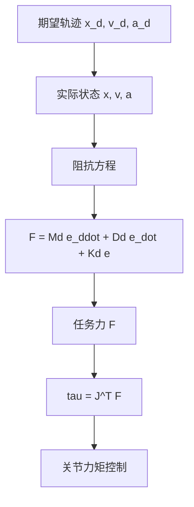

## 概述
阻抗控制是人形机器人领域的重要方法。以下内容整理自项目 Wiki，供深入查阅。

## 核心内容
**阻抗控制（impedance control）**不把位置与力分开控制，而是调节机器人末端表现出的**机械阻抗（mechanical impedance）**——即质量-阻尼-弹簧特性。它把力与位置/速度关系定义为：

$$
\mathbf{F} = \mathbf{M}_d (\ddot{\mathbf{x}}_d - \ddot{\mathbf{x}}) + \mathbf{D}_d (\dot{\mathbf{x}}_d - \dot{\mathbf{x}}) + \mathbf{K}_d (\mathbf{x}_d - \mathbf{x})
$$

其中 \(\mathbf{M}_d\)、\(\mathbf{D}_d\)、\(\mathbf{K}_d\) 分别为期望惯性、阻尼与刚度矩阵。该方程表明：当末端偏离期望轨迹时，机器人会产生与偏离量成比例的恢复力；当受到外部扰动时，机器人会按期望动态响应。

!!! note "术语解释：阻抗控制、机械阻抗、期望惯性、期望阻尼、期望刚度"
    - **阻抗控制（impedance control）**：控制机器人端表现出的质量-阻尼-弹簧特性的方法。
    - **机械阻抗（mechanical impedance）**：力与运动（位移、速度、加速度）之间的动态关系。
    - **期望惯性（desired inertia）\(\mathbf{M}_d\)**：期望的惯性特性矩阵。
    - **期望阻尼（desired damping）\(\mathbf{D}_d\)**：期望的阻尼特性矩阵。
    - **期望刚度（desired stiffness）\(\mathbf{K}_d\)**：期望的刚度特性矩阵。

阻抗控制可分为两类：

1. **力矩级阻抗控制（torque-level impedance）**：直接根据阻抗方程计算期望任务力，再通过 \(\boldsymbol{\tau} = \mathbf{J}^T \mathbf{F}\) 映射到关节力矩。需要力矩控制内环。
2. **位置级阻抗控制（position-level impedance）**：在位置控制外环中加入力-位置关系，通过位置指令间接实现柔顺。实现简单但带宽受限。

!!! note "术语解释：力矩级阻抗、位置级阻抗、力矩控制内环、位置控制外环"
    - **力矩级阻抗（torque-level impedance）**：直接输出关节力矩的阻抗控制。
    - **位置级阻抗（position-level impedance）**：通过位置指令实现柔顺的阻抗控制。
    - **力矩控制内环（torque control inner loop）**：快速控制关节力矩的内部回路。
    - **位置控制外环（position control outer loop）**：生成位置指令的外部回路。

在人形机器人中，阻抗控制可用于：

- **落地缓冲**：脚触地时表现为低刚度-高阻尼，吸收冲击。
- **人机交互**：手臂低刚度保证接触安全。
- **工具使用**：根据任务调整末端阻抗，如拧螺丝时高刚度，开门时中等刚度。

!!! note "术语解释：落地缓冲、人机交互安全、工具使用、刚度调节"
    - **落地缓冲（landing buffering）**：通过柔顺性减小触地冲击。
    - **人机交互安全（HRI safety）**：在人机接触中降低伤害风险。
    - **工具使用（tool use）**：机器人使用工具完成任务。
    - **刚度调节（stiffness regulation）**：根据任务调整系统刚度。



## 参考
- Wiki extraction
- 项目 Wiki：chapter-08.md#阻抗控制

## Overview
Impedance control is an important method in the field of humanoid robots. The following content is compiled from the project Wiki for in-depth reference.

## Content
**Impedance control** does not control position and force separately, but instead regulates the **mechanical impedance** exhibited at the robot's end-effector—namely, the mass-damping-spring characteristics. It defines the relationship between force and position/velocity as:

$$
\mathbf{F} = \mathbf{M}_d (\ddot{\mathbf{x}}_d - \ddot{\mathbf{x}}) + \mathbf{D}_d (\dot{\mathbf{x}}_d - \dot{\mathbf{x}}) + \mathbf{K}_d (\mathbf{x}_d - \mathbf{x})
$$

where \(\mathbf{M}_d\), \(\mathbf{D}_d\), and \(\mathbf{K}_d\) are the desired inertia, damping, and stiffness matrices, respectively. This equation indicates that when the end-effector deviates from the desired trajectory, the robot generates a restoring force proportional to the deviation; when subjected to external disturbances, the robot responds according to the desired dynamics.

!!! note "Terminology: Impedance Control, Mechanical Impedance, Desired Inertia, Desired Damping, Desired Stiffness"
    - **Impedance control**: A method for controlling the mass-damping-spring characteristics exhibited at the robot's end-effector.
    - **Mechanical impedance**: The dynamic relationship between force and motion (displacement, velocity, acceleration).
    - **Desired inertia \(\mathbf{M}_d\)**: The desired inertia characteristic matrix.
    - **Desired damping \(\mathbf{D}_d\)**: The desired damping characteristic matrix.
    - **Desired stiffness \(\mathbf{K}_d\)**: The desired stiffness characteristic matrix.

Impedance control can be divided into two categories:

1. **Torque-level impedance**: Directly calculates the desired task force from the impedance equation, then maps it to joint torques via \(\boldsymbol{\tau} = \mathbf{J}^T \mathbf{F}\). Requires a torque control inner loop.
2. **Position-level impedance**: Adds a force-position relationship to the outer position control loop, achieving compliance indirectly through position commands. Simple to implement but has limited bandwidth.

!!! note "Terminology: Torque-Level Impedance, Position-Level Impedance, Torque Control Inner Loop, Position Control Outer Loop"
    - **Torque-level impedance**: Impedance control that directly outputs joint torques.
    - **Position-level impedance**: Impedance control that achieves compliance through position commands.
    - **Torque control inner loop**: An internal loop for fast control of joint torques.
    - **Position control outer loop**: An external loop that generates position commands.

In humanoid robots, impedance control can be used for:

- **Landing buffering**: Exhibits low stiffness and high damping when the foot contacts the ground to absorb impact.
- **Human-robot interaction**: Low arm stiffness ensures safe contact.
- **Tool use**: Adjusts end-effector impedance according to the task, e.g., high stiffness for screwing, medium stiffness for opening doors.

!!! note "Terminology: Landing Buffering, HRI Safety, Tool Use, Stiffness Regulation"
    - **Landing buffering**: Reducing contact impact through compliance.
    - **HRI safety**: Reducing the risk of injury during human-robot contact.
    - **Tool use**: The robot using tools to complete tasks.
    - **Stiffness regulation**: Adjusting system stiffness according to the task.

```mermaid
flowchart TD
    A["Desired trajectory x_d, v_d, a_d"] --> B["Actual state x, v, a"]
    B --> C["Impedance equation"]
    C --> D["F = Md e_ddot + Dd e_dot + Kd e"]
    D --> E["Task force F"]
    E --> F["tau = J^T F"]
    F --> G["Joint torque control"]

## 개요
임피던스 제어는 휴머노이드 로봇 분야의 중요한 방법입니다. 아래 내용은 프로젝트 Wiki에서 정리한 것으로, 심층적인 참고를 위해 제공됩니다.

## 핵심 내용
**임피던스 제어(impedance control)**는 위치와 힘을 분리하여 제어하지 않고, 로봇 말단이 나타내는 **기계적 임피던스(mechanical impedance)**——즉 질량-감쇠-스프링 특성을 조절합니다. 힘과 위치/속도 관계를 다음과 같이 정의합니다:

$$
\mathbf{F} = \mathbf{M}_d (\ddot{\mathbf{x}}_d - \ddot{\mathbf{x}}) + \mathbf{D}_d (\dot{\mathbf{x}}_d - \dot{\mathbf{x}}) + \mathbf{K}_d (\mathbf{x}_d - \mathbf{x})
$$

여기서 \(\mathbf{M}_d\), \(\mathbf{D}_d\), \(\mathbf{K}_d\)는 각각 기대 관성, 감쇠 및 강성 행렬입니다. 이 방정식은 말단이 기대 궤적에서 벗어날 때 로봇이 벗어난 양에 비례하는 복원력을 생성하며, 외부 교란을 받을 때 로봇이 기대 동특성에 따라 응답함을 나타냅니다.

!!! note "용어 설명: 임피던스 제어, 기계적 임피던스, 기대 관성, 기대 감쇠, 기대 강성"
    - **임피던스 제어(impedance control)**: 로봇 말단이 나타내는 질량-감쇠-스프링 특성을 제어하는 방법.
    - **기계적 임피던스(mechanical impedance)**: 힘과 운동(변위, 속도, 가속도) 사이의 동적 관계.
    - **기대 관성(desired inertia) \(\mathbf{M}_d\)**: 기대되는 관성 특성 행렬.
    - **기대 감쇠(desired damping) \(\mathbf{D}_d\)**: 기대되는 감쇠 특성 행렬.
    - **기대 강성(desired stiffness) \(\mathbf{K}_d\)**: 기대되는 강성 특성 행렬.

임피던스 제어는 두 가지 유형으로 나눌 수 있습니다:

1. **토크 수준 임피던스(torque-level impedance)**: 임피던스 방정식에 따라 직접 기대 작업 힘을 계산한 후, \(\boldsymbol{\tau} = \mathbf{J}^T \mathbf{F}\)를 통해 관절 토크로 매핑합니다. 토크 제어 내부 루프가 필요합니다.
2. **위치 수준 임피던스(position-level impedance)**: 위치 제어 외부 루프에 힘-위치 관계를 추가하여 위치 명령을 통해 간접적으로 순응을 구현합니다. 구현이 간단하지만 대역폭이 제한됩니다.

!!! note "용어 설명: 토크 수준 임피던스, 위치 수준 임피던스, 토크 제어 내부 루프, 위치 제어 외부 루프"
    - **토크 수준 임피던스(torque-level impedance)**: 관절 토크를 직접 출력하는 임피던스 제어.
    - **위치 수준 임피던스(position-level impedance)**: 위치 명령을 통해 순응을 구현하는 임피던스 제어.
    - **토크 제어 내부 루프(torque control inner loop)**: 관절 토크를 빠르게 제어하는 내부 회로.
    - **위치 제어 외부 루프(position control outer loop)**: 위치 명령을 생성하는 외부 회로.

휴머노이드 로봇에서 임피던스 제어는 다음에 사용될 수 있습니다:

- **착지 완충**: 발이 지면에 닿을 때 낮은 강성-높은 감쇠로 나타나 충격을 흡수합니다.
- **인간-로봇 상호작용**: 팔의 낮은 강성으로 접촉 안전을 보장합니다.
- **도구 사용**: 작업에 따라 말단 임피던스를 조정합니다. 예: 나사 조이기 시 높은 강성, 문 열기 시 중간 강성.

!!! note "용어 설명: 착지 완충, 인간-로봇 상호작용 안전, 도구 사용, 강성 조절"
    - **착지 완충(landing buffering)**: 순응성을 통해 착지 충격을 줄입니다.
    - **인간-로봇 상호작용 안전(HRI safety)**: 인간-로봇 접촉 시 부상 위험을 낮춥니다.
    - **도구 사용(tool use)**: 로봇이 도구를 사용하여 작업을 완료합니다.
    - **강성 조절(stiffness regulation)**: 작업에 따라 시스템 강성을 조정합니다.

```mermaid
flowchart TD
    A["기대 궤적 x_d, v_d, a_d"] --> B["실제 상태 x, v, a"]
    B --> C["임피던스 방정식"]
    C --> D["F = Md e_ddot + Dd e_dot + Kd e"]
    D --> E["작업 힘 F"]
    E --> F["tau = J^T F"]
    F --> G["관절 토크 제어"]

## 개요
임피던스 제어는 휴머노이드 로봇 분야의 중요한 방법입니다. 아래 내용은 프로젝트 Wiki에서 정리한 것으로, 심층적인 참고를 위해 제공됩니다.

## 핵심 내용
**임피던스 제어(impedance control)**는 위치와 힘을 분리하여 제어하지 않고, 로봇 말단이 나타내는 **기계적 임피던스(mechanical impedance)**——즉 질량-감쇠-스프링 특성을 조절합니다. 힘과 위치/속도 관계를 다음과 같이 정의합니다:

$$
\mathbf{F} = \mathbf{M}_d (\ddot{\mathbf{x}}_d - \ddot{\mathbf{x}}) + \mathbf{D}_d (\dot{\mathbf{x}}_d - \dot{\mathbf{x}}) + \mathbf{K}_d (\mathbf{x}_d - \mathbf{x})
$$

여기서 \(\mathbf{M}_d\), \(\mathbf{D}_d\), \(\mathbf{K}_d\)는 각각 기대 관성, 감쇠 및 강성 행렬입니다. 이 방정식은 말단이 기대 궤적에서 벗어날 때 로봇이 벗어난 정도에 비례하는 복원력을 생성하며, 외부 교란을 받을 때 로봇이 기대 동역학에 따라 응답함을 나타냅니다.

!!! note "용어 설명: 임피던스 제어, 기계적 임피던스, 기대 관성, 기대 감쇠, 기대 강성"
    - **임피던스 제어(impedance control)**: 로봇 말단이 나타내는 질량-감쇠-스프링 특성을 제어하는 방법.
    - **기계적 임피던스(mechanical impedance)**: 힘과 운동(변위, 속도, 가속도) 사이의 동적 관계.
    - **기대 관성(desired inertia) \(\mathbf{M}_d\)**: 기대되는 관성 특성 행렬.
    - **기대 감쇠(desired damping) \(\mathbf{D}_d\)**: 기대되는 감쇠 특성 행렬.
    - **기대 강성(desired stiffness) \(\mathbf{K}_d\)**: 기대되는 강성 특성 행렬.

임피던스 제어는 두 가지 유형으로 나눌 수 있습니다:

1. **토크 수준 임피던스(torque-level impedance)**: 임피던스 방정식에 따라 직접 기대 작업력을 계산한 후, \(\boldsymbol{\tau} = \mathbf{J}^T \mathbf{F}\)를 통해 관절 토크로 매핑합니다. 토크 제어 내부 루프가 필요합니다.
2. **위치 수준 임피던스(position-level impedance)**: 위치 제어 외부 루프에 힘-위치 관계를 추가하여 위치 명령을 통해 간접적으로 순응을 구현합니다. 구현이 간단하지만 대역폭이 제한됩니다.

!!! note "용어 설명: 토크 수준 임피던스, 위치 수준 임피던스, 토크 제어 내부 루프, 위치 제어 외부 루프"
    - **토크 수준 임피던스(torque-level impedance)**: 관절 토크를 직접 출력하는 임피던스 제어.
    - **위치 수준 임피던스(position-level impedance)**: 위치 명령을 통해 순응을 구현하는 임피던스 제어.
    - **토크 제어 내부 루프(torque control inner loop)**: 관절 토크를 빠르게 제어하는 내부 회로.
    - **위치 제어 외부 루프(position control outer loop)**: 위치 명령을 생성하는 외부 회로.

휴머노이드 로봇에서 임피던스 제어는 다음에 사용될 수 있습니다:

- **착지 완충**: 발이 지면에 닿을 때 낮은 강성-높은 감쇠로 나타나 충격을 흡수합니다.
- **인간-로봇 상호작용**: 팔의 낮은 강성으로 접촉 안전성을 보장합니다.
- **도구 사용**: 작업에 따라 말단 임피던스를 조정합니다. 예를 들어 나사 조이기에서는 높은 강성, 문 열기에서는 중간 강성을 사용합니다.

!!! note "용어 설명: 착지 완충, 인간-로봇 상호작용 안전, 도구 사용, 강성 조절"
    - **착지 완충(landing buffering)**: 순응성을 통해 착지 충격을 줄입니다.
    - **인간-로봇 상호작용 안전(HRI safety)**: 인간-로봇 접촉 시 부상 위험을 낮춥니다.
    - **도구 사용(tool use)**: 로봇이 도구를 사용하여 작업을 수행합니다.
    - **강성 조절(stiffness regulation)**: 작업에 따라 시스템 강성을 조정합니다.

```mermaid
flowchart TD
    A["기대 궤적 x_d, v_d, a_d"] --> B["실제 상태 x, v, a"]
    B --> C["임피던스 방정식"]
    C --> D["F = Md e_ddot + Dd e_dot + Kd e"]
    D --> E["작업력 F"]
    E --> F["tau = J^T F"]
    F --> G["관절 토크 제어"]
