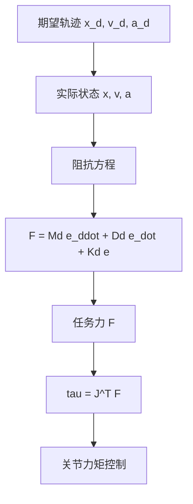

## 概述
阻抗控制是人形机器人领域的重要method。以下内容整理自项目 Wiki，供深入查阅。

## 核心内容
**阻抗控制（impedance control）**不把位置与力分开控制，而是调节机器人末端表现出的**机械阻抗（mechanical impedance）**——即质量-阻尼-弹簧特性。它把力与位置/速度关系定义为：

$$
\mathbf{F} = \mathbf{M}_d (\ddot{\mathbf{x}}_d - \ddot{\mathbf{x}}) + \mathbf{D}_d (\dot{\mathbf{x}}_d - \dot{\mathbf{x}}) + \mathbf{K}_d (\mathbf{x}_d - \mathbf{x})
$$

其中 \(\mathbf{M}_d\)、\(\mathbf{D}_d\)、\(\mathbf{K}_d\) 分别为期望惯性、阻尼与刚度矩阵。该方程表明：当末端偏离期望轨迹时，机器人会产生与偏离量成比例的恢复力；当受到外部扰动时，机器人会按期望动态响应。

!!! note "术语解释：阻抗控制、机械阻抗、期望惯性、期望阻尼、期望刚度"
    - **阻抗控制（impedance control）**：控制机器人端表现出的质量-阻尼-弹簧特性的方法。
    - **机械阻抗（mechanical impedance）**：力与运动（位移、速度、加速度）之间的动态关系。
    - **期望惯性（desired inertia）\(\mathbf{M}_d\)**：期望的惯性特性矩阵。
    - **期望阻尼（desired damping）\(\mathbf{D}_d\)**：期望的阻尼特性矩阵。
    - **期望刚度（desired stiffness）\(\mathbf{K}_d\)**：期望的刚度特性矩阵。

阻抗控制可分为两类：

1. **力矩级阻抗控制（torque-level impedance）**：直接根据阻抗方程计算期望任务力，再通过 \(\boldsymbol{\tau} = \mathbf{J}^T \mathbf{F}\) 映射到关节力矩。需要力矩控制内环。
2. **位置级阻抗控制（position-level impedance）**：在位置控制外环中加入力-位置关系，通过位置指令间接实现柔顺。实现简单但带宽受限。

!!! note "术语解释：力矩级阻抗、位置级阻抗、力矩控制内环、位置控制外环"
    - **力矩级阻抗（torque-level impedance）**：直接输出关节力矩的阻抗控制。
    - **位置级阻抗（position-level impedance）**：通过位置指令实现柔顺的阻抗控制。
    - **力矩控制内环（torque control inner loop）**：快速控制关节力矩的内部回路。
    - **位置控制外环（position control outer loop）**：生成位置指令的外部回路。

在人形机器人中，阻抗控制可用于：

- **落地缓冲**：脚触地时表现为低刚度-高阻尼，吸收冲击。
- **人机交互**：手臂低刚度保证接触安全。
- **工具使用**：根据任务调整末端阻抗，如拧螺丝时高刚度，开门时中等刚度。

!!! note "术语解释：落地缓冲、人机交互安全、工具使用、刚度调节"
    - **落地缓冲（landing buffering）**：通过柔顺性减小触地冲击。
    - **人机交互安全（HRI safety）**：在人机接触中降低伤害风险。
    - **工具使用（tool use）**：机器人使用工具完成任务。
    - **刚度调节（stiffness regulation）**：根据任务调整系统刚度。

## 参考
- Wiki extraction
- 项目 Wiki：chapter-08.md#阻抗控制

