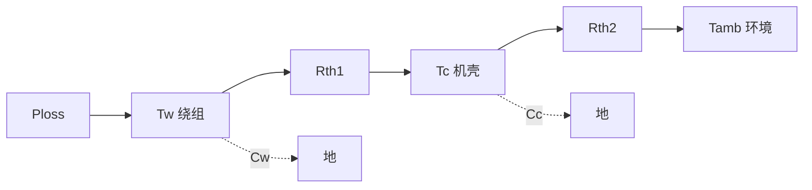

## 概述
热仿真是人形机器人领域的重要method。以下内容整理自项目 Wiki，供深入查阅。

## 核心内容
单节点模型只能给出绕组到环境的平均温升，无法解释短时峰值期间“绕组先热、外壳后热”的暂态行为。更精细的模型把电机分成两个热节点：**绕组节点** \(T_w\) 与**机壳节点** \(T_c\)，两者之间用热阻 \(R_{th1}\) 和热容 \(C_w\) 描述，机壳到环境再用 \(R_{th2}\) 与 \(C_c\) 描述，如图 4.2(c) 所示。

\[
\begin{aligned}
C_w \frac{dT_w}{dt} &= P_{\text{loss}} - \frac{T_w - T_c}{R_{th1}} \\
C_c \frac{dT_c}{dt} &= \frac{T_w - T_c}{R_{th1}} - \frac{T_c - T_{\text{amb}}}{R_{th2}}
\end{aligned}
\]

两节点模型能更准确地预测短时过载：由于绕组热容 \(C_w\) 的存在，一个持续数秒的电流尖峰只会使 \(T_w\) 瞬时上升，而机壳温度 \(T_c\) 几乎不变；因此峰值转矩可以远高于连续转矩。只有当过载持续时间与绕组热时间常数相当时，才需要担心绝缘过热。

!!! note "术语解释：两节点热网络、热阻、热容、暂态热阻抗、热时间常数"
    - **两节点热网络（two-node thermal network）**：把电机简化为绕组与机壳两个热节点的集总参数热模型。
    - **热阻（thermal resistance, \(R_{th}\)）**：热量传递路径对温升的阻力，单位 K/W。
    - **热容（thermal capacitance, \(C_{th}\)）**：物体储存热能的能力，决定温度变化的快慢，单位 J/K。
    - **暂态热阻抗（transient thermal impedance）**：随时间变化的有效热阻，\(Z_{th}(t)=\Delta T(t)/P\)，用于评估短时过载。
    - **热时间常数（thermal time constant, \(\tau_{th}=R_{th}C_{th}\)）**：温度达到 63% 稳态温升所需的时间。

## 参考
- Wiki extraction
- 项目 Wiki：chapter-04.md#两节点热网络模型

