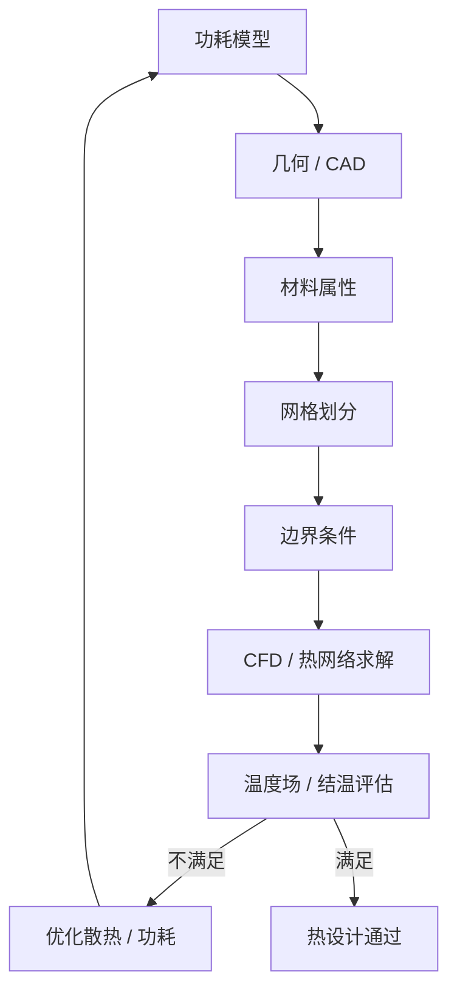

### 6.7.3 整机功率与热仿真思路

整机热仿真通常按以下步骤进行：

1. **建立功耗模型**：列出各组件的稳态功耗、峰值功耗和占空比。
2. **构建几何模型**：用 CAD 模型或简化几何表示机器人外壳、散热器、风道。
3. **设置材料属性**：导热系数、比热容、密度、发射率。
4. **划分网格**：对关键区域加密，对远处区域粗化。
5. **设定边界条件**：环境温度、对流系数、风扇曲线、接触热阻。
6. **求解稳态/瞬态温度场**：评估关键芯片结温和外壳温度。
7. **迭代优化**：调整散热器、风道、TIM、功耗分配，直到满足热目标。

!!! note "术语解释：占空比、CAD、边界条件、网格收敛、风扇曲线"
    - **占空比（duty cycle）**：某组件处于高功耗状态的时间比例。
    - **CAD（Computer-Aided Design）**：计算机辅助设计。
    - **边界条件（boundary condition）**：求解域边界上的物理约束，如温度、热流、对流。
    - **网格收敛（mesh convergence）**：加密网格后结果不再显著变化，说明数值解可信。
    - **风扇曲线（fan curve）**：风扇流量与压降的关系曲线。

