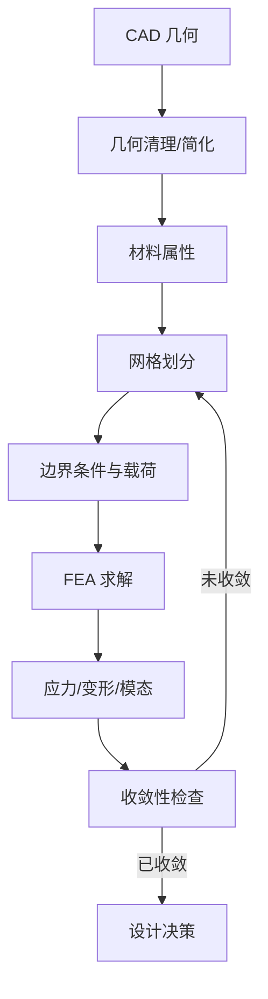
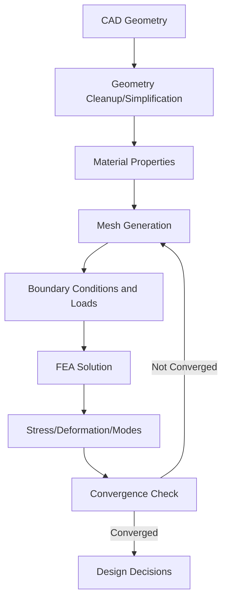
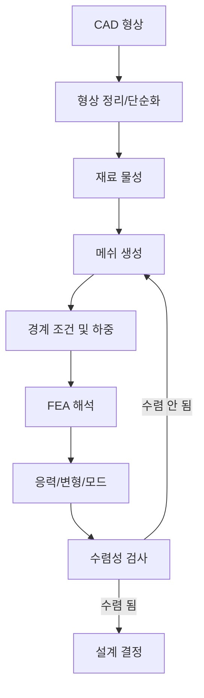

## 概述
8.5.6 有限元分析在连杆设计中的应用相关内容如下。
## 核心内容
#### 8.5.6 有限元分析在连杆设计中的应用
**有限元分析（Finite Element Analysis, FEA）**是预测连杆、关节支架与壳体在载荷下应力、变形与模态的核心数值工具。通过把连续体离散为有限数量的单元，FEA 把偏微分方程转化为线性代数方程组求解，从而在设计阶段发现潜在的结构弱点[27][28]。

!!! note "术语解释：有限元分析（FEA）、离散化、单元、节点、自由度"
    - **有限元分析（FEA）**：把连续结构离散为有限单元并数值求解力学响应的方法。
    - **离散化（discretization）**：把连续几何和物理场分解为有限数量单元的过程。
    - **单元（element）**：构成有限元网格的基本几何块，如四面体、六面体、壳单元。
    - **节点（node）**：单元之间的连接点，场变量在节点处计算。
    - **自由度（DOF）**：每个节点上待求的位移分量数。

人形机器人连杆 FEA 的标准工作流程如下：

1. **几何导入与清理**：从 CAD 导入 STEP/IGES 模型，去除小圆角、螺纹、倒角、细小孔洞等不影响整体力学响应的特征。
2. **材料属性定义**：设置弹性模量 $E$、泊松比 $\nu$、密度 $\rho$，对于复合材料还需定义各向异性参数。
3. **网格划分**：把几何离散为单元集合。常见单元类型包括：
   - **四面体单元（tetrahedron）**：适应复杂几何，但同样节点数下精度通常低于六面体。
   - **六面体单元（hexahedron）**：规则网格精度高、收敛快，适合块状结构。
   - **壳单元（shell）**：用于薄壁结构，可显著降低自由度。
   - **梁单元（beam）**：用于细长杆件，计算效率最高。
4. **边界条件与载荷**：约束关节安装面或轴承座，施加重力、惯性载荷、关节力矩、地面反作用力等。
5. **求解与后处理**：计算位移、应力、应变、安全系数、固有频率，识别高应力区与变形模式。
6. **收敛性验证**：逐步细化网格，观察关键部位应力是否趋于稳定。

!!! note "术语解释：几何清理、网格收敛、后处理、边界条件、载荷工况"
    - **几何清理（geometry cleanup）**：去除不影响分析结果的小特征以简化模型。
    - **网格收敛（mesh convergence）**：随着网格细化，计算结果趋于稳定的现象。
    - **后处理（post-processing）**：对 FEA 结果进行可视化和评估。
    - **边界条件（boundary condition）**：约束位移或温度的条件。
    - **载荷工况（load case）**：特定工作状态下作用在结构上的载荷组合。

网格类型选择对结果影响显著。对于承受复杂应力状态的关节支架，二阶四面体单元（10 节点）能较好捕捉弯曲；对于细长连杆，六面体单元可提高效率。壳单元适用于壁厚远小于其他尺寸的罩壳和薄壁管。

**应力集中（stress concentration）**是连杆设计中的常见问题。几何突变处——如孔边、缺口、台阶、锐角——会出现局部应力显著高于名义应力的现象，应力集中系数 $K_t$ 可定义为：

$$
K_t = \frac{\sigma_{\max}}{\sigma_{\text{nom}}}
$$

其中 $\sigma_{\max}$ 为局部最大应力，$\sigma_{\text{nom}}$ 为名义应力。减缓应力集中的方法包括：增大圆角半径、避免尖角、采用渐变截面、在孔边设置加强环等。

!!! note "术语解释：应力集中、应力集中系数、圆角、名义应力"
    - **应力集中（stress concentration）**：几何突变导致局部应力显著增大的现象。
    - **应力集中系数（stress concentration factor）**：局部最大应力与名义应力之比。
    - **圆角（fillet）**：两个表面之间的圆滑过渡，用于降低应力集中。
    - **名义应力（nominal stress）**：按简化公式计算的平均应力。

收敛性检验是 FEA 可靠性的保障。理论上，当单元尺寸 $h \to 0$ 时，数值解应趋于精确解。工程上常采用 **h-收敛**：不断细化网格，绘制关键位置应力随单元数变化曲线；当相对变化小于 5% 时认为结果收敛。对于关键承载件，建议至少进行两次网格细化对比。

!!! note "术语解释：h-收敛、单元尺寸、数值解、精确解、收敛准则"
    - **h-收敛（h-convergence）**：通过减小单元尺寸提高计算精度的收敛方式。
    - **单元尺寸（element size）**：有限元网格中单元的典型边长。
    - **数值解（numerical solution）**：离散模型计算得到的近似解。
    - **精确解（exact solution）**：连续问题的理论解。
    - **收敛准则（convergence criterion）**：判断数值解是否足够稳定的判据。

## 参考
- 详见 chapter-08.md。

## Overview
The application of finite element analysis in connecting rod design is covered in Section 8.5.6 as follows.
## Content
#### 8.5.6 Application of Finite Element Analysis in Connecting Rod Design
**Finite Element Analysis (FEA)** is a core numerical tool for predicting stress, deformation, and modal behavior of connecting rods, joint brackets, and housings under load. By discretizing a continuum into a finite number of elements, FEA transforms partial differential equations into a system of linear algebraic equations for solution, thereby identifying potential structural weaknesses during the design phase[27][28].

!!! note "Terminology: Finite Element Analysis (FEA), Discretization, Element, Node, Degree of Freedom"
    - **Finite Element Analysis (FEA)**: A method that discretizes a continuous structure into finite elements and numerically solves for mechanical responses.
    - **Discretization**: The process of decomposing continuous geometry and physical fields into a finite number of elements.
    - **Element**: The basic geometric building block of a finite element mesh, such as tetrahedra, hexahedra, or shell elements.
    - **Node**: Connection points between elements where field variables are computed.
    - **Degree of Freedom (DOF)**: The number of unknown displacement components to be solved at each node.

The standard workflow for FEA of humanoid robot connecting rods is as follows:

1. **Geometry Import and Cleanup**: Import STEP/IGES models from CAD, removing small fillets, threads, chamfers, tiny holes, and other features that do not affect the overall mechanical response.
2. **Material Property Definition**: Set elastic modulus $E$, Poisson's ratio $\nu$, density $\rho$, and define anisotropic parameters for composite materials.
3. **Mesh Generation**: Discretize the geometry into a collection of elements. Common element types include:
   - **Tetrahedron**: Adapts well to complex geometries, but accuracy is typically lower than hexahedra for the same number of nodes.
   - **Hexahedron**: Offers high accuracy and fast convergence for regular meshes, suitable for block-like structures.
   - **Shell Element**: Used for thin-walled structures, significantly reducing degrees of freedom.
   - **Beam Element**: Used for slender rods, offering the highest computational efficiency.
4. **Boundary Conditions and Loads**: Constrain joint mounting surfaces or bearing seats, and apply gravity, inertial loads, joint torques, ground reaction forces, etc.
5. **Solution and Post-Processing**: Compute displacement, stress, strain, safety factor, and natural frequencies, identifying high-stress regions and deformation modes.
6. **Convergence Verification**: Gradually refine the mesh and observe whether key stress values stabilize.

!!! note "Terminology: Geometry Cleanup, Mesh Convergence, Post-Processing, Boundary Condition, Load Case"
    - **Geometry Cleanup**: Removing small features that do not affect analysis results to simplify the model.
    - **Mesh Convergence**: The phenomenon where computational results stabilize as the mesh is refined.
    - **Post-Processing**: Visualizing and evaluating FEA results.
    - **Boundary Condition**: Conditions that constrain displacement or temperature.
    - **Load Case**: A combination of loads acting on the structure under a specific operating state.

The choice of mesh type significantly impacts results. For joint brackets under complex stress states, second-order tetrahedral elements (10 nodes) can better capture bending; for slender connecting rods, hexahedral elements improve efficiency. Shell elements are suitable for housings and thin-walled tubes where wall thickness is much smaller than other dimensions.

**Stress concentration** is a common issue in connecting rod design. At geometric discontinuities—such as hole edges, notches, steps, and sharp corners—local stress can be significantly higher than nominal stress. The stress concentration factor $K_t$ can be defined as:

$$
K_t = \frac{\sigma_{\max}}{\sigma_{\text{nom}}}
$$

where $\sigma_{\max}$ is the local maximum stress and $\sigma_{\text{nom}}$ is the nominal stress. Methods to mitigate stress concentration include: increasing fillet radii, avoiding sharp corners, using gradual cross-sectional transitions, and adding reinforcing rings around holes.

!!! note "Terminology: Stress Concentration, Stress Concentration Factor, Fillet, Nominal Stress"
    - **Stress Concentration**: The phenomenon where local stress increases significantly due to geometric discontinuities.
    - **Stress Concentration Factor**: The ratio of local maximum stress to nominal stress.
    - **Fillet**: A smooth transition between two surfaces, used to reduce stress concentration.
    - **Nominal Stress**: The average stress calculated using simplified formulas.

Convergence verification ensures the reliability of FEA. Theoretically, as element size $h \to 0$, the numerical solution should approach the exact solution. In engineering, **h-convergence** is commonly used: gradually refine the mesh and plot the stress at key locations against the number of elements; convergence is considered achieved when the relative change is less than 5%. For critical load-bearing components, at least two mesh refinements for comparison are recommended.

!!! note "Terminology: h-Convergence, Element Size, Numerical Solution, Exact Solution, Convergence Criterion"
    - **h-Convergence**: A convergence method that improves accuracy by reducing element size.
    - **Element Size**: The typical edge length of elements in a finite element mesh.
    - **Numerical Solution**: The approximate solution obtained from the discretized model.
    - **Exact Solution**: The theoretical solution to the continuous problem.
    - **Convergence Criterion**: A criterion for determining whether the numerical solution is sufficiently stable.

## 개요
8.5.6 유한 요소 해석의 커넥팅 로드 설계 적용 관련 내용은 다음과 같습니다.
## 핵심 내용
#### 8.5.6 유한 요소 해석의 커넥팅 로드 설계 적용
**유한 요소 해석(Finite Element Analysis, FEA)**은 커넥팅 로드, 관절 브래킷 및 하우징이 하중 하에서 응력, 변형 및 모드를 예측하는 핵심 수치 도구입니다. 연속체를 유한 개수의 요소로 이산화함으로써 FEA는 편미분 방정식을 선형 대수 방정식 시스템으로 변환하여 해를 구하며, 이를 통해 설계 단계에서 잠재적인 구조적 취약점을 발견할 수 있습니다[27][28].

!!! note "용어 설명: 유한 요소 해석(FEA), 이산화, 요소, 노드, 자유도"
    - **유한 요소 해석(FEA)**: 연속 구조를 유한 요소로 이산화하고 역학적 응답을 수치적으로 해석하는 방법.
    - **이산화(discretization)**: 연속적인 기하학적 형상과 물리적 장을 유한 개수의 요소로 분해하는 과정.
    - **요소(element)**: 유한 요소 메쉬를 구성하는 기본 기하학적 블록으로, 사면체, 육면체, 쉘 요소 등이 있음.
    - **노드(node)**: 요소 간의 연결점으로, 장 변수가 노드에서 계산됨.
    - **자유도(DOF)**: 각 노드에서 구해야 하는 변위 성분의 개수.

휴머노이드 로봇 커넥팅 로드 FEA의 표준 작업 흐름은 다음과 같습니다.

1. **형상 가져오기 및 정리**: CAD에서 STEP/IGES 모델을 가져와 전체 역학적 응답에 영향을 미치지 않는 작은 필렛, 나사산, 모따기, 미세 구멍 등의 특징을 제거합니다.
2. **재료 물성 정의**: 탄성 계수 $E$, 푸아송 비 $\nu$, 밀도 $\rho$를 설정하고, 복합 재료의 경우 이방성 매개변수를 정의해야 합니다.
3. **메쉬 생성**: 형상을 요소 집합으로 이산화합니다. 일반적인 요소 유형은 다음과 같습니다.
   - **사면체 요소(tetrahedron)**: 복잡한 형상에 적응하지만, 동일한 노드 수에서 일반적으로 육면체보다 정밀도가 낮습니다.
   - **육면체 요소(hexahedron)**: 규칙적인 메쉬에서 정밀도가 높고 수렴이 빠르며, 블록형 구조에 적합합니다.
   - **쉘 요소(shell)**: 얇은 벽 구조에 사용되며 자유도를 크게 줄일 수 있습니다.
   - **보 요소(beam)**: 가늘고 긴 부재에 사용되며 계산 효율이 가장 높습니다.
4. **경계 조건 및 하중**: 관절 설치면 또는 베어링 시트를 구속하고, 중력, 관성 하중, 관절 토크, 지면 반력 등을 적용합니다.
5. **해석 및 후처리**: 변위, 응력, 변형률, 안전 계수, 고유 진동수를 계산하고, 고응력 영역과 변형 모드를 식별합니다.
6. **수렴성 검증**: 메쉬를 점진적으로 세분화하여 주요 부위의 응력이 안정화되는지 관찰합니다.

!!! note "용어 설명: 형상 정리, 메쉬 수렴, 후처리, 경계 조건, 하중 조건"
    - **형상 정리(geometry cleanup)**: 해석 결과에 영향을 미치지 않는 작은 특징을 제거하여 모델을 단순화하는 것.
    - **메쉬 수렴(mesh convergence)**: 메쉬가 세분화됨에 따라 계산 결과가 안정화되는 현상.
    - **후처리(post-processing)**: FEA 결과를 시각화하고 평가하는 것.
    - **경계 조건(boundary condition)**: 변위 또는 온도를 구속하는 조건.
    - **하중 조건(load case)**: 특정 작동 상태에서 구조에 작용하는 하중의 조합.

메쉬 유형 선택은 결과에 큰 영향을 미칩니다. 복잡한 응력 상태를 받는 관절 브래킷의 경우 2차 사면체 요소(10노드)가 굽힘을 잘 포착할 수 있으며, 가늘고 긴 커넥팅 로드의 경우 육면체 요소가 효율성을 높일 수 있습니다. 쉘 요소는 벽 두께가 다른 치수에 비해 훨씬 작은 케이싱 및 얇은 벽 파이프에 적합합니다.

**응력 집중(stress concentration)**은 커넥팅 로드 설계에서 흔히 발생하는 문제입니다. 구멍 가장자리, 노치, 단차, 예각과 같은 형상 급변 부위에서는 국부 응력이 공칭 응력보다 현저히 높아지는 현상이 나타나며, 응력 집중 계수 $K_t$는 다음과 같이 정의할 수 있습니다.

$$
K_t = \frac{\sigma_{\max}}{\sigma_{\text{nom}}}
$$

여기서 $\sigma_{\max}$는 국부 최대 응력, $\sigma_{\text{nom}}$은 공칭 응력입니다. 응력 집중을 완화하는 방법에는 필렛 반경 증가, 예각 회피, 점진적 단면 사용, 구멍 가장자리에 보강 링 설치 등이 있습니다.

!!! note "용어 설명: 응력 집중, 응력 집중 계수, 필렛, 공칭 응력"
    - **응력 집중(stress concentration)**: 형상 급변으로 인해 국부 응력이 현저히 증가하는 현상.
    - **응력 집중 계수(stress concentration factor)**: 국부 최대 응력과 공칭 응력의 비율.
    - **필렛(fillet)**: 두 표면 사이의 부드러운 전환으로, 응력 집중을 낮추는 데 사용됨.
    - **공칭 응력(nominal stress)**: 단순화된 공식으로 계산된 평균 응력.

수렴성 검증은 FEA 신뢰성의 보장입니다. 이론적으로 요소 크기 $h \to 0$일 때 수치 해는 정확 해에 수렴해야 합니다. 공학에서는 일반적으로 **h-수렴**을 사용합니다. 메쉬를 지속적으로 세분화하고 주요 위치의 응력이 요소 수에 따라 변화하는 곡선을 그립니다. 상대적 변화가 5% 미만일 때 결과가 수렴된 것으로 간주합니다. 주요 하중 지지 부재의 경우 최소 두 번의 메쉬 세분화 비교를 권장합니다.

!!! note "용어 설명: h-수렴, 요소 크기, 수치 해, 정확 해, 수렴 기준"
    - **h-수렴(h-convergence)**: 요소 크기를 줄여 계산 정밀도를 높이는 수렴 방식.
    - **요소 크기(element size)**: 유한 요소 메쉬에서 요소의 일반적인 변 길이.
    - **수치 해(numerical solution)**: 이산 모델을 계산하여 얻은 근사 해.
    - **정확 해(exact solution)**: 연속 문제의 이론적 해.
    - **수렴 기준(convergence criterion)**: 수치 해가 충분히 안정적인지 판단하는 기준.
