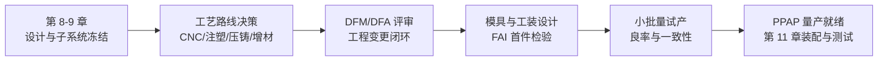
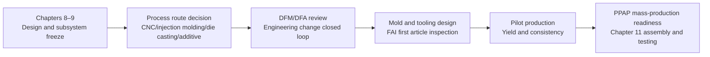

## 概述

面向量产工艺评估（Process evaluation for mass production，P5.2.3）是人形机器人本体结构工程与原型（P5）阶段中的关键工序节点，位于结构材料选型（P5.2.1）与面向增材制造的设计（DfAM，P5.2.2）之后。它回答的核心问题是：**原型验证通过后，3D 打印件如何转换为可量产工艺**——通过压铸、注塑、钣金、CNC、复材成型等工艺的对比论证，输出量产工艺路线图与关键件工艺选择。它真正改变的不是"选哪台机床"的细节，而是"设计意图第一次被翻译成模具成本、最小订单量、良率与周期的经济性语言"——这是从单件原型走向批量产品的分水岭。

## 核心内容

### 是什么：从原型到量产的决策关口

面向量产工艺评估是 WBS（工作分解结构，Work Breakdown Structure）中 P5 阶段的三级子任务，编号 P5.2.3。它的输入是 P5.2.1 输出的《材料选型表》与 P5.2.2 完成的 DfAM 设计，输出是量产工艺路线图与关键件工艺选择。在整条开发链路上，它位于设计与子系统冻结（第 8-9 章）之前，是 P16 小批量试产与量产准备（Pilot & Production Ramp）中 DFM/DFA 评审（P16.1.1）、模具与工装设计（P16.1.2）的直接前置条件。

该任务展开为五个四级子任务：P5.2.3.1 输入梳理与目标量化、P5.2.3.2 方案/方法设计、P5.2.3.3 实施/原型/样件制作、P5.2.3.4 验证与问题闭环、P5.2.3.5 文档输出与下游交付。每个子任务包含三条四级关键动作，形成从"输入确认"到"文档交付"的完整闭环。

### 为什么存在：痛点与历史定位

人形机器人的结构件长期面临一个矛盾：**原型阶段用 3D 打印可以快速验证，但 3D 打印的成本与节拍无法支撑量产**。如果跳过工艺评估直接开模，模具费用动辄数十万元，一旦设计变更，模具报废损失巨大；如果工艺选型过于保守（全部用 CNC），单件成本又居高不下。P5.2.3 的存在，就是为了在投入模具与工装之前，用系统化的对比方法把"工艺风险"暴露在图纸阶段，而不是试产阶段。

从历史定位看，这一节点是"设计冻结"前的最后一道工艺闸门。P8 结构强度仿真与迭代（Structural FEA）的网格与载荷假设，必须与 P5.2.3 选定的工艺所能实现的壁厚、圆角与加强筋相匹配——仿真做得再精细，如果工艺做不出那个壁厚，仿真就失去了意义。因此，P5.2.3 不仅是工艺选择，更是对设计约束的最终确认。

### 原理拆解

**① 工艺对比的本质：约束与成本的权衡**

面向量产工艺评估的方法论核心，是对五种工艺——压铸、注塑、钣金、CNC、复材成型——进行系统对比。每种工艺都有其"能力边界"：

| 工艺 | 典型适用场景 | 关键约束 | 成本特征 |
|------|-------------|---------|---------|
| 压铸 | 铝合金壳体、关节支架 | 模具成本高、最小壁厚受限 | 模具贵、单件便宜 |
| 注塑 | 塑料覆盖件、内部结构件 | 模具成本高、需考虑脱模斜度 | 模具贵、单件便宜 |
| 钣金 | 薄板类支架、外壳 | 形状受限、需折弯半径 | 模具适中、单件适中 |
| CNC | 复杂曲面、小批量 | 加工时间长、材料浪费 | 无模具、单件贵 |
| 复材成型 | 碳纤维覆盖件、轻量化结构 | 模具成本高、周期长 | 模具贵、单件贵 |

评估矩阵的建立，是将这些约束转化为可量化的 KPI——模具成本、最小订单量、良率、周期——并逐项打分。打分结果不是"选最便宜的"，而是"在满足刚度、重量、公差要求的前提下，选择综合成本最优且风险可控的方案"。

**② 量化评估的数学表达**

评估矩阵的量化打分，本质上是一个加权评分模型。设第 i 个候选方案的第 j 项 KPI 得分为 $s_{ij}$，权重为 $w_j$，则综合得分：

$$
S_i = \sum_{j=1}^{n} w_j \cdot s_{ij}, \quad \sum_{j=1}^{n} w_j = 1
$$

权重 $w_j$ 的设定取决于产品定位——如果是消费级人形机器人，单件成本权重高；如果是科研平台，周期权重高。这个模型的价值不在于数学本身，而在于**迫使团队把"感觉"变成"分数"**，让评审有据可依。

**③ 与上下游的接口关系**

P5.2.3 的输出直接决定 P16 阶段的 DFM/DFA 评审能否通过。DFM（面向制造的设计）检查的是"设计能否被工艺实现"，DFA（面向装配的设计）检查的是"零件能否被高效装配"。如果 P5.2.3 选定的工艺与设计不匹配，P16.1.1 的 DFM/DFA 评审就会打回，形成工程变更闭环——这正是流程图（见下）中"DFM/DFA 评审 → 工程变更闭环"的含义。

### 关键参数与规格

P5.2.3 的关键约束参数，来自语料中的明确列举：

- **模具成本**：压铸、注塑、复材成型的模具成本显著高于 CNC（无模具）与钣金（简易模具）。模具成本是方案选择的首要门槛——如果预期产量不足以摊薄模具费用，高模具成本工艺就不具备经济性。
- **最小订单量（MOQ）**：注塑与压铸通常有较高的最小订单量要求，因为需要分摊模具调试与开机成本；CNC 的最小订单量可以低至 1 件。这一参数直接决定了"小批量试产"阶段的可行性。
- **良率**：压铸的常见缺陷包括气孔与缩松，注塑的常见缺陷包括缩水与飞边，CNC 的良率主要受加工精度与装夹变形影响。良率直接影响单件有效成本。
- **周期**：模具制造周期通常以周计，CNC 加工周期以天计。周期决定了从"方案冻结"到"首件产出"的时间跨度。

这些参数在 P5.2.3.1 中被转化为可量化 KPI，在 P5.2.3.2 中被用于评估矩阵打分，在 P5.2.3.4 中被用于验证是否满足完成标准。

### 横向对比

P5.2.3 与相邻节点的关系，可以从三个维度理解：

| 对比维度 | P5.2.2 DfAM | P5.2.3 面向量产工艺评估 | P16.1.1 DFM/DFA 评审 |
|---------|------------|----------------------|---------------------|
| 阶段 | P5 设计阶段 | P5 设计阶段 | P16 试产准备阶段 |
| 核心问题 | 如何让设计适配 3D 打印 | 如何让设计适配量产工艺 | 设计是否满足制造与装配要求 |
| 输出 | 面向增材的设计优化 | 量产工艺路线图 | 评审通过/变更请求 |
| 时间 | 原型验证前 | 原型验证后 | 模具设计前 |

关键区别在于：DfAM 优化的是"打印得出来"，P5.2.3 回答的是"量产划不划算"，DFM/DFA 评审验证的是"制造与装配行不行"。三者层层递进，缺一不可。

### 谁在用·应用案例

在人形机器人产品开发全流程中，P5.2.3 的执行者是结构工程师与制造工程师的联合团队。典型应用场景包括：

- **关节壳体选型**：关节安装接口与壳体设计（P5.1.2）完成后，需要判断壳体采用压铸铝合金还是注塑工程塑料。评估矩阵会对比两者的模具成本、单件成本、刚度与重量，结合预期产量做出选择。
- **中心骨架工艺决策**：中心骨架与四肢连杆设计（P5.1.1）的骨架件，如果形状复杂且受力大，可能选择 CNC 加工；如果形状规整且产量大，可能选择压铸。这一决策直接决定 P8 结构强度仿真（Structural FEA）的载荷假设是否成立。
- **外观覆盖件选材**：外观覆盖件与分缝设计（P5.1.3）的覆盖件，通常选择注塑或复材成型。注塑适合大批量、低成本；复材成型适合轻量化、高性能。评估结果会写入量产工艺路线图，作为 P16 阶段模具与工装设计（P16.1.2）的输入。

### 局限与边界

P5.2.3 的边界清晰，但存在三个容易被忽视的局限：

1. **评估矩阵的权重是主观设定的**。权重 $w_j$ 的取值依赖团队经验与产品定位，不同团队对"成本"与"周期"的权重判断可能截然不同。评估矩阵只能让决策"透明"，不能保证决策"正确"。
2. **工艺能力数据存在时效性**。模具成本、良率、周期等参数会随供应商能力、设备状态、材料价格波动而变化。P5.2.3 的评估结论在方案冻结时有效，但到 P16 阶段执行时可能需要修正。
3. **不覆盖供应链风险**。P5.2.3 关注的是"工艺本身行不行"，不回答"供应商靠不靠谱"。供应商选择与审核（P16.2.1）是后续独立任务，P5.2.3 的工艺选型不能替代供应商能力评估。

### 常见误区

1. **"工艺评估就是选最便宜的"**——错。评估矩阵的权重设计决定了"便宜"只是其中一个维度。如果刚度不达标导致结构失效，再便宜也是浪费。评估的目标是"综合最优"，不是"单项最低"。
2. **"原型验证通过就等于量产可行"**——错。3D 打印件的力学性能、表面质量与注塑件、压铸件存在本质差异。原型验证只证明了"设计逻辑正确"，P5.2.3 要证明的是"工艺能实现设计的全部约束"。
3. **"评估做完就可以开模"**——错。P5.2.3 的输出是"工艺路线图"，不是"模具图纸"。模具与工装设计（P16.1.2）是后续独立任务，中间还隔着 DFM/DFA 评审（P16.1.1）与供应商选择（P16.2.1）。跳过评审直接开模，是试产阶段最常见的返工原因。

### 相关知识

- `ent_process_p5` — P5.2.3 是 P5 本体结构工程与原型阶段的三级子任务，其输出直接服务于 P5 阶段的《材料选型表》与量产工艺路线图交付。
- `ent_process_p5_2_1` — 同族相邻工序：结构材料选型（同一工作包内的并行工序）。
- `ent_process_p5_2_2` — 同族相邻工序：面向增材制造的设计（DfAM）（同一工作包内的并行工序）。

## 参考

- [人形机器人产品开发全流程报告（V3 / 三四级任务展开版）](https://github.com/YansongW/awesome-humanoid-robot/tree/main/docs/humanoid_full_development_workflow_v3.md)
- [第 10 章：制造相关任务与工艺路线](https://github.com/YansongW/awesome-humanoid-robot/tree/main/wiki/docs/chapters/chapter-10.md)

## Overview

Process evaluation for mass production (P5.2.3) is a critical process node in the humanoid robot body structure engineering and prototyping (P5) stage, following structural material selection (P5.2.1) and Design for Additive Manufacturing (DfAM, P5.2.2). The core question it addresses is: **after prototype validation passes, how can 3D-printed parts be converted to mass-production processes**—through comparative analysis of processes such as die casting, injection molding, sheet metal, CNC, and composite molding, ultimately delivering a mass-production process roadmap and key-part process selection. What it truly changes is not the detail of "which machine to choose," but rather "the first time design intent is translated into the economic language of mold cost, minimum order quantity, yield, and cycle time"—this is the watershed between single-piece prototypes and batch production.

## Content

### What It Is: The Decision Gate from Prototype to Mass Production

Process evaluation for mass production is a Level 3 subtask of the P5 stage in the WBS (Work Breakdown Structure), numbered P5.2.3. Its inputs are the Material Selection Table from P5.2.1 and the DfAM design completed in P5.2.2; its outputs are the mass-production process roadmap and key-part process selection. In the overall development chain, it sits before design and subsystem freeze (Chapters 8–9) and is the direct prerequisite for the DFM/DFA review (P16.1.1) and mold and tooling design (P16.1.2) in the P16 pilot production and production ramp-up phase.

This task decomposes into five Level 4 subtasks: P5.2.3.1 Input review and target quantification, P5.2.3.2 Solution/method design, P5.2.3.3 Implementation/prototype/sample fabrication, P5.2.3.4 Verification and issue closure, and P5.2.3.5 Documentation output and downstream delivery. Each subtask contains three Level 4 key actions, forming a complete closed loop from "input confirmation" to "documentation delivery."

### Why It Exists: Pain Points and Historical Positioning

Humanoid robot structural parts have long faced a contradiction: **3D printing enables rapid validation during the prototype stage, but its cost and cycle time cannot support mass production**. If molds are opened directly without process evaluation, mold costs can easily reach hundreds of thousands of yuan, and design changes would result in enormous mold scrapping losses; if the process selection is overly conservative (e.g., all CNC), per-unit costs remain prohibitively high. P5.2.3 exists precisely to expose "process risks" at the drawing stage through systematic comparative methods—before investing in molds and tooling—rather than discovering them during pilot production.

From a historical positioning perspective, this node is the final process gate before "design freeze." The mesh and load assumptions in P8 structural strength simulation and iteration (Structural FEA) must match the wall thickness, fillets, and ribs achievable by the process selected in P5.2.3—no matter how refined the simulation, if the process cannot produce that wall thickness, the simulation loses its meaning. Therefore, P5.2.3 is not merely process selection; it is the final confirmation of design constraints.

### Principle Breakdown

**① The Essence of Process Comparison: Trade-offs Between Constraints and Cost**

The methodological core of process evaluation for mass production is a systematic comparison of five processes—die casting, injection molding, sheet metal, CNC, and composite molding. Each process has its "capability boundary":

| Process | Typical Applications | Key Constraints | Cost Characteristics |
|---------|---------------------|-----------------|----------------------|
| Die casting | Aluminum alloy housings, joint brackets | High mold cost, limited minimum wall thickness | Expensive mold, low per-unit cost |
| Injection molding | Plastic covers, internal structural parts | High mold cost, draft angle required | Expensive mold, low per-unit cost |
| Sheet metal | Thin-plate brackets, enclosures | Limited shapes, bend radius required | Moderate mold, moderate per-unit cost |
| CNC | Complex surfaces, small batches | Long machining time, material waste | No mold, high per-unit cost |
| Composite molding | Carbon fiber covers, lightweight structures | High mold cost, long cycle time | Expensive mold, high per-unit cost |

The evaluation matrix translates these constraints into quantifiable KPIs—mold cost, minimum order quantity, yield, and cycle time—and scores each item. The scoring result is not about "choosing the cheapest" but rather "selecting the solution with the best overall cost and controllable risk, provided stiffness, weight, and tolerance requirements are met."

**② Mathematical Expression of Quantitative Evaluation**

The quantitative scoring in the evaluation matrix is essentially a weighted scoring model. Let the score of the i-th candidate solution on the j-th KPI be $s_{ij}$, with weight $w_j$; the composite score is:

$$
S_i = \sum_{j=1}^{n} w_j \cdot s_{ij}, \quad \sum_{j=1}^{n} w_j = 1
$$

The setting of weights $w_j$ depends on product positioning—for consumer-grade humanoid robots, per-unit cost carries higher weight; for research platforms, cycle time carries higher weight. The value of this model lies not in the mathematics itself, but in **forcing the team to turn "feelings" into "scores,"** making reviews evidence-based.

**③ Interface Relationships with Upstream and Downstream**

The output of P5.2.3 directly determines whether the DFM/DFA review in the P16 stage can pass. DFM (Design for Manufacturing) checks whether "the design can be realized by the process," while DFA (Design for Assembly) checks whether "parts can be efficiently assembled." If the process selected in P5.2.3 does not match the design, the DFM/DFA review in P16.1.1 will be rejected, triggering an engineering change closed loop—this is precisely what the "DFM/DFA review → engineering change closed loop" means in the flowchart (see below).

### Key Parameters and Specifications

The key constraint parameters of P5.2.3 come from explicit enumerations in the source material:

- **Mold cost**: The mold costs for die casting, injection molding, and composite molding are significantly higher than for CNC (no mold) and sheet metal (simple molds). Mold cost is the primary threshold for solution selection—if expected production volume is insufficient to amortize mold expenses, high-mold-cost processes are not economically viable.
- **Minimum order quantity (MOQ)**: Injection molding and die casting typically require higher MOQs due to the need to amortize mold setup and machine startup costs; CNC can have an MOQ as low as 1 piece. This parameter directly determines the feasibility of the "pilot production" stage.
- **Yield**: Common defects in die casting include porosity and shrinkage; common defects in injection molding include sink marks and flash; CNC yield is primarily affected by machining precision and fixturing deformation. Yield directly impacts effective per-unit cost.
- **Cycle time**: Mold manufacturing cycles are typically measured in weeks, while CNC machining cycles are measured in days. Cycle time determines the span from "solution freeze" to "first article output."

These parameters are converted into quantifiable KPIs in P5.2.3.1, used for evaluation matrix scoring in P5.2.3.2, and verified against completion criteria in P5.2.3.4.

### Horizontal Comparison

The relationship between P5.2.3 and adjacent nodes can be understood from three dimensions:

| Comparison Dimension | P5.2.2 DfAM | P5.2.3 Process Evaluation for Mass Production | P16.1.1 DFM/DFA Review |
|----------------------|-------------|------------------------------------------------|------------------------|
| Stage | P5 design stage | P5 design stage | P16 pilot production preparation stage |
| Core question | How to adapt design for 3D printing | How to adapt design for mass-production processes | Whether the design meets manufacturing and assembly requirements |
| Output | Design optimization for additive manufacturing | Mass-production process roadmap | Review pass/change request |
| Timing | Before prototype validation | After prototype validation | Before mold design |

The key distinction is: DfAM optimizes for "printability," P5.2.3 answers "whether mass production is economical," and the DFM/DFA review verifies "whether manufacturing and assembly are feasible." The three progress layer by layer, and none can be omitted.

### Who Uses It · Application Cases

In the full humanoid robot product development process, P5.2.3 is executed by a joint team of structural engineers and manufacturing engineers. Typical application scenarios include:

- **Joint housing selection**: After the joint mounting interface and housing design (P5.1.2) is completed, a decision must be made on whether the housing uses die-cast aluminum alloy or injection-molded engineering plastic. The evaluation matrix compares mold cost, per-unit cost, stiffness, and weight, combined with expected production volume, to make the selection.
- **Central skeleton process decision**: For the skeleton parts in the central skeleton and limb linkage design (P5.1.1), if the shape is complex and loads are high, CNC machining may be selected; if the shape is regular and production volume is high, die casting may be selected. This decision directly determines whether the load assumptions in the P8 structural strength simulation (Structural FEA) hold.
- **Exterior cover material selection**: For the exterior covers and parting line design (P5.1.3), injection molding or composite molding is typically chosen. Injection molding suits high-volume, low-cost production; composite molding suits lightweight, high-performance requirements. The evaluation results are written into the mass-production process roadmap as input for mold and tooling design (P16.1.2) in the P16 stage.

### Limitations and Boundaries

P5.2.3 has clear boundaries, but three limitations are easily overlooked:

1. **The weights in the evaluation matrix are subjectively set.** The values of weights $w_j$ depend on team experience and product positioning; different teams may judge the weights of "cost" versus "cycle time" very differently. The evaluation matrix can only make decisions "transparent," not guarantee they are "correct."
2. **Process capability data has a shelf life.** Parameters such as mold cost, yield, and cycle time fluctuate with supplier capabilities, equipment status, and material prices. The conclusions of P5.2.3 are valid at the time of solution freeze but may require revision when executed in the P16 stage.
3. **Supply chain risks are not covered.** P5.2.3 focuses on whether "the process itself is viable," not whether "the supplier is reliable." Supplier selection and audit (P16.2.1) is a subsequent independent task; the process selection in P5.2.3 cannot replace supplier capability assessment.

### Common Misconceptions

1. **"Process evaluation means choosing the cheapest option"—wrong.** The weight design of the evaluation matrix determines that "cheap" is only one dimension. If stiffness fails and structural failure occurs, even the cheapest option is a waste. The goal of evaluation is "overall optimum," not "single-item minimum."
2. **"Prototype validation passing means mass production is feasible"—wrong.** The mechanical properties and surface quality of 3D-printed parts differ fundamentally from injection-molded or die-cast parts. Prototype validation only proves that "the design logic is correct"; P5.2.3 must prove that "the process can realize all design constraints."
3. **"Once evaluation is done, molds can be opened"—wrong.** The output of P5.2.3 is a "process roadmap," not "mold drawings." Mold and tooling design (P16.1.2) is a subsequent independent task, with the DFM/DFA review (P16.1.1) and supplier selection (P16.2.1) in between. Skipping the review and opening molds directly is the most common cause of rework in the pilot production stage.

### Related Knowledge

- `ent_process_p5` — P5.2.3 is a Level 3 subtask of the P5 body structure engineering and prototyping stage, and its output directly serves the Material Selection Table and mass-production process roadmap deliverables of the P5 stage.
- `ent_process_p5_2_1` — Adjacent process in the same family: structural material selection (parallel process within the same work package).
- `ent_process_p5_2_2` — Adjacent process in the same family: Design for Additive Manufacturing (DfAM) (parallel process within the same work package).

## 개요

양산 공정 평가(Process evaluation for mass production, P5.2.3)는 휴머노이드 로봇 본체 구조 엔지니어링 및 프로토타입(P5) 단계의 핵심 공정 노드로, 구조 재료 선정(P5.2.1)과 적층 제조 지향 설계(DfAM, P5.2.2) 이후에 위치한다. 이 단계가 답하는 핵심 질문은: **프로토타입 검증 통과 후, 3D 프린팅 부품을 어떻게 양산 가능한 공정으로 전환할 것인가**——다이캐스팅, 사출, 판금, CNC, 복합재 성형 등의 공정 비교 검토를 통해 양산 공정 로드맵과 핵심 부품 공정 선택을 도출한다. 이 단계가 실제로 바꾸는 것은 "어떤 공작기계를 선택할지"라는 세부 사항이 아니라, "설계 의도가 처음으로 금형 비용, 최소 주문량, 수율, 사이클 타임이라는 경제성 언어로 번역되는 것"——즉 단일 프로토타입에서 양산 제품으로 넘어가는 분기점이다.

## 핵심 내용

### 무엇인가: 프로토타입에서 양산으로의 의사결정 관문

양산 공정 평가는 WBS(작업 분해 구조, Work Breakdown Structure)에서 P5 단계의 3차 하위 작업으로, 번호는 P5.2.3이다. 입력은 P5.2.1이 산출한 《재료 선정표》와 P5.2.2가 완료한 DfAM 설계이며, 출력은 양산 공정 로드맵과 핵심 부품 공정 선택이다. 전체 개발 체인에서 이 단계는 설계 및 서브시스템 동결(제8-9장) 이전에 위치하며, P16 소량 시제품 생산 및 양산 준비(Pilot & Production Ramp)의 DFM/DFA 검토(P16.1.1), 금형 및 지그 설계(P16.1.2)의 직접적인 선행 조건이다.

이 작업은 5개의 4차 하위 작업으로 전개된다: P5.2.3.1 입력 정리 및 목표 정량화, P5.2.3.2 방안/방법 설계, P5.2.3.3 구현/프로토타입/시제품 제작, P5.2.3.4 검증 및 문제 폐루프, P5.2.3.5 문서 출력 및 하류 전달. 각 하위 작업은 3개의 4차 핵심 액션을 포함하여 "입력 확인"부터 "문서 전달"까지의 완전한 폐루프를 형성한다.

### 왜 존재하는가:痛点과 역사적 위치

휴머노이드 로봇의 구조 부품은 오랫동안 모순에 직면해 왔다: **프로토타입 단계에서는 3D 프린팅으로 빠르게 검증할 수 있지만, 3D 프린팅의 비용과 택트 타임은 양산을 뒷받침할 수 없다**. 공정 평가를 건너뛰고 바로 금형을 제작하면 금형 비용이 수십만 위안에 달하고, 설계 변경이 발생하면 금형 폐기 손실이 막대하다; 공정 선정이 지나치게 보수적이면(전부 CNC 사용), 단품 비용이 계속 높아진다. P5.2.3이 존재하는 이유는 금형과 지그에 투자하기 전에 체계적인 비교 방법으로 "공정 리스크"를 시제품 생산 단계가 아닌 도면 단계에서 노출시키기 위해서다.

역사적 위치에서 보면, 이 노드는 "설계 동결" 전의 마지막 공정 관문이다. P8 구조 강도 시뮬레이션 및 반복(Structural FEA)의 메시와 하중 가정은 P5.2.3에서 선택한 공정이 구현할 수 있는 벽 두께, 필렛, 리브와 일치해야 한다——시뮬레이션이 아무리 정밀해도, 공정이 그 벽 두께를 만들 수 없다면 시뮬레이션은 의미를 잃는다. 따라서 P5.2.3은 단순한 공정 선택이 아니라 설계 제약 조건의 최종 확인이다.

### 원리 분석

**① 공정 비교의 본질: 제약 조건과 비용의 트레이드오프**

양산 공정 평가의 방법론 핵심은 다섯 가지 공정——다이캐스팅, 사출, 판금, CNC, 복합재 성형——을 체계적으로 비교하는 것이다. 각 공정에는 "능력 경계"가 있다:

| 공정 | 전형적 적용 시나리오 | 핵심 제약 조건 | 비용 특성 |
|------|-------------|---------|---------|
| 다이캐스팅 | 알루미늄 합금 하우징, 관절 브래킷 | 금형 비용 높음, 최소 벽 두께 제한 | 금형 비쌈, 단품 저렴 |
| 사출 | 플라스틱 커버 부품, 내부 구조 부품 | 금형 비용 높음, 탈형 구배 고려 필요 | 금형 비쌈, 단품 저렴 |
| 판금 | 얇은 판재 브래킷, 외장 | 형상 제한, 절곡 반경 필요 | 금형 적정, 단품 적정 |
| CNC | 복잡한 곡면, 소량 생산 | 가공 시간 김, 재료 낭비 | 금형 없음, 단품 비쌈 |
| 복합재 성형 | 탄소섬유 커버 부품, 경량화 구조 | 금형 비용 높음, 사이클 타임 김 | 금형 비쌈, 단품 비쌈 |

평가 매트릭스 구축은 이러한 제약 조건을 정량화 가능한 KPI——금형 비용, 최소 주문량, 수율, 사이클 타임——로 변환하고 항목별로 점수를 매기는 것이다. 점수 결과는 "가장 저렴한 것을 선택"하는 것이 아니라 "강성, 중량, 공차 요구 사항을 충족하는 전제하에 종합 비용이 최적이고 리스크가 통제 가능한 방안을 선택"하는 것이다.

**② 정량적 평가의 수학적 표현**

평가 매트릭스의 정량적 점수화는 본질적으로 가중치 평가 모델이다. i번째 후보 방안의 j번째 KPI 점수를 $s_{ij}$, 가중치를 $w_j$라고 하면 종합 점수는:

$$
S_i = \sum_{j=1}^{n} w_j \cdot s_{ij}, \quad \sum_{j=1}^{n} w_j = 1
$$

가중치 $w_j$의 설정은 제품 포지셔닝에 따라 달라진다——소비자용 휴머노이드 로봇이면 단품 비용 가중치가 높고, 연구 플랫폼이면 사이클 타임 가중치가 높다. 이 모델의 가치는 수학 자체가 아니라 **팀이 "느낌"을 "점수"로 바꾸도록 강제하여 검토가 근거를 갖게 하는 것**이다.

**③ 상하류와의 인터페이스 관계**

P5.2.3의 출력은 P16 단계의 DFM/DFA 검토 통과 여부를 직접 결정한다. DFM(제조 지향 설계)은 "설계가 공정으로 구현될 수 있는지"를 확인하고, DFA(조립 지향 설계)는 "부품이 효율적으로 조립될 수 있는지"를 확인한다. P5.2.3에서 선택한 공정이 설계와 일치하지 않으면 P16.1.1의 DFM/DFA 검토에서 반려되어 엔지니어링 변경 폐루프를 형성한다——이것이 바로 흐름도(아래 참조)에서 "DFM/DFA 검토 → 엔지니어링 변경 폐루프"의 의미다.

### 핵심 파라미터 및 사양

P5.2.3의 핵심 제약 파라미터는 말뭉치의 명시적 나열에서 비롯된다:

- **금형 비용**: 다이캐스팅, 사출, 복합재 성형의 금형 비용은 CNC(금형 없음)와 판금(간이 금형)보다 현저히 높다. 금형 비용은 방안 선택의 첫 번째 관문이다——예상 생산량이 금형 비용을 분담할 수 없다면 고비용 금형 공정은 경제성을 갖지 못한다.
- **최소 주문량(MOQ)**: 사출과 다이캐스팅은 일반적으로 높은 최소 주문량 요구 사항이 있는데, 금형 셋업과 기동 비용을 분담해야 하기 때문이다; CNC의 최소 주문량은 1개까지 낮출 수 있다. 이 파라미터는 "소량 시제품 생산" 단계의 실현 가능성을 직접 결정한다.
- **수율**: 다이캐스팅의 일반적 결함은 기공과 수축공, 사출의 일반적 결함은 수축과 플래시, CNC의 수율은 주로 가공 정밀도와 고정 변형의 영향을 받는다. 수율은 단품 유효 비용에 직접 영향을 미친다.
- **사이클 타임**: 금형 제조 사이클 타임은 일반적으로 주 단위, CNC 가공 사이클 타임은 일 단위다. 사이클 타임은 "방안 동결"부터 "첫 번째 부품 생산"까지의 시간 범위를 결정한다.

이러한 파라미터는 P5.2.3.1에서 정량화 가능한 KPI로 변환되고, P5.2.3.2에서 평가 매트릭스 점수화에 사용되며, P5.2.3.4에서 완료 기준 충족 여부 검증에 사용된다.

### 횡적 비교

P5.2.3과 인접 노드의 관계는 세 가지 차원에서 이해할 수 있다:

| 비교 차원 | P5.2.2 DfAM | P5.2.3 양산 공정 평가 | P16.1.1 DFM/DFA 검토 |
|---------|------------|----------------------|---------------------|
| 단계 | P5 설계 단계 | P5 설계 단계 | P16 시제품 생산 준비 단계 |
| 핵심 질문 | 설계를 3D 프린팅에 어떻게 적응시킬 것인가 | 설계를 양산 공정에 어떻게 적응시킬 것인가 | 설계가 제조 및 조립 요구 사항을 충족하는가 |
| 출력 | 적층 제조 지향 설계 최적화 | 양산 공정 로드맵 | 검토 통과/변경 요청 |
| 시점 | 프로토타입 검증 전 | 프로토타입 검증 후 | 금형 설계 전 |

핵심 차이점은: DfAM은 "출력이 가능한지"를 최적화하고, P5.2.3은 "양산이 경제적인지"를 답하며, DFM/DFA 검토는 "제조 및 조립이 가능한지"를 검증한다. 세 가지는 단계적으로 심화되며 하나도 빠질 수 없다.

### 사용자·적용 사례

휴머노이드 로봇 제품 개발 전체 프로세스에서 P5.2.3의 실행자는 구조 엔지니어와 제조 엔지니어의 공동 팀이다. 전형적인 적용 시나리오는 다음과 같다:

- **관절 하우징 선정**: 관절 장착 인터페이스 및 하우징 설계(P5.1.2) 완료 후, 하우징에 다이캐스팅 알루미늄 합금을 사용할지 사출 엔지니어링 플라스틱을 사용할지 판단해야 한다. 평가 매트릭스는 두 공정의 금형 비용, 단품 비용, 강성, 중량을 비교하고 예상 생산량을 결합하여 선택한다.
- **중심 골격 공정 결정**: 중심 골격 및 사지 링크 설계(P5.1.1)의 골격 부품이 형상이 복잡하고 하중이 크면 CNC 가공을 선택할 수 있고, 형상이 규칙적이고 생산량이 많으면 다이캐스팅을 선택할 수 있다. 이 결정은 P8 구조 강도 시뮬레이션(Structural FEA)의 하중 가정이 성립하는지 여부를 직접 결정한다.
- **외관 커버 부품 재질 선정**: 외관 커버 및 분할선 설계(P5.1.3)의 커버 부품은 일반적으로 사출 또는 복합재 성형을 선택한다. 사출은 대량 생산, 저비용에 적합하고; 복합재 성형은 경량화, 고성능에 적합하다. 평가 결과는 양산 공정 로드맵에 기록되어 P16 단계 금형 및 지그 설계(P16.1.2)의 입력으로 사용된다.

### 한계와 경계

P5.2.3의 경계는 명확하지만, 간과하기 쉬운 세 가지 한계가 있다:

1. **평가 매트릭스의 가중치는 주관적으로 설정된다**. 가중치 $w_j$의 값은 팀 경험과 제품 포지셔닝에 의존하며, 팀마다 "비용"과 "사이클 타임"의 가중치 판단이 완전히 다를 수 있다. 평가 매트릭스는 의사결정을 "투명하게" 만들 수 있을 뿐, "올바르게" 만들 수는 없다.
2. **공정 능력 데이터는 시의성이 있다**. 금형 비용, 수율, 사이클 타임 등의 파라미터는 공급업체 능력, 장비 상태, 재료 가격 변동에 따라 달라진다. P5.2.3의 평가 결론은 방안 동결 시점에 유효하지만, P16 단계 실행 시 수정이 필요할 수 있다.
3. **공급망 리스크를 다루지 않는다**. P5.2.3은 "공정 자체가 가능한지"에 초점을 맞추며 "공급업체가 신뢰할 수 있는지"는 다루지 않는다. 공급업체 선정 및 심사(P16.2.1)는 후속 독립 작업이며, P5.2.3의 공정 선정은 공급업체 능력 평가를 대체할 수 없다.

### 일반적인 오해

1. **"공정 평가는 가장 저렴한 것을 선택하는 것"**——틀렸다. 평가 매트릭스의 가중치 설계는 "저렴함"이 단지 하나의 차원임을 결정한다. 강성이 부족하여 구조가 파손되면 아무리 저렴해도 낭비다. 평가의 목표는 "종합 최적"이지 "단일 항목 최저"가 아니다.
2. **"프로토타입 검증 통과 = 양산 가능"**——틀렸다. 3D 프린팅 부품의 기계적 특성, 표면 품질은 사출 부품, 다이캐스팅 부품과 본질적 차이가 있다. 프로토타입 검증은 "설계 로직이 올바르다"는 것만 증명하며, P5.2.3은 "공정이 설계의 모든 제약 조건을 구현할 수 있다"는 것을 증명해야 한다.
3. **"평가 완료 후 바로 금형 제작 가능"**——틀렸다. P5.2.3의 출력은 "공정 로드맵"이지 "금형 도면"이 아니다. 금형 및 지그 설계(P16.1.2)는 후속 독립 작업이며, 그 사이에 DFM/DFA 검토(P16.1.1)와 공급업체 선정(P16.2.1)이 있다. 검토를 건너뛰고 바로 금형을 제작하는 것은 시제품 생산 단계에서 가장 흔한 재작업 원인이다.

### 관련 지식

- `ent_process_p5` — P5.2.3은 P5 본체 구조 엔지니어링 및 프로토타입 단계의 3차 하위 작업으로, 그 출력은 P5 단계의 《재료 선정표》와 양산 공정 로드맵 전달에 직접 기여한다.
- `ent_process_p5_2_1` — 동일 그룹 인접 공정: 구조 재료 선정(동일 작업 패키지 내 병행 공정).
- `ent_process_p5_2_2` — 동일 그룹 인접 공정: 적층 제조 지향 설계(DfAM)(동일 작업 패키지 내 병행 공정).
