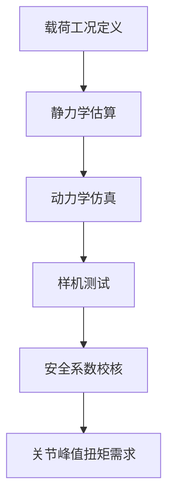
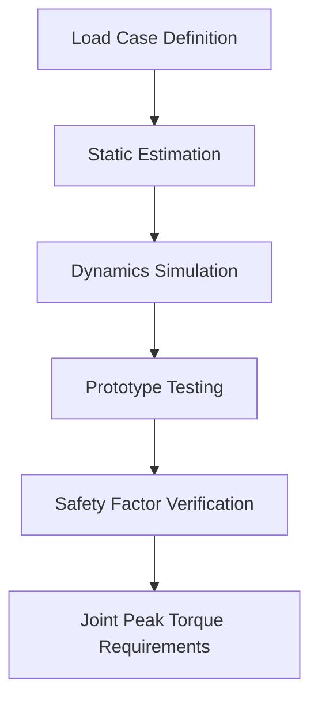
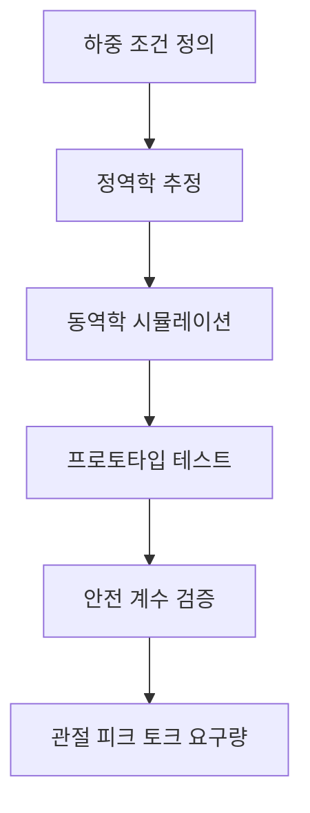

## 概述

载荷工况定义（Definition of load case）是结构强度仿真与迭代（P8）阶段的第一道工序，其任务是把"机器人会经历什么"翻译成"结构必须扛住什么"——即明确载荷的大小、方向、作用点与发生概率，形成《载荷工况表》。它真正改变的不是"算得准不准"这一个点，而是让后续所有仿真、测试与安全系数校核都有了统一的输入基准，避免"各算各的、各测各的"。

## 核心内容

### 是什么：准确定义

载荷工况定义是结构强度仿真与迭代（Structural FEA）工作包中 P8.1「载荷与仿真模型」下的第一个三级子任务。它的核心产物是《载荷工况表》，表中明确记录每一项载荷的四个基本属性：**载荷大小、方向、作用点、发生概率**。这份表格是后续静力学分析、动态冲击仿真、跌落仿真、疲劳寿命评估的共同起点——没有它，有限元模型加载什么、样机测试测什么，都无从谈起。

在 WBS V3 的工序结构中，P8.1.1 向下展开为五个四级动作：输入梳理与目标量化（P8.1.1.1）、方案/方法设计（P8.1.1.2）、实施/原型/样件制作（P8.1.1.3）、验证与问题闭环（P8.1.1.4）、文档输出与下游交付（P8.1.1.5）。这五个动作构成一个完整的工程闭环，而非一次性的"列个清单"。

### 为什么存在：痛点与历史定位

在人形机器人早期开发中，结构强度验证常犯两类错误。第一类是**载荷遗漏**：只算了站立和行走的静载，忘了跌倒冲击、抓取最大负载、单腿支撑这些极端工况，结果样机在测试中突然断裂。第二类是**载荷定义混乱**：仿真团队按自己的假设加载，测试团队按另一套工况执行，两边结果对不上，出了问题互相推诿。

载荷工况定义这道工序的存在，正是为了根治这两个痛点。它要求在图纸冻结之前，把所有可能出现的工况系统性地梳理出来，并量化成统一的表格。这样，仿真、测试、评审三方用的是同一份数据，任何争议都可以追溯到工况表的某一行。它真正改变的不是"算得准不准"这一个点，而是让"设计—仿真—工艺"之间建立起可追溯、可迭代的闭环关系。

### 原理拆解

**① 最严苛工况决定结构设计**

载荷工况定义的第一原则是：**最严苛工况决定结构设计**。这不是说所有工况都要取最大值，而是说结构的关键截面尺寸、材料选择、安全系数必须由最不利的工况来校核。对于人形机器人，典型严苛工况包括：

- **单腿支撑**：行走摆动相中，全身重量由一条腿承担，髋、膝、踝关节承受最大弯矩；
- **跌倒冲击**：意外摔倒时，冲击力可达体重的数倍至十余倍（工程判断），且作用时间极短，属于动态冲击问题；
- **抓取最大负载**：双臂满载时，肩关节和腰部承受最大扭矩与倾覆力矩。

**② 载荷谱的层次结构**

载荷工况不是单一数值，而是一个有层次的结构。从方法/工具角度看，它覆盖五类载荷：

| 载荷类型 | 典型来源 | 分析手段 |
|---------|---------|---------|
| 静力学 | 站立、支撑、悬停 | 静力平衡方程 |
| 动态冲击 | 跌倒、碰撞、急停 | 瞬态动力学仿真 |
| 跌落 | 运输、装配跌落 | 显式动力学分析 |
| 典型运动反力 | 行走、跑步、跳跃 | 多体动力学仿真 |
| 疲劳载荷谱 | 长期循环行走、关节往复 | 疲劳寿命评估 |

**③ 安全系数的兜底作用**

由于载荷估算存在不确定性——材料分散性、动态放大效应、制造偏差——工程上通过安全系数来兜底。安全系数通常取 \(1.5\!-\!2.5\) 覆盖动态不确定性与材料分散性。这个范围不是拍脑袋定的，而是综合考虑了载荷估算精度、材料数据可靠性和失效后果严重程度后的工程惯例。

### 关键参数与规格

载荷工况定义的核心输出是《载荷工况表》，其关键参数包括：

| 参数 | 说明 | 典型范围/取值 |
|------|------|--------------|
| 载荷大小 | 力或力矩的数值 | 由静力学估算与动力学仿真确定 |
| 方向 | 载荷作用的空间方向 | 全局坐标系或局部坐标系定义 |
| 作用点 | 载荷施加的位置 | 关节中心、质心、接触点 |
| 发生概率 | 该工况出现的频率 | 常发、偶发、罕见 |
| 安全系数 | 设计余量 | \(1.5\!-\!2.5\)（按语料） |

表中数值为工程估算，实际设计应通过多体动力学仿真与样机测试迭代确定。这意味着《载荷工况表》不是一次成型、永不修改的，而是随着仿真和测试数据的积累不断更新的"活文档"。

### 横向对比

载荷工况定义与相邻工序的关系可以用一张流程图清晰表达：

与 P8.1.2「仿真模型准备」相比，载荷工况定义回答的是"**加什么力**"，而仿真模型准备回答的是"**在哪里加、怎么离散**"。与 P8.2「结构强度仿真」相比，载荷工况定义是输入，强度仿真是执行。与 P8.4「样机测试验证」相比，载荷工况定义是测试用例设计的依据——测试什么、加载多少、判定标准是什么，都从工况表派生。

### 谁在用·应用案例

载荷工况定义的结果直接服务于三类下游用户：

1. **结构仿真工程师**：将《载荷工况表》中的载荷施加到有限元模型上，进行静力学、动态冲击、跌落和疲劳分析；
2. **样机测试工程师**：根据工况表中的载荷大小与方向设计测试工装和加载方案，验证仿真结果；
3. **关节电机选型工程师**：工况表中的峰值载荷经动力学传递后，转化为关节峰值扭矩需求，用于电机与减速器选型。

在典型的人形机器人开发流程中，载荷工况定义通常在概念设计完成、详细设计启动时进行。此时整机质量、质心位置、关节布置已初步确定，可以支撑有意义的载荷估算。

### 局限与边界

载荷工况定义有明确的边界，不能无限扩展：

- **它不替代仿真**：工况表只定义"加载什么"，不回答"结构能不能扛住"——那是后续强度仿真的任务；
- **它不替代测试**：工况表中的数值是估算值，最终必须通过样机测试迭代确认；
- **它依赖上游输入**：载荷估算需要整机质量、质心、关节运动学参数等上游数据，如果这些输入未冻结，工况表只能是一个"活文档"；
- **概率数据难以精确**：发生概率的估计带有主观性，工程上通常用"常发/偶发/罕见"三档定性描述，而非精确的概率数值。

### 常见误区

1. **"载荷工况就是最大静载"**——错。人形机器人的关键工况往往来自动态冲击（跌倒、跌落）和疲劳循环，静载只是最基础的一项。
2. **"安全系数越大越安全"**——错。安全系数过大意味着结构过重，而重量直接抬高关节扭矩需求与能耗，反而降低整机性能。安全系数通常取 \(1.5\!-\!2.5\) 是权衡的结果。
3. **"工况表一次定死、永不修改"**——错。载荷工况定义是一个迭代过程，随着仿真和测试数据的积累，工况表需要持续更新。
4. **"所有工况都要取最大值"**——错。不同工况对应不同的载荷路径和失效模式，应分别校核，而非简单取最大。

### 相关知识

- `ent_process_p8` — 载荷工况定义是 P8 结构强度仿真与迭代阶段的第一道工序，为其提供统一的载荷输入基准。
- `ent_method_fea_finite_element_analysis` — 载荷工况定义输出的《载荷工况表》是有限元分析的边界条件来源，FEA 是验证工况表假设的核心工具。

## 参考

- [全尺寸双足人形机器人产品开发全流程报告（V3 / 三四级任务展开版）](https://github.com/YansongW/awesome-humanoid-robot/tree/main/docs/humanoid_full_development_workflow_v3.md)
- [项目 Wiki 第 9 章：结构设计与仿真](https://github.com/YansongW/awesome-humanoid-robot/tree/main/wiki/docs/chapters/chapter-09.md)

## Overview

The definition of load cases is the first step in the structural strength simulation and iteration (P8) phase. Its task is to translate "what the robot will experience" into "what the structure must withstand"—that is, to specify the magnitude, direction, point of application, and probability of occurrence of loads, resulting in a *Load Case Table*. What it truly changes is not just "whether the calculations are accurate," but rather it provides a unified input baseline for all subsequent simulations, tests, and safety factor verifications, avoiding "each team calculating and testing independently."

## Content

### What It Is: Precise Definition

Load case definition is the first third-level subtask under P8.1 "Loads and Simulation Models" in the Structural FEA work package. Its core deliverable is the *Load Case Table*, which records four fundamental attributes for each load: **load magnitude, direction, point of application, and probability of occurrence**. This table serves as the common starting point for subsequent static analysis, dynamic impact simulation, drop simulation, and fatigue life assessment—without it, there is no basis for what to apply in finite element models or what to test on prototypes.

In the WBS V3 process structure, P8.1.1 expands into five fourth-level actions: input review and target quantification (P8.1.1.1), solution/method design (P8.1.1.2), implementation/prototype/sample fabrication (P8.1.1.3), verification and issue closure (P8.1.1.4), and documentation output and downstream delivery (P8.1.1.5). These five actions form a complete engineering loop, rather than a one-off "list-making" exercise.

### Why It Exists: Pain Points and Historical Context

In early humanoid robot development, structural strength verification often suffered from two types of errors. The first is **load omission**: only static loads from standing and walking were considered, while extreme conditions such as fall impacts, maximum payload grasping, and single-leg support were overlooked, resulting in sudden fractures during prototype testing. The second is **inconsistent load definitions**: the simulation team applied loads based on its own assumptions, while the test team executed a different set of conditions, leading to mismatched results and mutual blame when problems arose.

The existence of the load case definition step is precisely to address these two pain points. It requires systematically identifying all possible operating conditions before design freeze and quantifying them into a unified table. This ensures that simulation, testing, and review teams all use the same data, and any dispute can be traced back to a specific row in the load case table. What it truly changes is not just "whether the calculations are accurate," but rather establishing a traceable, iterative closed loop among "design—simulation—manufacturing."

### Principle Breakdown

**① The Most Severe Load Case Determines Structural Design**

The first principle of load case definition is: **the most severe load case determines structural design**. This does not mean taking the maximum value for all conditions, but rather that critical cross-section dimensions, material selection, and safety factors must be verified against the most unfavorable condition. For humanoid robots, typical severe conditions include:

- **Single-leg support**: During the swing phase of walking, the entire body weight is borne by one leg, with the hip, knee, and ankle joints experiencing maximum bending moments;
- **Fall impact**: In an accidental fall, impact forces can reach several to more than ten times body weight (engineering judgment), with extremely short duration, constituting a dynamic impact problem;
- **Maximum payload grasping**: When both arms are fully loaded, the shoulder joints and waist experience maximum torque and overturning moment.

**② Hierarchical Structure of Load Spectra**

Load cases are not a single value but a hierarchical structure. From a method/tool perspective, they cover five types of loads:

| Load Type | Typical Sources | Analysis Method |
|-----------|----------------|-----------------|
| Static | Standing, support, hovering | Static equilibrium equations |
| Dynamic impact | Falls, collisions, emergency stops | Transient dynamics simulation |
| Drop | Transportation, assembly drops | Explicit dynamics analysis |
| Typical motion reaction forces | Walking, running, jumping | Multibody dynamics simulation |
| Fatigue load spectra | Long-term cyclic walking, joint reciprocation | Fatigue life assessment |

**③ Safety Factor as a Safety Net**

Due to uncertainties in load estimation—material variability, dynamic amplification effects, manufacturing tolerances—engineering practice uses safety factors as a safety net. Safety factors typically range from \(1.5\!-\!2.5\) to cover dynamic uncertainties and material variability. This range is not arbitrary but is an engineering convention that considers load estimation accuracy, material data reliability, and the severity of failure consequences.

### Key Parameters and Specifications

The core output of load case definition is the *Load Case Table*, whose key parameters include:

| Parameter | Description | Typical Range/Value |
|-----------|-------------|---------------------|
| Load magnitude | Force or moment value | Determined by static estimation and dynamics simulation |
| Direction | Spatial direction of load application | Defined in global or local coordinate systems |
| Point of application | Location where load is applied | Joint center, center of mass, contact point |
| Probability of occurrence | Frequency of the condition | Frequent, occasional, rare |
| Safety factor | Design margin | \(1.5\!-\!2.5\) (per source material) |

The values in the table are engineering estimates; actual design should be iteratively determined through multibody dynamics simulation and prototype testing. This means the *Load Case Table* is not a one-time, immutable document but a "living document" that is continuously updated as simulation and test data accumulate.

### Horizontal Comparison

The relationship between load case definition and adjacent processes can be clearly expressed with a flowchart:

Compared with P8.1.2 "Simulation Model Preparation," load case definition answers "**what forces to apply**," while simulation model preparation answers "**where to apply them and how to discretize**." Compared with P8.2 "Structural Strength Simulation," load case definition is the input, and strength simulation is the execution. Compared with P8.4 "Prototype Test Verification," load case definition is the basis for test case design—what to test, how much to load, and what the acceptance criteria are all derive from the load case table.

### Who Uses It · Application Cases

The results of load case definition directly serve three types of downstream users:

1. **Structural simulation engineers**: Apply the loads from the *Load Case Table* to finite element models for static, dynamic impact, drop, and fatigue analyses;
2. **Prototype test engineers**: Design test fixtures and loading schemes based on the load magnitudes and directions in the table to verify simulation results;
3. **Joint motor selection engineers**: Peak loads in the table are transformed through dynamics into joint peak torque requirements for motor and reducer selection.

In a typical humanoid robot development process, load case definition is performed after concept design is complete and detailed design begins. At this point, the overall mass, center of mass location, and joint layout are preliminarily determined, enabling meaningful load estimation.

### Limitations and Boundaries

Load case definition has clear boundaries and cannot be extended indefinitely:

- **It does not replace simulation**: The load case table only defines "what to apply," not "whether the structure can withstand it"—that is the task of subsequent strength simulation;
- **It does not replace testing**: The values in the table are estimates and must ultimately be confirmed through iterative prototype testing;
- **It depends on upstream inputs**: Load estimation requires upstream data such as overall mass, center of mass, and joint kinematics parameters; if these inputs are not frozen, the load case table can only be a "living document";
- **Probability data is difficult to quantify precisely**: Estimates of occurrence probability carry subjectivity; engineering practice typically uses qualitative categories such as "frequent/occasional/rare" rather than precise probability values.

### Common Misconceptions

1. **"Load cases are just maximum static loads"**—Wrong. The critical conditions for humanoid robots often come from dynamic impacts (falls, drops) and fatigue cycles; static loads are only the most basic item.
2. **"The larger the safety factor, the safer"**—Wrong. An excessively large safety factor means an overweight structure, which directly increases joint torque requirements and energy consumption, ultimately degrading overall performance. A safety factor of \(1.5\!-\!2.5\) is the result of a trade-off.
3. **"The load case table is fixed once and never modified"**—Wrong. Load case definition is an iterative process; the table must be continuously updated as simulation and test data accumulate.
4. **"All load cases should take maximum values"**—Wrong. Different load cases correspond to different load paths and failure modes and should be verified separately, rather than simply taking the maximum.

### Related Knowledge

- `ent_process_p8` — Load case definition is the first step in the P8 structural strength simulation and iteration phase, providing a unified load input baseline.
- `ent_method_fea_finite_element_analysis` — The *Load Case Table* output by load case definition is the source of boundary conditions for finite element analysis; FEA is the core tool for validating the assumptions in the load case table.

## 개요

하중 조건 정의(Definition of load case)는 구조 강도 시뮬레이션 및 반복(P8) 단계의 첫 번째 공정으로, "로봇이 무엇을 겪게 될지"를 "구조가 무엇을 견뎌야 하는지"로 변환하는 작업입니다. 즉, 하중의 크기, 방향, 작용점 및 발생 확률을 명확히 하여 《하중 조건표》를 작성합니다. 이는 "계산이 정확한지"라는 한 가지 측면만 바꾸는 것이 아니라, 이후의 모든 시뮬레이션, 테스트 및 안전 계수 검증이 통일된 입력 기준을 갖도록 하여 "각자 계산하고, 각자 테스트하는" 상황을 방지합니다.

## 핵심 내용

### 무엇인가: 정확한 정의

하중 조건 정의는 구조 강도 시뮬레이션(Structural FEA) 작업 패키지에서 P8.1「하중 및 시뮬레이션 모델」의 첫 번째 3차 하위 작업입니다. 핵심 산출물은 《하중 조건표》이며, 표에는 각 하중의 네 가지 기본 속성인 **하중 크기, 방향, 작용점, 발생 확률**이 명확히 기록됩니다. 이 표는 이후의 정적 해석, 동적 충격 시뮬레이션, 낙하 시뮬레이션, 피로 수명 평가의 공통 출발점입니다. 이 표가 없으면 유한 요소 모델에 무엇을 로딩하고, 프로토타입 테스트에서 무엇을 측정할지조차 논의할 수 없습니다.

WBS V3의 공정 구조에서 P8.1.1은 다섯 가지 4차 작업으로 세분화됩니다: 입력 정리 및 목표 정량화(P8.1.1.1), 방안/방법 설계(P8.1.1.2), 구현/프로토타입/시제품 제작(P8.1.1.3), 검증 및 문제 폐루프(P8.1.1.4), 문서 출력 및 하류 전달(P8.1.1.5). 이 다섯 가지 작업은 일회성 "목록 작성"이 아닌 완전한 엔지니어링 폐루프를 구성합니다.

### 왜 존재하는가: 문제점과 역사적 위치

휴머노이드 로봇 초기 개발에서 구조 강도 검증은 종종 두 가지 유형의 오류를 범합니다. 첫 번째는 **하중 누락**입니다: 서기와 걷기의 정적 하중만 계산하고, 낙상 충격, 최대 페이로드 파지, 한쪽 다리 지지와 같은 극한 조건을 잊어버려 프로토타입이 테스트 중 갑자기 파손되는 경우입니다. 두 번째는 **하중 정의 혼란**입니다: 시뮬레이션 팀은 자체 가정에 따라 로딩하고, 테스트 팀은 다른 조건 세트로 실행하여 양쪽 결과가 일치하지 않고, 문제 발생 시 서로 책임을 회피합니다.

하중 조건 정의 공정의 존재 이유는 바로 이 두 가지 문제점을 근본적으로 해결하기 위함입니다. 이는 도면 동결 전에 발생 가능한 모든 조건을 체계적으로 정리하고, 통일된 표로 정량화하도록 요구합니다. 이렇게 하면 시뮬레이션, 테스트, 검토 세 당사자가 동일한 데이터를 사용하며, 모든 논쟁은 조건표의 특정 행으로 추적할 수 있습니다. 이는 "계산이 정확한지"라는 한 가지 측면만 바꾸는 것이 아니라 "설계-시뮬레이션-공정" 간에 추적 가능하고 반복 가능한 폐루프 관계를 구축하게 합니다.

### 원리 분석

**① 가장 가혹한 조건이 구조 설계를 결정**

하중 조건 정의의 첫 번째 원칙은 **가장 가혹한 조건이 구조 설계를 결정한다**는 것입니다. 이는 모든 조건에서 최대값을 취해야 한다는 의미가 아니라, 구조의 핵심 단면 치수, 재료 선택, 안전 계수가 가장 불리한 조건에 의해 검증되어야 한다는 의미입니다. 휴머노이드 로봇의 대표적인 가혹 조건은 다음과 같습니다:

- **한쪽 다리 지지**: 보행 스윙 단계에서 전신 중량이 한쪽 다리에 집중되어, 고관절, 무릎, 발목 관절이 최대 굽힘 모멘트를 받습니다;
- **낙상 충격**: 예상치 못한 넘어짐 시 충격력은 체중의 수 배에서 십여 배(공학적 판단)에 달할 수 있으며, 작용 시간이 매우 짧아 동적 충격 문제에 해당합니다;
- **최대 페이로드 파지**: 양팔이 만재 상태일 때 어깨 관절과 허리가 최대 토크와 전복 모멘트를 받습니다.

**② 하중 스펙트럼의 계층 구조**

하중 조건은 단일 수치가 아니라 계층적 구조입니다. 방법/도구 관점에서 다섯 가지 하중 유형을 포함합니다:

| 하중 유형 | 대표적 출처 | 분석 수단 |
|---------|---------|---------|
| 정역학 | 서기, 지지, 정지 | 정적 평형 방정식 |
| 동적 충격 | 낙상, 충돌, 급정지 | 과도 동역학 시뮬레이션 |
| 낙하 | 운송, 조립 낙하 | 명시적 동역학 해석 |
| 대표 운동 반력 | 걷기, 달리기, 점프 | 다물체 동역학 시뮬레이션 |
| 피로 하중 스펙트럼 | 장기 순환 보행, 관절 왕복 | 피로 수명 평가 |

**③ 안전 계수의 보완 역할**

하중 추정에는 불확실성(재료 분산성, 동적 증폭 효과, 제조 편차)이 존재하므로, 공학에서는 안전 계수로 보완합니다. 안전 계수는 일반적으로 \(1.5\!-\!2.5\)를 취하여 동적 불확실성과 재료 분산성을 포함합니다. 이 범위는 임의로 정한 것이 아니라, 하중 추정 정밀도, 재료 데이터 신뢰성 및 파손 결과의 심각성을 종합적으로 고려한 공학적 관례입니다.

### 핵심 매개변수 및 사양

하중 조건 정의의 핵심 출력은 《하중 조건표》이며, 핵심 매개변수는 다음과 같습니다:

| 매개변수 | 설명 | 대표 범위/값 |
|------|------|--------------|
| 하중 크기 | 힘 또는 모멘트의 수치 | 정역학 추정 및 동역학 시뮬레이션으로 결정 |
| 방향 | 하중이 작용하는 공간 방향 | 전역 좌표계 또는 국부 좌표계로 정의 |
| 작용점 | 하중이 가해지는 위치 | 관절 중심, 질량 중심, 접촉점 |
| 발생 확률 | 해당 조건의 발생 빈도 | 상시, 간헐, 희귀 |
| 안전 계수 | 설계 여유 | \(1.5\!-\!2.5\)(자료 기준) |

표의 수치는 공학적 추정치이며, 실제 설계는 다물체 동역학 시뮬레이션과 프로토타입 테스트 반복을 통해 결정해야 합니다. 이는 《하중 조건표》가 한 번에 완성되어 수정되지 않는 것이 아니라, 시뮬레이션과 테스트 데이터가 축적됨에 따라 지속적으로 업데이트되는 "살아있는 문서"임을 의미합니다.

### 수평 비교

하중 조건 정의와 인접 공정의 관계는 하나의 흐름도로 명확히 표현할 수 있습니다:

P8.1.2「시뮬레이션 모델 준비」와 비교하면, 하중 조건 정의는 "**어떤 힘을 가할지**"를 다루고, 시뮬레이션 모델 준비는 "**어디에 가하고, 어떻게 이산화할지**"를 다룹니다. P8.2「구조 강도 시뮬레이션」과 비교하면, 하중 조건 정의는 입력이고 강도 시뮬레이션은 실행입니다. P8.4「프로토타입 테스트 검증」과 비교하면, 하중 조건 정의는 테스트 케이스 설계의 근거입니다—무엇을 테스트할지, 얼마나 로딩할지, 판정 기준이 무엇인지 모두 조건표에서 파생됩니다.

### 사용자·적용 사례

하중 조건 정의의 결과는 세 가지 유형의 하류 사용자에게 직접 서비스를 제공합니다:

1. **구조 시뮬레이션 엔지니어**: 《하중 조건표》의 하중을 유한 요소 모델에 적용하여 정역학, 동적 충격, 낙하 및 피로 해석을 수행합니다;
2. **프로토타입 테스트 엔지니어**: 조건표의 하중 크기와 방향에 따라 테스트 지그와 로딩 방안을 설계하여 시뮬레이션 결과를 검증합니다;
3. **관절 모터 선정 엔지니어**: 조건표의 피크 하중이 동역학 전달을 통해 관절 피크 토크 요구량으로 변환되어 모터와 감속기 선정에 사용됩니다.

대표적인 휴머노이드 로봇 개발 프로세스에서 하중 조건 정의는 일반적으로 개념 설계 완료 후, 상세 설계 시작 시 수행됩니다. 이 시점에는 전체 기계 질량, 질량 중심 위치, 관절 배치가 초기 결정되어 의미 있는 하중 추정을 지원할 수 있습니다.

### 한계와 경계

하중 조건 정의는 명확한 경계를 가지며 무한히 확장될 수 없습니다:

- **시뮬레이션을 대체하지 않음**: 조건표는 "무엇을 로딩할지"만 정의하고 "구조가 견딜 수 있는지"는 답하지 않습니다—이는 이후의 강도 시뮬레이션의 작업입니다;
- **테스트를 대체하지 않음**: 조건표의 수치는 추정치이며, 최종적으로 프로토타입 테스트 반복을 통해 확인해야 합니다;
- **상류 입력에 의존**: 하중 추정은 전체 기계 질량, 질량 중심, 관절 운동학 매개변수 등 상류 데이터가 필요하며, 이러한 입력이 동결되지 않으면 조건표는 "살아있는 문서"일 수밖에 없습니다;
- **확률 데이터의 정밀성 부족**: 발생 확률 추정에는 주관성이 포함되며, 공학에서는 일반적으로 "상시/간헐/희귀"의 세 단계 정성적 설명을 사용하고 정밀한 확률 수치는 사용하지 않습니다.

### 일반적인 오해

1. **"하중 조건은 최대 정적 하중이다"**—틀림. 휴머노이드 로봇의 핵심 조건은 종종 동적 충격(낙상, 낙하)과 피로 순환에서 발생하며, 정적 하중은 가장 기본적인 항목일 뿐입니다.
2. **"안전 계수가 클수록 안전하다"**—틀림. 안전 계수가 과도하면 구조가 과중해지고, 중량은 관절 토크 요구량과 에너지 소비를 직접 높여 오히려 전체 성능을 저하시킵니다. 안전 계수는 일반적으로 \(1.5\!-\!2.5\)를 취하는 것이 균형의 결과입니다.
3. **"조건표는 한 번 정하면 수정되지 않는다"**—틀림. 하중 조건 정의는 반복 프로세스이며, 시뮬레이션과 테스트 데이터가 축적됨에 따라 조건표는 지속적으로 업데이트되어야 합니다.
4. **"모든 조건에서 최대값을 취해야 한다"**—틀림. 서로 다른 조건은 서로 다른 하중 경로와 파손 모드에 해당하므로, 단순히 최대값을 취하는 것이 아니라 각각 검증해야 합니다.

### 관련 지식

- `ent_process_p8` — 하중 조건 정의는 P8 구조 강도 시뮬레이션 및 반복 단계의 첫 번째 공정으로, 통일된 하중 입력 기준을 제공합니다.
- `ent_method_fea_finite_element_analysis` — 하중 조건 정의가 출력하는 《하중 조건표》는 유한 요소 해석의 경계 조건 출처이며, FEA는 조건표 가정을 검증하는 핵심 도구입니다.
