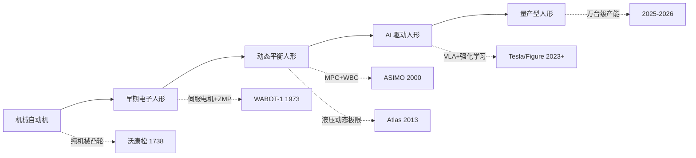

## 概述
演示指标与产品指标的鸿沟是人形机器人领域的重要概念。以下内容整理自项目 Wiki，供深入查阅。

## 核心内容
与 ASIMO 和早期 Atlas 不同，2025–2026 年的新浪潮强调**真实场景中的长期部署和量产可行性**：

- **Tesla Optimus**：2026 年 1 月 21 日，Gen 3 在弗里蒙特工厂启动量产；Model S/X 产线被改造为 Optimus 生产线，目标年产能 100 万台；得州 Gigafactory 在建专用工厂，目标年产能 1000 万台。
- **Figure AI**：2025 年 9 月完成 10 亿美元 C 轮融资，估值 390 亿美元；Figure 02 在宝马斯巴达堡工厂完成 11 个月部署，搬运 9 万余个零件，参与生产 3 万余辆 BMW X3。
- **中国厂商**：宇树科技 2025 年营收 17.08 亿元、扣非净利润约 6 亿元，2026 年科创板 IPO 已获受理；智元机器人 2025 年出货量据 Omdia 统计达 5168 台，全球第一；优必选 2025 年人形机器人订单近 14 亿元人民币。

这一波浪潮的核心驱动力是：

1. AI 大模型和 VLA 使机器人获得了更强的感知、理解和泛化能力。
2. 精密制造和供应链成熟使核心零部件成本快速下降。
3. 劳动力成本上升和制造业自动化需求提供了明确市场。
4. 资本市场愿意为头部玩家提供大规模资金支持。



---

## 参考
- Wiki extraction
- 项目 Wiki：chapter-01.md#1.2.8 2025–2026 年新一波浪潮：从演示到真实部署

## Overview
The gap between demonstration metrics and product metrics is an important concept in the humanoid robot field. The following content is compiled from the project Wiki for in-depth reference.

## Content
Unlike ASIMO and early Atlas, the new wave of 2025–2026 emphasizes **long-term deployment in real-world scenarios and mass production feasibility**:

- **Tesla Optimus**: On January 21, 2026, Gen 3 began mass production at the Fremont factory; the Model S/X production line was converted into an Optimus production line, targeting an annual capacity of 1 million units; a dedicated factory is under construction at the Texas Gigafactory, targeting an annual capacity of 10 million units.
- **Figure AI**: Completed a $1 billion Series C funding round in September 2025, with a valuation of $39 billion; Figure 02 completed an 11-month deployment at BMW's Spartanburg factory, handling over 90,000 parts and contributing to the production of more than 30,000 BMW X3 vehicles.
- **Chinese Manufacturers**: Unitree Technology reported 2025 revenue of 1.708 billion yuan and non-GAAP net profit of approximately 600 million yuan, with its 2026 STAR Market IPO application accepted; Zhiyuan Robotics shipped 5,168 units in 2025, ranking first globally according to Omdia; UBTech received nearly 1.4 billion yuan in humanoid robot orders in 2025.

The core driving forces of this wave are:

1. AI large models and VLA have endowed robots with stronger perception, understanding, and generalization capabilities.
2. Precision manufacturing and supply chain maturity have rapidly reduced the cost of core components.
3. Rising labor costs and demand for manufacturing automation provide a clear market.
4. The capital market is willing to provide large-scale financial support to leading players.

```mermaid
graph LR
    A[Mechanical Automaton] --> B[Early Electronic Humanoid]
    B --> C[Dynamic Balance Humanoid]
    C --> D[AI-Driven Humanoid]
    D --> E[Mass-Produced Humanoid]

    A -.->|Pure Mechanical Cam| A1[Vaucanson 1738]
    B -.->|Servo Motor + ZMP| B1[WABOT-1 1973]
    C -.->|MPC + WBC| C1[ASIMO 2000]
    C -.->|Hydraulic Dynamic Limits| C2[Atlas 2013]
    D -.->|VLA + Reinforcement Learning| D1[Tesla/Figure 2023+]
    E -.->|10,000-Unit Capacity| E1[2025-2026]

## 개요
데모 지표와 제품 지표 간의 격차는 휴머노이드 로봇 분야의 중요한 개념입니다. 아래 내용은 프로젝트 Wiki에서 정리한 것으로, 심층적인 참고를 위해 제공됩니다.

## 핵심 내용
ASIMO 및 초기 Atlas와 달리, 2025–2026년의 새로운 흐름은 **실제 환경에서의 장기 배치 및 양산 가능성**을 강조합니다:

- **Tesla Optimus**: 2026년 1월 21일, Gen 3가 프리몬트 공장에서 양산을 시작했습니다. Model S/X 생산 라인이 Optimus 생산 라인으로 개조되었으며, 연간 목표 생산량은 100만 대입니다. 텍사스 기가팩토리에 전용 공장이 건설 중이며, 연간 목표 생산량은 1000만 대입니다.
- **Figure AI**: 2025년 9월에 10억 달러 규모의 시리즈 C 펀딩을 완료했으며, 기업 가치는 390억 달러입니다. Figure 02는 BMW 스파르탄버그 공장에서 11개월간 배치되어 9만 개 이상의 부품을 운반하고, 3만 대 이상의 BMW X3 생산에 참여했습니다.
- **중국 제조사**: 위슈 테크놀로지는 2025년 매출 17.08억 위안, 비경상손익 제외 순이익 약 6억 위안을 기록했으며, 2026년 커촹반 상장이 승인되었습니다. 즈위안 로봇은 2025년 출하량이 Omdia 통계 기준 5,168대로 세계 1위를 기록했습니다. 유비테크는 2025년 휴머노이드 로봇 주문이 약 14억 위안에 달했습니다.

이번 흐름의 핵심 동력은 다음과 같습니다:

1. AI 대규모 모델과 VLA를 통해 로봇이 더 강력한 인식, 이해 및 일반화 능력을 갖추게 되었습니다.
2. 정밀 제조와 공급망의 성숙으로 핵심 부품 비용이 빠르게 하락했습니다.
3. 인건비 상승과 제조업 자동화 수요가 명확한 시장을 제공했습니다.
4. 자본 시장이 선두 기업에 대규모 자금 지원을 제공할 의향이 있습니다.

```mermaid
graph LR
    A[기계적 자동장치] --> B[초기 전자 휴머노이드]
    B --> C[동적 균형 휴머노이드]
    C --> D[AI 구동 휴머노이드]
    D --> E[양산형 휴머노이드]

    A -.->|순수 기계 캠| A1[보캉송 1738]
    B -.->|서보 모터+ZMP| B1[WABOT-1 1973]
    C -.->|MPC+WBC| C1[ASIMO 2000]
    C -.->|유압 동적 한계| C2[Atlas 2013]
    D -.->|VLA+강화 학습| D1[Tesla/Figure 2023+]
    E -.->|만 대급 생산 능력| E1[2025-2026]
