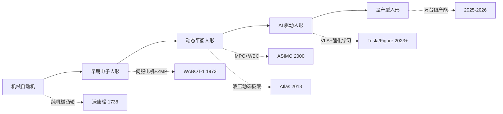

## 概述
演示指标与产品指标的鸿沟是人形机器人领域的重要concept。以下内容整理自项目 Wiki，供深入查阅。

## 核心内容
与 ASIMO 和早期 Atlas 不同，2025–2026 年的新浪潮强调**真实场景中的长期部署和量产可行性**：

- **Tesla Optimus**：2026 年 1 月 21 日，Gen 3 在弗里蒙特工厂启动量产；Model S/X 产线被改造为 Optimus 生产线，目标年产能 100 万台；得州 Gigafactory 在建专用工厂，目标年产能 1000 万台。
- **Figure AI**：2025 年 9 月完成 10 亿美元 C 轮融资，估值 390 亿美元；Figure 02 在宝马斯巴达堡工厂完成 11 个月部署，搬运 9 万余个零件，参与生产 3 万余辆 BMW X3。
- **中国厂商**：宇树科技 2025 年营收 17.08 亿元、扣非净利润约 6 亿元，2026 年科创板 IPO 已获受理；智元机器人 2025 年出货量据 Omdia 统计达 5168 台，全球第一；优必选 2025 年人形机器人订单近 14 亿元人民币。

这一波浪潮的核心驱动力是：

1. AI 大模型和 VLA 使机器人获得了更强的感知、理解和泛化能力。
2. 精密制造和供应链成熟使核心零部件成本快速下降。
3. 劳动力成本上升和制造业自动化需求提供了明确市场。
4. 资本市场愿意为头部玩家提供大规模资金支持。

---

## 参考
- Wiki extraction
- 项目 Wiki：chapter-01.md#1.2.8 2025–2026 年新一波浪潮：从演示到真实部署

