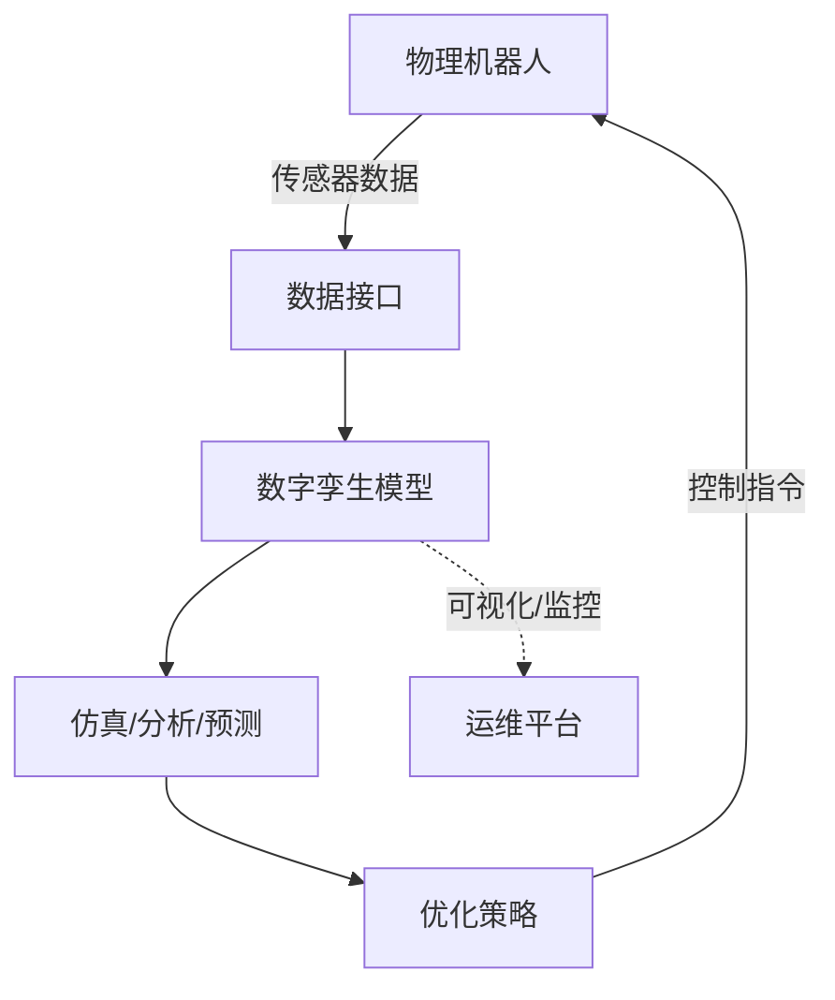

## 概述
数字孪生是人形机器人领域的重要概念。以下内容整理自项目 Wiki，供深入查阅。

## 核心内容
**数字孪生（digital twin）**是物理实体在数字空间的实时映射，可用于设计验证、虚拟调试、健康监测与预测性维护。

!!! note "术语解释：数字孪生、虚拟样机、虚拟调试、预测性维护、在线映射"
    - **数字孪生（digital twin）**：物理系统的高保真数字映射，可实时同步状态。
    - **虚拟样机（virtual prototype）**：在软件中构建的产品模型，用于仿真验证。
    - **虚拟调试（virtual commissioning）**：在虚拟环境中验证控制逻辑与软件。
    - **预测性维护（predictive maintenance）**：基于状态监测预测故障并提前维护。
    - **在线映射（online mapping）**：物理状态实时反馈到数字模型的过程。

人形机器人数字孪生工作流通常包括：

1. **高保真模型**：CAD/CAE 模型 + 多体动力学 + 传感器模型。
2. **仿真平台**：Isaac Sim、Gazebo、MuJoCo、Webots 等。
3. **数据接口**：ROS 2、DDS、EtherCAT 等实现虚实数据同步。
4. **在线标定**：通过真实传感器数据修正模型参数。
5. **闭环优化**：在数字空间中测试控制策略，再部署到实体。

!!! note "术语解释：高保真模型、仿真平台、数据接口、在线标定、闭环优化"
    - **高保真模型（high-fidelity model）**：接近真实物理行为的详细模型。
    - **仿真平台（simulation platform）**：提供物理引擎与可视化环境的软件。
    - **数据接口（data interface）**：不同系统之间交换数据的协议与 API。
    - **在线标定（online calibration）**：利用实际数据修正模型参数。
    - **闭环优化（closed-loop optimization）**：根据反馈持续改进设计或控制。



## 参考
- Wiki extraction
- 项目 Wiki：chapter-08.md#8.8.3 数字孪生：从虚拟样机到在线映射

## Overview
Digital twin is an important concept in the field of humanoid robots. The following content is compiled from the project Wiki for in-depth reference.

## Content
A **digital twin** is a real-time mapping of a physical entity in digital space, which can be used for design verification, virtual commissioning, health monitoring, and predictive maintenance.

!!! note "Terminology: Digital Twin, Virtual Prototype, Virtual Commissioning, Predictive Maintenance, Online Mapping"
    - **Digital twin**: A high-fidelity digital mapping of a physical system that can synchronize states in real time.
    - **Virtual prototype**: A product model built in software for simulation and verification.
    - **Virtual commissioning**: Verifying control logic and software in a virtual environment.
    - **Predictive maintenance**: Predicting failures based on condition monitoring and performing maintenance in advance.
    - **Online mapping**: The process of feeding physical states back to the digital model in real time.

The digital twin workflow for humanoid robots typically includes:

1. **High-fidelity model**: CAD/CAE models + multibody dynamics + sensor models.
2. **Simulation platform**: Isaac Sim, Gazebo, MuJoCo, Webots, etc.
3. **Data interface**: ROS 2, DDS, EtherCAT, etc., for synchronizing virtual and real data.
4. **Online calibration**: Correcting model parameters using real sensor data.
5. **Closed-loop optimization**: Testing control strategies in digital space before deploying them to the physical entity.

!!! note "Terminology: High-Fidelity Model, Simulation Platform, Data Interface, Online Calibration, Closed-Loop Optimization"
    - **High-fidelity model**: A detailed model that closely approximates real physical behavior.
    - **Simulation platform**: Software providing a physics engine and visualization environment.
    - **Data interface**: Protocols and APIs for data exchange between different systems.
    - **Online calibration**: Using actual data to correct model parameters.
    - **Closed-loop optimization**: Continuously improving design or control based on feedback.

```mermaid
flowchart TD
    A["Physical Robot"] -->|"Sensor Data"| B["Data Interface"]
    B --> C["Digital Twin Model"]
    C --> D["Simulation/Analysis/Prediction"]
    D --> E["Optimization Strategy"]
    E -->|"Control Commands"| A
    C -.->|"Visualization/Monitoring"| F["Operations Platform"]

## 개요
디지털 트윈은 휴머노이드 로봇 분야의 중요한 개념입니다. 아래 내용은 프로젝트 Wiki에서 정리한 것으로, 자세한 내용을 확인할 수 있습니다.

## 핵심 내용
**디지털 트윈(digital twin)**은 물리적 실체를 디지털 공간에 실시간으로 매핑한 것으로, 설계 검증, 가상 시운전, 상태 모니터링 및 예측 유지보수에 활용될 수 있습니다.

!!! note "용어 설명: 디지털 트윈, 가상 프로토타입, 가상 시운전, 예측 유지보수, 온라인 매핑"
    - **디지털 트윈(digital twin)** : 물리적 시스템의 고충실도 디지털 매핑으로, 실시간으로 상태를 동기화합니다.
    - **가상 프로토타입(virtual prototype)** : 소프트웨어로 구축된 제품 모델로, 시뮬레이션 검증에 사용됩니다.
    - **가상 시운전(virtual commissioning)** : 가상 환경에서 제어 로직과 소프트웨어를 검증합니다.
    - **예측 유지보수(predictive maintenance)** : 상태 모니터링을 기반으로 고장을 예측하고 사전에 유지보수합니다.
    - **온라인 매핑(online mapping)** : 물리적 상태를 디지털 모델에 실시간으로 피드백하는 과정입니다.

휴머노이드 로봇 디지털 트윈 워크플로우는 일반적으로 다음을 포함합니다:

1. **고충실도 모델** : CAD/CAE 모델 + 다물체 동역학 + 센서 모델.
2. **시뮬레이션 플랫폼** : Isaac Sim, Gazebo, MuJoCo, Webots 등.
3. **데이터 인터페이스** : ROS 2, DDS, EtherCAT 등으로 가상-실제 데이터 동기화 구현.
4. **온라인 캘리브레이션** : 실제 센서 데이터를 통해 모델 파라미터 수정.
5. **폐루프 최적화** : 디지털 공간에서 제어 전략을 테스트한 후 실제 로봇에 배포.

!!! note "용어 설명: 고충실도 모델, 시뮬레이션 플랫폼, 데이터 인터페이스, 온라인 캘리브레이션, 폐루프 최적화"
    - **고충실도 모델(high-fidelity model)** : 실제 물리적 동작에 가까운 상세 모델.
    - **시뮬레이션 플랫폼(simulation platform)** : 물리 엔진과 시각화 환경을 제공하는 소프트웨어.
    - **데이터 인터페이스(data interface)** : 서로 다른 시스템 간 데이터 교환을 위한 프로토콜 및 API.
    - **온라인 캘리브레이션(online calibration)** : 실제 데이터를 활용하여 모델 파라미터를 수정.
    - **폐루프 최적화(closed-loop optimization)** : 피드백에 따라 설계 또는 제어를 지속적으로 개선.

```mermaid
flowchart TD
    A["물리적 로봇"] -->|"센서 데이터"| B["데이터 인터페이스"]
    B --> C["디지털 트윈 모델"]
    C --> D["시뮬레이션/분석/예측"]
    D --> E["최적화 전략"]
    E -->|"제어 명령"| A
    C -.->|"시각화/모니터링"| F["운영 플랫폼"]
