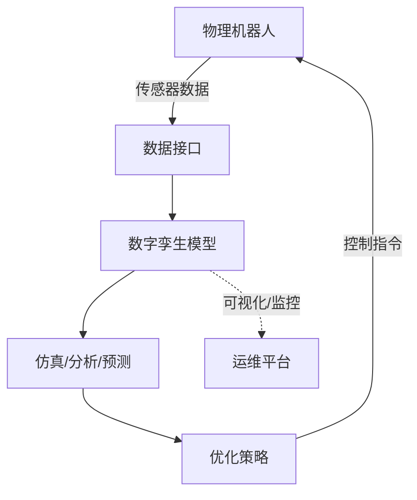

## 概述
数字孪生是人形机器人领域的重要概念。以下内容整理自项目 Wiki，供深入查阅。

## 核心内容
**数字孪生（digital twin）**是物理实体在数字空间的实时映射，可用于设计验证、虚拟调试、健康监测与预测性维护。

!!! note "术语解释：数字孪生、虚拟样机、虚拟调试、预测性维护、在线映射"
    - **数字孪生（digital twin）**：物理系统的高保真数字映射，可实时同步状态。
    - **虚拟样机（virtual prototype）**：在软件中构建的产品模型，用于仿真验证。
    - **虚拟调试（virtual commissioning）**：在虚拟环境中验证控制逻辑与软件。
    - **预测性维护（predictive maintenance）**：基于状态监测预测故障并提前维护。
    - **在线映射（online mapping）**：物理状态实时反馈到数字模型的过程。

人形机器人数字孪生工作流通常包括：

1. **高保真模型**：CAD/CAE 模型 + 多体动力学 + 传感器模型。
2. **仿真平台**：Isaac Sim、Gazebo、MuJoCo、Webots 等。
3. **数据接口**：ROS 2、DDS、EtherCAT 等实现虚实数据同步。
4. **在线标定**：通过真实传感器数据修正模型参数。
5. **闭环优化**：在数字空间中测试控制策略，再部署到实体。

!!! note "术语解释：高保真模型、仿真平台、数据接口、在线标定、闭环优化"
    - **高保真模型（high-fidelity model）**：接近真实物理行为的详细模型。
    - **仿真平台（simulation platform）**：提供物理引擎与可视化环境的软件。
    - **数据接口（data interface）**：不同系统之间交换数据的协议与 API。
    - **在线标定（online calibration）**：利用实际数据修正模型参数。
    - **闭环优化（closed-loop optimization）**：根据反馈持续改进设计或控制。

## 参考
- Wiki extraction
- 项目 Wiki：chapter-08.md#8.8.3 数字孪生：从虚拟样机到在线映射

