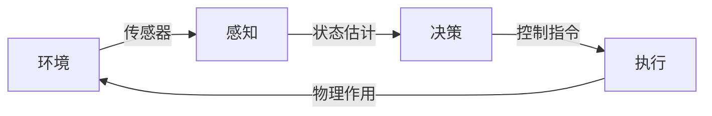

## 概述
具身通用智能是人形机器人领域的重要概念。以下内容整理自项目 Wiki，供深入查阅。

## 核心内容
从控制理论和系统科学出发，机器人可以被形式化为一个**动态系统**（Dynamical System）：

$$
\dot{x}(t) = f\big(x(t), u(t)\big), \quad y(t) = h\big(x(t), u(t)\big)
$$

其中：

- $x(t) \in \mathbb{R}^n$ 是系统状态向量，例如关节角度、角速度、质心位置、姿态四元数等；
- $u(t) \in \mathbb{R}^m$ 是控制输入，例如电机电流、扭矩或电压；
- $y(t) \in \mathbb{R}^p$ 是系统输出，即传感器测量；
- $f$ 是状态转移函数，描述系统动力学；
- $h$ 是观测函数，描述传感器模型。

!!! note "术语解释：状态空间（State Space）"
    状态空间是控制理论中描述动态系统全部可能状态的数学空间。系统的未来演化只依赖于当前状态和未来的输入，而与过去无关，这一性质称为“马尔可夫性”。人形机器人的状态空间维度通常在 30–100 维以上，带来所谓的“维度灾难”。

对于人形机器人，$f$ 通常由刚体动力学方程给出。以拉格朗日方程为例：

$$
M(q)\ddot{q} + C(q, \dot{q})\dot{q} + G(q) = S^T \tau + J_c^T F_c
$$

其中：

- $q \in \mathbb{R}^n$ 为广义坐标；
- $M(q)$ 为质量矩阵；
- $C(q, \dot{q})$ 为科氏力和离心力项；
- $G(q)$ 为重力项；
- $\tau$ 为关节力矩；
- $S$ 为选择矩阵；
- $J_c$ 为接触点雅可比矩阵；
- $F_c$ 为地面接触力。

!!! note "术语解释：雅可比矩阵（Jacobian Matrix）"
    雅可比矩阵 $J$ 描述机器人关节空间速度到操作空间（如末端执行器或质心）速度的线性映射：$v = J(q)\dot{q}$。在力控制中，其转置 $J^T$ 将操作空间力映射到关节力矩：$\tau = J^T F$。雅可比矩阵是机器人运动学和静力学分析的核心工具。

从**智能体（Agent）**视角看，机器人是一个与环境交互的自治实体，遵循**感知-决策-执行循环**（Sense-Decide-Act Loop）：

在具身智能（Embodied AI）框架下，智能不仅存在于算法之中，而是**嵌入在身体形态、传感器配置与动态交互之中**。这一思想与形态计算（Morphological Computation）密切相关：机器人本体的物理特性（如柔顺性、质量分布、弹性足）本身就可以承担一部分计算功能，从而减轻控制器的负担。

!!! note "术语解释：具身智能（Embodied AI）"
    具身智能强调智能行为必须通过具有物理身体的智能体与真实环境交互而产生，而非仅靠符号推理或离线数据学习。其哲学根源可追溯至梅洛-庞蒂（Merleau-Ponty）的“身体主体”概念和皮亚杰（Piaget）的认知发展理论。对人形机器人而言，具身智能意味着：运动控制、感知、推理与社会交互必须统一在身体-环境耦合的框架下。

!!! note "术语解释：形态计算（Morphological Computation）"
    形态计算指利用智能体自身物理结构和材料特性来完成部分“计算”任务，从而减少显式控制器的复杂度。例如，鸟类的羽毛和骨骼结构、猎豹的脊柱弹性、人形机器人的柔顺关节都可以在一定程度上“预先解决”动态稳定性问题，使高层控制更简洁。

## 参考
- Wiki extraction
- 项目 Wiki：chapter-01.md#1.1.5 机器人的形式化定义

