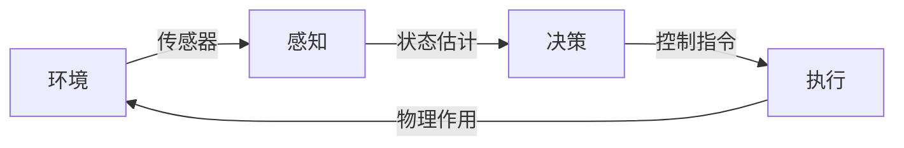
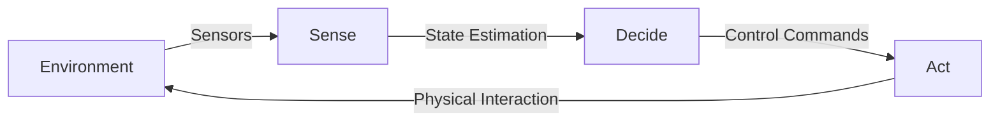
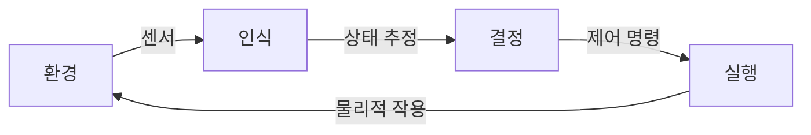

## 概述
具身通用智能是人形机器人领域的重要概念。以下内容整理自项目 Wiki，供深入查阅。

## 核心内容
从控制理论和系统科学出发，机器人可以被形式化为一个**动态系统**（Dynamical System）：

$$
\dot{x}(t) = f\big(x(t), u(t)\big), \quad y(t) = h\big(x(t), u(t)\big)
$$

其中：

- $x(t) \in \mathbb{R}^n$ 是系统状态向量，例如关节角度、角速度、质心位置、姿态四元数等；
- $u(t) \in \mathbb{R}^m$ 是控制输入，例如电机电流、扭矩或电压；
- $y(t) \in \mathbb{R}^p$ 是系统输出，即传感器测量；
- $f$ 是状态转移函数，描述系统动力学；
- $h$ 是观测函数，描述传感器模型。

!!! note "术语解释：状态空间（State Space）"
    状态空间是控制理论中描述动态系统全部可能状态的数学空间。系统的未来演化只依赖于当前状态和未来的输入，而与过去无关，这一性质称为“马尔可夫性”。人形机器人的状态空间维度通常在 30–100 维以上，带来所谓的“维度灾难”。

对于人形机器人，$f$ 通常由刚体动力学方程给出。以拉格朗日方程为例：

$$
M(q)\ddot{q} + C(q, \dot{q})\dot{q} + G(q) = S^T \tau + J_c^T F_c
$$

其中：

- $q \in \mathbb{R}^n$ 为广义坐标；
- $M(q)$ 为质量矩阵；
- $C(q, \dot{q})$ 为科氏力和离心力项；
- $G(q)$ 为重力项；
- $\tau$ 为关节力矩；
- $S$ 为选择矩阵；
- $J_c$ 为接触点雅可比矩阵；
- $F_c$ 为地面接触力。

!!! note "术语解释：雅可比矩阵（Jacobian Matrix）"
    雅可比矩阵 $J$ 描述机器人关节空间速度到操作空间（如末端执行器或质心）速度的线性映射：$v = J(q)\dot{q}$。在力控制中，其转置 $J^T$ 将操作空间力映射到关节力矩：$\tau = J^T F$。雅可比矩阵是机器人运动学和静力学分析的核心工具。

从**智能体（Agent）**视角看，机器人是一个与环境交互的自治实体，遵循**感知-决策-执行循环**（Sense-Decide-Act Loop）：

在具身智能（Embodied AI）框架下，智能不仅存在于算法之中，而是**嵌入在身体形态、传感器配置与动态交互之中**。这一思想与形态计算（Morphological Computation）密切相关：机器人本体的物理特性（如柔顺性、质量分布、弹性足）本身就可以承担一部分计算功能，从而减轻控制器的负担。

!!! note "术语解释：具身智能（Embodied AI）"
    具身智能强调智能行为必须通过具有物理身体的智能体与真实环境交互而产生，而非仅靠符号推理或离线数据学习。其哲学根源可追溯至梅洛-庞蒂（Merleau-Ponty）的“身体主体”概念和皮亚杰（Piaget）的认知发展理论。对人形机器人而言，具身智能意味着：运动控制、感知、推理与社会交互必须统一在身体-环境耦合的框架下。

!!! note "术语解释：形态计算（Morphological Computation）"
    形态计算指利用智能体自身物理结构和材料特性来完成部分“计算”任务，从而减少显式控制器的复杂度。例如，鸟类的羽毛和骨骼结构、猎豹的脊柱弹性、人形机器人的柔顺关节都可以在一定程度上“预先解决”动态稳定性问题，使高层控制更简洁。

## 参考
- Wiki extraction
- 项目 Wiki：chapter-01.md#1.1.5 机器人的形式化定义

## Overview
Embodied general intelligence is a key concept in the field of humanoid robotics. The following content is compiled from the project Wiki for in-depth reference.

## Content
From the perspective of control theory and systems science, a robot can be formalized as a **dynamical system**:

$$
\dot{x}(t) = f\big(x(t), u(t)\big), \quad y(t) = h\big(x(t), u(t)\big)
$$

where:

- $x(t) \in \mathbb{R}^n$ is the system state vector, e.g., joint angles, angular velocities, center of mass position, orientation quaternions, etc.;
- $u(t) \in \mathbb{R}^m$ is the control input, e.g., motor current, torque, or voltage;
- $y(t) \in \mathbb{R}^p$ is the system output, i.e., sensor measurements;
- $f$ is the state transition function, describing system dynamics;
- $h$ is the observation function, describing the sensor model.

!!! note "Term Explanation: State Space"
    State space is the mathematical space in control theory that describes all possible states of a dynamical system. The future evolution of the system depends only on the current state and future inputs, independent of the past—a property known as "Markov property." The state space dimension of a humanoid robot is typically above 30–100 dimensions, leading to the so-called "curse of dimensionality."

For humanoid robots, $f$ is usually given by rigid body dynamics equations. Taking the Lagrangian equation as an example:

$$
M(q)\ddot{q} + C(q, \dot{q})\dot{q} + G(q) = S^T \tau + J_c^T F_c
$$

where:

- $q \in \mathbb{R}^n$ are the generalized coordinates;
- $M(q)$ is the mass matrix;
- $C(q, \dot{q})$ is the Coriolis and centrifugal force term;
- $G(q)$ is the gravity term;
- $\tau$ is the joint torque;
- $S$ is the selection matrix;
- $J_c$ is the contact point Jacobian matrix;
- $F_c$ is the ground contact force.

!!! note "Term Explanation: Jacobian Matrix"
    The Jacobian matrix $J$ describes the linear mapping from joint space velocity to operational space (e.g., end-effector or center of mass) velocity: $v = J(q)\dot{q}$. In force control, its transpose $J^T$ maps operational space forces to joint torques: $\tau = J^T F$. The Jacobian matrix is a core tool in robot kinematics and statics analysis.

From the perspective of an **agent**, a robot is an autonomous entity interacting with the environment, following the **Sense-Decide-Act Loop**:

Within the framework of Embodied AI, intelligence is not solely in algorithms but is **embedded in body morphology, sensor configuration, and dynamic interaction**. This idea is closely related to morphological computation: the physical properties of the robot's body (e.g., compliance, mass distribution, elastic feet) can themselves assume part of the computational load, thereby reducing the burden on the controller.

!!! note "Term Explanation: Embodied AI"
    Embodied AI emphasizes that intelligent behavior must arise from the interaction of an agent with a physical body in a real environment, rather than solely through symbolic reasoning or offline data learning. Its philosophical roots can be traced back to Merleau-Ponty's concept of the "body subject" and Piaget's theory of cognitive development. For humanoid robots, embodied AI means that motion control, perception, reasoning, and social interaction must be unified within a body-environment coupling framework.

!!! note "Term Explanation: Morphological Computation"
    Morphological computation refers to using the physical structure and material properties of an agent's own body to perform part of the "computation" tasks, thereby reducing the complexity of explicit controllers. For example, the feathers and bone structure of birds, the spinal elasticity of cheetahs, and the compliant joints of humanoid robots can, to some extent, "pre-solve" dynamic stability issues, making high-level control simpler.

## 개요
체현된 범용 지능은 휴머노이드 로봇 분야의 중요한 개념입니다. 아래 내용은 프로젝트 Wiki에서 정리한 것으로, 자세한 내용을 확인할 수 있습니다.

## 핵심 내용
제어 이론과 시스템 과학의 관점에서 로봇은 **동적 시스템**(Dynamical System)으로 형식화될 수 있습니다:

$$
\dot{x}(t) = f\big(x(t), u(t)\big), \quad y(t) = h\big(x(t), u(t)\big)
$$

여기서:

- $x(t) \in \mathbb{R}^n$는 시스템 상태 벡터로, 예를 들어 관절 각도, 각속도, 질량 중심 위치, 자세 쿼터니언 등입니다;
- $u(t) \in \mathbb{R}^m$는 제어 입력으로, 예를 들어 모터 전류, 토크 또는 전압입니다;
- $y(t) \in \mathbb{R}^p$는 시스템 출력, 즉 센서 측정값입니다;
- $f$는 상태 전이 함수로, 시스템 동역학을 설명합니다;
- $h$는 관측 함수로, 센서 모델을 설명합니다.

!!! note "용어 설명: 상태 공간(State Space)"
    상태 공간은 제어 이론에서 동적 시스템의 모든 가능한 상태를 설명하는 수학적 공간입니다. 시스템의 미래 진화는 현재 상태와 미래 입력에만 의존하며 과거와는 무관합니다. 이 성질을 "마르코프 성질"이라고 합니다. 휴머노이드 로봇의 상태 공간 차원은 일반적으로 30–100차원 이상이며, 이른바 "차원의 저주"를 초래합니다.

휴머노이드 로봇의 경우 $f$는 일반적으로 강체 동역학 방정식으로 주어집니다. 라그랑주 방정식을 예로 들면:

$$
M(q)\ddot{q} + C(q, \dot{q})\dot{q} + G(q) = S^T \tau + J_c^T F_c
$$

여기서:

- $q \in \mathbb{R}^n$는 일반화 좌표입니다;
- $M(q)$는 질량 행렬입니다;
- $C(q, \dot{q})$는 코리올리 힘과 원심력 항입니다;
- $G(q)$는 중력 항입니다;
- $\tau$는 관절 토크입니다;
- $S$는 선택 행렬입니다;
- $J_c$는 접촉점 야코비 행렬입니다;
- $F_c$는 지면 접촉력입니다.

!!! note "용어 설명: 야코비 행렬(Jacobian Matrix)"
    야코비 행렬 $J$는 로봇 관절 공간 속도를 작업 공간(예: 말단 효과기 또는 질량 중심) 속도로 선형 매핑합니다: $v = J(q)\dot{q}$. 힘 제어에서 그 전치 $J^T$는 작업 공간 힘을 관절 토크로 매핑합니다: $\tau = J^T F$. 야코비 행렬은 로봇 운동학 및 정역학 분석의 핵심 도구입니다.

**에이전트(Agent)** 관점에서 로봇은 환경과 상호작용하는 자율 개체로, **인식-결정-실행 순환**(Sense-Decide-Act Loop)을 따릅니다:

체현된 지능(Embodied AI) 프레임워크에서 지능은 알고리즘에만 존재하는 것이 아니라 **신체 형태, 센서 구성 및 동적 상호작용에 내장**됩니다. 이 개념은 형태 계산(Morphological Computation)과 밀접하게 관련됩니다: 로봇 본체의 물리적 특성(예: 유연성, 질량 분포, 탄성 발) 자체가 일부 계산 기능을 담당하여 제어기의 부담을 줄일 수 있습니다.

!!! note "용어 설명: 체현된 지능(Embodied AI)"
    체현된 지능은 지능적 행동이 물리적 신체를 가진 에이전트가 실제 환경과 상호작용함으로써 발생해야 하며, 단순한 기호 추론이나 오프라인 데이터 학습에 의존해서는 안 된다고 강조합니다. 그 철학적 뿌리는 메를로-퐁티(Merleau-Ponty)의 "신체 주체" 개념과 피아제(Piaget)의 인지 발달 이론으로 거슬러 올라갑니다. 휴머노이드 로봇의 경우 체현된 지능은 운동 제어, 인식, 추론 및 사회적 상호작용이 신체-환경 결합 프레임워크에서 통합되어야 함을 의미합니다.

!!! note "용어 설명: 형태 계산(Morphological Computation)"
    형태 계산은 에이전트 자체의 물리적 구조와 재료 특성을 활용하여 일부 "계산" 작업을 수행함으로써 명시적 제어기의 복잡성을 줄이는 것을 말합니다. 예를 들어, 새의 깃털과 골격 구조, 치타의 척추 탄성, 휴머노이드 로봇의 유연한 관절은 어느 정도 동적 안정성 문제를 "미리 해결"하여 상위 제어를 더 간결하게 만듭니다.
