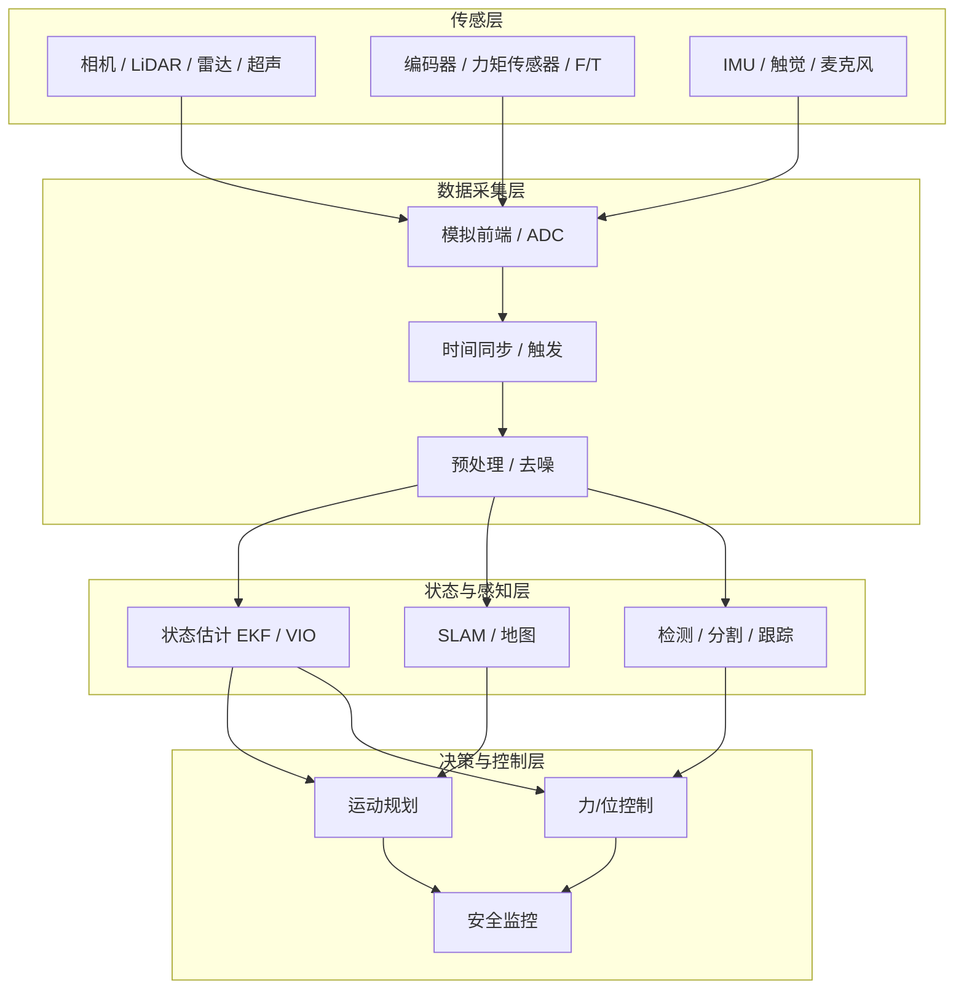

## 概述
感知栈是人形机器人领域的重要concept。以下内容整理自项目 Wiki，供深入查阅。

## 核心内容
一个典型的人形机器人感知系统可以分为四层：

1. **传感层（sensor layer）**：物理换能器与前端模拟电路，输出原始电信号。
2. **数据采集层（data acquisition layer）**：对模拟信号进行滤波、采样、量化和时间戳对齐。
3. **状态与感知层（state & perception layer）**：运行 SLAM、视觉里程计、力/位估计、物体检测、语义分割等算法。
4. **决策与控制层（decision & control layer）**：把感知结果用于步态规划、操作规划、人机交互与安全保障。

---

## 参考
- Wiki extraction
- 项目 Wiki：chapter-05.md#5.1.3 人形机器人感知系统的整体架构

