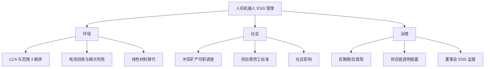

## 概述
产品责任是人形机器人领域的重要concept。以下内容整理自项目 Wiki，供深入查阅。

## 核心内容
钽、锡、钨、金（3TG）以及钴等矿产在部分冲突地区和高风险地区开采，可能涉及强迫劳动、童工和环境破坏。**冲突矿产（conflict minerals）**法规要求企业进行来源调查与披露。

!!! note "术语解释：冲突矿产、3TG、负责任采购、冶炼厂审计、RMI"
    - **冲突矿产**：在冲突地区开采并可能资助武装团体的矿产。
    - **3TG**：钽（Tantalum）、锡（Tin）、钨（Tungsten）、金（Gold）。
    - **负责任采购（responsible sourcing）**：在采购中考虑人权和环境影响的实践。
    - **冶炼厂审计（smelter audit）**：对矿产冶炼厂进行第三方审核，确认来源合规。
    - **RMI（Responsible Minerals Initiative）**：负责任矿产倡议，提供冶炼厂清单与审计标准。

---

## 参考
- Wiki extraction
- 项目 Wiki：chapter-07.md#7.8.3 冲突矿产与负责任采购

