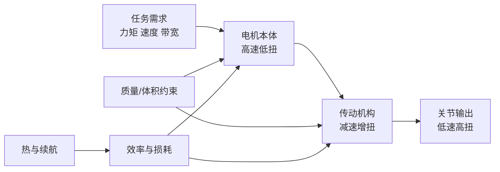

## 概述
### 4.1.2 功率密度、扭矩密度与动态响应

## 核心内容
把执行器看作一个能量转换装置，其核心指标可归结为两点：

1. **扭矩密度** \(\tau_d = \tau_{\text{peak}} / m\)（单位：N·m/kg）或 N·m/L，衡量单位质量/体积能产生多大扭矩。
2. **功率密度** \(P_d = P_{\text{peak}} / m\)（单位：W/kg），衡量单位质量能输出多大机械功率。

二者通过电机转速关联：

$$
P = \tau \, \omega
$$

其中 \(\omega\) 为角速度（rad/s）。电机本体通常在高转速、低扭矩区运行效率最高；机器人关节需要低转速、高扭矩，因此必须借助减速器进行"扭矩放大"。这一匹配是本章后续讨论的核心。

机器人动态响应还可用 **机械时间常数** 描述：

$$
\tau_m = \frac{J \, R}{k_t^2}
$$

其中 \(J\) 为转子与负载的等效转动惯量，\(R\) 为电枢电阻，\(k_t\) 为转矩常数。时间常数越小，电机加减速越快。

!!! note "术语解释：转动惯量、机械时间常数、转矩常数"
    - **转动惯量（moment of inertia）**：物体抵抗角加速度的能力，类比平动中的质量。离转轴越远、质量越大，转动惯量越大。单位 kg·m²。
    - **机械时间常数（mechanical time constant）**：电机从静止加速到约 63% 稳态转速所需的时间，反映机械响应快慢。
    - **转矩常数（torque constant）**：电机电流与产生转矩之间的比例系数 \(\tau = k_t I\)。单位 N·m/A，其大小取决于磁场强度与绕组有效长度。



## 参考
- Wiki extraction

## Overview
### 4.1.2 Power Density, Torque Density, and Dynamic Response

## Content
Treating the actuator as an energy conversion device, its core indicators can be summarized into two points:

1. **Torque density** \(\tau_d = \tau_{\text{peak}} / m\) (unit: N·m/kg) or N·m/L, measuring how much torque can be generated per unit mass/volume.
2. **Power density** \(P_d = P_{\text{peak}} / m\) (unit: W/kg), measuring how much mechanical power can be output per unit mass.

The two are related through motor speed:

$$
P = \tau \, \omega
$$

where \(\omega\) is the angular velocity (rad/s). The motor itself typically operates most efficiently in the high-speed, low-torque region; robot joints require low speed and high torque, thus necessitating a reducer for "torque amplification." This matching is the core of the subsequent discussion in this chapter.

The dynamic response of a robot can also be described by the **mechanical time constant**:

$$
\tau_m = \frac{J \, R}{k_t^2}
$$

where \(J\) is the equivalent moment of inertia of the rotor and load, \(R\) is the armature resistance, and \(k_t\) is the torque constant. The smaller the time constant, the faster the motor accelerates and decelerates.

!!! note "Terminology Explanation: Moment of Inertia, Mechanical Time Constant, Torque Constant"
    - **Moment of inertia**: The resistance of an object to angular acceleration, analogous to mass in linear motion. The farther from the axis of rotation and the greater the mass, the larger the moment of inertia. Unit: kg·m².
    - **Mechanical time constant**: The time required for a motor to accelerate from rest to approximately 63% of its steady-state speed, reflecting the speed of mechanical response.
    - **Torque constant**: The proportionality coefficient between motor current and generated torque, \(\tau = k_t I\). Unit: N·m/A, its magnitude depends on the magnetic field strength and the effective length of the winding.

```mermaid
flowchart LR
    A["Task Requirements<br/>Torque Speed Bandwidth"] --> B["Motor Body<br/>High Speed Low Torque"]
    B --> C["Transmission Mechanism<br/>Speed Reduction Torque Increase"]
    C --> D["Joint Output<br/>Low Speed High Torque"]
    E["Mass/Volume Constraints"] --> B
    E --> C
    F["Heat and Endurance"] --> G["Efficiency and Losses"]
    G --> B
    G --> C

## 개요
### 4.1.2 출력 밀도, 토크 밀도 및 동적 응답

## 핵심 내용
액추에이터를 에너지 변환 장치로 간주할 때, 핵심 지표는 다음 두 가지로 요약할 수 있습니다:

1. **토크 밀도** \(\tau_d = \tau_{\text{peak}} / m\) (단위: N·m/kg) 또는 N·m/L로, 단위 질량/부피당 발생할 수 있는 토크를 측정합니다.
2. **출력 밀도** \(P_d = P_{\text{peak}} / m\) (단위: W/kg)로, 단위 질량당 출력할 수 있는 기계적 동력을 측정합니다.

이 두 지표는 모터 회전 속도를 통해 다음과 같이 연결됩니다:

$$
P = \tau \, \omega
$$

여기서 \(\omega\)는 각속도(rad/s)입니다. 모터 본체는 일반적으로 고회전, 저토크 영역에서 가장 효율적으로 작동합니다. 로봇 관절은 저회전, 고토크를 필요로 하므로, 반드시 감속기를 통해 "토크 증폭"을 해야 합니다. 이러한 매칭이 이 장의 핵심 논의 주제입니다.

로봇의 동적 응답은 **기계적 시상수**로도 설명할 수 있습니다:

$$
\tau_m = \frac{J \, R}{k_t^2}
$$

여기서 \(J\)는 회전자와 부하의 등가 관성 모멘트, \(R\)은 전기자 저항, \(k_t\)는 토크 상수입니다. 시상수가 작을수록 모터의 가속 및 감속이 빠릅니다.

!!! note "용어 설명: 관성 모멘트, 기계적 시상수, 토크 상수"
    - **관성 모멘트(moment of inertia)**: 물체가 각가속도에 저항하는 능력으로, 병진 운동에서의 질량에 비유됩니다. 회전축에서 멀어질수록, 질량이 클수록 관성 모멘트가 커집니다. 단위는 kg·m²입니다.
    - **기계적 시상수(mechanical time constant)**: 모터가 정지 상태에서 약 63% 정상 속도까지 가속하는 데 걸리는 시간으로, 기계적 응답 속도를 나타냅니다.
    - **토크 상수(torque constant)**: 모터 전류와 발생 토크 사이의 비례 계수로 \(\tau = k_t I\)입니다. 단위는 N·m/A이며, 그 크기는 자기장 강도와 권선 유효 길이에 따라 달라집니다.

```mermaid
flowchart LR
    A["작업 요구<br/>토크 속도 대역폭"] --> B["모터 본체<br/>고속 저토크"]
    B --> C["전동 기구<br/>감속 증토크"]
    C --> D["관절 출력<br/>저속 고토크"]
    E["질량/부피 제약"] --> B
    E --> C
    F["열과 배터리 지속 시간"] --> G["효율과 손실"]
    G --> B
    G --> C
