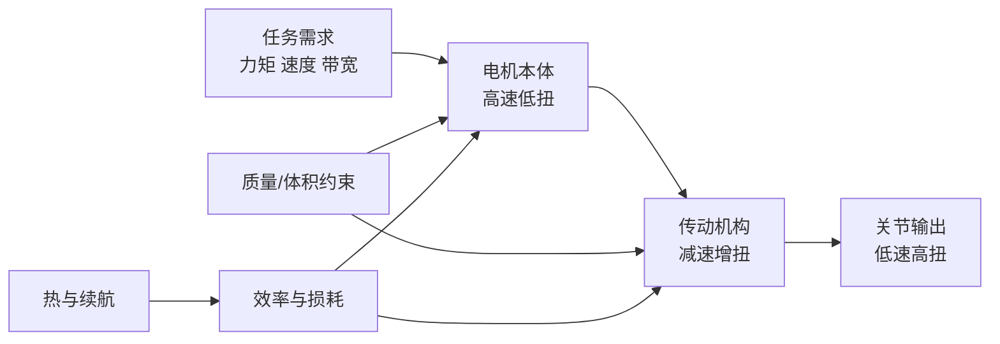

## 概述
### 4.1.2 功率密度、扭矩密度与动态响应

## 核心内容
把执行器看作一个能量转换装置，其核心指标可归结为两点：

1. **扭矩密度** \(\tau_d = \tau_{\text{peak}} / m\)（单位：N·m/kg）或 N·m/L，衡量单位质量/体积能产生多大扭矩。
2. **功率密度** \(P_d = P_{\text{peak}} / m\)（单位：W/kg），衡量单位质量能输出多大机械功率。

二者通过电机转速关联：

$$
P = \tau \, \omega
$$

其中 \(\omega\) 为角速度（rad/s）。电机本体通常在高转速、低扭矩区运行效率最高；机器人关节需要低转速、高扭矩，因此必须借助减速器进行"扭矩放大"。这一匹配是本章后续讨论的核心。

机器人动态响应还可用 **机械时间常数** 描述：

$$
\tau_m = \frac{J \, R}{k_t^2}
$$

其中 \(J\) 为转子与负载的等效转动惯量，\(R\) 为电枢电阻，\(k_t\) 为转矩常数。时间常数越小，电机加减速越快。

!!! note "术语解释：转动惯量、机械时间常数、转矩常数"
    - **转动惯量（moment of inertia）**：物体抵抗角加速度的能力，类比平动中的质量。离转轴越远、质量越大，转动惯量越大。单位 kg·m²。
    - **机械时间常数（mechanical time constant）**：电机从静止加速到约 63% 稳态转速所需的时间，反映机械响应快慢。
    - **转矩常数（torque constant）**：电机电流与产生转矩之间的比例系数 \(\tau = k_t I\)。单位 N·m/A，其大小取决于磁场强度与绕组有效长度。

## 参考
- Wiki extraction

