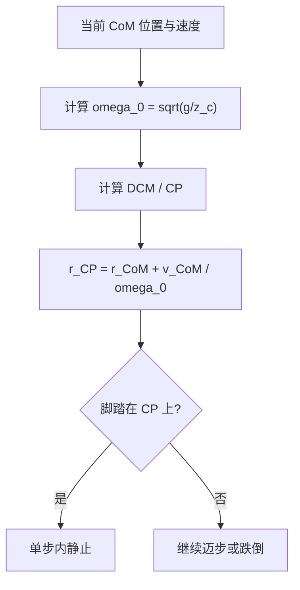
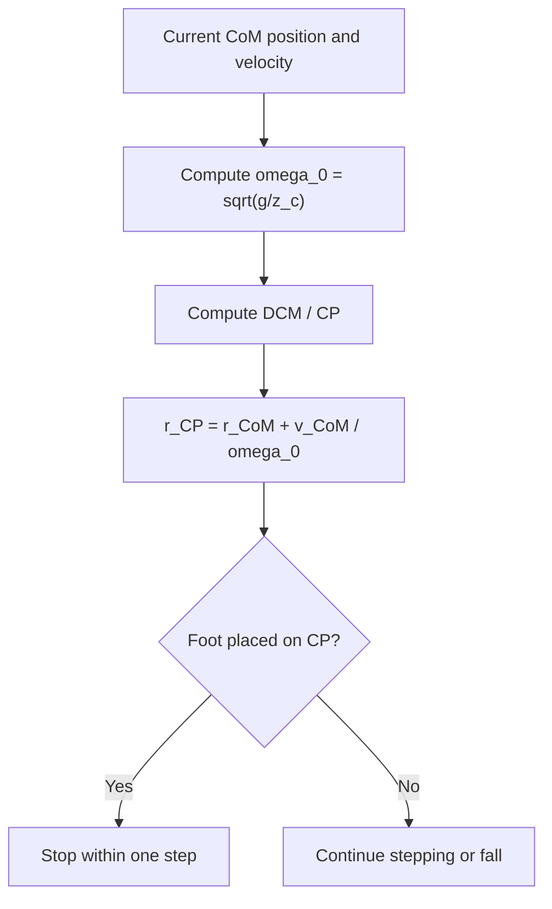
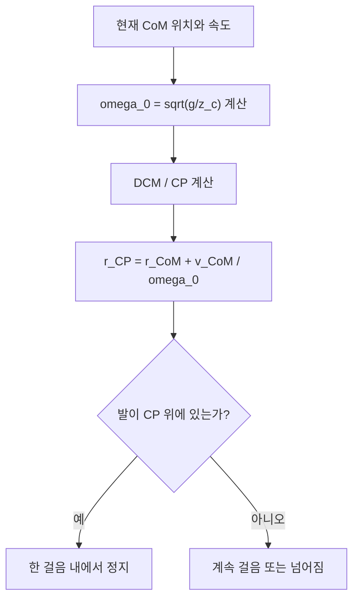

## 概述
捕获点是人形机器人领域的重要原理。以下内容整理自项目 Wiki，供深入查阅。

## 核心内容
**捕获点（Capture Point, CP）**是人形机器人推恢（push recovery）与步态规划中的核心概念：它是地面上这样一个点——若机器人能在该点立即踩下去并把质心置于支撑脚正上方，则无需再迈下一步即可停止[44][45]。捕获点的存在把复杂的动态平衡问题转化为“下一步应踩在哪里”的几何问题。

!!! note "术语解释：捕获点（Capture Point）、推恢、步态规划、动态平衡"
    - **捕获点（Capture Point, CP）**：给定当前质心状态，单步之内使机器人恢复静止所需的落脚点。
    - **推恢（push recovery）**：受到外部推扰后通过迈步或姿态调整恢复平衡的能力。
    - **步态规划（gait planning）**：生成行走步序与落脚点的过程。
    - **动态平衡（dynamic balance）**：在运动过程中保持不倾倒的能力。

在**线性倒立摆模型（Linear Inverted Pendulum Model, LIPM）**中，假设质心高度 $z_c$ 恒定，且质点通过无质量杆连接到地面上的 ZMP。LIPM 的水平动力学为：

$$
\ddot{x} = \frac{g}{z_c}(x - x_{\text{ZMP}})
$$

其中 $g$ 为重力加速度，$x$ 为质心水平位置。该方程可改写为：

$$
\dot{x} = \omega_0 (x - x_{\text{ZMP}})
$$

其中 $\omega_0 = \sqrt{g/z_c}$ 为 LIPM 的自然频率。若 ZMP 保持恒定，质心运动可分解为收敛分量与发散分量。发散分量称为**发散运动分量（Divergent Component of Motion, DCM）**：

$$
\xi = x + \frac{\dot{x}}{\omega_0}
$$

!!! note "术语解释：线性倒立摆模型（LIPM）、自然频率、发散运动分量（DCM）"
    - **线性倒立摆模型（LIPM）**：把机器人简化为高度恒定的质心-无质量杆-ZMP 的线性模型。
    - **自然频率（natural frequency）**：LIPM 特征频率 $\omega_0 = \sqrt{g/z_c}$。
    - **发散运动分量（DCM）**：质心运动中随时间指数发散的分量，决定机器人是否需要迈步。

捕获点本质上就是当前 DCM 的位置。对于二维 LIPM：

$$
x_{\text{CP}} = x_{\text{CoM}} + \frac{\dot{x}_{\text{CoM}}}{\omega_0}
$$

扩展到三维水平面：

$$
\mathbf{r}_{\text{CP}} = \mathbf{r}_{\text{CoM}}^{xy} + \frac{\dot{\mathbf{r}}_{\text{CoM}}^{xy}}{\omega_0}
$$

若把下一步落脚点（即新的 ZMP）正好置于捕获点，则质心将沿直线趋向该点并最终静止；若不迈到捕获点，DCM 将继续发散，机器人必须再迈一步甚至跌倒。



!!! note "术语解释：落脚点、ZMP、DCM 控制、捕获区域"
    - **落脚点（foot placement）**：行走时脚落地的位置。
    - **ZMP（Zero Moment Point）**：地面反作用力等效作用点。
    - **DCM 控制（DCM control）**：通过调节 ZMP 或落脚点控制发散分量的方法。
    - **捕获区域（capture region）**：所有能使机器人恢复平衡的可行落脚点集合。

**Python 算例：捕获点与所需落脚点计算**

以下代码给定质心水平位置、速度、质心高度，计算捕获点；并给定实际迈步位置，判断是否能单步恢复静止。

```python
import numpy as np

def compute_capture_point(r_com, v_com, z_c, g=9.81):
    """
    计算二维/三维水平面捕获点。
    r_com: CoM 水平位置 (x, y) 或 (x, y, z)（只取 x, y）
    v_com: CoM 水平速度 (vx, vy) 或 (vx, vy, vz)
    z_c: 质心高度（恒定）
    """
    r_com = np.array(r_com)[:2]
    v_com = np.array(v_com)[:2]
    omega_0 = np.sqrt(g / z_c)
    r_cp = r_com + v_com / omega_0
    return r_cp, omega_0

def step_recovery_check(r_com, v_com, z_c, foot_place, g=9.81):
    """
    判断给定落脚点 foot_place 是否能把 CoM 稳定下来。
    简单判据：新 ZMP 位于 foot_place，若 DCM 收敛到该点则成功。
    """
    r_cp, omega_0 = compute_capture_point(r_com, v_com, z_c, g)
    dist = np.linalg.norm(r_cp - np.array(foot_place)[:2])
    omega_0_val = omega_0
    # 若实际落脚点与捕获点重合，则理论上可单步静止
    # 这里给出时间常数 tau = 1/omega_0，以及偏移
    tau = 1.0 / omega_0_val
    return {
        'capture_point': r_cp,
        'omega_0': omega_0_val,
        'time_constant': tau,
        'foot_placement_error': dist,
        'single_step_capture': dist < 0.02  # 允许 2 cm 误差
    }

## 参考
- Wiki extraction
- 项目 Wiki：chapter-08.md#8.4.9 捕获点（Capture Point）与线性倒立摆

## Overview
Capture points are an important principle in the field of humanoid robotics. The following content is compiled from the project Wiki for in-depth reference.

## Content
**Capture Point (CP)** is a core concept in humanoid robot push recovery and gait planning: it is a point on the ground such that if the robot can immediately step onto that point and place its center of mass directly above the support foot, no further steps are needed to come to a stop[44][45]. The existence of the capture point transforms the complex dynamic balance problem into a geometric one: "where should the next step be placed?"

!!! note "Terminology: Capture Point (CP), Push Recovery, Gait Planning, Dynamic Balance"
    - **Capture Point (CP)**: Given the current center of mass state, the foot placement required to bring the robot to a stop within a single step.
    - **Push Recovery**: The ability to regain balance after an external push disturbance by stepping or adjusting posture.
    - **Gait Planning**: The process of generating walking step sequences and foot placements.
    - **Dynamic Balance**: The ability to maintain stability without falling during motion.

In the **Linear Inverted Pendulum Model (LIPM)**, the center of mass height \(z_c\) is assumed constant, and the point mass is connected to the ZMP on the ground via a massless rod. The horizontal dynamics of the LIPM are:

$$
\ddot{x} = \frac{g}{z_c}(x - x_{\text{ZMP}})
$$

where \(g\) is the gravitational acceleration and \(x\) is the horizontal position of the center of mass. This equation can be rewritten as:

$$
\dot{x} = \omega_0 (x - x_{\text{ZMP}})
$$

where \(\omega_0 = \sqrt{g/z_c}\) is the natural frequency of the LIPM. If the ZMP remains constant, the center of mass motion can be decomposed into a convergent component and a divergent component. The divergent component is called the **Divergent Component of Motion (DCM)**:

$$
\xi = x + \frac{\dot{x}}{\omega_0}
$$

!!! note "Terminology: Linear Inverted Pendulum Model (LIPM), Natural Frequency, Divergent Component of Motion (DCM)"
    - **Linear Inverted Pendulum Model (LIPM)**: A linear model that simplifies the robot to a constant-height center of mass, massless rod, and ZMP.
    - **Natural Frequency**: The characteristic frequency of the LIPM, \(\omega_0 = \sqrt{g/z_c}\).
    - **Divergent Component of Motion (DCM)**: The component of center of mass motion that diverges exponentially over time, determining whether the robot needs to step.

The capture point is essentially the current DCM position. For a 2D LIPM:

$$
x_{\text{CP}} = x_{\text{CoM}} + \frac{\dot{x}_{\text{CoM}}}{\omega_0}
$$

Extending to the 3D horizontal plane:

$$
\mathbf{r}_{\text{CP}} = \mathbf{r}_{\text{CoM}}^{xy} + \frac{\dot{\mathbf{r}}_{\text{CoM}}^{xy}}{\omega_0}
$$

If the next foot placement (i.e., the new ZMP) is placed exactly at the capture point, the center of mass will move in a straight line toward that point and eventually come to a stop; if the step is not placed at the capture point, the DCM will continue to diverge, and the robot must take another step or fall.



!!! note "Terminology: Foot Placement, ZMP, DCM Control, Capture Region"
    - **Foot Placement**: The position where the foot lands during walking.
    - **ZMP (Zero Moment Point)**: The equivalent point of action of ground reaction forces.
    - **DCM Control**: A method of controlling the divergent component by adjusting the ZMP or foot placement.
    - **Capture Region**: The set of all feasible foot placements that can restore the robot's balance.

**Python Example: Capture Point and Required Foot Placement Calculation**

The following code calculates the capture point given the center of mass horizontal position, velocity, and height; and given an actual step position, determines whether a single-step stop is possible.

```python
import numpy as np

def compute_capture_point(r_com, v_com, z_c, g=9.81):
    """
    Compute the 2D/3D horizontal capture point.
    r_com: CoM horizontal position (x, y) or (x, y, z) (only x, y used)
    v_com: CoM horizontal velocity (vx, vy) or (vx, vy, vz)
    z_c: Center of mass height (constant)
    """
    r_com = np.array(r_com)[:2]
    v_com = np.array(v_com)[:2]
    omega_0 = np.sqrt(g / z_c)
    r_cp = r_com + v_com / omega_0
    return r_cp, omega_0

def step_recovery_check(r_com, v_com, z_c, foot_place, g=9.81):
    """
    Check if the given foot placement can stabilize the CoM.
    Simple criterion: if the new ZMP is at foot_place, success if DCM converges to that point.
    """
    r_cp, omega_0 = compute_capture_point(r_com, v_com, z_c, g)
    dist = np.linalg.norm(r_cp - np.array(foot_place)[:2])
    omega_0_val = omega_0
    # If the actual foot placement coincides with the capture point, theoretically a single-step stop is possible
    # Here we provide the time constant tau = 1/omega_0 and the offset
    tau = 1.0 / omega_0_val
    return {
        'capture_point': r_cp,
        'omega_0': omega_0_val,
        'time_constant': tau,
        'foot_placement_error': dist,
        'single_step_capture': dist < 0.02  # Allow 2 cm error
    }

## 개요
캡처 포인트는 휴머노이드 로봇 분야의 중요한 원리입니다. 다음 내용은 프로젝트 Wiki에서 정리한 것으로, 심층적인 참고를 위해 제공됩니다.

## 핵심 내용
**캡처 포인트(Capture Point, CP)**는 휴머노이드 로봇의 푸시 리커버리(push recovery) 및 보행 계획에서 핵심 개념입니다. 이는 지면 위의 한 점으로, 로봇이 해당 지점에 즉시 발을 디디고 질량 중심을 지지하는 발 바로 위에 위치시킬 수 있다면, 다음 걸음을 내딛지 않고도 정지할 수 있는 지점을 의미합니다[44][45]. 캡처 포인트의 존재는 복잡한 동적 균형 문제를 "다음 걸음은 어디에 디뎌야 하는가"라는 기하학적 문제로 변환합니다.

!!! note "용어 설명: 캡처 포인트(Capture Point), 푸시 리커버리, 보행 계획, 동적 균형"
    - **캡처 포인트(Capture Point, CP)**: 현재 질량 중심 상태가 주어졌을 때, 한 걸음 내에서 로봇을 정지 상태로 복원할 수 있는 발 디딤 위치.
    - **푸시 리커버리(push recovery)**: 외부에서 밀림을 받은 후, 걸음을 내딛거나 자세를 조정하여 균형을 회복하는 능력.
    - **보행 계획(gait planning)**: 걷는 순서와 발 디딤 위치를 생성하는 과정.
    - **동적 균형(dynamic balance)**: 운동 중 넘어지지 않고 유지하는 능력.

**선형 역진자 모델(Linear Inverted Pendulum Model, LIPM)**에서 질량 중심 높이 $z_c$는 일정하고, 질점은 질량이 없는 막대를 통해 지면의 ZMP에 연결된다고 가정합니다. LIPM의 수평 동역학은 다음과 같습니다:

$$
\ddot{x} = \frac{g}{z_c}(x - x_{\text{ZMP}})
$$

여기서 $g$는 중력 가속도, $x$는 질량 중심의 수평 위치입니다. 이 방정식은 다음과 같이 다시 쓸 수 있습니다:

$$
\dot{x} = \omega_0 (x - x_{\text{ZMP}})
$$

여기서 $\omega_0 = \sqrt{g/z_c}$는 LIPM의 고유 진동수입니다. ZMP가 일정하게 유지되면 질량 중심 운동은 수렴 성분과 발산 성분으로 분해됩니다. 발산 성분을 **발산 운동 성분(Divergent Component of Motion, DCM)**이라고 합니다:

$$
\xi = x + \frac{\dot{x}}{\omega_0}
$$

!!! note "용어 설명: 선형 역진자 모델(LIPM), 고유 진동수, 발산 운동 성분(DCM)"
    - **선형 역진자 모델(LIPM)**: 로봇을 높이가 일정한 질량 중심-무질량 막대-ZMP의 선형 모델로 단순화한 것.
    - **고유 진동수(natural frequency)**: LIPM의 특성 진동수 $\omega_0 = \sqrt{g/z_c}$.
    - **발산 운동 성분(DCM)**: 질량 중심 운동에서 시간에 따라 지수적으로 발산하는 성분으로, 로봇이 걸음을 내딛어야 하는지 결정합니다.

캡처 포인트는 본질적으로 현재 DCM의 위치입니다. 2차원 LIPM의 경우:

$$
x_{\text{CP}} = x_{\text{CoM}} + \frac{\dot{x}_{\text{CoM}}}{\omega_0}
$$

3차원 수평면으로 확장하면:

$$
\mathbf{r}_{\text{CP}} = \mathbf{r}_{\text{CoM}}^{xy} + \frac{\dot{\mathbf{r}}_{\text{CoM}}^{xy}}{\omega_0}
$$

다음 발 디딤 위치(즉, 새로운 ZMP)를 정확히 캡처 포인트에 놓으면, 질량 중심은 직선으로 해당 지점을 향해 이동하여 결국 정지합니다. 캡처 포인트에 발을 디디지 않으면 DCM은 계속 발산하며, 로봇은 한 걸음을 더 내딛거나 넘어져야 합니다.



!!! note "용어 설명: 발 디딤 위치, ZMP, DCM 제어, 캡처 영역"
    - **발 디딤 위치(foot placement)**: 보행 시 발이 닿는 위치.
    - **ZMP(Zero Moment Point)**: 지면 반력의 등가 작용점.
    - **DCM 제어(DCM control)**: ZMP 또는 발 디딤 위치를 조절하여 발산 성분을 제어하는 방법.
    - **캡처 영역(capture region)**: 로봇이 균형을 회복할 수 있는 모든 가능한 발 디딤 위치의 집합.

**Python 예제: 캡처 포인트 및 필요한 발 디딤 위치 계산**

다음 코드는 질량 중심의 수평 위치, 속도, 높이가 주어졌을 때 캡처 포인트를 계산하고, 실제 발 디딤 위치가 주어졌을 때 한 걸음으로 정지할 수 있는지 판단합니다.

```python
import numpy as np

def compute_capture_point(r_com, v_com, z_c, g=9.81):
    """
    2차원/3차원 수평면의 캡처 포인트를 계산합니다.
    r_com: CoM 수평 위치 (x, y) 또는 (x, y, z) (x, y만 사용)
    v_com: CoM 수평 속도 (vx, vy) 또는 (vx, vy, vz)
    z_c: 질량 중심 높이 (일정)
    """
    r_com = np.array(r_com)[:2]
    v_com = np.array(v_com)[:2]
    omega_0 = np.sqrt(g / z_c)
    r_cp = r_com + v_com / omega_0
    return r_cp, omega_0

def step_recovery_check(r_com, v_com, z_c, foot_place, g=9.81):
    """
    주어진 발 디딤 위치 foot_place가 CoM을 안정화할 수 있는지 판단합니다.
    간단한 기준: 새로운 ZMP가 foot_place에 있을 때, DCM이 해당 지점으로 수렴하면 성공.
    """
    r_cp, omega_0 = compute_capture_point(r_com, v_com, z_c, g)
    dist = np.linalg.norm(r_cp - np.array(foot_place)[:2])
    omega_0_val = omega_0
    # 실제 발 디딤 위치가 캡처 포인트와 일치하면 이론적으로 한 걸음으로 정지 가능
    # 여기서는 시간 상수 tau = 1/omega_0와 오프셋을 제공
    tau = 1.0 / omega_0_val
    return {
        'capture_point': r_cp,
        'omega_0': omega_0_val,
        'time_constant': tau,
        'foot_placement_error': dist,
        'single_step_capture': dist < 0.02  # 2cm 오차 허용
    }
