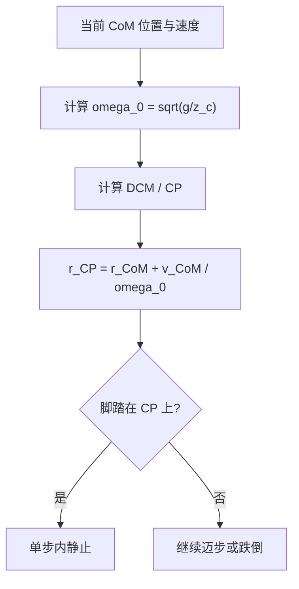

## 概述
捕获点是人形机器人领域的重要principle。以下内容整理自项目 Wiki，供深入查阅。

## 核心内容
**捕获点（Capture Point, CP）**是人形机器人推恢（push recovery）与步态规划中的核心概念：它是地面上这样一个点——若机器人能在该点立即踩下去并把质心置于支撑脚正上方，则无需再迈下一步即可停止[44][45]。捕获点的存在把复杂的动态平衡问题转化为“下一步应踩在哪里”的几何问题。

!!! note "术语解释：捕获点（Capture Point）、推恢、步态规划、动态平衡"
    - **捕获点（Capture Point, CP）**：给定当前质心状态，单步之内使机器人恢复静止所需的落脚点。
    - **推恢（push recovery）**：受到外部推扰后通过迈步或姿态调整恢复平衡的能力。
    - **步态规划（gait planning）**：生成行走步序与落脚点的过程。
    - **动态平衡（dynamic balance）**：在运动过程中保持不倾倒的能力。

在**线性倒立摆模型（Linear Inverted Pendulum Model, LIPM）**中，假设质心高度 $z_c$ 恒定，且质点通过无质量杆连接到地面上的 ZMP。LIPM 的水平动力学为：

$$
\ddot{x} = \frac{g}{z_c}(x - x_{\text{ZMP}})
$$

其中 $g$ 为重力加速度，$x$ 为质心水平位置。该方程可改写为：

$$
\dot{x} = \omega_0 (x - x_{\text{ZMP}})
$$

其中 $\omega_0 = \sqrt{g/z_c}$ 为 LIPM 的自然频率。若 ZMP 保持恒定，质心运动可分解为收敛分量与发散分量。发散分量称为**发散运动分量（Divergent Component of Motion, DCM）**：

$$
\xi = x + \frac{\dot{x}}{\omega_0}
$$

!!! note "术语解释：线性倒立摆模型（LIPM）、自然频率、发散运动分量（DCM）"
    - **线性倒立摆模型（LIPM）**：把机器人简化为高度恒定的质心-无质量杆-ZMP 的线性模型。
    - **自然频率（natural frequency）**：LIPM 特征频率 $\omega_0 = \sqrt{g/z_c}$。
    - **发散运动分量（DCM）**：质心运动中随时间指数发散的分量，决定机器人是否需要迈步。

捕获点本质上就是当前 DCM 的位置。对于二维 LIPM：

$$
x_{\text{CP}} = x_{\text{CoM}} + \frac{\dot{x}_{\text{CoM}}}{\omega_0}
$$

扩展到三维水平面：

$$
\mathbf{r}_{\text{CP}} = \mathbf{r}_{\text{CoM}}^{xy} + \frac{\dot{\mathbf{r}}_{\text{CoM}}^{xy}}{\omega_0}
$$

若把下一步落脚点（即新的 ZMP）正好置于捕获点，则质心将沿直线趋向该点并最终静止；若不迈到捕获点，DCM 将继续发散，机器人必须再迈一步甚至跌倒。



!!! note "术语解释：落脚点、ZMP、DCM 控制、捕获区域"
    - **落脚点（foot placement）**：行走时脚落地的位置。
    - **ZMP（Zero Moment Point）**：地面反作用力等效作用点。
    - **DCM 控制（DCM control）**：通过调节 ZMP 或落脚点控制发散分量的方法。
    - **捕获区域（capture region）**：所有能使机器人恢复平衡的可行落脚点集合。

**Python 算例：捕获点与所需落脚点计算**

以下代码给定质心水平位置、速度、质心高度，计算捕获点；并给定实际迈步位置，判断是否能单步恢复静止。

```python
import numpy as np

def compute_capture_point(r_com, v_com, z_c, g=9.81):
    """
    计算二维/三维水平面捕获点。
    r_com: CoM 水平位置 (x, y) 或 (x, y, z)（只取 x, y）
    v_com: CoM 水平速度 (vx, vy) 或 (vx, vy, vz)
    z_c: 质心高度（恒定）
    """
    r_com = np.array(r_com)[:2]
    v_com = np.array(v_com)[:2]
    omega_0 = np.sqrt(g / z_c)
    r_cp = r_com + v_com / omega_0
    return r_cp, omega_0

def step_recovery_check(r_com, v_com, z_c, foot_place, g=9.81):
    """
    判断给定落脚点 foot_place 是否能把 CoM 稳定下来。
    简单判据：新 ZMP 位于 foot_place，若 DCM 收敛到该点则成功。
    """
    r_cp, omega_0 = compute_capture_point(r_com, v_com, z_c, g)
    dist = np.linalg.norm(r_cp - np.array(foot_place)[:2])
    omega_0_val = omega_0
    # 若实际落脚点与捕获点重合，则理论上可单步静止
    # 这里给出时间常数 tau = 1/omega_0，以及偏移
    tau = 1.0 / omega_0_val
    return {
        'capture_point': r_cp,
        'omega_0': omega_0_val,
        'time_constant': tau,
        'foot_placement_error': dist,
        'single_step_capture': dist < 0.02  # 允许 2 cm 误差
    }

## 参考
- Wiki extraction
- 项目 Wiki：chapter-08.md#8.4.9 捕获点（Capture Point）与线性倒立摆

