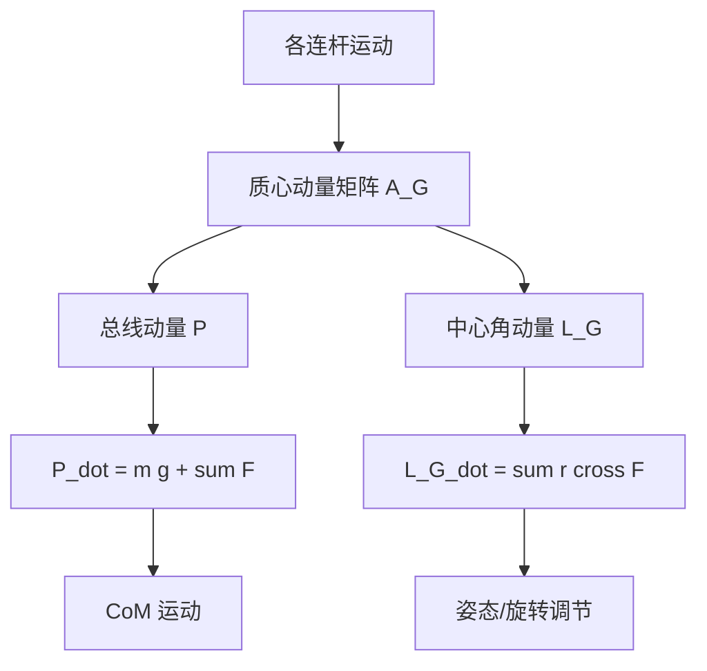
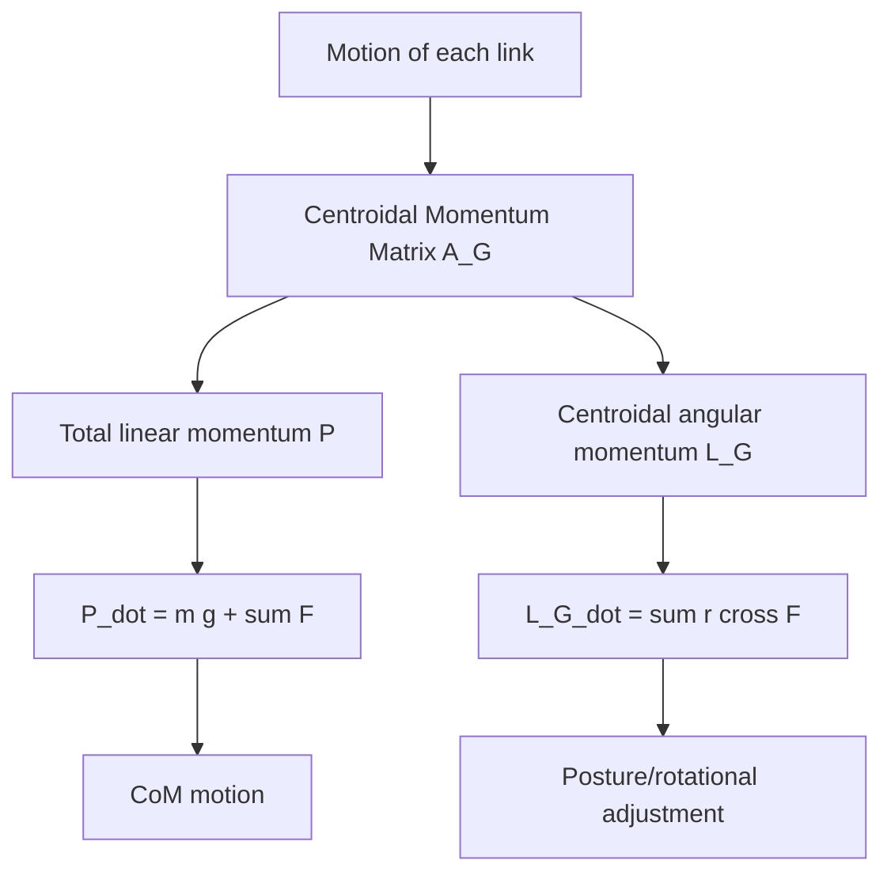
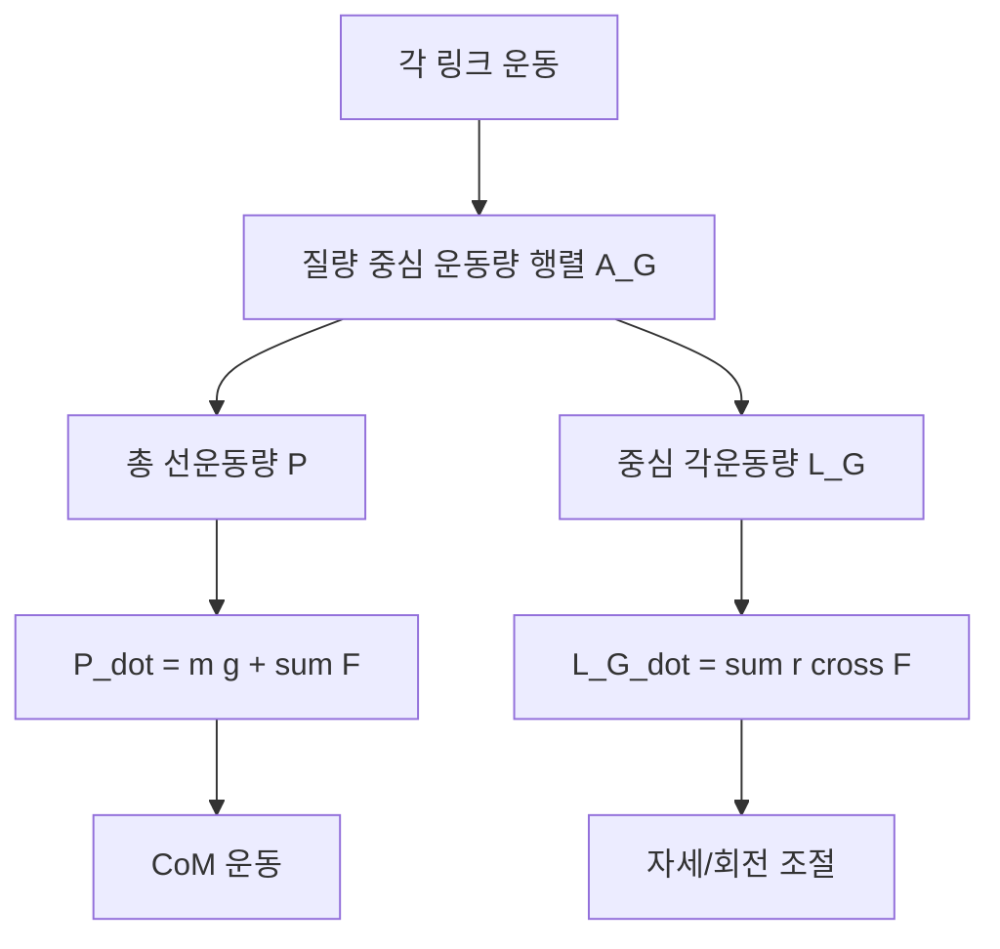

## 概述
#### 8.4.6 质心动量与中心角动量

## 核心内容
人形机器人是多连杆系统，其整体运动状态不仅由各连杆速度决定，还可以通过**质心动量（centroidal momentum）**统一描述。质心动量把机器人所有连杆的线动量与角动量汇总到**质心（Center of Mass, CoM）**处，是分析行走、奔跑、跳跃等动态运动的强有力工具[41]。

!!! note "术语解释：质心动量、中心角动量、线动量、角动量、质心"
    - **质心动量（centroidal momentum）**：机器人总线动量与相对于质心的总角动量在质心处的合成。
    - **中心角动量（centroidal angular momentum）**：机器人相对于质心的总角动量。
    - **线动量（linear momentum）**：质量与质心速度的乘积，$\mathbf{P} = m \mathbf{v}_{\text{CoM}}$。
    - **角动量（angular momentum）**：描述旋转运动状态的矢量，$\mathbf{L} = \mathbf{I}\boldsymbol{\omega}$。
    - **质心（CoM）**：系统质量加权平均位置。

定义机器人广义坐标 $\mathbf{q}$ 与广义速度 $\mathbf{v}$，则**质心动量矩阵（Centroidal Momentum Matrix, CMM）** $\mathbf{A}_G(\mathbf{q})$ 把广义速度映射为质心处的 6 维质心动量：

$$
\begin{bmatrix} \mathbf{P} \\ \mathbf{L}_G \end{bmatrix} = \mathbf{A}_G(\mathbf{q}) \, \mathbf{v}
$$

其中 $\mathbf{P} \in \mathbb{R}^3$ 为总线动量，$\mathbf{L}_G \in \mathbb{R}^3$ 为相对于质心的总角动量。质心动量矩阵具有清晰的物理意义：其行向量表示各关节速度对整体线动量与角动量的贡献权重[41]。

质心动量的时间导数等于外力之和：

$$
\frac{d}{dt} \begin{bmatrix} \mathbf{P} \\ \mathbf{L}_G \end{bmatrix} = \begin{bmatrix} m \mathbf{g} + \sum_j \mathbf{F}_j \\ \sum_j (\mathbf{r}_j - \mathbf{r}_G) \times \mathbf{F}_j \end{bmatrix}
$$

其中 $\mathbf{F}_j$ 为第 $j$ 个外部接触力，$\mathbf{r}_j$ 为其作用点，$\mathbf{r}_G$ 为质心位置。由此可见，质心水平加速度由地面反作用力的水平分量决定，而中心角动量的变化率由接触力绕质心的力矩决定。

!!! note "术语解释：质心动量矩阵（CMM）、外力矩、地面反作用力、质心加速度"
    - **质心动量矩阵（Centroidal Momentum Matrix, CMM）**：把关节速度映射到质心动量的 6×n 矩阵。
    - **外力矩（external moment）**：外部作用力绕某点的力矩之和。
    - **地面反作用力（Ground Reaction Force, GRF）**：地面作用于机器人脚的接触力。
    - **质心加速度（CoM acceleration）**：质心位置对时间的二阶导数。

在**飞行相（flight phase）**，如跳跃或跑步离地阶段，机器人所受合外力仅有重力 $m\mathbf{g}$，因此：

$$
\dot{\mathbf{P}} = m \mathbf{g}, \quad \dot{\mathbf{L}}_G = \mathbf{0}
$$

这意味着**角动量守恒（conservation of angular momentum）**：在腾空期间，机器人无法通过内部关节运动改变总角动量，只能通过改变肢体相对位置调整姿态。体操运动员、猫的下落翻转都利用了这一原理。人形机器人在跳跃落地、跌倒恢复中，必须预先规划好起跳时的角动量，因为空中无法补充或消除。

!!! note "术语解释：飞行相、角动量守恒、腾空、姿态调整"
    - **飞行相（flight phase）**：机器人双脚离地的运动阶段。
    - **角动量守恒（conservation of angular momentum）**：无外力矩时系统总角动量保持不变。
    - **腾空（airborne）**：身体完全离开支撑面的状态。
    - **姿态调整（attitude adjustment）**：通过改变肢体构型改变身体朝向，而不改变总角动量。

控制上身角动量是人形机器人动态平衡的重要手段。例如，当外界扰动使身体绕某轴产生角动量时，可通过手臂或躯干的反向摆动产生补偿力矩，使总角动量保持在期望范围。这种策略在**角动量平衡控制（angular momentum-based balance control）**中被广泛应用[41][53]。

## 参考
- Wiki extraction

## Overview
#### 8.4.6 Centroidal Momentum and Centroidal Angular Momentum

## Content
A humanoid robot is a multi-link system, and its overall motion state is not only determined by the velocity of each link but can also be uniformly described by **centroidal momentum**. Centroidal momentum aggregates the linear and angular momenta of all the robot's links at the **Center of Mass (CoM)**, making it a powerful tool for analyzing dynamic motions such as walking, running, and jumping [41].

!!! note "Terminology: Centroidal Momentum, Centroidal Angular Momentum, Linear Momentum, Angular Momentum, Center of Mass"
    - **Centroidal momentum**: The combination of the robot's total linear momentum and total angular momentum relative to the center of mass, synthesized at the CoM.
    - **Centroidal angular momentum**: The total angular momentum of the robot relative to the center of mass.
    - **Linear momentum**: The product of mass and CoM velocity, $\mathbf{P} = m \mathbf{v}_{\text{CoM}}$.
    - **Angular momentum**: A vector describing the state of rotational motion, $\mathbf{L} = \mathbf{I}\boldsymbol{\omega}$.
    - **Center of Mass (CoM)**: The mass-weighted average position of the system.

Define the robot's generalized coordinates $\mathbf{q}$ and generalized velocities $\mathbf{v}$. The **Centroidal Momentum Matrix (CMM)** $\mathbf{A}_G(\mathbf{q})$ maps the generalized velocities to the 6-dimensional centroidal momentum at the CoM:

$$
\begin{bmatrix} \mathbf{P} \\ \mathbf{L}_G \end{bmatrix} = \mathbf{A}_G(\mathbf{q}) \, \mathbf{v}
$$

where $\mathbf{P} \in \mathbb{R}^3$ is the total linear momentum, and $\mathbf{L}_G \in \mathbb{R}^3$ is the total angular momentum relative to the CoM. The centroidal momentum matrix has clear physical significance: its row vectors represent the contribution weights of each joint velocity to the overall linear and angular momenta [41].

The time derivative of centroidal momentum equals the sum of external forces:

$$
\frac{d}{dt} \begin{bmatrix} \mathbf{P} \\ \mathbf{L}_G \end{bmatrix} = \begin{bmatrix} m \mathbf{g} + \sum_j \mathbf{F}_j \\ \sum_j (\mathbf{r}_j - \mathbf{r}_G) \times \mathbf{F}_j \end{bmatrix}
$$

where $\mathbf{F}_j$ is the $j$-th external contact force, $\mathbf{r}_j$ is its point of application, and $\mathbf{r}_G$ is the CoM position. Thus, the horizontal acceleration of the CoM is determined by the horizontal component of the ground reaction force, while the rate of change of centroidal angular momentum is determined by the torque of contact forces about the CoM.

!!! note "Terminology: Centroidal Momentum Matrix (CMM), External Torque, Ground Reaction Force, CoM Acceleration"
    - **Centroidal Momentum Matrix (CMM)**: A 6×n matrix that maps joint velocities to centroidal momentum.
    - **External moment**: The sum of torques from external forces about a point.
    - **Ground Reaction Force (GRF)**: The contact force exerted by the ground on the robot's feet.
    - **CoM acceleration**: The second derivative of CoM position with respect to time.

During the **flight phase**, such as in jumping or running when the robot is airborne, the only external force acting on the robot is gravity $m\mathbf{g}$, so:

$$
\dot{\mathbf{P}} = m \mathbf{g}, \quad \dot{\mathbf{L}}_G = \mathbf{0}
$$

This implies **conservation of angular momentum**: while airborne, the robot cannot change its total angular momentum through internal joint motions; it can only adjust its posture by changing the relative positions of its limbs. Gymnasts and cats falling and flipping utilize this principle. For humanoid robots in jumping landings or fall recovery, the angular momentum at takeoff must be pre-planned, as it cannot be supplemented or eliminated in the air.

!!! note "Terminology: Flight Phase, Conservation of Angular Momentum, Airborne, Attitude Adjustment"
    - **Flight phase**: The motion phase when both of the robot's feet are off the ground.
    - **Conservation of angular momentum**: The total angular momentum of a system remains constant when no external torque acts on it.
    - **Airborne**: The state where the body is completely off the support surface.
    - **Attitude adjustment**: Changing the body's orientation by altering limb configuration without changing total angular momentum.

Controlling the angular momentum of the upper body is an important means for dynamic balance in humanoid robots. For example, when an external disturbance generates angular momentum about a certain axis of the body, a compensating torque can be produced through counter-swinging motions of the arms or torso, keeping the total angular momentum within a desired range. This strategy is widely applied in **angular momentum-based balance control** [41][53].

## 개요
#### 8.4.6 질량 중심 운동량과 중심 각운동량

## 핵심 내용
인간형 로봇은 다중 링크 시스템으로, 전체 운동 상태는 각 링크의 속도뿐만 아니라 **질량 중심 운동량(centroidal momentum)**으로 통일적으로 기술할 수 있다. 질량 중심 운동량은 로봇의 모든 링크의 선운동량과 각운동량을 **질량 중심(Center of Mass, CoM)**에 집약한 것으로, 보행, 달리기, 점프 등의 동적 운동을 분석하는 강력한 도구이다[41].

!!! note "용어 설명: 질량 중심 운동량, 중심 각운동량, 선운동량, 각운동량, 질량 중심"
    - **질량 중심 운동량(centroidal momentum)**: 로봇의 총 선운동량과 질량 중심에 대한 총 각운동량을 질량 중심에서 합성한 것.
    - **중심 각운동량(centroidal angular momentum)**: 로봇의 질량 중심에 대한 총 각운동량.
    - **선운동량(linear momentum)**: 질량과 질량 중심 속도의 곱, $\mathbf{P} = m \mathbf{v}_{\text{CoM}}$.
    - **각운동량(angular momentum)**: 회전 운동 상태를 나타내는 벡터, $\mathbf{L} = \mathbf{I}\boldsymbol{\omega}$.
    - **질량 중심(CoM)**: 시스템의 질량 가중 평균 위치.

로봇의 일반화 좌표 $\mathbf{q}$와 일반화 속도 $\mathbf{v}$를 정의하면, **질량 중심 운동량 행렬(Centroidal Momentum Matrix, CMM)** $\mathbf{A}_G(\mathbf{q})$는 일반화 속도를 질량 중심에서의 6차원 질량 중심 운동량으로 매핑한다:

$$
\begin{bmatrix} \mathbf{P} \\ \mathbf{L}_G \end{bmatrix} = \mathbf{A}_G(\mathbf{q}) \, \mathbf{v}
$$

여기서 $\mathbf{P} \in \mathbb{R}^3$는 총 선운동량, $\mathbf{L}_G \in \mathbb{R}^3$는 질량 중심에 대한 총 각운동량이다. 질량 중심 운동량 행렬은 명확한 물리적 의미를 가진다: 그 행 벡터는 각 관절 속도가 전체 선운동량과 각운동량에 기여하는 가중치를 나타낸다[41].

질량 중심 운동량의 시간 미분은 외력의 합과 같다:

$$
\frac{d}{dt} \begin{bmatrix} \mathbf{P} \\ \mathbf{L}_G \end{bmatrix} = \begin{bmatrix} m \mathbf{g} + \sum_j \mathbf{F}_j \\ \sum_j (\mathbf{r}_j - \mathbf{r}_G) \times \mathbf{F}_j \end{bmatrix}
$$

여기서 $\mathbf{F}_j$는 $j$번째 외부 접촉력, $\mathbf{r}_j$는 그 작용점, $\mathbf{r}_G$는 질량 중심 위치이다. 이로부터 질량 중심의 수평 가속도는 지면 반력의 수평 성분에 의해 결정되고, 중심 각운동량의 변화율은 접촉력이 질량 중심에 대해 생성하는 토크에 의해 결정됨을 알 수 있다.

!!! note "용어 설명: 질량 중심 운동량 행렬(CMM), 외부 토크, 지면 반력, 질량 중심 가속도"
    - **질량 중심 운동량 행렬(Centroidal Momentum Matrix, CMM)**: 관절 속도를 질량 중심 운동량으로 매핑하는 6×n 행렬.
    - **외부 토크(external moment)**: 외부 힘이 특정 점에 대해 생성하는 토크의 합.
    - **지면 반력(Ground Reaction Force, GRF)**: 지면이 로봇 발에 작용하는 접촉력.
    - **질량 중심 가속도(CoM acceleration)**: 질량 중심 위치의 시간에 대한 2차 미분.

**비행 단계(flight phase)**, 예를 들어 점프나 달리기 중 발이 지면에서 떨어진 단계에서는 로봇에 작용하는 합외력이 중력 $m\mathbf{g}$뿐이므로:

$$
\dot{\mathbf{P}} = m \mathbf{g}, \quad \dot{\mathbf{L}}_G = \mathbf{0}
$$

이는 **각운동량 보존(conservation of angular momentum)**을 의미한다: 공중에 떠 있는 동안 로봇은 내부 관절 운동으로 총 각운동량을 변경할 수 없으며, 팔다리의 상대 위치를 변경하여 자세를 조정할 수 있을 뿐이다. 체조 선수나 고양이의 낙하 회전은 이 원리를 이용한다. 인간형 로봇이 점프 착지나 낙하 회복 시에는 공중에서 각운동량을 추가하거나 제거할 수 없으므로, 도약 시의 각운동량을 미리 계획해야 한다.

!!! note "용어 설명: 비행 단계, 각운동량 보존, 공중, 자세 조정"
    - **비행 단계(flight phase)**: 로봇의 양발이 지면에서 떨어진 운동 단계.
    - **각운동량 보존(conservation of angular momentum)**: 외부 토크가 없을 때 시스템의 총 각운동량이 일정하게 유지되는 것.
    - **공중(airborne)**: 몸체가 완전히 지지면에서 떨어진 상태.
    - **자세 조정(attitude adjustment)**: 팔다리 구성을 변경하여 총 각운동량을 바꾸지 않고 몸체 방향을 조정하는 것.

상체 각운동량을 제어하는 것은 인간형 로봇의 동적 균형 유지에 중요한 수단이다. 예를 들어, 외부 교란으로 인해 몸체가 특정 축에 대해 각운동량을 가지게 되면, 팔이나 몸통의 반대 방향 움직임을 통해 보상 토크를 생성하여 총 각운동량을 원하는 범위 내로 유지할 수 있다. 이러한 전략은 **각운동량 기반 균형 제어(angular momentum-based balance control)**에서 널리 사용된다[41][53].
