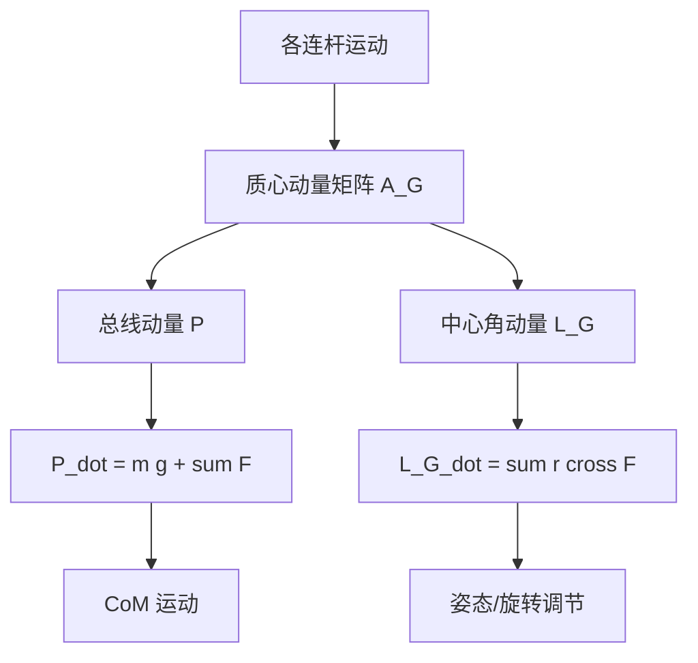

## 概述
#### 8.4.6 质心动量与中心角动量

## 核心内容
人形机器人是多连杆系统，其整体运动状态不仅由各连杆速度决定，还可以通过**质心动量（centroidal momentum）**统一描述。质心动量把机器人所有连杆的线动量与角动量汇总到**质心（Center of Mass, CoM）**处，是分析行走、奔跑、跳跃等动态运动的强有力工具[41]。

!!! note "术语解释：质心动量、中心角动量、线动量、角动量、质心"
    - **质心动量（centroidal momentum）**：机器人总线动量与相对于质心的总角动量在质心处的合成。
    - **中心角动量（centroidal angular momentum）**：机器人相对于质心的总角动量。
    - **线动量（linear momentum）**：质量与质心速度的乘积，$\mathbf{P} = m \mathbf{v}_{\text{CoM}}$。
    - **角动量（angular momentum）**：描述旋转运动状态的矢量，$\mathbf{L} = \mathbf{I}\boldsymbol{\omega}$。
    - **质心（CoM）**：系统质量加权平均位置。

定义机器人广义坐标 $\mathbf{q}$ 与广义速度 $\mathbf{v}$，则**质心动量矩阵（Centroidal Momentum Matrix, CMM）** $\mathbf{A}_G(\mathbf{q})$ 把广义速度映射为质心处的 6 维质心动量：

$$
\begin{bmatrix} \mathbf{P} \\ \mathbf{L}_G \end{bmatrix} = \mathbf{A}_G(\mathbf{q}) \, \mathbf{v}
$$

其中 $\mathbf{P} \in \mathbb{R}^3$ 为总线动量，$\mathbf{L}_G \in \mathbb{R}^3$ 为相对于质心的总角动量。质心动量矩阵具有清晰的物理意义：其行向量表示各关节速度对整体线动量与角动量的贡献权重[41]。

质心动量的时间导数等于外力之和：

$$
\frac{d}{dt} \begin{bmatrix} \mathbf{P} \\ \mathbf{L}_G \end{bmatrix} = \begin{bmatrix} m \mathbf{g} + \sum_j \mathbf{F}_j \\ \sum_j (\mathbf{r}_j - \mathbf{r}_G) \times \mathbf{F}_j \end{bmatrix}
$$

其中 $\mathbf{F}_j$ 为第 $j$ 个外部接触力，$\mathbf{r}_j$ 为其作用点，$\mathbf{r}_G$ 为质心位置。由此可见，质心水平加速度由地面反作用力的水平分量决定，而中心角动量的变化率由接触力绕质心的力矩决定。

!!! note "术语解释：质心动量矩阵（CMM）、外力矩、地面反作用力、质心加速度"
    - **质心动量矩阵（Centroidal Momentum Matrix, CMM）**：把关节速度映射到质心动量的 6×n 矩阵。
    - **外力矩（external moment）**：外部作用力绕某点的力矩之和。
    - **地面反作用力（Ground Reaction Force, GRF）**：地面作用于机器人脚的接触力。
    - **质心加速度（CoM acceleration）**：质心位置对时间的二阶导数。

在**飞行相（flight phase）**，如跳跃或跑步离地阶段，机器人所受合外力仅有重力 $m\mathbf{g}$，因此：

$$
\dot{\mathbf{P}} = m \mathbf{g}, \quad \dot{\mathbf{L}}_G = \mathbf{0}
$$

这意味着**角动量守恒（conservation of angular momentum）**：在腾空期间，机器人无法通过内部关节运动改变总角动量，只能通过改变肢体相对位置调整姿态。体操运动员、猫的下落翻转都利用了这一原理。人形机器人在跳跃落地、跌倒恢复中，必须预先规划好起跳时的角动量，因为空中无法补充或消除。

!!! note "术语解释：飞行相、角动量守恒、腾空、姿态调整"
    - **飞行相（flight phase）**：机器人双脚离地的运动阶段。
    - **角动量守恒（conservation of angular momentum）**：无外力矩时系统总角动量保持不变。
    - **腾空（airborne）**：身体完全离开支撑面的状态。
    - **姿态调整（attitude adjustment）**：通过改变肢体构型改变身体朝向，而不改变总角动量。

控制上身角动量是人形机器人动态平衡的重要手段。例如，当外界扰动使身体绕某轴产生角动量时，可通过手臂或躯干的反向摆动产生补偿力矩，使总角动量保持在期望范围。这种策略在**角动量平衡控制（angular momentum-based balance control）**中被广泛应用[41][53]。

## 参考
- Wiki extraction

