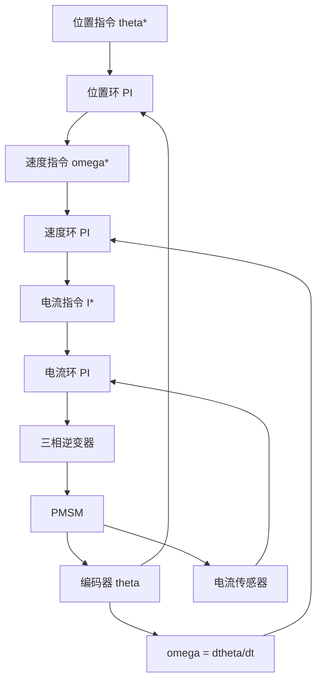

## 概述
电流环/速度环/位置环是人形机器人领域的重要principle。以下内容整理自项目 Wiki，供深入查阅。

## 核心内容
实际关节驱动通常采用三级级联控制：最内层 **电流环**（力矩环），中间 **速度环**，最外层 **位置环**。每一层带宽约为下一层的 5-10 倍，以保证稳定性。

!!! note "术语解释：电流环、速度环、位置环、PI 控制器、前馈、抗饱和、带宽级联"
    - **电流环（current loop）**：以电机相电流为被控量的最快内环，直接决定输出力矩。
    - **速度环（velocity loop）**：以电机转速为被控量，输出电流指令。
    - **位置环（position loop）**：以关节角度为被控量，输出速度指令。
    - **PI 控制器（proportional-integral controller）**：由比例项和积分项组成的经典控制器，用于消除稳态误差。
    - **前馈（feedforward）**：根据期望轨迹提前计算并加入控制量，提高跟踪性能。
    - **抗饱和（anti-windup）**：防止积分器在饱和时过度累积，避免退出饱和后的大超调。
    - **带宽级联（bandwidth cascade）**：内环带宽远高于外环，确保外环指令能被内环快速跟踪。

电流环带宽通常可达 1-5 kHz；速度环 50-500 Hz；位置环 5-100 Hz，具体取决于负载惯量、刚度和采样率。

## 参考
- Wiki extraction
- 项目 Wiki：chapter-04.md#4.5.5 电流环、速度环、位置环的级联控制

