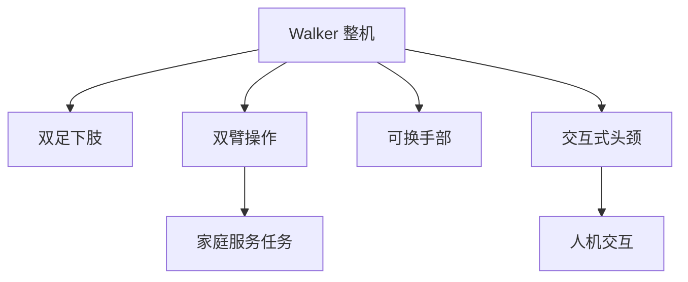

## 概述
家庭服务是人形机器人领域的重要application_scenario。以下内容整理自项目 Wiki，供深入查阅。

## 核心内容
Walker 系列面向家庭与商用服务场景，强调人机交互、安全与双臂操作能力。其躯干与头部设计注重外观亲和性，手臂自由度较多，手部可更换夹爪与灵巧手。与工厂物流机器人不同，服务场景要求机器人在有限空间内与人近距离互动，因此 Walker 的肩臂尺寸更接近人体比例，末端速度受限以满足协作安全标准；头部集成交互屏幕与表情灯带，可通过视觉与语音反馈建立用户信任。其手部采用可更换设计，可在二指夹爪与多指灵巧手之间切换，以兼顾简单递送与精细操作任务。

!!! note "术语解释：服务机器人、人机交互、双臂协调、可更换末端"
    - **服务机器人（service robot）**：在非工业环境中为人类提供服务的机器人。
    - **人机交互（Human-Robot Interaction, HRI）**：人与机器人之间的信息交换与协作。
    - **双臂协调（bimanual coordination）**：两只手臂协同完成任务。
    - **可更换末端（interchangeable end-effector）**：根据任务快速更换的手部工具。

Walker 子系统特点（公开资料）：

| 子系统 | 特点 |
|---|---|
| 下肢 | 双足步行，髋/膝/踝布局 |
| 躯干 | 电池与计算集成，可扩展模块 |
| 上肢 | 双臂 7-DOF，仿人臂长 |
| 手部 | 可换夹爪/灵巧手 |
| 头颈 | 显示屏+多相机，表情交互 |

## 参考
- Wiki extraction
- 项目 Wiki：chapter-09.md#9.10.4 UBTech Walker：家庭服务场景整机集成

