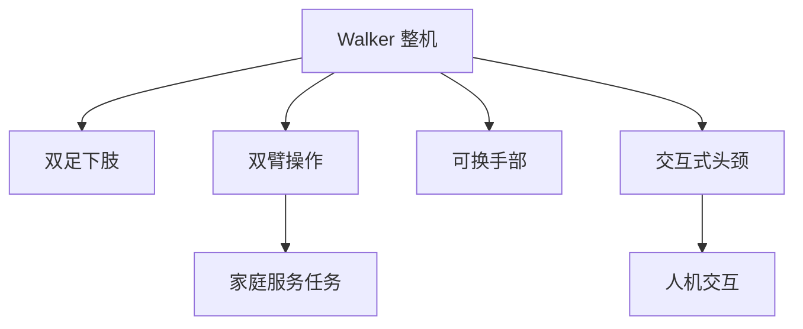

## 概述
家庭服务是人形机器人领域的重要应用场景。以下内容整理自项目 Wiki，供深入查阅。

## 核心内容
Walker 系列面向家庭与商用服务场景，强调人机交互、安全与双臂操作能力。其躯干与头部设计注重外观亲和性，手臂自由度较多，手部可更换夹爪与灵巧手。与工厂物流机器人不同，服务场景要求机器人在有限空间内与人近距离互动，因此 Walker 的肩臂尺寸更接近人体比例，末端速度受限以满足协作安全标准；头部集成交互屏幕与表情灯带，可通过视觉与语音反馈建立用户信任。其手部采用可更换设计，可在二指夹爪与多指灵巧手之间切换，以兼顾简单递送与精细操作任务。

!!! note "术语解释：服务机器人、人机交互、双臂协调、可更换末端"
    - **服务机器人（service robot）**：在非工业环境中为人类提供服务的机器人。
    - **人机交互（Human-Robot Interaction, HRI）**：人与机器人之间的信息交换与协作。
    - **双臂协调（bimanual coordination）**：两只手臂协同完成任务。
    - **可更换末端（interchangeable end-effector）**：根据任务快速更换的手部工具。

Walker 子系统特点（公开资料）：

| 子系统 | 特点 |
|---|---|
| 下肢 | 双足步行，髋/膝/踝布局 |
| 躯干 | 电池与计算集成，可扩展模块 |
| 上肢 | 双臂 7-DOF，仿人臂长 |
| 手部 | 可换夹爪/灵巧手 |
| 头颈 | 显示屏+多相机，表情交互 |



## 参考
- Wiki extraction
- 项目 Wiki：chapter-09.md#9.10.4 UBTech Walker：家庭服务场景整机集成

## Overview
Home service is a key application scenario in the humanoid robot field. The following content is compiled from the project Wiki for in-depth reference.

## Content
The Walker series is designed for home and commercial service scenarios, emphasizing human-robot interaction, safety, and dual-arm manipulation capabilities. Its torso and head design prioritize a friendly appearance, with multiple degrees of freedom in the arms and interchangeable grippers and dexterous hands. Unlike factory logistics robots, service scenarios require robots to interact closely with humans in confined spaces. Therefore, Walker's shoulder and arm dimensions are closer to human proportions, and end-effector speeds are limited to meet collaborative safety standards. The head integrates an interactive screen and expression LED strips, building user trust through visual and voice feedback. Its hands feature a replaceable design, allowing switching between two-finger grippers and multi-finger dexterous hands to handle both simple delivery and fine manipulation tasks.

!!! note "Terminology: Service Robot, Human-Robot Interaction, Bimanual Coordination, Interchangeable End-Effector"
    - **Service robot**: A robot that provides services to humans in non-industrial environments.
    - **Human-Robot Interaction (HRI)**: Information exchange and collaboration between humans and robots.
    - **Bimanual coordination**: Two arms working together to complete a task.
    - **Interchangeable end-effector**: A hand tool that can be quickly replaced based on the task.

Walker subsystem features (from public sources):

| Subsystem | Features |
|---|---|
| Lower limbs | Bipedal walking, hip/knee/ankle layout |
| Torso | Integrated battery and computing, expandable modules |
| Upper limbs | Dual-arm 7-DOF, human-like arm length |
| Hands | Interchangeable grippers/dexterous hands |
| Head and neck | Display + multi-camera, expressive interaction |

```mermaid
flowchart TD
    A["Walker Whole Robot"] --> B["Bipedal Lower Limbs"]
    A --> C["Dual-Arm Manipulation"]
    A --> D["Interchangeable Hands"]
    A --> E["Interactive Head and Neck"]
    C --> F["Home Service Tasks"]
    E --> G["Human-Robot Interaction"]

## 개요
가사 서비스는 휴머노이드 로봇 분야의 중요한 응용 시나리오입니다. 아래 내용은 프로젝트 Wiki에서 정리한 것으로, 심층 참고용으로 제공됩니다.

## 핵심 내용
Walker 시리즈는 가정 및 상업용 서비스 시나리오를 대상으로 하며, 인간-로봇 상호작용, 안전성 및 양팔 조작 능력을 강조합니다. 몸통과 머리 디자인은 외관의 친근감을 중시하며, 팔의 자유도가 높고, 손은 교체 가능한 그리퍼와 정교한 손을 장착할 수 있습니다. 공장 물류 로봇과 달리, 서비스 시나리오에서는 로봇이 제한된 공간에서 인간과 가까이 상호작용해야 하므로, Walker의 어깨와 팔 크기는 인체 비율에 더 가깝고, 말단 속도는 협동 안전 기준을 충족하도록 제한됩니다. 머리에는 상호작용 화면과 표정 LED 스트립이 통합되어 있으며, 시각 및 음성 피드백을 통해 사용자 신뢰를 구축할 수 있습니다. 손은 교체 가능한 디자인을 채택하여, 두 손가락 그리퍼와 다손가락 정교한 손 사이를 전환함으로써 간단한 전달 작업과 정밀 조작 작업을 모두 처리할 수 있습니다.

!!! note "용어 설명: 서비스 로봇, 인간-로봇 상호작용, 양팔 협조, 교체 가능한 말단"
    - **서비스 로봇(service robot)**: 비산업 환경에서 인간에게 서비스를 제공하는 로봇.
    - **인간-로봇 상호작용(Human-Robot Interaction, HRI)**: 인간과 로봇 간의 정보 교환 및 협력.
    - **양팔 협조(bimanual coordination)**: 두 팔이 협력하여 작업을 수행하는 것.
    - **교체 가능한 말단(interchangeable end-effector)**: 작업에 따라 빠르게 교체할 수 있는 손 도구.

Walker 서브시스템 특징 (공개 자료):

| 서브시스템 | 특징 |
|---|---|
| 하체 | 이족 보행, 고관절/무릎/발목 배치 |
| 몸통 | 배터리 및 연산 통합, 확장 가능 모듈 |
| 상체 | 양팔 7-DOF, 인간형 팔 길이 |
| 손 | 교체 가능한 그리퍼/정교한 손 |
| 머리와 목 | 디스플레이 + 다중 카메라, 표정 상호작용 |

```mermaid
flowchart TD
    A["Walker 전체"] --> B["이족 하체"]
    A --> C["양팔 조작"]
    A --> D["교체 가능한 손"]
    A --> E["상호작용형 머리와 목"]
    C --> F["가사 서비스 작업"]
    E --> G["인간-로봇 상호작용"]
