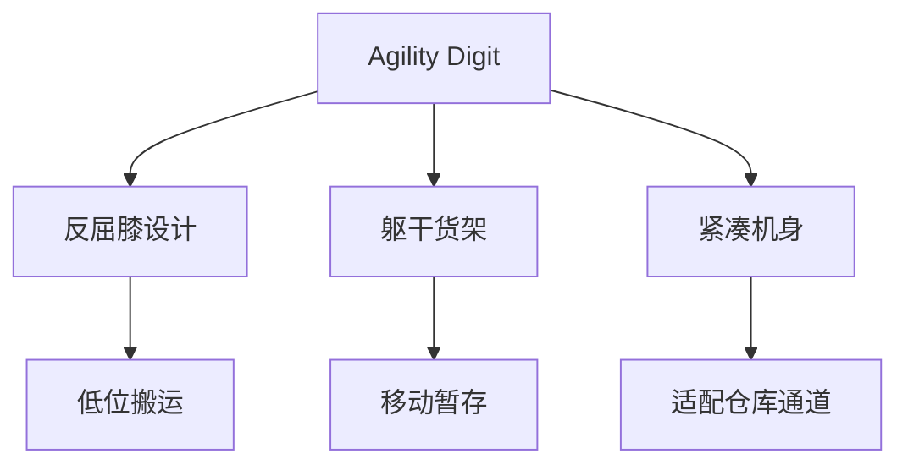

## 概述
物流仓储是人形机器人领域的重要application_scenario。以下内容整理自项目 Wiki，供深入查阅。

## 核心内容
Agility Digit 定位于物流与仓储场景，设计强调在有限空间内搬运货物、上下台阶、长时间运行。

!!! note "术语解释：Digit、物流机器人、仓储自动化、末端配送"
    - **Digit**：Agility Robotics 开发的人形机器人。
    - **物流机器人（logistics robot）**：用于搬运、分拣、运输的机器人。
    - **仓储自动化（warehouse automation）**：利用机器人与系统自动完成仓储作业。
    - **末端配送（last-mile delivery）**：从配送中心到最终用户的最后一段物流。

Digit 的设计取舍包括：
- 腿部反屈膝（backward-bending knee）设计，便于下蹲搬运低处货物。
- 躯干上方设有货架空间，可在移动中暂存物品。
- 强调与现有仓库布局兼容，无需大幅改造环境。

## 参考
- Wiki extraction
- 项目 Wiki：chapter-08.md#8.9.4 Agility Digit：物流仓储专用人形

