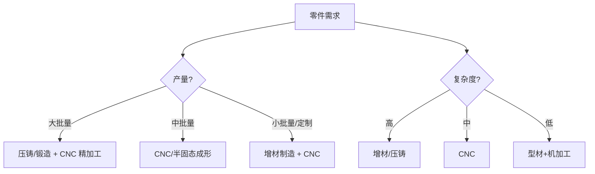

## 概述
CNC精密机加工是人形机器人领域的重要technology。以下内容整理自项目 Wiki，供深入查阅。

## 核心内容
不同制造工艺在成本、精度、强度与几何复杂度上各有优劣，需根据零件功能、产量与质量要求选择。

!!! note "术语解释：铸造、锻造、CNC 加工、增材制造、复合材料、铺层"
    - **铸造（casting）**：将熔融金属倒入模具凝固成形。
    - **锻造（forging）**：通过压力使金属塑性变形，改善晶粒组织。
    - **CNC 加工（CNC machining）**：计算机数控切削加工。
    - **增材制造（Additive Manufacturing, AM）**：逐层堆积材料的成形技术。
    - **复合材料（composite material）**：由两种及以上材料组成的新材料，如碳纤维增强塑料。
    - **铺层（layup）**：复合材料中纤维层的铺设方式。

工艺对比：

| 工艺 | 优点 | 缺点 | 适用零件 |
|---|---|---|---|
| 压铸 | 复杂形状、大批量、成本低 | 气孔、强度低于锻件 | 躯干壳体、关节外壳 |
| 砂铸/熔模 | 大件、小批量 | 精度低、后续加工多 | 基座、支架 |
| 锻造 | 高强度、高疲劳寿命 | 模具贵、几何受限 | 高强度连杆、曲柄 |
| CNC | 高精度、灵活 | 材料利用率低、工时高 | 关节壳体、安装座、连杆 |
| 增材制造 | 复杂拓扑、轻量化 | 速度慢、表面粗糙、疲劳数据少 | 拓扑优化支架、夹具 |
| 复合材料 | 高比刚度、可设计性强 | 成本高、连接难、回收难 | 小腿、手臂外壳 |

## 参考
- Wiki extraction
- 项目 Wiki：chapter-09.md#9.8.2 制造工艺：铸造、锻造、CNC、增材制造与复合材料

