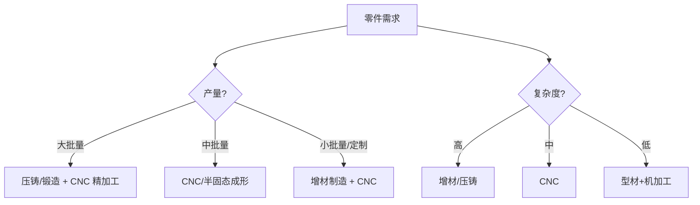

## 概述
CNC精密机加工是人形机器人领域的重要技术。以下内容整理自项目 Wiki，供深入查阅。

## 核心内容
不同制造工艺在成本、精度、强度与几何复杂度上各有优劣，需根据零件功能、产量与质量要求选择。

!!! note "术语解释：铸造、锻造、CNC 加工、增材制造、复合材料、铺层"
    - **铸造（casting）**：将熔融金属倒入模具凝固成形。
    - **锻造（forging）**：通过压力使金属塑性变形，改善晶粒组织。
    - **CNC 加工（CNC machining）**：计算机数控切削加工。
    - **增材制造（Additive Manufacturing, AM）**：逐层堆积材料的成形技术。
    - **复合材料（composite material）**：由两种及以上材料组成的新材料，如碳纤维增强塑料。
    - **铺层（layup）**：复合材料中纤维层的铺设方式。

工艺对比：

| 工艺 | 优点 | 缺点 | 适用零件 |
|---|---|---|---|
| 压铸 | 复杂形状、大批量、成本低 | 气孔、强度低于锻件 | 躯干壳体、关节外壳 |
| 砂铸/熔模 | 大件、小批量 | 精度低、后续加工多 | 基座、支架 |
| 锻造 | 高强度、高疲劳寿命 | 模具贵、几何受限 | 高强度连杆、曲柄 |
| CNC | 高精度、灵活 | 材料利用率低、工时高 | 关节壳体、安装座、连杆 |
| 增材制造 | 复杂拓扑、轻量化 | 速度慢、表面粗糙、疲劳数据少 | 拓扑优化支架、夹具 |
| 复合材料 | 高比刚度、可设计性强 | 成本高、连接难、回收难 | 小腿、手臂外壳 |



## 参考
- Wiki extraction
- 项目 Wiki：chapter-09.md#9.8.2 制造工艺：铸造、锻造、CNC、增材制造与复合材料

## Overview
CNC precision machining is a key technology in the field of humanoid robotics. The following content is compiled from the project Wiki for in-depth reference.

## Content
Different manufacturing processes have their own advantages and disadvantages in terms of cost, precision, strength, and geometric complexity. The choice depends on part function, production volume, and quality requirements.

!!! note "Terminology Explanation: Casting, Forging, CNC Machining, Additive Manufacturing, Composite Materials, Layup"
    - **Casting**: Pouring molten metal into a mold to solidify into shape.
    - **Forging**: Using pressure to plastically deform metal, improving grain structure.
    - **CNC Machining**: Computer numerical control cutting process.
    - **Additive Manufacturing (AM)**: A forming technology that builds materials layer by layer.
    - **Composite Material**: A new material composed of two or more materials, such as carbon fiber reinforced plastic.
    - **Layup**: The arrangement of fiber layers in composite materials.

Process Comparison:

| Process | Advantages | Disadvantages | Suitable Parts |
|---|---|---|---|
| Die Casting | Complex shapes, high volume, low cost | Porosity, lower strength than forgings | Body shells, joint housings |
| Sand/Investment Casting | Large parts, low volume | Low precision, requires extensive post-processing | Bases, brackets |
| Forging | High strength, high fatigue life | Expensive molds, geometric limitations | High-strength connecting rods, cranks |
| CNC | High precision, flexible | Low material utilization, high labor hours | Joint housings, mounting bases, connecting rods |
| Additive Manufacturing | Complex topology, lightweight | Slow speed, rough surface, limited fatigue data | Topology-optimized brackets, fixtures |
| Composite Materials | High specific stiffness, designable | High cost, difficult joining, hard to recycle | Lower leg, arm shells |

```mermaid
flowchart TD
    A["Part Requirements"] --> B{"Production Volume?"}
    B -->|"High Volume"| C["Die Casting/Forging + CNC Finishing"]
    B -->|"Medium Volume"| D["CNC/Semi-Solid Forming"]
    B -->|"Low Volume/Custom"| E["Additive Manufacturing + CNC"]
    A --> F{"Complexity?"}
    F -->|"High"| G["Additive/Die Casting"]
    F -->|"Medium"| H["CNC"]
    F -->|"Low"| I["Profile + Machining"]

## 개요
CNC 정밀 가공은 휴머노이드 로봇 분야의 중요한 기술입니다. 아래 내용은 프로젝트 Wiki에서 정리한 것으로, 심층 참고용으로 제공됩니다.

## 핵심 내용
다양한 제조 공정은 비용, 정밀도, 강도 및 기하학적 복잡성에서 각각 장단점이 있으며, 부품의 기능, 생산량 및 품질 요구 사항에 따라 선택해야 합니다.

!!! note "용어 설명: 주조, 단조, CNC 가공, 적층 제조, 복합 재료, 적층"
    - **주조(casting)**: 용융 금속을 주형에 부어 응고시키는 성형.
    - **단조(forging)**: 압력을 통해 금속을 소성 변형시켜 결정립 조직을 개선.
    - **CNC 가공(CNC machining)**: 컴퓨터 수치 제어 절삭 가공.
    - **적층 제조(Additive Manufacturing, AM)**: 재료를 층층이 쌓아 성형하는 기술.
    - **복합 재료(composite material)**: 두 가지 이상의 재료로 구성된 신소재, 예: 탄소 섬유 강화 플라스틱.
    - **적층(layup)**: 복합 재료에서 섬유 층의 배치 방식.

공정 비교:

| 공정 | 장점 | 단점 | 적용 부품 |
|---|---|---|---|
| 다이캐스팅 | 복잡한 형상, 대량 생산, 저비용 | 기공, 단조품 대비 낮은 강도 | 본체 케이스, 관절 외피 |
| 사형 주조/정밀 주조 | 대형 부품, 소량 생산 | 낮은 정밀도, 후가공 많음 | 베이스, 브래킷 |
| 단조 | 고강도, 높은 피로 수명 | 금형 비용 높음, 기하학적 제한 | 고강도 커넥팅 로드, 크랭크 |
| CNC | 고정밀, 유연성 | 재료利用率 낮음, 높은 가공 시간 | 관절 케이스, 장착 베이스, 커넥팅 로드 |
| 적층 제조 | 복잡한 토폴로지, 경량화 | 속도 느림, 표면 거침, 피로 데이터 부족 | 토폴로지 최적화 브래킷, 지그 |
| 복합 재료 | 높은 비강성, 설계 자유도 높음 | 높은 비용, 접합 어려움, 재활용 어려움 | 종아리, 팔 외피 |

```mermaid
flowchart TD
    A["부품 요구 사항"] --> B{"생산량?"}
    B -->|"대량"| C["다이캐스팅/단조 + CNC 정밀 가공"]
    B -->|"중량"| D["CNC/반고체 성형"]
    B -->|"소량/맞춤형"| E["적층 제조 + CNC"]
    A --> F{"복잡성?"}
    F -->|"높음"| G["적층/다이캐스팅"]
    F -->|"중간"| H["CNC"]
    F -->|"낮음"| I["형재+기계 가공"]
