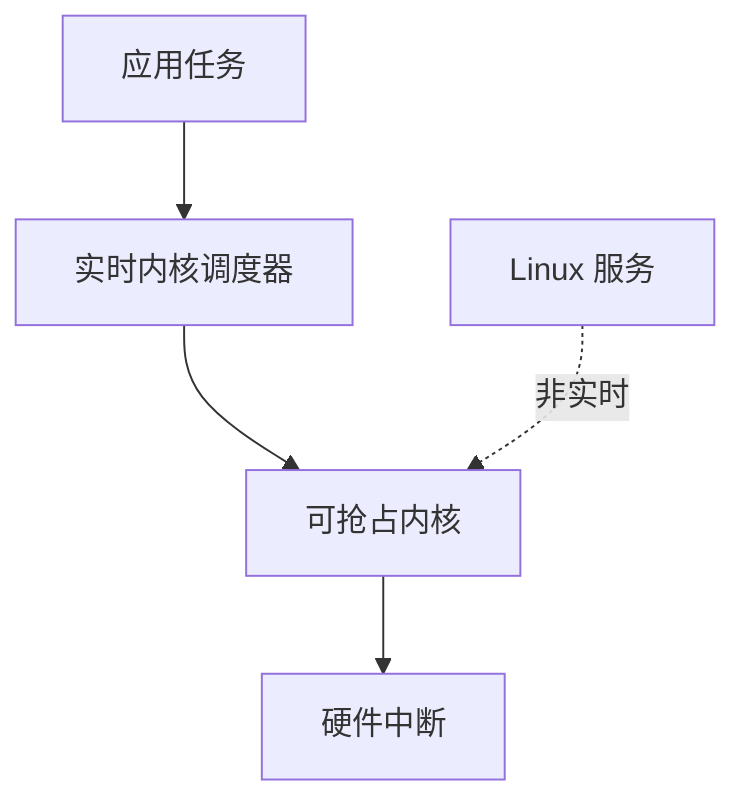

## 概述
QNX是人形机器人领域的重要software_platform。以下内容整理自项目 Wiki，供深入查阅。

## 核心内容
通用操作系统（如标准 Linux）并非为硬实时设计。实时操作系统（RTOS）通过内核抢占、优先级调度和确定性中断响应满足微秒级时序要求。

!!! note "术语解释：实时操作系统、抢占、优先级、中断延迟、调度器"
    - **实时操作系统（RTOS）**：能够满足确定性时间约束的操作系统。
    - **抢占（preemption）**：高优先级任务可中断低优先级任务立即执行。
    - **优先级（priority）**：决定任务执行先后顺序的属性。
    - **中断延迟（interrupt latency）**：从中断发生到进入中断服务程序的时间。
    - **调度器（scheduler）**：决定哪个任务在哪个时刻运行的内核组件。

**Linux PREEMPT_RT**。通过给主线 Linux 打实时补丁，使内核中大部分代码可抢占，中断也可线程化。它保留了 Linux 丰富的生态，同时提供数十微秒的调度延迟，是机器人主控的常见选择。

**Xenomai**。在 Linux 上提供双核（dual-kernel）实时扩展，实时任务运行在 Cobalt 实时核，非实时任务运行在 Linux 核。Xenomai 的调度延迟可低至微秒级，但配置和维护较复杂。

**QNX**。BlackBerry 拥有的微内核实时操作系统，广泛应用于汽车、医疗和工业。其微内核架构把文件系统、网络栈等作为用户态服务，内核只保留最小功能，具有高可靠性和安全性。

**Zephyr**。Linux 基金会托管的开源 RTOS，面向资源受限的嵌入式设备，支持多种架构，常用于传感器节点和电机控制器。

!!! note "术语解释：微内核、双核实时、中断线程化、调度延迟"
    - **微内核（microkernel）**：只在内核态保留最基本服务（进程、内存、IPC），其他服务在用户态运行。
    - **双核实时（dual-kernel real-time）**：在通用 OS 旁边运行一个独立实时内核的架构。
    - **中断线程化（interrupt threading）**：把中断处理程序作为内核线程运行，可被更高优先级实时任务抢占。
    - **调度延迟（scheduling latency）**：从任务变为可运行到真正开始执行的时间。

## 参考
- Wiki extraction
- 项目 Wiki：chapter-06.md#6.4.3 实时操作系统：Linux PREEMPT_RT, Xenomai, QNX, Zephyr

