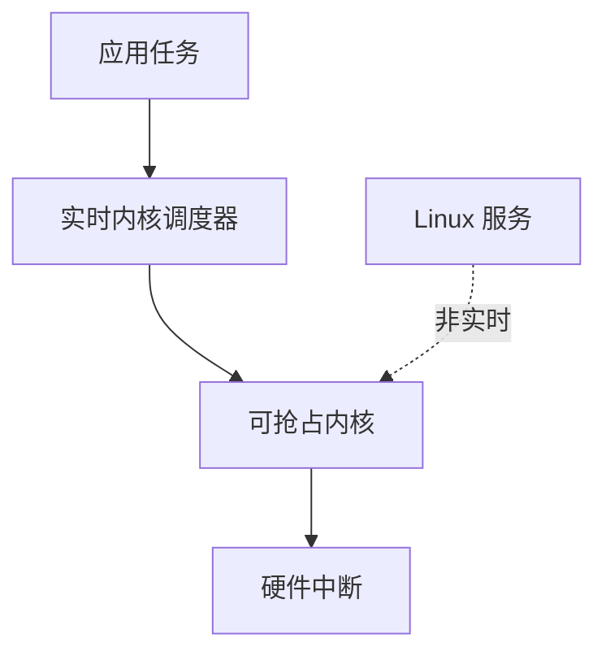

## 概述
QNX是人形机器人领域的重要软件平台。以下内容整理自项目 Wiki，供深入查阅。

## 核心内容
通用操作系统（如标准 Linux）并非为硬实时设计。实时操作系统（RTOS）通过内核抢占、优先级调度和确定性中断响应满足微秒级时序要求。

!!! note "术语解释：实时操作系统、抢占、优先级、中断延迟、调度器"
    - **实时操作系统（RTOS）**：能够满足确定性时间约束的操作系统。
    - **抢占（preemption）**：高优先级任务可中断低优先级任务立即执行。
    - **优先级（priority）**：决定任务执行先后顺序的属性。
    - **中断延迟（interrupt latency）**：从中断发生到进入中断服务程序的时间。
    - **调度器（scheduler）**：决定哪个任务在哪个时刻运行的内核组件。

**Linux PREEMPT_RT**。通过给主线 Linux 打实时补丁，使内核中大部分代码可抢占，中断也可线程化。它保留了 Linux 丰富的生态，同时提供数十微秒的调度延迟，是机器人主控的常见选择。

**Xenomai**。在 Linux 上提供双核（dual-kernel）实时扩展，实时任务运行在 Cobalt 实时核，非实时任务运行在 Linux 核。Xenomai 的调度延迟可低至微秒级，但配置和维护较复杂。

**QNX**。BlackBerry 拥有的微内核实时操作系统，广泛应用于汽车、医疗和工业。其微内核架构把文件系统、网络栈等作为用户态服务，内核只保留最小功能，具有高可靠性和安全性。

**Zephyr**。Linux 基金会托管的开源 RTOS，面向资源受限的嵌入式设备，支持多种架构，常用于传感器节点和电机控制器。

!!! note "术语解释：微内核、双核实时、中断线程化、调度延迟"
    - **微内核（microkernel）**：只在内核态保留最基本服务（进程、内存、IPC），其他服务在用户态运行。
    - **双核实时（dual-kernel real-time）**：在通用 OS 旁边运行一个独立实时内核的架构。
    - **中断线程化（interrupt threading）**：把中断处理程序作为内核线程运行，可被更高优先级实时任务抢占。
    - **调度延迟（scheduling latency）**：从任务变为可运行到真正开始执行的时间。



## 参考
- Wiki extraction
- 项目 Wiki：chapter-06.md#6.4.3 实时操作系统：Linux PREEMPT_RT, Xenomai, QNX, Zephyr

## Overview
QNX is an important software platform in the field of humanoid robots. The following content is compiled from the project Wiki for in-depth reference.

## Content
General-purpose operating systems (such as standard Linux) are not designed for hard real-time. Real-time operating systems (RTOS) meet microsecond-level timing requirements through kernel preemption, priority scheduling, and deterministic interrupt response.

!!! note "Terminology explanation: Real-time operating system, preemption, priority, interrupt latency, scheduler"
    - **Real-time operating system (RTOS)**: An operating system capable of meeting deterministic time constraints.
    - **Preemption**: A high-priority task can interrupt a low-priority task and execute immediately.
    - **Priority**: An attribute that determines the order in which tasks are executed.
    - **Interrupt latency**: The time from when an interrupt occurs to when the interrupt service routine begins execution.
    - **Scheduler**: A kernel component that decides which task runs at which moment.

**Linux PREEMPT_RT**. By applying real-time patches to mainline Linux, most code in the kernel becomes preemptible, and interrupts can be threaded. It retains the rich ecosystem of Linux while providing scheduling latency in the tens of microseconds, making it a common choice for robot main controllers.

**Xenomai**. Provides a dual-kernel real-time extension on Linux, where real-time tasks run on the Cobalt real-time kernel and non-real-time tasks run on the Linux kernel. Xenomai's scheduling latency can be as low as microseconds, but configuration and maintenance are more complex.

**QNX**. A microkernel real-time operating system owned by BlackBerry, widely used in automotive, medical, and industrial fields. Its microkernel architecture implements file systems, network stacks, etc., as user-space services, with the kernel retaining only minimal functionality, offering high reliability and security.

**Zephyr**. An open-source RTOS hosted by the Linux Foundation, designed for resource-constrained embedded devices, supporting multiple architectures, and commonly used in sensor nodes and motor controllers.

!!! note "Terminology explanation: Microkernel, dual-kernel real-time, interrupt threading, scheduling latency"
    - **Microkernel**: Only the most basic services (processes, memory, IPC) are retained in kernel space, while other services run in user space.
    - **Dual-kernel real-time**: An architecture where an independent real-time kernel runs alongside a general-purpose OS.
    - **Interrupt threading**: Running interrupt handlers as kernel threads, which can be preempted by higher-priority real-time tasks.
    - **Scheduling latency**: The time from when a task becomes runnable to when it actually starts execution.

```mermaid
flowchart TD
    A["Application Tasks"] --> B["Real-time Kernel Scheduler"]
    B --> C["Preemptible Kernel"]
    C --> D["Hardware Interrupts"]
    E["Linux Services"] -.->|"Non-real-time"| C

## 개요
QNX는 휴머노이드 로봇 분야의 중요한 소프트웨어 플랫폼입니다. 아래 내용은 프로젝트 Wiki에서 정리한 것으로, 심층적인 참고를 위해 제공됩니다.

## 핵심 내용
범용 운영체제(예: 표준 Linux)는 하드 리얼타임을 위해 설계되지 않았습니다. 실시간 운영체제(RTOS)는 커널 선점, 우선순위 스케줄링 및 결정적 인터럽트 응답을 통해 마이크로초 단위의 타이밍 요구 사항을 충족합니다.

!!! note "용어 설명: 실시간 운영체제, 선점, 우선순위, 인터럽트 지연, 스케줄러"
    - **실시간 운영체제(RTOS)**: 결정적 시간 제약을 충족할 수 있는 운영체제.
    - **선점(preemption)**: 높은 우선순위의 태스크가 낮은 우선순위의 태스크를 중단하고 즉시 실행될 수 있는 것.
    - **우선순위(priority)**: 태스크 실행 순서를 결정하는 속성.
    - **인터럽트 지연(interrupt latency)**: 인터럽트 발생부터 인터럽트 서비스 루틴 진입까지의 시간.
    - **스케줄러(scheduler)**: 어떤 태스크가 언제 실행될지 결정하는 커널 구성 요소.

**Linux PREEMPT_RT**. 메인라인 Linux에 실시간 패치를 적용하여 커널 내 대부분의 코드를 선점 가능하게 하고, 인터럽트도 스레드화합니다. Linux의 풍부한 생태계를 유지하면서 수십 마이크로초의 스케줄링 지연을 제공하여 로봇 메인 컨트롤러의 일반적인 선택입니다.

**Xenomai**. Linux 위에 듀얼 커널 실시간 확장을 제공하며, 실시간 태스크는 Cobalt 실시간 커널에서 실행되고, 비실시간 태스크는 Linux 커널에서 실행됩니다. Xenomai의 스케줄링 지연은 마이크로초 수준까지 낮출 수 있지만, 구성 및 유지보수가 복잡합니다.

**QNX**. BlackBerry가 소유한 마이크로커널 실시간 운영체제로, 자동차, 의료 및 산업 분야에서 널리 사용됩니다. 마이크로커널 아키텍처는 파일 시스템, 네트워크 스택 등을 사용자 공간 서비스로 두고, 커널은 최소 기능만 유지하여 높은 신뢰성과 보안성을 제공합니다.

**Zephyr**. Linux Foundation이 호스팅하는 오픈 소스 RTOS로, 리소스가 제한된 임베디드 장치를 대상으로 하며, 다양한 아키텍처를 지원하고 센서 노드 및 모터 컨트롤러에 자주 사용됩니다.

!!! note "용어 설명: 마이크로커널, 듀얼 커널 실시간, 인터럽트 스레드화, 스케줄링 지연"
    - **마이크로커널(microkernel)**: 커널 공간에 가장 기본적인 서비스(프로세스, 메모리, IPC)만 유지하고, 다른 서비스는 사용자 공간에서 실행.
    - **듀얼 커널 실시간(dual-kernel real-time)**: 범용 OS 옆에 독립적인 실시간 커널을 실행하는 아키텍처.
    - **인터럽트 스레드화(interrupt threading)**: 인터럽트 핸들러를 커널 스레드로 실행하여 더 높은 우선순위의 실시간 태스크에 의해 선점될 수 있도록 함.
    - **스케줄링 지연(scheduling latency)**: 태스크가 실행 가능 상태가 된 시점부터 실제 실행이 시작될 때까지의 시간.

```mermaid
flowchart TD
    A["애플리케이션 태스크"] --> B["실시간 커널 스케줄러"]
    B --> C["선점 가능 커널"]
    C --> D["하드웨어 인터럽트"]
    E["Linux 서비스"] -.->|"비실시간"| C
