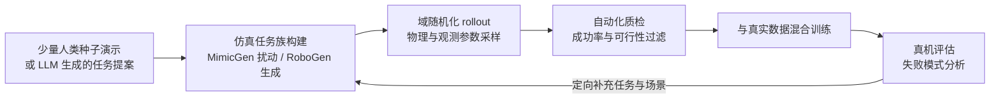
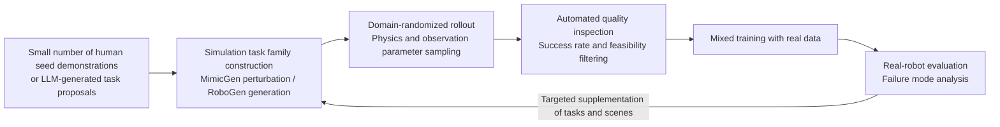
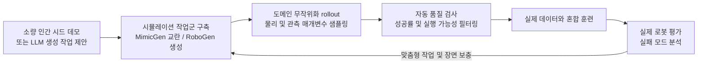

## 概述
RoboGen 是一种由大语言模型驱动的生成式仿真框架，通过"任务提案—场景生成—监督生成—技能学习"的自循环流水线，自动产出多样化任务与对应仿真代码，在任务语义层面扩展合成训练数据的多样性。它真正改变的不是"如何生成更多仿真数据"，而是"由谁决定生成什么任务"——将任务分布的决策权从人类专家转移给大模型。

## 核心内容

### 是什么：定义与定位

RoboGen（全称 *RoboGen: Towards Unleashing Infinite Data for Automated Robot Learning via Generative Simulation*）是一种由大语言模型驱动的自动任务生成框架，发表于 ICML 2024。其核心主张是：与其直接使用大模型生成策略或底层动作，不如让大模型自动生成多样化的任务、场景与训练监督信号，从而以最小人工监督实现机器人技能学习的规模化扩展。

RoboGen 属于**技术（方法）**类型，所属领域包括 AI 模型与算法、软件中间件、数据与数据集，价值链层级为智能层。它属于数据引擎（data engine）家族——即围绕"发现模型缺陷 → 定向生产数据 → 再训练 → 再评估"闭环构建的持续数据生产体系，而非一次性的数据集构建项目。

### 为什么存在：痛点与历史定位

仿真数据的关键问题不是"能不能生成"，而是"生成什么"——任务分布的多样性决定了数据的泛化价值。在 RoboGen 出现之前，仿真数据生产面临三重困境：

**第一，任务分布由人工预设。** 传统仿真资产库中有什么任务，训练数据就只能覆盖什么任务。任务语义空间的扩展依赖人类专家逐一手工设计，成本高且覆盖有限。

**第二，演示增强只能放大"同任务内"的多样性。** 以 MimicGen 为代表的演示增强框架，以少量人类种子演示为模板，通过在仿真中扰动物体位姿与初始条件，将几十条种子演示自动扩展为成千上万条变化演示。其洞察是：人类演示的价值在于"任务策略的分解与关键帧"，而具体的几何变体可以由仿真廉价地补全。但这种方法无法突破种子演示本身的任务语义边界。

**第三，任务生成方向与真机失败模式脱节。** 传统"一次性建库"思路下，仿真任务的生成方向由资产库中现有什么决定，而非由真机评估中暴露的策略能力缺口驱动。

RoboGen 的定位正是填补"跨任务的语义多样性"这一维度。它与 MimicGen 分别对应数据引擎的两个放大维度：**同任务内的实例多样性**与**跨任务的语义多样性**。

### 原理拆解

RoboGen 的核心是一个**自引导的"提案—生成—学习"循环（propose-generate-learn cycle）**，由四个阶段构成：

**① 任务提案（Task Proposal）**
智能体首先向大语言模型查询"哪些任务值得学习"，提出有趣的任务与技能目标。这一阶段利用大模型在互联网规模文本中编码的关于物体功能（affordance）、场景布局与人类活动模式的广泛知识，将任务提案从"人工枚举"变为"模型生成"。

**② 场景生成（Scene Generation）**
针对每个提案任务，系统通过填充相关物体与资产、配置合理的空间布局，生成对应的仿真环境。场景生成不是随机摆放，而是要求满足任务可行性的空间约束——物体必须处于可操作的位置关系。

**③ 训练监督生成（Training Supervision Generation）**
这是 RoboGen 区别于朴素"任务生成器"的关键。系统将高层任务分解为子任务（sub-tasks），为每个子任务选择最优学习方式——强化学习（reinforcement learning）、运动规划（motion planning）或轨迹优化（trajectory optimization）——并生成对应的训练监督信号（如奖励函数、演示轨迹或优化目标）。

**④ 技能学习（Skill Learning）**
在生成的场景与监督信号下，智能体学习策略以获取提案技能。整个流水线可被反复查询，持续产出与多样化任务和场景关联的技能演示流。

RoboGen 的仿真与渲染基于 **Genesis**——一个多材质、多求解器的生成式仿真引擎，专为通用机器人学习设计。其完整流水线可形式化描述为：

$$
\text{RoboGen}: \quad \underbrace{\text{LLM 提案任务}}_{\text{Task Proposal}} \;\rightarrow\; \underbrace{\text{场景与资产填充}}_{\text{Scene Gen}} \;\rightarrow\; \underbrace{\text{子任务分解 + 学习方式选择 + 监督生成}}_{\text{Supervision Gen}} \;\rightarrow\; \underbrace{\text{策略学习}}_{\text{Skill Learning}}
$$

### 关键参数与规格

RoboGen 作为方法而非硬件，其"规格"体现在设计选择与能力边界上：

| 维度 | 规格/选择 | 说明 |
|---|---|---|
| 基础模型 | 大语言模型 + 生成式模型 | 利用 foundation model 与 generative model 的最新进展 |
| 学习方式 | 强化学习 / 运动规划 / 轨迹优化 | 按子任务特性自动选择最优方式 |
| 仿真引擎 | Genesis | 多材质、多求解器生成式仿真引擎 |
| 输出形式 | 技能演示流（skill demonstrations） | 与多样化任务和场景关联 |
| 人工监督 | 最小化（minimal human supervision） | 全自动流水线，可重复查询 |
| 发表信息 | ICML 2024 | 论文 arXiv:2311.01455 |

### 横向对比

RoboGen 在数据引擎谱系中的位置可通过与相邻方法的对比来界定：

| 方法 | 数据扩展维度 | 任务来源 | 人工依赖 | 核心机制 |
|---|---|---|---|---|
| MimicGen | 同任务内实例多样性 | 人类种子演示 | 需少量种子演示 | 位姿扰动 + 初始条件变化 |
| RoboGen | 跨任务语义多样性 | LLM 自动提案 | 最小化 | 生成式仿真 + 自动监督生成 |
| 域随机化（DR） | 参数鲁棒性 | 现有任务 | 低 | 随机化物理与观测参数 |
| 域适应（DA） | 分布对齐 | 现有任务 + 少量真实数据 | 需少量真实数据 | 分布对齐训练 |

RoboGen 与 MimicGen 并非竞争关系而是互补关系：前者扩展任务语义空间，后者在给定任务内扩展实例变体。二者配合域随机化方法——在仿真中随机化摩擦系数、质量、光照、相机内外参等物理与观测参数——训练出的策略对真实世界的分布偏移具有更强的鲁棒性；域适应方法则进一步利用少量真实数据对仿真训练的策略做分布对齐。

### 谁在用：应用案例

RoboGen 的典型应用场景是**长时域任务生成与学习**：系统能够提出高层任务、生成对应环境、将高层目标分解为低层子任务，并按顺序依次学习子技能。例如，在"将物品存入储物家具"（store an item into the storage furniture）任务中，RoboGen 输出完整的场景配置、任务分解与训练监督信号。

在数据引擎的整体闭环中，RoboGen 处于"仿真任务族构建"环节：

这一闭环与传统"一次性建库"思路的根本区别在于：仿真任务的生成方向由**真机失败模式**驱动，而非由资产库中现有什么决定——数据引擎的每一次迭代都在针对性修补策略的能力缺口。

### 局限与边界

**第一，Sim-to-Real 差距无法消除。** 仿真数据的固有缺陷是仿真与真实世界之间的系统性偏差：接触力学、变形体、传感器噪声与执行器动态在仿真中只能近似建模，策略在仿真中表现优异并不意味着真机可用。人形机器人的差距尤为突出，因为其任务涉及双足接触切换、软接触与全身动态平衡——这些恰恰是物理引擎最难精确仿真的部分。

**第二，生成任务的质量缺乏保证。** LLM 提案的任务可能存在语义合理但物理不可行、或奖励函数设计不当导致策略学到投机行为等问题。RoboGen 通过自动化质检（成功率与可行性过滤）部分缓解，但无法完全替代人类对任务价值的判断。

**第三，物理真实性仍需真实数据锚定。** 工程上的应对是**混合数据策略（co-training）**：以大规模仿真数据提供任务多样性与密集监督，以少量真实数据校准分布偏移。行业实践表明，在 VLA 类模型训练中，真实数据与合成数据的配比、以及合成数据的域随机化强度，对最终真机成功率的影响往往超过模型结构本身。

### 常见误区

1. **"RoboGen 就是自动生成仿真代码的工具"**——不准确。生成仿真场景代码只是中间步骤，其完整目标是"自动学习多样化机器人技能"。代码生成服务于技能学习，而非终点。

2. **"RoboGen 可以完全替代真实数据"**——错误。RoboGen 解决的是任务语义多样性的扩展，但 Sim-to-Real 差距决定了仿真数据必须与真实数据混合训练。数据引擎的设计目标不是最大化数据量，而是最大化单位训练算力下的**真机性能增益**。

3. **"RoboGen 与 MimicGen 是竞争关系"**——误解。二者分别对应数据引擎的两个放大维度：同任务内的实例多样性与跨任务的语义多样性，在实际数据管线中通常配合使用。

4. **"任务生成越多越好"**——错误。仿真任务的生成方向应由真机失败模式驱动，而非盲目追求数量。无差别扩增任务可能引入低质量或与目标分布错位的样本，反而稀释训练信号。

### 相关知识

- `ent_component_nvidia_jetson_thor` — NVIDIA Jetson Thor 提供端侧算力支撑，使 RoboGen 这类生成式数据引擎产出的 VLA 策略可在真实机器人上实时推理。
- `ent_paper_humanoidgen_data_generation_fo_2025` — HumanoidGen 与 RoboGen 同属 LLM 驱动的仿真数据生成范式，但聚焦双臂灵巧手人形机器人的原子化灵巧操作与空间约束链生成。
- `ent_paper_roboomni_2025` — RoboOmni 利用 OmniAction 数据集训练全模态 LLM 框架，其数据生产依赖 RoboGen 式数据引擎扩展任务语义多样性。
- `ent_paper_ge_sim_2_0_roadmap_comprehensive_2026` — GE-Sim 2.0 作为生成式视频世界模拟器，与 RoboGen 互补：前者提供可闭环评估的视觉模拟，后者提供任务语义层面的数据扩展。

## 参考
- [RoboGen: Towards Unleashing Infinite Data for Automated Robot Learning via Generative Simulation](https://arxiv.org/abs/2311.01455)
- [RoboGen Project Page](https://robogen-ai.github.io)
- [Chapter 21: 数据基础设施](https://github.com/YansongW/awesome-humanoid-robot/tree/main/wiki/docs/chapters/chapter-21.md)

## Overview
RoboGen is a generative simulation framework driven by large language models. Through a self-reinforcing pipeline of "task proposal—scene generation—supervision generation—skill learning," it automatically produces diverse tasks and corresponding simulation code, expanding the diversity of synthetic training data at the task-semantic level. What it truly changes is not "how to generate more simulation data," but "who decides what tasks to generate"—shifting the decision-making power over task distribution from human experts to large models.

## Content

### What It Is: Definition and Positioning

RoboGen (full title *RoboGen: Towards Unleashing Infinite Data for Automated Robot Learning via Generative Simulation*) is an automated task generation framework driven by large language models, published at ICML 2024. Its core proposition is: rather than directly using large models to generate policies or low-level actions, let large models automatically generate diverse tasks, scenes, and training supervision signals, thereby scaling robot skill learning with minimal human supervision.

RoboGen falls under the **technology (method)** category, spanning AI models and algorithms, software middleware, and data and datasets, positioned at the intelligence layer of the value chain. It belongs to the data engine family—a continuous data production system built around the closed loop of "discovering model deficiencies → targeted data production → retraining → re-evaluation"—rather than a one-off dataset construction project.

### Why It Exists: Pain Points and Historical Positioning

The key issue with simulation data is not "whether it can be generated," but "what is generated"—the diversity of task distribution determines the generalization value of the data. Before RoboGen, simulation data production faced threefold challenges:

**First, task distribution was manually preset.** Training data could only cover tasks available in traditional simulation asset libraries. Expanding the task semantic space relied on human experts designing tasks one by one, which was costly and limited in coverage.

**Second, demonstration augmentation could only amplify diversity "within the same task."** Demonstration augmentation frameworks represented by MimicGen used a small number of human seed demonstrations as templates, automatically expanding dozens of seed demonstrations into thousands of varied demonstrations by perturbing object poses and initial conditions in simulation. The insight was: the value of human demonstrations lies in the "decomposition of task strategies and keyframes," while specific geometric variants can be cheaply completed by simulation. However, this approach cannot break through the task semantic boundaries of the seed demonstrations themselves.

**Third, task generation direction was disconnected from real-robot failure modes.** Under the traditional "one-time library construction" approach, the direction of simulation task generation was determined by what already existed in the asset library, rather than driven by policy capability gaps exposed during real-robot evaluation.

RoboGen's positioning precisely fills the dimension of "cross-task semantic diversity." Together with MimicGen, they correspond to two amplification dimensions of the data engine: **intra-task instance diversity** and **cross-task semantic diversity**.

### Principle Breakdown

The core of RoboGen is a **self-guided "propose-generate-learn" cycle**, consisting of four stages:

**① Task Proposal**
The agent first queries the large language model about "which tasks are worth learning," proposing interesting tasks and skill objectives. This stage leverages the large model's extensive knowledge encoded in internet-scale text about object affordances, scene layouts, and human activity patterns, transforming task proposals from "manual enumeration" to "model generation."

**② Scene Generation**
For each proposed task, the system generates the corresponding simulation environment by populating relevant objects and assets and configuring reasonable spatial layouts. Scene generation is not random placement but must satisfy spatial constraints for task feasibility—objects must be in operable positional relationships.

**③ Training Supervision Generation**
This is the key differentiator of RoboGen from naive "task generators." The system decomposes high-level tasks into sub-tasks, selects the optimal learning method for each sub-task—reinforcement learning, motion planning, or trajectory optimization—and generates corresponding training supervision signals (such as reward functions, demonstration trajectories, or optimization objectives).

**④ Skill Learning**
Under the generated scenes and supervision signals, the agent learns policies to acquire the proposed skills. The entire pipeline can be queried repeatedly, continuously producing streams of skill demonstrations associated with diverse tasks and scenes.

RoboGen's simulation and rendering are based on **Genesis**—a generative simulation engine with multiple materials and solvers, designed specifically for general-purpose robot learning. Its complete pipeline can be formally described as:

$$
\text{RoboGen}: \quad \underbrace{\text{LLM proposes tasks}}_{\text{Task Proposal}} \;\rightarrow\; \underbrace{\text{Scene and asset population}}_{\text{Scene Gen}} \;\rightarrow\; \underbrace{\text{Sub-task decomposition + learning method selection + supervision generation}}_{\text{Supervision Gen}} \;\rightarrow\; \underbrace{\text{Policy learning}}_{\text{Skill Learning}}
$$

### Key Parameters and Specifications

As a method rather than hardware, RoboGen's "specifications" are reflected in its design choices and capability boundaries:

| Dimension | Specification/Choice | Description |
|---|---|---|
| Foundation models | Large language models + generative models | Leverages the latest advances in foundation models and generative models |
| Learning methods | Reinforcement learning / motion planning / trajectory optimization | Automatically selects the optimal method based on sub-task characteristics |
| Simulation engine | Genesis | Generative simulation engine with multiple materials and solvers |
| Output form | Streams of skill demonstrations | Associated with diverse tasks and scenes |
| Human supervision | Minimal | Fully automated pipeline, repeatably queryable |
| Publication info | ICML 2024 | Paper arXiv:2311.01455 |

### Horizontal Comparison

RoboGen's position in the data engine spectrum can be defined through comparison with adjacent methods:

| Method | Data expansion dimension | Task source | Human dependency | Core mechanism |
|---|---|---|---|---|
| MimicGen | Intra-task instance diversity | Human seed demonstrations | Requires a small number of seed demonstrations | Pose perturbation + initial condition variation |
| RoboGen | Cross-task semantic diversity | LLM automatic proposal | Minimal | Generative simulation + automatic supervision generation |
| Domain randomization (DR) | Parameter robustness | Existing tasks | Low | Randomizing physics and observation parameters |
| Domain adaptation (DA) | Distribution alignment | Existing tasks + small amount of real data | Requires a small amount of real data | Distribution alignment training |

RoboGen and MimicGen are not competitors but complementary: the former expands the task semantic space, while the latter expands instance variants within a given task. When combined with domain randomization methods—randomizing physical and observation parameters such as friction coefficients, mass, lighting, and camera intrinsics/extrinsics in simulation—the trained policies exhibit stronger robustness to distribution shifts in the real world. Domain adaptation methods further leverage small amounts of real data to align the distribution of simulation-trained policies.

### Who Uses It: Application Cases

The typical application scenario for RoboGen is **long-horizon task generation and learning**: the system can propose high-level tasks, generate corresponding environments, decompose high-level goals into low-level sub-tasks, and learn sub-skills sequentially. For example, in the task "store an item into the storage furniture," RoboGen outputs the complete scene configuration, task decomposition, and training supervision signals.

Within the overall closed loop of the data engine, RoboGen operates at the "simulation task family construction" stage:

The fundamental difference between this closed loop and the traditional "one-time library construction" approach is that the direction of simulation task generation is driven by **real-robot failure modes**, rather than by what already exists in the asset library—each iteration of the data engine precisely patches the policy's capability gaps.

### Limitations and Boundaries

**First, the Sim-to-Real gap cannot be eliminated.** The inherent flaw of simulation data is the systematic bias between simulation and the real world: contact mechanics, deformable bodies, sensor noise, and actuator dynamics can only be approximately modeled in simulation. A policy performing excellently in simulation does not guarantee real-robot usability. The gap is particularly pronounced for humanoid robots, as their tasks involve bipedal contact switching, soft contacts, and whole-body dynamic balance—precisely the aspects that physics engines find most difficult to simulate accurately.

**Second, the quality of generated tasks lacks guarantees.** Tasks proposed by LLMs may be semantically reasonable but physically infeasible, or reward functions may be poorly designed, causing policies to learn exploitative behaviors. RoboGen partially mitigates this through automated quality inspection (success rate and feasibility filtering), but it cannot fully replace human judgment of task value.

**Third, physical realism still requires real data as an anchor.** The engineering response is a **mixed data strategy (co-training)**: large-scale simulation data provides task diversity and dense supervision, while small amounts of real data calibrate distribution shifts. Industry practice shows that in VLA-type model training, the ratio of real to synthetic data, as well as the intensity of domain randomization on synthetic data, often has a greater impact on final real-robot success rates than the model architecture itself.

### Common Misconceptions

1. **"RoboGen is just a tool for automatically generating simulation code"**—inaccurate. Generating simulation scene code is only an intermediate step; its complete goal is "automatically learning diverse robot skills." Code generation serves skill learning, not the end goal.

2. **"RoboGen can completely replace real data"**—incorrect. RoboGen addresses the expansion of task semantic diversity, but the Sim-to-Real gap dictates that simulation data must be mixed with real data for training. The design goal of a data engine is not to maximize data volume, but to maximize **real-robot performance gain per unit of training compute**.

3. **"RoboGen and MimicGen are competitors"**—misunderstanding. They correspond to two amplification dimensions of the data engine: intra-task instance diversity and cross-task semantic diversity, and are typically used together in actual data pipelines.

4. **"The more tasks generated, the better"**—incorrect. The direction of simulation task generation should be driven by real-robot failure modes, not by blindly pursuing quantity. Indiscriminate task expansion may introduce low-quality samples or samples misaligned with the target distribution, diluting the training signal instead.

### Related Knowledge

- `ent_component_nvidia_jetson_thor` — NVIDIA Jetson Thor provides edge-side compute support, enabling VLA policies produced by generative data engines like RoboGen to perform real-time inference on real robots.
- `ent_paper_humanoidgen_data_generation_fo_2025` — HumanoidGen shares the LLM-driven simulation data generation paradigm with RoboGen, but focuses on atomic dexterous manipulation and spatial constraint chain generation for humanoid robots with dual arms and dexterous hands.
- `ent_paper_roboomni_2025` — RoboOmni trains a full-modality LLM framework using the OmniAction dataset, with its data production relying on RoboGen-style data engines to expand task semantic diversity.
- `ent_paper_ge_sim_2_0_roadmap_comprehensive_2026` — GE-Sim 2.0, as a generative video world simulator, complements RoboGen: the former provides visual simulation for closed-loop evaluation, while the latter provides data expansion at the task semantic level.

## 개요
RoboGen은 대규모 언어 모델(LLM)로 구동되는 생성적 시뮬레이션 프레임워크로, "작업 제안—장면 생성—감독 생성—스킬 학습"의 자가 순환 파이프라인을 통해 다양한 작업과 해당 시뮬레이션 코드를 자동으로 생성하며, 작업 의미론적 수준에서 합성 훈련 데이터의 다양성을 확장합니다. 이 프레임워크가 실제로 바꾸는 것은 "더 많은 시뮬레이션 데이터를 생성하는 방법"이 아니라 "어떤 작업을 생성할지 결정하는 주체"입니다—즉, 작업 분포에 대한 결정 권한을 인간 전문가에서 대규모 언어 모델로 이전합니다.

## 핵심 내용

### 무엇인가: 정의 및 위치

RoboGen(전체 명칭 *RoboGen: Towards Unleashing Infinite Data for Automated Robot Learning via Generative Simulation*)은 대규모 언어 모델로 구동되는 자동 작업 생성 프레임워크로, ICML 2024에 발표되었습니다. 핵심 주장은 다음과 같습니다: 대규모 언어 모델을 사용하여 정책이나 저수준 동작을 직접 생성하는 대신, 대규모 언어 모델이 다양한 작업, 장면 및 훈련 감독 신호를 자동으로 생성하여 최소한의 인간 감독으로 로봇 스킬 학습의 규모 확장을 실현하는 것입니다.

RoboGen은 **기술(방법)** 유형에 속하며, 관련 분야는 AI 모델 및 알고리즘, 소프트웨어 미들웨어, 데이터 및 데이터셋이며, 가치 사슬 계층은 지능 계층입니다. 이는 데이터 엔진(data engine) 계열에 속합니다—즉, "모델 결함 발견 → 맞춤형 데이터 생산 → 재훈련 → 재평가"의 폐루프를 중심으로 구축된 지속적 데이터 생산 체계이지, 일회성 데이터셋 구축 프로젝트가 아닙니다.

### 왜 존재하는가: 문제점 및 역사적 위치

시뮬레이션 데이터의 핵심 문제는 "생성할 수 있는지"가 아니라 "무엇을 생성할지"입니다—작업 분포의 다양성이 데이터의 일반화 가치를 결정합니다. RoboGen 이전에는 시뮬레이션 데이터 생산이 세 가지 어려움에 직면했습니다:

**첫째, 작업 분포가 인간에 의해 사전 설정됩니다.** 전통적인 시뮬레이션 자산 라이브러리에 있는 작업만 훈련 데이터가 커버할 수 있습니다. 작업 의미론적 공간의 확장은 인간 전문가가 하나씩 수작업으로 설계해야 하며, 비용이 높고 커버리지가 제한적입니다.

**둘째, 데모 증강은 "동일 작업 내" 다양성만 확대할 수 있습니다.** MimicGen으로 대표되는 데모 증강 프레임워크는 소량의 인간 시드 데모를 템플릿으로 사용하여, 시뮬레이션에서 객체 포즈와 초기 조건을 교란함으로써 수십 개의 시드 데모를 수천 개의 변형 데모로 자동 확장합니다. 그 통찰은 인간 데모의 가치가 "작업 전략의 분해 및 키프레임"에 있으며, 구체적인 기하학적 변형은 시뮬레이션으로 저렴하게 보완할 수 있다는 것입니다. 그러나 이 방법은 시드 데모 자체의 작업 의미론적 경계를 넘어설 수 없습니다.

**셋째, 작업 생성 방향이 실제 로봇 실패 모드와 분리되어 있습니다.** 전통적인 "일회성 데이터베이스 구축" 접근 방식에서는 시뮬레이션 작업의 생성 방향이 자산 라이브러리에 무엇이 있는지에 의해 결정되며, 실제 로봇 평가에서 드러난 정책 능력 격차에 의해 주도되지 않습니다.

RoboGen의 위치는 바로 "작업 간 의미론적 다양성"이라는 차원을 채우는 것입니다. 이는 MimicGen과 함께 데이터 엔진의 두 가지 확대 차원에 각각 대응합니다: **동일 작업 내 인스턴스 다양성**과 **작업 간 의미론적 다양성**.

### 원리 분석

RoboGen의 핵심은 **자기 유도형 "제안—생성—학습" 순환(propose-generate-learn cycle)** 으로, 네 단계로 구성됩니다:

**① 작업 제안(Task Proposal)**
에이전트는 먼저 대규모 언어 모델에 "어떤 작업을 배울 가치가 있는지"를 질의하여 흥미로운 작업과 스킬 목표를 제안합니다. 이 단계는 대규모 언어 모델이 인터넷 규모의 텍스트에 인코딩한 객체 기능(affordance), 장면 레이아웃 및 인간 활동 패턴에 대한 광범위한 지식을 활용하여 작업 제안을 "인간 열거"에서 "모델 생성"으로 전환합니다.

**② 장면 생성(Scene Generation)**
각 제안된 작업에 대해 시스템은 관련 객체와 자산을 채우고 합리적인 공간 레이아웃을 구성하여 해당 시뮬레이션 환경을 생성합니다. 장면 생성은 무작위 배치가 아니라 작업 실행 가능성을 충족하는 공간 제약을 요구합니다—객체는 조작 가능한 위치 관계에 있어야 합니다.

**③ 훈련 감독 생성(Training Supervision Generation)**
이것이 RoboGen을 단순한 "작업 생성기"와 구별짓는 핵심입니다. 시스템은 고수준 작업을 하위 작업(sub-tasks)으로 분해하고, 각 하위 작업에 대해 최적의 학습 방식을 선택합니다—강화 학습(reinforcement learning), 운동 계획(motion planning) 또는 궤적 최적화(trajectory optimization)—그리고 해당 훈련 감독 신호(예: 보상 함수, 데모 궤적 또는 최적화 목표)를 생성합니다.

**④ 스킬 학습(Skill Learning)**
생성된 장면과 감독 신호 하에서 에이전트는 정책을 학습하여 제안된 스킬을 획득합니다. 전체 파이프라인은 반복적으로 쿼리될 수 있으며, 다양한 작업과 장면과 연관된 스킬 데모 흐름을 지속적으로 생산합니다.

RoboGen의 시뮬레이션 및 렌더링은 **Genesis**—일반 로봇 학습을 위해 설계된 다중 재질, 다중 솔버 생성적 시뮬레이션 엔진—을 기반으로 합니다. 전체 파이프라인은 공식적으로 다음과 같이 설명할 수 있습니다:

$$
\text{RoboGen}: \quad \underbrace{\text{LLM 작업 제안}}_{\text{Task Proposal}} \;\rightarrow\; \underbrace{\text{장면 및 자산 채우기}}_{\text{Scene Gen}} \;\rightarrow\; \underbrace{\text{하위 작업 분해 + 학습 방식 선택 + 감독 생성}}_{\text{Supervision Gen}} \;\rightarrow\; \underbrace{\text{정책 학습}}_{\text{Skill Learning}}
$$

### 주요 매개변수 및 사양

RoboGen은 방법론이지 하드웨어가 아니므로, 그 "사양"은 설계 선택과 능력 경계에 반영됩니다:

| 차원 | 사양/선택 | 설명 |
|---|---|---|
| 기반 모델 | 대규모 언어 모델 + 생성 모델 | foundation model 및 generative model의 최신 발전 활용 |
| 학습 방식 | 강화 학습 / 운동 계획 / 궤적 최적화 | 하위 작업 특성에 따라 최적 방식 자동 선택 |
| 시뮬레이션 엔진 | Genesis | 다중 재질, 다중 솔버 생성적 시뮬레이션 엔진 |
| 출력 형태 | 스킬 데모 흐름(skill demonstrations) | 다양한 작업 및 장면과 연관 |
| 인간 감독 | 최소화(minimal human supervision) | 완전 자동 파이프라인, 반복 쿼리 가능 |
| 발표 정보 | ICML 2024 | 논문 arXiv:2311.01455 |

### 수평 비교

RoboGen의 데이터 엔진 계보 내 위치는 인접 방법과의 비교를 통해 규명할 수 있습니다:

| 방법 | 데이터 확장 차원 | 작업 출처 | 인간 의존성 | 핵심 메커니즘 |
|---|---|---|---|---|
| MimicGen | 동일 작업 내 인스턴스 다양성 | 인간 시드 데모 | 소량의 시드 데모 필요 | 포즈 교란 + 초기 조건 변화 |
| RoboGen | 작업 간 의미론적 다양성 | LLM 자동 제안 | 최소화 | 생성적 시뮬레이션 + 자동 감독 생성 |
| 도메인 무작위화(DR) | 매개변수 견고성 | 기존 작업 | 낮음 | 물리 및 관측 매개변수 무작위화 |
| 도메인 적응(DA) | 분포 정렬 | 기존 작업 + 소량 실제 데이터 | 소량 실제 데이터 필요 | 분포 정렬 훈련 |

RoboGen과 MimicGen은 경쟁 관계가 아니라 보완 관계입니다: 전자는 작업 의미론적 공간을 확장하고, 후자는 주어진 작업 내에서 인스턴스 변형을 확장합니다. 이 둘은 도메인 무작위화 방법과 함께 사용됩니다—시뮬레이션에서 마찰 계수, 질량, 조명, 카메라 내외부 파라미터 등 물리 및 관측 매개변수를 무작위화하여 훈련된 정책이 실제 세계의 분포 이동에 대해 더 강한 견고성을 갖도록 합니다; 도메인 적응 방법은 소량의 실제 데이터를 추가로 사용하여 시뮬레이션에서 훈련된 정책의 분포를 정렬합니다.

### 누가 사용하는가: 적용 사례

RoboGen의 대표적인 적용 시나리오는 **장시간 영역 작업 생성 및 학습**입니다: 시스템은 고수준 작업을 제안하고, 해당 환경을 생성하며, 고수준 목표를 저수준 하위 작업으로 분해하고, 순서대로 하위 스킬을 학습할 수 있습니다. 예를 들어, "물건을 수납 가구에 보관하기"(store an item into the storage furniture) 작업에서 RoboGen은 완전한 장면 구성, 작업 분해 및 훈련 감독 신호를 출력합니다.

데이터 엔진의 전체 폐루프에서 RoboGen은 "시뮬레이션 작업군 구축" 단계에 위치합니다:

이 폐루프와 전통적인 "일회성 데이터베이스 구축" 접근 방식의 근본적 차이는 시뮬레이션 작업의 생성 방향이 **실제 로봇 실패 모드**에 의해 주도된다는 점입니다—자산 라이브러리에 무엇이 있는지가 아니라—데이터 엔진의 각 반복은 정책의 능력 격차를 맞춤형으로 보완합니다.

### 한계 및 경계

**첫째, Sim-to-Real 격차는 제거할 수 없습니다.** 시뮬레이션 데이터의 고유한 결함은 시뮬레이션과 실제 세계 간의 체계적 편향입니다: 접촉 역학, 변형체, 센서 노이즈 및 액추에이터 동역학은 시뮬레이션에서 근사적으로만 모델링할 수 있으며, 시뮬레이션에서 우수한 성능을 보이는 정책이 실제 로봇에서 사용 가능하다는 것을 의미하지 않습니다. 휴머노이드 로봇의 격차는 특히 두드러지는데, 그 작업이 이족 접촉 전환, 연성 접촉 및 전신 동적 균형을 포함하기 때문입니다—이것들은 물리 엔진이 가장 정확하게 시뮬레이션하기 어려운 부분입니다.

**둘째, 생성된 작업의 품질에 대한 보장이 없습니다.** LLM이 제안한 작업은 의미론적으로는 합리적이지만 물리적으로 실행 불가능하거나, 보상 함수 설계가 부적절하여 정책이 편법 행동을 학습하는 등의 문제가 있을 수 있습니다. RoboGen은 자동 품질 검사(성공률 및 실행 가능성 필터링)로 부분적으로 완화하지만, 인간의 작업 가치 판단을 완전히 대체할 수는 없습니다.

**셋째, 물리적 현실성은 여전히 실제 데이터로 앵커링되어야 합니다.** 공학적 대응은 **혼합 데이터 전략(co-training)** 입니다: 대규모 시뮬레이션 데이터로 작업 다양성과 밀집 감독을 제공하고, 소량의 실제 데이터로 분포 이동을 보정합니다. 업계 실무에 따르면, VLA 유형 모델 훈련에서 실제 데이터와 합성 데이터의 비율, 그리고 합성 데이터의 도메인 무작위화 강도는 최종 실제 로봇 성공률에 모델 구조 자체보다 더 큰 영향을 미칩니다.

### 일반적인 오해

1. **"RoboGen은 시뮬레이션 코드를 자동 생성하는 도구일 뿐이다"**—부정확합니다. 시뮬레이션 장면 코드 생성은 중간 단계일 뿐이며, 그 전체 목표는 "다양한 로봇 스킬을 자동으로 학습하는 것"입니다. 코드 생성은 스킬 학습을 위한 수단이지 종착점이 아닙니다.

2. **"RoboGen은 실제 데이터를 완전히 대체할 수 있다"**—오류입니다. RoboGen은 작업 의미론적 다양성의 확장을 해결하지만, Sim-to-Real 격차는 시뮬레이션 데이터가 실제 데이터와 혼합 훈련되어야 함을 결정합니다. 데이터 엔진의 설계 목표는 데이터 양을 최대화하는 것이 아니라 단위 훈련 연산량당 **실제 로봇 성능 이득**을 최대화하는 것입니다.

3. **"RoboGen과 MimicGen은 경쟁 관계이다"**—오해입니다. 이 둘은 데이터 엔진의 두 가지 확대 차원, 즉 동일 작업 내 인스턴스 다양성과 작업 간 의미론적 다양성에 각각 대응하며, 실제 데이터 파이프라인에서 일반적으로 함께 사용됩니다.

4. **"작업 생성은 많을수록 좋다"**—오류입니다. 시뮬레이션 작업의 생성 방향은 실제 로봇 실패 모드에 의해 주도되어야 하며, 맹목적으로 양을 추구해서는 안 됩니다. 무차별적인 작업 확장은 저품질 또는 목표 분포와 어긋난 샘플을 도입하여 훈련 신호를 오히려 희석시킬 수 있습니다.

### 관련 지식

- `ent_component_nvidia_jetson_thor` — NVIDIA Jetson Thor는 엣지 컴퓨팅 성능을 제공하여 RoboGen과 같은 생성적 데이터 엔진이 생산한 VLA 정책이 실제 로봇에서 실시간 추론될 수 있도록 지원합니다.
- `ent_paper_humanoidgen_data_generation_fo_2025` — HumanoidGen은 RoboGen과 동일한 LLM 기반 시뮬레이션 데이터 생성 패러다임에 속하지만, 이족 접촉 전환, 연성 접촉 및 전신 동적 균형을 포함하는 이족 보행 휴머노이드 로봇의 원자화된 정밀 조작과 공간 제약 체인 생성에 초점을 맞춥니다.
- `ent_paper_roboomni_2025` — RoboOmni는 OmniAction 데이터셋을 사용하여 전모달 LLM 프레임워크를 훈련하며, 그 데이터 생산은 RoboGen 방식의 데이터 엔진에 의존하여 작업 의미론적 다양성을 확장합니다.
- `ent_paper_ge_sim_2_0_roadmap_comprehensive_2026` — GE-Sim 2.0은 생성적 비디오 세계 시뮬레이터로서 RoboGen과 보완적입니다: 전자는 폐루프 평가가 가능한 시각적 시뮬레이션을 제공하고, 후자는 작업 의미론적 수준의 데이터 확장을 제공합니다.
