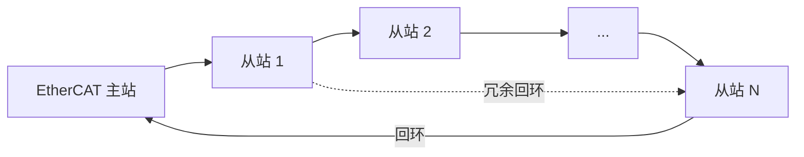
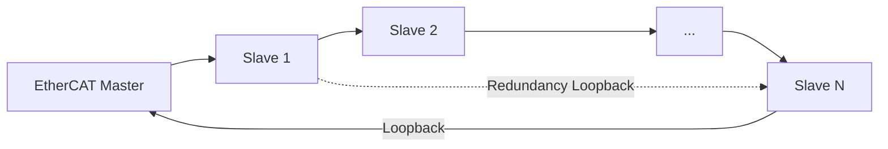
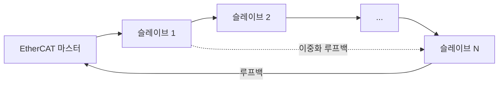

## 概述
EtherCAT是人形机器人领域的重要技术。以下内容整理自项目 Wiki，供深入查阅。

## 核心内容
EtherCAT 是一种基于标准以太网帧的工业现场总线，由 Beckhoff 提出并由 EtherCAT Technology Group 维护。其最大特点是“processing on the fly”：从站在帧经过时立即读写数据，无需完整接收帧再转发。

!!! note "术语解释：EtherCAT、主站、从站、飞读飞写、工作计数器、分布式时钟"
    - **EtherCAT（Ethernet for Control Automation Technology）**：基于以太网的高速工业现场总线。
    - **主站（master）**：发起和控制 EtherCAT 通信的节点。
    - **从站（slave）**：响应主站命令的节点，如伺服驱动器、I/O 模块。
    - **飞读飞写（processing on the fly）**：从站在数据帧经过时即时读写。
    - **工作计数器（Working Counter, WC）**：每个 EtherCAT 帧末尾的计数器，用于确认从站是否成功处理。
    - **分布式时钟（Distributed Clocks, DC）**：EtherCAT 的同步机制，让所有从站共享统一时间基准。

**EtherCAT 帧结构**。标准以太网帧的 EtherType 为 `0x88A4`，其后紧跟 EtherCAT 头和若干 datagram：

| 字段 | 长度 | 说明 |
|---|---|---|
| 以太网头 | 14 B | 目的 MAC、源 MAC、EtherType=0x88A4 |
| EtherCAT 头 | 2 B | 数据长度、保留位 |
| Datagram 1 | 变长 | 命令、索引、地址、数据、WC |
| ... | 变长 | 多个 datagram |
| FCS | 4 B | 以太网帧校验 |

!!! note "术语解释：EtherType、Datagram、FCS、MAC 地址"
    - **EtherType**：以太网帧中标识上层协议的字段。
    - **Datagram**：EtherCAT 帧中的独立数据单元。
    - **FCS（Frame Check Sequence）**：以太网帧尾部的校验序列，用于检测传输错误。
    - **MAC 地址（Media Access Control address）**：以太网设备的物理地址。

每个 datagram 的命令包括 `APRD`（自动增量物理读）、 `APWR`（自动增量物理写）、 `FPRD`（固定地址读）、 `FPWR`（固定地址写）、 `LRW`（逻辑读写）等。主站通过逻辑地址把过程数据映射到从站的内存映射区。

**分布式时钟（DC）**。DC 通过测量报文在每个从站的到达和离开时间，计算并补偿传播延迟和时钟偏移：

1. 主站发送特殊同步帧，各从站记录本地时间戳 \(t_{\text{in}}\) 和 \(t_{\text{out}}\)。
2. 通过往返测量计算每个从站到参考时钟的 **传播延迟** \(t_{\text{prop}}\)。
3. 从站根据 \(t_{\text{prop}}\) 和周期偏移调整本地时钟。
4. 每个周期，主站发送 ARMW（Auto Repeat Read/Write）报文，从站在同步事件（如 SYNC0）触发时锁存数据。

!!! note "术语解释：传播延迟、时钟偏移、漂移补偿、SYNC0、ARMW"
    - **传播延迟（propagation delay）**：信号从发送端到接收端所需时间。
    - **时钟偏移（clock offset）**：两个时钟之间的时间差。
    - **漂移补偿（drift compensation）**：对时钟频率差异进行修正。
    - **SYNC0**：EtherCAT 从站的硬件同步信号。
    - **ARMW**：EtherCAT 中用于时钟同步的自动重复读写命令。

DC 同步精度通常可达 100 ns 以内，足以支持多轴伺服在同一微秒级时刻采样和更新。

**PDO 与 SDO**。PDO（Process Data Object）是周期性过程数据，映射到 EtherCAT 帧的逻辑内存区，每个周期自动读写；SDO（Service Data Object）用于非周期性参数配置，通过邮箱（mailbox）协议访问对象字典。

!!! note "术语解释：PDO、SDO、对象字典、邮箱、过程数据"
    - **PDO（Process Data Object）**：周期性过程数据对象。
    - **SDO（Service Data Object）**：服务数据对象，用于参数配置。
    - **对象字典（object dictionary）**：CANopen/EtherCAT 设备中参数的索引表。
    - **邮箱（mailbox）**：用于非周期性通信的缓冲机制。
    - **过程数据（process data）**：控制循环中周期性交换的数据。

**拓扑**。EtherCAT 支持线型、树型、环型拓扑。环型拓扑提供电缆冗余：当某段电缆断开时，从站可自动回环，主站检测到断点并继续与剩余从站通信。

**周期时间计算**。EtherCAT 周期时间由帧传输时间和从站处理时间决定：

$$
T_{\text{cycle}} \geq T_{\text{frame}} + N \times T_{\text{slave}} + T_{\text{margin}}
$$

其中帧传输时间：

$$
T_{\text{frame}} = \frac{L_{\text{frame}} \times 8}{R}
$$

例如，100 个从站、每站 16 B 输入 + 16 B 输出，总数据量约 3200 B，加上帧头约 3240 B，在 100 Mb/s 下：

$$
T_{\text{frame}} = \frac{3240 \times 8}{100 \times 10^6} \approx 260\ \mu\text{s}
$$

若每从站处理时间 1 μs，则理论最小周期约 360 μs。实际工程中常取 500 μs–1 ms 以留余量。

## 参考
- [EtherCAT](https://en.wikipedia.org/wiki/EtherCAT)
- 项目 Wiki：chapter-06.md#EtherCAT 协议深度

## Overview
EtherCAT is an important technology in the field of humanoid robots. The following content is compiled from the project Wiki for in-depth reference.

## Content
EtherCAT is an industrial fieldbus based on standard Ethernet frames, proposed by Beckhoff and maintained by the EtherCAT Technology Group. Its most notable feature is "processing on the fly": slaves read and write data immediately as the frame passes through, without needing to fully receive the frame before forwarding.

!!! note "Terminology explanation: EtherCAT, master, slave, processing on the fly, Working Counter, Distributed Clocks"
    - **EtherCAT (Ethernet for Control Automation Technology)**: A high-speed industrial fieldbus based on Ethernet.
    - **Master**: The node that initiates and controls EtherCAT communication.
    - **Slave**: A node that responds to master commands, such as servo drives or I/O modules.
    - **Processing on the fly**: Slaves read and write data instantly as the data frame passes through.
    - **Working Counter (WC)**: A counter at the end of each EtherCAT frame used to confirm whether slaves have processed successfully.
    - **Distributed Clocks (DC)**: EtherCAT's synchronization mechanism that allows all slaves to share a unified time base.

**EtherCAT Frame Structure**. The standard Ethernet frame has an EtherType of `0x88A4`, followed by the EtherCAT header and several datagrams:

| Field | Length | Description |
|---|---|---|
| Ethernet Header | 14 B | Destination MAC, Source MAC, EtherType=0x88A4 |
| EtherCAT Header | 2 B | Data length, reserved bits |
| Datagram 1 | Variable | Command, index, address, data, WC |
| ... | Variable | Multiple datagrams |
| FCS | 4 B | Ethernet frame checksum |

!!! note "Terminology explanation: EtherType, Datagram, FCS, MAC address"
    - **EtherType**: A field in the Ethernet frame that identifies the upper-layer protocol.
    - **Datagram**: An independent data unit within an EtherCAT frame.
    - **FCS (Frame Check Sequence)**: The checksum at the end of an Ethernet frame, used to detect transmission errors.
    - **MAC address (Media Access Control address)**: The physical address of an Ethernet device.

Commands for each datagram include `APRD` (Auto Increment Physical Read), `APWR` (Auto Increment Physical Write), `FPRD` (Fixed Address Read), `FPWR` (Fixed Address Write), `LRW` (Logical Read/Write), etc. The master maps process data to the memory mapping area of slaves via logical addresses.

**Distributed Clocks (DC)**. DC measures the arrival and departure times of the telegram at each slave, calculating and compensating for propagation delay and clock offset:

1. The master sends a special synchronization frame, and each slave records local timestamps \(t_{\text{in}}\) and \(t_{\text{out}}\).
2. The **propagation delay** \(t_{\text{prop}}\) for each slave to the reference clock is calculated through round-trip measurements.
3. Slaves adjust their local clocks based on \(t_{\text{prop}}\) and cycle offset.
4. Each cycle, the master sends an ARMW (Auto Repeat Read/Write) telegram, and slaves latch data when a synchronization event (e.g., SYNC0) is triggered.

!!! note "Terminology explanation: propagation delay, clock offset, drift compensation, SYNC0, ARMW"
    - **Propagation delay**: The time required for a signal to travel from the sender to the receiver.
    - **Clock offset**: The time difference between two clocks.
    - **Drift compensation**: Correction for differences in clock frequency.
    - **SYNC0**: A hardware synchronization signal for EtherCAT slaves.
    - **ARMW**: An automatic repeat read/write command used for clock synchronization in EtherCAT.

DC synchronization accuracy is typically within 100 ns, sufficient to support multi-axis servos sampling and updating at the same microsecond-level moment.

**PDO and SDO**. PDO (Process Data Object) is periodic process data mapped to the logical memory area of the EtherCAT frame, automatically read and written each cycle; SDO (Service Data Object) is used for aperiodic parameter configuration, accessing the object dictionary via the mailbox protocol.

!!! note "Terminology explanation: PDO, SDO, object dictionary, mailbox, process data"
    - **PDO (Process Data Object)**: A periodic process data object.
    - **SDO (Service Data Object)**: A service data object used for parameter configuration.
    - **Object dictionary**: An index table of parameters in CANopen/EtherCAT devices.
    - **Mailbox**: A buffering mechanism for aperiodic communication.
    - **Process data**: Data exchanged periodically in a control loop.

**Topology**. EtherCAT supports line, tree, and ring topologies. The ring topology provides cable redundancy: when a cable segment breaks, the slave can automatically loop back, and the master detects the breakpoint and continues communicating with the remaining slaves.

**Cycle Time Calculation**. The EtherCAT cycle time is determined by the frame transmission time and slave processing time:

$$
T_{\text{cycle}} \geq T_{\text{frame}} + N \times T_{\text{slave}} + T_{\text{margin}}
$$

Where the frame transmission time is:

$$
T_{\text{frame}} = \frac{L_{\text{frame}} \times 8}{R}
$$

For example, with 100 slaves, each with 16 B input + 16 B output, the total data is approximately 3200 B, plus the frame header about 3240 B, at 100 Mb/s:

$$
T_{\text{frame}} = \frac{3240 \times 8}{100 \times 10^6} \approx 260\ \mu\text{s}
$$

If each slave processing time is 1 μs, the theoretical minimum cycle is about 360 μs. In practical engineering, 500 μs–1 ms is often used to leave a margin.

## 개요
EtherCAT은 휴머노이드 로봇 분야의 중요한 기술입니다. 아래 내용은 프로젝트 Wiki에서 정리한 것으로, 심층적인 참고를 위해 제공됩니다.

## 핵심 내용
EtherCAT은 Beckhoff가 제안하고 EtherCAT Technology Group이 유지 관리하는 표준 이더넷 프레임 기반의 산업용 필드버스입니다. 가장 큰 특징은 "processing on the fly"로, 슬레이브가 프레임이 통과할 때 즉시 데이터를 읽고 쓰며, 프레임을 완전히 수신한 후 전달할 필요가 없습니다.

!!! note "용어 설명: EtherCAT, 마스터, 슬레이브, 즉시 읽기/쓰기, 작업 카운터, 분산 클록"
    - **EtherCAT (Ethernet for Control Automation Technology)**: 이더넷 기반의 고속 산업용 필드버스.
    - **마스터 (master)**: EtherCAT 통신을 시작하고 제어하는 노드.
    - **슬레이브 (slave)**: 마스터 명령에 응답하는 노드(예: 서보 드라이브, I/O 모듈).
    - **즉시 읽기/쓰기 (processing on the fly)**: 슬레이브가 데이터 프레임이 통과할 때 즉시 읽고 쓰는 방식.
    - **작업 카운터 (Working Counter, WC)**: 각 EtherCAT 프레임 끝에 있는 카운터로, 슬레이브가 성공적으로 처리했는지 확인.
    - **분산 클록 (Distributed Clocks, DC)**: EtherCAT의 동기화 메커니즘으로, 모든 슬레이브가 동일한 시간 기준을 공유.

**EtherCAT 프레임 구조**. 표준 이더넷 프레임의 EtherType은 `0x88A4`이며, 그 뒤에 EtherCAT 헤더와 여러 데이터그램이 이어집니다:

| 필드 | 길이 | 설명 |
|---|---|---|
| 이더넷 헤더 | 14 B | 목적지 MAC, 소스 MAC, EtherType=0x88A4 |
| EtherCAT 헤더 | 2 B | 데이터 길이, 예약 비트 |
| 데이터그램 1 | 가변 | 명령, 인덱스, 주소, 데이터, WC |
| ... | 가변 | 여러 데이터그램 |
| FCS | 4 B | 이더넷 프레임 체크섬 |

!!! note "용어 설명: EtherType, 데이터그램, FCS, MAC 주소"
    - **EtherType**: 이더넷 프레임에서 상위 프로토콜을 식별하는 필드.
    - **데이터그램 (Datagram)**: EtherCAT 프레임 내의 독립적인 데이터 단위.
    - **FCS (Frame Check Sequence)**: 이더넷 프레임 끝의 체크섬 시퀀스로, 전송 오류 감지에 사용.
    - **MAC 주소 (Media Access Control address)**: 이더넷 장치의 물리적 주소.

각 데이터그램의 명령에는 `APRD` (자동 증가 물리 읽기), `APWR` (자동 증가 물리 쓰기), `FPRD` (고정 주소 읽기), `FPWR` (고정 주소 쓰기), `LRW` (논리 읽기/쓰기) 등이 있습니다. 마스터는 논리 주소를 통해 프로세스 데이터를 슬레이브의 메모리 매핑 영역에 매핑합니다.

**분산 클록 (DC)**. DC는 각 슬레이브에서 메시지의 도착 및 출발 시간을 측정하여 전파 지연과 클록 오프셋을 계산하고 보상합니다:

1. 마스터가 특수 동기화 프레임을 전송하면, 각 슬레이브는 로컬 타임스탬프 \(t_{\text{in}}\) 및 \(t_{\text{out}}\)을 기록합니다.
2. 왕복 측정을 통해 각 슬레이브에서 기준 클록까지의 **전파 지연** \(t_{\text{prop}}\)을 계산합니다.
3. 슬레이브는 \(t_{\text{prop}}\) 및 주기 오프셋에 따라 로컬 클록을 조정합니다.
4. 각 주기마다 마스터가 ARMW (Auto Repeat Read/Write) 메시지를 전송하고, 슬레이브는 동기화 이벤트(예: SYNC0)가 트리거될 때 데이터를 래치합니다.

!!! note "용어 설명: 전파 지연, 클록 오프셋, 드리프트 보상, SYNC0, ARMW"
    - **전파 지연 (propagation delay)**: 신호가 송신단에서 수신단까지 도달하는 데 걸리는 시간.
    - **클록 오프셋 (clock offset)**: 두 클록 간의 시간 차이.
    - **드리프트 보상 (drift compensation)**: 클록 주파수 차이를 보정하는 작업.
    - **SYNC0**: EtherCAT 슬레이브의 하드웨어 동기화 신호.
    - **ARMW**: EtherCAT에서 클록 동기화에 사용되는 자동 반복 읽기/쓰기 명령.

DC 동기화 정밀도는 일반적으로 100 ns 이내로, 여러 축의 서보가 동일한 마이크로초 단위 시점에 샘플링 및 업데이트를 지원할 수 있습니다.

**PDO와 SDO**. PDO (Process Data Object)는 주기적인 프로세스 데이터로, EtherCAT 프레임의 논리 메모리 영역에 매핑되어 매 주기마다 자동으로 읽고 쓰입니다. SDO (Service Data Object)는 비주기적인 파라미터 구성에 사용되며, 메일박스(mailbox) 프로토콜을 통해 객체 사전(object dictionary)에 접근합니다.

!!! note "용어 설명: PDO, SDO, 객체 사전, 메일박스, 프로세스 데이터"
    - **PDO (Process Data Object)**: 주기적인 프로세스 데이터 객체.
    - **SDO (Service Data Object)**: 서비스 데이터 객체로, 파라미터 구성에 사용.
    - **객체 사전 (object dictionary)**: CANopen/EtherCAT 장치에서 파라미터의 인덱스 테이블.
    - **메일박스 (mailbox)**: 비주기적 통신을 위한 버퍼 메커니즘.
    - **프로세스 데이터 (process data)**: 제어 루프에서 주기적으로 교환되는 데이터.

**토폴로지**. EtherCAT은 라인형, 트리형, 링형 토폴로지를 지원합니다. 링형 토폴로지는 케이블 이중화를 제공합니다: 특정 케이블이 끊어지면 슬레이브가 자동으로 루프백하여 마스터가 단절 지점을 감지하고 나머지 슬레이브와 계속 통신합니다.

**주기 시간 계산**. EtherCAT 주기 시간은 프레임 전송 시간과 슬레이브 처리 시간에 의해 결정됩니다:

$$
T_{\text{cycle}} \geq T_{\text{frame}} + N \times T_{\text{slave}} + T_{\text{margin}}
$$

여기서 프레임 전송 시간은:

$$
T_{\text{frame}} = \frac{L_{\text{frame}} \times 8}{R}
$$

예를 들어, 100개의 슬레이브, 각 슬레이브당 16 B 입력 + 16 B 출력, 총 데이터량 약 3200 B에 프레임 헤더를 더해 약 3240 B, 100 Mb/s에서:

$$
T_{\text{frame}} = \frac{3240 \times 8}{100 \times 10^6} \approx 260\ \mu\text{s}
$$

각 슬레이브 처리 시간이 1 μs라면, 이론적 최소 주기는 약 360 μs입니다. 실제 엔지니어링에서는 여유를 두기 위해 500 μs–1 ms를 자주 사용합니다.
