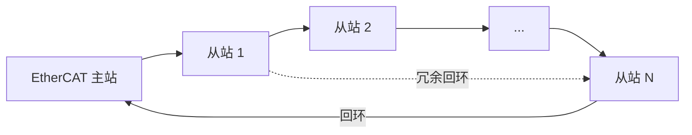

## 概述
EtherCAT是人形机器人领域的重要technology。以下内容整理自项目 Wiki，供深入查阅。

## 核心内容
EtherCAT 是一种基于标准以太网帧的工业现场总线，由 Beckhoff 提出并由 EtherCAT Technology Group 维护。其最大特点是“processing on the fly”：从站在帧经过时立即读写数据，无需完整接收帧再转发。

!!! note "术语解释：EtherCAT、主站、从站、飞读飞写、工作计数器、分布式时钟"
    - **EtherCAT（Ethernet for Control Automation Technology）**：基于以太网的高速工业现场总线。
    - **主站（master）**：发起和控制 EtherCAT 通信的节点。
    - **从站（slave）**：响应主站命令的节点，如伺服驱动器、I/O 模块。
    - **飞读飞写（processing on the fly）**：从站在数据帧经过时即时读写。
    - **工作计数器（Working Counter, WC）**：每个 EtherCAT 帧末尾的计数器，用于确认从站是否成功处理。
    - **分布式时钟（Distributed Clocks, DC）**：EtherCAT 的同步机制，让所有从站共享统一时间基准。

**EtherCAT 帧结构**。标准以太网帧的 EtherType 为 `0x88A4`，其后紧跟 EtherCAT 头和若干 datagram：

| 字段 | 长度 | 说明 |
|---|---|---|
| 以太网头 | 14 B | 目的 MAC、源 MAC、EtherType=0x88A4 |
| EtherCAT 头 | 2 B | 数据长度、保留位 |
| Datagram 1 | 变长 | 命令、索引、地址、数据、WC |
| ... | 变长 | 多个 datagram |
| FCS | 4 B | 以太网帧校验 |

!!! note "术语解释：EtherType、Datagram、FCS、MAC 地址"
    - **EtherType**：以太网帧中标识上层协议的字段。
    - **Datagram**：EtherCAT 帧中的独立数据单元。
    - **FCS（Frame Check Sequence）**：以太网帧尾部的校验序列，用于检测传输错误。
    - **MAC 地址（Media Access Control address）**：以太网设备的物理地址。

每个 datagram 的命令包括 `APRD`（自动增量物理读）、 `APWR`（自动增量物理写）、 `FPRD`（固定地址读）、 `FPWR`（固定地址写）、 `LRW`（逻辑读写）等。主站通过逻辑地址把过程数据映射到从站的内存映射区。

**分布式时钟（DC）**。DC 通过测量报文在每个从站的到达和离开时间，计算并补偿传播延迟和时钟偏移：

1. 主站发送特殊同步帧，各从站记录本地时间戳 \(t_{\text{in}}\) 和 \(t_{\text{out}}\)。
2. 通过往返测量计算每个从站到参考时钟的 **传播延迟** \(t_{\text{prop}}\)。
3. 从站根据 \(t_{\text{prop}}\) 和周期偏移调整本地时钟。
4. 每个周期，主站发送 ARMW（Auto Repeat Read/Write）报文，从站在同步事件（如 SYNC0）触发时锁存数据。

!!! note "术语解释：传播延迟、时钟偏移、漂移补偿、SYNC0、ARMW"
    - **传播延迟（propagation delay）**：信号从发送端到接收端所需时间。
    - **时钟偏移（clock offset）**：两个时钟之间的时间差。
    - **漂移补偿（drift compensation）**：对时钟频率差异进行修正。
    - **SYNC0**：EtherCAT 从站的硬件同步信号。
    - **ARMW**：EtherCAT 中用于时钟同步的自动重复读写命令。

DC 同步精度通常可达 100 ns 以内，足以支持多轴伺服在同一微秒级时刻采样和更新。

**PDO 与 SDO**。PDO（Process Data Object）是周期性过程数据，映射到 EtherCAT 帧的逻辑内存区，每个周期自动读写；SDO（Service Data Object）用于非周期性参数配置，通过邮箱（mailbox）协议访问对象字典。

!!! note "术语解释：PDO、SDO、对象字典、邮箱、过程数据"
    - **PDO（Process Data Object）**：周期性过程数据对象。
    - **SDO（Service Data Object）**：服务数据对象，用于参数配置。
    - **对象字典（object dictionary）**：CANopen/EtherCAT 设备中参数的索引表。
    - **邮箱（mailbox）**：用于非周期性通信的缓冲机制。
    - **过程数据（process data）**：控制循环中周期性交换的数据。

**拓扑**。EtherCAT 支持线型、树型、环型拓扑。环型拓扑提供电缆冗余：当某段电缆断开时，从站可自动回环，主站检测到断点并继续与剩余从站通信。

**周期时间计算**。EtherCAT 周期时间由帧传输时间和从站处理时间决定：

$$
T_{\text{cycle}} \geq T_{\text{frame}} + N \times T_{\text{slave}} + T_{\text{margin}}
$$

其中帧传输时间：

$$
T_{\text{frame}} = \frac{L_{\text{frame}} \times 8}{R}
$$

例如，100 个从站、每站 16 B 输入 + 16 B 输出，总数据量约 3200 B，加上帧头约 3240 B，在 100 Mb/s 下：

$$
T_{\text{frame}} = \frac{3240 \times 8}{100 \times 10^6} \approx 260\ \mu\text{s}
$$

若每从站处理时间 1 μs，则理论最小周期约 360 μs。实际工程中常取 500 μs–1 ms 以留余量。

## 参考
- [EtherCAT](https://en.wikipedia.org/wiki/EtherCAT)
- 项目 Wiki：chapter-06.md#EtherCAT 协议深度

