# Chapter 1 Introduction: Why Humanoid Robots?

## Abstract

Humanoid robots are robots that mimic the appearance and movement patterns of humans, typically featuring a torso, head, two arms, two legs, and multi-fingered hands. In 2025–2026, this field is undergoing a critical transition from "technology demonstration" to "industrial deployment": the global market size in 2025 is approximately $2.9–3.2 billion, with an installed base of about 16,000 units, of which China accounts for over 80%; Tesla Optimus Gen 3 began mass production at the Fremont factory in January 2026, Figure AI completed 11 months of real-world industrial validation at BMW's Spartanburg plant, handling over 90,000 parts, while Chinese manufacturers such as Unitree, Zhiyuan Robot, and UBTech have entered the ramp-up phase for ten-thousand-unit production capacity.

However, there remains a significant gap between "demonstration robots" capable of walking, running, or grasping in promotional videos and "product-grade robots" that can work stably for years in factories, warehouses, or homes. This gap manifests across four dimensions: reliability, cost, maintainability, and compliance. From laboratory prototypes to large-scale replication, humanoid robots must undergo seven progressive transition stages. Given that this field spans multiple disciplines—including mechanics, electronics, control, artificial intelligence, materials, manufacturing, supply chain, and policy—its interdisciplinary knowledge must be organized in the form of a knowledge graph to support systematic cognition, reasoning, and decision-making.

**Keywords**: Humanoid Robot; Industrialization; Knowledge Graph; Systems Engineering; From 0 to 1; Embodied Intelligence; VLA; Reliability; Learning Curve; Technology Adoption S-Curve

---

## 1.1 What is a Humanoid Robot?

### 1.1.1 Basic Definition

A humanoid robot is a robot designed to mimic the body structure and movement capabilities of a human. Unlike specialized robots such as industrial robotic arms, vacuum cleaners, or drones, the core characteristics of a humanoid robot are:

- **Bipedal Locomotion**: Walking on two legs like a human, rather than using wheels or tracks.
- **Upper Body Manipulation**: Typically having two arms and multi-fingered hands, capable of grasping, carrying, and operating tools.
- **Human-Environment Compatibility**: Physical dimensions close to those of a human, theoretically allowing direct use of stairs, doors, tools, workstations, and vehicles designed for humans.

In a single sentence: **A humanoid robot is a general-purpose machine that attempts to complete tasks in the human-built world, in the way humans do.**

!!! note "Term Explanation: Robot"
    The word robot originates from the Czech word *robota* (forced labor, drudgery). It was first introduced into the modern context by Karel Čapek's 1920 play *R.U.R. (Rossum's Universal Robots)*. From a systems science perspective, a robot is a programmable electromechanical system capable of sensing, deciding, and executing actions in the physical world to perform useful tasks. It is not equivalent to a "human-shaped machine" and also encompasses non-humanoid forms like robotic arms, mobile platforms, and drones.

### 1.1.2 Why Humanoid?

The most common question from beginners is: Since wheeled robots are more stable and robotic arms are cheaper, why build bipedal humanoids? The reasons can be summarized in three points, which are further explained from a deeper theoretical perspective.

| Reason | Specific Explanation |
|------|---------|
| **Environmental Compatibility** | Stairs, door thresholds, narrow passages, handrails, and workstations in human society are designed based on human body dimensions. Wheeled robots cannot climb stairs, and fixed robotic arms cannot move. The humanoid form theoretically allows direct access to these spaces. |
| **Task Versatility** | Actions in factories like screwing, carrying boxes, pressing buttons, and pushing doors are performed by humans using their hands. If a humanoid robot is sufficiently dexterous, it can theoretically perform a wide variety of tasks without needing a dedicated device designed for each task. |
| **Social Acceptance** | In scenarios involving close human interaction, such as service, healthcare, and homes, a humanoid appearance makes it easier for humans to understand and predict the robot's action intentions, thereby enhancing safety and interaction experience. |

These three advantages are currently only "theoretical advantages." In reality, bipedal walking still suffers from high energy consumption, difficult control, and a tendency to fall, while the cost and reliability of dexterous hands are far from human levels. This is why the industrialization of humanoid robots is so challenging.

!!! note "Term Explanation: Affordance"
    Affordance was proposed by American psychologist James J. Gibson in 1977, referring to the "possibilities for action" that an environmental object offers to an observer. For example, stair step heights are approximately 15–18 cm, and door handle heights are approximately 90–110 cm. These dimensions are designed for the human body, which is bipedal and upright with reachable arms. The human-like dimensions of a humanoid robot allow it to directly utilize these affordances "built for humans" without needing to modify the environment.

!!! note "Term Explanation: Uncanny Valley"
    The Uncanny Valley was proposed by Japanese roboticist Masahiro Mori in 1970. This hypothesis states that when a robot or humanoid's appearance and movement are close to, but not perfectly identical to, a human's, the observer's affinity suddenly drops, causing a strong sense of discomfort. Mori's original paper discussed the relationship between humanoid objects and emotional response using the concept of "*Bunshin*" (doppelganger/alter ego). For humanoid robot design, this implies that appearance and movement do not need to be overly anthropomorphic; the key lies in "predictability" and "behavioral consistency."

From an economic perspective, the humanoid form represents an **investment in generality**: it sacrifices optimal efficiency in a single task in exchange for adaptability across multiple tasks and environments. Let the efficiency of a specialized robot for a task be $\eta_s$, and that of a humanoid robot be $\eta_h$. If $\eta_h < \eta_s$ but the number of task types $N$ is sufficiently large, the total deployment cost of the humanoid might be lower:

$$
C_{total}^{(h)} = C_{robot} + \sum_{i=1}^{N} c_{adapt,i} \quad \text{vs.} \quad C_{total}^{(s)} = \sum_{i=1}^{N} (C_{robot,i} + c_{integration,i})
$$

When $N$ increases and $c_{adapt,i}$ is sufficiently small, the humanoid solution may hold a Total Cost of Ownership (TCO) advantage.

!!! note "Term Explanation: Total Cost of Ownership (TCO)"
    Total Cost of Ownership is a core concept in economics and supply chain management, referring to the total cost of an asset throughout its entire lifecycle from procurement to disposal. This includes initial acquisition cost, integration cost, operational energy consumption, maintenance and repair, downtime losses, training, software upgrades, and final disposal cost. Business cases for the industrialization of humanoid robots typically use TCO for comparison rather than just hardware selling price.

### 1.1.3 Main Forms and Classifications

Humanoid robots do not come in only one form. Based on the lower body design, they can be classified into:

- **Full-Size Bipedal Humanoids**: Height 1.5–1.8 meters, walking on two legs, e.g., Tesla Optimus, Unitree H1, Figure 02/03, Boston Dynamics Atlas.
- **Wheeled/Hybrid Humanoids**: Humanoid upper body with a wheeled or leg-wheel hybrid lower body, e.g., Agility Digit, Hexagon AEON (used at BMW Leipzig plant).
- **Small Desktop Humanoids**: Primarily for research, education, and entertainment, e.g., NAO, Pepper, Unitree G1.
- **Torso or Telepresence Humanoids**: Only the upper body, used for remote presence and interaction.

Based on application goals, they can also be classified into:

- **Research Platforms**: For algorithm development by universities and labs, e.g., Atlas, H1.
- **Industrial Application Types**: For factories and logistics, e.g., Figure 03, Optimus Gen 3.
- **Service/Home Types**: For commercial service, medical care, home assistance; currently not yet mature.

### 1.1.4 Overview of Key Subsystems

A humanoid robot consists of multiple subsystems, including the mechanical body, actuators, sensors, computing platform, power supply, software, and AI models. The diagram below shows a simplified structure:

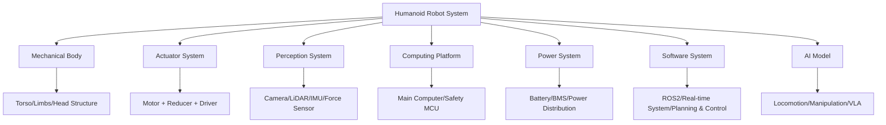

!!! note "Term Explanation: Actuator"
    Actuators are the "muscles" of a robot, responsible for converting electrical or other forms of energy into mechanical motion and force. A humanoid robot typically has 20–50 actuators. From a control theory perspective, an actuator is the physical realization of the system input $u$, and its bandwidth, torque density, backlash, and response delay directly affect closed-loop control performance.

!!! note "Term Explanation: Reducer/Gearbox"
    A reducer (or gearbox) is a device that reduces motor speed and amplifies output torque. Common types include Harmonic Drives, RV (Rotary Vector) reducers, and Planetary Gearboxes. The reduction ratio $N$ results in an output torque $T_{out} = N \cdot T_{motor} \cdot \eta$ (where $\eta$ is transmission efficiency), but it also introduces friction, inertia, and backlash.

!!! note "Term Explanation: IMU (Inertial Measurement Unit)"
    An Inertial Measurement Unit contains accelerometers and gyroscopes, and sometimes magnetometers, used to sense attitude, angular velocity, and linear acceleration. The IMU is a core sensor for robot state estimation, but its measurements suffer from bias drift and noise, requiring fusion with kinematic, visual, or force information.

!!! note "Term Explanation: VLA (Vision-Language-Action Model)"
    A Vision-Language-Action model is an AI architecture that unifies the modeling of images, natural language instructions, and robot actions. It typically uses a vision encoder and a large language model as its backbone, outputting low-level action tokens or policy parameters, enabling a humanoid robot to perform operations based on natural language commands like "put the red box on the left table."

!!! note "Term Explanation: BMS (Battery Management System)"
    A Battery Management System is an electronic system that protects battery safety and optimizes runtime. It is responsible for battery state estimation (SOC/SOH), cell balancing, overcharge/over-discharge protection, thermal management, and fault diagnosis. The functional safety level of the BMS directly impacts the safety certification of the entire robot.

### 1.1.5 Formal Definition of a Robot

From the perspective of control theory and systems science, a robot can be formalized as a **Dynamical System**:

$$
\dot{x}(t) = f\big(x(t), u(t)\big), \quad y(t) = h\big(x(t), u(t)\big)
$$

where:

- $x(t) \in \mathbb{R}^n$ is the system state vector, e.g., joint angles, angular velocities, center of mass position, orientation quaternion;
- $u(t) \in \mathbb{R}^m$ is the control input, e.g., motor current, torque, or voltage;
- $y(t) \in \mathbb{R}^p$ is the system output, i.e., sensor measurements;
- $f$ is the state transition function, describing the system dynamics;
- $h$ is the observation function, describing the sensor model.

!!! note "Term Explanation: State Space"
    State space is the mathematical space in control theory that describes all possible states of a dynamic system. The future evolution of the system depends only on the current state and future inputs, independent of the past—a property known as the "Markov property." The state space dimension of a humanoid robot is typically above 30–100 dimensions, leading to the so-called "curse of dimensionality."

For humanoid robots, $f$ is usually given by the rigid body dynamics equations. Taking the Lagrange equation as an example:

$$
M(q)\ddot{q} + C(q, \dot{q})\dot{q} + G(q) = S^T \tau + J_c^T F_c
$$

where:

- $q \in \mathbb{R}^n$ are generalized coordinates;
- $M(q)$ is the mass matrix;
- $C(q, \dot{q})$ is the Coriolis and centrifugal force term;
- $G(q)$ is the gravity term;
- $\tau$ is the joint torque;
- $S$ is the selection matrix;
- $J_c$ is the contact point Jacobian matrix;
- $F_c$ is the ground contact force.

!!! note "Term Explanation: Jacobian Matrix"
    The Jacobian matrix $J$ describes the linear mapping from the robot's joint space velocity to the operational space (e.g., end-effector or center of mass) velocity: $v = J(q)\dot{q}$. In force control, its transpose $J^T$ maps operational space forces to joint torques: $\tau = J^T F$. The Jacobian matrix is a core tool in robot kinematics and static analysis.

From the perspective of an **Agent**, a robot is an autonomous entity interacting with the environment, following the **Sense-Decide-Act Loop**:


Within the framework of Embodied AI, intelligence does not reside solely in algorithms but is **embedded in the physical form, sensor configuration, and dynamic interaction**. This idea is closely related to Morphological Computation: the physical properties of the robot's body (such as compliance, mass distribution, elastic feet) can themselves perform part of the computational function, thereby reducing the burden on the controller.

!!! note "Term Explanation: Embodied AI"
    Embodied AI emphasizes that intelligent behavior must arise from the interaction of an agent with a physical body in a real environment, rather than solely through symbolic reasoning or offline data learning. Its philosophical roots can be traced back to Merleau-Ponty's concept of the "body subject" and Piaget's theory of cognitive development. For humanoid robots, embodied AI means that motion control, perception, reasoning, and social interaction must be unified within the body-environment coupling framework.

!!! note "Term Explanation: Morphological Computation"
    Morphological computation refers to using the agent's own physical structure and material properties to perform part of the "computational" tasks, thereby reducing the complexity of the explicit controller. For example, the feathers and bone structure of birds, the spinal elasticity of cheetahs, and the compliant joints of humanoid robots can all, to some extent, "pre-solve" dynamic stability issues, making high-level control simpler.

### 1.1.6 Taxonomy of Humanoid Robots

To systematically study humanoid robots, clear classification dimensions need to be established. Below is a formal classification standard from six dimensions:

**By Locomotion Mode**

| Type | Definition | Representative Products |
|------|------------|------------------------|
| Bipedal Walking | Moves using only two legs | Tesla Optimus, Unitree H1, Figure 02 |
| Wheeled Mobility | Moves using wheels, humanoid upper body | Agility Digit (early), mobile service robots |
| Leg-Wheel Hybrid | Has both legs and wheels, switchable modes | Some research platforms, wheel-legged composite robots |
| Fixed Base | Only upper body, no mobility | Telepresence robots, some service robots |

**By Size and Scale**

| Type | Height Range | Typical Applications |
|------|--------------|---------------------|
| Full-Size Adult | 1.5–1.8 m | Industry, service, home |
| Adolescent/Child | 1.0–1.4 m | Education, research, companionship |
| Desktop | 0.3–0.8 m | Scientific research, education, entertainment |

**By Actuation Method**

| Type | Principle | Pros and Cons |
|------|-----------|---------------|
| Electric Motor | Motor + reducer | Mature, controllable, low noise; limited torque density |
| Hydraulic | Hydraulic pump + cylinder/actuator | High power density; leakage, complex maintenance |
| Pneumatic | Gas pressure drive | Compliant, safe; low efficiency, difficult control |
| Tendon/Cable-Driven | Motor drives distal joints via cables | Reduces distal inertia; friction, wear |
| Artificial Muscle | Pneumatic artificial muscle, EAP, etc. | Highly biomimetic; poor lifespan and repeatability |

**By Autonomy Level**

| Level | Description | Humanoid Robot Application Status |
|-------|-------------|-----------------------------------|
| L0 Teleoperation | Fully controlled remotely by human | Current large-scale industrial deployment |
| L1 Assistance | Human leads, robot provides assistance | Some assembly tasks |
| L2 Semi-Autonomous | Robot performs specific subtasks, human supervises | Current mainstream goal |
| L3 Conditional Autonomy | Autonomous operation in limited environments and tasks | Research and small-scale trials |
| L4/L5 High/Full Autonomy | Long-term autonomy in open environments | Not yet achieved |

**By Application Domain**

| Domain | Typical Tasks | Maturity |
|--------|---------------|----------|
| Industrial Manufacturing | Handling, sorting, screwing, quality inspection | Early trials |
| Warehouse Logistics | Picking, moving, palletizing | Pilot stage |
| Commercial Service | Guidance, reception, retail | Small-scale deployment |
| Medical Rehabilitation | Companionship, walking assistance, rehabilitation training | Research/pilot |
| Home Service | Cleaning, care, companionship | Very early stage |
| Scientific Research & Education | Algorithm validation, teaching demonstrations | Relatively mature |

**By Commercialization Stage**

| Stage | Characteristics | Representative |
|-------|-----------------|----------------|
| Lab Prototype | Validates single technology, not repeatable | University research projects |
| Engineering Prototype | System integration, a few operational units | Early startup products |
| Small-Batch Validation | Tens to hundreds of units, real-world testing | Unitree, Zhiyuan, Ubtech |
| Mass-Produced Product | Large-scale production, cost-controlled | Tesla Optimus Gen 3 (target) |
| Large-Scale Operation | Multi-scenario fleet management | Not yet mature |

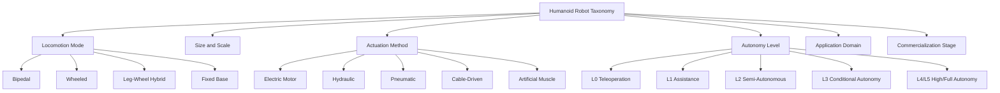

---

## 1.2 The Development History of Humanoid Robots

The history of humanoid robots is not only a history of technological evolution but also a microcosm of the intersection of mathematics, control theory, computer science, materials science, and economics. The following outlines its development journey, starting from the roots of scientific thought.

### 1.2.1 The Age of Mechanical Automata (18th–19th Centuries)

Before the advent of electricity and electronic control, humanoid automata were masterpieces of pure mechanical engineering.

- **Jacques de Vaucanson** created the "Flute Player," "Drummer," and the famous "Digesting Duck" in 1738, demonstrating complex mechanisms of cams, gears, and linkages.
- **Jaquet-Droz** created the "Writer," "Draughtsman," and "Musician" in the 1770s, using cam-encoded programs where cams could be swapped to change behavior.

These automata lacked perception and decision-making abilities but proved that **complex motions could be precisely encoded through mechanical mechanisms**. Their control method was inherently open-loop: the cam profile served as the "program," and time served as the "input."

!!! note "Term Explanation: Open-Loop Control"
    Open-loop control means the controller's output does not depend on feedback of the system's actual state. For example, a mechanical automaton moves according to a preset cam, disregarding external disturbances. Its mathematical form is $u(t) = u_{ref}(t)$. Open-loop control is simple and low-cost but cannot handle uncertainty; modern robots commonly use closed-loop control.

### 1.2.2 The Birth of Cybernetics and Computer Science (1930s–1950s)

The intellectual foundations of modern robotics were laid in the mid-20th century:

- **Norbert Wiener** published "Cybernetics: Or Control and Communication in the Animal and the Machine" in 1948, proposing a unified framework for feedback control, information theory, and systems science.
- **Claude Shannon** published "A Mathematical Theory of Communication" in 1948, laying the foundation of information theory, where the concept of entropy $H(X) = -\sum p(x)\log p(x)$ became a metric for perception, learning, and decision-making.
- **Alan Turing** proposed the Turing machine model in 1936 and the "Turing Test" in 1950, initiating the intellectual tradition of artificial intelligence.

!!! note "Term Explanation: Feedback Control"
    Feedback control adjusts the input based on the error between the system output and the desired reference value, driving the system state towards the target. Its core idea is $u(t) = K\big(r(t) - y(t)\big)$, where $K$ is the controller gain. Wiener generalized the feedback mechanism from engineering systems to biological, social, and cognitive systems, laying the foundation of cybernetics.

Feedback control enables robots to maintain stability in uncertain environments, which is the theoretical starting point for dynamic balance in bipedal robots.

### 1.2.3 Early Humanoid Robots (1960s–1980s)

During this period, electronic computers and servo motors began to be applied to robots.

- **WABOT-1 (Waseda University, 1973)**: The world's first complete humanoid robot, approximately 2 meters tall, with legs, arms, and a vision system, achieving static walking. Its control computer was equivalent to a minicomputer of the time, with extremely limited computational power.
- **WL-10 Series (Waseda University, 1980s)**: Achieved more natural dynamic gaits, laying the foundation for subsequent bipedal control research.
- **HD-2 (Kato Laboratory)**: Further improved motion coordination.

The core characteristic of this period was **Static Walking**: the projection of the robot's Center of Mass (CoM) always remained within the support polygon, resulting in slow but stable motion.

!!! note "Term Explanation: Center of Mass (CoM)"
    The center of mass is the average position of an object's mass distribution. For a multi-rigid-body system, the CoM position is $r_{CoM} = \frac{\sum_i m_i r_i}{\sum_i m_i}$. In robotics, whether the CoM projection falls within the support polygon is a common criterion for judging static stability.

!!! note "Term Explanation: Zero Moment Point (ZMP)"
    The Zero Moment Point was proposed by the Yugoslav (now Serbian) roboticist Miomir Vukobratović in 1969. The ZMP is a point on the ground where the horizontal moment generated by gravitational and inertial forces is zero. For planar contact, if the ZMP lies within the support polygon, the robot will not tip over around the support boundary. The ZMP criterion has been the mainstream stability criterion for bipedal robot control over the past few decades.

### 1.2.4 The Era of Dynamic Balance (1990s–2010s)

During this period, advances in control theory and computational power enabled humanoid robots to achieve dynamic walking, running, and even jumping.

- **Honda ASIMO (2000)**: Could run at 6 km/h, climb stairs, avoid obstacles, and perform voice interaction, becoming the technological symbol of humanoid robots in the 2000s. Honda stopped ASIMO development in 2018 due to high costs and unclear application scenarios.
- **Sony QRIO (2003)**: A small bipedal entertainment robot demonstrating strong motion control capabilities, but discontinued soon after due to commercial reasons.
- **Boston Dynamics PETMAN/Atlas (2009–2013)**: PETMAN was used for testing protective suits, while Atlas represented the highest level of hydraulically actuated bipedal dynamic motion, capable of backflips, parkour, and obstacle negotiation.

Key technologies of this period included:

1. **ZMP Trajectory Planning and Preview Control (Kajita et al., 2003)**: Formulating bipedal walking as an optimal control problem under the Linear Inverted Pendulum Model (LIPM).
2. **Model Predictive Control (MPC)**: Rolling optimization of control inputs over a finite horizon, handling constraints and multi-contact problems.
3. **Nonlinear Optimization and Whole-Body Control (WBC)**: Coordinating leg, arm, and torso motions to achieve complex tasks.

!!! note "Term Explanation: Linear Inverted Pendulum Model (LIPM)"
    The Linear Inverted Pendulum Model, proposed by Shuuji Kajita and others, simplifies a bipedal robot to a point mass connected to the ground by a massless rod. Assuming constant CoM height and neglecting angular momentum, its horizontal dynamics become a linear equation: $\ddot{x} = \frac{g}{z_c} x + \frac{1}{m z_c} u_x$, where $z_c$ is the CoM height and $g$ is gravitational acceleration. The LIPM greatly simplifies gait planning and is the theoretical basis for preview control.

!!! note "Term Explanation: Model Predictive Control (MPC)"
    Model Predictive Control is a rolling optimization method that solves for an optimal control sequence over a finite prediction horizon and executes only the first control step. Its standard form is: $\min_{u_{0:N-1}} \sum_{k=0}^{N-1} \ell(x_k, u_k) + V_f(x_N)$, subject to $x_{k+1} = f(x_k, u_k)$ and constraints $x_k \in \mathcal{X}, u_k \in \mathcal{U}$. MPC can explicitly handle constraints and is a mainstream method for bipedal dynamic balance and legged robot control.

!!! note "Term Explanation: Whole-Body Control (WBC)"
    Whole-Body Control refers to a control system that simultaneously coordinates multiple robot tasks (e.g., maintaining balance, tracking foot trajectories, manipulating objects, avoiding obstacles). It typically employs a task hierarchy or weighted optimization framework, executing high-priority tasks (e.g., balance) in the null space of lower-priority tasks to ensure critical constraints are not violated.

### 1.2.5 The Era of AI Integration and Mass Production (2020s–Present)

In the 2020s, humanoid robots have regained focus, driven by artificial intelligence, supply chain maturity, and capital investment:

- **AI Large Models and VLA**: Models like RT-2, OpenVLA, GR00T N1, Figure Helix, and π0 unify vision, language, and action, enabling robots to understand natural language instructions and generalize to new tasks.
- **Reinforcement Learning and Sim-to-Real**: Training motion and manipulation policies in simulation, deploying them to real robots via Domain Randomization and transfer learning.
- **Supply Chain Maturity**: Costs of harmonic drives, frameless torque motors, force sensors, and high-compute platforms have rapidly decreased.
- **Mass Production Attempts**: Tesla Optimus, Figure BotQ, Unitree, and Agibot are planning production capacities in the tens of thousands or even millions of units.

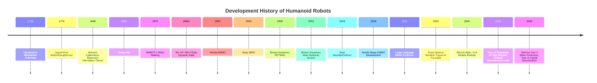

### 1.2.6 Honda ASIMO: Technological Peak and Commercial Dilemma

Honda ASIMO (Advanced Step in Innovative Mobility) was the most representative humanoid robot of the 2000s. It could run at 6 km/h, climb stairs, avoid obstacles, shake hands with people, and even perform simple voice interaction.

However, Honda discontinued the development of ASIMO in 2018. The reasons behind this are worth pondering:

- **Excessive cost**: The cost of a single unit was estimated to exceed $1 million, making it impossible to commercialize.
- **Unclear application scenarios**: Apart from demonstrations and reception, it was difficult to find a sustainable business model.
- **Technological closure**: The system was highly customized and difficult to scale.

The story of ASIMO illustrates that **technological advancement does not equal commercial success**. For humanoid robots to achieve industrialization, breakthroughs must be made in cost, application scenarios, and maintainability.

### 1.2.7 Boston Dynamics Atlas: The Limits of Dynamic Capability

Boston Dynamics' Atlas represents the highest level of bipedal dynamic motion, capable of backflips, parkour, and navigating obstacles. In 2024, Boston Dynamics retired the hydraulic version of Atlas and launched an all-electric version, shifting toward commercial application exploration, particularly within the factory network of the Hyundai Motor Group.

Atlas's value lies in advancing control theory and pushing the limits of robotics, but its path to commercialization is still being explored.

### 1.2.8 The New Wave of 2025–2026: From Demonstration to Real-World Deployment

Unlike ASIMO and the early Atlas, the new wave of 2025–2026 emphasizes **long-term deployment in real-world scenarios and mass production feasibility**:

- **Tesla Optimus**: On January 21, 2026, Gen 3 began mass production at the Fremont factory; the Model S/X production line was converted into an Optimus production line, with a target annual capacity of 1 million units; a dedicated factory is under construction at the Texas Gigafactory, with a target annual capacity of 10 million units.
- **Figure AI**: Completed a $1 billion Series C funding round in September 2025, with a valuation of $39 billion; Figure 02 completed an 11-month deployment at BMW's Spartanburg factory, moving over 90,000 parts and participating in the production of more than 30,000 BMW X3 vehicles.
- **Chinese manufacturers**: Unitree Technology achieved revenue of 1.708 billion yuan in 2025 and a non-GAAP net profit of approximately 600 million yuan; its IPO on the STAR Market in 2026 has been accepted. According to Omdia, Zhiyuan Robotics shipped 5,168 units in 2025, ranking first globally. UBTech received nearly 1.4 billion yuan in humanoid robot orders in 2025.

The core driving forces behind this wave are:

1. AI large models and VLA have given robots stronger perception, understanding, and generalization capabilities.
2. Precision manufacturing and mature supply chains have led to a rapid decline in the cost of core components.
3. Rising labor costs and the demand for automation in manufacturing provide a clear market.
4. The capital market is willing to provide large-scale financial support to leading players.

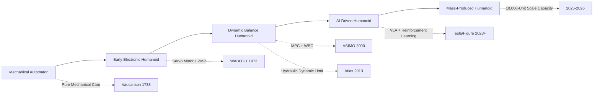

---

## 1.3 Why Is Now the Critical Window for Humanoid Robots?

### 1.3.1 Market Size and Growth Forecasts

According to the latest 2025–2026 forecasts from multiple research institutions, the global humanoid robot market is expanding rapidly:

| Research Institution | 2025 Market Size | 2030 Forecast | 2032/2034/2035 Forecast | Key Judgment |
|---------|----------------|------------|----------------------|---------|
| MarketsandMarkets | $2.92 billion | $15.26 billion | — | CAGR 39.2% (2025–2030) |
| Research Nester | $3.14 billion | — | — | CAGR 38.5% (2026–2035) |
| BCC Research | $1.90 billion | $11.00 billion | — | CAGR 42.8% |
| MarketIntelo | $3.20 billion | — | $43.10 billion (2034) | CAGR 35.0% |
| Maximizemarketresearch | $2.92 billion | — | $29.57 billion (2032) | CAGR 39.2% |
| Goldman Sachs | — | — | $38 billion (2035) | Long-term optimistic scenario |
| Yahoo Finance / Counterpoint | ~$0.9 billion revenue (2025) | $7 billion (2030) | — | Focus on commercial revenue |

Data sources: MarketsandMarkets, Research Nester, BCC Research, MarketIntelo, Maximize Market Research, Goldman Sachs, Yahoo Finance (2025–2026 reports)

Although forecasts vary significantly across institutions, the common trend is: **the 2025 market size is approximately $3 billion, expected to reach $4–5 billion in 2026, and is likely to exceed $10–15 billion by 2030.**

#### 1.3.1.1 Forecasting Methodology: Top-Down vs. Bottom-Up

Market forecasting is essentially a quantitative inference of future supply and demand, commonly using two methods for cross-validation.

**Top-Down**: Starting from the macro TAM, multiplied by the penetration rate:

$$
M_{t} = TAM_t \cdot p_t \cdot ASP_t
$$

Where:

- $M_t$: Forecast market size at time $t$ (USD);
- $TAM_t$: Total Addressable Market, the total market value of all potential buyers for the product;
- $p_t$: Technology penetration rate, i.e., the proportion of the target market that actually adopts humanoid robots;
- $ASP_t$: Average Selling Price.

**Bottom-Up**: Starting from unit shipments and average selling price:

$$
M_t = N_t \cdot ASP_t
$$

Where $N_t$ is the shipment volume. When the results from the two methods differ significantly, it usually indicates disagreement in assumptions about penetration rates or average selling prices. In 2025, institutional forecasts for market size range between $1.9 billion and $3.2 billion, with differences mainly stemming from: whether low-cost research prototypes are included, whether service and software revenue are included, and whether factory gate prices or end-user prices are used.

!!! note "Term Explanation: CAGR (Compound Annual Growth Rate)"
    The Compound Annual Growth Rate describes the average annual growth rate of an indicator over a period. If the starting value is $V_0$, the ending value is $V_T$, and the time span is $T$ years, then
    $$
    CAGR = \left(\frac{V_T}{V_0}\right)^{1/T} - 1
    $$
    For example, growing from $3 billion in 2025 to $15 billion in 2030, $CAGR = (15/3)^{1/5}-1 \approx 37.9\%$. CAGR smooths out annual fluctuations but does not reflect path risk.

!!! note "Term Explanation: ASP (Average Selling Price)"
    The Average Selling Price is total sales revenue divided by total shipment volume. The ASP in the humanoid robot market is declining rapidly: in 2023, during the research/prototype phase, ASP might have exceeded $100,000; by 2025, Chinese manufacturers have brought some models down to $10,000–$30,000. Different assumptions about the ASP curve in market forecasts significantly impact revenue predictions.

#### 1.3.1.2 Scenario Analysis and Confidence Intervals

A single forecast number often masks uncertainty. A better approach is to set scenario assumptions and construct optimistic, baseline, and pessimistic paths.

Let the 2030 shipment volume $N_{30}$ and ASP $P_{30}$ be random variables, then the market size

$$
M_{30} = N_{30} \cdot P_{30}
$$

Using a lognormal assumption, the 90% confidence interval can be estimated:

$$
\ln M_{30} \sim \mathcal{N}\left(\ln(N_{base}P_{base}), \sigma_N^2 + \sigma_P^2 + 2\rho\sigma_N\sigma_P\right)
$$

Where:

- $N_{base}, P_{base}$: Baseline shipment volume and baseline ASP;
- $\sigma_N, \sigma_P$: Logarithmic standard deviations of shipment volume and ASP, reflecting forecast uncertainty;
- $\rho$: Correlation coefficient between shipment volume and ASP, usually negative (scale expansion accompanied by price reduction).

Taking the baseline scenario $N_{base}=500$ thousand units, $P_{base}=30{,}000$ USD, $\sigma_N=0.5$, $\sigma_P=0.3$, $\rho=-0.3$ as an example:

```python
import numpy as np

N_base, P_base = 500e3, 30_000
sigma_N, sigma_P, rho = 0.5, 0.3, -0.3

mu = np.log(N_base * P_base)
sigma = np.sqrt(sigma_N**2 + sigma_P**2 + 2*rho*sigma_N*sigma_P)

samples = np.random.lognormal(mu, sigma, 100_000)
print(f"2030 market size median: ${np.median(samples)/1e9:.2f}B")
print(f"90% confidence interval: ${np.percentile(samples,5)/1e9:.1f}B - ${np.percentile(samples,95)/1e9:.1f}B")
```

The approximate result is: a median of $15 billion, with a 90% confidence interval of $6–37 billion. This range explains why different institutions' 2030 forecasts vary from $10 billion to $38 billion.

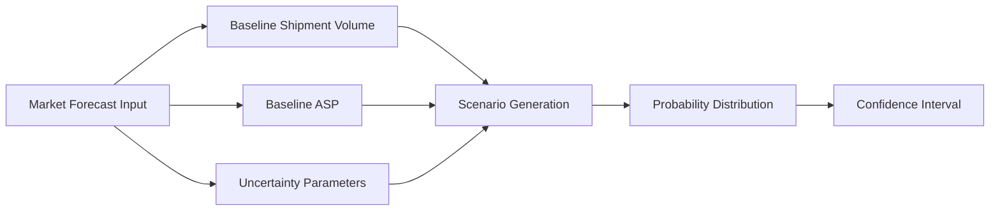

### 1.3.2 Shipment Volume and Regional Landscape

Compared to monetary forecasts, shipment volume data better reflects actual progress:

| Indicator | Data | Source/Time |
|------|------|----------|
| Global humanoid robot installations in 2025 | Approximately 16,000 units | Counterpoint Research (January 2026) |
| China's share of global installations | Over 80% | Counterpoint Research (January 2026) |
| Global shipment forecast for 2027 | 115,000 units | ABI Research |
| Cumulative installation forecast for 2027 | Over 100,000 units | Counterpoint Research |
| Year-on-year growth of China's humanoid robot exports in Q1 2026 | 210% | China Customs Data (January–April 2026) |
| China's humanoid robot sales forecast for 2026 | 28,000 units | Morgan Stanley |

**2025 Global Market Share (by Installations):**

| Company | Headquarters | 2025 Market Share | Representative Product | Main Application Scenarios |
|------|------|----------------|---------|------------|
| AgiBot | Shanghai | ~31% | X2, G2 | Manufacturing, Logistics, Service |
| Unitree | Hangzhou | ~27% | G1, H1 | Research, Industry, Consumer |
| UBTECH | Shenzhen | ~5% | Walker S/S1/S2 | Automotive Manufacturing |
| Leju Robot | Shenzhen | ~5% | Kuavo | Education, Healthcare, Service |
| Tesla | USA | ~5% | Optimus Gen 2/3 | Internal Factory, Logistics |
| Others | Global | ~27% | Various Products | Diverse |

Data sources: Robozaps, Counterpoint Research, Omdia, 36Kr, Huxiu (2025–2026)

As can be seen from the table above, Chinese manufacturers occupy three of the top four positions in global installations for 2025, with a combined market share exceeding 70%. This reflects China's advantages in supply chain, cost control, and manufacturing capabilities.

### 1.3.3 Investment Enthusiasm and Capital Securitization

The period 2025–2026 is a boom period for investment in humanoid robots and the first year of capital securitization:

**Major Global Financing Events (2025–2026):**

| Company | Time | Round | Amount | Valuation/Highlights |
|------|------|------|------|----------|
| Figure AI | September 2025 | Series C | $1 billion+ | Valuation $39 billion |
| Apptronik | 2025 | Series A | $403 million | Investment from Mercedes-Benz, Google |
| EngineAI | 2025–2026 | Series A/B | $140–200 million | Shenzhen, China |
| RobotEra | 2025–2026 | Series A/Growth | $140 million+ | Investment from Geely, BAIC |
| Galbot | December 2025 | — | $300 million | — |
| Leju Robotics | October 2025 | — | $200 million | — |
| Spirit AI | April 2026 | Series A | $145 million | Embodied intelligence platform |

**China Market Financing and Listing Dynamics (2025–2026):**

| Company | Time | Event | Scale/Valuation |
|------|------|------|----------|
| Galbot | 2025 | Single round financing | Over $300 million, valuation RMB 21.1 billion |
| Unitree Robotics | March 2026 | STAR Market IPO acceptance | Raising approx. RMB 4.2 billion, valuation approx. RMB 42 billion |
| UBTech | 2025 | Three follow-on offerings in Hong Kong | Total approx. HKD 6.5 billion, cumulative financing HKD 8.691 billion |
| Zhiyuan Robot | 2025–2026 | Share reform + backdoor listing of Shangwei New Materials | Valuation over RMB 15 billion |
| Leju Robotics | 2025 | Pre-IPO round | Nearly RMB 1.5 billion |
| Fourier Intelligence | 2025–2026 | Listing guidance filing | Valuation at tens of billions level |

Data sources: Crunchbase, 36Kr, Phoenix New Media, Sina Finance, AI China Net (2025–2026)

**Key Observations**:

- Global robotics startup financing in 2025 exceeded $8.5 billion, the highest since 2021; dedicated humanoid robot financing was approximately $4.3 billion, an increase of about 6 times compared to 2018.
- In the first three quarters of 2025, China's robotics sector financing reached RMB 50 billion (approx. $7 billion), a year-on-year increase of 250%.
- In the first quarter of 2026, there were over 100 financing events across China's humanoid robot full industry chain, with the largest single deal reaching RMB 2.5 billion, and 15 large-scale financings of RMB 1 billion or more.
- Over 20 embodied intelligence companies had clearly stated listing plans by early 2026.

### 1.3.4 Cost Reduction Curve

Cost reduction is a key signal for the industrialization of humanoid robots. According to data from Goldman Sachs and Bank of America:

| Indicator | Data | Source |
|------|------|------|
| Manufacturing cost reduction 2023–2024 | 40% | Goldman Sachs (via Deloitte) |
| Current cost per unit for Western factory pilots | $90,000–100,000 | Bank of America (2026) |
| Current Chinese BOM cost | Approx. $35,000 | Bank of America (2026) |
| Cost per unit forecast for 2030 | Below $17,000 | Bank of America |
| Unitree G1 price | Approx. $16,000 | Public price |
| Unitree R1 price (July 2025) | $5,900 | Public price |
| Tesla Optimus target price | $20,000–30,000 | Musk, January 2026 |

Data sources: Goldman Sachs, Bank of America, Optimusk.blog, public pricing information (2025–2026)

Unitree shocked the market in July 2025 by launching the R1 humanoid robot at a price of $5,900—a price point previously thought to be years away. This demonstrates the immense potential of the Chinese supply chain in cost compression.

### 1.3.5 Structural Demand in the Labor Market

One of the fundamental drivers for the industrialization of humanoid robots is the change in labor structure:

- **Aging Population**: The proportion of China's population aged 60 and over has exceeded 20%, and the gap in frontline manufacturing workers continues to widen; Japan and Europe are also facing severe aging.
- **Hazardous Job Replacement**: Numerous dangerous tasks exist in fields like chemicals, mining, construction, and rescue, where humanoid robots can replace humans in high-risk environments.
- **Flexible Manufacturing Needs**: Traditional industrial robots excel at repetitive tasks, but humanoid robots are theoretically more flexible for production models involving multiple varieties, small batches, and frequent line changes.

#### 1.3.5.1 Quantifying Population Aging and Labor Gaps

Changes in population structure can be measured using the **Old-Age Dependency Ratio (OADR)**:

$$
OADR_t = \frac{P_{65+,t}}{P_{15-64,t}} \times 100\%
$$

Where $P_{65+,t}$ is the population aged 65 and over, and $P_{15-64,t}$ is the working-age population aged 15–64. China's OADR in 2023 was approximately 21.1%, and it is projected to exceed 30% by 2035; Japan's OADR already exceeded 50% in 2023. This means the number of elderly people that every 100 working-age individuals need to support will increase from 21 to over 30, continuously intensifying labor supply pressure.

Consequently, manufacturing wages face upward pressure. Let the annual labor cost for a certain position be $C_h$, and the annual equivalent cost for a robot replacing that position be $C_r$. The replacement condition is:

$$
C_r < C_h
$$

The annual equivalent cost for a robot can be decomposed as:

$$
C_r = \frac{C_{robot} - S_{residual}}{T_{life}} + C_{maint} + C_{energy}
$$

Where:

- $C_{robot}$: Robot acquisition cost (USD);
- $S_{residual}$: Residual value at the end of design life (USD);
- $T_{life}$: Design life (years);
- $C_{maint}$: Annual maintenance cost (USD/year);
- $C_{energy}$: Annual energy cost (USD/year).

!!! note "Term Explanation: Old-Age Dependency Ratio (OADR)"
    The Old-Age Dependency Ratio is a core indicator for measuring the pressure of an aging population on the labor supply. It is defined as the ratio of the population aged 65 and over to the working-age population aged 15–64. A higher OADR means that each working-age individual bears a greater burden of supporting the elderly, leading to increased social pension and medical expenditure pressure, and a relative contraction of the labor supply.

#### 1.3.5.2 Human-Robot Replacement Break-Even Analysis

Converting the replacement condition to an hourly wage is more intuitive. Assume a robot has a design life of 8 years, operates 6,000 hours per year (approx. 16 hours/day × 375 days), an acquisition cost of $50,000, annual maintenance cost of 10% of the acquisition price ($5,000/year), annual energy cost of $1,000, and negligible residual value. Then:

$$
C_r = \frac{50{,}000}{8} + 5{,}000 + 1{,}000 = 12{,}250 \text{ USD/year}
$$

Robot hourly cost:

$$
c_r = \frac{12{,}250}{6{,}000} \approx 2.04 \text{ USD/hour}
$$

If the total annual cost (including wages, social insurance, benefits) for a human worker in this position is $60,000, working 2,000 hours per year, the hourly cost is $30/hour. In this case, the labor cost advantage of robot replacement is approximately $30 - 2.04 = $27.96/hour. Even if the robot's efficiency is only 50% of a human's, the equivalent hourly cost is only $4.08/hour, still offering a significant advantage.

```python
# Human-Robot Replacement Break-Even Point Calculation
C_robot = 50_000      # Acquisition cost (USD)
T_life = 8            # Design life (years)
hours_per_year = 6000 # Annual operating hours
C_maint = 0.10 * C_robot  # Annual maintenance cost
C_energy = 1_000      # Annual energy cost

C_r = C_robot / T_life + C_maint + C_energy
c_r = C_r / hours_per_year
print(f"Robot annual equivalent cost: ${C_r:,.0f}/year")
print(f"Robot hourly cost: ${c_r:.2f}/hour")

# Break-even human hourly wage
C_h_human = 60_000    # Human annual total cost
h_human = 2000        # Human annual working hours
c_h = C_h_human / h_human
breakeven_efficiency = c_r / c_h
print(f"Human hourly cost: ${c_h:.2f}/hour")
print(f"Break-even efficiency threshold: {breakeven_efficiency*100:.1f}%")
```

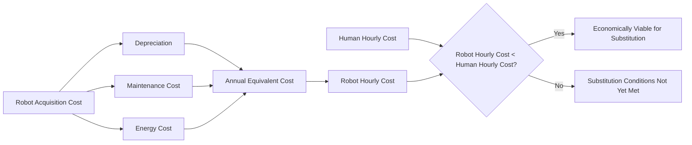

!!! note "Term Explanation: Break-Even Point"
    The break-even point refers to the critical state where the total costs of two alternatives are equal. In human-robot substitution analysis, it is often used to determine the efficiency level a robot must achieve relative to a human to be economically equivalent. This analysis ignores non-financial factors such as training costs, task adaptability, and social acceptance; actual decision-making requires a more comprehensive TCO assessment.

More details on the economic analysis of humanoid robots can be found in Chapter 13, Section 13.3.

### 1.3.6 Leap in AI Capabilities

The key reason humanoid robots regained attention in the 2020s lies in the leap in artificial intelligence capabilities:

- **Computer Vision**: Significant improvements in object detection, semantic segmentation, and depth estimation enable robots to better understand their environment.
- **Large Language Models (LLMs)**: Enable robots to understand complex instructions and context.
- **VLA Models**: Unify vision, language, and action, allowing robots to perform manipulation tasks based on natural language instructions. Representative models include RT-2, OpenVLA, GR00T N1, Figure Helix, π0.
- **Reinforcement Learning**: Train locomotion and manipulation skills in simulation environments and transfer them to real robots via sim-to-real.

These AI capabilities compensate for the shortcomings of traditional control methods in open environments, evolving humanoid robots from "executing pre-programmed actions" to "autonomous decision-making based on perception."

### 1.3.7 Methodological Boundaries of Market Forecasts

While market forecast figures are compelling, understanding their methodological boundaries is equally important. The following frameworks are commonly used in industry analysis:

!!! note "Term Explanation: TAM/SAM/SOM"
    - **TAM (Total Addressable Market)**: The total potential market, representing the theoretical total revenue opportunity for a product or service if 100% market share were achieved.
    - **SAM (Serviceable Addressable Market)**: The portion of the TAM that a company can actually reach and serve, constrained by geography, channels, and technological capabilities.
    - **SOM (Serviceable Obtainable Market)**: The portion of the SAM that a company can realistically capture in the short term.

For example, if the global TAM for humanoid robots in 2035 is $380 billion, a company's SAM might be limited to the industrial manufacturing segment, while its SOM depends on its production capacity, channels, and brand.

**Technology Adoption S-Curve (Logistic Curve)**

The market penetration rate of new technologies typically follows an S-curve:

$$
P(t) = \frac{L}{1 + e^{-k(t - t_0)}}
$$

Where:

- $L$ is the upper limit of market penetration (usually set to 100% or a saturation value);
- $k$ is the growth rate parameter;
- $t_0$ is the inflection point time, i.e., the moment of fastest penetration growth;
- $P(t)$ is the market penetration rate at time $t$.

The inflection point of the S-curve corresponds to the maximum growth rate, which is significant for investment decisions and capacity planning.

!!! note "Term Explanation: Learning Curve"
    The learning curve describes the quantitative relationship where unit cost decreases as cumulative production increases. The classic form is:
    $$
    C_n = C_1 \cdot n^{-b}
    $$
    where $C_n$ is the cost of the $n$-th unit, $C_1$ is the cost of the first unit, and $b$ is the learning index. The learning rate $LR$ is defined as the percentage cost reduction each time production doubles: $LR = 1 - 2^{-b}$. For example, if $b = 0.32$, then $LR \approx 20\%$, meaning costs decrease by 20% with each doubling of production.

!!! note "Term Explanation: Experience Curve"
    The experience curve, proposed by the Boston Consulting Group (BCG) in the 1960s, is a generalization of the learning curve to broader business contexts. It includes not only manufacturing learning but also supply chain optimization, design improvements, economies of scale, and process innovation. The experience curve is often used in strategic consulting to explain why industry leaders maintain a sustained cost advantage.

**Critical Thinking on Market Forecasts**

1. **The longer the forecast horizon, the greater the uncertainty**: Forecasts for 2035 are highly dependent on assumptions about technology maturity, policy regulations, and social acceptance.
2. **Shipments do not perfectly correspond to revenue**: Low-cost educational/research robots may inflate shipment numbers but contribute limited revenue.
3. **Structural differences between the Chinese and US markets**: China's supply chain cost advantages may allow Chinese manufacturers to lead in shipments, but high-end applications and software service value may still be dominated by US companies.
4. **Bubble risk**: The high valuations and funding amounts in 2025–2026 contain significant capital market sentiment components; it is necessary to distinguish between "ability to raise funds" and "ability to be profitable."

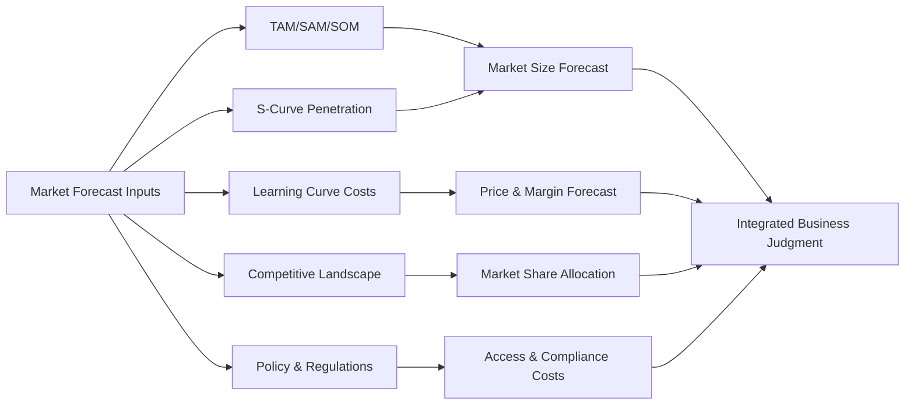

**Python Example 1: Technology Adoption S-Curve Parameter Fitting and Forecasting**

The following code fits a Logistic curve using historical shipment data and forecasts future market penetration:

```python
import numpy as np
import matplotlib.pyplot as plt
from scipy.optimize import curve_fit

# Hypothetical historical years and global shipments (thousands of units)
years = np.array([2023, 2024, 2025, 2026])
shipments_k = np.array([1.5, 5.0, 16.0, 40.0])

# Hypothetical long-term saturation shipment volume is 5000 thousand units
L = 5000.0

# Normalize to penetration rate
P = shipments_k / L

# Logistic model
def logistic(t, k, t0):
    return L / (1 + np.exp(-k * (t - t0)))

# Fit
popt, _ = curve_fit(logistic, years, shipments_k, p0=[0.8, 2028])
k, t0 = popt
print(f"Fitted parameters: k={k:.4f}, t0={t0:.2f}")

# Forecast
future_years = np.arange(2023, 2036)
predicted = logistic(future_years, k, t0)

plt.figure(figsize=(8, 5))
plt.scatter(years, shipments_k, color='red', label='Historical Shipments (thousands)')
plt.plot(future_years, predicted, label=f'Logistic Fit: k={k:.3f}, t0={t0:.1f}')
plt.axhline(L, color='gray', linestyle='--', label=f'Saturation Level L={L} thousand units')
plt.xlabel('Year')
plt.ylabel('Global Shipments (thousands of units)')
plt.title('Humanoid Robot Market Adoption S-Curve Forecast')
plt.legend()
plt.grid(True)
plt.tight_layout()
plt.show()
```

!!! note "Term Explanation: Curve Fitting"
    Curve fitting is the process of finding a mathematical curve that best approximates a set of observed data through optimization methods. Common methods include Least Squares and Maximum Likelihood Estimation. The uncertainty of fitted parameters needs to be assessed through confidence intervals and residual analysis.

**Python Example 2: Learning Curve Cost Projection**

The following code estimates the per-unit BOM cost as cumulative production increases, based on the learning curve:

```python
import numpy as np
import matplotlib.pyplot as plt

C1 = 100_000.0  # BOM cost of the first unit (USD)
learning_rate = 0.20  # Cost decreases by 20% each time production doubles
b = -np.log2(1 - learning_rate)

n_units = np.logspace(0, 6, 100)  # 1 to 1e6 units
C_n = C1 * n_units ** (-b)
```

plt.figure(figsize=(8, 5))
plt.loglog(n_units, C_n)
plt.axhline(17_000, color='red', linestyle='--', label='Bank of America 2030 Target $17k')
plt.axhline(5_900, color='green', linestyle='--', label='Unitree R1 Price $5.9k')
plt.xlabel('Cumulative Production (Units)')
plt.ylabel('BOM Cost per Unit (USD)')
plt.title(f'Learning Curve: Learning Rate {learning_rate*100:.0f}%')
plt.legend()
plt.grid(True, which='both', linestyle='--', alpha=0.5)
plt.tight_layout()
plt.show()

# Calculate cumulative production required to reach target cost
target_cost = 17_000
n_required = (target_cost / C1) ** (-1 / b)
print(f"Cumulative production required to reach ${target_cost:,.0f}: approximately {n_required:,.0f} units")
```

!!! note "Term Explanation: BOM (Bill of Materials)"
    A Bill of Materials (BOM) is a list of all components and their costs required to manufacture a product. BOM cost is the foundation of hardware product cost analysis, but does not include indirect costs such as R&D, tooling, certification, marketing, logistics, and after-sales service.

---

## 1.4 Core Contradiction: Robots That Can Walk vs. Robots That Can Sell

The core judgment facing the industrialization of humanoid robots is that there are two success criteria in the market: one is "capable of completing a demonstration," and the other is "capable of becoming a product."

| Dimension | Robots That Can Walk (Demonstration Type) | Robots That Can Sell (Product Type) |
|------|----------------------|----------------------|
| **Goal** | Showcase technological possibility | Solve customer problems and generate profit |
| **Environment** | Controlled, flat, fixed lighting | Open, uncertain, dynamic |
| **Operating Time** | Minutes to hours | 8–16 hours daily, over 300 days per year |
| **Failure Rate** | Failure and restart allowed | Must achieve over 99% availability |
| **Cost** | Cost no object, performance-driven | Must be within customer-acceptable range |
| **Maintenance** | On-site debugging by engineers | Rapid repair by general technicians |
| **Compliance** | No certification required | Must pass safety, EMC, electrical, etc., certifications |

This gap can be understood from four dimensions.

### 1.4.1 Reliability: From "Able to Run" to "Doesn't Break"

A demonstration robot may only need to perform well on a few specific actions, such as taking a few steps or picking up a cup. However, a product robot needs to maintain stable performance over tens of thousands or even hundreds of thousands of hours of operation.

**Specific challenges include:**

- **Mechanical Wear**: Reducers, bearings, and gears experience wear and increased backlash over long-term use.
- **Electronic Aging**: Capacitors, batteries, and connectors age and fail under high temperature and vibration environments.
- **Sensor Drift**: IMU zero-bias drift, camera calibration changes, and force sensor temperature drift can degrade perception and control performance.
- **Software Stability**: Algorithms may encounter anomalies at boundary conditions, requiring robust fault detection and recovery mechanisms.

Using industrial robots as a reference, industrial robots on automotive production lines typically require an MTBF (Mean Time Between Failures) exceeding 60,000 hours. Currently, the MTBF of most humanoid robots is far below this level. Figure 02 completed approximately 1,250 hours of operation during an 11-month deployment at BMW, which is a significant industry milestone, but it still falls short of the industrial standard of 8 hours/day × 300 days/year = 2,400 hours/year.

!!! note "Term Explanation: Reliability Function R(t)"
    The reliability function $R(t)$ represents the probability that a product will not fail within the time interval $[0, t]$. For an exponential distribution with a constant failure rate $\lambda$:
    $$
    R(t) = e^{-\lambda t}
    $$
    The Mean Time Between Failures $MTBF = \frac{1}{\lambda}$. The exponential distribution applies to the random failure phase but not to the early failure and wear-out failure phases.

!!! note "Term Explanation: MTBF (Mean Time Between Failures)"
    Mean Time Between Failures is a core metric for measuring the reliability of repairable equipment, referring to the average time between two consecutive failures. For an exponential distribution with a constant failure rate, $MTBF = 1/\lambda$. A higher MTBF indicates that the equipment is less prone to failure. It is important to note that MTBF is a statistical concept and does not mean the equipment will fail exactly at the MTBF time point.

!!! note "Term Explanation: Bathtub Curve"
    The bathtub curve describes the trend of the failure rate over the entire product lifecycle, divided into three phases:
    1. **Infant Mortality**: The failure rate decreases over time, usually caused by manufacturing defects or design issues;
    2. **Useful Life**: The failure rate is approximately constant, corresponding to the normal operating phase;
    3. **Wear-Out**: The failure rate increases over time, caused by material aging, fatigue, and wear.
    The shape of the bathtub curve inspires "burn-in" and preventive maintenance strategies in product engineering.

### 1.4.2 Cost: From "Millions of Dollars" to "Tens of Thousands of Dollars"

Cost is one of the most critical factors constraining the commercialization of humanoid robots. The following are the main cost components (using a full-size bipedal humanoid robot as an example):

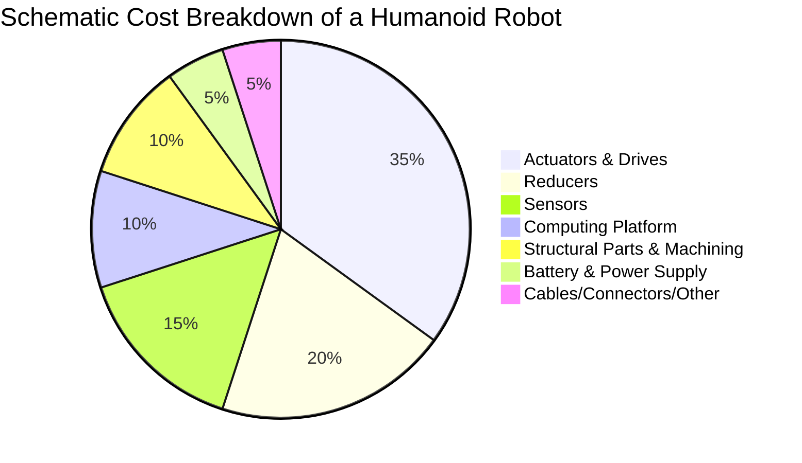

**Reference Unit Prices for Key Components (Market Level 2025–2026):**

| Component | High-End Import | Domestic Alternative | Notes |
|--------|---------|---------|------|
| Harmonic Reducer | 2000–5000 RMB | 800–2000 RMB | Quantity approx. 10–20 |
| RV Reducer | 5000–15,000 RMB | 2000–6000 RMB | Commonly used in high-load leg joints |
| Frameless Torque Motor | 3000–10,000 RMB | 1000–4000 RMB | Quantity approx. 10–20 |
| 6-Axis Force Sensor | 5000–20,000 RMB | 2000–8000 RMB | Commonly used in ankles/wrists |
| LiDAR | 3000–10,000 RMB | 1000–5000 RMB | e.g., Livox Mid-360 |
| High-Performance Computing Platform | 5000–20,000 RMB | 3000–10,000 RMB | e.g., Jetson AGX Orin/Thor |

The BOM (Bill of Materials) cost for a full-size humanoid robot varies significantly by configuration in 2025–2026: pilot costs for Western manufacturers are approximately $90,000–$100,000, while the BOM for Chinese manufacturers has already dropped to around $35,000. To achieve large-scale commercialization, the cost per unit needs to be further reduced to below $30,000.

**Cost Modeling Framework**

Total product cost can be decomposed as:

$$
C_{total} = C_{BOM} + C_{NRE} + C_{manufacturing} + C_{logistics} + C_{service}
$$

Where:

- $C_{BOM}$: Bill of Materials cost;
- $C_{NRE}$: Non-Recurring Engineering costs, including R&D, tooling, certification, and software;
- $C_{manufacturing}$: Manufacturing costs, including labor, equipment depreciation, and factory operations;
- $C_{logistics}$: Logistics and inventory costs;
- $C_{service}$: After-sales, repair, and training costs.

!!! note "Term Explanation: NRE (Non-Recurring Engineering)"
    NRE refers to one-time, non-recurring engineering development costs, such as chip tape-out fees, tooling costs, certification fees, and software development costs. NRE must be amortized over the total sales volume of the product lifecycle; the larger the sales volume, the lower the unit NRE cost.

### 1.4.3 Maintainability: From "Engineer Escort" to "On-Site Repair"

Commercially deployed robots must support rapid repair, component replacement, and software upgrades. This requires:

- **Modular Design**: Components like actuators, batteries, and sensors can be quickly disassembled and replaced.
- **Standardized Interfaces**: Reduce the need for specialized tools and training costs.
- **Remote Diagnostics**: Monitor robot status via a fleet management platform to proactively detect potential faults.
- **OTA Upgrades**: Software can be updated remotely to fix bugs and optimize performance.
- **Spare Parts Supply**: Establish a comprehensive spare parts inventory and logistics system.

For example, if a robot in an automotive factory malfunctions, it is typically required to resume operation within 30 minutes. For humanoid robots to reach a similar level, maintainability must be considered during the design phase.

!!! note "Term Explanation: MTTR (Mean Time To Repair)"
    Mean Time To Repair is the average time required to restore a system to normal operation after a failure occurs. It includes the time for fault detection, diagnosis, repair, verification, and recovery. The relationship between Availability (A), MTBF, and MTTR is: $A = \frac{MTBF}{MTBF + MTTR}$.

!!! note "Term Explanation: Availability"
    Availability $A$ is the probability that a system is in an operational state under specified conditions at a given time. For a repairable system, the steady-state availability is:
    $$
    A = \frac{MTBF}{MTBF + MTTR}
    $$
    It comprehensively reflects reliability and maintainability. Improving availability can be achieved by increasing MTBF (making it more reliable) or decreasing MTTR (making it easier to repair).

!!! note "Term Explanation: OTA (Over-The-Air)"
    Over-The-Air upgrade refers to remotely updating device software via a wireless network. OTA allows robots to fix vulnerabilities, optimize algorithms, and add features after deployment without requiring recalls or on-site maintenance. OTA also introduces cybersecurity risks, requiring authentication, encryption, and rollback mechanisms.

### 1.4.4 Compliance: From "Laboratory Freedom" to "Market Access"

Humanoid robots interact closely with humans in work environments and must comply with relevant standards for functional safety, electrical safety, electromagnetic compatibility, and mechanical safety. Key standards include:

| Standard | Scope | Core Requirements |
|------|---------|---------|
| ISO 13482:2014 | Personal Care Robots | Speed, force, contact pressure limits |
| ISO/TS 15066 | Collaborative Robots | Human-robot collaboration safety requirements |
| IEC 61508 | Functional Safety | Safety Integrity Level (SIL) for control systems |
| ISO 13849 | Safety of Machinery – Control Systems | Safety-related parts of control systems |
| IEC 62368 | Safety of Audio/Video and IT Equipment | Electrical safety, fire risk |

Different regions also have different market access requirements:

- **European Union**: CE Marking
- **United States**: UL Certification, FCC Electromagnetic Compatibility
- **China**: CR Certification (China Robot Certification), CCC, etc.

Compliance not only affects design choices (such as maximum motion speed, housing materials, and emergency stop button placement) but also directly impacts testing costs and timelines. A complete safety certification cycle can take 6–18 months, with costs ranging from tens of thousands to hundreds of thousands of dollars.

!!! note "Term Explanation: Functional Safety"
    Functional safety refers to a system's ability to maintain a safe state under fault conditions. IEC 61508 defines Safety Integrity Levels (SIL) 1–4, with SIL 4 being the highest. Achieving functional safety requires hazard analysis, redundant design, fault detection, safety shutdown mechanisms, and system verification.

!!! note "Term Explanation: EMC (Electromagnetic Compatibility)"
    Electromagnetic compatibility refers to a device's ability to function normally in an electromagnetic environment without causing unacceptable electromagnetic interference to other devices. EMC testing includes Radiated Emissions (RE), Conducted Emissions (CE), Electrostatic Discharge (ESD), Electrical Fast Transients (EFT), etc.

### 1.4.5 System Reliability: Series Model

For a robot composed of multiple components, if the failure of any critical component leads to overall system failure, the system reliability can be approximated as the product of the individual component reliabilities (series model):

$$
R_s(t) = \prod_{i=1}^{n} R_i(t)
$$

If each component has a constant failure rate $\lambda_i$, then:

$$
R_s(t) = \exp\left(-\sum_{i=1}^{n} \lambda_i t\right), \quad MTBF_s = \frac{1}{\sum_{i=1}^{n} \lambda_i}
$$

This means: even if each component has high reliability, increasing the number of components significantly reduces the overall system MTBF. For example, if a robot has 30 actuators, each with an MTBF of 100,000 hours, the series MTBF for the actuator subsystem alone is approximately 3,333 hours.

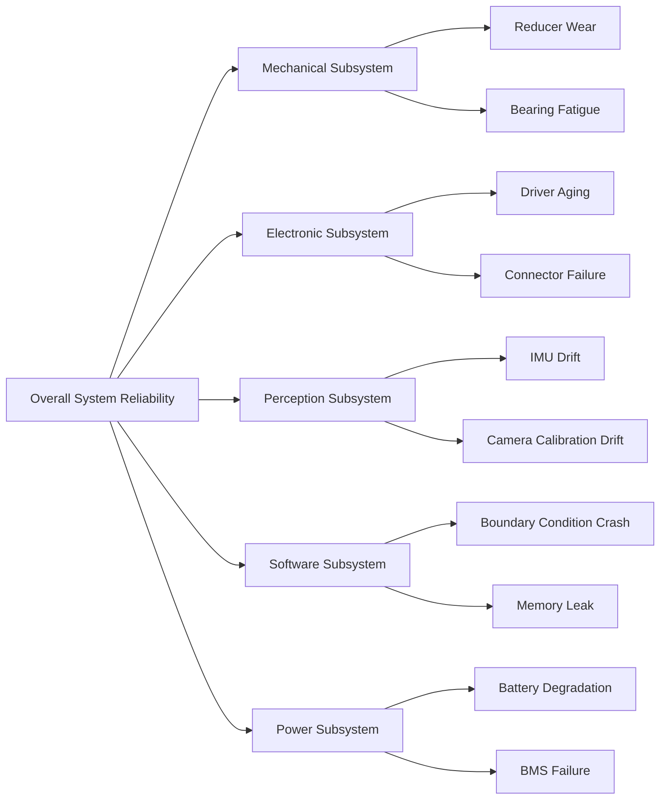

**Python Example 3: Series System Reliability Estimation**

```python
import numpy as np
import matplotlib.pyplot as plt

# Assume MTBF for each critical subsystem (hours)
components = {
    'Actuators×30': 100_000 / 30,
    'Reducers×20': 150_000 / 20,
    'Sensor Suite': 80_000,
    'Computing Platform': 120_000,
    'Battery/BMS': 60_000,
    'Cable Connectors': 50_000,
}

# Calculate failure rate for each component
lambdas = {k: 1/v for k, v in components.items()}
total_lambda = sum(lambdas.values())
system_mtbf = 1 / total_lambda
print(f"Total System Failure Rate: {total_lambda:.6f} /hour")
print(f"System MTBF: {system_mtbf:,.0f} hours")

# Plot reliability function
t = np.linspace(0, 10_000, 500)
R_system = np.exp(-total_lambda * t)
R_target = np.exp(-t / 60_000)  # Industrial robot reference

plt.figure(figsize=(8, 5))
plt.plot(t, R_system, label=f'Humanoid Robot Series Model (MTBF={system_mtbf:.0f}h)')
plt.plot(t, R_target, '--', label='Industrial Robot Reference (MTBF=60,000h)')
plt.xlabel('Operating Time t (hours)')
plt.ylabel('Reliability R(t)')
plt.title('Series System Reliability Degradation Over Time')
plt.legend()
plt.grid(True)
plt.tight_layout()
plt.show()
```

!!! note "Term Explanation: Failure Rate"
    The failure rate $\lambda(t)$ is the probability density of failure per unit time, commonly expressed in FIT (Failures In Time, 10⁻⁹ failures/hour) or %/1000 hours. Under a constant failure rate, $\lambda = 1/MTBF$.

**Python Example 4: Relationship between Availability A and MTBF/MTTR**

```python
import numpy as np
import matplotlib.pyplot as plt

# Fixed MTBF, varying MTTR
mtbf = 1000  # hours
mttr_range = np.linspace(1, 200, 100)
A_fixed_mtbf = mtbf / (mtbf + mttr_range)

# Fixed MTTR, varying MTBF
mttr = 24  # hours
mtbf_range = np.linspace(100, 5000, 100)
A_fixed_mttr = mtbf_range / (mtbf_range + mttr)

fig, axs = plt.subplots(1, 2, figsize=(12, 5))

axs[0].semilogy(mttr_range, 1 - A_fixed_mtbf)
axs[0].set_xlabel('MTTR (hours)')
axs[0].set_ylabel('Unavailability 1-A')
axs[0].set_title(f'Effect of MTTR on Unavailability (MTBF={mtbf}h)')
axs[0].grid(True)

axs[1].plot(mtbf_range, A_fixed_mttr)
axs[1].set_xlabel('MTBF (hours)')
axs[1].set_ylabel('Availability A')
axs[1].set_title(f'Effect of MTBF on Availability (MTTR={mttr}h)')
axs[1].grid(True)

plt.tight_layout()
plt.show()

# Example: Required MTBF for 99% availability with MTTR=24h
target_A = 0.99
mttr_example = 24
required_mtbf = mttr_example * target_A / (1 - target_A)
print(f"With MTTR={mttr_example}h, achieving availability {target_A*100:.0f}% requires MTBF ≥ {required_mtbf:,.0f}h")
```

---

## 1.5 Seven Leaps from 0 to 1

Transforming a humanoid robot from a concept into a scalable product requires seven progressive leap stages. The diagram below shows the macro-level process:


### 1.5.1 Mapping Stages to NASA TRL / DoD MRL

To more precisely assess the technology and manufacturing maturity at each stage, they can be mapped to NASA's Technology Readiness Levels (TRL) and the U.S. Department of Defense's Manufacturing Readiness Levels (MRL):

| Leap Stage | TRL Range | MRL Range | Core Task | Primary Risk | Exit Criteria |
|---------|---------|---------|---------|---------|---------|
| Lab Prototype | TRL 1–3 | MRL 1–2 | Principle validation, key technology breakthroughs | Theoretical infeasibility, performance ceiling | Key technologies reproducible under controlled conditions |
| Engineering Prototype | TRL 4–5 | MRL 3–4 | System integration, structural/thermal/power design | Integration failure, insufficient reliability | Prototype can run continuously and complete designated tasks |
| Small-Batch Validation | TRL 6 | MRL 5–6 | Manufacturability, supply chain, field testing | Unstable processes, supplier risks | Dozens of prototypes operate stably in real-world scenarios |
| Production Preparation | TRL 7 | MRL 7–8 | Production line design, BOM optimization, quality system | Slow production ramp-up, low yield | Production line validated, process flow solidified |
| Scenario Deployment | TRL 8 | MRL 8 | Customer site validation, value proof | Mismatched customer needs, difficult on-site adaptation | Customer signs commercial order or long-term agreement |
| Operations & Maintenance | TRL 9 | MRL 9 | Fleet management, remote diagnostics, spare parts | High failure rate, uncontrolled service costs | Availability meets contractually committed levels |
| Scaled Replication | TRL 9 | MRL 10 | Multi-region, multi-scenario, business model replication | Market saturation, increased competition | Sustainable profitability and scaled growth |

!!! note "Term Explanation: TRL (Technology Readiness Level)"
    Technology Readiness Levels were proposed by NASA to assess the maturity of a technology from concept to practical application. TRL 1 is basic principles observed, TRL 9 is a system proven in actual mission operations. TRL is an important tool for technology project management, budget allocation, and risk assessment.

!!! note "Term Explanation: MRL (Manufacturing Readiness Level)"
    Manufacturing Readiness Levels were proposed by the U.S. Department of Defense to assess the maturity of a manufacturing process from concept to full-rate production. MRL 1 is manufacturing feasibility identified, MRL 10 is full-rate/low-rate production with continuous improvement. MRL complements TRL, together determining the industrialization maturity of a technology.

### 1.5.2 Stage 1: Lab Prototype

**Goal**: Prove the feasibility of core technologies.

This stage is typically conducted in universities or corporate research labs. Researchers focus on a specific problem, such as bipedal dynamic walking, whole-body control, or dexterous manipulation. The prototype may use off-the-shelf components and extensive manual parameter tuning, with the emphasis on publishing papers or filing patents rather than engineering.

**Key Deliverables**:

- Proof-of-concept prototype
- Key algorithm prototypes
- Academic papers or patents

**Primary Risk**: Theoretical assumptions are invalid, key performance indicators cannot be met.

### 1.5.3 Stage 2: Engineering Prototype

**Goal**: Transform the technology prototype into a repeatable system.

The engineering prototype stage begins to focus on system integration, structural strength, thermal management, power efficiency, and software stability. Components gradually transition from off-the-shelf products to custom parts, and control algorithms are deeply coupled with real hardware.

**Key Deliverables**:

- Repeatable complete machine system
- Structural design drawings and BOM
- Control software framework
- Preliminary test report

### 1.5.4 Stage 3: Small-Batch Validation

**Goal**: Validate design manufacturability and supply chain stability.

Typically, dozens to hundreds of prototypes are manufactured and tested over long periods in real or near-real scenarios. This stage exposes design flaws, process issues, and supplier risks, providing input for mass production.

**2025–2026 Case**: UBTECH Walker S2 monthly production capacity exceeds 300 units; Leju plans batch delivery of thousands of body robots in 2025; Unitree and Zhiyuan enter ten-thousand-unit capacity planning.

### 1.5.5 Stage 4: Production Preparation

**Goal**: Transform the engineering prototype into a repeatable, traceable, and scalable production process.

The production preparation stage involves production line design, process solidification, BOM optimization, supplier locking, test process standardization, and quality system construction.

**2025–2026 Case**: Tesla converts its Fremont Model S/X production line for Optimus Gen 3, targeting an annual capacity of 1 million units; Figure AI builds the BotQ factory with an initial annual capacity of 12,000 units, planning to expand to 100,000 units.

### 1.5.6 Stage 5: Scenario Deployment

**Goal**: Validate value in real customer scenarios.

The deployment stage puts robots into real customer scenarios, such as factory production lines, warehouse logistics, or commercial services. This stage requires solving issues like on-site adaptation, human-robot collaboration, anomaly handling, and operational support.

**2025–2026 Case**: Figure 02 completes an 11-month deployment at BMW's Spartanburg plant; BMW launches the Hexagon AEON humanoid robot pilot at its Leipzig plant in summer 2026; Tesla Optimus performs battery sorting, part handling, and quality inspection tasks at its Fremont and Texas factories.

### 1.5.7 Stage 6: Operations & Maintenance

**Goal**: Ensure long-term stable operation of the robot and continuous optimization.

The operations and maintenance stage focuses on remote monitoring, fault diagnosis, OTA upgrades, spare parts supply, maintenance training, and performance optimization. Data feedback from this stage also becomes an important basis for product iteration.

### 1.5.8 Stage 7: Scaled Replication

**Goal**: Large-scale promotion across multiple regions and scenarios.

The scaled replication stage means that the product, supply chain, services, and business model have matured and can be promoted on a large scale across multiple regions and scenarios.

**2025–2026 Observation**: The industry is in the process of transitioning from Stage 5 to Stages 6 and 7. Most manufacturers are still in the pilot and small-batch stages; true scaled replication has not yet arrived.

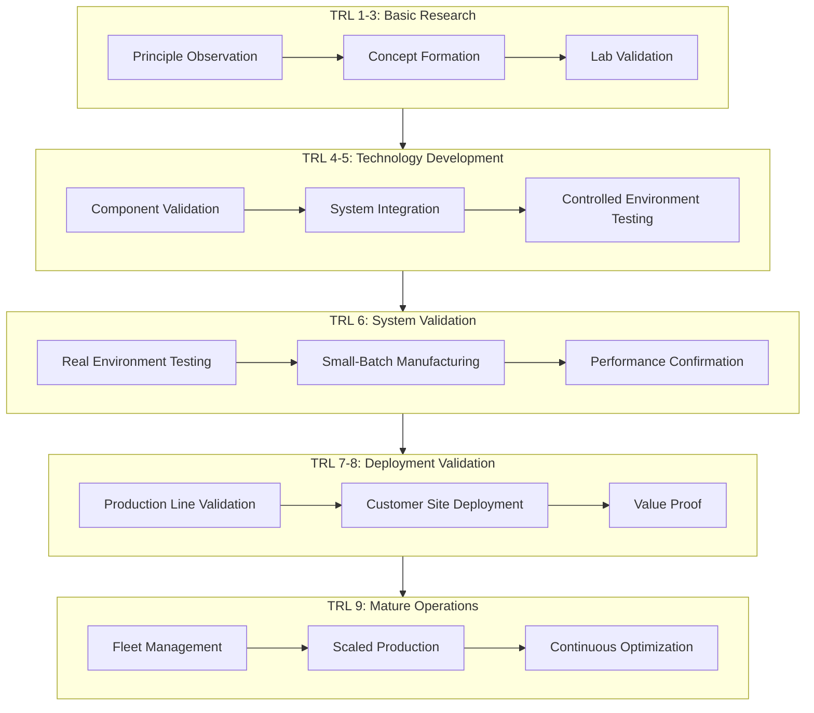

### 1.5.9 Stage-Gate Management

For highly complex products, the Stage-Gate management method is often used: a "gate" is set at the end of each stage, and only by passing the review can the next stage be entered. Review dimensions include:

| Dimension | Review Question |
|------|---------|
| Technology Maturity | Have key technologies reached the stage goal? |
| Manufacturing Readiness | Are processes, supply chain, and capacity ready? |
| Cost Control | Is the target BOM cost achievable? |
| Quality & Reliability | Do test data meet reliability targets? |
| Compliance & Certification | Is the safety certification plan clear? |
| Commercial Viability | Is the customer value and business model valid? |

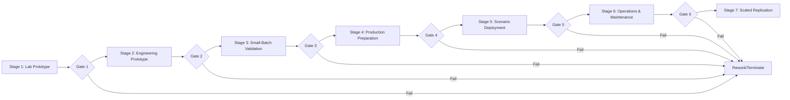

---

## 1.6 Sources of System Complexity

The fundamental reason why humanoid robots are difficult to industrialize is that they are highly complex system engineering objects. Their complexity mainly stems from the following aspects.

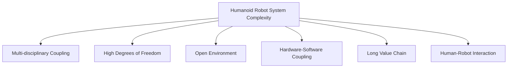

### 1.6.1 Multi-disciplinary Coupling

Humanoid robots simultaneously involve multiple disciplines such as mechanical engineering, electronic engineering, control theory, computer science, artificial intelligence, materials science, and human factors engineering. The design goals and constraints of these disciplines often conflict with each other. For example, lightweighting requires thinner structural components, but this reduces stiffness and strength; high-performance AI algorithms require greater computing power, but this increases power consumption and heat dissipation pressure.

!!! note "Term Explanation: Strong Coupling and Weak Coupling"
    In systems science, if the states or parameters of two subsystems strongly influence each other, it is called strong coupling; if the influence is small or negligible, it is called weak coupling. In humanoid robots, there is strong coupling between battery capacity, heat dissipation, computing power, structural strength, and dynamic performance: increasing computing power increases power consumption and heat generation, requiring larger batteries and heat dissipation structures, thereby increasing weight, which in turn affects dynamic balance and energy consumption.

#### 1.6.1.1 Design Coupling Matrix and Design Structure Matrix

To quantify the coupling between subsystems, the **Design Structure Matrix** (DSM) can be introduced. Assume the system has $n$ subsystems, define the coupling matrix $\mathcal{D} \in \{0,1\}^{n \times n}$, where $d_{ij}=1$ indicates that the design decision of subsystem $i$ directly affects the performance of subsystem $j$. The DSM for the main subsystems of a humanoid robot can be represented as:

|  | Structure | Actuators | Perception | Computing | Power | Software | AI |
|--|------|--------|------|------|------|------|----|
| Structure | — | 1 | 1 | 1 | 1 | 0 | 0 |
| Actuators | 1 | — | 0 | 1 | 1 | 1 | 0 |
| Perception | 1 | 0 | — | 1 | 1 | 1 | 1 |
| Computing | 1 | 1 | 1 | — | 1 | 1 | 1 |
| Power | 1 | 1 | 1 | 1 | — | 1 | 0 |
| Software | 0 | 1 | 1 | 1 | 1 | — | 1 |
| AI | 0 | 0 | 1 | 1 | 0 | 1 | — |

The higher the density of 1s in the matrix, the higher the overall system coupling. The density in the table above is approximately 44%, much higher than typical consumer electronics products (usually 15–25%). High coupling means that a single design change can trigger a chain of modifications, increasing the complexity of system integration and verification.

System coupling degree can be defined as:

$$
\rho_c = \frac{\sum_{i \neq j} d_{ij}}{n(n-1)}
$$

where $\rho_c$ is the coupling degree, and $n$ is the number of subsystems. In the example above, $n=7$, and the number of off-diagonal 1s is 26, so $\rho_c = 26/(7\times6) \approx 0.619$. If a weighted DSM is used, the influence strength can also be distinguished.

!!! note "Term Explanation: Design Structure Matrix (DSM)"
    The Design Structure Matrix is a Boolean or weighted matrix used in systems engineering to describe the dependency relationships between tasks, components, or subsystems. By performing cluster analysis on the DSM, highly coupled module groups can be identified, guiding modular design and interface standardization. The DSM was first proposed by Donald Steward in 1981 in project management research and is now widely used in complex product development.

#### 1.6.1.2 Energy-Mass-Compute Triangle Constraint

Humanoid robots have a fundamental energy-mass-compute triangle constraint. Increasing onboard computing power simultaneously increases power consumption and heat dissipation, while battery energy density grows slowly, leading to:

$$
E_{battery} \geq \left(P_{compute} + P_{actuators} + P_{sensors}\right) \cdot t_{operation}
$$

where:

- $E_{battery}$: Available battery energy (Wh);
- $P_{compute}, P_{actuators}, P_{sensors}$: Power consumption of computing, actuators, and perception (W);
- $t_{operation}$: Target operating time (h).

If computing power consumption increases by $\Delta P$, to maintain the operating time $t$ unchanged, the battery capacity must be increased:

$$
\Delta E = \Delta P \cdot t
$$

Calculating with a lithium-ion battery energy density $\rho_E \approx 250 \text{ Wh/kg}$, the battery weight increase is:

$$
\Delta m = \frac{\Delta E}{\rho_E} = \frac{\Delta P \cdot t}{\rho_E}
$$

For example, increasing onboard computing power consumption from 100 W to 200 W (increase $\Delta P = 100$ W), if a 4-hour operating time is required:

$$
\Delta m = \frac{100 \times 4}{250} = 1.6 \text{ kg}
$$

This 1.6 kg additional mass is all concentrated in the torso, which raises the center of mass, increases leg load and walking energy consumption, forming a positive feedback loop. Therefore, hardware selection must perform Pareto optimization between computing power, power consumption, and weight. Detailed analysis of power and energy management is provided in Chapter 6, Section 6.2.

```python
# Calculate the impact of increased power consumption on battery mass and walking energy consumption
Delta_P = 100       # Increase in computing power consumption (W)
t_op = 4            # Operating time requirement (h)
rho_E = 250         # Battery energy density (Wh/kg)
g = 9.81            # Gravitational acceleration (m/s^2)

Delta_m = Delta_P * t_op / rho_E
print(f"Battery weight increase: {Delta_m:.2f} kg")

# Estimate additional walking energy consumption: assume step length 0.7 m, speed 1 m/s,
# COT = 1.0 (dimensionless, relative to human ~0.2)
COT = 1.0
v = 1.0             # Walking speed (m/s)
extra_power = COT * Delta_m * g * v
print(f"Additional walking power consumption: {extra_power:.1f} W")
```

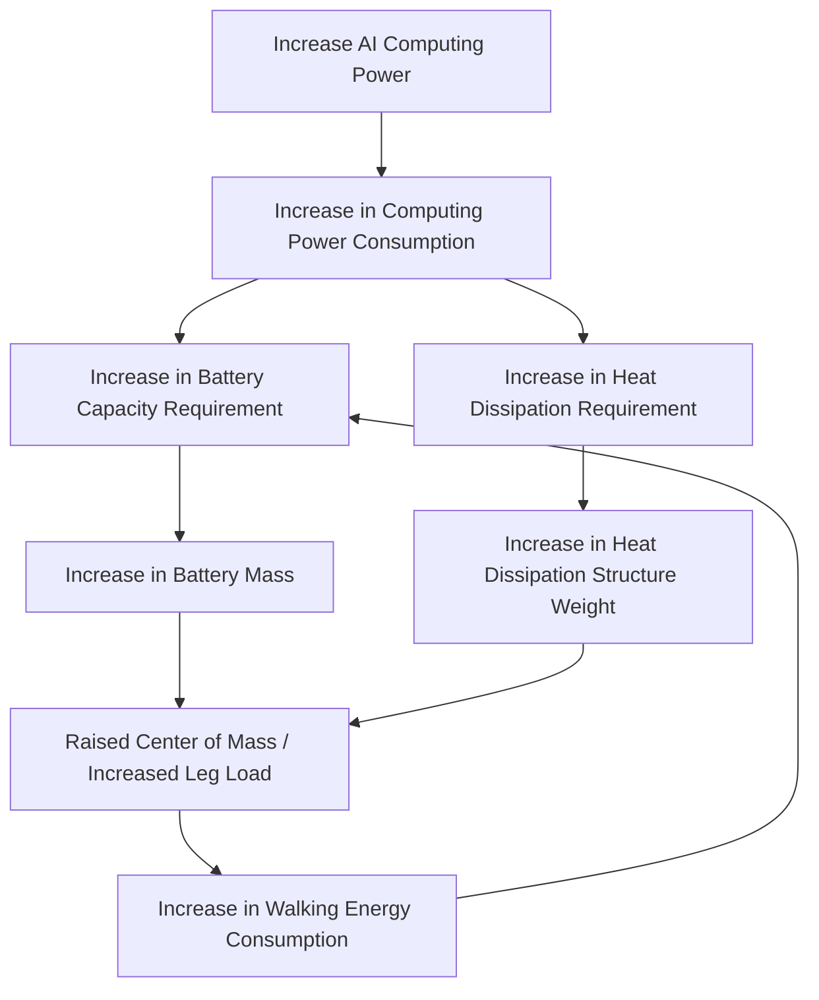

### 1.6.2 High Degrees of Freedom and Dynamic Instability

Humanoid robots typically have 20–50 degrees of freedom and are in an inherently unstable bipedal support state. Their motion control requires real-time solving in a high-dimensional state space while satisfying contact constraints, friction constraints, force constraints, and kinematic constraints.

!!! note "Term Explanation: Degree of Freedom (DOF)"
    The degree of freedom is the number of independent motion parameters describing a mechanical system. For a serial robot, if each joint provides one independent motion, the total DOF equals the number of joints. Humanoid robots typically have 20–50 DOFs, including 5–7 per leg, 6–7 per arm, 2–3 for the torso, 2–3 for the head, and 6–20 per hand.

!!! note "Term Explanation: Curse of Dimensionality"
    The curse of dimensionality was proposed by Richard Bellman in the study of dynamic programming, referring to the exponential growth of computational complexity, data requirements, and optimization difficulty as the dimensionality of the state space increases. For a 30-dimensional state space, even if each dimension is discretized into only 10 values, the total number of states reaches $10^{30}$, far exceeding conventional computing capabilities.

### 1.6.3 Unpredictability of Open Environments

Real-world environments have high uncertainty. Factors such as ground material, lighting conditions, object shapes, human behavior, and obstacle distribution are all dynamically changing. Robots need a closed-loop capability for perception, reasoning, planning, and execution.

!!! note "Term Explanation: Emergent Behavior"
    Emergent behavior refers to overall phenomena in complex systems that arise from the interaction of many simple components and cannot be directly predicted from the behavior of individual components. In humanoid robots, gait, group collaboration, and unexpected behaviors in human-robot interaction can all be emergent. Systems engineering needs to identify and manage emergent risks through simulation, testing, and monitoring.

### 1.6.4 Deep Hardware-Software Coupling

The performance of a humanoid robot depends not only on algorithms but also on sensor accuracy, actuator response, communication latency, computing power, and power management. Software optimization must fully consider hardware characteristics, and hardware selection must also serve software requirements.

#### 1.6.4.1 End-to-End Latency Budget

The total latency of the perception-decision-execution closed loop determines the robot's ability to respond to dynamic environments. Let the latency of each stage be:

$$
T_{total} = T_{sensor} + T_{comm}^{sense} + T_{compute} + T_{comm}^{ctrl} + T_{actuator}
$$

where:

- $T_{sensor}$: Sensor acquisition and readout delay;
- $T_{comm}^{sense}$: Communication delay from sensor to computing platform;
- $T_{compute}$: Perception and decision inference delay;
- $T_{comm}^{ctrl}$: Communication delay from computing platform to actuator;
- $T_{actuator}$: Actuator response delay.

Typical values (2025–2026 level):

| Component | Typical Delay | Description |
|-----------|---------------|-------------|
| Camera exposure and readout $T_{sensor}$ | 5–33 ms | Related to frame rate, ~33 ms for a 30 Hz camera |
| Sensor to computing platform communication $T_{comm}^{sense}$ | 1–5 ms | Depends on bus; GigE is higher, MIPI/PCIe is lower |
| Perception and decision inference $T_{compute}$ | 20–100 ms | VLA large model inference can exceed 100 ms |
| Computing to actuator communication $T_{comm}^{ctrl}$ | 1–2 ms | Real-time Ethernet or CAN-FD |
| Actuator response $T_{actuator}$ | 1–10 ms | Determined by current loop bandwidth |

Total delay is typically between 30–150 ms. For high-speed reaction tasks such as fall recovery, the available reaction time window is approximately 200–300 ms, so the control algorithm must reserve sufficient margin. A more rigorous analysis requires the sampling theorem: the control loop sampling period $T_s$ should satisfy:

$$
T_s < \frac{1}{2 f_{max}}
$$

where $f_{max}$ is the frequency of the disturbance to be suppressed. If one wishes to suppress a 10 Hz torso sway, the sampling period should be less than 50 ms.

!!! note "Term Explanation: Control Bandwidth"
    Control bandwidth is the maximum frequency range that a closed-loop control system can effectively track or suppress, typically defined as the frequency where the closed-loop gain drops to -3 dB. According to the Shannon sampling theorem, the sampling frequency of a digital controller should be at least twice the highest frequency of the signal; in engineering practice, it is often taken as 10–20 times or more to ensure stability and anti-aliasing performance. Control bandwidth is limited by the sampling period, sensor delay, actuator dynamics, and communication delay.

#### 1.6.4.2 Perception-Decision-Actuation Data Flow

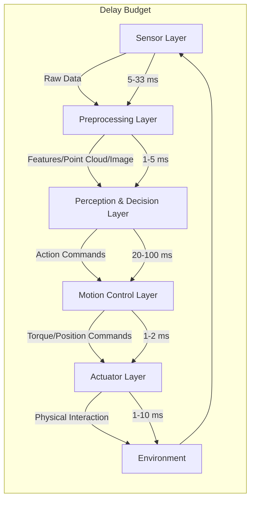

This data flow imposes requirements on hardware-software co-design: if AI inference consumes excessive CPU/GPU resources, it may cause jitter in control tasks; if the communication protocol is non-deterministic, high-frequency control loops may struggle to maintain stability. Therefore, mainstream humanoid robots adopt a hierarchical computing architecture: real-time control tasks run on MCU/RTOS, while perception and AI tasks run on Linux/GPU, communicating via deterministic buses or shared memory. See Section 6.1 of Chapter 6 for the computing platform architecture, and Chapter 22 for the software stack design.

```python
# End-to-end delay budget and stability margin analysis
delays = {
    'Camera Readout': 33,        # ms
    'Sensor Communication': 5,   # ms
    'AI Inference': 80,          # ms
    'Control Communication': 2,  # ms
    'Actuator Response': 5,      # ms
}

T_total = sum(delays.values())
print(f"End-to-end total delay: {T_total} ms")

# For fall recovery task, assume available reaction window of 250 ms
reaction_window = 250
margin = reaction_window - T_total
print(f"Safety margin: {margin} ms")

# Control bandwidth estimation: sampling period taken as 1/3 to 1/5 of total delay
T_s = T_total / 5  # ms
f_bw = 1 / (2 * T_s / 1000)  # Hz, Nyquist frequency
print(f"Estimated control bandwidth upper limit: {f_bw:.1f} Hz")
```

!!! note "Term Explanation: Deterministic Communication"
    Deterministic communication refers to a communication mechanism where message transmission delay has a known upper bound and very low jitter. Unlike best-effort Ethernet, real-time Ethernet (e.g., EtherCAT, PROFINET IRT), CAN-FD, and Time-Sensitive Networking (TSN) ensure determinism through scheduling, time-triggered mechanisms, or master-slave synchronization. Humanoid robots can use ordinary networks for high-bandwidth perception data and non-real-time AI tasks, but joint-level control loops typically require deterministic communication.

### 1.6.5 Long Value Chain and Supply Chain Risks

The value chain of humanoid robots spans from raw materials, components, modules, and complete machines to application services and operational maintenance. A problem in any single link can affect the delivery and cost control of the entire machine.

Taking the actuator as an example, its value chain includes:

```
Rare Earth Minerals → Permanent Magnet Materials → Motor → Reducer → Encoder → Driver → Actuator Assembly → Complete Machine → Application Services
```


### 1.6.6 Human-Robot Interaction and Social Acceptance

Humanoid robots will ultimately work in human society, and their movements, appearance, sounds, and behavior all affect human perception. If the robot's movements are too stiff or unpredictable, it may cause fear or discomfort; if the robot's appearance is too realistic, it may trigger the "uncanny valley" effect.

!!! note "Term Explanation: Human-Robot Interaction (HRI)"
    Human-Robot Interaction is an interdisciplinary field studying the interaction between humans and robots, encompassing psychology, cognitive science, design, engineering, and ethics. HRI focuses on the understandability, safety, efficiency, and social acceptance of interaction. For humanoid robots, HRI design must particularly consider posture, gaze, movement predictability, voice tone, and physical contact safety.

---

### 1.6.7 Quantifying Complexity: Number of Interfaces and System Entropy

System complexity can be preliminarily quantified by the number of interfaces and entropy. For a system composed of $n$ subsystems, if an interface could exist between every pair of subsystems, the potential number of interfaces is $O(n^2)$. A humanoid robot involves 6–10 major subsystems, each with multiple internal components, leading to potentially hundreds of interfaces.

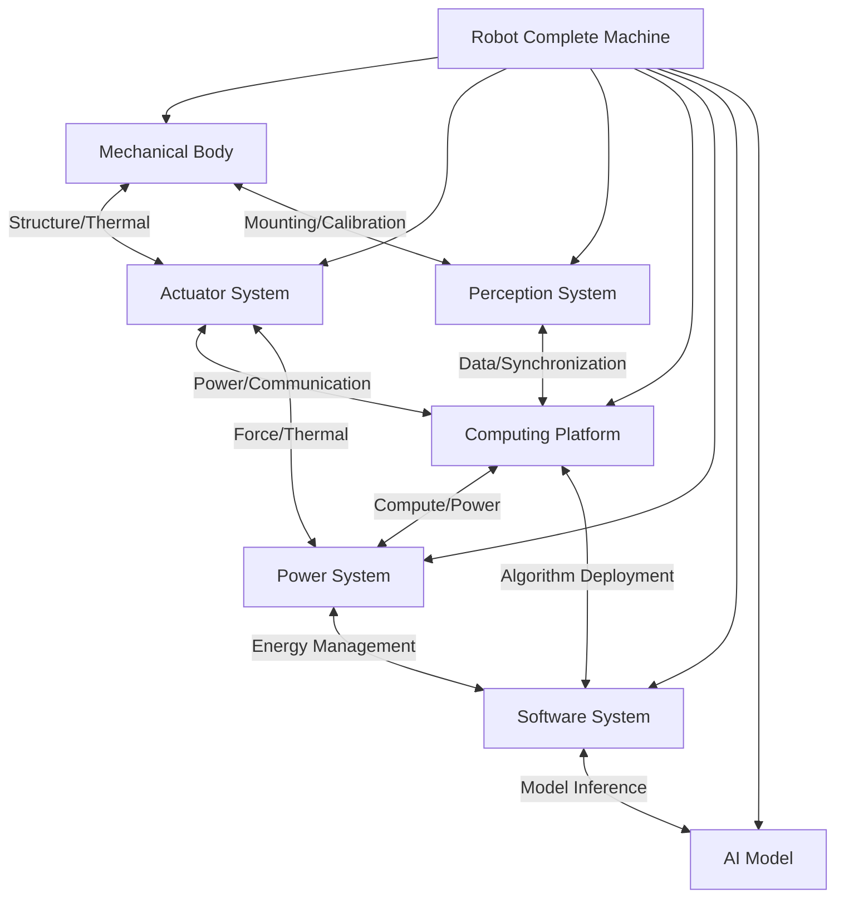

From an information theory perspective, system uncertainty can be measured by entropy. If each interface has $m$ possible failure modes, the total system uncertainty is related to the number of interfaces and failure modes. The goal of complexity management is to reduce system entropy through modularization, standardized interfaces, and interface contracts.

!!! note "Term Explanation: System Entropy"
    System entropy borrows the concept of entropy from thermodynamics and information theory, describing the degree of disorder or uncertainty in a system. In systems engineering, high entropy means complex relationships between components, unpredictable behavior, and multiple paths for fault propagation. Methods to reduce system entropy include modularization, interface standardization, decoupling design, and digital twins.

### 1.6.8 Cascading Risks and Fault Propagation

Faults in humanoid robots often have cascading effects: a minor fault in one subsystem can propagate through coupled interfaces to other subsystems, ultimately leading to complete machine shutdown or safety incidents. For example:

- IMU drift → State estimation error → Foot placement deviation → Abnormal foot force sensor readings → Controller misjudgment → Fall
- Battery voltage drop → Insufficient motor output torque → Increased joint tracking error → Overcompensation by whole-body controller → Thermal protection trigger → Shutdown


Managing cascading risks requires:

1. **Failure Mode and Effects Analysis (FMEA)**: Systematically identifies potential failures and their consequences.
2. **Redundancy Design**: Redundancy in critical sensors, actuators, and communication links.
3. **Fault Detection and Isolation (FDI)**: Real-time detection of anomalies and isolation of fault sources.
4. **Safety State Machine**: Transition to a safe state (e.g., shutdown, crouch, handrail) upon failure.

!!! note "Term Explanation: FMEA (Failure Mode and Effects Analysis)"
    Failure Mode and Effects Analysis is a systematic risk assessment method used to identify potential failure modes in a product or process, their causes and effects, and to evaluate the Risk Priority Number (RPN = Severity × Occurrence × Detection). FMEA is a standard tool in the automotive, aerospace, and medical device industries.

!!! note "Term Explanation: Fault Detection and Isolation (FDI)"
    Fault detection determines whether a system has failed, while fault isolation identifies the location or cause of the failure. FDI methods include model-based residual generation, data-driven anomaly detection, and rule-based diagnosis. In humanoid robots, FDI is crucial for safe operation.

### 1.6.9 Sociotechnical System Perspective

Humanoid robots are not merely technical systems but also sociotechnical systems. Their deployment affects workflows, division of labor, training needs, laws and regulations, and public perception. Technical success does not equal social acceptance; product design must consider:

- **Impact on Jobs**: Does it replace or augment human capabilities?
- **Privacy and Security**: How is data collected by the robot protected?
- **Liability**: In case of an accident, is the responsibility with the manufacturer, operator, or user?
- **Cultural Differences**: Acceptance of robot appearance and behavior varies across regions.

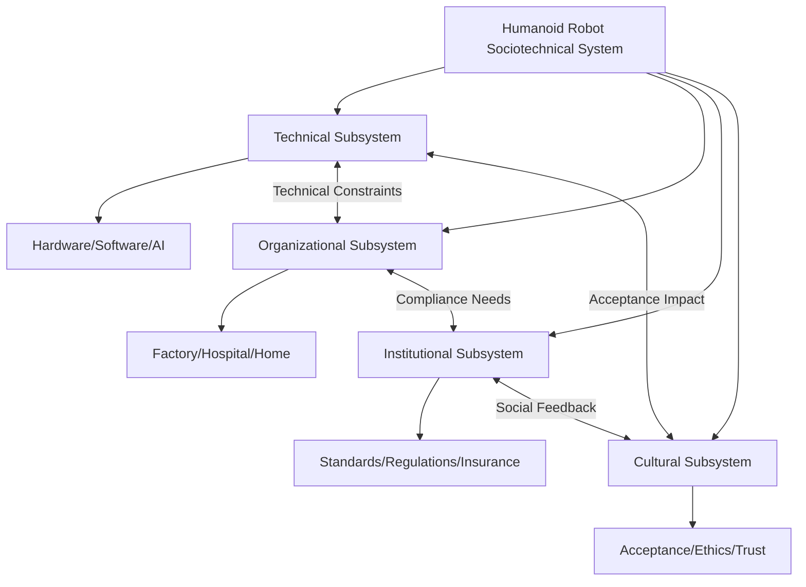

---

## 1.7 Why Knowledge Graphs?

Faced with such complex systems engineering problems, traditional literature reviews, technical reports, or product lists struggle to provide systematic cognitive support. They are often flat and fragmented, failing to clearly present the relationships between different technologies, components, companies, standards, and applications.

### 1.7.1 Limitations of Traditional Knowledge Organization Methods

| Method | Advantages | Limitations |
|------|------|------|
| Paper Reviews | Systematically summarize research progress | Slow to update, difficult to link with industry information |
| Product Databases | Convenient for querying product parameters | Lack of technical principles and supply chain relationships |
| Industry Reports | Provide market insights | Often one-off, difficult to update dynamically |
| Technical Blogs | Timely, specific | Fragmented, variable source quality |

### 1.7.2 Core Advantages of Knowledge Graphs

A knowledge graph uses entities as nodes and relationships as edges to structure various types of knowledge in the humanoid robot domain. Each entity (e.g., a reducer, a paper, a company, a standard) has a defined type, attributes, and source; each relationship (e.g., "uses," "composes," "manufactures," "applies to") is defined and validated.

Knowledge graphs offer the following advantages:

**(1) Cross-Layer Linking**

Knowledge graphs can express multi-level relationships from basic materials to complete robot systems, from algorithms to hardware, and from manufacturing to markets. For example, one can trace:

```
An algorithm → uses a dataset → deployed on a robot → uses a reducer from a manufacturer → made of a certain material → subject to a certain standard
```

Such cross-layer chains are crucial for identifying bottlenecks, evaluating alternatives, and performing system optimization.

**(2) Traceable Sources**

Each entity and relationship can be linked to its source, such as papers, reports, company websites, or standard documents. This ensures the verifiability of the knowledge.

**(3) Dynamic Evolution**

The humanoid robot field evolves rapidly, with new knowledge, products, and companies constantly emerging. Knowledge graphs support incremental updates and version management.

**(4) Supports Reasoning and Querying**

Based on the knowledge graph, complex queries and reasoning are possible, for example:

- Find all humanoid robots that use harmonic drives
- Identify the hardware list required by a specific algorithm
- Analyze the supplier concentration for a specific component
- Trace the design choices influenced by a specific standard

### 1.7.3 The Knowledge Graph Approach of This Book

This book adopts the knowledge graph as its core organizational method to systematically organize the full-process knowledge of humanoid robots from 0 to 1. Specifically:

- **Entities**: Include materials, components, methods, algorithms, datasets, software, robots, companies, standards, applications, etc.
- **Relationships**: Include composition, usage, manufacturing, deployment, applicability, testing, regulatory relationships, etc.
- **Layers**: Organize knowledge according to the physical layer, perception layer, decision layer, execution layer, system layer, and industry layer.
- **Cross-Layer Chains**: Reveal the complete chain from basic research to industrial application.

The following diagram shows the simplified structure of the knowledge graph in this book:

```mermaid
graph TD
    subgraph Physical Layer
        M[Materials] --> C[Components]
        C --> A[Actuators]
    end

    subgraph Perception Layer
        S[Sensors] --> P[Perception Algorithms]
    end

    subgraph Decision Layer
        AI[AI Models] --> PL[Planning Algorithms]
    end

    subgraph Execution Layer
        A --> CTRL[Control Algorithms]
        CTRL --> A
    end

    subgraph System Layer
        R[Complete Robot] --> SW[Software Stack]
    end

    subgraph Industry Layer
        SUP[Suppliers] --> OEM[OEMs]
        OEM --> APP[Application Scenarios]
        APP --> MKT[Market]
        STD[Standards] --> R
    end

    A --> R
    P --> AI
    PL --> CTRL
    SW --> AI
    SW --> CTRL
```

!!! note "Term Explanation: Knowledge Graph"
    A knowledge graph is a semantic network that represents knowledge using a graph structure, composed of entities (nodes), relationships (edges), and attributes. It originates from Semantic Web and Ontology research, with Google formally proposing the Knowledge Graph concept in 2012. Knowledge graphs support structured querying, reasoning, and visualization, making them an effective tool for handling complex interdisciplinary knowledge.

### 1.7.4 Cognitive Scalability: Why Knowledge Graphs Suit Humanoid Robots

Knowledge in the humanoid robot domain spans dozens of disciplines, hundreds of components, thousands of companies, and tens of thousands of papers. Human cognitive capacity for short-term and working memory is limited, making it impossible to process such a large amount of fragmented information simultaneously. Knowledge graphs enhance cognitive scalability through:

1. **Hierarchical Abstraction**: Decomposing complex systems into manageable layers and modules.
2. **Explicit Relationships**: Making implicit connections (e.g., "a certain motor is used in a certain robot") explicit.
3. **Multi-Scale Navigation**: Allowing viewing of the entire industry landscape at a macro level and tracing the technical parameters of a specific component at a micro level.
4. **Continuous Updates**: The knowledge graph can be continuously expanded and revised as technology and industry evolve.

```mermaid
graph TD
    A[Humanoid Robot Knowledge] --> B[Physical Layer]
    A --> C[Perception Layer]
    A --> D[Decision Layer]
    A --> E[Execution Layer]
    A --> F[System Layer]
    A --> G[Industry Layer]

    B --> B1[Material Properties]
    B --> B2[Component Specifications]
    C --> C1[Sensor Types]
    C --> C2[Perception Algorithms]
    D --> D1[Motion Planning]
    D --> D2[VLA Models]
    E --> E1[Actuators]
    E --> E2[Control Laws]
    F --> F1[Complete Robot Integration]
    F --> F2[Software Stack]
    G --> G1[Companies]
    G --> G2[Market]
    G --> G3[Standards]
```

## 1.8 Structure and Reading Path of This Book

This book is organized according to the logical chain of the humanoid robot industry, divided into ten parts and thirty chapters.

### 1.8.1 Overall Structure

| Part | Theme | Chapters |
|------|------|------|
| Part 1 | General Introduction and Methodology | Chapters 1–2 |
| Part 2 | Physical Foundation Layer: Materials, Components, and Supply Chain | Chapters 3–7 |
| Part 3 | Design Engineering Layer | Chapters 8–9 |
| Part 4 | Manufacturing and Mass Production Layer | Chapters 10–13 |
| Part 5 | Control and Motion Layer | Chapters 14–17 |
| Part 6 | AI, Model, and Data Layer | Chapters 18–21 |
| Part 7 | Software and Simulation Layer | Chapters 22–24 |
| Part 8 | Evaluation, Benchmarking, and Validation | Chapter 25 |
| Part 9 | Complete Machines, Enterprises, and Markets | Chapters 26–28 |
| Part 10 | Policy, Ethics, and the Future | Chapters 29–30 |

### 1.8.2 Reading Paths for Different Readers

Readers from different professional backgrounds can follow the paths below for selective reading:

**Students/New Entrants (Recommended to start from the basics)**

```
Chapter 1 → Chapters 3–5 → Chapter 8 → Chapters 14–16 → Chapters 18–19 → Chapter 26
```

**Mechanical/Manufacturing Engineers (Focus on physical realization)**

```
Chapters 3–5 → Chapters 8–9 → Chapters 10–13 → Chapter 25
```

**AI/Software Engineers (Focus on algorithms and systems)**

```
Chapters 18–21 → Chapters 22–24 → Chapters 14–17 → Chapters 5–6
```

**Industry/Investors (Focus on business and ecosystem)**

```
Chapter 1 → Chapter 7 → Chapter 13 → Chapters 26–28 → Chapters 29–30
```

**Policy Researchers (Focus on regulation and social impact)**

```
Chapter 1 → Chapter 12 → Chapters 29–30
```

---

## 1.9 Why Humanoid: The Deeper Morphology Economics

### 1.10.1 Matching Morphology and Tasks

The choice of robot morphology is fundamentally a result of matching task, environment, and cost. Wheeled robots are most efficient on flat ground; flying robots are suitable for rapid 3D movement; robotic arms excel at repetitive precision operations; humanoid robots have potential advantages under the following conditions:

- The environment is designed for humans (stairs, doors, tools, workstations)
- Tasks are diverse and difficult to enumerate exhaustively in advance
- Close collaboration with humans is required
- The integration and modification cost of specialized equipment exceeds that of a general-purpose humanoid solution

```mermaid
graph TD
    A[Robot Morphology Selection] --> B[Wheeled]
    A --> C[Legged]
    A --> D[Flying]
    A --> E[Robotic Arm]
    A --> F[Humanoid]

    B --> B1[High efficiency on flat ground]
    C --> C1[Traversability of complex terrain]
    D --> D1[Rapid 3D movement]
    E --> E1[High-precision repetitive operations]
    F --> F1[General-purpose in human environments]
    F --> F2[Acceptance for human-robot collaboration]
```

### 1.10.2 The Trade-off of Bipedal Walking

Bipedal walking is a compromise between high energy efficiency and high mobility. From a biomechanical perspective, the energy efficiency of human bipedal walking is approximately 0.8 J/(kg·m), which still lags behind wheeled locomotion, but bipedalism allows for crossing obstacles, climbing stairs, and turning in tight spaces.

!!! note "Term Explanation: Cost of Transport (COT)"
    Cost of Transport refers to the energy consumed to move a unit mass over a unit distance, typically expressed in J/(N·m) or dimensionless (divided by gravity). The COT for humans is about 0.2; for traditional bipedal robots, the COT is usually between 1–10, much higher than humans; optimized modern bipedal robots can approach 0.5–1.

The difficulties of bipedal control lie in:

1. **Dynamic instability**: During the single support phase, the robot must maintain stability under inverted pendulum dynamics.
2. **Contact switching**: During gait, the supporting foot switches, causing discrete changes in system dynamics.
3. **Underactuation**: Ground contact forces cannot be directly controlled but are indirectly regulated through overall motion.

Mathematically, a bipedal robot can be viewed as a Hybrid System:

$$
\begin{cases}
\dot{x} = f_i(x, u), & \text{when in contact mode } i \\
x^+ = \Delta_{ij}(x^-), & \text{when a mode switch } i \to j \text{ occurs}
\end{cases}
$$

where $\Delta_{ij}$ is the impact/switching map.

!!! note "Term Explanation: Hybrid System"
    A hybrid system is a dynamic system composed of both continuous dynamics and discrete events. In robotics, the continuous dynamics of bipedal walking are limb movements, and the discrete events are foot touchdown/liftoff and support phase switching. Hybrid system theory provides a mathematical framework for analyzing gait stability.

### 1.10.3 The Economics of Generality vs. Specificity

The business case for humanoid robots ultimately depends on whether the generality premium exceeds the efficiency loss of specialization. Let:

- Annual cost of a specialized device to complete a single task be $C_s$
- Annual cost of a humanoid robot to complete $N$ tasks be $C_h + \sum_{i=1}^{N} c_i$

Then the condition for the humanoid solution to have a cost advantage is:

$$
C_h + \sum_{i=1}^{N} c_i < \sum_{i=1}^{N} C_{s,i}
$$

When the number of tasks $N$ increases, the integration cost of specialized equipment is high, and tasks switch frequently, the generality premium of the humanoid solution becomes more apparent.

```mermaid
graph LR
    A[Number of Tasks N] --> B[Total Cost of Specialized Solution]
    A --> C[Total Cost of Humanoid Solution]

    B -->|Linear Growth| D[ΣCs]
    C -->|Sub-linear Growth| E[Ch + Σci]

    D --> F[Break-even Point]
    E --> F
```

---

## 1.10 Key Indicator Dashboard for Industrialization

To track the progress of humanoid robots from 0 to 1, the following key indicator dashboard can be established:

| Dimension | Indicator | 2025 Industry Level | Industrial Target |
|------|------|----------------|---------|
| Technology | Bipedal walking speed | 3–6 km/h | 5–8 km/h |
| Technology | Battery life | 2–4 hours | 8–12 hours |
| Technology | Dexterous hand DOF | 6–11 | 15–20 |
| Reliability | MTBF | 500–2,000 h | > 20,000 h |
| Reliability | Availability | 90–95% | > 99% |
| Cost | BOM | $35k–100k | <$20k |
| Cost | Selling price | $10k–250k | <$30k |
| Manufacturing | Annual production capacity | Hundreds–Tens of thousands | > 100,000 units |
| Deployment | Runtime per scenario | 100–1,500 h | > 5,000 h |
| Compliance | Certification coverage | Partial/Pilot | Full market access |

```mermaid
graph LR
    A[Industrialization Dashboard] --> B[Technical Indicators]
    A --> C[Reliability Indicators]
    A --> D[Cost Indicators]
    A --> E[Manufacturing Indicators]
    A --> F[Deployment Indicators]
    A --> G[Compliance Indicators]

    B --> B1[Speed/Battery Life/Payload]
    C --> C1[MTBF/MTTR/Availability]
    D --> D1[BOM/Selling Price/TCO]
    E --> E1[Capacity/Yield Rate/Takt Time]
    F --> F1[Runtime/Task Success Rate]
    G --> G1[Certification/Standards/Market Access]
```

---

## 1.11 Extended Reading and Thought Questions for This Chapter

### 1.12.1 Extended Reading

- Wiener, *Cybernetics*, Chapter 1: Feedback and Information
- Kajita et al., *Introduction to Humanoid Robotics*: LIPM and Preview Control
- Siciliano & Khatib, *Springer Handbook of Robotics*: Panorama of Robotics
- Mori, *The Uncanny Valley*: Humanoid Appearance and Emotional Response
- Ebeling, *An Introduction to Reliability and Maintainability Engineering*: Fundamentals of Reliability Engineering

### 1.12.2 Practice Problems

1. Assume a robot has 20 actuators, each with an MTBF of 80,000 hours. Calculate the MTBF for the actuator subsystem under a series model.
2. Using the learning curve formula, if the cost of the first unit is $100,000 and the learning rate is 20%, calculate the unit cost when the cumulative production reaches 10,000 units.
3. Explain why the ZMP criterion is applicable to planar footed robots but requires more general treatment for point contacts or complex terrain.
4. Compare the similarities and differences in the industrialization paths of Tesla Optimus and Figure AI.
5. Design a TRL/MRL assessment checklist suitable for a humanoid robot R&D project.

---

## 1.12 Standards, Certification, and Market Access Systems

For humanoid robots to move from the laboratory to the market, they must pass through a multi-tiered system of standards and certifications. These standards not only define the safety requirements that products must meet but also shape design choices, testing processes, and cost structures.

### 1.13.1 Hierarchical Structure of the Standards System

The global robot standards system exhibits a pyramid structure: the top layer consists of international basic standards, the middle layer comprises regional and industry application standards, and the bottom layer includes enterprise internal standards and testing specifications.

```mermaid
graph TD
    A[Robot Standards System] --> B[International Standards]
    A --> C[Regional Standards]
    A --> D[Industry Standards]
    A --> E[Enterprise Standards]

    B --> B1[ISO/IEC Basic Standards]
    B --> B2[IEEE Technical Standards]
    C --> C1[EU EN/CE]
    C --> C2[US UL/FCC]
    C --> C3[China GB/CR/CCC]
    D --> D1[Automotive ISO/TS 15066]
    D --> D2[Medical IEC 60601]
    D --> D3[Logistics VDI 2853]
    E --> E1[Design Specifications]
    E --> E2[Testing Specifications]
    E --> E3[Supplier Specifications]
```

!!! note "Term Explanation: Standard"
    A standard is a normative document, established by consensus and approved by a recognized body, that provides rules, guidelines, or characteristics for activities or their results. Standards reduce transaction costs, improve interoperability, and ensure safety, but can also become technical barriers and market access thresholds.

### 1.13.2 Overview of Major International and Regional Standards

| Standard/Certification | Issuing Body | Scope | Core Focus |
|----------|---------|---------|-----------|
| ISO 13482:2014 | ISO | Personal care robots | Mechanical safety, speed/force limits, contact safety |
| ISO/TS 15066:2016 | ISO | Collaborative robots | Maximum permissible pressure/force, safety functions |
| ISO 13849-1:2023 | ISO | Safety of machinery control systems | Reliability of safety-related parts of control systems |
| IEC 61508:2010 | IEC | Functional safety generic standard | SIL levels, safety lifecycle |
| IEC 62368-1:2018 | IEC | Safety of information technology equipment | Electrical safety, fire, energy hazards |
| UL 1740 | UL | Industrial robot safety | Robot system safety evaluation |
| FCC Part 15 | FCC | US radio equipment | Electromagnetic compatibility and radio frequency interference |
| CE Marking | European Union | EU market access | Compliance with relevant directives (Machinery Directive, Low Voltage Directive, etc.) |
| CR Certification | China Robot Alliance / CNCA | China robot market access | Safety, EMC, performance, reliability |
| CCC | General Administration of Quality Supervision, Inspection and Quarantine of China | Compulsory product certification | Electrical safety, etc. |

!!! note "Term Explanation: CE Marking and CCC Certification"
    CE marking is a declaration of conformity for products entering the EU market, indicating that the product meets the essential requirements of relevant EU directives. CCC (China Compulsory Certification) is China's compulsory product certification system; products involving personal safety, animal/plant life/health, and environmental protection must obtain CCC certification before being sold.

### 1.13.3 Special Challenges for Humanoid Robot Standards

Compared to industrial robotic arms and collaborative robots, the development of standards for humanoid robots faces unique challenges:

1. **Morphological Diversity**: Bipedal, wheeled, and hybrid forms are difficult to cover with a single standard.
2. **Dynamic Contact**: Safety assessment for dynamic contact scenarios like falling, collision, and grasping is complex.
3. **Human-Robot Interaction**: Interaction with children, the elderly, and people with disabilities in home and service scenarios requires additional consideration.
4. **AI Autonomy**: The uncertainty of VLA and reinforcement learning models presents new challenges for functional safety assessment.
5. **Cross-Scenario Application**: The same robot may be used in factories, logistics, services, and other scenarios, blurring the boundaries of applicable standards.

```mermaid
graph TD
    A[Humanoid Robot Standardization Challenges] --> B[Morphological Diversity]
    A --> C[Dynamic Contact]
    A --> D[Human-Robot Interaction]
    A --> E[AI Autonomy]
    A --> F[Cross-Scenario Application]

    B --> B1[Inconsistent standards for bipedal/wheeled/hybrid]
    C --> C1[Fall/Collision/Grasping Safety]
    D --> D1[Children/Elderly/Vulnerable Groups]
    E --> E1[Model Uncertainty/Explainability]
    F --> F1[Multi-scenario certification for same product]
```

---

## 1.13 AI and the Technology Stack in the Mass Production Era

### 1.14.1 From Traditional Control to Learning-Driven

The control methods for humanoid robots have evolved from classical control to optimal control, and then to learning-driven approaches:

```mermaid
graph LR
    A[Classical Control] --> B[ZMP/LIPM]
    B --> C[MPC/WBC]
    C --> D[Reinforcement Learning]
    D --> E[End-to-End VLA]

    A --> A1[PD Control]
    B --> B1[Inverted Pendulum Model]
    C --> C1[Constrained Optimization]
    D --> D1[Simulation Training]
    E --> E1[Vision-Language-Action Unification]
```

!!! note "Term Explanation: Reinforcement Learning (RL)"
    Reinforcement learning is a machine learning method that learns optimal policies through interaction with an environment. An agent takes action $a_t$ in state $s_t$, receives reward $r_t$, and transitions to the next state $s_{t+1}$, aiming to maximize the cumulative return $R = \sum_{t} \gamma^t r_t$. In robotics, RL is commonly used to learn locomotion and manipulation policies.

!!! note "Term Explanation: Sim-to-Real"
    Sim-to-Real refers to the process of transferring policies trained in simulation to real robots. Due to differences in dynamics, perception, and contact models between simulation and the real world (known as the reality gap), techniques such as domain randomization, system identification, residual learning, and real-world fine-tuning are needed to bridge the gap.

### 1.14.2 Overview of VLA Model Architecture

VLA models typically consist of three core modules:

1. **Vision Encoder**: Converts images/videos into visual features.
2. **Language Model**: Understands natural language instructions and generates task plans.
3. **Action Decoder**: Maps the vision-language representation to robot actions (joint positions, velocities, torques, or end-effector poses).

```mermaid
graph LR
    I[Image Input] --> V[Vision Encoder]
    T[Text Instruction] --> L[Language Model]
    V --> F[Multimodal Fusion]
    L --> F
    F --> A[Action Decoder]
    A --> M[Robot Action]
```

Representative VLA models include:

- **RT-2 (Google DeepMind)**: Processes robot actions as language tokens.
- **OpenVLA**: Open-source VLA model supporting fine-tuning on multi-robot data.
- **GR00T N1 (NVIDIA)**: Foundation model for humanoid robots.
- **Helix (Figure AI)**: End-to-end high-speed humanoid robot control.
- **π0 (Physical Intelligence)**: Generalist robot policy model.

!!! note "Term Explanation: Domain Randomization"
    Domain randomization is the deliberate randomization of physical parameters (e.g., mass, friction, damping, terrain, lighting, texture) during simulation training to make policies robust to the differences between simulation and reality. Mathematically, the policy optimization objective is $J = \mathbb{E}_{p(\xi)}[R(\pi, \xi)]$, where $\xi$ represents the randomized environment parameters.

### 1.14.3 Data Flywheel and Scalable Learning

The improvement of AI capabilities for humanoid robots relies on a data flywheel:

```mermaid
graph LR
    A[Deploy Robots] --> B[Collect Real-World Data]
    B --> C[Data Cleaning and Annotation]
    C --> D[Model Training]
    D --> E[Model Deployment]
    E --> A

    D --> F[Simulation-Generated Data]
    F --> C
```

Real-world data includes teleoperation demonstrations, human motion capture, autonomous operation logs, and failure cases. Simulation data can rapidly generate a large variety of scenarios but suffers from the reality gap. A successful data strategy typically combines real-world and simulation data.

!!! note "Term Explanation: Data Flywheel"
    A data flywheel is a positive feedback loop where more product usage generates more data, leading to better models, improved product experience, and consequently attracting more usage. In humanoid robots, the data flywheel is a key mechanism for achieving generalization and continuous improvement.

---

## 1.14 Multi-Country Comparison of Industrialization Pathways

### 1.15.1 United States: Technology Leadership and Capital-Driven

The United States leads in technological innovation and capital operations in the humanoid robot sector:

- **Representative Companies**: Tesla, Figure AI, Boston Dynamics, Agility Robotics, Apptronik.
- **Advantages**: AI algorithms, large models, capital markets, high-end manufacturing.
- **Challenges**: High manufacturing costs, partial supply chain reliance on Asia, relatively high labor costs.

### 1.15.2 China: Supply Chain and Cost Advantages

China has become the world's largest market for humanoid robot production and shipment:

- **Representative Companies**: Unitree, Zhiyuan Robot, Ubtech, Leju, Fourier, Galaxy General.
- **Advantages**: Complete supply chain, low-cost manufacturing, rapid iteration, vast domestic demand market.
- **Challenges**: High-end chips and some core components still rely on imports, international market access and brand recognition.

### 1.15.3 Japan and Europe: Technological Accumulation and Application Exploration

- **Japan**: ASIMO and HRP series have accumulated extensive experience in bipedal control and human-robot interaction, but commercialization remains relatively cautious.
- **Europe**: Emphasizes safety standards, collaborative robots, medical and industrial applications, but lacks large-scale mass production enterprises.

#### 1.15.4 Comparative Advantage Framework and Policy Toolkit

The division of labor among countries in the humanoid robot industry can be explained by the theory of comparative advantage. Let the opportunity cost of producing a complete humanoid robot for country $i$ be $OC_i$ (measured by the output of other high-tech industries). Then, countries with lower opportunity costs have a comparative advantage in complete machine integration. Currently, China's comparative advantage lies in the scaled production capacity of electromechanical components such as actuators and reducers; the United States' advantage lies in AI models, chip design, and high-value software; Japan's advantage lies in precision reducers and long-term reliability technology; Europe's advantage lies in safety standards, medical regulatory experience, and industrial design.

Government policies can be seen as exogenous variables that alter comparative advantages. Common policy tools include:

| Policy Tool | Mechanism of Action | Typical Application |
|------------|-------------------|-------------------|
| R&D Subsidies | Reduce corporate R&D costs | US NSF/DoD robotics projects, China's National Key R&D Program |
| Government Procurement | Provide early market validation | Pilot projects in factories, hospitals, public scenarios |
| Industry Funds | Alleviate capital constraints | Local government robot funds in China |
| Standard Setting | Shape market access rules | EU CE, China CR, US UL |
| Talent Development | Expand engineer supply | University robotics programs, industry-education integration |

```mermaid
graph TD
    A[National Industrial Policy] --> B[R&D Subsidies]
    A --> C[Government Procurement]
    A --> D[Industry Funds]
    A --> E[Standard Setting]
    A --> F[Talent Development]

    B --> G[Reduce Innovation Costs]
    C --> H[Create Early Demand]
    D --> I[Expand Financing Scale]
    E --> J[Set Entry Barriers]
    F --> K[Increase Factor Supply]

    G --> L[Reshaping Comparative Advantage]
    H --> L
    I --> L
    J --> L
    K --> L
```

!!! note "Term Explanation: Comparative Advantage"
    Comparative advantage was proposed by David Ricardo in 1817. It refers to the situation where a country or entity has a lower opportunity cost in producing a certain product than others. Even if its absolute efficiency is not the highest, it should specialize in producing that product and benefit from trade. In the humanoid robot industry chain, comparative advantage determines the international division of labor for components, complete machines, software, and services.

!!! note "Term Explanation: Opportunity Cost"
    Opportunity cost is a core concept in economics, referring to the benefit of the best alternative foregone when choosing one option. For example, if a country invests the same resources into manufacturing complete humanoid robots instead of semiconductor design, the foregone benefits from the semiconductor industry represent its opportunity cost. Comparative advantage analysis emphasizes relative efficiency rather than absolute efficiency.

```python
# Quantitative illustration of comparative advantage among four countries: using cost index and technology level as two-dimensional indicators
import numpy as np

countries = ['United States', 'China', 'Japan', 'Europe']
cost_index = np.array([85, 45, 70, 75])       # Complete machine manufacturing cost index, lower is better
tech_index = np.array([95, 75, 85, 80])       # Comprehensive technology level index, higher is better

# Calculate cost per unit of technology level (proxy for opportunity cost)
opportunity_cost = cost_index / tech_index
for c, oc in zip(countries, opportunity_cost):
    print(f"{c}: Opportunity Cost Index = {oc:.3f}")
```

The result shows that China has the lowest opportunity cost index, meaning that under current resource endowments, China has a relative comparative advantage in complete machine manufacturing; although the United States has the highest technology level, its costs are also the highest, making it more suitable for occupying high-value-added segments. The impact of national policies on the industry landscape will be further discussed in Chapters 28 and 29.

---

## 1.15 Outlook for the Future: From "Having a Body" to "Having a Job"

The ultimate hallmark of humanoid robot industrialization is not technical parameters, but **continuously creating value in real economic activities**. This means:

1. **From Demonstration to Productivity**: Robots can complete tasks that customers are willing to pay for.
2. **From Single Unit to Fleet**: Multiple robots work collaboratively, managed by a unified platform.
3. **From Teleoperation to Autonomy**: Human supervision rather than direct control.
4. **From Pilot to Business Model**: Clear cost structure, pricing, services, and profit model.

```mermaid
graph LR
    A[Current State] --> B[Short-term Goal]
    B --> C[Mid-term Goal]
    C --> D[Long-term Vision]

    A --> A1[Tens of thousands shipped]
    A --> A2[Factory pilots]
    B --> B1[Hundreds of thousands capacity]
    B --> B2[Multi-scenario deployment]
    C --> C1[Millions market]
    C --> C2[Semi-autonomous operation]
    D --> D1[General-purpose labor]
    D --> D2[Deep social integration]
```

---

## 1.16 Quick Reference of Key Formulas

| Formula | Meaning | Application Scenario |
|---------|---------|---------------------|
| $\dot{x} = f(x,u), y = h(x,u)$ | Dynamic system formalization | Control design, state estimation |
| $M(q)\ddot{q} + C(q,\dot{q})\dot{q} + G(q) = \tau$ | Lagrangian dynamics | Motion planning, simulation |
| $P(t) = L / (1 + e^{-k(t-t_0)})$ | Technology adoption S-curve | Market forecasting |
| $C_n = C_1 n^{-b}$ | Learning curve | Cost forecasting |
| $R(t) = e^{-\lambda t}$ | Reliability function | Lifetime prediction |
| $MTBF = 1/\lambda$ | Mean time between failures | Reliability indicator |
| $A = MTBF / (MTBF + MTTR)$ | Availability | Maintenance planning |
| $R_s = \prod R_i$ | Series system reliability | System reliability design |

## 1.17 Chapter Summary

From an industrialization perspective, this chapter systematically answers two questions: "Why humanoid robots?" and "Why is now the critical window for humanoid robots?"

The core viewpoints are as follows:

1.  **Humanoid robots are general-purpose machines that mimic human form and movement capabilities.** Their advantages lie in environmental compatibility, task versatility, and social acceptance, but these advantages are currently only theoretical.

2.  **We are currently in a critical window for industrialization:** In 2025, the global market size is approximately $3 billion, with installations around 16,000 units, of which China accounts for over 80%. Leading manufacturers such as Tesla, Figure AI, Unitree, AGIBOT, and UBTECH have entered the stage of real-world deployment or production ramp-up.

3.  **Costs are declining rapidly:** Manufacturing costs dropped by 40% between 2023 and 2024. The BOM for Chinese manufacturers has fallen to approximately $35,000, and the Unitree R1 is priced as low as $5,900, laying the foundation for large-scale application.

4.  **The core contradiction in humanoid robot industrialization is the gap between "being able to walk" and "being able to sell."** Reliability, cost, maintainability, and compliance constitute the four-dimensional constraints of productization.

5.  **Going from 0 to 1 requires seven transition stages:** Laboratory prototype, engineering prototype, small-batch validation, production preparation, scenario deployment, operations and maintenance, and large-scale replication. In 2025–2026, the industry is in the early phase of transitioning from scenario deployment to operations and maintenance and large-scale replication.

6.  **Humanoid robots are highly complex system engineering objects**, characterized by multi-disciplinary coupling, high degrees of freedom, open-environment uncertainty, deep hardware-software coupling, long value chains, and human-robot interaction complexity.

7.  **Traditional knowledge organization methods struggle with this complexity.** Knowledge graphs can structurally organize cross-domain knowledge using entity-relationship models, supporting cross-layer association, source tracing, dynamic evolution, and complex queries.

8.  **The choice of humanoid form is a result of morphological economics:** In human-built environments, the versatility of bipedal locomotion may offset its efficiency disadvantage in single tasks, provided task diversity and deployment scale are sufficiently large.

9.  **Reliability and availability are quantifiable engineering metrics:** Through $R(t)$, MTBF, MTTR, series system models, and availability formulas, engineering judgment criteria can be established to transition from demonstrations to products.

10. **Standards and certifications are necessary conditions for market access:** Multi-level standard systems such as ISO, IEC, UL, CE, CCC, and CR shape product design, testing processes, and cost structures.

11. **AI and mass production are reshaping the technology stack:** VLA models, reinforcement learning, sim-to-real, and data flywheels are driving the evolution of humanoid robots from pre-programmed actions to perception-driven autonomous behavior.

12. **The 2025–2026 industry landscape is shaped by US technological innovation, China's supply chain and cost advantages, and the technological accumulation of Japan and Europe.** True large-scale replication has not yet arrived.

Subsequent chapters will build upon this framework, gradually delving into the complete journey of humanoid robots from materials to markets, and from technology to industry.

---

## 1.18 Chapter Symbol Table

| Symbol | Meaning | Unit/Dimension | First Appearance |
|------|------|----------|---------|
| $x(t)$ | System state vector | $\mathbb{R}^n$ | 1.1.5 |
| $u(t)$ | Control input | $\mathbb{R}^m$ | 1.1.5 |
| $y(t)$ | System output / sensor measurement | $\mathbb{R}^p$ | 1.1.5 |
| $q$ | Generalized coordinates | $\mathbb{R}^n$ | 1.1.5 |
| $M(q)$ | Mass matrix | kg·m² | 1.1.5 |
| $C(q,\dot{q})$ | Coriolis and centrifugal force term | kg·m²/s | 1.1.5 |
| $G(q)$ | Gravity term | N·m | 1.1.5 |
| $\tau$ | Joint torque | N·m | 1.1.5 |
| $J_c$ | Contact point Jacobian matrix | — | 1.1.5 |
| $F_c$ | Ground contact force | N | 1.1.5 |
| $C_{total}^{(h)}$ | Total cost of ownership for humanoid solution | USD | 1.1.2 |
| $C_{total}^{(s)}$ | Total cost of ownership for specialized solution | USD | 1.1.2 |
| $N$ | Number of task types | — | 1.1.2 |
| $\eta_s$ | Task efficiency of specialized robot | — | 1.1.2 |
| $\eta_h$ | Task efficiency of humanoid robot | — | 1.1.2 |
| $R(t)$ | Reliability function | Probability | 1.4.1 |
| $\lambda$ | Failure rate | /hour | 1.4.1 |
| $MTBF$ | Mean time between failures | Hour | 1.4.1 |
| $MTTR$ | Mean time to repair | Hour | 1.4.3 |
| $A$ | Availability | Probability | 1.4.3 |
| $C_n$ | Cost of the $n$-th unit | USD | 1.3.7 |
| $C_1$ | Cost of the first unit | USD | 1.3.7 |
| $b$ | Learning index | — | 1.3.7 |
| $LR$ | Learning rate | — | 1.3.7 |
| $P(t)$ | Market penetration rate | — | 1.3.7 |
| $L$ | Upper limit of market penetration | — | 1.3.7 |
| $k$ | S-curve growth rate parameter | 1/year | 1.3.7 |
| $t_0$ | S-curve inflection point time | Year | 1.3.7 |
| $M_t$ | Market size | USD | 1.3.1.1 |
| $TAM_t$ | Total addressable market | USD | 1.3.1.1 |
| $ASP_t$ | Average selling price | USD | 1.3.1.1 |
| $N_t$ | Shipment volume | Units | 1.3.1.1 |
| $C_h$ | Annual cost of a human worker | USD/year | 1.3.5.1 |
| $C_r$ | Annual equivalent cost of a robot | USD/year | 1.3.5.1 |
| $c_h$ | Hourly cost of a human worker | USD/hour | 1.3.5.2 |
| $c_r$ | Hourly cost of a robot | USD/hour | 1.3.5.2 |
| $OADR_t$ | Old-age dependency ratio | % | 1.3.5.1 |
| $\mathcal{D}$ | DSM coupling matrix | $\{0,1\}^{n\times n}$ | 1.6.1.1 |
| $\rho_c$ | System coupling degree | — | 1.6.1.1 |
| $E_{battery}$ | Available battery energy | Wh | 1.6.1.2 |
| $\rho_E$ | Battery energy density | Wh/kg | 1.6.1.2 |
| $T_{total}$ | End-to-end total latency | s | 1.6.4.1 |
| $T_s$ | Control sampling period | s | 1.6.4.1 |
| $f_{max}$ | Maximum disturbance frequency | Hz | 1.6.4.1 |
| $OC_i$ | Opportunity cost of producing a complete machine in country $i$ | — | 1.15.4 |

## Chapter Knowledge Graph Anchor Points

**Core Entities**

| Entity Type | Representative Entities |
|-------------|-------------------------|
| `robot_system` | Tesla Optimus Gen 3, Unitree H1/G1/R1, Figure 02/03, Boston Dynamics Atlas, Agility Digit, Hexagon AEON |
| `company` | Tesla, Figure AI, Unitree, AgiBot, UBTECH, Leju Robotics, Apptronik, Boston Dynamics |
| `component` | actuator, harmonic reducer, RV reducer, IMU, LiDAR, compute unit |
| `technology` | locomotion, manipulation, teleoperation, VLA, sim-to-real |
| `concept` | systems engineering, mass production, compliance, uncanny valley |
| `standard` | ISO 13482, IEC 61508, ISO 13849, ISO/TS 15066 |
| `market` | industrial manufacturing, logistics, healthcare, home service |

**Core Relationships**

| Relationship Type | Meaning | Example |
|------------------|---------|---------|
| `is_part_of` | Components make up the complete robot | Actuator → Robot |
| `implemented_on` | Method/algorithm deployed on robot | Helix → Figure 03 |
| `applies_to` | Standard/process applies to system | ISO 13482 → Service robot |
| `manufactures` | Supplier manufactures components | Harmonic Drive Systems → Harmonic reducer |
| `sources_from` | Robot manufacturer procures from supplier | Tesla → Tuopu Group |
| `uses_dataset` | Method uses dataset | GR00T N1 → Humanoid robot training data |
| `requires` | Method depends on hardware/software | VLA → Jetson Thor |
| `deployed_at` | Robot deployed at customer site | Figure 02 → BMW Spartanburg |

**Cross-Layer Link Example**

```
Rare earth materials → Permanent magnets → Frameless torque motors → Actuators → Complete robot → BMW factory deployment → Industrial manufacturing market → Safety standards/certification
```

**Key Thinking Questions**

1. What are the essential differences between humanoid robots, wheeled robots, and industrial robotic arms?
2. Why is 2025–2026 considered a critical window for the industrialization of humanoid robots? What data supports this?
3. In what aspects do "robots that can walk" differ from "robots that can be sold"?
4. What stages must be traversed from the laboratory to large-scale deployment? What are the core tasks and risks at each stage?
5. How can the knowledge graph approach solve the problem of knowledge fragmentation in the humanoid robot field?

---

## References and Data Sources

[1] Siciliano, B., & Khatib, O. (Eds.). (2016). *Springer Handbook of Robotics* (2nd ed.). Springer.

[2] Sakagami, Y., Watanabe, R., Aoyama, C., Matsunaga, S., Higaki, N., & Fujimura, K. (2002). The intelligent ASIMO: System overview and integration. *IEEE/RSJ International Conference on Intelligent Robots and Systems (IROS)*, 2478–2483.

[3] Kuindersma, S., Deits, R., Fallon, M., Valenzuela, A., Dai, H., Permenter, F., ... & Tedrake, R. (2016). Optimization-based locomotion planning, estimation, and control design for the Atlas humanoid robot. *Autonomous Robots*, 40(3), 429–455.

[4] ISO 13482:2014. *Robots and robotic devices — Safety requirements for personal care robots*. International Organization for Standardization.

[5] IEC 61508:2010. *Functional safety of electrical/electronic/programmable electronic safety-related systems*. International Organization for Standardization.

[6] Mori, M. (1970). The uncanny valley. *Energy*, 7(4), 33–35.

[7] Gibson, J. J. (1977). The theory of affordances. In R. Shaw & J. Bransford (Eds.), *Perceiving, Acting, and Knowing* (pp. 67–82). Lawrence Erlbaum.

[8] Wiener, N. (1948). *Cybernetics: Or Control and Communication in the Animal and the Machine*. MIT Press.

[9] Shannon, C. E. (1948). A mathematical theory of communication. *Bell System Technical Journal*, 27(3), 379–423.

[10] Turing, A. M. (1950). Computing machinery and intelligence. *Mind*, 59(236), 433–460.

[11] Vukobratović, M., & Borovac, B. (2004). Zero-moment point — Thirty five years of its life. *International Journal of Humanoid Robotics*, 1(1), 157–173.

[12] Kajita, S., Kanehiro, F., Kaneko, K., Fujiwara, K., Harada, K., Yokoi, K., & Hirukawa, H. (2003). Biped walking pattern generation by using preview control of zero-moment point. *IEEE International Conference on Robotics and Automation (ICRA)*, 2, 1620–1626.

[13] Kajita, S., Hirukawa, H., Harada, K., & Yokoi, K. (2014). *Introduction to Humanoid Robotics*. Springer.

[14] Pfeifer, R., & Bongard, J. (2006). *How the Body Shapes the Way We Think: A New View of Intelligence*. MIT Press.

[15] Wilson, A. D., & Golonka, S. (2013). Embodied cognition is not what you think it is. *Frontiers in Psychology*, 4, 58.

[16] MarketsandMarkets. (2026). *Humanoid Robot Market Report, 2025–2030*.

[17] Research Nester. (2026). *Humanoid Robot Market Size & Forecast, 2026–2035*.

[18] BCC Research. (2026). *Global Humanoid Robot Market Report*.

[19] MarketIntelo. (2026). *Physical AI Humanoid Robotics Market Size, Share & Trends Analysis Report 2025–2034*.

[20] Maximizemarketresearch. (2026). *Global Humanoid Robot Market Size, 2025–2032*.

[21] Goldman Sachs Global Investment Research. (2025–2026). *Humanoid robots: The next general purpose platform?*

[22] Robozaps. (2026-06-09). Humanoid Robot Market Size: $38B by 2035 [Data]. https://blog.robozaps.com/b/market-size-for-humanoid-robots

[23] Counterpoint Research. (2026-01). *Humanoid Robot Market Monitor*.

[24] Yahoo Finance / iiots-world. (2026-05-19). *Global Commercial Humanoid Robotics Market Research 2025–2030*.

[25] Bank of America / Deloitte. (2026). *Tech Trends: Humanoid Robot Cost Analysis*.

[26] Fortune / Tesla Q4 2024 Earnings Call. (2025-01-30). Elon Musk reveals massive plans for Tesla and Optimus.

[27] Teslarati. (2026-07-01). Tesla Optimus project fires up as Musk sees production line progress.

[28] Optimusk.blog. (2026-06). *Tesla Optimus Factory Deployment 2025–2026: Inside the Gigafactory Rollout*.

[29] BMW Group PressClub. (2026-02-27/05-13). BMW Group to deploy humanoid robots in production in Germany for the first time.

[30] Figure AI. (2025-11). BMW Spartanburg pilot results: 30,000+ X3 vehicles, 90,000+ parts, 1,250 hours.

[31] TechMarketBriefs. (2026-04). *Figure AI IPO 2026: $39B Valuation, Risks & Bull Case*.

[32] 36Kr / Huxiu / Future Auto Daily. (2026-06). Humanoid robots go overseas: from "actors" to "workers".

[33] AI China. (2026-04). Leju Robot completes IPO guidance acceptance; who will turn a profit first in the humanoid robot listing wave?

[34] Sina Finance. (2026-04). Unitree earns 600 million in a year, UBTech loses 700 million in a year: The same robotics track, completely different ledgers.

[35] Mankins, J. C. (2009). Technology readiness assessments: A retrospective. *Acta Astronautica*, 65(9–10), 1216–1223.

[36] U.S. Department of Defense. (2011). *Manufacturing Readiness Level (MRL) Deskbook*.

[37] Cooper, R. G. (2008). Perspective: The Stage-Gate® idea-to-launch process — Update, what's new, and NexGen systems. *Journal of Product Innovation Management*, 25(3), 213–232.

[38] OICA. (2025). *World Motor Vehicle Production Statistics*.

[39] International Federation of Robotics (IFR). (2025). *World Robotics 2025 Industrial Robots*.

[40] ISO 13849-1:2023. *Safety of machinery — Safety-related parts of control systems — Part 1: General principles for design*. International Organization for Standardization.

[41] ISO/TS 15066:2016. *Collaborative robots — Safety requirements*. International Organization for Standardization.

[42] IEC 62368-1:2018. *Audio/video, information and communication technology equipment — Part 1: Safety requirements*. International Electrotechnical Commission.

[43] Boston Consulting Group (BCG). (1972). *Perspectives on Experience*. Boston Consulting Group.

[44] Wright, T. P. (1936). Factors affecting the cost of airplanes. *Journal of the Aeronautical Sciences*, 3(4), 122–128.

[45] Barlow, R. E., & Proschan, F. (1975). *Statistical Theory of Reliability and Life Testing: Probability Models*. Holt, Rinehart and Winston.

[46] Ebeling, C. E. (2019). *An Introduction to Reliability and Maintainability Engineering* (3rd ed.). Waveland Press.

[47] Nahmias, S. (2021). *Production and Operations Analysis* (8th ed.). Waveland Press.

[48] Murphy, R. R., & Woods, D. D. (2009). Beyond Asimov: The three laws of responsible robotics. *IEEE Intelligent Systems*, 24(4), 14–20.

[49] Goodrich, M. A., & Schultz, A. C. (2007). Human-robot interaction: A survey. *Foundations and Trends in Human-Computer Interaction*, 1(3), 203–275.

[50] Hogan, N. (1985). Impedance control: An approach to manipulation: Part I — Theory. *Journal of Dynamic Systems, Measurement, and Control*, 107(1), 1–7.

[51] Broekman, W., Aftergood, L., Ho, O., Toschi, C., Jackson, P., & Madhaven, R. (2021). *Technology Readiness Assessment Guidebook*. NASA.

[52] Knowledge graph project for this book: Awesome Humanoid Robot. Internal project materials.

### 1.4.6 Trade-offs in the Four-Dimensional Productization Constraints

The four dimensions of reliability, cost, maintainability, and compliance are not independent but rather mutually constraining. Improving reliability typically requires more expensive components and stricter testing; reducing costs may sacrifice maintainability or compliance investment; accelerating the certification cycle may require increased testing resources and expenses.

```mermaid
graph TD
    A[Four-Dimensional Productization Constraints] --> B[Reliability]
    A --> C[Cost]
    A --> D[Maintainability]
    A --> E[Compliance]

    B <-->|Redundant design increases cost| C
    B <-->|High-reliability components extend certification| E
    C <-->|Low-cost materials increase maintenance frequency| D
    D <-->|Modular design increases initial cost| C
    E <-->|Certification costs raise expenses| C
    E <-->|Safety requirements limit design freedom| B
```

In actual product development, companies need to prioritize constraints based on the target application scenario. For example:

- **Factory production lines**: Reliability > Maintainability > Compliance > Cost
- **Consumer-grade educational robots**: Cost > Maintainability > Compliance > Reliability
- **Medical care robots**: Compliance > Reliability > Maintainability > Cost

!!! note "Term Explanation: Constrained Optimization"
    Constrained optimization is a mathematical problem of maximizing or minimizing an objective function subject to a set of constraints. The standard form is: $\min_x f(x)$, subject to $g_i(x) \leq 0$ and $h_j(x) = 0$. The four-dimensional productization constraints can be viewed as a multi-objective optimization problem, often using the Pareto frontier method to find the optimal trade-off.

### 1.4.7 Evolution of Cost Structure from Prototype to Product

As production volume increases, the cost structure undergoes significant changes. The cost of early prototypes is mainly determined by NRE and small-batch procurement; upon entering mass production, BOM and manufacturing costs become dominant; in the scaled operation phase, the proportion of service and maintenance costs rises.

```mermaid
pie title Cost Composition at Prototype Stage (Small Batch)
    "NRE Amortization" : 45
    "BOM" : 30
    "Manual Assembly" : 15
    "Testing & Certification" : 7
    "Logistics" : 3
```

```mermaid
pie title Cost Composition at Mass Production Stage (Large Scale)
    "BOM" : 55
    "Manufacturing Overhead" : 20
    "Manual Assembly" : 10
    "Logistics & Inventory" : 8
    "After-Sales Service" : 5
    "NRE Amortization" : 2
```

### 1.4.8 Pareto Frontier of Reliability and Cost

In product design, reliability and cost often exhibit a Pareto trade-off: improving reliability requires better materials, stricter processes, and more testing, thereby increasing cost. Companies need to choose a point on the Pareto frontier that suits their positioning.

```mermaid
graph LR
    A[Low Cost, Low Reliability] --> B[Marginal Improvement]
    B --> C[Pareto Frontier Inflection Point]
    C --> D[High Cost, High Reliability]

    style A fill:#ffcccc
    style D fill:#ccffcc
    style C fill:#ffffcc
```

Mathematically, if $R$ represents the reliability level and $C$ represents the cost, the Pareto frontier consists of points satisfying the following condition:

$$
\nexists (R', C') : R' > R \text{ and } C' < C
$$

That is, there is no solution with higher reliability and lower cost.

---


[53] IEEE. (2022). *IEEE 1872-2015 — Standard Ontologies for Robotics and Automation*. IEEE.

[54] ASTM International. (2023). *F45 Committee on Robotics, Automation, and Autonomous Systems*.

[55] VDI/VDE 2853. (2021). *Requirements for service robots in intralogistics*. VDI/VDE.

[56] Underwriters Laboratories. (2018). *UL 1740 Standard for Safety for Robots and Robotic Equipment*.

[57] European Commission. (2006). *Machinery Directive 2006/42/EC*.

[58] State Administration for Market Regulation (SAMR), China. (2022). *China Robot Certification (CR) Implementation Rules*.

[59] Google DeepMind. (2023). RT-2: Vision-language-action models transfer web knowledge to robotic control. *arXiv preprint arXiv:2307.15818*.

[60] Kim, S., Zhou, Y., Allshire, A., Bhatia, E., Antonova, R., Hogan, F. R., ... & Fazeli, N. (2024). OpenVLA: An open-source vision-language-action model. *arXiv preprint arXiv:2406.09246*.

[61] Black, K., Brown, N., Driess, D., Esmail, A., Equi, M., Finn, C., ... & Wahid, A. (2024). π0: A vision-language-action flow model for general robot control. *arXiv preprint arXiv:2410.24164*.

[62] NVIDIA. (2025). GR00T N1: An open foundation model for humanoid robots. *NVIDIA Technical Blog*.

[63] Figure AI. (2025). Helix: A vision-language-action model for generalist humanoid control. *Figure AI Research*.

[64] Tobin, J., Fong, R., Ray, A., Schneider, J., Zaremba, W., & Abbeel, P. (2017). Domain randomization for transferring deep neural networks from simulation to the real world. *IEEE/RSJ International Conference on Intelligent Robots and Systems (IROS)*, 23–30.

[65] Pinto, L., Andrychowicz, M., Welinder, P., Zaremba, W., & Abbeel, P. (2017). Asymmetric actor critic for image-based robot learning. *Robotics: Science and Systems (RSS)*.

[66] Raibert, M. H. (1986). *Legged Robots That Balance*. MIT Press.

[67] Pratt, J., Carff, J., Drakunov, S., & Goswami, A. (2006). Capture point: A step toward humanoid push recovery. *IEEE-RAS International Conference on Humanoid Robots*, 200–207.

[68] Stephens, B. J., & Atkeson, C. G. (2010). Push recovery by stepping for humanoid robots with force controlled joints. *IEEE-RAS International Conference on Humanoid Robots*, 52–59.

[69] Herzog, A., Rotella, N., Mason, S., Grimminger, F., Schaal, S., & Righetti, L. (2016). Momentum control with hierarchical inverse dynamics on a torque-controlled humanoid. *Autonomous Robots*, 40(3), 473–491.

[70] Wieber, P. B. (2006). Trajectory free linear model predictive control for stable walking in the presence of strong perturbations. *IEEE-RAS International Conference on Humanoid Robots*, 137–142.

[71] Hwang, J., Fu, Y., & Mittal, R. (2021). Zero-shot text-to-image generation. *arXiv preprint arXiv:2102.12092*.

[72] Agrawal, P., Nair, A. V., Abbeel, P., Malik, J., & Levine, S. (2016). Learning to poke by poking: Experiential learning of intuitive physics. *Advances in Neural Information Processing Systems (NeurIPS)*, 29.

[73] Levine, S., Finn, C., Darrell, T., & Abbeel, P. (2016). End-to-end training of deep visuomotor policies. *Journal of Machine Learning Research*, 17(1), 1334–1373.

[74] Sutton, R. S., & Barto, A. G. (2018). *Reinforcement Learning: An Introduction* (2nd ed.). MIT Press.

[75] IEEE. (2020). *IEEE 7000-2021 — IEEE Standard Model Process for Addressing Ethical Concerns during System Design*.

[76] Winfield, A. F., & Jirotka, M. (2018). Ethical governance is essential to building trust in robotics and artificial intelligence systems. *Philosophical Transactions of the Royal Society A*, 376(2133), 20180085.

[77] Bryson, J. J., Diamantis, M. E., & Grant, T. D. (2017). Of, for, and by the people: the legal lacuna of synthetic persons. *Artificial Intelligence and Law*, 25(3), 273–291.

[78] Calo, R., Froomkin, A. M., & Kerr, I. (2016). *Robot Law*. Edward Elgar Publishing.

[79] International Federation of Robotics (IFR). (2024). *World Robotics 2024 Service Robots*.

[80] McKinsey & Company. (2025). *The future of robotics: Humanoids and the path to general-purpose automation*.

[81] Boston Consulting Group (BCG). (2025). *Humanoid robots: The next industrial revolution?*

[82] ABI Research. (2026). *Humanoid Robot Market Forecast: 2025–2035*.

[83] Omdia. (2026). *Humanoid Robotics Market Tracker: 2025 Shipments and Market Share*.

[84] Morgan Stanley. (2026). *China Humanoid Robot Industry Outlook 2026*.

[85] Knowledge Graph Project of This Book: Awesome Humanoid Robot. Internal project materials.
