# Chapter 2: Knowledge Graph Construction Methodology

## Abstract

Humanoid robots are complex systems spanning materials, mechanics, electronics, control, artificial intelligence, software, manufacturing, supply chains, applications, and policies. Faced with such heterogeneous and rapidly evolving knowledge domains, traditional literature reviews, product lists, or technical reports struggle to support systematic cognition, reasoning, and decision-making. Knowledge graphs, through a formal model of entities, relations, and sources, structure, connect, and trace fragmented knowledge. This chapter systematically describes the knowledge graph construction methodology adopted in this book, including the information model, Schema design, hierarchical system, cross-layer relationships, data ingestion pipeline, deduplication and disambiguation mechanisms, manual review process, and quality verification system. This methodology not only serves as the organizational foundation of this book but can also provide a reference for knowledge management in other complex engineering fields.

**Keywords**: Knowledge Graph; Information Model; Schema; Entity-Relation; Cross-Layer Links; Data Ingestion; Quality Control; Manual Review

---

## 2.1 From Data to Knowledge: Why Traditional Approaches Are Insufficient

### 2.1.1 The Complexity of Humanoid Robot Knowledge

Knowledge in the field of humanoid robots has four notable characteristics:

| Characteristic | Specific Manifestation | Cognitive Challenge |
|------|---------|--------------|
| **Interdisciplinary** | Involves mechanics, electronics, materials, AI, control, manufacturing, regulations, etc. | Different disciplines use different terminologies and models, making unified understanding difficult |
| **Rapid Evolution** | New papers, products, companies, and standards continuously emerge | Traditional reviews become outdated upon publication |
| **Strong Correlation** | Materials affect components, components affect the whole machine, the whole machine affects applications | Flat lists cannot express the industrial chain |
| **Diverse Sources** | Papers, patents, news, financial reports, standards, blogs coexist | Varying quality requires source traceability |

!!! note "Term Explanation: Interdisciplinary"
    Interdisciplinary refers to research or engineering problems that require integrating concepts, methods, and tools from multiple disciplines. From an information theory perspective, each discipline can be viewed as a "symbol system," where its terminology, assumptions, and reasoning rules constitute a local encoding method; the core difficulty of interdisciplinarity lies in the "translation loss" and "semantic gap" between different symbol systems. Knowledge graphs provide a shared reference layer for these symbol systems through a unified entity-relationship language.

### 2.1.2 Limitations of Traditional Knowledge Organization Methods

| Method | Typical Form | Advantages | Limitations |
|------|---------|------|--------------|
| Literature Review | Academic papers, review articles | Systematic, rigorous | Slow to update, difficult to correlate with industrial data |
| Product Database | Parameter tables, product pages | Convenient for querying | Lacks principles, relationships, and sources |
| Industry Report | Market analysis, forecasts | Provides business insights | One-off, difficult to update continuously |
| Wikipedia | Open encyclopedia | Wide coverage | Lacks depth, loose structure |
| Technical Blog | Company/personal blogs | Timely, specific | Fragmented, varying credibility |

Each of these methods has its value, but none can simultaneously meet the four requirements of **structured, correlated, traceable, and updatable**.

!!! note "Term Explanation: Traceability"
    Traceability means that any conclusion or data can be traced back to its source, generation process, and context. In software engineering, traceability is often used in the requirements-design-test chain; in knowledge engineering, it requires that every piece of knowledge has a clear source, author, time, and verification status. The mathematical basis of traceability is "source recording": if knowledge is considered a proposition, then the source is the metadata of that proposition, ensuring the proposition can be audited.

### 2.1.3 The Solution Approach of Knowledge Graphs

A Knowledge Graph is a method of representing knowledge using a graph structure. Its core ideas are:

- **Entity**: Represents objects in the domain, such as a robot, a company, a material, or a paper.
- **Relationship**: Represents associations between entities, such as "uses," "manufactures," "composes," or "applies to."
- **Property**: Describes characteristics of entities, such as name, year, cost, or performance parameters.
- **Source**: Records the provenance of knowledge, ensuring verifiability.

In this way, a knowledge graph can systematically organize fragmented information in the humanoid robot field and support cross-layer reasoning and complex queries.

!!! note "Term Explanation: Graph Structure"
    A graph structure consists of nodes and edges. Nodes represent objects, and edges represent binary relationships between objects. In discrete mathematics, a graph is denoted as $G=(V,E)$, where $V$ is the set of vertices and $E \subseteq V \times V$ is the set of edges. Graph theory provides a formal foundation for knowledge graphs: concepts such as connectivity, paths, degree, and centrality can all be used to analyze the structural characteristics of knowledge.

### 2.1.4 Philosophical and Information-Theoretic Foundations from Data to Knowledge

Understanding knowledge graphs cannot be limited to the engineering level; it is also necessary to return to foundational frameworks such as the Data-Information-Knowledge-Wisdom (DIKW) pyramid, propositional logic, first-order logic, description logic, and semantic networks.

!!! note "Term Explanation: DIKW Pyramid (Data-Information-Knowledge-Wisdom Pyramid)"
    The DIKW pyramid describes the hierarchical progression from raw signals to wisdom:
    - **Data**: Discrete raw symbols or observations, such as a sensor reading "42".
    - **Information**: Data with context, answering "who, when, where" questions, e.g., "The motor temperature is 42°C".
    - **Knowledge**: Information organized into reusable patterns, explaining "why" and "how", e.g., "Motor temperature exceeding 40°C accelerates magnet demagnetization".
    - **Wisdom**: The ability to apply knowledge to make judgments in complex situations, e.g., "To extend lifespan, use higher-grade insulation materials in high-temperature scenarios".
    From an information theory perspective, moving from data to information is a reduction in entropy: $H(X|Y) < H(X)$, meaning that after obtaining context $Y$, the uncertainty about $X$ decreases.

!!! note "Term Explanation: Propositional Logic"
    Propositional logic studies formulas composed of propositions (declarative statements that can be judged true or false) connected by logical connectives (and $\land$, or $\lor$, not $\neg$, implies $\rightarrow$). It is the foundation of Boolean circuits, database queries, and automated reasoning in computer science. For example, "The robot uses a harmonic reducer" can be represented as an atomic proposition $P$, while "If the robot uses a harmonic reducer, then the robot requires lubrication maintenance" can be represented as $P \rightarrow Q$.

!!! note "Term Explanation: First-Order Logic (FOL)"
    First-order logic introduces quantifiers (universal $\forall$, existential $\exists$), variables, predicates, and functions on top of propositional logic. For example, $\forall r \, \text{Robot}(r) \rightarrow \exists a \, \text{Actuator}(a) \land \text{hasPart}(r,a)$ means "Every robot has some actuator." First-order logic is a common foundation for knowledge representation and database theory, but general first-order logic reasoning is undecidable.

!!! note "Term Explanation: Description Logic (DL)"
    Description logic is a family of decidable subsets of first-order logic, specifically designed for representing concept hierarchies and role relationships. It is widely used in the Semantic Web and ontology engineering and is the logical foundation of OWL (Web Ontology Language). Description logic balances expressiveness and reasoning complexity: for example, $\mathcal{ALC}$ supports concept conjunction, disjunction, negation, and existential/universal quantifiers, and its concept satisfiability decision is ExpTime-complete.

!!! note "Term Explanation: Semantic Network"
    A semantic network is a method of representing knowledge using a directed graph, where nodes represent concepts or instances and edges represent semantic relationships. It was proposed by Quillian in 1968 and is a precursor to knowledge graphs. Semantic networks emphasize association and inheritance but lack strict logical semantics; formalization was only achieved with the advent of RDF and description logic.

!!! note "Term Explanation: Frame"
    Frames were proposed by Minsky in 1975 as a structured knowledge representation method. Each frame has slots and fillers; for example, a "Robot" frame might have slots such as "Name," "Manufacturer," and "Degrees of Freedom." Frames are similar to classes in object-oriented programming but focus more on knowledge representation than computation.

!!! note "Term Explanation: Ontology"
    An ontology is an explicit, formal, and shared specification of concepts, relationships, properties, and constraints within a domain. In philosophy, ontology studies the nature of "being"; in computer science, an ontology is an engineering artifact used to unify terminology and promote interoperability. An ontology typically includes classes, properties, individuals, and axioms.

The transformation process from data to knowledge can be formally understood as:

1. **Pattern Recognition**: Extracting meaningful structures from raw data.
2. **Conceptualization**: Mapping structures to predefined categories and relationships.
3. **Correlation**: Establishing relationships between different concepts to form a network.
4. **Formalization**: Describing concepts and relationships using logical languages to support reasoning.
5. **Verification**: Ensuring the reliability of knowledge through sources and review.

The following Mermaid diagram illustrates the correspondence between the DIKW pyramid and the stages of knowledge graph construction:

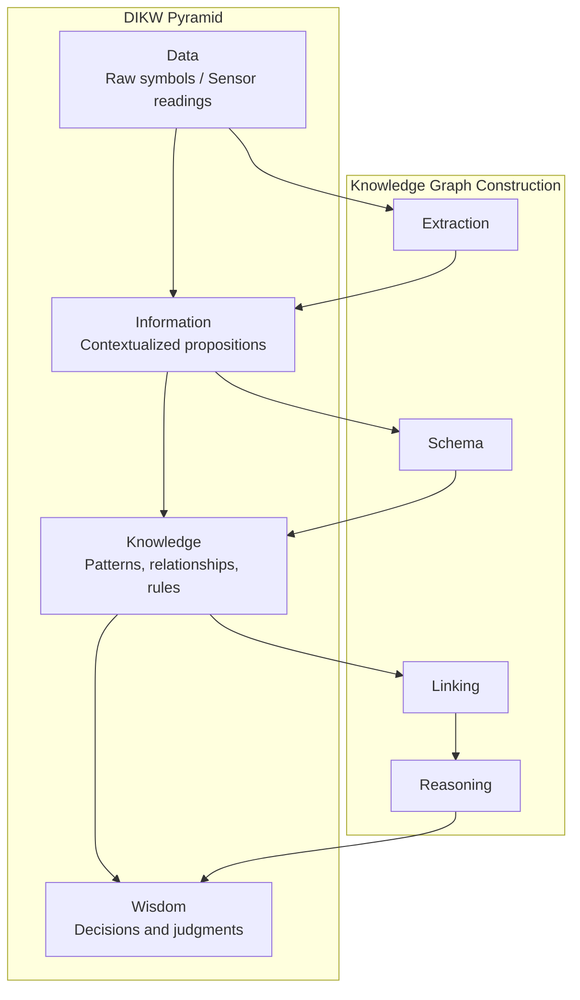

From an information theory perspective, each level of the DIKW pyramid corresponds to a reduction in entropy. Raw data has the highest entropy due to a lack of context; information reduces uncertainty through metadata; knowledge further compresses representation through patterns; and wisdom represents optimal decision-making under constraints. The value of knowledge graphs lies in solidifying "information" into "knowledge" and supporting automated reasoning from knowledge to wisdom through graph structures and logical rules.

The historical evolution of knowledge representation methods can be summarized in the following diagram:

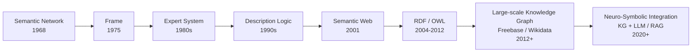

### 2.1.5 Summary

Traditional knowledge organization methods have significant shortcomings in terms of structure, association, traceability, and updatability. Knowledge graphs, through graph structures, unified schemas, and source verification, provide an engineered approach to knowledge management for complex domains. Their theoretical foundations include information theory, propositional logic, first-order logic, description logic, semantic networks, frames, and ontology.

## 2.2 Information Model

The information model adopted in this book can be summarized as the "**Entity-Relationship-Source-Verification**" quadruple. The following sections explain each component.

### 2.2.1 Entity Model

Each entity is represented by a Markdown file. The file's frontmatter uses YAML format and contains the following core fields:

```yaml
---
id: ent_robot_unitree_h1_humanoid_robot_2024
type: robot_system
title: Unitree H1 Humanoid Robot
domain: 11_applications_markets
theoretical_depth: system
aliases:
  - Unitree H1
  - 宇树 H1
status: active
created_at: 2024-01-15T00:00:00Z
updated_at: 2026-06-30T00:00:00Z
sources:
  - id: unitree_official_h1
    type: website
    title: Unitree H1 Official Page
    url: https://www.unitree.com/products/h1
verification:
  reviewed_by: human_and_ai
  reviewed_at: 2026-06-30T00:00:00Z
---
```

!!! note "Term Explanation: Frontmatter"
    Frontmatter is a metadata block at the top of a Markdown file, typically enclosed by `---` and written in YAML format. It allows authors to attach structured attributes to a document without altering the main content. From a technical perspective, Frontmatter serves as a lightweight metadata layer, bridging plain text and database records.

!!! note "Term Explanation: YAML"
    YAML (YAML Ain't Markup Language) is a human-readable data serialization format commonly used for configuration files and metadata. It supports structures such as scalars, lists, and dictionaries, with syntax using indentation to indicate hierarchy. YAML is equivalent to JSON in expressive power but is more convenient for human reading and editing.

**Entity Field Description:**

| Field | Type | Required | Description |
|-------|------|----------|-------------|
| `id` | String | Yes | Unique entity identifier, all lowercase, containing only letters, numbers, and underscores |
| `type` | Enum | Yes | Entity type, e.g., `paper`, `method`, `component`, `company` |
| `title` | String | Yes | Entity title |
| `domain` | Enum | Yes | Domain code, e.g., `02_components`, `07_ai_models_algorithms` |
| `theoretical_depth` | Enum | Yes | Theoretical depth: `foundation`, `principle`, `formalism`, `method`, `system` |
| `aliases` | List | No | Aliases for search and disambiguation |
| `status` | Enum | Yes | Status: `active`, `staged`, `rejected`, `deprecated` |
| `sources` | List | Yes | Source information |
| `verification` | Object | Yes | Review information |

### 2.2.2 Entity Types

The entity types in this book cover the entire humanoid robot industry chain. The main types include:

| Entity Type | English | Example | Description |
|-------------|---------|---------|-------------|
| Paper | `paper` | Diffusion Policy, GR00T N1 | Academic paper or preprint |
| Method | `method` | Action Chunking, MPC | Research method or technical approach |
| Algorithm | `algorithm` | PPO, SAC, QP | Specific algorithm |
| Dataset | `dataset` | Open X-Embodiment, DROID | Training or evaluation dataset |
| Software Platform | `software_platform` | ROS 2, Isaac Sim, MuJoCo | Software or platform |
| Technology | `technology` | URDF, EtherCAT, VLA | Technical concept or framework |
| Component | `component` | Harmonic reducer, Frameless torque motor | Hardware component |
| Robot System | `robot_system` | Tesla Optimus, Unitree H1 | Complete robot product |
| Company | `company` | Tesla, Figure AI, Unitree | Enterprise or institution |
| Component Manufacturer | `component_manufacturer` | Harmonic Drive Systems | Manufacturer specializing in components |
| Tier 1 Supplier | `tier1_supplier` | Sanhua Intelligent Controls | Supplier directly to OEMs |
| OEM | `oem` | Tesla, UBTECH | Original equipment manufacturer |
| Standard | `standard` | ISO 13482, IEC 61508 | Standard or regulation |
| Material | `material` | NdFeB magnet, Aluminum-magnesium alloy | Raw material or material |
| Application | `application` | Automotive manufacturing, Logistics warehousing | Application scenario |
| Market | `market` | Industrial humanoid robot market | Market or segment |
| Concept | `concept` | Systems engineering, Uncanny valley | Abstract concept |
| Principle | `principle` | Dynamics, Control theory | Fundamental principle |
| Formalism | `formalism` | Euler-Lagrange equation, QP | Mathematical or computational form |
| Benchmark | `benchmark` | Human-Level Actuation Score | Evaluation benchmark |
| Equipment | `equipment` | System integration test bench | Equipment or tool |

#### 2.2.2.1 Ontological Commitment and Taxonomy of Entity Types

!!! note "Term Explanation: Taxonomy"
    Taxonomy is the discipline of systematically classifying domain concepts. In ontology engineering, taxonomy is typically represented as a directed acyclic graph (DAG) composed of `rdfs:subClassOf` relationships. Formally, if class $C_1$ is a subclass of class $C_2$, then $C_1 \preceq C_2$. This partial order satisfies reflexivity, antisymmetry, and transitivity, allowing each entity to be placed along an inheritance chain from abstract to concrete.

The entity types in Table 2.2 are not listed arbitrarily but correspond to a continuous spectrum of humanoid robot knowledge from "abstract concepts" to "physical products." We can abstract them into three major ontological commitments:

1. **Physical Entity**: Objects that occupy space-time, have mass, and energy, e.g., `component`, `robot_system`, `material`, `company`.
2. **Information Entity**: Objects existing as symbols or data, e.g., `paper`, `method`, `algorithm`, `dataset`, `standard`.
3. **Process & State**: Entities describing events, capabilities, or market states, e.g., `application`, `market`, `technology`, `benchmark`.

In formal language, we can define a partially ordered set of entity types $(\mathcal{T}, \preceq)$, where $\mathcal{T}$ is the set of types and $\preceq$ is the subclass relationship. For any entity $e$, its most specific type is $type(e) \in \mathcal{T}$, and its instantiated class hierarchy can be expressed as:

$$\mathcal{A}(e) = \{ t \in \mathcal{T} \mid type(e) \preceq t \}$$

For example, a `frameless_motor` entity satisfies:

$$\mathcal{A}(e) = \{ \text{frameless\_motor}, \text{component}, \text{physical\_entity}, \text{entity} \}$$

This classification structure has two direct engineering values: first, it supports **inheritance reasoning**—if the ontology specifies that `component` must have a `mass` attribute, then all `frameless_motor` entities automatically inherit this constraint; second, it supports **cross-level queries**—querying all `physical_entity` returns components, robots, materials, etc., in one go.

!!! note "Term Explanation: Directed Acyclic Graph (DAG)"
    A directed acyclic graph is a graph where edges have direction and contain no directed cycles. Formally, a graph $G=(V,E)$ is a directed acyclic graph if and only if there is no vertex sequence $v_1, v_2, \dots, v_k$ such that $(v_i, v_{i+1}) \in E$ and $v_k=v_1$. The class hierarchy of an ontology must be a DAG; otherwise, a logical contradiction like "$A$ is a subclass of $B$ and $B$ is a subclass of $A$" would arise.

#### 2.2.2.2 Entity Types and Chapter Mapping

The design of entity types directly serves the chapter divisions of this book. Table 2.3 provides the index relationship between main entity types and corresponding chapters, facilitating readers' navigation between the knowledge graph and the main text.

| Entity Type | Main Corresponding Chapter | Description |
|------------|---------------------------|-------------|
| `material` | Chapter 3 | Rare earth permanent magnets, structural materials, battery materials, semiconductor materials |
| `component` | Chapters 4, 5, 6 | Actuators, sensors, computing/power/thermal management hardware |
| `robot_system` | Chapters 8, 9 | Whole-machine design principles and key subsystems |
| `method` / `algorithm` / `software_platform` | Chapter 7 and subsequent AI chapters | Control, perception, decision algorithms and middleware |
| `company` / `tier1_supplier` / `oem` | Chapter 7 | Supplier map and supply chain governance |
| `standard` / `policy` | Chapter 12 | Policies, regulations, and ethics |

The following Python example demonstrates how to use `networkx` to build a subclass DAG of entity types and compute the ancestor set for each type:

```python
import networkx as nx

G = nx.DiGraph()
# Type hierarchy (illustrative)
edges = [
    ("entity", "physical_entity"),
    ("entity", "information_entity"),
    ("physical_entity", "component"),
    ("physical_entity", "robot_system"),
    ("physical_entity", "material"),
    ("information_entity", "paper"),
    ("information_entity", "method"),
    ("information_entity", "algorithm"),
]
G.add_edges_from(edges)

# Compute the ancestor set for each type (including itself)
for t in G.nodes():
    ancestors = nx.ancestors(G, t) | {t}
    print(f"{t}: {sorted(ancestors)}")
```

Explanation of the output: The ancestor set of `component` is `['component', 'entity', 'physical_entity']`, meaning that attribute constraints on this type aggregate upward and inherit downward along the DAG.

!!! note "Terminology Explanation: Inheritance Reasoning"
    Inheritance reasoning refers to the reasoning process by which subclasses automatically acquire the attributes and constraints of their parent classes. In description logic, if $\text{Component} \sqsubseteq \text{PhysicalEntity}$ and $\text{PhysicalEntity} \sqsubseteq \exists \text{hasMass}$, then it can be inferred that $\text{Component} \sqsubseteq \exists \text{hasMass}$. This is a core mechanism in ontology engineering to avoid redundant modeling and ensure consistency.

### 2.2.3 Relationship Model

Relationships are also represented using Markdown files, with the frontmatter containing the source entity, target entity, relationship type, source, and verification information.

```yaml
---
id: rel_ent_component_harmonic_reducer_2024_is_part_of_ent_component_rotary_actuator_2024
source_id: ent_component_harmonic_reducer_2024
target_id: ent_component_rotary_actuator_2024
type: is_part_of
strength: strong
direction: directed
status: active
sources:
  - id: curated_workflow_relationship
    type: website
    title: Humanoid Robot Workflow Relationship Curation
verification:
  reviewed_by: ai_autonomous
  reviewed_at: 2026-07-01T00:00:00Z
---
```

**Relationship Field Description:**

| Field | Type | Required | Description |
|-------|------|----------|-------------|
| `id` | String | Yes | Unique identifier for the relationship |
| `source_id` | String | Yes | Source entity ID |
| `target_id` | String | Yes | Target entity ID |
| `type` | Enum | Yes | Relationship type |
| `strength` | Enum | No | Relationship strength: `strong`, `moderate`, `weak` |
| `direction` | Enum | Yes | Direction: `directed`, `bidirectional` |
| `status` | Enum | Yes | Status |
| `sources` | List | Yes | Source information |
| `verification` | Object | Yes | Review information |

### 2.2.4 Relationship Types

The relationship types defined in this book cover technical dependencies, composition relationships, manufacturing relationships, application scenarios, and regulatory relationships, among others.

| Relationship Type | Meaning | Example |
|------------------|---------|---------|
| `is_part_of` | Source is a component of target | Harmonic reducer → Rotary actuator |
| `uses` | Source uses target | VLA model → Dataset |
| `requires` | Source depends on target | MPC → IMU |
| `implemented_on` | Method/algorithm deployed on target | Diffusion Policy → Unitree H1 |
| `manufactures` | Source manufactures target | Harmonic Drive Systems → Harmonic reducer |
| `supplies` | Source supplies target | Tuopu Group → Tesla |
| `sources_from` | Source procures from target | Tesla → Tuopu Group |
| `applies_to` | Source applies to target | ISO 13482 → Service robot |
| `regulates` | Source regulates/constrains target | IEC 61508 → Control system |
| `tested_with` | Source tested with target | Robot → HIL test bench |
| `validates_on` | Source validates on target | Test bench → Robot |
| `analyzes` | Source analyzes target | FEA → Mechanical structure |
| `models` | Source models target | URDF → Robot |
| `manages` | Source manages target | Fleet platform → Robot |
| `deployed_at` | Source deployed in target scenario | Figure 02 → BMW Spartanburg |
| `competes_with` | Source competes with target | Tesla → Figure AI |
| `partners_with` | Source partners with target | BMW → Figure AI |

### 2.2.5 Source and Verification Model

Every entity and relationship must have source and verification information.

**Source Types:**

| Type | Description | Example |
|------|-------------|---------|
| `primary` | First-hand source, e.g., original paper, company website | arXiv paper, Unitree official website |
| `secondary` | Secondary analysis, e.g., review, report | Goldman Sachs report |
| `press_release` | Press release | Company funding announcement |
| `patent` | Patent document | Actuator structure patent |
| `report` | Research report | Counterpoint Research |
| `paper` | Academic paper | Conference on Robot Learning |
| `annual_report` | Annual report | Tesla 10-K |
| `website` | Website | Technical blog, encyclopedia |
| `interview` | Interview | CEO interview |
| `other` | Other | Internally compiled materials |

**Verification Fields:**

| Field | Type | Description |
|-------|------|-------------|
| `reviewed_by` | Enum | `human`, `ai`, `ai_autonomous`, `human_and_ai` |
| `reviewed_at` | Timestamp | Review time |
| `review_notes` | String | Review notes |

The relationship of the information model quadruple can be represented by the following diagram:

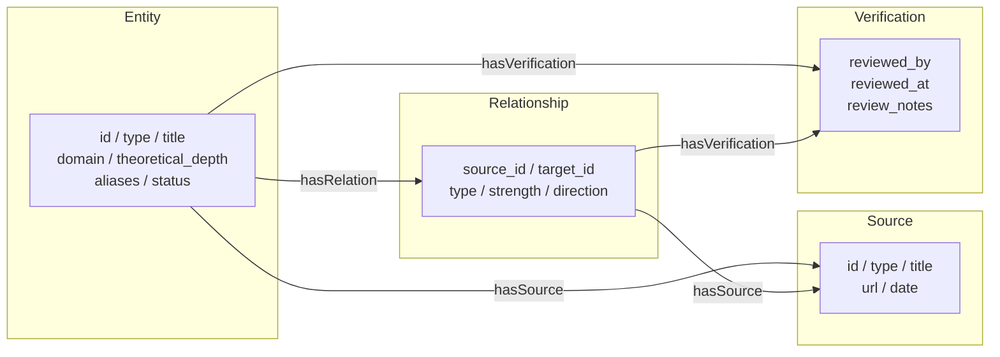

### 2.2.6 Graph Theory Foundations of Knowledge Graphs

The underlying data structure of a knowledge graph is a graph. Understanding graph theory foundations is crucial for designing schemas, evaluating quality, and selecting storage and query methods.

!!! note "Term Explanation: Directed Graph"
    A directed graph is a graph where edges have direction, denoted as $G=(V,E)$, where $E$ is a set of ordered vertex pairs, $E \subseteq V \times V$. In a knowledge graph, a triple $(s,p,o)$ is an edge in a directed graph, with direction from subject $s$ to object $o$.

!!! note "Term Explanation: Triple"
    A triple is the basic data unit of a knowledge graph, in the form $(subject, predicate, object)$, abbreviated as $(s,p,o)$. For example:
    $$(\text{Unitree H1}, \text{uses}, \text{harmonic reducer})$$
    Triples correspond to atomic formulas $P(s,o)$ in first-order logic and are the common foundation of RDF, SPARQL, and description logic.

!!! note "Term Explanation: Labeled Property Graph (LPG)"
    A labeled property graph is a graph data model where both nodes and edges can have labels and properties. Graph databases like Neo4j adopt the LPG model. The main difference between LPG and RDF is that LPG allows edges to have properties, whereas in RDF, edges are predicates, and properties must be expressed through auxiliary nodes or reification.

!!! note "Term Explanation: Resource Description Framework (RDF)"
    RDF is a semantic web data model recommended by W3C, representing knowledge as a set of triples. In RDF, each resource has a Uniform Resource Identifier (URI), and predicates are also URIs. RDF emphasizes interoperability and formal semantics, serving as the data foundation for the SPARQL query language and OWL ontologies.

!!! note "Term Explanation: Degree"
    In an undirected graph, the degree $d(v)$ of a node is the number of edges connected to it. In a directed graph, it is divided into in-degree $d_{in}(v)$ (number of edges pointing to the node) and out-degree $d_{out}(v)$ (number of edges pointing from the node). The distribution of degrees is a fundamental indicator for structural analysis of knowledge graphs.

!!! note "Term Explanation: Path and Connected Component"
    A path is a sequence of nodes and edges from one node to another in a graph. A connected component is a maximal subgraph where any two nodes are connected by a path. In directed graphs, it is further divided into weakly connected components and strongly connected components. Paths and connectivity are the basis for graph traversal, querying, and reasoning.

!!! note "Term Explanation: Centrality"
    Centrality measures the importance of a node in a graph. Common types include:
    - **Degree Centrality**: $C_D(v) = \frac{d(v)}{|V|-1}$
    - **Betweenness Centrality**: $C_B(v) = \sum_{s \neq v \neq t} \frac{\sigma_{st}(v)}{\sigma_{st}}$, where $\sigma_{st}$ is the number of shortest paths from $s$ to $t$, and $\sigma_{st}(v)$ is the number of those paths passing through $v$.
    - **Closeness Centrality**: $C_C(v) = \frac{|V|-1}{\sum_{u \neq v} d(v,u)}$

!!! note "Term Explanation: PageRank"
    PageRank is a node importance measure based on random walks, originally used for web page ranking. Its iterative formula is:
    $$PR(v) = \frac{1-\alpha}{|V|} + \alpha \sum_{u \in N_{in}(v)} \frac{PR(u)}{d_{out}(u)}$$
    where $\alpha$ is the damping factor, typically set to 0.85. PageRank assumes that importance can propagate through edges and is useful for discovering core entities in a knowledge graph.

!!! note "Term Explanation: Clustering Coefficient"
    The clustering coefficient measures the degree to which neighbors of a node are interconnected. The local clustering coefficient is defined as:
    $$C(v) = \frac{2 \cdot |\{(u,w) \in E : u,w \in N(v)\}|}{d(v)(d(v)-1)}$$
    A high clustering coefficient indicates a tightly connected local community structure, which may correspond to technology clusters or supply chain clusters in a domain.

The following Mermaid diagram compares the LPG and RDF data models:

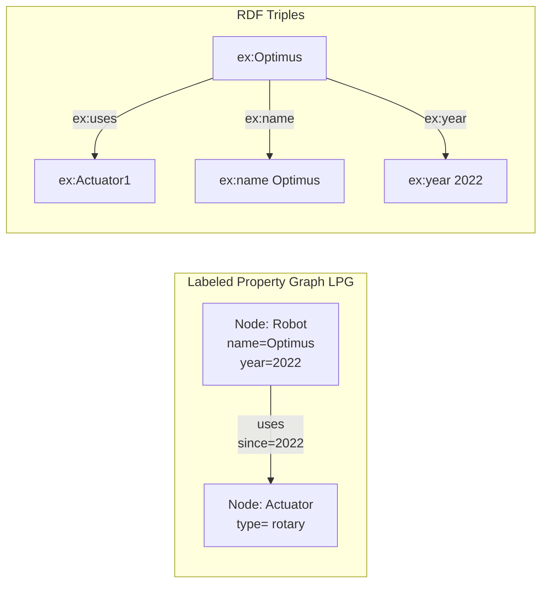

The following Python example demonstrates how to build a simple humanoid robot knowledge graph using `networkx` and compute degree, PageRank, and clustering coefficient.

```python
import networkx as nx

# Create a directed graph
G = nx.DiGraph()

# Add entity nodes
entities = [
    ("Optimus", {"type": "robot_system"}),
    ("Unitree H1", {"type": "robot_system"}),
    ("Harmonic Reducer", {"type": "component"}),
    ("Frameless Motor", {"type": "component"}),
    ("Rotary Actuator", {"type": "component"}),
    ("Tesla", {"type": "company"}),
    ("Harmonic Drive Systems", {"type": "company"}),
]
G.add_nodes_from(entities)
```

# Adding Relationship Edges
triples = [
    ("Optimus", "uses", "Harmonic Reducer"),
    ("Optimus", "uses", "Frameless Motor"),
    ("Unitree H1", "uses", "Harmonic Reducer"),
    ("Rotary Actuator", "is_part_of", "Optimus"),
    ("Rotary Actuator", "is_part_of", "Unitree H1"),
    ("Harmonic Reducer", "is_part_of", "Rotary Actuator"),
    ("Frameless Motor", "is_part_of", "Rotary Actuator"),
    ("Tesla", "manufactures", "Optimus"),
    ("Harmonic Drive Systems", "manufactures", "Harmonic Reducer"),
]
G.add_edges_from([(s, o, {"predicate": p}) for s, p, o in triples])

# Degree Analysis
print("In-degree:", dict(G.in_degree()))
print("Out-degree:", dict(G.out_degree()))

# PageRank
pr = nx.pagerank(G, alpha=0.85)
print("PageRank:", sorted(pr.items(), key=lambda x: -x[1]))

# Clustering coefficient requires an undirected graph
G_undirected = G.to_undirected()
cc = nx.clustering(G_undirected)
print("Clustering coefficient:", cc)
```

---

## 2.3 Hierarchical System and Theoretical Depth

### 2.3.1 Domain Hierarchy

To organize heterogeneous knowledge, this book divides the humanoid robotics field into 13 domains:

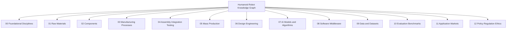

**Domain Description:**

| Code | Name | Coverage |
|------|------|---------|
| `00_foundations` | Foundational Disciplines | Mathematics, Physics, Chemistry, Computer Science Fundamentals |
| `01_raw_materials` | Raw Materials | Rare Earths, Magnetic Materials, Alloys, Battery Materials, Semiconductors |
| `02_components` | Components | Actuators, Reducers, Motors, Sensors, Computing Units |
| `03_manufacturing_processes` | Manufacturing Processes | Machining, Winding, Casting, Heat Treatment, DFM |
| `04_assembly_integration_testing` | Assembly Integration Testing | Assembly Lines, Test Benches, HIL, Calibration |
| `05_mass_production` | Mass Production | Capacity Ramp-up, BOM, Yield, Supply Chain |
| `06_design_engineering` | Design Engineering | Mechanical Design, Dynamics, URDF, FEA |
| `07_ai_models_algorithms` | AI Models and Algorithms | VLA, Imitation Learning, Reinforcement Learning, Control Algorithms |
| `08_software_middleware` | Software Middleware | ROS 2, Real-time Systems, Simulation Platforms, Fleet Management |
| `09_data_datasets` | Data and Datasets | Teleoperation Data, Public Datasets, Data Engineering |
| `10_evaluation_benchmarks` | Evaluation Benchmarks | Simulation Benchmarks, Real-world Task Benchmarks, Safety Benchmarks |
| `11_applications_markets` | Application Markets | Industrial Manufacturing, Logistics, Healthcare, Home, Markets |
| `12_policy_regulation_ethics` | Policy Regulation Ethics | Standards, Certification, Responsibility, Ethics, Social Impact |

### 2.3.2 Theoretical Depth

Each entity is also assigned a theoretical depth, reflecting its position in the knowledge hierarchy:

| Depth | Meaning | Example |
|------|------|------|
| `foundation` | Foundational Disciplines | Linear Algebra, Newtonian Mechanics, Materials Science |
| `principle` | Basic Principles | Control Theory, Machine Learning Principles |
| `formalism` | Formal Methods | Euler-Lagrange Equations, QP, Markov Decision Processes |
| `method` | Methods or Techniques | Diffusion Policy, MPC, URDF |
| `system` | Systems or Products | Tesla Optimus, ROS 2, Open X-Embodiment |

The role of theoretical depth is to identify the "roots" of knowledge. For example, when analyzing a robot system, one can trace upward to the methods, formalisms, principles, and foundational disciplines it depends on, forming a complete cognitive chain.

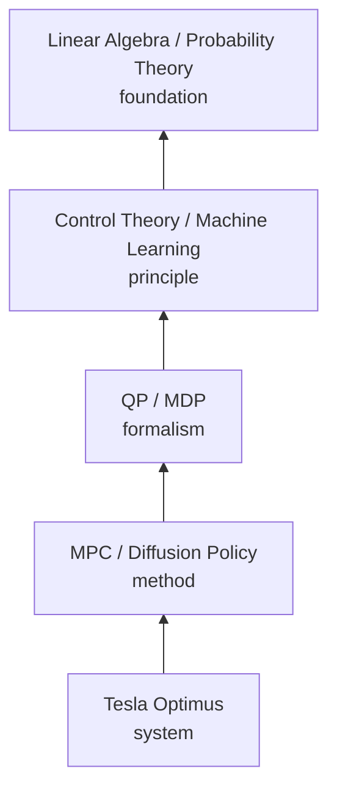

Domain hierarchy and theoretical depth together form a two-dimensional organizational framework: entities within the same domain progress from foundation to system according to theoretical depth, while different domains are connected through cross-layer relationships, forming a complete knowledge network.

### 2.3.3 Ontology Engineering Methods

Ontology engineering is the systematic process of designing and maintaining ontologies. In a complex field like humanoid robotics, ontology engineering helps unify terminology, clarify relationships, support reasoning, and share knowledge.

!!! note "Term Explanation: Upper Ontology / Top-level Ontology"
    An upper ontology is a cross-domain general conceptual framework, not specific to any particular discipline. Well-known upper ontologies include:
    - **BFO (Basic Formal Ontology)**: Emphasizes the distinction between continuants and occurrents, widely used in biomedicine.
    - **DOLCE (Descriptive Ontology for Linguistic and Cognitive Engineering)**: Describes entities from cognitive and linguistic perspectives, distinguishing physical objects, abstract objects, events, etc.
    - **SUMO (Suggested Upper Merged Ontology)**: Large in scale, covering philosophy, mathematics, time, space, etc., with mappings to WordNet.

!!! note "Term Explanation: Domain Ontology"
    A domain ontology is an ontology specific to a particular discipline or application scenario, e.g., "Humanoid Robot Ontology" or "Automotive Manufacturing Ontology." It inherits general concepts from the upper ontology and adds specialized terms, relationships, and constraints.

The design of a domain ontology typically follows this workflow:

1. **Requirements Analysis**: Clarify the usage scenarios and user questions for the ontology.
2. **Term Collection**: Extract key terms from literature, experts, and standards.
3. **Concept Hierarchization**: Establish a hierarchy of classes and subclasses.
4. **Attribute and Relationship Definition**: Define data properties (e.g., name, year) and object properties (e.g., uses, manufactures).
5. **Constraints and Axioms**: Add cardinality constraints, disjointness constraints, transitive closures, etc.
6. **Evaluation and Iteration**: Validate the ontology through use cases, queries, and expert review.

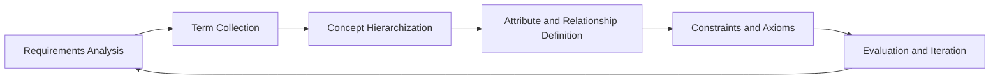

!!! note "Term Explanation: OOPS (OntOlogy Pitfall Scanner)"
    OOPS is an automated ontology defect detection tool that can identify common ontology design errors, such as "creating polymorphic instances," "confusing classes with instances," "undeclared equivalent relationships," "missing annotations," etc. OOPS detection results help ontology engineers improve the clarity and consistency of ontologies.

!!! note "Term Explanation: Ontology Matching and Schema Alignment"
    Ontology matching is the process of discovering semantic correspondences between two or more ontologies. Correspondences include equivalence, subsumption, relatedness, etc. Schema alignment is a similar problem in databases and knowledge graphs, aiming to map schemas from different sources to a unified view. Common techniques include methods based on string similarity, structural similarity, instance overlap, and embedding learning.

!!! note "Term Explanation: Interoperability"
    Interoperability refers to the ability of different systems, organizations, or datasets to effectively exchange and use information. Ontologies improve interoperability by providing shared vocabularies and formal semantics, reducing ambiguity during data integration.

Example application of ontology engineering in the humanoid robotics field:

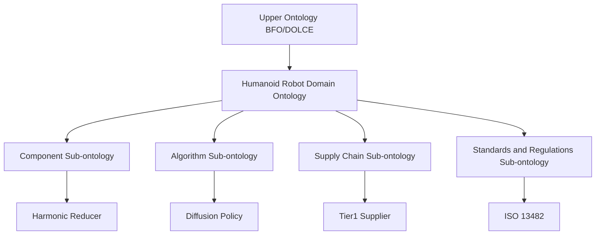

### 2.3.4 Formal Semantics and OWL

Formal semantics give knowledge graphs machine-interpretable meaning, enabling computers to automatically detect contradictions, derive implicit relationships, and answer complex queries.

!!! note "Term Explanation: RDF Triple"
    An RDF triple takes the form $(subject, predicate, object)$, where the subject and predicate are URIs, and the object can be a URI or a literal. For example:
    ```turtle
    ex:UnitreeH1 rdf:type ex:RobotSystem .
    ex:UnitreeH1 ex:uses ex:HarmonicReducer .
    ```
    RDF is the data layer standard of the Semantic Web, supporting interoperability between different data sources.

!!! note "Term Explanation: RDFS (RDF Schema)"
    RDFS is a vocabulary description language for RDF, supporting the definition of classes (rdfs:Class), properties (rdf:Property), subclass relationships (rdfs:subClassOf), subproperty relationships (rdfs:subPropertyOf), and domain/range (rdfs:domain / rdfs:range). RDFS provides lightweight reasoning capabilities.

!!! note "Term Explanation: OWL (Web Ontology Language)"
    OWL is a W3C-recommended ontology language based on description logic, offering stronger expressiveness than RDFS. OWL supports class expressions, property constraints, individual assertions, and complex reasoning tasks. OWL 2 is its latest version, adding more constructors and profiles to balance expressiveness and computational complexity.

The core constructs of OWL include:

| Construct | Meaning | Example |
|-----------|---------|---------|
| `owl:Class` | Class | `RobotSystem` is a class |
| `owl:ObjectProperty` | Object property, connecting two individuals | `uses` connects a robot and a component |
| `owl:DatatypeProperty` | Datatype property, connecting an individual and a literal | `hasYear` connects a robot and a year |
| `rdfs:subClassOf` | Subclass relationship | `HumanoidRobot` is a subclass of `RobotSystem` |
| `owl:inverseOf` | Inverse property | `manufactures` is the inverse of `manufacturedBy` |
| `owl:TransitiveProperty` | Transitive property | `isPartOf` is transitive |
| `owl:FunctionalProperty` | Functional property | Each robot has a unique serial number |
| `owl:Restriction` | Restriction | Each robot has at least one actuator |

The following Turtle example shows a fragment of a humanoid robot materials ontology:

```turtle
@prefix ex: <http://example.org/humanoid-robot#> .
@prefix rdfs: <http://www.w3.org/2000/01/rdf-schema#> .
@prefix owl: <http://www.w3.org/2002/07/owl#> .
@prefix xsd: <http://www.w3.org/2001/XMLSchema#> .

ex:RobotSystem a owl:Class .
ex:Component a owl:Class .
ex:Material a owl:Class .

ex:HumanoidRobot rdfs:subClassOf ex:RobotSystem .
ex:Actuator rdfs:subClassOf ex:Component .
ex:MagnetMaterial rdfs:subClassOf ex:Material .

ex:uses a owl:ObjectProperty ;
    rdfs:domain ex:RobotSystem ;
    rdfs:range ex:Component .

ex:isPartOf a owl:ObjectProperty ;
    a owl:TransitiveProperty ;
    rdfs:domain ex:Component ;
    rdfs:range ex:Component .

ex:isMadeOf a owl:ObjectProperty ;
    rdfs:domain ex:Component ;
    rdfs:range ex:Material .

ex:NeodymiumMagnet a ex:MagnetMaterial .
ex:FramelessMotor a ex:Actuator .
ex:Optimus a ex:HumanoidRobot .

ex:FramelessMotor ex:isMadeOf ex:NeodymiumMagnet .
ex:Optimus ex:uses ex:FramelessMotor .
```

Based on the above ontology, an OWL reasoner can deduce:

- Because `HumanoidRobot rdfs:subClassOf RobotSystem`, `Optimus` is also a `RobotSystem`.
- Because `isPartOf` is transitive, if "a reducer is part of an actuator" and "an actuator is part of a robot", then it can be deduced that "the reducer is part of the robot".
- Because the domain of `uses` is `RobotSystem`, it can be inferred that the subject using `FramelessMotor` is a robot system.

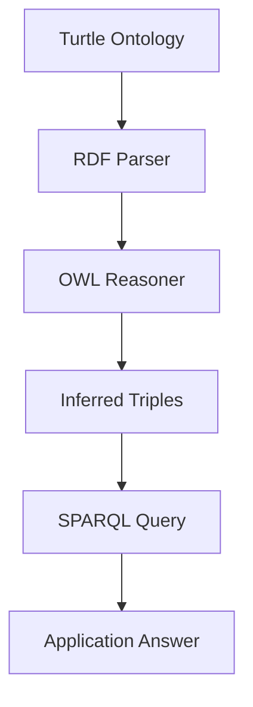

Through class hierarchies, property definitions, and constraint expressions, OWL enables knowledge graphs not only to record facts but also to support automated reasoning and consistency checking.

---

## 2.4 Cross-Layer Relationship Design

### 2.4.1 Why Cross-Layer Relationships Are Needed

The core challenge of humanoid robots lies in the strong coupling between different layers. For example:

- The performance of an AI algorithm (Layer 7) depends on the dataset (Layer 9) and computing hardware (Layer 2).
- A robot system (Layer 11) is composed of components (Layer 2), which are made from materials (Layer 1).
- A manufacturing method (Layer 3) affects design choices (Layer 6), which in turn impacts the overall cost (Layer 5).

Cross-layer relationships connect these scattered entities, forming analyzable industry chain links.

### 2.4.2 Typical Cross-Layer Chains

The following are several typical cross-layer chains in the humanoid robot domain:

**Chain 1: From Data to Robot**
```
Teleoperation System → Dataset → VLA Model → Edge Computing Platform → Robot System
```

**Chain 2: From Material to Market**
```
Rare Earth Material → Permanent Magnet → Frameless Torque Motor → Actuator → Robot → Industrial Application → Market Size
```

**Chain 3: From Design to Certification**
```
Safety Principle → Functional Safety Standard → Safety Design → Emergency Stop System → Robot → CR/CE Certification
```

**Chain 4: From Software to Deployment**
```
ROS 2 Middleware → Motion Planning Library → Control Algorithm → Simulation Platform → sim-to-real → Factory Deployment
```

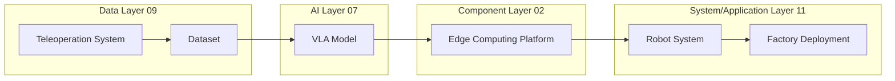

#### 2.4.2.1 Weighted Paths and Dependency Strength in Cross-Layer Chains

Section 2.4.2 summarizes four typical chains in text, but these chains often have different **dependency strengths** and **confidence levels** in an actual knowledge graph. To support supply chain risk assessment and technology dependency analysis, we model cross-layer chains as weighted directed graphs. For each relationship $(u,v)$, two numerical attributes are assigned:

- **Relationship Strength** $w(u,v) \in [0,1]$: Reflects the degree of dependency of the source entity on the target entity or the certainty of the fact. $1$ indicates a strong dependency (e.g., "a reducer is an essential component of an actuator"), and $0$ indicates a weak association.
- **Source Confidence** $c(u,v) \in [0,1]$: Reflects the reliability of the source supporting the relationship. Academic papers and official documents are generally more reliable than news reports.

The **comprehensive dependency score** of a cross-layer path $P = (e_0, e_1, \dots, e_k)$ can be defined as the product of strengths along the edges:

$$S(P) = \prod_{i=1}^{k} w(e_{i-1}, e_i)$$

The physical meaning of this formula is that dependency relationships have **transmission attenuation** characteristics. If any link in a chain has a weak dependency, the effective dependency of the entire chain decreases rapidly. For example, if the strength of each edge from Material → Magnet → Motor → Actuator → Robot → Market is $0.9$, then the dependency score for a six-node, five-edge path is:

$$S(P) = 0.9^5 \approx 0.5905$$

This means that even if each local relationship is quite certain, the entire macro chain "from rare earth to market" still has about $41\%$ semantic attenuation. This phenomenon is similar to the "bullwhip effect" in supply chains: local uncertainties are amplified along the chain.

!!! note "Term Explanation: Bullwhip Effect"
    The bullwhip effect is a term in supply chain management, referring to the phenomenon where small fluctuations in demand are amplified as they move upstream along the supply chain. Its mathematical essence is a delay system with positive feedback: if each level adjusts inventory based on downstream orders and superimposes forecast errors, the variance of upstream orders will be significantly greater than the actual demand variance. In knowledge graphs, the multiplicative attenuation of relationship confidence can be seen as a semantic mapping of this effect.

#### 2.4.2.2 Probabilistic Propagation of Path Reliability

If $c(u,v)$ is interpreted as the probability that the relationship is true, and assuming each relationship is independent, then the probability that all relationships on a path are simultaneously true is:

$$R(P) = \prod_{i=1}^{k} c(e_{i-1}, e_i)$$

This is the **series system reliability** formula: failure of any link on the path will break the entire path. If a node has multiple parallel paths, the reachable reliability of that node to an upstream node can be calculated using the parallel system formula:

$$R_{\text{parallel}} = 1 - \prod_{j=1}^{m} (1 - R(P_j))$$

where $P_j$ is the $j$-th parallel path. This formula shows that even if a single path has low reliability, multiple independent paths can significantly improve overall reachable reliability.

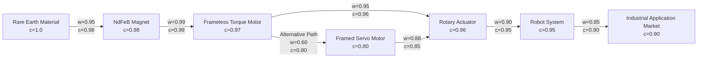

Taking the diagram as an example, the reliability of the main path $A \to B \to C \to D \to E \to F$ is:

$$R_{\text{main}} = 0.98 \times 0.99 \times 0.96 \times 0.95 \times 0.90 \approx 0.797$$

And the parallel path via the alternative motor $G$ is:

$$R_{A \to C \to D} = 0.98 \times 0.96 \approx 0.941$$
$$R_{A \to G \to D} = 0.80 \times 0.85 \approx 0.680$$
$$R_{\text{parallel}}(A \to D) = 1 - (1-0.941)(1-0.680) \approx 0.981$$

It can be seen that introducing an alternative path with moderate confidence can increase the reliability of the path from magnet to actuator from $94.1\%$ to $98.1\%$. This calculation has direct reference significance for supply chain diversification decisions (see Chapter 7 for details).

The following Python example implements the calculation of weighted path scores and parallel path reliability:

```python
import itertools

edges = {
    ("A","B"): (0.95, 0.98),
    ("B","C"): (0.99, 0.99),
    ("C","D"): (0.95, 0.96),
    ("D","E"): (0.90, 0.95),
    ("E","F"): (0.85, 0.90),
    ("C","G"): (0.60, 0.80),
    ("G","D"): (0.88, 0.85),
}

def path_score(path, use="strength"):
    idx = 0 if use == "strength" else 1
    s = 1.0
    for u, v in zip(path, path[1:]):
        s *= edges[(u, v)][idx]
    return s

main = ["A","B","C","D","E","F"]
print(f"Main path dependency score: {path_score(main):.4f}")
print(f"Main path reliability: {path_score(main, 'confidence'):.4f}")

# Parallel paths from A to D
paths_A_D = [["A","B","C","D"], ["A","B","C","G","D"]]
rels = [path_score(p, "confidence") for p in paths_A_D]
parallel = 1.0
for r in rels:
    parallel *= (1 - r)
parallel = 1 - parallel
print(f"A->D parallel reliability: {parallel:.4f}")
```

!!! note "Term Explanation: Series System Reliability"
    In reliability engineering, if a system consists of $n$ units connected in series, and the failures of each unit are independent, the system reliability is the product of the reliability of each unit: $R_s = \prod_{i=1}^{n} R_i$. This model requires that the failure of any unit leads to system failure, and is applicable to critical path analysis without redundancy.

### 2.4.3 Verification Standards for Cross-Layer Relationships

Cross-layer relationships are more difficult to verify than ordinary relationships because they involve knowledge from different domains. This book adopts the following standards:

| Standard | Description |
|----------|-------------|
| **Clear Source** | Relationships must be supported by public sources, such as papers, official documents, or authoritative reports |
| **Logical Reasonableness** | Relationships should conform to technical or business logic and not be far-fetched |
| **Falsifiability** | Relationships should be specific enough to verify or refute, avoiding vague expressions |
| **Appropriate Granularity** | Neither too general (e.g., "AI used in robots") nor too detailed |

### 2.4.4 Path Query and Graph Traversal

Cross-layer relationships essentially involve finding paths in a graph. Path query and graph traversal are core capabilities of knowledge graph querying.

!!! note "Term Explanation: Path Query"
    A path query is the process of finding paths in a graph that satisfy a specific pattern. For example, a path from "rare earth materials" to "market size," or a dependency chain from "algorithm" to "hardware." Path queries can be formalized using Regular Path Queries (RPQ), where the pattern is defined by a regular expression, such as `uses · is_part_of*`.

!!! note "Term Explanation: Graph Traversal"
    Graph traversal is the process of visiting nodes in a graph according to a certain strategy. Common strategies include Depth-First Search (DFS), Breadth-First Search (BFS), and Bidirectional Search. Graph traversal is the foundation of many graph algorithms (shortest path, connected components, centrality).

Path queries can be described using a formal language. Let the set of relations be $\Sigma$, and the path pattern be a regular expression over $r$. Then a path query takes the form:
$$Q(x,y) :- x \xrightarrow{r} y$$
where $r$ can be an atomic relation $p$, a concatenation $r_1 \cdot r_2$, a choice $r_1 | r_2$, or a Kleene star $r^*$.

For example, the query "all robots using harmonic reducers" can be expressed as:
$$Q(robot) :- robot \xrightarrow{uses \cdot is\_part\_of^*} reducer$$
where $reducer$ is bound to "harmonic reducer."

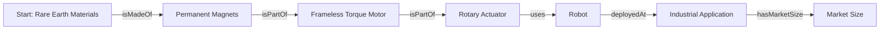

The choice of graph traversal algorithm depends on the query objective:

| Objective | Algorithm | Time Complexity |
|-----------|-----------|-----------------|
| Reachability between two nodes | DFS / BFS | $O(|V|+|E|)$ |
| Shortest path | Dijkstra / BFS (unweighted graph) | $O(|V|+|E|)$ to $O(|E| \log |V|)$ |
| All shortest paths | Floyd-Warshall | $O(|V|^3)$ |
| Connected components | Union-Find / BFS | $O(|V|+|E|)$ |
| Centrality | Brandes algorithm (betweenness) | $O(|V||E|)$ |

---

## 2.5 Data Ingestion Pipeline

### 2.5.1 Overall Architecture

The data ingestion pipeline for the knowledge graph in this book adopts an architecture of "Source → Adapter → Deduplication → Write → Validation":

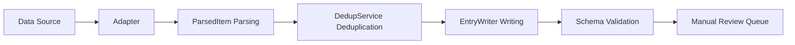

### 2.5.2 Data Sources

The current data sources for the knowledge graph include:

| Source | Type | Content | Update Frequency |
|--------|------|---------|-----------------|
| `arxiv_ro_rss` | RSS | Robotics arXiv Papers | Daily |
| `humanoid_paper_notebooks_progress` | Dataset | Humanoid Robot Paper Tracking | Daily |
| `robotics_tomorrow_rss` | RSS | Robotics News | Daily |
| `ieee_spectrum_robotics_rss` | RSS | IEEE Spectrum Robotics News | Daily |
| `unitree_news` | RSS | Unitree Technology News | Daily |
| `nvidia_robotics_blog` | RSS | NVIDIA Robotics Blog | Daily |
| `humanoid_actuators_suppliers` | Manually Curated JSON | Actuator/Supplier Entities | On Demand |
| `humanoid_workflow_entities` | Manually Curated JSON | Workflow-Related Entities | On Demand |
| `humanoid_manufacturing_systems` | Manually Curated JSON | Manufacturing/System Entities | On Demand |

### 2.5.3 Adapter

Each source corresponds to an adapter responsible for converting raw data into a unified `ParsedItem` format. The adapter shields the differences in data formats from various sources, allowing subsequent processing to be unified.

Main responsibilities of the adapter:
- Fetch or read raw data
- Extract metadata such as title, abstract, author, date, URL
- Generate entity IDs and initial attributes
- Return a standardized list of `ParsedItem`

### 2.5.4 Deduplication (Dedup)

The deduplication service checks whether an entity already exists before writing, avoiding duplicate creation. Deduplication strategies include:

| Strategy | Description |
|----------|-------------|
| ID Matching | Direct matching via normalized ID |
| Title Similarity | Compare after cleaning and normalizing titles |
| URL Matching | Deduplicate URLs from the same source |
| Abstract Similarity | Use text similarity algorithms to identify approximate entries |

### 2.5.5 Writing and Validation

`EntryWriter` is responsible for writing new entities and relationships to the file system. To improve performance, the writer preloads existing IDs to avoid scanning a large number of files on each write.

After writing, `validate_entries.py` performs Schema validation on all entity and relationship files, checking required fields, enumerated values, formats, etc., for compliance. Only after passing validation can entries enter the manual review queue or be directly deployed to the production environment.

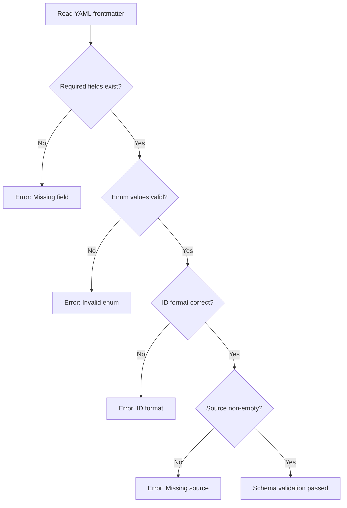

#### 2.5.5.1 Pipeline Throughput and Latency: A Queuing Theory Perspective

Section 2.5.1 presents the logical stages of the ingestion pipeline. However, to assess its engineering feasibility, it is necessary to quantify **throughput** and **latency**. By abstracting each processing stage as a service node and each pending `ParsedItem` as a customer, the entire pipeline can be modeled using queuing theory.

!!! note "Term Explanation: Queuing Theory"
    Queuing theory is a branch of mathematics that studies the interaction between random arrival processes and service processes. It is widely applied in communication networks, computer systems, and manufacturing. The basic M/M/1 queue assumes: customer arrivals follow a Poisson process (arrival rate $\lambda$), service times follow an exponential distribution (service rate $\mu$), and a single server. When the system reaches a steady state and $\rho = \lambda / \mu < 1$, the average queue length and average waiting time are:
    $$L = \frac{\rho}{1-\rho}, \quad W = \frac{1}{\mu - \lambda}$$
    where $\rho$ is called **utilization**. If $\rho \to 1$, the queue length and waiting time diverge, and the system enters an unstable state.

Assume a source generates $\lambda = 100\ \text{items/hour}$ of new entries per day, and the combined processing capacity of the adapter-deduplication-write-validation stages is $\mu = 150\ \text{items/hour}$. Then:

$$\rho = \frac{100}{150} = 0.667$$

The average queue length at steady state:

$$L = \frac{0.667}{1-0.667} \approx 2.0\ \text{items}$$

The average waiting time (including service time):

$$W = \frac{1}{150-100} = 0.02\ \text{hours} = 72\ \text{seconds}$$

This means that, on average, it takes about 72 seconds for an entry to go from entering the staging area to completing writing and validation; typically only about 2 items are waiting in the staging area. If the source suddenly increases to $\lambda = 140\ \text{items/hour}$, then $\rho = 0.933$, and $W$ rises to $900$ seconds (15 minutes), indicating that the system is very sensitive to the arrival rate. In engineering, a **backpressure** mechanism or horizontal scaling of write nodes should be implemented to keep $\rho$ below approximately $0.7$.

!!! note "Term Explanation: Backpressure"
    Backpressure is a flow control mechanism in stream processing systems: when the downstream processing speed is slower than the upstream generation speed, a backpressure signal is propagated downstream, causing the upstream to reduce its sending rate. Its essence is negative feedback from control theory, used to prevent unbounded buffer growth. Backpressure can be implemented using token buckets, sliding windows, or backpressure queues.

#### 2.5.5.2 Formal Model of Schema Validation

The validation process in Section 2.5.5 can be further formalized as a **Constraint Satisfaction Problem (CSP)**. For each entity or relationship file, define a set of variables $X = \{x_1, x_2, \dots, x_n\}$, where $x_i$ corresponds to a field in the frontmatter. The Schema for each field defines a constraint $C_i$, for example:

- $C_{\text{id}}$: `id` must match the regular expression `^[a-z0-9_]+$`.
- $C_{\text{type}}$: `type` must belong to the enumerated set $\mathcal{T}$.
- $C_{\text{sources}}$: `sources` is non-empty, i.e., $|sources| \ge 1$.

An entity file is **valid** if and only if all its variables simultaneously satisfy the corresponding constraints:

$$\text{Valid}(X) = \bigwedge_{i=1}^{n} C_i(x_i)$$

If any constraint is not satisfied, validation fails. This model is homologous to integrity constraints in databases and type systems in programming languages, but its expressive power is weaker than OWL, making it more suitable as a lightweight entry-level check.

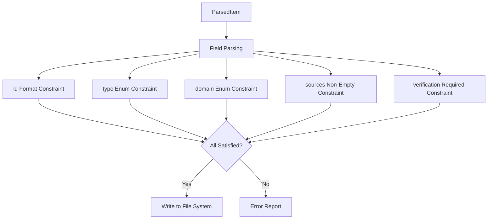

The following Python example simulates the validation process using a simple CSP approach and counts the frequency of various errors:

```python
import re
from collections import Counter
```

```python
entities = [
    {"id": "ent_robot_optimus", "type": "robot_system", "domain": "11", "sources": ["s1"]},
    {"id": "Ent_Invalid ID!", "type": "robot_system", "domain": "11", "sources": ["s1"]},
    {"id": "ent_component_motor", "type": "unknown_type", "domain": "02", "sources": []},
    {"id": "ent_paper_diffusion", "type": "paper", "domain": "07", "sources": ["s2"]},
]

valid_types = {"robot_system", "component", "paper", "method", "company"}
id_pattern = re.compile(r"^[a-z0-9_]+$")
valid_domains = {"00","01","02","03","04","05","06","07","08","09","10","11","12"}

errors = Counter()

def validate(e):
    ok = True
    if not id_pattern.match(e["id"]):
        errors["id_format"] += 1; ok = False
    if e["type"] not in valid_types:
        errors["type_enum"] += 1; ok = False
    if e["domain"] not in valid_domains:
        errors["domain_enum"] += 1; ok = False
    if len(e.get("sources", [])) == 0:
        errors["missing_source"] += 1; ok = False
    return ok

valid_count = sum(validate(e) for e in entities)
print(f"Valid: {valid_count}/{len(entities)}")
print("Error distribution:", dict(errors))
```

The output shows: the second entity violates `id_format`, and the third entity violates both `type_enum` and `missing_source`. This fine-grained error classification helps quickly locate issues in CI/CD reports.

!!! note "Term Explanation: Constraint Satisfaction Problem (CSP)"
    A CSP consists of a set of variables, a set of domains, and a set of constraints. The goal is to find an assignment of values to variables that satisfies all constraints. Formally, a CSP can be represented as a triple $(X, D, C)$, where $X$ is the set of variables, $D$ is the set of domains, and $C$ is the set of constraints. CSP is an NP-complete problem, but on finite, structured domains like frontmatter fields, validation can be completed in polynomial time.

### 2.5.6 Knowledge Extraction Techniques

Knowledge extraction is the process of converting unstructured or semi-structured data into structured triples. It typically includes steps such as named entity recognition, relation extraction, entity linking, and coreference resolution.

!!! note "Term Explanation: Named Entity Recognition (NER)"
    NER is the task of identifying named entities (such as person names, locations, organizations, technical terms) from text and labeling their categories. From the perspective of probabilistic graphical models, NER is a sequence labeling problem: given a token sequence $x_1, \dots, x_n$, predict a label sequence $y_1, \dots, y_n$. Common methods include Conditional Random Fields (CRF), BiLSTM-CRF, and Transformer-based models (e.g., BERT).

!!! note "Term Explanation: Conditional Random Field (CRF)"
    CRF is a discriminative probabilistic graphical model commonly used for sequence labeling. It directly models the conditional probability $P(y|x)$ and can capture transition constraints between labels. For NER, a CRF layer can ensure the validity of the output label sequence, for example, "I-PER" cannot follow "B-ORG".

!!! note "Term Explanation: BERT (Bidirectional Encoder Representations from Transformers)"
    BERT is a pre-trained language model based on the Transformer encoder. It is pre-trained on large-scale text using Masked Language Model (MLM) and Next Sentence Prediction (NSP), and then fine-tuned on downstream tasks. BERT's bidirectional context representation makes it perform excellently in tasks such as NER and relation extraction.

!!! note "Term Explanation: spaCy"
    spaCy is an open-source natural language processing library that provides functionalities such as tokenization, part-of-speech tagging, named entity recognition, and dependency parsing. It supports training custom NER models and also offers pre-trained multilingual models.

!!! note "Term Explanation: Relation Extraction (RE)"
    Relation extraction is the task of identifying semantic relationships between entities in text. For example, from "Tesla manufactures Optimus", extract `(Tesla, manufactures, Optimus)`. Methods for relation extraction include:
    - **Pattern-based**: Manually writing rules or templates.
    - **Supervised learning**: Using labeled data to train a classifier.
    - **Distant Supervision**: Automatically labeling training data using an existing knowledge graph.
    - **Prompt-based learning**: Using large language models to generate relations based on prompts.

!!! note "Term Explanation: Distant Supervision"
    Distant supervision assumes that if a relation $(e_1, r, e_2)$ exists in a knowledge graph, then all sentences containing both $e_1$ and $e_2$ might express the relation $r$. This assumption introduces noise, so multi-instance learning or attention mechanisms are needed to mitigate it.

!!! note "Term Explanation: Entity Linking and Entity Disambiguation"
    Entity linking is the process of mapping an entity mention in text to a unique entity in a knowledge base. Entity disambiguation is the process of selecting the correct target when a mention could correspond to multiple entities. Common methods include:
    - Knowledge base lookup: Matching based on names, aliases, and context.
    - Embedding similarity: Calculating the vector similarity between the mention context and candidate entity descriptions.
    - Graph neural networks: Using the structural information of the knowledge graph to aid disambiguation.

!!! note "Term Explanation: Coreference Resolution"
    Coreference resolution is the process of identifying multiple mentions in text that refer to the same real-world object. For example, in "Tesla announced Optimus. It will be deployed in factories.", "It" refers to "Optimus". Coreference resolution is crucial for cross-sentence relation extraction and document-level knowledge extraction.

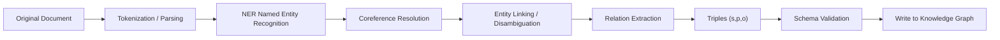

The following Python example demonstrates a simple NER using spaCy and a relation extraction process using regex patterns:

```python
import spacy
import re

# Load spaCy English model
nlp = spacy.load("en_core_web_sm")

text = """
Tesla manufactures the Optimus humanoid robot.
Unitree launched the H1 humanoid robot in 2024.
Harmonic Drive Systems produces precision harmonic reducers.
"""

doc = nlp(text)

# NER
entities = [(ent.text, ent.label_) for ent in doc.ents]
print("Named entities:", entities)
```

# Relation Extraction: Based on Simple Patterns
relations = []
patterns = [
    (r"(\w+) manufactures the ([\w\s]+) robot", "manufactures"),
    (r"(\w+) launched the ([\w\s]+) robot", "launched"),
    (r"(\w+) produces ([\w\s]+)", "produces"),
]

for pattern, rel in patterns:
    for match in re.finditer(pattern, text, re.IGNORECASE):
        relations.append((match.group(1), rel, match.group(2).strip()))

print("Extracted relations:", relations)
```

## 2.6 Naming Conventions, Deduplication, and Disambiguation

### 2.6.1 Entity ID Naming Conventions

Entity IDs are the core identifiers of a knowledge graph and must be unique, stable, and readable.

**Naming Rules:**
- Format: `ent_<type>_<normalized_title>_<year>`
- All lowercase
- Only contain letters, numbers, and underscores
- The title part truncates the first few meaningful words
- The year is optional, used to distinguish entities with the same name but different generations

**Examples:**

| Entity | ID |
|------|-----|
| Tesla Optimus | `ent_robot_system_tesla_optimus` |
| Unitree H1 (2024) | `ent_robot_unitree_h1_humanoid_robot_2024` |
| Diffusion Policy (2023) | `ent_paper_diffusion_policy_2023` |
| Harmonic Reducer (2024) | `ent_component_harmonic_reducer_2024` |

### 2.6.2 Relationship ID Naming Conventions

A relationship ID is composed of the source entity ID, relationship type, and target entity ID:

- Format: `rel_<source_id>_<type>_<target_id>`
- All lowercase
- Only contain letters, numbers, and underscores

**Examples:**

| Relationship | ID |
|------|-----|
| Harmonic Reducer is part of Rotary Actuator | `rel_ent_component_harmonic_reducer_2024_is_part_of_ent_component_rotary_actuator_2024` |
| Diffusion Policy is implemented on Unitree H1 | `rel_ent_paper_diffusion_policy_2023_implemented_on_ent_robot_unitree_h1_humanoid_robot_2024` |

### 2.6.3 Disambiguation Strategies

The same term may refer to different entities in different contexts. For example:
- "Atlas" could refer to Boston Dynamics' robot, a figure from ancient Greek mythology, or a map service.
- "ROS" could refer to the Robot Operating System or other abbreviations.

Disambiguation strategies include:
- **Contextual Disambiguation**: Determine the entity type based on source and description.
- **Alias Management**: Maintain a list of aliases for each entity to avoid duplicate creation.
- **Manual Annotation**: Manually confirm entries with significant ambiguity.
- **Type Constraints**: The relationship type itself can constrain the possible types of entities.

### 2.6.4 Entity Alignment and Record Linkage

Entity Alignment is the process of identifying entities that refer to the same real-world object across different knowledge graphs or different data sources. Record Linkage is the corresponding problem in the database field, aiming to identify duplicate occurrences of the same object across different records.

!!! note "Term Explanation: Jaccard Similarity"
    Jaccard similarity measures the ratio of the intersection to the union of two sets:
    $$J(A,B) = \frac{|A \cap B|}{|A \cup B|}$$
    It is commonly used for comparing n-gram sets of strings or sets of tags. The Jaccard value ranges from $[0,1]$, with larger values indicating greater similarity.

!!! note "Term Explanation: Levenshtein Edit Distance"
    Levenshtein distance is the minimum number of single-character edit operations (insertions, deletions, substitutions) required to transform one string into another. Normalized similarity is $1 - \frac{d(s,t)}{\max(|s|,|t|)}$. It is suitable for capturing spelling variations and abbreviation differences.

!!! note "Term Explanation: TF-IDF and Cosine Similarity"
    TF-IDF (Term Frequency-Inverse Document Frequency) is a bag-of-words weighting method that assigns a weight to each word in a document:
    $$\text{TF-IDF}(t,d) = \text{tf}(t,d) \cdot \text{idf}(t)$$
    where $\text{idf}(t) = \log \frac{N}{|\{d : t \in d\}|}$. After representing documents as TF-IDF vectors, cosine similarity measures the angle:
    $$\cos(\vec{a},\vec{b}) = \frac{\vec{a} \cdot \vec{b}}{\|\vec{a}\| \|\vec{b}\|}$$

!!! note "Term Explanation: Blocking"
    Blocking is a preprocessing step in record linkage that divides records into candidate pairs using inexpensive strategies, avoiding $O(n^2)$ full comparisons. Common blocking keys include first letters, postal codes, category labels, n-gram signatures, etc.

!!! note "Term Explanation: Pairwise Matching and Clustering"
    Pairwise matching is the process of calculating similarity for each pair of candidate records and determining whether they match. Due to transitivity (if A=B and B=C, then A=C), matching results usually need to be clustered to form equivalence classes. Common algorithms include transitive closure, connected components, or hierarchical clustering.

!!! note "Term Explanation: Confidence Scoring and Truth Discovery"
    Confidence scoring assigns a probability or score to each matching judgment, facilitating threshold setting and manual review. Truth discovery is the process of inferring the most likely correct value from multiple conflicting sources. Common methods include voting, EM algorithms, and graph-based models.

The typical process of entity alignment is shown in the following diagram:

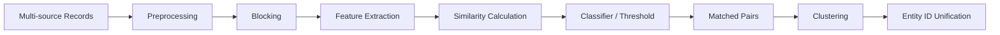

The deduplication decision tree can be represented by the following diagram:

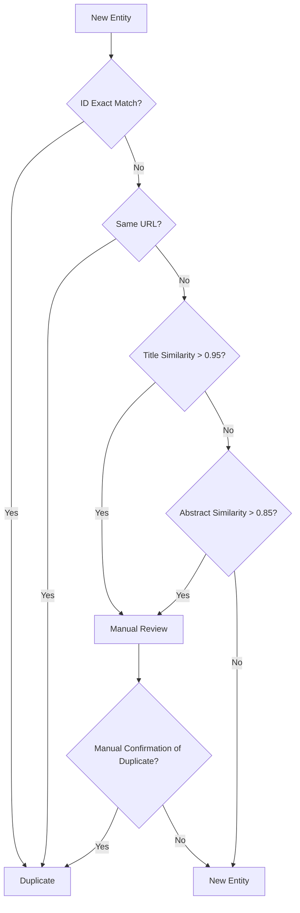

The following Python example demonstrates entity deduplication using string similarity, TF-IDF cosine similarity, and simple embedding cosine similarity:

```python
import numpy as np
from sklearn.feature_extraction.text import TfidfVectorizer
from sklearn.metrics.pairwise import cosine_similarity

# Candidate entity names
candidates = [
    "Unitree H1 Humanoid Robot",
    "Unitree H1 robot",
    "宇树 H1 人形机器人",
    "Tesla Optimus Gen 2",
    "Tesla Optimus",
]

# 1. TF-IDF Cosine Similarity
vectorizer = TfidfVectorizer().fit(candidates)
vectors = vectorizer.transform(candidates)
sim_matrix = cosine_similarity(vectors)
print("TF-IDF cosine similarity matrix:")
print(np.round(sim_matrix, 2))

# 2. Simple Embedding Cosine Similarity (using random vectors for illustration; in practice, use sentence-transformers)
np.random.seed(42)
embeddings = np.random.rand(len(candidates), 128)
# Normalize
embeddings = embeddings / np.linalg.norm(embeddings, axis=1, keepdims=True)
emb_sim = embeddings @ embeddings.T
print("Embedding cosine similarity matrix:")
print(np.round(emb_sim, 2))
```

# 3. Simple Deduplication: Threshold 0.8
threshold = 0.8
duplicates = []
for i in range(len(candidates)):
    for j in range(i+1, len(candidates)):
        if sim_matrix[i, j] > threshold:
            duplicates.append((candidates[i], candidates[j], sim_matrix[i, j]))
print("Duplicate candidates:", duplicates)
```

## 2.7 Manual Review and Quality Control

### 2.7.1 Three-Level Review Mechanism

To ensure knowledge quality, this book adopts a three-level review mechanism:

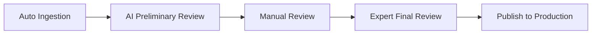

**AI Preliminary Review:**
- Automatically completes Schema validation
- Automatically checks required fields and formats
- Automatically identifies obviously low-quality or duplicate entries

**Manual Review:**
- Checks whether entity types and domains are correct
- Verifies whether relationships are reasonable
- Confirms whether sources are reliable

**Expert Final Review:**
- Provides professional judgment on cross-layer relationships and key assertions
- Handles disputed entries
- Decides whether entries enter the production environment

### 2.7.2 Review Status

| Status | Description |
|------|------|
| `staged` | Ingested but not reviewed |
| `active` | Passed review, entered production environment |
| `rejected` | Failed review, rejected |
| `deprecated` | Outdated or superseded |

The review status transition can be represented by the following diagram:

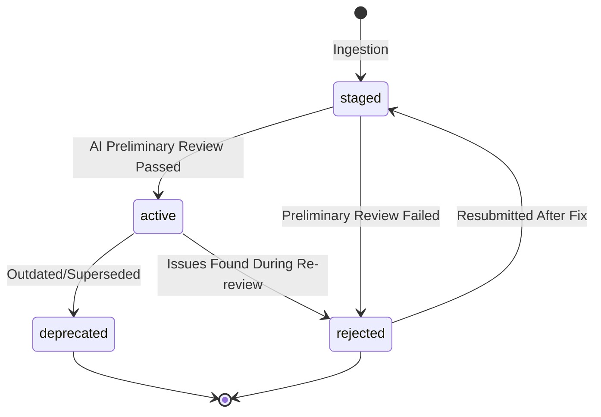

### 2.7.3 Quality Metrics

This book uses the following metrics to monitor knowledge graph quality:

| Metric | Description |
|------|------|
| **Total Entities** | Number of entities in the knowledge graph |
| **Total Relations** | Number of relations in the knowledge graph |
| **Cross-Layer Relations** | Number of relations connecting different domains |
| **Entities Missing theoretical_depth** | Number of entities without a set theoretical depth |
| **Dangling Relations** | Number of relations whose source or target entity does not exist |
| **Pending Review Items** | Number of items waiting for review in staging |
| **Rejected Items** | Number of items that failed review |

### 2.7.4 Knowledge Graph Quality Dimensions

The quality of a knowledge graph is a multi-dimensional concept. Academia and industry typically evaluate it from the following dimensions:

!!! note "Term Explanation: Completeness"
    Completeness measures the extent to which a knowledge graph covers the knowledge of a target domain. It can be divided into:
    - **Schema Completeness**: Whether all necessary classes and attributes are defined.
    - **Entity Completeness**: Whether the target entity set is covered.
    - **Attribute Completeness**: Whether the key attributes of entities are populated.
    - **Relation Completeness**: Whether important relations between entities are captured.
    Completeness can be quantified using coverage: $\text{Coverage} = \frac{|\text{Actual Knowledge Included}|}{|\text{Expected Knowledge Included}|}$.

!!! note "Term Explanation: Accuracy"
    Accuracy measures the correctness of facts in the knowledge graph. For example, if the knowledge graph asserts "Tesla manufactures Optimus", whether this assertion is consistent with objective reality. Accuracy is often evaluated using Precision: $P = \frac{|\{\text{Correct Triples}\}|}{|\{\text{Extracted Triples}\}|}$.

!!! note "Term Explanation: Consistency"
    Consistency measures whether the knowledge graph satisfies predefined constraints and axioms. For example, if the ontology stipulates "Each RobotSystem has at least one Component", a robot system lacking a Component violates consistency. Consistency can be checked via OWL reasoners or custom rules.

!!! note "Term Explanation: Timeliness and Credibility"
    Timeliness measures whether the knowledge reflects the current state. The humanoid robot field develops rapidly, and outdated information can mislead decisions. Credibility measures the reliability of knowledge sources, typically related to source type (academic papers > official documents > news > blogs) and review status.

!!! note "Term Explanation: Explainability"
    Explainability refers to the ability to trace conclusions in the knowledge graph back to sources and reasoning chains. For knowledge-driven decision systems, explainability is crucial because it allows users to audit conclusions, discover biases, and correct errors.

!!! note "Term Explanation: Precision, Recall, and F1 Score"
    Precision, Recall, and F1 are fundamental metrics in information retrieval and machine learning:
    $$P = \frac{TP}{TP+FP}, \quad R = \frac{TP}{TP+FN}, \quad F1 = \frac{2PR}{P+R}$$
    Where $TP$ is True Positives, $FP$ is False Positives, and $FN$ is False Negatives. In knowledge graph quality assessment, $TP$ can be defined as "the number of correctly extracted/asserted triples", $FP$ as "the number of incorrect triples", and $FN$ as "the number of missed correct triples".

!!! note "Term Explanation: Statistical Quality Control"
    Statistical Quality Control originates from manufacturing, with the core idea of ensuring product quality through sampling inspection and process monitoring. In knowledge graph review, a certain proportion of items can be randomly sampled for manual review to estimate the overall error rate. If the batch error rate exceeds a threshold, a full re-review of that batch is performed. Additionally, inter-annotator agreement can be used to evaluate annotation quality, commonly using the Kappa coefficient:
    $$\kappa = \frac{P_o - P_e}{1 - P_e}$$
    Where $P_o$ is the observed agreement rate, and $P_e$ is the expected agreement rate by chance.

The quality monitoring dashboard should periodically output the following metrics:

| Dimension | Metric | Calculation Method |
|------|------|---------|
| Completeness | Entity Coverage | Number of Covered Target Entities / Total Number of Target Entities |
| Completeness | Attribute Fill Rate | Number of Populated Attributes / Total Number of Expected Attributes |
| Accuracy | Manual Sampling Precision | Proportion of Correct Triples in the Sample |
| Consistency | Schema Violations | Number of Entities/Relations Violating Constraints |
| Timeliness | Average Update Interval | Median of (Current Time - Last Update Time) |
| Credibility | Source Type Distribution | Proportion of Primary/Secondary/News Sources |
| Explainability | Missing Source Ratio | Proportion of Triples Without a Source |

```mermaid
flowchart TD
    A["Knowledge Graph"] --> B["Completeness Check"]
    A --> C["Accuracy Sampling"]
    A --> D["Consistency Reasoning"]
    A --> E["Timeliness Scan"]
    A --> F["Source Credibility Assessment"]
    B --> G["Quality Report"]
    C --> G
    D --> G
    E --> G
    F --> G
    G --> H["Manual Review Queue"]
```

The following Python example calculates core quality metrics for a knowledge graph, including coverage, dangling edges, and Schema consistency:

```python
import pandas as pd
import networkx as nx

# Simulate entity and relation data
entities = pd.DataFrame({
    "id": ["e1", "e2", "e3", "e4"],
    "type": ["robot_system", "component", "company", "paper"],
    "domain": ["11", "02", "11", "07"],
    "theoretical_depth": ["system", "method", "system", None],
})

relations = pd.DataFrame({
    "source_id": ["e1", "e1", "e2", "e5"],
    "target_id": ["e2", "e3", "e4", "e1"],
    "type": ["uses", "manufactured_by", "is_part_of", "uses"],
})

# Coverage: proportion of entities with theoretical_depth
coverage = entities["theoretical_depth"].notna().mean()
print(f"Theoretical depth coverage: {coverage:.2%}")

# Dangling edges: relations whose source or target is not in the entity set
entity_ids = set(entities["id"])
dangling = relations[
    ~relations["source_id"].isin(entity_ids) |
    ~relations["target_id"].isin(entity_ids)
]
print(f"Dangling edges: {len(dangling)}")
print(dangling)
```

# Schema Consistency: Check Whether Source/Target Types for a Relation Type Are Valid
allowed = {
    "uses": {"source": {"robot_system", "method"}, "target": {"component", "dataset"}},
    "manufactured_by": {"source": {"robot_system", "component"}, "target": {"company"}},
    "is_part_of": {"source": {"component"}, "target": {"component", "robot_system"}},
}

def check_schema(row):
    rel_type = row["type"]
    if rel_type not in allowed:
        return False
    src_type = entities.set_index("id").loc.get(row["source_id"], {}).get("type")
    tgt_type = entities.set_index("id").loc.get(row["target_id"], {}).get("type")
    return src_type in allowed[rel_type]["source"] and tgt_type in allowed[rel_type]["target"]

relations["schema_valid"] = relations.apply(check_schema, axis=1)
print(f"Schema consistency: {relations['schema_valid'].mean():.2%}")
print(relations)
```

#### 2.7.4.1 Statistical Sampling for Quality Control

Section 2.7.3 lists several quality metrics, but to translate them into an actionable review process, a statistical question must be answered: **How many entries need to be sampled to estimate the overall error rate with a given confidence level?** This is essentially a binomial proportion confidence interval problem.

!!! note "Term Explanation: Binomial Proportion Confidence Interval"
    If $n$ samples are randomly drawn from the population, and $k$ of them are "error" samples, the sample error rate is $\hat{p} = k/n$. Due to sampling randomness, $\hat{p}$ is only an estimate of the true error rate $p$. The Wilson score interval gives a $100(1-\alpha)\%$ confidence interval for $p$:
    $$\hat{p} \pm \frac{z}{1+z^2/n} \sqrt{\frac{\hat{p}(1-\hat{p})}{n} + \frac{z^2}{4n^2}}$$
    where $z = z_{1-\alpha/2}$ is the quantile of the standard normal distribution. When $n$ is large, the Wilson interval approximates the normal approximation interval $\hat{p} \pm z\sqrt{\hat{p}(1-\hat{p})/n}$.

To estimate the true error rate within an absolute error $E$ at a 95% confidence level, with an expected error rate of approximately $\hat{p}$, the minimum sample size can be estimated by:

$$n \approx \frac{z^2 \hat{p}(1-\hat{p})}{E^2}$$

Taking $z_{0.975} \approx 1.96$, expected error rate $\hat{p}=0.05$, and allowable error $E=0.02$, we get:

$$n \approx \frac{1.96^2 \times 0.05 \times 0.95}{0.02^2} \approx 456.2$$

That is, at least 457 entries should be randomly sampled per batch. If the total number of entries in a batch is less than 457, a full review should be conducted.

Review results can also be monitored using a **p-chart** for process control. For $m$ consecutive batches, calculate the error rates $\hat{p}_1, \dots, \hat{p}_m$ respectively. The center line and control limits are:

$$\bar{p} = \frac{1}{m}\sum_{i=1}^{m} \hat{p}_i$$
$$\text{UCL} = \bar{p} + 3\sqrt{\frac{\bar{p}(1-\bar{p})}{n_i}}, \quad \text{LCL} = \max\left(0, \bar{p} - 3\sqrt{\frac{\bar{p}(1-\bar{p})}{n_i}}\right)$$

If the error rate of a batch exceeds the upper control limit, that batch has a systemic quality issue and requires a full re-review.

!!! note "Term Explanation: p-chart"
    A p-chart is a tool used in Statistical Process Control (SPC) to monitor the proportion of nonconforming units. It plots the batch nonconformance rate on the vertical axis against time on the horizontal axis, drawing a center line (CL) and upper/lower control limits (UCL/LCL). When observed points fall outside the control limits or exhibit non-random patterns, it signals that the process is out of control. Its theoretical basis is the normal approximation of the binomial distribution, and control limits are typically set at $\pm 3\sigma$.

The following Python example calculates the Wilson confidence interval, minimum sample size, and plots a p-chart:

```python
import numpy as np
import matplotlib.pyplot as plt
from scipy import stats

def wilson_interval(k, n, alpha=0.05):
    p = k / n
    z = stats.norm.ppf(1 - alpha / 2)
    denom = 1 + z**2 / n
    centre = (p + z**2 / (2*n)) / denom
    margin = z * np.sqrt((p*(1-p) + z**2/(4*n)) / n) / denom
    return centre - margin, centre + margin

# Example: Sample 457 entries, find 23 errors
n, k = 457, 23
lo, hi = wilson_interval(k, n)
print(f"Error rate estimate: {k/n:.3f}, 95% Wilson CI: [{lo:.3f}, {hi:.3f}]")

# Minimum sample size
p_hat, E = 0.05, 0.02
z = stats.norm.ppf(0.975)
n_min = int(np.ceil(z**2 * p_hat * (1-p_hat) / E**2))
print(f"Minimum sample size: {n_min}")

# p-chart
np.random.seed(0)
batch_sizes = np.full(20, 457)
errors = np.random.binomial(batch_sizes, 0.05)
p_hat_i = errors / batch_sizes
p_bar = p_hat_i.mean()
ucl = p_bar + 3*np.sqrt(p_bar*(1-p_bar)/batch_sizes)
lcl = np.maximum(0, p_bar - 3*np.sqrt(p_bar*(1-p_bar)/batch_sizes))

plt.figure(figsize=(8,4))
plt.plot(p_hat_i, marker='o', label='Batch error rate')
plt.axhline(p_bar, color='green', label='CL')
plt.plot(ucl, color='red', linestyle='--', label='UCL')
plt.plot(lcl, color='red', linestyle='--', label='LCL')
plt.xlabel('Batch index'); plt.ylabel('Error rate')
plt.title('p-Chart for KG Review Quality')
plt.legend(); plt.grid(True)
plt.tight_layout()
plt.savefig('p_chart_kg_quality.png', dpi=150)
print("Saved p_chart_kg_quality.png")
```

The 95% Wilson confidence interval output by this code is approximately $[0.032, 0.076]$, indicating that even if a $5\%$ error rate is observed in the sample, the true error rate could still be between $3.2\%$ and $7.6\%$. The p-chart can be integrated into the quality dashboard of `coverage_dashboard.py` (see Section 2.7.3).

## 2.8 Applications of Knowledge Graphs

### 2.8.1 Query and Exploration

Knowledge graphs support various query methods:

**Query by Entity:**
- Query all components of a specific robot
- Query all suppliers of a specific component
- Query the dataset used by a specific method

**Query by Relationship:**
- Query all robots using harmonic reducers
- Query all humanoid robots deployed in automobile factories
- Query all systems constrained by ISO 13482

**Query by Path:**
- The complete chain from material to complete machine to market
- The technology dependency chain from algorithm to hardware to application
- The influence path from standard to design choice

#### 2.8.1.1 Query Examples: SPARQL, Cypher, and Python Implementation

Section 2.8.1 summarizes query types. This section provides three directly runnable examples, corresponding to RDF triple stores, property graph databases, and Python in-memory graphs.

**Example 1: SPARQL Query for All Robots Using Harmonic Reducers**

```sparql
PREFIX ex: <http://example.org/humanoid-robot#>

SELECT ?robot ?manufacturer
WHERE {
  ?robot rdf:type ex:HumanoidRobot .
  ?robot ex:uses ?actuator .
  ?actuator rdf:type ex:RotaryActuator .
  ?actuator ex:isPartOf ?reducer .
  ?reducer rdf:type ex:HarmonicReducer .
  OPTIONAL { ?robot ex:manufacturedBy ?manufacturer . }
}
```

This query assumes that the inverse relationship of `ex:isPartOf` can be used to locate the reducer from the actuator; if the ontology has declared the inverse property `ex:hasPart` of `ex:isPartOf`, it can be automatically inferred via `owl:inverseOf`. More details on the physical mechanism of harmonic reducers can be found in Chapter 4.

**Example 2: Cypher Query for Multi-Level Suppliers of Components**

```cypher
MATCH (c:Component {name: 'Harmonic Reducer'})<-[:manufactures]-(m:ComponentManufacturer)
OPTIONAL MATCH (m)-[:supplies]->(oem:OEM)-[:manufactures]->(r:RobotSystem)
RETURN c.name AS component, m.name AS manufacturer, oem.name AS oem, r.name AS robot
```

This query starts from the component, finds the manufacturer along `manufactures`, then finds the OEM along `supplies`, and finally locates the robot system, demonstrating the value of cross-layer relationships in supply chain analysis (see Chapter 7 for details).

**Example 3: Python In-Memory Graph Path Search – From NdFeB to Market**

```python
import networkx as nx

G = nx.DiGraph()
G.add_edges_from([
    ("NdFeB Magnet", "Frameless Motor", {"rel": "isMadeOf"}),
    ("Frameless Motor", "Rotary Actuator", {"rel": "isPartOf"}),
    ("Rotary Actuator", "Optimus", {"rel": "isPartOf"}),
    ("Optimus", "Car Factory", {"rel": "deployedAt"}),
    ("Car Factory", "Industrial Market", {"rel": "hasMarketSize"}),
    ("Optimus", "BMW Spartanburg", {"rel": "deployedAt"}),
])

# All simple paths from NdFeB Magnet to Industrial Market
paths = list(nx.all_simple_paths(G, "NdFeB Magnet", "Industrial Market"))
print("Paths:", paths)

# Shortest path (by number of edges)
sp = nx.shortest_path(G, "NdFeB Magnet", "Industrial Market")
print("Shortest path:", sp)
```

The output will show two market paths: `... → Optimus → Car Factory → Market` and `... → Optimus → BMW Spartanburg → Market`. Such path queries are crucial for evaluating technology-market mapping and supply chain vulnerabilities.

!!! note "Term Explanation: OPTIONAL Pattern"
    OPTIONAL is a modifier in SPARQL, indicating that if the pattern exists, the binding result is returned; otherwise, it does not cause the entire row to be filtered. It corresponds to the left outer join in relational algebra and is used to handle missing data, avoiding the loss of subject records due to unfilled attributes.

### 2.8.2 Reasoning and Analysis

Higher-level reasoning can be performed based on knowledge graphs:

- **Bottleneck Identification**: Identify key components with only a few suppliers to assess supply chain risk.
- **Alternative Analysis**: Find alternative components and suppliers when a specific component is out of stock or its price increases.
- **Technology Maturity Assessment**: Judge the maturity of a technology by associating related papers, products, and deployment cases.
- **Investment Target Research**: Analyze a company's position, technology layout, and supply chain relationships within the knowledge graph.

### 2.8.3 Visualization

Knowledge graphs can be visualized through network graphs, tree maps, Sankey diagrams, etc.:

- **Network Graph**: Displays the global structure of entities and relationships.
- **Tree Map**: Shows the component hierarchy of a system.
- **Sankey Diagram**: Illustrates the value flow from material to complete machine to market.
- **Timeline**: Shows the development history of technologies, products, and enterprises.

### 2.8.4 Storage and Query Systems

The storage and query system of a knowledge graph determines its scalability, query capability, and application scenarios. Based on the data model, they are mainly divided into RDF triple stores and property graph databases.

!!! note "Term Explanation: RDF Triple Store"
    An RDF triple store is a database specifically designed to store RDF triples, supporting SPARQL queries and OWL/RDFS reasoning. Typical systems include Apache Jena, GraphDB, Virtuoso, and Amazon Neptune (RDF mode). The advantage of triple stores lies in formal semantics and standard interoperability, making them suitable for scenarios requiring strong semantic constraints.

!!! note "Term Explanation: Property Graph Database"
    A property graph database organizes data using nodes, edges, labels, and properties, supporting flexible graph traversal and pattern matching. Typical systems include Neo4j, Amazon Neptune (Gremlin mode), JanusGraph, and TigerGraph. The advantage of property graph databases lies in high-performance graph traversal and rich property expression, making them suitable for recommendation systems, fraud detection, and supply chain analysis.

!!! note "Term Explanation: SPARQL"
    SPARQL is the W3C-recommended query language for RDF, with syntax similar to SQL but designed for graph pattern matching. For example:
    ```sparql
    SELECT ?robot WHERE {
      ?robot ex:uses ex:HarmonicReducer .
    }
    ```
    SPARQL supports optional patterns, filters, aggregations, subqueries, and federated queries.

!!! note "Term Explanation: Cypher"
    Cypher is a property graph query language developed by Neo4j, using ASCII art style to represent nodes and relationships. For example:
    ```cypher
    MATCH (r:RobotSystem)-[:uses]->(c:Component)
    WHERE c.name = 'Harmonic Reducer'
    RETURN r.name
    ```

!!! note "Term Explanation: Gremlin"
    Gremlin is the graph traversal language of Apache TinkerPop, adopting a functional style. It is the "universal language" for graph databases and can run on multiple backends. For example:
    ```gremlin
    g.V().hasLabel('RobotSystem').out('uses').has('name','Harmonic Reducer').in('uses').values('name')
    ```

!!! note "Term Explanation: Vector Search and RAG (Retrieval-Augmented Generation)"
    Vector search embeds text or entities as dense vectors and quickly finds semantically similar items through approximate nearest neighbor (ANN) search. RAG provides the retrieval results as context to large language models to reduce hallucinations and improve factuality. When combining knowledge graphs with RAG, the structured relationships in the graph can supplement the semantic relevance of vector search, achieving "GraphRAG".

| Dimension | RDF Triple Store | Property Graph Database |
|------|----------------|--------------|
| Data Model | Triple $(s,p,o)$ | Node + Edge + Property |
| Query Language | SPARQL | Cypher, Gremlin |
| Reasoning Capability | Strong (OWL/RDFS) | Weak or requires extension |
| Schema Flexibility | High | High |
| Graph Traversal Performance | Medium | High |
| Typical Applications | Semantic Web, Life Sciences | Social Networks, Recommendations, Supply Chain |

```mermaid
flowchart LR
    subgraph RDF["RDF Technology Stack"]
        A["RDF Data"] --> B["SPARQL Query"]
        B --> C["OWL Reasoning"]
    end
    subgraph PG["Property Graph Technology Stack"]
        D["Node/Edge/Property"] --> E["Cypher/Gremlin"]
        E --> F["Graph Algorithm Library"]
    end
    RDF --> G["Application Layer"]
    PG --> G
    G --> H["Visualization / Recommendation / QA"]
```

The following Python example demonstrates how to simulate an RDF triple store using pandas and execute simple SPARQL-style queries:

```python
import pandas as pd

# Simulate RDF triples
triples = [
    ("ex:Optimus", "rdf:type", "ex:HumanoidRobot"),
    ("ex:Optimus", "ex:uses", "ex:HarmonicReducer"),
    ("ex:UnitreeH1", "rdf:type", "ex:HumanoidRobot"),
    ("ex:UnitreeH1", "ex:uses", "ex:HarmonicReducer"),
    ("ex:HarmonicReducer", "rdf:type", "ex:Component"),
    ("ex:HarmonicReducer", "ex:manufacturedBy", "ex:HarmonicDriveSystems"),
]
df = pd.DataFrame(triples, columns=["subject", "predicate", "object"])

# SPARQL-style query: Find all robots that use HarmonicReducer
robots = df[
    (df["predicate"] == "ex:uses") &
    (df["object"] == "ex:HarmonicReducer")
]["subject"].tolist()
print("Robots using HarmonicReducer:", robots)

# Query: Find the manufacturer of HarmonicReducer
manufacturer = df[
    (df["subject"] == "ex:HarmonicReducer") &
    (df["predicate"] == "ex:manufacturedBy")
]["object"].tolist()
print("Manufacturer:", manufacturer)
```

### 2.8.5 Benchmarks and Competitions

Benchmarks in the knowledge graph field have driven the development of algorithms. Major tasks and benchmarks include:

!!! note "Term Explanation: Knowledge Graph Completion (KGC)"
    Knowledge Graph Completion is the task of predicting missing triples based on existing triples, including link prediction and entity prediction. Common methods include embedding-based models (TransE, DistMult, ComplEx, RotatE) and graph neural network-based models.

!!! note "Term Explanation: Link Prediction"
    Link prediction is the task of predicting missing entities given $(s,p,?)$ or $(?,p,o)$, or predicting the relation given $(s,?,o)$. Evaluation metrics typically include Mean Rank (MR), Mean Reciprocal Rank (MRR), and Hits@N.

!!! note "Term Explanation: Entity Alignment Benchmark"
    Entity alignment benchmarks provide alignment seeds between two or more multilingual knowledge graphs to evaluate alignment algorithms. Typical datasets include DBP15K, DWY100K, and the OpenEA series. Evaluation metrics are usually Hits@1 and Hits@10.

| Task | Representative Benchmark | Evaluation Metrics |
|------|---------|---------|
| Knowledge Graph Completion | FB15k-237, WN18RR, YAGO3-10 | MRR, Hits@1, Hits@10 |
| Link Prediction | OGBL-BioKG, OGBL-Wikikg2 | MRR, Hits@10 |
| Entity Alignment | DBP15K, DWY100K | Hits@1, Hits@10 |
| Question Answering | WebQuestions, ComplexWebQuestions | F1, Hits@1 |
| Entity Linking | AIDA-CoNLL, MSNBC | Precision, Recall, F1 |

```mermaid
flowchart TD
    A["Evaluation Tasks"] --> B["Knowledge Graph Completion"]
    A --> C["Link Prediction"]
    A --> D["Entity Alignment"]
    A --> E["Knowledge Graph QA"]
    A --> F["Entity Linking"]
    B --> G["FB15k-237 / WN18RR"]
    C --> H["OGBL-Wikikg2"]
    D --> I["DBP15K / DWY100K"]
    E --> J["WebQuestions"]
    F --> K["AIDA-CoNLL"]
```

## 2.9 Limitations and Evolution Directions

### 2.9.1 Current Limitations

Although the knowledge graph approach has significant advantages, the knowledge graph constructed in this book still has some limitations:

| Limitation | Description |
|------|------|
| **Uneven Coverage** | AI algorithms and papers are relatively well covered, but manufacturing, supply chain, and policy coverage is relatively weak |
| **Sparse Relations** | Some system-level entities lack cross-layer relationships, requiring continuous completion |
| **Varying Source Quality** | Some entries rely on news reports or blogs, which are less reliable than academic papers |
| **Dynamic Update Pressure** | The field develops rapidly, requiring continuous investment to maintain timeliness |
| **Insufficient Quantitative Attributes** | Numerical attributes such as cost and performance have not been fully structured |

### 2.9.2 Evolution Directions

The knowledge graph can be continuously improved in the following directions in the future:

- **Enhance Quantitative Attributes**: Add more numerical attributes to entities such as components, robots, and markets to support cost analysis and performance comparison.
- **Introduce Temporal Information**: Record the time range of entities and relationships to support historical evolution analysis.
- **Strengthen Multilingual Support**: Add multilingual titles and descriptions in English, Chinese, Korean, etc.
- **Link with Simulation Data**: Connect the knowledge graph with simulation platforms and datasets to support a closed loop from knowledge to experimentation.
- **Develop Interactive Frontend**: Build a web interface to support natural language queries, graph browsing, and path analysis.
- **Introduce Auto-completion**: Use large language models to automatically generate suggestions for missing relationships and attributes, followed by manual review.

### 2.9.3 DevOps for Knowledge Graphs

Integrating the knowledge graph into a continuous integration/continuous deployment (CI/CD) pipeline is key to ensuring its long-term availability and reliability.

!!! note "Term Explanation: ETL and ELT"
    ETL (Extract-Transform-Load) is a process of first extracting, then transforming, and finally loading into the target system. ELT (Extract-Load-Transform) first loads raw data and then transforms it within the target system. Knowledge graph ingestion typically uses ETL because entity extraction, disambiguation, and schema alignment need to be completed before writing.

!!! note "Term Explanation: Versioning"
    Versioning records changes to the knowledge graph over time, allowing for tracing historical states, comparing differences, and recovering from erroneous operations. For file-based knowledge graphs, Git itself can serve as a version control system; for database-based knowledge graphs, incremental logs and timestamp mechanisms need to be designed.

!!! note "Term Explanation: CI/CD (Continuous Integration / Continuous Deployment)"
    CI/CD is a software engineering practice for automated building, testing, and deployment. In knowledge graph engineering, CI/CD can automatically run schema validation, quality checks, link prediction tests, and visualization generation, ensuring that each update does not break the existing structure.

!!! note "Term Explanation: Incremental Update and Rollback"
    Incremental update processes only the data added or modified since the last update, reducing computational overhead. Rollback is the operation of restoring the system to a previous stable state when an error is discovered. Both require comprehensive provenance records and change logs for support.

!!! note "Term Explanation: Provenance"
    In knowledge engineering, provenance refers to the source, generation process, and processing history of data. W3C PROV is a standardized provenance model that can describe the relationships between entities, activities, and agents. Provenance information is crucial for auditing, trustworthiness, and accountability.

!!! note "Term Explanation: LLM and RAG Integration"
    Large Language Models (LLMs) can be used to assist with knowledge extraction, relationship suggestions, and text summarization. RAG (Retrieval-Augmented Generation) uses the knowledge graph as a retrieval source to provide structured context for the LLM. When combining the two, attention must be paid to the hallucination problem of LLMs and the coverage limitations of the knowledge graph.

The knowledge graph DevOps pipeline is shown in the following diagram:

```mermaid
flowchart LR
    A["Data Sources"] --> B["ETL Extraction"]
    B --> C["Staging Area"]
    C --> D["Schema Validation"]
    D --> E{"Quality Check"}
    E -->|Pass| F["Merge to Main Branch"]
    E -->|Fail| G["Manual Fix"]
    F --> H["Build and Deploy"]
    H --> I["Production Environment"]
    I --> J["Monitoring and Rollback"]
```

The integration architecture of the knowledge graph with LLM/RAG can be represented by the following diagram:

```mermaid
flowchart LR
    A["User Query"] --> B["Query Understanding"]
    B --> C{"Requires Structured Knowledge?"}
    C -->|Yes| D["Knowledge Graph Retrieval"]
    C -->|No| E["Vector Retrieval"]
    D --> F["Subgraph / Triples"]
    E --> G["Relevant Text Segments"]
    F --> H["Context Assembly"]
    G --> H
    H --> I["LLM Generation"]
    I --> J["Answer with Source Citations"]
```

The lifecycle of a triple can be summarized in the following diagram:

```mermaid
flowchart LR
    A["Data Source"] --> B["Extraction"]
    B --> C["Disambiguation / Alignment"]
    C --> D["Schema Validation"]
    D --> E["Manual Review"]
    E --> F["Production Environment"]
    F --> G["Query / Inference"]
    G --> H["Monitoring and Update"]
    H --> I["Version Archiving"]
```

---

## 2.10 Chapter Summary

This chapter systematically describes the knowledge graph construction methodology adopted in this book. The core points are as follows:

1. **The information model adopts a quadruple of "Entity-Relationship-Source-Verification"**, where each entity and relationship has a clear schema, source, and review record.

2. **Entity types cover the entire humanoid robot industry chain**, including papers, methods, algorithms, datasets, software, components, robots, companies, standards, materials, applications, markets, etc.

3. **Relationship types cover various associations such as composition, usage, dependency, deployment, manufacturing, supply, application, and regulation**, supporting the construction of cross-layer links.

4. **Domain layering divides the field into 13 levels**, from basic disciplines to policies, regulations, and ethics; theoretical depth classifies entities into five levels: foundation, principle, formalism, method, and system.

5. **The data ingestion pipeline includes six stages: source, adapter, deduplication, writing, validation, and manual review**, ensuring the quality and timeliness of knowledge.

6. **Naming conventions, deduplication and disambiguation, and a three-level review mechanism** are key to maintaining the consistency and accuracy of large-scale knowledge graphs.

7. **The knowledge graph supports query, inference, visualization, and cross-layer analysis**, serving as the infrastructure for systematic cognition in the humanoid robot field.

8. **The current knowledge graph still has limitations such as uneven coverage, sparse relations, and dynamic update pressure**. Future evolution is needed in directions such as quantitative attributes, temporal information, multilingual support, simulation integration, interactive frontends, and DevOps.

### Chapter Symbol Table

For ease of reference, the main symbols used in this chapter are organized as follows.

| Symbol | Meaning | Unit/Value Range |
|------|------|--------------|
| $G=(V,E)$ | Graph, vertex set $V$, edge set $E$ | — |
| $(s,p,o)$ | RDF/Triple: subject, predicate, object | — |
| $d(v)$ | Degree of node $v$ | Integer |
| $PR(v)$ | PageRank value of node $v$ | $[0,1]$ |
| $C(v)$ | Local clustering coefficient of node $v$ | $[0,1]$ |
| $\mathcal{T}$ | Set of entity types | — |
| $type(e)$ | Type of entity $e$ | Element of $\mathcal{T}$ |
| $w(u,v)$ | Dependency strength of relation $(u,v)$ | $[0,1]$ |
| $c(u,v)$ | Source confidence of relation $(u,v)$ | $[0,1]$ |
| $S(P)$ | Comprehensive dependency score of path $P$ | $[0,1]$ |
| $R(P)$ | Reliability of path $P$ | $[0,1]$ |
| $\lambda$ | Data arrival rate | Items/hour |
| $\mu$ | Data processing rate | Items/hour |
| $\rho = \lambda/\mu$ | System utilization | $[0,1)$ |
| $L$ | Steady-state average queue length | Items |
| $W$ | Steady-state average waiting time | Hours |
| $X,D,C$ | CSP variables, domains, constraints | — |
| $\hat{p}$ | Sample error rate | $[0,1]$ |
| $z_{1-\alpha/2}$ | Standard normal distribution quantile | — |
| $\text{UCL}/\text{LCL}$ | Upper/Lower control limits of p-chart | $[0,1]$ |

---

## References and Data Sources

[1] Hogan, A., Blomqvist, E., Cochez, M., d'Amato, C., Melo, G. D., Gutierrez, C., ... & Zimmermann, A. (2021). Knowledge graphs. ACM Computing Surveys (CSUR), 54(4), 1-37.

[2] Ji, S., Pan, S., Cambria, E., Marttinen, P., & Yu, P. S. (2021). A survey on knowledge graphs: Representation, acquisition, and applications. IEEE Transactions on Neural Networks and Learning Systems, 33(2), 494-514.

[3] Wang, Q., Mao, Z., Wang, B., & Guo, L. (2017). Knowledge graph embedding: A survey of approaches and applications. IEEE Transactions on Knowledge and Data Engineering, 29(12), 2724-2743.

[4] Bollacker, K., Evans, C., Paritosh, P., Sturge, T., & Taylor, J. (2008). Freebase: A collaboratively created graph database for structuring human knowledge. In Proceedings of the 2008 ACM SIGMOD International Conference on Management of Data, 1247-1250.

[5] Vrandečić, D., & Krötzsch, M. (2014). Wikidata: A free collaborative knowledgebase. Communications of the ACM, 57(10), 78-85.

[6] Auer, S., Bizer, C., Kobilarov, G., Lehmann, J., Cyganiak, R., & Ives, Z. (2007). DBpedia: A nucleus for a web of open data. In The Semantic Web, 722-735.

[7] Noy, N. F., Shah, N. H., Whetzel, P. L., Dai, B., Dorf, M., Griffith, N., ... & Musen, M. A. (2009). BioPortal: Ontologies and integrated data resources at the click of a mouse. Nucleic Acids Research, 37(suppl_2), W170-W173.

[8] Tyson, A., et al. (2020). AIChemist: A knowledge graph for AI-driven materials discovery. npj Computational Materials, 6, 1-12.

[9] Knowledge graph project of this book: Awesome Humanoid Robot. Internal project materials, including `scripts/ingestion/`, `scripts/validate_entries.py`, `scripts/coverage_dashboard.py`, etc.

[10] Page, L., Brin, S., Motwani, R., & Winograd, T. (1999). The PageRank citation ranking: Bringing order to the web. Technical Report, Stanford InfoLab.

[11] W3C. (2014). RDF 1.1 Concepts and Abstract Syntax. W3C Recommendation. https://www.w3.org/TR/rdf11-concepts/

[12] W3C. (2014). RDF Schema 1.1. W3C Recommendation. https://www.w3.org/TR/rdf-schema/

[13] W3C. (2012). OWL 2 Web Ontology Language Document Overview (Second Edition). W3C Recommendation. https://www.w3.org/TR/owl2-overview/

[14] W3C. (2013). SPARQL 1.1 Overview. W3C Recommendation. https://www.w3.org/TR/sparql11-overview/

[15] W3C. (2013). PROV-O: The PROV Ontology. W3C Recommendation. https://www.w3.org/TR/prov-o/

[16] Arp, R., Smith, B., & Spear, A. D. (2015). Building ontologies with basic formal ontology. MIT Press.

[17] Gangemi, A., Guarino, N., Masolo, C., Oltramari, A., & Schneider, L. (2002). Sweetening ontologies with DOLCE. In Knowledge Engineering and Knowledge Management: Ontologies and the Semantic Web, 166-181.

[18] Niles, I., & Pease, A. (2001). Towards a standard upper ontology. In Proceedings of the International Conference on Formal Ontology in Information Systems, 2-9.

[19] Poveda-Villalón, M., Suárez-Figueroa, M. C., & Gómez-Pérez, A. (2014). Validating ontologies with OOPS!. In Knowledge Engineering and Knowledge Management, 267-281.

[20] Euzenat, J., & Shvaiko, P. (2013). Ontology matching (2nd ed.). Springer.

[21] Lafferty, J., McCallum, A., & Pereira, F. C. (2001). Conditional random fields: Probabilistic models for segmenting and labeling sequence data. In Proceedings of ICML, 282-289.

[22] Devlin, J., Chang, M. W., Lee, K., & Toutanova, K. (2019). BERT: Pre-training of deep bidirectional transformers for language understanding. In Proceedings of NAACL-HLT, 4171-4186.

[23] Honnibal, M., & Montani, I. (2017). spaCy 2: Natural language understanding with Bloom embeddings, convolutional neural networks and incremental parsing. To appear, 7(1), 411-420.

[24] Mintz, M., Bills, S., Snow, R., & Jurafsky, D. (2009). Distant supervision for relation extraction without labeled data. In Proceedings of ACL-IJCNLP, 1003-1011.

[25] Bordes, A., Usunier, N., Garcia-Duran, A., Weston, J., & Yakhnenko, O. (2013). Translating embeddings for modeling multi-relational data. In NeurIPS, 2787-2795.

[26] Sun, Z., Deng, Z. H., Nie, J. Y., & Tang, J. (2019). RotatE: Knowledge graph embedding by relational rotation in complex space. In ICLR.

[27] Schlichtkrull, M., Kipf, T. N., Bloem, P., van den Berg, R., Titov, I., & Welling, M. (2018). Modeling relational data with graph convolutional networks. In ESWC, 593-607.

[28] Levenshtein, V. I. (1966). Binary codes capable of correcting deletions, insertions, and reversals. Soviet Physics Doklady, 10(8), 707-710.

[29] Jaccard, P. (1912). The distribution of the flora in the alpine zone. New Phytologist, 11(2), 37-50.

[30] Salton, G., & McGill, M. J. (1983). Introduction to modern information retrieval. McGraw-Hill.

[31] Christen, P. (2012). Data matching: Concepts and techniques for record linkage, entity resolution, and duplicate detection. Springer.

[32] Li, Y., Li, J., Suhara, Y., Doan, A., & Tan, W. C. (2020). Deep entity matching with pre-trained language models. Proceedings of the VLDB Endowment, 14(1), 50-60.

[33] Cohen, J. (1960). A coefficient of agreement for nominal scales. Educational and Psychological Measurement, 20(1), 37-46.

[34] Newman, M. E. (2010). Networks: An introduction. Oxford University Press.

[35] Hagberg, A., Swart, P., & Chult, D. S. (2008). Exploring network structure, dynamics, and function using NetworkX. In Proceedings of SciPy, 11-15.

[36] TinkerPop, A. (2019). Apache TinkerPop 3 documentation. https://tinkerpop.apache.org/docs/current/

[37] Francis, N., Green, A., Guagliardo, P., Libkin, L., Lindaaker, T., Marsault, V., ... & Taylor, A. (2018). Cypher: An evolving query language for property graphs. In Proceedings of SIGMOD, 1433-1445.

[38] Bizer, C., Heath, T., & Berners-Lee, T. (2011). Linked data: The story so far. In Semantic Services, Interoperability and Web Applications: Emerging Concepts, 205-227.

[39] Lewis, P., Perez, E., Piktus, A., Petroni, F., Karpukhin, V., Goyal, N., ... & Kiela, D. (2020). Retrieval-augmented generation for knowledge-intensive NLP tasks. In NeurIPS, 9459-9474.

[40] Toutanova, K., Chen, D., Pantel, P., Poon, H., Choudhury, P., & Gamon, M. (2015). Representing text for joint embedding of text and knowledge bases. In Proceedings of EMNLP, 1499-1509.

[41] Thellmann, K., & Scheglmann, S. (2024). GraphRAG: A modular approach to knowledge-enabled retrieval-augmented generation. arXiv preprint arXiv:2405.18414.

---

## Knowledge Graph Anchors in This Chapter

**Core Entities**

| Entity Type | Representative Entity |
|------------|----------------------|
| `concept` | knowledge graph, schema, entity, relationship, verification |
| `technology` | YAML, Markdown, RSS, Mermaid, ROS 2 |
| `software_platform` | `validate_entries.py`, `coverage_dashboard.py`, `EntryWriter`, `DedupService` |
| `method` | schema validation, deduplication, cross-layer relationship, curation |
| `standard` | ISO 13482, IEC 61508 |

**Core Relationships**

| Relationship Type | Meaning | Example |
|------------------|---------|---------|
| `is_part_of` | Concept/component belongs to a larger system | Schema → Knowledge Graph |
| `uses` | Method/tool uses a certain technology | Knowledge Graph → YAML |
| `requires` | Process depends on a certain component | Data Ingestion → DedupService |
| `applies_to` | Standard/method applies to a certain object | Schema Validation → Entity File |
| `validates_on` | Tool validates a certain object | `validate_entries.py` → Relationship File |

**Cross-Layer Link Example**

```
Raw Data Source → Adapter → ParsedItem → Deduplication → Entity File → Schema Validation → Manual Review → Production Environment → Query/Inference/Visualization
```

**Key Reflection Questions**

1. Why does the humanoid robot domain need a knowledge graph rather than traditional literature reviews?
2. What are the respective roles of the entity-relationship-source-verification quadruple?
3. How do Domain layering and theoretical depth help organize heterogeneous knowledge?
4. What are the design principles and verification standards for cross-layer relationships?
5. How to ensure dynamic updates and quality control of the knowledge graph?
