# Chapter 3: Key Materials

## Abstract

The power density, dynamic response, endurance, and safety boundaries of humanoid robots are fundamentally determined by the electronic structure, crystallographic characteristics, defect states, and interfacial behavior of their upstream materials. This chapter, grounded in fundamental disciplines such as condensed matter physics, physical metallurgy, electrochemistry, and semiconductor physics, systematically addresses four core material systems: rare-earth permanent magnet materials, structural materials, electrochemical energy materials, and wide-bandgap semiconductor materials. Each material category is elaborated from the perspectives of crystal structure and electronic structure, key physical quantities and performance indicators, physical/chemical mechanisms, failure modes, characterization methods, supply chain landscape, and design constraints specific to humanoid robot applications, supported by verified experimental and industrial literature.

**Keywords**: Humanoid robot; Nd-Fe-B; Magnetocrystalline anisotropy; Grain boundary diffusion; Aluminum alloy aging; Magnesium alloy corrosion; Lithium-ion battery; Solid-state electrolyte; SiC; GaN

## 3.1 Rare Earth Permanent Magnet Materials

### 3.1.1 Physical Origin of Magnetism: Spin, Orbit, and Exchange Interaction

Magnetism originates from two intrinsic angular momenta of unpaired electrons in atoms: spin angular momentum and orbital angular momentum. These correspond to the spin magnetic moment and the orbital magnetic moment, respectively. In solids, the magnetic moments of adjacent atoms are not aligned via classical magnetic dipole interactions but are coupled through **exchange interaction**.

The energy of the exchange interaction can be approximated in the Heisenberg form:

$$
E_{ex} = -2J \sum_{\langle i,j \rangle} \mathbf{S}_i \cdot \mathbf{S}_j
$$

where \(J\) is the exchange integral, and \(\mathbf{S}_i\), \(\mathbf{S}_j\) are the spins of adjacent atoms. When \(J > 0\), magnetic moments align parallel, forming a ferromagnet; when \(J < 0\), they align antiparallel, forming an antiferromagnet. The \(3d\) electron wavefunctions of transition metals Fe, Co, and Ni have significant overlap, resulting in a substantial exchange integral \(J\), thus giving them high Curie temperatures and high saturation magnetization.

!!! note "Term Explanation: Spin, Orbital Angular Momentum, Exchange Interaction, Curie Temperature, Saturation Magnetization"
    - **Spin**: The intrinsic angular momentum of an electron, which can be intuitively understood as the electron rotating around its own axis. The spin quantum number \(s = 1/2\) gives rise to the spin magnetic moment \(\mu_s = -g_s \mu_B s\), where \(g_s \approx 2\) is the Landé g-factor and \(\mu_B\) is the Bohr magneton. Its essence is a relativistic quantum effect described by the Dirac equation.
    - **Orbital Angular Momentum**: The angular momentum generated by an electron's motion around the nucleus, producing the orbital magnetic moment. In crystals, orbital motion is influenced by the crystal field and is partially "quenched."
    - **Exchange Interaction**: A quantum mechanical effect arising from the Pauli exclusion principle's requirement for the antisymmetry of multi-electron wavefunctions. It is not a classical electromagnetic interaction but a quantum manifestation of the Coulomb interaction between electrons, determining whether magnetic moments align parallel (ferromagnetic) or antiparallel (antiferromagnetic).
    - **Curie Temperature**: The temperature at which thermal motion is sufficient to disrupt the ordered alignment of the exchange interaction; above this temperature, the material becomes paramagnetic.
    - **Saturation Magnetization (\(M_s\))**: The magnetic moment per unit volume when all alignable magnetic moments are perfectly aligned by an external field. It is determined by the number of unpaired electrons per unit volume and represents the upper limit of the magnetic flux density a material can provide.

The magnetism of rare earth elements Nd, Dy, and Tb primarily originates from localized \(4f\) electrons. Since \(4f\) electrons are shielded by the outer \(5s^2 5p^6\) electron shell, the crystal field has a weak effect on them, but the spin-orbit coupling is extremely strong. This results in rare earth ions possessing a large total angular momentum \(\mathbf{J}\) and magnetic moment. The \(4f-3d\) exchange interaction (\(J_{4f-3d}\)) between rare earth ions and transition metal \(3d\) electrons is key to achieving high Curie temperatures in R-TM-B (R = Rare Earth, TM = Transition Metal) permanent magnet materials.

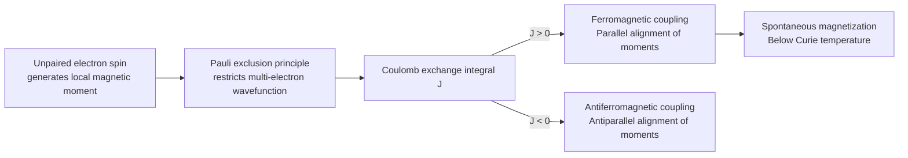

### 3.1.2 Magnetocrystalline Anisotropy and the Single-Ion Model

**Magnetocrystalline anisotropy** refers to the phenomenon where the energy of magnetization varies along different crystallographic directions. Its physical origin lies in the combined action of spin-orbit coupling and the crystal field. For uniaxial anisotropy, the anisotropy energy density can be written as

$$
E_K = K_1 \sin^2\theta + K_2 \sin^4\theta + \cdots
$$

where \(\theta\) is the angle between the magnetization direction and the **easy axis**, and \(K_1\), \(K_2\) are the magnetocrystalline anisotropy constants. When \(K_1 > 0\), the easy axis is along the \(c\)-axis; when \(K_1 < 0\), the easy plane is perpendicular to the \(c\)-axis.

!!! note "Term Explanation: Magnetocrystalline Anisotropy, Easy Axis, Anisotropy Field, Spin-Orbit Coupling, Crystal Field, Single-Ion Model, Stevens Factor"
    - **Magnetocrystalline Anisotropy**: The phenomenon where the magnetization direction is tied to crystallographic directions. It can be understood as the non-spherical distribution of the electron cloud in the crystal making magnetization along certain directions more "energy-efficient."
    - **Easy Axis**: The direction along which the magnetocrystalline anisotropy energy is lowest when the magnetization is aligned with it; the opposite is the hard axis.
    - **Anisotropy Field (\(H_A\))**: The equivalent magnetic field required to rotate the magnetization from the easy axis to the hard axis, \(H_A = 2K_1/(\mu_0 M_s)\). It quantifies the strength with which the magnetic moment is "locked" to the easy axis.
    - **Spin-Orbit Coupling**: The interaction between the electron's spin magnetic moment and the magnetic field generated by its orbital motion. It is the core source of magnetocrystalline anisotropy, expressed as \(\lambda \mathbf{L} \cdot \mathbf{S}\), where \(\lambda\) is the coupling constant.
    - **Crystal Field**: The electrostatic potential generated by surrounding atoms or ions acting on the electron cloud of a central ion. It lifts the degeneracy of the energy levels of rare earth ions (Stark splitting).
    - **Single-Ion Model**: The model posits that the magnetocrystalline anisotropy of the entire crystal is the superposition of the anisotropies of individual rare earth ions. Each rare earth ion forms a specific energy level structure in the crystal field, and its free energy changes as the magnetization direction changes.
    - **Stevens Factor**: Parameters describing the shape of the \(4f\) electron cloud of a rare earth ion, determining the ion's response to the crystal field and consequently the sign and magnitude of its magnetocrystalline anisotropy.

The magnetocrystalline anisotropy of rare earth ions can be explained by the single-ion model: the crystal field splits the \(2J+1\) degenerate states of the rare earth ion. Different magnetization directions lead to different electron occupancies of these energy levels, thus generating anisotropy energy. The easy axis of Nd\(^{3+}\) in Nd\(_2\)Fe\(_{14}\)B is along the \([001]\) direction, while Dy\(^{3+}\) and Tb\(^{3+}\), due to different Stevens factors and crystal field parameters, exhibit stronger uniaxial anisotropy.

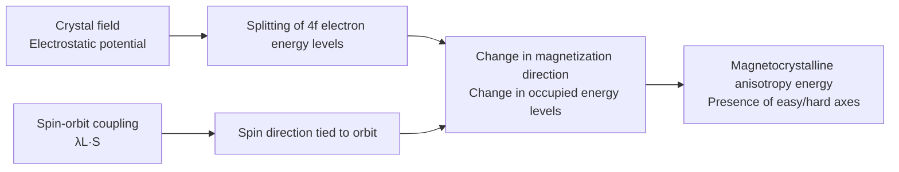

### 3.1.3 Magnetic Domains, Domain Walls, and Brown's Paradox

Large ferromagnetic bodies form **magnetic domains** to reduce the demagnetizing field energy. The domain wall thickness \(\delta_w\) is determined by the competition between exchange energy \(A\) and anisotropy energy \(K_1\):

$$
\delta_w = \pi \sqrt{\frac{A}{K_1}}
$$

For Nd\(_2\)Fe\(_{14}\)B, the exchange stiffness \(A \approx 7.7\) pJ/m, and \(K_1 \approx 4.6\) MJ/m\(^3\), giving an estimated \(\delta_w \approx 4\) nm. The actual domain size is determined jointly by the demagnetizing field, grain size, and defects.

!!! note "Term Explanation: Magnetic Domain, Domain Wall, Bloch Wall, Demagnetizing Field, Exchange Stiffness, Coercivity, Brown's Paradox"
    - **Magnetic Domain**: A small region within a ferromagnet where the spontaneous magnetization direction is uniform. Different domains have different magnetization directions, resulting in a low overall density of free magnetic poles, thereby reducing the demagnetizing field energy.
    - **Domain Wall**: The transition layer between adjacent magnetic domains, where the magnetization direction rotates gradually over a nanometer scale.
    - **Bloch Wall**: A type of domain wall where the magnetization rotates within the plane of the wall, resulting in no free magnetic poles on the wall surface. Commonly found in bulk materials.
    - **Demagnetizing Field**: An internal magnetic field generated by free magnetic poles on the material's surface, opposing the magnetization direction. Its magnitude depends on the sample shape, expressed as \(\mathbf{H}_d = -N \mathbf{M}\), where \(N\) is the demagnetizing factor.
    - **Exchange Stiffness (\(A\))**: A parameter describing the strength of the tendency for magnetic moments of adjacent atoms to remain parallel, originating from the exchange interaction, with units of J/m.
    - **Coercivity (\(H_c\) or \(H_{cj}\))**: The reverse magnetic field required to reduce the macroscopic magnetization to zero. It reflects the material's resistance to demagnetization.
    - **Brown's Paradox**: The theoretical coercivity of an ideal, uniform single crystal should approach the anisotropy field, but the actual coercivity of sintered magnets is much lower, indicating that defects and non-ideal structures dominate the demagnetization process.

```mermaid
flowchart LR
    A[Large ferromagnet<br/>High demagnetizing field energy] --> B[Formation of domains<br/>Reduces free poles]
    B --> C[Domain walls form between domains]
    C --> D[Exchange energy A favors thick walls]
    C --> E[Anisotropy energy K favors thin walls]
    D --> F[Bloch wall thickness<br/>δ_w ≈ π√(A/K)]
    E --> F
```

Brown's paradox states that for an ideal, uniformly magnetized single-crystal ellipsoid, magnetization reversal must occur via coherent rotation, and the theoretical coercivity should approach the anisotropy field \(H_A = 2K_1/(\mu_0 M_s)\) (approximately 7 T for Nd\(_2\)Fe\(_{14}\)B). However, the actual coercivity of sintered Nd-Fe-B magnets is typically only 1-3 T, far below the theoretical value. This discrepancy indicates that structural imperfections such as grain surface defects, discontinuous grain boundary phases, and local compositional fluctuations exist in real magnets, allowing reverse domains to nucleate at fields much lower than \(H_A\). Therefore, the essence of coercivity optimization is microstructural engineering, not simply enhancing intrinsic anisotropy.

### 3.1.4 Crystal Structure and Intrinsic Magnetic Properties of Nd\(_2\)Fe\(_{14}\)B

The Nd\(_2\)Fe\(_{14}\)B main phase has a complex tetragonal structure, **space group** \(P4_2/mnm\) (No. 136), with each **unit cell** containing 68 atoms: 8 Nd, 56 Fe, and 4 B. Fe atoms occupy six inequivalent crystallographic sites (\(16k_1\), \(16k_2\), \(8j_1\), \(8j_2\), \(4e\), \(4c\)), each with different local coordination environments and exchange interactions, collectively contributing to a high saturation magnetization. B atoms occupy trigonal prismatic interstices formed by Nd atoms, stabilizing the Fe-rich tetragonal phase and increasing the Curie temperature.

!!! note "Terminology Explanation: Space Group, Unit Cell, Intrinsic Magnetic Properties, Energy Product, Remanence, Squareness"
    - **Space group**: A complete mathematical group describing the symmetry of atomic arrangements in a crystal, including translational, rotational, and reflection symmetry operations.
    - **Unit cell**: The smallest repeating unit of a crystal structure, which can fill the entire space through translation.
    - **Intrinsic magnetic properties**: Properties that depend only on chemical composition and crystal structure, independent of microstructure, such as \(M_s\), \(K_1\), and \(T_C\).
    - **Energy product, \((BH)_{\max}\)**: The maximum product of magnetic induction \(B\) and magnetic field strength \(H\) in the second quadrant of the demagnetization curve, a key metric for the energy storage density of permanent magnets.
    - **Remanence, \(B_r\)**: The magnetic induction retained in a material after the external field is reduced to zero. It depends on \(M_s\) and grain alignment.
    - **Squareness, \(H_k/H_{cj}\)**: A measure of how close the demagnetization curve is to a rectangle above the knee point. Better squareness leads to more stable motor operating points.

The intrinsic magnetic properties of Nd\(_2\)Fe\(_{14}\)B are listed in the table below:

| Parameter | Value | Physical Meaning |
|-----------|-------|-----------------|
| Curie temperature \(T_C\) | 585 K (312 °C) | Ferromagnetic-paramagnetic transition temperature |
| Room-temperature saturation magnetization \(\mu_0 M_s\) | 1.61 T | Determines maximum remanence |
| Magnetocrystalline anisotropy field \(\mu_0 H_A\) | ~7 T | Easy-axis stability |
| Anisotropy constant \(K_1\) | 4.6 MJ/m\(^3\) | Energy barrier for magnetization reversal |
| Theoretical maximum energy product \((BH)_{\max}\) | ~512 kJ/m\(^3\) (64 MGOe) | Ideal single-crystal value |
| Commercial sintered magnet \((BH)_{\max}\) | 270-440 kJ/m\(^3\) | Limited by alignment and density |

The remanence \(B_r\) and coercivity \(H_{cj}\) of actual sintered magnets are controlled by alignment, density, and grain boundaries. High-performance magnets use jet milling to obtain flat powder particles of \(3-5\) \(\mu\)m, which are aligned in a 1.5-2 T magnetic field, pressed, and then sintered at 1050-1100 °C, with grain sizes typically controlled to \(5-8\) \(\mu\)m.

```mermaid
flowchart LR
    A[High Remanence Br] --> B[High Ms + High Alignment]
    C[High Coercivity Hcj] --> D[High Anisotropy + Good Grain Boundaries]
    B --> E[Energy Product (BH)max]
    D --> E
    E --> F[Motor Torque Density]
    subgraph "Demagnetization Curve Characteristic Points"
    G[Br]
    H[Knee Point]
    I[Hcj]
    end
    E --> G
    E --> H
    E --> I
```

### 3.1.5 Coercivity Mechanisms: Nucleation-Type, Pinning-Type, and Grain Boundary Engineering

The coercivity mechanisms of sintered Nd-Fe-B magnets can be mainly classified into two types:

1. **Nucleation-controlled**: Reverse domains first nucleate at defects on or near the grain surface, and then domain walls rapidly sweep across the entire grain. Coercivity depends on the nucleation field; the chemical composition of grain surface defects and grain boundary phases is critical.

2. **Pinning-controlled**: Domain walls are pinned by grain boundaries, precipitates, or defects during motion. Hot-deformed nanocrystalline Nd-Fe-B magnets typically belong to this category.

!!! note "Terminology Explanation: Nucleation, Pinning, Reverse Domain, Grain Boundary Engineering"
    - **Nucleation**: The emergence of small regions of reversed magnetization at defects or surfaces under thermodynamic driving force. The lower the nucleation field, the smaller the coercivity.
    - **Pinning**: The trapping of domain walls by local potential wells (grain boundary phases, precipitates, stress fields) during motion, requiring additional energy to be released.
    - **Reverse domain**: A magnetic domain with magnetization direction opposite to the external field, serving as the physical carrier of coercivity loss.
    - **Grain boundary engineering**: Optimizing magnetic isolation between grains and defect passivation by controlling the composition, thickness, and continuity of grain boundary phases, thereby enhancing coercivity.

For conventional sintered magnets, nucleation control dominates. Defects on grain surfaces (such as oxidation, Nd-lean layers, mechanical damage) significantly reduce the nucleation field. The grain boundary diffusion process creates a high-anisotropy shell on the grain surface, increasing the local anisotropy field in defect regions and thus suppressing the nucleation of reverse domains.

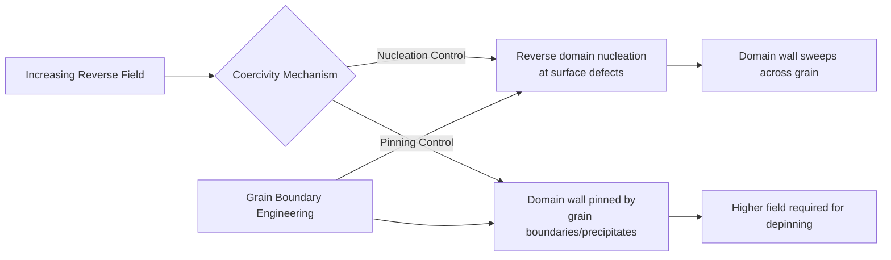

### 3.1.6 Grain Boundary Diffusion: Dy/Tb Core-Shell Structure and Diffusion Kinetics

Substituting Nd with heavy rare earth elements Dy or Tb forms (Nd,Dy)\(_2\)Fe\(_{14}\)B or (Nd,Tb)\(_2\)Fe\(_{14}\)B, with room-temperature anisotropy fields of approximately 15 T and 22 T, respectively, far exceeding the ~7 T of Nd\(_2\)Fe\(_{14}\)B. Through the **Grain Boundary Diffusion Process (GBDP)**, Dy/Tb can be introduced into the grain surface layer to form a heavy rare earth-rich shell (core-shell structure) without significantly reducing remanence, thereby greatly enhancing coercivity.

!!! note "Terminology Explanation: Grain Boundary Diffusion (GBDP), Core-Shell Structure, Chemically Induced Liquid Film Migration (CILFM), Diffusion, Grain Boundary, Atom Probe Tomography (APT)"
    - **Grain Boundary Diffusion (GBDP)**: A process where a heavy rare earth source is coated on the magnet surface, and atoms rapidly penetrate into the magnet interior along grain boundaries via heat treatment, forming a high-anisotropy shell on the grain surface.
    - **Core-shell structure**: The grain center maintains a low-heavy-rare-earth Nd\(_2\)Fe\(_{14}\)B main phase (core), while the edge forms a Dy/Tb-rich high-anisotropy layer (shell).
    - **Chemically Induced Liquid Film Migration (CILFM)**: The migration of a rare earth-rich liquid phase along grain boundaries driven by chemical potential/surface tension gradients, facilitating rapid diffusion of solute atoms and shell formation.
    - **Diffusion**: The migration of atoms from high-concentration to low-concentration regions driven by a chemical potential gradient, following Fick's laws. Grain boundary diffusion rates are much higher than bulk diffusion.
    - **Grain boundary**: The interface between grains with different orientations, characterized by loosely packed atoms, abundant diffusion channels, and higher energy.
    - **Atom Probe Tomography (APT)**: A characterization technique that uses field evaporation of ions and time-of-flight mass spectrometry to determine atomic species and positions, achieving near-atomic resolution.

Typical GBDP process: A Dy/Tb source (metal, fluoride DyF\(_3\), hydride TbH\(_3\), or low-melting-point alloy) is coated on the magnet surface, followed by diffusion heat treatment at 800-950 °C, allowing heavy rare earths to penetrate inward along grain boundaries and form a (Nd,HRE)\(_2\)Fe\(_{14}\)B shell at the edges of main phase grains. Hono et al. confirmed via APT that after GBDP, Dy is mainly distributed within a 1-2 \(\mu\)m surface layer of the grains, forming a high-anisotropy-field shell that effectively suppresses reverse domain nucleation.

The diffusion process is controlled by Chemically Induced Liquid Film Migration (CILFM): a rare earth-rich liquid phase forms at grain boundaries, and driven by surface tension/chemical potential gradients, the liquid film migrates, allowing heavy rare earth elements to rapidly diffuse along grain boundaries and form a shell. In 2025, Lee et al. reported a combined process using TaF\(_5\) two-step diffusion and Pr\(_{70}\)Cu\(_{15}\)Al\(_{10}\)Ga\(_5\) alloy, where the first diffusion step forms hexagonal TaB\(_2\) intergranular precipitates to suppress CILFM, enabling the second diffusion step to form a thinner, Pr-rich shell, achieving a coercivity of \(\mu_0 H_c = 2.35\) T without heavy rare earths.

```mermaid
flowchart LR
    A[Dy/Tb source coating] --> B[800-950 °C heat treatment]
    B --> C[Grain boundary forms RE-rich liquid phase]
    C --> D[Chemically induced liquid film migration CILFM]
    D --> E[Heavy RE infiltrates along grain boundaries]
    E --> F[(Nd,HRE)2Fe14B shell layer forms<br/>at main phase grain edges]
    F --> G[Core: low HRE main phase]
    F --> H[Shell: high HRE high H_A]
    H --> I[Coercivity enhancement]
```

**Table 3-1 Typical Nd-Fe-B grain boundary diffusion processes and magnetic properties**

| Diffusion source | Magnet matrix | Main effect | Reference |
|-------|---------|---------|------|
| Dy evaporation | Sintered Nd-Fe-B | \(H_{cj}\) enhancement, slight remanence decrease | Huang & Mo, Vacuum 2024 |
| Tb diffusion + Ga synergy | Sintered Nd-Fe-B | \(H_{cj}\) enhancement 53.15%, remanence unchanged | Wang et al., PMC11820678 |
| TaF\(_5\) + Pr-Al-Cu-Ga | Sintered Nd-Fe-B | Heavy RE-free, \(\mu_0 H_c = 2.35\) T | Lee et al., Acta Mater. 2025 |
| Dy-Al-Cu alloy | Sintered Nd-Fe-Co-B | Synergistic improvement of coercivity, thermal stability and corrosion resistance | Liu et al., JMMM 2024 |
| Tb-Pr-Ce-Cu diffusion | Sintered Nd-Fe-B | Reduces Tb usage while enhancing coercivity | Zhan et al., Mater. Today Commun. 2025 |

### 3.1.7 Temperature characteristics, coercivity temperature coefficient and motor selection

During motor operation, winding temperatures can reach 100-180 °C, making the high-temperature stability of permanent magnets crucial. The \(K_1\) and \(M_s\) of Nd\(_2\)Fe\(_{14}\)B decrease with rising temperature, leading to a reduction in coercivity. The coercivity temperature coefficient \(\beta\) is defined as

$$
\beta = \frac{H_{cj}(T_2) - H_{cj}(T_1)}{H_{cj}(T_1)(T_2 - T_1)} \times 100\%
$$

Typical sintered Nd-Fe-B has a \(\beta\) of approximately -0.5 to -0.8 %/°C. The introduction of Dy/Tb can improve high-temperature coercivity. Commercial grades are classified as N (≤80 °C), M (≤100 °C), H (≤120 °C), SH (≤150 °C), UH (≤180 °C), EH (≤200 °C) and AH (≤230 °C). For humanoid robot joint motors operating under prolonged high load, UH or EH grades are typically required.

!!! note "Terminology explanation: coercivity temperature coefficient, remanence temperature coefficient, operating point, knee point, eddy current loss"
    - **Coercivity temperature coefficient (\(\beta\))**: The percentage change in coercivity per unit temperature change; a negative value indicates a decrease in coercivity with increasing temperature.
    - **Remanence temperature coefficient (\(\alpha\))**: The percentage change in remanence per unit temperature change.
    - **Operating point**: The \(B\), \(H\) coordinates on the demagnetization curve of the permanent magnet during motor operation.
    - **Knee point**: The inflection point on the demagnetization curve where it transitions from an approximately linear region to a region of rapid decline. If the operating point falls below the knee point, the magnet cannot recover its original magnetization after the external field is removed, resulting in irreversible demagnetization.
    - **Eddy current loss**: Joule heating generated by circulating currents induced within a conductive magnet by an alternating magnetic field; depends on resistivity and magnet segmentation.

In addition to coercivity, motor design must also consider:
- **Remanence \(B_r\)**: Determines the air gap flux density and torque constant.
- **Squareness \(H_k/H_{cj}\)**: Affects motor efficiency and operating point stability.
- **Resistivity**: Influences eddy current loss; high-frequency motors require high-resistivity magnets.
- **Temperature coefficients \(\alpha\) and \(\beta\)**: Describe the variation of remanence and coercivity with temperature, respectively.

Based on an estimate of 30-50 motors per full-size robot, each using 50-100 g of Nd-Fe-B, the Nd-Fe-B usage per robot is approximately 1.5-4 kg. Assuming a Dy/Tb content of 3-8 wt%, the demand for Dy/Tb oxides per robot is 50-300 g.

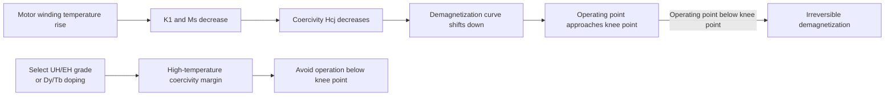

### 3.1.8 Corrosion mechanism and protection

Sintered Nd-Fe-B consists of multiple phases: the main phase Nd\(_2\)Fe\(_{14}\)B, a Nd-rich grain boundary phase, and small amounts of Nd\(_2\)O\(_3\), B\(_6\)O, etc. The Nd-rich grain boundary phase has high chemical activity and a low standard electrode potential. In a humid environment, it forms a **micro-galvanic couple** with the Fe-based main phase, leading to preferential corrosion at the grain boundaries. The corrosion products are loose and porous, offering no protection, and instead accelerate magnetic property degradation.

!!! note "Terminology explanation: micro-galvanic corrosion, standard electrode potential, grain boundary phase, coating, alloying"
    - **Micro-galvanic corrosion**: When two phases with different potentials are in contact in an electrolyte, the phase with the lower potential acts as the anode and is oxidized, while the phase with the higher potential acts as the cathode, promoting reduction reactions (e.g., oxygen reduction or hydrogen evolution).
    - **Standard electrode potential (\(E^0\))**: The equilibrium potential of an electrode couple relative to the standard hydrogen electrode (SHE) under standard conditions; a lower potential indicates a greater tendency to be oxidized.
    - **Grain boundary phase**: A Nd-rich phase distributed along grain boundaries with a composition different from the main phase; it affects both coercivity and corrosion resistance.
    - **Coating**: A metallic or organic layer deposited on the magnet surface to isolate it from the environment.
    - **Alloying**: Adding elements such as Co, Ga, Cu to the magnet to modify the grain boundary phase composition and improve chemical stability.

Protection strategies include:

1. **Surface coating**: Electroplated zinc, nickel-copper-nickel multilayer coating, epoxy resin coating. Ni-Cu-Ni coatings offer good corrosion resistance, but coating porosity and edge effects still need to be controlled.
2. **Alloying modification**: Adding Co to improve the corrosion resistance of the grain boundary phase; adding Ga, Cu to improve the wettability and chemical stability of the grain boundary phase.
3. **Grain boundary diffusion optimization**: Improving the continuity and chemical stability of the grain boundary phase. Studies by Mo et al. indicate that optimized diffusion and aging heat treatment can simultaneously enhance coercivity, thermal stability, and corrosion resistance.

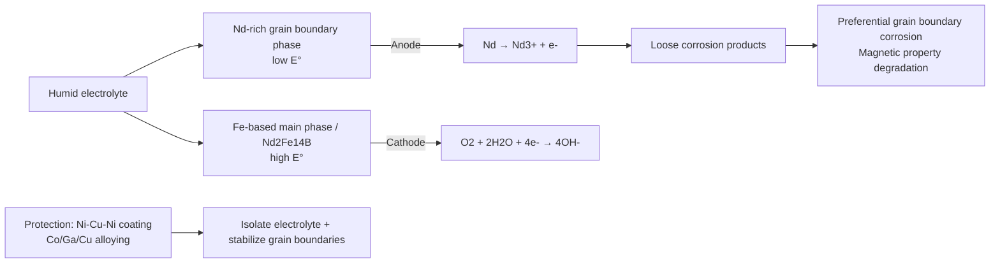

### 3.1.9 Recycling and regeneration: An urban mining perspective

Nd-Fe-B magnets contain 30-32 wt% rare earths (Nd, Pr, Dy, Tb). Recovering rare earths from electronic waste holds significant resource and strategic importance. Main recycling routes include:

- **Hydrometallurgy**: Acid leaching, solvent extraction; can recover high-purity rare earths but generates waste acid requiring treatment.
- **Pyrometallurgy**: Molten salt electrolysis or high-temperature reduction; suitable for large-scale processing.
- **Hydrogenation-Disproportionation-Desorption-Recombination (HDDR)**: Utilizes hydrogenation-disproportionation-desorption-recombination reactions to directly regenerate magnetic powder.

!!! note "Terminology explanation: hydrometallurgy, pyrometallurgy, HDDR, urban mining"
    - **Hydrometallurgy**: A method using acid, base, or complexation reactions in aqueous solutions to dissolve, separate, and recover metals.
    - **Pyrometallurgy**: A method of recovering metals through smelting, reduction, or electrolysis at high temperatures.
    - **HDDR (Hydrogenation-Disproportionation-Desorption-Recombination)**: A process that uses hydrogen to react with Nd-Fe-B, causing it to decompose, and then desorbs hydrogen to recombine into fine-grained magnetic powder.
    - **Urban mining**: The concept of treating waste electronic products and industrial waste as a source of recoverable metal resources.

A 2025 review by Kovačič systematically summarizes the latest advances in corrosion and recycling of sintered Nd-Fe-B, pointing out that future recycling technologies need to balance rare earth recovery rate, energy consumption, and environmental impact.

### 3.1.10 Micromagnetic simulation and coercivity prediction

Micromagnetic simulation is an important tool for understanding the coercivity mechanism of Nd-Fe-B and optimizing its microstructure. The Landau-Lifshitz-Gilbert (LLG) equation is the fundamental equation of micromagnetics:

$$
\frac{\partial \mathbf{m}}{\partial t} = -\gamma \mathbf{m} \times \mathbf{H}_{eff} + \alpha \mathbf{m} \times \frac{\partial \mathbf{m}}{\partial t}
$$

where \(\mathbf{m}\) is the normalized magnetization, \(\gamma\) is the gyromagnetic ratio, \(\alpha\) is the Gilbert damping coefficient, and \(\mathbf{H}_{eff}\) is the effective field, including the exchange field, anisotropy field, demagnetizing field, and applied field.

!!! note "Terminology explanation: Micromagnetics, LLG equation, Gyromagnetic ratio, Gilbert damping, Effective field"
    - **Micromagnetics**: A theoretical framework for solving the spatiotemporal evolution of the magnetization vector under the continuum approximation, with a scale between atomic magnetic moments and macroscopic magnetic domains.
    - **Landau-Lifshitz-Gilbert equation (LLG equation)**: A dynamic equation describing the precession and relaxation of the magnetization vector under an external field and damping.
    - **Gyromagnetic ratio (\(\gamma\))**: The ratio of magnetic moment to angular momentum, determining the precession frequency of the magnetic moment in a magnetic field.
    - **Gilbert damping (\(\alpha\))**: Describes the rate of energy dissipation from magnetization precession to the lattice.
    - **Effective field**: The sum of all fields acting on the magnetic moment, obtainable via the variational derivative of the energy functional with respect to magnetization.

Micromagnetic simulations can be used to study:
- The effect of grain size on coercivity: There exists an optimal grain size range (typically 3-8 μm); larger grains increase the probability of defects, while smaller grains enhance exchange coupling.
- Grain boundary phase thickness and magnetic isolation effect: The ideal grain boundary phase thickness should be sufficient to decouple adjacent grains, but excessive thickness reduces remanence.
- Optimization of core-shell structures: The thickness and concentration distribution of the Dy/Tb shell layer affect the trade-off between coercivity and remanence.

A 2025 study by Lee et al., combining micromagnetic simulations, showed that a thin, high-Pr-concentration shell layer that suppresses CILFM formation can significantly increase the nucleation field at the grain surface, which is key to achieving high coercivity in heavy-rare-earth-free magnets.

### 3.1.11 Magnetic Circuit Design and Losses in Permanent Magnet Motors

Humanoid robot joint motors typically use **Permanent Magnet Synchronous Motors (PMSM)** or frameless torque motors. The magnetic properties of the permanent magnet directly influence motor design:

- **Air-gap flux density** \(B_g\): Determined by the permanent magnet remanence \(B_r\) and the magnetic circuit structure, with typical values of 0.8-1.2 T.
- **Torque constant** \(K_t\): Related to the air-gap flux density, number of winding turns, and motor geometry.
- **Demagnetization curve**: Under high temperature and large demagnetizing fields from current, the operating point must be ensured to lie above the knee point.

!!! note "Terminology explanation: PMSM, Air-gap flux density, Torque constant, Demagnetization curve"
    - **Permanent Magnet Synchronous Motor (PMSM)**: A motor where the rotor is excited by permanent magnets and the stator windings carry AC current to produce a rotating magnetic field, with both rotating synchronously.
    - **Air-gap flux density**: The magnetic flux density in the air gap between the stator and rotor, directly determining the electromagnetic torque.
    - **Torque constant (\(K_t\))**: The torque produced per unit current, proportional to the air-gap flux density and the effective number of winding turns.
    - **Demagnetization curve**: The \(B-H\) curve in the second quadrant, describing the magnetization behavior of the permanent magnet under a reverse field.

Motor losses include copper loss, iron loss, mechanical loss, and permanent magnet eddy current loss. At high operating frequencies, permanent magnet eddy current loss becomes significant and can be reduced by segmenting the magnet, increasing its resistivity, or using bonded magnets.

#### 3.1.11.1 Simplified Magnetic Circuit Model and Air-Gap Flux Density

Permanent magnet motor design often starts from an equivalent magnetic circuit. For a closed magnetic circuit consisting of a permanent magnet, air gap, and iron core, neglecting the iron core reluctance, flux continuity requires

$$
\Phi_g = B_g A_g = B_m A_m
$$

And Ampere's circuital law gives

$$
H_m l_m + H_g l_g = 0
$$

where \(H_g = B_g / \mu_0\). The demagnetization curve of Nd-Fe-B permanent magnets in the operating region can be approximated as linear:

$$
B_m = \mu_0 \mu_r H_m + B_r
$$

where \(\mu_r\) is the **recoil permeability**. For sintered Nd-Fe-B, \(\mu_r \approx 1.04-1.08\). Combining the above equations yields the air-gap flux density

$$
B_g = \frac{B_r}{\frac{A_g}{A_m} + \mu_r \frac{l_g}{l_m}}
$$

In practical design, the Carter coefficient \(k_c\) is used to correct the effect of slot openings on air-gap reluctance: \(l_{g,\text{eff}} = k_c k_s g\), where \(k_s\) is the saturation factor (typically 1.1-1.3). When \(A_g/A_m \approx 1\) and \(l_g/l_m \ll 1\), \(B_g \approx B_r\); however, to resist armature reaction demagnetization, the permanent magnet thickness \(l_m\) is usually chosen such that \(l_m/l_g = 5-10\).

!!! note "Terminology explanation: Magnetomotive force, Reluctance, Permeance, Recoil permeability, Carter coefficient"
    - **Magnetomotive force (MMF)**: The "magnetic potential" driving magnetic flux; the MMF provided by a permanent magnet is \(F_m = H_m l_m\).
    - **Reluctance (\(\mathcal{R}\))**: The opposition to magnetic flux in a magnetic circuit, \(\mathcal{R}=l/(\mu A)\), analogous to electrical resistance.
    - **Permeance (\(P\))**: The reciprocal of reluctance, \(P=\mu A/l\).
    - **Recoil permeability (\(\mu_r\))**: The ratio of the slope of the minor \(B-H\) loop to \(\mu_0\) when a permanent magnet is locally demagnetized and then re-magnetized.
    - **Carter coefficient (\(k_c\))**: An empirical coefficient accounting for the increase in air-gap reluctance due to slotting, typically \(k_c \approx 1.0-1.3\).

```mermaid
flowchart LR
    A[Motor specifications<br/>Torque/Speed/Voltage] --> B[Magnetic circuit geometry design]
    B --> C[Permanent magnet dimensions<br/>lm, Am]
    C --> D[Equivalent magnetic circuit calculation]
    D --> E[Bg = Br/(Ag/Am + μr·lg/lm)]
    E --> F[Winding turns and pole pairs]
    F --> G[Thermal check and efficiency map]
```

#### 3.1.11.2 Torque Equation and Back-EMF

For a Surface-Mounted PMSM (SPMSM), the direct and quadrature axis inductances are approximately equal (\(L_d \approx L_q\)), and the electromagnetic torque is primarily generated by the permanent magnet flux linkage \(\lambda_m\) and the quadrature axis current \(i_q\):

$$
T_e = \frac{3}{2} p \lambda_m i_q
$$

where \(p\) is the number of pole pairs. The relationship between permanent magnet flux linkage and air-gap flux density is

$$
\lambda_m = N_{ph} k_w \frac{2}{\pi} \tau l B_g
$$

where \(N_{ph}\) is the number of series turns per phase, \(k_w\) is the winding factor, \(\tau\) is the pole pitch, and \(l\) is the axial length of the iron core. The back-EMF amplitude is

$$
E_{ph} = \omega_e \lambda_m = p \Omega_m \lambda_m
$$

The torque constant \(K_t = T_e / I_q = \frac{3}{2} p \lambda_m\) (corresponding to peak current and peak torque). For sinusoidal wave drive, the RMS line-to-line voltage satisfies

$$
V_{LL,rms} \approx \sqrt{E_{ph}^2 + (\omega_e L_s I)^2}
$$

In the high-speed field weakening region, the voltage limit ellipse constraint must also be satisfied.

!!! note "Terminology explanation: Flux linkage, Back-EMF, Pole pairs, Field weakening, Winding factor"
    - **Flux linkage (\(\lambda\))**: The total magnetic flux linked by a coil, \(\lambda = N \Phi\).
    - **Back-EMF**: The voltage induced in the stator windings due to the rotor cutting magnetic field lines during rotation.
    - **Pole-pair number (\(p\))**: The number of spatial periods corresponding to one pair of N-S magnetic poles in the motor.
    - **Field weakening**: Extending the constant power operating range of the motor by applying a direct-axis demagnetizing current \(i_d < 0\).
    - **Winding factor (\(k_w\))**: A discount factor for the effective number of winding turns, accounting for distribution, short-pitching, and skewing.

#### 3.1.11.3 Loss Components and Efficiency Map

The total motor loss can be decomposed into

$$
P_{loss} = P_{Cu} + P_{Fe} + P_{pm} + P_{mech}
$$

- Copper loss: \(P_{Cu} = 3 I^2 R_s\), where \(R_s\) is the phase resistance, which increases with temperature: \(R_s(T) = R_{25}[1+\alpha_{Cu}(T-25)]\).
- Iron loss: Using the modified Steinmetz equation

$$
P_{Fe} = k_h f B_m^\alpha + k_e (f B_m)^2 + k_a (f B_m)^{1.5}
$$

Where \(k_h\), \(k_e\), \(k_a\) are provided by the silicon steel sheet manufacturer, and \(\alpha\) is typically 1.6-2.2.
- Permanent magnet eddy-current loss:

$$
P_{pm} = \frac{\pi^2}{20 \rho_{pm}} \frac{(B_m f)^2 t^4}{V_{pm}} \quad \text{(thin plate approximation)}
$$

Where \(\rho_{pm}\) is the resistivity of the permanent magnet, and \(t\) is the magnet segmentation thickness.
- Mechanical loss: bearing friction and windage, usually accounting for a small proportion.

Efficiency is

$$
\eta = \frac{P_{out}}{P_{out}+P_{loss}}
$$

Humanoid robot joints often switch between low-speed high-torque and high-speed low-torque conditions. During design, the rated point should fall within the high-efficiency region of the efficiency map (\(\eta \ge 90\%\)).

!!! note "Terminology explanation: Steinmetz equation, copper loss, core loss, eddy-current loss, efficiency map"
    - **Steinmetz equation**: An empirical core loss model that expresses hysteresis loss, eddy-current loss, and excess loss as power functions of frequency and flux density.
    - **Copper loss**: Joule heating generated by current in the winding resistance.
    - **Core loss**: Hysteresis and eddy-current losses generated in the core by alternating magnetic fields.
    - **Eddy-current loss**: Loss generated by induced circulating currents in conductive materials under alternating magnetic fields.
    - **Efficiency map**: A contour plot of efficiency at different speed-torque operating points, a core tool for motor selection.

#### 3.1.11.4 Numerical Example of Joint Motor Design

Consider a robot knee joint motor with a rated power of 200 W and a rated speed of 3000 rpm. Given Nd-Fe-B remanence \(B_r = 1.2\) T, recoil permeability \(\mu_r = 1.05\), air gap \(l_g = 0.5\) mm, magnet length \(l_m = 4\) mm, pole arc coefficient \(A_g/A_m = 1.1\). Estimate the air gap flux density, torque constant, and rated current.

```python
import numpy as np

# Permanent magnet and magnetic circuit parameters
Br = 1.2          # T
mu_r = 1.05
lg = 0.5e-3       # m
lm = 4.0e-3       # m
Ag_over_Am = 1.1
p = 4             # Number of pole pairs
N_ph = 60         # Series turns per phase
kw = 0.93         # Winding factor
tau = 0.020       # Pole pitch m
l_core = 0.030    # Axial length m

# Air gap flux density
Bg = Br / (Ag_over_Am + mu_r * lg / lm)
print(f"Bg = {Bg:.3f} T")

# Permanent magnet flux linkage
lambda_m = N_ph * kw * (2/np.pi) * tau * l_core * Bg
print(f"lambda_m = {lambda_m:.4f} Wb")

# Rated angular velocity
Omega_m = 3000 * 2*np.pi / 60  # rad/s
E_ph = p * Omega_m * lambda_m
print(f"Phase back EMF amplitude = {E_ph:.2f} V")

# Torque constant
Kt = 1.5 * p * lambda_m          # Nm/A_peak
T_rated = 0.64                   # 200 W @ 3000 rpm
Iq_rated = T_rated / Kt
print(f"Kt = {Kt:.3f} Nm/A")
print(f"Rated Iq = {Iq_rated:.2f} A")

# Loss estimation
Rs = 0.12         # Ω
I = Iq_rated
P_Cu = 3 * I**2 * Rs
P_out = T_rated * Omega_m
eta = P_out / (P_out + P_Cu)
print(f"Copper loss = {P_Cu:.1f} W, Efficiency (copper loss only) = {eta*100:.1f}%")
```

The output of the above script is approximately \(B_g \approx 0.95\) T, \(K_t \approx 0.31\) Nm/A, and a rated current of about 2.1 A. If the winding resistance is 0.12 Ω, the copper loss alone reaches 1.5 W, corresponding to an efficiency of about 99.3% (ignoring core loss and mechanical loss), indicating that the efficiency of a small-power joint at the rated point can be very high, but the copper loss will increase rapidly under peak torque.

### 3.1.12 Rare Earth Permanent Magnet Supply Chain and Pricing Mechanism

The rare earth permanent magnet supply chain includes mining, beneficiation, separation and smelting, alloy preparation, magnet manufacturing, surface treatment, and end-use applications. China dominates this industrial chain:

| Stage | China's Global Share | Key Companies/Regions |
|-----|------------|--------------|
| Rare earth mining | 60-70% | Northern Rare Earth, China Rare Earth Group |
| Separation and smelting | ~90% | China Minmetals, Shenghe Resources |
| NdFeB magnetic materials | 85-93% | Zhong Ke San Huan, JL Mag, Ningbo Yunsheng |
| Heavy rare earth processing | ~99% | Ion-adsorption rare earth deposits in Southern China |

In April 2025, China implemented export licensing controls on medium and heavy rare earths such as Dy and Tb, causing price fluctuations for high-coercivity magnets in the international market. Adamas Intelligence predicts that if demand trends continue and supply growth falls short of expectations, the global annual NdFeB supply gap could reach 206,000 tons by 2035. As a new source of demand, humanoid robots, although currently using a small amount per unit, will further tighten the already strained supply chain.

---

## 3.2 Structural Materials

### 3.2.1 Metal Strengthening Mechanisms: Obstruction of Dislocation Motion

The strength of metals can be increased through various mechanisms, the core of which is obstructing **dislocation** motion. Dislocations are line defects in the atomic arrangement of crystals, and their slip is the primary mode of plastic deformation in metals. Dislocation motion can be described by the Burgers vector \(\mathbf{b}\).

!!! note "Term Explanation: Dislocation, Burgers Vector, Slip, Plastic Deformation"
    - **Dislocation**: A line defect in the atomic arrangement of a crystal, allowing local slip to occur at stresses far below the theoretical shear stress of a perfect crystal.
    - **Burgers vector (\(\mathbf{b}\))**: A vector describing the magnitude and direction of lattice distortion caused by a dislocation; its magnitude is on the order of an atomic spacing.
    - **Slip**: The movement of a dislocation along specific crystallographic planes and directions, leading to macroscopic shape changes in the crystal.
    - **Plastic deformation**: Permanent, non-recoverable deformation after unloading, dominated by dislocation multiplication and motion.

The main strengthening mechanisms include:

**Solid-Solution Strengthening**: Solute atoms cause lattice distortion and interact elastically with dislocations. The Fleischer model gives the relationship between the strength increment and solute concentration \(c\):

$$
\Delta\tau_{ss} \propto c^{2/3}
$$

For dilute solid solutions, the strength increment is approximately proportional to \(c^{1/2}\). The greater the size mismatch and modulus mismatch between the solute and matrix atoms, the stronger the strengthening effect.

!!! note "Term Explanation: Solid-Solution Strengthening, Solute Atom, Lattice Distortion"
    - **Solid-solution strengthening**: Solute atoms randomly distributed in the matrix lattice impede dislocation motion through their elastic stress fields.
    - **Solute atom**: A foreign atom dissolved in the matrix.
    - **Lattice distortion**: Elastic deformation of the surrounding lattice due to differences in atomic size or bonding.

**Precipitation Strengthening**: Second-phase particles impede dislocations by either cutting through or bypassing them. When particles are non-shearable, the critical shear stress for bypassing them via the Orowan mechanism is

$$
\tau_{Orowan} = \frac{Gb}{2\pi\lambda} \ln\frac{r}{r_0}
$$

where \(G\) is the shear modulus, \(b\) is the Burgers vector, \(\lambda\) is the interparticle spacing, and \(r\) is the particle radius. At peak aging, fine, dispersed coherent or semi-coherent precipitates provide maximum strengthening; during overaging, particles coarsen, \(\lambda\) increases, and the strengthening effect decreases.

!!! note "Term Explanation: Precipitation Strengthening, Orowan Mechanism, Coherent/Semi-coherent, Peak Aging, Overaging"
    - **Precipitation strengthening**: Dispersed second-phase particles in the matrix impede dislocation motion.
    - **Orowan mechanism**: Dislocations bypass non-shearable particles, leaving dislocation loops around them, requiring additional stress.
    - **Coherent/semi-coherent precipitate**: A precipitate whose lattice is continuously or partially matched with the matrix, resulting in low interfacial energy and significant strengthening.
    - **Peak aging**: An aging state where precipitate size and density achieve optimal strengthening.
    - **Overaging**: Coarsening of precipitates and increased spacing, leading to decreased strength but often improved toughness/corrosion resistance.

**Grain Refinement Strengthening**: The Hall-Petch relationship gives the yield strength as a function of grain size \(d\):

$$
\sigma_y = \sigma_0 + k_y d^{-1/2}
$$

Grain refinement increases both strength and toughness because grain boundaries impede dislocation motion and blunt cracks. However, excessively fine grains may reduce high-temperature creep resistance.

!!! note "Term Explanation: Grain Refinement Strengthening, Hall-Petch Relationship, Yield Strength"
    - **Grain refinement strengthening**: Increasing grain boundary area by reducing grain size to impede dislocation slip.
    - **Hall-Petch relationship**: An empirical relationship where yield strength increases linearly with the inverse square root of grain size.
    - **Yield strength**: The stress at which a material begins to undergo plastic deformation.

**Work Hardening**: An increase in dislocation density \(\rho\) leads to a rise in flow stress:

$$
\sigma = \sigma_0 + \alpha M G b \sqrt{\rho}
$$

where \(\alpha\) is a constant and \(M\) is the Taylor factor.

!!! note "Term Explanation: Work Hardening, Dislocation Density, Taylor Factor"
    - **Work hardening**: Plastic deformation increases dislocation density, requiring higher stress for further deformation.
    - **Dislocation density (\(\rho\))**: The total length of dislocation lines per unit volume.
    - **Taylor factor**: An orientation-averaged factor relating the critical resolved shear stress of a single crystal to the macroscopic yield stress of a polycrystal.

**Texture Strengthening**: Utilizes crystallographic orientation control to activate slip systems. For HCP metals like magnesium, controlling texture to misalign the easy slip direction with the principal stress direction can increase yield strength but reduce ductility.

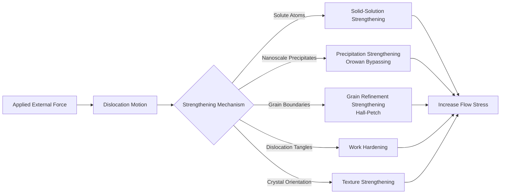

### 3.2.2 Aluminum Alloys: Aging Precipitation Sequence and Grade Selection

Aluminum alloys are the most widely used metallic materials for structural components in humanoid robots. They are classified by primary alloying elements into series such as 2xxx (Al-Cu), 5xxx (Al-Mg), 6xxx (Al-Mg-Si), and 7xxx (Al-Zn-Mg-Cu).

!!! note "Term Explanation: Aluminum Alloy Series, Solution Treatment, Aging Treatment"
    - **Aluminum alloy series**: An international designation system classifying alloys by primary alloying elements; 1xxx is pure Al, 2xxx is Cu-based, 5xxx is Mg-based, 6xxx is Mg-Si-based, and 7xxx is Zn-Mg-Cu-based.
    - **Solution treatment**: Heating the alloy to a single-phase region to fully dissolve solute atoms, followed by rapid quenching to retain a supersaturated solid solution.
    - **Aging treatment**: A heat treatment at room or elevated temperature to precipitate strengthening phases from the supersaturated solid solution.

**6xxx Series (Al-Mg-Si)**: Due to good extrudability, weldability, and corrosion resistance, they are widely used for frames and housings. Their strengthening phase is Mg\(_2\)Si, and the aging precipitation sequence after solution treatment is:

$$
\text{SSSS} \rightarrow \text{GP Zone} \rightarrow \beta'' \rightarrow \beta' \rightarrow \beta\text{(Mg}_2\text{Si)}
$$

The \(\beta''\) phase is coherent with the matrix and provides the primary strengthening effect; T6 treatment (solution + artificial aging) achieves a good balance of strength and formability. Typical 6061-T6 has a yield strength of approximately 276 MPa and a tensile strength of approximately 310 MPa.

!!! note "Term Explanation: GP Zone, β'', β', β(Mg2Si), T6 Treatment"
    - **GP zone (Guinier-Preston zone)**: Nanoscale solute-rich/depleted regions in the aluminum matrix, precursors to precipitation.
    - **\(\beta''\)**: A metastable precipitate coherent with the matrix, small in size and high in density, the primary strengthening phase in peak-aged 6xxx alloys.
    - **\(\beta'\)**: A semi-coherent transition precipitate.
    - **\(\beta\) (Mg\(_2\)Si)**: The stable equilibrium phase; its coarsening reduces the strengthening effect.
    - **T6 treatment**: Solution treatment and quenching followed by artificial aging to peak strength.

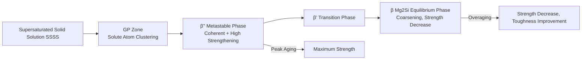

**7xxx Series (Al-Zn-Mg-Cu)**: These have the highest strength and are used for high-stress joints and transmission components. The main strengthening phases are \(\eta'\)-MgZn\(_2\) and T-Al\(_2\)Mg\(_3\)Zn\(_3\). Grades such as 7050 and 7075, after T6/T7/T8 treatment, can achieve yield strengths above 500 MPa. Starink and Wang (2003) established a physical model for the yield strength of overaged 7xxx alloys, considering the effects of precipitate coarsening, solid-solution strengthening, and texture. However, 7xxx alloys are sensitive to stress corrosion, which can be mitigated through overaging (T7) or grain refinement.

!!! note "Term Explanation: Stress Corrosion, T7 Treatment"
    - **Stress corrosion cracking (SCC)**: Brittle cracking occurring under the combined action of tensile stress and a corrosive environment.
    - **T7 Treatment**: Overaging after solution quenching, used to improve resistance to stress corrosion cracking.

**Die-cast aluminum alloys**: Integrated die-casting technology is emerging in the manufacturing of humanoid robot structures. For die-cast aluminum alloys, the Fe content must be controlled to reduce the adverse effect of \(\beta\)-Al\(_5\)FeSi acicular phases on toughness; simultaneously, the Cu content must be controlled to improve corrosion resistance. The Al-Si-Mg system (e.g., A356, A380) and the Al-Si-Cu-Mg system are commonly used die-cast alloys.

### 3.2.3 Magnesium Alloys: HCP Structure, Deformation Mechanisms, and Texture

Magnesium alloys have a density of 1.7-1.8 g/cm\(^3\), approximately 2/3 that of aluminum and 1/4 that of steel, making them the lightest structural metals. Their HCP structure gives rise to unique mechanical and corrosion behaviors.

!!! note "Term Explanation: HCP Structure, c/a Ratio, Critical Resolved Shear Stress (CRSS), Twinning, Texture"
    - **HCP (hexagonal close-packed)**: A hexagonal close-packed structure with atomic arrangement in ABAB stacking.
    - **c/a Ratio**: The ratio of the HCP unit cell height \(c\) to the basal plane edge length \(a\); the ideal value is \(\sqrt{8/3} \approx 1.633\).
    - **Critical Resolved Shear Stress (CRSS)**: The resolved shear stress required to activate a specific slip system.
    - **Twinning**: A uniform shear deformation of a portion of a crystal along a specific interface, creating a mirror-symmetric orientation, used to accommodate deformation in directions where slip is difficult.
    - **Texture**: The preferred orientation distribution of grains in a polycrystalline material.

**Crystallography and Deformation Mechanisms**: \(\alpha\)-Mg has a \(c/a = 1.624\), slightly less than the ideal sphere packing value of 1.633. At room temperature, basal slip \(\langle 11\bar{2}0 \rangle(0001)\) has the lowest CRSS (approximately 0.5-0.7 MPa) and is the primary deformation mode. Prismatic slip \(\langle 11\bar{2}0 \rangle(10\bar{1}0)\), pyramidal slip \(\langle 11\bar{2}2 \rangle(11\bar{2}\bar{1})\), and \(\langle c+a \rangle\) dislocations require higher temperatures or stresses to activate, with CRSS values 1-2 orders of magnitude higher than basal slip.

Twinning is an important mechanism for accommodating \(c\)-axis deformation. Tensile twins \(\{10\bar{1}2\}\langle 10\bar{1}\bar{1} \rangle\) are easily activated under compression parallel to the \(c\)-axis or tension perpendicular to the \(c\)-axis; compressive twins \(\{10\bar{1}1\}\langle 10\bar{1}\bar{2} \rangle\) require higher stresses. The interaction between twin boundaries and dislocations significantly affects work hardening behavior.

Due to the limited number of slip systems and the large differences in CRSS, magnesium alloys exhibit poor room-temperature ductility, strong anisotropy, and significant texture after forming. Common improvement strategies include:
- **Grain refinement**: Enhances Hall-Petch strengthening and promotes non-basal slip.
- **Rare earth element alloying**: Elements such as Gd, Y, Ce, and Nd can reduce the CRSS ratio of prismatic/pyramidal slip to basal slip, improving room-temperature ductility (the "rare earth texture weakening effect").
- **Heat treatment**: T4/T5/T6 treatments to control the distribution of secondary phases.

#### 3.2.3.1 Geometric Constraints of HCP Slip Systems and Schmid's Law

For macroscopic plastic deformation of a metal, 5 independent slip systems are required (von Mises criterion) to accommodate an arbitrary strain tensor. At room temperature, HCP magnesium has only basal slip $\langle 11\bar{2}0 \rangle(0001)$ with a sufficiently low CRSS, and basal slip can only provide 2 independent slip systems. Therefore, when the applied stress direction is unfavorable for basal slip, the material must accommodate deformation through twinning or non-basal slip, leading to increased yield stress, decreased ductility, and enhanced anisotropy.

Schmid's law relates macroscopic yield to the applied resolved shear stress. For uniaxial tension or compression, the resolved shear stress on a given slip system is

$$
\tau = \sigma \cos\phi \cos\lambda = m \, \sigma
$$

where $\sigma$ is the applied axial stress, $\phi$ is the angle between the load axis and the slip plane normal, $\lambda$ is the angle between the load axis and the slip direction, and $m = \cos\phi \cos\lambda$ is the **Schmid factor**. Slip initiates when $\tau$ reaches the CRSS of that slip system.

!!! note "Term Explanation: Independent Slip System, Schmid's Law, Schmid Factor, von Mises Criterion"
    - **Independent slip system**: A combination of slip systems capable of producing independent plastic strain components. Uniform deformation of a polycrystalline material requires at least 5.
    - **Schmid's law**: The condition for slip initiation is that the resolved shear stress on the slip system reaches a critical value, the CRSS.
    - **Schmid factor**: The geometric factor that converts macroscopic stress to resolved shear stress, $m = \cos\phi \cos\lambda$.
    - **von Mises criterion**: The classic criterion that a polycrystalline material requires at least 5 independent slip systems to achieve arbitrary shape change.

For basal slip in magnesium, when the load is parallel to the $c$-axis, $\cos\phi = 0$, and basal slip cannot be activated; in this case, $\{10\bar{1}2\}$ tensile twinning or non-basal slip at elevated temperatures must be used to accommodate strain along the $c$-axis. This is the geometric root cause of the poor room-temperature formability of HCP magnesium.

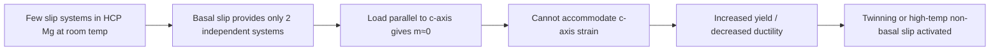

#### 3.2.3.2 Crystallography and Shear of Twinning

Twinning is an important mechanism for accommodating compression along the $c$-axis or tension perpendicular to the $c$-axis in HCP magnesium. Taking the $\{10\bar{1}2\}\langle 10\bar{1}\bar{1} \rangle$ tensile twin as an example, its shear magnitude $\gamma$ can be derived from crystal geometry:

$$
\gamma = \frac{|c/a|^2 - 3}{\sqrt{3}\, c/a}
$$

For $\alpha$-Mg, $c/a \approx 1.624$, substituting gives

$$
\gamma = \frac{1.624^2 - 3}{\sqrt{3} \times 1.624} \approx 0.129
$$

That is, twinning produces a uniform shear of approximately 12.9% along the twin plane. After twinning initiates, the crystal lattice orientation undergoes an abrupt change; orientations that were previously unfavorable for basal slip may become favorable, thereby relieving stress. However, twin boundaries themselves act as obstacles to dislocation motion, leading to significant work hardening and twinning-detwinning fatigue damage under cyclic loading.

!!! note "Term Explanation: Twinning Shear, Twin Boundary, Detwinning"
    - **Twinning shear ($\gamma$)**: The characteristic shear deformation of a crystal along the twin plane during twinning, determined by the crystal structure.
    - **Twin boundary**: The coherent interface between the matrix and the twin, which can act as an obstacle to dislocation motion.
    - **Detwinning**: The process of twin disappearance and orientation recovery upon reverse loading, an important mechanism for cyclic softening in magnesium alloys.

#### 3.2.3.3 Physical Mechanisms of Rare Earth Element Texture Weakening

The addition of rare earth elements (RE) such as Gd, Y, Ce, and Nd to magnesium can significantly weaken deformation texture and improve room-temperature ductility. Traditional views attribute their effects to:

1. **Reducing the CRSS of non-basal slip**: RE atoms, having larger atomic radii, alter the stacking fault energy (SFE) and dislocation core structure, making pyramidal $\langle c+a \rangle$ dislocations easier to dissociate and move, thereby increasing the number of independent slip systems.
2. **Changing grain growth orientation**: RE elements segregate at grain boundaries or form rare earth phases, inhibiting the growth of grains with specific orientations, leading to a randomization of the basal texture.
3. **Promoting dynamic recrystallization**: RE lowers the recrystallization temperature and alters the recrystallization texture, forming new grains with random orientations.

!!! note "Term Explanation: Stacking Fault Energy, Dislocation Core, Dynamic Recrystallization, Texture Weakening"
    - **Stacking fault energy (SFE)**: The energy cost per unit area when the stacking sequence of close-packed planes is disrupted, affecting dislocation dissociation and non-basal slip.
    - **Dislocation core**: The region near the center of a dislocation where atomic positions are severely distorted; its structure determines whether the dislocation moves by conservative slip or non-conservative climb.
    - **Dynamic recrystallization (DRX)**: Recrystallization occurring simultaneously with deformation, which can refine grains and weaken texture.
    - **Texture weakening**: Making the grain orientation distribution more random, reducing the anisotropy of mechanical properties.

The following Python script calculates the variation of Schmid factors for basal slip and tensile twinning in HCP magnesium with loading direction, and illustrates the effect of $c$-axis orientation on yield anisotropy:

```python
import numpy as np
import matplotlib.pyplot as plt
```

# HCP Basal Slip System (0001)[11-20] and Tensile Twinning {10-12}<10-1-1>
# Assume c-axis along z, a1 along x; load axis in x-z plane at angle theta to c-axis
theta_deg = np.linspace(0, 90, 91)
theta = np.deg2rad(theta_deg)

# Basal slip: slip plane normal n = [0,0,1], slip direction b = [1,0,0]
# Load axis L = [sinθ, 0, cosθ]
cos_phi_base = np.cos(theta)   # n·L
cos_lambda_base = np.sin(theta) # b·L
m_base = np.abs(cos_phi_base * cos_lambda_base)

# Tensile twinning {10-12}<10-1-1>: approximate twin plane normal and twin direction
# Simplified model: twin plane normal n_t ≈ [sqrt(3)/2, 0, c/a] normalized,
# twin direction d_t ≈ [-c/a, 0, sqrt(3)/2] normalized (c/a=1.624)
coa = 1.624
n_t = np.array([np.sqrt(3)/2, 0, coa])
n_t = n_t / np.linalg.norm(n_t)
d_t = np.array([-coa, 0, np.sqrt(3)/2])
d_t = d_t / np.linalg.norm(d_t)

L = np.vstack([np.sin(theta), np.zeros_like(theta), np.cos(theta)]).T
cos_phi_twin = np.abs(L @ n_t)
cos_lambda_twin = np.abs(L @ d_t)
m_twin = cos_phi_twin * cos_lambda_twin

plt.figure(figsize=(8,4))
plt.plot(theta_deg, m_base, label='Basal Slip Schmid Factor')
plt.plot(theta_deg, m_twin, label='{10-12} Tensile Twinning Schmid Factor')
plt.xlabel('Angle between Load Axis and c-axis θ (°)')
plt.ylabel('Schmid Factor |m|')
plt.title('Orientation Sensitivity of HCP Mg Basal Slip and Tensile Twinning')
plt.legend(); plt.grid(True); plt.tight_layout(); plt.show()

# Estimation: Basal CRSS = 0.6 MPa, then at θ=45° macroscopic yield stress σ = CRSS/m
print(f"θ=45° Basal m={m_base[45]:.3f}, Estimated yield stress={0.6/m_base[45]:.1f} MPa")
print(f"θ=0°  Basal m={m_base[0]:.3f}, cannot deform by basal slip")
```

The output shows that the Schmid factor for basal slip is maximum near $\theta = 45°$, corresponding to the lowest macroscopic yield stress; while when $\theta \rightarrow 0°$, the basal slip factor approaches zero, requiring deformation via twinning or prismatic/pyramidal slip, causing the yield stress to increase sharply. This explains the significant difference in properties between the transverse and normal directions of rolled Mg sheets, and also illustrates the importance of activating non-basal slip through RE alloying to improve formability. If humanoid robot shells and brackets use Mg alloy die castings, subsequent forming and heat treatment must be combined to control texture; related content can be found in Section 8.3 of Chapter 8 on structural lightweight design.

### 3.2.4 Corrosion Electrochemistry and Surface Protection of Mg Alloys

The poor corrosion resistance of Mg alloys is a core issue limiting their widespread application, with root causes including:

1. **Thermodynamic Instability**: The standard electrode potential \(E^0_{Mg^{2+}/Mg} = -2.37\) V vs SHE, one of the lowest among engineering metals.
2. **Poor Protective Oxide Film**: The surface MgO/Mg(OH)\(_2\) film is unstable in Cl\(^-\) containing environments; Cl\(^-\) displaces OH\(^-\) to form soluble MgCl\(_2\).
3. **Second Phase Microgalvanic Corrosion**: In AZ series alloys, the \(\beta\)-Mg\(_{17}\)Al\(_{12}\) phase has a higher electrode potential than the \(\alpha\)-Mg matrix, forming microgalvanic cells that accelerate matrix corrosion.

!!! note "Term Explanation: Corrosion Potential, Corrosion Current Density, Micro-Arc Oxidation, Chemical Conversion Coating, High Current Pulsed Electron Beam (HCPEB)"
    - **Corrosion potential (\(E_{corr}\))**: The spontaneous mixed potential of a metal in a corrosive system, where anodic and cathodic reaction rates are equal.
    - **Corrosion current density (\(i_{corr}\))**: The current density corresponding to the corrosion potential, reflecting the corrosion rate.
    - **Micro-arc oxidation (MAO/PEO)**: In-situ formation of a ceramic oxide film on the metal surface through micro-arc discharge in an electrolyte.
    - **Chemical conversion coating**: Formation of a protective compound film on the metal surface through chemical or electrochemical reactions.
    - **High current pulsed electron beam (HCPEB)**: Uses high-energy pulsed electron beams to rapidly melt and solidify the surface, refining grains and homogenizing the microstructure.

Song & Atrens (2003) systematically established a framework for Mg alloy corrosion, pointing out that the tolerance limits for impurity elements Fe, Ni, Cu, Co are extremely low (typically < 50 ppm), because they form efficient cathodic sites for hydrogen evolution. Improving purity and controlling the Fe/Mn ratio are fundamental for enhancing corrosion resistance.

#### 3.2.4.1 Corrosion Thermodynamics and Pourbaix Diagram

The main reactions of Mg in aqueous solutions are

$$
\text{Mg} \rightarrow \text{Mg}^{2+} + 2e^-, \quad E^0 = -2.37\ \text{V vs SHE}
$$

$$
\text{Mg} + 2\text{H}_2\text{O} \rightarrow \text{Mg(OH)}_2 + \text{H}_2
$$

The Pourbaix diagram describes the stable phases as a function of potential and pH. In neutral water, the potential of Mg is far below the hydrogen evolution line, leading to continuous hydrogen evolution thermodynamically; when pH > 10.5, a \(\text{Mg(OH)}_2\) film forms, providing some passivation. However, in Cl\(^-\) containing environments, \(\text{Mg(OH)}_2 + 2\text{Cl}^- \rightarrow \text{MgCl}_2 + 2\text{OH}^-\), causing local dissolution of the passive film and forming pitting corrosion. If robots operate in high-humidity or environments with sweat/cleaning fluids, Cl\(^-\) ingress is a major failure path.

!!! note "Term Explanation: Pourbaix Diagram, Passive Film, Pitting Corrosion, Hydrogen Evolution Reaction"
    - **Pourbaix diagram**: A thermodynamic phase diagram showing the stable phases of an element in an aqueous solution as a function of potential and pH.
    - **Passive film**: A dense oxide/hydroxide film formed on the metal surface that significantly reduces the corrosion rate.
    - **Pitting corrosion**: A localized form of corrosion where small pits form and accelerate dissolution after local breakdown of the passive film.
    - **Hydrogen evolution reaction (HER)**: \(2\text{H}_2\text{O} + 2e^- \rightarrow \text{H}_2 + 2\text{OH}^-\), which dominates corrosion as the cathodic reaction on Mg surfaces.

#### 3.2.4.2 Corrosion Kinetics: Butler-Volmer Equation and Tafel Extrapolation

The electrode reaction rate is described by the Butler-Volmer equation:

$$
i = i_0 \left\{ \exp\left[\frac{(1-\beta)nF\eta}{RT}\right] - \exp\left[-\frac{\beta nF\eta}{RT}\right] \right\}
$$

where \(i_0\) is the exchange current density, \(\beta\) is the symmetry factor, and \(\eta = E - E_{eq}\) is the overpotential. In the strong polarization region, it can be simplified to the Tafel equation:

$$
\eta_a = b_a \log\left(\frac{i}{i_0}\right), \quad \eta_c = -b_c \log\left(\frac{|i|}{i_0}\right)
$$

The Tafel slopes are \(b_a = 2.303 RT/[(1-\beta)nF]\), \(b_c = 2.303 RT/(\beta nF)\). At the corrosion potential \(E_{corr}\), the anodic dissolution current equals the cathodic hydrogen evolution current, and its value is \(i_{corr}\). By linearly extrapolating the intersection of the two Tafel lines from the polarization curve, \(i_{corr}\) can be determined.

The Stern-Geary relationship links the polarization resistance \(R_p\) to \(i_{corr}\):

$$
i_{corr} = \frac{b_a b_c}{2.303(b_a + |b_c|) R_p}
$$

Corrosion rate is commonly expressed as mass loss or thickness loss:

$$
CR = \frac{K \cdot i_{corr} \cdot EW}{\rho}
$$

For \(i_{corr}\) in units of \(\mu\text{A/cm}^2\) and \(\rho\) in \(\text{g/cm}^3\), taking \(K = 0.00327\), the \(CR\) unit is mm/year. Taking AZ91D as an example, \(i_{corr} \approx 10-100\ \mu\text{A/cm}^2\) corresponds to an annual corrosion depth of about 0.02-0.2 mm, which is non-negligible for a robot shell with a wall thickness of only 2-3 mm.

!!! note "Term explanation: exchange current density, Tafel slope, polarization resistance, Stern-Geary equation, corrosion rate"
    - **Exchange current density (\(i_0\))**: The current density at equilibrium where the forward and reverse reaction current densities are equal.
    - **Tafel slope**: The slope of the relationship between overpotential and logarithm of current in the strong polarization region, reflecting reaction kinetics.
    - **Polarization resistance (\(R_p\))**: The slope of the linear region of the polarization curve near the corrosion potential, \(R_p = (\mathrm{d}E/\mathrm{d}i)_{E_{corr}}\).
    - **Stern-Geary equation**: A classic relationship using \(R_p\) and Tafel slopes to estimate \(i_{corr}\).
    - **Corrosion rate (\(CR\))**: The thickness of material loss per unit time, commonly expressed in mm/year.

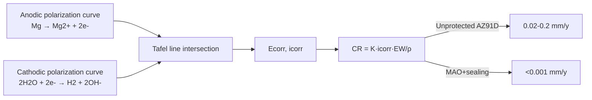

#### 3.2.4.3 Surface treatment selection principles and life prediction

The core of surface treatment is to simultaneously reduce cathodic activity, isolate the electrolyte, and inhibit Cl\(^-\) penetration. The performance comparison of common solutions is as follows:

| Process | Coating composition | Corrosion resistance improvement | Main limitations |
|-----|---------|-----------|---------|
| MAO/PEO | MgO/MgAl\(_2\)O\(_4\)/Mg\(_2\)SiO\(_4\) | Significant, but requires sealing | Porous, rough coating |
| Chemical conversion coating | Ce/La oxides, phytate | Moderate | Thin coating, poor mechanical wear resistance |
| Electroless Ni-P | Amorphous/nanocrystalline Ni-P | Excellent | Pre-treatment pickling activates the substrate |
| HCPEB remelting | Fine grain/supersaturated solid solution | Improves substrate | High equipment cost |
| Nanoparticle composite anodizing | Al\(_2\)O\(_3\)+SiC/TiO\(_2\) | Dense coating, Cl\(^-\) barrier | Process consistency needs improvement |

In practical robot component design, MAO can be used as a base layer for wear resistance and adhesion, followed by an epoxy-graphene sealing layer for chemical barrier, and finally a polyurethane topcoat, achieving a 1000 h neutral salt spray (NSS) life.

The following Python script estimates \(i_{corr}\) and corrosion rate based on Tafel extrapolation data, and compares the life improvement before and after protection:

```python
import numpy as np

# Assume Tafel parameters for AZ91D in 3.5 wt% NaCl
ba = 0.060      # V/decade (anodic)
bc = 0.120      # V/decade (cathodic)
Rp_untreated = 250.0   # Ω·cm^2
Rp_coated = 25000.0    # Ω·cm^2 (MAO+sealing)

# Stern-Geary calculation of icorr (A/cm^2)
def icorr_from_Rp(Rp, ba, bc):
    return (ba * bc) / (2.303 * (ba + bc) * Rp)

i_untreated = icorr_from_Rp(Rp_untreated, ba, bc)
i_coated = icorr_from_Rp(Rp_coated, ba, bc)
print(f"Untreated icorr = {i_untreated*1e6:.1f} μA/cm^2")
print(f"Protected icorr = {i_coated*1e6:.2f} μA/cm^2")

# Corrosion rate (mm/year), AZ91D equivalent atomic weight EW≈12.2 g, ρ≈1.81 g/cm^3
K = 0.00327
EW = 12.2
rho = 1.81
def CR(i_ua_cm2):
    return K * i_ua_cm2 * EW / rho

CR_untreated = CR(i_untreated*1e6)
CR_coated = CR(i_coated*1e6)
print(f"Untreated corrosion rate = {CR_untreated:.3f} mm/y")
print(f"Protected corrosion rate = {CR_coated:.5f} mm/y")
print(f"Life improvement factor after protection ≈ {CR_untreated/CR_coated:.0f}x")
```

This example shows that if MAO+sealing increases \(R_p\) from 250 to 25000 Ω·cm\(^2\), the corrosion rate can be reduced from about 0.165 mm/y to 0.0017 mm/y, improving life by about 100 times.

### 3.2.5 Carbon fiber composites: anisotropy and laminate theory

Carbon fiber reinforced polymer composites (CFRP) have extremely high specific strength and specific stiffness, and their mechanical properties strongly depend on fiber orientation. The elastic modulus in the fiber direction \(E_1\) and the transverse modulus \(E_2\) of unidirectional CFRP differ greatly:

$$
E_1 \approx E_f V_f + E_m (1 - V_f)
$$
$$
\frac{1}{E_2} \approx \frac{V_f}{E_f} + \frac{1 - V_f}{E_m}
$$

where \(E_f\) and \(E_m\) are the fiber and matrix moduli, respectively, and \(V_f\) is the fiber volume fraction. For a typical T700/epoxy unidirectional lamina, \(E_1 \approx 140\) GPa and \(E_2 \approx 10\) GPa.

!!! note "Term explanation: CFRP, fiber volume fraction, matrix, laminate, classical laminate theory (CLT)"
    - **CFRP (Carbon Fiber Reinforced Polymer)**: A composite material with carbon fibers as reinforcement and a polymer as the matrix.
    - **Fiber volume fraction (\(V_f\))**: The proportion of fiber volume in the composite, directly determining stiffness and strength.
    - **Matrix**: The polymer phase that surrounds the fibers and transfers loads, while also protecting the fibers from environmental attack.
    - **Laminate**: A composite plate composed of multiple unidirectional laminae laid up in different orientations.
    - **Classical laminate theory (CLT)**: A theory based on the Kirchhoff straight normal hypothesis, describing the in-plane, coupling, and bending behavior of laminates through A, B, D stiffness matrices.

Laminate design requires combining ply orientations (0°, ±45°, 90°) to meet multi-directional load requirements. Classical laminate theory (CLT) is based on the Kirchhoff hypothesis and describes in-plane, coupling, and bending stiffness through A, B, D matrices. Interlaminar shear and delamination are the main failure modes of CFRP, and the chemical design of the interphase (sizing/agent) is crucial for interlaminar performance.

!!! note "Term explanation: delamination, interphase, sizing"
    - **Delamination**: Cracking failure between adjacent plies in a laminate.
    - **Interphase**: The transition region formed between the fiber surface and the matrix, possessing a specific chemical structure and mechanical properties.
    - **Sizing**: A chemical coating applied to the fiber surface to improve wetting and bonding at the fiber-matrix interface.

### 3.2.6 Topology optimization and multi-material integration

Topology optimization aims to minimize structural compliance or maximize natural frequency, optimizing material distribution under stress/displacement constraints. Its mathematical form is

$$
\min_\rho C(\rho) = \mathbf{F}^T \mathbf{U}
$$
$$
\text{s.t.} \quad \mathbf{K}(\rho)\mathbf{U} = \mathbf{F}, \quad 0 < \rho_{\min} \le \rho \le 1, \quad \int_\Omega \rho \, d\Omega \le V^*
$$

where \(\rho\) is the element pseudo-density and \(\mathbf{K}\) is the stiffness matrix. The SIMP method promotes 0/1 discrete solutions by penalizing intermediate density values.

!!! note "Term Explanation: Topology Optimization, SIMP, Pseudo-density, Compliance, Stiffness Matrix"
    - **Topology optimization**: A structural optimization method that finds the optimal material distribution within a given design domain and under given constraints.
    - **SIMP (Solid Isotropic Material with Penalization)**: A topology optimization method that interpolates the elastic modulus using pseudo-density and penalizes intermediate densities.
    - **Pseudo-density (\(\rho\))**: A design variable representing the relative material density within each finite element, where 0 indicates void and 1 indicates solid.
    - **Compliance**: The total strain energy of a structure under external forces; minimizing compliance is equivalent to maximizing stiffness.
    - **Stiffness matrix (\(\mathbf{K}\))**: A matrix in the finite element method that relates nodal displacements to nodal forces.

Multi-material topology optimization further introduces combinations of densities/stiffnesses for different materials, enabling composite structures such as an aluminum alloy skeleton + magnesium alloy infill + local carbon fiber reinforcement within a single part. This is highly valuable for load-bearing, weight-sensitive joints in humanoid robots.

#### 3.2.6.1 SIMP Interpolation and Sensitivity Derivation

In the SIMP method, the relationship between the element elastic modulus and the pseudo-density is

$$
E_e(\rho_e) = E_{\min} + \rho_e^p (E_0 - E_{\min})
$$

where \(p \ge 3\) is the penalization factor, and \(E_{\min}\) is a small modulus to avoid singularity of the stiffness matrix. The global stiffness matrix is assembled from the element stiffness matrices:

$$
\mathbf{K}(\rho) = \sum_{e} E_e(\rho_e) \mathbf{k}_e^0
$$

The total compliance is

$$
C(\rho) = \mathbf{U}^T \mathbf{K} \mathbf{U} = \sum_e E_e(\rho_e) \mathbf{u}_e^T \mathbf{k}_e^0 \mathbf{u}_e
$$

Differentiating with respect to \(\rho_e\) yields the element sensitivity

$$
\frac{\partial C}{\partial \rho_e} = -p \rho_e^{p-1} (E_0 - E_{\min}) \mathbf{u}_e^T \mathbf{k}_e^0 \mathbf{u}_e
$$

The negative sign indicates that increasing the density reduces compliance (increases stiffness). The optimization uses the optimality criteria (OC) update:

$$
\rho_e^{\text{new}} =
\begin{cases}
\rho_{\min}, & \rho_e B_e^\eta \le \rho_{\min} \\
\rho_e B_e^\eta, & \rho_{\min} < \rho_e B_e^\eta < 1 \\
1, & \rho_e B_e^\eta \ge 1
\end{cases}
$$

where \(B_e = -\partial C/\partial \rho_e / (\lambda V_e)\), and \(\lambda\) is adjusted via a bisection method to satisfy the volume constraint \(\sum_e \rho_e V_e = V^*\).

!!! note "Term Explanation: Sensitivity Analysis, Optimality Criteria (OC), Penalization Factor, Volume Fraction, Lagrange Multiplier"
    - **Sensitivity analysis**: The process of calculating the derivative of the objective function with respect to the design variables, determining the optimization direction.
    - **Optimality criteria (OC)**: A heuristic update rule for design variables derived from the KKT conditions.
    - **Penalization factor (\(p\))**: The exponent in SIMP that makes intermediate densities artificially stiff, driving the solution towards 0/1 as it increases.
    - **Volume fraction**: The ratio of the retained material volume to the total volume of the design domain after optimization.
    - **Lagrange multiplier (\(\lambda\))**: The shadow price introduced when incorporating the volume constraint into the objective function.

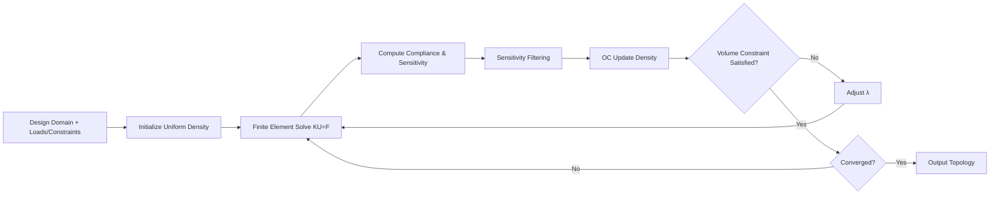

#### 3.2.6.2 Sensitivity Filtering and Manufacturing Constraints

Numerical instabilities arising from finite element discretization include checkerboard patterns and mesh dependency. Density filtering mitigates these issues by applying a weighted average centered on the element with radius \(r_{\min}\):

$$
\tilde{\rho}_e = \frac{\sum_{i \in N_e} w_{ei} \rho_i}{\sum_{i \in N_e} w_{ei}}, \quad w_{ei} = \max(0, r_{\min} - d_{ei})
$$

where \(N_e\) is the filter neighborhood and \(d_{ei}\) is the distance between element centers. The filtered sensitivity is corrected via the chain rule. Further techniques such as projection methods and Heaviside filtering can be introduced to obtain sharper black/white boundaries. Manufacturing constraints include minimum feature size, overhang angle, and connectivity, ensuring the result is directly suitable for metal additive manufacturing (SLM, DMLS).

!!! note "Term Explanation: Mesh Dependency, Checkerboard, Filter Radius, Projection Method, Overhang Angle"
    - **Mesh dependency**: The phenomenon where topology optimization results exhibit finer structural members as the mesh is refined.
    - **Checkerboard**: A numerical artifact where element densities alternate between 0 and 1, leading to non-physical topologies.
    - **Filter radius (\(r_{\min}\))**: The radius of the neighborhood for density/sensitivity weighted averaging, controlling the minimum structural feature size.
    - **Projection method**: A technique that projects filtered gray-scale densities towards sharp 0/1 values.
    - **Overhang angle**: The maximum angle of an overhanging feature that can be printed without supports in additive manufacturing; typically around 45° for metal SLM.

#### 3.2.6.3 Lightweighting Example for Humanoid Robot Limb Segments

The following Python script implements the classic 88-line SIMP topology optimization for a cantilever plate subjected to an end load (analogous to a robot forearm), minimizing compliance. The output is a pseudo-density distribution, where retained regions form the primary load-bearing path.

```python
import numpy as np
import matplotlib.pyplot as plt

# SIMP Topology Optimization: Cantilever plate, fixed left side, downward load at bottom right corner
nelx, nely = 60, 20  # Number of elements
volfrac = 0.4        # Volume fraction
penal = 3.0          # Penalization factor
rmin = 2.5           # Filter radius
E0, Emin = 1.0, 1e-9
nu = 0.3

def lk():
    """Element stiffness matrix for a 4-node plane stress element"""
    A11 = np.array([[12, 3, -6, -3], [3, 12, 3, 0], [-6, 3, 12, -3], [-3, 0, -3, 12]])
    A12 = np.array([[-6, -3, 0, 3], [-3, -6, -3, -6], [0, -3, -6, 3], [3, -6, 3, -6]])
    B11 = np.array([[-4, 3, -2, 9], [3, -4, -9, 4], [-2, -9, -4, -3], [9, 4, -3, -4]])
    B12 = np.array([[2, -3, 4, -9], [-3, 2, 9, -2], [4, 9, 2, 3], [-9, -2, 3, 2]])
    KE = 1/(1-nu**2)/12 * (np.vstack([np.hstack([A11, A12]),
                                       np.hstack([A12.T, B11])]) +
                           np.vstack([np.hstack([B11, B12]),
                                       np.hstack([B12.T, A11.T])]))
    return KE

KE = lk()
N = (nely+1)*(nelx+1)
dof = 2
F = np.zeros((N*dof, 1))
U = np.zeros((N*dof, 1))
fixed = np.arange(0, 2*(nely+1))  # Fully fixed left side
free = np.setdiff1d(np.arange(N*dof), fixed)
# Downward load at bottom right corner
F[-1, 0] = -1.0
x = np.ones((nely, nelx)) * volfrac
```

```python
def FE(nelx, nely, x, penal):
    K = np.zeros((N*dof, N*dof))
    for elx in range(nelx):
        for ely in range(nely):
            n1 = (nely+1)*elx + ely
            n2 = (nely+1)*(elx+1) + ely
            edof = np.array([2*n1, 2*n1+1, 2*n2, 2*n2+1,
                             2*n2+2, 2*n2+3, 2*n1+2, 2*n1+3])
            K[np.ix_(edof, edof)] += (Emin + x[ely, elx]**penal*(E0-Emin)) * KE
    K = (K + K.T) / 2
    return K

def check(nelx, nely, rmin, x, dc):
    dcn = np.zeros_like(dc)
    for i in range(nelx):
        for j in range(nely):
            imin, imax = max(int(i-np.floor(rmin)), 0), min(int(i+np.floor(rmin))+1, nelx)
            jmin, jmax = max(int(j-np.floor(rmin)), 0), min(int(j+np.floor(rmin))+1, nely)
            for ii in range(imin, imax):
                for jj in range(jmin, jmax):
                    fac = max(0, rmin - np.sqrt((i-ii)**2 + (j-jj)**2))
                    dcn[j, i] += fac * x[jj, ii] * dc[jj, ii]
            sumfac = 0.0
            for ii in range(imin, imax):
                for jj in range(jmin, jmax):
                    fac = max(0, rmin - np.sqrt((i-ii)**2 + (j-jj)**2))
                    sumfac += fac
            dcn[j, i] /= (x[j, i] * sumfac) if sumfac else 1
    return dcn

def OC(nelx, nely, x, volfrac, dc):
    l1, l2 = 0, 1e5
    move = 0.2
    while l2 - l1 > 1e-4:
        lmid = 0.5 * (l2 + l1)
        xnew = np.maximum(0.001,
                          np.maximum(x - move,
                                     np.minimum(1.0,
                                                np.minimum(x + move,
                                                           x * np.sqrt(-dc / lmid)))))
        if np.sum(xnew) - volfrac * nelx * nely > 0:
            l1 = lmid
        else:
            l2 = lmid
    return xnew

for iter in range(100):
    K = FE(nelx, nely, x, penal)
    U[free] = np.linalg.solve(K[np.ix_(free, free)], F[free])
    c = 0.0
    dc = np.zeros((nely, nelx))
    for elx in range(nelx):
        for ely in range(nely):
            n1 = (nely+1)*elx + ely
            n2 = (nely+1)*(elx+1) + ely
            edof = np.array([2*n1, 2*n1+1, 2*n2, 2*n2+1,
                             2*n2+2, 2*n2+3, 2*n1+2, 2*n1+3])
            Ue = U[edof].flatten()
            ce = np.dot(Ue, KE @ Ue)
            c += (Emin + x[ely, elx]**penal*(E0-Emin)) * ce
            dc[ely, elx] = -penal * x[ely, elx]**(penal-1) * (E0-Emin) * ce
    dc = check(nelx, nely, rmin, x, dc)
    x = OC(nelx, nely, x, volfrac, dc)

plt.imshow(1 - x, cmap='gray', origin='lower')
plt.title('Topology optimized robot arm link (black = material)')
plt.xlabel('x'); plt.ylabel('y')
plt.tight_layout(); plt.show()
```

This script iterates 100 times on a 60×20 grid, yielding a truss-like structure. In practical engineering, topology optimization is first used to obtain the load path, followed by shape/size optimization and the introduction of fillets, holes, and other manufacturing details.

#### 3.2.6.4 Integration of Multi-Material Topology Optimization and Additive Manufacturing

Multi-material topology optimization independently interpolates the pseudo-density \(\rho_{m,e}\) for different materials \(m\):

$$
E_e = E_{\min} + \sum_m \rho_{m,e}^{p_m} E_m^0
$$

Common multi-material interpolation models include the generalized SIMP, DMO (Discrete Material Optimization), and RAMP. The results of multi-material optimization can guide the printing of functionally graded materials in additive manufacturing: for example, a robot hip joint bracket uses Ti-6Al-4V as the high-stress skeleton, AlSi10Mg as the lightweight infill, and locally embedded continuous carbon fiber reinforcements. Manufacturing constraints must be considered simultaneously in the optimization: metal SLM requires overhang angles \(\ge 45^\circ\) to reduce supports, and minimum hole diameters and wall thicknesses must be larger than the laser spot diameter (approximately 0.2-0.4 mm).

!!! note "Terminology Explanation: Multi-Material Interpolation, DMO, RAMP, Functionally Graded Material, SLM"
    - **Multi-material interpolation**: A mathematical method for describing the stiffness contributions of multiple materials within the same design variable framework.
    - **DMO (Discrete Material Optimization)**: An optimization method that transforms the material selection problem into a continuous density variable problem.
    - **RAMP (Rational Approximation of Material Properties)**: Another elastic modulus interpolation model that can alleviate the gray-scale issue of SIMP at low volume fractions.
    - **Functionally graded material (FGM)**: A material whose composition/properties vary continuously in space.
    - **SLM (Selective Laser Melting)**: A metal additive manufacturing process using selective laser melting.


### 3.2.7 Fatigue, Fracture, and Impact Behavior

Humanoid robot structural components are subjected to cyclic and impact loads, making fatigue and fracture performance critical. The fatigue life of metallic materials is typically described by the S-N curve:

$$
N_f = \left(\frac{\sigma_a}{\sigma_f'}\right)^{1/b}
$$

Here \(N_f\) is the fatigue life, \(\sigma_a\) is the stress amplitude, \(\sigma_f'\) is the fatigue strength coefficient, and \(b\) is the fatigue strength exponent. This equation is called the **Basquin relation**, which well describes the inverse power-law relationship between stress amplitude and life in the high-cycle fatigue region (typically \(N_f > 10^4\)). On a logarithmic scale, \(\log\sigma_a\) and \(\log N_f\) exhibit a linear relationship with slope \(b\) (typical values range from -0.05 to -0.12).

!!! note "Terminology Explanation: S-N Curve, Basquin Relation, Fatigue Limit, Fracture Toughness, Compression After Impact (CAI)"
    - **S-N Curve**: The relationship curve between stress amplitude and the number of cycles to fatigue failure.
    - **Basquin Relation**: A power-law relationship between stress amplitude and number of cycles in high-cycle fatigue, \(\sigma_a = \sigma_f' (2N_f)^b\).
    - **Fatigue Limit**: The maximum stress amplitude below which a material can endure an infinite number of cycles without fatigue failure.
    - **Fracture Toughness (\(K_{IC}\))**: The ability of a material to resist crack propagation, quantifying the critical value of the stress field intensity at the crack tip.
    - **Compression After Impact (CAI)**: The residual compressive strength of a composite material after impact, used to evaluate damage tolerance.

#### 3.2.7.1 Fracture Mechanics and Crack Tip Stress Field

The strength of a component containing a crack cannot be determined solely by the material strength but is controlled by the stress field intensity at the crack tip. Irwin defined the **stress intensity factor** \(K_I\):

$$
K_I = Y \sigma \sqrt{\pi a}
$$

where \(\sigma\) is the far-field stress, \(a\) is the crack size, and \(Y\) is the geometric correction factor. When \(K_I\) reaches the material's **fracture toughness** \(K_{IC}\), the crack propagates unstably. For aluminum alloy 7075-T6, \(K_{IC} \approx 27\) MPa·\(m^{1/2}\); for 6061-T6, \(K_{IC} \approx 29\) MPa·\(m^{1/2}\).

The size of the plastic zone at the crack tip can be estimated as

$$
r_p = \frac{1}{\pi}\left(\frac{K_I}{\sigma_y}\right)^2
$$

When \(r_p\) is much smaller than the crack size and specimen dimensions, linear elastic fracture mechanics (LEFM) is applicable; otherwise, elastic-plastic fracture mechanics (J-integral or crack tip opening displacement CTOD) must be used.

!!! note "Terminology Explanation: Stress Intensity Factor, Irwin Plastic Zone, Linear Elastic Fracture Mechanics, J-Integral"
    - **Stress Intensity Factor (\(K\))**: A parameter describing the intensity of the elastic stress field at the crack tip; subscripts I, II, and III correspond to opening, sliding, and tearing crack modes.
    - **Irwin Plastic Zone**: An estimate of the size of the plastic region formed at the crack tip due to stress exceeding the yield strength.
    - **Linear Elastic Fracture Mechanics (LEFM)**: A branch of fracture mechanics that analyzes the crack tip stress field based on linear elastic assumptions.
    - **J-Integral**: A contour integral in elastic-plastic fracture mechanics characterizing the energy release rate at the crack tip, applicable to large-scale yielding.

#### 3.2.7.2 Fatigue Crack Propagation: Paris Law

The fatigue crack growth rate is described by the Paris law:

$$
\frac{da}{dN} = C (\Delta K)^m
$$

where \(\Delta K = K_{\max} - K_{\min}\) is the stress intensity factor range, and \(C\) and \(m\) are material constants. For typical aluminum alloys, \(m \approx 2.5-4\). The Paris law applies to the stable crack growth region (Region II); when \(\Delta K\) is below the threshold \(\Delta K_{th}\), the crack does not propagate, and when \(K_{\max}\) approaches \(K_{IC}\), it enters the rapid unstable growth region (Region III).

For a humanoid robot joint, if the initial crack size \(a_0 = 0.5\) mm and the critical crack size \(a_c\) is determined by \(K_{IC} = Y \sigma_{\max}\sqrt{\pi a_c}\), the fatigue life can be estimated by integrating the Paris law:

$$
N_f = \int_{a_0}^{a_c} \frac{da}{C(\Delta K)^m}
$$

#### 3.2.7.3 Cumulative Damage: Miner's Linear Rule

When a structure is subjected to variable amplitude cyclic loading, Miner's linear cumulative damage rule can be used:

$$
D = \sum_i \frac{n_i}{N_{f,i}}
$$

where \(n_i\) is the actual number of cycles at the \(i\)-th stress amplitude level, and \(N_{f,i}\) is the number of cycles to failure at that stress amplitude obtained from the S-N curve. Fatigue failure is predicted when \(D \ge 1\). Miner's rule ignores load sequence effects and mean stress effects; in practical engineering, a safety factor \(D_{allow} = 0.3-0.5\) is often used.

The following Python script demonstrates how to estimate the fatigue life of a robot under variable amplitude loading using the Basquin relation and Miner's rule:

```python
import numpy as np

# Material parameters: Assume Basquin parameters for a 6061-T6 aluminum alloy
sigma_f_prime = 620e6  # Pa
b = -0.11              # Basquin exponent

# S-N curve
def Nf(sigma_a):
    """Given stress amplitude (Pa), return number of cycles to failure"""
    return (sigma_a / sigma_f_prime) ** (1/b)

# Variable amplitude load spectrum: [(stress amplitude Pa, number of cycles), ...]
load_spectrum = [
    (120e6, 5000),   # High stress, few cycles
    (80e6, 50000),   # Medium stress
    (50e6, 200000),  # Low stress, many cycles
]

damage = 0.0
for sigma_a, n in load_spectrum:
    N = Nf(sigma_a)
    d = n / N
    damage += d
    print(f"σ_a={sigma_a/1e6:.0f} MPa: N_f={N:.2e}, n/N={d:.4f}")

print(f"Total cumulative damage D = {damage:.4f}")
print(f"Remaining life factor = {1/damage:.2f}")
```

The example output shows that high-stress cycles contribute significantly more to damage than low-stress cycles, highlighting the high sensitivity of fatigue damage to high stress amplitudes. Key load-bearing components such as robot joint bearings and reducer output shafts should undergo fatigue life verification based on such methods; see Section 8.4 of Chapter 8 for structural reliability design.

#### 3.2.7.4 Composite Impact Damage and CAI

When CFRP is subjected to low-velocity impact, the surface may show only slight dents, but internal damage such as matrix cracking, fiber-matrix interface debonding, and delamination can occur. Impact damage significantly reduces compressive strength because delamination can cause local buckling under compressive loads. **Compression After Impact (CAI)** is defined as the ratio of the residual compressive strength of the specimen after impact to its original compressive strength, typically measured after a drop-weight impact test.

CAI is closely related to matrix toughness, ply design, and interface strength. Toughened resins (e.g., thermoplastic-toughened epoxy), 3D braiding, or Z-pin reinforcement can improve CAI. For parts of a humanoid robot that may be subject to collisions, such as legs and torso, material selection must consider static strength, fatigue life, and impact damage tolerance simultaneously.

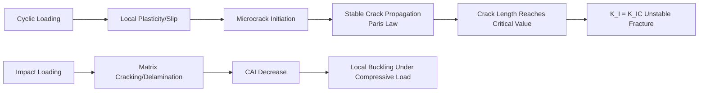

### 3.2.8 Joining Technology and Surface Engineering

Joining dissimilar materials is a challenge in humanoid robot structural design. The joining of aluminum alloy to magnesium alloy, or metal to CFRP, must simultaneously consider electrochemical compatibility, thermal expansion matching, and mechanical load transfer.

#### 3.2.8.1 Thermodynamic and Kinetic Constraints of Galvanic Corrosion

When two metals with different potentials come into contact in an electrolyte, the metal with the lower potential acts as the anode and is oxidized, while the metal with the higher potential acts as the cathode, promoting the reduction reaction. The galvanic corrosion current can be estimated using mixed potential theory. Assuming direct contact between aluminum (\(E_{Al} \approx -0.8\) V vs SHE, passive state) and magnesium (\(E_{Mg} \approx -1.7\) V vs SHE), the dissolution current density of the anodic magnesium will increase significantly.

In a simplified model, the galvanic current density \(i_g\) satisfies

$$
i_g = \frac{E_{cathode} - E_{anode}}{R_{solution} + R_{contact}}
$$

where \(R_{solution}\) is the electrolyte resistance and \(R_{contact}\) is the interfacial contact resistance. The actual corrosion rate depends on the limiting diffusion current of the cathodic reaction (usually oxygen reduction or hydrogen evolution). Engineering practice typically requires a potential difference of less than 0.25 V for direct contact, or the use of insulating gaskets, anodized layers, nickel plating, etc., for isolation.

!!! note "Term Explanation: Galvanic Corrosion, Mixed Potential Theory, Cathodic Reaction, Limiting Diffusion Current"
    - **Galvanic corrosion**: When two metals with different potentials form a galvanic cell in an electrolyte, the metal with the lower potential undergoes accelerated corrosion.
    - **Mixed potential theory**: The intersection point of the anodic and cathodic polarization curves in a corrosion system determines the corrosion potential and current.
    - **Cathodic reaction**: A reduction reaction occurring on the cathode surface, such as \(O_2 + 2H_2O + 4e^- \rightarrow 4OH^-\).
    - **Limiting diffusion current**: The maximum current when the diffusion rate of the reactant becomes the rate-controlling step.

#### 3.2.8.2 Thermal Expansion Mismatch Stress

Temperature changes generate thermal stress at the joints of dissimilar materials. For a laminate structure composed of two materials, when the temperature changes by \(\Delta T\) and the materials cannot deform freely, the interfacial normal stress can be approximated as

$$
\sigma = \frac{E_1 E_2}{E_1 + E_2} (\alpha_1 - \alpha_2) \Delta T
$$

where \(E_i\) is the elastic modulus and \(\alpha_i\) is the coefficient of thermal expansion. Taking the connection between aluminum (\(\alpha_{Al} = 23 \times 10^{-6}\) /K, \(E_{Al} = 70\) GPa) and the longitudinal direction of a CFRP unidirectional laminate (\(\alpha_{CFRP} \approx 0\) /K, \(E_{CFRP} \approx 140\) GPa) as an example, with a temperature change \(\Delta T = -80\) K (cooling from curing temperature to room temperature):

$$
\sigma = \frac{70 \times 140}{70 + 140} \times 10^9 \times (23 - 0) \times 10^{-6} \times 80 \approx 85\ \text{MPa}
$$

This residual tensile stress is sufficient to initiate matrix cracking or delamination near the interface. Therefore, CFRP-metal connections often employ graded hybrid structures, adhesive bonding combined with mechanical fastening, or alloys with matched thermal expansion to mitigate this issue.

!!! note "Term Explanation: Coefficient of Thermal Expansion, Residual Stress, Thermal Mismatch"
    - **Coefficient of thermal expansion (CTE)**: The rate of change in material length caused by temperature variation.
    - **Residual stress**: A self-equilibrating stress existing within a material in the absence of external loads.
    - **Thermal mismatch**: Deformation incompatibility caused by different CTEs of dissimilar materials.

#### 3.2.8.3 Physical Mechanism of Friction Stir Welding

Friction stir welding (FSW) is a solid-state joining technology, particularly suitable for low-melting-point light alloys such as aluminum and magnesium. During the welding process, a rotating pin tool is inserted into the joint line and traversed along the weld. Frictional heat plasticizes the material (typically to 0.6-0.9 times its melting point). The material undergoes intense plastic flow around the pin tool and is re-mixed, forming a dense welded joint.

An FSW joint can be divided into four zones:
1. **Nugget zone**: Directly beneath the pin tool, where dynamic recrystallization occurs, resulting in fine grains.
2. **Thermo-mechanically affected zone (TMAZ)**: Subjected to both stirring and heat, causing grain bending and elongation.
3. **Heat-affected zone (HAZ)**: Affected only by the thermal cycle, leading to precipitate coarsening or softening.
4. **Base metal**: The unaffected original microstructure.

!!! note "Term Explanation: Nugget Zone, Thermo-Mechanically Affected Zone, Heat-Affected Zone, Dynamic Recrystallization"
    - **Nugget zone**: The central region of an FSW joint that experiences the highest temperature and greatest deformation.
    - **Thermo-mechanically affected zone (TMAZ)**: A transition zone simultaneously affected by temperature and mechanical stirring.
    - **Heat-affected zone (HAZ)**: A region affected only by the thermal cycle, without plastic deformation.
    - **Dynamic recrystallization**: The formation of new, strain-free grains during deformation.

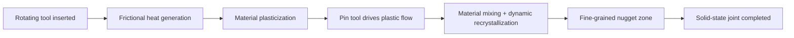

#### 3.2.8.4 Joining Method Selection and Surface Engineering

The applicable range of common joining methods is as follows:

| Joining Method | Applicable Materials | Advantages | Main Limitations |
|---------|---------|------|---------|
| Mechanical Fastening | Metals, CFRP | Detachable, easy to maintain | Stress concentration, galvanic corrosion risk |
| Adhesive Bonding | Metal-CFRP | Uniform stress distribution, provides insulation | Limited temperature/humidity resistance, long curing cycle |
| Riveting | Al, Mg thin sheets | Mature technology | Weight increase, stress concentration at hole edges |
| Friction Stir Welding | Al/Mg alloys | Solid-state joining, no porosity or cracks | High equipment rigidity requirements, requires backing support |
| Laser Welding | Al, Steel | Concentrated energy, low distortion | Special processes needed for highly reflective materials |

In terms of surface engineering, in addition to the aforementioned magnesium alloy surface treatments, aluminum alloy anodizing, micro-arc oxidation, and electroless nickel plating are also widely used. For CFRP, surface plasma treatment and sizing optimization can improve the interfacial bonding between the resin matrix and fibers. The final solution for dissimilar material joining and surface protection must be co-designed with the overall assembly process and service environment; see Section 9.2, Structural Integration and Assembly, in Chapter 9 for details.

### 3.2.9 Lightweighting Metrics and Material Selection Strategy

The selection of structural materials requires a comprehensive consideration of the following metrics:

| Metric | Definition | Material Comparison |
|-----|------|---------|
| Specific Strength | \(\sigma/\rho\) | Mg alloys > Al alloys > Steel |
| Specific Stiffness | \(E/\rho\) | CFRP > Mg alloys > Al alloys |
| Specific Energy Absorption | Energy absorbed per unit mass | Excellent for Mg alloys, CFRP |
| Fatigue Ratio | Fatigue limit / Tensile strength | Al alloys 0.3-0.4, Steel 0.4-0.5 |
| Cost Ratio | Cost per unit performance | Al alloys are optimal |

!!! note "Term Explanation: Specific Strength, Specific Stiffness, Specific Energy Absorption, Fatigue Ratio"
    - **Specific strength**: The ratio of strength to density, measuring the load-bearing capacity per unit mass of material.
    - **Specific stiffness**: The ratio of elastic modulus to density, measuring the resistance to deformation per unit mass of material.
    - **Specific energy absorption**: The impact energy absorbed per unit mass, reflecting cushioning and shock absorption capability.
    - **Fatigue ratio**: The ratio of fatigue limit to tensile strength, reflecting the material's efficiency under cyclic loading.

Practical material selection requires a trade-off between performance, cost, processability, and recyclability. For example, high-stress joints can use 7075-T6 or CFRP; large-area cover panels can use magnesium alloy die castings or engineering plastics; and areas requiring high thermal conductivity can use aluminum alloys.

### 3.2.10 Structural Material Supply Chain and Life Cycle Assessment

The supply chain risk for structural materials is primarily reflected in the high energy consumption of primary aluminum and magnesium smelting and the decline in ore grades. The carbon emissions of recycled aluminum are about 78-95% lower than those of primary aluminum. Therefore, robot structural components should prioritize the use of high proportions of recycled aluminum. Magnesium smelting currently relies mainly on the Pidgeon process, which is energy-intensive and produces CO\(_2\); the electrolytic method for magnesium smelting is a long-term direction for carbon reduction.

The Life Cycle Assessment (LCA) framework can help identify the impact of material selection on carbon footprint, resource depletion, and ecotoxicity. Material selection must consider the full life cycle environmental impact:

- **Primary vs. Recycled Aluminum**: Carbon emissions of recycled aluminum are about 78-95% lower than those of primary aluminum.
- **Magnesium Alloy Smelting**: The Pidgeon process is energy-intensive; the electrolytic method can significantly reduce carbon emissions.
- **Carbon Fiber Recycling**: Pyrolysis or solvent-based recycling can partially retain carbon fiber properties, but costs remain high.

!!! note "Term Explanation: Life Cycle Assessment (LCA), Carbon Footprint, Ecotoxicity"
    - **Life Cycle Assessment (LCA)**: A systematic method for quantifying the environmental impacts of a product throughout its entire life cycle, from raw material acquisition, manufacturing, and use to disposal.
    - **Carbon footprint**: The total amount of greenhouse gas emissions caused by an activity or product.
    - **Ecotoxicity**: The degree of harm a material or its degradation products pose to organisms in an ecosystem.

---

## 3.3 Electrochemical Energy Materials

### 3.3.1 Electrode Thermodynamics and Lithium-Ion Intercalation Reactions

Lithium-ion batteries are based on the reversible intercalation/deintercalation of Li\(^+\) into the crystal lattices of positive and negative electrode active materials. The electrode potential is determined by the Gibbs free energy change of the electrochemical reaction:

$$
E = -\frac{\Delta G}{nF}
$$

where \(n\) is the number of transferred electrons and \(F\) is the Faraday constant. The positive electrode material provides a high potential (3–5 V vs Li/Li\(^+\)), while the negative electrode material provides a low potential (<1 V vs Li/Li\(^+\)), and the potential difference between them constitutes the battery voltage. More precisely, the electrode potential can be described by the Nernst equation:

$$
E = E^0 - \frac{RT}{nF} \ln Q
$$

where \(Q\) is the reaction quotient. In intercalation reactions, changes in Li\(^+\) activity directly alter \(Q\), thereby changing the electrode potential.

!!! note "Terminology Explanation: Intercalation Reaction, Electrode Potential, Gibbs Free Energy, Electrochemical Potential, Nernst Equation, Faraday Constant"
    - **Intercalation**: A reaction in which guest ions (e.g., Li\(^+\)) reversibly insert into and deinsert from the interlayer spaces or channels of a host lattice, with the host framework remaining largely unchanged.
    - **Electrode Potential**: The potential difference between an electrode and a reference electrode, reflecting the tendency of a redox reaction.
    - **Gibbs Free Energy (\(G\))**: The energy of a system available to do non-volume work at constant temperature and pressure; \(\Delta G < 0\) indicates a spontaneous process.
    - **Electrochemical Potential**: The sum of chemical potential and electrostatic potential energy; charged particles have equal electrochemical potentials at phase equilibrium.
    - **Nernst Equation**: An equation describing how the electrode potential varies with the activity of reactants, representing the thermodynamic equilibrium condition in electrochemistry.
    - **Faraday Constant (\(F\))**: The charge carried by one mole of electrons, approximately 96485 C/mol.

The lithium-ion intercalation reaction can be written as:

$$
\text{Li}_{1-x}\text{MO}_2 + x\text{Li}^+ + x\text{e}^- \rightleftharpoons \text{LiMO}_2
$$

where M is a transition metal. The intercalation process requires the host material to have a stable crystal framework, fast Li\(^+\) diffusion channels, and acceptable electronic conductivity. The diffusion of Li\(^+\) in the solid phase follows Fick's second law, with the diffusion coefficient \(D_{Li^+}\) typically in the range of 10\(^{-15}\)–10\(^{-10}\) cm\(^2\)/s.

!!! note "Terminology Explanation: Fick's Law, Diffusion Coefficient, Chemical Potential Gradient"
    - **Fick's Law**: An empirical law describing the relationship between diffusion flux and concentration gradient. The first law gives the steady-state flux, while the second law describes the non-steady-state evolution of concentration.
    - **Diffusion Coefficient (\(D\))**: A physical quantity characterizing the rate of particle diffusion in a medium, dependent on temperature and activation energy.
    - **Chemical Potential Gradient**: The true thermodynamic driving force that moves particles from regions of high chemical potential to regions of low chemical potential.

### 3.3.2 Positive Electrode Materials: Layered Oxides and Olivine Structure

**NMC (LiNi\(_x\)Mn\(_y\)Co\(_z\)O\(_2\))** belongs to the \(\alpha\)-NaFeO\(_2\)-type layered structure, with space group \(R\bar{3}m\). Li\(^+\) occupies the 3a site, transition metals occupy the 3b site, and oxygen occupies the 6c site. Li\(^+\) migrates in the two-dimensional interlayer space, with a diffusion coefficient of approximately 10\(^{-12}\)–10\(^{-14}\) m\(^2\)/s.

!!! note "Terminology Explanation: NMC, Layered Oxide, Space Group, Li/Ni Mixing, Lattice Oxygen Release, Surface Reconstruction"
    - **NMC**: A ternary layered positive electrode material of lithium nickel manganese cobalt oxide, balancing capacity, stability, and cost by adjusting the Ni/Mn/Co ratio.
    - **Layered Oxide**: A two-dimensional structure with alternating transition metal layers and lithium layers, where lithium diffuses two-dimensionally in the interlayer space.
    - **Space Group**: A mathematical description of crystal symmetry.
    - **Li/Ni Mixing**: Ni\(^{2+}\) ions, having a similar ionic radius to Li\(^+\), tend to occupy Li sites, blocking Li\(^+\) diffusion channels.
    - **Lattice Oxygen Release**: Under highly delithiated states, lattice oxygen is oxidized to O\(_2\) and released, leading to structural degradation and thermal runaway.
    - **Surface Reconstruction**: The transformation of the positive electrode surface into new structures such as rock salt phases during electrochemical cycling, increasing interfacial impedance.

High-nickel content (NMC622 → NMC811 → NMC90) increases reversible capacity by raising the Ni content, but introduces:

- **Li/Ni Mixing**: Ni\(^{2+}\) ions, having a similar ionic radius to Li\(^+\), tend to occupy Li sites, blocking Li\(^+\) diffusion channels.
- **Lattice Oxygen Release**: Under highly delithiated states, lattice oxygen is oxidized and releases O\(_2\), triggering thermal runaway.
- **Surface Reconstruction**: Formation of a rock salt NiO layer near the surface, increasing interfacial impedance.
- **Microcracks**: Anisotropic lattice expansion/contraction leads to microcracks within secondary particles, accelerating electrolyte penetration and side reactions.

Mitigation strategies include: bulk doping (Al, Mg, Ti, Zr), surface coating (Al\(_2\)O\(_3\), Li\(_2\)ZrO\(_3\), phosphates), and core-shell structure with concentration gradient design.

**LiFePO\(_4\)** belongs to the olivine structure, with space group \(Pnma\). It exhibits excellent thermal stability, long cycle life, and low cost, but has intrinsically low electronic conductivity (about 10\(^{-9}\) S/cm), which is improved through carbon coating and nanonization. The theoretical capacity of LiFePO\(_4\) is 170 mAh/g, and practical capacities can exceed 160 mAh/g. Its charge/discharge mechanism is a two-phase reaction (LiFePO\(_4\) ↔ FePO\(_4\) + Li\(^+\) + e\(^-\)), with the reaction interface movement controlled by one-dimensional Li\(^+\) diffusion.

!!! note "Terminology Explanation: Olivine Structure, Carbon Coating, Two-Phase Reaction, One-Dimensional Diffusion"
    - **Olivine Structure**: A three-dimensional framework composed of FeO\(_6\) octahedra and PO\(_4\) tetrahedra, with Li\(^+\) migrating along one-dimensional channels.
    - **Carbon Coating**: Deposition of a conductive carbon layer on the surface of positive electrode particles to enhance electronic conductivity and interfacial stability.
    - **Two-Phase Reaction**: During charge/discharge, a lithium-poor phase and a lithium-rich phase coexist, with the reaction front moving.
    - **One-Dimensional Diffusion**: Li\(^+\) can only migrate along specific crystallographic channel directions, limiting the diffusion pathway.

### 3.3.3 Negative Electrode Materials: Graphite, Silicon-Carbon, and Lithium Metal

**Graphite** is currently the most mature negative electrode material, with a theoretical capacity of 372 mAh/g (corresponding to LiC\(_6\)). Li\(^+\) intercalates between graphite layers to form different stage compounds (stage I–V). Graphite negative electrodes exhibit small volume changes (<12%) and stable cycling, but the capacity is already close to the theoretical limit.

!!! note "Terminology Explanation: Graphite, Stage Compound, Silicon-Carbon Composite, Lithium Dendrite, Shear Modulus"
    - **Graphite**: A negative electrode material with carbon atoms arranged in layers; Li\(^+\) intercalates between layers to form graphite intercalation compounds.
    - **Stage Compound**: A structure where Li\(^+\) periodically occupies different numbers of layers between graphite layers; stage I indicates lithium intercalation between every two carbon layers.
    - **Silicon-Carbon Composite (Si/C composite)**: Dispersion of nano-silicon within a carbon matrix, using carbon to buffer silicon volume expansion and maintain the conductive network.
    - **Lithium Dendrite**: Needle-like lithium deposits formed on the surface of lithium metal negative electrodes due to local electric field and concentration inhomogeneities, which can pierce the separator and cause short circuits.
    - **Shear Modulus (\(G\))**: A material's ability to resist shear deformation; a high shear modulus in solid electrolytes can mechanically suppress dendrites.

**Silicon** has a theoretical capacity as high as 4,200 mAh/g (corresponding to Li\(_{22}\)Si\(_5\)), but full lithiation results in a volume expansion of approximately 300%, leading to:
- Particle pulverization and loss of electrical contact
- Continuous rupture and regeneration of the SEI film, consuming active lithium and electrolyte
- Thickening of the solid electrolyte interphase film, increasing interfacial impedance

The industry adopts silicon-carbon composite (Si/C) or silicon suboxide (SiO\(_x\)) strategies, controlling the silicon content to 5–15 wt% to balance energy density improvement and cycling stability.

**Lithium metal** negative electrodes offer the highest specific capacity (3,860 mAh/g) and the lowest potential, making them ideal for solid-state batteries. However, lithium dendrite growth poses risks of short circuits and thermal runaway, which is a core scientific challenge limiting their application. The high shear modulus of solid electrolytes can mechanically suppress dendrites, but grain boundaries, voids, and uneven local current density may still induce dendrite penetration. The classic criterion by Monroe and Newman suggests that dendrites can be suppressed when the electrolyte shear modulus is approximately twice that of lithium metal, but in practice, interfacial inhomogeneities make this criterion overly optimistic.

### 3.3.4 Liquid Electrolytes and the SEI Film

Liquid electrolytes typically consist of carbonate solvents (EC, DMC, EMC, DEC) and lithium salts (LiPF\(_6\), LiFSI, LiTFSI). Their ionic conductivity is about 10\(^{-3}\)–10\(^{-2}\) S/cm, but they may undergo oxidative decomposition at high temperatures or high voltages.

!!! note "Term Explanation: Liquid Electrolyte, Carbonate Solvent, Lithium Salt, Ionic Conductivity"
    - **Liquid Electrolyte**: An ion-conductive liquid composed of a solvent and a lithium salt, which transports Li\(^+\) between the positive and negative electrodes.
    - **Carbonate Solvent**: Such as EC (ethylene carbonate) and DMC (dimethyl carbonate), providing a solvation environment for lithium ions.
    - **Lithium Salt**: Such as LiPF\(_6\), which dissociates in the solvent to release Li\(^+\) and anions, providing charge carriers.
    - **Ionic Conductivity**: The ability of an electrolyte to conduct ions, measured in S/cm.

The SEI film is a passivation layer formed by the reduction of the electrolyte on the negative electrode surface, primarily composed of Li\(_2\)CO\(_3\), LiF, ROLi, RCOOLi, etc. Peled first proposed the SEI concept, stating that an ideal SEI should have:

- High Li\(^+\) conductivity (reduces polarization)
- Electronic insulation (prevents continuous electrolyte reduction)
- Mechanical flexibility (accommodates volume changes in the negative electrode)
- Thermal stability (does not decompose and release heat at high temperatures)

!!! note "Term Explanation: SEI Film, Passivation Layer, Electrolyte Additive"
    - **SEI (Solid Electrolyte Interphase)**: A solid passivation film formed on the electrode surface by electrolyte decomposition, allowing Li\(^+\) to pass through but preventing continuous reactions of electrons and solvent molecules.
    - **Passivation Layer**: A protective film that prevents or slows down further chemical reactions.
    - **Electrolyte Additive**: A functional substance added in small amounts to the electrolyte to regulate SEI composition and suppress side reactions, such as VC and FEC.

The composition and structure of the SEI can be regulated through electrolyte additives (VC, FEC, LiPO\(_2\)F\(_2\), LiDFOB), significantly improving cycle life.

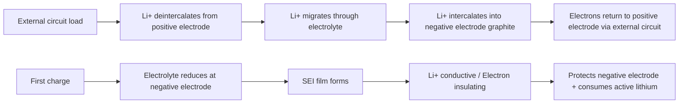

### 3.3.5 Solid Electrolytes: Sulfides, Oxides, and Polymers

Solid-state batteries replace liquid electrolytes and separators with solid electrolytes, aiming to simultaneously improve energy density and safety. Solid electrolytes are classified by chemical system into sulfides, oxides, polymers, and halides.

!!! note "Term Explanation: Solid Electrolyte, Electrochemical Window, Stability Against Li Metal, Air Stability"
    - **Solid Electrolyte**: A material that conducts ions in the solid state, functioning as both a separator and an ion conductor.
    - **Electrochemical Window**: The potential range over which an electrolyte does not undergo oxidative or reductive decomposition; a wider window allows matching with high-voltage positive electrodes.
    - **Stability Against Li Metal**: The ability of an electrolyte to avoid continuous side reactions when in contact with lithium metal.
    - **Air Stability**: The ability of an electrolyte to not absorb moisture, decompose, or produce toxic gases when exposed to air.

**Sulfide Solid Electrolytes** (e.g., Li\(_{10}\)GeP\(_2\)S\(_{12}\), Li\(_6\)PS\(_5\)Cl, Li\(_3\)PS\(_4\)) have the highest room-temperature ionic conductivity, reaching 10\(^{-2}\) S/cm, close to liquid electrolytes. Their conduction mechanism involves Li\(^+\) migration through vacancies or interstices in a framework composed of PS\(_4\)/GeS\(_4\) tetrahedra. However, sulfides are highly sensitive to moisture, releasing H\(_2\)S and reducing ionic conductivity; they also exhibit chemical/electrochemical incompatibility with positive electrode materials, requiring surface coatings as a buffer.

**Oxide Solid Electrolytes** (e.g., LLZO, LATP, LLTO, LiPON) offer good chemical stability, wide electrochemical windows, and high mechanical strength. Cubic-phase LLZO (Li\(_7\)La\(_3\)Zr\(_2\)O\(_{12}\)) has a room-temperature ionic conductivity of about 10\(^{-4}\)–10\(^{-3}\) S/cm and is stable against lithium metal. However, oxides are brittle, have poor interfacial contact, require high-temperature sintering, and have high processing costs.

**Polymer Solid Electrolytes** (e.g., PEO-LiTFSI) offer good flexibility and interfacial contact, but their room-temperature ionic conductivity is low (10\(^{-6}\)–10\(^{-5}\) S/cm), requiring heating above 60 °C for practical use. Their conduction mechanism involves Li\(^+\) coordinating with ether oxygen chains and migrating with polymer chain segment motion. Polymer-inorganic composite electrolytes (e.g., PEO + LLZO/LATP) are a current research hotspot, balancing flexibility and ionic conductivity.

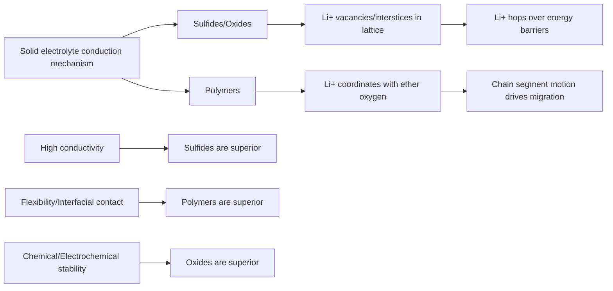

**Table 3-2 Comparison of Major Solid Electrolyte Systems**

| Type | Representative Material | Room-Temperature Ionic Conductivity (S/cm) | Stability Against Li Metal | Air Stability | Main Challenges |
|-----|---------|---------------------|-----------|-----------|---------|
| Sulfide | Li\(_6\)PS\(_5\)Cl, LGPS | 10\(^{-3}\)–10\(^{-2}\) | Moderate | Poor (releases H\(_2\)S) | Moisture sensitivity, interfacial side reactions |
| Oxide | LLZO, LATP | 10\(^{-4}\)–10\(^{-3}\) | Good | Good | Brittleness, interfacial contact, high processing temperature |
| Polymer | PEO-LiTFSI | 10\(^{-6}\)–10\(^{-5}\) | Good | Good | Low room-temperature conductivity, poor oxidation stability |
| Halide | Li\(_3\)YCl\(_6\), Li\(_3\)YBr\(_6\) | 10\(^{-4}\)–10\(^{-3}\) | Good | Moderate | High-voltage positive electrode stability, cost |

### 3.3.6 Thermal Runaway Mechanism and Battery Pack Design

Thermal runaway in lithium-ion batteries results from an exothermic chain reaction, involving:

1. SEI decomposition (approx. 90-120 °C)
2. Reaction between negative electrode and electrolyte
3. Separator melting/shrinkage (PE separator approx. 130 °C)
4. Positive electrode oxygen release (NMC811 approx. 200-250 °C)
5. Electrolyte combustion (EC/DMC flash point approx. 30-40 °C)

!!! note "Term Explanation: Thermal Runaway, Separator, Flash Point, Exothermic Chain Reaction"
    - **Thermal Runaway**: A phenomenon where the rate of internal exothermic reactions in a battery exceeds the heat dissipation rate, causing a continuous temperature rise and triggering a chain reaction.
    - **Separator**: A microporous membrane that separates the positive and negative electrodes and allows ion passage; melting or shrinkage can cause internal short circuits.
    - **Flash Point**: The lowest temperature at which a liquid's vapor can be ignited.
    - **Exothermic Chain Reaction**: A process where the heat released from one reaction triggers the next, creating a positive feedback loop.

Solid-state batteries can fundamentally suppress thermal runaway by eliminating flammable liquid electrolytes and using electrolytes with high thermal stability. However, solid-state batteries still face safety issues such as lithium dendrites, interfacial contact resistance, and chemical incompatibility between the electrolyte and electrodes.

#### 3.3.6.1 Critical Conditions for Thermal Runaway and Energy Balance

The temperature evolution of a battery is described by the energy conservation equation:

$$
\rho C_p \frac{dT}{dt} = \dot{q}_{gen} - \dot{q}_{cool}
$$

where \(\rho C_p\) is the volumetric heat capacity of the cell, \(\dot{q}_{gen}\) is the heat generation power per unit volume, and \(\dot{q}_{cool}\) is the heat dissipation power per unit volume. The heat generation term includes Joule heat and entropic heat:

$$
\dot{q}_{gen} = I^2 R_{int} + I T \frac{dE_{ocv}}{dT}
$$

Joule heat is proportional to the square of the current; the entropic heat term has opposite signs during charging/discharging but is typically only 5-15% of the Joule heat. The critical condition for thermal runaway is when the derivative of the heat generation rate with respect to temperature exceeds the derivative of the heat dissipation rate with respect to temperature:

$$
\frac{\partial \dot{q}_{gen}}{\partial T} > \frac{\partial \dot{q}_{cool}}{\partial T}
$$

Once this condition is met, the positive temperature feedback cannot be counteracted by environmental heat dissipation, leading to thermal runaway. The activation energies for SEI decomposition, negative electrode-electrolyte reaction, and positive electrode oxygen release are 80-130 kJ/mol, 100-200 kJ/mol, and 150-300 kJ/mol, respectively. The higher the temperature, the faster the reactions, resulting in exponential heat release.

!!! note "Term Explanation: Adiabatic Temperature Rise, Self-Heating Rate, Thermal Resistance, Heat Transfer Coefficient"
    - **Adiabatic Temperature Rise (\(\Delta T_{ad}\))**: The temperature increase caused by the full release of reaction heat under no heat dissipation conditions, \(\Delta T_{ad} = Q_{total}/(m C_p)\).
    - **Self-Heating Rate (\(\mathrm{d}T/\mathrm{d}t\))**: The rate at which the battery's own temperature increases per unit time, directly measured by an Accelerating Rate Calorimeter (ARC).
    - **Thermal Resistance (\(R_{th}\))**: The ratio of temperature rise to heat flow along the heat transfer path, \(R_{th} = \Delta T / P\).
    - **Heat Transfer Coefficient (\(h\))**: The heat flow per unit area and unit temperature difference between a fluid and a solid surface, approximately 5-25 W/(m\(^2\)·K) for natural convection.

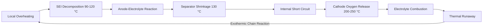

#### 3.3.6.2 Battery Pack Size and Thermal Design Numerical Example

Assume a humanoid robot torso can accommodate a 48 V, 20 Ah battery pack, using 3.7 V, 5 Ah NMC cylindrical cells with an energy density of 250 Wh/kg:

- Total Energy: \(E = 48 \times 20 = 960\) Wh
- Battery Mass: \(m = 960 / 250 = 3.84\) kg
- Number in Series: \(48 / 3.7 \approx 13\) cells
- Number in Parallel: \(20 / 5 = 4\) cells
- Total Cells: \(13 \times 4 = 52\) cells

If the robot's instantaneous power demand is 960 W, the average discharge rate \(C = 960 / 960 = 1\) C; the peak power for high-dynamic joint movements can reach 3-5 kW, corresponding to 3-5 C pulses. If the cell internal resistance \(R_{int} = 20\) mΩ, the equivalent internal resistance after 4 cells in parallel is approximately 5 mΩ. The Joule heating power at a peak 5 C rate is:

$$
P_{Joule} = I^2 R_{int} = (5 \times 20)^2 \times 0.005 = 50\ \text{W}
$$

The script below calculates the steady-state temperature rise of the cell under different rates and cooling conditions:

```python
import numpy as np

# Cell parameters (using 21700 NMC as an example)
C_cell = 5.0        # Ah
V_cell = 3.7        # V
R_int = 20e-3       # Ω
m_cell = 0.070      # kg
cp = 1000           # J/(kg·K)
surface_area = 2*np.pi*0.0105*0.070  # m^2 (approximate for 21700)

# C-rates and currents
C_rates = np.array([1, 2, 3, 5, 8])
I = C_rates * C_cell  # A
P_joule = I**2 * R_int  # W

# Cooling conditions: natural convection h=10 W/m^2K; forced air h=40; liquid cooling h=200
for h, label in [(10, 'Natural Convection'), (40, 'Forced Air Cooling'), (200, 'Liquid Cooling')]:
    dT = P_joule / (h * surface_area)
    print(f"{label}: 8C temperature rise ≈ {dT[-1]:.1f} K")
```

The output shows that under an 8C pulse, the temperature rise with natural convection can reach tens of Kelvin. Liquid cooling or phase change materials must be used to keep the cell temperature difference within 5 K to prevent premature aging of local cells.

### 3.3.7 Battery Management System and State Estimation

The Battery Management System (BMS) is the core component ensuring the safety and performance of robot batteries. Key functions include:

- **State of Charge (SOC) Estimation**: Commonly uses open-circuit voltage method, ampere-hour integration, and Kalman filtering.
- **State of Health (SOH) Estimation**: Evaluated through capacity fade and internal resistance increase.
- **Cell Balancing**: Active or passive balancing to prevent SOC inconsistency among series-connected cells.
- **Thermal Management**: Monitors cell temperature and controls heating/cooling systems.

!!! note "Term Explanation: BMS, SOC, SOH, Cell Balancing"
    - **BMS (Battery Management System)**: An electronic system that monitors and manages battery voltage, current, and temperature, estimates states, and executes protection controls.
    - **SOC (State of Charge)**: The ratio of remaining capacity to rated capacity, analogous to a fuel gauge.
    - **SOH (State of Health)**: The health level of the battery's current maximum capacity or internal resistance relative to a new battery.
    - **Cell Balancing**: The process of making the SOC of individual cells in a series battery pack tend towards uniformity, preventing overcharge and overdischarge.

For high-dynamic humanoid robots, the BMS must also support high-rate pulse discharge, fast state updates, and fail-safe protection.

#### 3.3.7.1 Equivalent Circuit Model

The Thevenin equivalent circuit is the foundation for BMS state estimation. The terminal voltage can be expressed as

$$
V_t(t) = E_{ocv}\bigl(SOC(t)\bigr) - I(t) R_0 - V_p(t)
$$

where \(R_0\) is the ohmic internal resistance, and \(V_p\) is the polarization voltage, satisfying

$$
\frac{dV_p}{dt} = -\frac{V_p}{\tau_p} + \frac{I R_p}{\tau_p}, \quad \tau_p = R_p C_p
$$

The parameters \(R_0, R_p, C_p\) can be identified through HPPC (Hybrid Pulse Power Characterization) tests at different SOC and temperatures. The open-circuit voltage \(E_{ocv}(SOC)\) is usually represented by a 7th to 13th order polynomial or a lookup table. Its slope \(dE_{ocv}/dSOC\) directly affects the accuracy of SOC estimation.

!!! note "Term Explanation: Open-Circuit Voltage, Polarization Voltage, Time Constant, HPPC"
    - **Open-Circuit Voltage (OCV)**: The terminal voltage of a battery when no current is flowing and it has reached equilibrium, corresponding one-to-one with SOC.
    - **Polarization Voltage**: The voltage drop caused by the hysteresis of electrochemical reactions and ion diffusion.
    - **Time Constant (\(\tau\))**: The characteristic response time of an RC circuit, \(\tau = RC\).
    - **HPPC (Hybrid Pulse Power Characterization)**: A standard test that identifies battery internal resistance and power capability by applying pulse currents.

#### 3.3.7.2 Extended Kalman Filter SOC Estimation

Pure ampere-hour integration accumulates errors from current sensor bias and capacity estimation inaccuracies, requiring fusion with voltage feedback. The Extended Kalman Filter (EKF) uses SOC and polarization voltage as states:

$$
\mathbf{x} = \begin{bmatrix} SOC \\ V_p \end{bmatrix}
$$

State equation

$$
SOC_{k+1} = SOC_k - \frac{I_k \Delta t}{Q_n}, \quad V_{p,k+1} = e^{-\Delta t/\tau_p} V_{p,k} + R_p(1-e^{-\Delta t/\tau_p}) I_k
$$

Observation equation

$$
V_{t,k} = E_{ocv}(SOC_k) - I_k R_0 - V_{p,k}
$$

The EKF performs a predict-update cycle by linearizing the Jacobian of \(E_{ocv}\), feeding the voltage error back into the SOC to suppress ampere-hour integration drift. Due to the high dynamic current noise in humanoid robots, the process noise covariance \(Q\) and measurement noise covariance \(R\) of the EKF need to be adjusted online.

```mermaid
flowchart LR
    A[Current I, Voltage Vt] --> B[EKF Prediction]
    B --> C[OCV Lookup]
    C --> D[Observation Update]
    D --> E[SOC, Vp Estimation]
    E --> F[Balancing/Thermal Management/Safety Protection]
    F --> G[Fault Warning]
```

The Python script below demonstrates a simplified EKF SOC estimation process:

```python
import numpy as np

Qn = 5.0            # Rated capacity Ah
dt = 1.0            # s
R0 = 0.020          # Ω
Rp = 0.010          # Ω
tau_p = 30.0        # s
Cp = tau_p / Rp

# Simplified OCV-SOC relationship (V)
def ocv(soc):
    return 3.0 + 0.8*soc + 0.1*np.sin(2*np.pi*soc)

def docv_dsoc(soc):
    return 0.8 + 0.1*2*np.pi*np.cos(2*np.pi*soc)
```

# State [SOC; Vp]
x = np.array([[0.7], [0.0]])
P = np.eye(2) * 1e-3
Q = np.diag([1e-5, 1e-4])
R = 1e-3

# Simulation: 10 A discharge for 10 min, voltage measurement with noise
I = 10.0
N = 600
socs = []
for k in range(N):
    # Prediction
    A = np.array([[1.0, 0.0],
                  [0.0, np.exp(-dt/tau_p)]])
    B = np.array([[-dt/(Qn*3600)],
                  [Rp*(1 - np.exp(-dt/tau_p))]])
    x = A @ x + B * I
    P = A @ P @ A.T + Q

    # Observation
    Vt_true = ocv(x[0,0]) - I*R0 - x[1,0]
    Vt_meas = Vt_true + np.random.normal(0, np.sqrt(R))

    # Update
    H = np.array([[docv_dsoc(x[0,0]), -1.0]])
    y = Vt_meas - (ocv(x[0,0]) - I*R0 - x[1,0])
    S = H @ P @ H.T + R
    K = P @ H.T / S
    x = x + K * y
    P = (np.eye(2) - K @ H) @ P
    socs.append(x[0,0])

print(f"Final SOC estimate: {socs[-1]*100:.2f}%")
print(f"Pure ampere-hour integration SOC: {(0.7 - I*N*dt/(Qn*3600))*100:.2f}%")
```

In this script, the EKF fuses voltage feedback, and even with measurement noise, the SOC estimate converges; pure ampere-hour integration diverges quickly due to initial error and current noise.

### 3.3.8 Solid-State Battery Manufacturing Processes and Challenges

The manufacturing process of solid-state batteries differs significantly from that of liquid batteries:

- **Sulfide electrolytes**: Must be processed in a fully inert atmosphere (Ar or N\(_2\)) to avoid H\(_2\)S generation; formed via cold isostatic pressing, hot pressing, or solution-based film casting.
- **Oxide electrolytes**: Require high-temperature sintering (>1000 °C), are brittle, and are typically made into thin films or composite electrolytes.
- **Polymer electrolytes**: Can be formed via solution casting, extrusion, or 3D printing, offering good flexibility but low ionic conductivity.

!!! note "Terminology explanation: Cold isostatic pressing, hot pressing, interfacial contact resistance"
    - **Cold isostatic pressing (CIP)**: A process that applies uniform fluid pressure from all directions at room temperature to densify powder.
    - **Hot pressing**: Sintering with simultaneous heating and pressing at high temperature to promote densification and interfacial bonding.
    - **Interfacial contact resistance**: Additional resistance caused by poor contact at solid-solid interfaces.

Key challenges include: solid-solid interfacial contact resistance, electrode/electrolyte thermal expansion matching, and cost and consistency control in large-scale production.

### 3.3.9 Battery Material Supply Chain and Recycling

The supply chain for key battery materials is highly geographically concentrated: lithium resources are dominated by the South American "Lithium Triangle" and Australia; over 70% of cobalt production comes from the Democratic Republic of the Congo; China dominates cathode material, battery manufacturing, and recycling capacity.

Battery recycling is key to reducing resource dependence:

- **Hydrometallurgical recovery of Li, Co, Ni, Mn**
- **Pyrometallurgical recovery of Cu, Al, Fe**
- **Direct regeneration of cathode materials** is becoming a research hotspot, reducing remanufacturing costs and energy consumption.

!!! note "Terminology explanation: Direct recycling, resource depletion, supply chain resilience"
    - **Direct recycling**: The process of repairing and reusing spent electrode materials in new batteries while preserving their crystal structure as much as possible.
    - **Resource depletion**: The trend of non-renewable resources being consumed to exhaustion.
    - **Supply chain resilience**: The ability of a supply chain to maintain function and recover quickly under disruptions.

---

## 3.4 Wide Bandgap Semiconductor Materials

### 3.4.1 Energy Band Theory and Carrier Transport

The energy of electrons in semiconductors forms a band structure. The energy difference between the top of the valence band and the bottom of the conduction band is called the **bandgap** \(E_g\). For Si, \(E_g = 1.12\) eV; for SiC, \(E_g = 2.3-3.3\) eV (varies with polytype); for GaN, \(E_g = 3.4\) eV. A wide bandgap results in a higher intrinsic temperature, higher breakdown electric field, and lower intrinsic carrier concentration:

$$
n_i = \sqrt{N_c N_v} \exp\left(-\frac{E_g}{2k_B T}\right)
$$

!!! note "Terminology Explanation: Energy Band, Valence Band, Conduction Band, Bandgap, Intrinsic Carrier Concentration, Breakdown Electric Field, On-Resistance"
    - **Energy band**: A continuous distribution of allowed energy values for electrons in a crystal, formed by solving the Schrödinger equation in a periodic potential.
    - **Valence band**: The highest energy band that is completely filled with electrons at absolute zero.
    - **Conduction band**: An empty energy band above the valence band; electrons entering it can conduct freely.
    - **Bandgap (\(E_g\))**: The energy difference from the top of the valence band to the bottom of the conduction band, determining the optical and electrical thresholds of the material.
    - **Intrinsic carrier concentration (\(n_i\))**: The concentration of electron-hole pairs generated by thermal excitation in an intrinsic semiconductor.
    - **Breakdown electric field (\(E_c\))**: The maximum electric field a material can withstand before avalanche or tunneling breakdown occurs.
    - **On-resistance (\(R_{on}\))**: The resistance of a device when it is in the on-state, directly affecting conduction losses.

The breakdown electric field \(E_c\) is related to the bandgap, approximately satisfying

$$
E_c \propto E_g^{3/2}
$$

The critical breakdown electric field of SiC is about 2-3 MV/cm, which is 10 times that of Si; for GaN, it is about 3-4 MV/cm. A higher breakdown electric field allows for a thinner drift region, thereby reducing the specific on-resistance \(R_{on,sp}\):

$$
R_{on,sp} \propto \frac{1}{E_c^3}
$$

That is, for the same breakdown voltage, the \(R_{on,sp}\) of SiC is about 1/300 to 1/400 that of Si.

```mermaid
flowchart LR
    A[Wide Bandgap Eg↑] --> B[Breakdown Field Ec↑]
    B --> C[Thinner Drift Region Possible]
    C --> D[On-Resistance Ron,sp↓]
    D --> E[Conduction Loss↓]
    A --> F[Intrinsic Carrier ni↓]
    F --> G[High-Temp Leakage Current↓]
    E --> H[High Voltage / High Temp / High Freq Advantages]
    G --> H
```

### 3.4.2 Silicon Carbide: Polytypes, Thermal Conductivity, and Power Devices

SiC exists in over 200 polytypes, the most common being 4H-SiC and 6H-SiC. 4H-SiC is the preferred choice for power devices due to its higher electron mobility (\(\mu_n \approx 800-1000\) cm\(^2\)/(V·s)) and better isotropy.

!!! note "Terminology Explanation: Polytype, 4H-SiC, Electron Mobility, MOSFET, Threshold Voltage, Interface State"
    - **Polytype**: A variant of a crystal structure with the same chemical composition but a different stacking sequence.
    - **4H-SiC**: A hexagonal polytype of SiC with high electron mobility and isotropy.
    - **Electron mobility (\(\mu_n\))**: The average drift velocity of electrons per unit electric field, determining the device's on-resistance and switching speed.
    - **MOSFET (Metal-Oxide-Semiconductor Field-Effect Transistor)**: A metal-oxide-semiconductor field-effect transistor.
    - **Threshold voltage (\(V_{th}\))**: The gate voltage required to invert the channel and turn the device on.
    - **Interface state**: Electronic energy levels at the semiconductor/oxide interface that can trap carriers, leading to reduced mobility and threshold voltage drift.

Excellent characteristics of SiC MOSFETs include:

- **High-temperature operation**: Junction temperature can reach 175-200 °C, significantly higher than Si's 150 °C.
- **High switching frequency**: Low switching losses allow inverter switching frequencies to increase from 10-20 kHz to 50-100 kHz.
- **Low on-resistance**: For the same voltage rating, \(R_{DS(on)}\) is significantly lower than that of Si MOSFETs and IGBTs.

SiC's high thermal conductivity (4H-SiC ~490 W/(m·K)) aids heat dissipation, but the MOS interface has a high density of interface states, leading to reduced channel mobility and threshold voltage drift. Processes such as nitridation annealing and post-oxidation annealing can improve interface quality.

### 3.4.3 Gallium Nitride: Polarization Effects and Two-Dimensional Electron Gas

GaN is typically epitaxially grown on heterogeneous substrates (Si, SiC, sapphire) in a wurtzite structure. Due to the lack of inversion symmetry in the wurtzite structure, the GaN/AlGaN heterointerface exhibits **spontaneous polarization** and **piezoelectric polarization**. The polarization discontinuity induces a high-density two-dimensional electron gas (2DEG) at the interface:

$$
n_s = \frac{\sigma_{pol}}{e} - \frac{\varepsilon}{e^2 d}\left(e\phi_B + E_F - \Delta E_c\right)
$$

!!! note "Terminology Explanation: Wurtzite, Spontaneous Polarization, Piezoelectric Polarization, Two-Dimensional Electron Gas (2DEG), HEMT"
    - **Wurtzite**: A hexagonal crystal structure lacking center inversion symmetry, thus exhibiting spontaneous polarization.
    - **Spontaneous polarization**: The inherent electric polarization of a crystal due to its non-centrosymmetric structure.
    - **Piezoelectric polarization**: Additional polarization induced by strain from lattice mismatch, due to the piezoelectric effect.
    - **Two-dimensional electron gas (2DEG)**: A high-mobility electron gas confined to a thin layer near a heterointerface.
    - **HEMT (High Electron Mobility Transistor)**: A high electron mobility transistor that uses the 2DEG as the channel.

Here, \(\sigma_{pol}\) is the polarization charge density, \(\phi_B\) is the Schottky barrier height, and \(d\) is the thickness of the AlGaN barrier layer. The electron mobility in the 2DEG can reach 1500-2000 cm\(^2\)/(V·s), with a density of \(10^{13}\) cm\(^{-2}\), giving GaN HEMTs extremely low on-resistance and very high switching speeds.

```mermaid
flowchart LR
    A[Wurtzite lacks inversion symmetry] --> B[Spontaneous Polarization Psp]
    C[AlGaN/GaN Lattice Mismatch] --> D[Piezoelectric Polarization Ppz]
    B --> E[Interface Polarization Charge Discontinuity]
    D --> E
    E --> F[High-Density 2DEG]
    F --> G[High-Mobility Channel]
    G --> H[Low Ron + High Switching Speed]
```

GaN HEMTs are classified by gate structure into depletion-mode (d-mode), enhancement-mode (e-mode), and cascode configurations. e-mode GaN achieves normally-off characteristics through a p-GaN cap layer or recessed gate, making it more suitable for power electronics applications.

### 3.4.4 Power Device Loss Mechanisms and Driver Design

The total loss in a motor drive inverter includes conduction loss and switching loss:

$$
P_{loss} = P_{cond} + P_{sw}
$$
$$
P_{cond} = I_{rms}^2 R_{DS(on)}
$$
$$
P_{sw} = f_{sw}(E_{on} + E_{off})
$$

where \(f_{sw}\) is the switching frequency, and \(E_{on}\) and \(E_{off}\) are the single-switching energies.

!!! note "Terminology Explanation: Conduction Loss, Switching Loss, THD, Inverter"
    - **Conduction loss**: Joule heating loss generated by the on-resistance when the device is conducting.
    - **Switching loss**: Energy loss from the overlap of voltage and current during the turn-on and turn-off transitions.
    - **THD (Total Harmonic Distortion)**: The degree of distortion of a current or voltage waveform relative to a pure sine wave.
    - **Inverter**: A power electronic device that converts direct current (DC) to alternating current (AC).

**Complementarity of SiC and GaN in Robot Drives**:

- **SiC MOSFET**: Suitable for high-voltage (≥650 V), high-power, continuous-operation main drive joints. At a 20 kHz switching frequency, SiC inverter efficiency can reach 97.2%, with a junction temperature rise of about 45 °C.
- **GaN HEMT**: Suitable for low-voltage (≤650 V), high-frequency (100 kHz-1 MHz), compact joint drives. At 100 kHz, GaN inverter switching losses are about 40% lower than SiC, current THD is reduced from 3.8% to 2.5%, and torque response time is shortened from 0.12 s to 0.05 s.

The EPC91120 humanoid robot joint GaN motor drive inverter, launched by EPC in 2025, has a diameter of 32 mm, a peak current of 42 A, and an efficiency exceeding 80%, demonstrating the advantages of GaN in highly integrated joint drives.

#### 3.4.4.1 Analytical Model of Conduction and Switching Losses

MOSFET conduction loss varies significantly with junction temperature and is typically approximated as

$$
P_{cond} = I_{rms}^2 R_{DS(on),25^\circ C} \bigl[1 + \delta (T_j - 25)\bigr]
$$

where \(\delta \approx 0.0038\ /^\circ\text{C}\) is the temperature coefficient of SiC MOSFETs, and GaN HEMTs have a slightly lower temperature coefficient.

Switching loss can be expressed as an empirical formula related to voltage, current, and gate charge:

$$
P_{sw} = f_{sw} \frac{(E_{on} + E_{off}) V_{DC} I_{rms}}{V_{ref} I_{ref}}
$$

For devices without reverse recovery, such as GaN, the body diode reverse recovery loss \(P_{rr}\) is negligible; the body diode of SiC MOSFETs generates reverse recovery charge \(Q_{rr}\) during freewheeling in the dead time, and its loss is

$$
P_{rr} = Q_{rr} V_{DC} f_{sw}
$$

Body diode conduction loss during dead time \(t_d\)

$$
P_{dt} = 2 V_f I_L f_{sw} t_d
$$

where \(V_f\) is the forward voltage drop of the body diode. Total inverter loss also includes gate drive loss \(P_{drv} = Q_g V_{gs} f_{sw}\) and output capacitance loss \(P_{oss} = \frac{1}{2} C_{oss} V_{DC}^2 f_{sw}\); these components are not negligible in low-power GaN joints.

!!! note "Terminology Explanation: Reverse Recovery Charge, Dead Time, Body Diode, Gate Charge, Output Capacitance"
    - **Reverse recovery charge (\(Q_{rr}\))**: The charge of minority carriers swept out when a diode switches from forward conduction to reverse blocking.
    - **Dead time**: The interval during switching of the upper and lower bridge arms when both devices are off, preventing shoot-through.
    - **Body diode**: The parasitic diode formed by the source-drain PN junction of a MOSFET, used for freewheeling.
    - **Gate charge (\(Q_g\))**: The charge required to inject into the gate to turn on the device, determining drive loss and switching speed.
    - **Output capacitance (\(C_{oss}\))**: The equivalent capacitance between drain and source when the device is off, affecting switching loss and soft-switching conditions.

#### 3.4.4.2 48 V Joint Drive Loss Comparison Example

Consider a humanoid robot joint with a 48 V DC bus, rated phase current of 10 A (RMS), and output power of approximately 500 W. Evaluate SiC MOSFET (20 kHz) and GaN HEMT (200 kHz) solutions. Device parameters are shown in the table below:

| Parameter | SiC MOSFET | GaN HEMT |
|-----------|------------|----------|
| \(R_{DS(on)}\) @ 25 °C | 25 mΩ | 15 mΩ |
| \(E_{on}+E_{off}\) @ 25 A, 48 V | 80 μJ | 15 μJ |
| \(Q_{rr}\) | 50 nC | ~0 |
| \(Q_g\) | 15 nC | 3 nC |
| \(V_f\) (body diode) | 3.3 V | ~0 (no body diode) |

Conduction loss, switching loss, and efficiency can be estimated using the following formulas. The Python script below directly compares the two solutions:

```python
import numpy as np

Vdc = 48.0          # V
I_rms = 10.0        # A per phase
f_sw_sic = 20e3     # Hz
f_sw_gan = 200e3    # Hz
Tj = 100.0          # °C
delta = 0.0038      # /°C

# SiC parameters
Rds_sic = 25e-3
Esw_sic = 80e-6     # J @ 25A, 48V (scaled by I_rms/I_ref=10/25)
Qrr_sic = 50e-9
Qg_sic = 15e-9
Vf_sic = 3.3
td = 200e-9         # s

# GaN parameters
Rds_gan = 15e-3
Esw_gan = 15e-6     # J @ 10A, 48V
Qrr_gan = 0
Qg_gan = 3e-9
Vf_gan = 0

def inverter_loss(Rds, Esw, Qrr, Qg, Vf, fsw):
    P_cond = 3 * I_rms**2 * Rds * (1 + delta*(Tj-25))
    # Two switching events per bridge arm per switching cycle, three phases total 6 switches
    P_sw = 6 * fsw * Esw * (Vdc/48) * (I_rms/25 if Rds==25e-3 else I_rms/10)
    P_rr = 6 * Qrr * Vdc * fsw
    P_dt = 6 * Vf * I_rms * fsw * td
    P_drv = 6 * Qg * 12 * fsw  # 12 V drive
    return P_cond, P_sw, P_rr, P_dt, P_drv

Pout = 3 * Vdc/np.sqrt(2) * I_rms  # Approximate three-phase output power
for name, params in [('SiC', (Rds_sic, Esw_sic, Qrr_sic, Qg_sic, Vf_sic, f_sw_sic)),
                     ('GaN', (Rds_gan, Esw_gan, Qrr_gan, Qg_gan, Vf_gan, f_sw_gan))]:
    Pc, Psw, Prr, Pdt, Pdrv = inverter_loss(*params)
    Ptot = Pc + Psw + Prr + Pdt + Pdrv
    eta = Pout / (Pout + Ptot)
    print(f"{name}: Pcond={Pc:.2f} W, Psw={Psw:.2f} W, "
          f"Ptot={Ptot:.2f} W, η={eta*100:.2f}%")
```

The script output shows that under the 48 V/10 A condition, although the GaN solution increases the switching frequency by 10 times, due to the \(\mu\Omega\)-level on-resistance and extremely low switching energy, the total loss can be lower than that of the SiC solution, achieving efficiency above 98%. The higher switching frequency allows for reducing motor inductance and filter capacitance, shrinking the humanoid robot joint drive volume from the 100 cm\(^3\) level to the 10 cm\(^3\) level.

#### 3.4.4.3 Thermal Resistance Constraints and Heat Dissipation Design

Device junction temperature is determined by the thermal resistance network:

$$
T_j = T_a + P_{loss} (R_{th,jc} + R_{th,cs} + R_{th,sa})
$$

where \(R_{th,jc}\) is the junction-to-case thermal resistance, \(R_{th,cs}\) is the case-to-heatsink contact thermal resistance, and \(R_{th,sa}\) is the heatsink-to-ambient thermal resistance. Taking GaN HEMT as an example, if the total thermal resistance \(R_{th,ja} = 25\ ^\circ\text{C/W}\), total loss is 5 W, and ambient temperature is 40 °C, then the junction temperature \(T_j = 40 + 5 \times 25 = 165\ ^\circ\text{C}\). The maximum junction temperature of GaN devices is typically 150-175 °C, so high-power joints must use low thermal resistance packaging and active cooling.

!!! note "Terminology Explanation: Thermal Resistance, Junction Temperature, Contact Thermal Resistance, Heatsink"
    - **Thermal resistance (\(R_{th}\))**: Temperature rise per unit thermal power, unit K/W or °C/W.
    - **Junction temperature (\(T_j\))**: Temperature of the active region of a semiconductor device, determining reliability and lifetime.
    - **Contact thermal resistance**: Additional thermal resistance due to surface irregularities and air gaps, often reduced using thermal grease or phase change materials.
    - **Heatsink**: Metal component that increases heat dissipation area and enhances convective heat transfer.

```mermaid
flowchart LR
    A[Three-phase inverter] --> B[Conduction loss]
    A --> C[Switching loss]
    A --> D[Dead time/reverse recovery loss]
    A --> E[Drive/output capacitance loss]
    B --> F[Total loss Ptot]
    C --> F
    D --> F
    E --> F
    F --> G[Tj = Ta + Ptot·Rth]
    G -->|Tj < Tjmax| H[Thermal design acceptable]
    G -->|Tj > Tjmax| I[Increase cooling/reduce loss]
```

### 3.4.5 Reliability Issues: Gate Oxide, Dynamic On-Resistance, and Cosmic Rays

The reliability issues of wide bandgap power devices differ from those of silicon devices:

- **SiC MOS Gate Oxide Reliability**: The high density of interface states at the SiC/SiO\(_2\) interface leads to threshold voltage drift and channel mobility degradation. High Temperature Gate Bias (HTGB) and High Humidity High Temperature Reverse Bias (H3TRB) tests are standard methods for evaluating gate oxide reliability.
- **GaN Dynamic On-Resistance (dynamic R\(_{DS(on)}\))**: Due to electron trapping by surface states and buffer layer traps, the on-resistance of GaN HEMTs temporarily increases after high-frequency switching, affecting efficiency and thermal design.
- **Cosmic Ray Single Event Burnout (SEB)**: High-voltage SiC devices are sensitive to single event effects induced by cosmic rays, requiring electric field optimization and redundant design to improve robustness.

!!! note "Terminology Explanation: Gate Oxide Reliability, Dynamic On-Resistance, Cosmic Ray Single Event Burnout, HTGB, H3TRB"
    - **Gate Oxide Reliability**: The ability of the gate oxide to maintain insulation performance under long-term bias and temperature stress.
    - **Dynamic On-Resistance**: A temporary increase in on-resistance after switching transients due to slow release of trapped charges.
    - **Cosmic Ray Single Event Burnout (SEB)**: High-energy particles generate electron-hole pairs within the device, triggering parasitic bipolar transistor conduction and leading to thermal damage.
    - **HTGB (High Temperature Gate Bias)**: High temperature gate bias stress test.
    - **H3TRB (High Humidity High Temperature Reverse Bias)**: High humidity high temperature reverse bias test.

### 3.4.6 Gate Drive and Packaging Technology

The fast switching speed of wide bandgap devices imposes stringent requirements on gate drive and packaging:

- **Gate Drive**: The gate loop inductance must be minimized to prevent parasitic oscillations and false turn-on; GaN devices have a narrow gate voltage window (typically 0-5 V or -3-7 V), requiring high drive precision.
- **Packaging**: Low parasitic inductance packages (e.g., QFN, PQFN, embedded packages, double-sided cooling packages) are crucial for fully leveraging the high-frequency advantages of GaN/SiC.
- **EMC Design**: High dv/dt and di/dt cause EMI issues, necessitating optimized PCB layout, shielding, and filtering.

!!! note "Terminology Explanation: Gate Driver, Parasitic Inductance, QFN, EMC, dv/dt, di/dt"
    - **Gate Driver**: A circuit that provides fast charging and discharging current to the gate of a power device, determining switching speed and reliability.
    - **Parasitic Inductance**: Unavoidable inductance in packages and PCB traces, which can generate voltage spikes with rapid current changes.
    - **QFN (Quad Flat No-lead)**: A low parasitic inductance surface-mount package.
    - **EMC (Electromagnetic Compatibility)**: The ability of equipment to function properly in an electromagnetic environment without causing unacceptable interference to other equipment.
    - **dv/dt, di/dt**: The rate of change of voltage/current over time; wide bandgap devices have high values due to fast switching speeds.

### 3.4.7 Interconnection, Sensing, and System Integration Materials

Humanoid robots also rely on a variety of functional materials for perception, signal transmission, and interconnection. Although these materials are less conspicuous than power semiconductors, they directly determine the robot's perception accuracy, cable lifespan, and system reliability.

#### 3.4.7.1 Piezoresistive Effect of Strain Gauges and Bridge Output

Metal foil strain gauges utilize the **piezoresistive effect**: the resistance of a material changes when subjected to strain. For isotropic metals, the relative change in resistance is

$$
\frac{\Delta R}{R} = K \varepsilon
$$

where \(K\) is the gauge factor and \(\varepsilon\) is the strain. The \(K\) of metal foil strain gauges is approximately 2.0-2.2, originating from geometric dimension changes (Poisson effect) and minor changes in resistivity. The \(K\) of semiconductor silicon strain gauges can reach 50-150, due to the strong response of the band structure to strain, but they have high temperature sensitivity.

In practical measurements, the Wheatstone bridge is often used to improve sensitivity and suppress temperature drift. For a quarter bridge (single active gauge), the output voltage is

$$
\frac{V_{out}}{V_{in}} = \frac{K \varepsilon}{4}
$$

For a full bridge (four active gauges), the output is four times that of a quarter bridge and can cancel out thermal output caused by temperature.

!!! note "Terminology Explanation: Piezoresistive Effect, Gauge Factor, Wheatstone Bridge, Thermal Output"
    - **Piezoresistive Effect**: The phenomenon where the electrical resistance of a material changes with mechanical strain.
    - **Gauge Factor (\(K\))**: The relative change in resistance per unit strain.
    - **Wheatstone Bridge**: A measurement circuit composed of four resistors, capable of detecting small resistance changes.
    - **Thermal Output**: A false strain signal caused by temperature changes.

#### 3.4.7.2 Physical Principles of MEMS IMU

A MEMS Inertial Measurement Unit (IMU) typically integrates a three-axis accelerometer and a three-axis gyroscope.

**Accelerometer** is based on Newton's second law: a proof mass \(m\) experiences an inertial force \(F = ma\) under external acceleration \(a\), causing deformation of the supporting beams. The deformation is measured via capacitance change:

$$
\Delta C = \varepsilon_0 A \left(\frac{1}{d_0 - \Delta d} - \frac{1}{d_0}\right) \approx \varepsilon_0 A \frac{\Delta d}{d_0^2}
$$

where \(d_0\) is the initial gap, \(A\) is the plate area, and \(\varepsilon_0\) is the vacuum permittivity.

**Gyroscope** is based on the Coriolis force. When a proof mass vibrates along the drive axis with velocity \(v\) and simultaneously rotates about the input axis with angular velocity \(\Omega\), it experiences the Coriolis force

$$
F_c = -2m \, \boldsymbol{\Omega} \times \boldsymbol{v}
$$

This force displaces the proof mass along the sense axis, and the angular velocity is measured via capacitance change. Quartz MEMS gyroscopes utilize the piezoelectric effect of quartz for both driving and sensing, offering better temperature stability than silicon MEMS.

!!! note "Terminology Explanation: Coriolis Force, Capacitive Sensing, Drive Axis, Sense Axis"
    - **Coriolis Force**: An inertial force observed in a rotating reference frame, proportional to the cross product of angular velocity and particle velocity.
    - **Capacitive Sensing**: Measuring small displacements by the change in capacitance caused by changes in plate spacing.
    - **Drive Axis**: The direction in which the proof mass is excited to vibrate in a MEMS gyroscope.
    - **Sense Axis**: The direction in which displacement due to the Coriolis force occurs and is detected.

```mermaid
flowchart LR
    A[External acceleration a] --> B[Inertial force F=ma]
    B --> C[Support beam deformation]
    C --> D[Capacitance change ΔC]
    D --> E[Voltage output]
    F[Angular velocity Ω] --> G[Drive vibration v]
    G --> H[Coriolis force Fc=2mΩv]
    H --> I[Sense axis displacement]
    I --> J[Capacitive sensing]
    J --> K[Angular velocity output]
```

#### 3.4.7.3 Photoelectric Conversion of CMOS Image Sensors

A CMOS image sensor consists of a pixel array, readout circuitry, and an analog-to-digital converter. The core of each pixel is a silicon photodiode. When photon energy \(E = h\nu\) is greater than the silicon bandgap \(E_g = 1.12\) eV, electron-hole pairs are generated. Visible light with a wavelength \(\lambda = 550\) nm corresponds to a photon energy of approximately 2.25 eV, which can be effectively absorbed by silicon.

Quantum Efficiency (QE) is defined as the ratio of generated electrons to incident photons, influenced by the photodiode depth, anti-reflective coating, and pixel fill factor. Typical CMOS sensors have a QE of 50-70% in the visible light band.

!!! note "Terminology Explanation: Quantum Efficiency, Fill Factor, Read Noise, Dynamic Range"
    - **Quantum Efficiency (QE)**: The proportion of photoelectrons generated per incident photon.
    - **Fill Factor**: The ratio of the photosensitive area within a pixel to the total pixel area.
    - **Read Noise**: Electronic noise introduced by the readout circuitry, determining low-light performance.
    - **Dynamic Range**: The ratio of the strongest to the weakest signal that a sensor can simultaneously record.

#### 3.4.7.4 Flexible Cable and Connector Materials

Conductors for high-flexibility cables use high-purity oxygen-free copper (OFHC, purity 99.99%) or silver-plated copper to reduce resistance and improve bending endurance. Fatigue life under repeated bending is related to conductor cross-sectional area, lay length, and insulation modulus. Insulation materials such as TPE, TPU, silicone, or Teflon are chosen to balance flexibility and temperature resistance. Connector contacts use copper alloys like Cu-Be or Cu-Ni-Sn with gold plating, housings use high-strength engineering plastics or aluminum alloys, and locking mechanisms use stainless steel springs.

The following Python script demonstrates the estimation of strain gauge bridge output and MEMS accelerometer capacitance change:

```python
import numpy as np

# Strain gauge parameters
K = 2.1          # Gauge factor
strain = 500e-6  # Microstrain 500 με
Vin = 5.0        # Bridge excitation voltage V

# Quarter bridge output
Vout_quarter = Vin * K * strain / 4
print(f"Quarter bridge output: {Vout_quarter*1e3:.3f} mV")
```

# Full-Bridge Output
Vout_full = Vin * K * strain
print(f"Full-bridge output: {Vout_full*1e3:.3f} mV")

# MEMS Accelerometer Capacitance Change
m = 1e-9         # Proof mass 1 µg level (kg)
a = 9.8          # 1 g acceleration (m/s^2)
k = 10.0         # Support beam equivalent stiffness N/m
eps0 = 8.854e-12 # F/m
A = 1e-9         # Plate area m^2
d0 = 2e-6        # Initial gap m

dx = m * a / k
dC = eps0 * A * dx / d0**2
print(f"Displacement under 1g acceleration {dx*1e9:.3f} nm, capacitance change {dC*1e18:.2f} aF")
```

This example shows that the displacement of a MEMS accelerometer under 1 g acceleration is only on the order of nanometers, and the capacitance change is on the order of attofarads (aF). Therefore, high-sensitivity readout circuits and differential detection must be used to suppress noise. The fusion method of strain gauges, IMUs, and vision sensors in robotic perception systems is detailed in Section 5.2, Multimodal Sensor Fusion, of Chapter 5.

### 3.4.8 Semiconductor Supply Chain and Geopolitical Risks

The wide-bandgap semiconductor supply chain is concentrated in the substrate, epitaxy, and device manufacturing stages. SiC substrates are dominated by Wolfspeed, Coherent, II-VI, SICC, and TankeBlue; GaN-on-Si epitaxy and devices are dominated by EPC, Infineon, Navitas, and GaN Systems. Substrate defect density, epitaxial uniformity, and wafer size are bottlenecks for capacity expansion.

Critical minerals and geographic concentration are also reflected in:

- **Rare Earths**: China accounts for 60-70% of global rare earth mining, approximately 90% of separation and smelting, and 85-93% of NdFeB magnet manufacturing. Since April 2025, China has implemented export license controls on heavy rare earths such as Dy and Tb.
- **Lithium**: The South American "Lithium Triangle" (Argentina, Bolivia, Chile) and Australia dominate lithium resources; China dominates lithium battery cathode material and battery manufacturing.
- **Cobalt**: The Democratic Republic of the Congo accounts for over 70% of global cobalt mine production.
- **High-Purity Quartz and Semiconductor-Grade Silicon**: The United States, Norway, Japan, etc., dominate high-end materials.

Since 2025, rare earth export controls have led to: tight supply of high-temperature grade magnets, international market prices once reaching 6 times domestic prices, and extended delivery lead times. Companies such as Tesla and Figure have begun seeking alternative sources like Mountain Pass in the US and Lynas in Australia, but capacity construction will take 3-5 years.

---

## Chapter Symbol Table

| Symbol | Meaning | Common Unit | First Appearance Section |
|--------|---------|-------------|--------------------------|
| \(J\) | Exchange integral | eV or J | 3.1.1 |
| \(\mathbf{S}\) | Spin angular momentum | \( \hbar \) | 3.1.1 |
| \(M_s\) | Saturation magnetization | A/m or T | 3.1.1 |
| \(T_C\) | Curie temperature | K or °C | 3.1.1 |
| \(K_1, K_2\) | Magnetocrystalline anisotropy constant | J/m\(^3\) | 3.1.2 |
| \(H_A\) | Anisotropy field | A/m or T | 3.1.2 |
| \(\delta_w\) | Magnetic domain wall thickness | m | 3.1.3 |
| \(A\) | Exchange stiffness | J/m | 3.1.3 |
| \(H_c, H_{cj}\) | Coercivity | A/m or T | 3.1.3 |
| \((BH)_{\max}\) | Maximum energy product | kJ/m\(^3\) or MGOe | 3.1.4 |
| \(B_r\) | Remanence | T | 3.1.4 |
| \(\alpha, \beta\) | Temperature coefficient of remanence/coercivity | %/°C | 3.1.7 |
| \(B_g\) | Air gap flux density | T | 3.1.11.1 |
| \(\mu_r\) | Recoil permeability | 1 | 3.1.11.1 |
| \(K_t\) | Torque constant | Nm/A | 3.1.11.2 |
| \(\sigma_y\) | Yield strength | MPa | 3.2.1 |
| \(d\) | Grain size | m or \(\mu\)m | 3.2.1 |
| \(k_y\) | Hall-Petch slope | MPa·\(m^{1/2}\) | 3.2.1 |
| \(G\) | Shear modulus | GPa | 3.2.1 |
| \(b\) | Burgers vector | m | 3.2.1 |
| \(\rho\) | Dislocation density | m\(^{-2}\) | 3.2.1 |
| \(c/a\) | HCP unit cell axial ratio | 1 | 3.2.3 |
| \(\tau\) | Resolved shear stress | MPa | 3.2.3.1 |
| \(m\) | Schmid factor | 1 | 3.2.3.1 |
| \(\gamma\) | Twinning shear strain | 1 | 3.2.3.2 |
| \(i_{corr}\) | Corrosion current density | \(\mu\)A/cm\(^2\) | 3.2.4.2 |
| \(R_p\) | Polarization resistance | \(\Omega\)·cm\(^2\) | 3.2.4.2 |
| \(E_1, E_2\) | Composite longitudinal/transverse modulus | GPa | 3.2.5 |
| \(V_f\) | Fiber volume fraction | 1 | 3.2.5 |
| \(\rho_e\) | Pseudo-density | 1 | 3.2.6.1 |
| \(C\) | Compliance | J | 3.2.6.1 |
| \(N_f\) | Fatigue life | Number of cycles | 3.2.7 |
| \(\sigma_f'\) | Fatigue strength coefficient | MPa | 3.2.7 |
| \(b\) | Basquin exponent | 1 | 3.2.7 |
| \(K_I, K_{IC}\) | Stress intensity factor/Fracture toughness | MPa·\(m^{1/2}\) | 3.2.7.1 |
| \(\Delta K\) | Stress intensity factor range | MPa·\(m^{1/2}\) | 3.2.7.2 |
| \(D\) | Cumulative fatigue damage | 1 | 3.2.7.3 |
| \(\alpha\) | Thermal expansion coefficient | K\(^{-1}\) | 3.2.8.2 |
| \(E\) | Electrode potential/Elastic modulus | V or GPa | 3.3.1/3.2.5 |
| \(F\) | Faraday constant | C/mol | 3.3.1 |
| \(D_{Li^+}\) | Lithium ion diffusion coefficient | m\(^2\)/s | 3.3.1 |
| \(SOC, SOH\) | State of charge/State of health | 1 | 3.3.7 |
| \(E_g\) | Semiconductor bandgap | eV | 3.4.1 |
| \(n_i\) | Intrinsic carrier concentration | cm\(^{-3}\) | 3.4.1 |
| \(E_c\) | Breakdown electric field | V/cm or MV/cm | 3.4.1 |
| \(R_{on,sp}\) | Specific on-resistance | m\(\Omega\)·cm\(^2\) | 3.4.1 |
| \(n_s\) | Two-dimensional electron gas concentration | cm\(^{-2}\) | 3.4.3 |
| \(K\) | Strain gauge sensitivity coefficient | 1 | 3.4.7.1 |
| \(QE\) | Quantum efficiency | 1 | 3.4.7.3 |

## Chapter Summary

This chapter re-examines key materials for humanoid robots from a fundamental science perspective:

1. **Rare earth permanent magnet materials are the core of humanoid robot motors.** Nd\(_2\)Fe\(_{14}\)B provides the highest energy product currently available, but its coercivity is far below the theoretical anisotropy field (Brown's paradox). Microstructural engineering, such as grain boundary diffusion and grain boundary phase optimization, is essential to improve high-temperature stability.

2. **The selection of structural materials is a comprehensive balance of strengthening mechanisms, density, and corrosion resistance.** Aluminum alloys rely on precipitation hardening; the HCP structure of magnesium alloys dictates their deformation and corrosion behavior; carbon fiber composites achieve anisotropic optimization through ply design.

3. **The safety of battery materials is rooted in the thermochemical stability of the electrode-electrolyte interface.** Solid-state electrolytes enhance intrinsic safety by eliminating flammable liquid electrolytes, but sulfide/oxide/polymer systems each face trade-offs among ionic conductivity, interfacial contact, and air stability.

4. **SiC and GaN provide complementary paths for high-frequency robot drives.** SiC is suitable for high-voltage, high-power main drives, while GaN is suitable for low-voltage, high-frequency, small-volume joint drives.

5. **Material issues have transcended the technical domain to become a matter of supply chain security and geopolitical strategy.** The geographic concentration and export controls of critical minerals such as rare earths, lithium, and cobalt require the industry to simultaneously advance material efficient utilization, recycling, and supplier diversification.

## Chapter Knowledge Graph Anchors

**Core Entities**

| Entity Type | Representative Entities |
|------------|------------------------|
| `material` | Nd\(_2\)Fe\(_{14}\)B, Dy, Tb, Pr-Al-Cu grain boundary diffusion source, 6061-T6, 7075-T6, AZ91D, AM60, ZM5, CFRP, PEEK, NMC811, LiFePO\(_4\), Graphite, Si/C, Li\(_6\)PS\(_5\)Cl, LLZO, PEO-LiTFSI, 4H-SiC, GaN HEMT |
| `company` | Northern Rare Earth, Zhongke Sanhuan, JL Mag, Ningbo Yunsheng, Hitachi Metals, TDK, MP Materials, Lynas, Nanshan Aluminum, Wencan Group, CATL, CALB, EVE Energy, Infineon, EPC, Infineon, NVIDIA, Tesla |
| `component` | Permanent magnet synchronous motor, Frameless torque motor, Structural part, Battery pack, GaN inverter, SiC MOSFET, IMU, Force sensor |
| `technology` | Grain boundary diffusion (GBDP), Aluminum alloy aging, Micro-arc oxidation, SEI engineering, Solid electrolyte, Topology optimization, SIMP method |
| `principle/formalism` | Magnetocrystalline anisotropy, Hall-Petch strengthening, Orowan mechanism, Gibbs phase rule, Band theory, Polarization-induced 2DEG |
| `market` | Rare earth permanent magnet market, Humanoid robot lithium battery market, GaN power semiconductor market |

**Core Relations**

| Relation Type | Meaning | Example |
|--------------|---------|---------|
| `is_part_of` | Material is a component of a part | Nd\(_2\)Fe\(_{14}\)B → Permanent magnet motor |
| `is_alloyed_with` | Alloying/doping relationship | Nd-Fe-B + Dy/Tb → High coercivity magnet |
| `is_treated_by` | Material undergoes a process | AZ91D → Micro-arc oxidation → Corrosion-resistant layer |
| `is_strengthened_by` | Strengthening mechanism | 7xxx aluminum alloy → Precipitation strengthening |
| `conducts_ion` | Ion conduction relationship | LLZO → Li\(^+\) |
| `has_interface` | Interface relationship | Anode graphite ↔ SEI film |
| `supplies` | Supply chain relationship | China → NdFeB magnetic material → Global motor manufacturers |

**Cross-Layer Link Example**

```
Dy/Tb atomic occupancy (Nd,HRE)2Fe14B shell layer
    → Coercivity improvement after grain boundary diffusion
    → Increased high-temperature demagnetization margin of permanent magnet motor
    → Humanoid robot joints can withstand higher current/torque
    → Overall machine dynamic performance improvement
```

**Key Thinking Questions**

1. What is the root cause of Brown's paradox, where the coercivity of Nd-Fe-B magnets is far lower than the anisotropy field? How does grain boundary diffusion structurally solve this problem?
2. How does the HCP structure of magnesium alloys limit their room-temperature plasticity, and what alloying or process strategies can overcome this?
3. What are the key steps in the thermal runaway chain reaction of high-nickel ternary cathodes? Can solid electrolytes completely eliminate these risks?
4. How do the band structure differences between SiC and GaN determine their complementary positioning in motor drives?
5. If exports of a key rare earth element are restricted, what coping strategies can the robotics industry adopt at the material, design, and recycling levels?

## References and Data Sources

[1] Sagawa, M., Fujimura, S., Togawa, N., Yamamoto, H., & Matsuura, Y. (1984). New material for permanent magnets on a base of Nd and Fe. *Journal of Applied Physics*, 55(6), 2083-2087.

[2] Hono, K., & Sepehri-Amin, H. (2012). Strategy for high-coercivity Nd-Fe-B magnets. *Scripta Materialia*, 67(6), 530-535.

[3] Sepehri-Amin, H., Ohkubo, T., & Hono, K. (2013). The mechanism of coercivity enhancement by the grain boundary diffusion process of Nd-Fe-B sintered magnets. *Acta Materialia*, 61(6), 1982-1990.

[4] Chen, F. (2020). Recent progress of grain boundary diffusion process of Nd-Fe-B magnets. *Journal of Magnetism and Magnetic Materials*, 514, 167227.

[5] Lee, S., Kim, G., Lee, K., Kim, S., Kim, T., Lee, S., Kim, D., Lee, W., & Lee, J. (2025). A novel two-step grain boundary diffusion process using TaF\(_5\) and Pr\(_{70}\)Cu\(_{15}\)Al\(_{10}\)Ga\(_5\) for realizing high-coercivity in Nd-Fe-B-sintered magnets without use of heavy rare-earth. *Acta Materialia*, 285, 120660.

[6] Wang, L., et al. (2025). Enhanced coercivity and Tb distribution optimization in sintered Nd-Fe-B magnets by Tb grain boundary diffusion. *PMC*, PMC11820678.

[7] Mo, C., Wang, M., Ou, S., & Huang, C. (2025). Optimizing grain boundary diffusion and aging heat treatment for enhancing coercivity, thermal stability, and corrosion resistance in NdFeB permanent magnets. *Journal of Materials Science: Materials in Electronics*, 36, 1888.

[8] Kovačič, T. P. (2025). Corrosion of sintered NdFeB permanent magnets. *Journal of The Electrochemical Society*, 172(4), 041506.

[9] Gutfleisch, O., et al. (2011). Magnetic materials and devices for the 21st century: stronger, lighter, and more energy efficient. *Advanced Materials*, 23(7), 821-842.

[10] Polmear, I. J., StJohn, D., Nie, J. F., & Qian, M. (2017). *Light Alloys: Metallurgy of the Light Metals* (5th ed.). Butterworth-Heinemann.

[11] Starink, M. J., & Wang, S. C. (2003). A model for the yield strength of overaged Al-Zn-Mg-Cu alloys. *Acta Materialia*, 51(17), 5131-5150.

[12] Avedesian, M. M., & Baker, H. (Eds.). (1999). *ASM Specialty Handbook: Magnesium and Magnesium Alloys*. ASM International.

[13] Wu, T., et al. (2023). Corrosion and protection of magnesium alloys. *Coatings*, 13(9), 1533.

[14] Song, G. L., & Atrens, A. (2003). Understanding magnesium corrosion: a framework for improved alloy performance. *Advanced Engineering Materials*, 5(12), 837-858.

[15] Bettles, C. J., & Gibson, M. A. (2005). Current wrought magnesium alloys: strengths and weaknesses. *JOM*, 57(5), 46-49.

[16] Goodenough, J. B., & Park, K. S. (2013). The Li-ion rechargeable battery: a perspective. *Journal of the American Chemical Society*, 135(4), 1167-1176.

[17] Tarascon, J. M., & Armand, M. (2001). Issues and challenges facing rechargeable lithium batteries. *Nature*, 414(6861), 359-367.

[18] Janek, J., & Zeier, W. G. (2016). A solid future for battery development. *Nature Energy*, 1(9), 16141.

[19] Manthiram, A. (2017). An outlook on lithium ion battery technology. *ACS Central Science*, 3(10), 1063-1069.

[20] Manthiram, A., Song, B., & Li, W. (2017). A reflection on lithium-ion battery cathode chemistry. *Nature Communications*, 8, 15914.

[21] Li, Z., Fu, J., Zhou, X., & Zhang, Q. (2023). Ionic conduction in polymer-based solid electrolytes. *Advanced Science*, 10(10), 2201718.

[22] Ai, S., Wu, X., Wang, J., et al. (2024). Research progress on solid-state electrolytes in solid-state lithium batteries: Classification, ionic conductive mechanism, interfacial challenges. *Nanomaterials*, 14(22), 1773.

[23] Goodenough, J. B., & Kim, Y. (2010). Challenges for rechargeable Li batteries. *Chemistry of Materials*, 22(3), 587-603.

[24] Baliga, B. J. (2013). *Gallium Nitride and Silicon Carbide Power Devices*. World Scientific.

[25] Millan, J., Godignon, P., Perpina, X., Perez-Tomas, A., & Rebollo, J. (2014). A survey of wide bandgap power semiconductor devices. *IEEE Transactions on Power Electronics*, 29(5), 2155-2163.

[26] Charpe, P. P., & Shrirao, N. M. (2025). Comparative simulation study of SiC and GaN power devices in high-efficiency motor drive applications. *National Journal of Electric Drives and Control Systems*, 1(3), 24-32.

[27] Risbud, D., & Zuniga, M. (2025). Wide bandgap power switches (GaN HEMT and SiC power MOSFETs) for hard- and soft-switching applications, a long-term perspective. *CS MANTECH 2025*.

[28] Li, K., Evans, P., & Johnson, M. SiC/GaN power semiconductor devices theoretical comparison and experimental evaluation. University of Nottingham. (Technical report.)

[29] Infineon Technologies. (2025). GaN power semiconductors for motor drives and robotics.

[30] Efficient Power Conversion (EPC). (2025). EPC91120: Compact high-efficiency GaN motor drive inverter tailored for humanoid robotics.

[31] Magfine. (2026-03-27). Humanoid robots need a lot of magnets: rare earth demand analysis.

[32] Adamas Intelligence. Rare earth magnet market outlook and supply deficit forecasts.

[33] IDTechEx. (2025). *Rare Earth Magnets 2026-2036: Technologies, Supply, Markets, Forecasts*.

[34] Optimusk.blog. (2026-06-01). Tesla Optimus supply chain analysis.

[35] Rare Earth Exchanges. (2026-01-10). China's humanoid robot surge and rare earths.

[36] CN Changsong. (2026-01-06). Aluminum sheets in humanoid robots: material selection and technological breakthroughs.

[37] AI Robots Eidos. (2026-06-20). Magnesium alloys enabling lightweight robots.

[38] Cnevpost / TrendForce. (2026-01-28). Demand for solid-state batteries in humanoid robots could reach 74 GWh by 2035.

[39] CM Batteries. (2026-06-15). The complete guide to humanoid robot battery selection.

[40] Fraunhofer IPA. (2025). Humanoid value chain study.

[41] Hendershot, J. R., & Miller, T. J. E. (1994). *Design of Brushless Permanent-Magnet Motors*. Magna Physics Publishing and Clarendon Press.

[42] Gieras, J. F. (2010). *Permanent Magnet Motor Technology: Design and Applications* (3rd ed.). CRC Press.

[43] Bendsøe, M. P., & Sigmund, O. (2003). *Topology Optimization: Theory, Methods, and Applications*. Springer.

[44] Andreassen, E., Clausen, A., Schevenels, M., Lazarov, B. S., & Sigmund, O. (2011). Efficient topology optimization in MATLAB using 88 lines of code. *Structural and Multidisciplinary Optimization*, 43(1), 1-16.

[45] Stern, M., & Geary, A. L. (1957). Electrochemical polarization: I. A theoretical analysis of the shape of polarization curves. *Journal of The Electrochemical Society*, 104(1), 56-63.

[46] Pourbaix, M. (1974). *Atlas of Electrochemical Equilibria in Aqueous Solutions* (2nd English ed.). National Association of Corrosion Engineers.

[47] Plett, G. L. (2015). *Battery Management Systems, Volume I: Battery Modeling*. Artech House.

[48] Huria, T., Ceraolo, M., Gazzarri, J., & Jackey, R. (2013). Simplified extended Kalman filter observer for SOC estimation of commercial power-oriented lithium-polymer batteries. *SAE Technical Paper 2013-01-1544.

[49] Infineon Technologies. (2020). *Application Note AN-2015-10: MOSFET power losses calculation using the data-sheet parameters*.

[50] Reusch, D., & Strydom, J. (2014). Understanding the effect of PCB layout on circuit performance in a high-frequency GaN-based point of load converter. *IEEE Applied Power Electronics Conference and Exposition (APEC)*, 1574-1578.
