# Chapter 4: Actuators: The "Muscles" of Humanoid Robots

## Abstract

Actuators are the "muscles" of humanoid robots, converting electrical energy into mechanical motion and bearing and releasing energy during interaction with the environment. Unlike industrial robotic arms, humanoid robots require joints that provide high instantaneous torque, a wide speed range, millisecond-level response, backdrivable compliance, and safety for human coexistence, all within a compact mass and volume. Starting from the fundamental principles of electromagnetism, mechanics, and thermodynamics, this chapter sequentially discusses the physical mechanisms of torque generation in motors, the laws of torque amplification and reflected inertia in reducers, the trade-offs among actuator architectures such as rigid, elastic, and quasi-direct drive, as well as the implementation of multi-layer control loops (current/speed/position/force) and power electronics. Finally, using cases such as Tesla Optimus, Boston Dynamics Atlas, and Agility Digit, it provides joint selection criteria, supply chain landscape, and cutting-edge trends.

**Keywords**: Humanoid robot; Actuator; Permanent magnet synchronous motor; Harmonic drive; Series elastic actuator; Quasi-direct drive; Field-oriented control; Torque density; Backdrivability; Impedance control

## 4.1 Actuator Overview and Robot Joint Requirements

### 4.1.1 What is an Actuator: From Energy Flow to Mechanical Interface

A robot joint typically consists of an **actuator**, transmission mechanism, structural components, sensors, and a driver. The actuator receives electrical signals from the controller, converts electrical energy from the power supply into mechanical energy, and ultimately manifests as the joint's angular displacement, angular velocity, or output torque. From a physics perspective, this is the process where an electromagnetic field does work on a current-carrying conductor, which is then modified by a transmission mechanism (e.g., gears, linkages) to alter the torque-speed ratio.

!!! note "Terminology: Actuator, Joint, Torque, Power, Bandwidth, Transparency, Efficiency"
    - **Actuator**: A device that converts primary energy (electrical, hydraulic, pneumatic, or chemical) into mechanical motion. The core of an electric actuator is typically a motor plus a transmission mechanism.
    - **Joint**: A kinematic pair between two links of a robot, usually driven by an actuator to achieve one or more rotational or translational degrees of freedom.
    - **Torque**: A measure of the rotational effect of a force, equal to the force times the lever arm \(\tau = r F_\perp\). Unit: N·m. Torque determines whether a joint can overcome gravity and inertia to perform an action.
    - **Power**: The rate of doing work or converting energy per unit time. Mechanical power \(P = \tau \omega\) (torque times angular velocity), electrical power \(P = V I\). Unit: W. Power determines whether "speed" and "strength" can be simultaneously achieved.
    - **Bandwidth**: The actuator's ability to respond to the frequency of control commands, typically expressed as the frequency \(f_{-3\mathrm{dB}}\) at which the amplitude of the closed-loop system drops to -3 dB. Higher bandwidth enables the robot to perform faster, more precise dynamic actions.
    - **Transparency / Backdrivability**: The ability of the motor side to "feel" and move smoothly when an external force pushes the joint output end by hand. High transparency implies low friction and low reduction ratio, suitable for force control and human-robot interaction.
    - **Efficiency**: The ratio of output mechanical power to input electrical power \(\eta = P_{\text{out}}/P_{\text{in}}\). Efficiency determines battery life and thermal load.

Every joint of a humanoid robot operates under gravitational and inertial loads. Therefore, its actuator must simultaneously satisfy multiple, often conflicting, performance indicators while being constrained by mass and volume.

### 4.1.2 Power Density, Torque Density, and Dynamic Response

Considering an actuator as an energy conversion device, its core indicators can be summarized into two points:

1. **Torque Density** \(\tau_d = \tau_{\text{peak}} / m\) (Unit: N·m/kg) or N·m/L, measuring how much torque can be generated per unit mass/volume.
2. **Power Density** \(P_d = P_{\text{peak}} / m\) (Unit: W/kg), measuring how much mechanical power can be output per unit mass.

These two are related through motor speed:

$$
P = \tau \, \omega
$$

where \(\omega\) is the angular velocity (rad/s). The motor itself typically operates most efficiently in the high-speed, low-torque region. Robot joints require low speed and high torque, thus necessitating a gearbox for "torque amplification." This matching is the core topic of subsequent discussions in this chapter.

Robot dynamic response can also be described by the **mechanical time constant**:

$$
\tau_m = \frac{J \, R}{k_t^2}
$$

where \(J\) is the equivalent moment of inertia of the rotor and load, \(R\) is the armature resistance, and \(k_t\) is the torque constant. A smaller time constant means faster motor acceleration and deceleration.

!!! note "Terminology: Moment of Inertia, Mechanical Time Constant, Torque Constant"
    - **Moment of Inertia**: The resistance of an object to angular acceleration, analogous to mass in linear motion. The farther the mass is from the axis of rotation, or the larger the mass, the greater the moment of inertia. Unit: kg·m².
    - **Mechanical Time Constant**: The time required for a motor to accelerate from standstill to approximately 63% of its steady-state speed, reflecting the speed of mechanical response.
    - **Torque Constant**: The proportionality constant between motor current and generated torque \(\tau = k_t I\). Unit: N·m/A. Its magnitude depends on the magnetic field strength and the effective length of the winding.

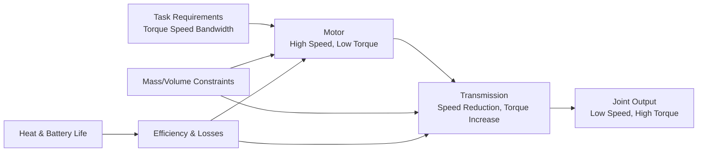

### 4.1.3 Safety, Compliance, and Contact Interaction

Humanoid robots will come into contact with people and objects in factory or home environments. If the actuator is "rigid," contact forces can become very large instantly upon collision. An actuator with compliance can temporarily store impact energy in an elastic element or sense external forces via a current loop and actively yield. **Impedance control**, proposed by Neville Hogan in 1985, represents the robot end-effector as a programmable "mass-spring-damper" system, creating a controllable relationship between contact force and position deviation [3].

#### Physical Basis of Impedance Control: From Mass-Spring-Damper to Port Characteristics

Abstracting the robot end-effector as a mass-spring-damper unit, its dynamic equation can be directly written from Newton's second law:

\[
M_d \, \ddot{x} + B_d \, \dot{x} + K_d \, (x - x_d) = F_{ext}
\]

where:
- \(M_d\): Desired equivalent mass (kg), determining the acceleration response during collision;
- \(B_d\): Desired equivalent damping (N·s/m or kg/s), determining the rate of energy dissipation;
- \(K_d\): Desired equivalent stiffness (N/m), determining the relationship between position deviation and restoring force;
- \(x_d\): Desired trajectory position (m);
- \(F_{ext}\): External force (N) acting on the robot end-effector from the environment.

In the Laplace domain, this equation can be written as the **mechanical impedance** of the robot port:

\[
Z(s) = \frac{F_{ext}(s)}{\dot{X}(s)} = M_d s + B_d + \frac{K_d}{s}
\]

Its physical meaning is: when the external environment "pushes" the robot port with velocity \(\dot{x}\), the robot responds with force \(F_{ext}\); impedance \(Z(s)\) is the dynamic transfer function between force and velocity. The larger the impedance, the greater the reaction force for the same velocity disturbance, making the robot appear "stiffer." The smaller the impedance, the smaller the reaction force, making the robot appear "softer."

**Numerical Example**: Assume desired parameters are \(M_d=2\ \text{kg}\), \(B_d=50\ \text{N·s/m}\), \(K_d=2000\ \text{N/m}\). When the robot end-effector is pushed by the external environment at a constant velocity of \(0.01\ \text{m/s}\), the spring term dominates in steady state, and the contact force is:

\[
F_{ext} \approx K_d \Delta x
\]

If pushed for 0.1 s, the displacement increment \(\Delta x \approx 0.001\ \text{m}\), then:

\[
F_{ext} \approx 2000 \times 0.001 = 2\ \text{N}
\]

Without impedance control, if the robot's rigid position loop stiffness is as high as \(K_{pos}=10^5\ \text{N/m}\), the same displacement would generate:

\[
F_{ext} \approx 10^5 \times 0.001 = 100\ \text{N}
\]

This shows that impedance control can reduce potential collision forces by approximately two orders of magnitude. For a more in-depth discussion on the implementation of impedance control and passivity analysis, see Section 4.5.6; for its relationship with whole-body balance/contact force planning, see Chapter 6.

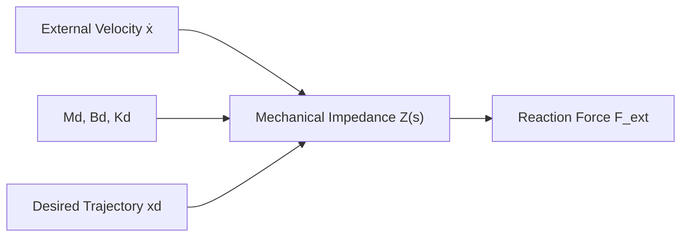

!!! note "Terminology: Mechanical Impedance, Laplace Domain, Equivalent Mass, Equivalent Damping, Equivalent Stiffness"
    - **Mechanical Impedance**: The dynamic transfer function between force and velocity, unit N·s/m.
    - **Laplace Domain**: A frequency/operator domain using the complex variable \(s\) to describe the dynamics of linear time-invariant systems.
    - **Equivalent Mass**: The virtual mass exhibited by the robot port in impedance control.
    - **Equivalent Damping**: The virtual damping exhibited by the robot port in impedance control, determining energy dissipation.
    - **Equivalent Stiffness**: The virtual spring stiffness exhibited by the robot port in impedance control.

!!! note "Terminology: Compliance, Impedance, Admittance, Human-Robot Interaction Safety"
    - **Compliance**: The ability of a mechanism to deform under external force. Compliance should be understood as "low stiffness," e.g., a spring is more compliant than a steel rod.
    - **Impedance**: The "resistance characteristic" of a robot to external forces, i.e., the relationship between force and displacement/velocity. Impedance control makes the robot behave externally like a set mass-spring-damper system.
    - **Admittance**: The inverse of impedance, representing the motion response to an external force. Systems primarily controlled by position often use admittance control to achieve force regulation.
    - **Human-Robot Interaction Safety**: Reducing potential collision injuries to an acceptable level through mechanical compliance, force limitation, collision detection, and low-inertia design.

Overall, an excellent humanoid robot joint must strike a balance within the multi-dimensional space shown in Figure 4.1.

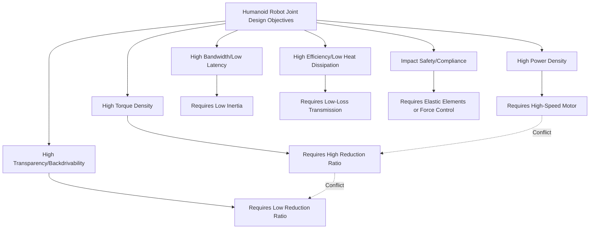


#### Joint Loads from a Whole-Body Dynamics Perspective

So far, we have abstracted actuator requirements into metrics such as torque, speed, and bandwidth. However, these metrics are not given in isolation; they are derived from task motions and contact conditions via **whole-body inverse dynamics**[36][37]. Understanding this helps to transform "how much torque a joint needs" from empirical tables into a computable physical causality during the selection phase.

##### Lagrangian Origin of Joint Torques

The dynamics of an \(n\)-DOF robot can be written in Lagrangian form as

\[
\tau = M(q)\ddot{q} + C(q,\dot{q})\dot{q} + g(q) - J^T F_{ext}
\]

where the physical meaning of each term is:

- \(M(q)\): **Mass matrix**, describing the inertial coupling between joint accelerations;
- \(C(q,\dot{q})\dot{q}\): **Coriolis and centrifugal forces**, arising from non-inertial coordinate frames and relative link motion;
- \(g(q)\): **Gravity term**, equal to the gradient of the gravitational potential energy in the robot's configuration;
- \(J^T F_{ext}\): **External contact forces mapped to joint torques via the Jacobian transpose**;
- \(q,\dot{q},\ddot{q}\) are the generalized coordinates, velocities, and accelerations, respectively.

!!! note "Terminology Explanation: Generalized Coordinates, Mass Matrix, Coriolis Force, Jacobian, Contact Wrench"
    - **Generalized coordinates**: A set of independent variables that uniquely determine the system's configuration; for robots, these are typically the joint angles \(q\).
    - **Mass matrix**: The positive definite symmetric matrix \(M(q)\) in Lagrangian dynamics, where element \(M_{ij}\) represents the influence of joint \(j\)'s acceleration on the torque required at joint \(i\).
    - **Coriolis / centrifugal force**: Inertial force terms appearing in non-inertial frames due to relative link rotation, proportional to the product of velocities.
    - **Jacobian**: A matrix mapping joint velocities to operational-space velocities (e.g., foot linear velocity); its transpose maps operational-space forces back to joint torques.
    - **Contact wrench**: The combination of force and moment acting at a contact point, typically denoted as \(F_{ext} = [f_x,f_y,f_z,m_x,m_y,m_z]^T\).

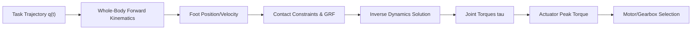

##### Load Characteristics of Stance and Swing Phases

Taking a single leg during walking as an example, a gait cycle can be divided into:

1. **Stance phase**: The foot is in contact with the ground, and the leg supports the entire body weight like an inverted pendulum. Here, the joint torques of the hip, knee, and ankle are primarily used to balance **ground reaction forces** and gravitational moments.
2. **Swing phase**: The foot leaves the ground and swings forward. Joint torques are mainly used to overcome the inertia of the links themselves for rapid flexion/extension, and the contact term \(J^T F_{ext}\) is nearly zero.

During the stance phase, the knee torque is often the largest because the ground reaction force, transmitted through the shank to the knee, creates a significant moment arm. During the swing phase, the ankle needs to quickly dorsiflex/plantarflex to clear ground obstacles, primarily overcoming the inertia of the foot and shank.

!!! note "Terminology Explanation: Stance Phase, Swing Phase, Ground Reaction Force, Inverted Pendulum Model"
    - **Stance phase**: The phase of the gait cycle when the foot is in contact with the ground.
    - **Swing phase**: The phase when the foot is off the ground and swinging forward.
    - **Ground reaction force (GRF)**: The reaction force exerted by the ground on the foot; during the stance phase, it can reach 1–1.5 times body weight.
    - **Inverted pendulum model**: Simplifies the supporting leg to a single pendulum rotating about the foot, used for rough estimation of the torque required for balance.

```mermaid
flowchart LR
    subgraph Stance Phase
    A1["Body Weight + GRF"] --> B1["Hip/Knee/Ankle<br/>Resist Gravity Torque"]
    end
    subgraph Swing Phase
    A2["No Ground Contact"] --> B2["Joint Acceleration<br/>Shank/Foot Inertia"]
    end
    C["Gait Cycle"] --> Stance Phase
    C --> Swing Phase
```

##### Estimating Knee Torque with a Two-Link Leg Model

To qualitatively understand why knee torque is so large, the leg can be simplified to a two-link model consisting of a thigh (length \(l_t\)) and a shank (length \(l_s\)), with the total body mass approximately concentrated at the torso's center of mass. During the stance phase, the torso's center of mass is above the foot, with a horizontal distance roughly equal to the shank's projection on the ground. If the total weight \(m_{tot}g\) is approximated to act at a horizontal distance \(d\) in front of the knee joint, the torque required at the knee to maintain a static stance is approximately

\[
\tau_{knee} \approx m_{tot} g \, d
\]

where \(d\) is the horizontal distance from the foot contact point to the knee joint. When a person stands upright, \(d\) can be 5–10 cm. Therefore, for an 80 kg robot supporting on one leg,

\[
\tau_{knee} \approx 80 \times 9.8 \times 0.08 \approx 63\ \text{N·m}
\]

This is only a quasi-static estimate; considering peak ground reaction forces, dynamic accelerations, and the knee's own acceleration, the actual peak torque can be amplified by a factor of 1.5–2.5. This simple model illustrates that knee torque can be comparable to or even larger than hip torque because the moment arm of the ground reaction force at the knee is often longer than at the hip[38].

!!! note "Terminology Explanation: Two-Link Model, Moment Arm, Quasi-Static Estimate, GRF Moment Arm"
    - **Two-link model**: A dynamic approximation simplifying the thigh and shank each into a single link.
    - **Moment arm**: The perpendicular distance from the line of action of a force to the axis of rotation, determining the magnitude of the torque.
    - **Quasi-static estimate**: An estimate of load that ignores inertial forces due to acceleration, considering only static force balance.
    - **GRF moment arm**: The distance from the line of action of the ground reaction force to the joint axis; a primary source of joint torque.

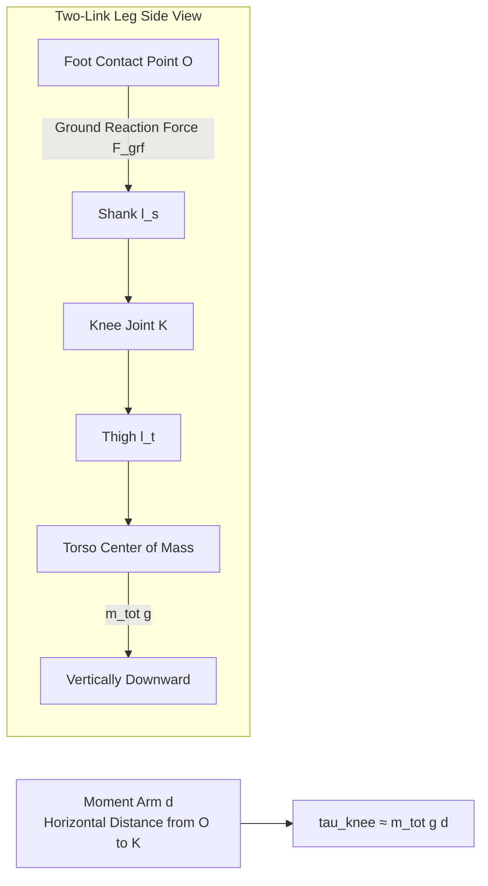

##### Transmission of Contact Wrench to Joints

When the foot experiences a ground reaction force \(F_{grf}\), this force is transmitted upward through the shank, ankle, knee, and hip joints. Let the Jacobian from the foot to joint \(i\) be \(J_i\); then the incremental joint torque is

\[
\Delta \tau_i = J_i^T F_{grf}
\]

At the moment of **heel-strike**, the ground reaction force generates a large axial force along the shank and a torque with a very short moment arm at the ankle, causing a torque spike at the ankle. During **push-off**, the plantarflexor muscles need to output a large thrust through the ankle joint, also leading to a peak ankle torque. Because the ankle is closest to the ground and has a short moment arm, producing the same ground moment requires a larger joint torque, which is why ankle actuators often have extremely high peak torque requirements.

!!! note "Terminology Explanation: Heel-Strike, Push-Off, Joint Torque Spike, Torque Transmission"
    - **Heel-strike**: The impact contact when the swinging foot lands on the ground.
    - **Push-off**: The action at the end of the stance phase where the foot pushes backward and downward against the ground to propel the body forward.
    - **Torque spike**: A short-duration high torque caused by impact or rapid loading.
    - **Torque transmission**: The torque generated at each joint due to contact forces transmitted through the geometric relationships of the links.


##### Static and Dynamic Actuation Margin

In engineering, a two-step method is commonly used to determine actuator specifications:

1. **Quasi-static worst-case**: Calculate the torque required at each joint under extreme postures (e.g., maximum forward lean on one leg, deepest squat).
2. **Dynamic amplification**: Multiply the static torque by a dynamic amplification factor \(k_{dyn} \approx 1.5\sim2.5\) to cover inertial loads during walking, jumping, or fall recovery.

Although full trajectory optimization is more accurate, it requires a known complete task trajectory and contact sequence, and is computationally expensive. The quasi-static + dynamic margin method facilitates rapid screening of motors and reduction ratios during the early design phase. If the peak torque margin of a joint is insufficient, subsequent steps—either increasing the reduction ratio or switching to a larger motor—will incur penalties in mass and transparency.

!!! note "Terminology: Actuation Margin, Dynamic Amplification Factor, Worst-case Posture, Trajectory Optimization"
    - **Actuation margin**: The surplus ratio of the actuator's peak torque relative to the peak torque required by the task.
    - **Dynamic amplification factor**: An empirical coefficient used to scale quasi-static torque to dynamic torque.
    - **Worst-case posture**: The extreme static configuration that maximizes joint torque.
    - **Trajectory optimization**: A numerical method that simultaneously optimizes motion trajectories and contact forces to satisfy dynamic constraints.

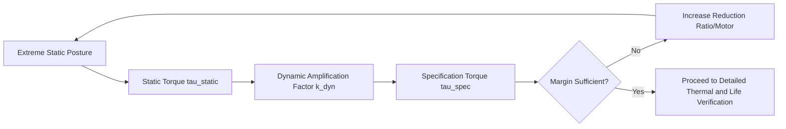

## 4.2 Motor Fundamentals: Electromagnetism, Mechanics, and Thermal Science

### Fundamentals of Motor Electromagnetic Fields: From Maxwell's Equations to the Finite Element Concept

Before delving into the specific calculation of motor torque and dimensions, it is necessary to start from the continuous medium description of the electromagnetic field to explain the physical basis of motor design. A permanent magnet motor is essentially a boundary value problem that solves for the distribution of the magnetic field in the stator, rotor, and air gap [8][29].

#### Maxwell's Equations in Motor Design

When the motor operating frequency is much lower than the speed of light, the displacement current can be neglected, and the magnetic field satisfies the **magnetostatics** equations:

\[
\nabla \times \mathbf{H} = \mathbf{J}, \qquad
\nabla \cdot \mathbf{B} = 0, \qquad
\mathbf{B} = \mu \mathbf{H}
\]

where:

- \(\mathbf{H}\): Magnetic field strength, unit A/m;
- \(\mathbf{B}\): Magnetic flux density, unit T;
- \(\mathbf{J}\): Current density, unit A/m²;
- \(\mu = \mu_r \mu_0\): Magnetic permeability of the material.

If the time-varying term is restored, the complete Maxwell-Ampère law is

\[
\nabla \times \mathbf{H} = \mathbf{J} + \frac{\partial \mathbf{D}}{\partial t}
\]

and Gauss's law for magnetism is

\[
\nabla \cdot \mathbf{B} = 0
\]

The integral forms are Ampère's circuital law and the law of magnetic flux continuity, respectively. The rationale for neglecting the displacement current in magnetostatics is that the rate of change of the electric field in a motor is much smaller than the conduction current density, so the contribution of \(\partial \mathbf{D}/\partial t\) to the magnetic field can be ignored.

!!! note "Term Explanation: Maxwell's Equations, Magnetostatics, Ampère's Circuital Law, Magnetic Flux Continuity, Permeability"
    - **Maxwell's equations**: The four fundamental equations describing the relationships between electric fields, magnetic fields, charges, and currents.
    - **Magnetostatics**: The branch of study dealing with magnetic fields that do not change over time, neglecting displacement current.
    - **Ampère's circuital law**: The line integral of the magnetic field strength around a closed loop is equal to the total conduction current passing through the surface bounded by that loop.
    - **Magnetic flux continuity**: The net magnetic flux through any closed surface is zero, meaning there are no magnetic monopoles.
    - **Permeability**: The ability of a material to conduct magnetic flux, \(\mu = \mu_r \mu_0\).

##### Magnetic Vector Potential and the 2D Poisson Equation

Since \(\nabla \cdot \mathbf{B}=0\), a **magnetic vector potential** \(\mathbf{A}\) can be introduced such that

\[
\mathbf{B} = \nabla \times \mathbf{A}
\]

For a two-dimensional motor cross-section problem, assuming the magnetic field has only a \(z\)-component \(A_z(x,y)\) and the current density also has only a \(z\)-component \(J_z\), substituting into \(\nabla \times \mathbf{H} = \mathbf{J}\) yields

\[
\nabla \cdot \left( \frac{1}{\mu} \nabla A_z \right) = -J_z
\]

This is the core equation for motor finite element solvers. Commercial software such as JMAG, Ansys Maxwell, Altair Flux, and FEMM discretize the stator, rotor, permanent magnets, and air regions into triangular or quadrilateral meshes, approximate \(A_z\) within each element, and then solve the weak form of the above partial differential equation [8][29].

!!! note "Term Explanation: Magnetic Vector Potential, Poisson Equation, Finite Element Method, Mesh, Weak Form"
    - **Magnetic vector potential**: An auxiliary vector field whose curl gives the magnetic flux density.
    - **Poisson equation**: A second-order elliptic partial differential equation of the form \(\nabla^2 u = -f\).
    - **Finite element method (FEM)**: A numerical method that discretizes a continuous region into a finite number of small elements for solving problems.
    - **Mesh**: The collection of discrete elements, determining the accuracy and computational cost of the numerical solution.
    - **Weak form**: An integral equation obtained by multiplying by a test function and integrating by parts, suitable for finite element discretization.


##### From Continuous Medium to Lumped Magnetic Circuit

In the continuous medium model, the material's ability to "impede magnetic flux" is represented by \(1/\mu\). If the magnetic field is confined within a single thin flux tube, integrating along the tube length gives

\[
\mathcal{R} = \int \frac{dl}{\mu A}
\]

This is the source of the reluctance \(R = l/(\mu A)\) in the equivalent magnetic circuit introduced in Section 4.2.6. Therefore, the lumped magnetic circuit model is a discrete approximation of the continuous FEM model under the assumption of a "single flux tube with uniform cross-section." The magnetic circuit method is fast to calculate and physically intuitive, suitable for preliminary design and parameter sweeping; however, it cannot capture:

- **Saliency effect and magnetic saturation**: Local saturation in the iron core changes the local permeability, invalidating the linear magnetic circuit assumption;
- **End effect**: Axial 3D leakage flux and winding end-turn magnetic fields cannot be represented in a 2D model;
- **Slotting and harmonics**: Air gap permeance harmonics caused by slotting require a fine mesh to resolve.

This is why high-performance motor design must incorporate FEM.

!!! note "Term Explanation: Reluctance, Lumped Magnetic Circuit, Magnetic Saturation, Leakage Flux, Slot Harmonic"
    - **Reluctance**: The opposition to magnetic flux in a magnetic circuit, \(\mathcal{R}=l/(\mu A)\).
    - **Lumped magnetic circuit**: A model approximating the magnetic field using lumped elements such as reluctance, magnetomotive force sources, and magnetic flux.
    - **Magnetic saturation**: The phenomenon where the permeability of a ferromagnetic material decreases as the magnetic flux density increases.
    - **Leakage flux**: Magnetic flux that does not follow the main magnetic path and closes through the air.
    - **Slot harmonic**: Periodic variations in air gap permeance caused by stator slotting.

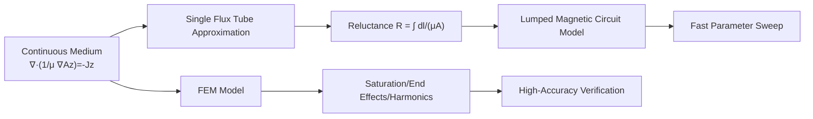

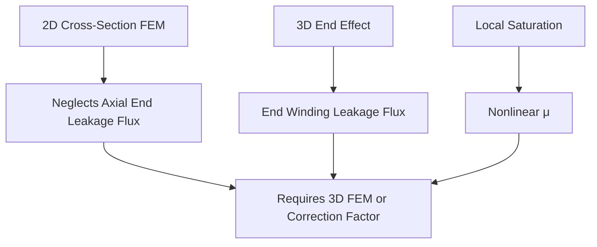

### 4.2.1 Lorentz Force and Motor Torque

The fundamental source of torque generation in a motor is the force exerted by a magnetic field on moving charges or current-carrying conductors—the **Lorentz force**. When a conductor of length \(l\) carrying a current \(I\) is placed in a magnetic field with flux density \(B\), the Ampère force it experiences is

$$
\mathbf{F} = I \, \mathbf{l} \times \mathbf{B}
$$

Its magnitude is \(F = B I l \sin\theta\), and its direction is determined by the right-hand rule (or cross product). In a rotating motor, many conductor segments are fixed in the rotor slots. The tangential force generated by each segment at radius \(r\) collectively forms the torque:

$$
\tau = \sum_i r_i F_i = \sum_i r_i B_i l_i I_i \sin\theta_i
$$

If expressed using the equivalent total number of conductors \(N\), average radius \(r\), and air gap flux density \(B\), it can be written in a commonly used engineering form:

$$
\tau = k_t \, I
$$

where \(k_t = N B l r\) (combining geometric and magnetic field factors) is called the **torque constant**. This relationship indicates that, given a fixed magnetic field, the output torque of the motor is proportional to the armature current.

!!! note "Term Explanation: Lorentz Force, Ampère Force, Magnetic Flux Density, Magnetic Flux, Flux Linkage, Torque Constant"
    - **Lorentz force**: The force exerted by an electromagnetic field on a moving charge \(\mathbf{F}=q(\mathbf{E}+\mathbf{v}\times\mathbf{B})\). In conductors, it manifests as the Ampère force acting on charge carriers as a whole.
    - **Ampère force**: The force experienced by a current-carrying conductor in a magnetic field, essentially the macroscopic statistical result of the Lorentz force.
    - **Magnetic flux density**: A physical quantity describing the strength and direction of a magnetic field, denoted by \(B\), with the unit Tesla (T). In motors, it is generated by permanent magnets or field windings.
    - **Magnetic flux**: The total magnetic field passing through a given area \(\Phi = \int \mathbf{B}\cdot d\mathbf{A}\), with the unit Weber (Wb).
    - **Flux linkage**: The product of the number of coil turns and the magnetic flux per turn \(\lambda = N \Phi\), reflecting the degree of coupling between the magnetic field and the coil. The back-EMF is proportional to the rate of change of flux linkage over time.
    - **Torque constant (\(k_t\))**: The coefficient relating current to torque generation, with the unit N·m/A. In permanent magnet motors, \(k_t\) and \(k_e\) are numerically equal in SI units.

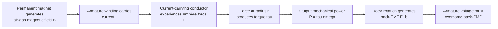

### 4.2.2 Equivalent Circuit and Voltage Equation of a DC Motor

To understand motor drives, first abstract a brushed DC motor into an equivalent circuit: the armature can be viewed as a series connection of resistance \(R_a\), inductance \(L_a\), and a motion-induced voltage source (back-EMF \(E_b\)). When an external terminal voltage \(V\) is applied, the circuit equation is

$$
V = R_a I + L_a \frac{dI}{dt} + E_b
$$

In steady state, the inductive term is zero, and the current is

$$
I = \frac{V - E_b}{R_a}
$$

The back-EMF is proportional to the rotational speed:

$$
E_b = k_e \, \omega
$$

where \(k_e\) is the **back-EMF constant**, with units V·s/rad or V/(rad/s). In SI units, for a permanent magnet motor, \(k_t\) (N·m/A) and \(k_e\) (V·s/rad) are numerically equal.

The steady-state torque can be written as

$$
\tau = k_t \, I = k_t \frac{V - k_e \omega}{R_a}
$$

This indicates: at a fixed terminal voltage, the higher the speed, the larger the back-EMF, the smaller the available current, and the lower the output torque—this is the natural **torque-speed characteristic** of a DC motor.

!!! note "Term Explanation: Back-EMF, Armature Resistance, Armature Inductance, Voltage Equation, Mechanical Characteristic"
    - **Back electromotive force (back-EMF)**: The induced electromotive force generated when a conductor cuts magnetic field lines while moving in a magnetic field. Its direction opposes the applied voltage, and its magnitude is proportional to the rotational speed.
    - **Armature resistance**: The equivalent resistance \(R_a\) of the motor windings and commutator, causing copper loss \(I^2 R_a\).
    - **Armature inductance**: The equivalent inductance \(L_a\) of the windings, which limits the rate of current change and produces the electrical time constant \(\tau_e = L_a/R_a\).
    - **Voltage equation**: The relationship describing how the applied voltage is balanced by the resistive voltage drop, inductive voltage drop, and back-EMF.
    - **Mechanical characteristic**: The curve of torque versus speed for a motor at a constant voltage, typically a descending straight line from stall torque to no-load speed.

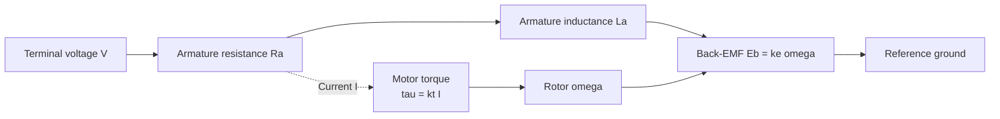

### 4.2.3 AC Rotating Magnetic Field and Permanent Magnet Synchronous Motor

Actual humanoid robots extensively use **permanent magnet synchronous motors** (PMSM). When three-phase sinusoidal currents with a 120° phase difference are applied to the stator windings, a magnetic field rotating at electrical angular velocity \(\omega_e\) is generated in the air gap:

$$
\omega_e = 2 \pi f = p \, \omega_m
$$

where \(f\) is the current frequency, \(p\) is the **number of pole pairs**, and \(\omega_m\) is the mechanical angular velocity. Permanent magnets are mounted on the rotor, and their magnetic field is "dragged" into synchronous rotation by the stator rotating field. The synchronous speed is

$$
n_s = \frac{60 f}{p} \quad (\text{r/min})
$$

!!! note "Term Explanation: Permanent Magnet Synchronous Motor, Number of Pole Pairs, Synchronous Speed, Electrical Angular Velocity, Mechanical Angular Velocity, Rotating Magnetic Field"
    - **Permanent magnet synchronous motor (PMSM)**: A motor where the rotor uses permanent magnets to generate the excitation magnetic field, and the stator is supplied with AC current to create a rotating magnetic field, with both rotating synchronously.
    - **Number of pole pairs (\(p\))**: The number of N-S magnetic pole pairs in the motor. A higher number of pole pairs results in a higher electrical frequency for the same mechanical speed.
    - **Synchronous speed**: The rotational speed of the rotating magnetic field. Ideally, the rotor operates at this speed.
    - **Electrical angular velocity**: The angular velocity measured in electrical cycles, which is \(p\) times the mechanical angular velocity.
    - **Rotating magnetic field**: A magnetic field produced by polyphase AC windings that rotates in space at a constant speed, forming the basis of AC motor operation.

Under **field-oriented control** (FOC), the stator current is decomposed into the \(d\)-axis (direct axis, aligned with the permanent magnet flux linkage) and the \(q\)-axis (quadrature axis, leading the \(d\)-axis by 90° electrical degrees), which rotate synchronously with the rotor. For a surface-mounted permanent magnet motor (SPMSM), \(L_d = L_q\), and the electromagnetic torque is

$$
\tau = \frac{3}{2} p \, \lambda_f \, i_q
$$

For an interior permanent magnet motor (IPMSM), there is **reluctance torque**:

$$
\tau = \frac{3}{2} p \left[ \lambda_f i_q + (L_d - L_q) i_d i_q \right]
$$

where \(\lambda_f\) is the rotor flux linkage produced by the permanent magnets. The first term is the permanent magnet torque, and the second term is the reluctance torque resulting from the difference in \(d\)- and \(q\)-axis inductances.

!!! note "Term Explanation: Direct Axis, Quadrature Axis, Flux Linkage, Reluctance Torque, Salient-Pole Effect, Interior Permanent Magnet Motor"
    - **Direct axis (d-axis)**: The axis aligned with the direction of the rotor permanent magnet flux linkage, denoted as \(d\).
    - **Quadrature axis (q-axis)**: The axis leading the direct axis by 90° electrical degrees; it is the primary current direction for torque generation.
    - **Flux linkage (\(\lambda_f\))**: The flux linkage coupled from the rotor permanent magnets into the stator windings, serving as the source of permanent magnet torque.
    - **Reluctance torque**: An additional torque caused by magnetic circuit anisotropy (\(L_d \neq L_q\)), arising from the different magnetic reluctance experienced by currents on the \(d\)- and \(q\)-axes.
    - **Salient-pole effect**: The difference in magnetic reluctance between the rotor's \(d\)- and \(q\)-axes, leading to \(L_d \neq L_q\).
    - **Interior permanent magnet motor (IPMSM)**: A motor where permanent magnets are embedded inside the rotor core, utilizing reluctance torque to increase torque density, commonly used in traction motors.

### 4.2.4 Commutation of Brushless DC Motors and Sinusoidal Permanent Magnet Synchronous Motors, and FOC

**Brushless DC motors** (BLDC) have a similar structure to PMSMs, but their back-EMF waveforms differ: BLDC motors are designed with a trapezoidal waveform, paired with simple six-step commutation (switching the conducting phase every 60° electrical degrees); PMSMs have a sinusoidal back-EMF waveform, and when paired with FOC, they achieve lower torque ripple and higher efficiency.

!!! note "Term Explanation: Brushless DC Motor, Trapezoidal Back-EMF, Six-Step Commutation, Hall Sensor, Sinusoidal Back-EMF"
    - **Brushless DC motor (BLDC)**: A DC motor that uses electronic commutation to replace mechanical brushes. It typically has a trapezoidal back-EMF waveform, offering simple control and lower cost.
    - **Trapezoidal back-EMF / Sinusoidal back-EMF**: Refers to the induced voltage in the motor windings varying with rotor position in a trapezoidal or sinusoidal manner. Sinusoidal motors paired with sinusoidal currents can achieve zero torque ripple.
    - **Six-step commutation**: A commutation method for BLDC motors where the conducting phase is switched every 60° electrical degrees. At any given time, two phases are conducting and one phase is floating.
    - **Hall sensor**: A magnetic switch used to detect the position of the rotor magnetic poles, commonly used for BLDC commutation.

**Field-Oriented Control** The core idea is to transform the three-phase stationary coordinate system currents into the two-phase stationary \(\alpha\beta\) coordinate system via the **Clark transform**, and then into the \(dq\) coordinate system rotating with the rotor via the **Park transform**. This converts AC quantities into DC quantities, allowing PI controllers to independently control \(i_d\) and \(i_q\). Finally, **Space Vector Pulse Width Modulation** (SVPWM) generates the switching signals for the three-phase inverter.

!!! note "Terminology: Field-Oriented Control, Clark Transform, Park Transform, Space Vector Pulse Width Modulation, Inverter"
    - **Field-Oriented Control (FOC)**: Decomposes the stator current vector into the rotor rotating coordinate system for independent control, making an AC motor as easy to control torque as a DC motor.
    - **Clark Transform**: Converts the three-phase stationary coordinate system \(abc\) into the two-phase stationary coordinate system \(\alpha\beta\).
    - **Park Transform**: Converts the two-phase stationary coordinate system \(\alpha\beta\) into the \(dq\) coordinate system rotating with the rotor.
    - **Space Vector Pulse Width Modulation (SVPWM)**: A PWM method that makes the three-phase inverter output a voltage vector closest to the target, offering about 15% higher voltage utilization than sinusoidal PWM.
    - **Inverter**: A power electronic circuit that converts DC power into AC power, typically composed of six switching devices forming a three-phase bridge.

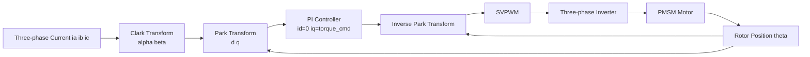

### 4.2.5 Frameless Torque Motors and Joint Integration

Humanoid robot hip and shoulder joints often require output torques ranging from tens to hundreds of N·m. Using a standard servo motor with a high reduction ratio can amplify torque but sacrifices transparency and bandwidth. One solution is to use a **frameless torque motor**: its stator and rotor are embedded directly into the joint structure, eliminating the housing, end caps, and bearings. With a large diameter and high pole count, it can directly output high torque at low speeds.

The torque density of a frameless torque motor can be expressed as

$$
\tau = 2 \pi r^2 l B_{\text{gap}} J_s
$$

where \(r\) is the air gap radius, \(l\) is the axial length, \(B_{\text{gap}}\) is the air gap flux density, and \(J_s\) is the electric loading (total winding current per circumference). Increasing \(r\) has a quadratic effect on torque improvement, so large-diameter frameless motors can achieve higher torque for the same mass.

!!! note "Terminology: Frameless Torque Motor, Electric Loading, Air Gap, Direct Drive, Torque Motor"
    - **Frameless Torque Motor**: A motor without a housing, shaft, or end caps, where the user integrates the stator and rotor directly into the mechanical structure to maximize torque density.
    - **Electric Loading**: The total ampere-conductors per unit of circumferential length, reflecting the winding's "current-carrying capacity."
    - **Air Gap**: The small air gap between the stator and rotor, which magnetic flux must cross. A smaller air gap reduces magnetic reluctance but imposes stricter manufacturing and thermal deformation requirements.
    - **Direct Drive**: The motor drives the load directly without a gearbox, offering zero backlash and high transparency, but requiring a high-torque motor.
    - **Torque Motor**: A motor specifically designed for low-speed, high-torque applications, typically with a large diameter and high pole count.

Tesla Optimus's rotary joints reportedly use an integrated solution combining a frameless torque motor with a harmonic drive gearbox[14].

### 4.2.6 Losses and Thermal Models

Motors are not ideal energy converters; losses are primarily dissipated as heat. There are three main categories:

1.  **Copper Loss** (winding resistance heating):
    $$
    P_{\text{Cu}} = I^2 R_{\text{ac}}
    $$
    where \(R_{\text{ac}}\) is the AC equivalent resistance, which increases slightly with frequency.

2.  **Iron Loss** (hysteresis and eddy current losses in the magnetic core):
    $$
    P_{\text{Fe}} = P_{\text{hyst}} + P_{\text{eddy}} \approx k_h f B^n + k_e f^2 B^2
    $$
    where \(f\) is the magnetization frequency, \(B\) is the flux density amplitude, and \(n\) is the Steinmetz coefficient (typically 1.6-2.2).

3.  **Mechanical Loss**: Bearing friction and windage, usually small.

!!! note "Terminology: Copper Loss, Iron Loss, Hysteresis Loss, Eddy Current Loss, Thermal Resistance, Insulation Class, Thermal Time Constant"
    - **Copper Loss**: Joule heating generated by current flowing through the winding resistance, proportional to the square of the current.
    - **Iron Loss / Core Loss**: Energy loss in ferromagnetic materials caused by alternating magnetic fields, including hysteresis loss and eddy current loss.
    - **Hysteresis Loss**: Energy loss due to friction from domain wall movement during repeated magnetization of ferromagnetic materials, related to frequency and flux density.
    - **Eddy Current Loss**: Joule heating generated by eddy currents induced in the conductive core by alternating magnetic fields, proportional to the square of the frequency.
    - **Thermal Resistance**: The resistance of a heat transfer path to temperature rise, unit K/W. Temperature rise = Loss × Thermal resistance.
    - **Insulation Class**: The maximum allowable operating temperature for motor winding insulation materials, e.g., Class F 155 °C, Class H 180 °C.
    - **Thermal Time Constant**: The time required for the motor temperature to reach 63% of its steady-state temperature rise, determining short-term overload capability.

The thermal behavior of a motor can be described by a first-order thermal equivalent circuit:

$$
T_j = T_{\text{amb}} + P_{\text{loss}} \, R_{\text{th}}
$$

where \(T_j\) is the winding (junction) temperature, \(T_{\text{amb}}\) is the ambient temperature, and \(R_{\text{th}}\) is the total thermal resistance. Considering the thermal capacitance \(C_{\text{th}}\), the temperature change satisfies

$$
C_{\text{th}} \frac{dT_j}{dt} + \frac{T_j - T_{\text{amb}}}{R_{\text{th}}} = P_{\text{loss}}
$$

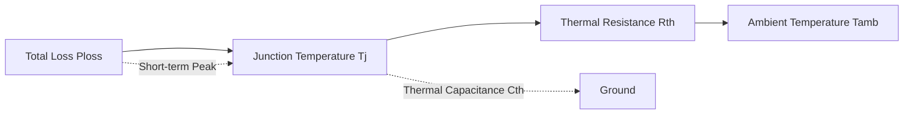

When the winding temperature approaches the insulation limit, the current must be reduced or cooling increased. This determines the difference between **continuous torque** and **peak torque**: peak torque can exceed the continuous value for a short time, utilizing the thermal capacitance to absorb instantaneous heat, but cannot be sustained.

#### Two-Node Thermal Network Model

A single-node model can only provide the average temperature rise from the winding to the environment and cannot explain the transient behavior during short-term peaks where "the winding heats up first, the housing later." A more refined model divides the motor into two thermal nodes: the **winding node** \(T_w\) and the **housing node** \(T_c\). The thermal resistance \(R_{th1}\) and thermal capacitance \(C_w\) describe the path between them, while \(R_{th2}\) and \(C_c\) describe the path from the housing to the environment, as shown in Figure 4.2(c).

\[
\begin{aligned}
C_w \frac{dT_w}{dt} &= P_{\text{loss}} - \frac{T_w - T_c}{R_{th1}} \\
C_c \frac{dT_c}{dt} &= \frac{T_w - T_c}{R_{th1}} - \frac{T_c - T_{\text{amb}}}{R_{th2}}
\end{aligned}
\]

The two-node model can more accurately predict short-term overloads: due to the winding thermal capacitance \(C_w\), a current spike lasting a few seconds will only cause a transient rise in \(T_w\), while the housing temperature \(T_c\) remains almost unchanged. Therefore, peak torque can be significantly higher than continuous torque. Only when the overload duration is comparable to the winding thermal time constant does insulation overheating become a concern.

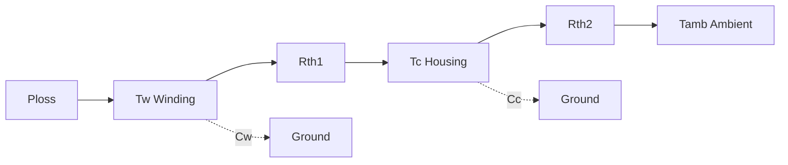

!!! note "Term Explanation: Two-Node Thermal Network, Thermal Resistance, Thermal Capacitance, Transient Thermal Impedance, Thermal Time Constant"
    - **Two-node thermal network**: A lumped-parameter thermal model that simplifies the motor into two thermal nodes: the winding and the housing.
    - **Thermal resistance (\(R_{th}\))**: The resistance to temperature rise along the heat transfer path, unit K/W.
    - **Thermal capacitance (\(C_{th}\))**: The ability of an object to store thermal energy, determining the rate of temperature change, unit J/K.
    - **Transient thermal impedance**: The effective thermal resistance that varies with time, \(Z_{th}(t)=\Delta T(t)/P\), used to evaluate short-term overloads.
    - **Thermal time constant (\(\tau_{th}=R_{th}C_{th}\))**: The time required for the temperature to reach 63% of the steady-state temperature rise.

#### Equivalent Magnetic Circuit of Surface-Mounted Permanent Magnet Motors

To more quantitatively relate motor torque to geometric dimensions, a Surface-Mounted Permanent Magnet Synchronous Motor (SPMSM) can be abstracted into an **equivalent magnetic circuit**. The permanent magnet is considered a constant magnetomotive force (MMF) source \(F_m\) in series with an internal reluctance \(R_m\); the air gap, stator teeth, and stator yoke are represented by reluctances \(R_g\), \(R_t\), and \(R_y\), respectively. According to Kirchhoff's laws for magnetic circuits, the total flux is

\[
\Phi = \frac{F_m}{R_m + R_g + R_t + R_y}
\]

In high-quality silicon steel, the core reluctance is often much smaller than the air-gap reluctance, i.e., \(R_t+R_y \ll R_g\). If the equivalent cross-sectional areas of the permanent magnet and the air gap are approximately equal, the air-gap flux density can be written as

\[
B_g \approx \frac{\mu_0 F_m}{g' + l_m/\mu_r}
\]

where \(g' = k_c g\) is the **Carter gap** considering the effect of stator slotting, \(k_c>1\) is the Carter coefficient; \(l_m\) and \(\mu_r\) are the permanent magnet thickness and relative permeability, respectively. This equation indicates:

- Increasing the permanent magnet thickness \(l_m\) can increase the MMF but also increases the internal reluctance; there is an optimal thickness.
- Reducing the air gap \(g\) can significantly decrease the total magnetic circuit reluctance and increase \(B_g\), but is limited by manufacturing tolerances, thermal deformation, and mechanical safety.
- Using Nd-Fe-B magnets with higher remanence \(B_r\) (i.e., higher \(F_m\)) is the most direct method to increase the air-gap flux density.

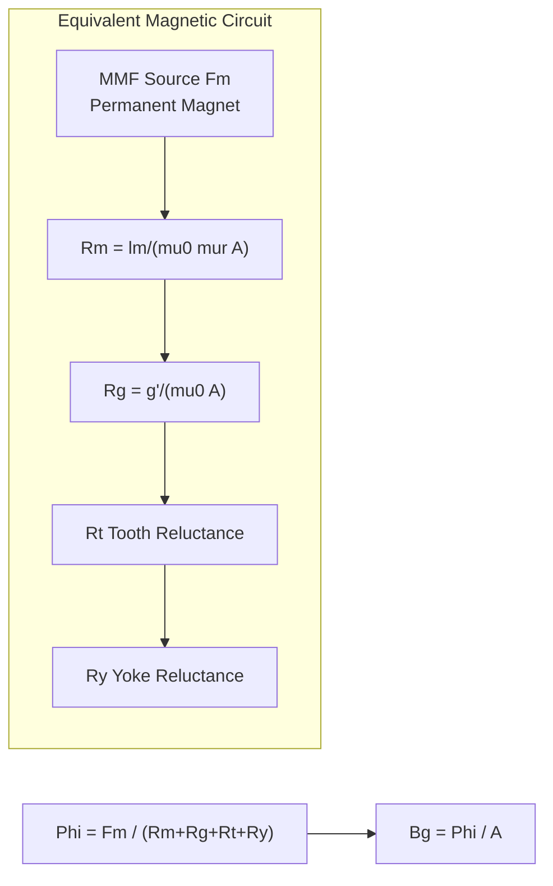

!!! note "Term Explanation: Magnetomotive Force, Reluctance, Equivalent Magnetic Circuit, Carter Coefficient, Air-Gap Flux Density"
    - **Magnetomotive force (MMF)**: The "magnetic pressure" driving magnetic flux through a magnetic circuit; a permanent magnet can be equivalent to a constant MMF source \(F_m = H_c l_m\).
    - **Reluctance**: The resistance of a magnetic circuit to magnetic flux, \(R = l/(\mu A)\), proportional to geometric length and inversely proportional to permeability.
    - **Magnetic equivalent circuit**: A lumped-parameter model using components like reluctance, MMF sources, and flux to simulate the motor's magnetic field.
    - **Carter coefficient**: A correction factor (\(k_c>1\)) that converts the slotted air gap into a smooth air gap, reflecting the equivalent increase in air-gap reluctance due to stator teeth and slots.
    - **Air-gap flux density (\(B_g\))**: The magnetic flux density in the air gap, directly determining the motor's electromagnetic torque and back-EMF.

#### Demagnetization Characteristics and Safe Operating Point of Permanent Magnets

The usable operating region of Nd-Fe-B permanent magnets lies in the second quadrant of their demagnetization curve. Key parameters characterizing magnet performance include:

- **Remanence \(B_r\)**: The magnetic flux density inside the magnet when the external magnetic field is reduced to zero.
- **Coercivity \(H_c\)**: The reverse magnetic field strength required to reduce the magnetization of the magnet to zero.
- **Intrinsic coercivity \(H_{ci}\)**: An intrinsic parameter characterizing the magnet's resistance to demagnetization, which decreases significantly at high temperatures.

The demagnetization curve of Nd-Fe-B is approximately linear at low temperatures but exhibits a "knee point" at high temperatures or under high reverse magnetic fields. If the magnet's operating point (determined by the external magnetic circuit load line and the armature reaction field) falls below the knee point, **irreversible demagnetization** will occur. Therefore, under the most severe current (short circuit, locked rotor) and temperature conditions, it must be ensured that

\[
B_m(T_{\max}, I_{\max}) > B_{\text{knee}}(T_{\max})
\]

In engineering practice, a safety margin of 10%–20% is often retained. For high-overload joints of humanoid robots, demagnetization verification is a necessary step in motor design [29].

```mermaid
xychart-beta
    title "Schematic Nd-Fe-B Second Quadrant Demagnetization Curve"
    x-axis "H [-kA/m]" [0, 1, 2, 3, 4]
    y-axis "B [T]"
    line "20 degC" [1.4, 1.2, 0.8, 0.4, 0.0]
    line "120 degC" [1.2, 0.9, 0.5, 0.2, -0.1]
    annotation "Knee Point" {x: 3, y: 0.2}
```

!!! note "Term Explanation: Demagnetization Curve, Knee Point, Coercivity, Intrinsic Coercivity, Irreversible Demagnetization"
    - **Demagnetization curve**: The \(B\!-\!H\) relationship of a permanent magnet in the second quadrant, describing the magnet's state from remanence to coercivity.
    - **Knee point**: The inflection point on the demagnetization curve where it transitions from approximately linear to sharply curved; operating below this point makes irreversible demagnetization likely.
    - **Coercivity (\(H_c\))**: The reverse magnetic field required to reduce the magnetic flux density \(B\) to zero.
    - **Intrinsic coercivity (\(H_{ci}\))**: The reverse magnetic field required to reduce the internal magnetization \(J\) of the magnet to zero, reflecting the ability to resist demagnetization.
    - **Irreversible demagnetization**: The loss of magnetic performance that cannot be fully recovered even if external conditions are restored, occurring when the magnet's operating point crosses the knee point.

#### Eddy Current Loss in Permanent Magnets and Its Suppression

Spatial harmonic MMF generated by Fractional-Slot Concentrated Windings (FSCW) induces eddy currents in the rotor permanent magnets, leading to magnet heating and even demagnetization. The eddy current loss density in the permanent magnet can be approximately expressed as

\[
p_{\text{PM,eddy}} \propto \frac{B_{\nu}^2 \, f_{\nu}^2 \, t^2}{\rho_{\text{PM}}}
\]

where \(B_{\nu}\) and \(f_{\nu}\) are the flux density amplitude and frequency of the \(\nu\)-th harmonic, \(t\) is the magnet thickness, and \(\rho_{\text{PM}}\) is the magnet resistivity. Suppression methods include:

1. **Segmentation**: Dividing a monolithic magnet into multiple segments along the axial or circumferential direction to interrupt eddy current paths.
2. **Lamination**: Using bonded magnets or a laminated structure of thin sheets to increase the effective resistivity.
3. **Optimizing pole-slot combination**: Reducing the harmonic amplitude \(B_{\nu}\).
4. **Selecting high-resistivity magnets**: Such as Sm-Co or ferrite, but a trade-off between energy product and resistivity is required.

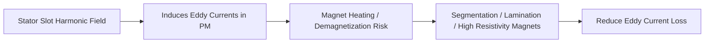

!!! note "Term Explanation: PM Eddy Current Loss, Slot Harmonic, Segmentation, Lamination, Resistivity"
    - **PM eddy-current loss**: Joule heating generated by eddy currents induced in conductive permanent magnets by alternating harmonic magnetic fields.
    - **Slot harmonic**: Air-gap permeance harmonics caused by stator slotting, a primary source of eddy current loss in permanent magnets.
    - **Segmentation**: Dividing a monolithic magnet along the direction of the eddy current path to increase resistance and reduce eddy currents.
    - **Lamination**: Insulating and stacking thin magnet sheets, similar to the principle of suppressing iron loss in silicon steel.
    - **Resistivity (\(\rho\))**: The ability of a material to resist the flow of electric current; higher resistivity leads to lower eddy current loss.

#### Classic Motor Sizing Equation (\(D^2L\) Equation)

The electromagnetic torque of a motor is essentially the product of the circumferential force in the air gap and the radius. If the winding current distribution is represented by the **electric loading** \(A_{\text{rms}}\) (rms ampere-conductors per unit circumferential length), the classic motor sizing equation is

\[
T = \frac{\pi}{2\sqrt{2}} \, k_w \, B_{g1} \, A_{\text{rms}} \, D^2 L
\]

Here \(D\) is the air-gap diameter, \(L\) is the axial core length, \(B_{g1}\) is the fundamental amplitude of the air-gap flux density, and \(k_w\) is the winding factor. This equation indicates:

- Torque is proportional to the motor's "active volume" \(D^2L\)—this is the fundamental basis for motor **volume sizing**;
- For a fixed volume, increasing \(B_{g1}\) (stronger magnets, smaller air gap) or \(A_{\text{rms}}\) (more conductors, higher current density) can both increase torque;
- Increasing the diameter \(D\) improves torque more than increasing the length \(L\) (quadratic vs. linear), which is why frameless torque motors adopt a large-diameter, flat structure.

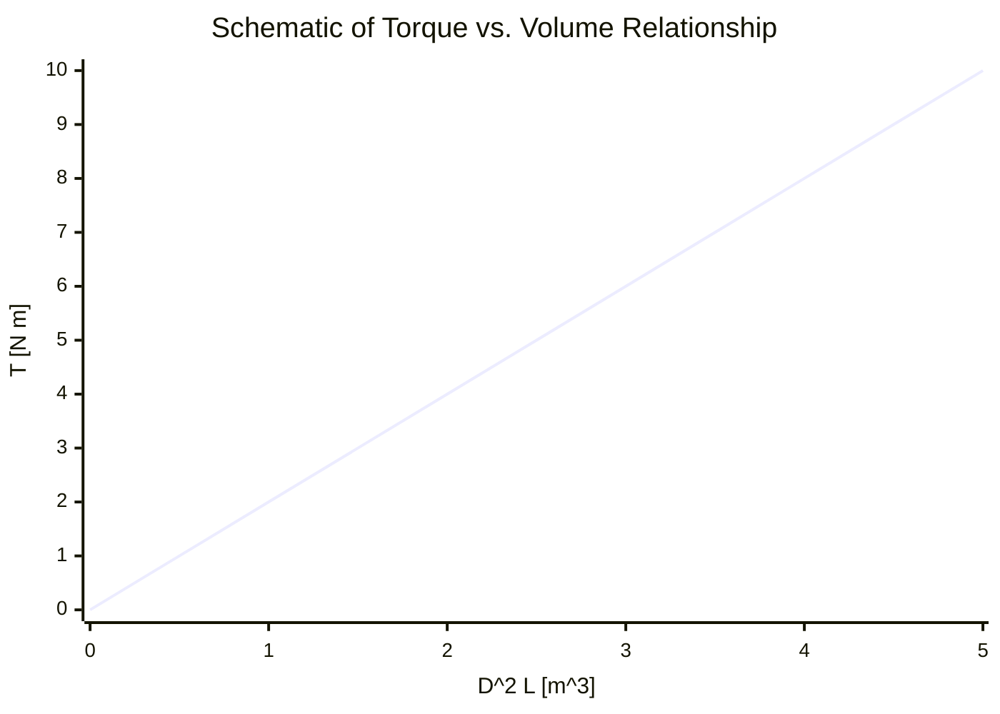

!!! note "Term Explanation: Electric Loading, Sizing Equation, Winding Factor, Fundamental Air-Gap Flux Density, Active Volume"
    - **Electric Loading (\(A_{\text{rms}}\))**: The total rms ampere-conductors per unit length along the air-gap circumference, unit A/m.
    - **Sizing Equation**: An empirical/analytical formula expressing motor torque as the product of geometric dimensions and electromagnetic loading.
    - **Winding Factor (\(k_w\))**: The ratio of the fundamental magnetomotive force of the actual winding to that of a concentrated full-pitch winding, reflecting distribution and short-pitching effects.
    - **Fundamental Air-Gap Flux Density (\(B_{g1}\))**: The fundamental component of the air-gap magnetic field after spatial Fourier decomposition.
    - **Active Volume**: Typically refers to \(D^2L\), the main measure of the motor's electromagnetic torque capability.

### 4.2.7 Distributed Winding Modeling from Lorentz Force to Torque Equation

In Section 4.2.1, we presented the Ampere force on a single conductor. To more closely link \(\tau = k_t I\) with winding geometry, consider a total of \(N\) effective conductors distributed along the axial length \(l\) in the stator slots, with the radial component of the air-gap flux density being \(B_r(\theta)\). The \(i\)-th conductor is located at mechanical angle \(\theta_i\), at a radius \(r\) from the shaft, and carries current \(I\) (direction perpendicular to the page). The tangential Lorentz force it experiences is

$$
F_{\tau,i} = l \, I \, B_r(\theta_i)
$$

The torque contribution of this conductor to the shaft is \(r F_{\tau,i}\). Summing over all conductors and approximating the air-gap flux density with its fundamental amplitude \(B_{g1}\), we obtain

$$
\tau = r l I \sum_{i=1}^{N} B_r(\theta_i)
     \approx r l N B_{g1} \, k_w \, I
$$

where \(k_w\) is the **winding factor**, which accounts for the reduction caused by the different phase angles at which the magnetic field is cut by conductors in a distributed winding (typically \(k_w \approx 0.85\sim0.96\)). Combining the geometric and magnetic field constants yields the commonly used engineering torque equation

$$
\tau = k_t I, \qquad k_t = r l N B_{g1} k_w
$$

For three-phase PMSMs, \(k_t\) is often further expressed as \(\frac{3}{2} p \lambda_f / I_{\text{peak}}\), and the two forms are consistent in SI units. This derivation shows that the torque constant is essentially the "total Lorentz torque generated per unit current in the air-gap magnetic field," so increasing the radius \(r\), axial length \(l\), air-gap flux density \(B_g\), or number of winding turns \(N\) will all increase \(k_t\).

!!! note "Term Explanation: Winding Factor, Distributed Winding, Fundamental Air-Gap Flux Density, Effective Conductor"
    - **Winding Factor (\(k_w\))**: The ratio of the fundamental magnetomotive force produced by the actual winding to that produced if all conductors were concentrated in one slot, reflecting the weakening of the fundamental due to distribution and short-pitching effects.
    - **Distributed Winding**: Winding coils are spread across multiple slots, allowing better utilization of the magnetic field and lower harmonics, but with longer end turns.
    - **Fundamental Air-Gap Flux Density**: The fundamental component \(B_{g1}\) of the air-gap magnetic field after spatial Fourier decomposition, the main source of effective torque.
    - **Effective Conductor**: The number of conductors that actually participate in cutting the air-gap flux and producing torque, corrected by the winding factor.

```mermaid
flowchart LR
    A["N conductors distributed<br/>in stator slots"] --> B["Each conductor experiences<br/>tangential Lorentz force"]
    B --> C["Lever arm r forms<br/>individual torque"]
    C --> D["Sum and multiply by winding factor<br/>tau = r l N kw Bg I"]
    D --> E["Define torque constant<br/>kt = r l N kw Bg"]
```

### 4.2.8 Explicit Matrices for Clarke and Park Transforms

Field-Oriented Control (FOC) transforms currents/voltages from the three-phase stationary coordinate system \(abc\) to the two-phase stationary system \(\alpha\beta\), and then to the \(dq\) coordinate system rotating with the rotor. The most common matrices in the **amplitude-invariant** form are given below.

**Clarke Transform** (3→2, power non-conserving but amplitude-conserving):

$$
\begin{bmatrix} i_\alpha \\ i_\beta \\ i_0 \end{bmatrix}
=
\frac{2}{3}
\begin{bmatrix}
1 & -\frac{1}{2} & -\frac{1}{2} \\
0 & \frac{\sqrt{3}}{2} & -\frac{\sqrt{3}}{2} \\
\frac{1}{2} & \frac{1}{2} & \frac{1}{2}
\end{bmatrix}
\begin{bmatrix} i_a \\ i_b \\ i_c \end{bmatrix}
$$

For a three-phase system without a neutral wire, \(i_a+i_b+i_c=0\), so the zero-sequence component \(i_0=0\), and only the first two rows are used.

**Park Transform** (\(\alpha\beta\)→\(dq\), rotation angle \(\theta_e\) is the rotor flux electrical angle):

$$
\begin{bmatrix} i_d \\ i_q \end{bmatrix}
=
\begin{bmatrix}
\cos\theta_e & \sin\theta_e \\
-\sin\theta_e & \cos\theta_e
\end{bmatrix}
\begin{bmatrix} i_\alpha \\ i_\beta \end{bmatrix}
$$

The inverse transform is

$$
\begin{bmatrix} i_\alpha \\ i_\beta \end{bmatrix}
=
\begin{bmatrix}
\cos\theta_e & -\sin\theta_e \\
\sin\theta_e & \cos\theta_e
\end{bmatrix}
\begin{bmatrix} i_d \\ i_q \end{bmatrix}
$$

The physical meaning of the Clarke transform is to use two orthogonal stationary windings \(\alpha\beta\) to equivalently replace three stationary windings spaced 120° apart; the Park transform further projects the \(\alpha\beta\) components onto the \(dq\) axes rotating synchronously with the rotor. Since the \(dq\) coordinate system is stationary relative to the rotor, the originally sinusoidal AC quantities become DC quantities, allowing PI controllers to track without steady-state error.

!!! note "Term Explanation: Amplitude-Invariant Transform, Zero-Sequence Component, Synchronous Rotating Frame, Projection"
    - **Amplitude-Invariant Transform**: The amplitude of the transformed vector is consistent with the original, but power per-unit values are not directly conserved; convenient in engineering control for intuitive reading of current amplitude.
    - **Zero-Sequence Component**: One-third of the sum of the three-phase currents, always zero in systems without a neutral wire, and does not participate in electromechanical energy conversion.
    - **Synchronous Rotating Frame**: The \(dq\) coordinate system rotating at electrical angular velocity \(\omega_e\) with the rotor magnetic field.
    - **Projection**: Decomposing a space vector onto specified coordinate axes to obtain its components on those axes.

```mermaid
flowchart LR
    A["Three-phase stationary abc"] --> B["Clarke<br/>alpha beta"]
    B --> C["Park<br/>d q"]
    C --> D["PI Controller<br/>id iq DC"]
    D --> E["Inverse Park<br/>alpha* beta*"]
    E --> F["SVPWM<br/>abc switching signals"]
```

### 4.2.9 PMSM dq-Axis Voltage Equations and Physical Meanings of Each Term

In the rotating \(dq\) coordinate system, the stator voltage equation for a surface-mounted/interior PMSM can be written as

$$
\begin{aligned}
v_d &= R_s i_d + L_d \frac{di_d}{dt} - \omega_e L_q i_q \\
v_q &= R_s i_q + L_q \frac{di_q}{dt} + \omega_e L_d i_d + \omega_e \lambda_f
\end{aligned}
$$

The term-by-term explanation is as follows:

1. **Resistive voltage drop** \(\,R_s i_d\), \(R_s i_q\): Voltage drop caused by winding ohmic losses.
2. **Transformer voltage** \(\,L_d \frac{di_d}{dt}\), \(L_q \frac{di_q}{dt}\): Voltage induced on the inductance due to current changes, determining the dynamic response of the current loop.
3. **Speed voltage / rotational EMF (cross-coupling terms)** \(\,-\omega_e L_q i_q\) and \( \omega_e L_d i_d \): Coupling terms generated by the change in inductive energy storage with rotor position, due to the rotation of the \(dq\) coordinate system itself. They couple the \(d\)-axis current change to the \(q\)-axis voltage (and vice versa), and typically require **decoupling feedforward** compensation in the current loop.
4. **Permanent magnet back-EMF** \(\,\omega_e \lambda_f\): The induced EMF generated by the rotor permanent magnet flux linkage being cut by the stator windings, oriented along the positive \(q\)-axis. The higher the speed, the larger the back-EMF, requiring a higher terminal voltage to maintain the current.

For SPMSM (\(L_d = L_q = L_s\)), if \(i_d=0\) control is adopted, the \(q\)-axis equation simplifies to

$$
v_q = R_s i_q + L_s \frac{di_q}{dt} + \omega_e \lambda_f, \qquad
\tau = \frac{3}{2} p \lambda_f i_q
$$

At this point, the torque is directly proportional to \(i_q\), making control very intuitive. IPMSM, on the other hand, utilizes the reluctance torque generated by \(L_d \neq L_q\) to obtain greater torque at the same current through MTPA.

!!! note "Terminology explanation: Speed voltage, rotational EMF, decoupling feedforward, back-EMF, permanent magnet flux linkage"
    - **Speed voltage**: The induced voltage term caused by changes in flux linkage due to the motion of the coordinate system or conductor, reflecting electromechanical energy conversion.
    - **Decoupling feedforward**: Adding the \(\omega_e L i\) term in the current controller to eliminate the dynamic coupling between the \(d\) and \(q\) axes.
    - **Back-EMF**: The induced voltage generated by the rotor flux linkage cutting the stator windings, \(E_b = \omega_e \lambda_f\).
    - **Permanent-magnet flux linkage (\(\lambda_f\))**: The constant flux linkage amplitude coupled by the permanent magnet in the stator phase windings.

### 4.2.10 Cogging Torque and Torque Ripple

Even with ideal sinusoidal currents, the output torque of the motor exhibits periodic fluctuations, collectively referred to as **torque ripple**. There are three main sources:

1. **Cogging torque**: The interaction between the permanent magnet poles and the stator slots, causing the rotor to tend to stop at certain "slot-aligned" positions. As the rotor rotates, this torque pulsates at the slot passing frequency.
2. **Back-EMF harmonics**: The actual back-EMF is not ideally sinusoidal and contains harmonics such as the 5th and 7th, which interact with the fundamental current to produce 6th-order torque ripple.
3. **Current harmonics and commutation pulsation**: Six-step commutation in BLDC, inverter dead time, and limited current loop bandwidth all introduce current harmonics, which in turn generate torque ripple.

The fundamental amplitude of the cogging torque can be approximately expressed as

$$
\tau_{\text{cog}}(\theta) \approx \sum_{k} \tau_{\text{cog},k} \sin\left( k N_s \frac{\theta}{p} \right)
$$

where \(N_s\) is the number of stator slots, \(p\) is the number of pole pairs, and \(\theta\) is the mechanical angle.

Common suppression methods include:

- **Skewing**: Twisting the rotor magnets or stator slots axially by one slot pitch so that the cogging torques at different axial positions cancel each other out.
- **Fractional-slot concentrated winding (FSCW)**: Selecting combinations where the number of stator slots and poles are coprime, reducing the harmonic order and amplitude of the cogging torque.
- **Pole arc optimization**: Adjusting the pole arc angle covered by the permanent magnets to weaken the fundamental cogging torque.
- **Current harmonic injection**: Detecting torque ripple online and injecting compensating currents, suitable for ripple caused by back-EMF harmonics.

!!! note "Terminology explanation: Cogging torque, torque ripple, skewing, fractional-slot concentrated winding, pole arc"
    - **Cogging torque**: The no-current torque ripple caused by magnetic reluctance variation between the permanent magnets and the stator teeth/slots.
    - **Torque ripple**: Periodic fluctuation of the output torque around its average value, usually expressed as peak-to-peak value or percentage.
    - **Skewing**: Tilting the magnets or slots axially to average out the cogging effect along the axial direction.
    - **Fractional-slot concentrated winding (FSCW)**: A concentrated winding structure where the number of slots per pole per phase is a fraction, which can significantly reduce cogging torque and shorten end windings.
    - **Pole arc**: The electrical angle covered by the permanent magnet on the circumference, affecting the harmonic content of the air gap magnetic field.

```mermaid
flowchart LR
    A["Tooth-slot interaction"] --> B["Cogging torque"]
    C["Back-EMF harmonics"] --> D["Harmonic torque ripple"]
    E["Current harmonics/commutation"] --> F["Control-related ripple"]
    B --> G["Suppression methods"]
    D --> G
    F --> G
    G --> H["Skewing"]
    G --> I["FSCW"]
    G --> J["Harmonic injection"]
```

### 4.2.11 Winding Types: Concentrated Winding, Distributed Winding, and FSCW

PMSM stator windings can be classified by coil span into **concentrated winding** and **distributed winding**:

- **Concentrated winding**: Each coil spans only one tooth pitch, resulting in short end windings, low copper loss, and high slot fill factor, suitable for automated winding; however, the air gap magnetomotive force (MMF) harmonics are higher.
- **Distributed winding**: Coils span multiple tooth pitches, providing better sinusoidal magnetic field and lower harmonics, but with longer end windings and slightly higher copper loss.

**Fractional-slot concentrated winding (FSCW)** is a type of concentrated winding where the number of slots per pole per phase

$$
q = \frac{N_s}{2 p m}
$$

is a fraction (\(m=3\) is the number of phases). For example, 12 slots / 10 poles (\(q=2/5\)) is a common configuration for robotic frameless motors. The advantages of FSCW include:

1. Extremely short end windings, low copper loss, beneficial for high torque density;
2. Low cogging torque, usually eliminating the need for skewing;
3. High pole count and short axial length, suitable for flat joints;
4. Independent coils, facilitating batch automated winding.

Its main disadvantages are:

- **Rotor eddy current loss**: Stator MMF harmonics induce eddy currents in the permanent magnets, causing magnet heating and even demagnetization; segmented magnets or low-conductivity magnets are often required.
- **Low winding factor**: The fundamental winding factor for certain pole-slot combinations is only around 0.866, requiring more turns for compensation.

!!! note "Terminology explanation: Concentrated winding, distributed winding, slots per pole per phase, end winding, slot fill factor"
    - **Concentrated winding**: A winding where the coil span equals one tooth pitch, resulting in a compact structure.
    - **Distributed winding**: A winding where the coil span is greater than one tooth pitch and coils are distributed across multiple slots, producing a more sinusoidal field waveform.
    - **Slots per pole per phase (\(q\))**: \(q = N_s/(2pm)\); an integer value indicates an integer-slot winding, while a fractional value indicates a fractional-slot winding.
    - **End winding**: The portion of the wire outside the slots connecting the two ends of a coil, which does not contribute to the air gap magnetic field but generates copper loss.
    - **Slot fill factor**: The ratio of the conductor cross-sectional area in a slot to the available slot area; a high slot fill factor is beneficial for increasing torque density.

```mermaid
flowchart TD
    A["Winding type"] --> B["Concentrated winding"]
    A --> C["Distributed winding"]
    B --> D["Short end windings, low copper loss"]
    B --> E["Higher harmonics"]
    C --> F["Sinusoidal field, low harmonics"]
    C --> G["Long end windings, higher copper loss"]
    D --> H["FSCW suitable for robot joints"]
    E --> H
    H --> I["Watch for magnet eddy current loss"]
```

### 4.2.12 Numerical Example of a Small Robot Motor

To build an order-of-magnitude intuition, consider a small brushless motor for an upper limb joint: torque constant \(k_t = 0.10\ \text{N·m/A}\), phase resistance \(R = 0.50\ \Omega\), bus voltage \(V_{dc} = 48\ \text{V}\), thermal resistance \(R_{th} = 2.0\ \text{K/W}\), ambient temperature \(T_{amb}=40°\text{C}\), insulation class F (limit 155°\text{C}).

1. **No-load speed**: When the output torque is zero, the back electromotive force is approximately equal to the available voltage. Ignoring the voltage drop across the resistance, we have
   $$
   \omega_{nl} \approx \frac{V_{dc}}{k_e} = \frac{48}{0.10} = 480\ \text{rad/s} \approx 4580\ \text{r/min}
   $$
   where \(k_e = k_t\) is used in SI units.

2. **Stall torque**: When the speed is zero, the current is limited only by the resistance,
   $$
   I_{stall} = \frac{V_{dc}}{R} = \frac{48}{0.50} = 96\ \text{A}, \qquad
   \tau_{stall} = k_t I_{stall} = 0.10 \times 96 = 9.6\ \text{N·m}
   $$

3. **Peak power point**: The maximum power of an ideal DC motor occurs at \(\omega = \omega_{nl}/2\) and \(\tau = \tau_{stall}/2\),
   $$
   P_{max} = \frac{\tau_{stall} \omega_{nl}}{4} = \frac{9.6 \times 480}{4} = 1152\ \text{W}
   $$

4. **Continuous torque thermal limit**: The allowable winding temperature rise is \(\Delta T = 155 - 40 = 115\ \text{K}\). From the first-order thermal model,
   $$
   P_{loss} = \frac{\Delta T}{R_{th}} = \frac{115}{2.0} = 57.5\ \text{W}
   $$
   If copper losses dominate, then \(I_{rms} = \sqrt{P_{loss}/R} = \sqrt{57.5/0.50} \approx 10.7\ \text{A}\), corresponding to a continuous torque of
   $$
   \tau_{cont} = k_t I_{rms} = 0.10 \times 10.7 \approx 1.07\ \text{N·m}
   $$

This example illustrates: The same motor can briefly output nearly 10 N·m, but continuous operation can only maintain about 1 N·m—this is the fundamental reason why humanoid robots require both short-term peak performance and thermal management.

!!! note "Terminology explanation: No-load speed, stall torque, continuous torque, insulation class, thermal limit"
    - **No-load speed**: The maximum speed a motor can achieve without load, limited by back electromotive force and bus voltage.
    - **Stall torque**: The output torque when speed is zero, limited by resistance and current limits.
    - **Continuous torque**: The torque that can be continuously output within the allowable temperature rise, determined by thermal resistance and copper losses.
    - **Insulation class**: The maximum temperature allowed for winding insulation materials; Class F is 155 °C, Class H is 180 °C.
    - **Thermal limit**: The boundary of a motor's continuous operating capability, determined by the maximum allowable winding temperature.

---

## 4.3 Transmission Mechanisms: Gears, Reducers, and Compliant Elements

### 4.3.1 Gear Basics: Speed Reduction, Torque Increase, and Reflected Inertia

The most basic function of a gear pair is to change the ratio of speed to torque. Let the input (motor side) speed be \(\omega_m\) and the output (load side) speed be \(\omega_l\), then the **transmission ratio** (or reduction ratio) is

$$
G = \frac{\omega_m}{\omega_l} = \frac{\tau_l}{\tau_m}
$$

where the second equality holds under ideal lossless conditions. In practice, there is friction and deformation, so the output power is

$$
P_l = \eta \, P_m
$$

\(\eta\) is the transmission efficiency. The reducer also "reflects" the load inertia to the motor side. Let the load moment of inertia be \(J_l\); after the reduction ratio \(G\), the equivalent load inertia felt by the motor is

$$
J_{\text{ref}} = \frac{J_l}{G^2}
$$

This indicates that a high reduction ratio can significantly reduce the load inertia felt by the motor, making it easier for the motor to accelerate. However, a high reduction ratio also introduces friction, backlash, and stiffness loss.

!!! note "Term Explanation: Transmission Ratio, Reduction Ratio, Efficiency, Reflected Inertia, Load Inertia, Gear Reducer"
    - **Transmission Ratio / Reduction Ratio**: The ratio of input speed to output speed, usually greater than 1 indicating speed reduction and torque increase.
    - **Transmission Efficiency**: The ratio of output power to input power, reflecting energy losses from gear meshing, bearings, etc.
    - **Reflected Inertia**: The equivalent inertia of the load inertia calculated on the motor side by dividing by the square of the transmission ratio.
    - **Load Inertia**: The moment of inertia of the driven end.
    - **Gear Reducer**: A device composed of gears, bearings, and a housing for speed reduction and torque increase.

```mermaid
flowchart LR
    M["Motor<br/>Jm omegam taum"] --> G["Reducer<br/>Transmission Ratio G eta"]
    G --> L["Load<br/>Jl omegal taul"]
    J["Jl/G^2 Reflected to Motor Side"] --> M
    T["taul = eta G taum"] --> L
```

### 4.3.2 Harmonic Drive: Strain Wave Gearing

A **harmonic drive** consists of three parts: a flexspline, a circular spline, and a wave generator. The wave generator is an elliptical cam that, when inserted into the thin-walled flexspline, deforms it into an ellipse. The teeth of the flexspline at the major axis of the ellipse mesh with the circular spline. As the wave generator rotates, the meshing zone moves circumferentially, causing the flexspline to rotate slowly relative to the circular spline.

#### Kinematic Derivation of the Harmonic Drive

Assume the wave generator is the input. For one complete rotation (\(360°\)), the flexspline rotates with it by one revolution. Since the flexspline has \(\Delta z = z_c - z_f\) fewer teeth than the circular spline, for each revolution of the wave generator, the flexspline "lags" by \(\Delta z\) teeth relative to the circular spline at the meshing point. This corresponds to a relative rotation angle of the flexspline with respect to the circular spline of

$$
\Delta \theta_f = -\frac{\Delta z}{z_f} \cdot 360°
$$

Therefore, the transmission ratio (ratio of input speed \(\omega_{in}\) to output speed \(\omega_{out}\)) is

$$
G = \frac{\omega_{in}}{\omega_{out}} = \frac{z_c}{z_c - z_f}
$$

Common single-stage harmonic drive ratios range from 30:1 to 160:1. The "two-point meshing" of harmonic drives originates from the elliptical shape of the wave generator: there is one meshing zone at each end of the major axis of the ellipse, and disengagement at the minor axis. As the wave generator rotates, these two meshing zones propagate circumferentially like a "strain wave," hence the harmonic drive is also called **strain wave gearing**. Because the number of simultaneously meshing teeth can reach 25%–30% of the total number of teeth, the load capacity and positioning accuracy are very high.

#### Hoop Stress in the Flexspline

The wave generator expands the thin-walled flexspline into an ellipse. The flexspline has a neutral circle radius \(r_f\), wall thickness \(t\), and the ellipse has a semi-major axis \(a\) and semi-minor axis \(b\). The approximate ellipticity \(e = (a-b)/2\) corresponds to the maximum radial deformation of the flexspline. Its hoop tensile stress can be approximated as

$$
\sigma_{hoop} \approx E \, \frac{e}{r_f}
$$

where \(E\) is the elastic modulus of the flexspline material. This cyclic stress is a key factor limiting the fatigue life of the harmonic drive. High-strength alloy steel is typically used, and tooth profiles are optimized to reduce deformation. Technical data from Harmonic Drive indicates a typical flexspline fatigue life of \(10^7\)–\(10^8\) revolutions[10][23].

!!! note "Term Explanation: Strain Wave Gearing, Hoop Stress, Fatigue Life, Ellipticity"
    - **Strain Wave Gearing**: A transmission method that achieves speed reduction through periodic elastic deformation of a flexible gear; the harmonic drive is its typical implementation.
    - **Hoop Stress**: The tensile stress generated in the circumferential direction of a thin-walled ring due to radial deformation.
    - **Fatigue Life**: The number of cycles a material can withstand under cyclic stress before fatigue failure occurs.
    - **Ellipticity**: The difference between the major and minor axes of the ellipse formed by the wave generator, determining the deformation of the flexspline.

!!! note "Term Explanation: Harmonic Drive, Flexspline, Circular Spline, Wave Generator, Strain Wave, Zero Backlash, Transmission Error"
    - **Harmonic Drive**: A precision reducer that uses the elastic deformation of a thin-walled flexible gear to achieve a high reduction ratio.
    - **Flexspline**: A thin-walled flexible gear, typically having two fewer teeth than the circular spline.
    - **Circular Spline**: A rigid internal gear ring, either fixed or used as the output.
    - **Wave Generator**: An elliptical cam assembly that causes controlled elastic deformation of the flexspline.
    - **Strain Wave**: The periodic elastic deformation wave formed in the flexspline under the action of the wave generator.
    - **Zero Backlash**: Due to multiple teeth meshing simultaneously and the preload on the flexspline, harmonic drives have virtually no gear clearance.
    - **Transmission Error**: The difference between the actual output shaft angle and the ideal angle, reflecting accuracy and stiffness.

```mermaid
flowchart LR
    A["Wave Generator<br/>Elliptical Cam"] --> B["Flexspline<br/>Thin-walled External Teeth"]
    B --> C["Circular Spline<br/>Rigid Internal Teeth"]
    C --> D["Output Flange"]
    A --> E["Input Shaft"]
    B -.Strain Wave.-> F["Multi-tooth Meshing<br/>High Reduction Ratio"]
```

The advantages of harmonic drives are a high reduction ratio, zero backlash, and compact structure; disadvantages are the cyclic stress on the flexspline, sensitivity to fatigue life and thermal deformation, efficiency typically 70-90%, and low back-drivability due to the high reduction ratio.

#### Shell Mechanics and Fatigue Hotspots of the Harmonic Flexspline

Section 4.3.2 used the hoop tensile stress \(\sigma_{hoop}\) for a preliminary estimate of the flexspline stress. A more precise analysis should treat the flexspline as a **thin cylindrical shell** supported on the wave generator. Under the action of the elliptical wave generator, the flexspline simultaneously experiences:

1.  **Hoop tensile stress** \(\sigma_{hoop}\): Caused by radial deformation;
2.  **Bending stress** \(\sigma_{bend}\): Caused by the variation of shell curvature along the circumference, significant for thin shells;
3.  **Local contact stress**: Hertzian contact stress at the tooth meshing points (see next section).

According to Timoshenko/Kirchhoff shell theory, the maximum bending stress under elliptical deformation can be approximated as

\[
\sigma_{bend} \approx \frac{E t e}{2 r_f^2}
\]

where \(t\) is the wall thickness, \(e\) is half the difference between the major and minor axes of the ellipse, and \(r_f\) is the neutral circle radius of the flexspline. Fatigue cracks are most likely to initiate in the **diaphragm region at the transition between the flexspline cup bottom and the output flange**, because bending and torsional stress concentrations are superimposed in this area. Therefore, high-end harmonic drives apply shot peening, root fillet optimization, and material heat treatment to the flexspline to extend fatigue life[10][23].

```mermaid
flowchart LR
    A["Elliptical Deformation of Wave Generator"] --> B["Hoop Tensile Stress"]
    A --> C["Shell Bending Stress"]
    B --> D["Stress Concentration in Diaphragm Region"]
    C --> D
    D --> E["Fatigue Crack Initiation Source"]
```

!!! note "Term Explanation: Thin Cylindrical Shell, Timoshenko Shell Theory, Kirchhoff Shell Theory, Bending Stress, Diaphragm Region"
    - **Thin Cylindrical Shell**: A cylindrical structure whose wall thickness is much smaller than its radius; the harmonic flexspline belongs to this category.
    - **Timoshenko Shell Theory**: A shell theory that considers shear deformation, suitable for moderately thick shells.
    - **Kirchhoff Shell Theory**: A classical thin shell theory that neglects shear deformation, suitable for very thin shells.
    - **Bending Stress**: Tensile/compressive stress on the shell surface caused by changes in curvature.
    - **Diaphragm Region**: The thin-walled transition area connecting the bottom of the flexspline to the output flange, where stress concentration is most severe.

### 4.3.3 Planetary Gear Reducers and Cycloidal Reducers

A **planetary gear reducer** consists of a sun gear, planet gears, a ring gear, and a planet carrier. With the sun gear as input, the planet carrier as output, and the ring gear fixed, the transmission ratio is

$$
G = 1 + \frac{z_r}{z_s}
$$

Here \(z_r\) is the number of ring gear teeth, and \(z_s\) is the number of sun gear teeth. The planetary gearbox has high efficiency (up to 97%) and strong load capacity, making it commonly used in the medium-to-low reduction ratio range of robot joints.

#### Load Sharing and Efficiency of Planetary Gearboxes

Because multiple planet gears (typically 3–5) mesh simultaneously, planetary gearboxes exhibit excellent **load sharing**. Ideally, each planet gear bears \(1/N_p\) of the total torque, where \(N_p\) is the number of planet gears. In practice, due to manufacturing errors and bearing deformation, the load among planets is uneven. A floating sun gear or flexible planet carrier is often used to balance the load.

The total efficiency of a planetary gearbox can be decomposed as

$$
\eta_{planetary} = \eta_{sun-planet}^{N_p} \, \eta_{planet-ring}^{N_p} \, \eta_{bearing}
$$

where \(\eta_{sun-planet}\) and \(\eta_{planet-ring}\) are the meshing efficiencies of a single gear pair, and \(\eta_{bearing}\) accounts for bearing and churning losses. Due to power splitting, a single-stage planetary gearbox can achieve a relatively large reduction ratio while maintaining high efficiency.

!!! note "Terminology Explanation: Load Sharing, Floating Sun Gear, Power Splitting, Churning Loss"
    - **Load sharing**: Multiple meshing points share the load, reducing stress at a single point.
    - **Floating sun gear**: A sun gear that can be axially adjusted slightly to compensate for manufacturing errors and balance the load among planet gears.
    - **Power splitting**: Input power is transmitted to the output through multiple paths, increasing load capacity.
    - **Churning loss**: Viscous resistance loss caused by gears churning the lubricating oil.

**Cycloidal drives** utilize an eccentrically mounted cycloidal disc that meshes with ring pins. The cycloidal disc's epitrochoidal profile engages with a ring of cylindrical pins inside the ring gear housing. For each rotation of the eccentric shaft, the cycloidal disc advances by only one tooth pitch, achieving extremely high reduction ratios (single-stage can exceed 100:1).

#### Cycloidal Profile and Transmission Ratio

The standard tooth profile of a cycloidal disc is an **offset curve** of an **epitrochoid**. Let the ring gear housing radius be \(R_r\), the ring pin center circle radius be \(R_p\), the eccentricity be \(e\), and the ring pin radius be \(r_r\). The cycloidal disc profile can be described by parametric equations

$$
\begin{aligned}
x(\phi) &= \left(R_p - e\right) \cos\phi + \frac{e}{k_1} \cos\left[(k_1 - 1)\phi\right] - r_r \cos\alpha \\
y(\phi) &= \left(R_p - e\right) \sin\phi - \frac{e}{k_1} \sin\left[(k_1 - 1)\phi\right] - r_r \sin\alpha
\end{aligned}
$$

where \(k_1 = R_p/e\) is a parameter related to the cycloidal disc's shortening ratio, \(\phi\) is the generating parameter, and \(\alpha\) is the profile normal angle. The simplified **transmission ratio** is

$$
G = \frac{z_p}{z_p - z_c}
$$

where \(z_p\) is the number of ring pins and \(z_c\) is the number of cycloidal disc teeth; their difference is usually 1. For a single-tooth-difference cycloidal drive, \(G = z_c\). The eccentricity \(e\) determines the offset of the cycloidal disc relative to the ring gear housing, while the ring pin radius \(r_r\) affects the meshing clearance and contact stress: increasing \(r_r\) improves contact strength but reduces the effective meshing depth. Sensinger provided a unified optimization method for cycloidal profile, stress, and efficiency[13].

!!! note "Terminology Explanation: Epitrochoid, Offset Curve, Shortening Ratio, Ring Pins, Eccentricity"
    - **Epitrochoid**: The trajectory traced by a point on or inside a circle as it rolls externally around another fixed circle.
    - **Offset curve**: A curve at a constant normal distance from the original curve, used to generate the actual tooth profile of a cycloidal disc.
    - **Shortening ratio**: A parameter describing the degree of amplitude compression of the epitrochoid, determining the curvature of the tooth profile.
    - **Ring pins/rollers**: Cylindrical pins or rollers fixed in the ring gear housing that mesh with the cycloidal disc.
    - **Eccentricity (\(e\))**: The distance between the center of the cycloidal disc and the center of the input shaft, determining the amplitude of the cycloidal motion.

```mermaid
flowchart TD
    subgraph Cycloidal Profile Geometry
    A["Eccentric shaft rotation phi"] --> B["Cycloidal disc center moves<br/>around ring gear housing center"]
    B --> C["Cycloidal disc simultaneously rotates<br/>with a one-tooth difference"]
    C --> D["Transmission ratio G = zp/(zp-zc)"]
    E["Ring pin radius rr"] --> F["Affects contact stress<br/>and backlash"]
    end
```

!!! note "Terminology Explanation: Planetary Gearbox, Sun Gear, Planet Gear, Ring Gear, Planet Carrier, Cycloidal Drive, Cycloidal Disc, Ring Gear Housing"
    - **Planetary gearbox**: A reduction mechanism where multiple planet gears mesh simultaneously with a sun gear and a ring gear, featuring power splitting and high load capacity.
    - **Sun gear**: The central input gear.
    - **Planet gear**: A gear that revolves around the sun gear while rotating on its own axis.
    - **Ring gear**: An outer ring with internal teeth, which can be fixed or serve as the output.
    - **Planet carrier**: The support structure for the planet gears that also serves as the output.
    - **Cycloidal drive**: A reduction mechanism using a cycloidal disc meshing with ring pins, characterized by high stiffness, high reduction ratio, and low backlash.
    - **Cycloidal disc**: A disc with a cycloidal tooth profile; typically two discs are mounted 180° apart to balance inertial forces.
    - **Ring gear housing with pins**: A housing embedded with a circular array of cylindrical pins that mesh with the cycloidal disc.

```mermaid
flowchart TD
    subgraph Planetary Gearbox
    S["Sun Gear"] --> P["Planet Gear"]
    R["Ring Gear (fixed)"] --> P
    P --> C["Planet Carrier (output)"]
    end
    subgraph Cycloidal Drive
    E["Eccentric Input Shaft"] --> D["Cycloidal Disc"]
    N["Ring Gear Housing"] --> D
    D --> O["Output Flange"]
    end
```

#### Hertzian Contact Stress of Gears/Cycloidal Teeth

The contact between gear teeth, cycloidal disc teeth and ring pins, and bearing rolling elements can all be classified as **Hertzian contact**. When two elastic bodies are pressed together by a normal force \(F_n\), they form an elliptical (or rectangular) contact patch. The maximum contact pressure is

\[
p_{\max} = \frac{2 F_n}{\pi a b}
\]

where \(a\) and \(b\) are the semi-major and semi-minor axes of the contact ellipse. \(p_{\max}\) directly determines the risk of plastic deformation, pitting, and scuffing on the tooth surface, making it a core constraint for the load capacity of a gearbox. For given materials and geometry, the allowable contact stress \([p_H]\) determines the maximum permissible normal force, thereby limiting the output torque and service life[30].

```mermaid
flowchart LR
    A["Normal Force Fn"] --> B["Hertzian Contact Ellipse"]
    B --> C["pmax = 2Fn/(pi a b)"]
    C --> D["Limits Output Torque / Life"]
```

!!! note "Terminology Explanation: Hertzian Contact Stress, Contact Ellipse, Maximum Contact Pressure, Pitting, Scuffing"
    - **Hertzian contact stress**: The local compressive stress distribution generated when two elastic bodies are in contact under normal pressure.
    - **Contact ellipse**: The elliptical contact area formed when general curved surfaces are pressed together.
    - **Maximum contact pressure (\(p_{\max}\))**: The maximum compressive stress at the center of the contact patch.
    - **Pitting**: Small fatigue craters formed on the contact surface under cyclic stress.
    - **Scuffing**: Metal adhesion damage caused by oil film rupture on tooth surfaces under high speed and heavy load.

#### Rolling Contact Fatigue and L10 Life

Bearings and cycloidal pin joints both involve rolling contact, and their fatigue life is typically described by the **Lundberg-Palmgren relationship**:

\[
L_{10} = \left(\frac{C}{P}\right)^p
\]

where \(C\) is the basic dynamic load rating, \(P\) is the equivalent dynamic load, and \(L_{10}\) represents the rated life (in millions of revolutions) that 90% of the bearings can achieve. The exponent \(p=3\) applies to ball bearings, and \(p=10/3\) applies to roller bearings. For high-speed joints in humanoid robots, centrifugal forces and gyroscopic moments can significantly reduce bearing life, so it is essential to verify that \(L_{10}\) meets the design life requirements during the selection phase.

```mermaid
xychart-beta
    title "L10 Life vs. Load Ratio"
    x-axis "C/P" [0, 1, 2, 3, 4]
    y-axis "L10 [million revolutions]"
    line "Ball bearing p=3" [0, 1, 8, 27, 64]
    line "Roller bearing p=10/3" [0, 1, 10, 32, 100]
```

!!! note "Term Explanation: Rolling Contact Fatigue, L10 Life, Dynamic Load Rating, Equivalent Dynamic Load, Lundberg-Palmgren"
    - **Rolling-contact fatigue**: Fatigue failure of rolling elements and raceways under cyclic contact stress.
    - **L10 life**: The life that 90% of identical bearings can reach or exceed under a given load.
    - **Dynamic load rating (\(C\))**: The permissible load given by the manufacturer corresponding to an L10 life of 1 million revolutions.
    - **Equivalent dynamic load (\(P\))**: The combined equivalent load after considering radial and axial loads.
    - **Lundberg-Palmgren relationship**: A power-law empirical formula relating rolling bearing life to load ratio.

#### Stribeck Friction Curve and Lubrication Regimes

The friction force of a lubricated contact surface varies with relative velocity \(v\), forming a typical **Stribeck curve**, which can be divided into four regimes:

1. **Static friction regime** (\(v=0\)): Static friction is maximum, requiring a breakaway force to initiate motion;
2. **Boundary lubrication regime** (low speed): Direct contact between surface asperities, high friction coefficient;
3. **Mixed lubrication regime** (medium speed): Partial oil film carries the load, friction coefficient decreases with increasing speed;
4. **Hydrodynamic lubrication regime** (high speed): A full oil film separates the surfaces, low friction coefficient but with viscous drag.

The Stribeck curve explains various phenomena in reducers: low-speed stick-slip, dead zones during torque reversal, and the reason for **poor backdrivability** in high-ratio reducers—friction dominates at low speeds, making it difficult for external forces to overcome static friction and drive the motor.

```mermaid
xychart-beta
    title "Schematic Stribeck Friction Curve"
    x-axis "Relative Velocity v" [0, 1, 2, 3, 4]
    y-axis "Friction Coefficient mu"
    line "Stribeck" [0.5, 0.45, 0.2, 0.08, 0.1]
    annotation "Boundary Lubrication" {x: 1, y: 0.45}
    annotation "Mixed Lubrication" {x: 3, y: 0.15}
    annotation "Hydrodynamic Lubrication" {x: 4, y: 0.09}
```

!!! note "Term Explanation: Stribeck Curve, Boundary Lubrication, Mixed Lubrication, Hydrodynamic Lubrication, Stick-Slip"
    - **Stribeck curve**: A curve describing the variation of friction coefficient with velocity in a lubricated contact.
    - **Boundary lubrication**: At low speeds, the oil film is extremely thin, leading to direct contact between surface asperities.
    - **Mixed lubrication**: A transitional state where the oil film and surface contact jointly carry the load.
    - **Hydrodynamic lubrication**: At high speeds, a full oil film completely separates the two surfaces.
    - **Stick-slip**: A low-speed jitter phenomenon caused by alternating static and dynamic friction.

#### Measurement and Parameter Identification of Transmission Chain Torsional Stiffness

The torsional stiffness \(K\), backlash \(\delta\), and equivalent damping \(c\) of a transmission chain can be measured using a **torque-angle hysteresis loop**. In the experiment, the motor end is fixed, and a sinusoidally varying torque \(\tau(\theta)\) is slowly applied at the output end, recording the angular response. The curve for an ideal purely elastic body is a straight line through the origin; an actual reducer exhibits a hysteresis loop as shown in Figure 4.3(d), from which the following can be extracted:

- **Stiffness** \(K\): The slope of the straight line in the ascending segment of the hysteresis loop;
- **Backlash** \(\delta\): The angular interval near zero crossing where no torque change occurs;
- **Damping** \(c\): The area enclosed by the hysteresis loop represents the energy dissipated per cycle \(W_d\), which can be approximated as \(c \approx W_d/(\pi \omega \theta_0^2)\).

```mermaid
xychart-beta
    title "Schematic Torque-Angle Hysteresis Loop"
    x-axis "Angle theta [rad]" [0, 1, 2, 3]
    y-axis "Torque tau [N m]"
    line "Loading" [-0.05, 0, 50, 100]
    line "Unloading" [100, 50, 0, -0.05]
    annotation "Backlash delta" {x: 1, y: 0}
    annotation "Stiffness K" {x: 2, y: 50}
```

!!! note "Term Explanation: Torque-Angle Hysteresis Loop, Torsional Stiffness, Backlash, Equivalent Damping, Energy Dissipation"
    - **Torque-angle hysteresis loop**: A force-deformation loop where the loading and unloading paths do not coincide.
    - **Torsional stiffness (\(K\))**: The torque required per unit torsional deformation, \(K=\Delta\tau/\Delta\theta\).
    - **Backlash (\(\delta\))**: The angular free play during direction reversal where no torque is transmitted.
    - **Equivalent damping (\(c\))**: A coefficient that fits the energy loss of the hysteresis loop using a viscous damping model.
    - **Energy dissipation**: The area enclosed by the hysteresis loop, representing the mechanical energy converted to heat in one deformation cycle.

### 4.3.4 Belt Drives, Cable/Tendon Drives, and Linkages

Besides gears, humanoid robots also commonly use **synchronous belts**, **wire ropes/tendons**, and **linkages** to transmit motion:

- **Synchronous belts**: Belt teeth mesh with pulley grooves, eliminating slip, suitable for long-distance transmission. Tension must be preloaded to avoid tooth jumping, and the elastic modulus determines stiffness.
- **Tendon drives**: Use wire ropes to transmit force from a motor (often placed proximally) to a distal joint, reducing inertia at the limb extremity, commonly used in robotic hands. Friction, preload, creep, and wear need to be studied.
- **Linkages**: Transmit motion from one joint to another through rigid links, such as a four-bar linkage knee joint. Advantages include high stiffness and no slip; disadvantages include space occupation and limited range of motion.

#### Capstan Effect and Tension Asymmetry in Tendon Drives

When a tendon wraps around a pulley, due to friction, the tension on the entering side \(T_1\) and the leaving side \(T_2\) satisfy the **Capstan equation** (also known as the Euler–Eytelwein formula)

$$
\frac{T_1}{T_2} = e^{\mu \theta}
$$

where \(\mu\) is the friction coefficient between the tendon and the pulley, and \(\theta\) is the wrap angle. This implies:

- When the motor pulls the tendon, the active side has high tension and the passive side has low tension;
- When the direction of motion reverses, the tension relationship between the two sides swaps;
- The motor torque corresponding to the same position differs between forward and reverse motion, creating **hysteresis**.

To reduce hysteresis and transmission losses, tendon drive systems often use low-friction coated pulleys, minimize wrap angles, and employ preload design. The preload tension \(T_0\) must be large enough to prevent slack but not so large as to increase friction and bearing load.

!!! note "Term Explanation: Capstan Equation, Wrap Angle, Hysteresis, Preload, Tendon"
    - **Capstan equation / Euler–Eytelwein formula**: A formula describing the tension relationship at the two ends of a flexible rope wrapped around a cylinder, \(T_1/T_2 = e^{\mu\theta}\).
    - **Wrap angle (\(\theta\))**: The central angle of the arc of contact between the rope and the pulley.
    - **Hysteresis**: A phenomenon where the loading and unloading paths do not coincide, causing a loop error in the force-displacement relationship.
    - **Tendon/cable**: A flexible wire rope or polymer rope used to transmit tensile force, typically with high tensile stiffness.

```mermaid
flowchart LR
    A["Tendon Tension T2"] --> B["Wraps Around Pulley<br/>Wrap Angle theta"]
    B --> C["Output Tension T1 = T2 e^{mu theta}"]
    C --> D["Upon Direction Reversal<br/>Tension Relationship Swaps"]
    D --> E["Generates Hysteresis"]
```

#### Numerical Example of Tendon Drive: Tension Amplification and Hysteresis Due to Capstan Effect

Consider a stainless steel tendon passing over a pulley with radius \(r=5\ \text{mm}\), with a friction coefficient between the tendon and pulley of \(\mu=0.15\). If the motor-side applies a tension \(T_2=20\ \text{N}\) and the wrap angle \(\theta=\pi\ \text{rad}\) (i.e., half a turn), the load-side tension is

\[
T_1 = T_2 e^{\mu\theta} = 20 \times e^{0.15\pi} \approx 20 \times 1.60 \approx 32.0\ \text{N}
\]

If the wrap angle increases to \(2\pi\) (a full turn), then

\[
T_1 = 20 \times e^{0.30\pi} \approx 20 \times 2.57 \approx 51.4\ \text{N}
\]

This shows that in multi-pulley routing, such as in dexterous hands, even with a small friction coefficient, tension can be significantly amplified after multiple passes around pulleys. When the direction of motion reverses, the original active and passive sides swap, and the load-side tension becomes

\[
T_1' = \frac{T_2}{e^{\mu\theta}} = \frac{20}{1.60} \approx 12.5\ \text{N}
\]

The tension difference at the same position in forward and reverse directions is \(\Delta T = 32.0 - 12.5 = 19.5\ \text{N}\), which is the main source of **hysteresis** in tendon-driven force control. To reduce hysteresis, engineering practice often limits the wrap angle to within \(90^\circ\), uses low-friction coatings (such as PTFE), and employs numerical methods to evaluate tension distribution during the design phase.

```python
import numpy as np
import matplotlib.pyplot as plt

mu = 0.15          # Friction coefficient
T2 = 20.0          # Motor-side tension N
theta = np.linspace(0, 2*np.pi, 200)  # Wrap angle 0 ~ 2π rad

T1_forward = T2 * np.exp(mu * theta)   # Motor pulling direction
T1_reverse = T2 * np.exp(-mu * theta)  # Reverse motion

plt.figure(figsize=(7,4))
plt.plot(np.degrees(theta), T1_forward, label='Motor pulling')
plt.plot(np.degrees(theta), T1_reverse, label='Reverse motion')
plt.xlabel('Wrap angle θ [°]')
plt.ylabel('Load-side tension T1 [N]')
plt.title('Capstan effect: Tension variation with wrap angle')
plt.legend(); plt.grid(True)
plt.tight_layout()
plt.savefig('capstan_effect.png', dpi=150)
```

The figure above shows that when the wrap angle increases from \(0^\circ\) to \(360^\circ\), the forward tension grows from 20 N to approximately 51 N, while the reverse tension drops to about 7.8 N. This asymmetry must be compensated in the dexterous hand force control algorithm through tension sensor feedback or model feedforward. More content on tendon-driven dexterous hands can be found in Chapter 9.

!!! note "Terminology explanation: Tension amplification, hysteresis error, low-friction coating, tension feedback"
    - **Tension amplification**: The phenomenon where tendon tension is amplified after passing around a pulley due to friction.
    - **Hysteresis error**: The error where the output force differs at the same position during forward and reverse motion.
    - **Low-friction coating**: A surface treatment that reduces the friction coefficient between the tendon and the pulley.
    - **Tension feedback**: Using a tension sensor to measure tendon tension for closed-loop compensation.

!!! note "Terminology explanation: Timing belt, tendon drive, preload, elastic elongation, creep, linkage mechanism"
    - **Timing belt**: A belt with teeth on its inner surface that meshes with pulleys for synchronous transmission.
    - **Tendon / cable drive**: Using flexible cables to transmit force and motion from the driving end to the execution end, commonly used in space-constrained or remote-drive applications.
    - **Preload / pretension**: The tension applied to a belt or cable during installation to eliminate slack and increase stiffness.
    - **Elastic elongation**: The change in length of a cable or belt under load due to its elastic modulus.
    - **Creep**: Slow, irreversible deformation of a material under prolonged stress, which can cause zero-point drift in tendon drives.
    - **Linkage mechanism**: A mechanism composed of rigid links and rotational joints that converts input motion into desired output motion.

### 4.3.5 Stiffness, Backlash, and Natural Frequency

The **torsional stiffness** \(K\) of the transmission chain is defined as the torque required per unit angular deformation:

$$
K = \frac{\Delta \tau}{\Delta \theta}
$$

The entire transmission chain can be approximated as a second-order system consisting of motor inertia \(J_m\), reducer stiffness \(K_g\), and load inertia \(J_l\), with a **natural frequency** of

$$
\omega_n = \sqrt{K_g \left( \frac{1}{J_m} + \frac{1}{J_l/G^2} \right)}
$$

or simplified as

$$
\omega_n \approx \sqrt{ \frac{K_g}{J_{\text{eq}}} }
$$

where \(J_{\text{eq}}\) is the equivalent inertia referred to the same side. If \(K_g\) is low or \(J_{\text{eq}}\) is large, \(\omega_n\) decreases, and the control system may excite resonance.

**Backlash** is the lost motion angle caused by the clearance between gear teeth when switching between forward and reverse directions. It leads to positioning errors, torque reversal delays, and oscillations; joints requiring high force control accuracy should minimize backlash as much as possible.

!!! note "Terminology explanation: Torsional stiffness, backlash, natural frequency, resonance, transmission error, hysteresis"
    - **Torsional stiffness**: The ability of a shaft or transmission chain to resist torsional deformation, unit N·m/rad.
    - **Backlash**: The lost motion angle due to the clearance between meshing gear teeth, where the output does not respond to the input during direction reversal.
    - **Natural frequency**: The frequency of undamped free vibration of a system. If the control bandwidth approaches or exceeds it, resonance can be excited.
    - **Resonance**: Large-amplitude vibration when the external excitation frequency is close to the system's natural frequency, degrading control performance.
    - **Transmission error**: The deviation between the ideal kinematic relationship of input and output, including elastic deformation, backlash, and manufacturing errors.
    - **Hysteresis**: The phenomenon where the loading and unloading curves do not coincide, creating a loop in the force-deformation relationship, affecting force control accuracy.

```mermaid
flowchart LR
    A["Motor inertia Jm"] --> B["Reducer<br/>Torsional stiffness Kg"]
    B --> C["Load inertia Jl"]
    B -.Backlash delta theta.-> C
    D["Natural frequency<br/>omega_n = sqrt(Kg/Jeq)"] --> E["Control bandwidth limit"]
```

### 4.3.6 Reflected Inertia and Motor Sizing

The reducer not only amplifies torque but also "reflects" the load inertia to the motor side by the square of the transmission ratio. Including the reducer's own inertia \(J_g\), the total equivalent inertia on the motor shaft is

$$
J_{\text{eq}} = J_m + J_g + \frac{J_l}{G^2}
$$

where \(J_l\) is the load inertia. A high reduction ratio makes \(J_l/G^2\) very small, so the motor only needs to overcome its own inertia to accelerate the load quickly, allowing the selection of low-inertia, high-speed motors. However, when \(G\) is too large:

- Friction and backlash increase, reducing back-drivability;
- The reducer inertia \(J_g\) accounts for a larger proportion of \(J_{\text{eq}}\);
- External impacts are amplified by a factor of \(G\) to the motor side, potentially damaging the reducer and motor.

In engineering, the **inertia matching** criterion is often introduced: when

$$
G^2 = \frac{J_l}{J_m}
$$

the load acceleration \(\alpha_l = \tau_m G / (J_m G^2 + J_l)\) reaches its maximum. Since humanoid robots require high peak torque, high bandwidth, and low friction simultaneously, the actual transmission ratio often deviates from the ideal matching point, requiring a trade-off between acceleration capability and force control transparency.

!!! note "Terminology explanation: Equivalent inertia, inertia matching, load acceleration, back-drivability, transparency"
    - **Equivalent inertia**: The total moment of inertia referred to the same reference axis.
    - **Load acceleration**: The angular acceleration obtained at the load end, influenced by motor torque, transmission ratio, and total equivalent inertia.
    - **Transparency**: The ease with which external forces are transmitted to the motor side and sensed by the current loop; low reduction ratios and high efficiency contribute to improved transparency.

```mermaid
flowchart LR
    A["Load inertia Jl"] --> B["Divided by G^2"]
    B --> C["Reflected inertia"]
    D["Motor inertia Jm"] --> E["Total equivalent inertia"]
    C --> E
    E --> F["Acceleration capability"]
    E --> G["Bandwidth and transparency"]
```

### 4.3.7 Joint Mechanical Integration: Bearings, Seals, Lubrication, and Reliability

Reducers and motors are only the core transmission components of a joint; to integrate them reliably into a complete robot over the long term, issues of bearings, seals, lubrication, and system reliability must also be addressed. Joint failure often results not from motor burnout, but from bearing wear, lubrication failure, contamination entering the reducer, or encoder malfunction.

#### Selection of Rolling Bearings in Robot Joints

Robot joints commonly use three types of rolling bearings:

- **Deep-groove ball bearings**: Primarily carry radial loads but can also withstand some axial loads; they are low-cost and suitable for high speeds.
- **Angular-contact ball bearing pairs**: Can simultaneously carry radial and bidirectional axial loads, often used at the motor output or reducer input to handle axial forces from helical gears.
- **Crossed-roller bearings**: Rollers are arranged in a 90° crossed pattern, allowing them to carry radial, axial, and moment loads with minimal axial space; widely used between the harmonic drive output flange and the joint housing.

!!! note "Term Explanation: Deep-Groove Ball Bearing, Angular-Contact Bearing, Crossed-Roller Bearing, Overturning Moment"
    - **Deep-groove ball bearing**: A radial bearing with balls as rolling elements and deep-groove raceways.
    - **Angular-contact bearing**: A bearing where the contact line between the rolling element and raceway forms an angle with the radial plane of the bearing, capable of withstanding both radial and axial loads.
    - **Crossed-roller bearing**: Cylindrical rollers arranged perpendicularly and crosswise, capable of withstanding combined loads.
    - **Overturning moment**: The moment that causes a joint to tilt around an axis perpendicular to its rotational axis.

```mermaid
flowchart LR
    subgraph Joint Bearing Arrangement
    A["Motor Rotor"] --> B["Deep-Groove Ball Bearing"]
    B --> C["Reducer Input"]
    C --> D["Angular-Contact Bearing Pair"]
    D --> E["Reducer Output Flange"]
    E --> F["Crossed-Roller Bearing"]
    F --> G["Joint Output"]
    end
    H["External Radial/Axial/Overturning Moment"] --> F
```

#### Bearing Life and Preload, Speed, Contamination

The fatigue life of rolling bearings is given by the Lundberg-Palmgren relationship from Section 4.3.3:

\[
L_{10} = \left(\frac{C}{P}\right)^p
\]

In practical joint design, \(P\) depends not only on external loads but is also influenced by the following factors:

1. **Preload**: Applying axial preload to a pair of angular-contact bearings eliminates clearance and increases stiffness, but it increases the equivalent load \(P\), thereby reducing \(L_{10}\).
2. **Rotational Speed**: At high speeds, centrifugal forces and gyroscopic moments increase internal bearing loads, and the lubricant film temperature rises while viscosity decreases.
3. **Contamination**: Dust and abrasive particles entering the bearing can indent raceways, causing local stress concentrations and significantly shortening fatigue life.

In engineering, a life modification factor \(a_{ISO}\) is often introduced to comprehensively account for lubrication, cleanliness, and reliability, modifying the basic rating life to

\[
L_{na} = a_1 a_{ISO} L_{10}
\]

where \(a_1\) is the reliability modification factor (for 90% reliability, \(a_1=1\)).

!!! note "Term Explanation: Preload, Bearing Clearance, Life Modification Factor, Cleanliness, Reliability"
    - **Preload**: A sustained axial force applied during installation to eliminate internal clearance within the bearing.
    - **Bearing Clearance**: The gap between the rolling elements and raceways, affecting stiffness and heat generation.
    - **Life Modification Factor**: A factor correcting bearing life based on lubrication and contamination conditions.
    - **Cleanliness**: The level of particulate contamination in the lubricant, directly affecting rolling contact fatigue.
    - **Reliability**: The probability that a bearing will not fail within its rated life.

```mermaid
flowchart LR
    A["Basic Dynamic Load Rating C"] --> B["Equivalent Dynamic Load P"]
    B --> C["Basic L10 Life"]
    C --> D["Preload Correction"]
    E["Speed/Temperature Correction"] --> D
    F["Contamination/Cleanliness Correction"] --> D
    D --> G["Corrected Life L_na"]
```

#### Sealing and Contamination Protection

Harmonic drives, planetary gearboxes, and encoders are all sensitive to cleanliness. Common sealing types include:

- **Contact Rubber Lip Seal**: Relies on an elastic lip pressing against the shaft surface, providing good dust and water resistance but generating friction and wear.
- **Non-Contact Labyrinth Seal**: Uses a tortuous gap to block particles, offering low friction and long life, but with weaker water resistance.
- **Magnetic Seal / Centrifugal Seal**: Uses centrifugal force at high speeds to expel contaminants, commonly used inside motors.

When humanoid robots operate in factory dust or outdoor environments, joints should achieve at least **IP54**; for water immersion or cleaning scenarios, **IP65 and above** is required. If metal chips or sand enter a harmonic drive, it accelerates wear of the flexspline and circular spline, leading to increased transmission error and even fatigue fracture.

!!! note "Term Explanation: Lip Seal, Labyrinth Seal, IP Rating, Dust/Water Protection"
    - **Lip Seal**: A seal formed by the contact of an elastic material lip with a rotating shaft.
    - **Labyrinth Seal**: A non-contact seal that uses a tortuous path to prevent solid particles and liquids from entering.
    - **IP Rating (Ingress Protection Rating)**: An international protection rating, e.g., IP54 indicates dust protection and splash water protection; IP65 indicates dust protection and jet water protection.
    - **Dust/Water Protection**: The ability to prevent solid particles and liquids from entering the joint interior.

```mermaid
flowchart LR
    A["External Environment<br/>Dust/Moisture"] --> B["Housing Protection<br/>IP54/IP65"]
    B --> C["First Line of Defense<br/>Labyrinth Seal"]
    C --> D["Second Line of Defense<br/>Rubber Lip Seal"]
    D --> E["Reducer/Bearing<br/>Clean Lubrication"]
    E --> F["Low Wear, Long Life"]
```

#### Lubrication Fundamentals

Lubricant forms an oil film between rolling elements and raceways, preventing direct metal-to-metal contact. Common lubrication methods for joints:

- **Grease**: Simple sealing, low leakage, suitable for lifetime lubrication or periodic regreasing. Grease performance is determined by **base oil viscosity**, **thickener type**, and **NLGI grade**; NLGI grades 0–2 are commonly used in robot joints.
- **Oil**: Better heat dissipation and filterable, but requires sealing and oil circuits, commonly used in high-speed gearboxes.

Harmonic drives typically use specialized harmonic grease, whose base oil viscosity and thickener formulation are optimized for thin-walled flexsplines and fretting wear. Planetary/cycloidal gearboxes require oil film thickness to meet **elastohydrodynamic lubrication (EHL)** conditions:

\[
\Lambda = \frac{h_{min}}{\sqrt{R_{q1}^2 + R_{q2}^2}} \gtrsim 1
\]

where \(h_{min}\) is the minimum oil film thickness, and \(R_{q1}, R_{q2}\) are the surface roughnesses of the two tooth flanks. If \(\Lambda<1\), asperity contact between tooth surfaces increases, raising the risk of wear and pitting.

!!! note "Term Explanation: Grease, Base Oil, NLGI Grade, Elastohydrodynamic Lubrication, Film Thickness Ratio"
    - **Grease**: A semi-solid lubricant composed of base oil and a thickener.
    - **Base Oil**: The liquid oil phase in grease that provides lubrication.
    - **NLGI Grade (NLGI Grade)**: A standard classification for grease consistency; higher numbers indicate stiffer grease.
    - **Elastohydrodynamic Lubrication (EHL)**: A lubrication state where elastic deformation and hydrodynamic pressure act together under high pressure.
    - **Film Thickness Ratio**: The ratio of minimum oil film thickness to composite surface roughness, measuring the adequacy of lubrication.

```mermaid
flowchart LR
    A["Tooth Surface Roughness Rq"] --> B["Oil Film Thickness h_min"]
    B --> C["Film Thickness Ratio Λ = h_min/Rq"]
    C --> D{"Λ ≥ 1?"}
    D -->|Yes| E["Sufficient EHL<br/>Low Wear"]
    D -->|No| F["Boundary Lubrication<br/>Pitting Risk"]
```

#### Joint Reliability: Series Model

A joint can be viewed as a **series system** composed of bearings, flexspline/gears, encoder, driver, seals, etc. If any critical component fails, the joint fails. If the reliability of each component is \(R_i\), the joint reliability is

\[
R_{joint} = \prod_i R_i
\]

For example, if bearing reliability is 0.99, flexspline 0.995, encoder 0.99, and driver 0.995, then

\[
R_{joint} = 0.99 \times 0.995 \times 0.99 \times 0.995 \approx 0.970
\]

This "weakest link effect" indicates that simply improving motor performance does not guarantee overall machine reliability; it is necessary to perform derating design for each subsystem, select high-reliability components, or introduce redundancy (e.g., dual encoders, dual bearings) at critical points. For a complete humanoid robot, multiple joints in series further reduce overall machine reliability, so the single-joint reliability target typically requires \(R_i>0.999\) to meet the tens of thousands of hours of operation required for the entire machine.

!!! note "Term Explanation: Reliability, Series System, Derating, Redundancy, MTBF"
    - **Reliability**: The probability of performing a required function under stated conditions for a stated period of time.
    - **Series System**: A system where all components must function correctly for the system to function.
    - **Derating**: Operating a component at stress levels below its rated value to increase life and reliability.
    - **Redundancy**: Adding backup components or measurement channels to improve system fault tolerance.
    - **MTBF (Mean Time Between Failures)**: The average time between failures, commonly used to describe the reliability of repairable systems.

```mermaid
flowchart LR
    A["Input"] --> B["Bearing R1"]
    B --> C["Flexspline/Gear R2"]
    C --> D["Encoder R3"]
    D --> E["Driver R4"]
    E --> F["Seal R5"]
    F --> G["Output<br/>R_joint = Π Ri"]
```

## 4.4 Actuator Architectures: Rigid, Elastic, Quasi-Direct Drive, and Variable Stiffness

### 4.4.1 Rigid High-Reduction-Ratio Actuators

The most traditional robot joint is the **rigid actuator** consisting of a "motor + high-reduction-ratio gearbox." A typical configuration is a servo motor + harmonic drive + output encoder. Its advantages are:

- Simple structure, mature technology;
- The gearbox converts the motor's high speed and low torque into the joint's low speed and high torque;
- High positioning accuracy, suitable for position control.

The disadvantages are also clear:

- The gearbox has high friction and is difficult to back-drive, making it hard for external forces to be transmitted to the motor side;
- The high reduction ratio amplifies external impact loads by a factor of \(G\) to the motor side, easily causing damage;
- Unable to directly sense output torque unless an additional force/torque sensor is installed;
- High rigidity during collisions with humans, with no means to absorb impact energy.

!!! note "Terminology Explanation: Rigid Actuator, High Reduction Ratio, Self-Locking, Torque Sensor, Position Control"
    - **Rigid actuator**: An actuator with very high stiffness and almost no elastic elements between the output and motor sides.
    - **High reduction ratio**: The reduction ratio is typically greater than 50:1, or even 100:1 or more.
    - **Self-locking**: When the transmission efficiency is below about 50% or the lead angle is very small, the load force cannot back-drive the motor, and the joint appears "locked."
    - **Torque sensor**: A sensor that measures torque on a shaft, commonly using strain gauges or magnetoelastic principles.
    - **Position control**: A control method where the joint angle is the controlled variable, mainstream in industrial robots.

### 4.4.2 Series Elastic Actuator (SEA)

In 1995, Pratt and Williamson proposed the **Series Elastic Actuator (SEA)**, which inserts an elastic element (spring or elastic torsion bar) between the motor and the output [1]. The core idea is to transform the force control problem into a displacement control problem: the output torque is proportional to the spring deformation

$$
\tau_{\text{out}} = K_s \, (\theta_m/G - \theta_l)
$$

where \(K_s\) is the series spring stiffness, \(\theta_m\) is the motor angle, \(\theta_l\) is the load output angle, and \(G\) is the reduction ratio. By measuring the angular difference across the spring, the output torque can be estimated without the need for expensive high-range torque sensors.

#### SEA Mass-Spring-Damper Model and Force Control Bandwidth

Let the equivalent inertia of the motor after the gearbox be \(J_m' = J_m G^2\), the damping be \(b_m'\), the load inertia be \(J_l\), and the load damping be \(b_l\). The simplified two-mass model of the SEA can be written as

$$
\begin{aligned}
J_m' \ddot{\theta}_m + b_m' \dot{\theta}_m + K_s (\theta_m - \theta_l) &= \tau_m G \\
J_l \ddot{\theta}_l + b_l \dot{\theta}_l - K_s (\theta_m - \theta_l) &= -\tau_{\text{ext}}
\end{aligned}
$$

The output torque is the spring torque

$$
\tau_{\text{out}} = K_s (\theta_m - \theta_l)
$$

If damping is neglected and the motor side is considered a force source, the approximate natural frequency of the SEA force control channel is

$$
\omega_{\text{SEA}} \approx \sqrt{ \frac{K_s}{J_l + J_m/G^2} }
$$

The lower the spring stiffness \(K_s\), the greater the spring deformation for the same output torque, the higher the torque resolution (since the encoder can resolve smaller forces), and the greater the energy storage capacity; however, \(\omega_{\text{SEA}}\) is lower, limiting the force control bandwidth. Therefore, the key design challenge for SEA is the **stiffness-bandwidth-resolution triangle**: high resolution requires a soft spring, high bandwidth requires a stiff spring, and the two cannot be simultaneously achieved. Paine et al. systematically discussed the design and control of high-performance SEAs [11].

!!! note "Terminology Explanation: Two-Mass Model, Force Control Bandwidth, Torque Resolution, Stiffness-Bandwidth Trade-off, Energy Storage"
    - **Two-mass model**: A dynamic model where the motor side and load side are each represented as an inertia, connected by a spring.
    - **Force control bandwidth**: The highest frequency at which the torque closed-loop system can effectively track a command.
    - **Torque resolution**: The smallest difference in output torque that the actuator can resolve, influenced by spring stiffness and encoder resolution.
    - **Stiffness-bandwidth trade-off**: Low stiffness improves torque resolution but reduces bandwidth; high stiffness has the opposite effect.
    - **Energy storage**: The elastic element stores potential energy when subjected to external forces, which can be released during reverse motion, improving energy efficiency.

!!! note "Terminology Explanation: Series Elastic Actuator, Elastic Element, Series Spring Stiffness, Torque Estimation, Energy Storage"
    - **Series Elastic Actuator (SEA)**: An actuator with an elastic element in series within the transmission chain, enabling torque sensing and compliant control by measuring elastic deformation.
    - **Spring / Elastic element**: A mechanical component that deforms reversibly under external force, storing potential energy.
    - **Series spring stiffness (\(K_s\))**: The torque required to produce a unit deformation of the spring, unit N·m/rad. Lower stiffness means greater deformation for the same torque, higher force control resolution, but lower bandwidth.
    - **Torque estimation**: Indirectly calculating the output torque by measuring elastic deformation and multiplying by stiffness.
    - **Energy storage**: The elastic element stores energy during deceleration or external pushing, which can be released during acceleration, improving energy efficiency.

The dynamics of the SEA can be approximated as

$$
J_m \ddot{\theta}_m + b_m \dot{\theta}_m + \frac{K_s}{G}(\theta_m/G - \theta_l) = \tau_m
$$

Its **force control bandwidth** is limited by the spring stiffness, approximately

$$
\omega_{\text{SEA}} \approx \sqrt{ \frac{K_s}{J_m G^2 + J_l} }
$$

Therefore, the key design trade-off for SEA is: the lower the spring stiffness, the higher the force control resolution and energy storage, but the lower the bandwidth; the higher the stiffness, the closer it is to a rigid actuator, but the compliant advantage is lost.

```mermaid
flowchart LR
    M["Motor"] --> G["Gearbox G"]
    G --> S["Series Spring Ks"]
    S --> O["Joint Output"]
    E1["Motor Encoder"] --> S
    E2["Output Encoder"] --> S
    S --> F["Spring Deformation delta theta"]
    F --> T["Output Torque tau = Ks delta theta"]
```

SEA is widely used in early bipedal robots and rehabilitation exoskeletons, such as NASA Valkyrie, DRC-HUBO+, etc.

#### Stiffness-Bandwidth Trade-off of SEA and QDD: A Frequency Domain Explanation

The difference in force control capability between SEA and QDD can be intuitively explained in the frequency domain. The force control channel of SEA approximates a **spring-dominated second-order system**:

\[
\frac{\tau_{\text{out}}(s)}{\tau_m(s)} \approx \frac{K_s}{J_{\text{eq}} s^2 + c s + K_s}
\]

Its bandwidth is limited by the natural frequency \(\omega_{\text{SEA}}\approx\sqrt{K_s/J_{\text{eq}}}\) determined by the spring stiffness \(K_s\) and the equivalent inertia \(J_{\text{eq}}\)—the softer the spring, the lower the bandwidth, but the higher the torque resolution and energy storage capacity. QDD has no series spring; its force control bandwidth is mainly limited by the motor's electrical time constant and the reflected inertia at the output, manifesting as an **inertia-dominated** system with significantly higher bandwidth, but requiring high-torque motors to directly drive the load.

On a Bode plot, the magnitude curve of SEA shows a resonance peak at \(\omega_{\text{SEA}}\), followed by a rapid roll-off; the curve of QDD remains close to 0 dB over a wider frequency range, rolling off only at high frequencies due to motor inductance and mechanical inertia. The design requires a trade-off between "soft/high resolution/safe" and "stiff/high bandwidth/high torque density."

```mermaid
flowchart LR
    subgraph Bode Diagram
    A["Low Frequency"]
    B["SEA Resonance Peak"]
    C["QDD Flat Region"]
    D["High Frequency Roll-off"]
    end
    A --> B --> D
    A --> C --> D
```

!!! note "Term Explanation: Spring-Dominated System, Inertia-Dominated System, Force-Control Bandwidth, Frequency-Domain Trade-off, Bode Plot"
    - **Spring-dominated system**: A mechanical system where the stiffness of elastic elements determines the dominant poles of the system dynamics.
    - **Inertia-dominated system**: A system where the motor and load inertia determine the upper limit of dynamic response.
    - **Force-control bandwidth**: The highest frequency at which a force closed-loop can effectively track commands.
    - **Frequency-domain trade-off**: Analyzing the relationship between stiffness, bandwidth, and stability through magnitude/phase frequency curves.
    - **Bode plot**: A graphical representation of a system's frequency response, showing magnitude and phase as functions of frequency.

### 4.4.3 Quasi-Direct Drive (QDD) and Proprioceptive Force Control

**Quasi-Direct Drive (QDD)** employs a **low gear ratio** (typically 3:1 to 10:1) combined with a **high-torque-density frameless motor**. Due to the low gear ratio, the motor side can almost back-drive the load, and external forces can directly cause changes in the motor current. At this point, the output torque can be estimated by measuring the motor current:

$$
\tau_{\text{out}} \approx G \, k_t \, I_m - J_{\text{eq}} \ddot{\theta}_m
$$

where the second term is inertia compensation. The force-control bandwidth of QDD is much higher than that of SEA because there is no limitation from a low-stiffness spring; the trade-off is the need for a large-diameter, high-torque-density motor, which imposes higher requirements on motor thermal design.

#### Collision Dynamics Advantages of QDD

When a robot's foot or hand collides with the external environment, the peak contact force is closely related to the equivalent inertia on the collision side. Assuming the ground stiffness is extremely high, the contact force at the moment of impact can be approximated as

$$
F_{\text{impact}} \approx \frac{\Delta p}{\Delta t} \approx v_0 \sqrt{ \frac{k_{\text{contact}}}{J_{\text{eq,out}}} }
$$

where \(v_0\) is the initial collision velocity, \(k_{\text{contact}}\) is the contact stiffness, and \(J_{\text{eq,out}}\) is the equivalent inertia reflected to the contact point. For a motor-driven joint with a gear ratio \(G\), the motor inertia reflected to the output side is \(J_m G^2\), therefore

$$
J_{\text{eq,out}} = J_l + J_m G^2 + J_g G^2
$$

QDD uses a low gear ratio (\(G=3\sim10\)), making \(J_m G^2\) significantly smaller than in high gear ratio solutions. Consequently, the peak collision force is lower, and the robot is more "compliant" to ground impacts, which is key to the MIT Cheetah's ability to achieve highly dynamic running and landing buffering [2].

!!! note "Term Explanation: Impact Force Peak, Contact Stiffness, Equivalent Inertia, Impact Mitigation, Low Gear Ratio"
    - **Impact force peak**: The maximum contact force generated at the moment of collision, related to equivalent inertia and relative velocity.
    - **Contact stiffness**: The ability of a contact surface to resist deformation; the ground/object usually has very high stiffness.
    - **Equivalent inertia**: The total rotational inertia reflected to the point of study, determining the dynamic response to collisions.
    - **Impact mitigation**: The ability to reduce the peak collision force by lowering equivalent inertia or increasing compliance.
    - **Low gear ratio**: A small gear ratio (typically <10), resulting in low reflected motor inertia at the output.

```mermaid
flowchart LR
    A["High gear ratio G=100"] --> B["Jm G^2 is large"]
    B --> C["High impact force peak"]
    D["QDD G=6"] --> E["Jm G^2 is small"]
    E --> F["Low impact force peak"]
    F --> G["High dynamic safety"]
```

!!! note "Term Explanation: Quasi-Direct Drive, Low Gear Ratio, Proprioceptive Force Control, Current-Based Force Control, Backdrivability, Bandwidth"
    - **Quasi-direct drive (QDD)**: An actuator using a low gear ratio (typically <10:1) and a high-torque-density motor, combining the high transparency of direct drive with the torque amplification of a gearbox.
    - **Low reduction ratio**: A gear ratio less than 10:1, typically used with high-torque motors.
    - **Proprioceptive force control**: Estimating joint output torque using the motor's own current and position information, without the need for additional force sensors.
    - **Current-based force control**: Converting force control commands into current commands because motor torque is proportional to current.
    - **Backdrivability**: The ease with which an external force can smoothly drive the motor in reverse. Low friction and low gear ratios help improve backdrivability.
    - **Bandwidth**: The system's ability to respond to rapid force/position commands. QDD, lacking elastic elements, can achieve a force-control bandwidth of several hundred Hz.

The MIT Cheetah series of quadruped robots is a representative of QDD: Wensing et al. (2017) reported that the Cheetah joint uses a custom frameless motor + single-stage planetary gearbox, enabling highly dynamic running and landing impact buffering [2]. Seok et al. (2015) further summarized design principles for energy-efficient legged robots, pointing out that low gear ratios and lightweight legs are key to high-speed dynamic motion [4]. Kenneally, De, and Koditschek systematically discussed design guidelines for high-transparency, low-reflected-inertia joints from the perspective of a modular direct-drive legged robot family [44].

```mermaid
flowchart LR
    A["Torque command tau*"] --> B["Current command I* = tau*/(G kt)"]
    B --> C["Current loop PI"]
    C --> D["Inverter + Frameless motor"]
    D --> E["Low gear ratio planetary G"]
    E --> F["Joint output"]
    G["Encoder theta_m"] --> H["Velocity/acceleration estimation"]
    H --> I["Inertia compensation<br/>Jeq alpha_m"]
    D --> J["Current measurement Im"]
    J --> K["Torque estimation tau_hat = G kt Im"]
    I --> L["Output torque estimation"]
    K --> L
```

### 4.4.4 Variable Stiffness Actuator

**Variable Stiffness Actuator (VSA)** further introduces an adjustable stiffness mechanism based on SEA, allowing the joint's physical stiffness to be changed according to task requirements. For example, DLR's FSJ (Floating Spring Joint) uses an antagonistic spring mechanism to adjust stiffness by changing the preload of two springs [24].

!!! note "Term Explanation: Variable Stiffness Actuator, Antagonistic Drive, Stiffness Modulation, Mechanical Impedance, Energy Efficiency"
    - **Variable stiffness actuator (VSA)**: An actuator whose output stiffness can be actively changed, balancing high-stiffness positioning tasks with low-stiffness compliant interaction.
    - **Antagonistic drive**: Two actuation elements "opposing" each other to drive the same output, similar to the flexor/extensor pairing in human muscles.
    - **Stiffness modulation**: Changing the effective stiffness of an elastic element through mechanical structure, making the joint exhibit different "hardness" externally.
    - **Mechanical impedance**: The system's resistance to dynamic external forces, including stiffness, damping, and inertia.
    - **Energy efficiency**: Variable stiffness actuators can reduce motor energy consumption by storing/releasing elastic energy at low stiffness.

#### Antagonistic Variable Stiffness Model

Taking a pair of symmetric nonlinear springs as an example, let the preloads at the two ends be \(\alpha\) and \(-\alpha\), and the spring force-displacement relationship be \(F = k x + k_3 x^3\). When the joint deviates from the neutral position by \(x\), the forces on the two springs are

$$
\begin{aligned}
F_1 &= k(x+\alpha) + k_3 (x+\alpha)^3 \\
F_2 &= k(x-\alpha) + k_3 (x-\alpha)^3
\end{aligned}
$$

The net output force is \(F_1 - F_2\), and the tangent stiffness at the endpoint is

$$
K_{\text{eff}} = \frac{d(F_1 - F_2)}{dx}
           = 2k + 6 k_3 \alpha^2 + 6 k_3 x^2
$$

For small displacements \(x \approx 0\),

$$
K_{\text{eff}} \approx 2k + 6 k_3 \alpha^2
$$

By changing the preload \(\alpha\), the endpoint stiffness can be continuously adjusted: stiffness is lowest when \(\alpha=0\), and increases as \(\alpha\) increases. The DLR FSJ uses such an antagonistic mechanism to achieve adjustable stiffness [24].

!!! note "Term Explanation: Antagonistic Spring, Preload, Endpoint Stiffness, Nonlinear Spring, Neutral Position"
    - **Antagonistic spring**: A pair of springs arranged in opposition, similar to the flexor/extensor pairing in biological muscles.
    - **Preload (pretension)**: The initial deformation applied to a spring during installation or adjustment.
    - **Endpoint stiffness**: The force-displacement change rate at the joint output under small displacements.
    - **Nonlinear spring**: A spring whose force-displacement relationship is not linear, often used to achieve a wide range of stiffness adjustment.
    - **Neutral position**: The equilibrium position where the spring preload is symmetric and the net force is zero.

```mermaid
flowchart LR
    A["Adjust preload alpha"] --> B["Change in antagonistic spring tension"]
    B --> C["Change in endpoint tangent stiffness Keff"]
    C --> D["Low alpha: compliant"]
    C --> E["High alpha: stiff"]
```

The disadvantage of VSA is its complex mechanism, low bandwidth, and high control difficulty. It is currently less applied in complete humanoid robots but is highly valued in rehabilitation robotics and bionic research.

#### Variable Stiffness Numerical Example: Antagonistic Spring Stiffness Adjustment

Using the antagonistic nonlinear spring model from Section 4.4.4. Parameters: linear stiffness \(k=1000\ \text{N/m}\), cubic nonlinear coefficient \(k_3=5\times10^4\ \text{N/m}^3\), maximum preload \(\alpha_{\max}=0.01\ \text{m}\). At small displacement \(x\approx0\), the endpoint tangent stiffness is

\[
K_{\text{eff}} \approx 2k + 6k_3 \alpha^2
\]

When \(\alpha=0\), \(K_{\text{eff}}=2k=2000\ \text{N/m}\); when \(\alpha=0.01\ \text{m}\),

\[
K_{\text{eff}} = 2000 + 6\times 5\times10^4 \times (0.01)^2
= 2000 + 30 = 2030\ \text{N/m}
\]

In this example, the nonlinear contribution is small; if a strongly nonlinear spring is used (e.g., \(k_3=5\times10^6\ \text{N/m}^3\)), then

\[
K_{\text{eff}} = 2000 + 6\times 5\times10^6 \times 10^{-4}
= 2000 + 3000 = 5000\ \text{N/m}
\]

The stiffness modulation range can reach 2.5 times. In practice, VSA often uses cams, levers, or compliant mechanisms to achieve a wide range of variable stiffness, rather than relying solely on material nonlinearity.

```python
import numpy as np
import matplotlib.pyplot as plt

k = 1000.0                    # N/m
k3_strong = 5.0e6             # N/m^3
alpha = np.linspace(0, 0.01, 200)  # m

K_eff_weak = 2*k + 6*5.0e4*alpha**2
K_eff_strong = 2*k + 6*k3_strong*alpha**2

plt.figure(figsize=(7,4))
plt.plot(alpha*1000, K_eff_weak/1000, label='k3=5e4 N/m^3')
plt.plot(alpha*1000, K_eff_strong/1000, label='k3=5e6 N/m^3')
plt.xlabel('Preload α [mm]')
plt.ylabel('Endpoint Stiffness Keff [kN/m]')
plt.title('Antagonistic Variable Stiffness Actuator: Stiffness vs Preload')
plt.legend(); plt.grid(True)
plt.tight_layout()
plt.savefig('vsa_stiffness.png', dpi=150)
```

This code plots the variation of endpoint stiffness with preload for two nonlinear coefficients. It can be seen that by adjusting the preload, the VSA can switch the joint stiffness from a low-compliance state to a high-stiffness positioning state within one operating cycle, which is its core advantage over fixed-stiffness SEA/QDD. For the application of variable stiffness actuators in rehabilitation robotics, see Chapter 12.

!!! note "Term Explanation: Stiffness Modulation Range, Strongly Nonlinear Spring, Cam Mechanism, Compliant Mechanism"
    - **Stiffness modulation range**: The ratio of the maximum achievable stiffness to the minimum stiffness of a variable stiffness actuator.
    - **Strongly nonlinear spring**: A spring whose force-displacement curve significantly deviates from a straight line.
    - **Cam mechanism**: A mechanism that converts input displacement into a specific output force-displacement relationship through the cam profile.
    - **Compliant mechanism**: A mechanism that transmits force and motion through elastic deformation.

### 4.4.5 Trade-offs Among Rigid, SEA, QDD, and Variable Stiffness

The positioning of the four architectures along the two dimensions of **torque density** and **transparency/compliance** is roughly shown in Figure 4.6.

```mermaid
flowchart LR
    subgraph Torque Density vs Transparency
    direction TB
    A["High torque density<br/>Low transparency"] --> B["Rigid high reduction ratio<br/>Harmonic drive"]
    C["Medium torque density<br/>Medium transparency"] --> D["SEA<br/>Series elastic"]
    E["Lower torque density<br/>High transparency"] --> F["QDD<br/>Quasi-direct drive"]
    G["Variable stiffness<br/>Variable transparency"] --> H["VSA<br/>Variable stiffness"]
    end
    X["Rigid high reduction ratio"] --> Y["SEA"] --> Z["QDD"]
    X -."Add elasticity".-> Y
    Y -."Reduce reduction ratio/Increase motor torque".-> Z
```

The choice of architecture depends on the task: industrial grasping and high-load positioning favor rigid actuators; service robots with frequent human contact favor SEA or QDD; dynamic running requiring energy recovery favors QDD.

## 4.5 Control and Drive Electronics

### 4.5.1 Three-Phase Inverter and PWM

Permanent magnet synchronous motors are powered by a three-phase inverter. The inverter consists of six power switches (MOSFETs or IGBTs) forming a three-phase bridge, which chops the DC bus voltage \(V_{dc}\) into three-phase AC voltage through high-speed switching. By controlling the proportion of switch on-time (i.e., the **duty cycle** \(D\)), the output voltage amplitude can be adjusted:

$$
V_{\text{phase,rms}} \approx \frac{D}{\sqrt{2}} \, V_{dc}
$$

In practice, **pulse-width modulation** (PWM) technology is used, with common switching frequencies ranging from 10-40 kHz (Si MOSFET/IGBT) to over 100 kHz (GaN/SiC). Higher switching frequencies reduce current harmonics and increase control bandwidth but also increase switching losses.

!!! note "Terminology Explanation: Three-Phase Inverter, PWM, Duty Cycle, Dead Time, MOSFET, IGBT, Switching Loss, Conduction Loss"
    - **Three-phase inverter**: A three-phase full bridge composed of six switches that converts DC power into three-phase AC power with controllable amplitude and frequency.
    - **PWM (pulse-width modulation)**: A method that equivalently obtains the desired average voltage by rapidly switching and adjusting the duty cycle of on-time.
    - **Duty cycle**: The proportion of on-time within one switching period, determining the average output voltage.
    - **Dead time**: A brief "both off" period inserted to prevent shoot-through in the upper and lower bridge arms, which introduces voltage/current distortion.
    - **MOSFET / IGBT**: Two common power switching devices. MOSFETs are suitable for low-voltage, high-frequency applications; IGBTs are suitable for high-voltage, high-current applications. SiC/GaN are next-generation wide-bandgap devices.
    - **Switching loss**: Instantaneous power loss caused by the overlap of voltage and current during the turn-on/turn-off process of a switch.
    - **Conduction loss**: Joule heat generated by the on-resistance or saturation voltage drop of a switch when it is conducting.

The total loss of power electronics affects range and heat dissipation. The efficiency of a joint drive can be written as

$$
\eta_{\text{drive}} = \frac{P_{\text{out}}}{P_{\text{out}} + P_{\text{cond}} + P_{\text{sw}} + P_{\text{dead}}}
$$

where \(P_{\text{dead}}\) is the additional loss caused by dead time.

### 4.5.2 Mathematical Structure of Field-Oriented Control (FOC)

FOC decouples the torque control of a PMSM into independent control of \(i_d\) and \(i_q\). In the rotating \(dq\) coordinate system, the stator voltage equations are

$$
\begin{aligned}
v_d &= R_s i_d + L_d \frac{di_d}{dt} - \omega_e L_q i_q \\
v_q &= R_s i_q + L_q \frac{di_q}{dt} + \omega_e L_d i_d + \omega_e \lambda_f
\end{aligned}
$$

where \(R_s\) is the stator resistance, \(L_d\) and \(L_q\) are the \(d\)- and \(q\)-axis inductances, \(\omega_e\) is the electrical angular velocity, and \(\lambda_f\) is the permanent magnet flux linkage.

#### Clarke/Park Transformation Matrices

For ease of implementation in a controller, the standard matrices in **amplitude-invariant** form are given below. The Clarke transformation is

$$
\begin{bmatrix} i_\alpha \\ i_\beta \\ i_0 \end{bmatrix}
=
\frac{2}{3}
\begin{bmatrix}
1 & -\frac{1}{2} & -\frac{1}{2} \\
0 & \frac{\sqrt{3}}{2} & -\frac{\sqrt{3}}{2} \\
\frac{1}{2} & \frac{1}{2} & \frac{1}{2}
\end{bmatrix}
\begin{bmatrix} i_a \\ i_b \\ i_c \end{bmatrix}
$$

The Park transformation is

$$
\begin{bmatrix} i_d \\ i_q \end{bmatrix}
=
\begin{bmatrix}
\cos\theta_e & \sin\theta_e \\
-\sin\theta_e & \cos\theta_e
\end{bmatrix}
\begin{bmatrix} i_\alpha \\ i_\beta \end{bmatrix}
$$

The inverse transformation projects the \(dq\) voltages/currents back to the \(\alpha\beta\) plane, and then three-phase switching signals are generated via SVPWM.

The torque equation is rewritten as

$$
\tau = \frac{3}{2} p \left[ \lambda_f i_q + (L_d - L_q) i_d i_q \right]
$$

For SPMSM, \(i_d = 0\) is typically set, so \(\tau \propto i_q\). For IPMSM, **Maximum Torque Per Ampere** (MTPA) control can be used to select the optimal combination of \(i_d\) and \(i_q\) for a given current amplitude, maximizing the output torque:

$$
\frac{\partial \tau}{\partial i_d} = 0 \quad \Rightarrow \quad i_d = \frac{\lambda_f}{2(L_q - L_d)} - \sqrt{ \frac{\lambda_f^2}{4(L_q - L_d)^2} + i_q^2 }
$$

In the high-speed region, **flux weakening** control is also required. By injecting negative \(i_d\), the permanent magnet field is weakened, allowing the motor to continue increasing speed under voltage constraints.

#### Voltage Limit Ellipse and Current Limit Circle

Under steady-state conditions and neglecting resistive voltage drop, the voltage constraint can be written as

$$
\left(\omega_e L_q i_q\right)^2 + \left(\omega_e L_d i_d + \omega_e \lambda_f\right)^2 \le V_{max}^2
$$

or

$$
\left(i_d + \frac{\lambda_f}{L_d}\right)^2 + \left(\frac{L_q}{L_d} i_q\right)^2 \le \left(\frac{V_{max}}{\omega_e L_d}\right)^2
$$

This is a **voltage limit ellipse** centered at \((-\lambda_f/L_d, 0)\) with axes lengths related to the inductance ratio. As the speed \(\omega_e\) increases, the ellipse shrinks and shifts leftward, so a negative \(i_d\) (flux weakening) is required in the high-speed region to keep the current operating point within the ellipse.

The current limit is determined by the thermal capabilities of the inverter and motor:

$$
i_d^2 + i_q^2 \le I_{max}^2
$$

This corresponds to a **current limit circle** on the \(i_d\)-\(i_q\) plane.

The MTPA trajectory starts from the origin and follows the direction of maximum torque tangential to the current circle. After entering the flux weakening region, the operating point moves along the intersection of the voltage ellipse and the current circle towards negative \(i_d\) and positive \(i_q\) to simultaneously satisfy torque and voltage constraints.

!!! note "Terminology Explanation: Maximum Torque Per Ampere, Flux Weakening Control, Voltage Ellipse, Current Circle, Decoupling Control"
    - **Maximum Torque Per Ampere (MTPA)**: A control strategy that distributes \(i_d\) and \(i_q\) to maximize torque for a given stator current amplitude.
    - **Flux weakening control**: A method that uses negative \(i_d\) to counteract the permanent magnet flux linkage, extending the motor's constant-power high-speed operating range.
    - **Voltage ellipse / Current circle**: The feasible region boundaries on the \(i_d\)-\(i_q\) plane defined by the inverter's voltage and current limits.
    - **Decoupling control**: A technique that decomposes a coupled multi-variable system into independent single variables for control. FOC achieves decoupling of torque and flux.

```mermaid
flowchart TD
    A["id-iq plane"] --> B["Current limit circle"]
    A --> C["Voltage limit ellipse"]
    B --> D["MTPA trajectory"]
    C --> E["Flux weakening trajectory"]
    D --> F["Low-speed high-torque region"]
    E --> G["High-speed constant-power region"]
```

#### State-Space Model of PMSM and Decoupling Feedforward

Taking the \(d\)- and \(q\)-axis currents as state variables \(x=[i_d,\,i_q]^T\) and the voltages as inputs \(u=[v_d,\,v_q]^T\), the voltage equations of an SPMSM can be written in standard state-space form

\[
\dot{x} = A x + B u + E \omega_e
\]

where

\[
A = \begin{bmatrix}
-\dfrac{R_s}{L_d} & \dfrac{L_q}{L_d}\omega_e \\[6pt]
-\dfrac{L_d}{L_q}\omega_e & -\dfrac{R_s}{L_q}
\end{bmatrix},
\quad
B = \begin{bmatrix}
\dfrac{1}{L_d} & 0 \\[6pt]
0 & \dfrac{1}{L_q}
\end{bmatrix},
\quad
E = \begin{bmatrix}
0 \\[6pt]
-\dfrac{\lambda_f}{L_q}
\end{bmatrix}
\]

The off-diagonal elements of matrix \(A\) represent the **cross-coupling** between the \(d\) and \(q\) axis currents: \(i_q\) affects the \(d\)-axis voltage through \(L_q\omega_e i_q\), and \(i_d\) similarly couples into the \(q\) axis. To improve the dynamic performance of the current loop, **decoupling feedforward** is often added to the output of the current controller:

\[
v_d^{\text{ff}} = -\omega_e L_q i_q^*, \qquad
v_q^{\text{ff}} = \omega_e L_d i_d^* + \omega_e \lambda_f
\]

This makes the closed-loop plant for each axis approximate a first-order lag \(1/(R_s + Ls)\), facilitating PI parameter tuning [7][35].

```mermaid
flowchart LR
    A["id* iq*"] --> PI["PI Controller"]
    PI --> Dec["Decoupling Feedforward v_d^ff v_q^ff"]
    Dec --> Sum["+"]
    W["omega_e L i"] --> Sum
    Sum --> INV["Inverter"]
    INV --> M["PMSM"]
```

!!! note "Terminology Explanation: State-Space Model, Cross-Coupling, Decoupling Feedforward, State Matrix, Input Matrix"
    - **State-space model**: Describes system dynamics using a set of first-order differential equations, \(\dot{x}=Ax+Bu\).
    - **Cross-coupling**: The mutual influence voltage terms between the \(d\) and \(q\) axes caused by the rotation of the coordinate system.
    - **Decoupling feedforward**: Compensation terms related to speed and current added to the control quantity to eliminate inter-axis coupling.
    - **State matrix (\(A\))**: The matrix that determines the internal dynamics and stability of the system.
    - **Input matrix (\(B\))**: The matrix that maps control inputs to the rate of change of states.

#### Torque Ripple Feedforward Compensation

Section 4.2.10 has discussed that cogging torque and back-EMF harmonics are the main sources of torque ripple. If these harmonics have a repeatable position dependency, **feedforward compensation** can be performed using the rotor position measured by the encoder. Taking the 6th harmonic as an example, a compensation term can be superimposed on the \(i_q\) command:

\[
i_q^{\text{comp}}(\theta) = \sum_k I_k \sin\!\left(k N_s \frac{\theta}{p} + \phi_k\right)
\]

where \(N_s\) is the number of stator slots, \(p\) is the number of pole pairs, and \(I_k\), \(\phi_k\) are obtained through offline calibration or online adaptive algorithms. The electromagnetic torque generated by the compensation current has equal amplitude and opposite phase to the original ripple, thereby significantly suppressing the harmonic components of the output torque.

```mermaid
flowchart LR
    A["Encoder theta"] --> B["Harmonic Lookup / Adaptive"]
    B --> C["iq^comp"]
    C --> D["Superimpose on Current Command"]
    D --> E["Inverter + Motor"]
    E --> F["Reduce Torque Ripple"]
```

!!! note "Terminology Explanation: Torque Ripple Feedforward, Harmonic Compensation, Position-Dependent Disturbance, Adaptive Algorithm"
    - **Torque-ripple feedforward**: Injecting compensation current in advance based on rotor position to cancel periodic torque disturbances.
    - **Harmonic compensation**: Applying a compensation quantity of equal magnitude and opposite direction for a specific harmonic component.
    - **Position-dependent disturbance**: A disturbance whose amplitude or phase varies periodically with rotor position, suitable for suppression using feedforward.
    - **Adaptive algorithm**: Modifying compensation parameters online based on measured errors, allowing the system to adapt to wear and temperature changes.


### 4.5.3 Space Vector Pulse Width Modulation (SVPWM)

The eight switching states of a three-phase inverter correspond to eight **basic voltage vectors**: six non-zero vectors \(\mathbf{V}_1\sim\mathbf{V}_6\) form a regular hexagon on the \(\alpha\beta\) plane, and two zero vectors \(\mathbf{V}_0\), \(\mathbf{V}_7\) are at the origin. The core idea of SVPWM is: any given target voltage vector \(\mathbf{V}^*\) can be synthesized by the two adjacent non-zero vectors of its sector and a zero vector based on the volt-second equivalent.

Assume the target vector is located in Sector 1 (bounded by \(\mathbf{V}_1\), \(\mathbf{V}_2\)), and the switching period is \(T_s\). The action times are:

$$
\mathbf{V}^* T_s = \mathbf{V}_1 T_1 + \mathbf{V}_2 T_2 + \mathbf{V}_0 T_0
$$

where \(T_1+T_2+T_0 = T_s\). For each sector, the sector number is first determined from \(\mathbf{V}_\alpha^*\), \(\mathbf{V}_\beta^*\), then the action times for the adjacent vectors are calculated using a lookup table, and finally \(T_1\), \(T_2\), \(T_0\) are distributed as the conduction times for the three-phase bridge arms.

The advantages of SVPWM over sinusoidal PWM are:

1. DC bus voltage utilization is increased by approximately 15.5%, and the fundamental phase voltage amplitude can reach \(V_{dc}/\sqrt{3}\);
2. Switching harmonics are concentrated near twice the carrier frequency, resulting in smaller current ripple;
3. Easy to implement digitally, making it the standard modulation strategy for modern motor drives.

!!! note "Terminology Explanation: Basic Voltage Vector, Volt-Second Equivalence, Sector, Zero Vector, DC-Bus Voltage Utilization"
    - **Basic voltage vector**: The vector representation of the inverter switching state on the \(\alpha\beta\) plane.
    - **Volt-second equivalence**: Over one switching period, the sum of the products of action times and amplitudes of different voltage vectors equals the volt-second product of the target vector.
    - **Sector**: One of the six 60° regions of the hexagon, used to determine which two non-zero vectors to use.
    - **Zero vector**: The zero voltage vector corresponding to all upper or all lower switches of the three-phase bridge, used to adjust the duty cycle.
    - **DC-bus voltage utilization**: The ratio of the fundamental output voltage amplitude of the inverter to the DC bus voltage.

```mermaid
flowchart LR
    A["Target Vector V*"] --> B["Determine Sector"]
    B --> C["Calculate V1 V2 Action Times"]
    C --> D["Insert Zero Vector V0/V7"]
    D --> E["Generate Three-Phase PWM"]
```


#### Complete Algorithm and Duty Cycle Derivation for SVPWM

The 8 switching states of a three-phase inverter correspond to 8 basic voltage vectors: 6 non-zero vectors \(\mathbf{V}_1\sim\mathbf{V}_6\) are spaced \(60^\circ\) apart on the \(\alpha\beta\) plane, forming a hexagon, and 2 zero vectors \(\mathbf{V}_0(000)\), \(\mathbf{V}_7(111)\) are at the origin. Any target voltage vector \(\mathbf{V}^*\) can be synthesized by the two adjacent non-zero vectors of its sector and a zero vector based on **volt-second balance**.

Taking Sector 1 as an example, \(\mathbf{V}^*\) lies between \(\mathbf{V}_1(100)\) and \(\mathbf{V}_2(110)\). Let the switching period be \(T_s\), and the action times be \(T_1\), \(T_2\), \(T_0\) respectively, then:

\[
\mathbf{V}^* T_s = \mathbf{V}_1 T_1 + \mathbf{V}_2 T_2 + \mathbf{V}_0 T_0, \qquad T_1+T_2+T_0=T_s
\]

Substituting \(\mathbf{V}_1=(2/3)V_{dc}\) and \(\mathbf{V}_2=(1/3)V_{dc}+j(\sqrt{3}/3)V_{dc}\) and separating the real and imaginary parts yields:

\[
T_1 = \frac{\sqrt{3} T_s}{V_{dc}}
\left( v_\alpha^* - \frac{1}{\sqrt{3}} v_\beta^* \right), \qquad
T_2 = \frac{\sqrt{3} T_s}{V_{dc}} \cdot \frac{2}{\sqrt{3}} v_\beta^*
\]

For other sectors, this is obtained via a lookup table or coordinate rotation. The zero vector time \(T_0=T_s-T_1-T_2\) is used to adjust the modulation index and reduce switching losses.

The maximum fundamental phase voltage amplitude for SVPWM can reach \(V_{dc}/\sqrt{3}\), while sinusoidal PWM (SPWM) can only achieve \(V_{dc}/2\). Therefore, the DC bus voltage utilization of SVPWM is increased by approximately 15.5% [34]:

\[
\frac{V_{\max,\text{SVPWM}}}{V_{\max,\text{SPWM}}}
= \frac{V_{dc}/\sqrt{3}}{V_{dc}/2}
= \frac{2}{\sqrt{3}} \approx 1.155
\]

```mermaid
flowchart LR
    subgraph Voltage Space Vector Hexagon
    direction TB
    V0["V0/V7 Origin"] --> V1["V1"]
    V1 --> V2["V2"]
    V2 --> V3["V3"]
    V3 --> V4["V4"]
    V4 --> V5["V5"]
    V5 --> V6["V6"]
    V6 --> V1
    Vstar["V* in Sector 1"] --> V1
    Vstar --> V2
    end
```

!!! note "Terminology Explanation: Basic Voltage Vector, Sector, Volt-Second Balance, Duty Cycle, DC-Bus Utilization"
    - **Basic Voltage Vector**: The vector representation of the inverter's 8 switching states on the \(\alpha\beta\) plane.
    - **Sector**: The 6 \(60^\circ\) regions of the hexagon, used to determine which two adjacent non-zero vectors to use.
    - **Volt-Second Balance**: The sum of the voltage-time products of each vector within one switching cycle equals the volt-second product of the target vector.
    - **Duty Cycle**: The proportion of time a particular switching state occupies within a switching cycle.
    - **DC-Bus Utilization**: The ratio of the inverter's output fundamental voltage amplitude to the DC bus voltage.

#### Dead-Time Effect and Compensation

To prevent shoot-through in the upper and lower bridge arms, the driver inserts a brief **dead time** \(t_d\) (typically hundreds of nanoseconds to a few microseconds) into the switching signals. During the dead time, both the upper and lower switches are turned off, and the output voltage is determined by the current direction, causing an error between the actual output voltage and the ideal voltage.

\[
\Delta V \approx \frac{t_d}{T_s} V_{dc} \, \operatorname{sgn}(i)
\]

where \(\operatorname{sgn}(i)\) is the phase current polarity. Dead-time error distorts the current waveform, increases torque ripple at low speeds, and can cause a "clamping" phenomenon near the current zero-crossing. A simple **feedforward compensation** adds a correction term related to the current polarity to the voltage command.

\[
v_{\text{comp}} = \frac{t_d}{T_s} V_{dc} \, \operatorname{sgn}(i)
\]

When zero-crossing detection is difficult, methods based on pulse compensation or observers can be used [35].

```mermaid
flowchart LR
    A["Ideal PWM"] --> B["Insert Dead Time"]
    B --> C["Current Polarity Determines Actual Voltage"]
    C --> D["Voltage Distortion / Torque Ripple"]
    D --> E["Feedforward Compensation based on sgn(i)"]
```

!!! note "Terminology Explanation: Dead Time, Dead-Time Distortion, Current Polarity, Feedforward Compensation, Zero-Current Clamping"
    - **Dead Time**: The brief period inserted to avoid bridge arm shoot-through, during which both the upper and lower switches are turned off.
    - **Dead-Time Distortion**: The phenomenon where the actual output voltage deviates from the ideal PWM voltage during the dead time.
    - **Current Polarity**: The direction of the phase current, which determines the freewheeling diode conduction path during the dead time.
    - **Feedforward Compensation**: Correcting the voltage command in advance based on a known dead-time error model.
    - **Zero-Current Clamping**: The phenomenon where the dead time causes the output voltage to be fixed near the current zero-crossing, leading to current waveform distortion.

#### Current Sampling and ADC Design

FOC has high requirements for the bandwidth, accuracy, and synchronization of current sampling. Common current detection schemes include:

1. **Shunt Resistor**: Low cost, high bandwidth, good linearity, but requires consideration of power loss and common-mode voltage;
2. **Hall Effect Current Sensor**: Provides isolated measurement and is easy to install, but bandwidth and temperature drift need attention;
3. **Fluxgate Sensor**: Highest accuracy, commonly used in high-end servos and test equipment.

To accurately capture the average current, the sampling instant must be synchronized with the PWM, typically triggering the ADC at the center of the PWM cycle (i.e., the middle of the zero vector). If the sampling frequency is too low, **aliasing** can occur, causing high-frequency switching harmonics to be incorrectly mapped into the baseband. Additionally, current sensors have **offset errors** that need calibration during power-up or shutdown; otherwise, a DC component will be introduced into the output torque.

```mermaid
flowchart LR
    A["PWM Carrier"] --> B["Center-Triggered ADC"]
    B --> C["Average Current Sampling"]
    C --> D["Anti-Aliasing Filter"]
    D --> E["Offset Calibration"]
    E --> F["FOC Current Loop"]
```

!!! note "Terminology Explanation: Shunt Resistor, Isolated Current Sensor, PWM-Synchronous Sampling, Aliasing, Offset Calibration"
    - **Shunt Resistor**: Measures current using the voltage drop across a known small resistance; low cost, fast response.
    - **Isolated Current Sensor**: A current measurement device with electrical isolation between input and output, such as Hall sensors and fluxgate sensors.
    - **PWM-Synchronous Sampling**: Triggering the ADC at a specific instant in the PWM cycle to obtain the average current free of switching ripple.
    - **Aliasing**: The phenomenon where a high-frequency signal is incorrectly mapped to a low-frequency signal due to insufficient sampling frequency.
    - **Offset Calibration**: Measuring and subtracting the sensor's output deviation when no current is flowing.

#### Fundamentals of Sensorless Control

In some joints (e.g., inside dexterous hands, harsh environments), encoders cannot be installed, requiring **sensorless control**. The most common method for medium-to-high speed ranges is the **back-EMF observer**: estimating the stator flux linkage based on the voltage model.

\[
\frac{d\lambda_\alpha}{dt} = v_\alpha - R i_\alpha, \qquad
\frac{d\lambda_\beta}{dt}  = v_\beta - R i_\beta
\]

Then, using the permanent magnet flux linkage \(\lambda_f\) and the contribution from inductance, the rotor flux linkage is obtained, and the rotor position is extracted.

\[
\theta_e = \operatorname{atan2}(\lambda_\beta - L_s i_\beta,\; \lambda_\alpha - L_s i_\alpha)
\]

The accuracy of this method decreases significantly at low speeds because the back-EMF is too small, and the voltage drop across the resistor and parameter errors become dominant. For salient-pole motors (IPMSM), a **high-frequency signal** (high-frequency voltage or current) can be injected at zero/low speeds, utilizing the difference in current response caused by \(L_d \neq L_q\) to estimate the rotor position [33]. The Extended Kalman Filter (EKF) and Sliding Mode Observer are also common implementation forms in engineering.

```mermaid
flowchart LR
    A["v_alpha beta i_alpha beta"] --> B["Flux Observer"]
    B --> C["lambda_alpha beta"]
    C --> D["Rotor Angle Extraction"]
    D --> E["theta_e"]
    E --> F["FOC"]
    G["Low-Speed HFI"] --> D
```

!!! note "Terminology Explanation: Sensorless Control, Back-EMF Observer, Flux Observer, High-Frequency Injection, Extended Kalman Filter"
    - **Sensorless Control**: A scheme that estimates the rotor position using electrical quantities without a mechanical position sensor.
    - **Back-EMF Observer**: An observer that estimates the back-EMF using voltage equations, from which speed and position are derived.
    - **Flux Observer**: An observer that estimates the stator/rotor flux linkage position by integrating the voltage drop.
    - **High-Frequency Injection (HFI)**: Injecting a high-frequency voltage/current signal and using the saliency effect to estimate the rotor position at low speeds.
    - **Extended Kalman Filter (EKF)**: A method for recursively estimating motor states and position based on linearization.

#### Python Implementation Example of FOC and SVPWM

Below is a runnable Python snippet demonstrating Clarke/Park transforms, SVPWM sector determination, and discrete implementation of a current loop PI controller. This code is not production-grade drive firmware but is sufficient to help understand the coordinate transformation and modulation process.

```python
import numpy as np

# ---------- Clarke Transform (Amplitude Invariant) ----------
def clarke(i_a, i_b, i_c):
    i_alpha = (2.0/3.0) * (i_a - 0.5*i_b - 0.5*i_c)
    i_beta  = (2.0/3.0) * (np.sqrt(3)/2 * i_b - np.sqrt(3)/2 * i_c)
    return i_alpha, i_beta
```

# ---------- Park Transform ----------
def park(i_alpha, i_beta, theta_e):
    i_d =  i_alpha * np.cos(theta_e) + i_beta * np.sin(theta_e)
    i_q = -i_alpha * np.sin(theta_e) + i_beta * np.cos(theta_e)
    return i_d, i_q

# ---------- Inverse Park Transform ----------
def inv_park(v_d, v_q, theta_e):
    v_alpha = v_d * np.cos(theta_e) - v_q * np.sin(theta_e)
    v_beta  = v_d * np.sin(theta_e) + v_q * np.cos(theta_e)
    return v_alpha, v_beta

# ---------- SVPWM: Sector Determination and Action Time ----------
def svpwm(v_alpha, v_beta, v_dc, t_s):
    # Basic vector magnitude
    v_ref = np.sqrt(v_alpha**2 + v_beta**2)
    angle = np.arctan2(v_beta, v_alpha)
    sector = int(np.floor((angle + np.pi/6) / (np.pi/3))) % 6 + 1
    
    # Normalize to basic vector magnitude 2/3 Vdc
    X = np.sqrt(3) * v_beta * t_s / v_dc
    Y = t_s / v_dc * (np.sqrt(3)/2 * v_beta + 3.0/2.0 * v_alpha)
    Z = t_s / v_dc * (np.sqrt(3)/2 * v_beta - 3.0/2.0 * v_alpha)
    
    if sector == 1:
        t1, t2 = Z, Y
    elif sector == 2:
        t1, t2 = Y, -X
    elif sector == 3:
        t1, t2 = -Z, X
    elif sector == 4:
        t1, t2 = -Y, Z
    elif sector == 5:
        t1, t2 = -X, -Z
    else:  # sector 6
        t1, t2 = X, -Y
    
    t1 = max(0.0, min(t_s, t1))
    t2 = max(0.0, min(t_s - t1, t2))
    t0 = t_s - t1 - t2
    return sector, t1, t2, t0

# Example: id=0 control
i_a, i_b, i_c = 2.0, -1.0, -1.0
theta = 0.5
i_alpha, i_beta = clarke(i_a, i_b, i_c)
i_d, i_q = park(i_alpha, i_beta, theta)
print(f"id={i_d:.3f}, iq={i_q:.3f}")
```

The `clarke` and `park` functions above correspond to the amplitude-invariant matrix given in Section 4.2.8. The `svpwm` function decomposes the target voltage vector on the $\alpha\beta$ plane into adjacent basic vectors and zero vectors; if over-modulation occurs ($t_1+t_2>T_s$), $t_1$ and $t_2$ must be clamped and the zero vector time redistributed.

```python
# ---------- Discrete Implementation of Current Loop PI (Backward Euler) ----------
class CurrentPI:
    def __init__(self, Kp, Ki, Ts):
        self.Kp = Kp
        self.Ki = Ki
        self.Ts = Ts
        self.integral = 0.0
    
    def update(self, ref, meas):
        err = ref - meas
        self.integral += err * self.Ts
        return self.Kp * err + self.Ki * self.integral

# Example parameters
R = 0.30          # Ω
L = 0.0005        # H
omega_i = 2*np.pi*2000  # 2 kHz bandwidth
Kp = L * omega_i
Ki = R * omega_i
Ts = 1/20000      # Switching period 20 kHz

pi_q = CurrentPI(Kp, Ki, Ts)
# Called each control cycle: vq_cmd = pi_q.update(iq_ref, iq_meas)
```

In actual drives, the current loop typically runs at 10–40 kHz on a DSP/ARM and must account for PWM dead time, ADC sampling delay, and quantization noise. The above code can be used for offline simulation and parameter sensitivity analysis.

!!! note "Terminology Explanation: Over-modulation, Backward Euler, Integrator Windup, Discrete PI"
    - **Over-modulation**: The target voltage vector exceeds the SVPWM hexagon boundary, requiring clamping.
    - **Backward Euler**: A numerical integration method commonly used to discretize PI controllers.
    - **Integrator Windup**: The integral term becomes excessively large due to persistent error, requiring anti-windup measures.
    - **Discrete PI**: A PI algorithm implemented in a digital controller.

### 4.5.4 Engineering Tuning of Current Loop PI Parameters

The current loop is the innermost loop of FOC, and its bandwidth directly determines the torque response speed. Assume the \(d\)-axis (or \(q\)-axis) plant approximates a first-order lag

$$
G_i(s) = \frac{1}{R_s + L_d s}
$$

Using a PI controller \(K_p + K_i/s\). A common **pole-zero cancellation** tuning method sets the zero of the PI controller to cancel the plant pole, i.e.,

$$
\frac{K_i}{K_p} = \frac{R_s}{L_d}
$$

The closed-loop transfer function then approximates

$$
\frac{I_d(s)}{I_d^*(s)} \approx \frac{K_p/L_d}{s + K_p/L_d}
$$

If the desired current loop bandwidth is \(\omega_i\) (rad/s), then

$$
K_p \approx L_d \, \omega_i, \qquad K_i \approx R_s \, \omega_i
$$

Engineering experience: The current loop bandwidth is typically set to 1/10 to 1/5 of the switching frequency. For example, with a switching frequency of 20 kHz, the current loop bandwidth can be set to 2–4 kHz. Too high a bandwidth amplifies noise and switching harmonics, while too low a bandwidth limits outer loop performance.

!!! note "Terminology Explanation: Current-loop Bandwidth, Pole-zero Cancellation, PI Controller, Switching Frequency, Noise"
    - **Current-loop Bandwidth**: The frequency at which the magnitude of the current closed-loop system drops to -3 dB.
    - **Pole-zero Cancellation**: Using a controller zero to cancel a plant pole, simplifying the closed loop to a low-pass system.
    - **PI Controller (Proportional-Integral Controller)**: Composed of a proportional term and an integral term, used to eliminate steady-state error.
    - **Switching Frequency**: The carrier frequency of the inverter PWM, affecting harmonics, losses, and achievable control bandwidth.
    - **Noise**: High-frequency disturbances in current sampling and encoders; excessive bandwidth amplifies their impact.

```mermaid
flowchart LR
    A["Desired bandwidth omega_i"] --> B["Kp = L omega_i"]
    B --> C["Ki = R omega_i"]
    C --> D["Verify f_sw/10 constraint"]
    D --> E["Experimental fine-tuning"]
```

### 4.5.5 Cascaded Control of Current Loop, Speed Loop, and Position Loop

Actual joint drives typically employ three-level cascaded control: the innermost **current loop** (torque loop), the intermediate **speed loop**, and the outermost **position loop**. The bandwidth of each layer is approximately 5–10 times that of the next inner layer to ensure stability.

!!! note "Term Explanation: Current Loop, Velocity Loop, Position Loop, PI Controller, Feedforward, Anti-Windup, Bandwidth Cascade"
    - **Current Loop**: The fastest inner loop that controls the motor phase current, directly determining the output torque.
    - **Velocity Loop**: Controls the motor speed and outputs the current command.
    - **Position Loop**: Controls the joint angle and outputs the velocity command.
    - **PI Controller (Proportional-Integral Controller)**: A classic controller composed of proportional and integral terms, used to eliminate steady-state error.
    - **Feedforward**: Pre-calculates and adds a control quantity based on the desired trajectory to improve tracking performance.
    - **Anti-Windup**: Prevents the integrator from accumulating excessively during saturation, avoiding large overshoot after exiting saturation.
    - **Bandwidth Cascade**: The inner loop bandwidth is much higher than the outer loop, ensuring that the outer loop commands can be quickly tracked by the inner loop.

```mermaid
flowchart TD
    P["Position Command theta*"] --> PC["Position Loop PI"]
    PC --> V["Velocity Command omega*"]
    V --> VC["Velocity Loop PI"]
    VC --> I["Current Command I*"]
    I --> IC["Current Loop PI"]
    IC --> INV["Three-Phase Inverter"]
    INV --> M["PMSM"]
    M --> ENC["Encoder theta"]
    ENC --> DIFF["omega = dtheta/dt"]
    DIFF --> VC
    ENC --> PC
    M --> CS["Current Sensor"]
    CS --> IC
```

The current loop bandwidth can typically reach 1-5 kHz; the velocity loop 50-500 Hz; the position loop 5-100 Hz, depending on load inertia, stiffness, and sampling rate.

### 4.5.6 Force/Torque Control and Impedance Control

For joints that need to interact with the environment, position control alone is insufficient; **force/torque control** is also required. Common strategies include:

- **Direct Force Control**: Closed-loop control of the output torque via a force/torque sensor.
- **Current Loop Force Control**: QDD uses \(\tau = k_t I\) to directly control the motor current.
- **SEA Force Control**: Estimates torque through spring deformation and closes the loop.
- **Impedance Control**: Makes the robot end behave as a programmable mechanical impedance.

$$
\tau = M_d (\ddot{\theta}^* - \ddot{\theta}) + B_d (\dot{\theta}^* - \dot{\theta}) + K_d (\theta^* - \theta)
$$

Where \(M_d\), \(B_d\), and \(K_d\) are the desired inertia, damping, and stiffness, respectively. Hogan's impedance control theory laid the mathematical foundation for compliant robot interaction [3].

#### Discrete Implementation and Numerical Example of Impedance Control

Discretizing the continuous-time impedance law

\[
\tau = M_d (\ddot{\theta}^* - \ddot{\theta}) + B_d (\dot{\theta}^* - \dot{\theta}) + K_d (\theta^* - \theta)
\]

yields the joint torque command. Let the sampling period be \(T_s\), using backward Euler approximation for velocity and acceleration:

\[
\dot{\theta}_k \approx \frac{\theta_k - \theta_{k-1}}{T_s}, \qquad
\ddot{\theta}_k \approx \frac{\theta_k - 2\theta_{k-1} + \theta_{k-2}}{T_s^2}
\]

Then the torque command at step \(k\) is

\[
\tau_k = M_d (\ddot{\theta}^*_k - \ddot{\theta}_k) + B_d (\dot{\theta}^*_k - \dot{\theta}_k) + K_d (\theta^*_k - \theta_k)
\]

This torque command is converted via the current loop to \(i_q^* = \tau_k/(G k_t)\), and then applied to the motor through FOC and the inverter.

**Numerical Example**: Assume the desired joint impedance is \(M_d=0.5\ \text{kg·m}^2\), \(B_d=2.0\ \text{N·m·s/rad}\), \(K_d=50\ \text{N·m/rad}\), and the sampling period \(T_s=1\ \text{ms}\). At \(t=0\), the joint is at \(\theta=0\), and the desired position steps to \(\theta^*=0.1\ \text{rad}\). Initial velocity and acceleration are zero, so the torque command at the first step is

\[
\tau_0 = 0 + 0 + 50\times(0.1 - 0) = 5.0\ \text{N·m}
\]

This torque moves the joint towards the target position; as \(\theta\) approaches \(\theta^*\), the spring term decreases, the damping term dissipates kinetic energy, and the final steady-state error is zero (if constant torques such as gravity exist, a feedforward gravity compensation \(\tau_g\) can be added to the impedance law).

```python
import numpy as np
import matplotlib.pyplot as plt

# Impedance parameters
Md, Bd, Kd = 0.5, 2.0, 50.0   # kg·m^2, N·m·s/rad, N·m/rad
Ts = 0.001                     # s
t = np.arange(0, 2.0, Ts)
theta_star = 0.1 * np.ones_like(t)  # rad

# Simplified discrete simulation: approximate the joint as pure inertia J=0.8 kg·m^2
J = 0.8
theta = np.zeros_like(t)
theta_dot = np.zeros_like(t)
tau = np.zeros_like(t)

for k in range(2, len(t)):
    # Numerical differentiation
    th_d = (theta[k-1] - theta[k-2]) / Ts
    th_dd = (theta[k-1] - 2*theta[k-2] + theta[k-3]) / Ts**2
    st_d = (theta_star[k-1] - theta_star[k-2]) / Ts
    st_dd = (theta_star[k-1] - 2*theta_star[k-2] + theta_star[k-3]) / Ts**2
    
    tau[k] = Md*(st_dd - th_dd) + Bd*(st_d - th_d) + Kd*(theta_star[k] - theta[k-1])
    # Acceleration and integration
    alpha = tau[k] / J
    theta_dot[k] = theta_dot[k-1] + alpha * Ts
    theta[k] = theta[k-1] + theta_dot[k] * Ts

plt.figure(figsize=(8,4))
plt.plot(t, theta, label='θ [rad]')
plt.plot(t, theta_star, 'k--', label='θ* [rad]')
plt.plot(t, tau, label='τ [N·m]')
plt.xlabel('Time [s]')
plt.ylabel('Value')
plt.title('Impedance Control Step Response Simulation')
plt.legend(); plt.grid(True)
plt.tight_layout()
plt.savefig('impedance_step.png', dpi=150)
```

The above simulation assumes the joint itself is pure inertia, ignoring reducer flexibility, friction, and motor dynamics; in practice, the impedance outer loop must be cascaded with the current loop and velocity loop, and attention must be paid to sampling delay and passivity conditions. The physical basis of impedance control and examples of collision force reduction are found in Section 4.1.3.

!!! note "Term Explanation: Discrete Impedance Law, Backward Euler, Step Response, Gravity Feedforward"
    - **Discrete Impedance Law**: A discrete-time torque command obtained by numerically discretizing the continuous-time impedance law.
    - **Backward Euler**: A numerical differentiation/integration method with good stability.
    - **Step Response**: The system's response to a step input, used to evaluate dynamic performance.
    - **Gravity Feedforward**: Adding gravity torque compensation to the control quantity to eliminate steady-state error caused by gravity.

!!! note "Term Explanation: Force/Torque Control, Impedance Control, Admittance Control, Hybrid Force/Position Control, Desired Impedance"
    - **Force/Torque Control**: A control method where the joint output force or torque is the controlled variable.
    - **Impedance Control**: Achieves compliant interaction by adjusting the robot's resistance characteristics to external motion.
    - **Admittance Control**: A control method with force as input and position as output, commonly used for robots with force sensors at the base.
    - **Hybrid Force/Position Control**: Controls force or position on different degrees of freedom, e.g., controlling force along the surface normal and position tangentially.
    - **Desired Impedance**: The equivalent mass-spring-damper parameters that the designer intends the robot to exhibit.

#### Passivity of Impedance/Admittance Control

Impedance control represents the robot port as a desired mechanical impedance \(Z(s)\), satisfying \(F(s)=Z(s)\,sX(s)\) (relationship between force and velocity). If \(Z(s)\) is considered as a one-port network, then when \(Z(s)\) is a **positive real** function, the port is **passive**:

- All poles of \(Z(s)\) lie in the left half-plane or on the imaginary axis, and poles on the imaginary axis have positive first-order residues;
- For all real frequencies \(\omega\), \(\operatorname{Re}\{Z(j\omega)\}\ge 0\).

The significance of passivity lies in the fact that the interconnection of two passive systems remains passive, thereby ensuring **stable coupling with any passive environment**. This is the theoretical foundation of Hogan's impedance control [3] and Colgate and Hogan's analysis of contact stability [32]. For humanoid robots, as long as the impedance realized by the controller remains positive real, contact with humans or objects of unknown stiffness will not lead to instability.

```mermaid
flowchart LR
    A["Robot Port Z(s)"]<-->B["Passive Environment Ze(s)"]
    C["Z(s) Positive Real"] --> D["Coupled System Passive"]
    D --> E["Stable with Any Passive Environment"]
```

!!! note "Term Explanation: Passivity, Positive Real Function, One-Port Network, Coupled Stability, Mechanical Impedance"
    - **Passivity**: The energy absorbed by the system from the outside is always non-negative; the system does not actively generate energy.
    - **Positive Real Function**: A transfer function whose real part is non-negative at all frequencies and whose poles satisfy stability conditions.
    - **One-Port Network**: A system that exchanges energy with the outside world through a pair of terminals.
    - **Coupled Stability**: The ability of the overall closed-loop system to remain stable when the robot is connected to the environment.
    - **Mechanical Impedance**: The dynamic relationship between force and velocity \(Z(s)=F(s)/\dot{X}(s)\).


### 4.5.7 Sensors: Position, Velocity, and Current

FOC requires precise rotor position. Common position sensors include:

- **Optical/Magnetic Encoders**: High resolution, up to 17-23 bits single-turn absolute.
- **Resolvers**: Resistant to vibration and high temperatures, but resolution depends on the processing circuit.
- **Hall Sensors**: Used for initial commutation of BLDC motors or in low-cost solutions.

Current sensing commonly uses **shunt resistors**, **Hall effect current sensors**, or **fluxgate sensors**, requiring high bandwidth, low noise, and synchronous sampling with PWM.

!!! note "Term Explanation: Encoder, Resolver, Absolute Encoder, Incremental Encoder, Current Sensor, Shunt Resistor"
    - **Encoder**: A sensor that converts angular displacement into an electrical signal, available in incremental and absolute types.
    - **Resolver**: An angular position sensor based on electromagnetic induction, with no electronic components and high reliability.
    - **Absolute Encoder**: Outputs a unique angle value upon power-up, requiring no homing.
    - **Incremental Encoder**: Outputs relative pulses, requiring a homing operation.
    - **Current Sensor**: A sensor that measures winding current.
    - **Shunt Resistor**: Measures current via the voltage drop across a known small resistance, offering low cost and high bandwidth.

---

## 4.6 Typical Joint Design for Humanoid Robots

### 4.6.1 Revolute Joints and Linear Joints

The joints of a humanoid robot can be classified by motion type as follows:

- **Revolute joint**: Provides angular displacement, e.g., shoulder, elbow, hip, knee, ankle. Commonly implemented with a motor + harmonic/planetary gearbox.
- **Prismatic / linear joint**: Provides linear displacement, commonly implemented with a motor + ball screw / planetary roller screw, often used for push-pull actuation in the spine, knee/ankle joints.

!!! note "Terminology: Revolute Joint, Linear Joint, Degree of Freedom, Joint Range, Workspace, Joint Limit"
    - **Revolute joint**: A kinematic pair that allows rotation about only one axis.
    - **Prismatic joint**: A kinematic pair that allows translation along only one axis.
    - **Degree of freedom (DoF)**: The minimum number of variables required to describe the independent motion of a system. The total DoF of a humanoid robot is typically between 30-50.
    - **Joint range / joint limit**: The maximum range of motion allowed for a joint, constrained by mechanical structure and cabling.
    - **Workspace**: The set of all spatial positions reachable by the robot's end-effector.

#### Mechanics and Efficiency of Ball Screws and Planetary Roller Screws

Linear joints in humanoid robots (e.g., some linear actuators in the torso and legs of Optimus) often use ball screws or planetary roller screws to convert motor rotary motion into linear thrust. The basic kinematic relationship is: the lead $l$ represents the distance the nut advances per revolution of the screw. Therefore, the nut's linear displacement is

$$
x = \frac{l}{2\pi} \, \theta
$$

where $\theta$ is the screw rotation angle (rad). Differentiating with respect to time gives the relationship between linear velocity and angular velocity

$$
v = \frac{l}{2\pi} \, \omega
$$

Assuming the motor output torque is $\tau$, the axial thrust generated (ignoring losses) is

$$
F = \frac{2\pi}{l} \, \tau
$$

Including the transmission efficiency $\eta$ yields

$$
F = \frac{2\pi \, \eta}{l} \, \tau
$$

or solving for the required motor torque

$$
\tau = \frac{F \, l}{2\pi \, \eta}
$$

For example, the linear joints of the Tesla Optimus reportedly use planetary roller screws. If a thrust of $F=8000\ \text{N}$ is required, with a screw lead $l=5\ \text{mm}=0.005\ \text{m}$ and efficiency $\eta=0.90$, the required continuous torque on the motor side is approximately

$$
\tau = \frac{8000 \times 0.005}{2\pi \times 0.90} \approx 7.07\ \text{N·m}
$$

This explains why linear joints still require relatively large-diameter frameless torque motors.

!!! note "Terminology: Lead, Ball Screw, Planetary Roller Screw, Back-driving, Self-locking"
    - **Lead ($l$)**: The axial distance the nut travels per revolution of the screw, units mm/rev or m/rad.
    - **Ball screw**: Transmits load via balls rolling between the screw and nut raceways, offering low friction and high efficiency.
    - **Planetary roller screw**: Uses multiple planetary rollers instead of balls, providing larger contact area, significantly higher load capacity and lifespan than a similarly sized ball screw.
    - **Back-driving**: The phenomenon where an axial load causes the nut to rotate backwards, related to the lead angle and friction.
    - **Self-locking**: When the lead angle is smaller than the friction angle, an axial force cannot drive the screw backwards, keeping the joint stationary.

The mechanical advantage of a screw can be understood through the **lead angle** $\lambda$. Unwrapping the screw thread into an inclined plane, the lead angle satisfies

$$
\tan\lambda = \frac{l}{\pi d_m}
$$

where $d_m$ is the pitch diameter. The efficiency of a screw pair can be approximated as

$$
\eta = \frac{\tan\lambda}{\tan(\lambda + \rho)}
$$

$\rho$ is the equivalent friction angle, with $\tan\rho = \mu$, where $\mu$ is the rolling or sliding friction coefficient. For ball screws, $\mu\approx0.003$–$0.01$, achieving efficiencies of 90%–95%; for sliding screws, $\mu$ can be 0.1–0.2, yielding efficiencies of only 30%–50%.

!!! note "Terminology: Lead Angle, Friction Angle, Equivalent Friction Coefficient, Pitch Diameter"
    - **Lead angle ($\lambda$)**: The angle between the unwrapped thread surface and a plane perpendicular to the screw axis.
    - **Friction angle ($\rho$)**: The equivalent angle corresponding to the friction coefficient, $\tan\rho=\mu$.
    - **Equivalent friction coefficient**: The friction coefficient integrating rolling/sliding contact and lubrication conditions.
    - **Pitch diameter ($d_m$)**: The average diameter between the thread crest and root.

When $\lambda < \rho$, the screw exhibits **self-locking** characteristics, meaning an axial load cannot back-drive the motor; when $\lambda > \rho$, the screw can be back-driven. Humanoid robot joints typically require a certain degree of back-drivability for force control and compliant interaction, thus often selecting large-lead ball/roller screws over self-locking trapezoidal screws.

The core difference between ball screws and planetary roller screws lies in the load-carrying elements. Balls provide point contact, leading to high Hertzian contact stress; planetary rollers provide line contact, significantly increasing the contact area. SKF technical data shows that for the same size, the dynamic load rating of a planetary roller screw can be 3–5 times that of a ball screw, with a lifespan 10–15 times longer, but at higher cost and manufacturing precision requirements[43]. Therefore, platforms like Optimus that emphasize high thrust tend towards roller screws, while general industrial linear modules mostly use ball screws.

```mermaid
flowchart LR
    A["Motor torque tau"] --> B["Screw rotation omega"]
    B --> C["Lead l"]
    C --> D["Axial thrust F = 2π η tau / l"]
    E["Ball: Point contact"] --> F["Medium load High efficiency"]
    G["Roller: Line contact"] --> H["High load Long life High cost"]
```

##### Screw Axial Stiffness and Critical Speed

The dynamic performance of a linear joint is also limited by the screw's axial stiffness and critical speed. The screw can be approximated as a rod under axial tension/compression, with axial stiffness

$$
K_{axial} = \frac{E A}{L}
$$

where $E$ is the elastic modulus, $A$ is the effective cross-sectional area of the screw, and $L$ is the distance between supports. Lower stiffness results in greater elastic deformation under load, limiting the position loop bandwidth.

For a screw shaft supported at both ends, the **critical speed** (first-order bending resonance) can be approximated as

$$
n_{cr} \approx \frac{60 \, \lambda_1^2}{2\pi L^2} \sqrt{\frac{E I}{\rho A}}
$$

where $\lambda_1$ is the support condition coefficient ($\lambda_1=\pi$ for simply supported ends), $I$ is the area moment of inertia, and $\rho$ is the material density. When designing high-speed linear joints, the operating speed must be well below $n_{cr}$ to avoid severe vibration and noise.

!!! note "Terminology: Axial Stiffness, Critical Speed, Bending Resonance, Support Condition"
    - **Axial stiffness**: The ability of the screw to resist axial elastic deformation, $K_{axial}=\Delta F/\Delta x$.
    - **Critical speed**: The rotational speed at which the shaft undergoes first-order bending resonance; operating above this speed can cause vibration.
    - **Bending resonance**: Transverse bending vibration of the shaft induced by centrifugal forces or disturbances.
    - **Support condition**: The constraint method at the screw ends (fixed/simply supported/free), affecting the critical speed.

### 4.6.2 Constraints of Hip, Knee, Ankle, Shoulder, Elbow, Wrist

Different joints experience vastly different loads and ranges of motion:

| Joint | Typical DoF | Primary Motion | Key Requirements |
|------|-----------|---------|---------|
| Hip | 3 (Flexion/Extension, Abduction/Adduction, Rotation) | Supporting body weight, stepping | High torque, wide angular range |
| Knee | 1 (Flexion/Extension) | Support and propulsion | High peak torque, rapid flexion/extension |
| Ankle | 2-3 (Plantarflexion/Dorsiflexion, Inversion/Eversion) | Balance adjustment, ground contact | High torque, compliant contact |
| Shoulder | 3 (Flexion/Extension, Abduction, Rotation) | Large arm movements | High torque density, lightweight |
| Elbow | 1 (Flexion/Extension) | Arm extension | Moderate torque, fast |
| Wrist | 2-3 (Flexion/Extension, Yaw, Rotation) | End-effector orientation adjustment | Compact, low inertia |

The hip and ankle joints need to output peak torques ranging from tens to hundreds of N·m, thus often employing large-diameter frameless torque motors with harmonic gearboxes; the wrist joint requires extremely low inertia, often using small motors with planetary gearboxes or tendon drives.

#### Typical Joint Torque and Speed Requirements

The following table summarizes design targets for lower and upper limb joints of common humanoid robots from public literature and manufacturer data. Values vary significantly due to differences in robot weight, height, and tasks, and are provided only for order-of-magnitude reference.

| Joint | DoF | Peak Torque (N·m) | Continuous Torque (N·m) | Max Angular Velocity (rad/s) | Notes / Representative Platform |
|------|--------|----------------|----------------|--------------------|-----------------|
| Hip Flexion/Extension | 1–2 | 80–180 | 20–50 | 6–12 | Supports full body weight, Optimus, Atlas |
| Hip Abduction/Adduction | 1 | 60–120 | 15–35 | 5–10 | Lateral balance, TALOS, Digit |
| Knee Flexion/Extension | 1 | 100–250 | 30–60 | 8–15 | Support and propulsion, requires high torque |
| Ankle Dorsiflexion/Plantarflexion | 1–2 | 60–150 | 15–40 | 8–12 | High-bandwidth contact regulation, ASIMO |
| Ankle Inversion/Eversion | 1 | 20–50 | 5–15 | 5–10 | Terrain adaptation |
| Shoulder Flexion/Extension/Abduction | 1–2 | 40–100 | 10–25 | 8–15 | Wide range of motion, Optimus |
| Elbow Flexion/Extension | 1 | 20–50 | 5–15 | 10–20 | Rapid extension |
| Wrist Flexion/Extension/Yaw | 2–3 | 5–15 | 1–4 | 10–30 | Compact multi-DoF, low inertia |

The hip and knee require high torque because they must bear the moment generated by nearly the entire body weight during the single-leg support phase; the knee experiences a large flexion moment from heel strike to mid-stance, so its peak torque is often higher than that of the hip. The ankle requires high bandwidth to rapidly regulate ground reaction forces, achieving balance and compliant contact; the shoulder and elbow need moderate torque over a wide range of motion; the wrist, being near the end-effector, is most sensitive to inertia and typically uses small motors or distal tendon drives to reduce dynamic loads.

!!! note "Terminology Explanation: Peak Torque, Continuous Torque, Angular Velocity, Single-Leg Support Phase, Ground Reaction Force"
    - **Peak Torque**: The maximum torque a joint can output in a short time, typically limited by motor current limits and reducer strength.
    - **Continuous Torque**: The torque that can be sustained under thermal constraints.
    - **Angular Velocity**: The speed of joint rotation, in rad/s.
    - **Single-Leg Support Phase**: The phase in the gait cycle when only one leg supports the body weight.
    - **Ground Reaction Force**: The reaction force exerted by the ground on the foot; the ankle controls its distribution by regulating torque.

### 4.6.3 Whole-Body Actuator Count and Mass Distribution

The total number of actuators in a humanoid robot typically ranges from 20 to 50. The table below provides a more detailed distribution of whole-body degrees of freedom and actuators, along with typical ranges for mass and power proportions.

| Body Part | Typical DoF | Actuators per Side | Actuator Mass Proportion | Power Proportion | Key Design Goal |
|------|----------|-------------|----------------|--------------|--------------|
| Head/Neck | 2–3 | 1 | 2–4% | <5% | Compact, lightweight |
| Torso/Spine | 2–4 | 1–2 | 5–10% | 5–10% | Posture adjustment, flexibility |
| Arm | 7 × 2 | 7 | 15–25% | 15–25% | Wide ROM, lightweight |
| Leg | 6 × 2 | 6 | 30–45% | 35–50% | High torque, high power density |
| Dexterous Hand | 11–22 × 2 | 11–22 | 10–20% | 5–15% | Compact, low inertia, force control |
| **Whole Robot Total** | **30–50** | **20–40 (body) + 20–40 (hand)** | **25–40%** | **50–70%** | — |

The whole-body actuator mass fraction is a key metric for integration level. Taking a 60–80 kg humanoid robot as an example, if the total actuator mass is 20 kg and the peak mechanical power of the whole robot is 2–3 kW, then the **power-to-mass ratio** target is approximately 100–150 W/kg (actuator body), and the whole-robot power-to-mass ratio is about 30–50 W/kg. Improving this metric requires synergistic optimization among high-torque-density motors, high-efficiency reducers, integrated heat dissipation, and lightweight structures.

!!! note "Terminology Explanation: Degree of Freedom, Actuator Mass Fraction, Power-to-Mass Ratio, Power Density, Range of Motion"
    - **Degree of Freedom (DoF)**: The minimum number of variables required to describe the independent motion of a system.
    - **Actuator Mass Fraction**: The percentage of total actuator mass relative to the whole robot mass.
    - **Power-to-Mass Ratio**: The mechanical power output per unit mass, in W/kg.
    - **Range of Motion (ROM)**: The maximum angular range a joint is allowed to move.

```mermaid
flowchart TD
    A["Humanoid Robot Actuator Distribution"] --> B["Head/Neck 2-3 DoF"]
    A --> C["Torso/Spine 2-4 DoF"]
    A --> D["Arm 7 DoF x 2"]
    A --> E["Leg 6 DoF x 2"]
    A --> F["Hand 11-22 DoF x 2"]
    D --> D1["Shoulder 3 + Elbow 1 + Wrist 3"]
    E --> E1["Hip 3 + Knee 1 + Ankle 2"]
```

### 4.6.4 Case Studies: Optimus, Atlas, Digit, Figure

The specific embodiment of the above selection principles varies across different platforms. The following provides a systematic comparison of four representative platforms from four dimensions: actuator architecture, joint type, degrees of freedom, and scenario positioning.

**Tesla Optimus** is a typical representative of the "electric integrated joint + distal dexterous hand" approach. According to Tesla AI Day 2022 and subsequent public information, Optimus Gen 2/Gen 3 uses 28 actuators in the torso: 14 rotary joints and 14 linear joints[14]. The rotary joints reportedly use frameless torque motors + harmonic drives to output high torque density in heavy-load areas such as the hip and shoulder; the linear joints use frameless torque motors + planetary roller screws to convert rotary motion into high-thrust linear motion for the knee, ankle, spine, and other parts. Its dexterous hand has been upgraded from 11 DoF in Gen 2 to 22 DoF in Gen 3, using tendon drives to place micro-actuators inside the forearm or palm, reducing the inertia of the fingertip (see Sections 4.3.4 and 9 for details). This approach emphasizes scalable manufacturing and cost control, with the modular design of rotary/linear joints facilitating rapid iteration and assembly.

**Boston Dynamics Atlas** demonstrates the evolution of drive technology from hydraulic to electric. Early Atlas used 3–20 MPa hydraulic actuators, achieving extremely high power density for high-dynamic actions such as backflips and parkour[15][42]; the all-electric Atlas released in 2024 switched to custom high-power electric actuators, retaining high burst power while reducing system complexity and maintenance requirements. Atlas's joint design particularly emphasizes balance recovery and landing impact buffering, consistent with the low reflected inertia advantage of QDD discussed in Section 4.4.3.

**Agility Robotics Digit** chooses SEA as the primary actuator architecture for the legs. Digit's leg joints incorporate an elastic element between the motor and output, enabling torque sensing and compliant control by measuring spring deformation[16]. This choice is highly relevant to Digit's application in warehouse logistics, requiring long-duration walking and coexistence with humans: the energy storage capability of SEA can improve walking efficiency, and the elastic element can absorb impact during heel strike. In contrast, Digit's upper body has fewer degrees of freedom, primarily for tasks like carrying pallets and opening/closing doors, rather than fine manipulation.

**Figure AI Figure 02** emphasizes the integration of all-electric actuators and end-to-end AI. Figure 02 has a total mass of approximately 70 kg and is claimed to be capable of carrying a 20 kg payload. Its joints reportedly use high-torque-density electric actuators with integrated torque sensing to support general-purpose manipulation in collaboration with humans[17]. Similar to Optimus, Figure 02 also values the combination of dexterous hands with vision-language-action (VLA) models, but public technical details are limited.

The table below provides a horizontal comparison of the above platforms from five perspectives: actuator architecture, key joint type, degrees of freedom, typical application scenarios, and supply chain strategy.

| Platform | Actuator Architecture | Key Joint Type | Torso/Limb DoF | Typical Scenario | Supply Chain/Integration Strategy |
|---------|----------------------|----------------|----------------|-----------------|-----------------------------------|
| Tesla Optimus Gen 2/3 | Electric integrated joint (rigid/high reduction ratio dominant) | Rotary: frameless motor + harmonic; Linear: frameless motor + planetary roller screw | 28 torso + 22 DoF hand | Factory assembly, logistics handling | Self-developed motor and reducer integration, vertical integration |
| Boston Dynamics Atlas (2024) | Custom high-power electric actuator | High-torque rotary joint, emphasizing explosive force and dynamic balance | Not fully disclosed | High-dynamic motion, research/specialty | Self-developed hydraulic/electric drive, long-term iteration |
| Agility Robotics Digit | Leg SEA, upper limb rigid joint | Series elastic rotary joint + simple upper limb | Leg 4×2 + torso/upper limb several | Warehouse logistics, human-robot coexistence | Mixed external procurement + self-development, emphasizing walking energy efficiency |
| Figure AI Figure 02 | Fully electric, integrated torque sensing | High-torque rotary joint + multi-DoF dexterous hand | Not fully disclosed | General manufacturing operations, collaboration | Emphasizes AI-actuator synergy, details not disclosed |

As shown in the table, current mainstream platforms all opt for fully electric solutions, but there is clear divergence in actuator architecture: Optimus/Atlas lean toward high-torque-density rigid joints to support high loads and dynamic actions; Digit trades off for energy efficiency and compliance via SEA; Figure 02 emphasizes AI-driven general-purpose manipulation. These differences essentially reflect the specific trade-offs of the "torque density—transparency" compromise described in Section 4.4.5 across different application scenarios. For how whole-body motion planning maps task requirements to joint torque, see Chapter 6; for dexterous hand tendon drive and tactile integration, see Chapter 9.

!!! note "Terminology explanation: planetary roller screw, hydraulic actuator, dexterous hand, tendon-driven hand, humanoid robot platform, vertical integration"
    - **Planetary roller screw**: A high-efficiency precision linear transmission mechanism composed of screw, rollers, and nut, with load capacity and lifespan far exceeding ball screws.
    - **Hydraulic actuator**: An actuator that uses high-pressure oil to push a piston to generate force, with extremely high power density but complex system.
    - **Dexterous hand**: A multi-degree-of-freedom, multi-contact-point human-like hand capable of grasping and fine manipulation.
    - **Tendon-driven hand**: A hand where motors are placed in the forearm or palm, driving finger joints via tendons to reduce finger inertia.
    - **Humanoid robot platform**: A complete robot system for research and commercial applications, such as Atlas, Digit, Optimus, Figure, etc.
    - **Vertical integration**: An enterprise simultaneously controls upstream components and downstream complete machine manufacturing, e.g., Tesla self-developing actuators.

---

## 4.7 Performance Indicators and Selection Methods

### 4.7.1 Torque-Speed Curve and Power Envelope

Motor datasheets typically provide **continuous torque-speed curves** and **peak torque-speed curves**. The area below the curves is the Safe Operating Area (SOA). The curve boundaries are determined by the following factors:

1. **Voltage Limit Line**: \(V = k_e \omega + I R\). The higher the speed, the lower the voltage available to generate current, and thus the lower the torque.
2. **Thermal Limit Line**: Determined by winding temperature rise. Continuous operation cannot exceed this line; peak operation can exceed it for short periods.
3. **Mechanical Limits**: Bearing maximum speed, rotor strength, etc.

The mechanical output power is

$$
P = \tau \, \omega
$$

On the \(\tau\)-\(\omega\) plane, constant power lines are hyperbolas. The maximum mechanical power point is typically located near the intersection of the continuous torque curve and the voltage limit line.

!!! note "Terminology Explanation: Continuous Torque, Peak Torque, Stall Torque, No-Load Speed, Safe Operating Area, Power Envelope"
    - **Continuous Torque**: The torque that can be continuously output within the allowable temperature rise range.
    - **Peak Torque**: The maximum torque that can be output for a short period, limited by current limits or magnetic circuit saturation.
    - **Stall Torque**: The maximum torque that can be output when the speed is zero.
    - **No-Load Speed**: The maximum speed with no load.
    - **Safe Operating Area (SOA)**: The torque-speed range within which the motor can operate safely.
    - **Power Envelope**: The boundary of constant power on the torque-speed plane, typically hyperbolic.

```mermaid
flowchart TD
    subgraph Torque-Speed Plane
    direction LR
    A["Stall Torque"] --> B["Peak Region"]
    B --> C["Voltage Limit Line"]
    C --> D["No-Load Speed"]
    E["Thermal Limit Line<br/>Continuous Operation"] --> C
    end
    F["Power Envelope P=tau*omega"] --> G["Maximum Mechanical Power Point"]
```

### 4.7.2 Continuous Power, Peak Power, and Duty Cycle

The capability of a joint actuator also needs to be evaluated using **Root Mean Square (RMS) Torque**. For a periodic motion, the RMS torque is defined as

$$
\tau_{\text{RMS}} = \sqrt{ \frac{1}{T} \int_0^T \tau^2(t) \, dt }
$$

As long as \(\tau_{\text{RMS}}\) does not exceed the continuous torque, the motor temperature rise is acceptable. The peak torque only exceeds the RMS value for a short duration, which is determined by the thermal time constant.

!!! note "Terminology Explanation: RMS Torque, Duty Cycle, Thermal Time Constant, Overload Capability, Rated Power"
    - **RMS Torque (Root-Mean-Square Torque)**: The torque value representing the equivalent thermal effect, used to evaluate heating under periodic loads.
    - **Duty Cycle**: The ratio of load duration to the total cycle period, affecting the allowable average power.
    - **Overload Capability**: The ability of an actuator to operate beyond its rated value for a short time, determined by thermal capacity.
    - **Rated Power**: The mechanical power that can be continuously output under rated operating conditions.

### 4.7.3 Efficiency Map and Efficiency Cascade

The motor and gearbox jointly determine the joint efficiency. Motor efficiency varies with load and speed, typically being highest at medium load and medium-to-high speeds. Gearbox efficiency varies with torque, speed, and temperature. The overall joint efficiency is

$$
\eta_{\text{joint}} = \eta_{\text{motor}} \cdot \eta_{\text{gear}} \cdot \eta_{\text{drive}}
$$

This is called the **efficiency cascade**. If the efficiencies of the three stages are 90%, 85%, and 97% respectively, the total efficiency is only about 74%.

!!! note "Terminology Explanation: Efficiency Map, Efficiency Cascade, Partial-Load Efficiency, Regenerative Braking"
    - **Efficiency Map**: A contour plot of efficiency with torque and speed as coordinates, used to select high-efficiency operating regions.
    - **Efficiency Cascade**: The total efficiency obtained by multiplying the efficiencies of multiple series-connected stages.
    - **Partial-Load Efficiency**: The efficiency of a motor at non-rated loads, typically lower than the rated efficiency.
    - **Regenerative Braking**: The motor operates as a generator, feeding mechanical energy back to the power source, which can improve energy efficiency.

### 4.7.4 Inertia Matching and Gear Ratio Selection

The selection of the gear ratio \(G\) must simultaneously satisfy:

1. **Torque Requirement**: \(G \ge \tau_{\text{load,peak}} / \tau_{\text{motor,peak}}\).
2. **Speed Requirement**: \(G \le \omega_{\text{motor,max}} / \omega_{\text{load,max}}\).
3. **Inertia Matching**: To maximize load acceleration, theoretically it should satisfy

$$
G^2 = \frac{J_l}{J_m}
$$

This means the reflected inertia on the motor side equals the motor's own inertia, known as **inertia matching**. However, in humanoid robots, due to the need to simultaneously meet high torque, high bandwidth, and low friction, the actual \(G\) often deviates from the ideal value.

4. **Bandwidth Requirement**: The natural frequency of the transmission chain should be 5-10 times higher than the desired bandwidth of the position/force control.

!!! note "Terminology Explanation: Inertia Matching, Load Inertia, Motor Inertia, Optimal Gear Ratio, Speed-Torque Trade-off"
    - **Inertia Matching**: Selecting a gear ratio so that the load inertia reflected to the motor side equals the motor inertia, to maximize acceleration.
    - **Optimal Gear Ratio**: The best reduction ratio considering torque, speed, inertia, efficiency, and bandwidth.
    - **Speed-Torque Trade-off**: A larger reduction ratio yields higher output torque but lower output speed; the two cannot be simultaneously optimized.

### 4.7.5 Mechanical Constants: Torque Constant and Back-EMF Constant

The two most fundamental electromagnetic constants in a motor datasheet are the **torque constant** \(k_t\) and the **back-EMF constant** \(k_e\).

- **Torque Constant** \(k_t\): Torque produced per unit current, \(\tau = k_t I\), unit N·m/A.
- **Back-EMF Constant** \(k_e\): Back-EMF produced per unit speed, \(E_b = k_e \omega\), unit V·s/rad (equivalent to V/(rad/s)).

For permanent magnet motors, energy conservation proves that these two constants are numerically equal in SI units:

$$
k_t \approx k_e \quad (\text{SI})
$$

The strict relationship is \(k_t = \sqrt{3} k_{e,\text{line-line,rms}}\), etc., depending on the manufacturer's definition of back-EMF (line-to-line or phase voltage, peak or RMS). During selection, carefully check the units and definitions in the datasheet to avoid errors in torque estimation due to mixing definitions.

!!! note "Terminology Explanation: Torque Constant, Back-EMF Constant, Line-to-Line Voltage, Phase Voltage, SI Unit System"
    - **Torque Constant (\(k_t\))**: The proportionality coefficient relating current to torque.
    - **Back-EMF Constant (\(k_e\))**: The proportionality coefficient relating speed to back-EMF.
    - **Line-to-Line / Phase Voltage**: In a three-phase system, the voltage between two lines or relative to the neutral point, differing by a factor of \(\sqrt{3}\).
    - **SI Unit System (International System of Units)**: Under this system, \(k_t\) and \(k_e\) are numerically equal.

### 4.7.6 Selection Example: Hip Joint Motor + Gearbox

Consider a **hip joint flexion/extension** actuator for a 60 kg class humanoid robot, with the following design specifications:

- Output peak torque: \(\tau_{peak} = 120\ \text{N·m}\)
- Output continuous RMS torque: \(\tau_{rms} = 35\ \text{N·m}\)
- Output maximum angular velocity: \(\omega_{out,max} = 8\ \text{rad/s}\)
- Gearbox efficiency: \(\eta = 0.85\)

Candidate motor parameters: Peak torque \(\tau_{m,peak} = 3.0\ \text{N·m}\), Continuous RMS torque \(\tau_{m,cont} = 1.0\ \text{N·m}\), Maximum speed \(\omega_{m,max} = 300\ \text{rad/s}\).

**Step 1: Preliminary Gear Ratio Selection Based on Peak Torque**

$$
G \ge \frac{\tau_{peak}}{\tau_{m,peak} \, \eta} = \frac{120}{3.0 \times 0.85} \approx 47.1
$$

**Step 2: Upper Limit Verification Based on Speed Requirement**

$$
G \le \frac{\omega_{m,max}}{\omega_{out,max}} = \frac{300}{8} = 37.5
$$

**Step 1 conflicts with Step 2:** The motor's peak torque or maximum speed is insufficient. A new motor must be selected, for example, one with \(\tau_{m,peak}=4.5\ \text{N·m}\) and \(\omega_{m,max}=400\ \text{rad/s}\):

$$
G \ge \frac{120}{4.5 \times 0.85} \approx 31.4, \qquad
G \le \frac{400}{8} = 50
$$

Choose \(G = 40\) to balance torque margin and speed margin.

**Step 3: Verify continuous RMS torque**

The continuous torque requirement on the motor side is

$$
\tau_{m,rms} = \frac{\tau_{rms}}{G \eta} = \frac{35}{40 \times 0.85} \approx 1.03\ \text{N·m}
$$

This is slightly larger than the motor's continuous torque of 1.0 N·m. This can be resolved by slightly increasing \(G\) to 42 or selecting a motor with a continuous torque of 1.2 N·m.

**Step 4: Thermal check**

Assume motor phase resistance \(R = 0.30\ \Omega\), thermal resistance \(R_{th} = 1.8\ \text{K/W}\), and allowable temperature rise \(\Delta T = 115\ \text{K}\).

$$
P_{loss,allow} = \frac{\Delta T}{R_{th}} = \frac{115}{1.8} \approx 63.9\ \text{W}
$$

The corresponding allowable RMS current is

$$
I_{rms,max} = \sqrt{\frac{P_{loss,allow}}{R}} = \sqrt{\frac{63.9}{0.30}} \approx 14.6\ \text{A}
$$

The motor torque constant \(k_t = 0.12\ \text{N·m/A}\), so the allowable continuous torque is

$$
\tau_{cont,allow} = k_t I_{rms,max} = 0.12 \times 14.6 \approx 1.75\ \text{N·m}
$$

This is greater than the required 1.03 N·m, so the thermal design passes.

**Step 5: Iterative optimization**

If the overall system is sensitive to mass, plot the Pareto front of \(G\) versus motor mass, reducer mass, and efficiency, and select the combination that meets all constraints with the minimum mass. Generally, a higher gear ratio allows a smaller motor but a heavier reducer; a lower gear ratio has the opposite effect. For humanoid robot hip joints, the trade-off is often in the range \(G=30\sim80\).

!!! note "Terminology Explanation: Peak Torque, Continuous RMS Torque, Gear Ratio, Efficiency, Thermal Check, Pareto Front"
    - **Peak Torque**: The maximum short-term output torque, determining the lower strength limit of the motor + reducer.
    - **Continuous RMS Torque**: The equivalent thermal torque for a periodic load.
    - **Gear Ratio**: The ratio of motor speed to output speed.
    - **Thermal Check**: Verifying that the motor's temperature rise under RMS current is below the insulation limit.
    - **Pareto Front**: The set of solutions in multi-objective optimization where no objective can be improved without worsening another.

```mermaid
flowchart TD
    A["Task Requirements<br/>Torque Speed Heat"] --> B["Initial Motor Selection"]
    B --> C["Select G by Peak<br/>G >= tau_peak/(kt_m eta)"]
    C --> D["Verify G by Speed<br/>G <= omega_m/omega_out"]
    D --> E{"Constraint Conflict?"}
    E -->|Yes| F["Change Motor/Reducer"]
    F --> B
    E -->|No| G["Thermal Check<br/>I_rms R_th"]
    G --> H{"Pass?"}
    H -->|No| I["Increase G or Improve Cooling"]
    I --> C
    H -->|Yes| J["Mass/Efficiency Iterative Optimization"]
```

---


#### Selection Example: Knee Actuator

The following uses the **knee flexion/extension** of a 60 kg humanoid robot as an example to illustrate a design process different from the hip joint example in Section 4.7.6.

**Task Requirements**

- Robot mass \(m=60\ \text{kg}\);
- Knee joint output peak torque: \(\tau_{peak}=200\ \text{N·m}\) (during single-leg support, squatting, stair climbing);
- Output maximum angular velocity: \(\omega_{out,max}=10\ \text{rad/s}\);
- Typical motion cycle \(T=1.5\ \text{s}\), with a stance phase lasting 1.0 s (average torque 150 N·m) and a swing phase lasting 0.5 s (average torque 30 N·m).

The output RMS torque is

\[
\tau_{\text{rms}} = \sqrt{\frac{150^2\times 1.0 + 30^2\times 0.5}{1.5}}
\approx 124\ \text{N·m}
\]

**Initial Motor and Gear Ratio Selection**

Candidate frameless motor: peak torque \(\tau_{m,peak}=8\ \text{N·m}\), continuous torque \(\tau_{m,cont}=2.5\ \text{N·m}\), maximum speed \(\omega_{m,max}=500\ \text{rad/s}\). Reducer efficiency \(\eta=0.85\).

Select gear ratio based on peak torque:

\[
G \ge \frac{\tau_{peak}}{\tau_{m,peak}\eta}
= \frac{200}{8\times 0.85}
\approx 29.4
\]

Verify upper limit based on maximum speed:

\[
G \le \frac{\omega_{m,max}}{\omega_{out,max}}
= \frac{500}{10}=50
\]

Choose \(G=40\).

**Continuous Torque and Thermal Check**

Motor-side RMS torque requirement

\[
\tau_{m,\text{rms}} = \frac{\tau_{\text{rms}}}{G\eta}
= \frac{124}{40\times 0.85}
\approx 3.65\ \text{N·m}
\]

This is slightly larger than the motor's continuous torque of 2.5 N·m. This can be resolved by increasing the gear ratio to \(G=45\) or selecting a motor with a higher continuous torque. If \(G=45\) is used, then

\[
\tau_{m,\text{rms}} \approx \frac{124}{45\times 0.85}\approx 3.24\ \text{N·m}
\]

This is still slightly high, indicating that the candidate motor is tight on thermal limits. This is resolved by switching to a motor with \(\tau_{m,cont}=3.5\ \text{N·m}\).

Thermal check: Assume phase resistance \(R=0.25\ \Omega\), thermal resistance \(R_{th}=1.2\ \text{K/W}\), insulation class H (limit \(180^\circ\text{C}\)), ambient temperature \(40^\circ\text{C}\).

\[
P_{loss,allow}=\frac{180-40}{1.2}\approx 117\ \text{W}
\]

Allowable RMS current

\[
I_{rms,max}=\sqrt{\frac{117}{0.25}}\approx 21.6\ \text{A}
\]

If the torque constant \(k_t=0.20\ \text{N·m/A}\), the allowable continuous torque is \(0.20\times 21.6\approx 4.3\ \text{N·m}\), which is greater than 3.24 N·m, so the thermal design passes.

```mermaid
flowchart TD
    A["Knee Requirement<br/>200 Nm Peak / 10 rad/s"] --> B["Initial Motor Selection<br/>8 Nm Peak"]
    B --> C["Select G>=29 by Peak"]
    C --> D["Verify G<=50 by Speed"]
    D --> E["Choose G=40~45"]
    E --> F["RMS Torque Check"]
    F --> G{"Thermal Check Pass?"}
    G -->|No| H["Change Motor/Improve Cooling"]
    H --> B
    G -->|Yes| I["Initial Selection Complete"]
```

!!! note "Terminology Explanation: Knee Actuator, RMS Torque, Peak Torque, Thermal Check, Gear Ratio Selection"
    - **Knee Actuator**: The actuator driving knee flexion/extension, bearing the full body weight and dynamic impacts.
    - **RMS Torque (Root-Mean-Square Torque)**: The torque equivalent for thermal effects, used for thermal evaluation under periodic loads.
    - **Peak Torque**: The maximum short-term output torque, determined by the motor's peak current and the reducer's strength.
    - **Thermal Check**: Verifying that the motor's steady-state temperature rise under RMS current is below the insulation limit.
    - **Gear Ratio Selection**: Choosing the gear ratio while satisfying constraints on torque, speed, inertia, and lifetime.


#### Python Calculation Example for Torque-Speed Curve and RMS Torque

In engineering selection, it is often necessary to convert a discrete task torque sequence into an equivalent thermal torque and plot the motor's Safe Operating Area (SOA). A Python example is provided below.

```python
import numpy as np
import matplotlib.pyplot as plt
```

# Motor Parameters
kt = 0.12        # N·m/A
R = 0.30         # Ω
Vdc = 48.0       # V
Tmax = 155.0     # °C
Tamb = 40.0      # °C
Rth = 1.8        # K/W

# Speed Range
omega = np.linspace(0, 400, 400)  # rad/s

# Voltage Limit: tau = kt * (Vdc - kt*omega)/R
tau_volt = kt * (Vdc - kt*omega) / R
tau_volt = np.maximum(tau_volt, 0)

# Thermal Limit (Continuous)
Ploss_max = (Tmax - Tamb) / Rth
I_cont = np.sqrt(Ploss_max / R)
tau_thermal = kt * I_cont * np.ones_like(omega)

# Peak Current Limit
I_peak = 30.0
tau_peak = kt * I_peak * np.ones_like(omega)

# Actual Peak Envelope: Minimum of Voltage Limit and Current Limit
tau_peak_env = np.minimum(tau_peak, tau_volt)

plt.figure(figsize=(8,5))
plt.plot(omega, tau_peak_env, 'r-', label='Peak Torque (Voltage + Current Limit)')
plt.plot(omega, tau_thermal, 'b--', label='Continuous Thermal Limit')
plt.fill_between(omega, 0, np.minimum(tau_thermal, tau_volt),
                 alpha=0.2, label='Safe Operating Area (SOA)')
plt.xlabel('Angular Velocity omega [rad/s]')
plt.ylabel('Torque tau [N·m]')
plt.title('Motor Torque-Speed Curve and SOA')
plt.legend()
plt.grid(True)
plt.savefig('motor_soa.png', dpi=150)
```

A typical knee joint task torque profile is shown below, which can be used to calculate the RMS torque:

```python
# Assume a sampled torque profile (N·m) over one gait cycle
t = np.linspace(0, 1.5, 1500)
tau_profile = (120 * np.sin(2*np.pi*t/1.5) * 
               (t < 1.0) + 30 * (t >= 1.0))

dt = t[1] - t[0]  # Uniform sampling step
tau_rms = np.sqrt(np.sum(tau_profile**2) * dt / (t[-1]-t[0]))
print(f"RMS Torque = {tau_rms:.2f} N·m")
```

If the RMS value exceeds the motor's continuous thermal limit, the reduction ratio must be increased, a larger motor selected, or heat dissipation improved. This script can serve as a quick tool for early multi-scheme screening.

!!! note "Terminology Explanation: Safe Operating Area, Voltage Limit Line, Thermal Limit Line, Torque Envelope, Numerical Integration"
    - **Safe Operating Area (SOA)**: The torque-speed region where a motor can operate safely for long or short durations.
    - **Voltage Limit Line**: The upper torque limit determined by the bus voltage and back EMF.
    - **Thermal Limit Line**: The continuous operation boundary determined by winding temperature rise.
    - **Torque Envelope**: The boundary curve of peak and continuous torque as speed varies.
    - **Numerical Integration**: Approximating a continuous integral using discrete samples, used for RMS calculation.

#### Pareto Front of Actuator Mass vs. Output Torque Density

Actuator design is a typical multi-objective optimization problem: to achieve a given peak output torque, reducing motor mass requires increasing the reduction ratio or raising the motor's electromagnetic load; however, a larger reduction ratio increases reducer mass, friction, and losses. By plotting numerous feasible design points on a plane with "total actuator mass" on the x-axis and "output torque density" on the y-axis, points on the upper-left boundary of the **Pareto front** indicate that torque density cannot be increased without increasing mass, and mass cannot be reduced without decreasing torque density.

The **knee point** of the curve is often the engineering preference: it achieves a significant increase in torque density with a relatively small mass increase, without excessively sacrificing backdrivability and efficiency. In humanoid robot design, heavy-load joints like hips and knees are often placed near the knee point of the Pareto front, while light-load joints like wrists and necks favor lighter solutions.

```mermaid
xychart-beta
    title "Schematic Actuator Pareto Front"
    x-axis "Total Actuator Mass [kg]" [0, 1, 2, 3, 4]
    y-axis "Output Torque Density [N m/kg]"
    line "Pareto Front" [80, 60, 45, 35, 28]
    annotation "Knee Point" {x: 2, y: 45}
```

!!! note "Terminology Explanation: Pareto Front, Multi-Objective Optimization, Knee Point, Torque Density, Mass-Performance Trade-off"
    - **Pareto Front**: The set of solutions in multi-objective optimization where no objective can be improved without worsening another.
    - **Multi-Objective Optimization**: Optimizing multiple conflicting objective functions simultaneously.
    - **Knee Point**: The point of maximum curvature on the Pareto front, representing the compromise with the greatest marginal benefit.
    - **Torque Density**: Torque output per unit mass, unit N·m/kg.
    - **Mass-Performance Trade-off**: Reducing mass often comes at the cost of reduced performance or increased cost.

#### Comparison of Public Humanoid Robot Actuator Specifications

The table below summarizes key specifications from several public platforms. It should be noted that most manufacturers do not disclose joint-level continuous torque, cooling boundaries, or reduction ratios. Values marked with * are third-party estimates or data from published papers; design should be based on official RFQs.

| Platform | Robot Mass | Height | Main Joint Peak Torque (Public Source) | Actuator Type / Notes | Source |
|----------|------------|--------|----------------------------------------|-----------------------|--------|
| Honda ASIMO (2011) | ≈50 kg | 130 cm | Joint-level data not disclosed; uses servo motor + harmonic drive | Traditional high-ratio rotary joint | [28] |
| PAL Robotics TALOS | 95 kg | 175 cm | Hip 284 N·m / Knee 465 N·m / Ankle 284 N·m (peak instantaneous) | Harmonic drive + full joint torque sensor | [26] |
| Tesla Optimus Gen 2/Gen 3 | ≈57–73 kg | 173 cm | Joint-level torque not disclosed; 28 actuators in torso (14 rotary + 14 linear) | Frameless torque motor + harmonic/planetary roller screw | [14] |
| Agility Robotics Digit | ≈65 kg | 175 cm | Joint-level torque not disclosed; legs use SEA | Series elastic actuator, logistics-oriented | [16] |
| Figure AI Figure 02 | 70 kg | 168 cm | Joint-level torque not disclosed; fully electric, 20 kg payload | Custom electric joints | [17] |
| Boston Dynamics Atlas (2024/2026) | 89 kg | 150 cm | Joint-level torque not disclosed; fully electric, 360° rotating joints | Custom high-power electric actuators | [15] |

From the table above:

- TALOS provides relatively complete lower limb joint torque limits, making it a suitable reference anchor for heavy-load joint design;
- Modern commercial platforms (Optimus, Digit, Figure, Atlas) emphasize whole-robot metrics, with joint details often being trade secrets;
- Domestic platforms like Unitree H1 publicly report knee/hip/ankle peak torques on the order of 360/220/75 N·m, serving as a public benchmark for QDD/high-torque joints [27];
- With the prevalence of quasi-direct drive and integrated joint modules, whole-robot masses in the 55–90 kg range can achieve hundreds of N·m of peak knee/hip torque.

!!! note "Terminology Explanation: Robot Mass, Joint Peak Torque, Public Specification, Torque Sensor, RFQ"
    - **Robot Mass**: The total mass of the humanoid robot body, affecting joint loads and inertia.
    - **Joint Peak Torque**: The maximum torque a joint can output over a short duration.
    - **Public Specification**: Technical parameters publicly released by manufacturers or in papers.
    - **Torque Sensor**: A sensor measuring joint output torque, commonly used in SEA or force-controlled joints.
    - **RFQ (Request for Quotation)**: A formal request to suppliers for pricing and technical specifications.

## 4.8 Supply Chain and Major Manufacturers

### 4.8.1 Motor Manufacturers

Humanoid robot joint motors require high torque density, low cogging torque, and custom frameless structures. Major suppliers include:

- **International**: Maxon, Faulhaber, Moog, Kollmorgen, Nidec, Allied Motion.
- **Domestic**: Inovance Technology, Leadshine Technology, Hechuan Technology, Buke Shares, Jiangsu Leili, Jiangsu Dingzhi, Weichuang Electric, Haozhi Electromechanical.

Manufacturers like Maxon offer a complete product line from miniature brushed/brushless motors to frameless torque motors, along with encoders and drivers.

### 4.8.2 Driver Chips and Power Modules

Joint drive electronics include MCU/DSP, gate drivers, power switches, current sensing, and communication interfaces. Major manufacturers:

- **Power Semiconductors**: Infineon, STMicroelectronics, onsemi, Rohm, Wolfspeed (SiC), EPC/Navitas/GaN Systems (GaN).
- **Drivers and MCUs**: Texas Instruments, STMicroelectronics, NXP, Microchip, Renesas.
- **Motor Drive Specific Chips/Modules**: Trinamic (TMC), Allegro, MPS, Fortior Technology, Novosense, BPS.

GaN and SiC devices can increase switching frequency and reduce losses, making humanoid robot joint drivers lighter and smaller.

### 4.8.3 Reducer Manufacturers

Reducers are key to the cost and performance of humanoid robot joints. Major suppliers:

- **Harmonic Reducers**: Harmonic Drive (Japan), Nabtesco (RV, Japan), Leaderdrive (China), Laifu Harmonic (China), Han's Transmission, Zhongji Kemei.
- **Planetary/Cycloidal Reducers**: SEW-Eurodrive, Sumitomo, Nidec-Shimpo, Neugart, Wittenstein, Zhongda Leader, Shuanghuan Transmission, Qinchuan Machine Tool.
- **Micro Planetary Reducers**: Used for dexterous hands, with numerous manufacturers such as Maxon, Faulhaber, and domestic micro reducer companies.

### 4.8.4 Sensor Manufacturers

- **Encoders/Resolvers**: Heidenhain, Renishaw, Tamagawa, Amtel, Tamagawa, Inovance, Hesai? (Note: Hesai is LiDAR) Opt?
- **Force/Torque Sensors**: ATI Industrial Automation, Robotiq, TE Connectivity, Kunwei Technology, Yuli Instrument, Blue Touch.
- **Current Sensors**: Allegro, LEM, Melexis, Cyscience, Novosense.

!!! note "Term Explanation: Supply Chain, BOM, Vertical Integration, Critical Components"
    - **Supply Chain**: The entire process network from raw materials and components to finished product manufacturing and sales.
    - **BOM (Bill of Materials)**: The list of all components and their costs for a product.
    - **Vertical Integration**: A company controls both upstream components and downstream finished product manufacturing, e.g., Tesla self-developing actuators.
    - **Critical Components**: Components that significantly impact performance, cost, or supply security, such as reducers, motors, and driver chips.

#### Supply Chain Cost Structure and Selection Criteria

The selection of components for the humanoid robot actuator supply chain cannot be based solely on individual part parameters. It requires a comprehensive evaluation from the dimensions of system cost, delivery lead time, quality consistency, and technical support. Taking a 40-joint humanoid robot as an example, the actuator BOM cost typically accounts for 30%–50% of the total robot hardware cost, with reducers, motors, driver chips, and sensors being the four most significant items.

| Component | Percentage of Actuator BOM | Main Cost Drivers | Key Selection Metrics |
|-----------|----------------------------|-------------------|-----------------------|
| Reducer | 35%–50% | Materials, gear tooth machining, heat treatment | Reduction ratio, backlash, torsional stiffness, fatigue life |
| Motor Body | 20%–30% | Permanent magnets, silicon steel laminations, winding copper wire | Torque density, $k_t$, thermal resistance, cogging torque |
| Drive Electronics | 15%–25% | Power devices, MCU, current sensors | Switching frequency, efficiency, EMC, protection features |
| Sensors | 5%–15% | Encoder resolution, force sensor accuracy | Resolution, bandwidth, interference immunity, redundancy |

The percentages in the table are estimates based on current public industry interviews and supply chain analysis. Specific project values will vary significantly depending on production volume (thousands vs. tens of thousands) and the degree of customization. The IFR report "World Robotics 2024 – Service Robots" indicates that the global professional/service robot market continues to expand, with demand for high-performance actuators in logistics, medical, and other scenarios creating economies of scale and iteration pressure for the humanoid robot supply chain [45].

For engineering selection, a **hierarchical screening method** is recommended:

1.  **Performance Threshold Screening**: List hard requirements based on task peak torque, speed, and bandwidth; eliminate candidates that do not meet them.
2.  **Life and Reliability Verification**: Verify whether the reducer L10 life, motor insulation class, and bearing life meet the design life.
3.  **Cost and Supply Assessment**: Compare unit price, MOQ (Minimum Order Quantity), delivery lead time, and feasibility of a second source.
4.  **Integration Verification**: Validate the matching of EMC, thermal management, control interface, and mechanical interface through prototype testing.

!!! note "Term Explanation: BOM Cost, MOQ, Second Source, Life-Cycle Cost, Hierarchical Screening"
    - **BOM Cost (Bill-of-Materials Cost)**: The total procurement cost of all components for a product.
    - **MOQ (Minimum Order Quantity)**: The minimum order quantity a supplier accepts, affecting small-batch prototype costs.
    - **Second Source**: An alternative second supplier used to reduce the risk of supply disruption.
    - **Life-Cycle Cost**: The total cost over the entire lifecycle, including procurement, maintenance, and downtime losses.
    - **Hierarchical Screening**: A method of progressively narrowing down candidates from multiple dimensions: performance, reliability, cost, and supply.

#### Domestic Substitution and Supply Chain Resilience

The current humanoid robot actuator supply chain exhibits a characteristic of **high concentration in high-end reducers and high-end encoders**: Global leaders like Harmonic Drive for harmonic reducers and Nabtesco for RV reducers hold significant market share; high-end magnetic/optical encoders are also primarily supplied by Japanese and European companies. This concentration introduces supply risks, especially during geopolitical tensions or capacity constraints.

Domestic supply chains have advanced rapidly over the past decade: Leaderdrive and Laifu Harmonic have achieved mass production in harmonic reducers; Inovance, Hechuan, Leadshine, etc., are competitive in frameless motors and servo drives; Fortior Technology, Novosense, etc., have made breakthroughs in gate driver and current sensor chips. However, in high-end areas such as **ultra-high precision harmonic reducers, ultra-high resolution optical encoders, and automotive-grade power modules**, domestic substitution is still ongoing.

Engineering strategies to enhance supply chain resilience include:

1.  **Dual Sourcing**: Qualify at least two suppliers for critical components to avoid single-source dependency.
2.  **Modular Interfaces**: Standardize interfaces for motors, reducers, and drivers to facilitate supplier switching.
3.  **Safety Stock and VMI**: Establish reasonable inventory levels or vendor-managed inventory for long-lead-time parts.
4.  **Vertical Integration**: Self-develop core components (e.g., Tesla self-developing actuators, Optimus integrated motor and reducer), but this requires balancing capital investment and production ramp-up.

!!! note "Term Explanation: Supply Chain Resilience, Dual Sourcing, Vertical Integration, VMI, Production Ramp-Up"
    - **Supply Chain Resilience**: The ability of a supply chain to resist disruptions and recover quickly.
    - **Dual Sourcing**: Qualifying two suppliers for the same component.
    - **Vertical Integration**: A company extends upstream to produce key components in-house.
    - **VMI (Vendor Managed Inventory)**: The supplier manages inventory and replenishes based on actual consumption.
    - **Production Ramp-Up**: The process from trial production to high-volume mass production, during which yield and costs are progressively optimized.

## 4.9 Frontier Trends

### Alternative Actuation: Hydraulic, Pneumatic, and Artificial Muscles

Currently, humanoid robot joints are primarily electric, but alternative actuation technologies such as hydraulic, pneumatic, and artificial muscles offer unique advantages in specific scenarios. Understanding their physical mechanisms and boundary conditions helps determine when electric solutions are not optimal.

#### Hydraulic Actuation

Hydraulic actuators use high-pressure oil (typically 10–30 MPa, about 100–300 bar) to drive pistons or rotary vanes. Their output power is

\[
P = p \, Q
\]

where \(p\) is the operating pressure and \(Q\) is the volumetric flow rate. The advantages of hydraulic actuation are extremely prominent:

- **Very high power/force density**: Under the same mass, hydraulic cylinders far exceed motors + reducers in output force;
- **Fast response**: The bulk modulus of oil is high, and pressure waves propagate quickly;
- **Natural compliance**: Oil and pipelines have a certain compressibility, and accumulators can absorb shocks.

The disadvantages are equally clear:

- **Complex system**: Requires pumps, oil tanks, filters, accumulators, valves, and pipelines;
- **Mass shift**: The power unit is often not inside the joint, increasing the overall machine mass;
- **Leakage, noise, and maintenance**: Seal failure can cause oil leakage and environmental pollution;
- **Safety**: High-pressure oil spray is hazardous.

Boston Dynamics' early Atlas used hydraulic actuators for high-dynamic jumps and backflips, with power supplied by an onboard internal combustion engine driving a hydraulic pump station [42]; the BigDog quadruped robot also used hydraulic actuation to output high thrust on rough terrain [19].

!!! note "Term Explanation: Hydraulic Actuator, Operating Pressure, Volumetric Flow Rate, Accumulator, Bulk Modulus"
    - **Hydraulic actuator**: An actuator that uses high-pressure liquid pressure to generate force or torque.
    - **Operating pressure**: The pressure at which a hydraulic system normally operates, commonly expressed in MPa or bar.
    - **Volumetric flow rate**: The volume of liquid flowing through a cross-section per unit time, with units m³/s or L/min.
    - **Accumulator**: A container that stores energy from pressurized liquid, used to buffer pressure pulsations and provide instantaneous high flow.
    - **Bulk modulus**: The ability of a liquid to resist compression, determining the stiffness and response speed of a hydraulic system.

```mermaid
flowchart LR
    A["Oil Tank"] --> B["Hydraulic Pump"]
    B --> C["Accumulator"]
    C --> D["Proportional Valve/Servo Valve"]
    D --> E["Hydraulic Cylinder/Swing Motor"]
    E --> F["Joint Output"]
    F --> G["Return Oil Filter"]
    G --> A
```

##### Pneumatic Actuation and McKibben Artificial Muscles

The most typical implementation of a Pneumatic Artificial Muscle (PAM) is the **McKibben muscle**: an expandable rubber inner tube wrapped with a braided mesh sleeve. When inflated, the mesh angle changes, producing axial contraction force. Its classic force model can be written as

\[
F = P \, \pi r^2 \left( 1 - \frac{a}{b^2}\sin^2\theta \right)
\]

or, under small-angle approximation,

\[
F \propto P \, (3\cos^2\theta - 1)
\]

where \(P\) is the internal air pressure, \(r\) is the muscle radius, and \(\theta\) is the angle between the braided mesh wire and the tube axis. When \(\theta\) decreases, the muscle contracts axially; when \(\theta\) increases, it extends.

The advantages of McKibben muscles are light weight, low cost, and inherent compliance; the disadvantages are low stiffness, slow response (high air compressibility), the need for an external compressor, and highly nonlinear force-displacement relationships. Tondu and Lopez systematically discussed their modeling and control methods [39].

!!! note "Term Explanation: Pneumatic Artificial Muscle, McKibben Muscle, Braided Mesh, Compressibility"
    - **Pneumatic artificial muscle (PAM)**: A flexible actuator that uses gas pressure to generate contraction force.
    - **McKibben muscle**: A pneumatic artificial muscle composed of a rubber bladder and an external braided mesh.
    - **Braided mesh**: The fiber mesh wrapping the rubber bladder, determining the geometric constraints and force output during muscle expansion.
    - **Compressibility**: The characteristic of gas volume changing with pressure, leading to low stiffness and slow response in pneumatic systems.

```mermaid
flowchart LR
    subgraph McKibben Muscle Geometry
    A["Rubber Inner Bladder"] --> B["Braided Mesh Sleeve"]
    B --> C["Braiding Angle θ"]
    C --> D["Inflation Expansion"]
    D --> E["θ Decreases"]
    E --> F["Axial Contraction Force F"]
    end
    G["Air Pressure P"] --> D
```

##### HASEL and Shape Memory Alloys

- **HASEL (Hydraulically Amplified Self-healing Electrostatic) Actuators**: A sealed soft pouch is filled with a liquid dielectric. When a high-voltage electric field is applied across the electrodes, the electrostatic pressure between the electrodes squeezes the liquid toward areas not covered by the electrodes, causing local expansion of the soft pouch and generating contraction or bending motion. Acome et al. first reported muscle-level performance HASEL actuators in 2018 [41]. Their advantages are fast response and self-healing of breakdown damage; challenges include the need for high-voltage drivers and liquid sealing.
- **Shape Memory Alloys (SMA)**: For example, nickel-titanium alloy (NiTi) undergoes a reversible phase transformation between a low-temperature martensite phase and a high-temperature austenite phase. Through Joule heating, SMA wires can produce approximately 4–8% recovery strain and output stress up to several hundred MPa. Their advantages are simple structure and high force density; disadvantages are low efficiency (typically <10%), low bandwidth (long heating/cooling times), and hysteresis [40].

!!! note "Term Explanation: HASEL, Electrostatic Pressure, Dielectric Liquid, Shape Memory Alloy, Martensite, Austenite"
    - **HASEL**: Hydraulically Amplified Self-healing Electrostatic actuator, combining electrostatic actuation with liquid displacement.
    - **Electrostatic pressure**: The Maxwell stress generated by an electric field at a dielectric interface.
    - **Dielectric liquid**: A non-conductive liquid that can withstand high electric fields, such as silicone oil.
    - **Shape memory alloy (SMA)**: An alloy that recovers its shape through thermoelastic martensitic phase transformation.
    - **Martensite**: A low-temperature, low-symmetry solid phase that is easily deformed.
    - **Austenite**: A high-temperature, high-symmetry parent phase that restores the original shape.

##### Comparison of Alternative Actuation Solutions

The following table qualitatively compares electric, hydraulic, pneumatic, McKibben, HASEL, and SMA actuation across five dimensions: force density, bandwidth, efficiency, compliance, and system complexity.

| Actuation Type | Force Density | Bandwidth | Efficiency | Compliance | System Complexity |
|---------|--------|------|------|--------|-----------|
| Electric (Motor + Reducer) | Medium–High | High | Medium–High | Low–Medium | Medium |
| Hydraulic | Very High | High | Medium | Medium–High | High |
| Pneumatic (Cylinder) | Medium | Medium | Low–Medium | High | High |
| McKibben Muscle | Medium–High | Low | Low | Very High | High |
| HASEL | Medium | High | Medium | High | Medium–High |
| SMA | High (Specific Force) | Low | Low | Medium | Low |

From the table, it can be seen that electric solutions achieve the best balance among efficiency, bandwidth, and system complexity, making them the mainstream for current humanoid robots; hydraulics are irreplaceable in terms of high power density and dynamic response but are systemically complex; artificial muscle-type actuation has great potential in compliance and bionics, but force control accuracy, efficiency, and lifespan still need breakthroughs.

!!! note "Term Explanation: Force Density, Bandwidth, Efficiency, Compliance, System Complexity"
    - **Force density**: Force generated per unit mass or volume.
    - **Bandwidth**: The actuator's ability to respond to rapid commands.
    - **Efficiency**: The ratio of output mechanical energy to input energy.
    - **Compliance**: The ability of an actuator to deform under external force.
    - **System complexity**: A comprehensive measure of the auxiliary equipment and control difficulty required for the actuation system.

```mermaid
flowchart LR
    A["Electric"] --> B["Mainstream Humanoid Robots<br/>Optimus/Atlas/Figure"]
    C["Hydraulic"] --> D["High Power Density<br/>Early Atlas/BigDog"]
    E["Pneumatic/McKibben"] --> F["High Compliance Bionics<br/>Rehabilitation/Exoskeleton"]
    G["HASEL/SMA"] --> H["Soft/Bionic Frontier<br/>Still in R&D"]
```


### 4.9.1 Highly Integrated Joint Modules

Future actuators tend to integrate frameless motors, reducers, dual encoders, torque sensors, drivers, and cooling structures into **integrated joint modules**. Integration can reduce cabling, improve reliability, and lower assembly costs, but it also imposes higher requirements on thermal management, electromagnetic compatibility (EMC), and manufacturing tolerances.

#### Integrated Architecture of Integrated Joint Modules

A highly integrated joint module packages a frameless motor, reducer, dual encoders, torque sensor, driver, and cooling structure into a compact unit. Its typical architecture is shown in Figure 4.9.

```mermaid
flowchart TD
    subgraph Integrated Joint Module
    A["Frameless Torque Motor"] --> B["Harmonic/Planetary Reducer"]
    B --> C["Output Flange + Crossed Roller Bearing"]
    C --> D["Joint Output"]
    E["Motor-side Encoder"] --> A
    F["Output-side Encoder"] --> C
    G["Torque Sensor / Elastic Element"] --> C
    H["Driver Power Board"] --> A
    I["Driver Control Board"] --> H
    J["Cooling Channel"] --> A
    J --> K["Housing Heat Dissipation"]
    end
```

Main benefits of integration:

1. **Reduced cabling**: Power cables, encoder cables, and communication cables are all internal, reducing cable fatigue and EMI.
2. **Increased stiffness**: Coaxial design of the motor rotor, reducer, and output bearing reduces overhang and deformation.
3. **Improved heat dissipation**: Motor windings and driver power devices share the housing's heat dissipation channel.
4. **Ease of assembly and maintenance**: Modular units can be directly replaced, shortening production line assembly time.

The trade-off is higher requirements for manufacturing tolerances, electromagnetic compatibility (EMC), and thermal management.

#### Thermal-Mechanical-Electromagnetic Co-Design

An integrated joint must simultaneously address thermal, mechanical, and electromagnetic issues within a limited volume:

- **Thermal Design**: Motor copper losses and driver switching losses generate heat together. If total power loss $P_{loss}=100\ \text{W}$ and housing-to-ambient thermal resistance $R_{th,ha}=0.5\ \text{K/W}$, the steady-state housing temperature rise is $\Delta T_{case}=50\ \text{K}$. If the ambient temperature is 40 °C, the housing will reach 90 °C, approaching the limit for human touch and the limits of adjacent electronic components. Therefore, heat dissipation must be enhanced through aluminum alloy housing heat sink fins, thermal grease, liquid cooling channels, or fans.
- **Mechanical Design**: The reducer output must withstand radial, axial, and overturning moments. The selection of the crossed roller bearing must satisfy
  $$
  F_{eq} \le \frac{C}{f_s}
  $$
  where $C$ is the dynamic load rating and $f_s$ is the safety factor (typically 1.5–2.5).
- **Electromagnetic Design**: The driver power board and encoder signal lines must be isolated to avoid switching noise coupling. Power ground and signal ground are connected at a single point, and power loops and sensitive loops are laid out in separate zones.

!!! note "Terminology Explanation: EMC, Thermal Resistance Network, Coaxial Design, Heat Sink Fin, Power Ground/Signal Ground"
    - **EMC (electromagnetic compatibility)**: The ability of equipment to function normally in an electromagnetic environment without causing interference to other equipment.
    - **Thermal resistance network**: A method using lumped thermal resistances to describe the heat transfer path from a heat source to the environment.
    - **Coaxial design**: The motor, reducer, and output shaft are arranged coaxially to reduce radial loads and deformation.
    - **Heat sink fin**: A structure that increases surface area to enhance convective heat dissipation.
    - **Power ground / signal ground**: Reference ground planes that carry large currents and small signals, respectively.

#### Reliability and Maintainability

The reliability of an integrated joint follows a series model: If the reliabilities of the motor, reducer, encoder, driver, and seal are $R_m$, $R_g$, $R_e$, $R_d$, and $R_s$ respectively, then the joint reliability is

$$
R_{joint} = R_m R_g R_e R_d R_s
$$

Assuming each component's reliability is 0.995, the joint reliability is only about $0.995^5 \approx 0.975$. To meet an MTBF of tens of thousands of hours for the entire machine, the reliability of individual components typically needs to exceed 0.999, achieved through derating design, redundant encoders, and sealing.

In terms of maintainability, modular joints support **hot-swap replacement**. If a joint fails, the entire module can be quickly replaced after shutdown without disassembling the whole machine. However, this requires the joint to have standardized mechanical interfaces, communication protocols (e.g., CAN-FD, EtherCAT), and parameter self-identification capabilities.

!!! note "Terminology Explanation: MTBF, Derating Design, Hot-Swap, CAN-FD, EtherCAT"
    - **MTBF (mean time between failures)**: The average time between failures, commonly used for repairable systems.
    - **Derating design**: Operating components below their rated stress levels to increase lifespan.
    - **Hot-swap**: Replacing a component without shutting down the system; in practical robot maintenance, this often means quick replacement after shutdown.
    - **CAN-FD (controller area network with flexible data-rate)**: An automotive/industrial fieldbus suitable for multi-joint communication.
    - **EtherCAT**: A real-time industrial Ethernet protocol suitable for high-bandwidth, low-latency joint control.

### 4.9.2 Cable/Tendon Drive and Distal Actuation

To reduce the inertia of the arm and fingertip ends, an increasing number of designs place the motors proximally (forearm/upper arm) and drive the distal joints using high-performance tendons or Bowden cables. Cable-driven actuation needs to address issues of friction, elastic elongation, wear, pre-tension, and fault tolerance, but holds great promise in the field of dexterous hands.

### 4.9.3 Artificial Muscles and Novel Actuation

Artificial muscles include:

- **Pneumatic Artificial Muscle (PAM)**: Uses gas expansion to generate contractile force, offering high power density but requiring an air source.
- **Shape Memory Alloy (SMA)**: Uses phase transformation to produce deformation, providing high force but with slow response and low efficiency.
- **Dielectric Elastomer Actuator (DEA)**: An electric field drives film deformation, offering large strain but requiring high voltage and having limited lifespan.
- **HASEL (Hydraulically Amplified Self-healing ELectrostatic)**: Electrostatic actuation drives liquid displacement, combining fast response with softness.

These technologies show potential in specific biomimetic or soft robotics applications but currently struggle to meet the combined demands of high power density, high precision, and long lifespan required for humanoid robots.

!!! note "Terminology Explanation: Artificial Muscle, Cable Drive, Distal Actuation, Integrated Joint, Soft Actuation"
    - **Artificial muscle**: A soft or flexible actuator that mimics the contraction characteristics of biological muscle.
    - **Cable/tendon drive**: Uses flexible cables to transmit motion from a proximal motor to a distal joint.
    - **Distal actuation**: The actuator is located near the driven joint; conversely, **proximal actuation** places the motor away from the end-effector to reduce inertia.
    - **Integrated joint**: A joint module that integrates the motor, reducer, sensors, and driver into a single mechanical unit.
    - **Soft actuator**: An actuator made of flexible materials that can undergo large deformations.

---

## Chapter Summary

1. **Actuators are the core of energy conversion and motion generation in humanoid robots.** Motors generate torque based on the Lorentz force, which is amplified by reducers to drive joints; their performance is determined by electromagnetic design, thermal management, and the transmission chain.

2. **Motor type and control method determine dynamic quality.** Permanent magnet synchronous motors with FOC are the mainstream for modern high-performance joints; frameless torque motors enable compact, high-torque joints.

3. **Transmission mechanisms are converters of torque, inertia, stiffness, and efficiency.** Harmonic drives are suitable for high-reduction precision joints; planetary/cycloidal drives suit high-efficiency/high-stiffness scenarios; belt/tendon drives are suitable for distal actuation.

4. **There is no universally optimal actuator architecture.** Rigid high-reduction actuators are suitable for heavy-load positioning; SEAs provide force sensing and compliance; QDDs offer high bandwidth and transparency; VSAs can actively adjust stiffness.

5. **Control and drive electronics guarantee closed-loop performance.** The three-level cascade of current/speed/position, FOC, PWM inverters, and various sensors collectively determine whether a joint can operate quickly, stably, and safely.

6. **Selection requires a systematic trade-off between power, torque, bandwidth, efficiency, mass, and safety.** Torque-speed curves, RMS torque, efficiency cascading, and inertia matching are fundamental tools for engineering selection.

7. **Supply chain security is increasingly important.** The concentration of key manufacturers for motors, reducers, driver chips, and sensors is high; the mass production of humanoid robots will drive vertical integration and domestic substitution.

## Chapter Symbol Table

| Symbol | Meaning | Unit | First Appearance / Definition |
|--------|---------|------|-------------------------------|
| \(\tau\) | Torque / Moment | N·m | 4.1.1 |
| \(\omega\) | Angular velocity | rad/s | 4.1.2 |
| \(P\) | Power | W | 4.1.2 |
| \(J\) | Moment of inertia | kg·m² | 4.1.2 |
| \(k_t\) | Torque constant | N·m/A | 4.2.1 |
| \(k_e\) | Back EMF constant | V·s/rad | 4.2.2 |
| \(B\) | Magnetic flux density | T | 4.2.1 |
| \(\lambda_f\) | Permanent magnet flux linkage | Wb or V·s | 4.2.3 |
| \(L_d, L_q\) | Direct/Quadrature axis inductance | H | 4.2.9 |
| \(R_s\) | Stator resistance | Ω | 4.2.9 |
| \(G\) | Reduction ratio / Transmission ratio | Dimensionless | 4.3.1 |
| \(\eta\) | Efficiency | Dimensionless | 4.3.1 |
| \(K_s\) | Series spring stiffness | N·m/rad | 4.4.2 |
| \(K_d, B_d, M_d\) | Desired stiffness, damping, inertia | N·m/rad, N·m·s/rad, kg·m² | 4.1.3, 4.5.6 |
| \(V_{dc}\) | DC bus voltage | V | 4.2.12 |
| \(R_{th}\) | Thermal resistance | K/W | 4.2.6 |
| \(f_{-3\mathrm{dB}}\) | -3 dB bandwidth | Hz | 4.1.1 |
| \(i_d, i_q\) | Direct, quadrature axis current | A | 4.2.3 |
| \(v_d, v_q\) | Direct, quadrature axis voltage | V | 4.2.9 |
| \(p\) | Number of pole pairs | Dimensionless | 4.2.3 |
| \(K_g\) | Transmission chain torsional stiffness | N·m/rad | 4.3.5 |
| \(\omega_n\) | Natural angular frequency | rad/s | 4.3.5 |
| \(L_{10}\) | Rolling bearing rated life | Million revolutions | 4.3.3 |
| \(T_1, T_2\) | Tension at tendon entry/exit point | N | 4.3.4 |
| \(\mu\) | Friction coefficient | Dimensionless | 4.3.4 |
| \(\theta\) | Rotation angle / Wrap angle | rad | 4.3.1, 4.3.4 |

## Chapter Knowledge Graph Anchor Points

**Core Entities**

| Entity Type | Representative Entity |
|-------------|----------------------|
| `component` | Actuator, Frameless torque motor, Harmonic drive, Planetary gearbox, Cycloidal drive, Planetary roller screw, Series elastic actuator, Quasi-direct drive joint, Variable stiffness actuator, Dexterous hand, Three-phase inverter, Encoder, Torque sensor |
| `technology` | FOC, SVPWM, PID/PI control, Impedance control, Admittance control, Field weakening control, MTPA, Current loop force control, Proprioceptive force control |
| `principle/formalism` | Lorentz force, Torque equation, Back EMF, Voltage equation, Power equation, Reflected inertia, Torsional stiffness, Natural frequency, Efficiency cascade, Thermal equivalent circuit |
| `company` | Tesla, Boston Dynamics, Agility Robotics, Figure AI, Maxon, Harmonic Drive, Leaderdrive, Inovance Technology, Infineon, TI, EPC |
| `material` | Nd-Fe-B permanent magnet, Silicon steel sheet, Copper winding, Bearing steel, Aluminum alloy, Engineering plastic, Elastomer |
| `robot` | Tesla Optimus, Boston Dynamics Atlas, Agility Digit, Figure 02, MIT Cheetah |

**Core Relationships**

| Relationship Type | Meaning | Example |
|-------------------|---------|---------|
| `is_part_of` | Component belongs to the whole machine | Actuator → Humanoid robot joint |
| `drives` | Actuator drives the joint | PMSM + Harmonic drive → Hip joint |
| `amplifies_torque_by` | Transmission mechanism amplifies torque | Harmonic drive G=100 → Torque amplified 100 times |
| `measures` | Sensor measures physical quantity | Encoder → Rotor position; Spring deformation → Output torque |
| `controls` | Control algorithm regulates physical quantity | FOC → Motor current; Impedance control → End impedance |
| `has_property` | Performance attribute | Actuator → Torque density; Joint → Bandwidth |
| `supplies` | Supply chain relationship | Harmonic Drive / Leaderdrive → Humanoid robot manufacturer |

**Cross-Layer Link Example**

```
Nd-Fe-B magnet energy product increase
    → Frameless torque motor k_t increases, volume decreases
    → Quasi-direct drive joint torque density increases
    → Robot can output required torque at lower reduction ratio
    → Backdrivability and force control bandwidth improve
    → Whole machine dynamic walking and contact interaction capability enhance
```

**Key Thinking Questions**

1. How is the Lorentz force converted into motor torque? Why does increasing the air gap radius significantly improve the torque density of a frameless torque motor?
2. While a high-reduction-ratio harmonic drive increases torque density, how does it affect backdrivability, reflected inertia, and collision safety?
3. What are the fundamental differences in force control principles between SEA and QDD? What are the sources of their respective bandwidth limitations?
4. What is the physical significance of the Clark/Park transformation in FOC? Why is \(i_d=0\) control reasonable for SPMSM?
5. If you were to design a knee joint actuator for a 60 kg class humanoid robot, how would you select the motor, reduction ratio, sensors, and control architecture? What key data would be required?

## References and Data Sources

[1] Pratt, G. A., & Williamson, M. M. (1995). Series elastic actuators. In *Proceedings 1995 IEEE/RSJ International Conference on Intelligent Robots and Systems. Human Robot Interaction and Cooperative Robots*, vol. 1, pp. 399–406. IEEE. https://doi.org/10.1109/IROS.1995.525827

[2] Wensing, P. M., Wang, A., Seok, S., Otten, D., Lang, J., & Kim, S. (2017). Proprioceptive actuator design in the MIT Cheetah: Impact mitigation and high-bandwidth physical interaction for dynamic legged robots. *IEEE Transactions on Robotics*, 33(3), 509–522. https://doi.org/10.1109/TRO.2016.2640183

[3] Hogan, N. (1985). Impedance control: An approach to manipulation—Parts I, II, III. *ASME Journal of Dynamic Systems, Measurement, and Control*, 107(1), 1–24. https://doi.org/10.1115/1.3140701

[4] Seok, S., Wang, A., Otten, D., & Kim, S. (2015). Design principles for energy-efficient legged locomotion and implementation on the MIT Cheetah robot. *IEEE/ASME Transactions on Mechatronics*, 20(3), 1117–1129. https://doi.org/10.1109/TMECH.2014.2339013

[5] Spong, M. W., Hutchinson, S., & Vidyasagar, M. (2006). *Robot Modeling and Control*. John Wiley & Sons.

[6] Siciliano, B., & Khatib, O. (Eds.). (2016). *Springer Handbook of Robotics* (2nd ed.). Springer.

[7] Krause, P. C., Wasynczuk, O., Sudhoff, S. D., & Pekarek, S. D. (2013). *Analysis of Electric Machinery and Drive Systems* (3rd ed.). Wiley-IEEE Press.

[8] Hendershot, J. R., & Miller, T. J. E. (2010). *Design of Brushless Permanent-Magnet Machines*. Motor Design Books LLC.

[9] Maxon Motor. (2023). *Formulas and Units: Drive Systems for High-Performance Applications*. Technical Manual. https://www.maxongroup.com

[10] Harmonic Drive LLC. *Strain Wave Gearing / CSF and SHD Component Sets: Technical Data*. https://www.harmonicdrive.net

[11] Paine, N., Oh, S., & Sentis, L. (2014). Design and control considerations for high-performance series elastic actuators. *IEEE/ASME Transactions on Mechatronics*, 19(3), 1080–1091. https://doi.org/10.1109/TMECH.2013.2276425

[12] Asada, H., & Youcef-Toumi, K. (1987). *Direct-Drive Robots: Theory and Practice*. MIT Press.

[13] Sensinger, J. W. (2010). Unified approach to cycloid drive profile, stress, and efficiency optimization. *ASME Journal of Mechanical Design*, 132(2), 024503. https://doi.org/10.1115/1.4000832

[14] Tesla. (2022). *Tesla AI Day 2022: Optimus Humanoid Robot*. Public presentation. https://www.tesla.com/ai-day

[15] Boston Dynamics. (2024). *New Atlas: Electric, Stronger, More Agile*. Technical blog / press release. https://bostondynamics.com/atlas

[16] Agility Robotics. *Digit Technical Specifications*. https://www.agilityrobotics.com/digit

[17] Figure AI. *Figure 02 Technical Summary*. https://www.figure.ai

[18] Bledt, G., Powell, M. J., Katz, B., Di Carlo, J., Wensing, P. M., & Kim, S. (2018). MIT Cheetah 3: Design and control of a robust, dynamic quadruped robot. In *2018 IEEE/RSJ International Conference on Intelligent Robots and Systems (IROS)*, pp. 2245–2252. IEEE. https://doi.org/10.1109/IROS.2018.8594005

[19] Raibert, M., Blankespoor, K., Nelson, G., & Playter, R. (2008). BigDog, the rough-terrain quadruped robot. *IFAC Proceedings Volumes*, 41(2), 10822–10825. https://doi.org/10.3182/20080706-5-KR-1001.01833

[20] Di Carlo, J., Wensing, P. M., Katz, B., Bledt, G., & Kim, S. (2018). Dynamic locomotion in the MIT Cheetah 3 through convex model-predictive control. In *2018 IEEE/RSJ International Conference on Intelligent Robots and Systems (IROS)*, pp. 1–9. IEEE. https://doi.org/10.1109/IROS.2018.8594448

[21] Khatib, O. (1987). A unified approach for motion and force control of robot manipulators: The operational space formulation. *IEEE Journal on Robotics and Automation*, 3(1), 43–53. https://doi.org/10.1109/JRA.1987.1087068

[22] Maxon Motor. *Frameless Motors and IDX Drive Systems: Product Catalog*. https://www.maxongroup.com

[23] Harmonic Drive. (2024). *Strain Wave Gearing Technical Paper*. https://www.harmonicdrive.net

[24] Wolf, S., Eiberger, O., & Hirzinger, G. (2011). The DLR FSJ: Energy based design of a variable stiffness joint. In *2011 IEEE International Conference on Robotics and Automation (ICRA)*, pp. 5082–5089. IEEE. https://doi.org/10.1109/ICRA.2011.5980303

[25] Saerens, E., Crispel, S., López García, P., Verstraten, T., Ducastel, V., Vanderborght, B., & Lefeber, D. (2019). Scaling laws for robotic transmissions. *Mechanism and Machine Theory*, 140, 601–621. https://doi.org/10.1016/j.mechmachtheory.2019.06.027

[26] Stasse, O., Flayols, T., Budhiraja, R., Giraud-Esclasse, K., Carpentier, J., Mirabel, J., Del Prete, A., Souères, P., Mansard, N., Lamiraux, F., Laumond, J.-P., Marchionni, L., Tome, H., & Ferro, F. (2017). TALOS: A new humanoid research platform targeted for industrial applications. In *2017 IEEE-RAS 17th International Conference on Humanoid Robotics (Humanoids)*, pp. 689–695. IEEE. https://doi.org/10.1109/HUMANOIDS.2017.8246947

[27] Unitree Robotics. *H1 Humanoid Robot Specifications*. Product page. https://www.unitree.com/products/h1

[28] Honda. (2014). *Key specifications of the new ASIMO*. Honda Robotics press release. https://www.honda.es/hondadreams/wp-content/uploads/20140716-NP-La-última-generación-de-ASIMO-de-Honda-hace-su-debut-en-Europa1.pdf

[29] Gieras, J. F. (2010). *Permanent Magnet Motor Technology: Design and Applications* (3rd ed.). CRC Press. ISBN 978-0-429-29273-6

[30] Harris, T. A., & Kotzalas, M. N. (2006). *Rolling Bearing Analysis* (5th ed.). CRC Press. ISBN 978-0-8493-7182-0

[31] Armstrong-Hélouvry, B., Dupont, P., & De Wit, C. C. (1994). A survey of models, analysis tools and compensation methods for the control of machines with friction. *Automatica*, 30(7), 1083–1138. https://doi.org/10.1016/0005-1098(94)90209-7

[32] Colgate, J. E., & Hogan, N. (1988). Robust stability of dynamically interacting systems. *International Journal of Control*, 48(1), 65–88. https://doi.org/10.1080/00207178808906161

[33] Bolognani, S., Oboe, R., & Zigliotto, M. (1999). Sensorless full-digital PMSM drive with EKF estimation of speed and rotor position. *IEEE Transactions on Industrial Electronics*, 46(1), 184–191. https://doi.org/10.1109/41.744407

[34] Texas Instruments. (2013). *Field Oriented Control of PMSM Motors with Space Vector Modulation*. Application Report SPRABQ0. https://www.ti.com/lit/an/sprabq0

[35] Krishnan, R. (2010). *Permanent Magnet Synchronous and Brushless DC Motor Drives*. CRC Press. ISBN 978-0-8247-5384-9

[36] Craig, J. J. (2005). *Introduction to Robotics: Mechanics and Control* (3rd ed.). Pearson.

[37] Featherstone, R. (2014). *Rigid Body Dynamics Algorithms*. Springer.

[38] Vukobratović, M., & Borovac, B. (2004). Zero-moment point—thirty five years of its life. *International Journal of Humanoid Robotics*, 1(1), 157–173. https://doi.org/10.1142/S0219843604000083

[39] Tondu, B., & Lopez, P. (2000). Modeling and control of McKibben artificial muscle robot actuators. *IEEE Control Systems Magazine*, 20(2), 15–38. https://doi.org/10.1109/37.833638

[40] Otsuka, K., & Wayman, C. M. (1998). *Shape Memory Materials*. Cambridge University Press.

[41] Acome, E., Mitchell, S. K., Morrissey, T. G., Emmett, M. B., Benjamin, C., King, M., Radakovitz, M., & Keplinger, C. (2018). Hydraulically amplified self-healing electrostatic actuators with muscle-like performance. *Science*, 359(6371), 61–65. https://doi.org/10.1126/science.aao6139

[42] Kuindersma, S., Deits, R., Fallon, M., Valenzuela, A., Dai, H., Permenter, F., Koolen, T., Marion, P., & Tedrake, R. (2016). Optimization-based locomotion planning, estimation, and control design for the Atlas humanoid robot. *Autonomous Robots*, 40(3), 429–455. https://doi.org/10.1007/s10514-015-9479-3

[43] SKF Group. (2023). *Ball and Roller Screws: Technical Handbook*. https://www.skf.com/group/products/rolling-bearings/ball-screws

[44] Kenneally, G., De, A., & Koditschek, D. E. (2016). Design principles for a family of direct-drive legged robots. *IEEE Robotics and Automation Letters*, 1(2), 900–907. https://doi.org/10.1109/LRA.2016.2528294

[45] International Federation of Robotics (IFR). (2024). *World Robotics 2024 – Service Robots*. https://ifr.org/wr-service-robots/
