# Chapter 5: Sensing and Perception Hardware

## Summary

Sensing and perception hardware serves as the "sensory organs" for humanoid robots to acquire their own state and external environmental information. If actuators are the robot's muscles, then sensors are the front end of the nervous system: they convert physical quantities such as light, sound, force, heat, magnetic fields, and acceleration into electrical signals that can be processed by computing units. Under conditions of noise, latency, drift, and limited dynamic range, they provide the data foundation for state estimation, motion control, scene understanding, and interaction decision-making. Starting from the fundamental principles of electromagnetism, mechanics, optics, and statistical estimation, this chapter sequentially discusses optoelectronic sensors and vision systems, LiDAR and ranging sensors, joint-level position/velocity/force sensing, inertial measurement units, tactile and proximity sensing, microphones and hearing, as well as multi-sensor calibration, synchronization, and fusion. Finally, combined with whole-robot case studies such as Tesla Optimus, Boston Dynamics Atlas, Agility Digit, and Figure 02, it presents the engineering practices, supply chain landscape, and cutting-edge trends for humanoid robot perception layout.

**Keywords**: Humanoid robot; Sensor; Perception system; Image sensor; Depth camera; LiDAR; Encoder; Force/torque sensor; Inertial measurement unit; Tactile sensor; Multi-sensor fusion; Calibration

---

## 5.1 Overview of Sensing and Perception Hardware

### 5.1.1 Why Perception is a Prerequisite for Humanoid Robots: Proprioception and Exteroception

A humanoid robot walking, grasping, and interacting with humans in a real environment is essentially a "closed-loop" process: first perceive, then decide, and finally execute. Without sensors, the controller would not know where the robot is, its posture, whether its feet are on the ground, or what objects are near its hands. Sensors map the physical world into digital signals, forming the prerequisite for all intelligent behavior.

!!! note "Terminology Explanation: Sensor, Perception, Proprioception, Exteroception, Modality"
    - **Sensor**: A device that converts one physical quantity (e.g., light intensity, force, temperature, magnetic field) into a measurable electrical signal. Its core is a "transducer" that completes the energy or information conversion from the physical domain to the electrical domain.
    - **Perception**: The process of extracting semantic, geometric, or state information from raw sensor data, such as recognizing objects from images or estimating posture from IMU data.
    - **Proprioception**: The modality of sensing the robot's own state, including joint angles, angular velocity, joint torque, torso posture, and foot-ground contact forces. It corresponds to biological "proprioception."
    - **Exteroception**: The modality of sensing the robot's external environment, including vision, depth, LiDAR, sound, and touch.
    - **Modality**: Different physical sources or representations of perceptual information, e.g., RGB images, depth, force, inertia, and sound are different modalities.

Humanoid robots have extremely high requirements for both types of perception. Proprioception must be real-time, low-latency, and high-bandwidth because joint control loops typically operate in the kHz range. Exteroception requires high resolution, a large field of view, and robustness to dynamic scenes to support navigation, obstacle avoidance, manipulation, and semantic understanding. Data from both must be fused within a unified temporal and spatial framework to form a consistent "world model."

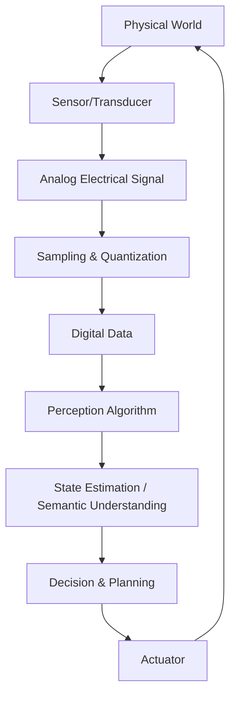

### 5.1.2 Sensor Performance Metrics: Resolution, Accuracy, Range, Bandwidth, Latency, Noise, Drift, and Redundancy

When selecting sensors, engineers face not a single metric but a set of interdependent performance parameters. Understanding the physical meaning of these parameters is the foundation for all subsequent discussions.

!!! note "Terminology Explanation: Resolution, Accuracy, Range, Bandwidth, Latency, Noise, Drift, Redundancy"
    - **Resolution**: The smallest change in input that a sensor can distinguish. For digital sensors, it is often equal to the physical quantity corresponding to one Least Significant Bit (LSB). Resolution determines "whether small changes can be seen."
    - **Accuracy**: The closeness of a measured value to the true value, usually expressed as the maximum permissible error or standard deviation. Accuracy reflects "how accurate the measurement is," influenced by both systematic errors (bias, nonlinearity, temperature effects) and random errors.
    - **Range / Full Scale**: The input range over which the sensor can operate linearly or effectively. Exceeding the range may cause saturation or damage.
    - **Bandwidth**: The range of frequencies of rapid changes that the sensor can faithfully reproduce, usually expressed by the -3 dB cutoff frequency. Bandwidth determines dynamic response capability.
    - **Latency**: The time difference between a change in physical input and the availability of the digital output. Low latency is crucial for closed-loop control.
    - **Noise**: The output uncertainty caused by random fluctuations, often described by Power Spectral Density (PSD) or standard deviation.
    - **Drift**: A systematic deviation in output that slowly changes over time when the input remains constant, often caused by temperature, aging, or material stress relaxation.
    - **Redundancy**: Using multiple independent sensors to measure the same physical quantity or different projections of the same state to improve reliability and fault tolerance.

There are typical engineering trade-offs among these metrics: increasing resolution often comes with a narrower range; reducing noise may require sacrificing bandwidth; increasing bandwidth may amplify high-frequency noise; eliminating drift requires more complex calibration and temperature compensation. Therefore, the design of a perception system is first and foremost a system-level trade-off.

### 5.1.3 Overall Architecture of a Humanoid Robot Perception System

A typical humanoid robot perception system can be divided into four layers:

1. **Sensor Layer**: Physical transducers and front-end analog circuits, outputting raw electrical signals.
2. **Data Acquisition Layer**: Filtering, sampling, quantizing, and timestamp alignment of analog signals.
3. **State & Perception Layer**: Running algorithms such as SLAM, visual odometry, force/position estimation, object detection, and semantic segmentation.
4. **Decision & Control Layer**: Using perception results for gait planning, manipulation planning, human-robot interaction, and safety assurance.

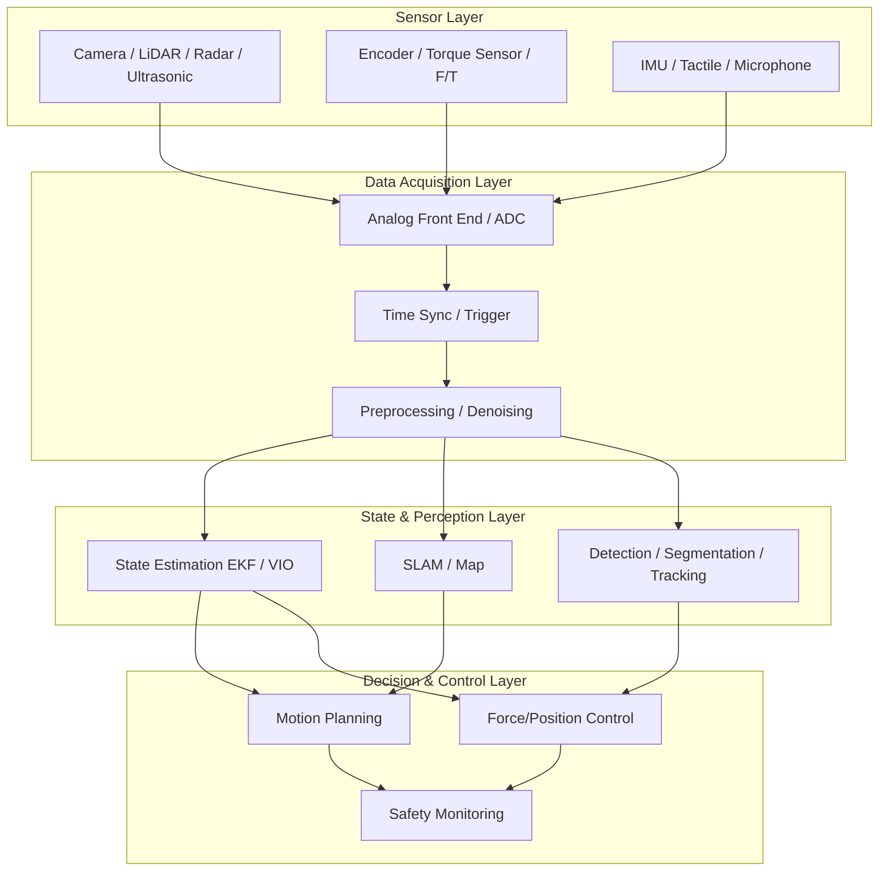

## 5.2 Photoelectric Sensors and Vision Systems

### 5.2.1 Particle Nature of Light and Photon Energy

Vision begins with light. Classical electromagnetism describes light as an electromagnetic wave, with its electric and magnetic fields propagating through space in wave form; at the quantum level, however, light consists of discrete "photons." Photon energy is given by the Planck relation:

$$
E = h \nu = \frac{h c}{\lambda}
$$

where \(h = 6.626 \times 10^{-34}\ \mathrm{J \cdot s}\) is Planck's constant, \(\nu\) is the frequency of light, \(c\) is the speed of light in vacuum, and \(\lambda\) is the wavelength. The shorter the wavelength (e.g., blue light, ultraviolet), the higher the energy of a single photon; the longer the wavelength (e.g., infrared), the lower the energy of a single photon.

!!! note "Term Explanation: Photon, Wavelength, Frequency, Electromagnetic Spectrum, Visible Light, Near-Infrared"
    - **Photon**: The energy quantum of light, exhibiting both particle nature (discrete energy packets) and wave nature (interference, diffraction).
    - **Wavelength**: The distance a wave travels in one period, determining the color of light or the category of electromagnetic wave. Commonly expressed in nm (nanometers).
    - **Frequency**: The number of oscillations per unit time, \(\nu = c/\lambda\). Unit: Hz.
    - **Electromagnetic Spectrum**: All electromagnetic radiation arranged by wavelength or frequency, from \(\gamma\)-rays to radio waves.
    - **Visible Light**: The band perceivable by the human eye, approximately 380–780 nm.
    - **Near-Infrared (NIR)**: Wavelengths approximately 780 nm–1.4 \(\mu\mathrm{m}\), commonly used in structured light, night vision, and ToF depth cameras.

The wavelength range detectable by a sensor depends on the material. The band gap of silicon (Si) is approximately 1.12 eV, corresponding to a cutoff wavelength of about 1100 nm. Therefore, silicon-based photodiodes are sensitive to visible and near-infrared light but insensitive to longer-wavelength mid- and far-infrared light.

### 5.2.2 Photoelectric Effect, PN Junction, and Photodiode

The photodiode is the core unit of almost all solid-state image sensors. Its operating principle is based on the **internal photoelectric effect** in semiconductors: when the photon energy exceeds the band gap \(E_g\) of the semiconductor material, the photon is absorbed and excites an electron from the valence band to the conduction band, simultaneously leaving behind a positively charged hole, forming an "electron-hole pair."

!!! note "Term Explanation: Photoelectric Effect, Band Gap, Valence Band, Conduction Band, Electron-Hole Pair"
    - **Photoelectric Effect**: The phenomenon where light irradiates a material, and photon energy is absorbed by electrons, releasing them from a bound state or exciting them to a higher energy state. The internal photoelectric effect in solids generates free carriers.
    - **Band Gap**: The energy difference between the top of the valence band and the bottom of the conduction band in a semiconductor. Only photons with energy greater than the band gap can excite electron-hole pairs.
    - **Valence Band**: The low-energy band formed by outer atomic electrons in a crystal, essentially filled at room temperature.
    - **Conduction Band**: The high-energy band where electrons can move freely. Electrons in the conduction band can participate in electrical conduction.
    - **Electron-Hole Pair**: The paired occurrence of a vacancy (hole) left behind when a valence band electron transitions to the conduction band, and the conduction band electron itself; they are the source of carriers for photoelectric conversion.

A photodiode is essentially a **PN junction** operated under reverse bias. A PN junction is formed by the contact between P-type semiconductor (excess holes) and N-type semiconductor (excess electrons), with a built-in electric field existing at the interface. Electron-hole pairs generated by light are separated by the built-in electric field in the depletion region: electrons drift toward the N region, and holes drift toward the P region, thereby generating a photocurrent.

The magnitude of the photocurrent is proportional to the incident optical power:

$$
I_{ph} = \frac{q \, \eta \, \Phi}{h \nu}
$$

where \(q\) is the electron charge, \(\eta\) is the quantum efficiency (the average number of collectible electrons generated per incident photon), and \(\Phi\) is the incident optical power. This equation indicates that for lower photon energy (longer wavelength), the same optical power corresponds to a larger number of photons; if quantum efficiency remains constant, the current is also larger.

!!! note "Term Explanation: PN Junction, Depletion Region, Built-in Electric Field, Reverse Bias, Photocurrent, Quantum Efficiency"
    - **PN Junction**: The structure formed by the contact of P-type and N-type semiconductors, exhibiting unidirectional conductivity.
    - **Depletion Region**: The region near the PN junction where carriers have been swept away by the built-in electric field, leaving a zone lacking free carriers; the built-in electric field is strongest here.
    - **Built-in Electric Field**: The electric field generated in the space charge region after the Fermi levels of the P and N regions align.
    - **Reverse Bias**: Applying a voltage opposite to the forward conduction direction across the PN junction, widening the depletion region, reducing capacitance, and increasing response speed.
    - **Photocurrent**: The current generated in a photodiode under illumination, flowing in the opposite direction to the reverse saturation current.
    - **Quantum Efficiency (QE)**: The ratio of collected electrons to incident photons, reflecting the efficiency of photoelectric conversion.

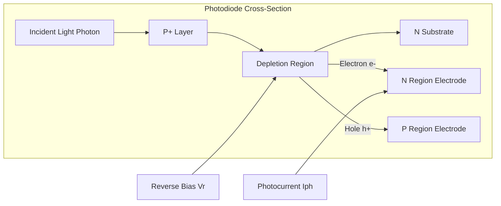

A photodiode alone can only measure light intensity and cannot distinguish spatial position. To convert a light intensity distribution into an image, a large number of photodiodes must be arranged into a two-dimensional array, with an independent charge readout path provided for each pixel. This is the core task of an image sensor.

### 5.2.3 CCD and CMOS Image Sensors

**Charge-Coupled Device (CCD)** and **Complementary Metal-Oxide-Semiconductor (CMOS)** image sensors are the two mainstream solid-state imaging technologies. Both are based on photodiode arrays, but they differ in their charge readout methods.

!!! note "Term Explanation: CCD, CMOS Image Sensor, Pixel, Photodiode, Readout Circuit"
    - **CCD (Charge-Coupled Device)**: An image sensor that uses clock voltages to transfer charge row-by-row/column-by-column within the chip, ultimately performing charge-to-voltage conversion at a few output nodes.
    - **CMOS Image Sensor (CIS)**: An image sensor that integrates amplification and readout circuits within each pixel or per column, allowing parallel readout directly in voltage/digital form.
    - **Pixel**: The smallest independent photosensitive unit in an image sensor, composed of a photodiode, color filter, microlens, and readout circuit.
    - **Photodiode**: The core device within a pixel that performs photoelectric conversion.
    - **Readout Circuit**: The circuit that amplifies, samples, and outputs the pixel charge or voltage signal from the chip.

The operation of a CCD is analogous to "bucket brigade": during exposure, each pixel accumulates photogenerated charge; after exposure, the charge is sequentially coupled and transferred along columns and rows under the drive of clock pulses, eventually reaching an on-chip or off-chip charge-to-voltage converter. This method offers low readout noise, high quantum efficiency, and a large pixel fill factor, but suffers from high power consumption, slow readout speed, and the need for complex external drivers.

CMOS image sensors, on the other hand, integrate amplifiers (typically source followers) and selection switches within each pixel or at the column level. Each pixel can be addressed independently, allowing random readout similar to accessing memory. Advantages of CMOS include low power consumption, high integration, high frame rates, and the ability to integrate on-chip ADCs and image processing; disadvantages are higher readout noise in early designs, and that part of the pixel area is occupied by transistors, resulting in a lower fill factor compared to CCDs.

Modern robot vision almost exclusively uses CMOS image sensors because their speed, power consumption, and system integration are better suited for real-time applications.

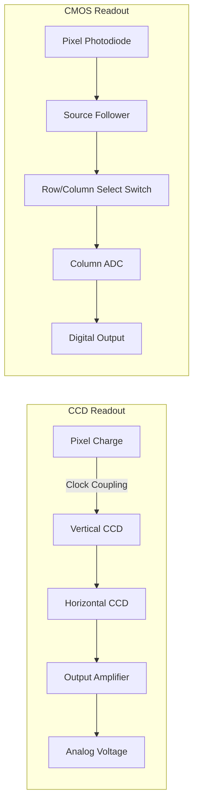

Typical structures of a CMOS pixel include:

1. **Microlens**: Concentrates incident light onto the photosensitive area, improving the effective fill factor.
2. **Color Filter**: Typically uses a Bayer array (RGGB), allowing each pixel to receive only red, green, or blue light; full color is subsequently recovered through a demosaicing algorithm.
3. **Photodiode**: Often a pinned photodiode (PPD), which reduces dark current and increases full well capacity.
4. **Transfer Gate** and **Floating Diffusion (FD) Node**: Transfers charge to the FD node, where it is converted to a voltage by the source follower.

!!! note "Term Explanation: Microlens, Color Filter, Bayer Pattern, Dark Current, Full-Well Capacity, Floating Diffusion"
    - **Microlens**: A small lens on top of a pixel that focuses oblique incident light onto the photodiode.
    - **Color Filter**: A colored film that transmits only a specific wavelength range of light.
    - **Bayer Pattern**: A mosaic of color filters arranged in an RGGB pattern, where the number of green pixels is twice that of red or blue, matching the human eye's higher sensitivity to green light.
    - **Dark Current**: Current generated by thermal excitation in the absence of light, a significant source of image noise.
    - **Full-Well Capacity**: The maximum amount of charge a pixel can hold, determining the maximum detectable light intensity.
    - **Floating Diffusion (FD)**: A capacitive node in a CMOS pixel that converts charge into voltage.

#### CMOS Image Sensor Pixel and Manufacturing Process

The performance of a CMOS image sensor is largely determined by the structure, materials, and manufacturing process of its individual pixels. A pixel can be understood as an integrated unit of a "micro-photodiode + charge-to-voltage converter + color selector": after photons enter the pixel, they first pass through a microlens and a color filter, are absorbed by the photodiode, and generate electron-hole pairs; after exposure, the electrons are moved via a transfer gate to the floating diffusion node, where they are read out as a voltage signal by a source follower.

!!! note "Term Explanation: Front-Side Illuminated, Back-Side Illuminated, Stacked Sensor, Fill Factor, Quantum Efficiency, Dark Current Non-Uniformity"
    - **Front-Side Illuminated (FSI)**: The photodiode is located beneath the metal interconnect layers; light must pass through the metal lines before reaching the photosensitive area.
    - **Back-Side Illuminated (BSI)**: The silicon wafer is thinned and flipped so that light enters the photodiode directly from the backside, reducing obstruction from metal wiring.
    - **Stacked Sensor**: The photosensitive pixel layer and the logic/memory/ADC circuit layer are manufactured separately and then vertically interconnected, increasing the pixel fill factor and improving readout speed.
    - **Fill Factor**: The ratio of the photosensitive area to the total pixel area; a higher fill factor means a stronger ability to capture photons.
    - **Quantum Efficiency (QE)**: The average number of electrons generated and collected per incident photon, reflecting the photoelectric conversion efficiency.
    - **Dark Signal Non-Uniformity (DSNU) and Photo-Response Non-Uniformity (PRNU)**: The output differences between pixels under dark and illuminated conditions, affecting image flatness and calibration difficulty.

**FSI, BSI, and Stacked Structures**

In traditional FSI pixels, the metal interconnect layers, gates, and polysilicon layers are located above the photodiode. These opaque or semi-transparent structures block some incident light, limiting the fill factor and quantum efficiency; additionally, large incident light angles can cause crosstalk and shadowing effects. The BSI process involves grinding and polishing the backside of the wafer to about \(3\!\sim\!10\ \mu\mathrm{m}\), then introducing light from the backside. This allows the photosensitive area to avoid obstruction from the metal layers, significantly improving the fill factor and QE, especially beneficial for small pixels (\(<1.4\ \mu\mathrm{m}\)) and high-frame-rate applications.

Stacked sensors further bond the pixel array wafer with the logic circuit wafer: the pixel layer is only responsible for light sensing and charge transfer, while the logic layer integrates ADCs, digital readout, DRAM cache, and even ISP modules. This 3D integration not only frees up pixel area but also enables high-speed full-pixel readout (e.g., Sony's DRAM-in-CIS design can achieve thousands of frames per second), making it an ideal foundation for high-speed visual feedback in humanoid robots.

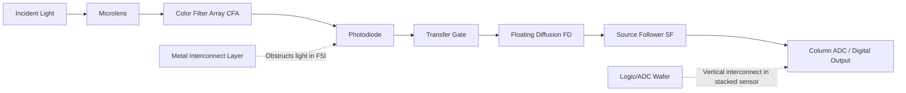

**The Photoelectric-Charge-Voltage Chain Inside a Pixel**

Photodiodes typically use a **pinned photodiode (PPD)** structure: an N-type charge collection region is embedded in a P-type substrate, with a P+ pinning layer on the surface. PPD suppresses dark current to very low levels while enabling low-noise complete charge transfer. During exposure, photons generate electron-hole pairs in the depletion region, and electrons are collected in the N region; after exposure, the transfer gate (TG) opens, and electrons flow into the floating diffusion node. The floating diffusion can be considered a tiny capacitor \(C_{FD}\), where charge \(Q\) generates a voltage change:

$$
\Delta V = \frac{Q}{C_{FD}}
$$

Then, the source follower (SF) converts the high-impedance floating diffusion voltage into a low-impedance output voltage for sampling by column-level or pixel-level ADCs. The larger this "charge-to-voltage conversion gain" \(G_{CV} = q / C_{FD}\), the larger the voltage change caused by a single electron, which benefits low-light signal-to-noise ratio but reduces full-well capacity and dynamic range.

!!! note "Term Explanation: Pinned Photodiode, Transfer Gate, Source Follower, Charge-to-Voltage Conversion Gain, Full-Well Capacity"
    - **Pinned Photodiode (PPD)**: A photodiode structure with its surface "pinned" by a P+ layer, which suppresses surface dark current and improves charge transfer efficiency.
    - **Transfer Gate (TG)**: A MOS switch that controls the transfer of charge from the photodiode to the floating diffusion.
    - **Source Follower (SF)**: An in-pixel or column-level amplifier with high input impedance and low output impedance, used to buffer the FD voltage.
    - **Charge-to-Voltage Conversion Gain**: The voltage generated per unit charge on the FD, \(G_{CV}=q/C_{FD}\).
    - **Full-Well Capacity (FWC)**: The maximum amount of charge a pixel can hold before saturation, \(N_{sat}=Q_{max}/q\).

**Color Filter Array**

The human eye is most sensitive to luminance (green light), so most CMOS sensors use a **Bayer pattern (RGGB)**: each \(2\times2\) pixel block contains 1 red, 2 green, and 1 blue. The Bayer pattern loses two-thirds of the color information, requiring subsequent demosaicing algorithms to restore full color. To enhance low-light or near-infrared perception, industrial/robotic cameras may use:

- **RCCB**: Replaces some green pixels with clear pixels to increase sensitivity, but at the cost of some color accuracy.
- **RGB-IR**: Places infrared-transmitting filters on some pixels, allowing the same sensor to simultaneously capture visible light and NIR depth/night vision information.
- **Monochrome (Mono)**: Removes the CFA to maximize QE and resolution, commonly used in SLAM and visual odometry.

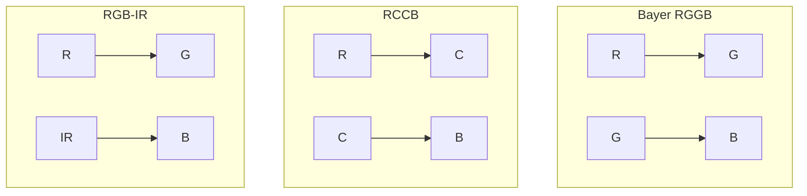

**Key Performance Metrics**

- **Pixel Pitch**: The distance between the centers of adjacent pixels, in \(\mu\mathrm{m}\). Smaller pixels can achieve higher resolution on the same chip area, but the single-pixel photosensitive area decreases, FWC decreases, and noise relatively increases.
- **Quantum Efficiency (QE)**: Represents the efficiency of converting incident photons into collectable electrons, influenced by silicon absorption coefficient, surface reflection, CFA transmittance, and BSI/FSI structure. Silicon's QE for visible light can reach \(50\!\sim\!80\%\), decreasing in the near-infrared region as wavelength increases.
- **Dark Current**: Electron-hole pairs generated by thermal excitation in the absence of light. Dark current increases exponentially with temperature, roughly doubling every \(8\!\sim\!10\ ^\circ\mathrm{C}\). The shot noise of dark current is \(\sqrt{2qI_d\Delta t}/q\) electrons.
- **DSNU / PRNU**: DSNU is the standard deviation of pixel outputs under dark (black level) conditions; PRNU is the relative standard deviation of pixel responses under uniform illumination. DSNU mainly originates from differences in dark current between pixels, FD capacitance variations, and readout circuit offsets; PRNU originates from microlens/CFA uniformity, QE, and conversion gain variations.
- **Photon Transfer Curve (PTC)**: By varying exposure under uniform illumination, the relationship between signal variance and mean is measured. The read noise region has a flat variance, the shot noise region has a variance proportional to the signal mean (its slope reciprocal is the conversion gain), and the saturation region shows a decreasing variance, corresponding to FWC.
- **Dynamic Range (DR)**: The ratio of the maximum non-saturated signal to the minimum resolvable signal, commonly expressed in dB:

$$
\mathrm{DR} = 20 \log_{10}\left(\frac{N_{sat}}{N_{read}}\right)
$$

Where \(N_{read}\) is the read noise in electrons. Humanoid robots require high dynamic range for scenarios like switching between indoor and outdoor environments or backlighting, typically requiring \(>70\ \mathrm{dB}\).

- **SNR10**: The minimum illuminance corresponding to a signal-to-noise ratio of 10 dB, used to measure low-light imaging capability. The lower the SNR10, the better the dark-light performance.

```mermaid
xychart-beta
    title "Photon Transfer Curve Illustration"
    x-axis "Signal Mean (DN)" 0 --> 100
    y-axis "Variance (DN²)" 0 --> 120
    line "Variance" [10, 15, 22, 32, 45, 60, 80, 95, 105, 100]
    annotation "Read Noise Region" {"x":10, "y":10}
    annotation "Shot Noise Region (Slope≈1)" {"x":50, "y":55}
    annotation "Full Well Saturation" {"x":90, "y":102}
```

#### Image Signal Processing (ISP) Pipeline

The RAW data output from the CMOS sensor must pass through an **Image Signal Processing (ISP)** pipeline to become the final usable RGB/YUV image. The goal of ISP is to compensate for physical defects in the sensor and optical system while preserving scene information, and to convert the data into a color space suitable for human eyes or algorithms.

!!! note "Terminology Explanation: Black Level Correction, Lens Shading Correction, Defect Pixel Correction, Demosaicing, Color Correction Matrix, Gamma Correction"
    - **Black-Level Correction (BLC)**: Subtracts dark current and readout bias so that zero illumination corresponds to a zero digital value.
    - **Lens Shading Correction (LSC)**: Compensates for image corner darkening caused by the lens cos⁴ law and microlens angular response.
    - **Defect Pixel Correction (DPC)**: Replaces fixed or dynamic defective pixels using interpolation from neighboring pixels.
    - **Demosaicing**: The interpolation process to recover R/G/B three channels for each pixel from the sparse Bayer sampling.
    - **Color Correction Matrix (CCM)**: Linearly transforms the sensor's raw RGB response to a target color space (e.g., sRGB).
    - **Gamma Correction**: Maps linear light intensity to a nonlinear display/storage space to match human brightness perception.

**Typical ISP Flow**

1. **Black Level Correction**: The sensor outputs a non-zero baseline (black level) even when completely shielded from light, estimated from optically shielded dark pixels or inter-frame statistics. BLC subtracts the corresponding channel's black level from each pixel to ensure correct linear processing.

2. **Lens Shading Correction (LSC)**: Wide-angle lenses experience illumination attenuation at the field edge according to \(\cos^4\theta\), and microlens collection efficiency for oblique incident light decreases, causing the image to be brighter in the center and darker at the corners. LSC compensates pixel-by-pixel on RAW data using a pre-calibrated gain table or radial polynomial.

3. **Defect Pixel Correction (DPC)**: Due to manufacturing defects, some pixels are always too bright (hot pixel) or too dark (dead pixel). DPC marks fixed defective pixels in a static calibration table; dynamic defective pixels are detected by comparing with the neighborhood median and replaced via interpolation.

4. **Demosaicing**: Each pixel in the Bayer array has only one of R/G/B colors. Demosaicing uses spatial and spectral correlation to interpolate missing colors. Classic algorithms like bilinear interpolation can cause aliasing; high-quality algorithms (e.g., Malvar-He-Cutler, directional interpolation, deep learning demosaicing) preserve details at edges.

5. **White Balance (AWB) and Color Correction**: Under different light source color temperatures, the RGB ratios of the same object vary. AWB estimates the scene illuminant, then multiplies each channel by a gain to make neutral colors appear gray. Subsequently, CCM converts the demosaiced sensor RGB to a standard space like sRGB or Rec.2020:

$$
\begin{bmatrix} R_{out} \\ G_{out} \\ B_{out} \end{bmatrix}
=
\mathbf{M}_{CCM}
\begin{bmatrix} R_{in} \\ G_{in} \\ B_{in} \end{bmatrix}
$$

6. **Gamma Correction**: The response of display devices and human eyes to brightness is nonlinear. Gamma correction maps linear luminance \(L\) to \(L^{1/\gamma}\) (typically \(\gamma\approx2.2\)), improving encoding precision in dark areas while being compatible with display standards.

7. **Noise Reduction and Edge Enhancement**: Random noise becomes visible after RAW image amplification. Spatial noise reduction (e.g., bilateral filtering, guided filtering) preserves edges; temporal noise reduction (multi-frame alignment and fusion) uses statistics from consecutive frames to improve SNR. Sharpness is then restored via unsharp masking or edge enhancement.

8. **Tone Mapping and High Dynamic Range (HDR)**: When the scene contrast exceeds the dynamic range of a single exposure, ISP can fuse multiple frames with different exposures (multi-exposure fusion) or multi-gain outputs, compressing the high dynamic range into a low dynamic range displayable while preserving highlight and shadow details.

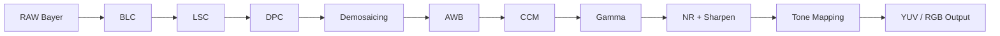

**Auto Exposure (AE), Auto Gain Control (AGC), and Auto White Balance (AWB) Feedback Loop**

ISP typically forms a closed-loop control with the sensor:

- **AE**: Adjusts exposure time and aperture (if controllable) based on image brightness histogram or target brightness to keep the output within a suitable dynamic range.
- **AGC**: When exposure has reached its upper or lower limit, controls brightness by adjusting analog/digital gain; excessive gain amplifies noise.
- **AWB**: Estimates the light source color temperature by analyzing neutral color areas or global color distribution in the image, then updates channel gains.

These loops read exposure, white point, histogram, and other information via the statistics engine in the SoC, then firmware calculates new exposure parameters and gains, feeding them back to the sensor registers in real time.

!!! note "Terminology Explanation: Auto Exposure, Auto Gain Control, Auto White Balance, Statistics Engine, Feedback Loop"
    - **Auto Exposure (AE)**: A control loop that automatically adjusts exposure time based on scene brightness.
    - **Auto Gain Control (AGC)**: A loop that adjusts analog/digital gain when exposure is limited.
    - **Auto White Balance (AWB)**: A loop that estimates light source color temperature and adjusts RGB channel gains.
    - **Statistics Engine**: A hardware module in ISP that extracts statistical information such as brightness, color, and histogram.
    - **Feedback Loop**: A control structure that adjusts sensor/ISP parameters based on output statistics.

**ISP Deployment Locations: On-Sensor, In-SoC, and Dedicated ISP Chips**

- **On-Sensor ISP**: Some CMOS sensors integrate a simple ISP on-chip, directly outputting YUV/JPEG, suitable for low-power modules.
- **SoC-Integrated ISP**: Main control chips for phones and robots (e.g., Qualcomm Snapdragon, NVIDIA Jetson, Rockchip RK3588) integrate multi-channel ISP, supporting high resolution, multi-camera synchronization, and HDR.
- **Dedicated ISP Chip**: Used in industrial/automotive scenarios with extremely high image quality requirements, capable of handling large format, global shutter, multi-exposure fusion, with better latency and noise control.

For humanoid robots, the choice of ISP depends on algorithm input: if running neural networks in the backend, YUV/RGB after white balance, gamma, and noise reduction is usually desired; for visual SLAM, Bayer RAW or minimally processed grayscale images are preferred to avoid geometric/brightness distortions introduced by nonlinear gamma and noise reduction.

#### ISP Register-Level Control and Hardware Data Path

The previous section introduced the ISP processing pipeline from a functional perspective. At the chip implementation level, ISP is a hardware pipeline controlled by a **register map**: the CPU or MCU firmware writes parameters to configuration registers via a bus, and the hardware modules perform real-time image processing line by line with the assistance of a DMA engine. Understanding the register-level data path is key to locating engineering issues such as image tearing, bandwidth bottlenecks, and color drift.

!!! note "Terminology Explanation: Line Buffer, Ping-Pong Buffer, DMA Engine, Register Map, Shadow Register, AHB/APB, AXI/AXI-Stream"
    - **Line Buffer**: An SRAM/register array inside the ISP module used to temporarily store several rows of pixels. Spatial algorithms such as demosaicing and noise reduction need to access the current row and its adjacent rows simultaneously.
    - **Ping-Pong Buffer**: Two buffers of equal capacity that alternate between read and write operations, ensuring seamless handoff between data producer and consumer without stalling.
    - **DMA Engine (Direct Memory Access engine)**: Transfers entire blocks of data between memory and hardware modules without CPU intervention per byte, significantly reducing processor load.
    - **Register Map**: Maps hardware control bits, status bits, and coefficient tables into the CPU-addressable memory space; firmware configures the hardware by reading and writing these addresses.
    - **Shadow Register**: A buffer register that holds the current valid configuration during frame processing. New configurations are only synchronized to the shadow register at safe moments (e.g., vertical blanking interval) to avoid image tearing.
    - **AHB/APB**: ARM Advanced High-performance Bus / Advanced Peripheral Bus, commonly used to connect the CPU with low-speed/medium-speed peripheral registers.
    - **AXI/AXI-Stream**: ARM high-performance bus protocols. AXI supports separate address and data channels, while AXI-Stream is designed for continuous data streams, commonly used as the data path between ISP and DDR or video interfaces.

**Basic Components of an ISP Hardware Pipeline**

A typical ISP silicon implementation can be abstracted into the following units:

1. **Input Interface / Receive FIFO**: Receives RAW data from MIPI CSI-2 or reads RAW frames from DDR; performs byte alignment, packet parsing, and error detection.
2. **Input DMA**: Reads the image to be processed from DDR via the AXI bus within the SoC and writes it into the ISP's internal line buffer or ping-pong buffer.
3. **Line Buffer / Window Buffer**: Provides local pixel windows for modules such as BLC, LSC, DPC, Demosaic, and NR. The window size determines the number of rows to buffer; for example, a \(5 \times 5\) demosaicing kernel requires at least 2 rows of front and back buffering.
4. **Configurable Processing Pipeline**: Each processing node corresponds to a set of coefficient registers or lookup tables (LUTs). For example, CCM uses \(3 \times 3\) coefficients, Gamma uses a segmented LUT base address and length, and LSC uses a grid gain table.
5. **Statistics Engine**: Computes brightness mean, histogram, white point statistics, etc., for the entire frame or block-based ROIs, providing feedback for AE/AGC/AWB.
6. **Output DMA / Format Conversion**: Writes the processed RGB/YUV data back to DDR in the target format (e.g., YUV420, RGB888), or sends it via AXI-Stream to the display controller, video encoder, or NPU.

Since the ISP typically processes line-by-line in a **streaming** manner, each module only needs to store a limited number of pixel rows. The on-chip SRAM overhead is much smaller than a full-frame buffer, which is the fundamental reason it can operate in real-time at high resolutions and frame rates.

**Typical Register Categories and Their Meanings**

The following table lists common configuration categories found in ISP register maps (names are illustrative only; they vary significantly between vendors):

| Register Category | Example Register Name | Function Description |
|-------------------|-----------------------|----------------------|
| Pipeline Enable / Bypass | `REG_ISP_ENABLE`, `REG_ISP_BYPASS_DEMOSAIC` | Enable or skip a processing node for debugging and power management. |
| Black Level Correction | `REG_ISP_BLC_R/G/B` | Black level offset for each channel, typically written after dark field calibration. |
| Lens Shading Correction | `REG_ISP_LSC_GRID[0..N]` | 2D grid gain coefficients to compensate for lens cos⁴ falloff and microlens angular response. |
| Demosaicing | `REG_ISP_DEMOSAIC_EDGE_THR`, `REG_ISP_DEMOSAIC_MODE` | Edge detection threshold, interpolation mode (bilinear / directional adaptive, etc.). |
| Color Correction Matrix | `REG_ISP_CCM_00..22` | \(3 \times 3\) matrix coefficients, typically stored in fixed-point format. |
| Gamma Correction | `REG_ISP_GAMMA_LUT_ADDR`, `REG_ISP_GAMMA_LUT_LEN` | Base address and length of the LUT in DDR; hardware loads it via DMA. |
| Auto Exposure / Gain | `REG_ISP_AE_ROI_X/Y/W/H`, `REG_ISP_AE_TARGET` | AE statistics window position and target brightness. |
| Auto White Balance | `REG_ISP_AWB_GAIN_R/G/B` | White balance gain for each channel. |
| Noise Reduction & Sharpening | `REG_ISP_NR_STRENGTH`, `REG_ISP_SHARPEN_GAIN` | Spatial/temporal noise reduction strength, edge enhancement gain. |
| Output Format / Crop / Scale | `REG_ISP_OUT_FMT`, `REG_ISP_CROP_X/Y/W/H`, `REG_ISP_SCALE_H/V` | Output pixel format, valid region, scaling factors. |

**Safe Register Update During V-blank**

When the ISP is processing the current frame, if the firmware directly modifies the active registers, different rows within the same frame would use different configurations, causing tearing or flickering. Engineering practice typically employs a **shadow register** mechanism:

- During the frame active period, the shadow register holds the current frame configuration unchanged;
- After frame processing ends and enters the **vertical blanking interval (V-blank)**, the firmware loads the new configuration from the configuration registers into the shadow register in one go;
- The next frame starts using the updated parameters from the very first row.

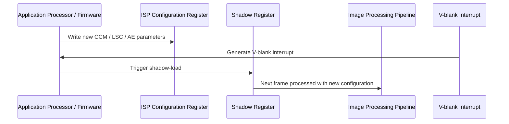

This update timing is especially critical for AE/AGC: exposure parameters must be sent before the sensor starts a new frame exposure, otherwise brightness jumps will occur.

**DMA Data Flow: From Sensor to DDR to Display/Encoding**

The data movement in ISP typically follows this path:

1. RAW frames enter the receive FIFO from the MIPI CSI-2 interface and are written by DMA to the RAW buffer in DDR;
2. The ISP input DMA reads RAW from DDR and sends it via AXI-Stream to the internal line buffer;
3. After streaming operations through each processing node, the output DMA writes YUV/RGB back to DDR;
4. The display controller, video encoder, or AI NPU reads the processed image from DDR.

Bandwidth constraints to note include:

- **Bit width × Line width × Frame rate**: For example, 12 MP, 10-bit, 30 fps RAW has a single-channel theoretical bandwidth of approximately \(12\times10^6 \times 10 \times 30 / 8 \approx 450\ \mathrm{MB/s}\). Multiple ISP streams can quickly exhaust DDR bandwidth;
- **AXI Bus Arbitration**: ISP, NPU, and display controller share the AXI interconnect, requiring proper QoS and priority settings;
- **Line Buffer Bit Depth**: Internal SRAM is designed according to pixel bit width (e.g., 10/12/14 bits). Higher bit depth increases area and power consumption.

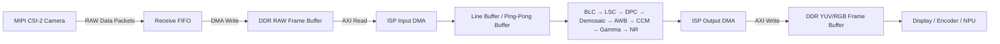

**Fixed-Point CCM Register Example**

Coefficients of the color correction matrix are typically stored in fixed-point format, e.g., Q10 format (10 fractional bits, scaling factor \(2^{10}=1024\)). A pseudo-register representation of a simplified \(2 \times 2\) CCM is as follows:

```text
REG_ISP_CCM_00 = round(CCM[0][0] * 1024)   // e.g., 1.20 * 1024 = 1229
REG_ISP_CCM_01 = round(CCM[0][1] * 1024)   // e.g., -0.10 * 1024 = -103 (must be stored as signed two's complement)
REG_ISP_CCM_10 = round(CCM[1][0] * 1024)
REG_ISP_CCM_11 = round(CCM[1][1] * 1024)
REG_ISP_CCM_ENABLE = 1
```

During hardware computation, the pixel value is first multiplied and accumulated with the CCM coefficients, and then the result is right-shifted by 10 bits to obtain the fixed-point output. Special attention is required for:

- **Sign and bit width**: CCM coefficients can be positive or negative; registers must use signed numbers and reserve sufficient bit width to prevent intermediate result overflow.
- **Rounding and truncation**: After the right shift, rounding or truncation is applied, affecting low-light chroma accuracy.
- **Clipping**: The final output must be limited to the valid bit width range (e.g., 10-bit output limited to \([0, 1023]\)).

!!! note "Terminology: Fixed-point number, Q-format, Two's complement, Overflow, Clipping"
    - **Fixed-point number**: A numerical representation with a fixed decimal point position, suitable for hardware accelerators without floating-point units.
    - **Q-format**: For example, Q10 indicates a fixed-point format with 10 fractional bits and the remaining bits for the integer part.
    - **Two's complement**: A signed integer encoding method where the most significant bit represents the sign.
    - **Overflow**: When the computation result exceeds the register bit width, causing value wrapping or truncation.
    - **Clipping / Saturation**: Limiting out-of-range results to the maximum/minimum representable value, commonly used for image pixel output.

**ISP Registers in Consumer-Grade Modules**

In actual products, ISP registers are often encapsulated by vendor firmware, and developers can only access high-level APIs. For example, the Intel RealSense D4xx series, Luxonis OAK-D, Sony ISX series, and OmniVision OVxxxx series each have their own firmware and register access strategies. Nevertheless, the hardware architecture of "configuration registers + shadow registers + DMA + line buffer" described above is universal. Understanding these concepts helps in grasping the key points when reading vendor SDKs, debugging MIPI protocol analyzer captures, or evaluating ISP latency.

### 5.2.4 Camera Optical Model: Pinhole Model, Intrinsics, Extrinsics, and Distortion

A camera projects points from the three-dimensional world onto a two-dimensional image plane. The simplest geometric model is the **pinhole camera model**. It assumes that light passes through an infinitesimally small hole (the optical center) and projects onto the imaging plane, forming an inverted real image.

!!! note "Terminology: Pinhole model, Optical center, Image plane, Focal length, Principal point"
    - **Pinhole camera model**: A simplified model describing camera imaging geometry using ideal pinhole projection.
    - **Optical center / Camera center**: The convergence point of all incident light rays, i.e., the position of the pinhole.
    - **Image plane**: The two-dimensional plane that records the light intensity distribution.
    - **Focal length**: The distance from the optical center to the image plane, determining the field of view. Common units are mm or pixels.
    - **Principal point**: The intersection of the optical axis with the image plane, ideally located at the image center.

Let a point in the world coordinate system be \(\mathbf{P}_w = [X_w, Y_w, Z_w]^T\), and its corresponding point in the camera coordinate system be \(\mathbf{P}_c = [X_c, Y_c, Z_c]^T\). The transformation from world coordinates to camera coordinates is a rigid body transformation described by the rotation matrix \(\mathbf{R}\) and translation vector \(\mathbf{t}\):

$$
\mathbf{P}_c = \mathbf{R} \mathbf{P}_w + \mathbf{t}
$$

In the camera coordinate system, based on similar triangles, the pinhole projection gives the coordinates on the image plane:

$$
x = f \frac{X_c}{Z_c}, \quad y = f \frac{Y_c}{Z_c}
$$

where \(f\) is the focal length. Converting image coordinates to pixel coordinates \((u, v)\) requires considering pixel size and principal point offset:

$$
\begin{bmatrix} u \\ v \\ 1 \end{bmatrix}
= \frac{1}{Z_c}
\begin{bmatrix}
f_x & 0 & c_x \\
0 & f_y & c_y \\
0 & 0 & 1
\end{bmatrix}
\begin{bmatrix} X_c \\ Y_c \\ Z_c \end{bmatrix}
$$

where \(f_x = f / d_x\), \(f_y = f / d_y\) are the focal lengths in pixel units, and \((c_x, c_y)\) are the principal point coordinates. This \(3 \times 3\) matrix is called the **camera intrinsic matrix**, and \(\mathbf{R}, \mathbf{t}\) are called the **camera extrinsic parameters**.

!!! note "Terminology: Camera intrinsics, Camera extrinsics, Rotation matrix, Translation vector, Pixel coordinates"
    - **Camera intrinsics**: Parameters describing the camera's own geometric characteristics, including focal length, principal point, pixel size, and distortion coefficients.
    - **Camera extrinsics**: Parameters describing the rigid body transformation between the camera coordinate system and the world coordinate system, i.e., \(\mathbf{R}\) and \(\mathbf{t}\).
    - **Rotation matrix**: A \(3 \times 3\) orthogonal matrix describing the rotational relationship between coordinate systems.
    - **Translation vector**: Describes the translation between the origins of coordinate systems.
    - **Pixel coordinates**: Discrete image coordinates with the origin at the top-left corner or center of the image.

Real camera lenses introduce geometric distortion, primarily **radial distortion** and **tangential distortion**. Radial distortion is caused by the curvature of the lens, causing points far from the optical axis to shift inward or outward; tangential distortion is caused by the lens optical center not being perfectly parallel to the image plane. The Brown-Conrady model is commonly used to describe this:

$$
\begin{aligned}
x_{\text{distorted}} &= x \left(1 + k_1 r^2 + k_2 r^4 + k_3 r^6\right) + 2 p_1 x y + p_2 \left(r^2 + 2 x^2\right) \\
y_{\text{distorted}} &= y \left(1 + k_1 r^2 + k_2 r^4 + k_3 r^6\right) + p_1 \left(r^2 + 2 y^2\right) + 2 p_2 x y
\end{aligned}
$$

where \(r^2 = x^2 + y^2\), \(k_1, k_2, k_3\) are radial distortion coefficients, and \(p_1, p_2\) are tangential distortion coefficients.

!!! note "Terminology: Radial distortion, Tangential distortion, Distortion coefficients, Brown-Conrady model"
    - **Radial distortion**: Image point shift along the radial direction due to the lens's radial curvature, commonly seen as pincushion or barrel distortion.
    - **Tangential distortion**: Image point shift in the tangential direction due to non-coplanar lens assembly.
    - **Distortion coefficients**: Parameters obtained from calibration used to correct the aforementioned distortions.
    - **Brown-Conrady model**: A classic mathematical model for lens distortion, widely adopted by libraries such as OpenCV.


### 5.2.5 Binocular Stereo Vision and Triangulation

When the human eye observes the same scene with both eyes, due to the different positions of the two eyes, the images seen have slight differences. The brain uses this difference to perceive depth. Binocular stereo vision mimics this principle by using two horizontally placed cameras to capture the same scene simultaneously, recovering depth by matching corresponding points in the left and right images.

!!! note "Term Explanation: Binocular Stereo Vision, Baseline, Disparity, Correspondence Matching, Depth Estimation"
    - **Binocular Stereo Vision**: A technique that uses two cameras to capture the same object from slightly different viewpoints and calculates the three-dimensional structure through geometric relationships.
    - **Baseline**: The horizontal distance between the optical centers of the two cameras, denoted as \(B\).
    - **Disparity**: The horizontal difference in pixel coordinates of the same scene point in the left and right images, denoted as \(d\).
    - **Correspondence Matching**: The process of finding the same scene point in the left and right images.
    - **Depth Estimation**: The process of recovering the distance from a scene point to the camera from image information.

Assume the optical centers of the two cameras are on the same horizontal line, separated by distance \(B\), and have been rectified so that their imaging planes are coplanar. If the horizontal coordinate of a spatial point \(P\) in the left image is \(x_L\) and in the right image is \(x_R\), then the disparity \(d = x_L - x_R\). According to similar triangles:

$$
Z = \frac{f B}{d}
$$

where \(f\) is the rectified focal length and \(Z\) is the depth from the spatial point to the camera plane. This equation indicates: the larger the disparity, the smaller the depth; the longer the baseline, the larger the disparity for the same depth, leading to higher relative ranging accuracy, but also a larger near-field blind zone.

!!! note "Term Explanation: Stereo Rectification, Coplanar Imaging, Epipolar Constraint, Triangulation"
    - **Stereo Rectification**: The process of transforming the imaging planes of two cameras onto the same plane through reprojection, so that corresponding points are only searched along the horizontal direction.
    - **Coplanar Imaging**: After rectification, the image planes of the left and right cameras are on the same plane and their optical axes are parallel.
    - **Epipolar Constraint**: In rectified stereo images, corresponding points lie on the same horizontal scanline.
    - **Triangulation**: A method to determine the position of a spatial point by intersecting two or more lines of sight.

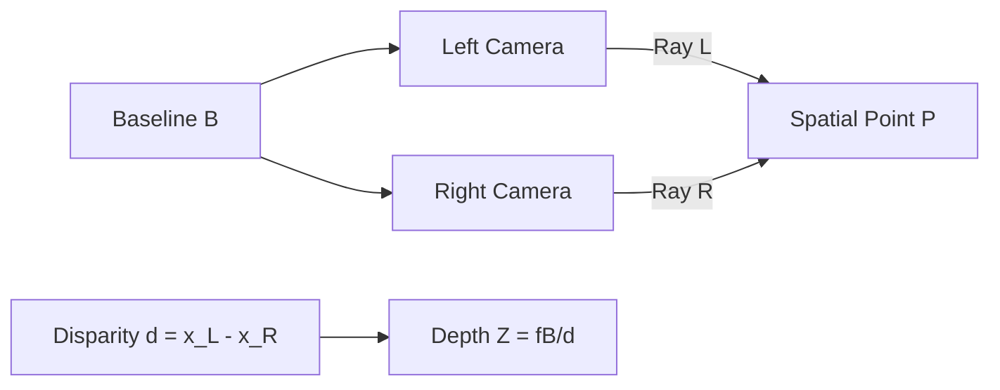

The challenges of binocular stereo vision include: difficulty in matching low-texture regions; false matches in repetitive patterns; and transparent, reflective, or high-dynamic-range scenes breaking the correspondence assumption. To overcome these issues, industrial depth cameras often introduce active texture projection (structured light) or directly measure time-of-flight.

### 5.2.6 Structured Light and Time-of-Flight (ToF) Depth Cameras

**Structured Light** depth cameras project a known pattern (e.g., stripes, speckles, or Gray code patterns) onto the scene and observe the deformation of the pattern on the object's surface using a camera. By analyzing the pattern deformation, the depth corresponding to each pixel can be calculated.

!!! note "Term Explanation: Structured Light, Projector, Coded Pattern, Phase Unwrapping, Triangulation"
    - **Structured Light**: A technique that obtains three-dimensional shapes by projecting a known optical pattern onto a scene and observing its deformation.
    - **Projector**: An active light source that emits the structured light pattern, commonly an infrared laser combined with a DOE diffractive element.
    - **Coded Pattern**: An intensity/phase pattern with spatial or temporal encoding, facilitating identification and matching.
    - **Phase Unwrapping**: An algorithmic step to recover the true absolute phase from the wrapped phase.
    - **Triangulation**: In structured light systems, the projector, camera, and object point form a triangle, and depth is obtained through geometric relationships.

In sinusoidal fringe structured light, the projected pattern can be written as:

$$
I(x, y) = A(x, y) + B(x, y) \cos\left(\phi(x, y)\right)
$$

where \(\phi(x, y)\) is the phase. Height variations on the object surface change the phase observed by the camera. After obtaining the wrapped phase via phase-shifting methods, the absolute phase is recovered through phase unwrapping, and finally converted to depth using calibration parameters.

**Time-of-Flight (ToF)** depth cameras directly measure the time \(\Delta t\) it takes for a light pulse to travel from the emitter to the object and back to the receiver, thereby obtaining the distance:

$$
Z = \frac{c \, \Delta t}{2}
$$

where \(c\) is the speed of light, and the factor of 2 accounts for the round trip.

!!! note "Term Explanation: Time-of-Flight, ToF, dToF, iToF, Modulated Light, Demodulation"
    - **Time-of-Flight (ToF)**: A technique that measures distance by calculating the round-trip time of a light pulse or modulated light.
    - **dToF (direct ToF)**: A ToF scheme that directly measures the round-trip time of a light pulse, often using single-photon avalanche diodes (SPADs).
    - **iToF (indirect ToF)**: A scheme that indirectly calculates distance by measuring the phase shift of modulated light caused by the round trip.
    - **Modulated Light**: A light signal whose intensity varies periodically, e.g., as a sine wave or square wave.
    - **Demodulation**: The process of extracting the phase or time difference from the received signal.

In iToF, the emitted light is modulated as a sine wave. The receiver calculates the phase difference \(\phi\) between the received and emitted light using multiple phase samples (typically 4 phases, spaced by \(90^\circ\)):

$$
Z = \frac{c \, \phi}{4 \pi f_m}
$$

where \(f_m\) is the modulation frequency. iToF accuracy is affected by multipath reflections, motion blur, and background light; dToF has advantages at long distances and low reflectivity but requires extremely high time resolution.

Structured light is suitable for medium-to-close range, high-precision, static or low-speed scenarios; ToF is suitable for medium-to-long range, high frame rate, outdoor or dynamic scenarios, but its accuracy is generally lower than structured light.

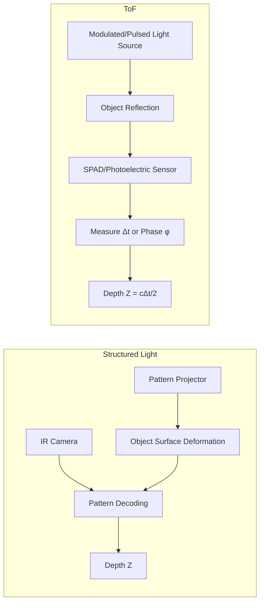

### 5.2.7 Introduction to Event Camera Principles

Traditional cameras capture entire images at a fixed frame rate, suffering from limitations such as frame-rate-bound temporal resolution, motion blur, and data redundancy. **Event cameras**, or **Dynamic Vision Sensors (DVS)**, operate on a completely different principle: each pixel independently and asynchronously responds to local changes in light intensity.

!!! note "Term Explanation: Event Camera, Dynamic Vision Sensor, Event, Log Intensity, Asynchronous Readout"
    - **Event Camera**: A vision sensor that outputs visual information as a stream of asynchronous events rather than a sequence of frames.
    - **Dynamic Vision Sensor (DVS)**: An early name for event cameras, emphasizing their response to dynamic changes.
    - **Event**: A spatiotemporal data point generated by a single pixel when the change in light intensity exceeds a threshold, typically containing \((x, y, t, p)\).
    - **Log Intensity**: Event cameras typically respond to changes in \(\log I\) rather than linear intensity.
    - **Asynchronous Readout**: Pixels output independently without a global exposure time.

When the change in log intensity at a pixel exceeds a threshold \(C\), the pixel generates an event:

$$
\Delta \log I(x, y, t) = \log I(x, y, t) - \log I(x, y, t - \Delta t) \approx \pm C
$$

An event is usually represented by a quadruple \((x, y, t, p)\), where \((x, y)\) are the pixel coordinates, \(t\) is the timestamp (achievable at microsecond resolution), and \(p = \pm 1\) indicates the polarity of the intensity increase or decrease.

Advantages of event cameras include: microsecond-level temporal resolution, extremely low latency, high dynamic range (typically > 120 dB), and data sparsity. Challenges include: no output for static scenes; event data is not a traditional image, requiring new algorithms; noise and threshold non-uniformity increase processing difficulty. Gallego et al. provided a systematic review of the principles, algorithms, and applications of event cameras[28].

!!! note "Term Explanation: Polarity, Timestamp, Dynamic Range, Sparsity, Motion Blur"
    - **Polarity**: A binary sign indicating whether an event represents an increase (ON) or decrease (OFF) in light intensity.
    - **Timestamp**: A high-precision time marker for when an event occurred.
    - **Dynamic Range**: The ratio between the brightest and darkest signals a sensor can simultaneously record, typically expressed in dB.
    - **Sparsity**: Events are only generated where light intensity changes; static regions produce no data, so the data volume is much smaller than frame-based images.
    - **Motion Blur**: Image smearing caused by object motion during the exposure time of a traditional camera; event cameras have virtually no motion blur due to their fast response.

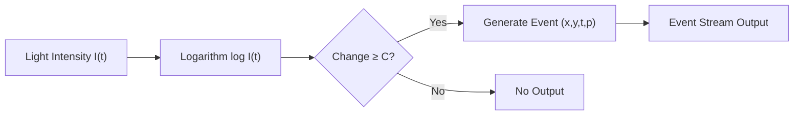

### 5.2.8 Image Sensor and Camera Module Product Selection

The vision system of a humanoid robot needs to balance resolution, frame rate, dynamic range, cost, size, and algorithm friendliness. The table below lists representative models of common image sensors and complete camera modules along with their applicable scenarios.

| Sensor/Module | Manufacturer | Resolution / Optical Format | Key Features | Typical Application |
|------------|------|------------------|---------|---------|
| Sony IMX179 | Sony | 8 MP, 1/3.2" | Stacked BSI, Low Power, Small Size | Laptop/Robot Front Vision |
| Sony IMX214 | Sony | 13 MP, 1/3.06" | BSI, Phase Detection AF, High Dynamic Range | Early Smartphone/Robot Vision |
| Sony IMX296 | Sony | 1.58 MP, 1/2.9" | Global Shutter, High Frame Rate, Low Latency | Machine Vision, SLAM |
| Sony IMX477 | Sony | 12.3 MP, 1/2.3" | BSI, High QE, Supports 4K | Raspberry Pi HQ Cam, Research/Robotics |
| Sony IMX519 | Sony | 16 MP, 1/2.53" | BSI, High Resolution, Fast AF | High-Resolution Navigation/Recognition |
| Sony IMX582 | Sony | 48 MP, 1/2" | Stacked BSI, Quad Bayer, High Dynamic Range | High-Resolution Semantic Perception |
| ON Semi AR0234 | onsemi | 2.3 MP, 1/2.6" | Global Shutter, High QE, HDR | Industrial Vision, AGV/AMR |
| ON Semi AR0820 | onsemi | 8.3 MP, 1/1.8" | High Dynamic Range, LED Flicker Mitigation | Autonomous Driving/Robot Front Vision |
| OmniVision OV9281 | OMNIVISION | 1 MP, 1/4" | Global Shutter, Mono/Stereo, IR+ | Structured Light/RGB-D Reference Camera |
| OmniVision OV9782 | OMNIVISION | 1 MP, 1/4" | Global Shutter, Low Light, NIR Enhanced | Visual Odometry, Depth Assistance |
| Samsung ISOCELL | Samsung | Multiple | Dual Pixel, Tetracell, High Dynamic Range | Consumer Electronics, Robotics |
| Intel RealSense D435i | Intel | 1280×720 @ 90 Hz | Active IR Stereo + IMU | Robot Navigation, Obstacle Avoidance, SLAM[13] |
| Intel RealSense D455 | Intel | 1280×720 @ 90 Hz | Better Depth Accuracy, IMU, Longer Baseline | Indoor/Outdoor Mobile Robots[13] |
| Azure Kinect DK | Microsoft | 3840×2160 RGB + ToF | ToF Depth, Microphone Array, IMU | Human Tracking, Interaction |
| ZED 2i | StereoLabs | 2×1920×1200 @ 30 Hz | Passive Stereo, Built-in IMU, Weatherproof | Outdoor SLAM, Humanoid Platform |
| OAK-D / OAK-D-Pro | Luxonis | 12 MP RGB + Stereo | 4 TOPS Edge AI + Depth | Embedded Vision, Humanoid Head |
| Orbbec Gemini 2 | Orbbec | 1280×800 @ 60 Hz | Active Stereo, Wide FOV, IP65 | Service/Humanoid Robot |

!!! note "Terminology Explanation: Global Shutter, Rolling Shutter, Optical Format, Quad Bayer, LED Flicker Mitigation"
    - **Global Shutter**: All pixels are exposed simultaneously, suitable for high-speed motion and rolling platforms, avoiding the jelly effect.
    - **Rolling Shutter**: Exposes rows sequentially, low cost but can cause distortion in motion scenes.
    - **Optical Format**: The diagonal length of the sensor's photosensitive area, commonly expressed as 1/N inches.
    - **Quad Bayer**: Combines 2×2 same-color pixels into one large pixel, balancing high resolution and high sensitivity.
    - **LED Flicker Mitigation (LFM)**: Reduces image artifacts caused by LED light source flickering through multiple exposures or special pixel structures.

The following factors need to be considered comprehensively during selection:

1. **SLAM/VIO Friendliness**: Global shutter, high frame rate, low jelly effect, good low-light SNR10.
2. **Depth Perception Method**: Passive stereo is suitable for texture-rich environments; active stereo/structured light/ToF is suitable for low-texture and indoor environments.
3. **Processing Chain Position**: If the algorithm runs on the robot's main SoC, choose modules that output RAW/YUV; if front-end AI inference is needed, modules with neural accelerators like the Luxonis OAK-D have an advantage.
4. **Mechanical and Electrical Interface**: MIPI CSI-2 is suitable for board-level connections; USB3/GigE facilitates rapid prototyping but has higher latency.

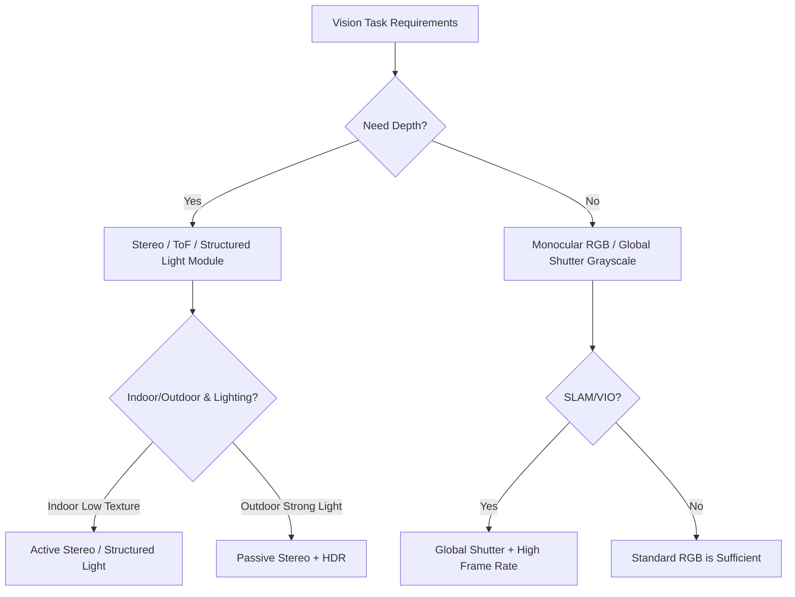

---

## 5.3 LiDAR and Millimeter-Wave/Ultrasonic

### 5.3.1 Time-of-Flight Ranging and LiDAR Point Clouds

**Light Detection and Ranging (LiDAR)** measures the distance to a target by emitting laser pulses and measuring their round-trip time. Unlike cameras, LiDAR directly measures distances in three-dimensional space, outputting a set of discrete three-dimensional points called a **point cloud**.

!!! note "Terminology Explanation: LiDAR, Point Cloud, Laser Pulse, Echo, Ranging"
    - **LiDAR (Light Detection and Ranging)**: An active optical sensor that uses laser light for detection and ranging.
    - **Point cloud**: A set of discrete points in three-dimensional space with coordinates (and often intensity, timestamp), which is the output form of LiDAR.
    - **Laser pulse**: A short-duration, high-energy beam of light emitted by LiDAR.
    - **Return / Echo**: The signal reflected back after the laser illuminates a target.
    - **Ranging**: The process of measuring the distance from the sensor to a target.

The basic LiDAR ranging equation is:

$$
R = \frac{c \, \Delta t}{2}
$$

where \(R\) is the distance, \(c\) is the speed of light, and \(\Delta t\) is the time difference between emission and reception.

The optical power received by LiDAR can be estimated using the **radar ranging equation**:

$$
P_r = P_t \, \frac{D_r^2}{4 R^2} \, \eta_{atm} \, \eta_{sys} \, \rho \, \cos\theta \, \frac{A_{spot}}{\pi R^2 \tan^2(\theta_{beam}/2)}
$$

where \(P_t\) is the transmitted power, \(D_r\) is the receiver aperture, \(\eta_{atm}\) and \(\eta_{sys}\) are the atmospheric and system optical efficiencies, \(\rho\) is the target reflectivity, \(\theta\) is the incidence angle, and \(A_{spot}\) is the illuminated area on the target. This equation shows that received power decays with the square (or even the fourth power) of distance, thus long-range detection requires high peak power and a large receiver aperture.

!!! note "Terminology Explanation: Radar Equation, Reflectivity, Receiver Aperture, Atmospheric Attenuation, Beam Divergence Angle"
    - **Radar equation / LiDAR equation**: The formula describing the relationship between transmitted power, target characteristics, distance, and received power.
    - **Reflectivity**: The proportion of light reflected by the target surface, \(\rho\).
    - **Receiver aperture**: The effective diameter of the receiving optical system.
    - **Atmospheric attenuation**: Power loss due to scattering and absorption of light by the atmosphere during propagation.
    - **Beam divergence angle**: The angle over which the laser beam spreads as it propagates, determining the spot size.

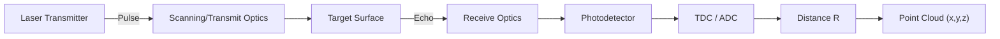

#### LiDAR Transmit and Receive Front-End

LiDAR performance depends not only on the scanning mechanism but also on the light source in the transmitter, the detector in the receiver, and the digitization method of the echo signal. A pulsed dToF LiDAR front-end can be abstracted as a chain: "light source + transmit optics + target + receive optics + photodetector + time/amplitude digitizer".

!!! note "Terminology Explanation: Laser Diode, VCSEL, EEL, Fiber Laser, Pulse Energy, Eye Safety Class"
    - **Laser diode (LD)**: A semiconductor PN junction-based laser source, compact and efficient, the most common light source for robotic LiDAR.
    - **VCSEL (Vertical-Cavity Surface-Emitting Laser)**: A laser where light emission is perpendicular to the chip surface, easy to form arrays and integrate with optics.
    - **EEL (Edge-Emitting Laser)**: A laser that emits light along the wafer plane, offering high power density and good beam quality, often used for long-range LiDAR.
    - **Fiber laser**: A laser using a doped fiber as the gain medium, capable of generating high-energy, narrow-pulse-width pulses for long-range ranging and mapping.
    - **Pulse energy**: The energy carried by a single laser pulse, commonly expressed in nJ or μJ.
    - **Laser safety class**: IEC 60825-1 classifies lasers by the degree of hazard to eyes and skin based on power/energy. Class 1 is safe under normal use; Class 1M is safe for the naked eye but potentially hazardous when viewed through optical instruments.

**Laser Light Source and Eye Safety**

Humanoid robots typically interact with humans at close range, so LiDAR laser radiation must meet eye safety standards. IEC 60825-1 classifies laser products into Class 1, 1M, 2, 3R, 3B, 4, etc. For near-infrared (905 nm, 940 nm, 1550 nm) pulsed LiDAR, Class 1/1M means no eye damage under normal operating conditions (including direct naked-eye viewing); 1550 nm light is strongly absorbed by water in the anterior cornea and cannot reach the retina, so its safe power threshold is much higher than for 905 nm. This is one reason long-range automotive/robotic LiDAR tends to favor 1550 nm.

The transmitted pulse energy \(E_p\), peak power \(P_{peak}\), pulse width \(\tau_p\), and repetition rate \(f_{PRF}\) determine the average power \(P_{avg}=E_p f_{PRF}\). Increasing \(E_p\) improves ranging capability but must stay within eye safety limits; reducing pulse width improves time resolution and multi-target resolution but requires a faster receiver front-end.

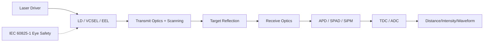

**Photoreceivers: APD, SPAD, SiPM**

- **APD (Avalanche Photodiode)**: Operates in the linear amplification region, using a reverse bias voltage to create avalanche multiplication in the depletion layer, with an internal gain \(M\) typically \(10\!\sim\!200\). The APD outputs an analog current pulse, suitable for sampling with a transimpedance amplifier (TIA) and ADC, ideal for medium-to-long-range, high dynamic range scenarios.
- **SPAD (Single-Photon Avalanche Diode)**: Biased above the breakdown voltage, a single photon can trigger a self-sustaining avalanche, outputting a digital pulse. SPADs offer single-photon sensitivity and, combined with a TDC, can achieve picosecond-level time resolution, making them core components for dToF and Flash LiDAR.
- **SiPM (Silicon Photomultiplier)**: Composed of a large array of parallel SPAD microcells, its output is the superposition of multiple SPAD pulses, combining high sensitivity with some analog amplitude information, commonly used in scintillation detection and certain solid-state LiDARs.

The responsivity \(R\) of an APD/SPAD is defined as the ratio of photocurrent to incident optical power (A/W). Considering the avalanche gain \(M\), the effective responsivity is \(R_M = M R_0\). However, the avalanche process introduces an excess noise factor \(F(M)\), reducing the output signal-to-noise ratio. The breakdown voltage \(V_{br}\) of an SPAD drifts with temperature, requiring active temperature compensation or a quenching circuit.

!!! note "Terminology Explanation: Avalanche Multiplication, Breakdown Voltage, Responsivity, Excess Noise Factor, Quenching Circuit"
    - **Avalanche multiplication**: A chain amplification process where carriers generate more carriers through impact ionization in a strong electric field.
    - **Breakdown voltage**: The reverse voltage at which a PN junction undergoes self-sustaining avalanche; SPADs operate above this voltage.
    - **Responsivity (R)**: The ratio of the detector's output photocurrent to the incident optical power, unit A/W.
    - **Excess noise factor (F)**: The noise amplification factor introduced by avalanche multiplication, typically increasing with gain.
    - **Quenching circuit**: A circuit that rapidly lowers the bias to stop the avalanche and reset the SPAD after it triggers.

**Time Digitization: TDC and ADC**

- **TDC (Time-to-Digital Converter)**: Converts the time interval between the received pulse and the reference clock into a digital code. TDC resolution determines the dToF distance resolution: \(\Delta R = c \Delta t / 2\). For example, 100 ps resolution corresponds to a 1.5 cm distance resolution.
- **ADC (Analog-to-Digital Converter)**: Digitizes the analog pulse amplitude output by the APD, which can be used for intensity measurement, waveform recording, and multi-return detection.

**Peak Detection vs. Full-Waveform Digitization**

- **Peak detection**: Records only the first moment when the echo exceeds the threshold. The circuit is simple and the point rate is high, but multi-return and intensity information are lost.
- **Full-waveform digitization**: Records the entire echo waveform at a high sampling rate, enabling the extraction of multiple returns, penetration of vegetation, and estimation of target roughness. Digital photon-counting LiDAR (e.g., certain models from Ouster and Hesai) performs time-correlated single-photon counting (TCSPC) on SPAD outputs, which is essentially a form of waveform digitization.

**Ranging Equation and SNR**

For dToF LiDAR, the average number of received photons \(\bar{n}\) can be written as:

$$
\bar{n} = \eta \frac{E_p}{h \nu} \frac{\rho \cos\theta}{\pi R^2} A_r \, T_{atm}^2(R)
$$

where \(\eta\) is the detector quantum efficiency, \(E_p/(h\nu)\) is the number of emitted photons, \(\rho\) is the target reflectivity, \(A_r\) is the receiver aperture area, and \(T_{atm}\) is the one-way atmospheric transmittance. This equation shows that the number of echo photons decays with the square of the distance and increases linearly with reflectivity and receiver aperture.

The signal-to-noise ratio is jointly determined by the number of signal photons, background light photons, dark counts, and readout noise. Under direct sunlight, background light can overwhelm the signal, so narrowband filters, time gating, selection of 905/940 nm vs. 1550 nm bands, and multi-pulse accumulation are often used to improve SNR.

**Multi-Return, Range Ambiguity, and Interference**

- **Multi-return**: The laser spot may simultaneously cover foreground and background objects (e.g., vegetation, window frames). Full-waveform or multi-trigger detection can output multiple distance values.
- **Range ambiguity**: When the pulse repetition frequency \(f_{PRF}\) is too high, the echo from a previous pulse may arrive after the next pulse is emitted, causing range folding. The maximum unambiguous range is \(R_{max}=c/(2 f_{PRF})\).
- **Inter-LiDAR crosstalk**: When multiple LiDARs operate simultaneously, they may receive each other's laser pulses. Random pulse coding, wavelength diversity, and time synchronization are the main suppression methods.
- **Multipath**: Specular reflections or strong scatterers cause light to travel along multiple paths to the receiver, resulting in false points or range biases.
- **Reflectivity dependence**: Dark targets (reflectivity \(\rho\approx5\%\)) produce echoes more than an order of magnitude weaker than light-colored targets (\(\rho\approx90\%\)), affecting maximum range and point cloud density.

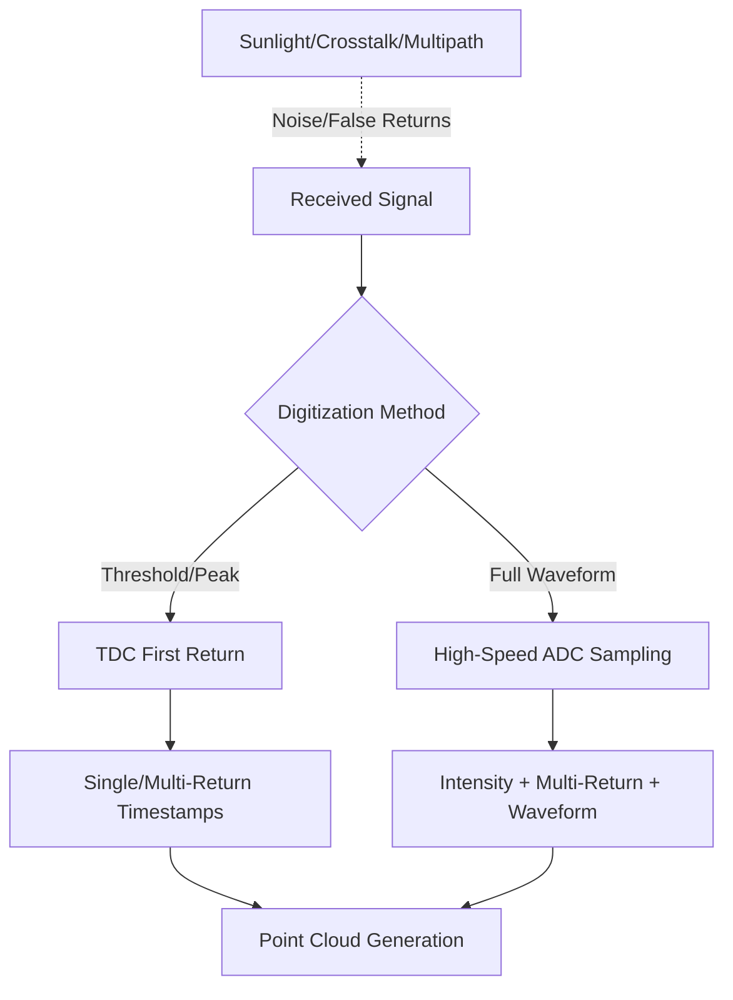

#### dToF LiDAR Link Budget Numerical Example

The radar equation above provides a qualitative relationship between received power and distance, reflectivity, and aperture. During engineering selection, it is necessary to substitute specific values into the equation to calculate the number of echo photons and SNR at different distances and target reflectivities, thereby determining whether the LiDAR can meet the ranging requirements for humanoid robot navigation and obstacle avoidance.

!!! note "Term Explanation: Link Budget, Emitted Photons, Return Photons, SNR, Detection Probability"
    - **Link budget**: The process of calculating the energy/power loss at each stage of transmission, propagation, and reception to obtain the final received signal strength.
    - **Emitted photons**: The number of photons contained in a single laser pulse, $N_t = E_p / (h\nu)$.
    - **Return photons**: The number of photons reflected by the target and entering the receiver.
    - **Signal-to-Noise Ratio (SNR)**: The ratio of signal power (or photon count) to various noise powers (or photon counts).
    - **Detection probability**: The probability that a signal is correctly detected given a certain false alarm probability.

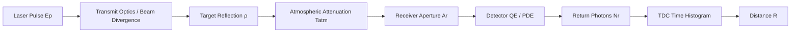

**Typical 905 nm dToF LiDAR Parameters**

| Parameter | Symbol | Value | Description |
|-----------|--------|-------|-------------|
| Laser Wavelength | $\lambda$ | 905 nm | Sensitive band for silicon detectors |
| Single Pulse Energy | $E_p$ | 5 nJ | Within Class 1 eye-safe limits |
| Pulse Width | $\tau_p$ | 5 ns | Determines distance resolution ~0.75 m |
| Repetition Rate | $f_{PRF}$ | 100 kHz | Max unambiguous range 1.5 km |
| Beam Divergence Angle | $\theta_{beam}$ | 0.2° | 1°≈17.45 mrad |
| Receiver Aperture Diameter | $D_r$ | 10 mm | Receiver area $A_r = \pi D_r^2/4$ |
| Detector Quantum Efficiency | $\eta$ | 0.25 | Typical value at 905 nm |
| Target Reflectivity | $\rho$ | 0.10 (10%) | Dark target |
| Incidence Angle | $\theta$ | 0° | Normal incidence |
| One-Way Atmospheric Transmittance | $T_{atm}$ | 0.98 | Approximation for clear air, short distance |

**Calculation of Return Photon Number**

The number of emitted photons is:

$$
N_t = \frac{E_p}{h c / \lambda} = \frac{5\times 10^{-9}\ \mathrm{J}}{(6.626\times 10^{-34}\ \mathrm{J\cdot s})(3\times 10^8\ \mathrm{m/s}) / 905\times 10^{-9}\ \mathrm{m}} \approx 2.28 \times 10^{10}
$$

A single pulse emits approximately 23 billion photons. Only a very small fraction of these photons are reflected by the target and enter the receiver aperture. The formula for the number of return photons can be simplified as:

$$
N_r = N_t \, \eta \, \rho \, \cos\theta \, \frac{A_r}{\pi R^2} \, T_{atm}^2(R)
$$

This formula assumes the target is a Lambertian reflector, with reflected light scattering uniformly over a hemisphere. The \(\pi R^2\) term arises from the hemispherical solid angle \(2\pi\) and geometric projection; if a more precise beam divergence model is used, it can be multiplied by \(A_r / (\pi R^2 \tan^2(\theta_{beam}/2))\) to account for the spot coverage ratio.

Taking \(R = 10\ \mathrm{m}\), \(\rho = 0.10\), \(A_r = 7.85\times 10^{-5}\ \mathrm{m^2}\) as an example:

$$
N_r \approx 2.28\times 10^{10} \times 0.25 \times 0.10 \times 1 \times \frac{7.85\times 10^{-5}}{\pi \times 10^2} \times 0.98^2 \approx 137
$$

That is, a single pulse returns approximately 137 photons. For an SPAD detector, if the photon detection efficiency (PDE) is 0.20, the actual number of detected signal photons is about 27 per pulse.

**Signal-to-Noise Ratio and Detection Probability**

Total noise includes dark counts \(N_d\), background light \(N_b\), and readout noise. Assuming the equivalent dark counts and background light per pulse total \(N_{noise} = 5\), the single-pulse SNR is:

$$
\mathrm{SNR}_{pulse} = \frac{N_{sig}}{\sqrt{N_{sig} + N_{noise}}} = \frac{27}{\sqrt{27 + 5}} \approx 4.8
$$

By accumulating \(M = 100\) pulses, the signal adds coherently while the noise grows as \(\sqrt{M}\), improving the accumulated SNR by a factor of \(\sqrt{M}\):

$$
\mathrm{SNR}_{accum} = \mathrm{SNR}_{pulse} \sqrt{M} \approx 4.8 \times 10 = 48
$$

A high SNR implies a small distance estimation error. For TCSPC, the standard deviation of the distance error due to timing jitter is approximately:

$$
\sigma_R = \frac{c \, \sigma_t}{2 \sqrt{N_{sig,accum}}}
$$

If $\sigma_t = 100\ \mathrm{ps}$ and the accumulated signal photons are 2700, then:

$$
\sigma_R \approx \frac{3\times 10^8 \times 100\times 10^{-12}}{2 \times \sqrt{2700}} \approx 0.29\ \mathrm{cm}
$$

**Number of Returned Photons at Different Distances and Reflectivities**

| Distance $R$ (m) | $\rho=0.05$ | $\rho=0.10$ | $\rho=0.50$ | $\rho=0.90$ |
|-------------|-------------|-------------|-------------|-------------|
| 5 | 548 | 1096 | 5479 | 9862 |
| 10 | 137 | 274 | 1370 | 2465 |
| 30 | 15.2 | 30.5 | 152 | 274 |
| 50 | 5.5 | 11.0 | 55 | 99 |

From the table, it can be seen that for a dark target (5% reflectivity) at 50 m, the single-pulse return is only about 5–6 photons, requiring multi-pulse accumulation or higher emission energy; while a high-reflectivity target (90%) still has nearly a hundred photons/pulse at 50 m.

**Python Example: dToF LiDAR Link Budget Calculation**

```python
import numpy as np
import matplotlib.pyplot as plt

# Physical constants
h = 6.626e-34      # J·s
c = 3.0e8          # m/s
# LiDAR parameters
E_p = 5e-9         # J
lam = 905e-9       # m
D_r = 10e-3        # m
A_r = np.pi * (D_r/2)**2
eta = 0.25         # Detector QE
PDE = 0.20         # SPAD photon detection efficiency
T_atm = 0.98
N_noise_per_pulse = 5
sigma_t = 100e-12  # s

# Number of emitted photons
N_t = E_p / (h*c/lam)
print(f"Number of emitted photons/pulse: {N_t:.2e}")

def returned_photons(R, rho, theta_deg=0):
    theta = np.deg2rad(theta_deg)
    return N_t * eta * rho * np.cos(theta) * (A_r / (np.pi * R**2)) * T_atm**2

def detected_photons(R, rho):
    return returned_photons(R, rho) * PDE

# Distance and reflectivity scan
R = np.linspace(2, 80, 200)
rhos = [0.05, 0.10, 0.50, 0.90]
plt.figure(figsize=(10,4))
for rho in rhos:
    N_sig = detected_photons(R, rho)
    snr = N_sig / np.sqrt(N_sig + N_noise_per_pulse)
    plt.semilogy(R, snr, label=f"ρ={rho}")
plt.axhline(5, color='k', linestyle='--', label="SNR=5 threshold")
plt.xlabel("Range R (m)"); plt.ylabel("Single-pulse SNR")
plt.title("dToF LiDAR Single-Pulse SNR vs Range")
plt.legend(); plt.grid(True, which='both', ls='--')
plt.tight_layout(); plt.show()

# 50 m, 10% reflectivity, accumulated 100 pulses distance accuracy
R0, rho0, M = 50, 0.10, 100
N_sig_single = detected_photons(R0, rho0)
snr_single = N_sig_single / np.sqrt(N_sig_single + N_noise_per_pulse)
snr_accum = snr_single * np.sqrt(M)
sigma_R = c * sigma_t / (2 * np.sqrt(N_sig_single * M))
print(f"R={R0} m, ρ={rho0}: Single-pulse SNR={snr_single:.1f}, Accumulated SNR={snr_accum:.1f}")
print(f"Distance standard deviation after {M} accumulated pulses: {sigma_R*100:.2f} cm")
```

This script demonstrates the core calculation flow of the link budget: starting from the pulse energy, estimating the number of returned photons based on the Lambertian reflection model, then considering detection efficiency and noise to obtain the SNR, and finally giving the ranging accuracy after multi-pulse accumulation. Engineers can quickly evaluate the feasibility of different schemes for medium-to-long-range perception of humanoid robots by modifying parameters such as $E_p$, $D_r$, $\eta$, and PDE. A review of laser ranging technology can be found in Amann et al.[44].

#### SPAD/SiPM Detection Arrays: Quenching, Recovery, and Time-to-Digital Conversion

The previous LiDAR front-end has already mentioned photodetectors such as APDs, SPADs, and SiPMs. The reason SPADs and SiPMs can achieve single-photon sensitivity and picosecond-level time resolution is that the PN junction is biased above the **breakdown voltage**, operating in the so-called **Geiger mode**. This section starts from device physics and discusses key issues such as quenching/recovery circuits, dead time, afterpulsing, dark count, crosstalk, photon detection efficiency, and time-correlated single-photon counting (TCSPC).

!!! note "Terminology Explanation: Geiger Mode, Breakdown Voltage, Overvoltage, Avalanche Multiplication, Quenching Circuit"
    - **Geiger mode**: The operating mode where the PN junction is reverse-biased above the breakdown voltage, so that a single photogenerated carrier can trigger a self-sustaining avalanche discharge.
    - **Breakdown voltage (\(V_{br}\))**: The critical reverse voltage at which a PN junction undergoes self-sustaining avalanche, related to doping concentration and temperature.
    - **Overvoltage (excess bias)**: The portion of the actual bias voltage above the breakdown voltage, \(\Delta V = V_{bias} - V_{br}\), which directly determines the avalanche trigger probability and timing accuracy.
    - **Avalanche multiplication**: The chain multiplication of carriers through impact ionization in a strong electric field, where a single electron-hole pair can evolve into a macroscopic current pulse.
    - **Quenching circuit**: A circuit that quickly reduces the junction voltage below the breakdown voltage after an avalanche is triggered to terminate the avalanche, and then restores the initial bias after the dead time.

**Avalanche Triggering in Geiger Mode**

In Geiger mode, the electric field in the depletion region is extremely high. When a photon is absorbed and generates an electron-hole pair, the carriers are accelerated in the electric field and collide with the lattice to cause impact ionization, forming a self-sustaining avalanche. If left unchecked, the current will rapidly increase to the point of damaging the device. Therefore, a **quenching circuit** must be used to quickly reduce the bias below \(V_{br}\).

The overvoltage is defined as:

$$
\Delta V = V_{bias} - V_{br}
$$

The larger \(\Delta V\), the higher the probability of a carrier triggering an avalanche, improving the photon detection efficiency (PDE) and timing accuracy, but also worsening dark count, afterpulsing, and crosstalk. The breakdown voltage itself increases with temperature (temperature coefficient approximately \(10\sim 30\ \mathrm{mV/°C}\)), so high-precision dToF systems typically require temperature compensation or closed-loop bias adjustment.

The avalanche trigger probability (breakdown probability) can be approximated as:

$$
P_{bd} \approx 1 - \exp\!\left(-\int_{0}^{W} \alpha(x)\,dx\right)
$$

where \(W\) is the depletion width and \(\alpha(x)\) is the ionization coefficient related to the electric field. In engineering, the Photon Detection Efficiency (PDE) is often expressed as the product of quantum efficiency and trigger probability:

$$
\eta_{PDE}(\lambda, \Delta V) = \eta_{QE}(\lambda) \, P_{bd}(\Delta V)
$$

!!! note "Terminology Explanation: Photon Detection Efficiency, Quantum Efficiency, Ionization Coefficient, Depletion Width"
    - **Photon Detection Efficiency (PDE)**: The total probability that an incident photon is detected, equal to the product of quantum efficiency and avalanche trigger probability.
    - **Quantum Efficiency (QE)**: The proportion of absorbed photons that generate collectible carriers.
    - **Ionization coefficient**: The probability per unit length that a carrier generates a new carrier through impact ionization.
    - **Depletion width**: The width of the region in a PN junction where free carriers are swept away, determining the effective volume for absorption and multiplication.

```mermaid
xychart-beta
    title "SPAD Reverse I-V Characteristics (Schematic)"
    x-axis "Reverse Bias V (V)" 0 --> 30
    y-axis "Current I (Relative Log Scale)" 0 --> 1000
    line "I-V" [1, 1, 1, 2, 3, 5, 10, 100, 500, 900]
    annotation "Breakdown Voltage V_br" {"x":20, "y":500}
    annotation "Geiger Operation Region" {"x":25, "y":900}
```

**Passive Quenching and Active Quenching**

The basic task of the quenching circuit is to rapidly reduce the SPAD bias after an avalanche occurs, and then restore it to \(V_{bias}\). Common methods fall into two categories:

1. **Passive Quenching**: A large ballast resistor (typically \(100\ \mathrm{k\Omega}\sim 1\ \mathrm{M\Omega}\)) is connected in series with the SPAD anode or cathode. The avalanche current flowing through the resistor creates a voltage drop, automatically reducing the junction voltage below \(V_{br}\), causing the avalanche to stop due to insufficient electric field. Subsequently, recovery occurs via RC charging. The recovery time is mainly determined by \(R_{quench}\) and the SPAD junction capacitance \(C_j\):

$$
\tau_{rec} \sim R_{quench} \, C_j
$$

Passive quenching circuits are simple and have low noise, but suffer from long dead times (typically \(100\ \mathrm{ns}\sim \mu\mathrm{s}\)), limiting the maximum count rate.

2. **Active Quenching**: High-speed transistors or comparators detect the avalanche current, actively pull the bias down rapidly (\(<1\ \mathrm{ns}\)), and then actively recharge to \(V_{bias}\) after a controllable **hold-off time**. The dead time of active quenching can be as short as a few nanoseconds to tens of nanoseconds, achieving count rates on the order of \(10\sim 100\ \mathrm{Mcps}\), but the circuit is more complex, with higher power consumption and electromagnetic interference.

```mermaid
sequenceDiagram
    participant P as Photon Incidence
    participant A as SPAD Junction Voltage
    participant Q as Quenching Circuit
    participant R as Recovery Circuit
    P->>A: Trigger avalanche, current surge
    A->>Q: Current detected
    alt Passive Quenching
        Q->>A: Large resistor voltage drop, self-quenching
        A->>A: RC slow recovery (long dead time)
    else Active Quenching
        Q->>A: Transistor rapidly pulls bias down
        R->>A: Active recharging
        A->>A: Dead time ~ns\sim 10 ns
    end
```

**Dead Time, Afterpulsing, Dark Count, and Crosstalk**

These parameters determine the actual performance of SPAD/SiPM in time-resolved ranging:

- **Dead Time**: The minimum time after an avalanche during which the device cannot respond to the next photon. Photons arriving within the dead time are not recorded, leading to count loss and ranging bias.
- **Afterpulsing**: Carriers trapped by defects during the avalanche are released later, triggering another avalanche and creating false counts. Trap density depends on process and temperature, usually suppressed by lowering operating temperature or reducing excess bias.
- **Dark Count Rate (DCR)**: Counts generated by thermal excitation, tunneling, etc., in the absence of light, commonly expressed in counts/s or Hz. DCR increases exponentially with temperature, roughly doubling every \(8\sim 10\ ^\circ\mathrm{C}\) rise.
- **Crosstalk**: Photons or electrical pulses generated during one SPAD avalanche trigger neighboring pixels. It can be divided into **optical crosstalk** (avalanche photons absorbed by adjacent pixels) and **electrical crosstalk** (substrate current/voltage fluctuations). In dense arrays, crosstalk can cause tailing in time histograms and false points.
- **Photon Detection Probability / PDE vs. Wavelength and Excess Bias**: PDE is highest at the peak wavelength; insufficient excess bias reduces PDE, while excessive excess bias increases noise.

```mermaid
xychart-beta
    title "TCSPC Photon Arrival Time Histogram (Schematic)"
    x-axis "Time bin (ns)" 0 --> 100
    y-axis "Counts" 0 --> 60
    line "Counts" [3, 3, 4, 6, 10, 18, 35, 55, 40, 20, 10, 6, 4, 3, 2]
    annotation "Target Peak (Distance)" {"x":60, "y":55}
    annotation "Afterpulsing Tail" {"x":80, "y":10}
    annotation "Dark Count Background" {"x":20, "y":4}
```

!!! note "Terminology: Dead Time, Afterpulsing, Dark Count Rate, Crosstalk, Hold-off Time"
    - **Dead Time**: The minimum time interval after a detector event during which it cannot respond to the next event.
    - **Afterpulsing**: False avalanches caused by the delayed release of carriers trapped during an avalanche.
    - **Dark Count Rate (DCR)**: The spontaneous count rate in the absence of light.
    - **Crosstalk**: A trigger event in one pixel causing false triggering in an adjacent pixel.
    - **Hold-off Time**: The duration for which the bias is intentionally kept low in active quenching to reduce afterpulsing probability.

**Time-Correlated Single Photon Counting (TCSPC)**

dToF LiDAR uses the laser pulse emission time as "START" and the SPAD detection of the echo photon as "STOP", measuring the time difference \(\Delta t\) between them using a **Time-to-Digital Converter (TDC)**. Due to the randomness of single-photon detection, a single measurement cannot distinguish signal photons from dark counts/background light. Therefore, many laser pulses are repeatedly emitted, and the measured time differences are accumulated into a histogram. The histogram peak corresponds to the target distance:

$$
R = \frac{c \, \Delta t_{peak}}{2}
$$

The signal-to-noise ratio of TCSPC is proportional to the square root of the accumulated photon count \(\sqrt{N}\): more accumulated photons lead to better peak estimation accuracy. However, long accumulation times reduce the frame rate, so high-frame-rate dToF requires:

- High-repetition-rate lasers (\(f_{PRF}\) can reach \(100\ \mathrm{kHz}\sim \mathrm{MHz}\));
- Integration of a TDC per pixel or small pixel group for massive parallel time digitization;
- Sufficient SPAD fill factor and PDE to collect enough echo photons per unit time.

```mermaid
flowchart LR
    A["Laser Sync Pulse START"] --> B["TDC Starts Timing"]
    C["SPAD Detects Echo STOP"] --> B
    B --> D["Time Digitization Δt"]
    D --> E["Histogram Accumulator"]
    E --> F["Peak Fitting"]
    F --> G["Distance R = cΔt_peak / 2"]
```

!!! note "Terminology: Time-to-Digital Converter, TCSPC, Timing Jitter, Histogram Accumulation"
    - **Time-to-Digital Converter (TDC)**: A circuit that converts a time interval into a digital code; its resolution determines ranging accuracy.
    - **TCSPC (Time-Correlated Single Photon Counting)**: A method that estimates time intervals by repeatedly measuring and accumulating photon arrival time histograms.
    - **Timing Jitter**: The statistical spread of measured time differences for the same target distance, often expressed as standard deviation \(\sigma_t\).
    - **Histogram Accumulation**: The process of binning and counting a large number of single-photon events by arrival time to suppress random noise.

**Timing Accuracy and Timing Jitter**

The ranging accuracy of TCSPC is limited by timing jitter, which can be approximately decomposed as:

$$
\sigma_t^2 = \sigma_{TDC}^2 + \sigma_{SPAD}^2 + \sigma_{walk}^2 + \sigma_{laser}^2
$$

where \(\sigma_{TDC}\) is the TDC quantization and clock jitter, \(\sigma_{SPAD}\) is the statistical fluctuation of the avalanche build-up time, \(\sigma_{walk}\) is the time walk due to pulse amplitude/shape variations, and \(\sigma_{laser}\) is the laser pulse width. Increasing PDE and excess bias can reduce \(\sigma_{SPAD}\) but increases noise; TDC resolution typically needs to be better than \(100\ \mathrm{ps}\) for centimeter-level ranging.

**3D Stacked SPAD Sensors**

In traditional planar SPAD arrays, each pixel must accommodate the SPAD itself, as well as quenching, TDC, and readout circuits, leading to a trade-off between **fill factor** and **readout circuit area**. 3D stacking technology fabricates the photosensitive layer and the logic layer separately and then vertically interconnects them. A typical structure is:

- **Top tier**: Back-illuminated SPAD pixel array, responsible only for photoelectric conversion and avalanche;
- **Bottom tier**: CMOS logic layer, integrating quenching circuits, TDCs, counters, and readout interfaces;
- **Vertical interconnection**: Pixel-level high-speed interconnection achieved via Cu-Cu bonding or through-silicon vias (TSVs).

The Sony IMX459 is the industry's first stacked SPAD dToF sensor for automotive LiDAR: the top tier features a SPAD array with approximately 10 \(\mu\mathrm{m}\) pixels, and the bottom tier integrates distance measurement processing circuits, achieving approximately 100,000 pixels, 24% PDE at 905 nm, and a 6 ns response speed[36]. This structure improves the fill factor, reduces parasitic capacitance, and increases parallel TDC density while also reducing module size and power consumption.

```mermaid
flowchart LR
    subgraph Top-tier pixel chip
    A["Incident light"] --> B["Back-illuminated SPAD pixel array"]
    end
    B -->|"Cu-Cu bonding / TSV"| C["Bottom-tier logic chip"]
    subgraph Bottom-tier logic chip
    C --> D["Quenching and recovery circuit"]
    D --> E["TDC / Counter"]
    E --> F["Readout and MIPI CSI-2 interface"]
    end
```

Cova, Ghioni, et al. provided a classic review of SPAD quenching circuits and single-photon detection characteristics, laying the foundation for the circuit design of modern dToF and TCSPC systems[35].

### 5.3.2 Scanning Mechanisms: Mechanical Rotation, MEMS, Solid-State/Flash, OPA

LiDAR can be categorized by scanning method into mechanical rotating, MEMS mirror, solid-state (Flash), and optical phased array (OPA).

!!! note "Terminology explanation: Mechanically rotating LiDAR, MEMS mirror, Solid-state LiDAR, Flash LiDAR, OPA"
    - **Mechanically rotating LiDAR**: Drives the entire transmitting/receiving module to rotate via a motor, achieving \(360^\circ\) horizontal scanning.
    - **MEMS mirror (Micro-Electro-Mechanical Systems mirror)**: Uses a tiny mirror driven by micro-electromechanical systems to deflect the beam through rapid oscillation.
    - **Solid-state LiDAR**: LiDAR without macroscopic moving parts, typically including Flash, OPA, and other solutions.
    - **Flash LiDAR**: Illuminates the entire field of view at once and receives echoes simultaneously with a two-dimensional detector array, like a "laser flash photo."
    - **OPA (Optical Phased Array)**: Controls the phase difference of multiple coherent light sources to achieve electronic beam scanning.

Mechanically rotating LiDAR (e.g., Velodyne HDL-64E, Ouster OS1) offers advantages such as a \(360^\circ\) field of view, long range, and mature technology; disadvantages include high cost, large size, limited lifespan of mechanical rotating parts, and susceptibility to vibration.

MEMS LiDAR integrates the scanning mirror onto a chip, offering small size, low cost, and batch manufacturability; however, it has a limited scanning angle, mechanical reliability issues under impact, and constrained scanning speed.

Flash LiDAR has no scanning delay and can capture the entire scene depth simultaneously, making it suitable for high-dynamic scenes; however, its effective range is limited by total laser power and detector sensitivity, and resolution is typically low.

OPA achieves purely solid-state electronic scanning based on the phased array principle, theoretically offering fast scanning speed and no mechanical wear; however, side lobe suppression, phase calibration, process consistency, and temperature stability remain engineering challenges.

```mermaid
flowchart LR
    A["Scanning mechanism"] --> B["Mechanical rotation"]
    A --> C["MEMS mirror"]
    A --> D["Solid-state Flash"]
    A --> E["OPA phased array"]
    B --> F["360° field of view / high reliability challenge"]
    C --> G["Miniaturization / limited angle"]
    D --> H["No scanning delay / limited range"]
    E --> I["Pure solid-state / difficult phase calibration"]
```

### 5.3.3 Fundamentals of Millimeter-Wave Radar and Ultrasonic Sensors

**Millimeter-wave radar** operates in the 30–300 GHz frequency band (wavelength 1–10 mm), measuring the distance, speed, and angle of targets by transmitting and receiving electromagnetic waves.

!!! note "Terminology explanation: Millimeter-wave radar, FMCW, Doppler effect, Range-Doppler map, Angular resolution"
    - **Millimeter-wave radar**: Radar operating in the millimeter-wave band, commonly used in automotive ADAS and robotics.
    - **FMCW (Frequency-Modulated Continuous Wave)**: Transmits a continuous wave with linearly varying frequency and measures distance by comparing the frequency difference of the echo.
    - **Doppler effect**: The phenomenon where the received frequency changes due to relative motion between the wave source and the observer.
    - **Range-Doppler map**: A two-dimensional spectrum obtained after radar signal processing, with one axis representing range and the other representing radial velocity.
    - **Angular resolution**: The ability of radar to distinguish two adjacent angular targets, proportional to the antenna aperture.

FMCW radar modulates the transmitted signal frequency with a sawtooth wave:

$$
f_t(t) = f_0 + k t
$$

where \(k = B / T\) is the chirp slope, \(B\) is the bandwidth, and \(T\) is the sweep period. The echo signal is mixed with the local transmitted signal to produce an intermediate frequency (IF) signal, whose frequency \(f_b\) is proportional to the range \(R\):

$$
f_b = \frac{2 k R}{c}
$$

Additionally, due to the Doppler effect, a moving target introduces a frequency shift:

$$
f_d = \frac{2 v_r}{\lambda}
$$

where \(v_r\) is the radial velocity and \(\lambda\) is the wavelength. Millimeter-wave radar has strong penetration through rain, fog, and dust and can measure speed, but its angular resolution and point cloud density are much lower than those of LiDAR.

**Ultrasonic sensors** use mechanical waves with frequencies above the upper limit of human hearing (typically 20–200 kHz) for ranging. The principle is the same as ToF:

$$
R = \frac{v_{sound} \, \Delta t}{2}
$$

where \(v_{sound}\) is the speed of sound (approximately 343 m/s in air, affected by temperature). Ultrasonic sensors are low-cost, simple in structure, and suitable for close-range obstacle avoidance and liquid level detection; however, they have wide beams, slow update rates, and are insensitive to soft, sound-absorbing targets.

!!! note "Terminology explanation: Ultrasound, Mechanical wave, Speed of sound, Beam angle, Echo time"
    - **Ultrasound**: Sound waves with frequencies above 20 kHz.
    - **Mechanical wave**: A wave that requires a medium for propagation; sound waves are typical longitudinal mechanical waves.
    - **Speed of sound**: The propagation speed of sound waves in a medium, approximately 343 m/s in air (at room temperature).
    - **Beam angle**: The main lobe angular range of ultrasonic energy transmission.
    - **Echo time**: The time from sound wave transmission to reception of the reflected wave.

#### FMCW Millimeter-Wave Radar Signal Model and Range-Doppler Processing

Although millimeter-wave radar, like LiDAR, is an active ranging method, it transmits continuous frequency-modulated electromagnetic waves rather than laser pulses. The transmitted signal of FMCW radar is typically a "chirp" with linearly increasing frequency over time:

$$
s_t(t)=A_t\cos\!\left[2\pi\left(f_0 t+\frac{1}{2}k t^2\right)\right],\qquad 0\le t\le T
$$

where $f_0$ is the starting frequency, $B=kT$ is the chirp bandwidth, $T$ is the chirp duration, and $k=B/T$ is the chirp slope. After encountering a target, the signal is delayed by $\tau=2R/c$ and returns as:

$$
s_r(t)=A_r\cos\!\left[2\pi\left(f_0(t-\tau)+\frac{1}{2}k(t-\tau)^2\right)\right]
$$

Mixing the received signal with the transmitted signal (multiplying) and low-pass filtering yields the beat (IF) signal:

$$
s_{IF}(t)=A_{IF}\cos\!\left[2\pi\left(k\tau t+f_0\tau-\frac{1}{2}k\tau^2\right)\right]
$$

Ignoring the constant phase term, the IF frequency is:

$$
f_b=k\tau=\frac{2kR}{c}=\frac{2BR}{cT}
$$

This indicates that for an ideal stationary target, ranging is converted to frequency measurement. Since $\tau$ is typically much smaller than $T$, the $k\tau t$ term approximates a constant frequency within a single chirp, and performing an FFT on $s_{IF}(t)$ yields a peak in the range dimension. Range resolution is determined by bandwidth:

$$
\Delta R=\frac{c}{2B}
$$

For example, with $B=1\ \mathrm{GHz}$, $\Delta R\approx 0.15\ \mathrm{m}$; with $B=4\ \mathrm{GHz}$, $\Delta R\approx 3.75\ \mathrm{cm}$, approaching the precision required for close-range robot operations.

When a target moves with radial velocity $v_r$, the echo also includes a Doppler frequency shift $f_d=-2v_r/\lambda$ (positive when approaching the radar). Within a single chirp, $f_b$ contains both range and velocity information:

$$
f_b=\frac{2kR}{c}-\frac{2v_r}{\lambda}
$$

To decouple range and velocity, engineering practice typically transmits a frame of multiple chirps (pulse repetition interval $T_{PRI}=T+T_{idle}$), and performs FFT (Doppler FFT) on the same range bin across different chirps to obtain a 2D **range-Doppler map**. The sampling of the $n$-th chirp can be written as:

$$
s_{IF}(m,n)=A_{IF}\exp\!\left[j2\pi\left(\frac{2kR}{c}\frac{m}{f_s}-\frac{2v_r}{\lambda}nT_{PRI}\right)\right]
$$

First perform "range FFT" (along fast time $m$), then "Doppler FFT" (along slow time $n$); the peak location yields $(R,v_r)$. The velocity resolution is:

$$
\Delta v=\frac{\lambda}{2NT_{PRI}}
$$

The maximum unambiguous velocity is:

$$
v_{\max}=\frac{\lambda}{4T_{PRI}}
$$

$N$ is the number of chirps per frame. To improve velocity resolution, the frame length must be increased; to increase the unambiguous velocity, $T_{PRI}$ must be shortened; these two requirements conflict with each other.

!!! note "Terminology: chirp, intermediate frequency signal, range FFT, Doppler FFT, range resolution, unambiguous velocity"
    - **Chirp**: A continuous wave pulse whose frequency varies linearly with time.
    - **Intermediate frequency (IF) signal**: The beat signal obtained after mixing in an FMCW radar.
    - **Range FFT**: Performing FFT on the fast-time samples of a single chirp to obtain the range spectrum.
    - **Doppler FFT**: Performing FFT on the slow-time sequence of the same range bin across multiple chirps to obtain the velocity spectrum.
    - **Range resolution**: The minimum range difference at which a radar can distinguish two adjacent targets, $\Delta R=c/(2B)$.
    - **Unambiguous velocity**: The maximum measurable velocity without velocity aliasing within a single frame.

```mermaid
flowchart LR
    A["Transmit chirp s_t(t)"] --> B["Target reflection delay τ=2R/c"]
    B --> C["Receive chirp s_r(t)"]
    C --> D["Mixing + Low-pass filter"]
    D --> E["IF signal s_IF(t)"]
    E --> F["Range FFT"]
    F --> G["Doppler FFT"]
    G --> H["Range-Doppler map"]
```

#### MIMO Radar and Angular Resolution

If a humanoid robot uses only a single transmit-receive channel, a millimeter-wave radar can only measure range and radial velocity, and cannot directly estimate azimuth. To obtain angle information, multiple antennas must be used to form an array. Similar to a microphone array (see Section 5.7.4), the steering vector of a uniform linear array is:

$$
\mathbf{a}(\theta)=\begin{bmatrix}1 & e^{-j\frac{2\pi d}{\lambda}\sin\theta} & \cdots & e^{-j\frac{2\pi d}{\lambda}(M-1)\sin\theta}\end{bmatrix}^T
$$

where $d$ is the element spacing and $M$ is the number of elements. The half-power beamwidth (angular resolution) is approximately:

$$
\Delta\theta\approx\frac{\lambda}{M d\cos\theta}
$$

It can be seen that to achieve $1°$ level resolution, an aperture of $M d\approx 60\lambda$ is required; at 77 GHz ($\lambda\approx 3.9\ \mathrm{mm}$), this requires an array of about $23\ \mathrm{cm}$, which is impractical for the head or torso of a humanoid robot.

**MIMO (Multiple-Input Multiple-Output) radar** uses $N_{TX}$ transmit antennas and $N_{RX}$ receive antennas to form $N_{TX}\times N_{RX}$ virtual channels, effectively expanding the array aperture without increasing physical size. If the transmitted signals are orthogonal (e.g., time division, frequency division, or code division), the receiver can separate the contributions of each transmit channel, obtaining the virtual array response:

$$
\mathbf{a}_{\text{virtual}}(\theta)=\mathbf{a}_{RX}(\theta)\otimes\mathbf{a}_{TX}(\theta)
$$

where $\otimes$ denotes the Kronecker product. The virtual aperture is increased by a factor of $N_{TX}$, and the angular resolution is correspondingly improved. For example, 3 transmitters and 4 receivers can yield 12 virtual channels, expanding the effective aperture by a factor of 3.

!!! note "Terminology: MIMO radar, virtual array, steering vector, azimuth angle, beamwidth"
    - **MIMO radar (Multiple-Input Multiple-Output radar)**: A radar that uses multiple transmit and receive channels and constructs a virtual array through signal orthogonality.
    - **Virtual array**: The equivalent antenna array formed by the combination of transmit and receive channels.
    - **Azimuth angle**: The horizontal angle of a target relative to the radar's forward direction.
    - **Beamwidth**: The half-power angular width of the antenna main lobe, which determines angular resolution.

```mermaid
flowchart TD
    subgraph Physical Antennas
    TX1["TX1"] --> RX1["RX1"]
    TX1 --> RX2["RX2"]
    TX2["TX2"] --> RX1
    TX2 --> RX2
    end
    A["N_TX × N_RX Virtual Channels"] --> B["Virtual Array Steering Vector"]
    B --> C["MUSIC / Beamforming DOA"]
    C --> D["Target Azimuth Angle θ"]
```

#### Temperature Compensation and Beam Directivity of Ultrasonic Ranging

Ultrasonic sensors are commonly used in humanoid robots for close-range obstacle avoidance on the feet or torso. One of the largest sources of systematic error is the variation of sound speed with temperature. The empirical formula for the speed of sound in air is:

$$
v_{sound}(T)\approx 331.3+0.606\,T\quad (\mathrm{m/s})
$$

$T$ is the temperature in degrees Celsius. If the robot moves from a $20°\mathrm{C}$ workshop to a $40°\mathrm{C}$ outdoor environment, the sound speed increases from $343.4\ \mathrm{m/s}$ to $355.5\ \mathrm{m/s}$, a change of about $3.5\%$. For a target at $1\ \mathrm{m}$, using a fixed value of $343\ \mathrm{m/s}$ will result in a range error of about $3.5\ \mathrm{cm}$. Therefore, high-precision ultrasonic ranging must be equipped with temperature compensation, or use Doppler/echo calibration for online correction.

Ultrasonic transducers are typically approximated as circular piston sound sources, and their far-field sound pressure directivity is described by the first-order Bessel function of the first kind. The first null angle satisfies:

$$
\sin\theta_1\approx 1.22\frac{\lambda}{D}
$$

where $D$ is the transducer diameter. Taking a $40\ \mathrm{kHz}$ ultrasonic wave as an example, $\lambda=v/f\approx 8.6\ \mathrm{mm}$. If $D=16\ \mathrm{mm}$, then $\theta_1\approx 33°$. This means the ultrasonic energy is concentrated in a relatively wide conical region, which is disadvantageous for precise pointing but advantageous for close-range obstacle avoidance.

!!! note "Terminology: temperature compensation, circular piston source, Bessel function, beamwidth, transducer diameter"
    - **Temperature compensation**: Measures taken to correct the speed of sound or propagation time based on ambient temperature.
    - **Circular piston source**: A model that approximates the vibrating surface of a transducer as a rigid disk sound source.
    - **Bessel function**: A special function describing the radiation directivity of a circular aperture.
    - **Transducer diameter**: The effective diameter of the ultrasonic transmitting/receiving diaphragm, which determines the beamwidth.

#### Python Example: FMCW Radar Range-Doppler Map and Ultrasonic Temperature Drift Correction

The following script demonstrates the complete 2D processing flow of an FMCW radar: generating echoes from one stationary target and one moving target, adding Gaussian white noise, and obtaining a range-Doppler map via range FFT and Doppler FFT. It also provides an example of ultrasonic range correction at different temperatures. This example corresponds to the radar link budget concept in Section 5.3.1 and connects with the multi-sensor fusion framework in Section 5.8.3.

```python
import numpy as np
import matplotlib.pyplot as plt
```

# ---------------- FMCW Radar Parameters ----------------
c = 3e8                      # Speed of light m/s
f0 = 77e9                    # Carrier frequency 77 GHz
B = 1e9                      # Bandwidth 1 GHz
T = 50e-6                    # Chirp duration 50 us
k = B / T                    # Chirp rate
fs = 20e6                    # ADC sampling rate 20 MHz
N_chirps = 128               # Number of chirps per frame
PRI = 60e-6                  # Chirp repetition interval

# Targets: Target 1 stationary R=10m; Target 2 moving R=20m, v=2m/s
R1, v1 = 10.0, 0.0
R2, v2 = 20.0, 2.0
lam = c / f0

def beat_signal(R, v):
    tau = 2 * R / c
    fd = -2 * v / lam
    # Fast time sampling
    m = np.arange(int(fs * T))
    t = m / fs
    # IF phase: 2*pi*(k*tau + fd)*t approximation (ignoring constant term)
    phase = 2 * np.pi * (k * tau * t + fd * t)
    return np.cos(phase)

sig1 = beat_signal(R1, v1)
sig2 = beat_signal(R2, v2)
# Construct frame: each row is one chirp
frame = np.zeros((N_chirps, len(sig1)), dtype=complex)
for n in range(N_chirps):
    frame[n, :] = (beat_signal(R1, v1) +
                   beat_signal(R2, v2) * np.exp(1j * 2 * np.pi * (-2 * v2 / lam) * n * PRI))
noise = 0.1 * (np.random.randn(*frame.shape) + 1j * np.random.randn(*frame.shape))
frame += noise

# Range FFT + Doppler FFT (windowing to suppress sidelobes)
range_win = np.hanning(frame.shape[1])
doppler_win = np.hanning(frame.shape[0])
rd = np.fft.fftshift(np.fft.fft2(frame * range_win * doppler_win[:, None]), axes=0)

# Coordinate conversion
range_bins = np.arange(frame.shape[1]) * c / (2 * B)
doppler_bins = np.fft.fftshift(np.fft.fftfreq(N_chirps, PRI))
velocity_bins = -doppler_bins * lam / 2

plt.figure(figsize=(10, 4))
plt.imshow(20*np.log10(np.abs(rd) + 1e-12), aspect='auto', origin='lower',
           extent=[range_bins[0], range_bins[-1], velocity_bins[0], velocity_bins[-1]],
           cmap='jet', vmin=-20, vmax=60)
plt.colorbar(label='Amplitude (dB)')
plt.xlabel('Range R (m)'); plt.ylabel('Radial velocity v_r (m/s)')
plt.title('FMCW Range-Doppler Map (Simulation)')
plt.tight_layout(); plt.show()

# ---------------- Ultrasonic Temperature Compensation ----------------
def v_sound(T_c):
    return 331.3 + 0.606 * T_c

for T_c in [10, 20, 30, 40]:
    dt = 2 * 1.0 / v_sound(T_c)      # Round trip time for 1 m
    R_est = v_sound(20) * dt / 2     # If still calculated using sound speed at 20°C
    print(f"T={T_c}°C: v={v_sound(T_c):.1f} m/s, 1m echo corrected at 20°C distance={R_est:.3f} m")
```

Running the FMCW simulation shows two peaks at $R=10\ \mathrm{m}$, $v=0$ and $R=20\ \mathrm{m}$, $v=2\ \mathrm{m/s}$; the ultrasonic part shows that the systematic error without temperature compensation increases linearly with temperature. Fusing millimeter-wave radar velocity measurements with LiDAR geometric measurements in a Kalman filter can compensate for the range-velocity coupling and insufficient angular resolution of a single sensor; see Section 5.8.3 for details.

### 5.3.5 Commercial LiDAR Product Comparison

| Product | Manufacturer | Scanning Method | Beams/Channels | Typical Range (@10% Reflectivity) | Horizontal/Vertical FOV | Typical Application |
|---------|--------------|----------------|----------------|----------------------------------|-------------------------|---------------------|
| VLP-16 | Velodyne | Mechanical rotating | 16 beams | ~100 m | 360° / ±15° | Early robotics/mapping[15] |
| Puck / Puck Hi-Res | Velodyne | Mechanical rotating | 16 beams | 100 m | 360° / ±15° | Robotics, autonomous driving[15] |
| Alpha Prime | Velodyne | Mechanical rotating | 128 beams | ~245 m | 360° / ±25° | High-level autonomous driving[15] |
| OS1 / OS1-128 | Ouster | Mechanical rotating/digital | 32/64/128 channels | 120–240 m | 360° / ±22.5° | Robotics, industrial[16] |
| OS2 / OS2-128 | Ouster | Mechanical rotating/digital | 32/64/128 channels | 240 m | 360° / ±11.25° | Long-range autonomous driving[16] |
| Mid-360 | Livox | Solid-state rotating | Non-repeating scanning | 150 m | 360°(H) / 59°(V) | Robot navigation, blind spot detection[14] |
| HAP | Livox | Hybrid solid-state | Equivalent multi-beam | 180 m | 120° / 25° | Autonomous driving forward-facing[14] |
| Avia | Livox | Hybrid solid-state | Equivalent multi-beam | 190 m | 70.4° / 77.2° | Mapping, UAV |
| PandarXT / Pandar64 | Hesai | Mechanical rotating | 40/64 beams | 200 m | 360° / ±16° | Autonomous driving, robotics |
| ET25 | Hesai | In-cabin long-range | Equivalent 300 beams | 250 m | 120° / 25° | Autonomous driving forward-facing |
| Helios / RS-Ruby | RoboSense | Mechanical rotating | 32/128 beams | 180–230 m | 360° / ±25° | Autonomous driving |
| M1 | RoboSense | MEMS | Equivalent 125 beams | 200 m | 120° / 25° | Forward-facing/robotics |
| Iris | Luminar | 1550 nm fiber + scanning | High resolution | 250 m @10% | 120° / 28° | Forward-facing long-range |
| Aeries | Aeva | FMCW 4D LiDAR | Continuous wave | 300 m | 120° / 30° | Long-range + velocity |
| Falcon | Seyond (Innovusion) | 1550 nm scanning | High resolution | 500 m | 120° / 25° | High-speed long-range |

!!! note "Term Explanation: Field of View, Point Rate, Blind-Spot-Filling LiDAR, Solid-State Rotation, FMCW LiDAR"
    - **Field of View (FOV)**: The angular range that LiDAR can scan, divided into horizontal FOV and vertical FOV.
    - **Point Rate**: The number of points output per second, determining point cloud density.
    - **Blind-Spot-Filling LiDAR**: Installed around the vehicle/robot body, with a wide FOV but shorter range, used to fill the blind spots of the main LiDAR.
    - **Solid-State Rotation**: Scanning using a wedge prism (e.g., Livox Mid-360), with no exposed rotating motor.
    - **FMCW LiDAR**: Frequency Modulated Continuous Wave LiDAR, which can directly measure velocity in addition to distance, with strong anti-interference capability.

Humanoid robots typically do not require 360° roof-mounted mechanical rotating LiDAR. Instead, small solid-state or semi-solid-state LiDARs are placed on the head, chest, or shoulders for mid-to-short-range 3D mapping and obstacle avoidance. Key considerations in selection include: size, power consumption, vibration resistance, FOV and depth density, robustness to sunlight and mutual interference, and hardware synchronization capability with IMU/Camera.

```mermaid
flowchart LR
    A["Humanoid Robot LiDAR Layout"] --> B["Head/Chest Main LiDAR"]
    A --> C["Shoulder/Hip Blind-Spot-Filling LiDAR"]
    B --> D["Mid-to-Long Range Perception / SLAM"]
    C --> E["Close-Range Obstacle Avoidance / Stairs/Steps"]
```

---

## 5.4 Proprioception: Position, Velocity, and Force

### 5.4.1 Potentiometers, Optical Encoders, Magnetic Encoders, and Hall Sensors

Robot joints require precise knowledge of the current angle. Common angle sensors include potentiometers, optical encoders, magnetic encoders, and Hall-effect-based encoders.

!!! note "Terminology: Potentiometer, Encoder, Optical Encoder, Magnetic Encoder, Hall Sensor, Resolution"
    - **Potentiometer**: A sensor that converts angle or position into a voltage division by changing resistance through a mechanical sliding contact.
    - **Encoder**: A sensor that converts angular or linear displacement into digital pulses or digital codes.
    - **Optical Encoder**: An encoder that uses a grating disk and photodetectors to generate pulse signals through light transmission/blocking.
    - **Magnetic Encoder**: An encoder that detects rotational position using changes in a magnetic field, often based on the Hall effect or magnetoresistive effect.
    - **Hall Sensor**: A sensor that measures magnetic field strength based on the Hall effect, commonly used for brushless motor commutation and coarse position detection.
    - **Resolution**: The smallest angular increment an encoder can distinguish, often expressed in pulses per revolution (PPR) or bits.

**Potentiometers** are simple in structure and low in cost, but suffer from mechanical wear, contact noise, short lifespan, and limited absolute position accuracy. They are typically used in low-cost servos or for coarse position feedback and are unsuitable for high-precision joints.

**Optical encoders** consist of a code disk with transparent and opaque stripes and a pair of photodetectors. As the disk rotates, light is modulated into a pulse train. To improve direction discrimination, two signals with a phase difference of \(90^\circ\) are commonly used, known as **quadrature encoding**.

!!! note "Terminology: Quadrature Encoding, A/B Phase Signals, Z Phase Signal, Pulse Counting, Direction Detection"
    - **Quadrature Encoding**: Two square wave signals with a \(90^\circ\) phase difference, used to simultaneously determine displacement magnitude and direction.
    - **A/B Phase Signals**: The two quadrature output signals of an optical encoder.
    - **Z Phase Signal**: An index pulse generated once per revolution, used to determine the absolute zero position.
    - **Pulse Counting**: Calculating angular displacement by counting the number of pulses.
    - **Direction Detection**: Determining the rotation direction based on the phase lead/lag relationship of the A and B signals.

By using 4x multiplication (counting both the rising and falling edges of the A and B signals), the effective resolution of an optical encoder can be increased by a factor of 4. For example, a 1024-line code disk, after 4x multiplication, generates 4096 counts per revolution, corresponding to an angular resolution of approximately 0.088°.

```mermaid
flowchart LR
    subgraph Quadrature Encoder Signals
    A["Code Disk Rotation"] --> B["A Phase Signal"]
    A --> C["B Phase Signal"]
    B --> D{"A leads B?"}
    D -->|Yes| E["Clockwise"]
    D -->|No| F["Counterclockwise"]
    C --> D
    end
    G["4x Multiplication Counting"] --> H["Angular Displacement = Count / 4N × 360°"]
```

**Magnetic encoders** use permanent magnets or gears in conjunction with magnetosensitive elements to detect changes in the direction of the magnetic field. Common magnetosensitive principles include:

- **Hall Effect**: A transverse voltage is generated in a current-carrying conductor placed in a perpendicular magnetic field.
- **Anisotropic Magnetoresistance (AMR)**: The resistance of a material changes with the direction of the magnetic field.
- **Giant Magnetoresistance (GMR) / Tunnel Magnetoresistance (TMR)**: Magnetoresistive effects based on multilayer thin-film nanostructures, offering high sensitivity.

Magnetic encoders are resistant to oil, vibration, are compact, and low-cost, but their accuracy is affected by external magnetic field interference, temperature drift of the magnet, and installation eccentricity. High-end magnetic encoders can achieve resolutions close to those of optical encoders through calibration and self-calibration algorithms.

!!! note "Terminology: Hall Effect, Hall Voltage, Magnetoresistive Effect, AMR, GMR, TMR"
    - **Hall Effect**: The phenomenon where a voltage difference is generated across a current-carrying conductor in a direction perpendicular to both the current and an applied magnetic field, due to the Lorentz force.
    - **Hall Voltage**: The transverse voltage produced by the Hall effect, proportional to the current and magnetic flux density.
    - **Magnetoresistance**: The effect where the electrical resistance of a material changes in response to an applied magnetic field.
    - **AMR (Anisotropic Magnetoresistance)**: A magnetoresistive effect where resistance changes with the angle between the magnetic field and the current direction.
    - **GMR (Giant Magnetoresistance)**: A large magnetoresistance change observed in nanostructures consisting of two ferromagnetic layers separated by a non-magnetic layer.
    - **TMR (Tunnel Magnetoresistance)**: A magnetoresistive effect based on electron tunneling, typically offering the highest sensitivity.

The expression for Hall voltage is:

$$
V_H = \frac{I B}{n q t}
$$

where \(I\) is the current flowing through the conductor, \(B\) is the magnetic flux density perpendicular to the current, \(n\) is the charge carrier concentration, \(q\) is the charge of the carrier, and \(t\) is the thickness of the conductor. This equation shows that for a given current and material, the Hall voltage is proportional to the magnetic flux density, making it useful for measuring magnetic fields or indirectly measuring position.

```mermaid
flowchart LR
    A["Current I"] --> C["Hall Element"]
    B["Magnetic Field B"] --> C
    C --> D["Lorentz force deflects carriers"]
    D --> E["Transverse charge accumulation"]
    E --> F["Hall Voltage V_H"]
```

#### Encoder Code Disks, Materials, Interpolation, and Interfaces

The accuracy of an encoder depends not only on the number of lines but also on the code disk material, grating manufacturing process, signal interpolation method, and electrical interface. Humanoid robot joints typically require an angular resolution \(>17\) bits (mechanical angle approximately \(0.0027^\circ\)) and must withstand vibration, oil, and temperature variations.

!!! note "Terminology: Code Disk, Transmissive Disk, Reflective Disk, Glass Disk, Metal Disk, Grating"
    - **Code Disk / Scale**: A disk or linear scale with periodic transparent/reflective patterns or absolute code tracks in an encoder.
    - **Transmissive Disk**: Light passes through transparent and opaque stripes and is received by a photodetector on the opposite side.
    - **Reflective Disk**: The light source and detector are on the same side; stripes are read via changes in reflected light intensity.
    - **Glass Disk**: A code disk made by depositing a chrome pattern on a glass substrate, offering high line counts and good thermal stability, preferred for high-precision optical encoders.
    - **Metal Disk**: A code disk made by etching or stamping patterns onto stainless steel or brass, offering impact resistance but limited line density.
    - **Grating**: A periodic structure of lines that modulates light intensity or phase based on angular displacement.

**Code Disk Materials and Manufacturing Processes**

High-precision optical encoders often use borosilicate glass or fused quartz substrates. Opaque stripes are formed by photolithography and sputtering/evaporation of a chrome layer, achieving line widths down to the sub-micrometer level. Glass has a low coefficient of thermal expansion, ensuring geometric stability under temperature changes. For medium precision or high-shock applications, metal code disks are manufactured using chemical etching or laser cutting to form the grating. These are lower cost but more susceptible to thermal expansion and edge burrs. Plastic code disks are used in low-cost consumer-grade encoders, offering limited resolution and durability.

**Incremental vs. Absolute Code Disk Patterns**

- **Incremental Code Disk**: Features only uniform stripes and requires a reference zero position (Z phase) to determine the absolute angle. The stripe period determines the base resolution, commonly \(100 \sim 10,000\) lines per revolution.
- **Absolute Code Disk**: Uses Gray code, binary code, or M-sequence pseudo-random codes. Each angle corresponds to a unique code, allowing the absolute position to be read upon power-up. Multi-turn absolute encoders also require gears or magnetic encoding to record the number of turns.

**Interpolation**

Quadrature AB signals, after 4x multiplication, only yield integer multiples of the base resolution. To achieve further improvement, arctangent interpolation can be performed on analog sin/cos signals: if the code disk outputs two sinusoidal signals with a \(90^\circ\) phase difference, \(A = A_0 \sin(2\pi x/p)\) and \(B = A_0 \cos(2\pi x/p)\), the position within one stripe period \(p\) is:

$$
\theta_{intra} = \arctan2(A, B)
$$

By sampling \(A\) and \(B\) with a high-resolution ADC, interpolation factors of \(2^{10} \sim 2^{14}\) can be achieved within a single stripe, allowing a 1,024-line code disk to reach an effective resolution of over 20 bits. Interpolation accuracy is affected by signal DC offset, amplitude imbalance, quadrature error, and noise, requiring self-calibration.

!!! note "Terminology: Sin/Cos Analog Output, Arctangent Interpolation, DC Offset, Quadrature Error, Auto-calibration"
    - **Sin/Cos Analog Output**: The encoder outputs two sinusoidal analog signals with a 90° phase difference, used for high-resolution interpolation.
    - **Arctangent Interpolation**: A method for calculating the subdivided position within a stripe using \(\arctan2(A,B)\).
    - **DC Offset**: The error where the average value of an analog signal deviates from zero.
    - **Quadrature Error**: The error where the phase difference between the A and B signals deviates from 90°.
    - **Auto-calibration**: An algorithm, either internal to the encoder or performed by the host system, that automatically corrects for offset, gain, and phase errors based on signal quality.

**Encoder Output Interfaces**

| Interface | Type | Characteristics | Typical Applications |
|------|------|------|---------|
| ABZ / TTL / RS-422 | Incremental | Square wave quadrature, anti-interference version uses differential RS-422 | General servo motors |
| Sin/Cos 1 Vpp | Incremental Analog | High-resolution interpolation, analog transmission | High-precision CNC, robot joints |
| SSI (Synchronous Serial Interface) | Absolute | Synchronous serial, simple wiring | Industrial absolute encoders |
| BiSS-C | Absolute | Bidirectional, high-speed, CRC check, supports bus | High-end servos |
| EnDat 2.2 | Absolute | Heidenhain standard, high bandwidth, online diagnostics | High-precision machine tools, robots |
| RS-485 / Modbus | Absolute | Long distance, anti-interference, lower speed | Industrial field sites |

**Magnetic Encoder Details: Radially Magnetized Rings, Multipole Rings, and On-Axis/Off-Axis Mounting**

The core of a magnetic encoder is a radially magnetized permanent magnet ring: as it rotates with the shaft, the magnetic field direction on the ring surface changes continuously. The sensor chip (Hall, AMR, GMR, or TMR) detects the magnetic field direction to obtain the angle.

- **On-axis**: The magnet ring is mounted concentrically with the rotating shaft, with the chip located above or beside the ring. The structure is simple, but it is sensitive to axial clearance.
- **Off-axis**: The magnet ring and chip are in the same plane, suitable for hollow shafts or space-constrained joints.
- **Multipole ring**: Multiple N/S magnetic poles are arranged alternately on the ring, generating multiple sinusoidal cycles per revolution, improving basic resolution, but requiring higher pole uniformity.

Error sources for magnetic encoders include: asymmetric magnetization of the magnet ring, external magnetic fields, temperature-induced changes in the magnet's \(B_r\), eccentricity between the chip and the ring, and magnetization of ferromagnetic structures. High-end magnetic encoders use self-calibration and ellipse correction algorithms to improve accuracy to within \(0.1^\circ\).

```mermaid
flowchart TD
    A["Encoder Type"] --> B["Optical"]
    A --> C["Magnetic"]
    A --> D["Capacitive"]
    B --> E["Glass code disc + Photoelectric detection"]
    C --> F["Radially magnetized ring + Hall/AMR/TMR"]
    D --> G["Transmitter/Receiver plate capacitance change"]
    E --> H["ABZ / SinCos / SSI / BiSS / EnDat"]
    F --> H
    G --> H
```

**Capacitive Encoder**

Capacitive encoders use the periodic change in capacitance between the rotor and stator to detect the angle. Their structure is similar to a multi-layer PCB, with a transmitter/receiver plate pattern etched on the rotor and corresponding receiver plates on the stator. As the rotor rotates, the coupling capacitance is modulated by the angle. Capacitive encoders are resistant to magnetic field interference, have low power consumption, and low cost, but are susceptible to humidity, dust, and oil contamination, requiring high sealing standards.

### 5.4.2 Velocity Observation and Tachogenerators

Joint velocity can be obtained by differentiating the position signal, or directly measured using a velocity sensor.

!!! note "Term Explanation: Velocity Observation, Differentiation, Tachogenerator, Back-EMF Speed Sensing, Filtering"
    - **Velocity observation**: The process of estimating angular velocity from position or other measurements.
    - **Differentiation**: Estimating velocity by differentiating discrete position signals, \(\omega \approx \Delta \theta / \Delta t\).
    - **Tachogenerator / Tachometer**: A motor-type velocity sensor whose output voltage is proportional to rotational speed.
    - **Back-EMF speed sensing**: Estimating speed using the relationship between the back-EMF generated by a rotating motor and its speed.
    - **Filtering**: Suppressing high-frequency noise introduced by differentiation using low-pass filters or state estimation methods.

The differentiation method is simple but amplifies encoder quantization noise. A common improvement is to use a **tracking differentiator** or **state observer**, which smooths noise while reducing phase lag.

A tachogenerator is essentially a small permanent magnet DC generator whose output voltage is proportional to speed:

$$
V_{out} = k_t \, \omega
$$

where \(k_t\) is the tachometer constant. Tachogenerators have fast response and good linearity, but suffer from brush wear and maintenance requirements. In modern robotics, they are mostly replaced by encoder differentiation or back-EMF observation.

!!! note "Term Explanation: Quantization Noise, Phase Lag, State Observer, Tracking Differentiator"
    - **Quantization noise**: Error introduced during the digitization of an analog signal due to finite resolution.
    - **Phase lag**: The time delay of the output relative to the input during filtering or differentiation.
    - **State observer**: An algorithm that estimates internal states using a system model and measurements, e.g., Luenberger observer, Kalman filter.
    - **Tracking differentiator**: A nonlinear differentiator that tracks the input signal and its derivative while suppressing noise.

### 5.4.3 Strain Gauges, Wheatstone Bridge, and Force/Torque Sensors

Force/torque sensors are crucial for robot-environment interaction. The most common principle is based on the resistance change of **strain gauges**.

!!! note "Term Explanation: Strain, Strain Gauge, Poisson's Ratio, Young's Modulus, Piezoresistive Effect"
    - **Strain**: The deformation per unit length of an object under force, \(\varepsilon = \Delta L / L\), dimensionless.
    - **Strain gauge**: A sensitive element that converts mechanical strain into a resistance change, typically made of metal foil or semiconductor film.
    - **Poisson's ratio**: The ratio of transverse contraction to longitudinal extension when a material is stretched.
    - **Young's modulus**: The ratio of stress to strain within the elastic range of a material, \(E = \sigma / \varepsilon\).
    - **Piezoresistive effect in metals**: The phenomenon where the resistance of a metal conductor changes due to deformation.

The relationship between resistance change and strain for a metal strain gauge is:

$$
\frac{\Delta R}{R} = G_f \, \varepsilon
$$

where \(G_f\) is the **gauge factor** of the strain gauge. For metal foil strain gauges, \(G_f\) is approximately 2, while for semiconductor strain gauges, it can be over 100.

!!! note "Term Explanation: Gauge Factor, Foil Strain Gauge, Semiconductor Strain Gauge, Sensitivity"
    - **Gauge factor**: The ratio of relative resistance change to strain, \(G_f = (\Delta R / R) / \varepsilon\).
    - **Foil strain gauge**: A strain gauge made from a metal foil resistance grid, offering good stability and low cost.
    - **Semiconductor strain gauge**: A strain gauge utilizing the piezoresistive effect of semiconductors, offering high sensitivity but large temperature drift.
    - **Sensitivity**: The ratio of output change to input measured change.

The resistance change of a single strain gauge is very small and highly affected by temperature. In engineering, multiple strain gauges are often configured into a **Wheatstone bridge** to increase sensitivity and achieve temperature self-compensation.

A Wheatstone bridge consists of four resistors, as shown in Figure 5.X. When the bridge is balanced, the output voltage is zero. If the resistance of one or more bridge arms changes due to strain, the output voltage is:

$$
V_{out} = V_{in} \left( \frac{R_2}{R_1 + R_2} - \frac{R_4}{R_3 + R_4} \right)
$$

For an equal-arm bridge \(R_1 = R_2 = R_3 = R_4 = R\), if the four bridge arm resistors change by \(\Delta R_1, \Delta R_2, \Delta R_3, \Delta R_4\) respectively, under the small strain approximation:

$$
V_{out} \approx \frac{V_{in}}{4} \left( -\frac{\Delta R_1}{R} + \frac{\Delta R_2}{R} - \frac{\Delta R_3}{R} + \frac{\Delta R_4}{R} \right)
$$

By strategically placing tension and compression strain gauges on adjacent or opposite bridge arms, signals can be added and temperature drift can be canceled out.

!!! note "Term Explanation: Wheatstone Bridge, Bridge Arm, Equal-Arm Bridge, Temperature Compensation, Differential Measurement"
    - **Wheatstone bridge**: A quadrilateral circuit composed of four resistors, used for precise measurement of small resistance changes.
    - **Bridge arm**: An individual resistor branch in a Wheatstone bridge.
    - **Equal-arm bridge**: A bridge where the initial resistance values of all four arms are equal.
    - **Temperature compensation**: Using symmetrical arrangement so that temperature-induced resistance changes cancel each other out in the bridge output.
    - **Differential measurement**: Suppressing common-mode interference by comparing the outputs of two sensitive elements affected in opposite ways.

```mermaid
flowchart LR
    subgraph Wheatstone Bridge
    A["Vin+"] --> B["R1"]
    A --> C["R2"]
    B --> D["Vin-"]
    C --> D
    B --> E["Vout+"]
    C --> E
    E --> F["Vout- connected to D"]
    end
    G["Strain causes ΔR"] --> H["Bridge imbalance"]
    H --> I["Vout ∝ strain"]
```

A six-axis **Force/Torque sensor (F/T sensor)** is typically composed of an elastic body and multiple strain gauge groups. The elastic body is designed to produce a calculable strain distribution when subjected to forces and torques; by attaching strain gauges at different positions and forming multiple bridges, the three force components and three torque components can be decoupled. Typical structures include the cross-beam type, E-type diaphragm type, and Stewart platform type.

!!! note "Terminology explanation: Force/Torque sensor, elastic body, six-axis force sensor, decoupling, calibration matrix"
    - **Force/Torque sensor**: A sensor that simultaneously measures three-dimensional forces and three-dimensional torques.
    - **Elastic body**: The mechanical structure in a force sensor that undergoes elastic deformation under force.
    - **Six-axis F/T sensor**: A sensor capable of measuring \(F_x, F_y, F_z, M_x, M_y, M_z\).
    - **Decoupling**: The process of separating independent force and torque components from multiple strain bridge outputs.
    - **Calibration matrix**: A linear transformation matrix that converts raw bridge outputs into forces and torques.

The output of an F/T sensor can be expressed as:

$$
\begin{bmatrix} F_x \\ F_y \\ F_z \\ M_x \\ M_y \\ M_z \end{bmatrix}
= \mathbf{C} \, \mathbf{V}_{bridge}
$$

where \(\mathbf{C}\) is a \(6 \times n\) calibration matrix, and \(\mathbf{V}_{bridge}\) is the vector of output voltages from each bridge. The calibration matrix is determined through calibration experiments under known loads.

```mermaid
flowchart LR
    A["External force/torque"] --> B["Elastic body deformation"]
    B --> C["Strain gauge resistance change"]
    C --> D["Wheatstone bridge"]
    D --> E["Voltage signal"]
    E --> F["Amplification/Filtering/ADC"]
    F --> G["Calibration matrix C"]
    G --> H["(F_x,F_y,F_z,M_x,M_y,M_z)"]
```

#### Strain Gauge Manufacturing, Temperature Compensation, and Silicon MEMS Force Sensing

The performance limits of force/torque sensors are often determined by the materials and manufacturing processes of the strain gauges and elastic body. Understanding these fundamentals helps explain why high-precision F/T sensors are expensive and require periodic calibration.

!!! note "Terminology explanation: Constantan, foil strain gauge, backing, adhesive, creep, hysteresis"
    - **Constantan**: A copper-nickel alloy with a low temperature coefficient of resistance, the most commonly used sensitive grid material for metal foil strain gauges.
    - **Foil strain gauge**: A metal foil, 3–5 μm thick, patterned into a resistive grid via photolithography and bonded to a polyimide backing.
    - **Backing**: The insulating film that carries the sensitive grid, requiring flexibility, insulation, and thermal stability.
    - **Adhesive**: The bonding layer that fixes the strain gauge to the elastic body; its creep and aging directly affect the sensor's long-term drift.
    - **Creep**: The phenomenon of a sensor's output slowly changing over time under a constant load, related to adhesive layer relaxation and material viscoelasticity.
    - **Hysteresis**: The phenomenon where loading and unloading curves do not coincide, reflecting internal material friction and mechanical clearance.

**Metal Foil Strain Gauge Manufacturing and Self-Temperature Compensation**

Metal foil strain gauges are formed by photolithographically etching a constantan foil on a polyimide backing to create a resistive grid. The manufacturing process includes: foil rolling, photolithographic patterning, etching, lead wire soldering, and covering with a protective layer. The gauge factor \(G_f\) is determined by the material, approximately 2.0–2.1 for constantan.

Temperature affects both the strain gauge resistance and the elastic modulus of the elastic body, causing spurious output. Self-temperature compensation is achieved by selecting the alloy and grid geometry of the sensitive grid so that its temperature coefficient of resistance counteracts the apparent strain caused by thermal expansion of the elastic body. Higher-end solutions add **dummy arms** to the bridge or use independent temperature sensors for software compensation.

**Silicon MEMS Piezoresistive Force Sensors**

The piezoresistive coefficient of silicon is much higher than that of metals (approximately two orders of magnitude higher), allowing diffused or ion-implanted piezoresistors to be integrated on silicon beams. MEMS processes (photolithography, etching, bonding) enable batch fabrication of micron-scale elastic bodies, suitable for space-constrained locations like fingertips and joints. Silicon piezoresistive sensors offer high sensitivity and fast response, but suffer from significant temperature drift and nonlinearity, often requiring integrated temperature compensation, Wheatstone bridges, and digital calibration.

!!! note "Terminology explanation: Piezoresistive coefficient, ion implantation, bulk micromachining, surface micromachining, SOI"
    - **Piezoresistive coefficient**: A tensor describing the degree to which a material's resistivity changes with stress.
    - **Ion implantation**: The process of accelerating dopant ions into silicon to form piezoresistive regions.
    - **Bulk micromachining**: Etching structures from the bulk of a silicon wafer.
    - **Surface micromachining**: Depositing and etching thin films on the surface of a silicon wafer to form structures.
    - **SOI (Silicon-on-Insulator)**: Silicon on an insulating layer, which reduces parasitic capacitance and improves high-temperature stability.

**Calibration Matrix, Crosstalk, and Overload Protection**

The output of a six-axis F/T sensor is typically not ideally decoupled, so a calibration matrix is needed to map the raw bridge voltages to forces and torques. More generally, considering nonlinearity, this can be written as:

$$
\mathbf{F} = \mathbf{W} \, \mathbf{V} + \mathbf{W}_2 \, (\mathbf{V} \otimes \mathbf{V}) + \cdots
$$

where \(\mathbf{W}\) is a \(6 \times n\) linear calibration matrix (also called a decoupling matrix), and higher-order terms compensate for nonlinearity. Calibration is typically performed on a six-dimensional force loading machine, applying known forces/torques along each axis and in combined directions.

- **Crosstalk**: The response of a load in one direction on the output of another direction. High-quality F/T sensors can have crosstalk below 1%.
- **Overload protection**: Limiting maximum strain through mechanical stops or elastic body design to prevent plastic deformation.
- **Fatigue life**: Repeated loading can lead to microcracks in the elastic body and fracture of strain gauges; high-dynamic applications require evaluation of the fatigue limit.

```mermaid
flowchart LR
    A["Sensitive material"] --> B["Metal foil strain gauge"]
    A --> C["Silicon piezoresistive MEMS"]
    B --> D["Bonded to elastic body"]
    C --> E["Integrated on silicon beam"]
    D --> F["Wheatstone bridge"]
    E --> F
    F --> G["ADC + Temperature compensation"]
    G --> H["Calibration matrix W"]
    H --> I["Six-axis F/T"]
```

### 5.4.4 Joint Torque Sensing and Current-Based Force Estimation

Joint torque can be obtained in two ways: by installing a torque sensor at the output, or by estimating it from motor current and a dynamic model.

!!! note "Terminology explanation: Joint torque, torque sensor, current-based force estimation, compliant joint, transmission stiffness"
    - **Joint torque**: The torque that drives a joint to rotate about its axis.
    - **Torque sensor**: A sensor that measures torque in a rotating shaft or transmission chain.
    - **Current-based force estimation**: A method of estimating the output torque of a joint from motor current and transmission ratio.
    - **Compliant joint**: A joint containing elastic elements, possessing a certain degree of compliance.
    - **Transmission stiffness**: The ability of a transmission mechanism to resist deformation; higher stiffness means less deformation.

Under an ideal rigid transmission, the relationship between the motor output torque \(\tau_m\) and the joint output torque \(\tau_j\) is:

$$
\tau_j = G \, \tau_m = G \, k_t \, I_q
$$

where \(G\) is the reduction ratio, \(k_t\) is the motor torque constant, and \(I_q\) is the q-axis current. This method is low-cost and requires no additional sensors, but its accuracy is affected by reducer friction, backlash, inertia, and dynamic coupling.

A more accurate method involves installing a **torque sensor** at the joint output or measuring the deformation of an elastic element in a Series Elastic Actuator (SEA). The joint torque in an SEA is:

$$
\tau_j = k_{spring} \, \Delta \theta
$$

where \(k_{spring}\) is the spring stiffness, and \(\Delta \theta\) is the relative angular displacement across the spring. By measuring the spring deformation, high-precision joint torque information can be obtained.

!!! note "Term Explanation: Torque Constant, q-axis Current, Gear Ratio, Backlash, Series Elastic Actuator"
    - **Torque constant**: The proportionality coefficient between motor current and output torque.
    - **q-axis current**: The current component that generates torque in field-oriented control.
    - **Gear ratio**: The ratio of input speed to output speed of a reducer.
    - **Backlash**: The idle stroke error caused by clearance when switching between forward and reverse rotation in a transmission mechanism.
    - **Series Elastic Actuator (SEA)**: An actuator with an elastic element connected in series between the motor and the output, enabling simultaneous torque measurement and compliance.

#### Complete Dynamic Model and Disturbance Observer for Current-Loop Torque Estimation

Current-loop torque estimation is not simply "current × torque constant × gear ratio." The actual transmission chain involves inertia, friction, flexibility, and external disturbances. Therefore, a lumped-parameter dynamic model of the motor-reducer-load system must be established, and a Disturbance Observer (DOB) is used to separate the true joint output torque from current and velocity measurements.

!!! note "Term Explanation: Disturbance Observer, Lumped Disturbance, Friction Model, Coulomb Friction, Viscous Friction, Stribeck Effect"
    - **Disturbance Observer (DOB)**: An algorithm that estimates equivalent disturbances from control inputs and outputs using a nominal model inverse and low-pass filtering.
    - **Lumped disturbance**: The combination of model uncertainties, friction, load variations, external forces, etc., into a single equivalent disturbance term.
    - **Friction model**: A mathematical model describing the characteristics of friction force during relative motion or static contact between surfaces.
    - **Coulomb friction**: A friction component with a magnitude approximately constant and opposite to the direction of velocity.
    - **Viscous friction**: A friction component proportional to velocity and opposite in direction.
    - **Stribeck effect**: The phenomenon where friction decreases with increasing velocity in the low-speed region, leading to stick-slip motion.

**Motor-Side Dynamics**

Let the motor rotor inertia be $J_m$, the motor angular velocity be $\omega_m$, the q-axis current be $I_q$, the torque constant be $k_t$, the gear ratio be $G$, the joint output angular velocity be $\omega_j = \omega_m / G$, and the joint output torque be $\tau_j$. The motor-side equation of motion can be written as:

$$
J_m \dot{\omega}_m = k_t I_q - \tau_{fric,m} - \frac{\tau_j}{G}
$$

where $\tau_{fric,m}$ is the friction at the motor side and the reducer input. This equation indicates that the electromagnetic torque not only overcomes friction but also transmits torque to the load side through the reducer; using only current to estimate torque would mistakenly attribute the motor's own acceleration and friction to the joint output torque.

**Transmission Model with Flexibility**

For harmonic drives or belt drives, the transmission stiffness is limited. The system can be approximated as motor-side inertia $J_m$ connected to load-side inertia $J_l$ via a torsional spring $k_{tvs}$:

$$
J_m \ddot{\theta}_m + b_m \dot{\theta}_m + k_{tvs}(\theta_m - G\theta_j) = k_t I_q
$$

$$
J_l \ddot{\theta}_j + b_l \dot{\theta}_j + \tau_{ext} = G\, k_{tvs}(\theta_m - G\theta_j)
$$

where $\theta_m, \theta_j$ are the motor-side and load-side angles, respectively, and $\tau_{ext}$ is the external contact torque. By measuring the angles at both ends with encoders, the elastic torque $k_{tvs}(\theta_m - G\theta_j)$ can be decoupled, which is more accurate than pure current estimation.

**Friction Model**

Complete friction often uses the Dahl, LuGre, or modified Stribeck model. A commonly used static model in engineering is:

$$
\tau_{fric}(\omega) = \underbrace{\tau_c \, \mathrm{sgn}(\omega)}_{\text{Coulomb}} + \underbrace{b \, \omega}_{\text{Viscous}} + \underbrace{\tau_s \left(1 - e^{-|\omega|/\omega_s}\right) \mathrm{sgn}(\omega)}_{\text{Stribeck}}
$$

where $\tau_c$ is the Coulomb friction torque, $b$ is the viscous coefficient, $\tau_s$ is the difference between static friction and Coulomb friction, and $\omega_s$ is the Stribeck velocity. This model exhibits a nonlinear decrease near $\omega \to 0$, which is the main source of low-speed stick-slip and limited force control accuracy.

```mermaid
xychart-beta
    title "Schematic Stribeck Friction Curve"
    x-axis "Angular Velocity ω (rad/s)" 0 --> 0.5
    y-axis "Friction Torque τ_fric (N·m)" 0 --> 2.0
    line "τ_fric" [1.8, 1.5, 1.2, 1.05, 1.0, 1.02, 1.05, 1.08, 1.12]
    annotation "Stribeck Valley" {"x":0.08, "y":1.0}
    annotation "Viscous Region" {"x":0.35, "y":1.12}
```

**Disturbance Observer Design**

Rewrite the motor-side equation of motion as a nominal model plus a lumped disturbance $d$:

$$
J_n \dot{\omega}_m = k_{t,n} I_q - \tau_{dist}
$$

where $J_n, k_{t,n}$ are the nominal parameters, and $\tau_{dist}$ includes parameter errors, friction, the component of joint output torque reflected to the motor side, etc. The disturbance observer estimates the disturbance using the nominal model inverse and low-pass filtering:

$$
\hat{\tau}_{dist} = Q(s) \left[ k_{t,n} I_q - J_n s \omega_m \right]
$$

where $Q(s)$ is a low-pass filter, commonly a first-order form $Q(s) = g_{DOB}/(s + g_{DOB})$, and $g_{DOB}$ is the observer bandwidth. Higher bandwidth results in faster disturbance estimation response but higher sensitivity to noise; lower bandwidth yields smoother estimates but larger phase lag.

If the goal is to recover the joint output torque from the disturbance, it can be approximated in steady state ($s \to 0$) as:

$$
\tau_j \approx G \, \hat{\tau}_{dist}
$$

However, in practice, the calibrated friction model and inertia compensation terms must be subtracted to eliminate model bias.

**Error Budget for Current-Loop Torque Estimation**

| Error Source | Typical Impact | Mitigation Method |
|---------|---------|---------|
| Torque constant $k_t$ temperature drift | 0.1–0.5 %/°C | Temperature compensation, online identification |
| Reducer friction and backlash | 1–5 % full scale | Friction model, DOB |
| Transmission flexibility | Resonance, phase lag | Dual encoders, elastic torque observer |
| Current measurement noise/offset | 0.1–1 % | High-resolution ADC, zero-offset calibration |
| Motor inertia coupling | Significant during high acceleration | Acceleration compensation, feedforward |

**Python Example: Motor-Side Disturbance Observer Simulation**

```python
import numpy as np
import matplotlib.pyplot as plt

# Motor parameters
Jm = 0.001      # kg·m²
kt = 0.18       # N·m/A
G = 100.0       # Gear ratio
# Nominal parameters
Jn = 1.05 * Jm
ktn = 0.98 * kt
# Friction parameters
tau_c, b_fric, tau_s, omega_s = 0.05, 0.002, 0.03, 0.05

def friction(omega):
    s = np.sign(omega) if abs(omega) > 1e-6 else 0.0
    return tau_c * s + b_fric * omega + tau_s * (1 - np.exp(-abs(omega)/omega_s)) * s

# Simulation settings
dt = 1e-4
t = np.arange(0, 2.0, dt)
N = len(t)
omega = np.zeros(N)
tau_dist_true = np.zeros(N)
tau_dist_est = np.zeros(N)
Iq = np.zeros(N)

# Desired trajectory: sinusoidal velocity
omega_ref = 2.0 * np.sin(2 * np.pi * 1.0 * t)
# External torque (acting on the joint side, reflected to the motor side)
tau_ext_motor = (0.5 * np.sin(2 * np.pi * 0.5 * t) * (t > 0.5)) / G

# DOB bandwidth
g_dob = 2 * np.pi * 50
x_dob = 0.0  # Filter state
```

```python
for k in range(N-1):
    # Simple speed PI controller
    err = omega_ref[k] - omega[k]
    Iq[k] = 0.5 * err + 0.01 * np.sum(omega_ref[:k+1] - omega[:k+1]) * dt
    Iq[k] = np.clip(Iq[k], -10, 10)

    tau_f = friction(omega[k])
    tau_dist_true[k] = tau_f + tau_ext_motor[k]

    # Motor dynamics
    acc = (kt * Iq[k] - tau_dist_true[k]) / Jm
    omega[k+1] = omega[k] + acc * dt

    # Disturbance observer (first-order low-pass)
    raw = ktn * Iq[k] - Jn * acc
    x_dob += dt * (g_dob * raw - g_dob * x_dob)
    tau_dist_est[k+1] = x_dob

plt.figure(figsize=(10,4))
plt.plot(t, tau_dist_true, label='True disturbance')
plt.plot(t, tau_dist_est, '--', label='DOB estimate')
plt.xlabel('Time (s)'); plt.ylabel('Torque (N·m)')
plt.title('Motor-side Disturbance Observer')
plt.legend(); plt.grid(True); plt.tight_layout()
plt.show()
```

The above code demonstrates how to estimate lumped disturbances from current and acceleration using a nominal motor model and a low-pass filter. In actual deployment, $\omega_m$ is obtained by encoder differentiation, and $\dot{\omega}_m$ can be obtained via a tracking differentiator or state observer to avoid differential noise amplification. A systematic discussion of disturbance observers in motion control can be found in Ohnishi et al. [42].

### 5.4.5 Comparison of Commercial Encoder Products

| Product | Manufacturer | Principle | Resolution | Interface | Features |
|---------|-------------|-----------|------------|-----------|----------|
| EQI / ROD / ROC | Heidenhain | Optical | Up to 29 bit absolute | EnDat 2.2 / SSI / BiSS | Ultra-high precision, industrial/robot joints [19] |
| RESM / RGH | Renishaw | Optical | 1 nm level linear/angular | Analog Sin/Cos, BiSS | High-end CNC, precision robots |
| AEAT-8800 / HEDS | Broadcom / Avago | Optical/Magnetic | 12–16 bit | SPI / ABI | Industrial servo, motors |
| AS5048A / AS5600 | ams OSRAM | Magnetic | 12–14 bit | SPI / I2C / PWM | Low cost, small size, contactless |
| AMT102 / AMT10 | CUI Devices | Capacitive | 12–16 bit | SPI / ABI | Contamination resistant, field programmable |
| E5 / E8 / S4 | US Digital | Optical | 512–10,000 PPR | ABI / SPI | Low cost, modular |
| ENX 16/ENX 32 | Maxon | Magnetic/Optical | 16–1024 CPT | ABI / SPI | Integrated with Maxon motors |

!!! note "Terminology: CPT, PPR, Absolute, Incremental, Contactless"
    - **CPT (counts per turn)**: Counts per revolution, commonly used for magnetic encoder resolution.
    - **PPR (pulses per revolution)**: Pulses per revolution, a common metric for incremental encoders.
    - **Absolute**: Outputs a unique angle upon power-up, no homing required.
    - **Incremental**: Outputs only relative displacement, requires a reference zero position.
    - **Contactless**: No mechanical contact between sensor and measured shaft, long lifespan.

### 5.4.6 Comparison of Commercial Force/Torque Sensor Products

| Product | Manufacturer | Range (Fz / Mz) | Diameter/Size | Interface | Typical Applications |
|---------|-------------|----------------|---------------|-----------|---------------------|
| Nano17 | ATI | 17 N / 170 N·mm | 17 mm | Ethernet / EtherCAT / USB | Micro assembly, surgical robots [20] |
| Mini45 | ATI | 145 N / 4 N·m | 45 mm | Ethernet / EtherCAT | Collaborative robot wrist [20] |
| Gamma | ATI | 1.3 kN / 80 N·m | 95 mm | EtherCAT / USB | Industrial robots |
| FT 300-S | Robotiq | 300 N / 30 N·m | 74 mm | Modbus / EtherNet/IP | Collaborative robot assembly |
| HEX-E | OnRobot | 100 N / 4 N·m | 52 mm | EtherNet/IP / TCP | Collaborative robots |
| MiniONE | Bota Systems | 150 N / 4 N·m | 40 mm | EtherCAT / ROS | Humanoid robot wrist |
| SE3 | Bota Systems | 100 N / 4 N·m | 32 mm | EtherCAT | Legged/humanoid robots |
| 93x3A / 91x7C | Kistler | Multiple ranges | Compact | Charge/Voltage | Cutting force, vibration testing |

!!! note "Terminology: EtherCAT, Modbus, Full Scale, Resolution, Overload Protection"
    - **EtherCAT**: Industrial Ethernet real-time bus, commonly used for high-speed F/T sensor transmission.
    - **Modbus**: Serial communication protocol, simple and reliable but with lower bandwidth.
    - **Full scale**: The maximum force/torque a sensor can measure.
    - **Resolution**: The smallest change in force/torque that can be distinguished, usually expressed as a percentage of full scale.
    - **Overload protection**: Mechanical or electrical design to prevent sensor damage from exceeding the range.

```mermaid
flowchart LR
    A["Joint Encoder"] --> B["Optical/Magnetic/Capacitive"]
    C["Wrist F/T"] --> D["Six-axis Strain Gauge"]
    E["Fingertip/Foot"] --> F["Micro F/T or Pressure Array"]
    B --> G["Joint Closed-loop Control"]
    D --> H["Force-position Hybrid Control"]
    F --> I["Grasping/Balance Feedback"]
```

---

## 5.5 Inertial Measurement Unit (IMU)

### 5.5.1 Accelerometer: Capacitive, Piezoresistive, Piezoelectric

An **accelerometer** measures the "apparent acceleration" experienced by an object in a non-inertial reference frame, i.e., the specific force. When stationary on the Earth's surface, the accelerometer detects the acceleration corresponding to the support force, which has a magnitude of \(g\) and points vertically upward. Therefore, it can be used to sense the direction of gravity.

!!! note "Terminology: Accelerometer, Specific Force, Inertial Frame, Non-inertial Frame, Gravitational Acceleration"
    - **Accelerometer**: A sensor that measures specific force (total force per unit mass).
    - **Specific force**: The total force per unit mass, equal to non-gravitational external force divided by mass.
    - **Inertial frame**: A reference frame in which Newton's laws hold, typically approximated as a non-accelerating, non-rotating frame.
    - **Non-inertial frame**: An accelerating or rotating reference frame in which inertial forces appear.
    - **Gravitational acceleration**: The acceleration produced by Earth's gravity, approximately \(g = 9.81\ \mathrm{m/s^2}\).

Capacitive MEMS accelerometers are the most common type. Their core structure is a differential capacitor consisting of a movable **proof mass** and fixed electrodes. When the sensor experiences acceleration, the proof mass displaces due to inertia, causing a change in the plate separation of the two capacitors:

$$
C = \frac{\varepsilon_0 \varepsilon_r A}{d}
$$

where \(\varepsilon_0\) is the vacuum permittivity, \(\varepsilon_r\) is the relative permittivity, \(A\) is the overlapping area of the plates, and \(d\) is the plate separation. By measuring the capacitance difference \(\Delta C\), the displacement can be inferred, and thus the acceleration.

!!! note "Terminology: MEMS, Proof Mass, Differential Capacitance, Permittivity, Plate Separation"
    - **MEMS (Micro-Electro-Mechanical Systems)**: Micro-electromechanical systems that integrate miniature mechanical structures with integrated circuits on a single chip.
    - **Proof mass**: The micro mass block that moves inertially within an accelerometer.
    - **Differential capacitance**: A pair of symmetrical capacitors where one increases while the other decreases, improving sensitivity and common-mode rejection.
    - **Permittivity**: A physical quantity describing the ability of a medium to polarize in an external electric field.
    - **Plate separation**: The distance between the two plates of a parallel-plate capacitor.

```mermaid
flowchart LR
    A["Acceleration a"] --> B["Proof mass inertial displacement Δx"]
    B --> C["Upper plate capacitance C1 decreases"]
    B --> D["Lower plate capacitance C2 increases"]
    C --> E["ΔC = C2 - C1"]
    D --> E
    E --> F["a = k_s Δx / m"]
```

Piezoresistive accelerometers integrate piezoresistors on the support beams of the proof mass. The mechanical stress caused by acceleration changes the resistance value, which is read out via a Wheatstone bridge. Piezoresistive types offer high sensitivity and large bandwidth but exhibit significant temperature drift.

Piezoelectric accelerometers utilize the **piezoelectric effect** of certain crystals (e.g., quartz, PZT) that generate charge when subjected to force. They have good dynamic response and wide frequency bandwidth but cannot measure static or low-frequency acceleration. Therefore, they are unsuitable for attitude estimation tasks requiring gravity direction sensing and are more commonly used for vibration monitoring.

!!! note "Terminology: Piezoresistive Effect, Piezoelectric Effect, PZT, Charge Amplifier, Vibration Monitoring"
    - **Piezoresistive effect**: The phenomenon where the resistivity of a material changes under mechanical stress.
    - **Piezoelectric effect**: The phenomenon where certain crystals generate electric charge under mechanical stress or deform under an electric field.
    - **PZT (Lead Zirconate Titanate)**: Lead zirconate titanate, a commonly used piezoelectric ceramic.
    - **Charge amplifier**: A circuit that converts the high-impedance charge signal from a piezoelectric sensor into a low-impedance voltage signal.
    - **Vibration monitoring**: The measurement and analysis of mechanical vibrations for fault diagnosis or dynamic characteristic evaluation.

### 5.5.2 Gyroscope: Coriolis Force and MEMS Tuning-Fork Gyroscope

A **gyroscope** measures angular velocity. Traditional mechanical gyroscopes rely on the conservation of angular momentum of a high-speed rotor; modern MEMS gyroscopes utilize the **Coriolis force**.

!!! note "Terminology: Gyroscope, Angular Velocity, Angular Momentum, Coriolis Force, Inertial Force"
    - **Gyroscope**: A sensor that measures angular velocity or angular displacement.
    - **Angular velocity**: The rate and direction of an object's rotation about an axis, a vector \(\boldsymbol{\omega}\).
    - **Angular momentum**: \(\mathbf{L} = \mathbf{I} \boldsymbol{\omega}\), describing the rotational inertia of an object.
    - **Coriolis force**: An inertial force that appears in a rotating reference frame due to the motion of an object relative to the rotating frame.
    - **Inertial force**: A fictitious force introduced in a non-inertial reference frame to formally maintain Newton's laws.

The expression for Coriolis acceleration is:

$$
\mathbf{a}_c = -2 \, \boldsymbol{\omega} \times \mathbf{v}
$$

where \(\boldsymbol{\omega}\) is the angular velocity of the rotating reference frame, and \(\mathbf{v}\) is the velocity of the object relative to the rotating frame. This equation indicates that the Coriolis acceleration is perpendicular to both the angular velocity vector and the relative velocity vector.

The working principle of a MEMS tuning-fork gyroscope is: the proof mass is driven into simple harmonic oscillation along one direction (drive direction); when the sensor rotates about a perpendicular axis, the proof mass experiences a Coriolis force in the sense direction, which is perpendicular to both the drive direction and the rotation axis, inducing additional vibration. By detecting the capacitance change in this direction, the angular velocity can be obtained.

!!! note "Terminology: Tuning-Fork Gyroscope, Drive Mode, Sense Mode, Mode Matching, Quality Factor"
    - **Tuning-fork gyroscope**: A MEMS gyroscope that uses a symmetrical tuning-fork structure to cancel common-mode acceleration and detect angular velocity via the Coriolis force.
    - **Drive mode**: The vibration direction in which the proof mass is actively excited.
    - **Sense mode**: The vibration direction of the proof mass caused by the Coriolis force.
    - **Mode matching**: Making the resonant frequencies of the drive mode and sense mode close to each other to improve sensitivity.
    - **Quality factor (Q)**: The ratio of energy stored in a resonant system to energy lost per cycle; a high Q implies a sharp resonance peak and low damping.

```mermaid
flowchart LR
    A["Drive voltage"] --> B["Proof mass vibrates along x-axis v_x"]
    C["Angular velocity about z-axis ω_z"] --> D["Coriolis force F_c = 2mω_z v_x"]
    B --> D
    D --> E["Proof mass vibrates along y-axis"]
    E --> F["Sense capacitance change ΔC"]
    F --> G["Output angular velocity ω_z"]
```

The accuracy of MEMS gyroscopes is typically much lower than that of fiber optic gyroscopes (FOG) or ring laser gyroscopes (RLG), but their low cost, small size, and low power consumption make them highly suitable for humanoid robots.

### 5.5.3 Magnetometer and Heading Reference

A **magnetometer** measures the direction of the Earth's magnetic field, providing an absolute heading reference for attitude estimation. Common MEMS magnetometers are based on the Hall effect, magnetoresistive effects (AMR/GMR/TMR), or fluxgate principles.

!!! note "Terminology: Magnetometer, Geomagnetic Field, Magnetic Declination, Magnetic Inclination, Heading Angle"
    - **Magnetometer**: A sensor that measures the strength and direction of a magnetic field.
    - **Geomagnetic field**: The magnetic field generated by the Earth, approximating a dipole field at the surface.
    - **Magnetic declination**: The horizontal angle between magnetic north and true north, varying with geographic location.
    - **Magnetic inclination**: The angle between the Earth's magnetic field direction and the horizontal plane.
    - **Heading / Yaw**: The rotation angle of the body about the vertical axis, typically referenced to north.

A three-axis magnetometer outputs the three components of the geomagnetic field in the body frame \([m_x, m_y, m_z]^T\). When the sensor is horizontally level, the heading angle can be estimated by:

$$
\psi = \arctan2(-m_y, m_x)
$$

However, in practical robots, magnetometers are highly susceptible to **hard iron interference** and **soft iron interference** caused by motor currents, metal structures, building rebar, and electronic devices. Therefore, magnetometer data typically requires online or offline magnetic interference calibration and should only be used when the magnetic field environment is reliable.

!!! note "Term Explanation: Hard-Iron Distortion, Soft-Iron Distortion, Magnetometer Calibration, Ellipsoid Fitting, 9-Axis IMU"
    - **Hard-Iron Distortion**: Zero-bias offset caused by constant magnetic field sources (e.g., permanent magnets).
    - **Soft-Iron Distortion**: Distortion and scaling of the magnetic field direction caused by ferromagnetic materials.
    - **Magnetometer Calibration**: The process of estimating and compensating for the above distortions.
    - **Ellipsoid Fitting**: A common magnetometer calibration method that fits distorted sample points to a sphere.
    - **9-Axis IMU**: An inertial measurement unit containing a three-axis accelerometer, three-axis gyroscope, and three-axis magnetometer.

### 5.5.4 IMU Noise Model, Bias, Scale Factor, and Allan Variance

The output of an IMU contains various error sources. Establishing a reasonable noise model is the foundation for subsequent filtering and calibration.

!!! note "Term Explanation: Bias, Scale Factor, Cross-Axis Coupling, Random Walk, Allan Variance"
    - **Bias**: The non-zero output of a sensor when the input is zero, which drifts with temperature and time.
    - **Scale Factor**: The proportionality coefficient between the output and the true input; a deviation from 1 causes a scale error.
    - **Cross-Axis Coupling**: The response produced on the output of one axis due to an input on another axis.
    - **Random Walk**: A cumulative random process, such as Angle Random Walk (ARW) and Velocity Random Walk (VRW).
    - **Allan Variance**: A standard method for separating different noise sources by analyzing long-term stationary sensor data.

The continuous-time error model for an IMU is typically written as:

$$
\tilde{a}(t) = a(t) + b_a(t) + n_a(t)
$$

$$
\tilde{\omega}(t) = \omega(t) + b_\omega(t) + n_\omega(t)
$$

where \(\tilde{a}, \tilde{\omega}\) are the measured values, \(a, \omega\) are the true values, \(b\) is the slowly varying bias, and \(n\) is white noise. The bias is usually modeled as a random walk:

$$
\dot{b}(t) = w_b(t), \quad w_b \sim \mathcal{N}(0, \sigma_b^2)
$$

**Allan Variance** is the standard tool for calibrating IMU noise parameters. Long-term stationary IMU data is grouped by different time spans \(\tau\), and the variance of the average value of each group is calculated as a function of \(\tau\). On a log-log plot, different noise sources exhibit different slopes:

- Angle Random Walk (ARW): slope -1/2
- Bias Instability: appears as a flat bottom
- Rate Random Walk (RRW): slope +1/2

!!! note "Term Explanation: Angle Random Walk, Bias Instability, Rate Random Walk, Power Spectral Density"
    - **Angle Random Walk (ARW)**: The angle error resulting from the integration of broadband rate white noise, growing with the square root of time.
    - **Bias Instability**: Low-frequency fluctuations of the bias, determining the minimum uncertainty of the bias over long periods.
    - **Rate Random Walk (RRW)**: The random walk component of the bias, causing errors to grow faster over time.
    - **Power Spectral Density (PSD)**: The distribution of signal power across different frequencies.

```mermaid
flowchart LR
    A["Short Averaging Time τ"] -->|"Slope -1/2"| B["Angle Random Walk ARW"]
    B --> C["Flat Bottom"]
    C -->|"Bias Instability"| D["Minimum Allan Deviation"]
    D -->|"Slope +1/2"| E["Rate Random Walk RRW"]
    E --> F["Long Averaging Time τ"]
```

#### IMU Error Model and Temperature Compensation

In addition to white noise and random walk, IMUs also have various deterministic errors and temperature-dependent errors. The joint motors of a humanoid robot generate heat, and the ambient temperature varies greatly. Without compensation, drift in bias and scale factor can severely degrade state estimation.

!!! note "Term Explanation: Bias Instability, Angle Random Walk, Rate Random Walk, Turn-on Bias, Scale Factor Error, Cross-Axis Sensitivity, g-Sensitivity, Vibration Rectification Error"
    - **Bias Instability (BI)**: Low-frequency fluctuations of the bias over short periods, commonly expressed in °/h or µg.
    - **Angle Random Walk (ARW)**: Random drift in attitude angle resulting from the integration of gyroscope broadband angular rate noise, commonly expressed in °/√h.
    - **Rate Random Walk (RRW)**: The random walk component of the bias, commonly expressed in °/h/√Hz or °/h^{3/2}.
    - **Turn-on to Turn-on Bias**: The difference in initial bias each time the device is powered on, obtained statistically from repeated power cycles.
    - **Scale Factor Error**: The proportional deviation between the output and the true input value, usually expressed in ppm or %.
    - **Cross-Axis Sensitivity**: The response ratio produced on the output of one axis due to an input on another axis.
    - **g-Sensitivity**: The change in gyroscope bias caused by acceleration or gravity, commonly expressed in °/h/g.
    - **Vibration Rectification Error (VRE)**: An equivalent bias or scale factor error resulting from the nonlinear rectification of high-frequency vibrations.

**Complete Error Model**

A more complete gyroscope error model can be written as:

$$
\tilde{\omega} = \left(1 + S_g\right) \omega + b_g + M_{g} \, a + n_{ARW} + v_{VRE}
$$

where \(S_g\) is the scale factor error (which may include nonlinearity), \(b_g\) is the bias, \(M_g\) is the g-sensitivity matrix, \(n_{ARW}\) is the angle random walk white noise, and \(v_{VRE}\) is the vibration rectification error. The accelerometer error model is similar, also including quadratic nonlinearity, cross-axis, and temperature-dependent terms.

**Temperature-Dependent Model and Calibration**

Bias and scale factor can often be modeled as polynomial functions of temperature:

$$
b(T) = b_0 + b_1 (T - T_0) + b_2 (T - T_0)^2 + \cdots
$$

$$
S(T) = S_0 + S_1 (T - T_0) + S_2 (T - T_0)^2 + \cdots
$$

Precision calibration is performed in a temperature chamber: the IMU is placed in a controlled temperature environment, cycled from low to high temperatures, while recording the output and temperature sensor values. Polynomial coefficients or a lookup table (LUT) are obtained via least-squares fitting, then written to non-volatile memory or used for online compensation. High-end IMUs (e.g., ADIS16495) have built-in temperature sensors and factory temperature compensation coefficients.

**Online Temperature Compensation**

Embedded IMUs typically have a built-in temperature sensor, allowing the software to read the temperature and perform real-time compensation during operation:

$$
\omega_{comp} = \tilde{\omega} - b(T), \quad a_{comp} = \frac{\tilde{a} - b_a(T)}{1 + S_a(T)}
$$

Online compensation can only correct the modeled part; unmodeled random walk, VRE, and temperature hysteresis still need to be suppressed by filters and sensor fusion.

```mermaid
flowchart LR
    A["IMU Raw Output"] --> B["Temperature Read T"]
    B --> C["Bias/Scale LUT"]
    C --> D["Temperature Compensation"]
    D --> E["Random Walk/Noise Filtering"]
    E --> F["Attitude/State Estimation"]
```

#### Complete Example: Six-Position Static Accelerometer Calibration

The previous section discussed IMU temperature compensation and error models. In the mass production or field maintenance of humanoid robots, it is often necessary to estimate the accelerometer's bias, scale factor, and cross-axis misalignment angles offline. This section provides a complete example of **six-position static calibration**: place the three-axis accelerometer statically with each sensitive axis pointing up and down in turn, use gravity \(g\) as the known input, and estimate all linear error parameters simultaneously using the least-squares method.

!!! note "Term Explanation: Six-Position Static Calibration, Scale Factor, Misalignment Angle, Least Squares Method, Condition Number"
    - **Six-Position Static Calibration**: Place each axis of the three-axis accelerometer pointing up and down, for a total of six poses. Collect data under static conditions and estimate the error parameters.
    - **Scale Factor**: The proportionality coefficient between the sensor output and the true input; a deviation from 1 causes a scale error.
    - **Misalignment / Cross-Axis Coupling**: Non-orthogonality between the sensitive axis and the mounting reference axis, or the mutual influence between outputs of different axes.
    - **Ordinary Least Squares (OLS)**: A standard method for estimating linear model parameters by minimizing the sum of squared residuals.
    - **Condition Number**: The degree of ill-conditioning of the design matrix; the larger the condition number, the more sensitive the parameter estimation is to noise.

**Error Model**

The static error model for a three-axis accelerometer can be written as:

$$
\tilde{\mathbf{a}} = \mathbf{M}_a \mathbf{S}_a (\mathbf{a}_{true} + \mathbf{b}_a) + \mathbf{n}
$$

where \(\mathbf{S}_a = \mathrm{diag}(s_x, s_y, s_z)\) is the scale factor matrix, \(\mathbf{M}_a\) is a unit-diagonal matrix containing misalignment angles, \(\mathbf{b}_a\) is the bias vector, and \(\mathbf{n}\) is the measurement noise.

Since \(\mathbf{M}_a\) and \(\mathbf{S}_a\) are difficult to fully decouple in static calibration, in engineering they are often combined into a single \(3 \times 3\) matrix \(\mathbf{T}\), and an equivalent bias \(\mathbf{b}'\) is introduced:

$$
\tilde{\mathbf{a}} = \mathbf{T} \, \mathbf{a}_{true} + \mathbf{b}' + \mathbf{n}, \qquad \mathbf{T} = \mathbf{M}_a \mathbf{S}_a, \quad \mathbf{b}' = \mathbf{T}\, \mathbf{b}_a
$$

Under static conditions, the true acceleration is the projection of the local gravitational acceleration onto the sensor coordinate frame, with magnitude \( \|\mathbf{a}_{true}\| = g \approx 9.81\ \mathrm{m/s^2}\).

**Six Orientations and True Values**

By orienting the accelerometer so that the \(X\), \(Y\), and \(Z\) axes point upward or downward in sequence, the following table is obtained:

| Position Number | Orientation | True Acceleration \(\mathbf{a}_{true}\) (m/s²) |
|---------|---------|--------------------------------------|
| 1 | +X axis up | \([g, 0, 0]^T\) |
| 2 | -X axis up | \([-g, 0, 0]^T\) |
| 3 | +Y axis up | \([0, g, 0]^T\) |
| 4 | -Y axis up | \([0, -g, 0]^T\) |
| 5 | +Z axis up | \([0, 0, g]^T\) |
| 6 | -Z axis up | \([0, 0, -g]^T\) |

```mermaid
flowchart LR
    subgraph Six-Position Static Calibration
    A["+X Up"] 
    B["-X Up"]
    C["+Y Up"]
    D["-Y Up"]
    E["+Z Up"]
    F["-Z Up"]
    end
    A --> G["Collect Static Data"]
    B --> G
    C --> G
    D --> G
    E --> G
    F --> G
```

**Least Squares Linear System**

For the \(k\)-th position, the measurement equation is:

$$
\tilde{\mathbf{a}}_k = \mathbf{T} \, \mathbf{a}_{true,k} + \mathbf{b}' + \mathbf{n}_k
$$

It is most intuitive to expand this and solve column by column: for the \(j\)-th output axis (\(j=x,y,z\)), we need to estimate the \(j\)-th row of \(\mathbf{T}\), \(\mathbf{t}_j^T\), and \(b'_j\). Stacking the \(a_{true,k}\) from all 6 positions into a \(6 \times 3\) matrix \(\mathbf{A}\), and the corresponding measurements into a \(6 \times 1\) vector \(\mathbf{y}_j\), we have:

$$
\mathbf{y}_j =
\begin{bmatrix}
\mathbf{a}_{true,1}^T & 1 \\
\vdots & \vdots \\
\mathbf{a}_{true,6}^T & 1
\end{bmatrix}
\begin{bmatrix}
\mathbf{t}_j \\
b'_j
\end{bmatrix}
+ \mathbf{n}_j
= \mathbf{X} \, \boldsymbol{\theta}_j + \mathbf{n}_j
$$

where the design matrix \(\mathbf{X}\) is \(6 \times 4\). When the six directions are mutually orthogonal and the gravity \(g\) is known, \(\mathbf{X}\) has full column rank, and the OLS estimate is:

$$
\hat{\boldsymbol{\theta}}_j = (\mathbf{X}^T \mathbf{X})^{-1} \mathbf{X}^T \mathbf{y}_j
$$

In practice, numerically stable QR decomposition or SVD is typically used to avoid direct inversion.

**Parameter Extraction**

After estimating \(\mathbf{T}\) and \(\mathbf{b}'\), parameters with clearer physical meaning can be further extracted. Assuming \(\mathbf{M}_a\) is a unit-diagonal matrix, then:

- Scale factors for each axis: \(s_x = T_{11},\ s_y = T_{22},\ s_z = T_{33}\);
- Misalignment angles (small angle approximation): e.g., \(m_{xy} = T_{12}/T_{22}\) represents the coupling ratio of the \(Y\)-axis input onto the \(X\)-axis output;
- Bias: \(\mathbf{b}_a = \mathbf{T}^{-1} \mathbf{b}'\).

If \(\mathbf{T}\) is nearly ill-conditioned (large condition number), it indicates significant cross-axis coupling or non-orthogonal mounting orientation, requiring inspection of the experimental setup or the addition of more orientations.

**Numerical Example**

Assume \(g = 9.81\ \mathrm{m/s^2}\). The outputs (averaged and denoised) of a MEMS accelerometer measured at six positions are as follows (unit m/s²):

| Number | Position | \(\tilde{a}_x\) | \(\tilde{a}_y\) | \(\tilde{a}_z\) |
|-----|------|---------------|---------------|---------------|
| 1 | +X Up | 9.948 | 0.075 | 0.112 |
| 2 | -X Up | -9.848 | -0.162 | -0.004 |
| 3 | +Y Up | 0.209 | 9.638 | -0.018 |
| 4 | -Y Up | -0.106 | -9.712 | 0.100 |
| 5 | +Z Up | -0.044 | 0.020 | 10.022 |
| 6 | -Z Up | 0.097 | -0.158 | -9.950 |

Using the least squares method described above, the estimates are:

$$
\hat{\mathbf{T}} \approx
\begin{bmatrix}
1.0090 & 0.0161 & -0.0072 \\
0.0121 & 0.9863 & 0.0091 \\
0.0059 & -0.0060 & 1.0179
\end{bmatrix}
,
\qquad
\hat{\mathbf{b}}' \approx
\begin{bmatrix}
0.0427 \\
-0.0500 \\
0.0436
\end{bmatrix}
\ \mathrm{m/s^2}
$$

The compensation formula is:

$$
\mathbf{a}_{corr} = \hat{\mathbf{T}}^{-1} \left( \tilde{\mathbf{a}} - \hat{\mathbf{b}}' \right)
$$

The compensated acceleration magnitudes for the six positions are (unit m/s²):

| Number | Position | \(\|\mathbf{a}_{corr}\|\) |
|-----|------|------------------------|
| 1 | +X Up | 9.817 |
| 2 | -X Up | 9.803 |
| 3 | +Y Up | 9.823 |
| 4 | -Y Up | 9.797 |
| 5 | +Z Up | 9.803 |
| 6 | -Z Up | 9.818 |

All magnitudes are very close to \(g=9.81\ \mathrm{m/s^2}\), with errors within \(0.02\ \mathrm{m/s^2}\) (approximately \(2\ \mathrm{mg}\)), indicating effective calibration.

**Temperature Extension**

Motor heating in humanoid robot joints and ambient temperature changes can cause drift in bias and scale factors. Complete temperature compensation requires repeating the above six-position experiment in a temperature-controlled chamber:

1. Complete six-position calibration at multiple temperature points \(T_1, T_2, \dots, T_m\);
2. Estimate \(\hat{\mathbf{T}}(T_i)\) and \(\hat{\mathbf{b}}'(T_i)\) for each temperature point;
3. Fit a polynomial (typically first or second order) for each parameter:

$$
b'_j(T) = b'_{j,0} + b'_{j,1}(T - T_0) + b'_{j,2}(T - T_0)^2
$$

4. Write the polynomial coefficients or a lookup table (LUT) into the firmware, and perform real-time compensation using the current temperature during operation.

```mermaid
flowchart LR
    A["Temperature chamber setpoint T_i"] --> B["Six-direction static placement"]
    B --> C["Data recording and averaging"]
    C --> D["Least squares estimation T, b'"]
    D --> E["Temperature polynomial / LUT"]
    E --> F["Online temperature compensation"]
    F --> G["Attitude/velocity estimation"]
```

Application notes such as Analog Devices' AN-1057 and STMicroelectronics' DT0053 detail the accelerometer calibration process based on multi-position tumble [37][38].

#### Allan Variance Experiment and Data Analysis

Allan variance and Allan deviation (ADEV) are standard tools for analyzing low-frequency noise in inertial sensors. By dividing a time series data into clusters of different durations \(\tau\) and calculating the standard deviation of the cluster means as a function of \(\tau\), they separate different physical processes such as white noise, bias instability, and random walk.

!!! note "Terminology explanation: cluster average, Allan variance, Allan deviation, log-log plot, least squares fitting"
    - **Cluster average**: Dividing a sequence of length \(N\) into \(K\) segments, each with \(\tau = m \Delta t\) samples, and calculating the average of each segment.
    - **Allan variance**: Half the expected value of the squared difference between consecutive cluster means, defined as \(\sigma_A^2(\tau)\).
    - **Allan deviation**: The square root of the Allan variance, \(\sigma_A(\tau)\).
    - **Log-log plot**: A plot where both axes use a logarithmic scale, facilitating the identification of power-law slopes.
    - **Least squares fitting**: Fitting a straight line to log-log data to extract noise parameters.

**Mathematical Definition**

Let the sampling interval be \(\Delta t\), the number of samples be \(N\), the cluster length be \(m\) (\(\tau = m \Delta t\)), and the cluster mean be:

$$
\bar{\omega}_k(\tau) = \frac{1}{m} \sum_{i=k m}^{(k+1)m - 1} \omega_i
$$

The Allan variance is:

$$
\sigma_A^2(\tau) = \frac{1}{2(K-1)} \sum_{k=1}^{K-1} \left( \bar{\omega}_{k+1}(\tau) - \bar{\omega}_k(\tau) \right)^2
$$

where \(K = \lfloor N/m \rfloor\). The Allan deviation is \(\sigma_A(\tau) = \sqrt{\sigma_A^2(\tau)}\).

**Log-Log Plot Interpretation**

On a log-log plot, different noise mechanisms appear as different slopes:

| Noise Mechanism | Slope | Allan Deviation Expression |
|----------|------|-----------------|
| Angle Random Walk (ARW) | \(-1/2\) | \(\sigma_A(\tau) = N / \sqrt{\tau}\) |
| Bias Instability (BI) | \(0\) | Flat floor, \(\sigma_A(\tau) \approx B\) |
| Rate Random Walk (RRW) | \(+1/2\) | \(\sigma_A(\tau) = K \sqrt{\tau}\) |
| Rate Ramp (drift rate ramp) | \(+1\) | \(\sigma_A(\tau) = R \tau\) |

Where \(N\) is the ARW coefficient (common units °/√h or °/h^{1/2}), \(B\) is the bias instability (°/h), and \(K\) is the RRW coefficient.

**Experimental Procedure**

1. **Stationary IMU**: Rigidly fix the IMU on a marble platform or vibration isolation table to avoid external vibrations and temperature disturbances. Maintain a stable temperature chamber temperature (e.g., \(25 ^\circ\mathrm{C}\)).
2. **Long-duration acquisition**: Continuously acquire data for at least several hours to a day. Use the nominal sampling rate (e.g., 100 Hz, 200 Hz, or 1 kHz).
3. **Detrending and outlier removal**: Remove the constant gravity component (for accelerometers) and obvious temperature drift trends.
4. **Cluster calculation**: Calculate the Allan deviation for \(m = 1, 2, \dots, N/2\).
5. **Parameter fitting**: Fit a line with slope \(-1/2\) in the ARW region (small \(\tau\)); read the BI value in the flat region; identify RRW or ramp in the long \(\tau\) region.

```mermaid
xychart-beta
    title "Schematic Allan Deviation Curve (log-log)"
    x-axis "Averaging Time τ (s)" 0.01 --> 10000
    y-axis "Allan Deviation σ_A" 0.001 --> 10
    line "ADEV" [2.0, 1.2, 0.8, 0.5, 0.3, 0.25, 0.25, 0.3, 0.5, 1.2]
    annotation "ARW slope -1/2" {"x":0.1, "y":1.5}
    annotation "BI flat region" {"x":50, "y":0.25}
    annotation "RRW slope +1/2" {"x":3000, "y":0.8}
```

In actual humanoid robots, due to motor vibrations and temperature cycles, the Allan curve measured in the field is often worse than the static laboratory result. Therefore, temperature compensation and online bias estimation must also be incorporated.

### 5.5.5 Attitude Determination: Mahony, EKF, Complementary Filter

Estimating attitude from IMU data is one of the core problems in humanoid robot state estimation. Attitude can be represented using rotation matrices, quaternions, or Euler angles.

!!! note "Terminology explanation: attitude, rotation matrix, quaternion, Euler angles, gimbal lock"
    - **Attitude / orientation**: The rotational relationship between the body coordinate frame and the reference coordinate frame.
    - **Rotation matrix**: A \(3 \times 3\) orthogonal matrix used for coordinate transformations.
    - **Quaternion**: \(q = [q_0, q_1, q_2, q_3]^T\), representing rotation with four numbers, avoiding gimbal lock.
    - **Euler angles**: Representing attitude by successive rotations about three axes, commonly roll-pitch-yaw.
    - **Gimbal lock**: A problem in Euler angle representation where one degree of freedom is lost at certain attitudes.

The quaternion differential equation describes the change in attitude with angular velocity:

$$
\dot{q} = \frac{1}{2} q \otimes \begin{bmatrix} 0 \\ \omega_x \\ \omega_y \\ \omega_z \end{bmatrix}
$$

where \(\otimes\) denotes quaternion multiplication. Integrating the gyroscope yields attitude, but gyroscope bias causes attitude drift. Therefore, corrections are needed using the accelerometer (which senses the direction of gravity) and the magnetometer (which senses the direction of the Earth's magnetic field).

**Complementary filter** operates on the principle: gyroscopes are good at high frequencies but drift at low frequencies; accelerometers/magnetometers are good at low frequencies but are disturbed by motion at high frequencies. Thus, a high-pass filter retains gyroscope information, and a low-pass filter fuses accelerometer/magnetometer information.

The Mahony filter is a classic nonlinear complementary filter. It calculates the error between the current attitude prediction and the gravity and magnetic field directions estimated by the accelerometer and magnetometer, and uses a proportional-integral (PI) controller to correct the gyroscope bias.

!!! note "Terminology explanation: complementary filter, Mahony filter, proportional-integral correction, observer"
    - **Complementary filter**: A filtering method that fuses the frequency-domain advantages of different sensors.
    - **Mahony filter**: An attitude estimation algorithm based on the concept of nonlinear complementary filtering.
    - **PI correction**: Using a proportional term for fast attitude error correction and an integral term to estimate and compensate for gyroscope bias.
    - **Observer**: An algorithm that uses a model and measurements to construct a state estimate.

**Extended Kalman Filter (EKF)** recursively estimates states such as attitude and bias through first-order linearization of a nonlinear system. The state equation comes from the quaternion differential equation and the bias random walk model. The measurement equation comes from the gravity direction measured by the accelerometer and the magnetic field direction measured by the magnetometer.

!!! note "Terminology explanation: Extended Kalman Filter, state equation, measurement equation, covariance, prediction-update"
    - **Extended Kalman Filter (EKF)**: A Kalman filter that uses a first-order Taylor series approximation for nonlinear systems.
    - **State equation**: An equation describing how the state evolves over time.
    - **Measurement equation**: An equation describing the relationship between measurements and the state.
    - **Covariance**: A matrix describing the uncertainty of the state estimate.
    - **Prediction-update**: The two steps of the Kalman filter: first predict based on the model, then update using the measurement.

The prediction and update steps of the EKF can be summarized as:

Prediction:

$$
\hat{\mathbf{x}}_{k|k-1} = f(\hat{\mathbf{x}}_{k-1}, \mathbf{u}_k)
$$

$$
\mathbf{P}_{k|k-1} = \mathbf{F}_k \mathbf{P}_{k-1} \mathbf{F}_k^T + \mathbf{Q}_k
$$

Update:

$$
\mathbf{K}_k = \mathbf{P}_{k|k-1} \mathbf{H}_k^T \left( \mathbf{H}_k \mathbf{P}_{k|k-1} \mathbf{H}_k^T + \mathbf{R}_k \right)^{-1}
$$

$$
\hat{\mathbf{x}}_{k} = \hat{\mathbf{x}}_{k|k-1} + \mathbf{K}_k \left( \mathbf{z}_k - h(\hat{\mathbf{x}}_{k|k-1}) \right)
$$

$$
\mathbf{P}_{k} = \left( \mathbf{I} - \mathbf{K}_k \mathbf{H}_k \right) \mathbf{P}_{k|k-1}
$$

where \(\mathbf{x}\) is the state vector, \(\mathbf{P}\) is the covariance matrix, \(\mathbf{Q}\) and \(\mathbf{R}\) are the process noise and measurement noise covariances respectively, and \(\mathbf{K}\) is the Kalman gain.

```mermaid
flowchart TD
    A["IMU Data"] --> B["Gyroscope Integration"]
    A --> C["Accelerometer/Magnetometer"]
    B --> D["Attitude Prediction"]
    C --> E["Gravity/Geomagnetic Direction Observation"]
    E --> F["Attitude Error"]
    F --> G["PI Correction or EKF Update"]
    G --> H["Estimated Attitude + Bias"]
    D --> H
```

#### Frequency-Domain Interpretation and Design of Complementary Filters

The essence of complementary filtering is to exploit the complementary noise characteristics of different sensors in different frequency bands. For a single-axis pitch angle $\theta$, the angular velocity $\tilde{\omega}$ measured by the gyroscope is integrated to obtain the angle, but the bias $b_\omega$ accumulates as a ramp error; the tilt angle $\theta_{acc}=\arcsin(a_x/g)$ measured by the accelerometer is close to the true value at low frequencies (quasi-static), but is contaminated by motion acceleration at high frequencies.

Let the true angle be $\Theta(s)$, the gyroscope integration term be $\tilde{\Omega}(s)/s$, and the accelerometer measured angle be $\Theta_{acc}(s)$. The complementary filter estimate is:

$$
\hat{\Theta}(s)=G_{LP}(s)\,\Theta_{acc}(s)+\bigl[1-G_{LP}(s)\bigr]\,\frac{\tilde{\Omega}(s)}{s}
$$

Taking a first-order low-pass filter $G_{LP}(s)=\frac{1}{1+\tau s}$, we get:

$$
\hat{\Theta}(s)=\frac{1}{1+\tau s}\Theta_{acc}(s)+\frac{\tau s}{1+\tau s}\frac{\tilde{\Omega}(s)}{s}
$$

The physical meaning of the cutoff frequency $f_c=1/(2\pi\tau)$ is: below $f_c$, trust the accelerometer; above $f_c$, trust the gyroscope. For torso attitude estimation of a humanoid robot, $f_c$ is typically taken as $0.5\!\sim\!2\ \mathrm{Hz}$: too low introduces motion acceleration interference, too high fails to effectively suppress gyroscope drift.

!!! note "Terminology Explanation: Complementary Filter, Cutoff Frequency, Time Constant, Crossover Frequency, High-pass/Low-pass Complement"
    - **Complementary filter**: A filter that fuses the frequency-domain advantages of multiple sensors through complementary transfer functions.
    - **Cutoff frequency**: The frequency at which the filter's magnitude drops to -3 dB.
    - **Time constant**: The \(\tau\) in the first-order system \(G(s)=1/(1+\tau s)\), which determines the response speed.
    - **Crossover frequency**: The intersection frequency of the high-pass and low-pass complementary functions.
    - **High-pass/Low-pass complement**: A filter pair whose two transfer functions sum to 1.

```mermaid
flowchart TD
    A["Gyroscope ω"] --> B["Integration 1/s"]
    B --> C["High-pass 1-G_LP"]
    D["Accelerometer a"] --> E["Tilt Angle θ_acc"]
    E --> F["Low-pass G_LP"]
    C --> G["Attitude Estimate θ̂"]
    F --> G
```

#### Discrete Implementation of the Mahony Filter

The Mahony filter extends the above complementary concept to three dimensions, using the vector error between the gravity/geomagnetic direction estimated by the accelerometer (and magnetometer) and the current attitude prediction to correct the gyroscope bias online via a PI controller.

Let the current quaternion be $q=[q_0,q_1,q_2,q_3]^T$ (scalar first), corresponding to the rotation matrix $\mathbf{R}(q)$. Taking the world frame gravity direction as $\mathbf{g}_w=[0,0,1]^T$, the predicted gravity direction in the body frame is:

$$
\mathbf{v}=\mathbf{R}(q)^T\mathbf{g}_w
=
\begin{bmatrix}
2(q_1q_3-q_0q_2)\\
2(q_2q_3+q_0q_1)\\
q_0^2-q_1^2-q_2^2+q_3^2
\end{bmatrix}
$$

The accelerometer measurement $\mathbf{a}_b$, after normalization, approximates the gravity direction. The attitude error vector is taken as the cross product:

$$
\mathbf{e}=\mathbf{a}_b\times\mathbf{v}
$$

This error is perpendicular to both the measured gravity and the predicted gravity, and its magnitude reflects the misalignment angle. The PI controller outputs the gyroscope correction:

$$
\boldsymbol{\omega}_{corr}=\boldsymbol{\omega}_{meas}-\mathbf{b}+K_p\,\mathbf{e}
$$

The bias integral correction is:

$$
\dot{\mathbf{b}}=-K_i\,\mathbf{e}
$$

where \(K_p\) is the proportional gain (for fast correction of attitude error) and \(K_i\) is the integral gain (for estimating and compensating gyroscope bias). For discrete implementation, first-order Euler integration is used:

$$
\mathbf{b}_{k+1}=\mathbf{b}_k-K_i\,\mathbf{e}_k\Delta t
$$

$$
q_{k+1}=q_k+\frac{1}{2}\Delta t\,\boldsymbol{\Omega}(\boldsymbol{\omega}_{corr,k})\,q_k,
\qquad
\boldsymbol{\Omega}(\omega)=
\begin{bmatrix}
0 & -\omega_x & -\omega_y & -\omega_z\\
\omega_x & 0 & \omega_z & -\omega_y\\
\omega_y & -\omega_z & 0 & \omega_x\\
\omega_z & \omega_y & -\omega_x & 0
\end{bmatrix}
$$

Finally, \(q_{k+1}\) is normalized to maintain a unit quaternion. \(K_p\) and \(K_i\) are related to the cutoff frequency: roughly \(K_p\approx 2\zeta\omega_n\), \(K_i\approx \omega_n^2\), taking \(\omega_n=2\pi f_c\), \(\zeta\approx 0.7\). For example, when \(f_c=1\ \mathrm{Hz}\), \(K_p\approx 8.8\), \(K_i\approx 39.5\) (actual values need adjustment based on sampling rate and dimensions).

!!! note "Terminology Explanation: Mahony Filter, Attitude Error Vector, PI Correction, Discrete Euler Integration, Unit Quaternion Normalization"
    - **Attitude error vector**: The cross product of the measured direction and the predicted direction, used to drive the filter correction.
    - **PI correction**: Uses the proportional term to quickly eliminate error and the integral term to estimate and compensate for bias.
    - **Discrete Euler integration**: A numerical integration method that approximates the state increment using \(\dot{x}\Delta t\).
    - **Unit quaternion normalization**: Keeping the quaternion norm at 1 to prevent numerical drift from breaking the rotation constraint.

#### Python Example: Mahony Complementary Filter Attitude Estimation

The following script generates synthetic data for an IMU rotating \(90°\) around the \(z\)-axis over 5 seconds: the gyroscope is superimposed with bias and angle random walk noise, the accelerometer measures gravity during quasi-static periods and is superimposed with motion acceleration during motion segments. The Mahony filter is then used to estimate the attitude, which is compared with the true value. This implementation can be directly used for the calibrated IMU data in Section 5.5.4 and serves as the initial attitude for the VIO/LIO front-end in Section 5.8.3.

```python
import numpy as np
import matplotlib.pyplot as plt
```

# Quaternion Multiplication (Scalar First)
def quat_mult(q, p):
    w0, x0, y0, z0 = q
    w1, x1, y1, z1 = p
    return np.array([
        w0*w1 - x0*x1 - y0*y1 - z0*z1,
        w0*x1 + x0*w1 + y0*z1 - z0*y1,
        w0*y1 - x0*z1 + y0*w1 + z0*x1,
        w0*z1 + x0*y1 - y0*x1 + z0*w1
    ])

def quat_from_axis_angle(axis, angle):
    axis = np.asarray(axis, dtype=float)
    axis /= np.linalg.norm(axis)
    half = angle / 2
    return np.array([np.cos(half), *(np.sin(half) * axis)])

def quat_to_rotmat(q):
    w, x, y, z = q
    return np.array([
        [1-2*(y*y+z*z), 2*(x*y-z*w), 2*(x*z+y*w)],
        [2*(x*y+z*w), 1-2*(x*x+z*z), 2*(y*z-x*w)],
        [2*(x*z-y*w), 2*(y*z+x*w), 1-2*(x*x+y*y)]
    ])

def quat_from_rotmat(R):
    # Scalar first
    tr = np.trace(R)
    if tr > 0:
        s = 2*np.sqrt(tr+1)
        w = s/4
        x = (R[2,1]-R[1,2])/s
        y = (R[0,2]-R[2,0])/s
        z = (R[1,0]-R[0,1])/s
    elif R[0,0] > R[1,1] and R[0,0] > R[2,2]:
        s = 2*np.sqrt(1+R[0,0]-R[1,1]-R[2,2])
        w = (R[2,1]-R[1,2])/s
        x = s/4
        y = (R[0,1]+R[1,0])/s
        z = (R[0,2]+R[2,0])/s
    elif R[1,1] > R[2,2]:
        s = 2*np.sqrt(1-R[0,0]+R[1,1]-R[2,2])
        w = (R[0,2]-R[2,0])/s
        x = (R[0,1]+R[1,0])/s
        y = s/4
        z = (R[1,2]+R[2,1])/s
    else:
        s = 2*np.sqrt(1-R[0,0]-R[1,1]+R[2,2])
        w = (R[1,0]-R[0,1])/s
        x = (R[0,2]+R[2,0])/s
        y = (R[1,2]+R[2,1])/s
        z = s/4
    return np.array([w, x, y, z])

# Simulation Parameters
dt = 0.005
t = np.arange(0, 10, dt)
N = len(t)
g = 9.81

# True Trajectory: Stationary for 2s, then rotate 90° around z-axis at constant angular velocity, then stationary again
omega_true = np.zeros((N, 3))
mask = (t >= 2) & (t <= 4.57)  # Approximately 2.57 s to complete 90°
omega_true[mask, 2] = np.deg2rad(90) / (4.57 - 2.0)

# Generate True Attitude
q_true = np.zeros((N, 4))
q_true[0] = np.array([1.0, 0, 0, 0])
for k in range(N-1):
    Omega = np.array([
        [0, -omega_true[k,0], -omega_true[k,1], -omega_true[k,2]],
        [omega_true[k,0], 0, omega_true[k,2], -omega_true[k,1]],
        [omega_true[k,1], -omega_true[k,2], 0, omega_true[k,0]],
        [omega_true[k,2], omega_true[k,1], -omega_true[k,0], 0]
    ])
    q_tmp = q_true[k] + 0.5 * dt * Omega @ q_true[k]
    q_true[k+1] = q_tmp / np.linalg.norm(q_tmp)

# Sensor Measurements: Gyroscope with bias + white noise; Accelerometer measures gravity when stationary, adds centripetal acceleration during motion
bias_gyro = np.deg2rad([0.5, -0.3, 0.2])  # rad/s
noise_gyro = np.deg2rad(0.3)              # rad/s standard deviation
omega_meas = omega_true + bias_gyro + noise_gyro * np.random.randn(N, 3)

accel_meas = np.zeros((N, 3))
for k in range(N):
    R = quat_to_rotmat(q_true[k])
    # Body acceleration: gravity in body frame is R^T * [0,0,g]
    a_grav = R.T @ np.array([0, 0, g])
    # Motion acceleration: centripetal a = ω × (ω × r), r is center of mass offset forward by 0.1 m
    r = np.array([0.1, 0, 0])
    a_motion = np.cross(omega_true[k], np.cross(omega_true[k], r))
    accel_meas[k] = a_grav + a_motion + 0.3 * np.random.randn(3)
accel_meas /= np.linalg.norm(accel_meas, axis=1, keepdims=True)  # Normalize

# Mahony Filter
Kp, Ki = 2.0, 0.05
q_est = np.array([1.0, 0, 0, 0])
b = np.zeros(3)
q_history = np.zeros((N, 4))

for k in range(N):
    # Predict gravity direction
    R = quat_to_rotmat(q_est).T
    v = R @ np.array([0, 0, 1.0])
    # Attitude error
    e = np.cross(accel_meas[k], v)
    # PI correction
    b += -Ki * e * dt
    omega_corr = omega_meas[k] - b + Kp * e
    # Quaternion update
    Omega = np.array([
        [0, -omega_corr[0], -omega_corr[1], -omega_corr[2]],
        [omega_corr[0], 0, omega_corr[2], -omega_corr[1]],
        [omega_corr[1], -omega_corr[2], 0, omega_corr[0]],
        [omega_corr[2], omega_corr[1], -omega_corr[0], 0]
    ])
    q_dot = 0.5 * Omega @ q_est
    q_est = q_est + q_dot * dt
    q_est /= np.linalg.norm(q_est)
    q_history[k] = q_est

# Compute difference angle between estimated and true attitude
diff_angles = []
for k in range(N):
    q_err = quat_mult(q_true[k], np.array([q_history[k,0], -q_history[k,1], -q_history[k,2], -q_history[k,3]]))
    # Take absolute value of scalar to avoid double coverage
    angle = 2 * np.arccos(np.clip(abs(q_err[0]), -1, 1))
    diff_angles.append(np.degrees(angle))

```python
plt.figure(figsize=(10,4))
plt.plot(t, diff_angles)
plt.xlabel('Time (s)'); plt.ylabel('Attitude Error (°)')
plt.title('Mahony Complementary Filter Attitude Estimation Error')
plt.grid(True); plt.tight_layout(); plt.show()
print(f"Final attitude error: {diff_angles[-1]:.2f}°")
```

The core flow of this script—using the gyroscope for short-term prediction, the accelerometer for long-term correction, and a PI controller for online bias estimation—is consistent with the real-time attitude estimation of a humanoid robot torso IMU. If a magnetometer is fused, simply perform another cross-product error between the predicted geomagnetic direction and the magnetometer measurement, and superimpose it onto $\mathbf{e}$; if fused with vision/LiDAR, proceed to the VIO/LIO backend optimization framework in Section 5.8.3.

### 5.5.6 Commercial IMU Product Comparison

| Product | Manufacturer | Gyro Range | ARW | Bias Instability | Interface | Typical Application |
|---------|-------------|------------|-----|------------------|-----------|-------------------|
| ADIS16495 | Analog Devices | ±2000 °/s | 0.003 °/√h class | <1 °/h | SPI | High-precision navigation, robotics [12] |
| ADIS16505 | Analog Devices | ±2000 °/s | 0.006 °/√h | <3.6 °/h | SPI | Tactical-grade robotics [12] |
| ADIS16507 | Analog Devices | ±2000 °/s | 0.004 °/√h | <2 °/h | SPI | Industrial/robotics |
| ICM-42688-P | TDK InvenSense | ±2000 °/s | ~0.02 °/√h | ~4 °/h | SPI/I2C | Consumer/robotics attitude [18] |
| IIM-42652 | TDK InvenSense | ±2000 °/s | ~0.012 °/√h | ~3 °/h | SPI/I2C | Industrial-grade robotics |
| BMI088 | Bosch | ±2000 °/s | ~0.014 °/√h | ~5 °/h | SPI/I2C | Drone/robotics |
| BMI270 | Bosch | ±2000 °/s | ~0.025 °/√h | ~8 °/h | SPI/I2C | Wearable/lightweight robotics |
| LSM6DSO | STMicroelectronics | ±2000 °/s | ~0.025 °/√h | ~8 °/h | SPI/I2C | General robotics [17] |
| ASM330LHH | STMicroelectronics | ±4000 °/s | ~0.015 °/√h | ~5 °/h | SPI/I2C | Automotive/robotics [17] |
| M-G370 / G365 | Epson | ±2000 °/s | <0.03 °/√h | <3 °/h | SPI/UART | Industrial/humanoid robotics |
| IAM-20680 | InvenSense | ±250 °/s | ~0.02 °/√h | ~10 °/h | SPI/I2C | Automotive assistance |

!!! note "Term Explanation: Tactical Grade, Industrial Grade, Consumer Grade, SPI, I2C"
    - **Tactical grade**: Between navigation grade and consumer grade, bias instability approximately 1–10 °/h.
    - **Industrial grade**: Suitable for factory automation and robotics, balancing cost and performance.
    - **Consumer grade**: Low cost, small size, but higher noise and drift.
    - **SPI/I2C**: Common board-level serial buses; SPI is faster, I2C has simpler wiring.

```mermaid
flowchart LR
    A["Humanoid Robot Torso IMU"] --> B{"Accuracy Requirement"}
    B -->|"High-precision VIO"| C["ADIS16495 / Epson M-G370"]
    B -->|"Cost-sensitive"| D["ICM-42688-P / BMI088"]
    B -->|"Automotive-grade reliability"| E["ASM330LHH / IAM-20680"]
```

---

## 5.6 Tactile and Proximity Sensing

### 5.6.1 Physical Principles of Tactile Sensors: Resistive, Capacitive, Piezoelectric, Optical

Tactile sensors mimic the human skin's ability to perceive contact force, temperature, texture, and slip. Based on the transduction principle, they can be categorized as resistive, capacitive, piezoelectric, optical, etc.

!!! note "Terminology: Tactile Sensor, Taxel, Force Sensing, Slip Sensing, Compliance, Spatial Resolution"
    - **Tactile sensor**: A sensor that measures information such as force, pressure, deformation, or vibration generated upon contact with an object.
    - **Taxel (tactile pixel)**: An individual sensing unit in a tactile sensor array, analogous to a pixel in an image sensor.
    - **Force sensing**: The ability to perceive the magnitude and direction of contact force.
    - **Slip sensing**: The ability to perceive the tendency or actual occurrence of an object sliding across a finger surface.
    - **Compliance**: The ability of a sensor or skin to deform under contact force.
    - **Spatial resolution**: The ability of a tactile array to distinguish between adjacent contact points.

**Resistive tactile sensors** utilize the change in resistance of conductive polymers or piezoresistive materials with deformation or pressure. When external force alters the electrode spacing or contact area, the resistance changes. For example, in sensors based on conductive polymers, the contact area between particles increases under pressure, decreasing resistance.

**Capacitive tactile sensors** utilize the change in parallel plate capacitance with plate spacing or overlapping area. According to:

$$
C = \frac{\varepsilon_0 \varepsilon_r A}{d}
$$

When pressure compresses the dielectric layer, reducing \(d\), the capacitance \(C\) increases. Capacitive tactile sensors offer high sensitivity, wide dynamic range, and good temperature stability, but are susceptible to electromagnetic interference.

**Piezoelectric tactile sensors** utilize piezoelectric materials that generate charge when subjected to force. They respond well to dynamic forces but cannot measure static forces.

**Optical tactile sensors** use a camera or optical fiber embedded within an elastomer to observe the deformation of the elastomer surface, thereby inferring the contact force distribution. GelSight is a typical example; it uses a high-resolution camera to observe the deformation of a specially coated elastic membrane upon contact, achieving sub-millimeter geometric detail.

!!! note "Terminology: Conductive Polymer, Dielectric Layer, Piezoresistive Material, GelSight, Fiber Bragg Grating"
    - **Conductive polymer**: A polymer material with electrical conductivity, whose resistance can change with deformation.
    - **Dielectric layer**: The insulating layer between the plates of a capacitor.
    - **Piezoresistive material**: A material whose electrical resistance changes with mechanical stress.
    - **GelSight**: A high-resolution tactile sensor based on optical imaging.
    - **Fiber Bragg Grating (FBG)**: A periodic modulation of the refractive index in an optical fiber core that reflects specific wavelengths, usable for distributed strain/pressure measurement.

```mermaid
flowchart LR
    A["Contact Force"] --> B["Elastomer Deformation"]
    B --> C{"Transduction Principle"}
    C -->|Resistive| D["Resistance Change ΔR/R"]
    C -->|Capacitive| E["Capacitance Change ΔC/C"]
    C -->|Piezoelectric| F["Charge Q"]
    C -->|Optical| G["Surface Deformation Image"]
    D --> H["Pressure/Force Distribution"]
    E --> H
    F --> H
    G --> H
```

#### Tactile Sensing Materials

The material selection for tactile sensors directly determines their sensitivity, linearity, dynamic range, durability, and biocompatibility. Different physical principles require different functional materials: resistive types need conductive elastomers, capacitive types need dielectric elastomers, piezoelectric types need piezoelectric polymers, and optical types need transparent elastomers.

!!! note "Terminology: Elastomer, PDMS, Ecoflex, Dragon Skin, Cross-linking, Curing"
    - **Elastomer**: A high-molecular-weight polymer with high elasticity, capable of large deformation under force and returning to its original shape upon release.
    - **PDMS (Polydimethylsiloxane)**: A transparent, biocompatible, easily moldable silicone rubber, the most common substrate for tactile sensors.
    - **Ecoflex / Dragon Skin**: Platinum-catalyzed silicone rubbers from Smooth-On, offering high extensibility and good tear strength, commonly used for biomimetic skin.
    - **Cross-linking**: The formation of chemical bonds between polymer chains, solidifying a liquid prepolymer into an elastic network.
    - **Curing**: The process by which a prepolymer forms a solid elastomer through heating, UV light, or a catalyst.

**Elastomer Substrates**

PDMS consists of a siloxane backbone with methyl side groups, possessing a low glass transition temperature, high transparency, chemical inertness, and easy demolding. By adjusting the ratio of prepolymer to curing agent (e.g., 10:1, 15:1), the Young's modulus (approximately \(0.5\!\sim\!3\ \mathrm{MPa}\)) can be varied. Ecoflex and Dragon Skin can achieve elongation at break exceeding \(500\%\), making them suitable for fingertip skins requiring large deformation and high resilience. These elastomers are typically fabricated through steps such as casting, degassing, curing, and demolding.

**Conductive Composites (Piezoresistive Materials)**

Dispersing conductive fillers into an insulating elastomer creates piezoresistive composites. Common fillers include:

- **Carbon black**: Low cost, but poor dispersion and high hysteresis.
- **Carbon nanotubes (CNT)**: High aspect ratio, low percolation threshold, high sensitivity.
- **Graphene**: Good electrical conductivity and high mechanical strength, but prone to agglomeration.
- **Silver flakes/silver nanowires (Ag flakes/nanowires)**: Excellent conductivity, suitable for low-resistance electrodes and stretchable wires.

When the material is compressed, the distance between conductive fillers changes, altering electron tunneling and the number of conductive pathways, thus changing the macroscopic resistance. Percolation theory describes the sharp increase in conductivity as the filler volume fraction \(p\) approaches the percolation threshold \(p_c\):

$$
\sigma \propto (p - p_c)^t
$$

where \(t\) is the critical exponent. Tactile sensors often design the operating point near the percolation threshold so that small pressures produce large resistance changes.

!!! note "Terminology: Percolation Threshold, Conductive Filler, Electron Tunneling, Piezoresistive Effect, Hysteresis"
    - **Percolation threshold**: The minimum filler volume fraction required to form a continuous conductive network in a composite material.
    - **Conductive filler**: Particles or fibers added to an elastomer to impart electrical conductivity.
    - **Electron tunneling**: A quantum effect where electrons pass through a nanoscale insulating barrier.
    - **Piezoresistive effect**: The phenomenon where a material's electrical resistance changes with mechanical stress/deformation.
    - **Hysteresis**: The non-coincidence of loading and unloading curves, common in conductive composites.

**Conductive Polymers and Piezoelectric Polymers**

- **PEDOT:PSS**: Poly(3,4-ethylenedioxythiophene):polystyrene sulfonate, processable from aqueous solution, transparent, and stretchable, commonly used for flexible electrodes and piezoresistive layers.
- **PVDF (Polyvinylidene fluoride)**: Exhibits piezoelectricity, generating charge under force, suitable for dynamic force/vibration detection.
- **P(VDF-TrFE)**: A copolymer of PVDF and trifluoroethylene, with higher crystallinity and stronger piezoelectric response, processable into thin films from solution.

**Ionic Gels, Optical Elastomers, and FBG**

- **Ionic gel / Ionic skin**: Composed of a polymer network and an ionic liquid, relying on ion migration for capacitance or resistance changes, offering high transparency and intrinsic stretchability.
- **Optical elastomers**: Used in visual tactile sensors like GelSight, requiring transparency and a reflective coating or embedded markers on the surface for the camera to observe deformation.
- **FBG (Fiber Bragg Grating)**: A periodic refractive index modulation written into an optical fiber core; strain or temperature changes the reflected wavelength, enabling distributed tactile measurement.

```mermaid
flowchart TD
    A["Tactile Sensing Materials"] --> B["Elastomer Substrates"]
    A --> C["Conductive Composites"]
    A --> D["Conductive Polymers"]
    A --> E["Piezoelectric Polymers"]
    A --> F["Ionic Gels"]
    A --> G["Optical Elastomers / FBG"]
    B --> H["PDMS / Ecoflex / Dragon Skin"]
    C --> I["Carbon Black / CNT / Graphene / Silver Flakes"]
    D --> J["PEDOT:PSS"]
    E --> K["PVDF / P(VDF-TrFE)"]
```

#### Fabrication and Interconnection Processes

Transforming tactile sensing materials into usable devices requires addressing microstructure molding, electrode patterning, taxel interconnection, and signal readout.

!!! note "Terminology: Soft Lithography, 3D Printing, Screen Printing, Inkjet Printing, Microfluidics"
    - **Soft lithography**: A process using an elastomeric mold (e.g., PDMS) to replicate microstructures, commonly used for fabricating surface micro-domes.
    - **3D printing**: Includes DLP, SLA, multi-material inkjet, etc., enabling rapid fabrication of complex tactile structures.
    - **Screen printing**: Printing conductive paste onto a substrate through a mesh screen, suitable for large-area electrodes.
    - **Inkjet printing**: Depositing functional ink drop by drop, offering high resolution and low material waste.
    - **Microfluidics**: Creating micron-scale channels in an elastomer and injecting conductive liquid to form deformable sensors.

**Microstructure Molding**

To improve sensitivity and linearity, the dielectric or piezoresistive layer of tactile sensors is often designed with microstructures such as micropyramids, micropillars, and microdomes. These structures generate large local strain under low pressure, causing significant changes in capacitance/resistance; under high pressure, the structures compact, and sensitivity decreases. Soft lithography is the most mature method for fabricating such microstructures: first, a silicon master mold is created via photolithography, then PDMS is cast and demolded to obtain an elastomeric replica.

**Interconnection and Scanning**

Interconnection in high-density tactile arrays is a core challenge:

- **Row-column scanning**: Similar to capacitive touch screens, rows are excited sequentially and columns are read out, requiring \(m+n\) traces instead of \(m\times n\), but suffers from parasitic capacitance and crosstalk.
- **Active matrix**: Each taxel is equipped with a TFT or CMOS switch for independent addressing, similar to OLED display backplanes, offering high wiring density and readout speed.
- **Flexible PCB / Micro-coaxial**: Wires are embedded in polyimide FPC, suitable for curved surfaces and repeated bending.
- **Micro wire bonding**: Connects chips to sensor electrodes, suitable for small-area, high-density arrays.

**Readout Circuitry**

The readout circuitry differs based on the sensing principle:

- **Capacitive**: Uses charge amplifiers or capacitance-to-digital converters (CDC, e.g., AD7745/AD7150) to detect fF-level capacitance changes.
- **Piezoresistive**: Wheatstone bridge + instrumentation amplifier + ADC; silicon MEMS can directly integrate readout circuitry.
- **Piezoelectric**: Charge amplifier converts high-impedance charge to low-impedance voltage, requiring consideration of leakage and low-frequency cutoff.
- **Optical**: High-resolution camera + machine learning for deformation field reconstruction.

```mermaid
flowchart LR
    A["Tactile Array Fabrication"] --> B["Soft Lithography / 3D Printing Molding"]
    B --> C["Conductive Layer Patterning"]
    C --> D["Taxel Interconnection"]
    D --> E["Readout Circuitry"]
    E --> F["AI / Mechanical Inversion"]
```

#### Finite Element and Multiphysics Simulation of Tactile Sensors

The performance of tactile sensors largely depends on elastomer geometry, electrode layout, material constitutive behavior, and contact conditions. Relying solely on empirical trial-and-error prototyping is time-consuming and costly; with finite element and multiphysics simulation, contact pressure distribution, deformation field, capacitance/resistance changes can be predicted before fabrication, and structural parameters can be optimized.

!!! note "Terminology: Finite Element Method, Multiphysics, Constitutive Model, Strain Energy Density, Deformation Gradient"
    - **Finite Element Method (FEM)**: A numerical method that discretizes a continuum into a finite number of small elements (mesh) and approximately solves partial differential equations on each element.
    - **Multiphysics**: Simulation problems that simultaneously couple two or more physical fields (e.g., electromechanical, thermomechanical, fluid-structure interaction).
    - **Constitutive model**: A mathematical model describing the stress-strain relationship of a material.
    - **Strain energy density (\(W\))**: The elastic potential energy stored per unit volume of an elastomer, a core quantity in hyperelastic constitutive models.
    - **Deformation gradient (\(\mathbf{F}\))**: A second-order tensor describing the local linear deformation of a material point from the reference configuration to the current configuration, with \(J=\det(\mathbf{F})\) being the volume ratio.

**Why Simulation is Needed**

In tactile sensor design, simulation can at least answer the following questions:

1. Given fingertip shape and material, what is the contact area and pressure distribution when pressing objects of different curvatures?
2. At what pressure are surface structures like micropyramids and micropillars compacted? How is sensitivity vs. linearity traded off?
3. What is the quantitative relationship between plate spacing change and capacitance change in capacitive sensors?
4. How does the conductive filler network in piezoresistive composites change with deformation?
5. Is temperature drift mainly caused by elastomer thermal expansion or electrode/circuit temperature drift?

Through simulation iterations, the number of physical experiments can be significantly reduced, accelerating material and geometry optimization.

```mermaid
flowchart LR
    A["CAD Geometry Modeling"] --> B["Material Constitutive & Parameter Calibration"]
    B --> C["Mesh Generation"]
    C --> D["Boundary Conditions & Contact Definition"]
    D --> E["Finite Element Solution"]
    E --> F["Post-processing: Stress/Strain/Capacitance/Temperature"]
    F --> G{"Comparison with Experiment"}
    G -->|Match| H["Design Finalization"]
    G -->|Mismatch| I["Modify Geometry/Material/Mesh"]
    I --> A
```

**Constitutive Models for Elastomers: From Linear Elasticity to Hyperelasticity**

When elastomer strain is very small (typically \(<5\%\)), a linear elastic model can be used:

$$
\boldsymbol{\sigma} = \mathbb{C} : \boldsymbol{\varepsilon}
$$

where \(\boldsymbol{\sigma}\) is the stress tensor, \(\boldsymbol{\varepsilon}\) is the strain tensor, and \(\mathbb{C}\) is the elasticity tensor. Tactile sensor skin often experiences strains \(>20\%\) or even \(>100\%\); linear elasticity would severely underestimate the true stiffness, thus requiring a **hyperelastic** model.

Hyperelastic materials are described by a **strain energy density function** \(W\), and stress is obtained by differentiating \(W\). Common invariants are defined as:

$$
I_1 = \mathrm{tr}(\mathbf{C}), \quad I_2 = \frac{1}{2}\left[\mathrm{tr}(\mathbf{C})^2 - \mathrm{tr}(\mathbf{C}^2)\right], \quad I_3 = \det(\mathbf{C}) = J^2
$$

where \(\mathbf{C} = \mathbf{F}^T \mathbf{F}\) is the right Cauchy-Green deformation tensor.

Common hyperelastic models include:

- **Neo-Hookean**: Few parameters, suitable for small to moderate strains;
- **Mooney-Rivlin**: More accurate than Neo-Hookean at larger strains;
- **Ogden**: Fits complex rubber behavior using multiple power terms of principal stretches;
- **Yeoh**: A polynomial based on \(I_1\), suitable for large deformations and parameters can be calibrated via uniaxial tension.

!!! note "Terminology: Hyperelasticity, Neo-Hookean, Mooney-Rivlin, Ogden, Yeoh, Cauchy-Green Tensor"
    - **Hyperelasticity**: A material has a scalar strain energy function, and stress is entirely determined by the derivative of strain energy with respect to strain.
    - **Neo-Hookean**: The simplest compressible hyperelastic model, with strain energy containing only \(I_1\) and \(J\).
    - **Mooney-Rivlin**: Adds an \(I_2\) term to Neo-Hookean, commonly used for rubber.
    - **Ogden**: Describes strain energy using polynomial powers of principal stretches, with strong fitting capability.
    - **Yeoh**: A three-term polynomial hyperelastic model based on \(I_1\), suitable for large deformations.
    - **Right Cauchy-Green tensor (\(\mathbf{C}\))**: \(\mathbf{F}^T\mathbf{F}\), used to define strain invariants.

**Example of Neo-Hookean Form**

For a compressible Neo-Hookean material, the strain energy density is often written as:

$$
W = C_{10}(I_1 - 3) + \frac{1}{D_1}(J - 1)^2
$$

where \(C_{10}\) is related to the shear modulus \(G\), and \(D_1\) is related to the bulk modulus \(K\):

$$
C_{10} = \frac{G}{2}, \qquad D_1 = \frac{2}{K}
$$

For nearly incompressible silicones (PDMS, Ecoflex), \(K \gg G\), so \(D_1\) is very small, and the volumetric term heavily penalizes deviation from \(J=1\). In practice, simulations often use **mixed formulation** or set Poisson's ratio \(\nu \approx 0.49\) to approximate incompressibility.

**Contact Mechanics: Penalty Method, Friction, and Master/Slave Surfaces**

Contact between a tactile sensor and an object is a typical **large deformation contact problem**. In FEM, it is usually handled by:

- **Master/slave surface**: The harder object surface is set as the master surface, and the softer elastomer surface as the slave surface; contact constraints are established by searching for nearest points;
- **Penalty method**: When the slave surface penetrates the master surface, a spring force proportional to the penetration depth is introduced to prevent actual interpenetration;
- **Friction model**: Coulomb friction is commonly used, where tangential force does not exceed \(\mu\) times the normal force, with \(\mu\) being the friction coefficient;
- **Mesh refinement**: Smaller element sizes should be used near the contact region; otherwise, pressure distribution and tangential forces will be severely distorted.

Contact nonlinearity is one of the most difficult parts of simulation to converge. Engineers typically need to apply loads slowly, adjust penalty stiffness, enable line search or automatic time stepping, and monitor energy conservation and contact penetration.

```mermaid
flowchart LR
    subgraph Contact Pair Definition
    A["Rigid Indenter / Object<br/>Master surface"]
    B["Elastomer Surface<br/>Slave surface"]
    end
    A -->|"Normal Contact<br/>Penalty Method"| C["Contact Pressure p"]
    B -->|"Tangential Friction<br/>Coulomb's Law"| D["Friction Force f_t ≤ μp"]
    C --> E["Finite Element Solution"]
    D --> E
    E --> F["Contact Zone Mesh Refinement Iteration"]
```

!!! note "Term Explanation: Master/Slave Surface, Penalty Method, Coulomb Friction, Convergence, Mesh Refinement"
    - **Master/Slave Surface**: In contact analysis, the surfaces of two contacting bodies are designated separately; nodes on the slave surface are constrained from penetrating the master surface.
    - **Penalty Method**: Uses equivalent spring forces to prevent penetration; higher stiffness imposes stricter constraints but may lead to numerical instability.
    - **Coulomb Friction**: Tangential friction force is proportional to normal pressure, with the proportionality coefficient being the friction coefficient \(\mu\).
    - **Convergence**: Nonlinear iteration reaches a residual or displacement increment that satisfies the preset tolerance.
    - **Mesh Refinement**: Using smaller elements in regions with high stress/strain gradients to improve accuracy.

**Electrical/Capacitive Coupling**

Capacitive tactile sensors require solving the electrostatic field on the deformed geometry. The capacitance \(C\) can be derived from the electrostatic energy \(U_e\):

$$
C = \frac{2 U_e}{V^2}
$$

where \(V\) is the potential difference between electrodes. After deformation, the plate spacing \(d\) decreases, and capacitance increases. For a simple parallel plate approximation:

$$
\frac{\Delta C}{C_0} \approx \frac{d_0}{d} - 1
$$

where \(d_0\) is the initial spacing. FEM can provide the actual capacitance under non-uniform compression, which is more accurate than the parallel plate approximation, especially when the contact surface is inclined or the elastic body undergoes significant lateral expansion.

For piezoresistive sensors, a steady current field (DC conduction) needs to be solved on the deformed geometry to obtain the change in bulk resistance or equivalent resistance of the conductive path. If the material consists of conductive fillers dispersed in an insulating elastomer, percolation and electron tunneling effects must also be considered.

```mermaid
flowchart LR
    A["Mechanical Deformation Field"] --> B["Deformed Geometry"]
    B --> C{"Sensing Principle"}
    C -->|"Capacitive"| D["Electrostatic Field Solution"]
    C -->|"Piezoresistive"| E["Steady Current Field Solution"]
    D --> F["Capacitance C Change"]
    E --> G["Resistance R Change"]
    F --> H["Sensor Output"]
    G --> H
```

**Simulation of Percolation and Tunneling in Conductive Fillers**

The conductivity of piezoresistive composites is typically described by **percolation theory**: when the volume fraction \(p\) of conductive fillers approaches the percolation threshold \(p_c\), the conductivity increases sharply:

$$
\sigma \propto (p - p_c)^t
$$

where \(t\) is the critical exponent. In FEM, a **resistor network model** or **Monte Carlo method** can be used to simulate the random distribution of fillers: filler particles or agglomerates are abstracted as nodes, and a tunneling resistance is assigned when the inter-particle distance is less than the tunneling distance. Compression reduces the inter-particle distance, decreases the tunneling resistance, and lowers the macroscopic resistance.

!!! note "Term Explanation: Percolation, Resistor Network, Monte Carlo, Electron Tunneling, Critical Exponent"
    - **Percolation**: A phase transition process in a random network where a continuous conductive path forms.
    - **Resistor Network**: Abstracting a composite material into nodes and resistor connections to estimate macroscopic conductivity.
    - **Monte Carlo**: A numerical method based on random sampling to estimate statistical properties of complex systems.
    - **Electron Tunneling**: A quantum effect where electrons pass through a nanoscale insulating barrier.
    - **Critical Exponent**: The power-law exponent describing the variation of a physical quantity with concentration near the percolation threshold.

```mermaid
flowchart LR
    A["Random Filler Distribution"] --> B["Check Particle Spacing < Tunneling Distance"]
    B --> C["Build Resistor Network"]
    C --> D["Solve Equivalent Resistance"]
    D --> E["Pressure-Resistance Curve"]
```

**Thermal-Structural Coupling**

Changes in ambient temperature or frictional heating from finger contact can cause thermal expansion of the elastomer and changes in Young's modulus, thereby altering the sensor output. Thermal-structural coupling simulation requires solving simultaneously:

- **Heat Conduction Equation**: \(\rho c_p \dot{T} = \nabla \cdot (k \nabla T) + Q\);
- **Mechanical Equilibrium Equation**: Considering thermal strain \(\boldsymbol{\varepsilon}_{th} = \alpha_T (T - T_0) \mathbf{I}\).

Here, \(\alpha_T\) is the thermal expansion coefficient, \(k\) is the thermal conductivity, and \(Q\) is the internal heat source. Through simulation, the main sources of temperature drift can be predicted, allowing for the incorporation of thermal compensation structures or material selection during the design phase.

```mermaid
flowchart LR
    A["External Heat Source / Joule Heating"] --> B["Temperature Field T(x,y,z,t)"]
    B --> C["Thermal Expansion & Material Softening"]
    C --> D["Mechanical Deformation"]
    D --> E["Capacitance/Resistance Change"]
    E --> F["Temperature Drift Output"]
    F -.->|"Feedback"| B
```

**Typical Software Workflow**

Industrial-grade tactile FEM simulation typically uses:

- **COMSOL Multiphysics**: Strong multiphysics coupling capability, suitable for capacitive/piezoresistive/thermal-mechanical co-simulation;
- **Abaqus**: Mature nonlinear contact and large deformation analysis, rich material library;
- **Ansys Mechanical**: Good integration with CAD, suitable for parametric optimization;
- **Open-Source/Academic Tools**: FEniCS, deal.II, MuJoCo (with elastomer plugins) can be used for prototype validation.

The general workflow is: CAD geometry → Material model → Mesh generation (tetrahedral/hexahedral) → Boundary conditions → Solver settings → Post-processing → Validation against force-displacement curves and sensor output.

**2D Axisymmetric Example: Hemispherical Bump Under Compression**

Consider a simplified problem: a hemispherical PDMS bump with radius \(r=2\ \mathrm{mm}\) placed on a rigid substrate, with a rigid cylinder pressing down with force \(F\). A 2D axisymmetric model can be used to reduce the 3D problem to an \(r\)-\(z\) plane problem:

1. Geometry: Hemisphere + rigid cylinder (analytical rigid body);
2. Material: Neo-Hookean, \(C_{10}\) calibrated from uniaxial tensile tests;
3. Contact: Lower surface of cylinder as master surface, hemisphere surface as slave surface, Coulomb friction \(\mu=0.5\);
4. Electrical: If the bump has capacitive plates above and below, solve the electrostatic field on the deformed geometry to obtain \(C(F)\);
5. Validation: Compare the FEM-calculated \(C(F)\) with the parallel plate approximation \(C = \varepsilon_0 \varepsilon_r A / d_{eff}\) to evaluate the effects of increased contact area and fringe fields.

By varying the bump radius, height, and material modulus, the design space can be quickly scanned to find the optimal trade-off between sensitivity and range.

```mermaid
flowchart LR
    A["Hemispherical Bump CAD"] --> B["Axisymmetric Mesh"]
    B --> C["Neo-Hookean Constitutive Model"]
    C --> D["Rigid Cylinder Pressing"]
    D --> E["Contact & Deformation Solution"]
    E --> F["Electrostatic Field / Capacitance"]
    F --> G["Sensitivity Curve C(F)"]
```

Ciocarlie et al. were among the early adopters of finite element modeling for robotic contact analysis in soft finger grasping simulations [40]; De la Cruz Sánchez and Roberge demonstrated the accuracy differences between elastic and hyperelastic FEM in simulations of soft capacitive tactile sensors [39]. Bower's *Applied Mechanics of Solids* provides a systematic mathematical foundation for finite deformation, hyperelastic constitutive models, and contact problems [41].

### 5.6.2 Electronic Skin and Distributed Tactile Arrays

**Electronic skin (e-skin)** is a distributed sensing system that integrates a large number of flexible tactile sensors onto a soft substrate, aiming to mimic the mechanical and perceptual properties of human skin.

!!! note "Term Explanation: Electronic Skin, Flexible Electronics, Stretchable Conductor, Distributed Array, Multimodal Sensing"
    - **Electronic Skin (e-skin)**: A flexible, stretchable electronic system that mimics the sensing functions of biological skin.
    - **Flexible Electronics**: Electronic devices fabricated on flexible substrates.
    - **Stretchable Conductor**: A material that maintains electrical conductivity under tensile deformation.
    - **Distributed Array**: A system where multiple sensing units are arranged spatially.
    - **Multimodal Sensing**: The ability to simultaneously sense multiple physical quantities such as pressure, temperature, sliding, and shear.

The core challenges facing electronic skin include:

1. **Flexibility and Stretchability**: It must conform to curved surfaces (e.g., fingers) and maintain performance under repeated bending.
2. **High-Density Wiring**: A large number of taxels require row-column scanning or multiplexing circuits; wiring density and crosstalk are key difficulties.
3. **Signal Processing**: Efficient data acquisition and feature extraction are needed to extract useful information from large-area arrays in real time.
4. **Durability**: Repeated contact, friction, and bending can lead to material fatigue and failure.

Dahiya et al. provided a systematic review of tactile sensing technology for humanoid robots, discussing cutting-edge advances from materials and manufacturing to system integration [14].

```mermaid
flowchart TD
    A["Flexible Substrate"] --> B["Taxel Array"]
    B --> C["Row/Column Scanning / Multiplexing"]
    C --> D["ADC + Preprocessing"]
    D --> E["Contact Position"]
    D --> F["Pressure Distribution"]
    D --> G["Slip / Texture"]
```

### 5.6.3 Proximity Sensors and Safety Boundaries

Proximity sensors detect whether an object enters a certain distance threshold and are commonly used for safety stops, obstacle avoidance, and human safety in collaborative robots.

!!! note "Terminology: Proximity Sensor, Safety Boundary, Safety Stop, Collaborative Robot, Infrared Proximity"
    - **Proximity sensor**: A sensor that detects whether a target is nearby without requiring physical contact.
    - **Safety boundary**: A virtual boundary set around a robot; entering this boundary triggers a protective action.
    - **Safety stop**: The robot stops moving when a potential collision risk is detected.
    - **Collaborative robot (cobot)**: A robot designed to work closely with humans.
    - **Infrared proximity**: A proximity sensor that uses an infrared LED to emit and receive reflected light to estimate distance.

Common proximity sensors include:

- **Infrared reflective**: Emits infrared light and receives the reflected light, estimating distance based on light intensity. Low cost but poor accuracy.
- **Ultrasonic**: Measures the time of flight of sound waves. Suitable for longer distances but has a wide beam.
- **ToF laser**: Uses a laser to measure time of flight. High accuracy but higher cost.
- **Capacitive**: Detects changes in capacitance caused by the approach of a conductor (e.g., a human body). Suitable for short-range non-contact detection.

On a humanoid robot, proximity sensors can be placed on the torso, arms, outer palms, etc., forming multi-layer safety boundaries: the outermost layer triggers deceleration, the middle layer triggers a stop, and the innermost layer triggers an emergency brake.

```mermaid
flowchart TD
    A["Humanoid Robot"] --> B["Outer Layer: Deceleration Zone"]
    B --> C["Middle Layer: Stop Zone"]
    C --> D["Inner Layer: Emergency Brake Zone"]
    E["Human Enters"] --> F{"Distance Level"}
    F -->|Far| G["Deceleration"]
    F -->|Medium| H["Stop"]
    F -->|Near| I["Emergency Brake"]
```

#### Irradiance Link of Infrared Reflective Proximity Sensors

The infrared reflective proximity sensor is the lowest-cost and most common solution. Its output is closely related to the target distance, surface reflectivity, and ambient infrared background light. The link can be abstracted as "LED radiant intensity → Target reflection → Receiving solid angle → Photodiode current → ADC code value".

The radiant intensity of an LED is often described by $I_e$ (unit $\mathrm{mW/sr}$). At a distance $R$ and incident angle $\theta$, the irradiance on the target surface is:

$$
E_{target}=\frac{I_e}{R^2}\cos\theta
$$

If the target is a Lambertian reflector with reflectivity $\rho$, its apparent radiant intensity is $\rho E_{target} A_{ill}/\pi$ ($A_{ill}$ is the illuminated spot area). The received optical power $P_r$ is proportional to the effective receiving area $A_{PD}$ of the photodiode:

$$
P_r\approx I_e\,\frac{A_{PD}}{R^4}\,\rho\,\cos^2\theta\,T_{opt}
$$

This $1/R^4$ dependence indicates that infrared reflective sensors are extremely insensitive at long distances and cannot distinguish between "a dark object nearby" and "a light object far away". Therefore, they are only suitable for setting fixed-threshold safety boundaries, not for precise distance measurement.

Using a typical parameter example: LED radiant intensity $I_e=20\ \mathrm{mW/sr}$, photodiode area $A_{PD}=1\ \mathrm{mm^2}$, target reflectivity $\rho=0.3$, optical transmittance $T_{opt}=0.5$, at $R=0.3\ \mathrm{m}$ and normal incidence:

$$
P_r\approx 20\times 10^{-3}\times \frac{10^{-6}}{0.3^4}\times 0.3\times 0.5\approx 3.7\times 10^{-7}\ \mathrm{W}=0.37\ \mu\mathrm{W}
$$

If the silicon photodiode has a responsivity $R_{PD}=0.5\ \mathrm{A/W}$ at 940 nm, the photocurrent is approximately $0.19\ \mu\mathrm{A}$. After a $100\ \mathrm{k\Omega}$ transimpedance amplifier, the output is $19\ \mathrm{mV}$, corresponding to about 6 LSB for a 10-bit ADC ($V_{FS}=3.3\ \mathrm{V}$). Due to noise and reflectivity variations, the actual threshold requires extensive experimental calibration.

!!! note "Terminology: Radiant Intensity, Irradiance, Lambertian Reflector, Responsivity, Transimpedance Amplifier"
    - **Radiant intensity**: The radiant power emitted by a light source per unit solid angle in a given direction, unit $\mathrm{W/sr}$.
    - **Irradiance**: The radiant power received per unit area of an illuminated surface, unit $\mathrm{W/m^2}$.
    - **Lambertian reflector**: An ideal diffuse surface that scatters reflected light uniformly in all directions.
    - **Responsivity**: The ratio of the output current of a photodetector to the incident optical power, unit A/W.
    - **Transimpedance amplifier (TIA)**: An amplifier that converts photocurrent into voltage.

```mermaid
flowchart LR
    A["IR LED I_e"] --> B["Target Reflection ρ"]
    B --> C["1/R^4 Attenuation"]
    C --> D["PD Receives P_r"]
    D --> E["I_ph = R_PD P_r"]
    E --> F["TIA + ADC"]
    F --> G["Digital Output"]
```

#### Capacitive Proximity Detection Principle

Capacitive proximity sensors do not rely on light reflection. Instead, they utilize the change in the electric field distribution when a human body or conductor approaches. Common implementations include "self-capacitance" and "mutual capacitance":

- **Self-capacitance**: Measures the capacitance of a single electrode to ground. When a finger approaches, the electric field lines are pulled towards the ground by the human body, increasing the electrode-to-ground capacitance $C$.
- **Mutual capacitance**: Measures the coupling capacitance between two electrodes. The approach of a human body shunts part of the electric field, decreasing the mutual capacitance $C_m$.

For a parallel plate approximation, the capacitance is:

$$
C=\frac{\varepsilon_0\varepsilon_r A}{d}
$$

The electric field in proximity detection is not a uniform parallel plate field but heavily relies on the fringing field. Therefore, quantitative analysis is difficult, and FEM simulation or experimental calibration is typically used. In engineering, capacitance changes are often converted into frequency changes: using the sensing electrode with a fixed inductor/resistor to form an RC oscillator, or using a dedicated CDC (Capacitance-to-Digital Converter) chip to output a digital code directly.

Taking self-capacitance as an example, if the approach of a human body increases the capacitance from $C_0=10\ \mathrm{pF}$ to $C_0+\Delta C=15\ \mathrm{pF}$, the frequency measured by an RC oscillator drops from $f_0=1/(2\pi R C_0)$ to $f=1/(2\pi R (C_0+\Delta C))$, with a relative change:

$$
\frac{\Delta f}{f_0}=-\frac{\Delta C}{C_0+\Delta C}\approx -33\%
$$

This relative change is much larger than the weak signal from infrared reflection. Therefore, capacitive proximity detection is insensitive to optical disturbances like moisture and dust, making it suitable for safety boundaries near the palm and torso.

!!! note "Terminology: Self-Capacitance, Mutual Capacitance, Fringing Field, CDC, RC Oscillator"
    - **Self-capacitance**: The capacitance of a single electrode relative to the surrounding ground plane or infinity.
    - **Mutual capacitance**: The capacitance formed by electric field coupling between two electrodes.
    - **Fringing field**: The non-uniform electric field that curves outward at the edges of a plate.
    - **CDC (Capacitance-to-Digital Converter)**: A dedicated chip that directly converts capacitance changes into a digital value.
    - **RC oscillator**: A circuit that uses a resistor and capacitor to generate a periodic signal through charging and discharging.

#### Time-Distance Criterion for Multi-Layer Safety Boundaries

A safety boundary is not a simple distance threshold but a "stopping distance" determined jointly by robot kinematics, perception latency, and control cycle. Let the current robot velocity be $v$, the total system reaction time be $t_{react}$ (including sensor sampling, time synchronization (see Section 5.8.2), controller cycle, communication delay), and the maximum deceleration be $a_{max}$. The minimum safe distance is:

$$
D_{safe}=v\,t_{react}+\frac{v^2}{2a_{max}}
$$

For example, a humanoid robot walking at speed $v=0.5\ \mathrm{m/s}$, with a total reaction time $t_{react}=150\ \mathrm{ms}$, and a maximum deceleration $a_{max}=2\ \mathrm{m/s^2}$:

$$
D_{safe}=0.5\times 0.15+\frac{0.5^2}{2\times 2}\approx 0.075+0.063=0.138\ \mathrm{m}
$$

Leaving a $50\%$ design margin, the outer deceleration zone can be set to $0.4\ \mathrm{m}$, the middle stop zone to $0.25\ \mathrm{m}$, and the inner emergency braking zone to $0.15\ \mathrm{m}$. The update rate of the proximity sensor must be high enough so that the movement distance per step at maximum speed does not exceed a fraction of the boundary thickness; for example, a 20 Hz update rate at $0.5\ \mathrm{m/s}$ moves $2.5\ \mathrm{cm}$ per frame, meeting the above layering requirements.

!!! note "Term Explanation: Stopping Distance, Reaction Time, Deceleration, Safety Margin, Update Rate"
    - **Stopping distance**: The minimum distance required from detecting an obstacle to a complete stop.
    - **Reaction time**: The time from perception to the start of executing a braking command.
    - **Deceleration**: The magnitude of acceleration that reduces speed.
    - **Safety margin**: The extra distance between the design threshold and the theoretical minimum.
    - **Update rate**: The number of measurements output by the sensor per second.

#### Python Example: Safety Zone Judgment with Infrared Reflection and Capacitive Proximity

The following script combines two types of proximity detection—infrared reflection (based on $1/R^4$ calibration) and capacitive (based on frequency change)—to output a safety level. The infrared part demonstrates why the same ADC reading cannot uniquely determine distance; the capacitive part shows the sensitivity of relative frequency change. In actual deployment, it should be combined with tactile sensing from Section 5.6.1 and torso/foot layout from Section 5.9.3 for comprehensive decision-making.

```python
import numpy as np
import matplotlib.pyplot as plt

# ---------------- Infrared Reflection: ADC to Distance Calibration Model ----------------
def ir_adc_model(R, Ie=20e-3, A_pd=1e-6, rho=0.3, Topt=0.5,
                 R_pd=0.5, R_tia=100e3, Vfs=3.3, Nbit=10):
    """Returns the ADC code value (ideal model) for a given distance R (m)."""
    Pr = Ie * (A_pd / R**4) * rho * Topt
    I_ph = R_pd * Pr
    V = I_ph * R_tia
    adc = (V / Vfs) * (2**Nbit - 1)
    return np.clip(adc, 0, 2**Nbit - 1)

Rs = np.linspace(0.05, 1.0, 200)
# At the same distance, different reflectivity yields completely different ADC values
for rho in [0.1, 0.3, 0.6, 0.9]:
    adcs = ir_adc_model(Rs, rho=rho)
    plt.semilogy(Rs, adcs, label=f'ρ={rho}')
plt.axhline(50, color='k', linestyle='--', label='Threshold=50 LSB')
plt.xlabel('Distance R (m)'); plt.ylabel('ADC Code Value')
plt.title('Infrared Reflection: Distance-Reflectivity Coupling Causes Non-Unique Distance Estimation')
plt.legend(); plt.grid(True, which='both'); plt.tight_layout(); plt.show()

# Assuming known reflectivity ρ=0.3, estimate distance from ADC
def ir_estimate_R(adc, rho=0.3):
    """Estimates distance from ADC code value (inverse calibration model)."""
    if adc <= 1:
        return np.inf
    Pr = adc / ((2**10 - 1) / 3.3) / (100e3 * 0.5)
    return (Ie * A_pd * rho * 0.5 / Pr) ** 0.25

# ---------------- Capacitive: Frequency Change ----------------
C0 = 10e-12       # 10 pF
R = 100e3         # 100 kΩ
dC = np.linspace(0, 10e-12, 100)
f0 = 1 / (2 * np.pi * R * C0)
f = 1 / (2 * np.pi * R * (C0 + dC))
df_rel = (f - f0) / f0

plt.figure(figsize=(8,3))
plt.plot(dC*1e12, df_rel*100)
plt.xlabel('Capacitance Change ΔC (pF)'); plt.ylabel('Relative Frequency Change (%)')
plt.title('Capacitive Proximity: Frequency Change Due to ΔC')
plt.grid(True); plt.tight_layout(); plt.show()

# ---------------- Safety Zone Judgment ----------------
def safety_zone(R_ir, R_cap, v=0.5, t_react=0.15, a_max=2.0, margin=1.5):
    D_safe = margin * (v * t_react + v**2 / (2 * a_max))
    R_min = min(R_ir if R_ir else np.inf, R_cap if R_cap else np.inf)
    if R_min > 0.4:
        return 'normal'
    elif R_min > D_safe:
        return 'slow_down'
    elif R_min > 0.15:
        return 'stop'
    else:
        return 'emergency_brake'

print(safety_zone(R_ir=0.25, R_cap=0.12))
```

This script reveals the core limitation of infrared reflection sensors: distance and reflectivity are strongly coupled, making them more suitable for binary judgments of "whether someone has entered a certain area" rather than precise distance measurement. Capacitive proximity, on the other hand, responds stably to conductors/human bodies and is suitable for close-range safety boundaries. Combining both with the hardware time synchronization from Section 5.8.2 can avoid boundary misjudgments caused by timestamp misalignment between different sensors.

### 5.6.4 Slip Sensing and Friction Cone Control

Tactile sensing is not just about "whether there is contact" or "how much pressure," but more importantly, determining whether the contact is stable and whether an object is about to slip. Slip sensing and friction cone analysis are the foundation for robots to achieve stable grasping, compliant assembly, and hybrid force-position control.

!!! note "Term Explanation: Slip Sensing, Friction Cone, Coulomb Friction Law, Static Friction, Kinetic Friction, Incipient Slip"
    - **Slip sensing**: The ability to perceive or predict relative sliding between an object and a finger.
    - **Friction cone**: The conical region of tangential forces at a contact point that does not cause sliding.
    - **Coulomb friction law**: The tangential force $|f_t|$ does not exceed the product of the normal force $f_n$ and the friction coefficient $\mu$, i.e., $|f_t| \le \mu f_n$.
    - **Static friction**: The friction force when contact surfaces are relatively stationary, with an upper limit of $\mu_s f_n$.
    - **Kinetic friction**: The friction force when contact surfaces are sliding relative to each other, typically $\mu_k < \mu_s$.
    - **Incipient slip**: The critical state where local microscopic sliding begins at the contact edge but the entire contact surface has not yet undergone global sliding.

**Friction Cone and Force Closure Condition**

In three-dimensional contact, let the contact normal be $\mathbf{n}$, with two orthogonal bases $\mathbf{t}_1, \mathbf{t}_2$ in the tangential plane. The contact force $\mathbf{f}$ can be decomposed into a normal component $f_n = \mathbf{f} \cdot \mathbf{n}$ and a tangential component $\mathbf{f}_t = \mathbf{f} - f_n \mathbf{n}$. The no-slip condition requires:

$$
\|\mathbf{f}_t\| \le \mu f_n
$$

Geometrically, this means $\mathbf{f}$ must lie within a cone with axis $\mathbf{n}$ and half-angle $\alpha = \arctan \mu$, called the **friction cone**. If torque is considered, it forms a **friction cone in wrench space**, used to determine whether a grasp is force closure.

For a single point contact, the friction cone can be parameterized as:

$$
\mathbf{f} = f_n \left( \mathbf{n} + \beta_1 \mathbf{t}_1 + \beta_2 \mathbf{t}_2 \right), \qquad \beta_1^2 + \beta_2^2 \le \mu^2
$$

where $\beta_1, \beta_2$ are the ratios of tangential force to normal force.

```mermaid
flowchart TD
    A["Contact force f"] --> B["Normal component f_n"]
    A --> C["Tangential component f_t"]
    B --> D{"||f_t|| ≤ μ f_n ?"}
    C --> D
    D -->|Yes| E["Contact stable / Inside friction cone"]
    D -->|No| F["Incipient slip / Outside friction cone"]
```

**Incipient slip and tangential force estimation**

Actual contact occurs over a finite area, not an ideal point. When the tangential force increases, the edge of the contact region first reaches the local static friction limit, producing microscopic slip; the central region remains stuck. This phenomenon is called **incipient slip**. High-resolution tactile arrays (e.g., GelSight, DIGIT) can detect the strain distribution inside the contact region by observing the shear deformation of the elastomer surface, thereby predicting the critical state before global slip.

Let the sensor-measured deformation field of the contact region be $\mathbf{u}(x,y)$. Then the surface tangential traction $\mathbf{q}(x,y)$ approximately satisfies the deformation gradient:

$$
\mathbf{q}(x,y) = G_{skin} \, \nabla \mathbf{u}(x,y)
$$

where $G_{skin}$ is the shear modulus of the skin (elastomer). The total tangential force can be obtained by integration:

$$
\mathbf{F}_t = \iint_{\mathcal{A}} \mathbf{q}(x,y) \, \mathrm{d}x\mathrm{d}y
$$

When the local $|\mathbf{q}|$ approaches $\mu p$ ($p$ is the local normal pressure), the region enters the incipient slip zone.

**Sensing signals for slip detection**

| Signal type | Detection principle | Advantages | Limitations |
|------------|-------------------|------------|-------------|
| Tangential force/shear deformation | Tactile array measures x-y deformation | Early warning, quantitative | Requires high spatial resolution |
| Vibration/acoustic wave | Piezoelectric or accelerometer detects micro-slip vibrations | Sensitive, fast response | Sensitive to material and environmental noise |
| Normal force change | Object sinking or rotation causes normal force fluctuation | Simple | Lag, slip already occurred |
| Photoelectric marker displacement | GelSight etc. observes surface texture movement | Direct slip displacement measurement | High computational cost |

**Grasp force adjustment control law**

To maintain a stable grasp without damaging the object, the "minimum stable force" strategy is commonly used: gradually increase the normal force until the slip signal indicates sufficient safety margin. A simplified force increment control law is:

$$
f_n[k+1] = f_n[k] + K_p \left( \frac{\|\mathbf{F}_t\|}{\mu_{est}} + f_{margin} - f_n[k] \right)
$$

where $K_p$ is the proportional gain, $\mu_{est}$ is the online estimated friction coefficient, and $f_{margin}$ is the safety margin. This control law makes the normal force track the tangential demand while retaining a margin, avoiding excessive squeezing.

**Python example: Friction cone check and slip warning**

```python
import numpy as np

def friction_cone_check(f_normal, f_tangent, mu):
    """Check if the contact force is inside the friction cone.
    f_normal: normal force (>0 means pressing into the surface)
    f_tangent: tangential force vector ndarray shape (2,) or (3,)
    mu: friction coefficient
    Returns: status string and safety margin
    """
    if f_normal <= 0:
        return "contact_lost", -np.inf
    limit = mu * f_normal
    ratio = np.linalg.norm(f_tangent) / limit
    margin = 1.0 - ratio
    if ratio < 0.7:
        return "stable", margin
    elif ratio < 1.0:
        return "incipient_slip", margin
    else:
        return "slipping", margin

# Example: Finger grasping a 0.2 kg object, friction coefficient 0.5
g = 9.81
mass = 0.2
f_tangent = np.array([0.0, mass * g])      # Must resist gravity
# Estimate required minimum normal force
mu = 0.5
f_n_min = np.linalg.norm(f_tangent) / mu
f_n = 1.3 * f_n_min                         # 30% margin

state, margin = friction_cone_check(f_n, f_tangent, mu)
print(f"Normal force {f_n:.2f} N, Tangential force {np.linalg.norm(f_tangent):.2f} N")
print(f"Status: {state}, Safety margin: {margin:.2f}")

# Simulate gradually increasing tangential perturbation
tau_perturb = np.linspace(0, 1.5 * f_n * mu, 200)
statuses = []
for t in tau_perturb:
    s, _ = friction_cone_check(f_n, np.array([0.0, t]), mu)
    statuses.append(s)

# Find the tangential force where incipient slip first occurs
idx = next(i for i, s in enumerate(statuses) if s == "incipient_slip")
print(f"Incipient slip tangential threshold: {tau_perturb[idx]:.2f} N")
```

This script outputs the current contact status and finds the critical tangential force for incipient slip by scanning the tangential perturbation. In real robots, $\mu$ varies with the object surface material and requires online estimation or offline calibration of friction coefficients for different objects. The mathematical foundation of force closure and friction cones can be found in Murray et al.'s robotics manipulation monograph[43].

!!! note "Term explanation: Force closure, grasp wrench, safety margin, online friction estimation"
    - **Force closure**: A grasp condition that can resist arbitrary external disturbances through contact forces.
    - **Grasp wrench**: The sum of all contact forces and moments in the object coordinate frame.
    - **Safety margin**: The proportional difference between the current normal force and the critical normal force for slip.
    - **Online friction estimation**: Updating the friction coefficient based on force/slip observations during interaction.

### 5.6.5 Comparison of commercial tactile sensor products

| Product | Manufacturer/Team | Principle | Typical resolution/range | Features | Typical applications |
|---------|-----------------|-----------|------------------------|----------|---------------------|
| BioTac / BioTac SP | SynTouch | Piezoresistive + fluid + temperature | Multimodal | Biomimetic fingertip, texture/slip | Dexterous hands |
| GelSight / GelSight Mini | GelSight Inc. | Optical (elastomer deformation) | Sub-millimeter geometry | High-resolution 3D surface topography | Industrial inspection, grasping |
| DIGIT | Meta AI | Optical | High resolution | Low cost, mass producible | Robot learning |
| GelSlim | MIT | Optical + transparent elastomer | Millimeter shear/slip | Strong slip detection | Research/dexterous manipulation |
| Shadow Robot fingertip tactile | Shadow Robot | Piezoresistive array | Multiple taxels | Integrated five-fingered hand | Humanoid robot hand |
| FlexiForce | Tekscan | Piezoresistive film | Multiple ranges | Thin, flexible, low cost | Foot/grasp force |
| OptoForce / HEX-E | OnRobot | Strain gauge six-axis | Multiple ranges | Plug-and-play | Collaborative robot wrist |
| MiniONE / SE3 | Bota Systems | Strain gauge six-axis | Compact | Designed for legged/humanoid | Wrist/ankle |
| e-skin | Touchlab | Multimodal flexible array | High stretchability | Stretchable, multiple taxels | Electronic skin |
| NumaTac | SynTouch | Fluid piezoresistive | Compliant | Impact resistant, multimodal | Robot foot |

!!! note "Term explanation: Fluid-based tactile, multimodal, texture recognition, slip sensing"
    - **Fluid-based tactile**: Uses a fluid-filled elastic bladder that changes internal pressure or resistance when compressed, mimicking human fingertip skin.
    - **Multimodal**: Simultaneously senses multiple types of information such as pressure, temperature, vibration, and shear.
    - **Texture recognition**: Perceiving the microscopic geometry of an object's surface by sliding a tactile sensor over it.
    - **Slip sensing**: Detecting the tendency of an object to slide relative to the finger surface.

```mermaid
flowchart LR
    A["Humanoid Robot Hand"] --> B["Fingertip Optical Tactile"]
    A --> C["Finger Pad Piezoresistive Array"]
    A --> D["Wrist Six-Axis F/T"]
    B --> E["Grasp Posture/Texture"]
    C --> F["Pressure Distribution/Slip"]
    D --> G["Total Interaction Force"]
```

## 5.7 Microphones and Hearing

### 5.7.1 Microphone Physics: Capacitive MEMS Microphones

A microphone is a sensor that converts changes in sound pressure into an electrical signal. Modern consumer-grade and robotic microphones are mostly **capacitive MEMS microphones**.

!!! note "Terminology: Microphone, Sound Pressure, Sound Wave, Condenser Microphone, MEMS Microphone, Diaphragm"
    - **Microphone**: A sensor that converts changes in sound pressure into an electrical signal.
    - **Sound pressure**: The change in air pressure caused by a sound wave.
    - **Sound wave**: A mechanical longitudinal wave of alternating compression and rarefaction in air.
    - **Condenser/Capacitor microphone**: A microphone that operates by utilizing the capacitance change between a diaphragm and a backplate.
    - **MEMS microphone**: A capacitive microphone fabricated using micro-machining, small in size and suitable for mass production.
    - **Diaphragm**: The thin membrane in a microphone that is sensitive to sound pressure and vibrates.

The core of a capacitive MEMS microphone is a vibrating thin silicon membrane (diaphragm) and a fixed backplate, which together form a capacitor. Sound waves cause the diaphragm to vibrate, changing the plate spacing \(d\), and thus the capacitance:

$$
C = \frac{\varepsilon_0 A}{d}
$$

Through constant charge or constant voltage biasing, the capacitance change is converted into a voltage change, which is then output as a digital audio signal via an on-chip amplifier and ADC.

!!! note "Terminology: Backplate, Constant Charge Bias, Analog-to-Digital Conversion, Sampling Rate, Bit Depth"
    - **Backplate**: The fixed electrode plate in a condenser microphone.
    - **Constant charge bias**: Using a high-impedance bias resistor to keep the charge on the capacitor approximately constant, so that the voltage varies with the capacitance.
    - **Analog-to-Digital Conversion (ADC)**: The process of converting an analog voltage into a digital signal.
    - **Sampling rate**: The number of times an analog signal is sampled per second, commonly 16 kHz, 44.1 kHz, etc.
    - **Bit depth**: The number of quantization bits per sample, determining the dynamic range.

```mermaid
flowchart LR
    A["Sound wave pressure p(t)"] --> B["Diaphragm vibration"]
    B --> C["Plate spacing d changes"]
    C --> D["Capacitance C changes"]
    D --> E["Voltage V changes"]
    E --> F["Amplification + ADC"]
    F --> G["Digital audio"]
```

### 5.7.2 Microphone Arrays and Sound Source Localization

A single microphone can only record the sound pressure waveform and cannot determine the direction of sound. By using multiple microphones to form a **microphone array**, the time delay or phase difference of sound waves arriving at different microphones can be used to estimate the direction of the sound source.

!!! note "Terminology: Microphone Array, Beamforming, Time Delay Estimation, DOA, Sound Source Localization"
    - **Microphone array**: A system composed of multiple microphones arranged in a specific geometric configuration.
    - **Beamforming**: A technique that adjusts the phase and amplitude of signals from each microphone to enhance sensitivity in one direction and suppress it in others.
    - **Time Delay of Arrival (TDOA)**: Estimating the time difference for the same sound source to reach different microphones.
    - **DOA (Direction of Arrival)**: The direction from which a sound source arrives.
    - **Sound source localization**: The process of determining the spatial position of a sound source.

For two microphones spaced by distance \(d\), if the angle between the sound source direction and the array normal is \(\theta\), the time delay for the sound wave to reach the two microphones is:

$$
\tau = \frac{d \sin\theta}{c}
$$

where \(c\) is the speed of sound. By estimating \(\tau\), \(\theta\) can be obtained.

!!! note "Terminology: Array Aperture, Spatial Sampling, Reverberation, Noise Suppression, Generalized Sidelobe Canceller"
    - **Array aperture**: The geometric size of the microphone array, determining angular resolution.
    - **Spatial sampling**: Collecting sound field information at different positions in space.
    - **Reverberation**: The persistence of sound due to multiple reflections in an environment, which can reduce localization accuracy.
    - **Noise suppression**: Techniques for extracting the target sound source signal from a noisy signal.
    - **Generalized Sidelobe Canceller (GSC)**: An adaptive beamforming algorithm.

```mermaid
flowchart LR
    A["Sound Source S"] -->|"Sound wave"| B["Microphone 1"]
    A -->|"Delay τ"| C["Microphone 2"]
    B --> D["Cross-correlation TDOA"]
    C --> D
    D --> E["τ = d sinθ / c"]
    E --> F["DOA θ"]
```

### 5.7.3 MEMS Microphone Performance Specifications and Digital Interfaces

Capacitive MEMS microphones dominate the front-end of robotic hearing. Understanding their core parameters helps in selecting the appropriate device for different tasks.

!!! note "Terminology: Signal-to-Noise Ratio, Acoustic Overload Point, Sensitivity, Frequency Response, Total Harmonic Distortion, PDM, I2S"
    - **Signal-to-Noise Ratio (SNR)**: The ratio of the microphone's output signal to its own self-noise, often expressed in dB(A).
    - **Acoustic Overload Point (AOP)**: The maximum sound pressure level at which the output total harmonic distortion reaches a specified value (typically 10%), in dB SPL.
    - **Sensitivity**: The output level or digital code value for a 1 kHz, 94 dB SPL input, often expressed in dBV or dBFS.
    - **Frequency response**: The curve of output amplitude versus frequency.
    - **Total Harmonic Distortion (THD)**: The ratio of harmonic components to the fundamental in the output signal, reflecting large-signal linearity.
    - **PDM (Pulse Density Modulation)**: A 1-bit, high-density pulse stream digital audio interface that saves wiring.
    - **I2S (Inter-IC Sound)**: A multi-bit serial audio bus commonly used to connect codecs and processors.

**Working Principle Supplement**

A typical MEMS microphone consists of a silicon diaphragm and a perforated backplate forming a variable capacitor. The holes in the backplate allow air to flow when the diaphragm vibrates, avoiding the air spring effect. An on-chip charge pump provides a bias voltage, maintaining a constant charge between the diaphragm and backplate; diaphragm displacement causes a capacitance change, generating a voltage change. This voltage is output as a PDM bitstream after a preamplifier and Σ-Δ modulator, or as I2S/PCM after a decimation filter.

```mermaid
flowchart LR
    A["Sound pressure p(t)"] --> B["Silicon diaphragm"]
    B --> C["Variable capacitor"]
    D["Charge pump bias"] --> C
    C --> E["Preamplifier"]
    E --> F["Σ-Δ modulation"]
    F --> G["PDM bitstream"]
    G --> H["Decimation filter / I2S"]
```

**Engineering Implications of Key Parameters**

- **SNR**: Robots need to recognize voice commands in noisy environments; typically, microphones with SNR \(>64\ \mathrm{dB(A)}\) are chosen.
- **AOP**: In high-noise factories or near-music scenarios, robots require AOP \(>120\ \mathrm{dB\ SPL}\) to avoid clipping.
- **Sensitivity matching**: In multi-microphone arrays, inconsistent sensitivity across channels can distort the beamforming pattern; matching errors are typically required to be \(<1\ \mathrm{dB}\).
- **Frequency response flatness**: Voice wake-up typically only requires 300 Hz–8 kHz; sound source localization or high-quality audio capture requires a wider and flatter response.

**PDM vs I2S**

- **PDM**: Requires only CLK and DATA lines, facilitating shared CLK for multiple microphones; requires a DSP for decimation filtering, suitable for large arrays.
- **I2S**: Each microphone requires BCLK, LRCLK, and DATA lines, more wiring but directly outputs PCM, suitable for small arrays or direct connection to SoCs.

### 5.7.4 Microphone Array Geometry, Beamforming, and DOA Estimation

The performance of a microphone array is determined by its geometric layout, number of microphones, spacing, and signal processing algorithms.

!!! note "Terminology: Linear Array, Circular Array, Spherical Array, End-fire Direction, Sidelobe, Grating Lobe"
    - **Linear array**: Microphones arranged in a straight line with equal spacing, can only estimate one-dimensional angle (azimuth).
    - **Circular array**: Microphones distributed on a circle, can estimate two-dimensional DOA.
    - **Spherical array**: Microphones distributed on a sphere, suitable for omnidirectional three-dimensional sound field analysis.
    - **End-fire direction**: The beam direction along the axis of a linear array.
    - **Sidelobe**: Secondary response directions outside the main lobe.
    - **Grating lobe**: A spurious main lobe caused by spatial undersampling, analogous to optical diffraction.

**Array Geometry**

- **Linear array**: Simple structure, suitable for installation on the robot's forehead or along the edge of the torso. It can only resolve the azimuth angle relative to the array normal, with front-back ambiguity (180° ambiguity).
- **Circular array**: Suitable for 360° sound source localization in the horizontal plane, a common layout for humanoid robot heads.
- **Spherical/hemispherical array**: Can obtain three-dimensional sound field information, but has a complex structure and high computational load.
- **Head-related array**: A two-microphone layout simulating the distance between human ears, facilitating spatial hearing combined with the head-related transfer function (HRTF).

**Spatial Sampling and Aliasing**

To avoid grating lobes, the microphone spacing \(d\) should satisfy:

$$
d \le \frac{\lambda}{2} = \frac{c}{2 f}
$$

where \(\lambda\) is the wavelength, \(c\approx343\ \mathrm{m/s}\), and \(f\) is the highest frequency. For 8 kHz speech, the maximum spacing is approximately 21 mm; for 16 kHz, it is approximately 11 mm. If the spacing is too large, high-frequency direction estimation will suffer from multi-valued ambiguity.

**Beamforming Algorithms**

- **Delay-and-Sum (DAS)**: Compensates for the time delay of each channel signal according to the desired direction and then sums them. Simple to implement, but has limited robustness against incoherent noise and reverberation.
- **MVDR / Capon Beamforming**: Minimizes the output power under the constraint of maintaining unity gain in the target direction, automatically suppressing interference directions.
- **Frost Beamforming**: A recursive implementation of Linearly Constrained Minimum Variance (LCMV), which can incorporate multiple constraint directions.
- **Superdirective Beamforming**: Utilizes the phase differences of the array to achieve a narrower beam than the geometric aperture, but is sensitive to microphone mismatch and self-noise.

```mermaid
flowchart LR
    A["Multi-channel microphone signals"] --> B["Time delay compensation"]
    B --> C["Weighted summation"]
    C --> D["Enhanced target direction"]
    E["Noise/Interference"] -->|"Suppressed"| C
```

**DOA Estimation Algorithms**

- **GCC-PHAT (Generalized Cross-Correlation with Phase Transform)**: Computes the cross-correlation of two signals and whitens them in the frequency domain to suppress reverberation, estimates TDOA, and then obtains the direction.
- **MUSIC (Multiple Signal Classification)**: Utilizes the orthogonality between the signal subspace and the noise subspace to achieve high-resolution spectral estimation, capable of estimating multiple sources simultaneously.
- **ESPRIT (Estimation of Signal Parameters via Rotational Invariance Techniques)**: Exploits the rotational invariance of the array manifold, with lower computational complexity than MUSIC, suitable for real-time systems.

#### Microphone Array Beamforming and MVDR Derivation

Beamforming is the core of microphone array signal processing. It applies complex weights to each channel signal, causing coherent summation for signals from a desired direction and destructive interference for noise and interference from other directions. Understanding its mathematical structure is fundamental to designing the head array of a humanoid robot.

!!! note "Terminology Explanation: Array Manifold, Steering Vector, Array Factor, Beamwidth, Mainlobe, Sidelobe"
    - **Array manifold**: The set of phase/amplitude responses of the array elements to signals incident from different directions.
    - **Steering vector**: The array response vector corresponding to a specific DOA, denoted as $\mathbf{a}(\theta)$.
    - **Array factor**: The response of the array output to a unit amplitude plane wave, reflecting the beam shape.
    - **Beamwidth**: The angular range where the mainlobe power drops to -3 dB.
    - **Mainlobe**: The directional region of maximum beam response.
    - **Sidelobe**: Secondary response peaks outside the mainlobe.

**Array Factor of a Uniform Linear Array (ULA)**

Consider a ULA with $M$ microphones, spacing $d$, sound speed $c$, and a plane wave incident from direction $\theta$ (relative to the array broadside normal) at frequency $f$. The phase delay of the signal received by the $m$-th microphone relative to the 0-th microphone is:

$$
\phi_m(\theta) = -\frac{2\pi f}{c} m d \sin\theta = -\frac{2\pi}{\lambda} m d \sin\theta
$$

The steering vector is:

$$
\mathbf{a}(\theta) = \begin{bmatrix} 1 & e^{-j k d \sin\theta} & \cdots & e^{-j k d (M-1) \sin\theta} \end{bmatrix}^T
$$

where $k = 2\pi / \lambda$ is the wave number. If the channel weights are $\mathbf{w} = [w_0, w_1, \dots, w_{M-1}]^H$, the array factor is:

$$
B(\theta) = \mathbf{w}^H \mathbf{a}(\theta)
$$

Delay-and-sum beamforming takes $\mathbf{w} = \mathbf{a}(\theta_0) / M$, so that signals from $\theta_0$ are added in phase across channels, maximizing the output power:

$$
B(\theta) = \frac{1}{M} \sum_{m=0}^{M-1} e^{-j k m d (\sin\theta - \sin\theta_0)}
$$

When $\theta = \theta_0$, $B(\theta_0) = 1$ (0 dB); when $\theta \neq \theta_0$, phase differences cause destructive interference, forming sidelobes.

!!! note "Terminology Explanation: Broadside, End-fire, Wave Number, Coherent Summation, Destructive Interference"
    - **Broadside**: The direction normal to the array, corresponding to $\theta = 0°$.
    - **End-fire**: The direction along the array axis, corresponding to $\theta = \pm 90°$.
    - **Wave number**: $k = 2\pi / \lambda$, representing the phase change per unit length.
    - **Coherent summation**: Adding in-phase signals, resulting in linear amplitude growth.
    - **Destructive interference**: Adding out-of-phase signals, causing amplitudes to cancel each other.

**Beamwidth and Grating Lobes**

For a large-aperture ULA, the -3 dB beamwidth of the mainlobe is approximately:

$$
\Delta\theta \approx \frac{0.886 \lambda}{M d \cos\theta_0}
$$

When $d > \lambda/2$, grating lobes (false mainlobes) appear. This is due to direction ambiguity caused by insufficient spatial sampling. For 8 kHz speech, $\lambda \approx 42.9\ \mathrm{mm}$, so the ULA spacing should be less than about 21 mm.

**MVDR / Capon Beamforming**

Delay-and-sum has limited ability to suppress directional noise. MVDR minimizes the total array output power under the constraint of maintaining unity gain in the desired direction, thereby adaptively suppressing interference directions:

$$
\min_{\mathbf{w}} \mathbf{w}^H \mathbf{R}_{xx} \mathbf{w} \quad \text{s.t.} \quad \mathbf{w}^H \mathbf{a}(\theta_0) = 1
$$

where $\mathbf{R}_{xx}$ is the $M \times M$ covariance matrix of the received signals. Using the Lagrange multiplier method, the optimal weights are:

$$
\mathbf{w}_{MVDR} = \frac{\mathbf{R}_{xx}^{-1} \mathbf{a}(\theta_0)}{\mathbf{a}(\theta_0)^H \mathbf{R}_{xx}^{-1} \mathbf{a}(\theta_0)}
$$

MVDR can form nulls in interference directions but is sensitive to steering vector mismatch and microphone self-noise. In practice, diagonal loading $\mathbf{R}_{xx} + \delta \mathbf{I}$ is often added to improve robustness.

```mermaid
flowchart TD
    A["Multi-channel signals x(t)"] --> B["Estimate covariance R_xx"]
    C["Desired direction θ0"] --> D["Steering vector a(θ0)"]
    B --> E["MVDR weights w"]
    D --> E
    E --> F["y(t)=w^H x(t)"]
    F --> G["Enhanced target direction / Suppressed interference"]
```

**DOA Estimation: Introduction to the MUSIC Algorithm**

Assume the array receives signals from $K$ narrowband sources, with $K < M$. The covariance matrix can be decomposed into a signal subspace and a noise subspace:

$$
\mathbf{R}_{xx} = \mathbf{U}_s \mathbf{\Lambda}_s \mathbf{U}_s^H + \sigma_n^2 \mathbf{U}_n \mathbf{U}_n^H
$$

The MUSIC spectrum estimates DOAs by scanning the projection of the steering vector onto the noise subspace:

$$
P_{MUSIC}(\theta) = \frac{1}{\mathbf{a}(\theta)^H \mathbf{U}_n \mathbf{U}_n^H \mathbf{a}(\theta)}
$$

$P_{MUSIC}(\theta)$ exhibits sharp peaks at the true source directions, thus its resolution is much higher than that of beam scanning methods.

**Python Example: ULA Beam Pattern and MVDR**

```python
import numpy as np
import matplotlib.pyplot as plt

# Uniform Linear Array parameters
M = 8              # Number of microphones
d = 0.02           # Spacing 20 mm
c = 343.0          # Speed of sound m/s
f = 2000           # Frequency Hz
lam = c / f
k = 2 * np.pi / lam

# Steering vector
def steering_vector(theta):
    m = np.arange(M)
    a = np.exp(-1j * k * d * m * np.sin(np.deg2rad(theta)))
    return a.reshape(-1, 1)

theta_scan = np.linspace(-90, 90, 361)

# Delay-and-sum beamforming, pointing to theta0=0°
theta0 = 0
w_das = steering_vector(theta0) / M
B_das = np.array([np.abs(w_das.conj().T @ steering_vector(th))**2
                  for th in theta_scan]).flatten()
B_das_dB = 10 * np.log10(B_das / B_das.max() + 1e-12)

# Construct covariance matrix: target at 0°, interference at -40°, white noise
theta_target = 0
theta_interf = -40
SNR = 20         # dB
INR = 30         # dB
N_snapshots = 500
A = np.hstack([steering_vector(theta_target),
               steering_vector(theta_interf)])
s = np.sqrt(10**(SNR/10)) * np.exp(1j*2*np.pi*f*np.arange(N_snapshots)/10000)
i = np.sqrt(10**(INR/10)) * np.exp(1j*2*np.pi*(f+200)*np.arange(N_snapshots)/10000)
noise = np.sqrt(0.5) * (np.random.randn(M, N_snapshots) +
                         1j*np.random.randn(M, N_snapshots))
X = A[:,0:1] @ s.reshape(1,-1) + A[:,1:2] @ i.reshape(1,-1) + noise
Rxx = (X @ X.conj().T) / N_snapshots

# MVDR weights
a0 = steering_vector(theta0)
w_mvdr = np.linalg.solve(Rxx, a0) / (a0.conj().T @ np.linalg.solve(Rxx, a0))
B_mvdr = np.array([np.abs(w_mvdr.conj().T @ steering_vector(th))**2
                   for th in theta_scan]).flatten()
B_mvdr_dB = 10 * np.log10(B_mvdr / B_mvdr.max() + 1e-12)

plt.figure(figsize=(10,4))
plt.plot(theta_scan, B_das_dB, label='Delay-and-Sum')
plt.plot(theta_scan, B_mvdr_dB, label='MVDR')
plt.axvline(theta_interf, color='r', linestyle='--', label='Interference')
plt.ylim([-40, 0])
plt.xlabel("Angle θ (°)"); plt.ylabel("Beam pattern (dB)")
plt.title("ULA Beamforming: DAS vs MVDR")
plt.legend(); plt.grid(True); plt.tight_layout()
plt.show()
```

This script compares the beam patterns of delay-and-sum and MVDR. It can be seen that MVDR forms a clear null in the interference direction (-40°), while delay-and-sum only has natural sidelobe attenuation in that direction. In practice, the head array of humanoid robots often combines both: DAS for low-computation scenarios, and MVDR or its post-filtered versions for complex noise environments. For the systematic theory of beamforming and optimal array processing, see Van Trees[45].

!!! note "Terminology Explanation: Covariance Matrix, Diagonal Loading, Null, Subspace Method, Narrowband Assumption"
    - **Covariance matrix**: The second-order statistical matrix between channels of the received signal.
    - **Diagonal loading**: Adding a small value to the diagonal of the covariance matrix to improve numerical stability during inversion.
    - **Null**: A direction where the beam response is near zero, used to suppress interference.
    - **Subspace method**: Decomposing the signal into signal subspace and noise subspace for DOA estimation.
    - **Narrowband assumption**: The signal bandwidth is much smaller than the center frequency, allowing approximation as a single-frequency complex exponential.

### 5.7.5 Noise Suppression, Echo Cancellation, and Voice Front-End Pipeline

In real environments, the sound heard by a robot often includes target speech, background noise, self-played prompt tones/music echoes, and multipath reverberation. A complete voice front-end pipeline typically includes:

!!! note "Terminology Explanation: Echo Cancellation, Voice Activity Detection, Beamforming, Noise Suppression, Dereverberation"
    - **Acoustic Echo Cancellation (AEC)**: Eliminates the feedback of the local speaker playback signal in the microphone.
    - **Voice Activity Detection (VAD)**: Determines whether the current frame contains speech.
    - **Noise Suppression (NS)**: Suppresses stationary and non-stationary background noise.
    - **Dereverberation**: Reduces the sound tail caused by room reflections.

**Typical Front-End Pipeline**

```mermaid
flowchart LR
    A["Microphone Array"] --> B["AEC"]
    B --> C["Beamforming"]
    C --> D["VAD"]
    D --> E["Noise Suppression NS"]
    E --> F["Feature Extraction"]
    F --> G["Wake-word / ASR / Voiceprint"]
```

- **AEC**: Uses adaptive filters (e.g., NLMS) to estimate the acoustic path from the speaker to the microphone and subtracts the echo replica from the microphone signal. It is crucial when the robot is conversing with a human while simultaneously playing audio.
- **Beamforming + Post-filtering**: After enhancing the signal in the target direction, further suppresses residual noise using spectral subtraction or deep learning-based noise reduction networks (e.g., RNNoise, DNS).
- **VAD**: Traditional methods are based on energy and zero-crossing rate; deep learning methods (e.g., Silero VAD) are more robust under low SNR conditions.
- **Wake-word**: Typically, low-power keyword detection is performed at the front end to trigger subsequent cloud or local ASR.

### 5.7.6 Comparison of Commercial Microphones and Array Products

| Product | Manufacturer | Type | Channels/Quantity | Interface | Features | Typical Applications |
|------|------|------|----------|------|------|---------|
| SPH0645 | Knowles | MEMS | Single mic | PDM/I2S | Small size, low power, high SNR | Embedded voice |
| SPH1642 | Knowles | MEMS | Single mic | PDM | Wide AOP, high SNR | Robot hearing |
| SPK0641 | Knowles | MEMS | Single mic | PDM | Waterproof, high reliability | Outdoor/Robotics |
| ICS-43434 | TDK | MEMS | Single mic | I2S | High SNR, low distortion | Smart speaker/Robotics |
| ICS-41350 | TDK | MEMS | Single mic | I2S | High AOP, wide bandwidth | Professional audio |
| IM69D130 | Infineon | MEMS | Single mic | PDM | High SNR, tight tolerance | Array matching |
| ReSpeaker Mic Array v2.0 | Seeed | Circular array | 4 mics + XMOS | USB | Plug-and-play, DOA, AEC | Voice interaction |
| Seeed Voicecard | Seeed | Linear/Circular | 4–6 mics | I2S/RPI | Open source, low cost | Education/Prototyping |
| xCORE VocalFusion | XMOS | Linear array | 4–7 mics | USB/I2S | Integrated AEC, BF, VAD | Smart speaker/Robotics |

!!! note "Terminology explanation: NLMS, ASR, voiceprint, keyword spotting"
    - **NLMS (Normalized Least Mean Squares)**：Normalized Least Mean Squares adaptive filtering algorithm, commonly used in AEC.
    - **ASR (Automatic Speech Recognition)**：Automatic Speech Recognition.
    - **Voiceprint**：Voice features used for identity recognition.
    - **Keyword spotting (KWS)**：Technology for detecting preset wake words in an audio stream.

```mermaid
flowchart TD
    A["Humanoid robot head"] --> B["4/6 mic circular array"]
    B --> C["ReSpeaker / XMOS front-end"]
    C --> D["DOA + Beamforming"]
    D --> E["Wake word / ASR"]
    E --> F["Human-machine interaction"]
```

---

## 5.8 Sensor Calibration, Synchronization, and Fusion

### 5.8.1 Intrinsic/Extrinsic Calibration: Chessboard Method, Hand-Eye Calibration

Sensor calibration is the process of mapping raw measurements to a unified physical unit and coordinate system. Camera calibration is the most typical example.

!!! note "Term Explanation: Camera Calibration, Intrinsic Calibration, Extrinsic Calibration, Chessboard, Reprojection Error"
    - **Camera calibration**: The process of estimating camera intrinsic parameters and distortion coefficients.
    - **Intrinsic calibration**: The process of estimating internal parameters such as focal length, principal point, and distortion coefficients.
    - **Extrinsic calibration**: The process of estimating the transformation relationship between the camera coordinate system and other coordinate systems.
    - **Chessboard / Checkerboard**: A planar calibration target composed of black and white squares, with easily detectable corners.
    - **Reprojection error**: The distance between a 3D calibration point projected onto the image using estimated parameters and the detected image point.

The planar calibration method proposed by Zhang is the most commonly used camera calibration technique in computer vision [24]. It uses multiple chessboard images captured from different poses, detects corners, establishes correspondences between 3D points and 2D image points, and solves for intrinsic and extrinsic parameters. The objective function minimizes the reprojection error:

$$
\min_{K, k, R_i, t_i} \sum_{i,j} \left\| m_{ij} - \pi(K, k, R_i, t_i, M_j) \right\|^2
$$

where \(K\) is the intrinsic matrix, \(k\) is the distortion coefficient, \((R_i, t_i)\) is the extrinsic parameter for the \(i\)-th image, \(M_j\) is the world coordinate of the \(j\)-th corner on the calibration board, \(m_{ij}\) is the detected image coordinate, and \(\pi(\cdot)\) is the projection function.

!!! note "Term Explanation: Homography Matrix, Radial Alignment Constraint, Nonlinear Optimization, Levenberg-Marquardt"
    - **Homography matrix**: A \(3 \times 3\) matrix describing the projective transformation between two planes.
    - **Radial alignment constraint**: A constraint used in Tsai's calibration method, where the direction from the optical center to the image point depends only on the extrinsic parameters.
    - **Nonlinear optimization**: Minimizing a nonlinear objective function through iterative methods.
    - **Levenberg-Marquardt**: A nonlinear least-squares optimization algorithm that combines gradient descent and the Gauss-Newton method.

**Hand-eye calibration** addresses the extrinsic calibration problem between a camera mounted on a robot's end-effector (eye-in-hand) or a fixed camera (eye-to-hand) and the robot base/end-effector. Its core is solving for the fixed transformation \(\mathbf{X}\) between two coordinate systems, such that:

$$
\mathbf{A} \mathbf{X} = \mathbf{X} \mathbf{B}
$$

where \(\mathbf{A}\) is the change in the robot end-effector pose, and \(\mathbf{B}\) is the corresponding change in the pose observed by the camera.

!!! note "Term Explanation: Hand-Eye Calibration, Eye-in-Hand, Eye-to-Hand, AX=XB, Pose"
    - **Hand-eye calibration**: The process of calibrating the relative pose between a robot and a camera.
    - **Eye-in-hand**: The camera is mounted on the robot's end-effector and moves with the robot.
    - **Eye-to-hand**: The camera is fixed in the workspace and observes the robot's motion.
    - **AX=XB**: The classical equation form for hand-eye calibration.
    - **Pose**: A complete spatial description including position and orientation, usually represented by \((\mathbf{R}, \mathbf{t})\) or a homogeneous transformation matrix.

#### Camera-LiDAR Joint Calibration

In humanoid robots, cameras provide dense texture and semantic information, while LiDAR provides precise 3D geometry. To achieve functions such as RGB point cloud coloring, deep fusion, and 3D object localization, accurate extrinsic parameters (rotation $\mathbf{R}_{CL}$ and translation $\mathbf{t}_{CL}$) between the camera and LiDAR must be calibrated.

!!! note "Term Explanation: Camera-LiDAR Calibration, Extrinsic Parameters, Reprojection Error, Point Cloud Registration, Calibration Target"
    - **Camera-LiDAR calibration**: The process of estimating the rigid body transformation between the camera coordinate system and the LiDAR coordinate system.
    - **Extrinsic parameters**: The rotation and translation between two sensor coordinate systems.
    - **Reprojection error**: The distance between a LiDAR point projected onto the image and the corresponding image feature.
    - **Point cloud registration**: Algorithms that align multiple point clouds into the same coordinate system, e.g., ICP.
    - **Calibration target**: A board with known geometric features (chessboard, circular holes, cutout patterns) used to extract corresponding features.

**Coordinate Transformation Relationship**

Let a spatial point in the world/calibration target coordinate system be \(\mathbf{P}_W\), in the camera coordinate system be \(\mathbf{P}_C\), and in the LiDAR coordinate system be \(\mathbf{P}_L\). The camera intrinsic matrix is \(\mathbf{K}\), and the camera-LiDAR extrinsic parameters are \((\mathbf{R}_{CL}, \mathbf{t}_{CL})\). Then:

$$
\mathbf{P}_C = \mathbf{R}_{CL} \mathbf{P}_L + \mathbf{t}_{CL}
$$

$$
\mathbf{p} = \mathbf{K} \mathbf{P}_C / Z_C
$$

where \(\mathbf{p} = [u, v, 1]^T\) is the image pixel coordinate, and \(Z_C\) is the depth in the camera coordinate system.

```mermaid
flowchart TD
    A["Multi-pose acquisition of calibration target"] --> B["Camera detects corners p_ij"]
    A --> C["LiDAR extracts plane / corners P_L,ij"]
    B --> D["Establish 3D-2D correspondences"]
    C --> D
    D --> E["PnP initial value + ICP / Nonlinear optimization"]
    E --> F["Extrinsic parameters R_CL, t_CL"]
    F --> G["Reprojection error verification"]
```

**Calibration Target-Based Methods**

The most commonly used calibration targets are chessboard boards or aluminum plates with circular holes. The steps are as follows:

1. **Camera Corner Detection**: Use Zhang's method or OpenCV to detect chessboard corners, obtaining the pixel coordinates \(\mathbf{p}_{ij}\) and world coordinates \(\mathbf{P}_{W,j}\) for each corner.
2. **LiDAR Plane Extraction**: Extract the calibration board plane from the point cloud and fit the plane equation; then extract the plane boundaries or hole centers to obtain the 3D coordinates \(\mathbf{P}_{L,ij}\) of the corners in the LiDAR coordinate system.
3. **Correspondence Point Solving**: If the same corner is detected in both the camera and LiDAR, use PnP + ICP or global nonlinear optimization to solve for \((\mathbf{R}_{CL}, \mathbf{t}_{CL})\).

**Minimizing Reprojection Error**

Combine corresponding points from all frames and minimize the reprojection error:

$$
\min_{\mathbf{R}_{CL}, \mathbf{t}_{CL}} \sum_{i,j} \rho\left( \left\| \mathbf{p}_{ij} - \pi\left(\mathbf{K}, \mathbf{R}_{CL}\mathbf{P}_{L,ij} + \mathbf{t}_{CL}\right) \right\|^2 \right)
$$

where \(\pi(\cdot)\) is the projection function, and \(\rho(\cdot)\) is a robust kernel function (e.g., Huber) used to suppress incorrect correspondences.

**Point Cloud Edge/Mutual Information-Based Methods**

When using a calibration target is inconvenient, natural geometric edges or reflectivity information in the scene can be utilized:

- **Edge Alignment**: Extract image edges and edges from the projected LiDAR point cloud, then minimize the edge distance.
- **Mutual Information Maximization**: Render LiDAR reflectivity or depth into a pseudo-image, compute mutual information with the camera image, and align them by optimizing the extrinsic parameters.

These methods are sensitive to initial values; typically, a rough extrinsic parameter is first obtained using a calibration target, followed by online refinement.

**Python Example for Projecting LiDAR Point Cloud onto Image**

```python
import numpy as np
import cv2
```

```python
def project_lidar_to_image(pts_lidar, R_cl, t_cl, K, dist_coeffs=None):
    """Project LiDAR point cloud to camera image.
    pts_lidar: Nx3 numpy array in LiDAR coordinate
    R_cl, t_cl: camera extrinsic w.r.t LiDAR (3x3, 3x1)
    K: 3x3 camera intrinsic matrix
    Returns: Nx2 pixel coordinates and valid mask
    """
    pts_cam = (R_cl @ pts_lidar.T + t_cl).T
    # Keep only points in front of camera
    valid = pts_cam[:, 2] > 0.1
    pts_cam = pts_cam[valid]
    # Projection
    uv = (K @ pts_cam.T).T
    uv = uv[:, :2] / uv[:, 2:3]
    return uv, valid

# Example parameters
K = np.array([[600, 0, 320],
              [0, 600, 240],
              [0,   0,   1]], dtype=float)
# Camera is 0.1 m to the right, 0.05 m below LiDAR, with a small rotation around y-axis
R_cl = cv2.Rodrigues(np.array([0.0, 0.02, 0.0]))[0]
t_cl = np.array([[0.1], [-0.05], [0.0]])

# Generate simulated LiDAR points: wall 5 m ahead
xx, zz = np.meshgrid(np.linspace(-2, 2, 40), np.linspace(-1, 1, 20))
yy = np.ones_like(xx) * 5.0
pts_lidar = np.stack([xx.ravel(), yy.ravel(), zz.ravel()], axis=1)

uv, valid = project_lidar_to_image(pts_lidar, R_cl, t_cl, K)
print(f"Valid projection points: {uv.shape[0]} / {pts_lidar.shape[0]}")
print(f"Sample pixel coordinates:\n{uv[:5]}")

# Reprojection error: known corresponding image corners p_img
p_img = np.array([[350, 230], [400, 230]], dtype=float)
p_lidar = np.array([[0.5, 5.0, 0.0], [1.0, 5.0, 0.0]])
uv_proj, _ = project_lidar_to_image(p_lidar, R_cl, t_cl, K)
repr_err = np.linalg.norm(uv_proj - p_img, axis=1)
print(f"Reprojection error: {repr_err} pixels")
```

This script demonstrates point cloud projection, depth clipping, and reprojection error calculation. In actual calibration, $\mathbf{R}_{CL}, \mathbf{t}_{CL}$ are unknown quantities, requiring the combination of reprojection errors from multiple poses and nonlinear optimization using Levenberg-Marquardt or Ceres/GTSAM. For automatic camera-range sensor calibration based on a single shot, see Geiger et al. [46].

**Calibration Accuracy Evaluation**

| Metric | Meaning | Typical Requirement |
|--------|---------|--------------------|
| Reprojection error | Projection deviation of LiDAR feature points on image | < 2–3 pixels |
| Depth consistency | Alignment of RGB and LiDAR depth after projection | No obvious edge misalignment |
| Angular error | Rotation estimation error | < 0.2° |
| Translation error | Translation estimation error | < 10 mm |

Once the camera-LiDAR extrinsic parameters are calibrated, they are typically fixed on a rigid bracket. However, vibrations during robot operation and thermal expansion/contraction may cause minor drift, necessitating online extrinsic verification or periodic recalibration.

!!! note "Terminology: PnP, ICP, Robust Kernel, Mutual Information, Ceres, GTSAM"
    - **PnP (Perspective-n-Point)**: The problem of solving camera pose from n 3D-2D correspondences.
    - **ICP (Iterative Closest Point)**: Registers point clouds by iteratively finding closest points and minimizing distances.
    - **Robust kernel**: A function that reduces the influence of outliers on the optimization objective.
    - **Mutual information**: A measure of dependence between two random variables, used for multimodal alignment.
    - **Ceres / GTSAM**: Commonly used nonlinear least squares optimization and factor graph libraries.

### 5.8.2 Time Synchronization: PTP, gPTP, Hardware Trigger

Multi-sensor fusion requires data from different sensors to be aligned in time. Time synchronization is a prerequisite for consistent state estimation.

!!! note "Terminology: Time Synchronization, Timestamp, PTP, gPTP, Hardware Trigger"
    - **Time synchronization**: The process of establishing a unified time reference across multiple devices or data streams.
    - **Timestamp**: A label marking the moment when data is generated.
    - **PTP (Precision Time Protocol)**: A network time synchronization protocol defined by IEEE 1588, achieving sub-microsecond accuracy.
    - **gPTP (generalized PTP)**: A PTP variant defined by IEEE 802.1AS for Time-Sensitive Networking (TSN).
    - **Hardware trigger**: A synchronization method using physical signal lines to trigger multiple sensors simultaneously.

Common synchronization methods include:

1. **SOFTWARE timestamp**: Timestamps are applied when the host OS receives data, affected by OS scheduling and bus latency, with low accuracy (millisecond level).
2. **HARDWARE trigger**: A common trigger signal line connects multiple sensors, causing them to expose or sample at the same moment, with the highest accuracy (microsecond level).
3. **PTP/gPTP**: Distributes precise time over Ethernet to synchronize node clocks, suitable for distributed systems.
4. **GNSS timing**: Uses global navigation satellite systems to provide an absolute time reference.

```mermaid
flowchart LR
    A["Master Clock"] --> B["PTP/gPTP Protocol"]
    B --> C["Camera 1"]
    B --> D["LiDAR"]
    B --> E["IMU"]
    F["Hardware Trigger Line"] --> C
    F --> D
    F --> E
```

#### PTP Clock Model and Offset Estimation

Distributed sensor nodes each have their own local clocks, which exhibit frequency skew and phase offset relative to the master clock. Let the master clock time be $t_m$ and the slave clock time be $t_s$. The linear model is:

$$
t_s(t_m)=(1+\alpha)\,t_m+\beta
$$

where $\alpha$ is the frequency deviation (typically $\pm 50\ \mathrm{ppm}$, i.e., $50\ \mu\mathrm{s/s}$) and $\beta$ is the initial phase offset. Without synchronization, a pure skew of this magnitude can cause a time deviation of $30\ \mathrm{ms}$ after 10 minutes, sufficient to produce a fusion error of $1.5\ \mathrm{cm}$ for a humanoid robot walking at $0.5\ \mathrm{m/s}$.

PTP (IEEE 1588) estimates offset and link delay by exchanging four timestamps. Let the master clock send a Sync message at $t_1$, received by the slave at $t_2$; the slave sends a Delay_Req at $t_3$, received by the master at $t_4$. $t_2$ and $t_3$ are in the slave's local time, while $t_1$ and $t_4$ are in the master's local time. Under the assumption of symmetric path delay (uplink = downlink):

$$
\text{offset}\;o=\frac{(t_2-t_1)-(t_4-t_3)}{2}
$$

$$
\text{mean path delay}\;d=\frac{(t_2-t_1)+(t_4-t_3)}{2}
$$

The slave clock corrects its local time accordingly: $t_{s,\text{corr}}=t_s-o$. gPTP (IEEE 802.1AS) further requires network nodes (switches) to participate in clock synchronization and specifies residence time compensation, enabling sub-microsecond synchronization accuracy across switches, suitable for robot internal Ethernet backbones.

!!! note "Terminology: Clock Skew, Clock Offset, Path Delay, Sync, Delay_Req, Residence Time"
    - **Clock skew**: The relative frequency difference between two clocks, expressed in ppm.
    - **Clock offset**: The difference between two clock readings at the same instant.
    - **Path delay**: The round-trip propagation time of a message on a network link.
    - **Sync / Delay_Req**: PTP timestamp messages from master to slave and slave to master.
    - **Residence time**: The time a message spends buffered inside a switch; gPTP requires compensation.

```mermaid
sequenceDiagram
    participant M as Master Clock
    participant S as Slave Clock
    M->>S: Sync (t1)
    Note right of S: t2 = Reception time
    M-->>S: Follow_Up (t1)
    S->>M: Delay_Req (t3)
    Note left of M: t4 = Reception time
    M-->>S: Delay_Resp (t4)
    Note right of S: offset=[(t2-t1)-(t4-t3)]/2
```

#### Hardware Trigger and Timestamp Jitter Budget

PTP solves the "clock reading consistency" problem, but cannot guarantee that all sensors start exposure/sampling at the same physical moment. Hardware trigger distributes the master clock edge to all sensors via a shared trigger line (e.g., GPIO, SYNC, PPS), aligning camera shutter, LiDAR scan start, and IMU sample at the microsecond level.

Sources of jitter in the trigger chain include:

1. **Trigger signal propagation delay differences**: Different cable lengths have different propagation delays. The electromagnetic wave speed in coaxial cable is approximately $2\times 10^8\ \mathrm{m/s}$, so a 1 m cable difference is about 5 ns, which is negligible.
2. **Sensor internal startup delay**: CMOS sensors with rolling shutter have a fixed delay from trigger to first row exposure, but each row differs; LiDAR motors have mechanical inertia from trigger to scan start; IMU internal digital filtering introduces group delay.
3. **FPGA/SoC clock domain crossing**: Trigger edges crossing different clock domains may produce ±1 clock cycle of jitter. For a 100 MHz clock, this is approximately ±10 ns.
4. **Temperature drift**: Crystal oscillator frequency changes with temperature; after skew compensation, a slow residual drift remains.

For visual-inertial odometry, a timestamp error $\Delta t$ under angular velocity $\omega$ introduces an attitude error $\Delta\theta\approx\omega\Delta t$; under velocity $v$, it introduces a position error $\Delta p\approx v\Delta t$. If $\omega=30°/\mathrm{s}\approx 0.52\ \mathrm{rad/s}$ and $\Delta t=1\ \mathrm{ms}$, then $\Delta\theta\approx 0.03°$, which seems small, but multiplied by a 1 m baseline produces approximately $0.5\ \mathrm{mm}$ of feature position error, accumulating in tight coupling optimization. Therefore, high-end humanoid robots typically require IMU and camera time synchronization errors $<100\ \mu\mathrm{s}$.

!!! note "Term Explanation: Hardware Trigger, Timestamp Jitter, Rolling Shutter, Group Delay, Clock Domain Crossing"
    - **Hardware trigger**: Uses a physical edge signal to synchronize the acquisition moments of multiple sensors.
    - **Timestamp jitter**: The random or fixed deviation between the actual sampling moment and the ideal moment.
    - **Rolling shutter**: A shutter method that exposes rows sequentially; each row has a different exposure time after the trigger.
    - **Group delay**: The overall time delay of a signal caused by a filter or digital link.
    - **Clock domain crossing (CDC)**: The transfer of a signal from one clock domain to another.

```mermaid
flowchart LR
    A["Master Clock PTP"] --> B["FPGA Trigger Generator"]
    B --> C["Camera SYNC"]
    B --> D["LiDAR SYNC"]
    B --> E["IMU SYNC"]
    C --> F["Exposure moment + Internal delay"]
    D --> G["Scan start moment"]
    E --> H["Sampling moment"]
    F --> I["Timestamped data"]
    G --> I
    H --> I
```

#### Python Example: PTP Offset Estimation and Timestamp Jitter Impact

The following script simulates a single PTP exchange: the master and slave clocks have a 100 ppm skew and a 1 ms offset, the link round-trip delay is symmetric, and 10 µs of random jitter is superimposed. The script estimates the offset and delay and compares them with the true values. It then calculates the impact of time synchronization error on VIO pose estimation, echoing the multi-sensor fusion accuracy requirements of Section 5.8.3.

```python
import numpy as np
import matplotlib.pyplot as plt

# True clock parameters
alpha_true = 100e-6      # 100 ppm
beta_true = 1e-3         # 1 ms offset

# Master clock time
sync_interval = 0.125    # 125 ms
N = 100

def slave_time(t_master):
    return (1 + alpha_true) * t_master + beta_true

# Simulate a single PTP exchange, symmetric round-trip delay
def ptp_exchange(t_master, delay=2e-4, jitter=10e-6):
    t1 = t_master
    # Slave clock reception: master→slave delay + jitter
    t2 = slave_time(t1 + delay/2 + np.random.normal(0, jitter))
    t3 = slave_time(t1 + delay/2 + 1e-3)   # Slave waits 1 ms before sending Delay_Req
    # Master clock reception: slave→master delay + jitter
    t4 = t1 + delay/2 + 1e-3 + delay/2 + np.random.normal(0, jitter)
    offset_est = ((t2 - t1) - (t4 - t3)) / 2
    delay_est = ((t2 - t1) + (t4 - t3)) / 2
    return offset_est, delay_est

offsets = []
delays = []
for i in range(N):
    o, d = ptp_exchange(i * sync_interval)
    offsets.append(o)
    delays.append(d)

print(f"True offset = {beta_true*1e3:.3f} ms")
print(f"Estimated offset mean = {np.mean(offsets)*1e3:.3f} ms, std = {np.std(offsets)*1e3:.3f} ms")
print(f"Estimated delay mean = {np.mean(delays)*1e3:.3f} ms")

# Impact of timestamp error on VIO
v = 0.5                  # m/s
omega = np.deg2rad(30)   # rad/s
dt_errors = np.array([1e-3, 500e-6, 100e-6, 50e-6, 10e-6])
position_errors = v * dt_errors
angle_errors = np.degrees(omega * dt_errors)

plt.figure(figsize=(10,4))
plt.subplot(1,2,1)
plt.plot(np.arange(N)*sync_interval*1e3, (np.array(offsets)-beta_true)*1e6)
plt.xlabel('Time (ms)'); plt.ylabel('Offset estimation error (µs)')
plt.title('PTP offset estimation error'); plt.grid(True)
plt.subplot(1,2,2)
plt.semilogy(dt_errors*1e6, position_errors*1e3, 'o-', label='Position error')
plt.semilogy(dt_errors*1e6, angle_errors, 's-', label='Angle error (°)')
plt.xlabel('Time synchronization error (µs)'); plt.ylabel('Error')
plt.title('Impact of time synchronization error on VIO')
plt.legend(); plt.grid(True, which='both')
plt.tight_layout(); plt.show()
```

The simulation shows that even with 10 µs of exchange jitter, PTP can estimate the offset to sub-millisecond accuracy; however, to achieve the $<100\ \mu\mathrm{s}$ synchronization required by VIO, a combination of hardware trigger and PTP is typically needed: PTP ensures long-term clock consistency, while hardware trigger ensures instantaneous alignment of each frame's acquisition moment. This time synchronization framework is the infrastructure on which the Kalman fusion of Section 5.8.3 and the LiDAR scan de-skewing of Section 5.3.2 both depend.

### 5.8.3 Multi-Sensor Fusion Framework and Kalman Filter Concept

Multi-sensor fusion combines measurements from different modalities, different coordinate systems, and different time instants to obtain a state estimate that is more robust and complete than that from a single sensor.

!!! note "Term Explanation: Multi-Sensor Fusion, State Estimation, Measurement Redundancy, Covariance Fusion, Data Association"
    - **Multi-sensor fusion**: A technique that integrates information from multiple sensors to obtain a more reliable estimate.
    - **State estimation**: The process of inferring the true state of a system from noisy measurements.
    - **Measurement redundancy**: Multiple sensors measuring different aspects of the same state.
    - **Covariance fusion**: A method that weights and fuses measurements based on their respective uncertainties.
    - **Data association**: The process of associating current measurements with existing targets or states.

The Kalman filter is the most commonly used fusion framework. For linear Gaussian systems, the Kalman filter provides the optimal minimum mean square error estimate. Its basic idea is: use the system motion model to predict the state at the next time step, then use the observation model and actual measurements to correct the prediction.

In multi-sensor fusion, measurement updates can be performed sequentially: each time a measurement from a sensor is received, one Kalman update is executed. If the measurement noise between sensors is independent, sequential updates are mathematically equivalent to joint batch updates.

!!! note "Term Explanation: Kalman Filter, Linear Gaussian System, Minimum Mean Square Error, Motion Model, Observation Model"
    - **Kalman filter**: An algorithm for optimal recursive estimation of linear Gaussian systems.
    - **Linear Gaussian system**: A system where both the system dynamics and observations are linear, and the noise follows a Gaussian distribution.
    - **Minimum Mean Square Error (MMSE)**: Minimizing the expected value of the squared error between the estimate and the true value.
    - **Motion model**: A model describing how the state evolves over time.
    - **Observation model**: A model describing how measurements are generated from the state.

For nonlinear systems, besides the EKF, there are more general methods such as the **Unscented Kalman Filter (UKF)** and **Particle Filter**. In humanoid robots, Visual-Inertial Odometry (VIO), LiDAR-Inertial Odometry (LIO), and multi-sensor SLAM are all built upon the estimation framework described above.

!!! note "Term Explanation: Unscented Kalman Filter, Particle Filter, VIO, LIO, SLAM"
    - **Unscented Kalman Filter (UKF)**: A variant of the Kalman filter that uses a set of deterministic sampling points to approximate the distribution after a nonlinear transformation.
    - **Particle Filter**: A non-parametric filtering method that represents a probability distribution using a set of random particles.
    - **VIO (Visual-Inertial Odometry)**: Odometry that fuses camera and IMU data.
    - **LIO (LiDAR-Inertial Odometry)**: Odometry that fuses LiDAR and IMU data.
    - **SLAM (Simultaneous Localization and Mapping)**: The problem of simultaneously estimating one's own position and constructing a map of the environment.

```mermaid
flowchart TD
    A["IMU Prediction"] --> B["State Prediction x-,P-"]
    B --> C{"New Measurement?"}
    C -->|Camera| D["Visual Update"]
    C -->|LiDAR| E["Point Cloud Registration Update"]
    C -->|Encoder/Force| F["Proprioceptive Update"]
    D --> G["State Update x,P"]
    E --> G
    F --> G
    G --> A
```

#### Visual-Inertial Odometry (VIO)

VIO fuses camera images with IMU measurements to estimate the robot's six-degree-of-freedom pose. The IMU provides high-bandwidth angular velocity and acceleration information, but standalone integration drifts quickly; the camera provides low-frequency but long-term visual constraints. The two complement each other.

!!! note "Term Explanation: Loosely Coupled, Tightly Coupled, IMU Preintegration, Schur Complement, Marginalization"
    - **Loosely coupled**: The visual odometry and IMU estimate poses independently before fusion. Simple to implement but does not fully utilize information.
    - **Tightly coupled**: The visual reprojection error and IMU preintegration error are jointly optimized within the same optimization problem, leading to higher accuracy.
    - **IMU preintegration**: Integrating IMU measurements between keyframes to obtain relative motion constraints, avoiding re-integration in every optimization.
    - **Schur complement**: Using sparse structure to eliminate a large number of landmark variables, optimizing only camera poses to reduce computational cost.
    - **Marginalization**: When an old keyframe is removed from the sliding window, its information is retained using the Schur complement to maintain consistency constraints.

**IMU Preintegration**

The IMU preintegration theory proposed by Forster et al. accumulates IMU measurements between adjacent keyframes into relative motion increments [32]. The preintegrated terms include relative position, velocity, and rotation increments, along with a covariance matrix, which can be directly used as edges in a factor graph.

**Classic VIO Systems**

- **MSCKF (Multi-State Constraint Kalman Filter)**: An EKF-based tightly coupled VIO that maintains multiple camera poses within a sliding window and performs multi-state constraint updates for feature points.
- **OKVIS (Open Keyframe-based Visual-Inertial SLAM)**: A tightly coupled VIO based on keyframes and sliding window optimization, using both point features and edge features.
- **VINS-Mono / VINS-Robust**: Monocular visual-inertial odometry integrating front-end feature tracking, back-end nonlinear optimization, loop closure detection, and 4-DOF pose graph optimization [30].
- **ORB-SLAM3**: A visual-inertial SLAM supporting monocular/stereo/RGB-D cameras with IMU, based on ORB features, a covisibility graph, and map merging.

**Front-end and Back-end**

The VIO front-end is responsible for feature point extraction, tracking, and keyframe selection; the back-end estimates poses and landmarks by minimizing the reprojection error and IMU preintegration error:

$$
\min_{\mathbf{x}} \left\{ \sum_{i,j} \rho\left( \left\| r_{ij}^{vis}(\mathbf{x}) \right\|^2 \right) + \sum_{k} \left\| r_{k}^{IMU}(\mathbf{x}) \right\|^2_{\Sigma_k} \right\}
$$

where \(\mathbf{x}\) includes poses, velocities, IMU biases, and 3D landmarks, and \(\rho(\cdot)\) is a robust kernel function.

```mermaid
flowchart TD
    A["Camera Image"] --> B["Feature Extraction/Tracking"]
    C["IMU"] --> D["Preintegration"]
    B --> E["Visual Reprojection Factor"]
    D --> F["IMU Preintegration Factor"]
    E --> G["Joint Optimization"]
    F --> G
    G --> H["Pose + Landmark + Bias"]
```

#### LiDAR-Inertial SLAM

LiDAR provides precise 3D geometric structure, but its update rate is low (typically 10–20 Hz) and it can degrade in fast motion or feature-sparse environments; IMU can compensate for motion distortion and provide high-frequency motion priors. LiDAR-Inertial SLAM (LIO) tightly couples the two, becoming a mainstream solution for 3D navigation in humanoid robots.

!!! note "Term Explanation: Point Cloud Deskewing, Scan-to-Map, Point-to-Plane ICP, Scan Matching, Extrinsic Calibration"
    - **Point cloud deskewing**: Using the pose estimated by the IMU to compensate points collected at different times within a single scan to the same timestamp.
    - **Scan-to-map**: Registering the current scan against a local map, rather than just the previous scan, to improve accuracy and robustness.
    - **Point-to-plane ICP**: A point cloud registration method that minimizes the distance from points to their local plane projections.
    - **Extrinsic calibration**: Estimating the rigid body transformation between the LiDAR and the IMU.

**IMU Deskewing**

A mechanical spinning LiDAR takes approximately 50–100 ms for a full scan, during which the robot may move several centimeters. The IMU records angular velocity and acceleration at hundreds to thousands of Hz. By integrating these measurements, the relative pose at the acquisition time of each point is obtained, transforming the point cloud to the start time of the scan:

$$
\mathbf{p}_{corrected} = \mathbf{R}(t_i)^{-1} \left( \mathbf{p}_{raw} - \mathbf{t}(t_i) \right)
$$

**Representative Systems**

- **LOAM (Lidar Odometry and Mapping)**: Divides the point cloud into edge and planar features, performing high-frequency odometry and low-frequency mapping separately, offering high real-time performance [31].
- **Lego-LOAM**: Adds ground segmentation and loop closure detection on top of LOAM, making it more suitable for ground robots.
- **LIO-SAM**: Based on a factor graph, fusing LiDAR, IMU, and optional GPS, using keyframes and sliding window optimization [33].
- **FAST-LIO**: Uses a tightly coupled iterative Kalman filter to efficiently process high-frequency LiDAR point clouds and IMU data, supporting solid-state and mechanical spinning LiDARs [34].

**LiDAR-IMU Extrinsic Calibration**

Precise extrinsic parameters (rotation and translation) between the LiDAR and IMU are required. Calibration methods include:

1. **Hand-Eye Calibration Concept**: Using known motion sequences to minimize the difference between LiDAR registration motion and IMU integration motion.
2. **Optimization-Based Calibration**: Simultaneously optimizing extrinsic parameters, time offset, and IMU intrinsic parameters within the LIO framework.
3. **Factory Calibration**: Rigidly mounting both on a calibration fixture and obtaining extrinsic parameters using CAD models or optical measurements.

```mermaid
flowchart LR
    A["Raw LiDAR Scan"] --> B["IMU Undistortion"]
    B --> C["Feature Extraction"]
    C --> D["scan-to-map ICP"]
    E["IMU Preintegration"] --> F["Motion Prior"]
    F --> D
    D --> G["LiDAR-IMU Pose Optimization"]
```

#### Multimodal Fusion Architecture

In addition to vision, LiDAR, and IMU, humanoid robots may also be equipped with wheel/leg odometry, GPS, UWB, barometers, magnetometers, etc. Unifying all this information into a single estimation framework enables the construction of robust multimodal fusion SLAM.

!!! note "Glossary: Factor Graph, Pose Graph, Loop Closure, Place Recognition, Occupancy Grid, TSDF"
    - **Factor Graph**: A graphical model where nodes represent variables and edges represent constraints; it is the standard mathematical representation for SLAM.
    - **Pose Graph**: A factor graph that optimizes only pose nodes and marginalizes landmark nodes.
    - **Loop Closure**: Identifying when a robot returns to a previously visited location to correct accumulated drift.
    - **Place Recognition**: Determining whether the current observation is similar to a historical map.
    - **Occupancy Grid**: A map that divides space into grids and estimates the probability of each grid being occupied.
    - **TSDF (Truncated Signed Distance Function)**: A representation of the distance field near surfaces.

**Unified Factor Graph Modeling**

In a factor graph, state nodes include robot poses \(\mathbf{x}_i\), IMU biases, landmarks, etc.; factors include:

- **IMU Preintegration Factor**: Connects consecutive poses.
- **Visual Reprojection Factor**: Connects camera poses with 3D landmarks.
- **LiDAR Registration Factor**: Constrains poses to local maps or point-to-plane alignments.
- **Wheel/Leg Odometry Factor**: Provides relative motion constraints.
- **GPS/UWB Absolute Position Factor**: Provides global position constraints to suppress long-term drift.
- **Loop Closure Factor**: Connects two poses where a loop closure is detected.

```mermaid
flowchart LR
    X0["x_0"] -->|"IMU"| X1["x_1"]
    X1 -->|"IMU"| X2["x_2"]
    X2 -->|"IMU"| X3["x_3"]
    X0 -->|"Visual Landmark L1"| L1["L_1"]
    X1 -->|"Visual Landmark L2"| L2["L_2"]
    X2 -->|"LiDAR Plane"| M2["Map M"]
    X3 -->|"LiDAR Plane"| M2
    X0 -->|"GPS"| G["GPS"]
    X3 -.->|"Loop"| X0
```

**Loop Closure and Place Recognition**

- **DBoW2 / DBoW3**: Bag-of-words models based on ORB features, widely used for loop closure in visual SLAM.
- **NetVLAD**: A deep learning-based global image descriptor that is more robust to viewpoint and illumination changes.
- **ScanContext / PointNetVLAD**: Place descriptors based on LiDAR point clouds, used for loop closure in LiDAR SLAM.

**Map Representations**

| Map Type | Advantages | Disadvantages | Application Scenarios |
|----------|------------|---------------|----------------------|
| Point Cloud Map | Rich geometric details | Large storage, slow queries | Localization, Visualization |
| Voxel Grid | Regular, suitable for collision detection | Limited resolution | Planning, Obstacle Avoidance |
| Occupancy Grid | Probabilistic, compact | Only represents free/occupied | 2D/3D Navigation |
| TSDF | Good surface reconstruction quality | High computational cost for updates | 3D Reconstruction |
| Surfel / Mesh | Lightweight, suitable for rendering | Complex generation | AR/VR, Human-Robot Interaction |

For humanoid robots, multiple maps are typically maintained simultaneously: sparse point clouds/landmarks for localization, dense point clouds or TSDF for obstacle avoidance and manipulation, and occupancy grids for path planning.

### 5.8.4 General Knowledge of Sensor Signal Conditioning and Interfaces

From the sensor front-end to the computing unit, analog signals require conditioning, sampling, and bus transmission; digital signals also require synchronization, isolation, and EMC protection. Neglecting these aspects can lead to noise, data loss, or even hardware damage.

!!! note "Glossary: ADC Resolution, Sampling Theorem, Anti-Aliasing Filter, Quantization Noise, Nyquist Frequency"
    - **ADC Resolution**: The number of bits in the digital output code of an ADC, determining the minimum resolvable voltage; commonly 8/12/16/24 bit.
    - **Sampling Theorem**: To perfectly reconstruct a signal with bandwidth \(B\), the sampling rate must be greater than \(2B\).
    - **Anti-Aliasing Filter**: A filter applied before sampling to remove components above the Nyquist frequency, preventing spectral aliasing.
    - **Quantization Noise**: The error introduced by finite resolution when digitizing an analog signal, approximately \(\Delta/\sqrt{12}\).
    - **Nyquist Frequency**: Half the sampling rate, \(f_N = f_s/2\).

**ADC and Sampling Basics**

An ADC converts a continuous analog signal into discrete digital codes. The quantization step for a resolution of \(N\) bits is:

$$
\Delta = \frac{V_{FS}}{2^N}
$$

where \(V_{FS}\) is the full-scale voltage. The quantization noise power is approximately \(\Delta^2/12\). If the signal bandwidth is \(B\), the sampling rate \(f_s \ge 2B\). In practice, a first-order or higher-order low-pass anti-aliasing filter is often placed before the ADC.

For low-frequency, high-precision signals like force/torque sensors, 24-bit Σ-Δ ADCs are commonly used. For microphone audio, successive approximation register (SAR) or Σ-Δ ADCs with 16–24 bits and 48 kHz or higher sampling rates are typical.

**Isolation, ESD, and Electromagnetic Compatibility (EMC)**

- **Isolation**: Using optocouplers, magnetic couplers (transformers), or capacitive coupling to isolate high voltage/noise grounds and protect low-voltage control circuits.
- **ESD Protection**: Placing TVS diodes at interfaces to dissipate electrostatic discharge energy.
- **Shielding**: Using metal shields or shielded cables to reduce electromagnetic radiation coupling.
- **Twisted Pair**: Canceling external electromagnetic induction through twisting; fundamental for differential signal transmission.
- **EMC (Electromagnetic Compatibility)**: The ability of a device to function correctly in its electromagnetic environment without causing unacceptable interference to other devices.

!!! note "Glossary: TVS, Optocoupler, Magnetic Coupler, Common-Mode Noise, Differential Signal, EMC"
    - **TVS (Transient Voltage Suppressor)**: A transient voltage suppression diode used for ESD and surge protection.
    - **Optocoupler**: A device that achieves electrical isolation using an optical signal.
    - **Common-Mode Noise**: Noise that appears equally on both lines of a differential pair relative to ground.
    - **Differential Signal**: A signal transmitted using two lines carrying opposite polarities, offering strong immunity to common-mode interference.

**Common Bus Interfaces**

| Bus | Type | Speed | Topology | Features | Typical Sensors |
|-----|------|-------|----------|----------|-----------------|
| I2C | Serial | 100 kHz–3.4 MHz | Multi-master/slave | Two-wire (SDA/SCL), simple | Temperature, IMU, Magnetic Encoder |
| SPI | Serial | Several MHz–Tens of MHz | One master, multiple slaves | Four-wire, full-duplex, fast | IMU, ADC, Encoder |
| UART | Serial | Up to several Mbps | Point-to-point | Simple, commonly RS-232/TTL | GPS, Lidar, Debugging |
| CAN-FD | Serial | Up to 8 Mbps | Bus | High reliability, interference immunity, arbitration | Motor Drive, Robot Joint |
| RS-485 | Serial | Up to 10+ Mbps | Bus/Multi-point | Differential, long distance | Encoder, F/T Sensor |
| Ethernet | Parallel/Serial | 100 Mbps–10 Gbps | Star/Bus | High bandwidth, PTP synchronization | Camera, LiDAR, Host Computer |
| MIPI CSI-2 | Serial | Several Gbps | Point-to-point | High-speed differential, for images | Camera Module |

```mermaid
flowchart LR
    A["Sensor"] --> B["Analog Front-End / Amplification"]
    B --> C["Anti-Aliasing Filter"]
    C --> D["ADC"]
    D --> E["Isolation/ESD"]
    E --> F{"Bus Type"}
    F -->|Short Distance| G["I2C / SPI"]
    F -->|High Reliability| H["CAN-FD / RS-485"]
    F -->|High Bandwidth| I["Ethernet / MIPI"]
```

#### Power, Grounding, and PCB Layout Essentials

The power and ground design of the sensor front-end directly affects noise levels and data stability.

!!! note "Terminology: Decoupling Capacitor, Ground Loop, Star Grounding, Common-Mode Choke, Power Supply Rejection Ratio"
    - **Decoupling capacitor**: A small capacitor placed close to the chip's power pin to filter high-frequency noise and provide transient current.
    - **Ground loop**: Circulating current formed by potential differences between different ground points, which introduces noise.
    - **Star grounding**: All sensitive analog grounds are connected to a single point to prevent large currents from coupling into the analog ground via ground impedance.
    - **Common-mode choke**: A magnetic bead/inductor that presents high impedance to common-mode noise while having minimal impact on differential-mode signals.
    - **Power Supply Rejection Ratio (PSRR)**: The ability of a sensor or amplifier to suppress power supply ripple, usually expressed in dB.

**Engineering Practices**

1.  **Partitioning and Layering**: Analog and digital grounds are connected at a single point; high-speed digital signals are kept away from small analog signal traces.
2.  **Decoupling Network**: Place a 100 nF ceramic capacitor at each power pin, and add a 10 µF tantalum capacitor/MLCC for low-frequency energy storage when necessary.
3.  **Filtering and Shielding**: Use shielded twisted-pair cables for sensor cables, with the shield grounded at one end; add common-mode chokes and TVS diodes at the interface.
4.  **Power Integrity**: Use independent power rails or isolated DC-DC converters for high-current motor drives and sensors to avoid voltage drops and ripple coupling.
5.  **Compact Layout**: Place the analog front-end as close to the sensor as possible to shorten high-impedance analog traces; keep the ADC reference voltage stable and clean.

```mermaid
flowchart LR
    A["Sensor"] --> B["Shielded Twisted Pair"]
    B --> C["ESD/TVS"]
    C --> D["Common-Mode Choke"]
    D --> E["Analog Front-End"]
    F["Clean Power + Decoupling"] --> E
    E --> G["ADC / Bus"]
    H["Digital Ground"] -.->|"Single Point Connection"| I["Analog Ground"]
```

---

## 5.9 Humanoid Robot Perception Layout Examples

### 5.9.1 Head: RGB-D / Stereo / LiDAR / IMU Layout

The head of a humanoid robot typically integrates vision and inertial sensors for environmental perception, navigation, interaction, and head pose estimation.

!!! note "Terminology: Head Perception, RGB-D Camera, Wide Field of View, Depth Perception, Head Pose"
    - **Head perception**: The configuration and perception function of sensors on a humanoid robot's head.
    - **RGB-D camera**: A camera that simultaneously outputs color images and depth images.
    - **Wide field of view**: The large angular range a camera can cover.
    - **Depth perception**: The ability to acquire three-dimensional distance information of a scene.
    - **Head pose**: The position and orientation of the head coordinate system relative to the body or world coordinate system.

Typical head configurations include:

- **RGB-D or Stereo Camera**: Mounted on the face or forehead for object recognition, manipulation guidance, and scene understanding.
- **Wide-angle/Fisheye Camera**: Used for navigation and visual odometry, covering the front and sides of the robot.
- **LiDAR**: Some platforms install a small solid-state/MEMS LiDAR on the head or high on the torso for large-scale 3D mapping.
- **IMU**: Mounted on the head or neck to measure head motion, aiding image stabilization and visual-inertial fusion.

```mermaid
flowchart TD
    A["Head"] --> B["RGB-D / Stereo Camera"]
    A --> C["Wide-Angle Camera"]
    A --> D["LiDAR"]
    A --> E["IMU"]
    B --> F["Object Recognition / Manipulation"]
    C --> G["VIO / Navigation"]
    D --> H["SLAM / Obstacle Avoidance"]
    E --> I["Head Pose / Anti-Shake"]
```

### 5.9.2 Hand: Fingertip Tactile and Force/Torque

The hand is the end-effector for fine interaction between the humanoid robot and its environment. Hand perception mainly includes joint angles, fingertip tactile sensing, and wrist force/torque.

!!! note "Terminology: Hand Perception, Fingertip Tactile Sensing, Wrist Force/Torque, Dexterous Hand, Grasp Feedback"
    - **Hand perception**: The configuration and perception function of sensors on a robot's hand.
    - **Fingertip tactile sensing**: Perception of contact force and deformation at the fingertips.
    - **Wrist force/torque**: A six-axis force/torque sensor mounted between the hand and the arm.
    - **Dexterous hand**: A multi-fingered hand with multiple degrees of freedom and high perception capability.
    - **Grasp feedback**: A closed-loop control that adjusts grasping force based on tactile and force information.

Fingertip tactile sensors typically use capacitive, resistive, or optical taxel arrays distributed on the finger pads and sides, providing contact location, normal force, tangential force, and slip information. The wrist F/T sensor provides the total interaction force/torque between the entire hand and the environment, used for compliant control and load identification.

```mermaid
flowchart LR
    A["Hand"] --> B["Joint Encoders"]
    A --> C["Fingertip Tactile Array"]
    A --> D["Wrist F/T Sensor"]
    B --> E["Finger Pose"]
    C --> F["Contact Position / Force / Slip"]
    D --> G["Total Interaction Force / Torque"]
```

### 5.9.3 Torso and Foot: IMU, Force/Torque, Encoders

The torso and feet are critical areas for maintaining balance and stable walking.

!!! note "Terminology: Torso Perception, Foot Perception, Ground Reaction Force, Zero Moment Point, Balance Control"
    - **Torso perception**: The configuration and perception function of sensors on a robot's torso.
    - **Foot perception**: The configuration and perception function of sensors on a robot's foot sole.
    - **Ground reaction force**: The reaction force exerted by the ground on the foot sole.
    - **Zero Moment Point (ZMP)**: The point on the ground where the moment about the horizontal axes is zero, commonly used as a balance criterion.
    - **Balance control**: Control strategies to prevent the robot from falling.

Typical configurations include:

- **Torso IMU**: Measures torso orientation and acceleration, core to whole-body state estimation.
- **Foot Six-Axis F/T Sensor or Pressure Distribution Sensor**: Measures ground reaction forces and moments, detects foot-ground contact state.
- **Joint Encoders**: Measure relative link angles for forward kinematics and dynamics calculations.
- **Joint Torque Sensor or Current-based Torque Estimation**: Measures joint torque for force control and collision detection.

```mermaid
flowchart TD
    A["Torso"] --> B["IMU"]
    A --> C["Joint Encoders"]
    B --> D["Torso Pose"]
    C --> E["Whole-Body Kinematics"]
    F["Foot Sole"] --> G["Six-Axis F/T"]
    F --> H["Pressure Distribution"]
    G --> I["Ground Reaction Force / ZMP"]
    H --> J["Contact State / Center of Mass"]
```

### 5.9.4 Comparison of Perception Configurations for Optimus / Figure / Atlas / Digit

The table below provides an overview of publicly reported perception configurations for several representative humanoid robots. Specific models and parameters may change with version updates; refer to the manufacturer's latest information.

| Platform | Vision | Depth/Ranging | Proprioception | Features |
|-----|------|----------|---------|------|
| Tesla Optimus | Torso/Head Cameras | Detailed solution not disclosed | Joint Encoders, IMU, Force Sensing | Emphasizes pure vision end-to-end control, low-cost scaling |
| Figure 02 | Head Multi-Camera | Not disclosed | Joint Encoders, IMU, Force/Tactile | Geared towards industrial logistics and human-robot collaboration |
| Boston Dynamics Atlas (Electric) | RGB Cameras | LiDAR | High-Precision IMU, Joint Encoders, F/T | Emphasizes dynamic motion and balance |
| Agility Digit | Torso/Head Cameras | LiDAR (some versions) | Joint Encoders, IMU, Foot F/T | Geared towards warehouse logistics and continuous operation |

!!! note "Terminology: End-to-End Control, Industrial Logistics, Warehouse Logistics, Dynamic Motion, Continuous Operation"
    - **End-to-end control**: A control method that maps sensor inputs directly to actuator outputs without explicit state estimation in between.
    - **Industrial logistics**: Logistics operations such as transportation, sorting, and packaging in factories and warehouses.
    - **Warehouse logistics**: Operations for storing, retrieving, and sorting goods within a warehouse.
    - **Dynamic motion**: Movements involving high speed and high acceleration, such as running and jumping.
    - **Continuous operation**: The ability of a robot to perform tasks for extended periods without interruption.

---

## 5.10 Supply Chain and Major Vendors

The supply chain for humanoid robot perception systems spans multiple layers including semiconductors, optics, precision mechanics, and algorithms.

!!! note "Terminology: Supply Chain, Sensor Vendors, Module Integrators, Domestic Substitution, Vertical Integration"
    - **Supply chain**: The supply network from raw materials and components to finished products.
    - **Sensor vendor**: Companies that produce and sell sensors.
    - **Module integrator**: Companies that integrate sensors, lenses, and processing circuits into complete modules.
    - **Domestic substitution**: A supply chain strategy of replacing imported products with domestic alternatives.
    - **Vertical integration**: Robot manufacturers developing key components in-house to reduce reliance on external suppliers.

Major vendors and representative products include:

- **Image Sensors**: Sony (CMOS image sensors), Samsung, ON Semiconductor, OmniVision.
- **Camera Modules / RGB-D**: Intel RealSense, Orbbec, Luxonis, StereoLabs.
- **LiDAR**: Velodyne, Ouster, Livox (Hesai/DJI), Hesai, RoboSense, Seyond.
- **Millimeter-Wave Radar**: Texas Instruments, NXP, Infineon, Continental, Bosch.
- **IMU / MEMS**: Bosch, STMicroelectronics, TDK/InvenSense, Analog Devices, Honeywell.
- **Encoders / Magnetic Sensors**: Heidenhain, Renishaw, AMS, Allegro, Tamagawa.
- **Force/Torque Sensors**: ATI Industrial Automation, Robotiq, OnRobot, Sunrise Instruments, Kunwei Technology.
- **Tactile Sensors**: SynTouch, Pressure Profile Systems, GelSight, IToT (Soft Touch, etc.).

As the demand for mass production of humanoid robots grows, perception hardware faces three pressures: cost reduction, domestic substitution, and supply chain security. Robot manufacturers may engage in deep cooperation with suppliers on core sensors like cameras, LiDAR, and IMUs, or gradually develop key modules in-house.

```mermaid
flowchart LR
    A["Humanoid Robot Perception Supply Chain"] --> B["Semiconductors/Chips"]
    A --> C["Optics/Lenses"]
    A --> D["Precision Mechanics/Transducers"]
    A --> E["Modules & Algorithms"]
    B --> F["Image Sensors / IMU MEMS"]
    C --> G["Lenses / Filters / DOE"]
    D --> H["Encoders / F/T / Tactile Taxels"]
    E --> I["RGB-D / LiDAR / VIO Algorithms"]
```

---

## 5.11 Frontier Trends

Humanoid robot perception hardware is evolving from "multi-sensor stacking" toward "high-density integration, low power consumption, and high intelligence."

!!! note "Terminology: Event-Driven Sensing, Neuromorphic Computing, In-Sensor Computing, Multimodal Fusion, Edge Intelligence"
    - **Event-driven sensing**: A sensing paradigm that acquires and transmits data only when information changes.
    - **Neuromorphic computing**: A computing approach that mimics biological neural network structures and events, often used with event cameras.
    - **In-sensor computing**: Performing partial computation directly at the sensor front-end to reduce data movement.
    - **Multimodal fusion**: Integrating information from multiple modalities such as vision, touch, hearing, and inertia.
    - **Edge intelligence**: Performing inference at or near the sensor to reduce latency and bandwidth.

Key trends include:

1. **Solid-State LiDAR and Chip-Scale Integration**: Using OPA, SPAD arrays, and silicon photonics to miniaturize LiDAR into chip-level devices, reducing cost and size.
2. **Event Cameras and Low-Latency Vision**: Leveraging asynchronous event streams for microsecond-level response, suitable for high-speed motion and HDR scenes.
3. **Flexible Electronic Skin**: Moving from lab to limited mass production, aiming for high-resolution, multimodal, stretchable tactile skin.
4. **Vision-Language-Action (VLA) Model-Driven Perception**: Perception is no longer just geometric estimation but directly serves high-level semantics and action decisions.
5. **In-Sensor Computing and Edge AI**: Integrating neural network accelerators within sensors to reduce raw data transmission and improve real-time performance.

---

### Chapter Symbol Table

| Symbol | Meaning | Common Unit |
|--------|---------|-------------|
| $h$ | Planck constant | $\mathrm{J\cdot s}$ |
| $c$ | Speed of light in vacuum | $\mathrm{m/s}$ |
| $\lambda$, $\nu$ | Wavelength, frequency of light | $\mathrm{m}$, $\mathrm{Hz}$ |
| $E$ | Energy of a single photon | $\mathrm{J}$ |
| $I_{ph}$ | Photocurrent | $\mathrm{A}$ |
| $\eta$, QE | Quantum efficiency | Dimensionless |
| $f_x,f_y,c_x,c_y$ | Camera intrinsic focal length and principal point | Pixels |
| $\mathbf{K}$ | Camera intrinsic matrix | — |
| $\mathbf{R},\mathbf{t}$ | Camera/sensor extrinsic rotation matrix and translation vector | —, $\mathrm{m}$ |
| $B$ | Binocular baseline or FMCW bandwidth | $\mathrm{m}$ or $\mathrm{Hz}$ |
| $d$ | Disparity, element spacing, or pixel pitch | Pixels or $\mathrm{m}$ |
| $Z,R$ | Depth, radar/laser ranging distance | $\mathrm{m}$ |
| $P_t,P_r$ | Transmitted/received optical power | $\mathrm{W}$ |
| $\rho$ | Target reflectivity | Dimensionless |
| $v_{sound}$ | Speed of sound in air | $\mathrm{m/s}$ |
| $k$ | FMCW chirp slope | $\mathrm{Hz/s}$ |
| $f_b,f_d$ | Beat frequency, Doppler shift | $\mathrm{Hz}$ |
| $\tau$ | Time delay or torque | $\mathrm{s}$ or $\mathrm{N\cdot m}$ |
| $G_f$ | Strain gauge sensitivity coefficient | Dimensionless |
| $V_{out}$ | Bridge/sensor output voltage | $\mathrm{V}$ |
| $k_t$ | Motor torque constant | $\mathrm{N\cdot m/A}$ |
| $C$ | Capacitance | $\mathrm{F}$ |
| $\mathbf{a},\boldsymbol{\omega}$ | Acceleration, angular velocity | $\mathrm{m/s^2}$, $\mathrm{rad/s}$ |
| $\mathbf{b}$ | Sensor bias | Depends on sensor |
| $\sigma_A$ | Allan deviation | Depends on physical quantity |
| $q$ | Attitude quaternion | Dimensionless |
| $K_p,K_i$ | Mahony filter proportional/integral gain | Depends on dimension |
| $\mu$ | Friction coefficient | Dimensionless |
| $f_n,\mathbf{f}_t$ | Normal force, tangential force | $\mathrm{N}$ |
| $\alpha,\beta$ | Clock frequency offset, phase offset | ppm, $\mathrm{s}$ |
| $o,d$ | PTP estimated clock offset and path delay | $\mathrm{s}$ |

---

## Chapter Summary

1. **Perception is the foundation of closed-loop intelligence for humanoid robots.** Sensors convert the physical world into digital signals, supporting state estimation, environment understanding, and interactive control.

2. **Vision systems are based on the photoelectric effect and geometric projection.** From photodiodes to CMOS image sensors, from pinhole models to binocular/structured light/ToF, visual perception is a complete opto-electro-computational system.

3. **LiDAR, millimeter-wave radar, and ultrasound each have their applicable scenarios.** LiDAR provides high-precision 3D point clouds, millimeter-wave radar is robust in adverse weather, and ultrasound is low-cost but limited in accuracy.

4. **Proprioception relies on encoders, force/torque sensors, and current loop estimation.** They provide real-time feedback for joint control and whole-body dynamics.

5. **IMU is the core of attitude and dynamic state estimation.** Accelerometers, gyroscopes, magnetometers, and their fusion algorithms form the basis of a robot's perception of its own motion.

6. **Tactile and proximity sensing enable safe interaction.** From fingertip force sensing to electronic skin and multi-layer safety boundaries, tactile perception is key to human-robot collaboration.

7. **Multi-sensor calibration, synchronization, and fusion are engineering challenges.** Time synchronization, spatial calibration, and state estimation based on Kalman filtering are fundamental to ensuring data consistency.

8. **Whole-robot perception layout is a trade-off among modality, location, cost, and reliability.** The head, hands, torso, and feet are equipped with different sensors based on functional requirements.

9. **Supply chain security and domestic substitution are increasingly important.** Key vendors for image sensors, LiDAR, IMUs, encoders, and F/T sensors are highly concentrated; large-scale application will reshape the supply chain landscape.

10. **Frontier trends point toward higher integration, lower latency, and stronger semantic perception capabilities.** Event cameras, solid-state LiDAR, electronic skin, and in-sensor computing will profoundly impact the next generation of humanoid robots.

## Chapter Knowledge Graph Anchor Points

**Core Entities**

| Entity Type | Representative Entities |
|---------|---------|
| `component` | Photodiode, CMOS Image Sensor, CCD, Camera Module, RGB-D Camera, LiDAR, Millimeter-Wave Radar, Ultrasonic Sensor, Optical Encoder, Magnetic Encoder, Hall Sensor, Strain Gauge, Wheatstone Bridge, Force/Torque Sensor, Accelerometer, Gyroscope, Magnetometer, IMU, Tactile Sensor, Electronic Skin, MEMS Microphone, Microphone Array |
| `technology` | Pinhole Model, Binocular Stereo Vision, Structured Light, ToF, Event Camera, FMCW, Quadrature Encoding, Mode Matching, Complementary Filter, Extended Kalman Filter, Allan Variance, Camera Calibration, Hand-Eye Calibration, PTP/gPTP, VIO/LIO, SLAM, Beamforming |
| `principle/formalism` | Photoelectric Effect, PN Junction, Hall Effect, Piezoresistive Effect, Piezoelectric Effect, Coriolis Force, Capacitance Formula, Wheatstone Bridge Equation, Pinhole Projection Equation, Triangulation, Doppler Effect, Allan Variance, Kalman Filter |
| `company` | Sony, Intel RealSense, Orbbec, Velodyne, Ouster, Livox, Hesai, Bosch, STMicroelectronics, TDK/InvenSense, Analog Devices, Honeywell, Heidenhain, ATI, Robotiq, SynTouch, GelSight |
| `robot` | Tesla Optimus, Figure 02, Boston Dynamics Atlas, Agility Digit, Unitree H1 |
| `application` | Visual Odometry, SLAM, Obstacle Avoidance, Grasping, Force Control, Human-Robot Collaboration, Sound Source Localization |

**Core Relationships**

| Relationship Type | Meaning | Example |
|---------|------|---------|
| `is_part_of` | Component belongs to the whole system | CMOS Sensor → Camera Module; IMU → Humanoid Robot Torso |
| `measures` | Sensor measures a physical quantity | Encoder → Joint Angle; F/T Sensor → Force/Torque; IMU → Angular Velocity/Acceleration |
| `converts` | Transducer performs energy/information conversion | Photodiode → Photon → Electron; Strain Gauge → Strain → Resistance Change |
| `projects_to` | 3D point to 2D image | World Point → Pinhole Camera → Pixel Coordinates |
| `fuses_with` | Multi-sensor fusion | Camera + IMU → VIO; LiDAR + IMU → LIO |
| `calibrates` | Calibration establishes mapping relationship | Checkerboard → Camera Intrinsics; Hand-Eye Calibration → Camera-Robot Extrinsics |
| `synchronizes_with` | Time synchronization | PTP/gPTP → Camera/LiDAR/IMU Timestamp Alignment |
| `supplies` | Supply chain relationship | Sony / Bosch → Humanoid Robot OEMs |

**Cross-Layer Link Example**

```
Photon energy E = hν absorbed by silicon → Generation of electron-hole pairs
    → CMOS pixel outputs voltage related to light intensity
    → Pixel coordinates obtained via lens projection model and calibration
    → Binocular/Structured Light/ToF provide depth map
    → Fused with IMU data within EKF framework
    → Visual-Inertial Odometry estimates robot pose
    → Provides state input for SLAM, obstacle avoidance, manipulation planning, and gait control
    → Supports whole-body dynamic walking and human-robot collaboration capabilities
```

**Key Thinking Questions**

1. Why does a photodiode require the built-in electric field of a PN junction? What happens to photogenerated electron-hole pairs without this built-in field?
2. How does the depth accuracy of binocular stereo vision vary with baseline, focal length, and disparity? What challenges are faced at close and far distances respectively?
3. How does a MEMS tuning fork gyroscope use the Coriolis force to convert angular velocity into a measurable displacement? Why must the drive mode and sense mode be matched?
4. Why can an accelerometer measure the direction of gravity when stationary, but cannot measure acceleration during free fall? What does this imply for IMU attitude estimation?
5. When designing a perception system for a humanoid robot, how should sensor modalities, resolutions, and bandwidths be allocated among the head, hands, torso, and feet? What system-level constraints need to be considered?

---

## References and Data Sources

[1] Siciliano, B., & Khatib, O. (Eds.). (2016). *Springer Handbook of Robotics* (2nd ed.). Springer.

[2] Thrun, S., Burgard, W., & Fox, D. (2005). *Probabilistic Robotics*. MIT Press.

[3] Bar-Shalom, Y., & Fortmann, T. E. (1988). *Tracking and Data Association*. Academic Press.

[4] Szeliski, R. (2022). *Computer Vision: Algorithms and Applications* (2nd ed.). Springer. https://doi.org/10.1007/978-3-030-34372-9

[5] Hartley, R., & Zisserman, A. (2004). *Multiple View Geometry in Computer Vision* (2nd ed.). Cambridge University Press.

[6] Zhang, Z. (2000). A flexible new technique for camera calibration. *IEEE Transactions on Pattern Analysis and Machine Intelligence*, 22(11), 1330–1334. https://doi.org/10.1109/34.888718

[7] Salvi, J., Fernandez, S., Pribanic, T., & Llado, X. (2010). A state of the art in structured light patterns for surface profilometry. *Pattern Recognition*, 43(8), 2666–2680. https://doi.org/10.1016/j.patcog.2010.03.004

[8] Dahiya, R. S., Metta, G., Valle, M., & Sandini, G. (2010). Tactile sensing—From humans to humanoids. *IEEE Transactions on Robotics*, 26(1), 1–20. https://doi.org/10.1109/TRO.2009.2033627

[9] Gallego, G., Delbrück, T., Orchard, G., Bartolozzi, C., Taba, B., Censi, A., Leutenegger, S., Davison, A., Conradt, J., Daniilidis, K., & Scaramuzza, D. (2020). Event-based vision: A survey. *IEEE Transactions on Pattern Analysis and Machine Intelligence*, 44(1), 154–180. https://doi.org/10.1109/TPAMI.2020.3008413

[10] Woodman, O. J. (2007). *An introduction to inertial navigation* (Technical Report UCAM-CL-TR-696). University of Cambridge Computer Laboratory.

[11] Honeywell. *Tactical Grade Inertial Products: Application Notes*. https://aerospace.honeywell.com

[12] Analog Devices. *MEMS IMU datasheets and application notes: ADIS16495, ADIS16505*. https://www.analog.com

[13] Intel RealSense. *Depth Camera D455 / D435i Product Datasheets*. https://www.intelrealsense.com

[14] Livox. *Mid-360 / HAP LiDAR User Manual*. https://www.livoxtech.com

[15] Velodyne Lidar. *VLP-16 / HDL-32E / Alpha Prime Product Specifications*. https://velodynelidar.com

[16] Ouster. *OS1 / OS2 Digital LiDAR Sensor Specifications*. https://ouster.com

[17] STMicroelectronics. *LIS2MDL / LSM6DSO / ASM330LHH MEMS sensor datasheets*. https://www.st.com

[18] TDK InvenSense. *ICM-42688-P / IIM-42652 MEMS IMU Product Brief*. https://invensense.tdk.com

[19] Heidenhain. *Rotary Encoders and Angle Encoders: Product Overview*. https://www.heidenhain.com

[20] ATI Industrial Automation. *Nano17 / Mini45 / Gamma Force/Torque Sensor Specifications*. https://www.ati-ia.com

[21] Boston Dynamics. (2024). *New Atlas: Electric, Stronger, More Agile*. Technical blog / press release. https://bostondynamics.com/atlas

[22] Agility Robotics. *Digit Technical Specifications*. https://www.agilityrobotics.com/digit

[23] Figure AI. *Figure 02 Technical Summary*. https://www.figure.ai

[24] Tesla. (2022). *Tesla AI Day 2022: Optimus Humanoid Robot*. Public presentation. https://www.tesla.com/ai-day

[25] Mahony, R., Hamel, T., & Pflimlin, J.-M. (2008). Nonlinear complementary filters on the special orthogonal group. *IEEE Transactions on Automatic Control*, 53(5), 1203–1218. https://doi.org/10.1109/TAC.2008.923738

[26] Welch, G., & Bishop, G. (2006). *An introduction to the Kalman filter* (Technical Report TR 95-041). University of North Carolina at Chapel Hill.

[27] Tsai, R. Y. (1987). A versatile camera calibration technique for high-accuracy 3D machine vision metrology using off-the-shelf TV cameras and lenses. *IEEE Journal on Robotics and Automation*, 3(4), 323–344. https://doi.org/10.1109/JRA.1987.1087109

[28] IEEE 1588-2019. *IEEE Standard for a Precision Clock Synchronization Protocol for Networked Measurement and Control Systems*. IEEE.

[29] IEEE 802.1AS-2020. *Timing and Synchronization for Time-Sensitive Applications*. IEEE.

[30] Qin, T., Li, P., & Shen, S. (2018). VINS-Mono: A robust and versatile monocular visual-inertial state estimator. *IEEE Transactions on Robotics*, 34(4), 1004–1020. https://doi.org/10.1109/TRO.2018.2853729

[31] Zhang, J., & Singh, S. (2014). LOAM: Lidar odometry and mapping in real-time. In *Robotics: Science and Systems X*. https://doi.org/10.15607/RSS.2014.X.007

[32] Forster, C., Carlone, L., Dellaert, F., & Scaramuzza, D. (2017). On-Manifold Preintegration for Real-Time Visual-Inertial Odometry. *IEEE Transactions on Robotics*, 33(1), 1–21. https://doi.org/10.1109/TRO.2016.2597321

[33] Shan, T., Englot, B., Meyers, D., Wang, W., Ratti, C., & Rus, D. (2020). LIO-SAM: Tightly-coupled Lidar Inertial Odometry via Smoothing and Mapping. In *IEEE/RSJ International Conference on Intelligent Robots and Systems (IROS)*, 5135–5142. https://doi.org/10.1109/IROS45743.2020.9341176

[34] Xu, W., & Zhang, F. (2022). FAST-LIO2: Fast Direct LiDAR-Inertial Odometry. *IEEE Transactions on Robotics*, 38(4), 2053–2073. https://doi.org/10.1109/TRO.2022.3141876

[35] Cova, S., Ghioni, M., Lacaita, A., Samori, C., & Zappa, F. (1996). Avalanche photodiodes and quenching circuits for single-photon detection. *Applied Optics*, 35(12), 1956–1976. https://doi.org/10.1364/AO.35.001956

[36] Sony Semiconductor Solutions. (2021). *IMX459 stacked SPAD depth sensor for automotive LiDAR applications* (Product release / public specifications). https://www.sony.eu/presscentre/sony-to-release-a-stacked-spad-depth-sensor-for-automotive-lidar-applications-an-industry-first

[37] STMicroelectronics. *Design Tip DT0053: 6-Point Tumble Sensor Calibration*. https://www.st.com/resource/en/design_tip/dm00253745-6point-tumble-sensor-calibration-stmicroelectronics.pdf

[38] Analog Devices. *Application Note AN-1057: Using an Accelerometer for Inclination Sensing*. https://www.analog.com/media/en/technical-documentation/app-notes/an-1057.pdf

[39] De la Cruz Sánchez, B. A., & Roberge, J.-P. (2025). A hybrid elastic-hyperelastic approach for simulating soft tactile sensors. *Frontiers in Robotics and AI*, 12, 1639524. https://doi.org/10.3389/frobt.2025.1639524

[40] Ciocarlie, M., Lackner, C., & Allen, P. (2007). Soft finger model with adaptive contact geometry for grasping and manipulation tasks. In *Second Joint EuroHaptics Conference and Symposium on Haptic Interfaces for Virtual Environment and Teleoperator Systems (WHC'07)*, 219–224. https://doi.org/10.1109/WHC.2007.103

[41] Bower, A. F. (2010). *Applied Mechanics of Solids*. CRC Press.

[42] Ohnishi, K., Shibata, M., & Murakami, T. (1996). Motion control for advanced mechatronics. *IEEE/ASME Transactions on Mechatronics*, 1(1), 56–67. https://doi.org/10.1109/3516.491410

[43] Murray, R. M., Li, Z., & Sastry, S. S. (1994). *A Mathematical Introduction to Robotic Manipulation*. CRC Press.

[44] Amann, M.-C., Bosch, T., Lescure, M., Myllylä, R., & Rioux, M. (2001). Laser ranging: a critical review of usual techniques for distance measurement. *Optical Engineering*, 40(1), 10–19. https://doi.org/10.1117/1.1330700

[45] Van Trees, H. L. (2002). *Optimum Array Processing*. Wiley-Interscience.

[46] Geiger, A., Moosmann, F., Car, Ö., & Schuster, B. (2012). Automatic camera and range sensor calibration using a single shot. In *IEEE International Conference on Robotics and Automation (ICRA)*, 3936–3943. https://doi.org/10.1109/ICRA.2012.6224580
