# Chapter 6: Computation, Power, and Thermal Management

## Abstract

For a humanoid robot to perceive, reason, and execute high-dynamic actions in real time in the real world, it relies on the tight coupling of three subsystems: computation, power, and thermal management. The computing system must complete sensor data throughput, state estimation, motion planning, and deep learning inference on a millisecond or even microsecond timescale; the power system must provide kilowatt-level instantaneous power within limited volume and weight budgets while ensuring safety; the thermal management system must dissipate heat generated by CPUs, GPUs, NPUs, motor drives, and batteries in a timely manner to avoid performance throttling or thermal runaway. Starting from the fundamental principles of digital logic, computer architecture, electrochemistry, and heat transfer, this chapter systematically elaborates on the computing platform architecture of humanoid robots, processors and accelerators, perception algorithm implementation, communication middleware and real-time operating systems, battery and power management, thermal design and thermal safety, as well as the co-optimization methods of these three aspects. Through three complete Python examples—binocular stereo matching, camera calibration, and LiDAR point cloud de-distortion—the implementation path from theory to code is demonstrated.

**Keywords**: Humanoid robot; Computing system; CPU; GPU; NPU; Embedded platform; ROS 2; Real-time operating system; Battery management system; Thermal management; DVFS; Binocular stereo matching; Camera calibration; LiDAR de-distortion

---

## 6.1 Overview of Humanoid Robot Computing Systems

### 6.1.1 The Computing Pipeline from Sensors to Actuators

The complete control loop of a humanoid robot can be summarized as: Physical World → Sensors → Analog-to-Digital Conversion → Preprocessing → Perception and State Estimation → Decision and Planning → Control Law Calculation → Power Amplification → Actuators → Physical World. Each stage involves computation, latency, and energy consumption.

!!! note "Terminology Explanation: Compute Pipeline, Latency, Bandwidth, Throughput, Control Loop"
    - **Compute Pipeline**: All processing stages that data passes through from generation to consumption, including acquisition, transmission, preprocessing, inference, decision-making, and execution.
    - **Latency**: The time difference between a data sample entering the system and the corresponding output being produced, commonly measured in milliseconds (ms) or microseconds (μs).
    - **Bandwidth**: The amount of data that can pass through a segment of the pipeline per unit time, commonly measured in MB/s or Gb/s. High bandwidth does not equal low latency.
    - **Throughput**: The number of tasks a system can process per unit time, such as frames per second (fps) for images or inference batches.
    - **Control Loop**: A feedback structure where the system continuously compares the desired output with the actual measured value and corrects the deviation through a controller.

From an information theory perspective, sensors sample continuous physical processes into discrete digital signals. An Analog-to-Digital Converter (ADC) converts analog voltages into digital codes, a process that includes sampling, quantization, and encoding.

!!! note "Terminology Explanation: Analog-to-Digital Conversion, ADC, Sampling, Quantization, Encoding"
    - **Analog-to-Digital Conversion (ADC)**: The process of converting a continuous analog signal into a discrete digital signal.
    - **ADC (Analog-to-Digital Converter)**: The circuit or device that performs analog-to-digital conversion.
    - **Sampling**: The process of capturing the amplitude of an analog signal at discrete points in time.
    - **Quantization**: The process of mapping continuous amplitudes to a finite set of discrete levels, introducing quantization error.
    - **Encoding**: The process of representing quantized levels as binary codes.

According to the Nyquist-Shannon sampling theorem, to avoid aliasing, the sampling frequency \(f_s\) must be at least twice the highest frequency component \(f_{\max}\) of the measured signal:

$$
f_s \geq 2 f_{\max}
$$

!!! note "Terminology Explanation: Nyquist-Shannon Sampling Theorem, Sampling Frequency, Aliasing, Mechanical Harmonic"
    - **Nyquist-Shannon Sampling Theorem**: To perfectly reconstruct an original signal from its samples, the sampling rate must be at least twice the highest frequency component of the signal.
    - **Sampling Frequency**: The number of samples taken per second, measured in Hz.
    - **Aliasing**: Distortion that occurs when high-frequency signals fold into the low-frequency spectrum due to an insufficient sampling rate.
    - **Mechanical Harmonic**: A vibration component in mechanical systems whose frequency is an integer multiple of the fundamental frequency.

For example, if an IMU measures torso vibration and is concerned with a 500 Hz mechanical harmonic, the sampling rate must be at least 1 kHz; joint torque loops typically run at 1–5 kHz; vision system frame rates are commonly 30–120 Hz; LiDAR point cloud update rates are typically 10–20 Hz. The bandwidth, latency, and computational requirements of different sensors vary greatly and must be handled in a layered manner.

**Total Robot Sensor Bandwidth Estimation**. Assume a humanoid robot is configured as follows:

| Sensor | Quantity | Sampling Rate | Data per Sample | Total Bandwidth |
|---|---|---|---|---|
| RGB Camera | 4 | 60 fps | 2 MB (1920×1080 RAW) | 480 MB/s |
| Depth Camera | 2 | 30 fps | 4 MB | 240 MB/s |
| LiDAR | 1 | 10 Hz | 3 MB (~100k points) | 30 MB/s |
| IMU | 1 | 1 kHz | 24 B | 24 KB/s |
| Joint Encoder | 20 | 1 kHz | 8 B | 160 KB/s |
| Force/Torque Sensor | 4 | 1 kHz | 48 B | 192 KB/s |

Camera data alone exceeds 700 MB/s, requiring the computing platform to have high-bandwidth MIPI/CSI interfaces, large-capacity memory, and efficient ISP/DMA. A distributed architecture offloads some preprocessing (e.g., de-distortion, downsampling, feature extraction) to front-end nodes, significantly reducing the backbone network load.

!!! note "Terminology Explanation: MIPI, CSI, ISP, DMA, Front-end Node"
    - **MIPI (Mobile Industry Processor Interface)**: An alliance standard for mobile device processor interfaces, defining high-speed serial interfaces for cameras, displays, etc.
    - **CSI (Camera Serial Interface)**: A camera serial interface defined by MIPI, widely used in mobile and embedded cameras.
    - **ISP (Image Signal Processor)**: An image signal processor responsible for demosaicing, noise reduction, white balance, color correction, etc.
    - **DMA (Direct Memory Access)**: Direct memory access, allowing peripherals to read/write memory without occupying the CPU.
    - **Front-end Node**: A preprocessing computing unit located close to the sensor.


### 6.1.2 Real-time Performance, Determinism, and Safety Integrity Levels

The time requirements for robot control are often described by real-time performance, but "real-time" does not mean "fast"; it means the system must complete tasks within specified deadlines.

!!! note "Terminology Explanation: Real-time, Determinism, Hard Real-time, Soft Real-time, Jitter, Deadline"
    - **Real-time**: The time constraints for a system's response to external events are predictable and verifiable.
    - **Determinism**: The same input under the same conditions produces the same or highly repeatable timing behavior.
    - **Hard Real-time**: Missing a deadline can lead to system failure or danger, e.g., joint current loops, emergency stops.
    - **Soft Real-time**: Occasional deadline misses are acceptable, e.g., voice interaction, visual display.
    - **Jitter**: The fluctuation of a task's actual execution time relative to its ideal periodic time, often measured by maximum deviation or standard deviation.
    - **Deadline**: The latest time by which a task must be completed.

For safety-related functions, industry commonly uses the Safety Integrity Level (SIL) defined by IEC 61508 and the Performance Level (PL) defined by ISO 13849 for quantification. The automotive domain uses the Automotive Safety Integrity Level (ASIL) defined by ISO 26262. When humanoid robots collaborate with humans, their safety-related computing chains typically need to reach SIL 2 / ASIL B or higher.

**Safety Integrity Level and Hardware Fault Tolerance**. SIL 2 requires a probability of dangerous failure per hour (PFH) below \(10^{-6}\) to \(10^{-7}\) /h, typically requiring a diagnostic coverage (DC) of over 90% and employing redundancy or self-test mechanisms. Common architectures include:

- **1oo1 (Single Channel)**: Suitable for low SIL, relies on self-diagnostics.
- **1oo2 (Dual-Channel Heterogeneous)**: Two independent channels execute simultaneously, results are compared, a single fault can be detected.
- **2oo3 (Two out of Three)**: Three channels vote, can tolerate one channel failure.

!!! note "Terminology Explanation: SIL, ASIL, PL, PFH, Diagnostic Coverage, Redundancy, 2oo3"
    - **SIL (Safety Integrity Level)**: Safety integrity levels defined by IEC 61508, from SIL 1 to SIL 4.
    - **ASIL (Automotive Safety Integrity Level)**: Automotive safety integrity levels defined by ISO 26262, from A to D.
    - **PL (Performance Level)**: Performance levels defined by ISO 13849, from a to e.
    - **PFH (Probability of Failure per Hour)**: The probability of dangerous failure per hour.
    - **Diagnostic Coverage**: The proportion of failures detected by diagnostics.
    - **2oo3 (2 out of 3)**: A two-out-of-three voting system.

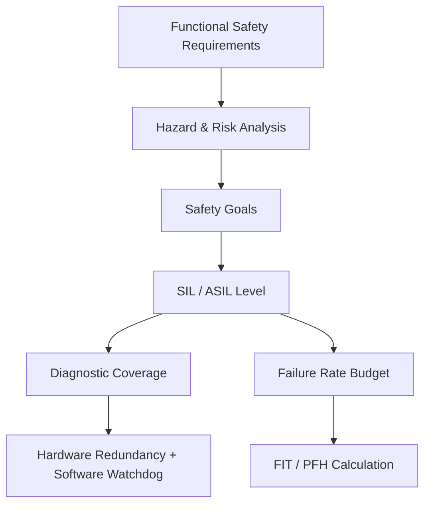

### 6.1.3 Centralized vs. Distributed vs. Edge-Cloud Collaboration

There are three main paradigms for the computing architecture of humanoid robots:

1. **Centralized**: All perception, decision-making, and control algorithms run on a single high-performance main computer, facilitating global optimization and development/debugging, but requiring high communication bandwidth, real-time performance, and single-point reliability.
2. **Distributed**: Low-latency control tasks are offloaded to joint drivers, IMU nodes, or dedicated vision front-ends, while the main computer handles high-level perception and planning. This reduces backbone network load and improves fault tolerance.
3. **Edge-Cloud Collaboration**: The robot completes real-time closed-loop tasks locally, while non-real-time large-scale training, map updates, or semantic understanding tasks are uploaded to the cloud. This requires handling network uncertainty and data privacy.

!!! note "Terminology Explanation: Centralized, Distributed, Edge Computing, Cloud Computing, Single Point of Failure"
    - **Centralized**: Computation and decision-making are concentrated on a single or a few nodes.
    - **Distributed**: Computation tasks are dispersed across multiple physical nodes, collaborating via a network.
    - **Edge Computing**: Computation is performed near the data source, reducing the amount of data uploaded to remote locations and latency.
    - **Cloud Computing**: Accessing elastic computing resources in remote data centers via a wide area network.
    - **Single Point of Failure**: A single component whose failure causes the entire system to fail.

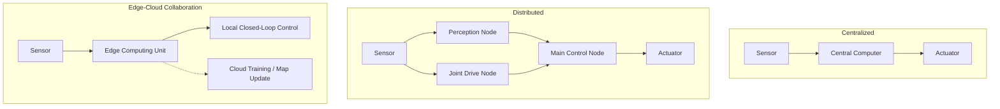

---

## 6.2 Processors and Accelerators

### 6.2.1 CPU: Architecture, Pipeline, Cache, Branch Prediction, SIMD/NEON/AVX, Memory Wall

The Central Processing Unit (CPU) is the core of general-purpose computing. Modern CPUs improve performance through Instruction-Level Parallelism (ILP), Thread-Level Parallelism (TLP), and Data-Level Parallelism (DLP).

!!! note "Terminology: CPU, Instruction Set Architecture, Microarchitecture, Pipeline, Superscalar, Out-of-Order Execution"
    - **CPU (Central Processing Unit)**: A processor that executes general-purpose instruction sequences, excelling at complex control flow and low-latency serial tasks.
    - **Instruction Set Architecture (ISA)**: The interface between software and hardware, defining instruction formats, registers, and addressing modes, e.g., x86, ARMv8, RISC-V.
    - **Microarchitecture**: The specific implementation of an ISA, determining performance, power consumption, and area.
    - **Pipeline**: Divides instruction execution into stages such as fetch, decode, execute, memory access, and write-back, allowing multiple instructions to overlap in execution.
    - **Superscalar**: A processor design capable of issuing multiple instructions per cycle.
    - **Out-of-Order Execution**: When an instruction is stalled due to data dependencies, subsequent independent instructions are executed first to improve pipeline utilization.

**Pipeline and CPI**. Ideally, a \(k\)-stage pipeline completes one instruction per cycle, with the clock cycle determined by the delay of the slowest stage. Actual performance is limited by CPI (Cycles Per Instruction):

$$
\text{Execution Time} = \text{Instruction Count} \times \text{CPI} \times \text{Clock Cycle}
$$

Branch instructions disrupt the pipeline. A branch predictor guesses the branch direction based on historical information; a misprediction requires flushing the pipeline, incurring a penalty.

**Cache Hierarchy**. CPUs use multiple cache levels (L1/L2/L3) to mitigate main memory access latency. Cache hits have access times on the order of 1–10 ns; misses accessing DRAM can reach 100 ns. The principle of locality includes temporal locality and spatial locality.

!!! note "Terminology: Cache, Hit, Miss, Locality, Cache Line, Cache Coherence"
    - **Cache**: A high-speed memory located between the CPU and main memory, storing copies of recently accessed data.
    - **Hit**: The required data is found in the cache; **Miss**: The data must be fetched from a slower level.
    - **Temporal Locality**: Recently accessed data is likely to be accessed again.
    - **Spatial Locality**: After accessing an address, nearby addresses are likely to be accessed.
    - **Cache Line**: The smallest unit of data transfer between the cache and main memory, typically 64 B.
    - **Cache Coherence**: A mechanism in multi-core systems ensuring a consistent view of the same memory address across different core caches.

**SIMD / NEON / AVX**. Single Instruction Multiple Data (SIMD) allows one instruction to operate on multiple data elements simultaneously. ARM NEON and x86 AVX/AVX-512 are typical SIMD extensions. For vector addition \(c_i = a_i + b_i\), SIMD can pack 4, 8, or even 16 floating-point numbers into a vector register for single-operation processing.

!!! note "Terminology: SIMD, Vector Register, NEON, AVX, Data-Level Parallelism"
    - **SIMD (Single Instruction Multiple Data)**: A parallel mode where one instruction processes multiple data elements simultaneously.
    - **Vector Register**: A wide register capable of holding multiple scalar data items, e.g., 128-bit NEON, 256-bit AVX, 512-bit AVX-512.
    - **NEON**: The SIMD/vector extension for the ARM architecture.
    - **AVX (Advanced Vector Extensions)**: The SIMD extension for Intel/AMD x86 processors.
    - **Data-Level Parallelism (DLP)**: A form of parallelism applying the same operation to a large number of data elements.

**Memory Wall**. Processor peak computing power grows much faster than improvements in memory bandwidth and latency, causing many applications to be limited by data movement rather than computation. Wulf and McKee introduced the "memory wall" concept in 1995, highlighting the widening performance gap between processors and DRAM.

**Amdahl's Law**. When accelerating a part of a system, the overall speedup is limited by the proportion of that part. Let the fraction of the workload that can be accelerated be \(f\), and the speedup for that part be \(S\). The overall speedup is:

$$
S_{\text{overall}} = \frac{1}{(1 - f) + \frac{f}{S}}
$$

If \(f = 0.5\) and \(S = 10\), the overall speedup is only about 1.82x. Amdahl's Law indicates that the benefit of improving only a single part has an upper limit; the entire computation chain must be optimized.

**Gustafson's Law**. For scalable problems, as the problem size increases, the parallel fraction \(f\) also increases, so the speedup can be approximated as \(S_{\text{overall}} \approx 1 - f + f \cdot S\). It emphasizes the scalability of parallel systems rather than the speedup for a fixed problem.

!!! note "Terminology: Amdahl's Law, Gustafson's Law, Speedup, Scalability, Serial Bottleneck"
    - **Amdahl's Law**: For a fixed problem size, the overall speedup is limited by the proportion of the workload that can be accelerated.
    - **Gustafson's Law**: For a scalable problem size, the speedup approaches linearity as the parallel fraction increases.
    - **Speedup**: The ratio of execution time before optimization to execution time after optimization.
    - **Scalability**: The ability of a system to maintain performance growth as resources increase.
    - **Serial Bottleneck**: The portion of a workload that cannot be parallelized, limiting overall performance.

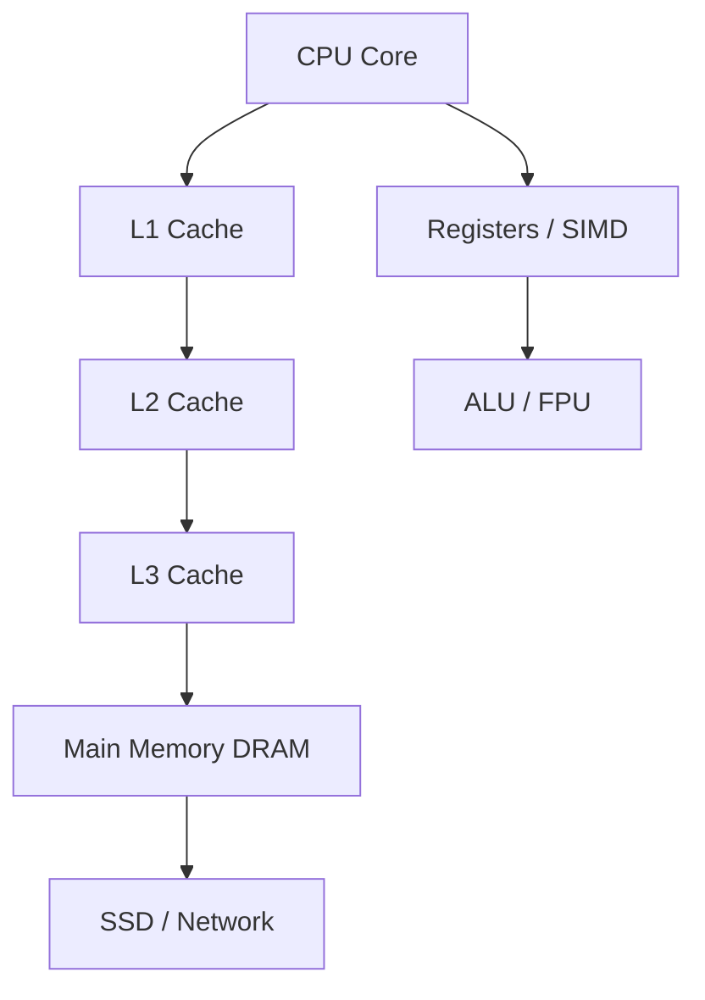

### 6.2.2 GPU: CUDA core / Tensor core / warp / shared memory / bandwidth / CUDA / OpenCL

Graphics Processing Units (GPUs), originally designed for graphics rendering, are now a mainstay for general-purpose parallel computing (GPGPU), particularly suited for matrix multiplication, convolution, deep learning, and point cloud processing.

!!! note "Terminology: GPU, CUDA core, Tensor core, SM, warp, Memory Bandwidth"
    - **GPU (Graphics Processing Unit)**: An array of highly parallel stream processors, excelling at regular data-parallel tasks.
    - **CUDA core**: The basic unit in NVIDIA GPUs for executing scalar/vector floating-point and integer operations.
    - **Tensor core**: Specialized hardware units in NVIDIA Volta and later architectures for matrix multiply-accumulate (MMA), supporting low-precision formats like FP16/INT8/BF16.
    - **SM (Streaming Multiprocessor)**: A compute cluster in NVIDIA GPUs comprising multiple CUDA cores, Tensor cores, registers, shared memory, and schedulers.
    - **warp**: An execution unit of 32 threads in NVIDIA GPUs; threads within the same warp execute in a SIMT (Single Instruction, Multiple Thread) fashion.
    - **Memory Bandwidth**: The amount of data the GPU's global memory (HBM/GDDR/LPDDR) can transfer per second, typically measured in GB/s.

GPUs employ the SIMT execution model: 32 threads in the same warp execute the same instruction but operate on different data. When threads diverge due to branches, execution must be serialized (branch divergence), reducing efficiency.

Shared memory is a high-speed programmable cache within an SM, with latency approximately 1/100th that of global memory. By loading data from global memory into shared memory and having threads collaborate on computation, reliance on bandwidth can be significantly reduced.

!!! note "Term Explanation: Global Memory, Shared Memory, Registers, Branch Divergence, CUDA, OpenCL"
    - **Global Memory**: High-capacity video memory accessible by all threads on the GPU, with high latency and high bandwidth.
    - **Shared Memory**: Fast on-chip storage shared by threads within the same thread block, manually manageable to optimize locality.
    - **Register**: The fastest storage private to each thread, limited in number by hardware.
    - **Branch Divergence**: When threads within the same warp take different branch paths, causing serial execution by hardware.
    - **CUDA (Compute Unified Device Architecture)**: NVIDIA's GPU parallel computing platform and programming model.
    - **OpenCL (Open Computing Language)**: A cross-vendor heterogeneous parallel programming framework.

The peak computational power \(P\) of a GPU is related to the number of CUDA cores \(N\), frequency \(f\), and operations per cycle per core \(o\):

$$
P = N \times f \times o
$$

For example, a GPU with 2048 CUDA cores and a frequency of 1.3 GHz, where each CUDA core can execute 2 FP32 FMA (fused multiply-add) operations per cycle, has a peak FP32 performance of approximately \(2048 \times 1.3 \times 2 \times 2 = 10.6\) TFLOPS.

**Coalesced Memory Access and Occupancy**. GPU global memory is accessed in units of transactions. When 32 threads in the same warp access consecutive addresses, the hardware can merge multiple accesses into a few transactions, significantly improving effective bandwidth. If the access pattern is scattered or misaligned, the number of transactions increases, reducing bandwidth utilization. Occupancy refers to the ratio of active warps to the maximum number of warps on each SM; high occupancy helps hide memory latency, but excessively high occupancy can lead to contention for registers or shared memory resources.

!!! note "Term Explanation: Coalesced Memory Access, Occupancy, Transaction, Latency Hiding, Resource Contention"
    - **Coalesced Memory Access**: Threads within the same warp access consecutive memory addresses, merged by hardware into efficient transactions.
    - **Occupancy**: The ratio of active warps on an SM to the maximum supported number.
    - **Transaction**: A unit of data transfer between the GPU and video memory.
    - **Latency Hiding**: Covering long-latency operations by switching to execute other warps.
    - **Resource Contention**: Performance degradation due to insufficient registers, shared memory, or cache.

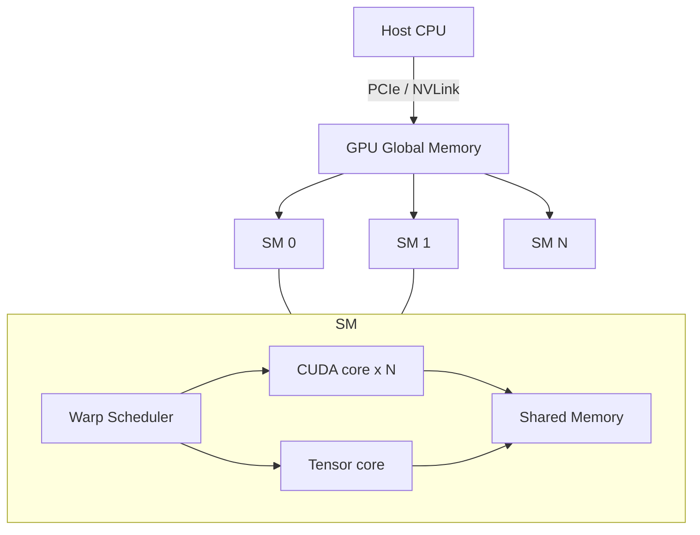

### 6.2.3 NPU / TPU / DSP: Systolic Array / MAC Array / Quantization / INT8 / FP16 / ONNX / TensorRT / TOPS/W

Neural Processing Units (NPUs) and similar accelerators are specifically optimized for deep learning inference, often far exceeding general-purpose CPUs/GPUs in energy efficiency (TOPS/W).

!!! note "Term Explanation: NPU, TPU, DSP, MAC, Systolic Array, Quantization, INT8, FP16"
    - **NPU (Neural Processing Unit)**: A processor specialized for accelerating neural network inference/training, typically integrated into SoCs.
    - **TPU (Tensor Processing Unit)**: A tensor accelerator developed by Google, renowned for its large-scale systolic array.
    - **DSP (Digital Signal Processor)**: A programmable processor optimized for digital signal processing, commonly used for audio, modem, and vision preprocessing.
    - **MAC (Multiply-Accumulate)**: The multiply-accumulate operation \(a \times b + c\), fundamental to matrix multiplication and convolution.
    - **Systolic Array**: A computing array where data flows between adjacent processing elements like a heartbeat, suitable for regular matrix operations.
    - **Quantization**: Mapping model weights and activations from high-precision floating-point (e.g., FP32) to low-precision integers (e.g., INT8) or half-precision floating-point (FP16/BF16) to reduce storage and computation.
    - **INT8 / FP16**: 8-bit integer and 16-bit half-precision floating-point, common low-precision formats for edge inference.

**Principle of Systolic Array**. Consider matrix multiplication \(C = A \times B\), where rows of \(A\) and columns of \(B\) flow sequentially through a 2D PE (Processing Element) array. Each PE completes one MAC and passes the partial sum to adjacent units. This design avoids frequent main memory access, resulting in high computational density.

!!! note "Term Explanation: PE, Partial Sum, Inference, Training, TOPS, TOPS/W"
    - **PE (Processing Element)**: The basic computational unit in an accelerator.
    - **Partial Sum**: The accumulated intermediate result of matrix multiplication.
    - **Inference**: Performing forward computation on new data using a trained model.
    - **Training**: The process of updating model weights via backpropagation.
    - **TOPS (Tera Operations Per Second)**: Trillions of operations per second, commonly used to measure NPU peak performance.
    - **TOPS/W**: TOPS per watt of power consumption, measuring energy efficiency.

**Quantization and Deployment**. When quantizing FP32 to INT8, a linear mapping is commonly used:

$$
x_{\text{int8}} = \text{round}\left(\frac{x_{\text{fp32}} - z}{s}\right)
$$

where \(s\) is the scale factor and \(z\) is the zero-point. After quantization, MAC operations in convolutional or fully connected layers can be performed using integer arithmetic, and the output is dequantized back to FP32 using the scale and zero-point.

**ONNX and TensorRT**. ONNX (Open Neural Network Exchange) is a cross-framework model representation format; TensorRT is NVIDIA's inference optimizer, capable of layer fusion, precision calibration, kernel auto-tuning, and dynamic tensor memory optimization.

!!! note "Term Explanation: ONNX, TensorRT, Layer Fusion, Kernel Auto-Tuning, Calibration"
    - **ONNX (Open Neural Network Exchange)**: An open deep learning model exchange format supporting interoperability between frameworks like PyTorch and TensorFlow.
    - **TensorRT**: NVIDIA's inference optimizer and runtime.
    - **Layer Fusion**: Merging multiple consecutive operators into a single kernel to reduce memory access and kernel launch overhead.
    - **Kernel Auto-Tuning**: Selecting the optimal CUDA kernel implementation based on the target GPU.
    - **Calibration**: The process of determining quantization parameters (scale, zero-point) using representative data.

**PTQ and QAT**. Post-Training Quantization (PTQ) directly quantizes a trained FP32 model, which is simple and fast but may lose accuracy; Quantization-Aware Training (QAT) simulates low-precision operations during training, allowing the network to adapt to quantization errors, typically achieving higher accuracy. For robot perception tasks sensitive to accuracy (e.g., depth estimation, pose estimation), QAT or mixed precision (retaining FP16/FP32 for some layers) is often adopted.

!!! note "Term Explanation: PTQ, QAT, Mixed Precision, Perception Training, Quantization Error"
    - **PTQ (Post-Training Quantization)**: Quantizing model weights and activations directly after training is complete.
    - **QAT (Quantization-Aware Training)**: Simulating the quantized forward pass during training, allowing the network to learn to adapt to quantization noise.
    - **Mixed Precision**: Using different numerical precisions for different parts of the model.
    - **Quantization Error**: The approximation error introduced by low-precision representation.

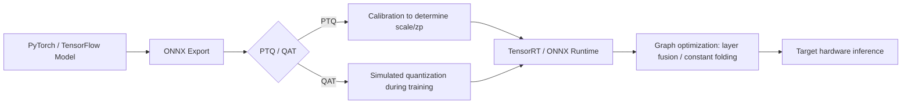

### 6.2.4 FPGA and Reconfigurable Computing

A Field-Programmable Gate Array (FPGA) consists of Configurable Logic Blocks (CLBs), DSP slices, block RAM, and programmable interconnects, allowing customization of data paths at the hardware level. Unlike the "instruction-driven" execution of CPUs/GPUs, FPGAs are "dataflow-driven": once configured, data flows along customized logic paths, producing deterministic results every clock cycle. This determinism makes them particularly suitable in robotics for microsecond-response interfaces, protocol conversion, and sensor synchronization.

!!! note "Terminology: FPGA, CLB, LUT, DSP slice, Block RAM, Reconfigurable Computing, HLS, SRAM-based FPGA"
    - **FPGA (Field-Programmable Gate Array)**: A digital circuit that can be configured on-site using hardware description languages or high-level synthesis tools.
    - **CLB (Configurable Logic Block)**: The basic unit in an FPGA for implementing combinational and sequential logic.
    - **LUT (Look-Up Table)**: Uses a lookup table to implement any Boolean function; the core of a CLB.
    - **DSP slice**: Hard-wired multiply-accumulate/multiplier units integrated into the FPGA.
    - **Block RAM (Block RAM)**: On-chip distributed SRAM in FPGAs for caching intermediate data.
    - **Reconfigurable computing**: A computing paradigm where hardware structure is dynamically changed according to the application.
    - **HLS (High-Level Synthesis)**: A design methodology that automatically synthesizes hardware circuits from C/C++/Python descriptions.
    - **SRAM-based FPGA**: Stores configuration bits via SRAM cells; configuration is lost on power-off and must be reloaded on power-up.

#### LUT, CLB, and Boolean Function Implementation

The logic foundation of an FPGA is the **LUT (Look-Up Table)**. An \(n\)-input LUT can store \(2^n\) output values, thus capable of implementing any Boolean function with \(n\) inputs and 1 output. For a 4-input LUT (4-LUT), the space of implementable functions is \(2^{2^4} = 65536\). Multiple LUTs combined through programmable interconnects can implement arbitrarily complex combinational logic.

!!! note "Terminology: Boolean function, truth table, combinational logic, sequential logic, flip-flop"
    - **Boolean function**: A discrete function whose inputs and outputs are only 0/1.
    - **Truth table**: A table listing all input combinations and their corresponding outputs.
    - **Combinational logic**: Logic whose output depends only on the current inputs, with no memory.
    - **Sequential logic**: Logic whose output depends on current inputs and historical states, requiring flip-flops to store states.
    - **Flip-flop**: A 1-bit storage cell triggered by a clock edge.

A CLB typically consists of several LUTs, flip-flops, and multiplexers. The output of a CLB can come either from the combinational logic result of the LUT or from the sequential output of the flip-flop. Therefore, any algorithm in an FPGA can be decomposed into: **combinational logic (LUT) + state registers (flip-flops) + interconnects**.

**Example: Implementing a full adder using LUTs**. A 1-bit full adder has 3 inputs (\(A, B, C_{in}\)) and 2 outputs (sum \(S\), carry \(C_{out}\)). Its Boolean expressions are:

$$
S = A \oplus B \oplus C_{in}
$$

$$
C_{out} = AB + (A \oplus B) C_{in}
$$

A single 3-input LUT can implement either the sum or the carry output. For multi-bit adders, multiple 1-bit full adders can be cascaded, or dedicated carry chain structures can be used for acceleration. Modern FPGAs have fast carry logic built into CLBs, allowing 32-bit adders to run at very high frequencies.

#### Timing Analysis: Setup/Hold, Clock Skew, and Maximum Frequency

FPGA designs must meet timing constraints; otherwise, metastability or functional errors may occur. The core of timing analysis is setup time and hold time.

!!! note "Terminology: Setup time, hold time, clock skew, critical path, Fmax, metastability"
    - **Setup time**: The minimum time input data must be stable before the clock edge of the flip-flop.
    - **Hold time**: The minimum time input data must remain stable after the clock edge of the flip-flop.
    - **Clock skew**: The difference in arrival times of the same clock signal at different flip-flops.
    - **Critical path**: The path with the longest combinational logic delay, determining the maximum operating frequency.
    - **Fmax**: The highest clock frequency at which the circuit can operate stably.
    - **Metastability**: A state where the output of a flip-flop is at an uncertain level when the input changes exactly at the sampling edge.

The setup time constraint can be written as:

$$
T_{clk} \ge t_{cq} + t_{comb} + t_{su} + t_{skew}
$$

where \(T_{clk}\) is the clock period, \(t_{cq}\) is the clock-to-output delay of the flip-flop, \(t_{comb}\) is the combinational logic delay, \(t_{su}\) is the setup time, and \(t_{skew}\) is the clock skew. From this, the maximum frequency is:

$$
F_{max} = \frac{1}{t_{cq} + t_{comb} + t_{su} + t_{skew}}
$$

The hold time constraint is:

$$
t_{cq} + t_{comb} \ge t_{hold} + t_{skew}
$$

Another important issue related to timing analysis is **Clock Domain Crossing (CDC)**. When a signal passes from one clock domain to another asynchronous clock domain, it must be handled by dual flip-flop synchronizers, FIFOs, or handshake protocols; otherwise, metastability can propagate to downstream logic. Common CDC scenarios in robotics include: sensor data sampled with an independent clock being transferred into the FPGA's main clock domain, or the FPGA communicating with an external CPU via AXI buses operating at different frequencies.

#### Resource Estimation and Power Model

The main resources of an FPGA include LUTs, flip-flops (FF), DSP slices, and BRAM. Resource usage should be estimated based on the algorithm before design. For example, an \(N\)-bit, \(M\)-tap FIR filter:

- Multiplication: 1 multiplication per tap. If coefficients are fixed, LUTs can be used; if coefficients are variable, DSP slices are typically used.
- Addition: \(M-1\) additions.
- Delay line: \(M\) registers of \(N\) bits each.

If \(N=16, M=32\), and each multiplication uses one DSP slice, a total of 32 DSP slices are needed; the delay line can be implemented using SRL (Shift Register LUT) or BRAM.

!!! note "Terminology: FIR filter, tap, delay line, SRL, AXI bus"
    - **FIR filter (Finite Impulse Response filter)**: A filter with a finite impulse response.
    - **Tap**: A coefficient and its corresponding delayed sample in an FIR filter.
    - **Delay line**: A shift register structure storing historical samples.
    - **SRL (Shift Register LUT)**: A shift register implemented using LUTs, saving FF resources.
    - **AXI bus (Advanced eXtensible Interface)**: A high-performance on-chip bus protocol defined by ARM.

The power consumption of an FPGA mainly consists of three parts:

1. **Static power**: Transistor leakage current, related to process technology, temperature, and configuration scale. Static power is non-negligible for processes of 28 nm and below.
2. **Dynamic power**: Energy consumed by logic transitions, approximately \(\alpha C V^2 f\), where \(\alpha\) is the activity factor, \(C\) is the load capacitance, \(V\) is the core voltage, and \(f\) is the clock frequency.
3. **I/O power**: Power consumed by high-speed interfaces (e.g., GTH/GTY transceivers) driving external loads.

For low-power joint controllers in humanoid robots, choosing low-power FPGAs (e.g., Lattice, Microchip PolarFire) or SoC FPGAs (e.g., AMD Zynq UltraScale+) can balance real-time performance and energy efficiency.

#### HLS Design Flow and Python Example

HLS converts algorithm descriptions (C/C++/Python) into RTL (Verilog/VHDL), enabling software engineers to utilize FPGAs. Typical HLS optimization directives include: pipeline, dataflow, loop unroll, array partition, and interface synthesis.

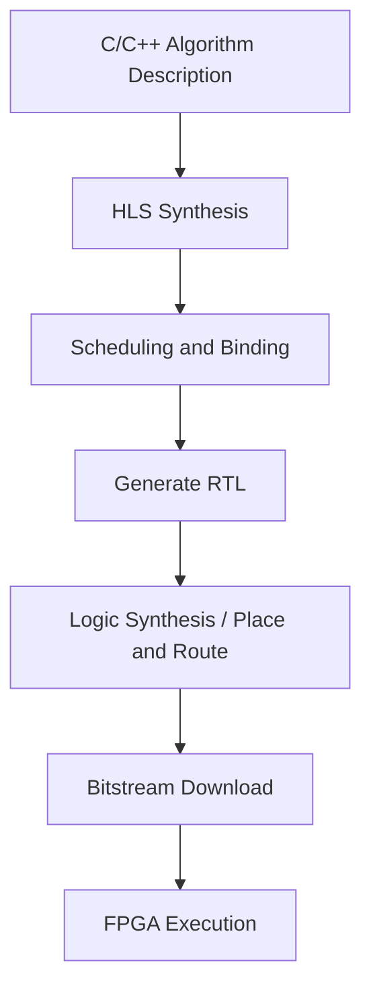

**Python Example: Bitwise Parallel CRC-8**. The code below does not directly generate an FPGA bitstream, but uses pure Python to demonstrate how to implement a CRC-8 calculation that can be completed in a single cycle on an FPGA using a lookup table and bitwise XOR, helping to understand LUT-friendly algorithm structures.

```python
"""
CRC-8 (SMBus polynomial x^8 + x^2 + x + 1) implemented with a lookup table.
This table-driven approach is FPGA-friendly: one 256x8 ROM lookup and one XOR.
"""
import numpy as np

POLY = 0x07  # x^8 + x^2 + x + 1

# Build 256-entry lookup table
crc_table = np.zeros(256, dtype=np.uint8)
for i in range(256):
    crc = i
    for _ in range(8):
        if crc & 0x80:
            crc = ((crc << 1) ^ POLY) & 0xFF
        else:
            crc = (crc << 1) & 0xFF
    crc_table[i] = crc

def crc8_table(data: bytes) -> int:
    """Byte-at-a-time CRC-8 using lookup table."""
    crc = 0x00
    for byte in data:
        idx = (crc ^ byte) & 0xFF
        crc = crc_table[idx]
    return crc

# Example: compute CRC-8 of a short sensor frame
frame = bytes([0x01, 0x02, 0x03, 0x04, 0x05])
print(f"CRC-8 of {frame.hex()} = 0x{crc8_table(frame):02X}")

# FPGA resource estimate for one byte/cycle implementation:
# - 256 x 8-bit LUT/BRAM lookup table
# - 8-bit XOR
# - 8-bit register for running CRC
```

In an FPGA, the `crc_table` above can be synthesized as 256×8 distributed RAM or BRAM; reading one input byte per clock cycle, looking up the table, and XORing with the current CRC enables a deterministic CRC calculation of one byte/cycle. For industrial buses like EtherCAT that require real-time CRC checking, this hard logic implementation is 1–2 orders of magnitude faster than software CRC.

The relationship between FPGA and GPU/NPU is not competitive but complementary: GPU/NPU are responsible for high computing power and high-throughput perception and policy inference; FPGA is responsible for deterministic interfaces, protocol conversion, and front-end preprocessing. The common "ARM + FPGA" combination in humanoid robots (e.g., AMD Kria, Zynq) leverages the FPGA to handle high-speed I/O while using the ARM to run Linux and ROS 2, achieving software-hardware collaboration. Detailed electrical characteristics of FPGA interfaces with various sensors can also be found in Chapter 5, Section 5.4.

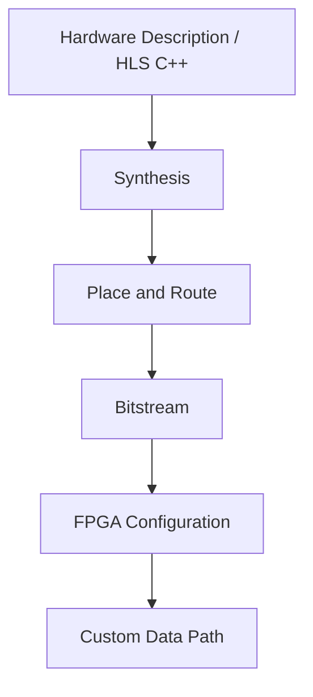

### 6.2.5 Typical Robot Computing Platform Comparison Table

The table below lists common embedded computing platforms in humanoid robots and autonomous machines. Performance data comes from public specifications; actual power consumption and computing power depend on specific configurations and cooling conditions.

| Platform | Architecture | CPU | GPU/NPU | AI Compute | Memory/Bandwidth | Typical Power | Applicable Level |
|---|---|---|---|---|---|---|---|
| NVIDIA Jetson AGX Orin 64GB | ARM + Ampere GPU | 12× Cortex-A78AE | 2048 CUDA + 64 Tensor | 275 TOPS (INT8) | 64 GB LPDDR5, 204.8 GB/s | 15–60 W | Perception/Decision Main Controller |
| NVIDIA Jetson AGX Xavier | ARM + Volta GPU | 8× Carmel | 512 CUDA + 64 Tensor | 32 TOPS | 32 GB LPDDR4x | 10–30 W | Perception/Decision Main Controller |
| Intel NUC 13 Pro | x86 | Core i5/i7 | Iris Xe / Optional Discrete GPU | Several TOPS | DDR4/DDR5 | 28–65 W | Development/High-End Main Controller |
| Qualcomm RB5 / QCS8550 | ARM | Kryo / Oryon | Adreno GPU + Hexagon DSP | 15–48 TOPS | LPDDR5 | 5–15 W | Perception Front-End |
| AMD Kria K26 | ARM + FPGA | 4× Cortex-A53 | Mali GPU + FPGA | FPGA Customizable | 4 GB DDR4 | 5–10 W | I/O and Real-Time Control |
| Apple M-series | ARM | High-Performance + Efficiency Cores | Neural Engine + GPU | 11–38 TOPS | Unified Memory | 10–100 W | Development/High-End Edge |
| Tesla FSD Chip | ARM + NPU | 12× Cortex-A72 | 2× NPU | 144 TOPS | LPDDR4 | ~36 W | Autonomous Driving/Robotics |
| Horizon Journey 5 | ARM + BPU | 8× Cortex-A55 | 2× BPU | 128 TOPS | LPDDR5 | 20–30 W | Autonomous Driving/Robotics |
| Rockchip RK3588 | ARM | 4× A76 + 4× A55 | Mali-G610 + 6 TOPS NPU | 6 TOPS | LPDDR4x/LPDDR5 | 5–10 W | Low-Cost Perception |

!!! note "Terminology Explanation: SoC, LPDDR, TOPS, TDP, Developer Kit, Carrier Board"
    - **SoC (System on Chip)**: Integrates all necessary system components such as CPU, GPU, NPU, I/O, memory controller, etc., on a single chip.
    - **LPDDR (Low-Power DDR)**: A low-power memory standard for mobile/embedded devices.
    - **TDP (Thermal Design Power)**: The thermal design power, representing the typical upper limit of power that the cooling system needs to handle.
    - **Developer Kit**: A complete development board including SoM, carrier board, heatsink, and power supply.
    - **Carrier Board**: A printed circuit board that hosts the SoM and provides peripheral interfaces.

Platform selection requires a trade-off between computing power, power consumption, heat dissipation, size, cost, ecosystem, and real-time performance. The head and torso of a humanoid robot typically deploy a Jetson AGX Orin or equivalent platform, while the joint layer uses MCU/FPGA for real-time control.

## 6.3 Perception Computing Tasks and Algorithm Implementation

### 6.3.1 Computational Graphs and Operators: Complexity of Convolution, Matrix Multiplication, Pooling, and Attention

Modern robotic perception systems are typically represented as computational graphs, where nodes are operators and edges are tensors. Understanding the computational complexity of key operators is fundamental for performance analysis and hardware selection.

!!! note "Terminology Explanation: Computational Graph, Operator, Tensor, FLOPs, Number of Parameters, Arithmetic Intensity"
    - **Computational graph**: A graph structure where nodes represent operations and edges represent data dependencies, describing the data flow of a neural network or algorithm.
    - **Operator**: A basic operation in the graph, such as convolution, matrix multiplication, ReLU, or softmax.
    - **Tensor**: A multi-dimensional array, the basic data structure in deep learning.
    - **FLOPs (Floating Point Operations)**: The number of floating-point operations, measuring computational workload.
    - **Number of parameters**: The total number of learnable weights in a model, determining storage and memory usage.
    - **Arithmetic intensity**: The number of operations performed per byte of memory accessed, a core variable in the Roofline model.

**Complexity of Convolution**. For an input feature map of size \(H \times W\), input channels \(C_{in}\), output channels \(C_{out}\), kernel size \(K \times K\), and output size \(H' \times W'\), the number of multiply-accumulate operations for convolution is:

$$
\text{FLOPs}_{\text{conv}} \approx 2 H' W' C_{out} K^2 C_{in}
$$

The factor of 2 accounts for one multiplication and one addition. Adjustments are needed when using stride, grouped convolution, or dilated convolution.

**Matrix Multiplication**. For matrix multiplication \(C = A B\), where \(A \in \mathbb{R}^{m \times k}\) and \(B \in \mathbb{R}^{k \times n}\), the FLOPs are:

$$
\text{FLOPs}_{\text{matmul}} = 2 m k n
$$

The computational cost of self-attention in Transformers is typically \(O(n^2 d)\), where \(n\) is the sequence length and \(d\) is the feature dimension.

**Complexity Analysis of Attention**. The standard scaled dot-product attention is computed as:

$$
\text{Attention}(Q, K, V) = \text{softmax}\left(\frac{Q K^T}{\sqrt{d_k}}\right) V
$$

where \(Q, K, V \in \mathbb{R}^{n \times d}\). Computing \(Q K^T\) requires \(2 n^2 d\) FLOPs, and the softmax and multiplication with \(V\) each require approximately \(O(n^2 d)\), resulting in a total computational cost of \(O(n^2 d)\). When \(n\) is large (e.g., long sequences in video or language models), the \(n^2\) term dominates computation and memory. Algorithms like FlashAttention reduce HBM read/write operations through tiled computation and memory access reordering, improving effective throughput under bandwidth-limited conditions.

**Pooling**. Max pooling or average pooling has no learnable parameters and primarily involves comparisons or summations, resulting in relatively low computational cost.

**Arithmetic Intensity**. Arithmetic intensity \(I\) is defined as:

$$
I = \frac{\text{FLOPs}}{\text{Bytes transferred}}
$$

In the Roofline model, if \(I\) is below the platform's ridge point, the application is memory bandwidth-bound; above the ridge point, it is compute-bound.

**Example: Arithmetic Intensity of a Convolutional Layer**. Consider a \(3 \times 3\) convolution with input \(H \times W = 112 \times 112\), \(C_{in} = 64\), \(C_{out} = 128\), and the same output size. The FLOPs are approximately \(2 \times 112^2 \times 128 \times 9 \times 64 \approx 1.85\) GFLOPs. If weights and input/output are each read once, the memory access is approximately \(112^2 \times 64 \times 4 + 3^2 \times 64 \times 128 \times 4 + 112^2 \times 128 \times 4 \approx 9.3\) MB. The arithmetic intensity \(I \approx 1.85 \times 10^9 / 9.3 \times 10^6 \approx 199\) FLOPs/Byte. The ridge point of the Jetson AGX Orin is approximately 1–3 FLOPs/Byte, so this convolutional layer is typically compute-bound; using very small batches or sparse memory access may shift it toward the bandwidth-limited region.

!!! note "Terminology Explanation: Batch, Sparse Access, Roofline Ridge Point, Compute-Bound, Memory-Bound"
    - **Batch**: The number of samples processed at once. Increasing the batch size typically improves data reuse.
    - **Sparse access**: Non-contiguous or random memory access patterns that reduce cache efficiency.
    - **Compute-bound**: Performance is determined by peak compute capacity.
    - **Memory-bound**: Performance is determined by memory bandwidth.

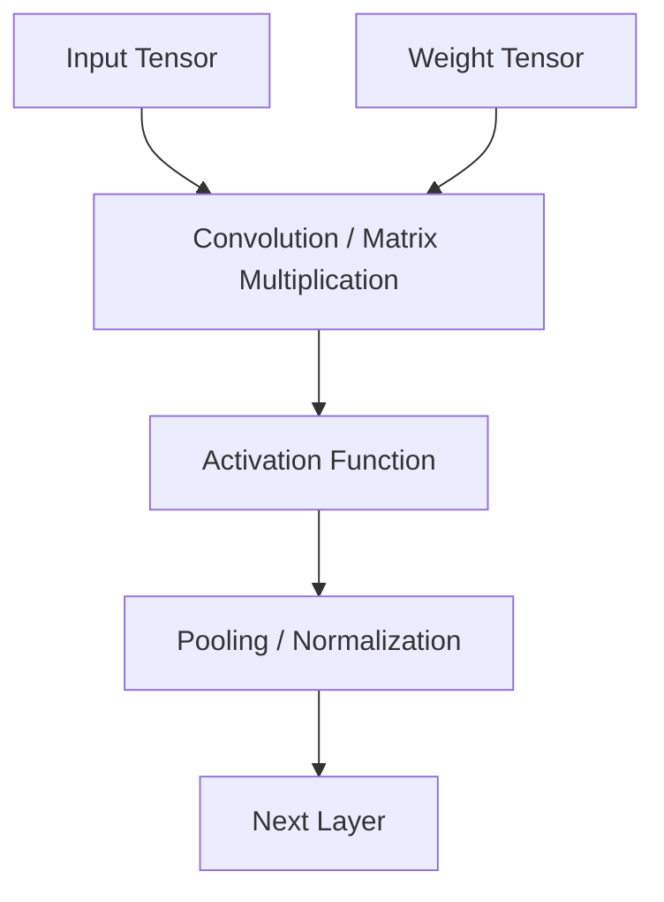

### 6.3.2 Binocular Stereo Matching Algorithm

Binocular stereo vision uses two cameras separated by a baseline \(B\) to simultaneously capture the same scene, recovering pixel depth through triangulation. The core steps include: camera calibration, epipolar geometry, stereo rectification, cost computation, cost aggregation, disparity computation and optimization, and depth inversion.

!!! note "Terminology Explanation: Binocular Stereo Vision, Baseline, Epipolar Geometry, Epipolar Constraint, Essential Matrix, Fundamental Matrix"
    - **Binocular stereo vision**: A visual method that recovers the 3D structure of a scene using images from two viewpoints.
    - **Baseline (B)**: The straight-line distance between the optical centers of two cameras.
    - **Epipolar geometry**: A theoretical framework describing the geometric relationship between two camera views.
    - **Epipolar constraint**: The projection of a point in space onto two images must lie on corresponding epipolar lines, reducing 2D matching to a 1D search.
    - **Essential matrix (E)**: A \(3 \times 3\) matrix describing the two-view geometric relationship in normalized camera coordinates, \(E = [\mathbf{t}]_\times R\).
    - **Fundamental matrix (F)**: Describes the two-view geometric relationship in pixel coordinates, including intrinsic parameters, \(F = K_2^{-T} E K_1^{-1}\).

Let the optical centers of the left and right cameras be \(O_L\) and \(O_R\), respectively, and the projections of a spatial point \(P\) onto the left and right images be \(p_L\) and \(p_R\). After calibration and epipolar rectification, the rows of the two images are aligned, with \(p_L = (x, y)\) and \(p_R = (x - d, y)\), where \(d\) is called **disparity**.

**Epipolar Geometry and Essential Matrix**. Assuming the two cameras have the same intrinsic parameters and are calibrated, the rotation and translation of the right camera relative to the left are \(R\) and \(t\), respectively. The normalized image coordinates \(x_L, x_R\) satisfy the epipolar constraint:

$$
x_R^T E x_L = 0, \quad E = [t]_\times R
$$

where \([t]_\times\) is the skew-symmetric matrix of the translation vector \(t\). Using pixel coordinates \(p_L = K x_L\) and \(p_R = K x_R\):

$$
p_R^T F p_L = 0, \quad F = K^{-T} E K^{-1}
$$

The fundamental matrix \(F\) constrains the 2D search to a 1D epipolar line, which is key to the efficiency of stereo matching.

**BM Block Matching Algorithm**. OpenCV's `StereoBM` performs SAD/SSD matching over the entire image using a fixed window, offering high speed but blurred edges. Its cost function is:

$$
C_{BM}(x, y, d) = \sum_{(u, v) \in W} |I_L(x+u, y+v) - I_R(x+u-d, y+v)|
$$

SGBM builds on this by introducing multi-path cost aggregation and the Birchfield-Tomasi sub-pixel cost, significantly improving performance in low-texture and edge regions.

!!! note "Terminology Explanation: Disparity, Stereo Rectification, Reprojection, Triangulation"
    - **Disparity**: The difference in horizontal coordinates of the same point on the left and right images, \(d = x_L - x_R\).
    - **Stereo rectification**: Transforming two images onto the same plane via homography so that corresponding epipolar lines are horizontally aligned.
    - **Reprojection**: The process of back-projecting image coordinates into 3D space.
    - **Triangulation**: A method for determining the position of a spatial point using the intersection of two or more rays.

**Relationship between depth and disparity.** According to similar triangles:

$$
Z = \frac{f B}{d}
$$

where \(Z\) is depth, \(f\) is the corrected focal length (in pixels), \(B\) is the baseline (in meters), and \(d\) is disparity (in pixels). This equation shows: the larger the disparity, the closer the depth; the larger the baseline, the higher the resolution for the same depth, but the larger the occlusion area.

**Cost computation.** Matching cost measures the similarity of corresponding pixels between left and right images. Common methods include:

- SAD (Sum of Absolute Differences): \(C_{SAD} = \sum |I_L - I_R|\)
- SSD (Sum of Squared Differences): \(C_{SSD} = \sum (I_L - I_R)^2\)
- NCC (Normalized Cross-Correlation)
- Mutual Information

!!! note "Terminology explanation: matching cost, SAD, SSD, NCC, mutual information"
    - **Matching cost**: A function that measures the similarity between two candidate pixels in the left and right images.
    - **SAD (Sum of Absolute Differences)**: The sum of absolute pixel differences, sensitive to illumination changes.
    - **SSD (Sum of Squared Differences)**: The sum of squared pixel differences, penalizing large differences more heavily.
    - **NCC (Normalized Cross-Correlation)**: A correlation measure more robust to brightness and contrast variations.
    - **Mutual information**: A similarity measure based on statistical dependence, used by Hirschmüller's SGM to handle radiometric differences.

**SGBM cost aggregation.** The Semi-Global Matching (SGM) proposed by Hirschmüller performs one-dimensional dynamic programming along multiple directions to approximate global optimization. OpenCV's SGBM is a variant that uses the Birchfield-Tomasi cost and block matching. The energy function is:

$$
E(D) = \sum_p C(p, D_p) + \sum_{q \in N_p} P_1 \cdot [|D_p - D_q| = 1] + \sum_{q \in N_p} P_2 \cdot [|D_p - D_q| > 1]
$$

The first term is the data cost, the second term penalizes small disparity jumps (preserving edges), and the third term penalizes large jumps (but is typically limited at image edges).

!!! note "Terminology explanation: SGBM, SGM, dynamic programming, cost aggregation, subpixel refinement"
    - **SGBM (Semi-Global Block Matching)**: The semi-global block matching algorithm implemented in OpenCV.
    - **SGM (Semi-Global Matching)**: A stereo matching method proposed by Hirschmüller that aggregates costs along one-dimensional paths in multiple directions.
    - **Dynamic programming**: A method that decomposes complex optimization problems into subproblems and saves intermediate results.
    - **Cost aggregation**: Accumulating matching costs over local neighborhoods or paths to improve robustness.
    - **Subpixel refinement**: Fitting a parabola or performing local optimization around integer disparities to obtain more precise floating-point disparities.

**Python implementation example.** The following code demonstrates stereo rectification, SGBM disparity computation, conversion to depth map, and optional WLS filtering using OpenCV.

```python
import cv2
import numpy as np

# 1. Read left and right images (calibrated / known camera intrinsics and extrinsics)
imgL = cv2.imread('left.png', cv2.IMREAD_GRAYSCALE)
imgR = cv2.imread('right.png', cv2.IMREAD_GRAYSCALE)

# 2. Camera intrinsics (example values, actual values must be obtained through calibration)
K = np.array([[700.0, 0.0, 320.0],
              [0.0, 700.0, 240.0],
              [0.0, 0.0, 1.0]])
D = np.zeros((4, 1))  # Distortion coefficients
image_size = (640, 480)

# 3. Stereo rectification: compute rectification transformation matrices
# R, T are the rotation and translation of the right camera relative to the left camera (obtained from calibration or stereo calibration)
R = np.eye(3)
T = np.array([[0.12]])  # Baseline 12 cm
R1, R2, P1, P2, Q, roi1, roi2 = cv2.stereoRectify(
    K, D, K, D, image_size, R, T,
    flags=cv2.CALIB_ZERO_DISPARITY, alpha=0
)

# 4. Generate rectification maps
map1x, map1y = cv2.initUndistortRectifyMap(K, D, R1, P1, image_size, cv2.CV_32FC1)
map2x, map2y = cv2.initUndistortRectifyMap(K, D, R2, P2, image_size, cv2.CV_32FC1)

rectL = cv2.remap(imgL, map1x, map1y, cv2.INTER_LINEAR)
rectR = cv2.remap(imgR, map2x, map2y, cv2.INTER_LINEAR)

# 5. SGBM parameter settings
sgbm = cv2.StereoSGBM_create(
    minDisparity=0,
    numDisparities=128,        # Must be a multiple of 16
    blockSize=5,
    P1=8 * 3 * 5 ** 2,         # Penalty for small disparity changes
    P2=32 * 3 * 5 ** 2,        # Penalty for large disparity changes
    disp12MaxDiff=1,
    uniquenessRatio=10,
    speckleWindowSize=100,
    speckleRange=32,
    mode=cv2.STEREO_SGBM_MODE_SGBM_3WAY
)

# 6. Compute disparity map (16-bit fixed point, actual value needs to be divided by 16)
disparity = sgbm.compute(rectL, rectR).astype(np.float32) / 16.0

# 7. Subpixel refinement (optional): fitting a parabola around integer disparities can further improve accuracy
# disparity is already the result of internal subpixel processing in SGBM

# 8. Disparity to depth: Z = f * B / d
# The Q matrix is generated by stereoRectify; reprojectImageTo3D can directly obtain (X, Y, Z)
points_3d = cv2.reprojectImageTo3D(disparity, Q)
# Or manual calculation
f = P1[0, 0]      # Rectified focal length (pixels)
b = abs(T[0])     # Baseline (meters)
with np.errstate(divide='ignore'):
    depth = (f * b) / disparity
depth[disparity <= 0] = 0  # Set invalid disparities to zero

# 9. WLS filtering (optional): requires the right view as reference
right_matcher = cv2.ximgproc.createRightMatcher(sgbm)
wls = cv2.ximgproc.createDisparityWLSFilter(matcher_left=sgbm)
wls.setLambda(8000)
wls.setSigmaColor(1.5)
disparity_right = right_matcher.compute(rectR, rectL).astype(np.float32) / 16.0
filtered_disp = wls.filter(disparity, rectL, None, disparity_right)
```

In the above code, `cv2.stereoRectify` uses the intrinsics \(K\), distortion \(D\), rotation \(R\), and translation \(T\) to compute the rectified projection matrices \(P_1, P_2\) and the reprojection matrix \(Q\). Elements such as \(Q[2, 3]\) and \(Q[3, 2]\) encode the focal length and baseline information. Invalid values in the disparity map are typically set to negative values or zero and should be excluded when computing depth.


### 6.3.3 Complete Python workflow for camera calibration

Camera calibration is the process of determining camera intrinsics (focal length, principal point, distortion coefficients) and extrinsics (camera pose relative to the world coordinate system). The method proposed by Zhang in 2000 uses multiple views of a checkerboard pattern, combining closed-form solutions and nonlinear optimization, and is currently the most widely used calibration method.

!!! note "Term Explanation: Camera Calibration, Intrinsic Parameters, Extrinsic Parameters, Distortion, Principal Point, Focal Length, Checkerboard, Zhang's Method"
    - **Camera Calibration**: The process of estimating the geometric parameters of a camera's imaging system.
    - **Intrinsic Parameters**: Parameters determined by the camera itself, including focal lengths \(f_x, f_y\), principal point \(c_x, c_y\), and distortion coefficients.
    - **Extrinsic Parameters**: The rotation \(R\) and translation \(t\) of the camera coordinate system relative to the world coordinate system.
    - **Distortion**: Geometric deformation of the image caused by the actual lens deviating from the ideal pinhole model, including radial distortion and tangential distortion.
    - **Principal Point**: The intersection of the optical axis with the image plane, ideally at the image center.
    - **Checkerboard**: A calibration pattern with alternating black and white squares, whose corners are easy to detect automatically.
    - **Zhang's Method**: A calibration method that uses multiple views of a checkerboard, first solving the homography matrix in closed form, then nonlinearly optimizing the reprojection error.

**Pinhole Camera Model**. A spatial point \(P = [X, Y, Z]^T\) is projected onto the image plane:

$$
s \begin{bmatrix} u \\ v \\ 1 \end{bmatrix}
= K [R \ | \ t]
\begin{bmatrix} X \\ Y \\ Z \\ 1 \end{bmatrix}
$$

where \(K\) is the intrinsic matrix:

$$
K = \begin{bmatrix} f_x & 0 & c_x \\ 0 & f_y & c_y \\ 0 & 0 & 1 \end{bmatrix}
$$

**Distortion Model**. The commonly used Brown-Conrady model includes radial distortion and tangential distortion:

$$
x_{\text{distorted}} = x(1 + k_1 r^2 + k_2 r^4 + k_3 r^6) + 2 p_1 x y + p_2(r^2 + 2 x^2)
$$
$$
y_{\text{distorted}} = y(1 + k_1 r^2 + k_2 r^4 + k_3 r^6) + p_1(r^2 + 2 y^2) + 2 p_2 x y
$$

where \(r^2 = x^2 + y^2\), and \((x, y)\) are normalized image coordinates.

!!! note "Term Explanation: Radial Distortion, Tangential Distortion, Brown-Conrady Model, Reprojection Error"
    - **Radial Distortion**: Image points deviate radially due to lens curvature, manifesting as "barrel" or "pincushion" distortion.
    - **Tangential Distortion**: Image points deviate tangentially due to the lens not being parallel to the sensor.
    - **Brown-Conrady Model**: A classic polynomial model describing radial and tangential distortion.
    - **Reprojection Error**: The pixel distance between a 3D point projected onto the image plane using estimated parameters and its detected 2D point.

**Complete Python Calibration Workflow**. The following code demonstrates checkerboard corner detection, calibration, error evaluation, saving/loading parameters, and undistortion.

```python
import cv2
import numpy as np
import glob

# 1. Checkerboard parameters: number of inner corners (width x height) and physical square size
CHECKERBOARD = (9, 6)
SQUARE_SIZE = 0.025  # Each square side length 25 mm

# 2. Prepare 3D world coordinates: corner coordinates on the Z=0 plane
objp = np.zeros((CHECKERBOARD[0] * CHECKERBOARD[1], 3), np.float32)
objp[:, :2] = np.mgrid[0:CHECKERBOARD[0], 0:CHECKERBOARD[1]].T.reshape(-1, 2)
objp *= SQUARE_SIZE

objpoints = []  # List of 3D points
imgpoints = []  # List of 2D image points

# 3. Read all calibration images
calibration_images = sorted(glob.glob('calib_*.png'))

for fname in calibration_images:
    img = cv2.imread(fname)
    gray = cv2.cvtColor(img, cv2.COLOR_BGR2GRAY)

    # 4. Find checkerboard corners
    ret, corners = cv2.findChessboardCorners(
        gray, CHECKERBOARD,
        flags=cv2.CALIB_CB_ADAPTIVE_THRESH +
              cv2.CALIB_CB_NORMALIZE_IMAGE +
              cv2.CALIB_CB_FAST_CHECK
    )

    if ret:
        # 5. Sub-pixel corner refinement
        criteria = (cv2.TERM_CRITERIA_EPS + cv2.TERM_CRITERIA_MAX_ITER, 30, 0.001)
        corners2 = cv2.cornerSubPix(gray, corners, (11, 11), (-1, -1), criteria)

        objpoints.append(objp)
        imgpoints.append(corners2)

        # Visualization (optional)
        cv2.drawChessboardCorners(img, CHECKERBOARD, corners2, ret)
        cv2.imshow('Corners', img)
        cv2.waitKey(100)

cv2.destroyAllWindows()

# 6. Camera calibration
ret, K, D, rvecs, tvecs = cv2.calibrateCamera(
    objpoints, imgpoints, gray.shape[::-1], None, None
)

print("Calibration results:")
print("Reprojection error:", ret)
print("Intrinsic matrix K:\n", K)
print("Distortion coefficients D:\n", D)

# 7. Calculate reprojection error per image
mean_error = 0
for i in range(len(objpoints)):
    imgpoints2, _ = cv2.projectPoints(
        objpoints[i], rvecs[i], tvecs[i], K, D
    )
    error = cv2.norm(imgpoints[i], imgpoints2, cv2.NORM_L2) / len(imgpoints2)
    mean_error += error
print("Average reprojection error (pixels):", mean_error / len(objpoints))

# 8. Save calibration results
np.savez('camera_calibration.npz', K=K, D=D, rvecs=rvecs, tvecs=tvecs)

# 9. Load calibration results
data = np.load('camera_calibration.npz')
K_loaded = data['K']
D_loaded = data['D']

# 10. Undistortion example
img = cv2.imread('sample.png')
undistorted = cv2.undistort(img, K_loaded, D_loaded)

# Or use optimal new camera matrix to retain more valid pixels
h, w = img.shape[:2]
optimal_K, roi = cv2.getOptimalNewCameraMatrix(
    K_loaded, D_loaded, (w, h), 1, (w, h)
)
undistorted_opt = cv2.undistort(img, K_loaded, D_loaded, None, optimal_K)
```

The key indicator of calibration quality is the reprojection error. For consumer-grade cameras, the error should be within 0.3 pixels; for high-precision measurements, it should be below 0.1 pixels. If the error is too large, possible causes include: inaccurate corner detection, poor checkerboard flatness, insufficient coverage of calibration poses, image blur, or uneven lighting.

**Stereo Camera Calibration and Stereo Rectification**. For a stereo system, in addition to calibrating the left and right cameras individually, the relative pose \(R, T\) between the two cameras must be estimated. OpenCV provides `cv2.stereoCalibrate`, which simultaneously optimizes the left and right intrinsics, distortion, and relative pose to minimize the reprojection error of corresponding corners in the left and right images. After calibration, stereo rectification can be performed:

```python
# Stereo calibration: need to simultaneously capture images of the same chessboard from left and right cameras
ret, K1, D1, K2, D2, R, T, E, F = cv2.stereoCalibrate(
    objpoints, left_imgpoints, right_imgpoints,
    K1, D1, K2, D2, image_size,
    flags=cv2.CALIB_FIX_INTRINSIC
)

# Stereo rectification
R1, R2, P1, P2, Q, roi1, roi2 = cv2.stereoRectify(
    K1, D1, K2, D2, image_size, R, T,
    flags=cv2.CALIB_ZERO_DISPARITY, alpha=0
)
```

Here, \(F\) is the fundamental matrix, \(E\) is the essential matrix, and \(Q\) is the reprojection matrix. After stereo rectification, corresponding points in the left and right images have the same \(y\) coordinate, thereby reducing the two-dimensional search of stereo matching to a one-dimensional search.

!!! note "Term explanation: Stereo calibration, stereo rectification, reprojection matrix, StereoCalibrate"
    - **Stereo calibration**: The process of simultaneously estimating the intrinsic parameters of two cameras and their relative pose.
    - **Reprojection matrix (Q)**: A 4×4 matrix that converts a disparity map into a 3D point cloud.
    - **StereoCalibrate**: The OpenCV function used for binocular camera calibration.

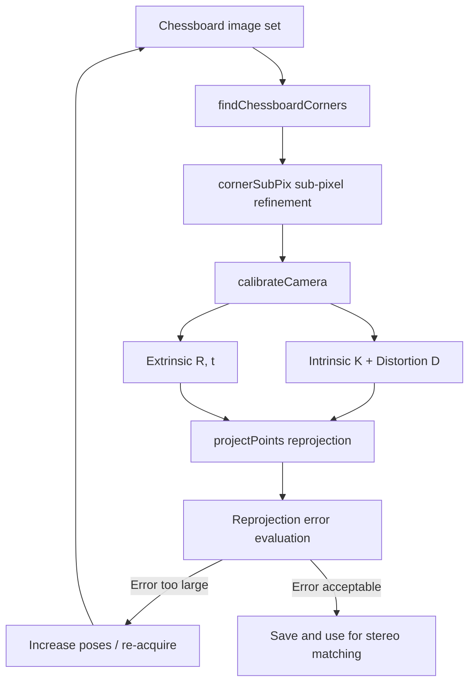

### 6.3.4 LiDAR Point Cloud Deskewing Example

During a single scan of a mechanical rotating LiDAR, the sensor itself moves with the robot, causing motion distortion in the point cloud. Deskewing requires transforming each point from the sensor coordinate system at the time of acquisition to a unified reference coordinate system based on its precise timestamp.

!!! note "Term explanation: LiDAR, point cloud, motion distortion, deskewing, timestamp, scan frame, IMU"
    - **LiDAR (Light Detection and Ranging)**: A sensor that measures distance by emitting laser light and receiving the reflected signal.
    - **Point cloud**: A dataset composed of a large number of 3D coordinate points, often containing information such as intensity, timestamp, and ring number.
    - **Motion distortion**: The phenomenon where different points in a single frame are in different coordinate systems due to continuous acquisition while the sensor or target is moving.
    - **Deskewing**: The process of transforming each point to a unified reference coordinate system based on timestamps and motion estimation.
    - **Timestamp**: A time label recording the moment of data acquisition.
    - **IMU (Inertial Measurement Unit)**: An inertial sensor that measures three-axis acceleration and three-axis angular velocity.

Assume a LiDAR scan frame spans from \(t_0\) to \(t_1\), and the reference time is chosen as \(t_{ref}\). For any point \(p_i\), its timestamp is \(t_i\), and its coordinates in the LiDAR local coordinate system are \(p_i^{L(t_i)}\). The sensor's pose transformation \(T_{ref}^{t_i} = (R, t)\) from \(t_i\) relative to \(t_{ref}\) needs to be estimated, then:

$$
p_i^{ref} = R \, p_i^{L(t_i)} + t
$$

If the IMU or odometry provides poses at discrete times, linear interpolation can be applied to the timestamp of each point to obtain the transformation.

!!! note "Term explanation: Pose, transformation matrix, SE(3), rotation matrix, quaternion, interpolation"
    - **Pose**: The position and orientation of an object in space, often represented by \(T = (R, t)\).
    - **Transformation matrix**: A \(4 \times 4\) matrix representing both rotation and translation.
    - **SE(3)**: The three-dimensional Euclidean transformation group, i.e., the mathematical set of rigid body transformations.
    - **Quaternion**: A compact mathematical representation of rotation that avoids gimbal lock.
    - **Interpolation**: A method for estimating intermediate values from known discrete samples.

**Python Implementation Example**. The following code assumes that the relative timestamp (between 0 and 1) for each point is known, and uses spherical linear interpolation (Slerp) and linear translation interpolation from IMU/odometry poses.

```python
import numpy as np
from scipy.spatial.transform import Slerp, Rotation as R

# Assume a LiDAR point cloud frame: N x 4, columns are [x, y, z, relative_time]
# relative_time is in [0, 1], 0 indicates frame start, 1 indicates frame end
points = np.loadtxt('lidar_scan.txt')  # N x 4
xyz = points[:, :3]
times = points[:, 3]

# Known poses at frame start and end (relative to reference coordinate system, e.g., frame midpoint)
# T_start, T_end are 4x4 homogeneous transformation matrices
T_start = np.eye(4)
T_end = np.eye(4)
T_end[:3, :3] = R.from_euler('z', 0.05).as_matrix()  # Rotation around Z by 0.05 rad
T_end[:3, 3] = np.array([0.10, 0.02, 0.005])           # Translation 10 cm

# Extract rotation and translation
R_start = T_start[:3, :3]
t_start = T_start[:3, 3]
R_end = T_end[:3, :3]
t_end = T_end[:3, 3]

# Build keyframe rotation interpolator
key_rots = R.from_matrix([R_start, R_end])
key_times = [0.0, 1.0]
slerp = Slerp(key_times, key_rots)

# Transform each point to the reference time (here, frame midpoint t=0.5)
ref_time = 0.5
deskewed = np.zeros_like(xyz)

for i in range(len(xyz)):
    tau = times[i]
    # Interpolate to get pose at time t_i
    Ri = slerp([tau]).as_matrix()[0]
    ti = (1 - tau) * t_start + tau * t_end
    T_tau = np.eye(4)
    T_tau[:3, :3] = Ri
    T_tau[:3, 3] = ti

    # Compute relative transformation from t_i to reference time t_ref
    T_ref = np.eye(4)
    T_ref[:3, :3] = slerp([ref_time]).as_matrix()[0]
    T_ref[:3, 3] = (1 - ref_time) * t_start + ref_time * t_end

    T_rel = T_ref @ np.linalg.inv(T_tau)
    p = np.append(xyz[i], 1.0)
    p_ref = T_rel @ p
    deskewed[i] = p_ref[:3]

# If transformation to robot base or world coordinate system is needed, left-multiply by LiDAR extrinsic T_lidar_to_base
# deskewed_base = (T_lidar_to_base @ np.hstack([deskewed, np.ones((N,1))]).T).T[:, :3]

print("Original points:", len(xyz))
print("Deskewed points:", len(deskewed))
```

For denser pose estimation, the frame can be processed in segments: divide one frame into several sub-frames based on time, and use IMU integration to obtain relative poses for each sub-frame. A common approach is to construct a continuous function from timestamp to pose, such as B-spline or linear interpolation.
```

!!! note "Term Explanation: IMU Integration, B-spline, Extrinsic Parameter, LiDAR Frame, Base Frame"
    - **IMU Integration**: Estimating short-term pose changes by integrating acceleration to obtain velocity and integrating angular velocity to obtain attitude.
    - **B-spline**: A piecewise polynomial used to represent continuous-time trajectories, suitable for continuous-time SLAM.
    - **Extrinsic Parameter**: The fixed transformation from the LiDAR coordinate system to the robot base coordinate system.
    - **LiDAR Frame**: A local coordinate system with the LiDAR optical center as the origin.
    - **Base Frame**: The reference coordinate system of the robot chassis or body.

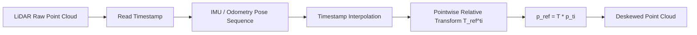

### 6.3.5 Introduction to Visual Odometry / Feature Matching

Visual Odometry (VO) estimates camera motion from consecutive images. Classic methods include feature-based methods (e.g., ORB, SIFT) and direct methods (e.g., LK optical flow, DSO). The core mathematical problem of VO is: given corresponding points in two or more images, recover the relative pose between cameras and the 3D positions of these points. This problem traces back to the multi-view geometry theory of photogrammetry and computer vision.

!!! note "Term Explanation: Visual Odometry, SLAM, Feature Point, Descriptor, Matching, RANSAC, Essential Matrix"
    - **Visual Odometry (VO)**: An algorithm that estimates the camera's own motion using visual information.
    - **SLAM (Simultaneous Localization and Mapping)**: Simultaneously estimating one's own position and constructing a map of the environment.
    - **Feature Point**: A local point in an image with saliency and repeatability, such as corners and blobs.
    - **Descriptor**: A vector representation around a feature point, used for matching between different images.
    - **RANSAC (Random Sample Consensus)**: A robust estimation method that eliminates outliers through random sampling and consensus testing.
    - **Essential Matrix / Fundamental Matrix**: See definition in Section 6.3.2.

#### Feature Detection, Descriptor, and Matching

The performance of feature-based methods depends on three stages: detection, description, and matching.

**Detection**. Good feature points should be stably detectable under different viewpoints, illumination, and scales. The commonly used Harris corner response function is:

$$
R = \det(M) - k \cdot \mathrm{tr}(M)^2
$$

where \(M\) is the image gradient autocorrelation matrix (structure tensor), and \(k\) is an empirical constant (usually 0.04–0.06). When \(R\) is greater than a threshold and is a local maximum, the point is marked as a corner. ORB builds upon this by incorporating the FAST detector and orientation estimation to achieve rotation invariance.

!!! note "Term Explanation: Harris Corner, Structure Tensor, FAST, Scale Invariant, Rotation Invariant"
    - **Harris Corner**: A corner detected based on the image gradient autocorrelation matrix.
    - **Structure Tensor**: A 2×2 matrix formed by the outer product of image gradients, describing the direction of local intensity variation.
    - **FAST (Features from Accelerated Segment Test)**: A method for fast corner detection by comparing the brightness of pixels on a circle.
    - **Scale Invariant**: Feature detection and description remain stable under image scaling.
    - **Rotation Invariant**: Feature description remains stable under image rotation.

**Descriptor**. The SIFT descriptor uses a 128-dimensional gradient histogram vector, which is robust to scale, rotation, and illumination changes but computationally expensive. ORB uses the binary BRIEF descriptor, generating a 256-bit vector by comparing pixel pairs, allowing fast matching using Hamming distance. A descriptor can be seen as mapping a local image patch to a high-dimensional feature space; ideally, descriptors of the same point have small distances, while those of different points have large distances.

**Matching**. The most common method is nearest neighbor search: for each descriptor in the first image, find the nearest descriptor in the second image. To improve robustness, the **Nearest Neighbor Distance Ratio (NN ratio)** is often used: a match is accepted only if the ratio of the nearest neighbor distance \(d_1\) to the second nearest neighbor distance \(d_2\) is below a threshold (e.g., 0.7–0.8). The rationale is that if both the nearest and second nearest neighbors are close, the descriptor's discriminability is insufficient, making the match unreliable.

#### Eight-Point Algorithm and Essential Matrix Estimation

For calibrated cameras, two-view geometry can be described by the essential matrix \(E\). Let the coordinates of a spatial point \(P\) in two normalized images be \(\mathbf{x}_1, \mathbf{x}_2\) (3×1 homogeneous coordinates). The epipolar constraint is:

$$
\mathbf{x}_2^T E \mathbf{x}_1 = 0
$$

The essential matrix \(E = [\mathbf{t}]_\times R\) has 5 degrees of freedom (3 rotation + 3 translation - 1 scale), but due to its singular value constraints, it is typically solved linearly using 8 pairs of matching points, known as the **Eight-Point Algorithm**.

Expanding \(E\) column-wise into a 9-dimensional vector \(\mathbf{e}\), each pair of matching points provides one linear equation:

$$
\begin{bmatrix}
x_2 x_1 & x_2 y_1 & x_2 & y_2 x_1 & y_2 y_1 & y_2 & x_1 & y_1 & 1
\end{bmatrix} \mathbf{e} = 0
$$

where \(x_i, y_i\) are normalized coordinates. Eight pairs of points form an \(8 \times 9\) matrix, and \(\mathbf{e}\) is its null space. With more points, SVD can be used to find a least-squares solution. The solved \(E\) usually does not satisfy the intrinsic constraints of the essential matrix (two equal non-zero singular values), requiring another SVD to enforce equal singular values before reconstruction.

!!! note "Term Explanation: Eight-Point Algorithm, Epipolar Constraint, Normalized Coordinates, SVD, Null Space"
    - **Eight-Point Algorithm**: A method for linearly estimating the essential matrix or fundamental matrix using 8 pairs of matching points.
    - **Epipolar Constraint**: The geometric relationship satisfied by corresponding points in two views.
    - **Normalized Coordinates**: Image coordinates transformed by the inverse of the intrinsic parameter matrix.
    - **SVD (Singular Value Decomposition)**: A decomposition used for solving linear least-squares problems.
    - **Null Space**: The input space that maps to the zero vector under a matrix transformation.

#### RANSAC Robust Estimation

Actual matching often contains many false matches. RANSAC estimates the model and eliminates outliers through random sampling and consensus testing. Let the inlier ratio be \(\varepsilon\), and each sample takes \(n\) points (for the eight-point algorithm \(n=8\)). The number of iterations \(k\) required to sample at least one all-inlier set with probability \(p\) is:

$$
k = \frac{\ln(1 - p)}{\ln(1 - \varepsilon^n)}
$$

For example, if the inlier ratio \(\varepsilon = 0.5\) and the desired success rate \(p = 0.99\), the eight-point algorithm requires:

$$
k = \frac{\ln(0.01)}{\ln(1 - 0.5^8)} \approx 117
$$

That is about 117 random samples. If the inlier ratio drops to 30%, about 766 iterations are needed. This shows that improving front-end matching quality (e.g., using ratio test, cross-validation) can significantly reduce RANSAC computation.

!!! note "Term Explanation: Inlier, Outlier, Inlier Ratio, RANSAC Iterations, Model Consensus"
    - **Inlier**: A data point that conforms to the geometric model.
    - **Outlier**: An anomalous data point that does not conform to the model.
    - **Inlier Ratio**: The proportion of inliers among all data points.
    - **RANSAC Iterations**: The number of random samples required to achieve a confidence level.
    - **Model Consensus**: The error of data points to the model is below a threshold.

#### Pose Recovery from Essential Matrix and Triangulation

After estimating \(E\), 4 possible sets of \((R, \mathbf{t})\) can be obtained via SVD decomposition. By triangulating 3D points and checking whether their depths are positive, the correct pose can be uniquely determined.

For two camera projection matrices \(P_1 = K[I \ | \ \mathbf{0}]\) and \(P_2 = K[R \ | \ \mathbf{t}]\), the projections of a spatial point \(X\) onto the two images are \(\mathbf{x}_1 = P_1 X\) and \(\mathbf{x}_2 = P_2 X\). Triangulation solves for \(X\) satisfying both projection constraints. Due to noise, the two rays usually do not intersect, and it can be solved using **Linear Triangulation** or **Nonlinear Bundle Adjustment**.

!!! note "Term Explanation: Triangulation, Bundle Adjustment, Reprojection Error, Positive Depth Constraint"
    - **Triangulation**: Recovering 3D point positions from multi-view projections.
    - **Bundle Adjustment (BA)**: Simultaneously optimizing camera poses and 3D points to minimize reprojection error.
    - **Reprojection Error**: The pixel distance between the projection of a 3D point onto the image and its observed point.
    - **Positive Depth Constraint**: The constraint that a 3D point must lie in front of the camera.

#### Python Example: Eight-Point Algorithm + RANSAC + Triangulation

The following code demonstrates a simplified VO frontend: estimating the essential matrix using the normalized 8-point algorithm, removing outliers with RANSAC, then decomposing the pose and recovering 3D points via triangulation. A real system should use actual feature detection and matching such as ORB/SIFT.

```python
"""
Simplified visual odometry frontend:
random correspondences -> normalized 8-point -> RANSAC -> E decomposition -> triangulation.
"""
import numpy as np


def skew(v):
    """Return 3x3 skew-symmetric matrix of vector v."""
    return np.array([[0, -v[2], v[1]],
                     [v[2], 0, -v[0]],
                     [-v[1], v[0], 0]])


def estimate_eight_point(pts1, pts2):
    """Estimate essential matrix from N>=8 normalized correspondences."""
    A = []
    for (x1, y1), (x2, y2) in zip(pts1, pts2):
        A.append([x2*x1, x2*y1, x2, y2*x1, y2*y1, y2, x1, y1, 1])
    A = np.array(A)
    _, _, Vt = np.linalg.svd(A)
    E = Vt[-1].reshape(3, 3)
    # Enforce singular-value constraint
    U, S, Vt = np.linalg.svd(E)
    S = np.diag([1, 1, 0])
    E = U @ S @ Vt
    return E


def decompose_essential(E):
    """Decompose E into 4 possible (R, t)."""
    U, _, Vt = np.linalg.svd(E)
    W = np.array([[0, -1, 0], [1, 0, 0], [0, 0, 1]])
    R1 = U @ W @ Vt
    R2 = U @ W.T @ Vt
    t = U[:, 2]
    if np.linalg.det(R1) < 0:
        R1 = -R1
    if np.linalg.det(R2) < 0:
        R2 = -R2
    return [(R1, t), (R1, -t), (R2, t), (R2, -t)]


def triangulate_point(P1, P2, x1, x2):
    """Linear triangulation of a single point."""
    A = np.vstack([
        x1[0] * P1[2] - P1[0],
        x1[1] * P1[2] - P1[1],
        x2[0] * P2[2] - P2[0],
        x2[1] * P2[2] - P2[1]
    ])
    _, _, Vt = np.linalg.svd(A)
    X = Vt[-1]
    return X[:3] / X[3]


def ransac_essential(pts1, pts2, threshold=1e-3, max_iter=500, p=0.99):
    """RANSAC for essential matrix."""
    best_E, best_inliers = None, []
    n = len(pts1)
    for _ in range(max_iter):
        idx = np.random.choice(n, 8, replace=False)
        E = estimate_eight_point(pts1[idx], pts2[idx])
        # Sampson distance as error metric
        errs = []
        for x1, x2 in zip(pts1, pts2):
            Ex1 = E @ x1
            Etx2 = E.T @ x2
            num = (x2.T @ E @ x1) ** 2
            den = Ex1[0]**2 + Ex1[1]**2 + Etx2[0]**2 + Etx2[1]**2
            errs.append(num / (den + 1e-12))
        inliers = np.where(np.array(errs) < threshold)[0]
        if len(inliers) > len(best_inliers):
            best_inliers = inliers
            best_E = E
        # Adaptively update iterations
        if len(best_inliers) > 8:
            eps = len(best_inliers) / n
            k = np.log(1 - p) / np.log(1 - eps**8)
            max_iter = min(max_iter, int(k))
    return best_E, best_inliers


# Synthetic test: two cameras translated by 0.5 m along X
np.random.seed(0)
K = np.eye(3)
R_true = np.eye(3)
t_true = np.array([0.5, 0.0, 0.0])
P1 = K @ np.hstack([np.eye(3), np.zeros((3, 1))])
P2 = K @ np.hstack([R_true, t_true.reshape(3, 1)])

# Generate 100 3D points in front of camera
X = np.random.uniform(-1, 1, (100, 3))
X[:, 2] += 3.0  # ensure positive depth

x1 = (P1 @ np.hstack([X, np.ones((100, 1))]).T).T
x1 = x1[:, :3] / x1[:, 2:3]
x2 = (P2 @ np.hstack([X, np.ones((100, 1))]).T).T
x2 = x2[:, :3] / x2[:, 2:3]

# Add noise and 20% outliers
noise = 1e-3
x1n = x1 + np.random.randn(*x1.shape) * noise
x2n = x2 + np.random.randn(*x2.shape) * noise
outlier_idx = np.random.choice(100, 20, replace=False)
x2n[outlier_idx] += np.random.randn(20, 3) * 0.3

E, inliers = ransac_essential(x1n, x2n)
print(f"RANSAC found {len(inliers)} inliers out of {len(x1n)}")

# Refine E with all inliers
E_refined = estimate_eight_point(x1n[inliers], x2n[inliers])
```

# Choose correct pose by checking positive depth
poses = decompose_essential(E_refined)
best_pose, best_count = None, 0
for R, t in poses:
    P2_test = K @ np.hstack([R, t.reshape(3, 1)])
    count = 0
    for x1_i, x2_i in zip(x1n[inliers], x2n[inliers]):
        X3d = triangulate_point(P1, P2_test, x1_i, x2_i)
        if X3d[2] > 0:
            count += 1
    if count > best_count:
        best_count = count
        best_pose = (R, t)

R_est, t_est = best_pose
print("Estimated translation (up to scale):", t_est)
print("True translation:", t_true)
```

After running, it can be seen that RANSAC can effectively identify about 80% of the inliers; the estimated translation vector is consistent with the true translation direction (differing only by a scale factor). The scale uncertainty of monocular VO means that the absolute motion magnitude of 0.5 m cannot be directly obtained from two frames of images; it is necessary to use IMU, stereo, or objects of known size to recover the scale.

#### Visual-Inertial Odometry (VIO)

Pure VO suffers from scale uncertainty: the motion trajectory recovered from two frames of images differs by an unknown scale factor. IMU can provide high-frequency acceleration and angular velocity measurements, where the accelerometer provides scale information (via the gravity direction) and the gyroscope provides precise attitude changes. VIO fuses image feature constraints with IMU preintegration constraints, estimating pose, velocity, and IMU biases within a factor graph or Extended Kalman Filter (EKF) framework.

!!! note "Term Explanation: Visual-Inertial Odometry, Preintegration, Factor Graph, Extended Kalman Filter, Scale"
    - **Visual-Inertial Odometry (VIO)**: An algorithm that fuses camera and IMU measurements to estimate six-degree-of-freedom pose.
    - **Preintegration**: A compact integration method for IMU measurements proposed by Forster et al., avoiding repeated integration during optimization.
    - **Factor Graph**: A graph optimization model where nodes represent variables and factors represent constraints.
    - **Extended Kalman Filter (EKF)**: A recursive state estimation method that linearizes nonlinear systems.
    - **Scale**: The absolute proportion of distance and motion magnitude in monocular vision.

The key state vector of VIO typically includes:

$$
\mathbf{x} = [\mathbf{p}, \mathbf{v}, \mathbf{q}, \mathbf{b}_a, \mathbf{b}_g]^T
$$

where \(\mathbf{p}\) is position, \(\mathbf{v}\) is velocity, \(\mathbf{q}\) is the attitude quaternion, and \(\mathbf{b}_a\) and \(\mathbf{b}_g\) are the accelerometer and gyroscope biases, respectively. The IMU measurement model is:

$$
\tilde{\mathbf{a}} = \mathbf{R}_{wb}^T (\ddot{\mathbf{p}} - \mathbf{g}) + \mathbf{b}_a + \mathbf{n}_a
$$
$$
\tilde{\boldsymbol{\omega}} = \boldsymbol{\omega} + \mathbf{b}_g + \mathbf{n}_g
$$

where \(\mathbf{g}\) is the gravitational acceleration and \(\mathbf{n}\) is the measurement noise. VIO is widely used in robot navigation, AR/VR, and drones. Typical open-source implementations include OKVIS, VINS-Mono, ORB-SLAM3, and OpenVINS. A more systematic introduction to VIO and SLAM backends can be found in Section 6.3.6 and Chapter 14, Section 14.3.

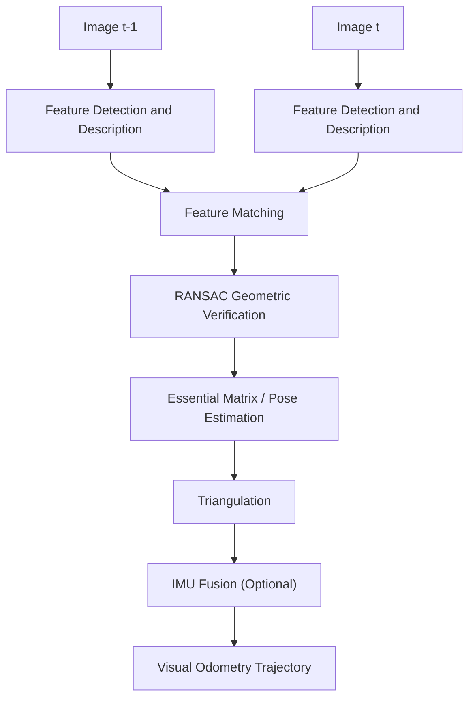


### 6.3.6 SLAM Backend: Graph Optimization and g2o / GTSAM / Ceres

SLAM algorithms are typically divided into two parts: the front-end and the back-end. The front-end is responsible for extracting geometric constraints from sensor data, such as visual feature matching, point cloud registration, or IMU preintegration; the back-end fuses these constraints into a consistent state estimate and corrects errors accumulated by the front-end.

!!! note "Term Explanation: SLAM Front-end, SLAM Back-end, Pose Graph, Factor Graph, Loop Closure"
    - **SLAM Front-end**: The module that extracts, associates, and generates relative pose or observation constraints from raw sensor data.
    - **SLAM Back-end**: The module that performs global or local optimization on the constraints generated by the front-end to obtain a consistent trajectory and map.
    - **Pose Graph**: A graph model where nodes represent robot poses and edges represent relative pose constraints.
    - **Factor Graph**: A type of bipartite graph where variable nodes represent quantities to be estimated and factor nodes represent constraints or measurements.
    - **Loop Closure**: Identifying when a robot returns to a previously visited location, thereby adding global constraints to eliminate drift.

The output of the front-end typically has drift: the scale uncertainty of visual odometry, inter-frame errors of LiDAR registration, and IMU integration biases all accumulate over time. Loop closure can provide a strong constraint of "relative pose between the current frame and a historical frame," and the back-end distributes these constraints across the entire trajectory through optimization, significantly reducing global errors.

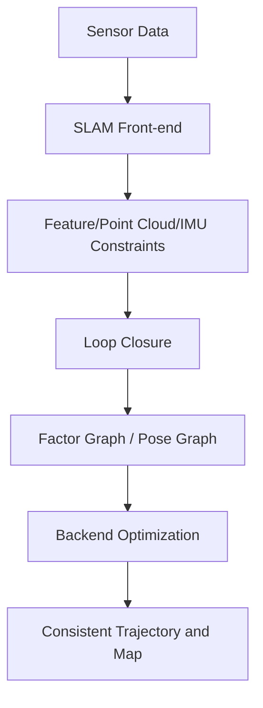

**Factor Graph Representation**. In the back-end, the variables to be estimated typically include robot poses \( \mathbf{x}_i \) and landmarks \( \mathbf{l}_j \). Each measurement generates a factor, corresponding to a residual function \( \mathbf{r}_k(\mathbf{x}) \). For example:

- **Odometry Factor**: \( \mathbf{r}_{ij}^{odo} = \mathrm{Log}\left( \mathbf{T}_{ij}^{-1} \mathbf{T}_i^{-1} \mathbf{T}_j \right) \), where \( \mathbf{T}_i \in SE(2) \) or \( SE(3) \).
- **Loop Closure Factor**: Same form as the odometry factor, but \( i \) and \( j \) are not adjacent.
- **GPS Prior Factor**: \( \mathbf{r}_i^{gps} = \mathbf{p}_i - \mathbf{p}_i^{gps} \).
- **Landmark Observation Factor**: Projection error or reprojection error.

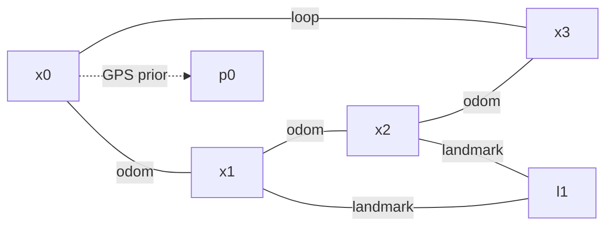

Under the maximum likelihood estimation framework, assuming measurement noise follows a Gaussian distribution, the optimization objective of the back-end is to minimize the sum of squared Mahalanobis distances:

$$
\min_{\mathbf{x}} \frac{1}{2} \sum_i \|\mathbf{r}_i(\mathbf{x})\|^2_{\mathbf{\Sigma}_i}
$$

where \( \mathbf{\Sigma}_i \) is the covariance matrix of the \( i \)-th measurement, and \( \|\mathbf{r}\|^2_{\mathbf{\Sigma}} = \mathbf{r}^T \mathbf{\Sigma}^{-1} \mathbf{r} \). The information matrix \( \mathbf{\Omega}_i = \mathbf{\Sigma}_i^{-1} \) is often introduced, and the objective function can also be written as \( \frac{1}{2} \sum_i \mathbf{r}_i^T \mathbf{\Omega}_i \mathbf{r}_i \).

!!! note "Term Explanation: Residual, Information Matrix, Covariance, Mahalanobis Distance"
    - **Residual**: The vector of differences between model predictions and actual measurements.
    - **Information Matrix**: The inverse of the covariance matrix, representing the strength of measurement constraints on variables.
    - **Covariance Matrix**: A second-order statistic describing measurement noise or estimation uncertainty.
    - **Mahalanobis Distance**: A weighted distance that accounts for the covariance structure.

**Linearization and Solution**. The residual function is often nonlinear. A first-order Taylor expansion around the current estimate \( \mathbf{x} \) is performed:

$$
\mathbf{r}_i(\mathbf{x} + \Delta \mathbf{x}) \approx \mathbf{r}_i(\mathbf{x}) + \mathbf{J}_i \Delta \mathbf{x}
$$

where \( \mathbf{J}_i = \partial \mathbf{r}_i / \partial \mathbf{x} \) is the Jacobian matrix. Substituting into the objective function and setting the derivative with respect to \( \Delta \mathbf{x} \) to zero yields the normal equations:

$$
\left( \sum_i \mathbf{J}_i^T \mathbf{\Omega}_i \mathbf{J}_i \right) \Delta \mathbf{x} = - \sum_i \mathbf{J}_i^T \mathbf{\Omega}_i \mathbf{r}_i
$$

!!! note "Term Explanation: Jacobian, Normal Equations, Gauss-Newton, Levenberg-Marquardt"
    - **Jacobian**: The matrix of partial derivatives of residuals with respect to state variables, describing the local linearization relationship.
    - **Normal Equations**: The linear system \( \mathbf{J}^T \mathbf{\Omega} \mathbf{J} \Delta \mathbf{x} = -\mathbf{J}^T \mathbf{\Omega} \mathbf{r} \) arising from least-squares problems.
    - **Gauss-Newton**: An iterative method that repeatedly linearizes and solves the normal equations to approximate the nonlinear least-squares solution.
    - **Levenberg-Marquardt**: A method that adds a damping term \( \lambda \mathbf{I} \) to Gauss-Newton to improve convergence robustness.

Let \( \mathbf{H} = \sum_i \mathbf{J}_i^T \mathbf{\Omega}_i \mathbf{J}_i \), \( \mathbf{b} = -\sum_i \mathbf{J}_i^T \mathbf{\Omega}_i \mathbf{r}_i \). Then each iteration solves \( \mathbf{H} \Delta \mathbf{x} = \mathbf{b} \). The LM algorithm replaces \( \mathbf{H} \) with \( \mathbf{H} + \lambda \, \mathrm{diag}(\mathbf{H}) \), switching between Gauss-Newton and gradient descent by adjusting \( \lambda \).

**Sparse Structure and Schur Complement**. The Jacobian matrix in SLAM is typically very sparse: each factor relates to only a few variables. Sparse least-squares solvers (e.g., CHOLMOD, CSparse) exploit this structure for efficient solving. When optimizing both poses and landmarks, \( \mathbf{H} \) can be partitioned as:

$$
\begin{bmatrix}
\mathbf{H}_{pp} & \mathbf{H}_{pl} \\
\mathbf{H}_{lp} & \mathbf{H}_{ll}
\end{bmatrix}
\begin{bmatrix}
\Delta \mathbf{x}_p \\
\Delta \mathbf{x}_l
\end{bmatrix}
=
\begin{bmatrix}
\mathbf{b}_p \\
\mathbf{b}_l
\end{bmatrix}
$$

By taking the Schur complement with respect to the landmarks, the pose subsystem can be solved first, followed by back-substitution for the landmarks. This technique is particularly crucial in bundle adjustment.

!!! note "Term Explanation: Sparse Matrix, Schur Complement, Bundle Adjustment"
    - **Sparse Matrix**: A matrix where the vast majority of elements are zero; in SLAM, each factor affects only a few variables.
    - **Schur Complement**: A technique to reduce the dimensionality of a high-dimensional linear system to only a subset of variables via elimination.
    - **Bundle Adjustment**: The process of simultaneously optimizing camera poses and 3D landmark points to minimize reprojection errors.

**Comparison of g2o, GTSAM, Ceres**. These are the most commonly used backend optimization libraries in SLAM/state estimation:

| Feature | g2o | GTSAM | Ceres Solver |
|---|---|---|---|
| Primary Language | C++ | C++ (with Python bindings) | C++ |
| Core Abstraction | Graph optimization vertices/edges | Factor graphs | General nonlinear least squares |
| Automatic Differentiation | Requires manual Jacobians | Provides automatic and symbolic differentiation | Powerful AutoDiff |
| Incremental Optimization | g2o incremental extension | iSAM2 incremental smoothing | Not natively supported |
| Manifolds/Lie Groups | Built-in SE(2)/SE(3) types | Native support via Manifolds/LieGroups | Requires custom local parameterization |
| Typical Applications | ORB-SLAM, Cartographer | GTSAM examples, visual-inertial navigation | LOAM, VINS-Mono (partial modules) |

!!! note "Term Explanation: Automatic Differentiation, Manifold, Lie Group, Incremental Optimization"
    - **Automatic Differentiation**: Computing exact derivatives automatically via operator overloading or source code transformation, avoiding manual Jacobian derivation.
    - **Manifold**: A nonlinear space locally homeomorphic to Euclidean space, e.g., the rotation group \( SO(3) \).
    - **Lie Group**: A set that simultaneously possesses group structure and smooth manifold structure, e.g., \( SE(3) \).
    - **Incremental Optimization**: When new measurements are added, only the affected part of the solution is updated, rather than re-optimizing the entire graph from scratch.

Below is a complete Python example of 2D pose graph optimization. This example does not rely on g2o/GTSAM; it only uses `scipy.optimize.least_squares`, making it easy for readers to run directly and understand the core algorithm.

```python
"""
2D pose graph optimization with scipy.optimize.least_squares.
Generates a square trajectory with odometry edges and one loop closure.
"""
import numpy as np
import matplotlib.pyplot as plt
from scipy.optimize import least_squares


def pose_compose(xi, xj):
    """Compose two SE(2) poses: xi * xj."""
    xi_, yi_, thi = xi
    xj_, yj_, thj = xj
    cos_i, sin_i = np.cos(thi), np.sin(thi)
    return np.array([
        xi_ + cos_i * xj_ - sin_i * yj_,
        yi_ + sin_i * xj_ + cos_i * yj_,
        thi + thj
    ])


def pose_inv(x):
    """Inverse of an SE(2) pose."""
    px, py, th = x
    c, s = np.cos(th), np.sin(th)
    return np.array([
        -c * px - s * py,
         s * px - c * py,
        -th
    ])


def pose_diff(xi, xj):
    """Relative pose from xi to xj: xi^{-1} * xj."""
    return pose_compose(pose_inv(xi), xj)


def wrap_angle(theta):
    """Wrap angle to [-pi, pi]."""
    return (theta + np.pi) % (2 * np.pi) - np.pi
```

# Ground-truth square trajectory: 4 sides, 10 poses per side
n_side = 10
side_len = 1.0
true_poses = []
for k in range(4):
    theta = k * np.pi / 2
    for i in range(n_side):
        t = i / n_side
        if k == 0:
            p = np.array([t * side_len, 0.0, theta])
        elif k == 1:
            p = np.array([side_len, t * side_len, theta])
        elif k == 2:
            p = np.array([(1 - t) * side_len, side_len, theta])
        else:
            p = np.array([0.0, (1 - t) * side_len, theta])
        true_poses.append(p)
true_poses = np.array(true_poses)
num_poses = len(true_poses)

# Build odometry measurements with noise
odom_edges = []
for i in range(num_poses - 1):
    z = pose_diff(true_poses[i], true_poses[i + 1])
    z += np.array([0.01, 0.01, 0.02]) * np.random.randn(3)
    z[2] = wrap_angle(z[2])
    odom_edges.append((i, i + 1, z))

# Add a loop closure between the last and first pose
z_loop = pose_diff(true_poses[-1], true_poses[0])
z_loop += np.array([0.05, 0.05, 0.05]) * np.random.randn(3)
z_loop[2] = wrap_angle(z_loop[2])
loop_edges = [(num_poses - 1, 0, z_loop)]

# Anchor the first pose to remove gauge freedom
anchor = true_poses[0].copy()


def residuals(params):
    """Compute all residuals for least_squares."""
    poses = params.reshape(num_poses, 3)
    poses[0] = anchor  # fix origin
    res = []

    # Odometry residuals
    for i, j, z in odom_edges:
        delta = pose_diff(poses[i], poses[j])
        err = delta - z
        err[2] = wrap_angle(err[2])
        # Weight by information (inverse std)
        err *= np.array([10.0, 10.0, 5.0])
        res.append(err)

    # Loop closure residual
    for i, j, z in loop_edges:
        delta = pose_diff(poses[i], poses[j])
        err = delta - z
        err[2] = wrap_angle(err[2])
        err *= np.array([5.0, 5.0, 3.0])
        res.append(err)

    return np.concatenate(res)


# Initial estimate: integrate noisy odometry without loop closure
init_poses = np.zeros((num_poses, 3))
init_poses[0] = anchor
for idx, (i, j, z) in enumerate(odom_edges):
    init_poses[j] = pose_compose(init_poses[i], z)

# Optimize
result = least_squares(
    residuals,
    init_poses.ravel(),
    method='lm',
    max_nfev=200
)
opt_poses = result.x.reshape(num_poses, 3)
opt_poses[0] = anchor

# Plot
plt.figure(figsize=(6, 6))
plt.plot(true_poses[:, 0], true_poses[:, 1], 'k-o', label='Ground truth')
plt.plot(init_poses[:, 0], init_poses[:, 1], 'r-s', label='Initial (odom only)')
plt.plot(opt_poses[:, 0], opt_poses[:, 1], 'b-^', label='Optimized')
plt.axis('equal')
plt.grid(True)
plt.legend()
plt.title('2D Pose Graph Optimization')
plt.xlabel('x [m]')
plt.ylabel('y [m]')
plt.tight_layout()
plt.savefig('pose_graph_2d.png', dpi=150)
plt.show()
```

The running result typically shows: the initial trajectory integrated from odometry alone has significant drift when returning to the start, while the optimized trajectory almost coincides with the true square trajectory. Adjusting the information weights of odometry and loop closure (i.e., the multipliers before the residuals) can change their influence on the final solution.

**Ceres Solver C++ snippet**. The same 2D pose graph problem can be written in Ceres as:

```cpp
#include <ceres/ceres.h>

struct PoseGraph2DError {
  PoseGraph2DError(double dx, double dy, double dtheta)
      : dx_(dx), dy_(dy), dtheta_(dtheta) {}

  template <typename T>
  bool operator()(const T* const xi, const T* const xj, T* residuals) const {
    // xi = [px, py, theta], xj = [px, py, theta]
    T cos_i = cos(xi[2]), sin_i = sin(xi[2]);
    T dx_pred = cos_i * (xj[0] - xi[0]) + sin_i * (xj[1] - xi[1]);
    T dy_pred = -sin_i * (xj[0] - xi[0]) + cos_i * (xj[1] - xi[1]);
    T dtheta_pred = xj[2] - xi[2];
    residuals[0] = dx_pred - T(dx_);
    residuals[1] = dy_pred - T(dy_);
    residuals[2] = dtheta_pred - T(dtheta_);
    return true;
  }

  double dx_, dy_, dtheta_;
};

// Usage:
ceres::CostFunction* cost =
    new ceres::AutoDiffCostFunction<PoseGraph2DError, 3, 3, 3>(
        new PoseGraph2DError(z_dx, z_dy, z_dtheta));
problem.AddResidualBlock(cost, nullptr, pose_i, pose_j);
```

Ceres' `AutoDiffCostFunction` automatically computes the Jacobian; you only need to provide the residual definition. If \( SO(3) \) or \( SE(3) \) is involved, `LocalParameterization` or `Manifold` is typically needed to handle updates on the manifold.

**GTSAM Introduction**. GTSAM uses factor graphs as its core abstraction, and the Python interface can directly construct problems:

```python
import gtsam
from gtsam import Pose2, Values, NonlinearFactorGraph
from gtsam import BetweenFactorPose2, PriorFactorPose2

graph = NonlinearFactorGraph()
initial = Values()

# Add prior to fix the first pose
graph.add(PriorFactorPose2(0, Pose2(0, 0, 0), noise_model))
initial.insert(0, Pose2(0, 0, 0))

# Add odometry and loop closure factors
graph.add(BetweenFactorPose2(i, j, Pose2(dx, dy, dtheta), noise_model))

# Optimize
optimizer = gtsam.LevenbergMarquardtOptimizer(graph, initial)
result = optimizer.optimize()
```

!!! note "Terminology explanation: GTSAM, iSAM2, Bayes tree"
    - **GTSAM (Georgia Tech Smoothing and Mapping library)**：A C++/Python state estimation library based on factor graphs and Bayes trees.
    - **iSAM2**：An incremental smoothing and mapping algorithm in GTSAM that uses the Bayes tree to perform local updates when new measurements are added.
    - **Bayes tree**：A tree data structure obtained after factor graph elimination, supporting incremental inference.

The engineering essentials of backend graph optimization can be summarized in three points:

1. **Frontend constraint quality determines the upper bound of optimization**. Incorrect loop closures or registrations introduce "phantom" constraints, causing the optimization to diverge; robust kernel functions (Huber, Cauchy) or RANSAC validation are indispensable.
2. **The information matrix should reflect true measurement accuracy**. Assigning too high weight to low-cost odometry or too low weight to high-precision GPS will distort the results.
3. **Sparse solvers and incremental algorithms are key for large-scale scenarios**. The number of nodes in indoor/outdoor SLAM can reach the order of \( 10^4 \sim 10^6 \); only by exploiting sparse structure can optimization be completed within real-time constraints.

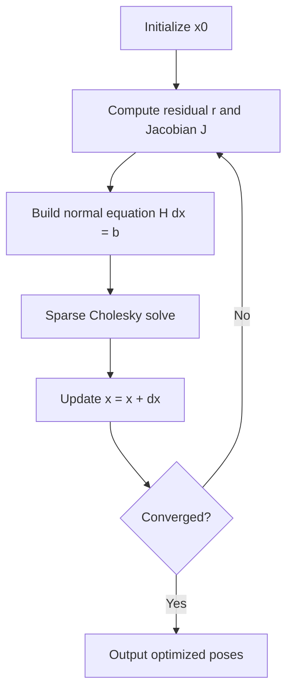

For a more systematic introduction to graph optimization, refer to the tutorial by Grisetti et al. [58], the g2o paper [59], the GTSAM introduction [60], and the Ceres Solver documentation [61].

---

## 6.4 Communication, Middleware, and Real-Time Operating Systems

The communication and middleware of a humanoid robot serve as the "nervous system" connecting sensors, computing units, and actuators. A typical bipedal robot may simultaneously run: multi-camera perception streams at tens of hertz, joint force control loops at kilohertz, high-level planning above ten hertz, as well as time synchronization, fault diagnosis, and logging across modules throughout the robot body. The requirements of these data flows in terms of bandwidth, latency, jitter, reliability, and security vary greatly and cannot be satisfied by a single network or protocol. This section starts from the publish-subscribe semantics of DDS/RTPS, delves into deterministic buses such as TSN, EtherCAT, and CAN-FD, then extends to the ROS 2 upper framework, message serialization and performance estimation, and time synchronization, ultimately presenting a relatively complete picture of robot communication middleware.

!!! note "Term Explanation: Middleware, Bus, Protocol, Publish-Subscribe, Deterministic Communication"
    - **Middleware**: A software layer between the operating system and application software, providing general services such as communication, data management, and resource scheduling for distributed applications.
    - **Bus**: A physical transmission medium or communication channel shared by multiple nodes, such as a CAN bus or Ethernet bus.
    - **Protocol**: A set of formats, timings, and semantic rules agreed upon by communicating parties for data exchange.
    - **Publish-Subscribe**: A communication pattern where senders (publishers) and receivers (subscribers) are decoupled via topics, without needing to know each other's existence.
    - **Deterministic Communication**: A communication method where the communication delay or its upper bound can be predicted and guaranteed.

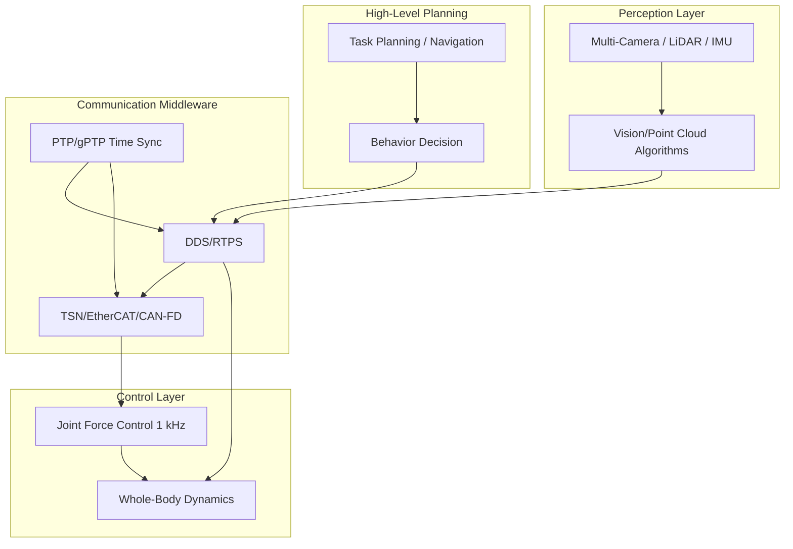

### 6.4.1 ROS 2 and DDS

The Robot Operating System 2 (ROS 2) adopts the Data Distribution Service (DDS) as its underlying communication middleware, implementing a publish-subscribe mechanism, Quality of Service (QoS) policies, and distributed node discovery. Unlike ROS 1, which was based on a custom TCP master node, ROS 2's communication is decentralized; nodes can discover each other directly through DDS, natively supporting multi-machine distributed deployment.

!!! note "Term Explanation: ROS 2, DDS, Publish-Subscribe, QoS, Topic, Node, RMW"
    - **ROS 2 (Robot Operating System 2)**: The second-generation open-source middleware framework for robots, with DDS as its default underlying middleware.
    - **DDS (Data Distribution Service)**: An OMG standard real-time publish-subscribe middleware, widely used in aerospace, automotive, and robotics.
    - **QoS (Quality of Service)**: A set of communication policies including reliability, durability, deadline, history depth, etc.
    - **Topic**: A logical channel carrying data of the same type.
    - **Node**: The smallest computation unit in ROS 2.
    - **RMW (ROS Middleware Interface)**: An abstract interface layer between ROS 2 and the underlying DDS implementation.

#### DDS Data Model and Entity Hierarchy

The core abstraction of DDS is a layered Entity model. Each entity inherits from the base class `Entity` and can be configured with a Listener and QoS. From top to bottom, the key entities include:

1. **DomainParticipant**: A communication participant within a DDS domain. A process typically creates one DomainParticipant and joins a specific domain id (integer). DomainParticipants within the same domain id can discover each other; different domains are isolated by default.
2. **Publisher / Subscriber**: Publishers and subscribers are containers for DataWriters / DataReaders, responsible for batch management and lifecycle control.
3. **Topic**: A logical channel defined by a name and a data type. DDS knows the memory layout of a Topic at compile-time or runtime through TypeSupport.
4. **DataWriter**: A publishing-side entity. The application calls `write(sample)` to push a sample into the DataWriter's history cache. The DDS implementation is responsible for sending it to matching DataReaders via RTPS.
5. **DataReader**: A subscribing-side entity. The application retrieves samples from the DataReader's history cache via `take()` or `read()`.

!!! note "Term Explanation: DomainParticipant, Publisher, Subscriber, Topic, DataWriter, DataReader, Listener"
    - **DomainParticipant**: A communication entity within a DDS domain; nodes in the same domain can discover each other.
    - **Publisher / Subscriber**: Containers for DataWriters / DataReaders, managing a group of publishing or subscribing objects.
    - **DataWriter / DataReader**: Objects used for publishing and subscribing to data, respectively.
    - **Listener**: DDS callback interfaces for asynchronous notification of events such as matching, data availability, and QoS violations.

This hierarchical structure brings two important engineering features:

- **Multi-node isolation within the same process**: Different DomainParticipants, even if running in the same process, can belong to different domains without interfering with each other.
- **Resource and QoS grouping**: Publishers and Subscribers, as containers, can set default QoS uniformly; DataWriters/DataReaders can override these settings.

A typical relationship can be summarized as:

$$
\text{DomainParticipant} \supseteq \{ \text{Publisher}, \text{Subscriber}, \text{Topic} \}
$$

$$
\text{Publisher} \supseteq \{ \text{DataWriter}_i \}, \quad \text{Subscriber} \supseteq \{ \text{DataReader}_j \}
$$

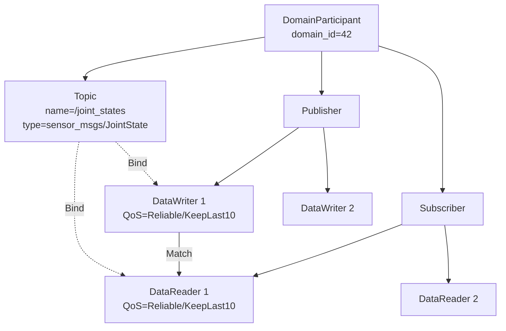

The DDS data model is a **keyed data stream with samples as units**. Each sample of a Topic can carry an instance key. For example, in the same `/joint_states` topic, different joints can act as different instances. The DataWriter maintains an independent history queue for each instance; the DataReader can receive, filter, or expire a specific instance individually. This design facilitates handling scenarios with "multiple concurrent entities in the same topic," such as the status of multiple aircraft or multiple vehicles.

!!! note "Term Explanation: Sample, Instance Key, Keyed Data, History Queue"
    - **Sample**: A single unit of data publication on a Topic.
    - **Instance Key**: A field used to distinguish different logical instances within the same Topic, allowing DDS to manage the lifecycle and history of each instance independently.
    - **Keyed Data**: A data type with an instance key, enabling multiple instances to coexist on the same Topic.
    - **History Queue**: A cache of the most recent samples maintained in a DataWriter or DataReader.

#### RTPS Protocol: Discovery and Transport

The underlying wire protocol for DDS is called **RTPS (Real-Time Publish-Subscribe)**, defined by the OMG DDSI-RTPS specification. The design goal of RTPS is to allow distributed publishers and subscribers to automatically discover each other and exchange user data without a central broker.

!!! note "Term Explanation: RTPS, DDSI, Broker, Wire Protocol, Endpoint"
    - **RTPS (Real-Time Publish-Subscribe)**: The standard wire protocol for DDS, responsible for discovery, matching, and data transmission.
    - **DDSI (DDS Interoperability)**: The DDS interoperability wire protocol specification defined by OMG.
    - **Broker**: A central forwarding node in message middleware; RTPS is a broker-less design.
    - **Wire Protocol**: The byte format and state machine for actual data transmission over a physical network.
    - **Endpoint**: The network-layer representation of a DataWriter or DataReader in RTPS.

RTPS discovery is divided into two phases:

1. **Participant Discovery Protocol (PDP)**: Each DomainParticipant periodically sends a **ParticipantDeclaration** (typically encapsulated as SPDPdiscoveredParticipantData in RTPS), announcing its existence, GUID, QoS, available transports, etc. The receiver uses this to establish participant-level matching relationships.
2. **Endpoint Discovery Protocol (EDP)**: After PDP completes, participants exchange their DataWriter/DataReader information (endpoint names, Topics, types, QoS) to confirm which endpoints can match.

These two types of traffic are collectively referred to as **metatraffic**, which is separated from **user traffic** that carries application data. Metatraffic is typically sent via UDP multicast or unicast using best-effort delivery.

!!! note "Term Explanation: PDP, EDP, SPDP, Metatraffic, User Traffic, GUID"
    - **PDP (Participant Discovery Protocol)**: The participant discovery protocol in RTPS.
    - **EDP (Endpoint Discovery Protocol)**: The endpoint discovery protocol in RTPS.
    - **SPDP (Simple Participant Discovery Protocol)**: The most commonly used PDP implementation, based on periodic announcements.
    - **Metatraffic**: Control traffic such as discovery, heartbeats, and acknowledgments.
    - **User traffic**: Data traffic for application-published sensor readings, control commands, etc.
    - **GUID (Globally Unique Identifier)**: The globally unique identifier for each entity (Participant, Writer, Reader) in RTPS.

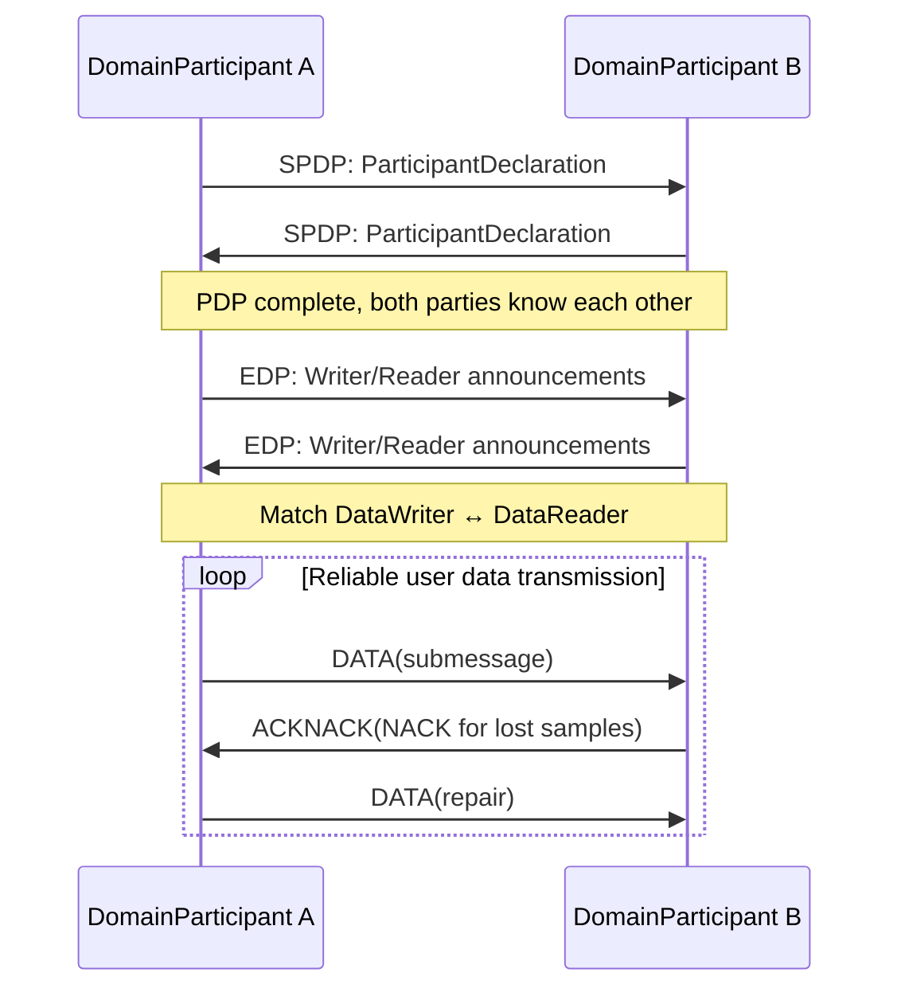

RTPS runs by default over **UDP/IP** for the following reasons:

- UDP is connectionless with low latency, suitable for periodic sensor data.
- Multicast naturally supports one-to-many discovery.
- RTPS itself implements reliability and ordering above the transport layer, without relying on TCP.

For high-throughput intra-machine communication, modern DDS implementations (e.g., Fast DDS, CycloneDDS) support **Shared Memory Transport (SHM)**. When publishers and subscribers reside on the same host, samples are written directly into a shared memory segment, and the receiver reads them via zero-copy, avoiding UDP stack overhead, data serialization copies, and kernel-user mode switches.

!!! note "Term Explanation: UDP, TCP, Multicast, Unicast, Shared Memory, Zero-Copy"
    - **UDP (User Datagram Protocol)**: A connectionless transport layer protocol with low overhead but no reliability guarantee.
    - **TCP (Transmission Control Protocol)**: A connection-oriented reliable transport protocol, but introduces handshake, reordering, and buffering delays.
    - **Multicast**: A one-to-many network transmission method where a single packet can be received by multiple recipients.
    - **Unicast**: A one-to-one network transmission method.
    - **Shared Memory**: The same physical memory segment that can be directly accessed by multiple processes on the same host.
    - **Zero-Copy**: Data is transmitted without additional memory copies, reducing CPU overhead and latency.

The RTPS message format consists of several **submessages**. Common submessage types include:

| Submessage | Purpose |
|---|---|
| `DATA` | Carries user samples or metadata |
| `DATA_FRAG` | Fragmented transmission of large samples |
| `HEARTBEAT` | Writer informs Reader of the current available sequence number range |
| `ACKNACK` | Reader acknowledges receipt or requests retransmission |
| `GAP` | Writer notifies Reader that certain sequence numbers are no longer available |
| `NACK_FRAG` | Retransmission request for fragmented data |

**Best Practice**: In robotics, discovery is often configured as a hybrid mode of "unicast + limited multicast." In small local area networks, multicast can be used for PDP; in large-scale or Wi-Fi scenarios, to reduce network flooding, unicast discovery can be configured with a specified peer list.

#### Detailed QoS Policies

DDS QoS (Quality of Service) are policy objects that can be set on Topics, DataWriters, DataReaders, Publishers, Subscribers, and DomainParticipants. When a DataWriter and DataReader match, DDS checks whether their QoS are compatible.

!!! note "Term Explanation: QoS, Compatibility Policy, Request-Offer Model, Resource Limits"
    - **QoS (Quality of Service)**: A set of policies in DDS describing communication semantics and resources.
    - **Request-Offer Model**: A DataReader requests certain QoS, a DataWriter offers certain QoS; matching requires that the Reader's request ≤ the Writer's commitment.
    - **Resource Limits**: The maximum number of memory samples available to a DDS entity.

The table below lists major QoS policies and their typical usage in humanoid robots.

| QoS Policy | Publisher-Side Semantics | Subscriber-Side Semantics | Typical Robot Scenario |
|---|---|---|---|
| RELIABILITY | Reliable / Best-Effort | Same as left | Emergency stop uses Reliable; images use Best-Effort |
| HISTORY | Keep Last N / Keep All | Same as left | Control commands Keep Last 1; logs Keep All (if resources allow) |
| DURABILITY | Volatile / Transient Local / Transient / Persistent | Same as left | Maps use Transient Local |
| DEADLINE | Committed minimum publish period | Expected minimum receive period | Joint state monitoring at 1 kHz |
| LATENCY_BUDGET | Budget allowed for DDS batching/delayed sending | Acceptable additional delay | Non-critical log aggregation |
| LIFESPAN | Sample validity period | Same as left | Expired images automatically discarded |
| LIVELINESS | Automatic / Manual, lease duration | Same as left | Detect if a node is alive |
| OWNERSHIP | Shared / Exclusive + strength | Same as left | Multi-controller arbitration |
| PARTITION | Logical partition name | Same as left | Multi-robot isolation |
| TIME_BASED_FILTER | Minimum interval filtering | Same as left | Reduce high-frequency sampling to 10 Hz |
| TRANSPORT_PRIORITY | Transport priority | Same as left | Emergency control frames prioritized |

**RELIABILITY**. In Reliable mode, RTPS uses **NACK-based repair**: after receiving a HEARTBEAT, if the Reader detects missing sequence numbers, it sends an ACKNACK to request retransmission; upon receiving a NACK, the Writer resends the corresponding samples from its cache. In Best-Effort mode, no ACKNACK is sent; samples are discarded immediately after sending, resulting in the lowest latency but potential packet loss.

!!! note "Terminology: NACK, ACK, HEARTBEAT, Retransmission, Acknowledgment"
    - **NACK (Negative Acknowledgment)**: The receiver informs the sender which data was not received.
    - **ACK (Acknowledgment)**: The receiver confirms receipt of data.
    - **HEARTBEAT**: The sender periodically informs the receiver of the current sequence number window that has been sent.
    - **Retransmission**: The sender resends lost data based on NACK.

The overhead of reliability can be roughly estimated using the following formula:

$$
L_{\text{reliable}} = L_{\text{send}} + L_{\text{prop}} + L_{\text{sched}} + L_{\text{NACK-repair}}
$$

Where \(L_{\text{NACK-repair}}\) is close to 0 in a stable network, but introduces an additional delay on the order of one RTT (hundreds of microseconds to milliseconds) during packet loss.

**HISTORY**. Keep Last \(N\) retains only the most recent \(N\) samples, overwriting older ones; Keep All retains all unacknowledged samples until resource limits are reached. Using Keep Last 1 for a DataReader effectively implements the semantics of "only caring about the latest value," such as receiving `/cmd_vel` velocity commands.

!!! note "Terminology: Keep Last, Keep All, History Depth, Resource Limits"
    - **Keep Last**: A HISTORY mode that retains only the most recent N samples.
    - **Keep All**: A HISTORY mode that retains all unconsumed or unacknowledged samples.
    - **History depth**: The value of N in Keep Last mode.
    - **Resource limits**: Parameters that control the maximum number of samples, instances, and samples per instance for a DDS entity.

**DURABILITY**. Divided into four levels:

- **Volatile**: No history is retained; new subscribers joining can only receive data published after their subscription. Minimal memory usage.
- **Transient Local**: The DataWriter retains historical samples in local memory; newly matched DataReaders can immediately receive the latest samples upon joining. Suitable for "state-type" data such as maps, parameters, and configurations.
- **Transient / Persistent**: History is saved by an external persistence service (DDS Persistence Service); new Readers can still retrieve data even after the DataWriter exits. Complex to implement and less commonly used in robotics.

Memory usage can be approximated as:

$$
M_{\text{durability}} \approx N_{\text{samples}} \times S_{\text{sample}} \times N_{\text{instances}}
$$

Where \(S_{\text{sample}}\) is the serialized sample size. For a 1 MB point cloud map with a history depth of 1 and 1 instance, Transient Local would occupy approximately 1 MB.

**DEADLINE and LATENCY_BUDGET**. DEADLINE requires the Writer to publish at least once within a specified period; the Reader expects to receive data within that period. If not met, DDS triggers the `on_requested_deadline_missed` or `on_offered_deadline_missed` callback. LATENCY_BUDGET allows DDS to perform batch sending or scheduling optimizations within the budget.

**LIFESPAN**. Samples have an expiration time on the DataWriter side; expired samples are discarded even if not yet sent, preventing old data from propagating in the network. For example, obstacle detection results from 100 ms ago may be meaningless for a high-speed moving robot.

**LIVELINESS**. In Automatic mode, DDS automatically considers the Writer alive as long as the Writer process is running normally; in Manual mode, the application must periodically call `assert_liveliness()`, otherwise the Reader triggers `on_liveliness_changed` and considers the Writer inactive. The lease duration defines the timeout threshold.

**OWNERSHIP**. In Shared mode, data published by multiple Writers to the same Topic is all received by the Reader; in Exclusive mode, only data from the Writer with the highest strength is received. This is very useful for multi-controller hot backup: the primary controller has high strength, the backup controller has low strength, and when the primary controller fails, the backup automatically takes over.

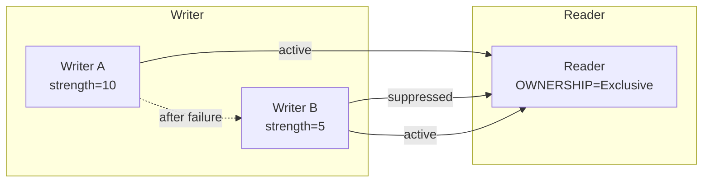

**PARTITION**. Further divides the same domain using logical partition names. For example, robot A and robot B are both in domain 0 but belong to partitions `robot_A` and `robot_B` respectively; they will not subscribe to each other unless explicitly configured for cross-partition communication.

**Callback Mechanism**. DDS provides Listener callbacks such as `on_requested_deadline_missed`, `on_liveliness_changed`, `on_sample_lost`, `on_sample_rejected`, and `on_requested_incompatible_qos`. In engineering practice, it is recommended to monitor LIVELINESS_CHANGED and DEADLINE_MISSED for critical topics (e.g., `/emergency_stop`) to promptly detect communication anomalies.

#### DDS Security and Scalability

DDS-Security is a set of security plugin specifications defined by OMG, providing authentication, access control, encryption, and logging capabilities for DDS. It integrates into DDS implementations through a plugin architecture, without modifying the core RTPS message format, but adding security encapsulation at the submessage level.

!!! note "Terminology: DDS-Security, Authentication, Access Control, Encryption, Logging, Plugin"
    - **DDS-Security**: The security extension specification for DDS defined by OMG.
    - **Authentication**: The process of verifying the identity of communicating parties.
    - **Access Control**: Determining which entities can publish/subscribe to which Topics based on policies.
    - **Encryption**: Transforming message content so that unauthorized parties cannot read it.
    - **Logging**: Recording security events for post-event analysis.
    - **Plugin**: A dynamically loadable security functional module.

DDS-Security mainly includes the following plugins:

1. **Authentication Plugin**: Verifies the identity of DomainParticipants based on PKI and digital certificates, using Diffie-Hellman or ECDH to negotiate session keys.
2. **Access Control Plugin**: Defines which Topics each Participant can read/write, which domains it can join, and which Publishers/Subscribers it can create, through `permissions.xml` and `governance.xml`.
3. **Cryptography Plugin**: Provides encryption, signing, HMAC, and key derivation for RTPS messages.
4. **Logging Plugin**: Records security-related events.

!!! note "Terminology: PKI, Digital Certificate, Diffie-Hellman, ECDH, HMAC, Digital Signature"
    - **PKI (Public Key Infrastructure)**: An identity authentication infrastructure based on public key cryptography.
    - **Digital certificate**: An electronic document issued by a trusted authority that binds a public key to an identity.
    - **Diffie-Hellman / ECDH**: Key exchange protocols that allow two parties to negotiate a shared secret key over a public channel.
    - **HMAC (Hash-based Message Authentication Code)**: A message authentication code based on a hash function, used for integrity verification.
    - **Digital signature**: Signing a data digest with a private key to verify the data source and integrity.

Two types of XML files are required in a security deployment:

- **Governance**: Defines global security policies, such as whether to enable encryption, signing, and whether to allow unauthenticated participants to join the domain.
- **Permissions**: Defines the specific permissions for each Participant, including allowed read/write Topics, validity period, domain id, etc.

!!! note "Terminology explanation: Governance, Permissions, Security Domain"
    - **Governance**: The file that defines global security policies in DDS-Security.
    - **Permissions**: The file that defines read/write permissions for a single Participant in DDS-Security.
    - **Security Domain**: A communication scope isolated by authentication and access control logic.

In robotic systems, typical applications of DDS-Security include:

- **Multi-robot isolation**: Ensures that Robot A does not accidentally receive control commands from Robot B.
- **Hierarchical operation permissions**: The host computer can publish `/cmd_vel`, while joint drive nodes are only allowed to subscribe to specific control Topics and publish status Topics.
- **Teleoperation security**: External teleoperation terminals must undergo certificate authentication before writing to high-privilege Topics.

Beyond security, DDS scalability is also reflected in **domain segmentation** and **Topic routing**. Large robots or robot swarms can use DDS gateways or ROS 2's `domain bridge` to forward selected Topics between different domains, enabling a layered network:

- High-level planning domain (low frequency, large data volume, cross-robot)
- Real-time control domain (high frequency, small data volume, strict timing)
- Maintenance and diagnostics domain (logs, firmware updates)

```mermaid
flowchart TD
    subgraph Domain_0
    A1["Robot A Perception Node"]
    A2["Robot A Control Node"]
    end
    subgraph Domain_1
    B1["Robot B Perception Node"]
    B2["Robot B Control Node"]
    end
    subgraph Domain_42
    C["Cloud Monitoring / Swarm Scheduling"]
    end
    A1 <-->|"domain bridge<br/>forward status only"| C
    B1 <-->|"domain bridge<br/>forward status only"| C
    A2 -.->|"isolated"| B2
```

#### DDS Implementation Comparison

Currently, mainstream DDS implementations include CycloneDDS, Fast DDS, RTI Connext DDS, GurumDDS, and OpenDDS. The table below compares them from a robotics engineering perspective.

| Implementation | License | ROS 2 Default RMW | Shared Memory | DDS-Security | Main Toolchain | Typical Use Cases |
|---|---|---|---|---|---|---|
| Eclipse CycloneDDS | EPL 2.0 | Rolling/Jazzy default | Supported | Partial support | `cyclonedds` CLI | Open-source robotics, academic projects |
| eProsima Fast DDS | Apache 2.0 | Humble default | Excellent | Supported | Fast DDS Monitor | Commercial robotics, zero-copy on same machine |
| RTI Connext DDS | Commercial | Optional `rmw_connextdds` | Supported | Full | RTI Admin Console, Monitor | Aerospace, automotive, high security |
| GurumDDS | Commercial | Optional | Supported | Full | Gurum Net | Korean industrial/robotics market |
| OpenDDS | Open-source (OCI) | No official RMW | Supported | Supported | OpenDDS Monitor | Existing OpenDDS ecosystem |

!!! note "Terminology explanation: CycloneDDS, Fast DDS, RTI Connext, GurumDDS, OpenDDS, EPL, Apache 2.0"
    - **CycloneDDS**: An open-source DDS implementation maintained by the Eclipse Foundation, known for its simplicity and high performance.
    - **Fast DDS**: A feature-rich DDS/RTPS implementation developed by eProsima, supporting shared memory and security.
    - **RTI Connext DDS**: A commercial DDS product from Real-Time Innovations with a mature toolchain.
    - **GurumDDS**: A commercial DDS implementation from Gurum Networks (South Korea).
    - **OpenDDS**: An open-source DDS implementation maintained by Object Computing.
    - **EPL / Apache 2.0**: Common open-source software licenses.

Selection recommendations:

- **R&D and Prototyping**: CycloneDDS is simple to configure and integrates well with ROS 2.
- **High-performance intra-machine communication**: Fast DDS excels in shared memory implementation and zero-copy features.
- **Safety-critical / certified projects**: RTI Connext DDS provides complete security plugins, toolchains, and certification support documentation.
- **Multi-DDS interoperability**: DDS interoperability is theoretically possible, but in practice, different implementations have differences in QoS defaults and discovery behavior; interoperability testing should be performed early in the project.

#### ROS 2 Execution Model and rclcpp/rclpy

ROS 2 provides `rcl` (C interface), `rclcpp` (C++), and `rclpy` (Python) client libraries on top of DDS. Understanding its execution model is crucial for implementing low-latency, deterministic robotic software.

!!! note "Terminology explanation: rcl, rclcpp, rclpy, client library, executor, callback"
    - **rcl**: The C language client library interface for ROS 2.
    - **rclcpp / rclpy**: The C++ and Python client libraries for ROS 2.
    - **Client library**: A library that provides developers with APIs for creating nodes, publishing/subscribing, calling services, etc.
    - **Executor**: The mechanism that schedules the execution of callback functions.
    - **Callback**: A response function to an event (e.g., arrival of a new message, timer trigger, service request).

**Nodes and Executors**. A ROS 2 process can contain one or more Nodes. The executor is responsible for collecting events from the DDS/RMW layer and calling the corresponding callbacks. ROS 2 provides three main executors:

1. **SingleThreadedExecutor**: All callbacks are executed in FIFO order on the same thread. Simplest, but a time-consuming callback can block others.
2. **MultiThreadedExecutor**: Uses a thread pool to execute callbacks concurrently, suitable for I/O-bound or parallelizable computation scenarios.
3. **StaticSingleThreadedExecutor**: Determines the callback order at initialization, reducing scheduling overhead at runtime, suitable for real-time tasks with high determinism and a fixed set of callbacks.

!!! note "Terminology explanation: SingleThreadedExecutor, MultiThreadedExecutor, StaticSingleThreadedExecutor, FIFO, thread pool"
    - **SingleThreadedExecutor**: An executor that executes callbacks sequentially on a single thread.
    - **MultiThreadedExecutor**: An executor that executes callbacks concurrently on multiple threads.
    - **StaticSingleThreadedExecutor**: An executor that statically determines callback order to optimize scheduling overhead.
    - **FIFO (First In First Out)**: A first-come, first-served scheduling order.
    - **Thread pool**: A pre-created set of threads used for reuse and to reduce thread creation overhead.

**Callback Groups**. ROS 2 callbacks can be placed into two types of callback groups:

- **MutuallyExclusive**: Callbacks within the group cannot execute concurrently, suitable for callbacks accessing shared resources.
- **Reentrant**: Callbacks within the group can be reentrant and execute concurrently, suitable for stateless, parallelizable computations.

By placing real-time callbacks (e.g., control laws) into a separate callback group and combining it with thread count limits of the `MultiThreadedExecutor`, real-time and non-real-time loads can be isolated to a certain extent.

```mermaid
flowchart TD
    subgraph Node
    A["Subscription /joint_states"] --> B["Callback Group A<br/>MutuallyExclusive<br/>Real-time Control"]
    C["Subscription /camera/image_raw"] --> D["Callback Group B<br/>Reentrant<br/>Perception Processing"]
    E["Timer 1 kHz"] --> B
    end
    B --> F["Executor Thread Pool"]
    D --> F
    F --> G["DDS/RTPS"]
```

**Composition and Intra-process Communication**. ROS 2 supports compiling multiple nodes into the same process (composition) and uses `rclcpp::intra_process` to achieve **intra-process zero-copy communication**. When a publisher and subscriber are in the same process and use compatible QoS, the sample pointer can be passed directly without going through DDS serialization and the network stack.

!!! note "Term Explanation: Composition, Intra-process Communication, Zero-copy, Pointer Passing"
    - **Composition**: The technique of placing multiple ROS 2 nodes into the same process.
    - **Intra-process communication**: Direct communication between nodes within the same process, bypassing the DDS network layer.
    - **Zero-copy**: Data is transmitted without additional memory copying.
    - **Pointer passing**: Achieving zero-copy by passing data pointers instead of copying data.

**RMW Abstraction Layer**. ROS 2 uses the RMW interface to mask differences in underlying DDS implementations. `rmw_fastrtps_cpp`, `rmw_cyclonedds_cpp`, `rmw_connextdds`, etc., are adaptation layers for different DDS implementations. Switching RMW typically only requires setting the environment variable `RMW_IMPLEMENTATION`, without modifying application code.

**Real-time Pitfalls**:

1.  **Dynamic Memory Allocation in Callbacks**: `std::vector`, `std::string`, etc., may trigger heap allocation, leading to unpredictable latency. Real-time paths should pre-allocate memory or use custom allocators.
2.  **Spin Locks and Busy Waiting**: Some DDS implementations use spin locks when waiting for data, consuming CPU and affecting other threads in the same process.
3.  **DDS History Cache**: Keep All or a large number of instances can cause unbounded memory growth; must be used with ResourceLimits.
4.  **FIFO Scheduling of Executor**: The SingleThreadedExecutor cannot guarantee precise trigger times for periodic tasks. It is recommended to use `rclcpp::Timer` with real-time priority threads.

```mermaid
flowchart TD
    A["ROS 2 Application rclcpp/rclpy"] --> B["rcl Interface Layer"]
    B --> C["RMW Abstraction Layer"]
    C --> D["DDS Implementation Layer"]
    D --> E["RTPS Protocol Layer"]
    E --> F["UDP / SHM Transport Layer"]
    F --> G["NIC / Shared Memory"]
```

### 6.4.2 Time-Sensitive Networking TSN / EtherCAT / CAN-FD

Internal robot communication is typically divided into two categories:

- **Data-intensive Bus**: Multiple cameras, point clouds, logs, requiring high bandwidth and acceptable latency.
- **Control-intensive Bus**: Joint force control, safety chains, requiring deterministic low latency and low jitter.

TSN, EtherCAT, and CAN-FD correspond to different levels: TSN targets deterministic convergence on high-speed Ethernet; EtherCAT targets high-performance servo and motion control; CAN-FD targets low-cost, medium/low-speed distributed nodes (e.g., battery management, sensors).

!!! note "Term Explanation: TSN, EtherCAT, CAN-FD, Fieldbus, Deterministic Communication, Cycle Time, Jitter"
    - **TSN (Time-Sensitive Networking)**: IEEE 802.1 series standards providing deterministic latency and synchronization over traditional Ethernet.
    - **EtherCAT (Ethernet for Control Automation Technology)**: An industrial Ethernet fieldbus developed by Beckhoff, using a "processing on the fly" mechanism, achieving cycle times as low as 100 μs.
    - **CAN-FD (Controller Area Network with Flexible Data-rate)**: An upgraded version of the CAN bus, increasing data rate and payload per frame.
    - **Fieldbus**: A digital communication network connecting controllers with field devices.
    - **Cycle time**: The time interval between repetitions of a control loop.
    - **Jitter**: The deviation of the actual cycle time from the ideal cycle time.

#### Detailed Explanation of Key TSN Mechanisms

TSN is a collection of IEEE 802.1 standards. Its core goal is to simultaneously carry best-effort traffic and time-critical traffic over standard Ethernet.

!!! note "Term Explanation: TSN, Time-Sensitive Networking, Best-effort Traffic, Time-critical Traffic, Shaper"
    - **TSN (Time-Sensitive Networking)**: An IEEE 802.1 standard family providing deterministic services over standard Ethernet.
    - **Best-effort traffic**: Traffic without guaranteed latency or bandwidth.
    - **Time-critical traffic**: Traffic with strict upper bounds on latency and jitter.
    - **Shaper**: A network mechanism that controls the timing and rate of traffic output.

The following table lists key TSN mechanisms and their roles.

| IEEE Standard | Mechanism | Core Function | Robot Application |
|---|---|---|---|
| 802.1Qbv | Time-Aware Shaper (TAS) | Gated scheduling, allocating time windows for different priorities | Time-division transmission of robot control frames and vision frames |
| 802.1Qbu / 802.3br | Frame Preemption | High-priority frames can preempt low-priority frames | Emergency stop frame interrupting large data frames |
| 802.1CB | FRER | Frame replication and elimination, providing path redundancy | Dual-path for safety-critical control |
| 802.1Qci | PSFP | Per-stream filtering and policing, preventing faulty nodes from injecting traffic | Preventing faulty nodes from flooding the network |
| 802.1AS | gPTP | Sub-microsecond time synchronization | Multi-sensor timestamp alignment |

!!! note "Term Explanation: TAS, Frame Preemption, FRER, PSFP, gPTP"
    - **TAS (Time-Aware Shaper)**: A time-slot shaper based on a gate control list.
    - **Frame Preemption**: A mechanism allowing high-priority frames to interrupt the transmission of low-priority frames.
    - **FRER (Frame Replication and Elimination for Reliability)**: A reliability mechanism for frame replication and elimination.
    - **PSFP (Per-Stream Filtering and Policing)**: A per-stream filtering and policing mechanism.
    - **gPTP (generic PTP)**: A time synchronization protocol defined by IEEE 802.1AS.

**IEEE 802.1Qbv TAS**. TAS divides the egress gates of each Ethernet port into 8 queues. Each queue has a "gate", whose state is periodically controlled by a **Gate Control List (GCL)**. The GCL is a time-gate state table, for example:

| Time Offset (μs) | Queue 7 (Highest) | Queue 6 | ... | Queue 0 (Lowest) |
|---|---|---|---|---|
| 0–100 | Open | Closed | ... | Closed |
| 100–400 | Closed | Open | ... | Closed |
| 400–1000 | Closed | Closed | ... | Open |

!!! note "Term Explanation: GCL, Gate Control List, Time Slot, Cycle Time, Guard Band"
    - **GCL (Gate Control List)**: A timetable defining the open/closed state of each queue's gate.
    - **Time slot**: A fixed period in the GCL allocated to specific traffic.
    - **Cycle time**: The length of time for one repetition of the GCL.
    - **Guard band**: Time reserved before a critical time slot to prevent low-priority frames from occupying the link for too long.

The cycle time \(T_{\text{cycle}}\) is designed based on the most stringent control loop. For example, a 1 kHz joint control loop requires control frames to complete transmission, reception, and computation within 1 ms. If the TSN cycle is 250 μs, a control frame can complete end-to-end transmission within a maximum of 4 time slots. The guard band \(T_{\text{guard}}\) is typically equal to the maximum possible transmission time of a frame, preventing low-priority frames from still occupying the link when a critical time slot begins.

```mermaid
flowchart LR
    subgraph TAS Gated Scheduling
    direction LR
    A["t=0\nQueue 7 Open\nControl Frame"] --> B["t=100μs\nQueue 7 Closed"]
    B --> C["t=100-400μs\nQueue 6 Open\nSensor Frame"]
    C --> D["t=400-950μs\nQueue 0 Open\nBackground Traffic"]
    D --> E["t=950-1000μs\nGuard Band"]
    E --> A
    end
```

**IEEE 802.1Qbu / 802.3br Frame Preemption**. Frame preemption allows high-priority "express frames" to interrupt the transmission of low-priority "preemptable frames". The preempted frame is resumed later, and the receiver reassembles it via checksum. This further reduces queuing delay for critical frames but requires support from both switches and network interface cards.

**IEEE 802.1CB FRER**. FRER improves reliability by replicating critical frames over two disjoint paths and eliminating duplicates at the receiver. For robots, safety chains (e.g., emergency stop, joint torque limiting) can be configured as FRER flows, ensuring control is unaffected even if a single link fails.

```mermaid
flowchart TD
    A["Sender Talker"] --> B["Switch 1"]
    A --> C["Switch 2"]
    B --> D["Receiver Listener"]
    C --> D
    D --> E["Sequence Number De-duplication"]
    E --> F["Application"]
```

**IEEE 802.1Qci PSFP**. PSFP filters, polices, and gates each stream entering a switch. If a node bursts a large amount of data due to a fault, PSFP discards or marks out-of-spec frames, protecting critical streams from impact.

**IEEE 802.1AS gPTP**. gPTP is the time synchronization protocol for TSN, based on IEEE 1588 PTP, but with stricter assumptions: all devices in the network support gPTP, and the master-slave relationship is determined by the Best Master Clock Algorithm (BMCA). gPTP measures link delay and synchronizes clocks using Sync, Follow_Up, Pdelay_Req, and Pdelay_Resp messages, achieving sub-microsecond accuracy.

!!! note "Terminology Explanation: BMCA, Master Clock, Slave Clock, Transparent Clock, Boundary Clock"
    - **BMCA (Best Master Clock Algorithm)**: The algorithm for selecting the best master clock.
    - **Master Clock**: The clock that provides the reference time.
    - **Slave Clock**: The clock that synchronizes with the master clock.
    - **Transparent Clock**: A device that measures and corrects the residence time of a message within a switch.
    - **Boundary Clock**: A clock device that acts as a master/slave on multiple ports, used for synchronization across network segments.

**Delay Estimation Example**. Assume a control frame length \(L = 1500\ \text{B}\) and a link rate \(R = 1\ \text{Gb/s}\). The frame transmission time is:

$$
T_{\text{tx}} = \frac{L \times 8}{R} = \frac{1500 \times 8}{10^9} = 12\ \mu\text{s}
$$

After passing through one switch (with transparent clock correction), the forwarding delay is approximately 1–5 μs; after 3 switches, the total transmission delay is about 20–40 μs, far less than the 1 ms control cycle.

#### EtherCAT Protocol Deep Dive

EtherCAT is an industrial fieldbus based on standard Ethernet frames, proposed by Beckhoff and maintained by the EtherCAT Technology Group. Its most significant feature is "processing on the fly": slave devices read and write data immediately as the frame passes through, without needing to fully receive the frame before forwarding.

!!! note "Terminology Explanation: EtherCAT, Master, Slave, Processing on the Fly, Working Counter, Distributed Clocks"
    - **EtherCAT (Ethernet for Control Automation Technology)**: A high-speed industrial fieldbus based on Ethernet.
    - **Master**: The node that initiates and controls EtherCAT communication.
    - **Slave**: A node that responds to master commands, such as servo drives or I/O modules.
    - **Processing on the Fly**: The ability of a slave to read/write data instantly as the data frame passes through.
    - **Working Counter (WC)**: A counter at the end of each EtherCAT frame used to confirm whether slaves have processed the data successfully.
    - **Distributed Clocks (DC)**: EtherCAT's synchronization mechanism that allows all slaves to share a unified time base.

**EtherCAT Frame Structure**. The standard Ethernet frame has an EtherType of `0x88A4`, followed by an EtherCAT header and several datagrams:

| Field | Length | Description |
|---|---|---|
| Ethernet Header | 14 B | Destination MAC, Source MAC, EtherType=0x88A4 |
| EtherCAT Header | 2 B | Data Length, Reserved bits |
| Datagram 1 | Variable | Command, Index, Address, Data, WC |
| ... | Variable | Multiple datagrams |
| FCS | 4 B | Ethernet Frame Check Sequence |

!!! note "Terminology Explanation: EtherType, Datagram, FCS, MAC Address"
    - **EtherType**: The field in an Ethernet frame identifying the upper-layer protocol.
    - **Datagram**: An independent data unit within an EtherCAT frame.
    - **FCS (Frame Check Sequence)**: The checksum at the end of an Ethernet frame used to detect transmission errors.
    - **MAC Address (Media Access Control address)**: The physical address of an Ethernet device.

Commands for each datagram include `APRD` (Auto Increment Physical Read), `APWR` (Auto Increment Physical Write), `FPRD` (Fixed Physical Read), `FPWR` (Fixed Physical Write), `LRW` (Logical Read/Write), etc. The master maps process data to the memory map of the slaves using logical addresses.

**Distributed Clocks (DC)**. DC calculates and compensates for propagation delay and clock offset by measuring the arrival and departure times of messages at each slave:

1. The master sends a special synchronization frame, and each slave records its local timestamps \(t_{\text{in}}\) and \(t_{\text{out}}\).
2. The **propagation delay** \(t_{\text{prop}}\) from each slave to the reference clock is calculated through round-trip measurements.
3. Slaves adjust their local clocks based on \(t_{\text{prop}}\) and the cycle offset.
4. Each cycle, the master sends an ARMW (Auto Repeat Read/Write) message, and slaves latch data when triggered by a synchronization event (e.g., SYNC0).

!!! note "Terminology Explanation: Propagation Delay, Clock Offset, Drift Compensation, SYNC0, ARMW"
    - **Propagation Delay**: The time required for a signal to travel from the sender to the receiver.
    - **Clock Offset**: The time difference between two clocks.
    - **Drift Compensation**: Correction for differences in clock frequency.
    - **SYNC0**: The hardware synchronization signal for EtherCAT slaves.
    - **ARMW**: An automatic repeat read/write command used for clock synchronization in EtherCAT.

DC synchronization accuracy is typically within 100 ns, sufficient for multi-axis servos to sample and update at the same microsecond-level instant.

**PDO and SDO**. PDO (Process Data Object) is periodic process data mapped to the logical memory area of the EtherCAT frame, read/written automatically each cycle; SDO (Service Data Object) is used for aperiodic parameter configuration, accessing the object dictionary via the mailbox protocol.

!!! note "Terminology Explanation: PDO, SDO, Object Dictionary, Mailbox, Process Data"
    - **PDO (Process Data Object)**: A periodic process data object.
    - **SDO (Service Data Object)**: A service data object used for parameter configuration.
    - **Object Dictionary**: An indexed table of parameters in a CANopen/EtherCAT device.
    - **Mailbox**: A buffering mechanism for aperiodic communication.
    - **Process Data**: Data exchanged periodically in a control loop.

**Topology**. EtherCAT supports line, tree, and ring topologies. The ring topology provides cable redundancy: if a cable segment breaks, the slave can automatically loop back, and the master detects the breakpoint and continues communicating with the remaining slaves.

```mermaid
flowchart LR
    A["EtherCAT Master"] --> B["Slave 1"]
    B --> C["Slave 2"]
    C --> D["..."]
    D --> E["Slave N"]
    E -->|"Loopback"| A
    B -.->|"Redundancy Loopback"| E
```

**Cycle Time Calculation**. The EtherCAT cycle time is determined by the frame transmission time and the slave processing time:

$$
T_{\text{cycle}} \geq T_{\text{frame}} + N \times T_{\text{slave}} + T_{\text{margin}}
$$

Where the frame transmission time is:

$$
T_{\text{frame}} = \frac{L_{\text{frame}} \times 8}{R}
$$

For example, with 100 slaves, each with 16 B input + 16 B output, the total data is approximately 3200 B, plus frame headers about 3240 B, at 100 Mb/s:

$$
T_{\text{frame}} = \frac{3240 \times 8}{100 \times 10^6} \approx 260\ \mu\text{s}
$$

If the processing time per slave is 1 μs, the theoretical minimum cycle time is about 360 μs. In practice, 500 μs–1 ms is often used to provide a margin.

#### CAN-FD Physical Layer and Data Link Layer

CAN-FD (Controller Area Network with Flexible Data-rate) is an upgrade of classic CAN, proposed by Bosch and now standardized by ISO 11898-1:2015. It retains CAN's arbitration mechanism and multi-master structure, but increases the data segment rate to 5–8 Mbps and extends the data segment length per frame from 8 B to 64 B.

!!! note "Terminology explanation: CAN, CAN-FD, arbitration, multi-master structure, bit stuffing, termination resistor"
    - **CAN (Controller Area Network)**: A serial bus protocol used in automotive and industrial control.
    - **CAN-FD**: An upgraded version of CAN supporting flexible data rates.
    - **Arbitration**: A mechanism that resolves conflicts via identifier priority when multiple nodes transmit simultaneously.
    - **Multi-master**: A topology where multiple nodes can actively initiate communication.
    - **Bit stuffing**: Insertion of opposite bits to avoid long periods without transitions.
    - **Termination resistor**: A resistor matched at both ends of the bus to prevent signal reflection.

**Physical Layer**. CAN-FD uses differential signals CAN_H and CAN_L. During a dominant bit (logic 0), the voltage difference between the two lines is approximately 2 V; during a recessive bit (logic 1), the two lines are nearly equal. A 120 Ω termination resistor is connected at each end of the bus, while intermediate nodes do not have one.

!!! note "Terminology explanation: CAN_H, CAN_L, dominant bit, recessive bit, differential signal"
    - **CAN_H / CAN_L**: The two differential signal lines of the CAN bus.
    - **Dominant bit**: Logic 0 on the CAN bus, which overrides a recessive bit.
    - **Recessive bit**: Logic 1 on the CAN bus.
    - **Differential signal**: Transmits information via the voltage difference between two lines, offering strong anti-interference capability.

**CAN-FD Frame Format**. Compared to classic CAN, the CAN-FD frame adds FDF (FD Format), BRS (Bit Rate Switch), and ESI (Error State Indicator) bits in the control segment:

- **Arbitration Segment**: Transmitted at the classic CAN rate (e.g., 500 kbps), containing SOF, arbitration ID, RTR, IDE, etc.
- **Control Segment**: FDF=1 indicates a CAN-FD frame; BRS=1 indicates switching to high speed for the data segment; ESI indicates whether the transmitting node is in an error passive state.
- **Data Segment**: Transmitted at high speed (e.g., 2–8 Mbps), with a length of 0–64 B (encoded via DLC).
- **CRC Segment**: Uses 17-bit or 21-bit CRC with improved bit stuffing rules.
- **ACK Segment**: Transmitted at the arbitration rate.

!!! note "Terminology explanation: FDF, BRS, ESI, DLC, CRC, ACK"
    - **FDF (FD Format)**: CAN-FD format flag bit.
    - **BRS (Bit Rate Switch)**: Data segment rate switching flag.
    - **ESI (Error State Indicator)**: Error state indication bit.
    - **DLC (Data Length Code)**: Data length encoding.
    - **CRC (Cyclic Redundancy Check)**: Cyclic redundancy check.
    - **ACK (Acknowledgment)**: Acknowledgment bit.

```mermaid
flowchart LR
    A["SOF"] --> B["Arbitration Segment<br/>500 kbps"]
    B --> C["Control Segment<br/>FDF/BRS/ESI"]
    C --> D["Data Segment<br/>2-8 Mbps<br/>0-64 B"]
    D --> E["CRC Segment"]
    E --> F["ACK Segment<br/>500 kbps"]
    F --> G["EOF"]
```

**Bit Timing**. The sample point of CAN-FD consists of multiple segments:

$$
T_{\text{bit}} = T_{\text{SYNC_SEG}} + T_{\text{PROP_SEG}} + T_{\text{PHASE_SEG1}} + T_{\text{PHASE_SEG2}}
$$

!!! note "Terminology explanation: sample point, SJW, propagation segment, phase segment, synchronization jump width"
    - **Sample point**: The moment when each bit on the bus is sampled.
    - **SJW (Synchronization Jump Width)**: The synchronization jump width, used for resynchronization.
    - **Propagation segment**: A segment compensating for signal propagation delay on the bus.
    - **Phase segment**: A segment used for fine-tuning the sample point.
    - **Synchronization jump width (SJW)**: The magnitude of bit timing adjustment allowed.

Bus load is a metric for measuring the busyness of a CAN/CAN-FD network:

$$
\rho_{\text{bus}} = \frac{\sum_i n_i \tau_i}{T}
$$

where \(n_i\) is the number of frames of type \(i\), \(\tau_i\) is the bus occupation time per frame, and \(T\) is the observation period. In engineering, bus load is typically controlled below 50% to reserve margin for arbitration and retransmission.

**Comparison with Classic CAN**:

| Feature | Classic CAN | CAN-FD |
|---|---|---|
| Maximum data segment rate | 1 Mbps | 5–8 Mbps (commonly 2–5 Mbps in practice) |
| Data length per frame | 8 B | 64 B |
| Data segment CRC | 15-bit | 17/21-bit |
| Bit stuffing | 1 bit inserted every 5 consecutive same-polarity bits | 1 bit inserted every 10 consecutive same-polarity bits (CRC segment) |
| Compatibility | Classic CAN only | Can coexist with traditional CAN nodes (requires compatible transceivers) |

CAN-FD is commonly used in robots for battery management systems (BMS), joint driver status reporting, force/torque sensors, and other nodes. These scenarios do not require high bandwidth but demand low cost, reliability, and strong anti-interference capability.

### 6.4.3 Real-Time Operating Systems: Linux PREEMPT_RT, Xenomai, QNX, Zephyr

General-purpose operating systems (e.g., standard Linux) are not designed for hard real-time. Real-time operating systems (RTOS) meet microsecond-level timing requirements through kernel preemption, priority scheduling, and deterministic interrupt response.

!!! note "Terminology explanation: real-time operating system, preemption, priority, interrupt latency, scheduler"
    - **Real-time operating system (RTOS)**: An operating system capable of meeting deterministic timing constraints.
    - **Preemption**: A high-priority task can interrupt a low-priority task for immediate execution.
    - **Priority**: An attribute determining the execution order of tasks.
    - **Interrupt latency**: The time from interrupt occurrence to entry into the interrupt service routine.
    - **Scheduler**: A kernel component that decides which task runs at which time.

**Linux PREEMPT_RT**. By applying real-time patches to mainline Linux, most kernel code becomes preemptible, and interrupts can be threaded. It retains Linux's rich ecosystem while providing scheduling latency in the tens of microseconds, making it a common choice for robot main controllers.

**Xenomai**. Provides a dual-kernel real-time extension on Linux, where real-time tasks run on the Cobalt real-time core and non-real-time tasks run on the Linux core. Xenomai's scheduling latency can be as low as microseconds, but configuration and maintenance are more complex.

**QNX**. A microkernel real-time operating system owned by BlackBerry, widely used in automotive, medical, and industrial fields. Its microkernel architecture implements file systems, network stacks, etc., as user-space services, keeping only minimal functions in the kernel, offering high reliability and security.

**Zephyr**. An open-source RTOS hosted by the Linux Foundation, targeting resource-constrained embedded devices, supporting multiple architectures, and commonly used in sensor nodes and motor controllers.

!!! note "Terminology explanation: microkernel, dual-kernel real-time, interrupt threading, scheduling latency"
    - **Microkernel**: Only the most basic services (processes, memory, IPC) are kept in kernel space; other services run in user space.
    - **Dual-kernel real-time**: An architecture running a separate real-time kernel alongside a general-purpose OS.
    - **Interrupt threading**: Running interrupt handlers as kernel threads that can be preempted by higher-priority real-time tasks.
    - **Scheduling latency**: The time from when a task becomes runnable to when it actually starts executing.

```mermaid
flowchart TD
    A["Application Tasks"] --> B["Real-Time Kernel Scheduler"]
    B --> C["Preemptible Kernel"]
    C --> D["Hardware Interrupts"]
    E["Linux Services"] -.->|"Non-Real-Time"| C
```

### 6.4.4 Time Synchronization: PTP/gPTP, Hardware Timestamping

Multi-sensor fusion requires all data to have a unified time reference. Common time synchronization protocols include NTP, PTP (IEEE 1588), and gPTP (IEEE 802.1AS).

!!! note "Term Explanation: NTP, PTP, gPTP, Hardware Timestamping, Master Clock, Slave Clock"
    - **NTP (Network Time Protocol)**: A commonly used time synchronization protocol on the internet, with accuracy typically at the millisecond level.
    - **PTP (Precision Time Protocol)**: IEEE 1588 standard, capable of achieving sub-microsecond synchronization over Ethernet.
    - **gPTP (generic PTP)**: IEEE 802.1AS, a time synchronization protocol for TSN networks.
    - **Hardware Timestamping**: The network card PHY/MAC records timestamps when data packets are sent or received, eliminating operating system stack jitter.
    - **Master Clock (Grandmaster/Master)**: The node that provides the reference time.
    - **Slave Clock**: The node that synchronizes with the master clock.

#### Why Time Synchronization is Needed

Cameras, LiDARs, IMUs, joint encoders, and force sensors in humanoid robots are typically driven by different clock sources. Even if each sensor's internal clock is highly accurate, drift will occur over long periods due to differences in crystal oscillator frequencies. Without time synchronization, it is impossible to correlate pixels in an image frame with the joint states and IMU data at the same moment.

!!! note "Term Explanation: Crystal Oscillator, Clock Drift, Time Reference, Data Association"
    - **Crystal Oscillator**: An oscillating circuit that provides a clock signal, with frequency subject to manufacturing tolerances and temperature drift.
    - **Clock Drift**: The gradual increase in time difference between two independent clocks due to frequency differences.
    - **Time Reference**: A unified time source used within the system.
    - **Data Association**: The process of correlating measurements from different sensors at the same moment.

For example, if a robot moves at 1 m/s, a 1 ms time error results in a 1 mm position deviation; for a 1 kHz force control loop, a 100 μs time deviation can cause significant torque phase errors. Therefore, multi-sensor fusion typically requires time synchronization accuracy better than 100 μs, and ideally better than 10 μs.

#### PTP/gPTP Message Exchange and Delay Model

PTP measures the path delay and clock offset between master and slave by exchanging Sync, Follow_Up, Delay_Req, and Delay_Resp messages. Assume the master sends Sync at \(t_1\), and the slave receives it at \(t_2\); the slave sends Delay_Req at \(t_3\), and the master receives it at \(t_4\). Assuming symmetric upstream and downstream delays (\(d_{\text{ms}} = d_{\text{sm}} = d\)):

$$
\text{offset} = \frac{(t_2 - t_1) - (t_4 - t_3)}{2}
$$

$$
\text{delay} = \frac{(t_2 - t_1) + (t_4 - t_3)}{2}
$$

!!! note "Term Explanation: offset, delay, Sync, Follow_Up, Delay_Req, Delay_Resp"
    - **offset (Clock Offset)**: The time difference between the master and slave clocks.
    - **delay (Path Delay)**: The one-way round-trip delay of messages in the network.
    - **Sync**: A synchronization message periodically sent by the master clock.
    - **Follow_Up**: A message carrying the precise transmission timestamp of the Sync message.
    - **Delay_Req**: A delay measurement request sent by the slave clock.
    - **Delay_Resp**: A delay measurement response replied by the master clock.

```mermaid
sequenceDiagram
    participant M as Master Clock
    participant S as Slave Clock
    Note over M: Record t1
    M->>S: Sync
    Note over S: Record t2
    M->>S: Follow_Up(t1)
    Note over S: Record t3
    S->>M: Delay_Req
    Note over M: Record t4
    M->>S: Delay_Resp(t4)
    Note over S: Calculate offset and delay
```

In actual networks, upstream and downstream delays are often asymmetric. PTP uses **Transparent Clock (TC)** and **Boundary Clock (BC)** to correct the residence time introduced by switches.

- **Transparent Clock (TC)**: The switch measures the residence time of each PTP message within itself and accumulates this time in the correction field of the Follow_Up or PTP message. The slave clock directly subtracts the total correction value during calculation.
- **Boundary Clock (BC)**: The switch acts as a master or slave clock on different ports, with each network segment synchronizing independently, preventing delay jitter in one segment from propagating to another.
- **Ordinary Clock (OC)**: An end device with only one PTP port, which can act as a master or slave clock.

!!! note "Term Explanation: Transparent Clock, Boundary Clock, Ordinary Clock, Correction Field, Residence Time"
    - **Transparent Clock**: A device that measures and corrects the residence time of messages within a switch.
    - **Boundary Clock**: A clock device that acts as master/slave on multiple ports.
    - **Ordinary Clock**: An end clock with only one PTP port.
    - **Correction Field**: A field in the PTP message used to accumulate path correction values.
    - **Residence Time**: The time a message stays inside a switch.

#### Hardware Timestamping vs. Software Timestamping

Timestamps can be generated at different layers of the protocol stack, with significant differences in accuracy:

| Timestamp Location | Typical Accuracy | Characteristics |
|---|---|---|
| Application Layer | Millisecond level | Heavily affected by scheduling and kernel context switches |
| Kernel Network Stack | Tens of microseconds level | Better than application layer, but still affected by interrupts and scheduling |
| Network Card MAC | Sub-microsecond level | Mainstream PTP solution |
| Network Card PHY / Hardware Assist | Nanosecond level | Highest accuracy, but also higher cost |

!!! note "Term Explanation: PHY, MAC, Protocol Stack, Application Layer, Kernel Network Stack"
    - **PHY (Physical Layer)**: The physical layer transceiver of the network.
    - **MAC (Media Access Control)**: The media access control layer, responsible for frame encapsulation and scheduling.
    - **Protocol Stack**: The layered implementation of network communication protocols.
    - **Application Layer**: The protocol layer where user programs run.
    - **Kernel Network Stack**: The network protocol processing implemented in the operating system kernel.

Hardware timestamps are typically recorded by the network card MAC or PHY when a data packet arrives at or leaves the physical layer, and the timestamp is written directly into the PTP message or DMA descriptor. Linux's `SOF_TIMESTAMPING_RAW_HARDWARE` and `SOF_TIMESTAMPING_TX_HARDWARE` options enable hardware timestamping. PTP implementation software (e.g., `linuxptp`) reads these timestamps and runs a clock servo algorithm (e.g., a PI controller) to adjust the system clock.

#### Key Points for Practical Deployment

Deploying PTP/gPTP in actual robot systems requires attention to the following:

1. **Grandmaster Selection**: The BMCA (Best Master Clock Algorithm) automatically selects the node with the highest clock source quality and optimal priority configuration as the master clock. Typically, a switch or main control computer with GNSS/GPS reception capability is chosen as the grandmaster.

2. **Failover and Holdover**: When the grandmaster fails, BMCA automatically elects a new master clock; slave clocks enter holdover mode after losing synchronization, relying on the local crystal oscillator to maintain time until resynchronization.

3. **PTP Domain**: Multiple independent PTP domains can be used to isolate different subsystems. For example, the perception domain uses domain 0, and the control domain uses domain 1.

4. **VLAN and QoS**: PTP messages should be configured with high-priority VLANs (e.g., PCP=7) and guaranteed by TSN shapers to be unaffected by background traffic.

5. **Logging**: Record the PTP offset, delay, and drift compensation amount for each slave clock to facilitate troubleshooting of time synchronization degradation.

```mermaid
flowchart TD
    A["GNSS/GPS Receiver"] --> B["Grandmaster Switch"]
    B --> C["Boundary Clock BC<br/>Perception Domain"]
    B --> D["Boundary Clock BC<br/>Control Domain"]
    C --> E["Camera / LiDAR"]
    D --> F["Joint Drive / IMU"]
    E -->|"domain 0"| C
    F -->|"domain 1"| D
```

### 6.4.5 Message Serialization, Communication Topology, and Performance Estimation

Above the middleware lies message serialization and network topology design. Incorrect choices can lead to CPU waste on encoding/decoding or the network becoming a bottleneck.

!!! note "Term Explanation: Serialization, Deserialization, Topology, Bandwidth, Latency, Jitter"
    - **Serialization**: The process of converting in-memory data structures into a transmittable byte stream.
    - **Deserialization**: The process of restoring a byte stream back into in-memory data structures.
    - **Topology**: The connection pattern of nodes and links in a network.
    - **Bandwidth**: The amount of data that can be transmitted per unit time over a link.
    - **Latency**: The time taken for data to travel from sender to receiver.
    - **Jitter**: The variation in latency.

#### Serialization Format Comparison

Common serialization formats can be divided into two categories: **self-describing** (e.g., JSON, XML) and **binary schema-based** (e.g., CDR, protobuf, FlatBuffers, Cap'n Proto, MessagePack).

| Format | Schema Definition | Typical Use | Serialization Overhead | Zero-Copy | Schema Evolution |
|---|---|---|---|---|---|
| OMG CDR | IDL | DDS default encoding | Low | No | Limited |
| ROS 2 IDL | .msg / .idl | ROS 2 messages | Low | No (unless loaned) | Limited |
| protobuf | .proto | Service communication, configuration | Medium | No | Excellent |
| FlatBuffers | .fbs | Gaming, mobile apps | Low | Yes (read without copy) | Excellent |
| Cap'n Proto | .capnp | High-performance IPC | Very low | Yes | Excellent |
| MessagePack | Schemaless | Dynamic language communication | Medium | No | Limited |
| JSON / XML | Schemaless | Configuration, REST API | High | No | Flexible but unconstrained |

!!! note "Term Explanation: CDR, IDL, protobuf, FlatBuffers, Cap'n Proto, MessagePack, JSON, XML"
    - **CDR (Common Data Representation)**: A binary data representation format defined by OMG, used by default in DDS.
    - **IDL (Interface Definition Language)**: A language for defining data type interfaces.
    - **protobuf**: A binary serialization library developed by Google, supporting schema evolution.
    - **FlatBuffers**: A zero-copy serialization library developed by Google.
    - **Cap'n Proto**: A high-performance zero-copy serialization format designed by Kenton Varda.
    - **MessagePack**: Binary JSON, compact but requires deserialization.
    - **JSON / XML**: Text-based serialization formats, human-readable but with high overhead.

In robotic systems, **DDS CDR / ROS 2 IDL** are the default choices due to their native integration with DDS/ROS 2. **FlatBuffers / Cap'n Proto** are suitable for cross-language, high-throughput same-machine IPC or log storage. **protobuf** is widely used for gRPC service communication. **JSON/XML** are suitable for configuration files and interfaces interacting with humans.

#### Topology Comparison

Common robotic network topologies include star, daisy-chain, ring, bus, and mesh.

| Topology | Latency | Reliability | Wiring Complexity | Use Case |
|---|---|---|---|---|
| Star (switch) | Low (one hop) | Medium (single point: switch) | Medium | Multi-camera, LiDAR, main controller |
| Daisy-chain | Cumulative | Low (single point break) | Low | Joint cascading |
| Ring | Low | High (redundant loop) | Medium | EtherCAT, TSN FRER |
| Bus | Medium | Low (collision/arbitration) | Low | CAN-FD, Classic CAN |
| Mesh | Low | High | High | Multi-robot formation, wireless |

!!! note "Term Explanation: Star, Daisy-chain, Ring, Bus, Mesh Topology"
    - **Star topology**: All nodes connect to a central switch via independent links.
    - **Daisy-chain topology**: Nodes are connected in series sequentially.
    - **Ring topology**: Nodes are connected end-to-end to form a ring, providing redundant paths.
    - **Bus topology**: All nodes share the same transmission medium.
    - **Mesh topology**: Multiple redundant paths exist between nodes.

```mermaid
flowchart TD
    subgraph Star
    S1["Switch"] --> A1["Camera"]
    S1 --> B1["LiDAR"]
    S1 --> C1["Main Controller"]
    end
    subgraph Daisy-chain
    A2["Main Controller"] --> B2["Joint 1"]
    B2 --> C2["Joint 2"]
    C2 --> D2["Joint N"]
    end
    subgraph Ring
    A3["Main Controller"] --> B3["Node 1"]
    B3 --> C3["Node 2"]
    C3 --> D3["Node N"]
    D3 --> A3
    end
```

#### Latency Budget Breakdown

End-to-end latency in a robotic system can be decomposed as:

$$
L_{\text{total}} = L_{\text{sensor}} + L_{\text{serialize}} + L_{\text{queue}} + L_{\text{transport}} + L_{\text{deserialize}} + L_{\text{sched}}
$$

| Component | Typical Magnitude | Optimization Method |
|---|---|---|
| Sensor acquisition \(L_{\text{sensor}}\) | 1–10 ms (camera exposure + readout) | Global shutter, short exposure, high frame rate |
| Serialization \(L_{\text{serialize}}\) | 10–100 μs | CDR, zero-copy, FlatBuffers |
| Middleware queuing \(L_{\text{queue}}\) | 0–several ms | QoS Keep Last, priority scheduling |
| Transport \(L_{\text{transport}}\) | 10–100 μs (same machine/LAN) | SHM, TSN, high-bandwidth link |
| Deserialization \(L_{\text{deserialize}}\) | 10–100 μs | Zero-copy, pre-allocation |
| Scheduling \(L_{\text{sched}}\) | 10 μs–several ms | Real-time scheduling, CPU isolation |

```mermaid
flowchart LR
    A["Sensor Acquisition"] --> B["Serialization"]
    B --> C["Middleware Queuing"]
    C --> D["Transport"]
    D --> E["Deserialization"]
    E --> F["Receiver Scheduling"]
    F --> G["Algorithm/Control"]
```

#### Bandwidth Estimation Example

Assume a humanoid robot configuration as follows:

| Sensor | Quantity | Resolution / Format | Frame Rate | Single Channel Mbps | Total Mbps |
|---|---|---|---|---|---|
| RGB Camera | 4 | 1920×1080, RAW10 | 60 fps | 1920×1080×10×60 / 10^6 ≈ 1244 | 4976 |
| Depth Camera | 2 | 640×480, 16-bit | 30 fps | 640×480×16×30 / 10^6 ≈ 147 | 295 |
| LiDAR | 1 | 100k points/frame, 16 B/point | 10 Hz | 100000×16×8×10 / 10^6 ≈ 128 | 128 |
| IMU / Encoder / Force Sensor | — | — | — | ≈ 1 | 1 |
| **Total** | | | | | **≈ 5400** |

!!! note "Term Explanation: RAW, Frame Rate, Mbps, Point Cloud, Raw Data"
    - **RAW**: Uncompressed or unprocessed raw image data.
    - **Frame rate**: The number of image frames captured per second.
    - **Mbps**: Megabits per second, a unit of bandwidth.
    - **Point cloud**: A dataset composed of three-dimensional coordinate points.

A single raw data stream requires approximately 5.4 Gb/s. In practical systems, it is common to:

- Perform ISP and compression (e.g., H.264/H.265, JPEG) at the camera front-end, reducing the video stream to hundreds of Mbps.
- Use 10 GbE or higher-speed networks to connect multiple cameras.
- Reserve a separate 100 Mb/s–1 Gb/s TSN/EtherCAT link for the control bus.

Engineering practice suggests that total bandwidth utilization should not exceed 60%–70% of link capacity to leave headroom for bursts and retransmissions:

$$
B_{\text{required}} = \frac{B_{\text{raw}}}{\eta_{\text{headroom}}}
$$

If the raw requirement is 5.4 Gb/s, with a headroom \(\eta = 0.6\), then a link capacity of at least \(5.4 / 0.6 = 9\) Gb/s is required. Therefore, 10 GbE has become a common choice for the backbone network of high-end humanoid robots.

#### Jitter and Deadline Miss Probability

For hard real-time control loops, not only average latency but also jitter and deadline miss probability must be considered. If the control task period is \(T_s\) and the single deadline miss probability is \(p\), then the probability of at least one miss occurring over \(n\) consecutive runs is \(1 - (1-p)^n\).

!!! note "Terminology Explanation: Deadline, Miss Probability, Jitter, Confidence Interval"
    - **Deadline**: The latest time by which a task must be completed.
    - **Miss Probability**: The probability that a task is not completed within its deadline.
    - **Confidence Interval**: The range of uncertainty in a statistical estimate.

In engineering, the maximum latency \(L_{\max}\), average latency \(\bar{L}\), and 99.9th percentile latency \(L_{99.9}\) are commonly used to evaluate a system. For 1 kHz joint force control, typical requirements are:

$$
L_{\max} < 0.5\ T_s = 500\ \mu\text{s}
$$

$$
L_{99.9} < 0.2\ T_s = 200\ \mu\text{s}
$$

### 6.4.6 Robot Upper Middleware and Software Framework

Built upon DDS communication, ROS 2 provides a series of upper-layer frameworks for motion control, motion planning, and navigation. Understanding the boundaries and interactions of these frameworks is key to building a complete robot software stack.

!!! note "Terminology Explanation: ROS 2 Control, MoveIt 2, Nav2, Behavior Tree, State Machine"
    - **ROS 2 Control**: The robot hardware abstraction and controller framework for ROS 2.
    - **MoveIt 2**: The motion planning framework for ROS 2.
    - **Nav2**: The navigation framework for ROS 2.
    - **Behavior Tree**: A modular task execution model.
    - **State Machine**: A control model composed of states and transitions.

#### ROS 2 Control

ROS 2 Control provides a hardware abstraction layer (hardware interfaces) and a controller manager, allowing upper-level control algorithms to be independent of specific actuator interfaces.

!!! note "Terminology Explanation: Hardware Interface, Controller Manager, Controller, Real-time Loop, Joint Trajectory"
    - **Hardware Interface**: Abstracts the read/write interfaces of hardware such as motors and sensors.
    - **Controller Manager**: The component responsible for loading, starting, and stopping controllers.
    - **Controller**: A component that implements a specific control algorithm, such as position control or force control.
    - **Real-time Loop**: A deterministic control loop executed at a fixed period.
    - **Joint Trajectory**: A curve describing the change of joint position over time.

Core Components:

- **Hardware Component**: Connects real hardware or simulation interfaces to ROS 2 Control via `hardware_interface::SystemInterface` or `ActuatorInterface`.
- **Controller Manager**: Manages the controller lifecycle and resolves resource conflicts.
- **Controller**: Implements specific control laws, such as `joint_trajectory_controller`, `forward_command_controller`, and `admittance_controller`.
- **Resource Manager**: Manages claims on hardware interfaces to prevent multiple controllers from controlling the same joint simultaneously.

Typical Real-time Loop:

1. Read joint positions and torques from the hardware interface (`read()`).
2. The controller calculates control output based on reference commands and feedback (`update()`).
3. Write the control commands to the hardware interface (`write()`).

```mermaid
flowchart TD
    A["Reference Command<br/>JointTrajectory"] --> B["Controller Manager"]
    B --> C["Joint Trajectory Controller"]
    C --> D["Forward Command Controller"]
    D --> E["Hardware Interface<br/>read/write"]
    E --> F["Real Actuator / Simulation"]
    G["Real-time Loop 1 kHz"] --> B
```

Common Controllers:

- **Joint Trajectory Controller**: Executes smooth joint trajectories, typically using spline interpolation internally.
- **Forward Command Controller**: Directly forwards reference commands to the hardware interface.
- **Admittance Controller**: Generates compliant motion based on external forces and desired impedance, suitable for human-robot interaction.

#### MoveIt 2

MoveIt 2 is the motion planning framework for ROS 2. Its core modules include:

- **Planning Scene**: Maintains the robot model, obstacles, and collision detection state.
- **Planning Pipeline**: Composed of motion planners (e.g., OMPL, CHOMP, STOMP) and planning adapters (e.g., constraint approximation, trajectory processing).
- **Trajectory Execution Manager**: Sends the planned trajectory to ROS 2 Control for execution.

!!! note "Terminology Explanation: Motion Planning, Planning Scene, Collision Detection, Trajectory, OMPL, CHOMP, STOMP"
    - **Motion Planning**: Finding a collision-free trajectory for a robot from an initial state to a goal state.
    - **Planning Scene**: A representation of the planning environment containing the robot and environmental geometry.
    - **Collision Detection**: Checking whether the robot collides with itself or the environment.
    - **OMPL (Open Motion Planning Library)**: An open-source motion planning library providing algorithms like RRT and PRM.
    - **CHOMP / STOMP**: Optimization-based motion planning algorithms.

```mermaid
flowchart TD
    A["Goal Pose / Joint Configuration"] --> B["Planning Scene"]
    B --> C["Planning Pipeline"]
    C --> D["OMPL / CHOMP / STOMP"]
    D --> E["Trajectory Post-processing<br/>Time Parameterization / Constraint Checking"]
    E --> F["Trajectory Execution"]
    F --> G["ROS 2 Control"]
```

#### Navigation 2 (Nav2)

Nav2 is the navigation framework for ROS 2, using Behavior Trees (BT) to organize navigation tasks. Core modules include:

- **Planner**: Global path planning, e.g., A*, Dijkstra.
- **Controller**: Local trajectory tracking, e.g., DWB (Dynamic Window Approach), TEB (Timed Elastic Band).
- **Recoveries**: Fault recovery behaviors, such as clearing the costmap or rotating in place.
- **Costmap**: An occupancy grid map used for collision avoidance.

!!! note "Terminology Explanation: Global Planning, Local Control, Behavior Tree, Costmap, Recovery Behavior"
    - **Global Planning**: Coarse path planning from a start point to a goal point.
    - **Local Control**: Tracking the global path while avoiding dynamic obstacles.
    - **Behavior Tree**: A tree structure based on node composition to control task execution.
    - **Costmap**: A grid map representing obstacles and traversal costs.
    - **Recovery Behavior**: A recovery action executed when navigation fails.

Behavior Tree vs. State Machine:

| Feature | Behavior Tree | State Machine |
|---|---|---|
| Modularity | High, subtrees are reusable | Medium, state transitions are hardcoded |
| Readability | High, tree structure is intuitive | Medium, transitions can explode in complexity |
| Interruption & Recovery | Natively supported | Requires additional design |
| Application Scenario | Complex task composition, navigation | Simple state transitions, device control |

```mermaid
flowchart TD
    Root["Navigation BT"] --> Seq["Sequence"]
    Seq --> A["ComputePathToPose"]
    Seq --> B["FollowPath"]
    Seq --> Sel["Selector"]
    Sel --> C["GoalReached"]
    Sel --> D["ClearCostmapRecovery"]
    Sel --> E["SpinRecovery"]
```

#### Logging, Diagnostics, and rosbag2

The robot software stack also requires observability support:

- **rclcpp/rclpy logging**: Hierarchical logging (DEBUG/INFO/WARN/ERROR/FATAL), supporting output to console, files, or remote servers.
- **diagnostics**: The ROS 2 diagnostics stack, used to aggregate hardware and software status (temperature, voltage, error counts).
- **rosbag2**: ROS 2's data recording and playback tool, supporting recording by Topic, time, and QoS, facilitating offline debugging and algorithm iteration.

!!! note "Terminology Explanation: Logging, Diagnostics, rosbag, Observability, Playback"
    - **Logging**: Recording information about system runtime status and events.
    - **Diagnostics**: Monitoring and reporting system health status.
    - **rosbag2**: ROS 2's data recording and playback tool.
    - **Observability**: The ability to understand system internal state through logs, metrics, and traces.
    - **Playback**: Re-publishing recorded data into the system.

```mermaid
flowchart TD
    A["Sensors / Controllers / Planners"] --> B["ROS 2 Logging"]
    A --> C["Diagnostics Aggregator"]
    A --> D["rosbag2 Recorder"]
    B --> E["Console / File / Remote"]
    C --> F["/diagnostics"]
    D --> G["Storage .mcap / .db3"]
```

### 6.4.7 Real-Time Linux: PREEMPT_RT, cyclictest, and Thread Priority

Humanoid robot joint current loops, force control, and balance control typically require hard real-time cycles of 0.5–2 ms. However, the scheduling latency of the standard Linux kernel often jitters between tens and hundreds of microseconds, failing to meet the determinism requirements of the most stringent loops. The PREEMPT_RT (Real-Time Preemption) patch transforms general-purpose Linux into an operating system approaching hard real-time, enabling real-time control tasks for humanoid robots to run with predictable latency.

!!! note "Terminology Explanation: PREEMPT_RT, Real-Time Preemption, Scheduling Latency, Hard Real-Time Control"
    - **PREEMPT_RT (Real-Time Preemption)**: A set of patches/configurations that make almost all code sections in the Linux kernel preemptible, aiming to reduce scheduling latency to the microsecond level.
    - **Real-Time Preemption**: High-priority real-time tasks can interrupt low-priority execution paths within the kernel.
    - **Scheduling Latency**: The time difference between the occurrence of an event (e.g., timer expiry) and the actual start of execution of the corresponding thread.
    - **Hard Real-Time Control**: Control tasks that must be completed before a deadline; failure to do so can lead to system instability or danger.

#### Differences Between Standard Linux and PREEMPT_RT

Standard Linux places a large amount of kernel code in non-preemptible critical sections, such as interrupt handlers, code sections protected by spinlocks, and softirq contexts. When a high-priority task needs to run, it must wait for these critical sections to exit, leading to unpredictable latency. The core idea of PREEMPT_RT is to "put as many kernel execution paths as possible under the management of the scheduler." Key techniques include:

- **Threaded Interrupts**: Converting both the traditional top-half (fast response) and bottom-half (time-consuming processing) into schedulable kernel threads, allowing low-priority interrupts to be preempted by high-priority real-time tasks.
- **Priority Inheritance**: When a high-priority task is blocked by a low-priority task holding a mutex, the low-priority task temporarily inherits the high priority, avoiding priority inversion.
- **Sleeping Spinlocks**: Replacing standard `spinlock_t` with a sleepable version, allowing the scheduler to switch tasks even while the lock is held.
- **High-Resolution Timers (hrtimers)**: Improving timer precision from the traditional `jiffies` (typically 1–10 ms) down to the microsecond or even nanosecond level.

!!! note "Terminology Explanation: Threaded Interrupts, Priority Inheritance, Sleeping Spinlocks, High-Resolution Timers, Priority Inversion"
    - **Threaded Interrupts**: Running interrupt handler functions as kernel threads, making them schedulable entities.
    - **Priority Inheritance**: A real-time scheduling protocol where a low-priority task temporarily inherits the priority of a high-priority task that is waiting for a resource held by the low-priority task.
    - **Sleeping Spinlocks**: The modification of `spinlock_t` in PREEMPT_RT, allowing threads to sleep instead of busy-waiting when contention occurs.
    - **High-Resolution Timer (hrtimer)**: A kernel timer that does not rely on a fixed clock tick and can be set to expire with nanosecond precision.
    - **Priority Inversion**: A phenomenon where a high-priority task is indirectly blocked by a low-priority task.

```mermaid
flowchart LR
    subgraph Standard Linux
    A["Hardware Interrupt"] --> B["Top-half ISR\nInterrupts Disabled / Non-preemptible"]
    B --> C["Bottom-half softirq\nNon-preemptible"]
    C --> D["Normal Thread"]
    end
    subgraph PREEMPT_RT
    E["Hardware Interrupt"] --> F["Short Entry"]
    F --> G["Threaded IRQ\nSchedulable"]
    G --> H["RT Control Thread\nSCHED_FIFO"]
    end
```

#### Kernel Configuration and Build Essentials

There are typically two ways to use PREEMPT_RT:

1. **Mainline Kernel**: Since Linux 6.12, PREEMPT_RT support has been merged into the mainline (x86, AArch64, RISC-V). Simply enable `CONFIG_PREEMPT_RT=y` in the kernel configuration[71].
2. **Patched/Distribution Real-Time Kernel**: Such as Ubuntu Pro `linux-realtime`, Debian `linux-image-rt`, Yocto RT kernel, or by downloading the `linux-stable-rt` source tree yourself.

Key configuration items:

- `CONFIG_PREEMPT_RT=y`: Enables real-time preemption.
- `CONFIG_HZ_1000=y`: Increases the kernel clock tick to 1000 Hz, reducing resolution errors for non-hrtimer tasks.
- `CONFIG_NO_HZ_FULL=y`: Disables scheduler clock interrupts on isolated CPUs to reduce jitter.
- `CONFIG_CPU_FREQ_DEFAULT_GOV_PERFORMANCE=y` or disable CPU frequency scaling: Avoids latency introduced by frequency switching.

!!! note "Terminology Explanation: CONFIG_PREEMPT_RT, CONFIG_HZ_1000, CONFIG_NO_HZ_FULL, CPU Frequency Scaling"
    - **CONFIG_PREEMPT_RT**: Kernel configuration switch; when enabled, the kernel enters real-time preemption mode.
    - **CONFIG_HZ_1000**: Sets the internal clock tick to 1000 Hz, which is the minimum scheduling granularity aside from hrtimers.
    - **CONFIG_NO_HZ_FULL**: Disables periodic clock interrupts on specified CPUs, making them "tickless" cores.
    - **CPU Frequency Scaling**: Dynamically adjusts CPU frequency based on load to save power, but introduces microsecond-level latency and uncertainty.

#### CPU Isolation: isolcpus and cgroup.cpuset

To separate real-time threads from non-real-time loads (kernel threads, user daemons, interrupts), CPU isolation is commonly used:

- **Boot parameter `isolcpus=2,3`**: Isolates CPUs 2 and 3 from the kernel load balancer. The normal scheduler will not migrate tasks onto them, but interrupts may still be routed to these cores. This requires coordination with `irqaffinity` or `NO_HZ_FULL`.
- **cgroup v2 `cpuset.cpus`**: Places real-time tasks into a specific cgroup, restricting them to run only on isolated CPUs. This is more flexible than `isolcpus` and allows dynamic adjustment.

Example of typical boot parameters:

```bash
quiet preempt=rt rcu_nocbs=2,3 isolcpus=2,3 nohz_full=2,3 irqaffinity=0,1 intel_pstate=disable processor.max_cstate=1
```

!!! note "Term Explanation: CPU Isolation, isolcpus, cgroup.cpuset, RCU nocbs, irqaffinity"
    - **CPU Isolation**: Stripping specific CPU cores from general scheduling, interrupts, and kernel background tasks, dedicating them exclusively to real-time tasks.
    - **isolcpus**: A Linux boot parameter used to isolate specified CPUs, preventing them from running ordinary user tasks.
    - **cgroup.cpuset**: A cgroup subsystem that restricts a group of processes to run only on specified CPUs and memory nodes.
    - **RCU nocbs**: Offloads RCU callbacks from specified CPUs to other cores, reducing latency on isolated cores.
    - **irqaffinity**: A boot parameter or interface that controls the default affinity of interrupts.

#### Measuring Scheduling Latency with cyclictest

`cyclictest` is a core tool in the rt-tests suite. It creates periodic threads and measures the deviation between the "expected wake-up time" and the "actual run time" to obtain the scheduling latency distribution[72].

Common command:

```bash
# Bind to CPU 2, single thread, period 1 ms, priority 80, total 1 million samples
sudo cyclictest -a 2 -t1 -p 80 -i 1000 -l 1000000 -m -n -q -h 200
```

Parameter explanation:

- `-a 2`: Thread affinity to CPU 2.
- `-p 80`: SCHED_FIFO priority 80.
- `-i 1000`: Period 1000 μs.
- `-l 1000000`: Sample 1 million times.
- `-m`: Calls `mlockall()` to lock memory.
- `-n`: Uses `clock_nanosleep`.
- `-q`: Quiet output.
- `-h 200`: Output a latency histogram from 0–200 μs.

!!! note "Term Explanation: cyclictest, rt-tests, Sample, Histogram, Jitter"
    - **cyclictest**: A standard tool for measuring Linux scheduling latency.
    - **rt-tests**: A set of real-time testing tools maintained by the Linux Foundation.
    - **Sample**: A measurement record from one periodic wake-up to actual execution.
    - **Histogram**: Groups a large number of latency samples into intervals to observe distribution and tail latency.
    - **Jitter**: The deviation of a periodic task's actual execution time from its ideal time.

Example output interpretation:

```text
T: 0 ( 1234) P:80 I:1000 C:1000000 Min:      2 Act:    5 Avg:    6 Max:     35
```

- `Min`: Minimum latency (μs).
- `Avg`: Average latency (μs).
- `Max`: Maximum latency (μs), a key metric for evaluating hard real-time capability.
- `Act`: Current latency.

```mermaid
flowchart LR
    A["cyclictest thread\nSCHED_FIFO p80"] -->|"Expected T+k·1 ms"| B["clock_nanosleep"]
    B -->|"Kernel hrtimer expires"| C["Scheduler wakes thread"]
    C -->|"Actually gets CPU"| D["Measure actual time"]
    D --> E["Calculate jitter = actual - expected"]
    E --> F["Output Min/Avg/Max + Histogram"]
```

#### POSIX Real-Time Scheduling and Thread Priority

Linux user space sets real-time scheduling policies via the POSIX API[73]. The main policies are:

- **SCHED_FIFO**: First-In, First-Out. A high-priority task immediately preempts a lower-priority task once it becomes ready. Tasks at the same priority do not time-share; they must yield voluntarily.
- **SCHED_RR**: Similar to SCHED_FIFO, but tasks at the same priority time-share using a round-robin policy, suitable for multiple real-time threads of the same priority.

Priority range: SCHED_FIFO/RR priorities are 1–99, with higher numbers indicating higher priority. Setting them requires root or the `CAP_SYS_NICE` capability, or configuring `rtprio` in `/etc/security/limits.d/`.

!!! note "Term Explanation: SCHED_FIFO, SCHED_RR, pthread_setschedparam, Scheduling Policy"
    - **SCHED_FIFO**: A Linux real-time scheduling policy with strict priority-based preemption and no time slices.
    - **SCHED_RR**: A Linux real-time scheduling policy where threads of the same priority time-share using round-robin.
    - **pthread_setschedparam**: A POSIX thread API for setting a thread's scheduling policy and priority.
    - **Scheduling Policy**: The rules by which the kernel decides which thread runs when.

C Code Example: Periodic Real-Time Thread

The following program demonstrates how to create a 1 ms periodic task using `SCHED_FIFO`, measuring and outputting jitter statistics. Compilation requires `-pthread -lrt -lm`, and execution requires `sudo`.

```c
#include <stdio.h>
#include <stdlib.h>
#include <signal.h>
#include <sched.h>
#include <time.h>
#include <unistd.h>
#include <sys/mman.h>
#include <limits.h>
#include <math.h>

#define NSEC_PER_SEC 1000000000LL
#define NSEC_PER_USEC 1000LL

static volatile int keep_running = 1;

void signal_handler(int sig) {
    keep_running = 0;
}

static inline long long timespec_to_ns(const struct timespec *ts) {
    return (long long)ts->tv_sec * NSEC_PER_SEC + ts->tv_nsec;
}

int main(int argc, char *argv[]) {
    int period_us = 1000;
    int priority = 80;
    int cpu = 2;
    long long max_samples = 100000;

    if (argc >= 2) period_us = atoi(argv[1]);
    if (argc >= 3) priority = atoi(argv[2]);
    if (argc >= 4) cpu = atoi(argv[3]);

    signal(SIGINT, signal_handler);
    signal(SIGTERM, signal_handler);

    /* Lock memory to prevent page faults */
    if (mlockall(MCL_CURRENT | MCL_FUTURE) == -1) {
        perror("mlockall");
        return 1;
    }

    /* CPU affinity */
    cpu_set_t cpuset;
    CPU_ZERO(&cpuset);
    CPU_SET(cpu, &cpuset);
    if (sched_setaffinity(0, sizeof(cpuset), &cpuset) == -1) {
        perror("sched_setaffinity");
        return 1;
    }

    /* Set SCHED_FIFO */
    struct sched_param param;
    param.sched_priority = priority;
    if (sched_setscheduler(0, SCHED_FIFO, &param) == -1) {
        perror("sched_setscheduler");
        return 1;
    }

    struct timespec next;
    clock_gettime(CLOCK_MONOTONIC, &next);

    long long sum = 0, sum_sq = 0;
    long long min_jitter = LLONG_MAX, max_jitter = 0;
    long long count = 0;

    while (keep_running && count < max_samples) {
        /* Absolute time sleep */
        if (clock_nanosleep(CLOCK_MONOTONIC, TIMER_ABSTIME, &next, NULL) != 0) {
            break;
        }

        struct timespec now;
        clock_gettime(CLOCK_MONOTONIC, &now);

```c
        long long jitter_ns = timespec_to_ns(&now) - timespec_to_ns(&next);
        if (jitter_ns < 0) jitter_ns = 0;

        /* Simulate a small amount of control computation */
        volatile double x = 0.0;
        for (int i = 0; i < 50; i++) {
            x += i * 0.001;
        }

        /* Advance to the next period */
        next.tv_nsec += period_us * NSEC_PER_USEC;
        while (next.tv_nsec >= NSEC_PER_SEC) {
            next.tv_nsec -= NSEC_PER_SEC;
            next.tv_sec++;
        }

        sum += jitter_ns;
        sum_sq += jitter_ns * jitter_ns;
        if (jitter_ns < min_jitter) min_jitter = jitter_ns;
        if (jitter_ns > max_jitter) max_jitter = jitter_ns;
        count++;
    }

    if (count == 0) return 0;

    double mean = (double)sum / count;
    double std = sqrt((double)sum_sq / count - mean * mean);

    printf("period=%d us, priority=%d, cpu=%d, samples=%lld\n",
           period_us, priority, cpu, count);
    printf("jitter (ns): min=%lld, max=%lld, mean=%.1f, std=%.1f\n",
           min_jitter, max_jitter, mean, std);

    return 0;
}
```

Compile and run:

```bash
gcc -O2 -o rt_periodic rt_periodic.c -pthread -lrt -lm
sudo taskset -c 2 ./rt_periodic 1000 80 2
```

!!! note "Terminology Explanation: mlockall, CPU Affinity, clock_nanosleep, TIMER_ABSTIME"
    - **mlockall**: Locks all currently allocated and future allocated memory of the process into physical RAM, preventing page faults during runtime.
    - **CPU Affinity**: Restricts a thread to run only on a specified CPU core, reducing cache misses and scheduler migrations.
    - **clock_nanosleep**: A high-precision sleep system call; when used with `TIMER_ABSTIME`, it wakes up based on an absolute time, avoiding cumulative drift.
    - **TIMER_ABSTIME**: A flag for `clock_nanosleep` indicating that the target time is an absolute time.

#### Setting Real-Time Scheduling in Python

The Python standard library `os` module provides `sched_setscheduler` (Unix) and `sched_param`, which can be used to set the current process to `SCHED_FIFO`. The example below demonstrates setting the priority and looping to measure periodic jitter. Note that root privileges are required.

```python
import os
import time
import signal
import statistics

# Requires root privileges
def set_fifo_priority(priority=80):
    param = os.sched_param(priority)
    os.sched_setscheduler(0, os.SCHED_FIFO, param)

def rt_loop(period_us=1000, loops=10000):
    set_fifo_priority(80)
    # Python standard library does not have mlockall; if needed, call libc via ctypes

    period_ns = period_us * 1000
    next_t = time.perf_counter_ns()
    jitters = []

    for _ in range(loops):
        deadline = next_t
        # Busy-wait until the next period (for demonstration only; use clock_nanosleep in production)
        while time.perf_counter_ns() < deadline:
            pass
        now = time.perf_counter_ns()
        jitters.append(now - deadline)
        next_t += period_ns

    avg_ns = statistics.mean(jitters)
    max_ns = max(jitters)
    std_ns = statistics.stdev(jitters) if len(jitters) > 1 else 0
    print(f"Period {period_us} us, Samples {loops}")
    print(f"Average Jitter {avg_ns:.0f} ns, Max Jitter {max_ns:.0f} ns, Std Dev {std_ns:.0f} ns")

if __name__ == "__main__":
    signal.signal(signal.SIGINT, lambda s, f: exit(0))
    rt_loop()
```

!!! warning "Caution"
    Running an infinite loop with high priority `SCHED_FIFO` without yielding the CPU can cause the entire CPU to freeze, making the mouse and keyboard unresponsive. Always test in a controlled environment and set up a `SIGINT` exit mechanism.

#### Best Practices for Real-Time Control

When deploying the low-level control of a humanoid robot on PREEMPT_RT Linux, it is recommended to follow these practices:

1. **Avoid dynamic memory allocation in the real-time loop**: `malloc`/`new` can trigger page faults and lock contention; pre-allocate all buffers during initialization.
2. **Use `mlockall()` to lock process memory**: Prevents page faults during runtime.
3. **Disable CPU frequency scaling and C-state power saving**: Set the governor to `performance` via `cpufrequtils`, or limit `processor.max_cstate=1` in boot parameters.
4. **Bind CPU affinity and isolate cores**: Bind the control thread to `isolcpus`/`nohz_full` cores, and restrict interrupt affinity to non-real-time cores.
5. **Choose `SCHED_FIFO` and design priorities wisely**: For example, current loop > force control > communication > logging, to avoid priority inversion.
6. **Use `clock_nanosleep(TIMER_ABSTIME)` instead of `usleep`**: Avoids cumulative period drift.
7. **Validate with `cyclictest` and real workloads**: Run for an extended period on the target hardware while simultaneously applying CPU, memory, and I/O pressure, and observe the maximum latency.

```mermaid
flowchart LR
    A["Initialization Phase"] --> B["mlockall + Pre-allocate Memory"]
    B --> C["Set SCHED_FIFO Priority"]
    C --> D["Bind to Isolated CPU"]
    D --> E["Real-Time Loop"]
    E -->|"clock_nanosleep"| F["Periodic Task"]
    F -->|"No malloc/No IO"| G["Output Control Signal"]
    G --> E
```

Typical performance metrics: On a well-configured x86 or ARM64 real-time kernel, for a current-loop-level 1 ms periodic task, the maximum latency measured by `cyclictest` is typically below 50 μs; in the worst case (without isolation and memory locking), it can reach hundreds of microseconds or even milliseconds, which is sufficient to cause robot control failure[57][71][72].

## 6.5 Power System

### 6.5.1 Battery Chemistry: Li-ion, LiFePO4, Solid-State; Energy Density, Power Density, Cycle Life

Batteries are the mobile energy source for humanoid robots. Common rechargeable battery chemistries include lithium-ion (Li-ion), lithium iron phosphate (LiFePO₄), and solid-state batteries.

!!! note "Terminology Explanation: Lithium-Ion Battery, Lithium Iron Phosphate, Solid-State Battery, Cathode, Anode, Electrolyte, Separator"
    - **Lithium-ion battery (Li-ion battery)**: A secondary battery that charges and discharges through the intercalation/deintercalation of lithium ions between the cathode and anode.
    - **Lithium iron phosphate (LiFePO₄, LFP)**: A lithium-ion battery using lithium iron phosphate as the cathode material, known for good thermal stability and long cycle life.
    - **Solid-state battery**: A battery that uses a solid electrolyte instead of a liquid electrolyte, offering higher potential for energy density and safety.
    - **Cathode**: The electrode that accepts lithium ions during discharge.
    - **Anode**: The electrode that releases lithium ions during discharge.
    - **Electrolyte**: The medium that allows the conduction of lithium ions.
    - **Separator**: A microporous membrane that prevents direct contact between the cathode and anode but allows ion passage.

Battery performance is commonly evaluated using three metrics:

- **Energy density**: The energy stored per unit mass or volume, measured in Wh/kg or Wh/L.
- **Power density**: The power output per unit mass or volume, measured in W/kg or W/L.
- **Cycle life**: The number of charge-discharge cycles a battery can complete before its capacity degrades to a certain percentage (e.g., 80%) of its initial value.

A comparison of typical parameters is as follows (data from public literature and industry reports; specific products may vary significantly):

| Chemistry System | Gravimetric Energy Density (Wh/kg) | Volumetric Energy Density (Wh/L) | Cycle Life (Cycles) | Thermal Stability | Primary Applications |
|---|---|---|---|---|---|
| NCM (Ternary Lithium) | 200–300 | 500–700 | 1000–2000 | Moderate | Electric vehicles, high-end robots |
| LFP (Lithium Iron Phosphate) | 140–180 | 300–400 | 3000–6000 | Excellent | Energy storage, commercial vehicles, robots |
| Solid-State Battery (Lab/Early Commercial) | 300–500 | 800–1200 | To be verified | Excellent | Future high-performance robots |

The relationship between battery energy \(E\), capacity \(Q\), and voltage \(V\) is:

$$
E = Q \cdot V
$$

Where \(Q\) is commonly expressed in Ah (ampere-hours), \(V\) is the nominal voltage, and \(E\) is in Wh. For example, a 48 V, 20 Ah battery pack stores \(48 \times 20 = 960\) Wh of energy.

!!! note "Terminology Explanation: Energy Density, Power Density, Cycle Life, Nominal Voltage, Ampere-Hour, Watt-Hour"
    - **Energy density**: Electrical energy stored per unit mass/volume.
    - **Power density**: Power output per unit mass/volume.
    - **Nominal voltage**: The voltage of a battery at its typical operating point, e.g., ~3.2 V for a LiFePO₄ cell, ~3.6–3.7 V for NCM.
    - **Ampere-hour (Ah)**: A unit of battery capacity, indicating the ability to discharge at 1 A for 1 hour.
    - **Watt-hour (Wh)**: A unit of energy, 1 Wh = 1 W × 1 h.

#### Fundamentals of Battery Electrochemistry: Electrode Potential, Kinetics, and Diffusion

The energy storage in lithium-ion batteries is fundamentally based on the reversible intercalation/deintercalation of lithium into the crystal lattice of the cathode and anode active materials. Understanding nominal voltage, rate capability, low-temperature degradation, and aging requires a return to electrochemical thermodynamics and kinetics.

!!! note "Terminology Explanation: Intercalation Reaction, Deintercalation Reaction, Active Material, Electrolyte, Lithium Ion"
    - **Intercalation**: The reversible insertion of lithium ions into a host lattice without destroying its structure.
    - **Deintercalation**: The removal of lithium ions from the host lattice.
    - **Active material**: The host material in a battery that participates in the electrochemical reaction and stores lithium ions.
    - **Electrolyte**: The ionic conductor that conducts lithium ions between the cathode and anode.
    - **Lithium ion (Li⁺)**: The charge carrier responsible for charge transport in lithium-ion batteries.

**Electrode Potential and the Nernst Equation**. The electrode potential is determined by the chemical potential of lithium in the active material. For intercalation electrodes, the Nernst equation can be written as:

$$
E(x) = E^\circ - \frac{RT}{F} \ln\left( \frac{a_{\mathrm{Li}^+,\mathrm{host}}}{a_{\mathrm{Li}^+}} \right)
$$

Where \(E^\circ\) is the standard electrode potential, \(R\) is the gas constant (8.314 J/(mol·K)), \(T\) is the absolute temperature, \(F\) is the Faraday constant (96485 C/mol), and \(a\) is the activity. Under the dilute solution approximation, the electrode potential varies with the lithiation state \(x\) (i.e., SOC). The open-circuit voltage \(OCV(x)\) is the difference between the cathode and anode potentials:

$$
OCV(x) = E_\mathrm{cathode}(x) - E_\mathrm{anode}(x)
$$

For a graphite anode, its potential is very close to that of metallic lithium (approximately 0.05–0.2 V vs Li/Li⁺), so the full cell voltage is primarily determined by the cathode material. The plateau potential of LiFePO₄ is approximately 3.45 V vs Li/Li⁺, while NCM (LiNi₀.₈Co₀.₁Mn₀.₁O₂) is around 3.7–3.8 V.

!!! note "Terminology Explanation: Nernst Equation, Electrode Potential, Activity, Open-Circuit Voltage, Potential vs Li/Li⁺"
    - **Nernst equation**: An equation describing the relationship between electrode potential and the activity of reactants.
    - **Electrode potential**: The electrical potential of an electrode relative to a reference electrode.
    - **Activity**: The effective concentration, reflecting the chemical potential of ions or atoms in a material.
    - **Open-circuit voltage (OCV)**: The terminal voltage of a battery when no external current is flowing.
    - **Potential vs Li/Li⁺**: The potential relative to a lithium metal reference electrode.

**Butler-Volmer Equation and Polarization**. When a battery discharges, the electrode reaction deviates from equilibrium, generating an overpotential \(\eta\). The Butler-Volmer equation describes the relationship between the charge transfer current density \(j\) and the overpotential:

$$
j = j_0 \left[ \exp\left( \frac{\alpha_a F \eta}{RT} \right) - \exp\left( -\frac{\alpha_c F \eta}{RT} \right) \right]
$$

Where \(j_0\) is the exchange current density, and \(\alpha_a, \alpha_c\) are the anodic and cathodic transfer coefficients (often approximated as \(\alpha_a \approx \alpha_c \approx 0.5\)). In the low overpotential region, it can be linearized as \(j \approx j_0 F \eta / RT\), defining the charge-transfer resistance \(R_{ct} = RT / (F j_0)\). During high-rate discharge, both charge-transfer polarization and concentration polarization cause a significant drop in terminal voltage and generate Joule heat.

!!! note "Terminology Explanation: Butler-Volmer Equation, Exchange Current Density, Overpotential, Polarization, Charge-Transfer Resistance"
    - **Butler-Volmer equation**: An equation describing the relationship between the rate of an electrochemical reaction and the overpotential.
    - **Exchange current density**: The magnitude of the forward and reverse reaction current densities at equilibrium, reflecting reaction activity.
    - **Overpotential**: The deviation of the actual electrode potential from the equilibrium potential.
    - **Polarization**: The phenomenon where the electrode potential deviates from its equilibrium value when current flows.
    - **Charge-transfer resistance**: The resistance to current flow from the charge transfer step.

**Solid-State Diffusion**. The diffusion of lithium ions inside the cathode active material particles follows Fick's second law. For a spherical particle with radius \(R_p\), the diffusion time constant can be approximated as:

$$
\tau_D = \frac{R_p^2}{D_{\mathrm{Li}^+}}
$$

Where \(D_{\mathrm{Li}^+}\) is the solid-state diffusion coefficient (LFP: approximately \(10^{-16}–10^{-14}\ \mathrm{m^2/s}\), NCM: approximately \(10^{-13}–10^{-12}\ \mathrm{m^2/s}\)). If the discharge rate is too fast, the lithium ion concentration on the particle surface becomes depleted while the interior remains lithium-rich, creating concentration polarization and limiting capacity utilization. Reducing particle size, increasing operating temperature, or using materials with higher diffusion coefficients can improve rate capability.

!!! note "Term Explanation: Fick's Law, Diffusion Coefficient, Diffusion Time Constant, Concentration Polarization"
    - **Fick's law**: Describes the law of substance diffusion from high-concentration regions to low-concentration regions.
    - **Diffusion coefficient**: A material parameter characterizing the rate of diffusion.
    - **Diffusion time constant**: The characteristic time for a diffusion process to reach equilibrium.
    - **Concentration polarization**: Polarization caused by a concentration gradient of reactants.

**Formation and Growth of the SEI Film**. During the first charge, the electrolyte reductively decomposes on the surface of the graphite negative electrode, forming a solid electrolyte interphase (SEI) film. Its main components include Li₂CO₃, LiF, ROCO₂Li, alkyl lithium, etc. The SEI film is an ionic conductor but an electronic insulator, preventing continuous electrolyte decomposition. However, during cycling, the SEI continuously breaks and reforms, consuming cyclable lithium and thickening, leading to capacity fade and impedance growth. High temperature, high voltage, and fast charging accelerate SEI growth.

!!! note "Term Explanation: SEI Film, LiF, Li₂CO₃, Cyclable Lithium, Impedance Growth"
    - **SEI film (Solid Electrolyte Interphase)**: A protective film formed on the negative electrode surface from electrolyte decomposition products.
    - **LiF / Li₂CO₃**: Common inorganic lithium salt components in the SEI.
    - **Cyclable lithium**: The total amount of lithium ions available to participate in charge/discharge cycles.
    - **Impedance growth**: The phenomenon of increasing battery internal resistance with cycling or storage.

**Python Example: Approximating OCV-SOC Curve with the Nernst Equation**. The code below compares the open-circuit voltage of LFP and NCM as a function of SOC. Actual OCV-SOC curves also need to consider phase change plateaus (LFP has a very flat voltage plateau at approximately 20–80% SOC), so an empirical Redlich-Kister expansion is used here for fitting, focusing on the potential differences between different positive electrodes.

```python
"""
Approximate OCV-SOC curves for LFP and NCM positive electrodes
using a Redlich-Kister expansion. For illustration only.
"""
import numpy as np
import matplotlib.pyplot as plt

R = 8.314      # J/(mol K)
T = 298.15     # K
F = 96485      # C/mol

soc = np.linspace(0.05, 0.95, 200)

# LFP: very flat plateau near 3.45 V; add small slope and curvature
ocv_lfp = (3.45
           + 0.05 * np.log(soc / (1 - soc))
           + 0.02 * (2 * soc - 1)
           - 0.03 * (2 * soc - 1)**3)

# NCM: sloped profile, higher average voltage
ocv_ncm = (3.85
           + 0.20 * np.log(soc / (1 - soc))
           + 0.15 * (2 * soc - 1)
           - 0.05 * (2 * soc - 1)**3)

plt.figure(figsize=(8, 4))
plt.plot(soc * 100, ocv_lfp, label='LFP (LiFePO₄)')
plt.plot(soc * 100, ocv_ncm, label='NCM (LiNi₀.₈Co₀.₁Mn₀.₁O₂)')
plt.xlabel('SOC [%]')
plt.ylabel('OCV vs graphite anode [V]')
plt.title('Typical positive-electrode OCV-SOC behavior')
plt.grid(True)
plt.legend()
plt.tight_layout()
plt.savefig('ocv_soc_curves.png', dpi=150)
plt.show()
```

```mermaid
flowchart TD
    A["Positive Electrode Active Material<br/>Li⁺ Deintercalation"] --> B["Li⁺ Migration in Electrolyte"]
    B --> C["Negative Electrode Active Material<br/>Li⁺ Intercalation"]
    D["External Circuit e⁻ Flow"] --> A
    C --> D
    E["SEI Film"] -.->|"Ionically Conductive / Electronically Insulating"| C
```

There are three engineering design insights from an electrochemical perspective: First, at low temperatures, \(D_{\mathrm{Li}^+}\) and electrolyte conductivity drop sharply, leading to a simultaneous reduction in available power and capacity; Second, high-rate pulse discharge amplifies polarization, and the BMS's SOP estimation must consider instantaneous current and temperature; Third, fast charging strategies need to simultaneously control charge transfer overpotential and lithium-ion concentration gradients to avoid lithium plating on the negative electrode. For in-depth content on battery electrochemical modeling, refer to the work by Newman and Thomas-Alyea [74].

### 6.5.2 Battery Management System BMS: SOC/SOH Estimation, Balancing, Overcharge/Overdischarge Protection, Thermal Runaway

The Battery Management System (BMS) monitors and protects the battery pack, ensuring it operates within a safe, efficient, and long-life window.

!!! note "Term Explanation: BMS, SOC, SOH, Balancing, Thermal Runaway, Overcharge, Overdischarge"
    - **BMS (Battery Management System)**: The system responsible for monitoring, protecting, and controlling the battery pack.
    - **SOC (State of Charge)**: The state of charge, indicating the remaining capacity as a percentage.
    - **SOH (State of Health)**: The state of health, reflecting the ratio of the battery's current maximum capacity to its initial capacity.
    - **Balancing**: The process of equalizing voltage/capacity among series-connected cells to prevent individual cells from overcharging or overdischarging.
    - **Thermal runaway**: A phenomenon where internal exothermic reactions in a battery self-accelerate, causing a rapid temperature rise.
    - **Overcharge / Overdischarge**: Charging voltage exceeding the upper limit or discharging voltage falling below the lower limit, potentially damaging the battery or causing safety incidents.

**Thermal Runaway Mechanism**. Thermal runaway in lithium-ion batteries is typically triggered by overcharge, overdischarge, short circuit, mechanical damage, or high temperature. The process includes: SEI film decomposition (approx. 80–120 °C), separator shrinkage (approx. 130 °C), cathode oxygen release and electrolyte oxidation (approx. 150–250 °C), ultimately leading to internal short circuits and violent heat release. The BMS provides multi-level warnings through voltage, temperature, and gas sensors (e.g., CO, HF), and upon detecting anomalies, it disconnects the main relay and activates fire suppression or venting systems.

!!! note "Term Explanation: SEI Film, Separator, Electrolyte, Cathode Oxygen Release, Gas Sensor"
    - **SEI film (Solid Electrolyte Interphase)**: The solid electrolyte interphase film formed on the negative electrode surface, crucial for battery performance and safety.
    - **Cathode oxygen release**: The release of oxygen from the cathode material at high temperatures, increasing the risk of electrolyte combustion.
    - **Gas sensor**: A sensor that detects abnormal gas generation (CO, HF, hydrocarbons) from the battery.

**SOC Estimation**. Coulomb counting estimates SOC by integrating current:

$$
SOC(t) = SOC(t_0) + \frac{1}{Q_{nom}} \int_{t_0}^{t} \eta \, I(\tau) \, d\tau
$$

where \(Q_{nom}\) is the nominal capacity, \(\eta\) is the charge/discharge efficiency, and \(I\) is the current (positive for charging). Coulomb counting accumulates errors and is often combined with open-circuit voltage (OCV) lookup tables or Kalman filtering.

!!! note "Term Explanation: Coulomb Counting, Open-Circuit Voltage, Kalman Filter, Internal Resistance"
    - **Coulomb counting**: A method for estimating the amount of charge transferred into or out of a battery by integrating current.
    - **Open-circuit voltage (OCV)**: The terminal voltage of a battery under no load, which has a monotonic relationship with SOC.
    - **Kalman filter**: An algorithm that recursively estimates the state of a system using a model and measurements.
    - **Internal resistance**: The equivalent resistance inside the battery, causing the terminal voltage to deviate from OCV during charge/discharge.

**SOH Estimation**. Common methods include: capacity fade method, internal resistance growth method, incremental capacity analysis (ICA), and differential voltage analysis (DVA).

**Extended Kalman Filter (EKF) SOC Estimation**. The battery can be modeled as a first-order RC equivalent circuit:

$$
U_t = U_{OCV}(SOC) - I R_0 - U_1
$$
$$
\dot{U}_1 = -\frac{U_1}{R_1 C_1} + \frac{I}{C_1}
$$
$$
\dot{SOC} = -\frac{\eta I}{Q_{nom}}
$$

The state vector is \([SOC, U_1]^T\), and the observation is the terminal voltage \(U_t\). At each sampling time, the EKF first predicts the state using the model, then updates the state using the voltage measurement, thereby simultaneously suppressing current integration drift and voltage measurement noise. More advanced Unscented Kalman Filters (UKF) and Particle Filters (PF) can handle strong nonlinearities but require more computation.

!!! note "Term Explanation: Equivalent Circuit Model, First-Order RC, Polarization Voltage, Extended Kalman Filter, Unscented Kalman Filter"
    - **Equivalent Circuit Model (ECM)**: A simplified model that uses voltage sources, resistors, and capacitors to simulate the electrical behavior of a battery.
    - **First-Order RC Model**: A battery model consisting of an ohmic internal resistance \(R_0\) and one RC parallel polarization branch.
    - **Polarization Voltage**: The additional voltage drop during battery charging and discharging caused by electrochemical polarization and concentration polarization.
    - **Unscented Kalman Filter (UKF)**: A variant of the Kalman filter that handles nonlinear systems through the unscented transform.
    - **Particle Filter (PF)**: A nonlinear/non-Gaussian state estimation method based on Monte Carlo sampling.

**Balancing**. Passive balancing dissipates energy from high-voltage cells through resistors; active balancing transfers energy from high-voltage cells to low-voltage cells using inductors, capacitors, or transformers, offering higher efficiency but at a higher cost.

```mermaid
flowchart TD
    A["Battery Pack"] --> B["Voltage / Current / Temperature Sampling"]
    B --> C["SOC / SOH Estimation"]
    C --> D["Balancing Control"]
    D --> E["Passive Balancing"]
    D --> F["Active Balancing"]
    B --> G["Safety Protection"]
    G --> H["Overcharge / Overdischarge / Overtemperature Cutoff"]
```

### 6.5.3 Voltage Conversion: Buck, Boost, Buck-Boost, LDO; Efficiency, Ripple, EMI

Different subsystems within a robot require different voltage levels. Switching regulators and linear regulators are two basic types of converters.

!!! note "Term Explanation: Buck, Boost, Buck-Boost, LDO, Switching Regulator, Linear Regulator, Ripple"
    - **Buck (Step-Down)**: A switching converter where the output voltage is lower than the input voltage.
    - **Boost (Step-Up)**: A switching converter where the output voltage is higher than the input voltage.
    - **Buck-Boost (Step-Up/Down)**: A converter where the output voltage can be either higher or lower than the input voltage; the output polarity may be inverted.
    - **LDO (Low-Dropout Regulator)**: A linear regulator with low dropout voltage, offering low noise but efficiency limited by the input-output voltage difference.
    - **Switching Regulator**: Achieves efficient voltage conversion by rapidly switching inductors/capacitors.
    - **Linear Regulator**: Regulates voltage by adjusting the voltage drop across a series pass element; simple but inefficient.
    - **Ripple**: The AC component in the output voltage.

**Buck Converter**. The output is regulated by controlling the switch duty cycle \(D\):

$$
V_{out} = D \cdot V_{in}
$$

The ideal efficiency approaches \(V_{out}/V_{in}\), but actual efficiency is reduced by switching losses, conduction losses, inductor copper losses, etc.

**Boost Converter**:

$$
V_{out} = \frac{V_{in}}{1 - D}
$$

**Efficiency**. The efficiency \(\eta\) of a switching regulator is defined as the ratio of output power to input power:

$$
\eta = \frac{P_{out}}{P_{in}} = \frac{P_{out}}{P_{out} + P_{loss}}
$$

Power losses mainly include conduction losses (\(I^2 R\)), switching losses (related to frequency and parasitic capacitance), core losses (hysteresis and eddy currents), and control circuit power consumption.

!!! note "Term Explanation: Duty Cycle, Conduction Loss, Switching Loss, Core Loss, EMI"
    - **Duty Cycle**: The proportion of the switching period during which the switch is on.
    - **Conduction Loss**: The \(I^2 R\) loss generated by current flowing through the on-resistance or inductor resistance.
    - **Switching Loss**: The loss generated during the turn-on and turn-off transitions of the switch due to the overlap of voltage and current.
    - **Core Loss**: Energy dissipation in the inductor/transformer core caused by hysteresis and eddy currents.
    - **EMI (Electromagnetic Interference)**: Electromagnetic interference; the high-frequency switching of switching regulators is a primary source.

**LDO**. Output voltage:

$$
V_{out} = V_{in} - V_{dropout}
$$

Efficiency is approximately \(V_{out}/V_{in}\). Efficiency is very low when the dropout voltage is large or the current is high, but noise is extremely low, making it suitable for powering sensors, ADCs, and clocks.

**Ripple and EMI Suppression**. The peak-to-peak output ripple of a Buck converter can be approximated as:

$$
\Delta V_{out} \approx \frac{V_{out} (1 - D)}{L C f_{sw}^2}
$$

where \(L\) is the inductance, \(C\) is the output capacitance, and \(f_{sw}\) is the switching frequency. Increasing the switching frequency can reduce the size of inductors and capacitors but increases switching losses and EMI. EMI suppression measures include: input/output filter capacitors, LC/π-type filters, shielding, proper PCB ground plane and loop area control, soft-switching techniques (ZVS/ZCS), etc.

!!! note "Term Explanation: Switching Frequency, Peak-to-Peak Ripple, LC Filter, Soft Switching, ZVS, ZCS"
    - **Switching Frequency**: The number of times the switch turns on and off per second.
    - **Peak-to-Peak Ripple**: The maximum peak-to-valley difference of the AC component in the output voltage.
    - **LC Filter**: A low-pass filter composed of an inductor and a capacitor, used to suppress high-frequency ripple.
    - **Soft Switching**: Switching the power device when voltage or current is zero to reduce switching losses and EMI.
    - **ZVS (Zero Voltage Switching)**: Zero voltage switching.
    - **ZCS (Zero Current Switching)**: Zero current switching.

```mermaid
flowchart LR
    A["Battery Pack 48 V"] --> B["Buck -> 24 V"]
    B --> C["Buck -> 12 V"]
    C --> D["Buck -> 5 V"]
    D --> E["LDO -> 3.3 V / 1.8 V"]
    E --> F["Sensors / MCU"]
    C --> G["Jetson / GPU"]
    B --> H["Motor Drive"]
```

#### Steady-State and Small-Signal Analysis of the Buck Converter

The Buck (step-down) converter is the most fundamental topology in robot power systems. Understanding its steady-state ripple, CCM/DCM boundary, and small-signal characteristics is fundamental to designing multi-stage power distribution like 48 V→24 V→12 V→5 V.

!!! note "Term Explanation: Buck Converter, CCM, DCM, Volt-Second Balance, Ripple"
    - **CCM (Continuous Conduction Mode)**: An operating mode where the inductor current does not fall to zero during the entire switching cycle.
    - **DCM (Discontinuous Conduction Mode)**: An operating mode where the inductor current falls to zero and remains at zero for a period during the switching cycle.
    - **Volt-Second Balance**: In steady state, the integral of the inductor voltage over one switching period is zero.
    - **Ripple**: The periodic AC component in the output voltage or current.

**Ideal Steady-State Relationship**. When the switch is on, the voltage across the inductor is \(V_{in} - V_{out}\); when off, the diode (or synchronous rectifier) freewheels, and the inductor voltage is \(-V_{out}\). From volt-second balance:

$$
(V_{in} - V_{out}) D T_s = V_{out} (1 - D) T_s
$$

The ideal voltage conversion ratio is:

$$
\frac{V_{out}}{V_{in}} = D
$$

where \(D\) is the duty cycle and \(T_s = 1/f_{sw}\) is the switching period.

**Inductor Current Ripple**. In CCM, the rising slope of the inductor current is \((V_{in}-V_{out})/L\), and the falling slope is \(-V_{out}/L\). The peak-to-peak ripple is:

$$
\Delta I_L = \frac{V_{out}(1-D) T_s}{L} = \frac{V_{out}(1-D)}{L f_{sw}}
$$

In engineering practice, \(\Delta I_L\) is typically controlled to 20%–40% of the average inductor current \(I_L \approx I_{out}\) to balance inductor size, current stress, and output ripple.

!!! note "Term Explanation: Inductor Current Ripple, Peak-to-Peak, Duty Cycle, Switching Period"
    - **Inductor Current Ripple**: The fluctuation of the inductor current over a switching cycle.
    - **Peak-to-Peak**: The difference between the maximum and minimum values of a waveform.
    - **Switching Period**: The time for one complete switching cycle.

**Output Voltage Ripple**. The output capacitor primarily absorbs the AC component of the inductor current. In CCM, neglecting the ESR, the ripple caused by capacitor charging/discharging is approximately:

$$
\Delta V_{out} \approx \frac{\Delta I_L}{8 C f_{sw}} = \frac{V_{out}(1-D)}{8 L C f_{sw}^2}
$$

If the capacitor's equivalent series resistance \(R_{ESR}\) is considered, it contributes an additional \(\Delta V_{ESR} \approx \Delta I_L R_{ESR}\). For ceramic capacitors, the ESR is very small, and capacitive ripple dominates; for electrolytic capacitors, the ESR ripple may dominate.

!!! note "Terminology: Output Capacitor, ESR, Capacitive Ripple, Resistive Ripple"
    - **Output capacitor**: A capacitor used to smooth the output voltage.
    - **ESR (Equivalent Series Resistance)**: The equivalent series resistance of a capacitor.
    - **Capacitive ripple**: Voltage ripple caused by capacitor charging and discharging.
    - **Resistive ripple**: Ripple caused by the voltage drop across the ESR.

**CCM/DCM Boundary**. The critical inductance value \(L_{crit}\) corresponds to the inductor current dropping to zero exactly at the end of the switching period:

$$
L_{crit} = \frac{V_{out}(1-D)}{2 I_{out} f_{sw}}
$$

When \(L < L_{crit}\) or the load is very light, the converter enters DCM. Under DCM, the voltage conversion ratio becomes:

$$
\frac{V_{out}}{V_{in}} = \frac{D}{D + \delta}
$$

where \(\delta\) is the duty cycle of the current decay phase, which depends on the load. At light loads, DCM can achieve higher efficiency than CCM because switching losses decrease and there is no diode reverse recovery issue (if synchronous rectification is used).

!!! note "Terminology: Critical Inductance, Light Load, Synchronous Rectification, Reverse Recovery"
    - **Critical inductance**: The inductance value at the boundary between CCM and DCM.
    - **Light load**: A load condition far below the rated power.
    - **Synchronous rectification**: Using a MOSFET to replace the freewheeling diode to reduce conduction losses.
    - **Reverse recovery**: The loss caused by the reverse current recovery process when a diode turns off.

**Efficiency Modeling**. The total loss of a Buck converter can be decomposed as:

$$
P_{loss} = P_{cond,high} + P_{cond,low} + P_{sw} + P_{gate} + P_{ind} + P_{cap}
$$

where:

- High-side switch conduction loss: \(P_{cond,high} = D I_{out}^2 R_{DS(on),H}\)
- Low-side switch conduction loss: \(P_{cond,low} = (1-D) I_{out}^2 R_{DS(on),L}\)
- Switching loss: \(P_{sw} \approx f_{sw} (E_{on} + E_{off}) V_{in}/V_{test} \cdot I_{out}/I_{test}\)
- Inductor copper loss: \(P_{ind} = I_{RMS}^2 R_L\)
- Gate drive loss: \(P_{gate} = f_{sw} (Q_{g,H} + Q_{g,L}) V_{drive}\)

Efficiency \(\eta = P_{out} / (P_{out} + P_{loss})\). Robot power supply designs typically require full-load efficiency above 90%–95%, because distribution losses convert to heat and reduce battery life.

!!! note "Terminology: Conduction Loss, Switching Loss, Gate Charge, Full-Load Efficiency"
    - **Conduction loss**: The \(I^2R\) loss on the on-resistance of a device.
    - **Switching loss**: The loss caused by the overlap of voltage and current during the switching transition of a switch.
    - **Gate charge**: The charge required to drive the MOSFET gate, determining gate drive loss.
    - **Full-load efficiency**: The conversion efficiency at the rated output power.

**Python Example: Buck Converter Parameter Design**. Given an input of 48 V, output of 12 V, output current of 5 A, switching frequency of 500 kHz, requiring inductor current ripple less than 30% and output voltage ripple less than 50 mV, calculate the required inductance, capacitance, and ideal efficiency.

```python
"""
Buck converter design calculator.
Given Vin, Vout, Iout, fsw, ripple specs, compute L, C, and estimate efficiency.
"""
import numpy as np

# Specifications
Vin = 48.0          # V
Vout = 12.0         # V
Iout = 5.0          # A
fsw = 500e3         # Hz
Ts = 1.0 / fsw
delta_IL_ratio = 0.30   # inductor current ripple / Iout
delta_Vout_max = 50e-3  # V

D = Vout / Vin
print(f"Duty cycle D = {D:.3f}")

# Inductor for target ripple
L = Vout * (1 - D) / (delta_IL_ratio * Iout * fsw)
print(f"Required inductance L >= {L*1e6:.2f} uH")

# Choose standard value
L = 10e-6
delta_IL = Vout * (1 - D) / (L * fsw)
print(f"With L=10 uH, delta_IL = {delta_IL:.3f} A ({delta_IL/Iout*100:.1f}%)")

# Output capacitance (ignoring ESR)
C = delta_IL / (8 * fsw * delta_Vout_max)
print(f"Required output capacitance C >= {C*1e6:.2f} uF")

# Efficiency estimate
Rds_H = 8e-3      # high-side Rds(on)
Rds_L = 4e-3      # low-side Rds(on)
RL = 15e-3        # inductor DCR
P_out = Vout * Iout
P_cond_H = D * Iout**2 * Rds_H
P_cond_L = (1 - D) * Iout**2 * Rds_L
P_ind = Iout**2 * RL
P_sw = 0.5        # rough estimate, depends on switching transient
P_gate = 0.05
P_loss = P_cond_H + P_cond_L + P_ind + P_sw + P_gate
eta = P_out / (P_out + P_loss)
print(f"Pout={P_out:.2f} W, Ploss={P_loss:.3f} W")
print(f"Estimated efficiency = {eta*100:.2f}%")
```

Example output: Duty cycle \(D=0.25\), required inductance approximately 9.6 μH (using standard value 10 μH), required output capacitance approximately 7.2 μF, estimated efficiency approximately 94%. In practical design, factors such as increased MOSFET switching loss with higher input voltage, inductor saturation current, capacitor RMS current rating, and thermal design must also be considered. For a systematic analysis of DC-DC converters, refer to the textbook by Erickson and Maksimovic [75].

```mermaid
flowchart LR
    A["Vin"] --> S["High-side Switch S"]
    S --> N["Switch Node"]
    N --> L["Inductor L"]
    L --> C["Capacitor C + Load R"]
    N --> D["Low-side Switch / Diode"]
    D --> GND["GND"]
    C --> GND
```

### 6.5.4 Power Distribution and Protection: Fuses, Contactors, E-stop, Hot-swap, Harness Sizing

The power distribution system safely delivers battery energy to each load and quickly disconnects in the event of a fault. Unlike consumer electronics, the power distribution network of a humanoid robot simultaneously carries kilowatt-level instantaneous power, dozens of low-voltage subsystems, and high-frequency PWM motor drive currents. Any misoperation or failure of a single protection device can cause a complete system shutdown or even a safety incident. Therefore, the design of power distribution and protection must return to circuit theory, electromagnetics, thermal science, and functional safety standards for quantitative analysis and coordinated configuration.

!!! note "Term Explanation: Fuse, Contactor, E-stop, Hot-swap, Wire Harness, Relay, Protection Coordination, Breaking Capacity"
    - **Fuse**: A one-time protection component that cuts off the circuit by melting the fuse element during overcurrent.
    - **Contactor**: A high-current electromagnetic switch used to connect/disconnect the main circuit, typically with arc extinguishing capability.
    - **E-stop (Emergency Stop)**: A safety device that immediately cuts off power in emergencies, usually required to comply with ISO 13850 or IEC 60947-5-5.
    - **Hot-swap**: Replacing batteries or modules without shutting down the system, requiring suppression of inrush current during insertion.
    - **Wire Harness**: A collection of wires and connectors linking subsystems, requiring attention to cross-sectional area, voltage drop, temperature rise, and shielding.
    - **Relay**: An electrically controlled switch used for low-current control of high-current circuits.
    - **Protection Coordination**: Ensuring that upstream and downstream protection devices operate in the correct sequence during faults to avoid nuisance tripping.
    - **Breaking Capacity / Interrupting Rating**: The maximum fault current a protection device can safely interrupt.

#### Time-Current Characteristics and Coordination of Protection Devices

The core of selecting fuses and circuit breakers lies in their **time-current characteristic (TCC)**, i.e., the time required to operate at a given overcurrent multiple. Fuses are typically described by \(I^2 t\) (Joule integral) for melting energy:

$$
I^2 t = \int_0^{t_f} i^2(t) \, dt
$$

where \(t_f\) is the melting time. For a given fuse element material and structure, the \(I^2 t\) required for melting is essentially constant. Under high short-circuit currents, melting is extremely fast; under small overloads, melting is slower. This inverse-time characteristic allows fuses to withstand motor starting surges while quickly clearing severe short circuits.

!!! note "Term Explanation: Time-Current Characteristic, Inverse Time, \(I^2 t\), Pre-arcing, Arcing Energy"
    - **Time-Current Characteristic (TCC)**: The relationship curve between the operating time of a protection device and the current magnitude.
    - **Inverse Time**: The higher the current, the shorter the operating time.
    - **\(I^2 t\)**: The integral of current squared over time, a measure of melting or withstand energy.
    - **Pre-arcing**: The stage from the start of melting to the formation of an arc, corresponding to pre-arcing \(I^2 t\).
    - **Arcing Energy**: The energy released by the arc during the fuse interruption process.

**Coordination between fuses and wires**. Wire insulation has a maximum allowable temperature; continuous overcurrent leads to insulation aging. The rated current of the fuse \(I_{fuse}\) should satisfy:

$$
I_{load,cont} \le I_{fuse} \le 0.75 I_{wire,ampacity}
$$

where \(I_{load,cont}\) is the continuous load current, and \(I_{wire,ampacity}\) is the wire ampacity. The factor 0.75 is an empirical coefficient to compensate for ambient temperature and heat dissipation degradation due to bundling multiple wires. For example, for a wire with an ampacity of 20 A, a fuse with a rated current not exceeding 15 A should be selected.

**Short-circuit breaking capacity**. When the internal resistance of a battery pack is extremely low, the short-circuit current can reach hundreds or even thousands of amperes. The breaking capacity of the fuse must exceed the maximum prospective short-circuit current \(I_{sc,max}\):

$$
I_{interrupting} > I_{sc,max} = \frac{V_{bat}}{R_{loop}}
$$

where \(R_{loop}\) is the total resistance of the short-circuit loop, including battery internal resistance, wire resistance, connectors, and contact resistance. Ignoring breaking capacity can lead to fuse explosion or sustained arcing.

**Comparison between circuit breakers and fuses**:

| Characteristic | Fuse | Circuit Breaker (Thermal-magnetic/Electronic) |
|---|---|---|
| Resettability | One-time, requires replacement | Can be manually/automatically reset |
| Cost | Low | Higher |
| Operating Speed | Very fast, suitable for semiconductor protection | Slower, suitable for line protection |
| Breaking Capacity | Up to hundreds of kA (semiconductor fuses) | Typically 6–100 kA |
| Auxiliary Contacts | Usually none | Can have auxiliary contacts, remote trip |

```mermaid
flowchart LR
    A["Battery Pack"] --> B["Main Fuse\nhigh-breaking"]
    B --> C["Main Contactor"]
    C --> D["Branch Fuse"]
    D --> E["Motor Drive"]
    D --> F["Computing Platform"]
    D --> G["Sensors / BMS"]
```

#### E-stop and Safety Power Disconnection Chain

The E-stop circuit is part of the safety-related loop and should follow the ISO 13850 principle of "press to stop, manual reset, no automatic restart." Humanoid robots typically use a **dual-channel redundant** E-stop chain: two normally closed contacts are connected in series to a safety relay, and opening either channel triggers a stop.

!!! note "Term Explanation: Dual-Channel Redundancy, Safety Relay, Safety Category, Stop Category, STO"
    - **Dual-Channel Redundancy**: Using two independent paths to detect the same safety signal, improving diagnostic coverage.
    - **Safety Relay**: A safety control device with forced-guided contacts and redundant detection.
    - **Safety Category**: A classification of control system safety performance defined by ISO 13849; Category 3 requires that a single fault be detectable.
    - **Stop Category**: Defined by IEC 60204-1 as stop categories 0/1/2; Category 0 is immediate power disconnection.
    - **STO (Safe Torque Off)**: A functional safety mode for drives that safely shuts off torque.

During an E-stop, the safety relay cuts off the power to the contactor coil, causing the main contactor to open; simultaneously, it sends an STO signal to all motor drives, stopping the inverter switches while retaining control power. Compared to directly cutting off the battery, STO avoids arc erosion caused by contactor opening under high load current, extending contactor life.

**Contactor selection**. The rated current of the main contactor \(I_{cont}\) should be greater than the maximum continuous current, with a margin:

$$
I_{cont} \ge 1.25 I_{max,cont}
$$

For DC applications, attention must also be paid to the DC breaking capacity of the contactor. DC arcs have no natural zero crossing and are harder to extinguish than AC arcs, so DC contactors typically require magnetic blow-out or multi-break series structures.

#### Hot-swap and Inrush Suppression

When hot-swapping batteries or modules, due to large decoupling capacitors at the module input, a significant **inrush current** occurs at the moment of insertion:

$$
I_{inrush} \approx \frac{V_{bus}}{R_{loop}}, \quad \tau = R_{loop} C_{in}
$$

Without limitation, the inrush current may blow the fuse, weld the contactor contacts, or pull down the bus voltage, causing other modules to reset. A hot-swap controller limits the inrush current to a controllable range by controlling the MOSFET gate voltage, allowing the MOSFET to turn on slowly.

!!! note "Term Explanation: Inrush Current, Hot-Swap Controller, Soft Start, ORing, Pre-charge"
    - **Inrush Current**: The large current flowing into a capacitive load at the moment of power connection.
    - **Hot-Swap Controller**: A dedicated IC that limits inrush current during insertion and monitors overcurrent.
    - **Soft Start**: A startup method that slowly ramps up current by controlling the turn-on speed of the power device.
    - **ORing**: Using MOSFETs to implement ideal diode functionality when paralleling multiple power supplies, preventing reverse current.
    - **Pre-charge**: Charging capacitors through a current-limiting resistor before closing the main contactor to avoid large current surges.

In a typical hot-swap current-limiting circuit, the voltage drop across the current-sense resistor \(R_{sense}\) is amplified and compared with a reference voltage to control the MOSFET gate. The current limit is:

$$
I_{limit} = \frac{V_{sense,th}}{R_{sense}}
$$

For example, if \(V_{sense,th} = 50\ \mathrm{mV}\) and \(R_{sense} = 5\ \mathrm{m\Omega}\), then \(I_{limit} = 10\ \mathrm{A}\).

In multi-battery parallel scenarios, **ORing MOSFET controllers** are often used to replace Schottky diodes, reducing conduction losses. A diode with a voltage drop of 0.3–0.5 V and a current of 50 A results in losses of 15–25 W; while a MOSFET with an on-resistance of 1 mΩ has losses of only 2.5 W.

#### Wire Harness Cross-Sectional Area, Voltage Drop, and Ampacity

Wire harness design must simultaneously satisfy three constraints: ampacity (temperature rise), voltage drop, and mechanical strength. DC resistance:

$$
R = \rho \frac{L}{A}
$$

where \(\rho\) is the resistivity; for copper at 20 °C, \(\rho_{20} = 1.68 \times 10^{-8}\ \Omega\cdot\mathrm{m}\). Resistance increases with temperature:

$$
R_T = R_{20} [1 + \alpha (T - 20)]
$$

The temperature coefficient of copper \(\alpha \approx 0.00393\ /°\mathrm{C}\). At 80 °C, the resistance is about 23.6% higher than at 20 °C, which must be considered when calculating line losses and voltage drops.

!!! note "Term Explanation: Voltage Drop, Temperature Coefficient, Line Loss, Terminal Drop, Crimping"
    - **Voltage drop**: The voltage loss caused by the resistance of a conductor when current flows through it.
    - **Temperature coefficient**: The relative rate of change of resistivity with temperature.
    - **Line loss**: The power dissipated as heat in the resistance of a conductor.
    - **Terminal drop**: The voltage drop across the contact resistance of connectors and terminals.
    - **Crimping**: A process that forms a reliable connection between a terminal and a wire through mechanical deformation.

**Voltage drop constraint**. For a 48 V system, the allowable voltage drop is typically 1%–3% of the rated voltage. If the allowable voltage drop \(\Delta V_{max} = 2\% \times 48 = 0.96\ \mathrm{V}\), load current \(I = 20\ \mathrm{A}\), cable length \(L = 2\ \mathrm{m}\) (round trip 4 m), the required cross-sectional area is:

$$
A = \frac{\rho I L_{loop}}{\Delta V_{max}} = \frac{1.68 \times 10^{-8} \times 20 \times 4}{0.96} \approx 1.40 \times 10^{-6}\ \mathrm{m^2} = 1.40\ \mathrm{mm^2}
$$

In practice, round up to a standard size, such as 1.5 mm² or 2.5 mm², and verify the current-carrying capacity.

**AC skin effect**. For PWM motor drive currents, the fundamental frequency may be only tens of hertz, but harmonic currents at a switching frequency of 20 kHz cause the current to concentrate on the conductor surface. Skin depth:

$$
\delta = \sqrt{\frac{\rho}{\pi f \mu}}
$$

where \(\mu\) is the magnetic permeability, for copper \(\mu \approx \mu_0 = 4\pi \times 10^{-7}\ \mathrm{H/m}\). At 20 kHz:

$$
\delta = \sqrt{\frac{1.68 \times 10^{-8}}{\pi \times 2 \times 10^4 \times 4\pi \times 10^{-7}}} \approx 0.46\ \mathrm{mm}
$$

When the wire radius is comparable to the skin depth, the AC resistance increases significantly. High-current AC busbars often use Litz wire or thin copper strips to reduce the skin effect.

#### Python Example: Distribution Protection Parameter Design

The following code calculates the minimum conductor cross-sectional area for a given load, cable length, and allowable voltage drop, and estimates the fuse \(I^2 t\) and short-circuit interruption conditions.

```python
"""
Power distribution protection design calculator.
Given load current, cable length, and allowed voltage drop,
compute minimum copper cross-section and check fuse I^2t.
"""
import numpy as np

# Inputs
V_nom = 48.0          # V
I_cont = 20.0         # A continuous load current
L_one_way = 2.0       # m one-way cable length
L_loop = 2 * L_one_way
Delta_V_ratio = 0.02  # allow 2% voltage drop
Delta_V_max = V_nom * Delta_V_ratio

# Copper properties at 20 C, then corrected to 80 C operating temp
rho_20 = 1.68e-8      # Ohm m
alpha = 3.93e-3       # /C
T_op = 80.0           # C
rho_T = rho_20 * (1 + alpha * (T_op - 20))

# Minimum cross-section for voltage drop
A_min = rho_T * I_cont * L_loop / Delta_V_max
print(f"Minimum copper area for {Delta_V_ratio*100:.0f}% drop: {A_min*1e6:.2f} mm^2")

# Choose next standard size and compute actual drop / loss
A_std = 2.5e-6        # m^2  (2.5 mm^2)
R_wire = rho_T * L_loop / A_std
Delta_V = I_cont * R_wire
P_loss = I_cont**2 * R_wire
print(f"With A=2.5 mm^2: R={R_wire*1e3:.3f} mOhm, "
      f"drop={Delta_V:.3f} V, loss={P_loss:.2f} W")

# Fuse I^2t check for a prospective short circuit
R_loop_short = R_wire + 5e-3  # include battery + connector resistances
I_sc = V_nom / R_loop_short
print(f"Prospective short-circuit current: {I_sc:.1f} A")

# Fuse melting I^2t (example: 25 A gG fuse, approx 500 A^2 s at 5xIn)
I_fuse = 25.0
t_fuse = 0.5          # s at 4x overload (illustrative)
I2t_fuse = (4 * I_fuse)**2 * t_fuse
print(f"Fuse I^2t (illustrative): {I2t_fuse:.1f} A^2 s")

# Cable withstand I^2t should be larger than fuse I^2t
cable_withstand = (A_std * 1e6)**2 * 0.1  # rough empirical A^2 s/mm^4
print(f"Cable withstand I^2t (rough): {cable_withstand:.1f} A^2 s")
print("Cable can withstand fuse energy?" , cable_withstand > I2t_fuse)
```

Typical output: A 2.5 mm² copper wire at 80 °C has a round-trip resistance of approximately 32 mΩ, a voltage drop of 0.64 V at 20 A, and a line loss of 12.8 W; the prospective short-circuit current is approximately 7.3 kA, and the fuse interrupting capacity must be higher than this. In engineering practice, a 20%–30% margin should be reserved for contactor voltage drop, terminal contact resistance, and ambient temperature.

```mermaid
flowchart LR
    A["Load current I"] --> B["Preliminary cross-section selection based on current-carrying capacity"]
    C["Cable length L"] --> D["Cross-section verification based on allowable voltage drop"]
    E["Ambient temperature / bundling factor"] --> B
    F["Short-circuit current I_sc"] --> G["Verify fuse interrupting capacity"]
    B --> H["Final wire gauge"]
    D --> H
    G --> H
```

For a systematic approach to distribution system design, refer to IEC 60364 Low-Voltage Electrical Installations and UL 2580 Electric Vehicle Battery Safety Standards; for functional safety and emergency stop design, see ISO 13850, IEC 60204-1, and ISO 13849, as well as Section 12.2 of Chapter 12 in this book for a systematic overview of robot safety standards.

### 6.5.5 Power Budget and C-rate

A power budget is an estimation and allocation of the power consumption of each module in the entire machine. C-rate describes the multiple of the battery's charge/discharge current relative to its capacity.

!!! note "Term Explanation: Power Budget, C-rate, Peak Power, Continuous Power, Energy Budget"
    - **Power budget**: The sum and allocation plan of the power consumption of each system module.
    - **C-rate**: The ratio of charge/discharge current to the battery's rated capacity. 1C means fully discharging the capacity in 1 hour.
    - **Peak power**: The maximum power achievable over a short period.
    - **Continuous power**: The power that can be output stably over a long period.
    - **Energy budget**: The matching of the total energy required for a task with the available battery energy.

The relationship between C-rate and current:

$$
I = C\text{-rate} \times Q_{nom}
$$

For example, a 20 Ah battery discharging at 2C has a current of 40 A. The power output is:

$$
P = V \cdot I = V \cdot C\text{-rate} \cdot Q_{nom}
$$

A high C-rate leads to greater internal resistance heating:

$$
P_{heat} = I^2 R_{int}
$$

Therefore, instantaneous high-power actions of the robot (such as jumping or rapid standing) will significantly increase the thermal stress on the battery and wiring harness.

**Example: Whole-Robot Power Budget**. Assume a humanoid robot is configured as follows:

| Module | Quantity | Continuous Power per Module | Duty Cycle | Equivalent Continuous Power |
|---|---|---|---|---|
| Jetson AGX Orin | 1 | 45 W | 1.0 | 45 W |
| Joint Motor Driver | 20 | 8 W | 0.6 | 96 W |
| Motor Copper Loss | 20 | 5 W | 0.4 | 40 W |
| Sensors and Front-End | — | 10 W | 1.0 | 10 W |
| Communication and Distribution Loss | — | 15 W | 1.0 | 15 W |
| Fan / Pump Auxiliaries | — | 8 W | 1.0 | 8 W |
| **Total** | | | | **214 W** |

If the battery is 48 V, 25 Ah, the total energy is \(E = 48 \times 25 = 1200\) Wh. Running continuously at 214 W, the theoretical endurance is approximately \(1200 / 214 \approx 5.6\) hours. Considering usable battery capacity (typically only 80%–90% is used) and conversion losses, the actual endurance is about 4–5 hours. If the robot performs high-intensity movements, the instantaneous motor power may cause the total power to exceed 500 W, correspondingly reducing endurance.

!!! note "Terminology Explanation: Usable Capacity, Conversion Efficiency, Endurance, Power Budget Table"
    - **Usable capacity**: The actual allowable battery capacity that can be used, typically less than the nominal capacity to protect battery life.
    - **Conversion efficiency**: The ratio of output to input after electrical energy passes through a converter or motor.
    - **Endurance**: The duration a device can continuously operate with a full energy state.
    - **Power budget table**: A tabular estimation of the power consumption of each module and the total.

### 6.5.6 BMS State Estimation: Coulomb Counting and EKF

One of the core tasks of a Battery Management System (BMS) is to estimate the battery's State of Charge (SOC), State of Health (SOH), and State of Power (SOP) in real time. Among these, SOC is analogous to the battery's "fuel gauge," directly affecting endurance estimation and charge/discharge strategies.

!!! note "Terminology Explanation: SOC, SOH, SOP, BMS, State of Charge, State of Health"
    - **SOC (State of Charge)**: The percentage of remaining usable capacity relative to the current maximum usable capacity, often expressed as 0–100%.
    - **SOH (State of Health)**: The ratio of the battery's current maximum capacity or internal resistance to that of a new battery, reflecting the degree of aging.
    - **SOP (State of Power)**: The peak power that the battery can safely provide in its current state.
    - **BMS (Battery Management System)**: An electronic system that monitors and manages the voltage, current, and temperature of a battery pack.

To estimate SOC, the most common engineering approach is to use a state observer based on an Equivalent Circuit Model (ECM). The equivalent circuit approximates the terminal voltage behavior of the battery using lumped elements such as voltage sources, resistors, and capacitors.

!!! note "Terminology Explanation: Equivalent Circuit Model, Rint Model, Thevenin Model, RC Network, OCV-SOC Curve"
    - **Equivalent Circuit Model (ECM)**: A simplified model that approximates the electrochemical behavior of a battery using circuit elements.
    - **Rint Model**: The simplest model consisting only of an ideal voltage source and a series internal resistor.
    - **Thevenin Model**: An extension of the Rint model that adds one or more RC branches to describe transient response.
    - **RC Network**: A resistor-capacitor parallel branch that simulates the polarization process of the battery.
    - **OCV-SOC Curve**: The relationship curve between the battery's open-circuit voltage and SOC, an important reference for SOC estimation.

The most commonly used Thevenin first-order RC model is shown in the diagram below. It consists of an ideal voltage source \( OCV(SOC) \), an ohmic internal resistance \( R_0 \), and a polarization RC branch \( R_1 \parallel C_1 \).

```mermaid
graph LR
    Vt["V_t"] --- R0["R_0"]
    R0 --- n1[" "]
    n1 --- Vrc["V_rc1"]
    Vrc --- R1["R_1"]
    R1 --- n2[" "]
    n2 --- C1["C_1"]
    C1 --- n1
    n2 --- OCV["OCV(SOC)"]
    OCV --- GND["GND"]
    style Vt fill:#fff
    style GND fill:#fff
```

The definition of SOC is based on current integration:

$$
SOC(t) = SOC_0 - \frac{1}{Q_{nom}} \int_0^t \eta \, i(\tau) \, d\tau
$$

Where \( Q_{nom} \) is the nominal capacity (Ah), \( i \) is the current (positive for discharge), and \( \eta \) is the coulombic efficiency. The discrete form of the above equation is **coulomb counting**:

$$
SOC_k = SOC_{k-1} - \frac{\eta \, i_k \, \Delta t}{Q_{nom}}
$$

Coulomb counting is simple to implement but has significant drawbacks:

- **Initial value error**: If \( SOC_0 \) is inaccurate, the error persists.
- **Current sensor drift and noise**: Integration amplifies bias.
- **Capacity fade**: The actual \( Q_{max} \) decreases with aging; using \( Q_{nom} \) leads to systematic errors.
- **Uncertain coulombic efficiency**: \( \eta \) is difficult to calibrate precisely at low temperatures or high rates.

Therefore, coulomb counting alone cannot meet high-precision requirements and is typically combined with voltage feedback. The Extended Kalman Filter (EKF) is a classic method for achieving this fusion.

!!! note "Terminology Explanation: Coulomb Counting, Coulombic Efficiency, Extended Kalman Filter, State Vector, Measurement Model"
    - **Coulomb counting**: A method of estimating SOC by integrating current.
    - **Coulombic efficiency**: The ratio of the electrical charge actually participating in the electrochemical reaction to the total charge passed during charge/discharge.
    - **Extended Kalman Filter (EKF)**: A recursive Bayesian estimator that linearizes a nonlinear system at each time step.
    - **State vector**: The set of variables describing the internal state of the system.
    - **Measurement model**: An equation describing how the state maps to measurable outputs.

**EKF State-Space Model**. Taking the first-order RC Thevenin model as an example, the state vector is

$$
\mathbf{x}_k = \begin{bmatrix} SOC_k \\ V_{rc1,k} \end{bmatrix}
$$

The process model comes from coulomb counting and RC branch dynamics:

$$
\begin{cases}
SOC_k = SOC_{k-1} - \dfrac{\eta \, i_k \, \Delta t}{Q_{nom}} + w_{1,k} \\[6pt]
V_{rc1,k} = e^{-\Delta t / \tau_1} V_{rc1,k-1} + R_1 \left(1 - e^{-\Delta t / \tau_1}\right) i_k + w_{2,k}
\end{cases}
$$

Where \( \tau_1 = R_1 C_1 \). The measurement model is the terminal voltage:

$$
V_{t,k} = OCV(SOC_k) + V_{rc1,k} + i_k R_0 + v_k
$$

**EKF Prediction and Update Equations**. Let the process model be \( \mathbf{x}_k = \mathbf{f}(\mathbf{x}_{k-1}, \mathbf{u}_k) + \mathbf{w}_k \), and the measurement model be \( \mathbf{z}_k = \mathbf{h}(\mathbf{x}_k, \mathbf{u}_k) + \mathbf{v}_k \).

Prediction step:

$$
\hat{\mathbf{x}}_{k|k-1} = \mathbf{f}(\hat{\mathbf{x}}_{k-1|k-1}, \mathbf{u}_k)
$$

$$
\mathbf{P}_{k|k-1} = \mathbf{F}_k \mathbf{P}_{k-1|k-1} \mathbf{F}_k^T + \mathbf{Q}_k
$$

Update step:

$$
\mathbf{K}_k = \mathbf{P}_{k|k-1} \mathbf{H}_k^T \left( \mathbf{H}_k \mathbf{P}_{k|k-1} \mathbf{H}_k^T + \mathbf{R}_k \right)^{-1}
$$

$$
\hat{\mathbf{x}}_{k|k} = \hat{\mathbf{x}}_{k|k-1} + \mathbf{K}_k \left( \mathbf{z}_k - \mathbf{h}(\hat{\mathbf{x}}_{k|k-1}, \mathbf{u}_k) \right)
$$

$$
\mathbf{P}_{k|k} = \left( \mathbf{I} - \mathbf{K}_k \mathbf{H}_k \right) \mathbf{P}_{k|k-1}
$$

Where \( \mathbf{F} = \partial \mathbf{f} / \partial \mathbf{x} \), \( \mathbf{H} = \partial \mathbf{h} / \partial \mathbf{x} \) are the Jacobian matrices, \( \mathbf{Q} \) and \( \mathbf{R} \) are the process noise and measurement noise covariances respectively, and \( \mathbf{K} \) is the Kalman gain.

!!! note "Terminology Explanation: Kalman Gain, Process Noise, Measurement Noise, Covariance Matrix P"
    - **Kalman gain**: The gain matrix that balances the credibility of prediction and measurement.
    - **Process noise**: Noise introduced by model uncertainty or external disturbances during state transition.
    - **Measurement noise**: Noise introduced during the sensor measurement process.
    - **Covariance matrix P**: A measure of the uncertainty in the state estimate.

```mermaid
flowchart TD
    A["State x, P at time k-1"] --> B["Prediction: f, F, P-"]
    B --> C["Measurement: z = V_t"]
    C --> D["Calculate innovation and Kalman gain K"]
    D --> E["Update: x, P"]
    E --> F["State x, P at time k"]
    F --> A
```

Below is a complete Python example that simulates a synthetic current profile containing a discharge pulse, rest, and charge, comparing the SOC estimation performance of Coulomb counting and EKF.

```python
"""
Battery SOC estimation using a first-order RC Thevenin model and EKF.
Synthetic current profile + noisy voltage measurements.
"""
import numpy as np
import matplotlib.pyplot as plt

# --- Model parameters ---
Q_nom = 2.5          # Ah
R0 = 0.01            # Ohm
R1 = 0.005           # Ohm
C1 = 2000.0          # Farad
tau1 = R1 * C1
eta = 1.0            # coulomb efficiency
dt = 1.0             # s

# OCV-SOC lookup (example for a Li-ion cell)
soc_grid = np.array([0.0, 0.1, 0.2, 0.3, 0.4, 0.5, 0.6, 0.7, 0.8, 0.9, 1.0])
ocv_grid = np.array([3.0, 3.45, 3.55, 3.62, 3.70, 3.78, 3.85, 3.92, 4.00, 4.08, 4.20])


def ocv(soc):
    """Piecewise-linear OCV(SOC)."""
    return np.interp(soc, soc_grid, ocv_grid)


def docv_dsoc(soc):
    """Derivative of OCV w.r.t. SOC by finite differences."""
    eps = 1e-4
    return (ocv(soc + eps) - ocv(soc - eps)) / (2 * eps)


# --- Synthetic experiment ---
t_end = 600
N = int(t_end / dt) + 1
t = np.arange(N) * dt

# Synthetic current: discharge pulse, rest, charge pulse (discharge > 0)
i_true = np.zeros(N)
i_true[50:200] = 30.0      # 30 A discharge
i_true[300:450] = -20.0    # 20 A charge

# True SOC and RC voltage
soc_true = np.zeros(N)
soc_true[0] = 0.8
v_rc_true = np.zeros(N)
for k in range(1, N):
    soc_true[k] = soc_true[k-1] - eta * i_true[k] * dt / (Q_nom * 3600)
    v_rc_true[k] = (np.exp(-dt/tau1) * v_rc_true[k-1]
                    + R1 * (1 - np.exp(-dt/tau1)) * i_true[k])

v_t_true = ocv(soc_true) + v_rc_true + i_true * R0
v_t_noisy = v_t_true + 0.01 * np.random.randn(N)  # 10 mV noise

# --- Coulomb counting (with initial error) ---
soc_cc = np.zeros(N)
soc_cc[0] = 0.75  # 5% initial error
for k in range(1, N):
    soc_cc[k] = soc_cc[k-1] - eta * i_true[k] * dt / (Q_nom * 3600)

# --- EKF ---
x = np.array([0.75, 0.0])  # [SOC; V_rc1]
P = np.diag([0.01**2, 0.001**2])
Q = np.diag([1e-6, 1e-6])
R = np.array([[0.01**2]])

soc_ekf = np.zeros(N)
v_rc_ekf = np.zeros(N)
soc_ekf[0] = x[0]
v_rc_ekf[0] = x[1]

for k in range(1, N):
    # Prediction
    F = np.array([
        [1.0, 0.0],
        [0.0, np.exp(-dt/tau1)]
    ])
    x[0] = x[0] - eta * i_true[k] * dt / (Q_nom * 3600)
    x[1] = np.exp(-dt/tau1) * x[1] + R1 * (1 - np.exp(-dt/tau1)) * i_true[k]
    P = F @ P @ F.T + Q

    # Update
    z = v_t_noisy[k]
    h = ocv(x[0]) + x[1] + i_true[k] * R0
    H = np.array([[docv_dsoc(x[0]), 1.0]])
    y = z - h
    S = H @ P @ H.T + R
    K = P @ H.T @ np.linalg.inv(S)
    x = x + (K @ np.array([y])).ravel()
    P = (np.eye(2) - K @ H) @ P

    soc_ekf[k] = x[0]
    v_rc_ekf[k] = x[1]

# --- Plot ---
fig, ax = plt.subplots(3, 1, figsize=(8, 7), sharex=True)
ax[0].plot(t, i_true, 'k')
ax[0].set_ylabel('Current [A]')
ax[0].set_title('Synthetic current profile')
ax[0].grid(True)

ax[1].plot(t, soc_true, 'k-', label='True SOC')
ax[1].plot(t, soc_cc, 'r--', label='Coulomb counting (init error)')
ax[1].plot(t, soc_ekf, 'b-', label='EKF SOC')
ax[1].set_ylabel('SOC')
ax[1].legend()
ax[1].grid(True)

ax[2].plot(t, v_t_true, 'k-', label='True voltage')
ax[2].plot(t, v_t_noisy, 'gray', alpha=0.5, label='Noisy voltage')
ax[2].plot(t, ocv(soc_ekf) + v_rc_ekf + i_true * R0, 'b-', label='EKF voltage')
ax[2].set_ylabel('Terminal voltage [V]')
ax[2].set_xlabel('Time [s]')
ax[2].legend()
ax[2].grid(True)
```

plt.tight_layout()
plt.savefig('bms_ekf_soc.png', dpi=150)
plt.show()
```

After running, it can be observed that the Coulomb counting method always deviates from the true SOC due to the initial error of \( 0.75 \) versus \( 0.80 \); under the feedback of voltage measurement, the EKF can pull the estimated SOC back near the true value within tens of seconds. The relative magnitude of the measurement noise \( \sigma_V = 10\ \mathrm{mV} \) and the process noise \( \mathbf{Q} \) determines the convergence speed and steady-state fluctuation.

**Brief Explanation of SOH Estimation**. SOH is commonly measured by two indicators:

1. **Capacity Fade**: \( SOH_Q = Q_{max} / Q_{nom} \), which decreases with the number of cycles.
2. **Impedance Growth**: \( SOH_R = R_{0,aged} / R_{0,new} \), which typically increases with aging.

The rate of change in capacity and internal resistance is much slower than that of SOC and \( V_{rc} \). Therefore, a **joint EKF** can be used to add \( Q_{max} \) or \( R_0 \) into the state vector, or a **dual EKF** can be used to estimate fast-changing states and slow-changing parameters separately. However, SOH estimation requires long-term charge-discharge cycle data and relies on calibration of temperature, rate, and aging path; otherwise, parameter unobservability or estimation divergence may occur.

!!! note "Term Explanation: Joint EKF, Dual EKF, Parameter Unobservability"
    - **Joint EKF**: Places the parameters to be estimated and the states into the same state vector for simultaneous updating.
    - **Dual EKF**: One filter estimates fast-changing states, while another filter estimates slow-changing parameters, with the two running alternately.
    - **Parameter Unobservability**: Certain parameters cannot be uniquely determined under the current input-output conditions.

```mermaid
graph LR
    SOC["SOC"] --> OCV["OCV(SOC)"]
    RC["V_rc1"] --- SUM["+"]
    OCV --- SUM
    R0["i R_0"] --- SUM
    SUM --> Vt["V_t"]
    style Vt fill:#fff
```

For in-depth content on battery equivalent circuit models and EKF SOC estimation, refer to Plett's series of papers [62] and Huria et al.'s SAE technical report [63].

---

## 6.6 Thermal Management

### 6.6.1 Heat Sources and Loss Models: CPU/GPU/NPU, VRM, Motor Drivers

The internal heat sources of a humanoid robot mainly include computing chips, power conversion circuits, and motor drivers.

!!! note "Term Explanation: Heat Source, TDP, VRM, Motor Driver, Switching Loss, Conduction Loss"
    - **Heat source**: A component or area that converts electrical energy into thermal energy.
    - **TDP (Thermal Design Power)**: The thermal design power, which the cooling system must be designed to handle.
    - **VRM (Voltage Regulator Module)**: A voltage regulation module that supplies power to the CPU/GPU, composed of inductors, capacitors, and MOSFETs.
    - **Motor driver**: A power electronic circuit that amplifies control signals into motor current.
    - **Switching loss / Conduction loss**: See Section 6.5.3.

For CMOS digital circuits, dynamic power consumption can be approximated as:

$$
P_{dyn} = \alpha C V^2 f
$$

where \(\alpha\) is the activity factor, \(C\) is the equivalent load capacitance, \(V\) is the supply voltage, and \(f\) is the clock frequency. Static power consumption (leakage current) is also non-negligible under low load:

$$
P_{static} = I_{leak} V
$$

!!! note "Term Explanation: Dynamic Power, Static Power, Leakage Current, Activity Factor, Load Capacitance"
    - **Dynamic power**: Power consumed when the circuit switches states.
    - **Static power**: Power consumed by leakage current when the circuit is idle.
    - **Leakage current**: A small current that still flows when a transistor is turned off.
    - **Activity factor**: The probability that a gate circuit actually switches.
    - **Load capacitance**: The equivalent capacitance that needs to be charged and discharged at the gate output.

The conduction loss of a MOSFET is \(P_{cond} = I_{RMS}^2 R_{DS(on)}\); switching loss is related to switching frequency, voltage-current overlap time, and gate charge. In motor drivers, copper loss (winding resistance) and iron loss (core loss) also generate significant heat.

**Motor Drive Thermal Estimation**. If a joint driver continuously outputs a current \(I_{RMS} = 10\) A, the total MOSFET on-resistance \(R_{DS(on)} = 0.02\ \Omega\) (multiple transistors in parallel), the PWM switching frequency \(f_{sw} = 20\) kHz, and the energy loss per switching event \(E_{sw} = 50\ \mu\mathrm{J}\), then the conduction loss and switching loss are respectively:

$$
P_{cond} = I_{RMS}^2 R_{DS(on)} = 10^2 \times 0.02 = 2\ \text{W}
$$
$$
P_{sw} = 6 \times E_{sw} \times f_{sw} = 6 \times 50 \times 10^{-6} \times 20 \times 10^3 = 6\ \text{W}
$$

The factor of 6 corresponds to the 6 switching transistors in a three-phase inverter. The loss for a single driver is approximately 8 W, and for 20 joints, it can accumulate to 160 W, requiring the driver board to be tightly attached to a heatsink or connected to the housing via thermal pads.

!!! note "Term Explanation: PWM, Three-Phase Inverter, On-Resistance, Switching Energy, RMS Current"
    - **PWM (Pulse Width Modulation)**: A technique for controlling average voltage by adjusting the duty cycle of pulses.
    - **Three-phase inverter**: A circuit that converts DC power into three-phase AC power to drive a brushless motor.
    - **On-resistance (\(R_{DS(on)}\))**: The drain-source resistance of a MOSFET when it is fully turned on.
    - **Switching energy**: The energy dissipated during one switching event.
    - **RMS current (Root Mean Square current)**: The effective value of current for equivalent thermal effects.

```mermaid
flowchart TD
    A["Electrical Energy Input"] --> B["Computing Chips"]
    A --> C["VRM"]
    A --> D["Motor Drivers"]
    A --> E["Battery Internal Resistance"]
    B --> F["Heat"]
    C --> F
    D --> F
    E --> F
    F --> G["Cooling System"]
```

### 6.6.2 Heat Transfer Fundamentals: Conduction (Fourier), Convection (Newton), Radiation (Stefan-Boltzmann)

There are three basic mechanisms of heat transfer: conduction, convection, and radiation.

!!! note "Term Explanation: Conduction, Convection, Radiation, Heat Flux, Thermal Conductivity, Convective Heat Transfer Coefficient"
    - **Conduction**: Heat transfer through the interaction of microscopic particles within a substance, without macroscopic motion.
    - **Convection**: Heat transfer caused by the macroscopic motion of a fluid (gas or liquid).
    - **Radiation**: Heat transfer via electromagnetic waves, requiring no medium.
    - **Heat flux**: The heat flow rate per unit area, unit W/m².
    - **Thermal conductivity (k)**: A measure of a material's ability to conduct heat, unit W/(m·K).
    - **Convective heat transfer coefficient (h)**: A coefficient describing the intensity of heat exchange between a fluid and a solid surface, unit W/(m²·K).

**Fourier's Law of Heat Conduction**:

$$
q = -k \nabla T
$$

The heat flux through a plane wall under one-dimensional steady-state conduction:

$$
q = \frac{k}{L}(T_1 - T_2)
$$

where \(L\) is the wall thickness, and \(T_1, T_2\) are the temperatures on either side.

**Newton's Law of Cooling**:

$$
q = h (T_s - T_\infty)
$$

where \(T_s\) is the surface temperature, and \(T_\infty\) is the fluid temperature.

**Stefan-Boltzmann Law of Radiation**:

$$
q = \varepsilon \sigma (T_s^4 - T_\infty^4)
$$

where \(\varepsilon\) is the emissivity, and \(\sigma = 5.67 \times 10^{-8}\ \mathrm{W/(m^2 \cdot K^4)}\) is the Stefan-Boltzmann constant.

**Heat Conduction Equation**. The transient temperature field satisfies:

$$
\rho c_p \frac{\partial T}{\partial t} = \nabla \cdot (k \nabla T) + \dot{q}
$$

where \(\rho\) is density, \(c_p\) is specific heat capacity, \(k\) is thermal conductivity, and \(\dot{q}\) is the heat source power per unit volume. For a one-dimensional steady-state problem with no internal heat generation and constant properties, the equation reduces to \(d^2 T / dx^2 = 0\), and the temperature is linearly distributed along the thickness, i.e., \(T(x) = T_1 + (T_2 - T_1) x / L\).

!!! note "Term Explanation: Heat Equation, Steady State, Transient State, Temperature Field, Heat Generation Term"
    - **Heat equation**: A partial differential equation describing the variation of temperature over time and space.
    - **Temperature field**: The distribution of temperature at various points in space.
    - **Heat generation term**: The rate of heat generation per unit volume.

!!! note "Term Explanation: Fourier's Law, Newton's Law of Cooling, Stefan-Boltzmann Law, Emissivity"
    - **Fourier's law**: Conductive heat flux is proportional to the temperature gradient.
    - **Newton's law of cooling**: Convective heat flux is proportional to the temperature difference between the surface and the fluid.
    - **Stefan-Boltzmann law**: The radiated power of a black body is proportional to the fourth power of its absolute temperature.
    - **Emissivity**: The ratio of the radiation emitted by a real surface to that of a black body at the same temperature.

### 6.6.3 TIM, Heat Sink, Heat Pipe, Vapor Chamber, Liquid Cooling, Fans

The thermal resistance chain from the chip to the environment includes: chip junction-to-case thermal resistance, thermal interface material (TIM) thermal resistance, heatsink thermal resistance, and convective thermal resistance.

!!! note "Term Explanation: Thermal Resistance, Junction Temperature, Case Temperature, TIM, Heat Sink, Heat Pipe, Vapor Chamber, Liquid Cooling, Fan"
    - **Thermal resistance**: The ratio of temperature difference to heat flow, unit K/W, analogous to electrical resistance.
    - **Junction temperature (Tj)**: The temperature of the PN junction inside a semiconductor chip.
    - **Case temperature (Tc)**: The temperature of the chip package casing.
    - **TIM (Thermal Interface Material)**: A thermally conductive material filling the gap between the chip and heat sink, such as thermal grease, thermal pads, and phase change materials.
    - **Heat sink**: A metal fin structure that increases the contact area with air.
    - **Heat pipe**: A two-phase heat transfer device that efficiently conducts heat using phase change of a working fluid.
    - **Vapor chamber**: A two-dimensional extension of a heat pipe that can quickly and uniformly distribute heat.
    - **Liquid cooling**: A heat dissipation method that removes heat through liquid circulation.
    - **Fan**: A forced convection device that increases the convective heat transfer coefficient.

**Thermal Resistance Network**. The total temperature rise can be expressed as:

$$
T_j - T_a = P \cdot (R_{jc} + R_{TIM} + R_{hs} + R_{conv})
$$

where \(T_j\) is the junction temperature, \(T_a\) is the ambient temperature, \(P\) is the power dissipation, and \(R\) is the thermal resistance of each stage.

**Selection of TIM**. The TIM thermal resistance \(R_{TIM}\) can be expressed as:

$$
R_{TIM} = \frac{BLT}{k \cdot A}
$$

where \(BLT\) is the bond line thickness, \(k\) is the thermal conductivity of the TIM, and \(A\) is the contact area. Common TIM types include: thermal grease (\(k \approx 1-10\) W/(m·K)), thermal pads (\(k \approx 3-15\) W/(m·K)), phase change materials (solid at room temperature, softening when heated to fill gaps), liquid metal (\(k \approx 20-80\) W/(m·K), electrically conductive with corrosion risk), and graphite sheets. For high-power chips, selecting a TIM with high thermal conductivity and low \(BLT\) is crucial.

!!! note "Term Explanation: Bond Line Thickness, Thermal Pad, Phase Change Material, Liquid Metal, Graphite Sheet"
    - **Bond line thickness (BLT)**: The effective thickness of the TIM after filling the gap under pressure.
    - **Thermal pad**: A pre-formed flexible thermally conductive material, easy to assemble but with higher thermal resistance.
    - **Phase change material (PCM)**: A TIM that softens at a specific temperature to fill microscopic gaps.
    - **Liquid metal**: A low-melting-point metal alloy with extremely high thermal conductivity but electrical conductivity and corrosiveness.
    - **Graphite sheet**: An anisotropic thermally conductive material with high in-plane thermal conductivity, suitable for heat spreading.

!!! note "Term Explanation: Thermal Resistance Network, Series Thermal Resistance, Ambient Temperature, Temperature Rise"
    - **Thermal resistance network**: A method using thermal resistance analogous to electrical resistance to analyze multi-layer heat transfer paths.
    - **Thermal resistances in series**: Heat flow passes through multiple thermal resistances sequentially, with total resistance being the sum of individual resistances.
    - **Ambient temperature**: The temperature of the fluid surrounding the heat sink.
    - **Temperature rise**: The difference between the temperature at a point and the ambient temperature.

The heat transfer capability of a heat pipe is far superior to that of solid metal. Its equivalent thermal conductivity can reach the order of 1000–10000 W/(m·K), making it suitable for transporting heat from a confined space to a remote heat sink. Vapor chambers further expand the heat source into a surface heat source, reducing local heat flux density.

```mermaid
flowchart LR
    A["Chip Junction Tj"] -->|"Rjc"| B["Package Case Tc"]
    B -->|"RTIM"| C["Heat Sink Base"]
    C -->|"Rspread"| D["Fins"]
    D -->|"Rconv"| E["Ambient Ta"]
    F["Heat Pipe / Vapor Chamber"] --> C
    G["Fan"] --> D
```

#### Convective Heat Transfer and Fin Efficiency

The heat sink dissipates heat from the chip to the air, and the key factor is the intensity of convective heat transfer. Convection is divided into natural convection (driven by buoyancy forces from temperature differences) and forced convection (driven by fans). Understanding dimensionless numbers, boundary layer behavior, and fin efficiency is fundamental for quantitative heat sink design.

!!! note "Term Explanation: Natural Convection, Forced Convection, Boundary Layer, Convective Heat Transfer Coefficient, Dimensionless Number"
    - **Natural convection**: Convection driven by fluid density differences and gravity.
    - **Forced convection**: Convection driven by external forces such as fans or pumps.
    - **Boundary layer**: A thin region where fluid velocity or temperature transitions from the wall value to the free-stream value.
    - **Convective heat transfer coefficient (h)**: The heat transfer per unit area per unit temperature difference, unit W/(m²·K).
    - **Dimensionless number**: A unitless parameter combining multiple physical quantities, used to characterize flow and heat transfer laws.

**Reynolds Number, Prandtl Number, and Nusselt Number**. These three dimensionless numbers are central to forced convection heat transfer:

$$
Re = \frac{\rho u L}{\mu} = \frac{u L}{\nu}
$$

$$
Pr = \frac{\mu c_p}{k} = \frac{\nu}{\alpha}
$$

$$
Nu = \frac{h L}{k}
$$

where \(u\) is the characteristic velocity, \(L\) is the characteristic length, \(\rho\) is density, \(\mu\) is dynamic viscosity, \(\nu\) is kinematic viscosity, \(\alpha = k/(\rho c_p)\) is thermal diffusivity, and \(k\) is the thermal conductivity of the fluid. The Reynolds number characterizes the ratio of inertial forces to viscous forces, the Prandtl number characterizes the ratio of momentum diffusion to thermal diffusion, and the Nusselt number characterizes the relative strength of convective heat transfer to pure conduction.

!!! note "Term Explanation: Reynolds Number, Prandtl Number, Nusselt Number, Kinematic Viscosity, Thermal Diffusivity"
    - **Reynolds number (Re)**: The ratio of inertial forces to viscous forces, determining whether flow is laminar or turbulent.
    - **Prandtl number (Pr)**: The ratio of momentum diffusion to thermal diffusion capability.
    - **Nusselt number (Nu)**: The multiplier of convective heat transfer intensity relative to pure conduction.
    - **Kinematic viscosity**: The ratio of dynamic viscosity to density, unit m²/s.
    - **Thermal diffusivity**: A measure of the ability of heat to diffuse through a material.

**Common Convective Heat Transfer Correlations**. For forced convection of air over a flat plate, the local Nusselt number for laminar flow can be approximated as:

$$
Nu_x \approx 0.332 Re_x^{1/2} Pr^{1/3}
$$

For turbulent flow:

$$
Nu_x \approx 0.0296 Re_x^{4/5} Pr^{1/3}
$$

For fully developed laminar flow in parallel plate fin channels, the following is commonly used:

$$
Nu_D \approx 8.23
$$

where \(D\) is the hydraulic diameter. For natural convection on a vertical flat plate, a common laminar correlation is:

$$
Nu_L = 0.59 (Gr_L Pr)^{1/4}
$$

The Grashof number \(Gr = g \beta \Delta T L^3 / \nu^2\) characterizes the ratio of buoyancy forces to viscous forces, and \(\beta\) is the volumetric thermal expansion coefficient.

!!! note "Term Explanation: Grashof Number, Laminar Flow, Turbulent Flow, Hydraulic Diameter"
    - **Grashof number (Gr)**: The ratio of buoyancy forces to viscous forces in natural convection.
    - **Laminar flow**: A state where fluid flows in layers with low mixing.
    - **Turbulent flow**: A state where fluid exhibits irregular fluctuations with high mixing.
    - **Hydraulic diameter**: The equivalent diameter of a non-circular channel.

**Fin Efficiency**. The efficiency \(\eta_f\) of a rectangular straight fin is defined as the ratio of the actual heat dissipation of the fin to the heat dissipation if the entire fin were at the root temperature. For a rectangular fin with constant cross-section and an adiabatic tip:

$$
\eta_f = \frac{\tanh(mL)}{mL}, \quad m = \sqrt{\frac{h P}{k A_c}}
$$

where \(P\) is the fin perimeter, \(A_c\) is the fin cross-sectional area, \(k\) is the thermal conductivity of the fin material, and \(L\) is the fin height. When \(mL\) is large, \(\tanh(mL) \to 1\), and efficiency decreases with \(1/(mL)\). Ways to improve fin efficiency include: increasing material thermal conductivity (aluminum, copper), reducing fin thickness, increasing the convective heat transfer coefficient, or limiting fin height.

!!! note "Term Explanation: Fin Efficiency, Rectangular Fin, Adiabatic Tip, Excess Temperature"
    - **Fin efficiency**: The ratio of the actual heat transfer of a fin to the ideal maximum heat transfer.
    - **Rectangular fin**: A straight fin with a rectangular cross-section.
    - **Adiabatic tip**: A simplified boundary condition assuming no heat transfer at the fin tip.
    - **Excess temperature**: The difference between the local temperature and the ambient temperature.

**Total Thermal Resistance of a Heat Sink**. For a heat sink with \(N\) fins, the total convective thermal resistance can be approximated as:

$$
R_{conv} = \frac{1}{h (A_{base} + N \eta_f A_{fin})}
$$

where \(A_{fin} = 2 H W\) is the area of both sides of a single fin (ignoring the tip), and \(A_{base}\) is the exposed area of the base plate. Increasing the number or height of fins increases the surface area, but simultaneously reduces flow velocity, lowers \(h\), and decreases fin efficiency, so an optimal geometric design exists.

!!! note "Term Explanation: Heat Sink Thermal Resistance, Fin Surface Area, Base Area, Surface Convection Resistance"
    - **Heat sink thermal resistance**: The thermal resistance introduced by the heat sink.
    - **Fin surface area**: The total area of the fin in contact with the fluid.
    - **Base area**: The area of the heat sink base plate directly exposed to the fluid.
    - **Surface convection resistance**: The thermal resistance determined by the convective heat transfer coefficient.

**Python Example: Forced Convection Fin Heat Sink Design**. Given a power dissipation of 30 W, ambient temperature of 35 °C, allowable temperature rise of 50 K, and fan air velocity of 3 m/s, estimate the required heat sink dimensions and calculate the fin efficiency.

```python
"""
Heat sink sizing and fin efficiency estimation for forced convection.
Air properties at ~50 C ambient.
"""
import numpy as np

P = 30.0            # W
T_amb = 35.0        # C
Delta_T = 50.0      # K allowed temperature rise
u_air = 3.0         # m/s face velocity

# Air properties at ~50 C
rho = 1.09          # kg/m3
mu = 1.96e-5        # Pa s
k_air = 0.0278      # W/(m K)
Pr = 0.71
nu = mu / rho

# Target total thermal resistance
R_total = Delta_T / P
print(f"Required total thermal resistance (convection only): {R_total:.3f} K/W")

# Heat sink geometry guess
H = 0.040           # fin height 40 mm
W = 0.080           # fin width 80 mm
N_fins = 25
t_fin = 0.001       # 1 mm fin thickness
gap = (W - N_fins * t_fin) / (N_fins - 1)
print(f"Fin gap: {gap*1e3:.2f} mm")

# Hydraulic diameter for channel flow
dh = 2 * gap * H / (gap + H)
Re = u_air * dh / nu
print(f"Re based on dh = {Re:.1f}")

# Nusselt number for fully developed laminar flow between parallel plates
Nu = 8.23 if Re < 2300 else 0.023 * Re**0.8 * Pr**0.4
h = Nu * k_air / dh
print(f"Convection coefficient h = {h:.2f} W/(m2 K)")

# Fin efficiency
k_al = 200.0        # aluminum thermal conductivity W/(m K)
P = 2 * (W + t_fin) # perimeter approx
Ac = W * t_fin
m = np.sqrt(h * P / (k_al * Ac))
eta_f = np.tanh(m * H) / (m * H)
print(f"Fin efficiency eta_f = {eta_f:.3f}")

# Total area
A_fin_single = 2 * H * W
A_base = W * (W - N_fins * t_fin)
A_total = A_base + N_fins * eta_f * A_fin_single
R_conv = 1.0 / (h * A_total)
print(f"Total convective area = {A_total:.4f} m2")
print(f"Estimated convection resistance = {R_conv:.3f} K/W")
print(f"Temperature rise at {P} W = {P * R_conv:.1f} K")
```

Typical results: At an air velocity of 3 m/s, the convective heat transfer coefficient for an aluminum heat sink is approximately 50–100 W/(m²·K), the fin efficiency for a 40 mm high fin is about 80%–90%, and the total convective thermal resistance can be as low as 0.5–1.0 K/W, which is sufficient to meet the cooling requirements of a 30 W class Jetson module. Using a copper base plate or heat pipes can further reduce the spreading thermal resistance. For in-depth content on convective heat transfer correlations and fin analysis, refer to the heat and mass transfer textbook by Kays et al. [76].

```mermaid
flowchart LR
    A["Heat Source"] --> B["Base Plate"]
    B --> C["Fin Base"]
    C --> D["Fin Tip"]
    E["Cooling Air"] -->|"h"| D
    E -->|"h"| C
    F["Boundary Layer"] -.->|"Determines h"| E
```

### 6.6.4 Thermal Modeling: Lumped RC Thermal Network, CFD Basics

Thermal modeling methods can be divided into the lumped parameter method and the numerical simulation method.

!!! note "Term Explanation: Lumped Parameter, RC Thermal Network, CFD, Finite Volume Method, Mesh"
    - **Lumped parameter method**: Simplifies a complex system into a small number of nodes and thermal resistance/capacitance elements.
    - **RC thermal network**: A transient thermal model that uses resistors to analogize thermal resistance and capacitors to analogize thermal capacitance.
    - **CFD (Computational Fluid Dynamics)**: Used for numerically solving flow fields and temperature fields.
    - **Finite volume method**: A common discretization method in CFD.
    - **Mesh**: Dividing a continuous solution domain into a collection of discrete elements.

**RC Thermal Network**. Thermal capacitance \(C_{th}\) represents the ability of an object to store heat:

$$
C_{th} = m c_p
$$

where \(m\) is mass and \(c_p\) is specific heat capacity. The transient thermal equation is:

$$
C_{th} \frac{dT}{dt} = P - \frac{T - T_a}{R_{th}}
$$

At steady state, \(dT/dt = 0\), yielding \(T = T_a + P R_{th}\).

**Example: Chip Temperature Transient Response**. Assume a CPU power dissipation \(P = 30\) W, combined heat sink thermal resistance \(R_{th} = 1.5\) K/W, aluminum heat sink mass \(m = 0.1\) kg, and specific heat capacity of aluminum \(c_p = 900\) J/(kg·K). Then the thermal capacitance \(C_{th} = 0.1 \times 900 = 90\) J/K, and the time constant \(\tau = R_{th} C_{th} = 1.5 \times 90 = 135\) s. With ambient temperature \(T_a = 25\) °C, the steady-state temperature rise \(\Delta T = P R_{th} = 30 \times 1.5 = 45\) K, and the steady-state temperature \(T_{ss} = 70\) °C. The temperature variation over time is:

$$
T(t) = T_a + P R_{th} \left(1 - e^{-t/\tau}\right)
$$

After approximately \(3\tau \approx 405\) s (6.7 minutes), the temperature reaches 95% of the steady-state value. This indicates that short-duration peak loads do not immediately cause high temperatures, but prolonged high loads require sufficient cooling margin.

!!! note "Term Explanation: Heat Capacity, Specific Heat Capacity, Transient, Steady State, Time Constant"
    - **Thermal capacitance**: The heat required to raise the temperature of an object by 1 K.
    - **Specific heat capacity**: The heat required to raise the temperature of a unit mass of a substance by 1 K.
    - **Transient**: A state where temperature changes over time.
    - **Steady state**: A state where temperature does not change over time.
    - **Time constant**: \(\tau = R_{th} C_{th}\), representing the system's response speed.

**CFD Basics**. CFD solves the Navier-Stokes equations and the energy equation. For natural convection and forced convection heatsink design, CFD can predict velocity fields, pressure fields, and temperature distributions, helping to optimize fin spacing, height, and fan layout.

### 6.6.5 Thermal Safety: Throttling, TJunction, Reliability, Derating

Excessively high temperatures can lead to degraded semiconductor performance, shortened lifespan, or even permanent damage.

!!! note "Term Explanation: Throttling, Junction Temperature, Reliability, Derating, MTTF, Arrhenius Equation"
    - **Throttling**: The chip actively reduces its clock frequency or voltage when the temperature exceeds a threshold to reduce heat generation.
    - **Junction temperature (Tjunction)**: The temperature of the semiconductor PN junction, which is the most critical temperature limiting the safe operation of the chip.
    - **Reliability**: The ability of a product to perform its required function under stated conditions for a specified period of time.
    - **Derating**: Intentionally operating a device under conditions below its rated values to extend its lifespan.
    - **MTTF (Mean Time To Failure)**: The average time until failure.
    - **Arrhenius equation**: An empirical formula describing the relationship between temperature and chemical reaction rate/aging rate.

Semiconductor reliability is commonly described using the Arrhenius model:

$$
AF = \exp\left[ \frac{E_a}{k_B} \left( \frac{1}{T_{use}} - \frac{1}{T_{test}} \right) \right]
$$

where \(AF\) is the acceleration factor, \(E_a\) is the activation energy, \(k_B\) is the Boltzmann constant, and \(T\) is the absolute temperature. For every 10 °C increase in temperature, the failure rate of many electronic devices approximately doubles (rule of thumb).

!!! note "Term Explanation: Acceleration Factor, Activation Energy, Boltzmann Constant, Failure Rate"
    - **Acceleration factor**: The multiplier for failure acceleration in high-temperature testing relative to use conditions.
    - **Activation energy**: The minimum energy required to initiate a failure process.
    - **Boltzmann constant**: \(k_B \approx 1.38 \times 10^{-23}\ \mathrm{J/K}\).
    - **Failure rate**: The probability of failure occurring per unit time.

The goal of thermal design is to keep the junction temperature \(T_j\) of critical chips below the maximum allowable value with a safety margin. For example, the maximum junction temperature of the Jetson AGX Orin is approximately 105 °C, and engineering practice typically controls the steady-state operating junction temperature below 85 °C.

**Reliability Calculation Example**. Assume a certain MOSFET has an MTTF of 100,000 hours under 85 °C use conditions, with an activation energy \(E_a = 0.7\) eV. If poor heat dissipation causes the junction temperature to rise to 105 °C, the acceleration factor is:

$$
AF = \exp\left[ \frac{0.7 \times 1.602 \times 10^{-19}}{1.38 \times 10^{-23}} \left( \frac{1}{358} - \frac{1}{378} \right) \right] \approx 3.2
$$

That is, the aging rate at 105 °C is approximately 3.2 times that at 85 °C, and the equivalent MTTF drops to about 31,000 hours. This illustrates the significant impact of thermal design on product lifespan.

### 6.6.6 Joint Drive Thermal Resistance Network Simulation Example

Humanoid robot joint drives generate significant losses during high-dynamic motion: copper losses in motor windings, iron losses in the magnetic core, and conduction and switching losses in the drive MOSFETs. If heat cannot be dissipated in time, winding insulation grade degrades, permanent magnets demagnetize, and power device junction temperatures exceed limits, all significantly reducing reliability and lifespan. A thermal resistance network is a common method for simplifying complex three-dimensional heat transfer into a lumped-parameter circuit.

!!! note "Term Explanation: Thermal Resistance, Thermal Capacitance, Heat Flow, Junction Temperature, Ambient Temperature, Lumped Parameter"
    - **Thermal resistance (\(R_{th}\))**: The temperature difference between two points when a unit of heat flow passes through, unit K/W, analogous to electrical resistance.
    - **Thermal capacitance (\(C_{th}\))**: The ability of an object to store heat, unit J/K, analogous to electrical capacitance.
    - **Heat flow (\(\dot{Q}\))**: The amount of heat transferred per unit time, unit W, analogous to electrical current.
    - **Junction temperature (\(T_j\))**: The temperature of the semiconductor chip PN junction, the most critical constraint in thermal design.
    - **Ambient temperature (\(T_{amb}\))**: The temperature of the cooling medium surrounding the heatsink.
    - **Lumped parameter**: A method of approximating continuously distributed physical quantities with a small number of discrete node parameters.

In the thermal-electrical analogy:

| Thermal Quantity | Electrical Analogy | Symbol/Unit |
|---|---|---|
| Temperature | Voltage | \(T\) [K] |
| Heat Flow | Current | \(\dot{Q}\) [W] |
| Thermal Resistance | Resistance | \(R_{th}\) [K/W] |
| Thermal Capacitance | Capacitance | \(C_{th}\) [J/K] |

Consider a two-node RC network from the motor winding to the case and then to the ambient. Let \(T_w\) be the winding temperature, \(T_c\) be the case/stator temperature, and \(T_{amb}\) be the ambient temperature. The heat balance equations are:

$$
\begin{cases}
C_{th,w} \dfrac{dT_w}{dt} = \dot{Q}_{loss} - \dfrac{T_w - T_c}{R_{th,wc}} \\[8pt]
C_{th,c} \dfrac{dT_c}{dt} = \dfrac{T_w - T_c}{R_{th,wc}} - \dfrac{T_c - T_{amb}}{R_{th,ca}}
\end{cases}
$$

where \(R_{th,wc}\) is the thermal resistance from the winding to the case, \(R_{th,ca}\) is the thermal resistance from the case to the ambient, and \(C_{th,w}\) and \(C_{th,c}\) are the thermal capacitances of the winding and case, respectively.

!!! note "Term Explanation: Winding, Stator, Case Thermal Resistance, Convection Thermal Resistance, Conduction Thermal Resistance"
    - **Winding**: The coil made of insulated copper wire in a motor, which is the main source of copper loss.
    - **Stator**: The stationary part of a motor, usually in good thermal contact with the case.
    - **Case thermal resistance**: The thermal resistance for heat transfer from the stator/case to the heatsink or ambient.
    - **Convection thermal resistance**: The thermal resistance caused by fluid convection heat transfer.
    - **Conduction thermal resistance**: The thermal resistance caused by solid conduction heat transfer.

**Loss Model**. In a simplified analysis, the main heat sources in a joint drive include:

- **Copper loss**: \(P_{Cu} = I^2 R\), where \(I\) is the RMS winding current and \(R\) is the phase resistance.
- **Iron loss/core loss**: Eddy current loss and hysteresis loss related to magnetic flux density and frequency, often approximated by the Steinmetz equation.
- **Drive switching loss**: \(P_{sw} = f_{sw} (E_{on} + E_{off})\), related to PWM frequency and switching energy.

The Python example below uses `scipy.integrate.solve_ivp` to perform a transient simulation of a winding-case two-node network under a step current.

```python
"""
Thermal RC network simulation for a joint motor drive.
Two-node model: winding -> case -> ambient.
"""
import numpy as np
import matplotlib.pyplot as plt
from scipy.integrate import solve_ivp

# --- Thermal parameters ---
R_th_wc = 0.5       # K/W, winding-to-case thermal resistance
R_th_ca = 2.0       # K/W, case-to-ambient thermal resistance
C_th_w = 50.0       # J/K, winding thermal capacitance
C_th_c = 200.0      # J/K, case thermal capacitance
T_amb = 25.0        # degC
```

# --- Electrical/loss parameters ---
R_phase = 0.1       # Ohm, phase resistance
I_rms = 10.0        # A, step current applied at t=0
P_cu = I_rms**2 * R_phase

# Optional: add driver switching losses as constant heat source
P_sw = 3.0          # W
P_loss = P_cu + P_sw


def thermal_ode(t, T):
    """State vector T = [T_winding, T_case]."""
    T_w, T_c = T
    dTw_dt = (P_loss - (T_w - T_c) / R_th_wc) / C_th_w
    dTc_dt = ((T_w - T_c) / R_th_wc - (T_c - T_amb) / R_th_ca) / C_th_c
    return [dTw_dt, dTc_dt]


# Initial condition: everything at ambient
T0 = [T_amb, T_amb]
t_span = (0, 600)  # 10 minutes
t_eval = np.linspace(*t_span, 1000)

sol = solve_ivp(thermal_ode, t_span, T0, t_eval=t_eval, method='RK45')

# Steady-state check
T_w_ss = T_amb + P_loss * (R_th_wc + R_th_ca)
T_c_ss = T_amb + P_loss * R_th_ca

# Plot
plt.figure(figsize=(8, 5))
plt.plot(sol.t, sol.y[0], 'r-', label='Winding temperature')
plt.plot(sol.t, sol.y[1], 'b-', label='Case temperature')
plt.axhline(T_w_ss, color='r', linestyle='--', alpha=0.5, label='Winding steady state')
plt.axhline(T_c_ss, color='b', linestyle='--', alpha=0.5, label='Case steady state')
plt.axhline(T_amb, color='k', linestyle=':', alpha=0.5, label='Ambient')
plt.xlabel('Time [s]')
plt.ylabel('Temperature [°C]')
plt.title('Motor Winding Thermal Transient (Step Current)')
plt.legend()
plt.grid(True)
plt.tight_layout()
plt.savefig('thermal_rc_motor.png', dpi=150)
plt.show()

print(f"Steady-state winding temp: {T_w_ss:.2f} °C")
print(f"Steady-state case temp: {T_c_ss:.2f} °C")
```

In this example, the winding temperature rise is mainly controlled by \( R_{th,wc} \) and \( C_{th,w} \); the case temperature rise reflects the long-term trend of the entire drive dissipating heat to the environment. If the winding steady-state temperature exceeds the insulation class (e.g., Class F 155 °C or Class H 180 °C), it is necessary to reduce current, improve the thermal path, or enhance heat dissipation.

```mermaid
flowchart LR
    Q["Heat source Qdot"] --> A["Winding Tw"]
    A ---|"R_th_wc"| B["Case Tc"]
    B ---|"R_th_ca"| C["Ambient Tamb"]
    A -.->|"C_th_w"| GND1[" "]
    B -.->|"C_th_c"| GND2[" "]
    C --- GND2
```

**SPICE Netlist Example**. Due to the thermal-electrical analogy, the same RC network can be simulated directly in LTspice/ngspice. Treat temperature as node voltage, heat flow as current, use a voltage source to generate heat, and resistors/capacitors to implement thermal resistance/capacitance:

```spice
* Thermal RC network for motor winding-case-ambient
* Temperatures are represented as node voltages in volts (1 V = 1 K or 1 degC)
* Heat flow is represented as current in amperes (1 A = 1 W)

Iheat 0 Tw DC 13.0          ; Total heat source = P_cu + P_sw = 13 W
Rwc   Tw Tc   0.5           ; Winding-to-case thermal resistance 0.5 K/W
Rca   Tc Tamb 2.0           ; Case-to-ambient thermal resistance 2.0 K/W
Cw    Tw 0    50.0          ; Winding thermal capacitance 50 J/K
Cc    Tc 0    200.0         ; Case thermal capacitance 200 J/K
Vamb  Tamb 0  DC 25.0       ; Ambient temperature = 25 degC

.tran 0 600 0 0.1
.plot tran V(Tw) V(Tc)
.end
```

Running the above netlist in SPICE, the voltage transients at nodes `Tw` and `Tc` correspond to the temperature changes of the winding and case. The advantage of this method is that it facilitates placing the electro-thermal coupling model in the same simulation environment as the drive circuit and control logic for analysis.

```mermaid
flowchart TD
    A["Current command"] --> B["I^2 R + P_sw"]
    B --> C["Heat flow Qdot"]
    C --> D["Winding node Tw"]
    D --> E["Case node Tc"]
    E --> F["Ambient Tamb"]
    D --> G{"Tw > T_limit?"}
    G -->|Yes| H["Current limit / Derating / Alarm"]
    G -->|No| I["Normal operation"]
```

**Engineering Key Points**:

1. **Thermal resistance parameters must be measured or obtained from the motor datasheet**. The winding-to-case thermal resistance is closely related to the varnish impregnation process, slot insulation, and thermal pad thickness.
2. **Both transient and steady-state conditions must be checked simultaneously**. Short-term overload may not exceed the steady-state limit, but due to the small winding thermal time constant, the instantaneous temperature rise can still exceed the limit.
3. **A margin should be reserved for the worst-case ambient temperature**. The temperature inside a robot cabin may reach 50–60 °C, and the design should be evaluated for the harshest environment.
4. **Iron losses and switching losses cannot be ignored**. At high motor speeds or high PWM frequencies, these can be comparable to copper losses.

For details on thermal modeling of batteries and motor drives, refer to the heat transfer textbook by Incropera et al. [18] and the paper on battery electro-thermal coupling models by Huria et al. [64].

---

## 6.7 Computing-Power-Thermal Co-Design

### 6.7.1 DVFS, Power Capping, Task Scheduling, Thermal-Aware Control

Computing, power, and thermal are coupled: power consumption varies with load and frequency, temperature varies with power consumption, and high temperatures in turn limit available performance. Co-optimization requires dynamic balancing among the three.

!!! note "Term Explanation: DVFS, Power Capping, Task Scheduling, Thermal-Aware Control, Performance States"
    - **DVFS (Dynamic Voltage and Frequency Scaling)**: Adjusts voltage and frequency dynamically to reduce power consumption by lowering voltage and frequency.
    - **Power Capping**: Sets the maximum allowable power consumption for a system or component.
    - **Task Scheduling**: Determines which cores execute tasks and when.
    - **Thermal-Aware Control**: Considers temperature constraints in the control strategy.
    - **P-state / C-state**: CPU performance states and idle states.

The power benefit of DVFS comes from \(P \propto V^2 f\). Frequency and voltage are usually approximately linearly related (\(V \propto f\)), so reducing frequency can yield a nearly cubic reduction in power consumption.

!!! note "Term Explanation: P-state, C-state, Energy Efficiency, Performance per Watt"
    - **P-state**: The voltage-frequency combination when the processor is running.
    - **C-state**: The power-saving state when the processor is idle; C0 is the running state, C1–C6 are deeper sleep states.
    - **Energy Efficiency**: The energy consumed to complete a unit of computation.
    - **Performance per Watt**: Performance achieved per unit of power consumption.

**DVFS Example**. Assume a processor at \(f_0 = 2.0\) GHz, \(V_0 = 1.0\) V consumes power \(P_0 = 30\) W. If the frequency is reduced to \(f_1 = 1.0\) GHz, the voltage approximately drops to \(V_1 = 0.7\) V (assuming \(V \propto f^{0.7}\)), then the new power consumption is:

$$
P_1 = P_0 \left(\frac{V_1}{V_0}\right)^2 \left(\frac{f_1}{f_0}\right) = 30 \times 0.7^2 \times 0.5 \approx 7.35\ \text{W}
$$

Power consumption drops to about 24.5% of the original, while performance is about 50% of the original. Although the time to complete the same task doubles, the total energy (energy) actually decreases because \(E = P \times t \approx 7.35 \times 2 t_0 = 14.7 t_0\) is less than \(30 t_0\). This explains why running at a lower frequency is beneficial for energy-constrained mobile robots.

Task scheduling can be combined with thermal management: migrate compute-intensive tasks to cooler cores, or postpone non-critical tasks until the temperature drops.

```mermaid
flowchart TD
    A["Task Load"] --> B["Scheduler"]
    B --> C["DVFS Controller"]
    C --> D["Voltage / Frequency"]
    D --> E["Power"]
    E --> F["Temperature"]
    F --> G["Temperature Monitor"]
    G -->|"Overheat"| H["Frequency Reduction / Power Limiting"]
    G -->|"Low Temp"| I["Frequency Increase / Speed Up"]
```

### 6.7.2 Roofline Model and Performance/Watt Optimization

The Roofline model represents application performance as a function of arithmetic intensity, helping to determine whether an application is compute-bound or memory-bound.

!!! note "Term Explanation: Roofline Model, Ridge Point, Memory Bandwidth Roof, Compute Roof, Performance Ceiling"
    - **Roofline Model**: A visualization model with arithmetic intensity on the x-axis and performance on the y-axis, showing the platform's performance ceiling.
    - **Ridge Point**: The intersection of the memory bandwidth roof and the compute roof; the critical arithmetic intensity distinguishing memory-bound from compute-bound regions.
    - **Memory Bandwidth Roof**: The performance ceiling limited by data movement speed.
    - **Compute Roof**: The performance ceiling limited by peak compute capability.

Roofline model performance ceiling:

$$
\text{Performance} = \min\begin{cases}
P_{peak} \\
I \cdot B_{mem}
\end{cases}
$$

where \(P_{peak}\) is the peak compute capability, \(B_{mem}\) is the memory bandwidth, and \(I\) is the arithmetic intensity.

!!! note "Term Explanation: Peak Performance, Memory Bandwidth, Arithmetic Intensity, Optimization Headroom"
    - **Peak Performance**: The maximum computation rate a hardware can achieve under ideal conditions.
    - **Memory Bandwidth**: The data transfer rate between the processor and memory.
    - **Optimization Headroom**: The gap between current performance and the theoretical upper limit.

Optimization strategies: If the application is in the memory-bound region, improve data reuse, use cache/shared memory, or quantize to reduce data volume; if in the compute-bound region, improve through parallelization, vectorization, or operator fusion.

**Example: Roofline Estimation for Jetson AGX Orin**. Given that the Orin GPU has a peak FP16/INT8 compute capability of approximately 170 TOPS (dense) and LPDDR5 memory bandwidth of approximately 204.8 GB/s. The ridge point arithmetic intensity is:

$$
I_{\text{ridge}} = \frac{P_{peak}}{B_{mem}} = \frac{170 \times 10^{12}\ \text{ops/s}}{204.8 \times 10^9\ \text{B/s}} \approx 830\ \text{ops/B}
$$

For INT8 operations, 1 byte can represent one operation, so the ridge point is approximately 830 FLOPs/Byte. The arithmetic intensity of the convolutional layer in Section 6.3.1 is approximately 199 FLOPs/Byte, which is below the ridge point, indicating that this convolutional layer may be memory bandwidth-bound during single-frame inference. However, by increasing the batch size, using Tensor Cores, and reusing weights, the arithmetic intensity can be effectively pushed to the right of the ridge point, making it compute-bound.

!!! note "Term Explanation: Dense Performance, Sparse Performance, Roofline Ridge Point, Compute Roof, Memory Roof"
    - **Dense Performance**: The peak performance when all compute units are active.
    - **Sparse Performance**: The peak performance after skipping zero values using weight/activation sparsity, usually higher than dense performance.
    - **Memory Roof**: The performance ceiling line determined by bandwidth.
    - **Compute Roof**: The performance ceiling line determined by peak compute capability.

### 6.7.3 System-Level Power and Thermal Simulation Approach

System-level thermal simulation typically follows these steps:

1. **Establish a Power Model**: List the steady-state power, peak power, and duty cycle of each component.
2. **Build a Geometric Model**: Use a CAD model or simplified geometry to represent the robot chassis, heatsink, and airflow path.
3. **Set Material Properties**: Thermal conductivity, specific heat capacity, density, emissivity.
4. **Mesh Generation**: Refine the mesh in critical areas and coarsen it in distant areas.
5. **Set Boundary Conditions**: Ambient temperature, convection coefficient, fan curve, contact thermal resistance.
6. **Solve Steady-State/Transient Temperature Field**: Evaluate critical chip junction temperatures and chassis temperatures.
7. **Iterative Optimization**: Adjust the heatsink, airflow path, TIM, and power distribution until thermal targets are met.

!!! note "Term Explanation: Duty Cycle, CAD, Boundary Condition, Mesh Convergence, Fan Curve"
    - **Duty Cycle**: The proportion of time a component spends in a high-power state.
    - **CAD (Computer-Aided Design)**: Computer-Aided Design.
    - **Boundary Condition**: Physical constraints on the boundary of the solution domain, such as temperature, heat flux, and convection.
    - **Mesh Convergence**: The result no longer changes significantly after mesh refinement, indicating a trustworthy numerical solution.
    - **Fan Curve**: The relationship between fan flow rate and pressure drop.

```mermaid
flowchart TD
    A["Power Model"] --> B["Geometry / CAD"]
    B --> C["Material Properties"]
    C --> D["Mesh Generation"]
    D --> E["Boundary Conditions"]
    E --> F["CFD / Thermal Network Solver"]
    F --> G["Temperature Field / Junction Temperature Assessment"]
    G -->|"Not Satisfied"| H["Optimize Cooling / Power"]
    H --> A
    G -->|"Satisfied"| I["Thermal Design Passed"]
```

### 6.7.4 Model Deployment: PyTorch → ONNX → TensorRT Quantization and Jetson Measurement

The perception network of humanoid robots (visual detection, semantic segmentation, pose estimation, policy network) is typically trained using PyTorch during the R&D phase, but must be converted to a format that can run efficiently on embedded GPUs/NPUs when deployed on the robot. The core metrics for the deployment phase are **latency**, **throughput**, and **power consumption**: a 50 Hz visual closed loop requires end-to-end inference latency below 20 ms; meanwhile, the overall thermal design power of the system requires the inference engine to complete as many operations as possible per watt. PyTorch → ONNX → TensorRT is the most mainstream deployment path on the current NVIDIA Jetson platform.

!!! note "Terminology explanation: model deployment, inference latency, throughput, power consumption, Jetson"
    - **Model deployment**: The process of converting a trained deep learning model into an inference program that can run on the target hardware.
    - **Inference latency**: The time from when input data is ready to when the model output is available.
    - **Throughput**: The number of inferences completed per unit time, commonly expressed in fps or samples/s.
    - **Power consumption**: The electrical power consumed by the hardware during operation, in W.
    - **Jetson**: A series of embedded computing platforms from NVIDIA for robotics and edge AI, with the Jetson AGX Orin being a typical representative.

#### Quantization: From FP32 to FP16 to INT8

Quantization is the process of mapping model weights and activations from high-precision floating-point to low-precision representations. Common precision levels:

- **FP32**: Default 32-bit floating-point for training and baseline inference, highest precision but high computational and storage overhead.
- **FP16**: 16-bit half-precision floating-point, natively supported by NVIDIA GPU Tensor Cores, usually provides significant speedup with almost no loss of accuracy.
- **INT8**: 8-bit integer, requires calibration to determine scale and zero-point, can greatly reduce memory footprint and computation, but may lose accuracy.

Linear quantization mapping formula:

$$
x_{\text{int8}} = \text{round}\left(\frac{x_{\text{fp32}} - z}{s}\right)
$$

where \(s\) is the scale factor and \(z\) is the zero-point. Dequantization remaps the INT8 result back to an approximate FP32 value for subsequent layers or output.

!!! note "Terminology explanation: FP32, FP16, INT8, scale, zero-point, dequantization"
    - **FP32 / FP16 / INT8**: Represent 32-bit floating-point, 16-bit half-precision floating-point, and 8-bit integer quantization formats, respectively.
    - **scale**: The linear coefficient \(s\) that maps the floating-point range to the integer range.
    - **zero-point**: The integer value \(z\) corresponding to the floating-point value \(x=0\), used for asymmetric quantization to preserve zero.
    - **dequantization**: The process of converting low-precision integer values back to approximate floating-point values.

Classification by quantization timing:

- **Post-Training Quantization (PTQ)**: After training is complete, a small representative calibration dataset is used to determine the scale/zp for each layer; simple and fast.
- **Quantization-Aware Training (QAT)**: Simulates low-precision rounding during the forward pass of training, allowing the network to learn to compensate for quantization errors; usually yields higher accuracy.
- **Dynamic Quantization vs. Static Quantization**: Dynamic quantization estimates the activation range at runtime; static quantization fixes the activation range during the conversion/calibration phase. TensorRT's INT8 typically uses static quantization.

!!! note "Terminology explanation: PTQ, QAT, dynamic quantization, static quantization, calibration"
    - **PTQ (Post-Training Quantization)**: Quantizing weights and activations directly after training is complete.
    - **QAT (Quantization-Aware Training)**: Simulating quantization errors during training and optimizing for them.
    - **Dynamic quantization**: Computing quantization parameters for activations dynamically at runtime.
    - **Static quantization**: Fixing quantization parameters for activations after offline calibration.
    - **Calibration**: Using representative data to estimate the activation range for each layer, thereby determining the scale and zero-point.

#### ONNX Export: From PyTorch to Intermediate Representation

ONNX (Open Neural Network Exchange) is a cross-framework model graph representation format. PyTorch uses `torch.onnx.export` to export a dynamic computation graph as a static ONNX graph[65]. Key parameters include:

- `opset_version`: The version of the ONNX operator set, which determines which PyTorch operators can be directly converted.
- `input_names` / `output_names`: Names for input and output tensors, facilitating subsequent TensorRT binding.
- `dynamic_axes`: Declares which dimensions are dynamic (e.g., batch, sequence length), preventing issues with fixed shapes when handling multiple batches.

!!! note "Terminology explanation: ONNX, opset, dynamic dimensions, input_names, output_names"
    - **ONNX (Open Neural Network Exchange)**: An open format for deep learning model exchange, supporting cross-framework and cross-hardware deployment.
    - **opset**: A collection of operator versions defined by ONNX; a higher opset_version supports more operators.
    - **Dynamic axes**: Declaring variable-length tensor dimensions during export, such as batch size.
    - **input_names / output_names**: The names of input and output nodes in the ONNX graph.

Using torchvision's ResNet-18 as an example:

```python
import torch
import torchvision

model = torchvision.models.resnet18(weights='IMAGENET1K_V1')
model.eval().cuda()

dummy_input = torch.randn(1, 3, 224, 224, device='cuda')

torch.onnx.export(
    model,
    dummy_input,
    'resnet18.onnx',
    export_params=True,
    opset_version=17,
    do_constant_folding=True,
    input_names=['input'],
    output_names=['output'],
    dynamic_axes={
        'input': {0: 'batch_size'},
        'output': {0: 'batch_size'}
    }
)
print('ONNX export done.')
```

After export, you can view the graph structure using Netron and verify accuracy with ONNX Runtime.

#### TensorRT Building an Inference Engine

TensorRT is NVIDIA's inference optimizer, capable of performing layer fusion, tensor memory optimization, and kernel auto-tuning on ONNX graphs, and generating a serialized engine optimized for the target GPU[67]. There are two common ways to build an engine:

1. **trtexec command line**: Suitable for quick validation and benchmarking.
2. **Python/C++ API**: Suitable for integration into a robot's perception pipeline.

!!! note "Terminology explanation: TensorRT, inference engine, layer fusion, kernel auto-tuning, serialized engine"
    - **TensorRT**: NVIDIA's deep learning inference optimizer and runtime.
    - **Inference engine**: An optimized, executable model representation, typically serialized as a `.plan` or `.trt` file.
    - **Layer fusion**: Merging multiple consecutive operators into a single CUDA kernel to reduce memory access.
    - **Kernel auto-tuning**: Automatically selecting the optimal kernel implementation based on the target GPU.
    - **Serialized engine**: A compiled engine saved to disk that can be deserialized for direct inference.

Example of building an FP16 engine with `trtexec`:

```bash
/usr/src/tensorrt/bin/trtexec \
  --onnx=resnet18.onnx \
  --saveEngine=resnet18_fp16.trt \
  --fp16 \
  --minShapes=input:1x3x224x224 \
  --optShapes=input:4x3x224x224 \
  --maxShapes=input:8x3x224x224 \
  --workspace=4096
```

Parameter explanation:

- `--fp16`: Enable FP16 precision.
- `--minShapes` / `--optShapes` / `--maxShapes`: Specify the range of dynamic input shapes.
- `--workspace`: Maximum workspace available to the builder (MB); in newer TensorRT (≥10), corresponds to `--memPoolSize=workspace:4096M`.

!!! note "Terminology: trtexec, builder config, workspace, dynamic shapes, optimization profile"
    - **trtexec**: TensorRT's built-in command-line tool and sample program for building engines and running benchmarks.
    - **builder config**: Configuration object when building an engine, containing precision flags, workspace, optimization profiles, etc.
    - **workspace**: The upper limit of temporary GPU memory used by the TensorRT builder during layer fusion and algorithm search.
    - **dynamic shapes**: Input dimensions that can vary at runtime, requiring pre-declared min/opt/max ranges.
    - **optimization profile**: A set of representative dimensions under dynamic shapes, used to generate optimal kernels.

Python API engine building example:

```python
import tensorrt as trt

logger = trt.Logger(trt.Logger.WARNING)
builder = trt.Builder(logger)
network = builder.create_network(
    1 << int(trt.NetworkDefinitionCreationFlag.EXPLICIT_BATCH)
)
parser = trt.OnnxParser(network, logger)

with open('resnet18.onnx', 'rb') as f:
    parser.parse(f.read())

config = builder.create_builder_config()
config.max_workspace_size = 1 << 30  # 1 GiB
config.set_flag(trt.BuilderFlag.FP16)

# Dynamic shape optimization profile
profile = builder.create_optimization_profile()
profile.set_shape(
    'input',
    min=(1, 3, 224, 224),
    opt=(4, 3, 224, 224),
    max=(8, 3, 224, 224)
)
config.add_optimization_profile(profile)

engine = builder.build_engine(network, config)
with open('resnet18_fp16_api.trt', 'wb') as f:
    f.write(engine.serialize())
print('TensorRT engine built.')
```

#### INT8 Static Quantization and Calibration Cache

When maximum energy efficiency is desired, INT8 can be enabled. TensorRT requires a calibrator; `IInt8EntropyCalibrator2` is commonly used. During calibration, TensorRT runs forward passes with calibration data, statistics the activation range of each layer, and generates a calibration cache (.cache file). This cache can be loaded directly when building subsequent engines, avoiding repeated calibration.

```python
import tensorrt as trt
import numpy as np

class EntropyCalibrator(trt.IInt8EntropyCalibrator2):
    def __init__(self, data_loader, cache_file='calibration.cache'):
        super().__init__()
        self.data_loader = data_loader
        self.cache_file = cache_file
        self.batch = next(iter(data_loader)).numpy().astype(np.float32)
        self.device_input = cuda.mem_alloc(self.batch.nbytes)

    def get_batch_size(self):
        return self.batch.shape[0]

    def get_batch(self, names):
        try:
            batch = next(self.data_iter).numpy().astype(np.float32)
        except (StopIteration, AttributeError):
            self.data_iter = iter(self.data_loader)
            batch = next(self.data_iter).numpy().astype(np.float32)
        cuda.memcpy_htod(self.device_input, batch)
        return [int(self.device_input)]

    def read_calibration_cache(self):
        try:
            with open(self.cache_file, 'rb') as f:
                return f.read()
        except FileNotFoundError:
            return None

    def write_calibration_cache(self, cache):
        with open(self.cache_file, 'wb') as f:
            f.write(cache)

# Enable INT8 during building
calibrator = EntropyCalibrator(calibration_data_loader)
config.set_flag(trt.BuilderFlag.INT8)
config.int8_calibrator = calibrator
```

!!! note "Terminology: IInt8EntropyCalibrator2, calibration cache, activation range"
    - **IInt8EntropyCalibrator2**: TensorRT's INT8 calibrator interface based on entropy minimization.
    - **calibration cache**: A file storing the scale/zp for each layer, avoiding repeated calibration.
    - **activation range**: The min/max values of a layer's output tensor under typical inputs, used to determine quantization parameters.

```mermaid
flowchart LR
    A["PyTorch Model\nFP32"] -->|"torch.onnx.export"| B["ONNX Intermediate Representation"]
    B --> C{"Precision Selection"}
    C -->|"FP32/FP16"| D["TensorRT Builder"]
    C -->|"INT8"| E["Calibration Data + Calibrator"]
    E -->|"Generate calibration cache"| D
    D --> F["Optimized TensorRT Engine"]
    F --> G["Jetson GPU / DLA Inference"]
```

```mermaid
flowchart TD
    A["Load ONNX"] --> B["Create Builder / Network / Config"]
    B --> C["Set Precision Flag\nFP16 / INT8"]
    C --> D["Configure workspace / profile"]
    D --> E{"Enable INT8?"}
    E -->|"Yes"| F["Read/Generate calibration cache"]
    E -->|"No"| G["Graph Optimization & Kernel Selection"]
    F --> G
    G --> H["build_engine"]
    H --> I["Serialize .trt / .plan"]
```

#### Jetson Real-World Testing: Latency and Power Consumption

The Jetson series (AGX Orin, Orin NX, Xavier) uses ARM64 CPU + integrated Ampere/Volta GPU. Power modes are set via `nvpmodel`, and operating frequencies can be locked using `jetson_clocks`. The main tools for monitoring system status are:

- **`jtop`**: A TUI/API provided by the `jetson-stats` package that can read CPU/GPU frequency, temperature, power consumption, fan speed, etc. [69].
- **`tegrastats`**: NVIDIA's official command-line tool that outputs raw system statistics.

!!! note "Terminology Explanation: ARM64, nvpmodel, jetson_clocks, jtop, tegrastats"
    - **ARM64**: 64-bit ARM architecture, the CPU instruction set for Jetson.
    - **nvpmodel**: NVIDIA power mode configuration tool that can switch power limits such as 15 W / 30 W / 50 W.
    - **jetson_clocks**: A script that locks Jetson CPU/GPU to maximum frequencies to eliminate jitter caused by frequency scaling.
    - **jtop**: A third-party Jetson monitoring tool providing an interactive interface and Python API.
    - **tegrastats**: Jetson's official system statistics tool that can output raw data such as voltage, current, power consumption, and temperature.

Inference latency measurement code example:

```python
import time
import numpy as np
import tensorrt as trt
import pycuda.driver as cuda
import pycuda.autoinit

def load_engine(engine_path):
    with open(engine_path, 'rb') as f, trt.Runtime(trt.Logger()) as runtime:
        return runtime.deserialize_cuda_engine(f.read())

def benchmark(engine_path, shape=(1, 3, 224, 224), warmup=10, runs=1000):
    engine = load_engine(engine_path)
    context = engine.create_execution_context()
    context.set_binding_shape(0, shape)

    h_input = np.random.randn(*shape).astype(np.float32)
    h_output = np.empty((shape[0], 1000), dtype=np.float32)

    d_input = cuda.mem_alloc(h_input.nbytes)
    d_output = cuda.mem_alloc(h_output.nbytes)
    stream = cuda.Stream()

    # Warmup
    for _ in range(warmup):
        cuda.memcpy_htod_async(d_input, h_input, stream)
        context.execute_async_v3(stream_handle=stream.handle)
        cuda.memcpy_dtoh_async(h_output, d_output, stream)
    stream.synchronize()

    times_ms = []
    for _ in range(runs):
        t0 = time.perf_counter_ns()
        cuda.memcpy_htod_async(d_input, h_input, stream)
        context.execute_async_v3(stream_handle=stream.handle)
        cuda.memcpy_dtoh_async(h_output, d_output, stream)
        stream.synchronize()
        t1 = time.perf_counter_ns()
        times_ms.append((t1 - t0) * 1e-6)

    print(f"shape={shape}, runs={runs}")
    print(f"mean={np.mean(times_ms):.3f} ms, std={np.std(times_ms):.3f} ms")
    print(f"min={np.min(times_ms):.3f} ms, max={np.max(times_ms):.3f} ms")
    return times_ms

if __name__ == '__main__':
    benchmark('resnet18_fp16.trt')
```

Using `jtop` to simultaneously record power consumption:

```python
from jtop import jtop
import threading
import time

power_samples = []

def log_power(interval=0.1, duration=30.0):
    with jtop() as jetson:
        t0 = time.time()
        while jetson.ok() and time.time() - t0 < duration:
            stats = jetson.stats
            # The power field in jtop may be 'Power VIN' or 'tot power', depending on the version
            power = stats.get('Power VIN') or stats.get('tot power') or 0.0
            power_samples.append(power)
            time.sleep(interval)

# Start recording simultaneously with the inference thread
pwr_thread = threading.Thread(target=log_power, args=(0.1, 30.0))
pwr_thread.start()
# benchmark(...)
pwr_thread.join()
print(f"Average power consumption: {sum(power_samples)/len(power_samples):.2f} W")
```

You can also use `tegrastats` to output directly to a file and then parse it:

```bash
sudo tegrastats --interval 100 --logfile tegra_power.log &
python benchmark.py
kill %1
# Parse fields like POM_5V_IN / VDD_IN to obtain power consumption
```

```mermaid
flowchart TD
    A["Load TensorRT Engine"] --> B["Create ExecutionContext"]
    B --> C["Allocate pinned memory and CUDA device memory"]
    C --> D["warmup"]
    D --> E["Loop inference N times"]
    E --> F["H2D copy"]
    F --> G["execute_async_v3"]
    G --> H["D2H copy"]
    H --> I["stream.synchronize"]
    I --> J["Record single latency"]
    J --> K["jtop / tegrastats read power"]
    K --> L["Statistics mean/std + average power"]
```

#### FP32 / FP16 / INT8 Comparison Example

The table below shows illustrative results for running ResNet-18 batch=1 on Jetson AGX Orin. Specific values are affected by JetPack version, cooling, nvpmodel, and input size:

| Precision | Average Latency | Standard Deviation | Peak Power | Notes |
|---|---|---|---|---|
| FP32 | ~3.5 ms | ~0.4 ms | ~18 W | Baseline, highest precision |
| FP16 | ~1.5 ms | ~0.2 ms | ~15 W | Tensor core native, recommended default |
| INT8 | ~0.8 ms | ~0.15 ms | ~12 W | Requires calibration; verify on precision-sensitive tasks |

From the table, FP16 significantly reduces latency and power consumption with almost no loss of precision; INT8 further improves energy efficiency but requires careful validation on calibration sets and real data, especially for regression tasks such as joint angle prediction and depth estimation in humanoid robots.

#### Introduction to DLA (Deep Learning Accelerator)

Jetson AGX Orin/AGX Xavier also integrates DLA (Deep Learning Accelerator), a fixed-function deep learning accelerator that can run FP16/INT8 inference at lower power [70]. When all operators in the network are supported by DLA, it can significantly reduce GPU load and overall system power consumption; if unsupported operators exist, you can set `--allowGPUFallback` to let TensorRT automatically fall back to the GPU.

```bash
/usr/src/tensorrt/bin/trtexec \
  --onnx=resnet18.onnx \
  --saveEngine=resnet18_dla0_int8.trt \
  --useDLACore=0 \
  --int8 \
  --allowGPUFallback
```

!!! note "Term Explanation: DLA, GPU Fallback, Fixed-Function Accelerator"
    - **DLA (Deep Learning Accelerator)**: A dedicated deep learning accelerator integrated into NVIDIA Jetson, suitable for low-power inference.
    - **GPU fallback**: A mechanism that automatically executes operations on the GPU when they are not supported by the DLA.
    - **Fixed-function accelerator**: Uses dedicated circuits instead of general-purpose CUDA cores to perform specific operations, offering higher energy efficiency but lower flexibility.

#### Deployment Experience Summary

1. **Ensure accuracy first, then pursue speed**: In robotic tasks, perception errors can directly lead to collisions or falls. Full validation must be performed before using INT8.
2. **Be cautious with dynamic batches**: Dynamic shapes increase engine size and build time; if the batch size is fixed, it is recommended to export with static shapes for optimal performance.
3. **Cache engine files**: TensorRT engines are strongly tied to the GPU architecture and JetPack version. They should be built once on the target device and then serialized for reuse.
4. **Synchronous inference vs. asynchronous pipeline**: Use synchronous execution to measure single-task latency; overall system throughput can be improved via CUDA streams, multi-threading, or pipelines (preprocessing → H2D → inference → D2H → post-processing).
5. **Power consumption is a constraint, not a side effect**: In humanoid robots, GPU/NPU power consumption directly affects heat dissipation and battery life. FP16 is often the best balance point among latency, power, and accuracy.

---

## 6.8 Supply Chain and Major Vendors

The supply chain for humanoid robot computing, power, and thermal management subsystems is highly globalized, while also being constrained by upstream factors such as semiconductor manufacturing, battery materials, and thermal interface materials.

!!! note "Terminology: Supply Chain, ODM, OEM, IDM, Fabless, Foundry"
    - **Supply chain**: All stages and enterprise networks from raw materials to final products.
    - **ODM (Original Design Manufacturer)**: Responsible for design and manufacturing, with the brand owner selling under its own label.
    - **OEM (Original Equipment Manufacturer)**: Typically refers to contract manufacturers or brand integrators.
    - **IDM (Integrated Device Manufacturer)**: Vertically integrated companies engaged in chip design, manufacturing, packaging, and testing.
    - **Fabless**: Companies that design chips only and outsource manufacturing to Foundries.
    - **Foundry**: Wafer fabrication plants, such as TSMC, Samsung, Intel Foundry.

**Computing Platform Vendors**: NVIDIA (Jetson series, Thor), Intel (NUC, Xeon), Qualcomm (RB series, QCS series), AMD (Kria FPGA, Ryzen Embedded), Apple (M series), NXP (i.MX, S32), Renesas, Horizon Robotics, Rockchip, Allwinner, etc.

**Power and Battery Vendors**: CATL, BYD, LG Energy Solution, Samsung SDI, Panasonic, EVE Energy, Sunwoda, Yiwei Lithium Energy, Texas Instruments (TI), ADI, Infineon, ON Semiconductor, MPS, STMicroelectronics, etc., provide BMS, power semiconductors, and power management ICs.

**Thermal Management Vendors**: Aavid (Boyd), Delta, Nidec, Fujikura, Auras, Cooler Master, AVC, etc., provide heat sinks, heat pipes, vapor chambers, fans, and liquid cooling solutions; Shin-Etsu, Dow, Henkel, etc., provide TIM materials.

**Manufacturing Bottlenecks**. Advanced process (7 nm and below) wafer foundry, HBM high-bandwidth memory, and high-end power semiconductors (SiC/GaN) are key bottlenecks for current robot and autonomous driving computing platforms. Geopolitics and export controls further increase supply chain uncertainty.

**Domestic Substitution Progress**. Mainland China has formed a complete industrial chain in computing chips, power semiconductors, and batteries: Huawei Ascend, Horizon Journey, Cambricon Siyuan, Rockchip RK series provide AI computing power from edge to endpoint; BYD and CATL hold significant shares in the global power battery market; Silan Micro, China Resources Microelectronics, Starpower Semiconductor, and CRRC Times Electric continue to make breakthroughs in IGBT and SiC modules. The maturity of domestic substitution directly impacts the cost controllability and supply chain resilience of humanoid robots.

!!! note "Terminology: Domestic Substitution, IGBT, SiC, GaN, HBM, Wafer Foundry"
    - **Domestic substitution**: The process of replacing imported products with domestic or local supply chain products.
    - **IGBT (Insulated Gate Bipolar Transistor)**: A medium-to-high voltage power switching device.
    - **SiC (Silicon Carbide)**: A wide-bandgap semiconductor suitable for high-frequency, high-temperature power applications.
    - **GaN (Gallium Nitride)**: Another wide-bandgap semiconductor suitable for high-frequency, high-efficiency power supplies.
    - **HBM (High Bandwidth Memory)**: High-bandwidth memory achieved through 3D stacking.
    - **Wafer foundry**: Semiconductor factories providing wafer manufacturing services.

**Cost Structure**. Taking a high-end humanoid robot as an example, the computing platform (SoM + carrier board + cooling) may account for 10%–20% of the total BOM cost; the battery pack accounts for 15%–25%; motors and drives account for 30%–40%; structural parts, sensors, wiring harnesses, and assembly account for the remainder. As production scale increases and chip integration improves, the cost share of computing and power subsystems is expected to decline.

**Whole-Machine Computing Architecture Examples**. Current mainstream humanoid robot manufacturers mostly adopt a "central brain + distributed cerebellum" architecture:

- **Tesla Optimus**: Uses a self-developed FSD chip as the main perception and decision controller, with the torso and joints connected via a custom communication bus, emphasizing vision-led end-to-end control.
- **Boston Dynamics Atlas**: Uses an embedded real-time computer for state estimation and gait control, with hydraulic/electric actuators controlled in a closed loop by dedicated drive boards, emphasizing determinism for high-dynamic motion.
- **Agility Digit / Figure 02**: Uses NVIDIA Jetson or similar platforms for multi-camera perception and navigation, with lower-level joint drives connected via EtherCAT or similar buses.
- **UBTECH Walker / Zhiyuan Expedition A2 / Fourier GR-1**: Often use NVIDIA Jetson AGX Orin / Xavier or domestic alternative platforms as the host computer, combined with ARM MCU/FPGA for joint real-time control.

These cases collectively indicate that the computing architecture of humanoid robots is evolving from early PC/industrial PC + motion control cards to highly integrated embedded SoC + real-time bus + cloud collaboration.

### Supply Chain Risk Quantification and Resilience Design

The humanoid robot supply chain involves not only cost and performance but also systemic risks from geopolitics, natural disasters, capacity bottlenecks, and demand fluctuations. Quantitatively assessing supply chain resilience is a key step for products moving from prototype to mass production.

!!! note "Terminology: Supply Chain Resilience, Concentration, Safety Stock, Lead Time, Supply Disruption Risk"
    - **Supply chain resilience**: The ability of a supply chain to recover and maintain function after a disruption.
    - **Concentration**: The degree to which a certain type of component is controlled by a few suppliers or regions.
    - **Safety stock**: Extra inventory held to buffer against demand or supply uncertainty.
    - **Lead time**: The time interval from placing an order to receiving the goods.
    - **Supply disruption risk**: The probability or impact of a supplier failing to deliver components on time.

**Supplier Concentration Indicators**. The CR4 (sum of market shares of the top four suppliers) and the Herfindahl-Hirschman Index (HHI) are commonly used to measure market concentration:

$$
CR_4 = \sum_{i=1}^{4} s_i
$$

$$
HHI = \sum_{i=1}^{N} s_i^2
$$

Where \(s_i\) is the market share of the \(i\)-th supplier (expressed as a decimal). An HHI below 0.15 indicates low concentration, 0.15–0.25 indicates moderate concentration, and above 0.25 indicates high concentration. For example, the high-end GPU/NPU accelerator market currently has a CR4 close to 100% and an HHI far above 0.25, representing high concentration.

!!! note "Terminology: CR4, HHI, Market Share, Oligopoly"
    - **CR4 (four-firm concentration ratio)**: The sum of market shares of the top four firms.
    - **HHI (Herfindahl-Hirschman Index)**: The sum of squared market shares, measuring industry concentration.
    - **Market share**: The proportion of total market volume held by a specific company.
    - **Oligopoly**: A market structure dominated by a small number of large firms.

**Safety Stock and Service Level**. For critical components, safety stock \(SS\) can be estimated using demand and lead time uncertainty:

$$
SS = z_{\alpha} \sqrt{\sigma_D^2 L + \sigma_L^2 D^2}
$$

Where \(z_{\alpha}\) is the standard normal quantile for the target service level (e.g., 95% service level corresponds to \(z \approx 1.65\)), \(\sigma_D\) is the standard deviation of demand per unit time, \(D\) is the average demand rate, \(L\) is the average lead time, and \(\sigma_L\) is the standard deviation of lead time. The higher the service level and the greater the uncertainty, the higher the required safety stock.

!!! note "Terminology: Service Level, Normal Quantile, Demand Uncertainty, Lead-Time Uncertainty"
    - **Service level**: The target probability of not experiencing a stockout.
    - **Normal quantile**: The value at a given quantile of the standard normal distribution.
    - **Demand uncertainty**: Fluctuations in actual demand around the forecast.
    - **Lead-time uncertainty**: Fluctuations in supplier delivery times.

**Regional Concentration and Carbon Footprint**. Beyond commercial risks, the geographic concentration of critical minerals and manufacturing stages also introduces geopolitical risks. The global production of key materials for batteries and motors, such as lithium, cobalt, nickel, and rare earths, is highly concentrated. For example, the "Lithium Triangle" in South America and Australia together account for the vast majority of global lithium carbonate production; rare earth processing is highly concentrated in China. Integrators typically mitigate risks through long-term agreements, equity stakes in mines, regionalized sourcing, and recycling systems.

| Key Material | Main Use | Major Producing Countries/Regions | Risk Level |
|---|---|---|---|
| Lithium | Battery cathode/electrolyte | Australia, Chile, Argentina, China | High |
| Cobalt | NCM cathode | Democratic Republic of Congo, Indonesia | High |
| Rare Earths | Permanent magnet motors | China, United States, Myanmar | High |
| High-Purity Silicon | Chips | United States, Germany, Japan, China | Medium |
| Copper | Wiring harnesses, motor windings | Chile, Peru, China | Medium |

!!! note "Terminology Explanation: Long-Term Agreement, Equity Stake in Mines, Regionalization, Recycling System"
    - **Long-term agreement**: A multi-year procurement contract that locks in price and supply volume.
    - **Equity stake in mines**: Obtaining priority purchasing rights by investing in mines.
    - **Regionalization**: Establishing supply chains near major markets to shorten delivery distances.
    - **Recycling system**: A system for recycling and reusing materials from spent batteries and motors.

**Lifecycle Carbon Emission Estimation**. The battery pack is one of the main sources of the carbon footprint of the entire machine. Taking a 1 kWh NCM battery as an example, the carbon emissions from mining to cell production are approximately 60–150 kg CO₂-eq/kWh, depending on the power structure and manufacturing process (the range given by the IEA Global EV Outlook is similar) [81]. For a humanoid robot equipped with a 1.2 kWh battery, the battery carbon footprint is approximately 70–180 kg CO₂-eq. If the robot consumes 5000 kWh of electricity during its service life, and the grid carbon intensity is 0.5 kg CO₂/kWh, then the use-phase emissions are about 2500 kg CO₂-eq, far exceeding the manufacturing phase. Therefore, improving energy efficiency and using renewable energy for charging are crucial to reducing lifecycle emissions.

!!! note "Terminology Explanation: Carbon Footprint, Carbon Intensity, CO₂ Equivalent, Life Cycle Assessment"
    - **Carbon footprint**: The total greenhouse gas emissions generated by a product or activity.
    - **Carbon intensity**: The amount of CO₂ emissions per unit of energy or output value.
    - **CO₂ equivalent**: The amount of greenhouse gas uniformly converted to the equivalent effect of carbon dioxide.
    - **Life Cycle Assessment (LCA)**: A systematic evaluation of the environmental impact of a product throughout its entire lifecycle.

**Python Example: Critical Component Concentration and Safety Stock**. The following code calculates the CR4 and HHI for a hypothetical set of supplier market shares and estimates the safety stock for a critical chip.

```python
"""
Supply-chain risk metrics: CR4, HHI, and safety stock estimation.
"""
import numpy as np

# Supplier market shares for a critical AI accelerator (hypothetical)
shares = np.array([0.55, 0.25, 0.12, 0.05, 0.03])
CR4 = shares[:4].sum()
HHI = (shares ** 2).sum()
print(f"CR4 = {CR4:.2f}")
print(f"HHI = {HHI:.3f}")
if HHI < 0.15:
    print("Concentration: low")
elif HHI < 0.25:
    print("Concentration: moderate")
else:
    print("Concentration: high")

# Safety stock for a critical chip
D = 1000          # units per month average demand
sigma_D = 150     # units per month demand std dev
L = 3.0           # months lead time
sigma_L = 0.5     # months lead time std dev
service_level = 0.95
z = 1.645         # 95% service level

SS = z * np.sqrt(sigma_D**2 * L + sigma_L**2 * D**2)
print(f"Safety stock for {service_level*100:.0f}% service level: {SS:.0f} units")
```

Typical output: CR4 = 0.97, HHI = 0.372, indicating high concentration; safety stock is approximately 870 units. For low-volume, high-value products like humanoid robots, the holding cost of safety stock is high. More feasible strategies include signing long-term agreements, cultivating a second source, or adopting pin-to-pin compatible domestic substitutes. For systematic methods on supply chain network design and risk management, refer to the work of Simchi-Levi et al. [77].

```mermaid
flowchart TD
    A["Demand Forecasting"] --> B["Supplier Evaluation"]
    B --> C["CR4 / HHI Analysis"]
    C --> D{"Concentration too high?"}
    D -->|Yes| E["Second Source / Domestic Substitution"]
    D -->|No| F["Long-Term Agreement"]
    E --> G["Safety Stock Strategy"]
    F --> G
    G --> H["Resilient Supply Chain"]
```

!!! note "Terminology Explanation: Pin-to-Pin Compatible, Second Source, Long-Term Agreement, Domestic Substitution"
    - **Pin-to-pin compatible**: Chips from different manufacturers have the same package and pin arrangement, allowing direct replacement.
    - **Second source**: A backup supplier in addition to the primary supplier.
    - **Long-term agreement (LTA)**: A contract that locks in price and supply volume.
    - **Domestic substitution**: Replacing imported products with products from domestic suppliers.

!!! note "Terminology Explanation: BOM, Central Brain, Distributed Cerebellum, End-to-End Control, State Estimation"
    - **BOM (Bill of Materials)**: A list of all components required for a product.
    - **Central brain**: The computing unit responsible for high-level perception, decision-making, and planning.
    - **Distributed cerebellum**: Distributed nodes responsible for low-level real-time control and reflexes.
    - **End-to-end control**: A control method that maps directly from sensor input to actuator output.
    - **State estimation**: The process of inferring the robot's state from sensor data.

```mermaid
flowchart TD
    A["Upstream: Semiconductor Materials / Lithium / Copper / Rare Earths"] --> B["Wafer Fabrication / Battery Materials"]
    B --> C["Chip Design / Battery Cells"]
    C --> D["Computing Modules / BMS / Power Modules"]
    D --> E["Humanoid Robot System Integration"]
    E --> F["End-User Applications"]
```

## 6.9 Frontier Trends

The fields of computing, power, and thermal management for humanoid robots are undergoing rapid evolution, with major trends including:

1. **Dedicated NPUs and Heterogeneous Computing**. Dedicated accelerators for Transformers, diffusion models, and robot policies (e.g., NVIDIA Blackwell, Qualcomm Hexagon NPU, Apple Neural Engine) continue to improve energy efficiency. Future robot main controllers will adopt heterogeneous SoCs integrating CPU + GPU + NPU + ISP + DSP.

2. **Compute-in-Memory and Near-Memory Computing**. To alleviate the memory wall, technologies such as HBM, CXL, Processing-in-Memory (PIM/CIM), and near-memory computing are penetrating from HPC to edge computing.

3. **Solid-State Batteries and High-Energy-Density Cells**. Solid-state batteries are expected to increase gravimetric energy density to over 400 Wh/kg, significantly extending robot endurance, though cost, cycle life, and manufacturing processes remain challenges.

4. **SiC/GaN Power Electronics**. Wide-bandgap semiconductors improve the efficiency of motor drives and power conversion, reduce thermal losses, and make humanoid robots more compact and durable.

5. **Liquid Cooling and Phase-Change Heat Dissipation**. As platforms like Jetson Thor see power consumption rise to the 75–120 W level, traditional air cooling and vapor chambers may be insufficient. Liquid cooling, phase-change materials, and microchannel heat dissipation will become high-end solutions.

6. **Edge-Cloud Collaboration and Model Compression**. Deploying large models on robot edge devices requires techniques such as quantization, pruning, distillation, and Neural Architecture Search (NAS), while training, map updates, and long-term memory are handled in the cloud.

7. **Integration of Functional Safety and Information Security**. As robots enter homes and factories, computing platforms must simultaneously meet functional safety (ISO 13849, IEC 61508) and cybersecurity (IEC 62443) requirements.

8. **Humanoid Robot-Specific SoCs**. Trends like NVIDIA Jetson Thor and Tesla Dojo/FSD suggest the emergence of dedicated SoCs for humanoid robot perception-planning-control integrated workloads. These would integrate multi-channel camera ISPs, high-performance NPUs, functional safety MCUs, and high-speed network interfaces to meet head/torso computing needs with a single chip.

9. **Digital Twins and Online Thermal-Electrical-Control Co-Optimization**. By collecting real-time power consumption, temperature, and posture data from various robot nodes, a thermal-electrical-control joint strategy is trained in a digital twin to achieve predictive thermal management and adaptive power allocation.

10. **Sustainable Computing and Green Robots**. With the growth of large models and robot numbers, lifecycle energy consumption and carbon emissions are gaining attention. Future designs will focus more on energy efficiency optimization, renewable energy charging, battery cascade utilization, and the use of recyclable materials.

### In-Depth Analysis of Frontier Technologies: Solid-State Batteries, Compute-in-Memory, and Advanced Heat Dissipation

Among the ten trends above, three are rapidly approaching engineering readiness from the lab: solid-state batteries, compute-in-memory (CIM/PIM), and advanced liquid cooling/phase-change heat dissipation. They are reshaping the energy and computing boundaries of humanoid robots at the material, device, or system level and warrant separate in-depth analysis.

!!! note "Terminology: Solid Electrolyte, Sulfide Electrolyte, Oxide Electrolyte, Polymer Electrolyte, Dendrite"
    - **Solid electrolyte**: A solid lithium-ion conductor that replaces traditional liquid electrolytes.
    - **Sulfide electrolyte**: Represented by the Li₂S-P₂S₅ system, it has high ionic conductivity but poor air stability.
    - **Oxide electrolyte**: Such as LLZO, LAGP, it has good chemical stability but is brittle and has poor interfacial contact.
    - **Polymer electrolyte**: Such as PEO-LiTFSI, it has good flexibility but low room-temperature conductivity.
    - **Dendrite**: Needle-like deposits of metallic lithium formed on the anode surface, which can pierce the separator and cause short circuits.

**Principles and Challenges of Solid-State Batteries**. Solid-state batteries replace liquid electrolytes and polyolefin separators with solid electrolytes, theoretically improving both energy density and safety. Their wider operating voltage window allows matching with high-voltage cathodes (e.g., LiNi₀.₅Mn₁.₅O₄, ~4.7 V) and lithium metal anodes (theoretical capacity 3860 mAh/g, far exceeding graphite's 372 mAh/g). If lithium metal anodes are used, the anode capacity can increase by an order of magnitude.

The core challenge of solid-state batteries is solid-solid interfacial impedance. Ceramic electrolytes and electrode particles have point contacts, resulting in small contact area and high interfacial resistance; volume changes in the electrodes during cycling can further disrupt contact. Additionally, lithium dendrites can still grow at grain boundaries of solid electrolytes, especially at higher current densities. Current engineering solutions include in-situ polymerized interfacial layers, interfacial buffer layers (e.g., Li₃N, LiPON), composite electrolytes (ceramic + polymer), and the application of stack pressure. For the materials and interface science of solid-state batteries, refer to the review by Janek and Zeier [78].

!!! note "Terminology: Interfacial Impedance, Grain Boundary, Lithium Metal Anode, Stack Pressure"
    - **Interfacial impedance**: The charge transfer resistance at the electrode-electrolyte interface.
    - **Grain boundary**: The interface between grains in a polycrystalline material.
    - **Lithium metal anode**: Using metallic lithium as the anode active material.
    - **Stack pressure**: Mechanical pressure applied to the cell stack to improve solid-solid contact.

**Ionic Conductivity and Diffusion Length**. The ionic conductivity \(\sigma\) of the solid electrolyte determines the internal resistance and rate capability of the battery. Sulfide electrolytes can achieve room-temperature ionic conductivity of \(10^{-2}\ \mathrm{S/cm}\), comparable to liquid electrolytes; oxides are around \(10^{-4}\ \mathrm{S/cm}\); polymers are only \(10^{-5}\ \mathrm{S/cm}\) at room temperature and require heating above 60 °C for practical use. The diffusion length \(L_D\) of ions in solids is related to the diffusion coefficient \(D\) and time \(t\) by \(L_D = \sqrt{D t}\). Concentration gradients of lithium ions in thick electrolyte sheets can cause additional polarization.

**Energy Analysis of Compute-in-Memory and Near-Memory Computing**. In the traditional von Neumann architecture, frequent data movement between the processor and memory consumes significant energy. Compute-in-Memory (CIM) performs multiply-accumulate operations directly within the memory array, reducing data movement. An 8×8-bit MAC in an SRAM array requires only activating word lines and accumulating charge on bit lines, potentially reducing energy by 10–100 times compared to a traditional digital MAC.

!!! note "Terminology: Compute-in-Memory, Near-Memory Computing, MAC, Data Movement Energy, Word Line/Bit Line"
    - **Compute-in-Memory (CIM)**: A technology that performs computations directly inside the memory array.
    - **Near-memory computing**: Placing computing units close to memory to shorten data movement distances.
    - **Word line / Bit line**: Wires in a memory array used for addressing and reading/writing.
    - **Data movement energy**: The energy consumed by moving data between storage and computing units.

Energy estimation: Reading 32 bits of data from DRAM to a processor consumes approximately 640 pJ, while a single 32-bit integer addition consumes only about 0.1 pJ. For memory-intensive workloads like Transformers, data movement energy accounts for 50%–90% of total energy. CIM significantly reduces this ratio by keeping weights resident in the memory array and performing dot products within the array. For example, with SRAM-based CIM, the energy for an 8-bit MAC can be as low as 0.1–1 pJ, whereas a traditional 7 nm digital MAC consumes about 1–10 pJ.

!!! note "Terminology: von Neumann Bottleneck, Dot Product, Weight Stationary, SRAM"
    - **von Neumann bottleneck**: The bandwidth/energy bottleneck caused by the separation of processor and memory.
    - **Dot product**: The sum of element-wise products of vectors, a fundamental operation in neural networks.
    - **Weight stationary**: Keeping neural network weights fixed in memory to reduce movement.
    - **SRAM (Static Random-Access Memory)**: A type of memory that is fast and has low power consumption.

**Python Example: Comparing Energy of Traditional Digital MAC and CIM**. The code below roughly estimates the data movement and computation energy for a single fully connected layer in a traditional architecture versus a CIM architecture.

```python
"""
Rough energy comparison: digital MAC vs compute-in-memory MAC.
Values are order-of-magnitude estimates for illustration.
"""
import numpy as np

N = 1024          # input dimension
M = 512           # output dimension
ops = 2 * N * M   # multiply-add operations

# Energy per operation / data movement (pJ)
E_mac_digital = 3.0          # pJ per 8-bit MAC in 7 nm digital logic
E_dram_read = 20.0           # pJ per byte read from DRAM (off-chip)
E_sram_read = 0.5            # pJ per byte read from SRAM (on-chip)
E_cim_mac = 0.3              # pJ per 8-bit MAC in SRAM-based CIM
```

```python
weights_bytes = N * M        # 8-bit weights
activations_bytes = N + M    # input + output

# Scenario 1: digital processor, weights fetched from DRAM each time
E_compute_digital = ops * E_mac_digital
E_data_dram = (weights_bytes + activations_bytes) * E_dram_read
E_total_digital = E_compute_digital + E_data_dram

# Scenario 2: CIM, weights stationary in SRAM array, only inputs/outputs move
E_compute_cim = ops * E_cim_mac
E_data_cim = activations_bytes * E_sram_read
E_total_cim = E_compute_cim + E_data_cim

print(f"Digital total: {E_total_digital/1e6:.2f} uJ")
print(f"CIM total:     {E_total_cim/1e6:.2f} uJ")
print(f"Energy ratio (digital/CIM): {E_total_digital/E_total_cim:.1f}x")
print(f"Digital data/compute ratio: {E_data_dram/E_compute_digital:.2f}")
```

Typical result: the total energy consumption of the digital solution is about 34 μJ, with data movement accounting for the vast majority; the total energy consumption of the CIM solution is about 0.6 μJ, achieving an energy reduction of about 50 times. This explains why CIM is considered one of the key paths to breaking the memory wall, although its practical application still faces challenges such as analog noise, precision, array size, and compilation toolchain. Horowitz's classic analysis at ISSCC 2014 [79] systematically elaborated on the hardware design trend dominated by data movement energy consumption.

**Advanced Heat Dissipation: Microchannel and Immersion Cooling**. When the power consumption of a single chip exceeds 100 W (e.g., Jetson Thor, future robot SoCs), traditional air cooling and vapor chambers may not be able to keep the junction temperature within a safe range. Microchannel liquid cooling etches channels tens to hundreds of micrometers wide on the back of the chip, allowing coolant to flow directly over hot spots. The convective heat transfer coefficient can reach 10⁴–10⁵ W/(m²·K), which is 2–3 orders of magnitude higher than forced air cooling.

!!! note "Term Explanation: Microchannel, Immersion Cooling, Critical Heat Flux, Two-Phase Flow"
    - **Microchannel**: Cooling channels with characteristic dimensions between 10–1000 μm.
    - **Immersion Cooling**: A heat dissipation method where electronic devices are directly immersed in an insulating coolant.
    - **Critical Heat Flux (CHF)**: The upper limit of heat flux at which film boiling occurs and heat transfer deteriorates during boiling heat transfer.
    - **Two-Phase Flow**: Flow where liquid and vapor coexist, utilizing the latent heat of vaporization to enhance heat transfer.

Two-phase microchannel cooling is a further upgrade of microchannels. The coolant undergoes a phase change within the channel, absorbing the latent heat of vaporization \(h_{fg}\), significantly increasing the heat-carrying capacity per unit mass. The latent heat of vaporization of water is about 2260 kJ/kg, while single-phase water heated from 25 °C to 60 °C absorbs only about 147 kJ/kg. The CHF of two-phase cooling limits the maximum heat flux; in engineering, the heat flux is typically controlled below 50%–70% of the CHF. For classic designs of microchannel heat sinks, refer to the pioneering work of Tuckerman and Pease [80].

!!! note "Term Explanation: Latent Heat of Vaporization, Film Boiling, Nucleate Boiling, Heat Flux"
    - **Latent Heat of Vaporization**: The heat required to vaporize a unit mass of liquid.
    - **Nucleate Boiling**: An efficient boiling state where bubbles nucleate and detach from the wall surface.
    - **Film Boiling**: A boiling state where the wall is covered by a vapor film, causing a sharp drop in heat transfer efficiency.
    - **Heat Flux**: The heat flow rate per unit area, unit W/m².

```mermaid
flowchart TD
    A["Robot SoC 100 W+"] --> B{"Heat Dissipation Solution Selection"}
    B -->|"<50 W"| C["Air Cooling + Vapor Chamber"]
    B -->|"50-150 W"| D["Single-Phase Liquid Cooling / Microchannel"]
    B -->|"150 W+ or High Heat Flux"| E["Two-Phase Microchannel / Immersion Cooling"]
    C --> F["Junction Temperature Control"]
    D --> F
    E --> F
```

These three frontier technologies break through current physical limits from the dimensions of energy storage, computational efficiency, and heat removal, respectively. Solid-state batteries push the endurance of humanoid robots from hours to longer durations; CIM/PIM improves the energy efficiency of perception and policy networks by an order of magnitude; advanced liquid cooling allows hundred-watt-level SoCs to operate stably within a compact chassis. Together, they point towards a next-generation humanoid robot platform with higher integration, lower energy consumption, and lighter weight.

!!! note "Term Explanation: Digital Twin, Predictive Maintenance, Adaptive Power Allocation, Cybersecurity"
    - **Digital Twin**: A high-fidelity mapping model of a physical entity in digital space.
    - **Predictive Maintenance**: Maintenance performed before a fault occurs, based on condition monitoring and model prediction.
    - **Adaptive Power Allocation**: Dynamically adjusting the power budget of each module based on task requirements and thermal status.
    - **Cybersecurity**: Measures to protect the system from cyberattacks and data breaches.

---

## Chapter Summary

This chapter systematically discusses the three major subsystems of humanoid robots—computing, power, and thermal management—from fundamental principles to engineering practice:

- **Computing System**: Analyzes the architectural principles of CPU/GPU/NPU/FPGA, robot computing platform selection, and perception algorithm implementation, providing three complete Python examples for binocular stereo matching, camera calibration, and LiDAR point cloud de-distortion.
- **Communication and Real-Time Performance**: Provides an in-depth introduction to the DDS/RTPS data model, discovery protocol, QoS policies, DDS-Security, and implementation comparisons; the underlying mechanisms of TSN, EtherCAT, and CAN-FD; the ROS 2 execution model; message serialization, communication topology, and bandwidth/latency estimation; upper-layer frameworks like ROS 2 Control, MoveIt 2, and Nav2; PTP/gPTP time synchronization and hardware timestamps; as well as PREEMPT_RT real-time Linux, cyclictest, and thread priorities.
- **Power System**: Explains battery chemistry, BMS, voltage conversion, power distribution protection, and power budget/C-rate.
- **Thermal Management**: Covers the fundamentals of conduction/convection/radiation, TIM/heat sinks/heat pipes/vapor chambers/liquid cooling, thermal modeling, and thermal safety.
- **Co-Design**: Discusses DVFS, power capping, task scheduling, the Roofline model, whole-system thermal simulation concepts, and the PyTorch → ONNX → TensorRT quantization and Jetson deployment workflow.

The core contradiction among these three subsystems is: high-performance computing requires high power consumption, high power consumption requires strong heat dissipation, strong heat dissipation increases weight and volume, and humanoid robots are extremely sensitive to weight and volume. Therefore, system-level co-optimization is necessary, rather than optimizing a single subsystem in isolation.

The future competitiveness of humanoid robots will depend not only on algorithms and mechanical design but also on the ability to continuously provide stable, safe, and low-latency computing power within limited energy, heat dissipation, and cost budgets. This requires engineers to possess an interdisciplinary perspective spanning computer architecture, electrochemistry, heat transfer, and real-time systems.

---

## Knowledge Graph Anchor Points for This Chapter

### 6.10.1 Core Entity and Relationship Quick Reference Table

| Entity | Type | Key Attributes | Relationships with Other Entities |
|---|---|---|---|
| CPU | Processor | General-purpose, low latency, cache, branch prediction | Runs control algorithms, collaborates with GPU/NPU |
| GPU | Processor | CUDA core, Tensor core, high bandwidth | Accelerates deep learning and point cloud processing |
| NPU | Processor | MAC array, low precision, high energy efficiency | Inference acceleration |
| FPGA | Processor | Reconfigurable, deterministic I/O | Real-time control, custom interfaces |
| ROS 2 | Middleware | Publish-subscribe, QoS, DDS | Connects sensors, algorithms, and actuators |
| DDS | Middleware | Real-time pub-sub, QoS | Supports ROS 2 communication |
| Li-ion | Battery Chemistry | High energy density | Provides system energy |
| LiFePO₄ | Battery Chemistry | Long life, thermal stability | Provides system energy |
| BMS | Electronic System | SOC/SOH, balancing, protection | Manages battery pack |
| VRM | Power Supply | Step-down, high current | Powers CPU/GPU |
| Heat sink | Thermal Management | Fins, convection | Reduces chip temperature |
| Heat pipe | Thermal Management | Phase change, high thermal conductivity | Transports heat |
| DVFS | Control Strategy | Dynamic voltage and frequency scaling | Balances performance and power consumption |
| Roofline | Performance Model | Arithmetic intensity, bandwidth/compute ceiling | Guides algorithm and hardware selection |

The relationships among these entities form a cross-domain knowledge network: processors interact with sensors/actuators through middleware; batteries and power converters supply energy to processors and drivers; heat sinks dissipate waste heat from all three; DVFS and task scheduling dynamically adjust processor behavior based on thermal state and power budget. Understanding these relationships is fundamental to system-level co-design.

### 6.10.2 Cross-Layer Example: Computation-Power-Thermal Coordination During a Jumping Action

Assume a humanoid robot performs a jumping action:

1. **Perception Layer**: Stereo cameras run at 60 Hz, the GPU executes SGBM depth estimation and obstacle detection, consuming approximately 30 W.
2. **Planning Layer**: The CPU/NPU runs the gait network and landing prediction, consuming approximately 15 W.
3. **Control Layer**: The MCU/FPGA controls 12 joint motors in a 1 kHz closed loop, with instantaneous current reaching up to 100 A.
4. **Power Layer**: The battery discharges at 3C–5C, and the VRM and motor driver generate significant conduction and switching losses.
5. **Thermal Layer**: CPU/GPU junction temperature rises, motor coils and driver MOSFETs heat up, and fans and heat sinks must expel the heat.
6. **Coordination**: If the temperature approaches a threshold, DVFS reduces the NPU frequency; if the battery level is low, the scheduler postpones non-critical perception tasks; the BMS monitors cell temperature and voltage, limiting current if necessary.

### 6.10.3 Five Questions for This Chapter

1. Why is it necessary for humanoid robots to distinguish between hard real-time and soft real-time tasks? Provide one example of each.
2. Using the Roofline model, explain why Transformer attention is more likely to reach the compute ceiling with large batch sizes, while it may be limited by memory bandwidth with small batch sizes.
3. Derive the stereo depth formula \(Z = fB/d\), and explain the impact of baseline size on depth accuracy and occlusion.
4. When a battery discharges at a high C-rate, besides faster capacity depletion, what other engineering risks arise?
5. If a Jetson AGX Orin operates at 50 W power consumption, with a heat sink thermal resistance of 0.5 K/W and an ambient temperature of 35 °C, estimate its package case temperature. If the junction-to-case thermal resistance is 0.2 K/W, what is the approximate junction temperature?

### 6.10.4 Symbol Table for This Chapter

For ease of reference and to ensure symbol consistency, the table below summarizes the main symbols used in this chapter. Some symbols may have different meanings in different contexts; the table provides their common definitions within this chapter.

| Symbol | Meaning | Common Unit / Remarks |
|---|---|---|
| \(f_s\) | Sampling frequency | Hz |
| \(f_{\max}\) | Maximum signal frequency component | Hz |
| \(B\) | Stereo baseline, or network bandwidth | m / MB·s⁻¹ / Gb·s⁻¹ (depending on context) |
| \(d\) | Disparity | pixel |
| \(Z\) | Depth | m |
| \(f\) | Focal length (in pixel units) | pixel |
| \(K\) | Camera intrinsic matrix | 3×3 |
| \(R, t\) | Rotation matrix, translation vector | — / m |
| \(E, F\) | Essential matrix, fundamental matrix | 3×3 |
| \(P_{peak}\) | Peak compute performance | FLOPS / TOPS |
| \(B_{mem}\) | Memory bandwidth | GB·s⁻¹ |
| \(I\) | Arithmetic intensity | FLOPs·Byte⁻¹ |
| \(CPI\) | Cycles per instruction | cycle/instruction |
| \(f_{sw}\) | Switching frequency | Hz |
| \(D\) | Buck/Boost duty cycle | Dimensionless, 0–1 |
| \(V_{in}, V_{out}\) | Input/Output voltage | V |
| \(I_{out}\) | Output current | A |
| \(L, C\) | Inductance, Capacitance | H / F |
| \(\eta\) | Efficiency, or Coulombic efficiency | Dimensionless |
| \(R_{DS(on)}\) | MOSFET on-resistance | Ω |
| \(SOC\) | State of Charge | 0–1 or % |
| \(SOH\) | State of Health | 0–1 or % |
| \(Q_{nom}\) | Nominal capacity | Ah |
| \(R_0, R_1, C_1\) | Battery equivalent circuit parameters | Ω / Ω / F |
| \(OCV\) | Open Circuit Voltage | V |
| \(C\)-rate | Charge/Discharge rate | h⁻¹ |
| \(P\) | Power | W |
| \(E\) | Energy | Wh / J |
| \(T\) | Temperature | °C or K |
| \(T_j, T_c, T_a\) | Junction temperature, Case temperature, Ambient temperature | °C or K |
| \(R_{th}\) | Thermal resistance | K·W⁻¹ |
| \(C_{th}\) | Thermal capacitance | J·K⁻¹ |
| \(k\) | Thermal conductivity | W·m⁻¹·K⁻¹ |
| \(h\) | Convective heat transfer coefficient | W·m⁻²·K⁻¹ |
| \(\varepsilon\) | Emissivity | Dimensionless |
| \(\sigma\) | Stefan-Boltzmann constant | \(5.67\times10^{-8}\) W·m⁻²·K⁻⁴ |
| \(Re, Pr, Nu, Gr\) | Reynolds number, Prandtl number, Nusselt number, Grashof number | Dimensionless |
| \(AF\) | Reliability acceleration factor | Dimensionless |
| \(E_a\) | Activation energy | eV or J |
| \(k_B\) | Boltzmann constant | \(1.38\times10^{-23}\) J·K⁻¹ |
| \(\rho\) | Resistivity or Density | Ω·m / kg·m⁻³ (depending on context) |
| \(A\) | Wire cross-sectional area or heat dissipation area | m² |
| \(I_{fuse}\) | Fuse rated current | A |
| \(I^2 t\) | Fusing Joule integral | A²·s |
| \(t_{su}, t_{hold}\) | Setup time, Hold time | s |
| \(F_{max}\) | Maximum clock frequency | Hz |
| \(\mathbf{x}\) | State vector | Depending on context |
| \(\mathbf{z}\) | Observation vector | Depending on context |
| \(\mathbf{P}, \mathbf{Q}, \mathbf{R}\) | Covariance matrix, Process noise, Measurement noise | Depending on context |
| \(s, z\) | Quantization scale, zero-point | Depending on precision |

Symbol Usage Recommendations:

- The same symbol may have different meanings in different physical domains (e.g., \(B\) can represent baseline or bandwidth). Upon first occurrence, it should be clearly explained using a `!!! note "Term Explanation: ..."` box.
- Thermal quantities uniformly use uppercase \(T\) for temperature, with subscripts \(j/c/a/amb\) to distinguish junction, case, and ambient; the subscript `th` in \(R_{th}\) and \(C_{th}\) denotes thermal, to differentiate from electrical \(R, C\).
- Symbols in this chapter are kept as consistent as possible with Chapter 4 (Actuators), Chapter 5 (Sensors), and Chapter 14 (Control); in case of conflict, the definition within this chapter's context takes precedence.

---

## References and Data Sources

1. Hennessy J L, Patterson D A. *Computer Architecture: A Quantitative Approach* (6th ed.). Morgan Kaufmann, 2019.
2. Patterson D A, Hennessy J L. *Computer Organization and Design: The Hardware/Software Interface* (RISC-V ed.). Morgan Kaufmann, 2020.
3. NVIDIA. *CUDA C Programming Guide*. https://docs.nvidia.com/cuda/cuda-c-programming-guide/
4. NVIDIA. *Jetson AGX Orin Series Technical Brief*. https://www.nvidia.com/en-us/autonomous-machines/embedded-systems/jetson-orin/
5. Hirschmüller H. Stereo processing by semiglobal matching and mutual information. *IEEE Transactions on Pattern Analysis and Machine Intelligence*, 2008, 30(2): 328-341.
6. Zhang Z. A flexible new technique for camera calibration. *IEEE Transactions on Pattern Analysis and Machine Intelligence*, 2000, 22(11): 1330-1334.
7. Szeliski R. *Computer Vision: Algorithms and Applications* (2nd ed.). Springer, 2022.
8. Thrun S, Burgard W, Fox D. *Probabilistic Robotics*. MIT Press, 2005.
9. Open Robotics. *ROS 2 Documentation*. https://docs.ros.org/en/rolling/
10. Object Management Group. *Data Distribution Service (DDS) Specification*. https://www.omg.org/spec/DDS/
11. IEEE 802.1 Working Group. *IEEE 802.1 Time-Sensitive Networking (TSN) Task Group*. https://1.ieee802.org/tsn/
12. EtherCAT Technology Group. *EtherCAT Communication Principles*. https://www.ethercat.org/
13. Linux Foundation. *Real-Time Linux Wiki*. https://wiki.linuxfoundation.org/realtime/start
14. QNX Software Systems. *QNX Neutrino RTOS Documentation*. https://www.qnx.com/developers/docs/
15. IEEE 1588-2019. *IEEE Standard for a Precision Clock Synchronization Protocol for Networked Measurement and Control Systems*.
16. Linden D, Reddy T B. *Handbook of Batteries* (4th ed.). McGraw-Hill, 2011.
17. Lu L, Han X, Li J, Hua J, Ouyang M. A review on the key issues for lithium-ion battery management in electric vehicles. *Journal of Power Sources*, 2013, 226: 272-288.
18. Incropera F P, DeWitt D P, Bergman T L, Lavine A S. *Fundamentals of Heat and Mass Transfer* (7th ed.). Wiley, 2011.
19. Wulf W A, McKee S A. Hitting the memory wall: implications of the obvious. *ACM SIGARCH Computer Architecture News*, 1995, 23(1): 20-24.
20. Williams S, Waterman A, Patterson D. Roofline: an insightful visual performance model for multicore architectures. *Communications of the ACM*, 2009, 52(4): 65-76.
21. Amdahl G M. Validity of the single processor approach to achieving large scale computing capabilities. *Proceedings of AFIPS Spring Joint Computer Conference*, 1967: 483-485.
22. IEC 61508:2010. *Functional Safety of Electrical/Electronic/Programmable Electronic Safety-related Systems*.
23. ISO 26262:2018. *Road Vehicles — Functional Safety*.
24. Birchfield S, Tomasi C. A pixel dissimilarity measure that is insensitive to image sampling. *IEEE Transactions on Pattern Analysis and Machine Intelligence*, 1998, 20(4): 401-406.
25. Bradski G. The OpenCV Library. *Dr. Dobb's Journal of Software Tools*, 2000.
26. Virtanen P, et al. SciPy 1.0: fundamental algorithms for scientific computing in Python. *Nature Methods*, 2020, 17: 261-272.
27. Zhang J, Singh S. LOAM: Lidar odometry and mapping in real-time. *Robotics: Science and Systems*, 2014.
28. Shan T, Englot B. LEGO-LOAM: lightweight and ground-optimized lidar odometry and mapping on variable terrain. *IEEE/RSJ International Conference on Intelligent Robots and Systems (IROS)*, 2018.
29. Hill M D, Reddi V J. Gables: a roofline model for mobile SoCs. *IEEE International Symposium on High Performance Computer Architecture (HPCA)*, 2019.
30. Goodfellow I, Bengio Y, Courville A. *Deep Learning*. MIT Press, 2016.
31. Forster C, Carlone L, Dellaert F, Scaramuzza D. On-Manifold Preintegration for Real-Time Visual-Inertial Odometry. *IEEE Transactions on Robotics*, 2017, 33(1): 1-21.
32. Qin T, Li P, Shen S. VINS-Mono: A robust and versatile monocular visual-inertial state estimator. *IEEE Transactions on Robotics*, 2018, 34(4): 1004-1020.
33. Campos C, et al. ORB-SLAM3: An accurate open-source library for visual, visual-inertial and multimap SLAM. *IEEE Transactions on Robotics*, 2021, 37(6): 1874-1890.
34. Nagel L W, Pederson D O. SPICE (Simulation Program with Integrated Circuit Emphasis). Technical Report, EECS Department, University of California, Berkeley, 1973.
35. Feng X, Ouyang M, Liu X, Lu L, Xia Y, He X. Thermal runaway mechanism of lithium ion battery for electric vehicles: A review. *Energy Storage Materials*, 2018, 10: 246-267.
36. Dao T, Fu D Y, Ermon S, Rudra A, Ré C. FlashAttention: Fast and memory-efficient exact attention with IO-awareness. *Advances in Neural Information Processing Systems (NeurIPS)*, 2022: 16344-16359.
37. Schwab K. The Fourth Industrial Revolution. World Economic Forum, 2016.
38. Tesla. *AI Day 2022: Optimus Robot*. 2022.
39. Boston Dynamics. *Atlas Humanoid Robot*. https://www.bostondynamics.com/atlas
40. NVIDIA. *Jetson Thor: The Next Generation Robot Compute Platform*. 2024.
41. Object Management Group. *DDS Interoperability Wire Protocol (DDSI-RTPS) Specification, v2.5*. https://www.omg.org/spec/DDSI-RTPS/
42. Gerkey B, Vaughan R T, Howard A. The Player/Stage project: Tools for multi-robot and distributed sensor systems. *International Conference on Advanced Robotics (ICAR)*, 2003: 317-323.
43. Maruyama Y, Kato S, Azumi T. Exploring the performance of ROS2. *International Conference on Embedded Software (EMSOFT)*, 2016: 1-10.
44. Object Management Group. *DDS Security Specification*. https://www.omg.org/spec/DDS-SECURITY/
45. IEEE 802.1Qbv-2015. *IEEE Standard for Local and Metropolitan Area Networks—Bridges and Bridged Networks—Amendment 25: Enhancements for Scheduled Traffic*.
46. IEEE 802.1Qbu-2016. *IEEE Standard for Local and Metropolitan Area Networks—Bridges and Bridged Networks—Amendment 26: Frame Preemption*.
47. IEEE 802.1CB-2017. *IEEE Standard for Local and Metropolitan Area Networks—Frame Replication and Elimination for Reliability*.
48. IEEE 802.1Qci-2017. *IEEE Standard for Local and Metropolitan Area Networks—Bridges and Bridged Networks—Amendment 28: Per-Stream Filtering and Policing*.
49. IEEE 802.1AS-2020. *IEEE Standard for Local and Metropolitan Area Networks—Timing and Synchronization for Time-Sensitive Applications*.
50. EtherCAT Technology Group. *EtherCAT Device Protocol Specification*. https://www.ethercat.org/
51. CiA. *CiA 1301 CANopen FD*. https://www.can-cia.org/
52. ROS 2 Control. *ros2_control documentation*. https://control.ros.org/
53. MoveIt 2. *MoveIt 2 Documentation*. https://moveit.picknik.ai/
54. Nav2. *Navigation 2 Documentation*. https://docs.nav2.org/
55. Colledanchise M, Ögren P. *Behavior Trees in Robotics and AI: An Introduction*. CRC Press, 2018.
56. Varga E. *Hands-On RTOS with Microcontrollers*. Packt Publishing, 2020.
57. Buttazzo G C. *Hard Real-Time Computing Systems: Predictable Scheduling Algorithms and Applications* (3rd ed.). Springer, 2011.
58. Grisetti G, Kummerle R, Stachniss C, Burgard W. A tutorial on graph-based SLAM. *IEEE Intelligent Transportation Systems Magazine*, 2010, 2(4): 31-43.
59. Kümmerle R, Grisetti G, Strasdat H, Konolige K, Burgard W. g2o: A general framework for graph optimization. *IEEE International Conference on Robotics and Automation (ICRA)*, 2011: 3607-3613.
60. Dellaert F. Factor graphs and GTSAM: A hands-on introduction. Georgia Institute of Technology Technical Report GT-RIM-CP&R-2012-002, 2012.
61. Agarwal S, Mierle K, others. Ceres Solver. https://ceres-solver.org/
62. Plett G L. Extended Kalman filtering for battery management systems of LiPB-based HEV battery packs: Part 1. Background; Part 2. Modeling and identification; Part 3. State and parameter estimation. *Journal of Power Sources*, 2004, 134(2): 252-261, 262-276, 277-292.
63. Huria T, Ceraolo M, Gazzarri J, Jackey R. Simplified Extended Kalman Filter observer for SOC estimation of commercial power-oriented lithium ferro phosphate battery cells. SAE Technical Paper 2013-01-1544, 2013.
64. Huria T, Ceraolo M, Gazzarri J, Jackey R. High fidelity electrical model with thermal dependence for characterization and simulation of high power lithium battery cells. *IEEE International Electric Vehicle Conference (IEVC)*, 2012: 1-8.
65. PyTorch. *Export a PyTorch model to ONNX*. https://pytorch.org/tutorials/beginner/onnx/export_simple_model_to_onnx_tutorial.html
66. ONNX. *Open Neural Network Exchange*. https://onnx.ai/
67. NVIDIA. *TensorRT Developer Guide*. https://docs.nvidia.com/deeplearning/tensorrt/developer-guide/index.html
68. NVIDIA. *Jetson AGX Orin Developer Kit User Guide*. https://developer.nvidia.com/embedded/jetson-agx-orin-devkit-user-guide
69. Bonghi R. *jetson-stats*. https://github.com/rbonghi/jetson_stats
70. NVIDIA. *TensorRT trtexec sample*. https://github.com/NVIDIA/TensorRT/tree/release/10.1/samples/trtexec
71. Linux Foundation. *Real-Time Linux Wiki*. https://wiki.linuxfoundation.org/realtime/start
72. Linux Foundation. *cyclictest — rt-tests*. https://wiki.linuxfoundation.org/realtime/documentation/howto/tools/cyclictest
73. The Open Group. *POSIX.1-2017: sched_setscheduler*. https://pubs.opengroup.org/onlinepubs/9699919799/functions/sched_setscheduler.html
74. Newman J, Thomas-Alyea K E. *Electrochemical Systems* (4th ed.). Wiley, 2012.
75. Erickson R W, Maksimovic D. *Fundamentals of Power Electronics* (3rd ed.). Springer, 2020.
76. Kays W M, Crawford M E, Weigand B. *Convective Heat and Mass Transfer* (4th ed.). McGraw-Hill, 2005.
77. Simchi-Levi D, Kaminsky P, Simchi-Levi E. *Designing and Managing the Supply Chain* (3rd ed.). McGraw-Hill, 2008.
78. Janek J, Zeier W G. A solid future for battery development. *Nature Energy*, 2016, 1(9): 16141.
79. Horowitz M. Computing's energy problem (and what we can do about it). *IEEE International Solid-State Circuits Conference (ISSCC)*, 2014.
80. Tuckerman D B, Pease R F W. High-performance heat sinking for VLSI. *IEEE Electron Device Letters*, 1981, 2(5): 126-129.
81. International Energy Agency (IEA). *Global EV Outlook 2024*. https://www.iea.org/reports/global-ev-outlook-2024
