# Chapter 7: Supplier Map and Supply Chain Governance

## Abstract

Humanoid robots are complex systems integrating precision mechanics, high-power actuators, multimodal perception, edge intelligence, and high-energy-density power sources. Compared to smartphones or electric vehicles, their batch sizes are still small, component customization is high, and quality and reliability requirements are stringent. Consequently, the supply chain is not merely a cost issue but a strategic bottleneck determining the feasibility of mass production and sustained delivery. This chapter systematically elaborates on the Bill of Materials (BOM) structure of humanoid robots, supplier stratification, key component supplier maps, geographic distribution and industrial clusters, supply chain risk identification and quantification, governance strategies, geopolitics and trade policies, sustainability and ESG, BOM cost and should-cost modeling, starting from fundamental concepts in economics, operations research, and engineering management. It presents six Python examples to demonstrate Monte Carlo supply disruption simulation, concentration measurement, supply chain network visualization, learning curve prediction, and multi-sourcing Total Cost of Ownership (TCO) comparison. Finally, it discusses cutting-edge trends and knowledge graph anchors using Tesla Optimus, Boston Dynamics Atlas, Chinese OEMs, and the Japanese/German precision component ecosystem as examples.

**Keywords**: Humanoid Robot; Supply Chain Governance; BOM; Supplier Map; Supply Chain Risk; HHI; CR3/CR5; RPN; EOQ; Safety Stock; Learning Curve; TCO; Geopolitics; ESG; Should-Cost

---

## 7.1 Why Supply Chain is a Strategic Bottleneck for Humanoid Robots

### 7.1.1 From Value Chain to Supply Chain: Basic Concepts

Transforming a humanoid robot from concept to batch delivery requires connecting ores, chemicals, semiconductors, precision metal parts, motor windings, reducers, sensors, software algorithms, and final assembly. This sequence of activities first constitutes a **value chain**, which is the series of activities a firm performs to transform inputs into valuable products and deliver them to customers [37]. When these activities span multiple legal entities, geographic regions, and property boundaries, they form a **supply chain**.

!!! note "Terminology Explanation: Value Chain, Supply Chain, Upstream, Downstream, Integrator"
    - **Value Chain**: The sequence of activities a firm undertakes to create a product or service, including design, procurement, production, marketing, delivery, and after-sales service.
    - **Supply Chain**: The network of material, information, and financial flows involved in moving a product from raw materials to the final customer.
    - **Upstream**: The end closer to raw materials, components, and basic technologies.
    - **Downstream**: The end closer to final assembly, distribution, customers, and application scenarios.
    - **Integrator/System Integrator**: A company that integrates multiple subsystems into a complete product or solution.

From the perspective of political economy and institutional economics, the supply chain is not just a technical network but also a **governance structure** [37]. When an OEM outsources key components to a supplier, it is essentially choosing a form of transaction organization: market transaction, long-term contract, strategic alliance, or vertical integration. The choice depends on asset specificity, uncertainty, transaction frequency, and bargaining power.

!!! note "Terminology Explanation: Governance Structure, Asset Specificity, Uncertainty, Transaction Frequency, Vertical Integration"
    - **Governance Structure**: The institutional arrangements for coordinating the interests and risks of parties in a transaction, including markets, contracts, alliances, and hierarchies.
    - **Asset Specificity**: Assets invested specifically for a particular transaction that are difficult to redeploy elsewhere, such as dedicated molds, custom software, or proprietary processes.
    - **Uncertainty**: The degree of change in the transaction environment, demand, technology, or policy.
    - **Transaction Frequency**: How often a transaction recurs.
    - **Vertical Integration**: A firm bringing upstream or downstream activities under common ownership through mergers, acquisitions, or internal expansion.

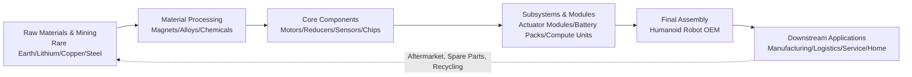

### 7.1.2 Formation Mechanism of the Strategic Bottleneck

Humanoid robots are currently in a phase transitioning from prototypes to small-scale ramp-up, exhibiting typical characteristics of "high complexity, low volume, high customization." The combination of these three features makes the supply chain a strategic bottleneck:

1.  **High Complexity**: A complete robot typically contains hundreds of SKUs, involving multi-disciplinary coupling of mechanics, electronics, electromagnetics, thermal management, and software.
2.  **Low Volume**: Compared to automobiles produced in hundreds of thousands to millions annually, current batch sizes for humanoid robots are small, making suppliers reluctant to expand capacity specifically.
3.  **High Customization**: Actuators, dexterous hands, force-controlled joints, and bipedal structures often require custom design and are difficult to source as off-the-shelf components.

!!! note "Terminology Explanation: SKU, Customization, Economies of Scale, Economies of Scope"
    - **SKU (Stock Keeping Unit)**: The smallest unit of inventory management, typically distinguished by different specifications, models, or packaging.
    - **Customization**: Adjusting product design or process according to specific customer needs, as opposed to offering standardized products.
    - **Economies of Scale**: The phenomenon where unit costs decrease as production volume increases, due to fixed cost amortization and learning effects.
    - **Economies of Scope**: Cost savings achieved by sharing resources when producing multiple products simultaneously.

When a supplier faces a customer with small volume, high requirements, and high customization, they will demand a higher premium, longer lead times, or even refuse the order. This creates a **capability bottleneck** and a **capacity bottleneck**. If the OEM cannot stably secure key components, it cannot validate the design or ramp up production, thus falling into a negative feedback loop: "Insufficient sales → Suppliers unwilling to invest → Costs cannot decrease → Even fewer sales."

!!! note "Terminology Explanation: Capability Bottleneck, Capacity Bottleneck, Negative Feedback Loop, Path Dependence"
    - **Capability Bottleneck**: Constraints where a supplier or internal team cannot meet technical requirements in design, process, or testing.
    - **Capacity Bottleneck**: Constraints where production facilities, equipment, or labor cannot meet demand volume.
    - **Negative Feedback Loop**: A self-reinforcing decline process in a system, where deviations from equilibrium are amplified.
    - **Path Dependence**: Early choices lock in subsequent development trajectories, making switching costs increase.

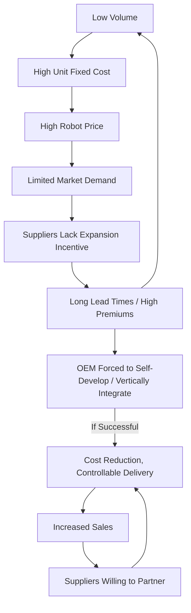

### 7.1.3 Systemic Nature of Supply Chain Risk

Supply chain risk has a **systemic** characteristic: disruption at a single node can propagate through the network, amplifying into delays in final delivery, quality issues, or cost surges. The automotive supply chain crisis after the 2008 financial crisis, the semiconductor shortage of 2020–2022, and the shipping congestion of 2021–2022 all demonstrate the fragility of modern "efficiency-first" supply chain designs when faced with shocks.

!!! note "Terminology Explanation: Systemic Risk, Cascading Failure, Bullwhip Effect, Resilience"
    - **Systemic Risk**: The risk of collapse of an entire system rather than a single unit, characterized by correlation and contagion.
    - **Cascading Failure**: A process where the failure of one node triggers the consecutive failure of adjacent nodes.
    - **Bullwhip Effect**: Small fluctuations in demand are amplified as they move upstream along the supply chain, causing severe oscillations in inventory and capacity.
    - **Resilience**: The ability of a system to recover and maintain function after a disturbance, encompassing the dimensions of absorption, adaptation, and recovery.

For humanoid robots, key risk nodes include: high-performance NdFeB magnets, harmonic reducers, RV reducers, force/torque sensors, high-precision encoders, high-compute SoCs/GPUs/NPUs, SiC/GaN power devices, and lithium battery cathode materials. These nodes are often characterized by **high supplier concentration, high switching costs, and long capacity expansion cycles**.

## 7.2 Humanoid Robot BOM and Supplier Tiers

### 7.2.1 Structure of the Bill of Materials (BOM)

The **Bill of Materials (BOM)** is the most fundamental document describing product composition, listing all raw materials, components, sub-assemblies, and their quantities required to manufacture one product. The BOM is not only the starting point for cost accounting but also the core data structure for procurement, planning, inventory management, and supplier collaboration.

!!! note "Terminology: BOM, EBOM, MBOM, Indented BOM, Phantom"
    - **BOM (Bill of Materials)**: A product structure table recording all materials and their hierarchical relationships that compose a product.
    - **EBOM (Engineering BOM)**: An engineering design view organized by functional modules.
    - **MBOM (Manufacturing BOM)**: A manufacturing view organized by assembly processes and production lines.
    - **Indented BOM**: Displays part relationships with parent-child level indentation.
    - **Phantom**: An assembly unit that exists as a logical subcomponent in the BOM but is not individually stored in inventory.

BOM cost can be directly calculated by rolling up unit usage and unit price:

$$
C_{\text{BOM}} = \sum_{i} q_i \cdot p_i
$$

Where \(q_i\) is the unit usage of the \(i\)-th part, and \(p_i\) is its purchase unit price or manufacturing cost. For multi-level BOMs, recursive bottom-up aggregation is required:

$$
C_{\text{parent}} = \sum_{j} q_j \cdot C_j + C_{\text{assembly},j}
$$

Here, \(C_j\) can be either the rolled-up cost of a sub-assembly or the unit price of a purchased part.

### 7.2.2 Supplier Tiers: Tier-1 / Tier-2 / Tier-3

The automotive and electronics industries commonly adopt a tiered supplier system. For humanoid robots, a similar classification can be applied as follows:

- **Tier-1 Suppliers**: Deliver directly to the final assembly manufacturer, typically providing subsystems such as actuator modules, dexterous hands, battery packs, and computing platforms.
- **Tier-2 Suppliers**: Supply to Tier-1 suppliers, providing motors, reducers, drivers, sensors, structural parts, PCBs, etc.
- **Tier-3 Suppliers**: Provide basic materials such as raw materials, chips, magnetic materials, chemicals, specialty gases, and precision bearings.

!!! note "Terminology: Tier-1, Tier-2, Tier-3, N-tier Supply Chain, OEM, ODM"
    - **Tier-1 Supplier**: A supplier that delivers subsystems or modules directly to the final assembly plant.
    - **Tier-2 Supplier**: A supplier that provides parts or materials to Tier-1 suppliers.
    - **Tier-3 Supplier**: A more upstream supplier of raw materials, basic components, or equipment.
    - **N-tier Supply Chain**: A complete supply network spanning multiple tiers.
    - **OEM (Original Equipment Manufacturer)**: Typically refers to the final product manufacturer.
    - **ODM (Original Design Manufacturer)**: Responsible for design and manufacturing, with the brand owned by the buyer.

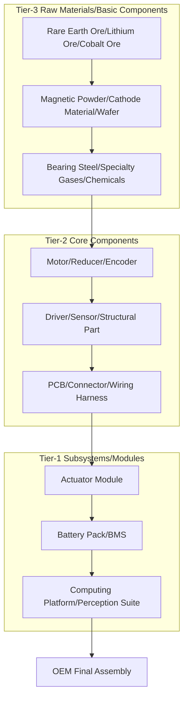

### 7.2.3 Cost Breakdown of Humanoid Robot BOM (Public Estimates)

As humanoid robots have not yet entered the large-scale consumer market, publicly available cost data is mostly industry estimates. The table below provides a **public estimate** structure based on teardown and supply chain research, intended only to illustrate cost distribution and not specific to any particular model.

| Subsystem | Estimated % of BOM Cost | Main Components | Supply Concentration Characteristics |
|---|---|---|---|
| Actuator System (Motor + Reducer + Driver) | 35–45 | Frameless Torque Motor, Harmonic/Planetary Reducer, Servo Drive | High |
| Sensors and Perception Suite | 15–25 | Camera, LiDAR, IMU, Force/Torque Sensor, Encoder | Medium-High |
| Computing Platform | 10–18 | SoC/GPU/NPU, Memory, Storage, Carrier Board | High |
| Battery and Power Electronics | 8–15 | Battery Cell, BMS, MOSFET/SiC/GaN, Connector | Medium |
| Structural Parts and Exterior Components | 5–10 | Aluminum Alloy, Carbon Fiber, Plastic, Cable | Low |
| Software and Algorithm Licensing | 3–8 | Middleware, Simulation, AI Model, Patent | Medium |
| Others (Packaging, Testing, Consumables) | 2–5 | Fixture, Test Equipment, Transportation | Low |

!!! note "Terminology: BOM Cost Breakdown, Cost Driver, Cost Concentration"
    - **BOM Cost Breakdown**: A structural analysis that splits the total product cost by subsystem or component.
    - **Cost Driver**: The variable or part category with the greatest impact on total cost.
    - **Cost Concentration**: The proportion of total cost accounted for by a few components, often used to identify cost reduction priorities.

The actuator system typically accounts for over 35% of the BOM, making it the most concentrated area of cost and supply risk. Although the computing platform accounts for a smaller share than the actuator system, its rapid technological iteration and highly concentrated supplier base also constitute a key strategic bottleneck.

---

## 7.3 Key Component Supplier Map

The humanoid robot supply chain spans multiple industries including precision machinery, electromagnetics, semiconductors, chemicals, and materials. This section maps the supplier landscape by key component categories, listing representative companies. As the market is still in its early stages, the following shares and positions are **industry estimates** or information publicly disclosed by companies. A complete long list can be found in Appendix D.

!!! note "Tip: Complete Supplier List"
    The tables in this section only list 5–10 representative companies per category to illustrate the industry structure and technology roadmap. For a more complete list of major suppliers and companies, please refer to **Appendix D**.

### 7.3.1 Motors and Drives

**Motors** are actuating elements that convert electrical energy into mechanical energy. Humanoid robot joints commonly use **frameless torque motors** and **Brushless DC Motors (BLDC)**, paired with reducers to output high torque density.

!!! note "Term Explanation: Frameless Torque Motor, Brushless DC Motor, Permanent Magnet Synchronous Motor, Torque Density"
    - **Frameless Torque Motor**: A direct-drive motor composed of a rotor and stator without a housing or bearings, which can be directly embedded into a joint.
    - **Brushless DC Motor (BLDC)**: A DC motor that uses electronic commutation to replace mechanical brushes, offering long life and high efficiency.
    - **Permanent Magnet Synchronous Motor (PMSM)**: An AC motor where the rotor has permanent magnets and the stator current rotates synchronously with the rotor magnetic field.
    - **Torque Density**: The torque a motor can output per unit volume or unit mass, with units N·m/kg or N·m/L.

Motor control typically employs **Field-Oriented Control (FOC)**, which decouples the three-phase current into excitation and torque components using Clarke/Park transformations, achieving control performance similar to DC motors.

!!! note "Term Explanation: Field-Oriented Control (FOC), Clarke Transformation, Park Transformation, PWM, Inverter"
    - **Field-Oriented Control (FOC)**: A method that decomposes the stator current of an AC motor into two orthogonal components for controlling flux and torque separately.
    - **Clarke Transformation**: A mathematical transformation that converts a three-phase stationary coordinate system into a two-phase stationary coordinate system.
    - **Park Transformation**: A transformation that converts a two-phase stationary coordinate system into a coordinate system rotating with the rotor, enabling DC quantity control.
    - **PWM (Pulse Width Modulation)**: A technique that controls average voltage or current by adjusting the duty cycle of a switching signal.
    - **Inverter**: A power electronic circuit that converts direct current (DC) into alternating current (AC).

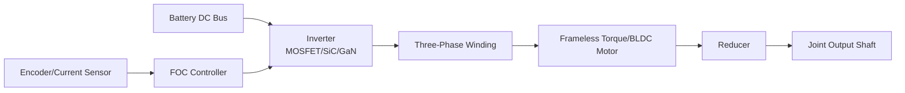

#### 7.3.1.1 Motor Electromagnetic-Thermal Coupling Fundamentals

A motor is an energy conversion device that transforms electrical energy into mechanical energy. For the Permanent Magnet Synchronous Motors (PMSM) and Brushless DC Motors (BLDC) commonly used in humanoid robot joints, the electromagnetic torque can be directly related by the **torque constant** $K_t$ and the quadrature-axis current $I_q$:

$$
T_e = K_t \cdot I_q
$$

Where $T_e$ is the electromagnetic torque (N·m), and the unit of $K_t$ is N·m/A. For an ideal permanent magnet motor, $K_t$ is numerically equal to the **back-EMF constant** $K_e$ in SI units ($K_t \approx K_e$), which satisfies:

$$
E_b = K_e \cdot \omega_m
$$

$E_b$ is the line-to-line back-EMF amplitude (V), and $\omega_m$ is the mechanical angular velocity of the motor (rad/s). The phase voltage balance equation can be written as:

$$
V_{dc} \approx \sqrt{3} \left( E_b + I \cdot R_s \right) = \sqrt{3} \left( K_e \omega_m + I R_s \right)
$$

$V_{dc}$ is the DC bus voltage (V), and $R_s$ is the phase winding resistance (Ω). This equation indicates that under a fixed bus voltage, the higher the speed, the smaller the voltage margin available for driving current, thus limiting the output torque in the high-speed region—marking the onset of the **flux-weakening region**.

!!! note "Term Explanation: Torque Constant, Back-EMF Constant, Phase Winding Resistance, Flux-Weakening Region"
    - **Torque Constant ($K_t$)**: The electromagnetic torque generated per unit current, N·m/A.
    - **Back-EMF Constant ($K_e$)**: The induced electromotive force generated per unit speed, V/(rad/s).
    - **Phase Winding Resistance ($R_s$)**: The DC resistance of each phase winding in the motor stator, Ω.
    - **Flux-Weakening Region**: The operating region where the motor's maximum speed is extended by applying a direct-axis demagnetizing current.

Motor losses mainly include **copper loss**, **iron loss**, and **mechanical loss**. In joint servo transient and short-term peak operating conditions, copper loss is usually dominant:

$$
P_{cu} = 3 I^2 R_s
$$

The total loss $P_{loss}$ is ultimately converted into heat, causing the winding temperature to rise. The winding temperature rise can be described by a first-order thermal resistance model:

$$
\Delta T = T_w - T_a = P_{loss} \cdot R_{th}
$$

$\Delta T$ is the winding-to-ambient temperature rise (K), $T_w$ is the winding temperature (℃), $T_a$ is the ambient temperature (℃), and $R_{th}$ is the equivalent thermal resistance from the winding to the environment (K/W). From this, the **continuous torque** $T_{cont}$ can be derived:

$$
T_{cont} = K_t \sqrt{ \frac{T_{w,max} - T_a}{3 R_s R_{th}} }
$$

$T_{w,max}$ is the maximum winding temperature allowed by the insulation class (e.g., Class F is 155 ℃). The actual peak torque $T_{peak}$ is constrained by magnet demagnetization, winding insulation, and the driver's current limit, and is typically provided in the motor datasheet; it cannot be simply extrapolated from the thermal model.

For periodic loads, the thermal limit can be checked using the **equivalent RMS torque**:

$$
T_{RMS} = \sqrt{ \frac{1}{t_{cycle}} \int_0^{t_{cycle}} T^2(t) \, dt }
$$

If $T_{RMS} \le T_{cont}$, the motor will not overheat during long-term operation; if there are short-term peaks, $T_{peak}$ and the driver current limit $I_{max}$ must be checked:

$$
T_{peak} = K_t \cdot I_{max}
$$

!!! note "Term Explanation: Copper Loss, Iron Loss, Thermal Resistance, Continuous Torque, RMS Torque, Peak Torque"
    - **Copper Loss**: Joule heat generated by current flowing through the winding resistance.
    - **Iron Loss**: Hysteresis and eddy current losses in the iron core caused by the alternating magnetic field.
    - **Thermal Resistance**: The resistance to heat flow along a heat transfer path, K/W.
    - **Continuous Torque**: The torque that can be continuously output under the rated temperature rise.
    - **RMS Torque**: The equivalent heating torque of a periodic load.
    - **Peak Torque**: The maximum torque allowed for short-term output.

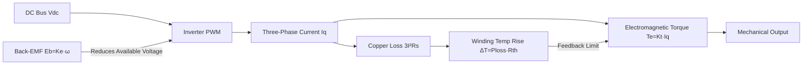

**Numerical Example**: A certain frameless torque motor has $K_t = 0.35\ \text{N·m/A}$, $R_s = 0.25\ \Omega$, $R_{th} = 2.5\ \text{K/W}$, ambient temperature $T_a = 40\ ^\circ\text{C}$, and insulation class F ($T_{w,max}=155\ ^\circ\text{C}$).

Continuous current:

$$
I_{cont} = \sqrt{\frac{155 - 40}{3 \times 0.25 \times 2.5}} \approx \sqrt{61.3} \approx 7.83\ \text{A}
$$

Continuous torque:

$$
T_{cont} = 0.35 \times 7.83 \approx 2.74\ \text{N·m}
$$

If the driver peak current is 30 A, the short-term peak torque is approximately $0.35 \times 30 = 10.5\ \text{N·m}$. Heavy-load joints in humanoid robots, such as hips and knees, typically require joint output in the 30–100 N·m range, so they must be used with high reduction ratio reducers[226][228].

| Company | Headquarters | Main Products/Positioning | Notes |
|---|---|---|---|
| Kollmorgen | USA | Frameless torque motors, servo motors | Widely used in collaborative robot joints |
| TQ-RoboDrive | Germany | Frameless motors, coreless motors | Commonly used in humanoid robot dexterous hands |
| Maxon | Switzerland | Brushless DC motors, gearboxes, drives | High precision, medical/aerospace background |
| Nidec | Japan | Brushless motors, HDD motors, servo motors | Large scale, significant cost advantage |
| Inovance Technology | China | Servo motors, inverters, drives | Domestic leader, covering industrial automation |
| Hechuan Technology | China | Servo motors and drives | Representative of domestic substitution |
| Buke Co., Ltd. | China | Low-voltage servos, frameless motors | Mobile robots/collaborative robots |
| Mingzhi Electric | China | Stepper motors, coreless motors, brushless motors | Micro motors for dexterous hands |
| Moog | USA | Precision motion control, frameless motors | High reliability for aerospace |
| Allied Motion | USA | Brushless motors, servo systems | Industrial and robotic applications |

The drive converts controller commands into power output. Joint drives require high current loop bandwidth, low EMI, compact size, and heat dissipation capability. Common solutions include three-phase half-bridge inverters based on MOSFET, SiC MOSFET, or GaN HEMT.

### 7.3.2 Reducers

Reducers are used to reduce motor speed and amplify output torque, serving as the core transmission component in humanoid robot joints. Common types include **harmonic drives**, **planetary gearboxes**, **cycloidal drives**, and **RV reducers (Rotary Vector reducers)**.

!!! note "Term Explanation: Harmonic Drive, Planetary Gearbox, Cycloidal Drive, RV Reducer, Backlash, Transmission Stiffness"
    - **Harmonic Drive**: A high-precision reducer that transmits motion and torque through elastic deformation of a flexspline, circular spline, and wave generator.
    - **Planetary Gearbox**: A gear mechanism where multiple planet gears rotate around a sun gear, offering compact structure and high efficiency.
    - **Cycloidal Drive**: A reduction mechanism using a cycloidal disc and pins for meshing, providing high torque and stiffness.
    - **RV Reducer**: A two-stage reduction mechanism, with the first stage being a planetary gear and the second a cycloidal pinwheel, used for heavy-load joints.
    - **Backlash**: The angular play in a gear pair during direction reversal, affecting control precision.
    - **Transmission Stiffness**: The ability of the output end to resist elastic deformation, affecting dynamic response.

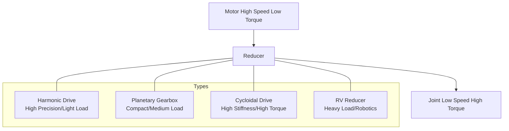

#### 7.3.2.1 Reducer Efficiency, Stiffness, and Reflected Inertia

The reducer not only changes the speed-torque relationship but also determines the energy loss, dynamic stiffness, and equivalent inertia of the transmission chain. Let the reduction ratio be $N = \omega_{in}/\omega_{out} = T_{out}/T_{in}$ (ignoring losses), and the transmission efficiency be $\eta$. The relationship between output power and input power is:

$$
P_{out} = \eta \cdot P_{in}
$$

The relationship between output torque and input torque is:

$$
T_{out} = \eta \cdot N \cdot T_{in}
$$

Efficiency losses mainly come from gear meshing friction, bearing friction, oil churning losses, and seal resistance. For harmonic drives, typical efficiency $\eta$ ranges between 80%–95%, varying with load, speed, grease temperature, and operating time; planetary gearbox efficiency is usually 90%–98%; cycloidal and RV reducers, due to multi-tooth meshing, have slightly lower efficiency than planetary types but higher stiffness.

!!! note "Term Explanation: Transmission Efficiency, Gear Ratio, Mechanical Advantage, Meshing Loss"
    - **Transmission Efficiency**: The ratio of output power to input power, reflecting energy loss.
    - **Gear Ratio**: The ratio of input speed to output speed.
    - **Mechanical Advantage**: The ratio of output force/torque to input force/torque.
    - **Meshing Loss**: Power loss due to friction and deformation at gear meshing surfaces.

From a control perspective, the reducer **reflects** the load inertia to the motor shaft, with the equivalent inertia being:

$$
J_{ref} = \frac{J_{load}}{N^2}
$$

$J_{load}$ is the rotational inertia of the load (kg·m²). A high reduction ratio can significantly reduce the acceleration torque required on the motor side but also lowers the joint output speed. The total equivalent inertia must include the reducer's own inertia $J_{gear}$ and the motor rotor inertia $J_m$:

$$
J_{eq} = J_m + J_{gear} + \frac{J_{load}}{N^2}
$$

The **torsional stiffness** $K_\theta$ of the transmission chain determines the elastic deformation of the joint under load. If the motor-side stiffness is $K_m$ and the equivalent stiffness on the reducer output side is $K_g$, the equivalent stiffness of the two in series is:

$$
\frac{1}{K_{eq}} = \frac{1}{K_m} + \frac{1}{N^2 K_g}
$$

The angular deformation at the output end:

$$
\theta_{deflection} = \frac{T_{out}}{K_{eq}}
$$

For humanoid robot joints, backlash and torsional stiffness together affect the position loop bandwidth and force control accuracy. High-dynamic joints typically require backlash $< 1\ \text{arcmin}$ and torsional stiffness $> 10^4\ \text{N·m/rad}$.

!!! note "Term Explanation: Reflected Inertia, Equivalent Inertia, Torsional Stiffness, Backlash, Position Loop Bandwidth"
    - **Reflected Inertia**: The equivalent value of load inertia converted to the motor shaft.
    - **Equivalent Inertia**: The total rotational inertia on the motor shaft side, including the motor, reducer, and reflected load component.
    - **Torsional Stiffness**: The ability of the transmission chain to resist torsional deformation, N·m/rad.
    - **Backlash**: The angular play during direction reversal.
    - **Position Loop Bandwidth**: The maximum frequency of a sinusoidal command that the position closed loop can respond to.

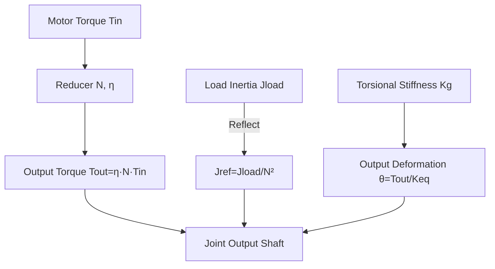

**Numerical Example**: A harmonic drive with $N = 100$, $\eta = 0.90$, load inertia $J_{load} = 0.05\ \text{kg·m}^2$, motor rotor inertia $J_m = 2 \times 10^{-4}\ \text{kg·m}^2$, and reducer inertia $J_{gear} = 1 \times 10^{-4}\ \text{kg·m}^2$.

Reflected inertia:

$$
J_{ref} = \frac{0.05}{100^2} = 5 \times 10^{-6}\ \text{kg·m}^2
$$

Equivalent inertia:

$$
J_{eq} = 2 \times 10^{-4} + 1 \times 10^{-4} + 5 \times 10^{-6} \approx 3.05 \times 10^{-4}\ \text{kg·m}^2
$$

It can be seen that the motor and reducer inertia dominate. If the motor outputs 3 N·m, the joint output torque is:

$$
T_{out} = 0.90 \times 100 \times 3 = 270\ \text{N·m}
$$

This illustrates that when selecting the reduction ratio, a trade-off must be made between "high reduction ratio for large output torque" and "low reduction ratio for high output speed" [235].

| Company | Headquarters | Main Products | Notes |
|---|---|---|---|
| Harmonic Drive Systems | Japan | Harmonic drives | Industry leader, global market share leader |
| HD Systems (Harmonic Drive LLC) | USA | Harmonic drives | North American market |
| Nabtesco | Japan | RV reducers, harmonic drives | Global leader in RV reducers |
| Leaderdrive | China | Harmonic drives | Domestic leader, rapidly increasing market share |
| Life Harmonic | China | Harmonic drives | Domestic substitution |
| Shuanghuan Transmission | China | RV reducers, planetary gearboxes | Precision gear manufacturing foundation |
| Zhongda Leader | China | Planetary/harmonic/RV | Robot reducer layout |
| Nantong Zhenkang | China | RV reducers | Welding robot supporting |
| Sumitomo Drive Technologies | Japan | Cycloidal/planetary reducers | Industrial transmission |
| SEW-EURODRIVE | Germany | Planetary/industrial gears | Industrial automation |

### 7.3.3 Sensors

Humanoid robots need to perceive their own state (proprioception) and the external environment (exteroception). Proprioceptive sensors include **encoders**, **Inertial Measurement Units (IMUs)**, and **force/torque sensors**; exteroceptive sensors include **cameras (RGB/RGB-D)**, **LiDAR**, **millimeter-wave radar**, **ultrasound**, etc.

!!! note "Terminology: Encoder, IMU, Force/Torque Sensor, RGB-D, LiDAR, MEMS"
    - **Encoder**: A sensor that converts angular or linear displacement into an electrical signal. Types include optical, magnetic, and rotary encoders.
    - **IMU (Inertial Measurement Unit)**: A combination of inertial sensors that measure three-axis acceleration and three-axis angular velocity.
    - **Force/Torque Sensor**: A sensor that measures contact force and torque, commonly used in wrists, ankles, and collaborative robot joints.
    - **RGB-D Camera**: A camera that simultaneously outputs color images and depth images.
    - **LiDAR (Light Detection and Ranging)**: A 3D sensor that measures distance by emitting laser pulses and receiving their echoes.
    - **MEMS (Micro-Electro-Mechanical Systems)**: Micro-electromechanical systems used for low-cost IMUs, microphones, and pressure sensors.

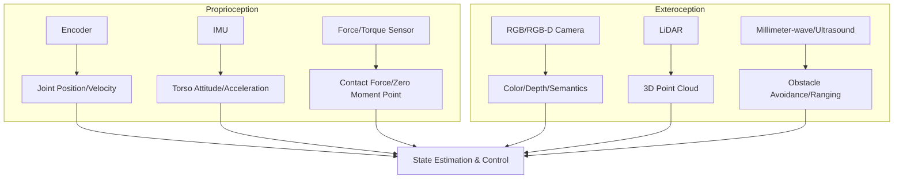

| Company | Headquarters | Main Products | Remarks |
|---|---|---|---|
| Heidenhain | Germany | High-precision optical/magnetic encoders | High-end industrial and robotics |
| Renishaw | UK | Magnetic encoders, gratings | Precision motion |
| Tamagawa Seiki | Japan | Encoders, resolvers | Servo motor matching |
| OPG | China | Optical encoders | Domestic alternative |
| Bosch Sensortec | Germany | MEMS IMU, barometer | Consumer electronics and robotics |
| TDK/InvenSense | Japan/USA | MEMS IMU | Low-cost solution |
| ATI Industrial Automation | USA | 6-axis force/torque sensors | Robot wrists/ankles |
| Sunrise Instruments | China | 6-axis force sensors | Domestic leader |
| Intel RealSense | USA | RGB-D cameras | Common for robot development |
| Ouster / Hesai / Livox | USA/China | Solid-state/mechanical LiDAR | Autonomous driving and robotics |

#### 7.3.3.1 Vision/Depth Camera Module

The vision/depth camera is the core entry point for humanoid robot exteroception and scene understanding. Current mainstream 3D depth acquisition technologies include **structured light**, **Time-of-Flight (ToF, including dToF/iToF)**, and **stereo vision**, each relying on different combinations of optical components, emitters, and image sensors.

!!! note "Terminology: Structured Light, Time-of-Flight (ToF), dToF, iToF, SPAD, VCSEL, Stereo Vision"
    - **Structured Light**: A technique that projects a known infrared pattern and analyzes its deformation on object surfaces to obtain depth images.
    - **Time-of-Flight (ToF)**: A 3D imaging technique that measures the round-trip time of light pulses or modulated light to calculate distance.
    - **dToF (direct ToF)**: Directly measures the round-trip time of a single light pulse, often used with SPAD for long-range, low-power depth sensing.
    - **iToF (indirect ToF)**: Indirectly calculates distance by measuring the phase shift of modulated light, suitable for medium-to-short range high-resolution scenarios.
    - **SPAD (Single-Photon Avalanche Diode)**: A single-photon avalanche diode with high sensitivity, used for dToF photon counting.
    - **VCSEL (Vertical-Cavity Surface-Emitting Laser)**: A vertical-cavity surface-emitting laser commonly used as a light source for structured light and ToF.
    - **Stereo Vision**: A passive vision method that recovers depth using disparity from two cameras and dense matching algorithms.

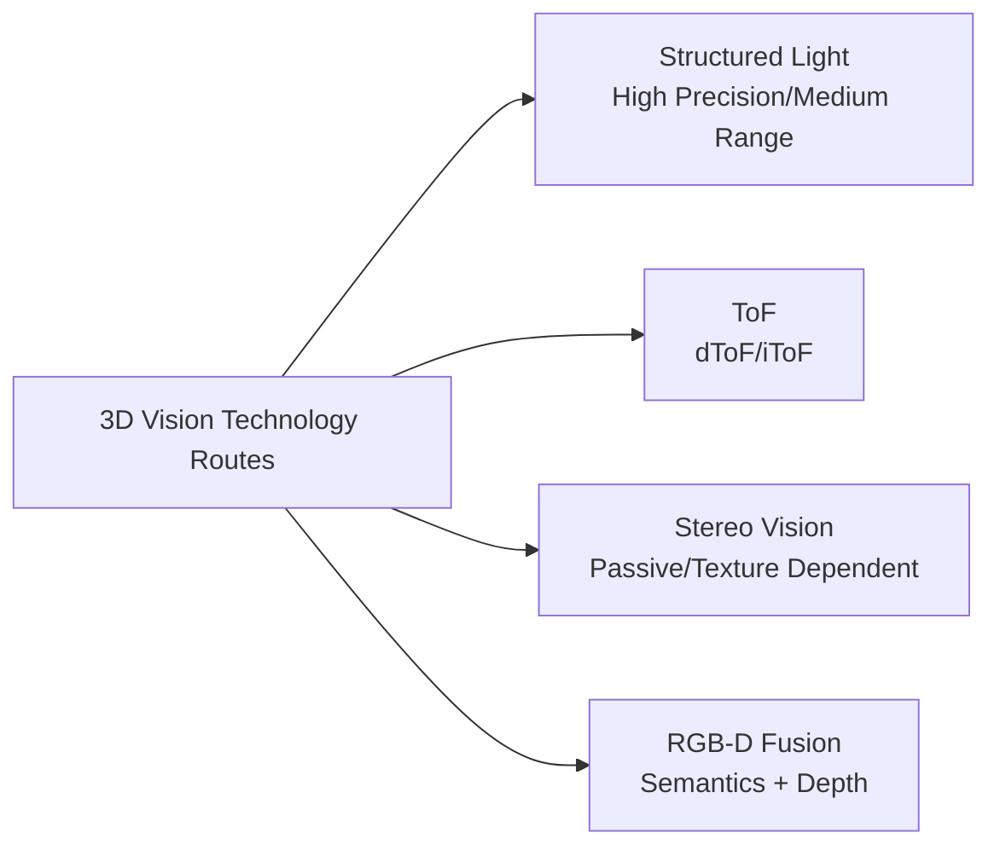

| Company | Headquarters | Core Technology & Products | Typical Robot Applications | Supply Status/Remarks |
|---|---|---|---|---|
| Luminar Photonics | China | SPAD/SiPM dToF sensors | Depth camera, obstacle avoidance | Domestic chip, ramping up production[Company Website] |
| Silan Microelectronics | China | iToF image sensors, 3D perception solutions | Service robot vision | Public information |
| Fusheng Technology | China | SPAD dToF chips, structured light projection | Robotics/face recognition/automotive | Public information |
| Feixin Electronics | China | dToF LiDAR/depth sensing chips | Robotics, vacuum cleaners | Public information |
| Hikrobot | China | Industrial cameras, RGB-D, stereo cameras | Logistics/manufacturing robots | Subsidiary of Hikvision |
| Orbbec | China | Structured light/ToF 3D vision modules | Service/humanoid robots | Domestic 3D vision leader |
| Perceptiv | China | Industrial 3D cameras (structured light/ToF) | Logistics grasping, inspection | Public information |
| Intel RealSense | USA | Stereo/structured light/RGB-D depth cameras | Robot development prototypes | Product line adjustments, monitor |
| Sony | Japan | ToF image sensors, CMOS | High-end 3D cameras | Core component supplier |
| Sunny Optical | China | Optical lenses/modules/ToF modules | Mobile/robot vision | Stable optical component supply |

#### 7.3.3.2 LiDAR

LiDAR constructs 3D point clouds by emitting laser pulses and receiving their echoes, making it an important sensor for humanoid robot navigation, mapping, and obstacle detection. Based on scanning methods, it can be divided into mechanical rotating, MEMS semi-solid-state, OPA/Flash solid-state, and FMCW routes, each with significant trade-offs in field of view, resolution, cost, and reliability.

!!! note "Terminology: Mechanical Rotating LiDAR, MEMS LiDAR, Solid-State LiDAR, OPA, Flash LiDAR, FMCW LiDAR"
    - **Mechanical Rotating LiDAR**: Achieves horizontal field of view coverage through 360° rotation scanning, with high point cloud density but high cost and limited lifespan.
    - **MEMS LiDAR**: A semi-solid-state solution using a micro-electromechanical mirror to deflect the beam, offering smaller size and lower cost than mechanical types.
    - **Solid-State LiDAR**: No mechanical scanning parts, high reliability, including OPA, Flash, and other routes.
    - **OPA (Optical Phased Array)**: Optical phased array, achieving electronic scanning through phase control.
    - **Flash LiDAR**: Illuminates the entire field of view at once, suitable for short-range, high-frame-rate applications.
    - **FMCW LiDAR**: Frequency Modulated Continuous Wave LiDAR, capable of simultaneous ranging and velocity measurement with strong anti-interference capability.

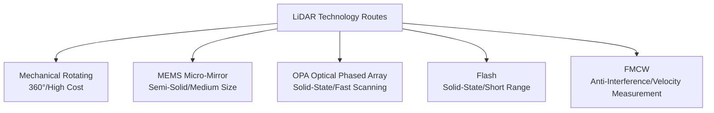

| Company | Headquarters | Main Products/Technology | Typical Robot Applications | Supply Status/Notes |
|---|---|---|---|---|---|
| Hesai Technology | China | Mechanical/Hybrid Solid/Solid-State LiDAR | Autonomous Driving, Robotics | Public Prospectus/Annual Report |
| RoboSense | China | MEMS/Solid-State LiDAR, Perception Solutions | Autonomous Driving, Robotics | Hong Kong Listed Public Information |
| Benewake | China | dToF/Solid-State LiDAR | Robotics, Internet of Vehicles | Public Information |
| LeiShen Intelligent | China | Mechanical/Hybrid Solid-State LiDAR | Robotics, Unmanned Vehicles | Public Information |
| JiaGuang Technology | China | Solid-State/Flash LiDAR | Robotics, AGV | Public Information |
| Livox | China | Non-Repeating Scanning LiDAR | Robotics, Surveying & Mapping | Under DJI |
| Ouster | USA | Solid-State Digital LiDAR | Industrial/Autonomous Driving | Public Information |
| Luminar | USA | 1550 nm Long-Range LiDAR | Autonomous Driving | Long-Range Solution, High Cost |
| Innovusion | China | 1550 nm Image-Grade LiDAR | Autonomous Driving | High Cost |

#### 7.3.3.3 IMU

**Inertial Measurement Unit (IMU)** measures three-axis acceleration and three-axis angular velocity, forming the basis for state estimation, balance control, and dead reckoning in humanoid robots. Consumer-grade solutions are primarily MEMS-based, while high-end scenarios may use Fiber Optic Gyroscopes (FOG) or Ring Laser Gyroscopes (RLG) for improved accuracy.

!!! note "Terminology Explanation: MEMS IMU, Bias Instability, FOG, RLG, Integrated Navigation"
    - **MEMS IMU**: An inertial measurement unit based on micro-electromechanical systems, small in size, low in cost, suitable for mass applications.
    - **Bias Instability**: A metric for the random drift of a gyroscope's zero-bias output over time, unit: °/h.
    - **FOG (Fiber Optic Gyroscope)**: High precision, shock-resistant, commonly used in high-end navigation.
    - **RLG (Ring Laser Gyroscope)**: Extremely high precision, often used in aerospace and high-end equipment.
    - **Integrated Navigation (GNSS/INS integration)**: Fuses inertial navigation with satellite navigation to suppress drift and improve positioning accuracy.

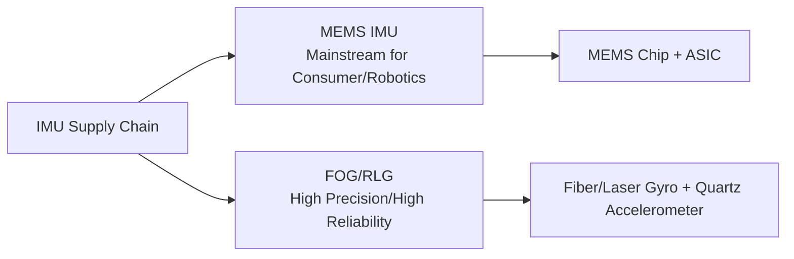

| Company | Headquarters | Main Products | Typical Robot Applications | Supply Status/Notes |
|---|---|---|---|---|
| Bosch Sensortec | Germany | MEMS IMU, Barometer | Consumer/Service Robotics | Mature Supply |
| TDK/InvenSense | Japan/USA | MEMS IMU, IMU + Barometer | Robotics, Wearables | Low-Cost Solution |
| XinDongLianKe | China | High-Performance MEMS IMU | Robotics, Unmanned Systems | STAR Market Public Information |
| StarNeto | China | MEMS/Fiber Optic IMU, Integrated Navigation | Unmanned Vehicles/Robotics | Public Information |
| Huayi Technology | China | Inertial Navigation, IMU Testing | Autonomous Driving/Robotics | Public Information |
| BDStar Navigation | China | GNSS/INS Integrated Navigation, High-Precision Positioning | Robotics, Unmanned Systems | Public Information |
| STMicroelectronics | Switzerland/Italy | MEMS IMU, Accelerometer | Consumer/Industrial | Mass Supply |
| Analog Devices | USA | High-Precision MEMS IMU | Industrial/Robotics | High-End Solution |

#### 7.3.3.4 Force/Torque and Tactile

Force/torque sensors provide contact force and torque feedback for humanoid robots, crucial for compliant control, dual-arm collaboration, and legged balance. Wrists and ankles are typically equipped with **six-axis force/torque sensors**, fingertips and soles can use single-axis force sensors, while dexterous hands rely on high-density tactile arrays to perceive slip, texture, and grip state.

!!! note "Terminology Explanation: Six-Axis Force/Torque Sensor, Single-Axis Force Sensor, Tactile Sensor, Taxel, Strain Gauge, Capacitive, Piezoresistive"
    - **Six-Axis Force/Torque Sensor**: A sensor that simultaneously measures three-dimensional force and three-dimensional torque.
    - **Single-Axis Force Sensor**: A sensor that measures force magnitude in a single direction.
    - **Tactile Sensor**: A skin-like sensor that detects contact force, pressure, temperature, slip, etc.
    - **Taxel**: An individual sensing pixel in a tactile array.
    - **Strain Gauge/Capacitive/Piezoresistive**: Different transduction principles for force sensors, based on strain gauge deformation, capacitive plate distance change, and semiconductor piezoresistive effect, respectively.

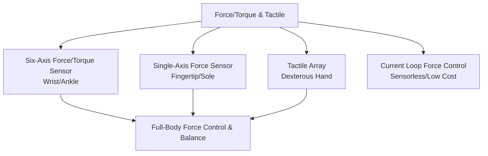

| Company | Headquarters | Main Products | Typical Robot Applications | Supply Status/Notes |
|---|---|---|---|---|
| ATI Industrial Automation | USA | Six-Axis Force/Torque Sensor | Wrist/Ankle/Collaborative Robots | Industry Benchmark |
| Robotiq | Canada | Force/Torque Sensor, Gripper | Collaborative Robot End-Effector | Public Information |
| OnRobot | Denmark | Force-Controlled Sensor, Gripper | Collaborative Assembly | Public Information |
| Bota Systems | Switzerland | Six-Axis Force Sensor | Legged/Humanoid Robots | Public Information |
| Kistler | Switzerland | Piezoelectric Force/Torque Sensor | Testing & Industrial | High Precision |
| SRI Instruments | China | Six-Axis Force Sensor | Robot Wrist/Ankle/Testing | Domestic Leader |
| Kunwei Technology | China | Six-Axis Force/Torque Sensor | Collaborative/Humanoid Robots | Public Information |
| Keli Sensing | China | Weighing/Force Sensor, Six-Axis Force | Industrial/Logistics/Robotics | Public Information |
| Hanwei Technology | China | Flexible Pressure/Tactile Sensor | Robot Skin, Wearables | Public Information |
| Soft Robotics Technology | China | Flexible Gripper, Tactile Sensing | Food/3C Grasping | Public Information |
| Tashan Technology/Touchlab | UK/China | Electronic Skin/Tactile Array | Dexterous Hand, Service Robots | Public Information |

#### 7.3.3.5 Encoders

Encoders provide position, velocity, and direction feedback for joints, a prerequisite for closed-loop control in servo systems. By principle, they can be classified as optical encoders, magnetic encoders, and resolvers; by output, as incremental and absolute. High precision, low latency, oil resistance, and vibration tolerance are key selection criteria for robot joint encoders.

!!! note "Terminology Explanation: Optical Encoder, Magnetic Encoder, Resolver, Resolution, Lines"
    - **Optical Encoder**: An encoder that detects angular displacement using a grating disc and photodetector; high precision but sensitive to oil contamination.
    - **Magnetic Encoder**: An encoder that detects angular displacement using magnetic poles and Hall/magnetoresistive elements; strong resistance to contamination.
    - **Resolver**: An angle sensor based on electromagnetic induction; resistant to harsh environments and high temperatures.
    - **Resolution**: The smallest angle or displacement an encoder can distinguish.
    - **Lines**: The number of pulses output per revolution by an incremental encoder, determining the base resolution.

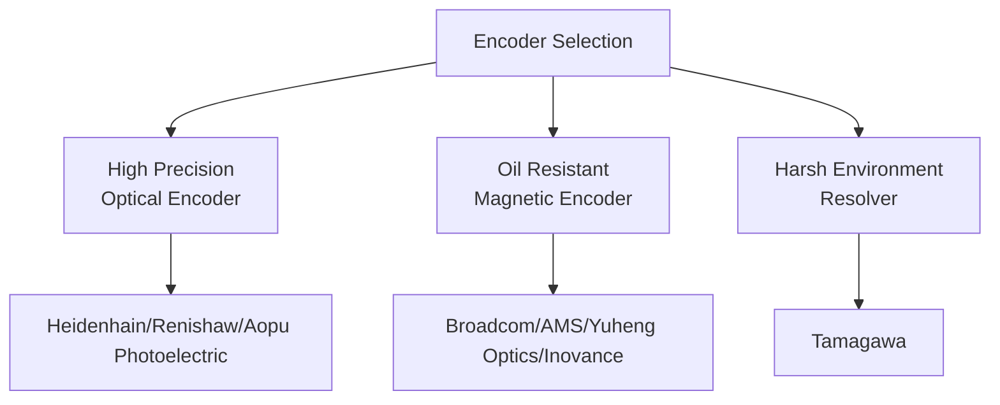

| Company | Headquarters | Main Products | Typical Robot Applications | Supply Status/Remarks |
|---|---|---|---|---|---|
| Heidenhain | Germany | High-precision optical/magnetic encoders | High-end machine tools/robots | Imported high-end |
| Renishaw | UK | Magnetic encoders, linear scales | Precision motion | Imported |
| Broadcom | USA | Optical encoder ICs | Servo motors | Core component supplier |
| AMS-Osram | Austria | Magnetic position sensors, encoder ICs | Industrial/automotive | Public information |
| CUI Devices | USA | Incremental/absolute encoders | Servo motors | Public information |
| US Digital | USA | Optical/magnetic encoders | Robot joints | Public information |
| Maxon | Switzerland | Encoders, motor+encoder modules | High-end robots | Integrated solution |
| Tamagawa Seiki | Japan | Encoders, resolvers | Servo motor support | Japanese leader |
| OPG | China | Optical encoders, linear scales | Machine tools/robots | Domestic alternative |
| Yuheng Optics | China | Optical encoders | Servo/robots | Domestic alternative |
| Inovance Technology | China | Magnetic encoders, servo-matched encoders | Domestic servo | Self-supply + external supply |
| Moons' Industries | China | Encoders with stepper/servo support | Robots | Public information |

#### 7.3.3.6 Microphones and Audio

The microphone and audio subsystem handles voice interaction, environmental sound perception, and sound source localization for humanoid robots. Consumer-grade solutions primarily use MEMS microphones, typically deployed in arrays, combined with beamforming, echo cancellation, and voice activity detection algorithms for far-field sound pickup.

!!! note "Terminology: MEMS Microphone, Microphone Array, Beamforming, Far-field Sound Pickup, Voice Activity Detection"
    - **MEMS Microphone**: A capacitive microphone based on micro-electromechanical systems technology, small in size, with good consistency, suitable for arrays.
    - **Microphone Array**: Multiple microphones arranged geometrically to achieve sound source localization and beamforming.
    - **Beamforming**: Enhancing sound from a specific direction while suppressing noise and reverberation through signal processing.
    - **Far-field Sound Pickup**: The ability to capture voice from a relatively long distance (several meters).
    - **Voice Activity Detection (VAD)**: Technology for identifying the start and end of speech.


| Company | Headquarters | Main Products | Typical Robot Applications | Supply Status/Remarks |
|---|---|---|---|---|
| Goertek | China | MEMS microphones, acoustic modules | Smart speakers/robots | Global acoustic leader |
| AAC Technologies | China | MEMS microphones, speakers | Mobile phones/robots | Public information |
| MEMSensing | China | MEMS microphones, pressure sensors | Consumer electronics/robots | Public information (STAR Market) |
| Knowles | USA | MEMS microphones | High-end consumer electronics | Public information |
| STMicroelectronics | Switzerland/Italy | MEMS microphone ASICs | Consumer/industrial | Public information |
| TDK/InvenSense | Japan/USA | MEMS microphones | Consumer/robots | Public information |

#### 7.3.3.7 Millimeter-Wave Radar and Ultrasonics

Millimeter-wave radar and ultrasonics, as low-cost, all-weather auxiliary sensors, are often used in conjunction with cameras and LiDAR. Millimeter-wave radar can provide distance and velocity information even in smoke, dust, rain, snow, and low-light conditions; ultrasonics are used for close-range obstacle avoidance and coarse localization.

!!! note "Terminology: Millimeter-Wave Radar, Ultrasonic, FMCW Radar, Doppler Effect, Sonar"
    - **Millimeter-Wave Radar (mmWave radar)**: Radar operating in the 30–300 GHz frequency band, capable of ranging and velocity measurement.
    - **Ultrasonic**: Uses mechanical wave reflection for distance measurement, low cost, suitable for short range.
    - **FMCW Radar**: Frequency Modulated Continuous Wave radar, capable of simultaneous ranging and velocity measurement.
    - **Doppler Effect**: The phenomenon of frequency shift due to relative motion between a wave source and an observer.
    - **Sonar**: A device that uses sound waves to detect objects underwater or in the air.

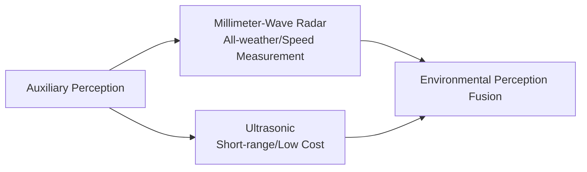

| Company | Headquarters | Main Products | Typical Robot Applications | Supply Status/Remarks |
|---|---|---|---|---|
| Texas Instruments | USA | mmWave radar chips (AWR/IWR) | Robots, automotive | Public information |
| NXP Semiconductors | Netherlands | 77 GHz radar chips | Automotive/robots | Public information |
| Infineon | Germany | mmWave radar sensors | Automotive/robots | Public information |
| Bosch | Germany | Millimeter-wave radar modules | Automotive/robots | Public information |
| Continental | Germany | Millimeter-wave radar, ADAS sensors | Automotive/robots | Public information |
| HASCO | China | Millimeter-wave radar, ADAS modules | Automotive/robots | Public information |
| Desay SV | China | Millimeter-wave radar, domain controllers | Automotive/robots | Public information |
| Baolong Technology | China | Millimeter-wave radar, ultrasonic sensors | Automotive/robots | Public information |
| Audiowell | China | Ultrasonic sensors | Robots, automotive | Public information |
| Inovance Technology | China | Ultrasonic/proximity sensors | Industrial/mobile robots | Public information |

#### 7.3.3.8 Multi-Sensor Fusion and Data Synchronization

Multi-sensor fusion integrates perception data from different physical principles, time scales, and spatial resolutions into a unified environmental model. The prerequisite for achieving fusion is precise time synchronization (soft sync or hard sync PPS/PTP) and extrinsic calibration. The choice of sensor supplier not only affects hardware cost but also determines the development workload for data interfaces, driver adaptation, and fusion algorithms.

!!! note "Terminology: Time Synchronization, Extrinsic Calibration, Timestamp, Soft Sync, Hard Sync, Kalman Filter"
    - **Time Synchronization**: The process of unifying the time reference for data from multiple sensors.
    - **Extrinsic Calibration**: The process of determining the spatial pose relationship between different sensors.
    - **Timestamp**: A time label marking the moment of data acquisition.
    - **Soft Sync**: Aligning timestamps of different sensors via software, typically achieving millisecond-level accuracy.
    - **Hard Sync**: Achieving microsecond-level synchronization via hardware trigger signals (e.g., PPS, PTP).
    - **Kalman Filter**: A state estimation algorithm that fuses multiple noisy estimates from different sources.

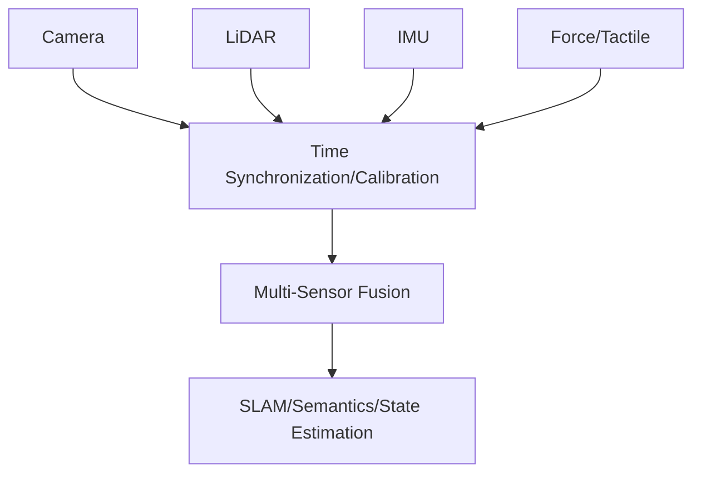

When evaluating sensor suppliers, robot OEMs should consider not only single-point performance but also whether the supplier provides standard ROS/ROS2 drivers, SDKs, calibration tools, and long-term supply commitments. Switching suppliers often entails recalibration and algorithm tuning, and the hidden costs cannot be ignored.

#### 7.3.3.9 Evaluation of Domestic Substitution in the Sensor Supply Chain

From a supply chain security perspective, sensors are a high-priority category for domestic substitution. The table below provides a qualitative assessment of major sensor categories across four dimensions: localization progress, technology readiness level, main bottlenecks, and typical domestic suppliers. It is important to emphasize that domestic substitution is not simply a pin-to-pin replacement; it often involves recalibration, algorithm adaptation, and reliability verification.

!!! note "Terminology: Import Substitution, Technology Readiness Level, Qualification Cycle, Reliability Verification"
    - **Import Substitution**: The process of replacing imported products with products from domestic or local suppliers.
    - **Technology Readiness Level (TRL)**: A scale indicating the maturity of a technology from concept to mass production application.
    - **Qualification Cycle**: The time required for a new product from sample verification to volume procurement.
    - **Reliability Verification**: The process of confirming that a product meets usage requirements through environmental, life, and stress testing.

| Sensor Category | Localization Progress | Technology Maturity | Main Bottleneck | Typical Domestic Suppliers |
|---|---|---|---|---|
| General MEMS IMU | High | Mature | High-end bias stability | Xindong Lianke, StarNeto |
| Photoelectric Encoder | Medium | Near Mature | High-precision grating, subdivision circuit | Aopu Optoelectronics, Yuheng Optics |
| Magnetoelectric Encoder | Medium-High | Mature | Accuracy in high temperature/oil environment | Inovance, Mingsi |
| Six-Axis Force Sensor | Medium | Improving | Crosstalk compensation, overload protection | Yuli, Kunwei, Keli |
| 3D Vision Module | Medium-High | Mature | High-end SPAD/VCSEL chips | Orbbec, Hikrobot |
| LiDAR | High | Mature | Long-range/solid-state chips | Hesai, RoboSense, Benewake |
| MEMS Microphone | High | Mature | High-end signal-to-noise ratio | Goertek, AAC, MEMSensing |

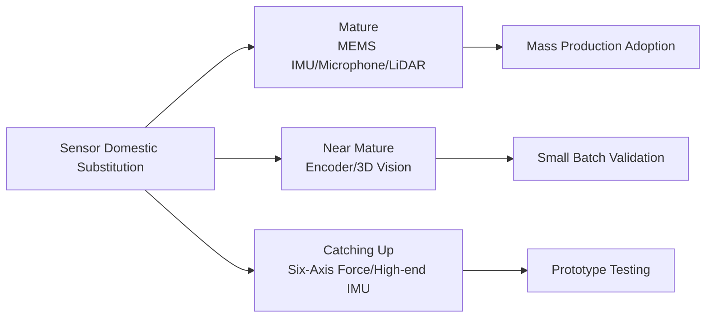

The supplier map for the above sensor sub-segments can be summarized in the following diagram. It is important to emphasize that humanoid robots typically adopt a multi-sensor fusion architecture, and switching a single sensor supplier requires recalibration of the fusion algorithm and data synchronization link.

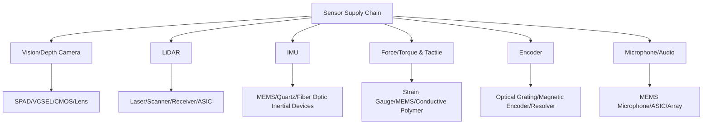


### 7.3.4 Computing Platform

The computing platform for humanoid robots needs to simultaneously run perception, state estimation, motion planning, control, and AI inference. The mainstream architecture includes **System-on-Chip (SoC)** integrating CPU+GPU+NPU, discrete GPU/FPGA/MCU, and potentially dedicated robot SoCs in the future.

!!! note "Term Explanation: SoC, CPU, GPU, NPU, MCU, FPGA, TOPS, TOPS/W"
    - **SoC (System on Chip)**: Integrates CPU, GPU, NPU, I/O, memory controller, etc., on a single chip.
    - **CPU (Central Processing Unit)**: General-purpose processor, suitable for complex control flow and serial tasks.
    - **GPU (Graphics Processing Unit)**: Highly parallel stream processor, suitable for deep learning and point cloud processing.
    - **NPU (Neural Processing Unit)**: Dedicated neural network accelerator with high energy efficiency.
    - **MCU (Microcontroller Unit)**: Microcontroller for real-time control and I/O.
    - **FPGA (Field-Programmable Gate Array)**: Field-configurable digital circuit, suitable for low-latency I/O.
    - **TOPS**: Trillions of Operations Per Second, measuring AI peak computing power.
    - **TOPS/W**: TOPS per Watt, measuring energy efficiency.

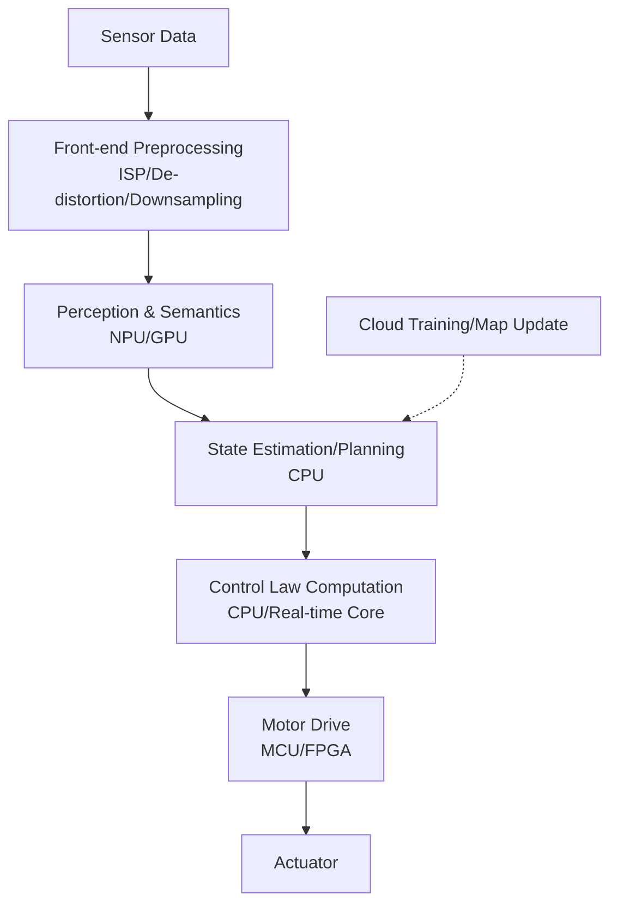

| Company/Platform | Headquarters | Main Products | Remarks |
|---|---|---|---|
| NVIDIA | USA | Jetson AGX Orin/Thor, Isaac Sim | Leader in robot computing platforms |
| Qualcomm | USA | QCS/RB Series, Hexagon NPU | Mobile/Robot SoC |
| Intel | USA | Core/NUC, Movidius/Myriad | x86 Main Controller & AI Accelerator |
| AMD/Xilinx | USA | Kria, Versal, FPGA | Reconfigurable Computing |
| Horizon Robotics | China | Journey 5/6, BPU | Autonomous Driving/Robotics |
| Black Sesame | China | A1000, Huashan Series | Autonomous Driving/Robotics |
| Huawei HiSilicon | China | Ascend, Kirin | AI & Edge SoC |
| Rockchip | China | RK3588, etc. | Low-cost Robot Main Controller |
| Apple | USA | M-series / Neural Engine | Development/High-end Edge |
| Tesla | USA | FSD Chip / Dojo | Self-developed Autonomous Driving/Robot Chip |

#### 7.3.4.1 Computing Power, Energy Efficiency, and Latency Model of Robot Computing Platforms

The computing platform for humanoid robots must simultaneously meet the heterogeneous computing demands of perception, planning, control, and AI inference. Evaluating a computing platform should not rely solely on peak computing power (TOPS) but should comprehensively assess it from three dimensions: **throughput**, **energy efficiency**, and **latency**.

!!! note "Term Explanation: TOPS, FLOPS, Arithmetic Intensity, Memory Bandwidth, Roofline Model, Utilization"
    - **TOPS**: Trillions of integer/fixed-point operations per second, commonly used to measure the peak computing power of NPU/AI accelerators.
    - **FLOPS**: Floating-point operations per second.
    - **Arithmetic Intensity**: The number of operations per unit of memory access, unit op/byte.
    - **Memory Bandwidth**: The amount of data that can be transferred per unit time between the processor and memory, unit GB/s.
    - **Roofline Model**: A model that uses two upper bounds, peak computing power and memory bandwidth, to describe actual performance bottlenecks.
    - **Utilization**: The ratio of actual performance to peak performance.

The Roofline model expresses the actual achievable computing power $P$ as the smaller of the peak computing power $P_{peak}$ and the "memory bandwidth-limited computing power" $I \cdot B$:

$$
P = \min\left(P_{peak},\ I \cdot B\right)
$$

Where $I$ is the arithmetic intensity (operations/byte), and $B$ is the memory bandwidth (byte/s). When $I < P_{peak}/B$, the application is constrained by memory bandwidth; when $I > P_{peak}/B$, it is constrained by peak computing power. This critical value is called the **Ridge point**:

$$
I_{ridge} = \frac{P_{peak}}{B}
$$

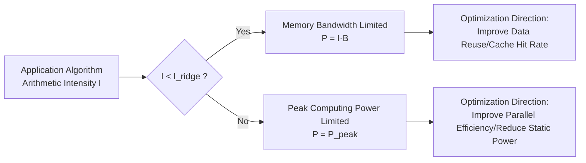

Energy efficiency is often expressed as **TOPS/W**. If power consumption is divided into static power $P_{static}$ and dynamic power $P_{dynamic}=\alpha P$ proportional to computing power ($\alpha$ is the energy coefficient, unit J/op), then:

$$
E = \frac{P}{P_{static} + \alpha P}
$$

When $P$ approaches the peak, energy efficiency approaches $1/\alpha$; at low loads, the proportion of static power increases, and energy efficiency decreases.

**Numerical Example**: The NPU peak computing power of a certain robot SoC is $P_{peak}=100\ \text{TOPS}$, memory bandwidth $B=100\ \text{GB/s}$, static power $P_{static}=5\ \text{W}$, and dynamic energy per TOPS $\alpha=0.1\ \text{W/TOPS}$.

Ridge point:

$$
I_{ridge} = \frac{100 \times 10^{12}}{100 \times 10^9} = 1000\ \text{op/byte}
$$

If the arithmetic intensity of a certain perception network is $I=500\ \text{op/byte}$, then the actual computing power is limited by bandwidth:

$$
P = 500 \times 100 \times 10^9 = 50\ \text{TOPS}
$$

Corresponding power consumption is $P_{total}=5 + 0.1 \times 50 = 10\ \text{W}$, and energy efficiency is $50/10=5\ \text{TOPS/W}$. If algorithm optimization increases $I$ to $2000\ \text{op/byte}$, then the computing power reaches the peak of $100\ \text{TOPS}$, power consumption is $15\ \text{W}$, and energy efficiency is $6.67\ \text{TOPS/W}$. This indicates that in the bandwidth-limited region, improving the data reuse rate of the algorithm is more effective than simply increasing the peak computing power.

In terms of latency, if the amount of data to be processed per layer of the network is $D$ (byte) and the bandwidth is $B$, then the data transfer time alone is at least:

$$
T_{memory} = \frac{D}{B}
$$

If the total computation amount is $W$ (ops) and the actual computing power is $P$, then the computation time is $T_{compute}=W/P$. End-to-end latency is usually determined by the larger of the two. The control loop requires millisecond-level latency for humanoid robots, so in addition to peak computing power, **deterministic latency** and **worst-case execution time (WCET)** are also key indicators. See Section 6.3 of Chapter 6 for details.

```python
import numpy as np
import matplotlib.pyplot as plt

# Platform parameters
P_peak = 100          # TOPS
B = 100               # GB/s
P_static = 5          # W
alpha = 0.1           # W/TOPS

I = np.logspace(1, 4, 200)  # op/byte
P_actual = np.minimum(P_peak, I * B)  # TOPS
power = P_static + alpha * P_actual
tops_per_w = P_actual / power

plt.figure(figsize=(10, 4))

plt.subplot(1, 2, 1)
plt.loglog(I, P_actual, label="Actual TOPS")
plt.axhline(P_peak, color="red", linestyle="--", label="Peak TOPS")
plt.xlabel("Arithmetic intensity (op/byte)")
plt.ylabel("Actual TOPS")
plt.title("Roofline Model")
plt.legend()
plt.grid(True, which="both", alpha=0.3)

plt.subplot(1, 2, 2)
plt.semilogx(I, tops_per_w)
plt.xlabel("Arithmetic intensity (op/byte)")
plt.ylabel("TOPS/W")
plt.title("Energy Efficiency vs. Arithmetic Intensity")
plt.grid(True, which="both", alpha=0.3)

plt.tight_layout()
plt.show()

print(f"Ridge point = {P_peak/B:.0f} op/byte")
```

!!! note "Term Explanation: Deterministic Latency, WCET, Memory Wall, Arithmetic Intensity"
    - **Deterministic latency**: The maximum response time that can be strictly guaranteed.
    - **WCET (Worst-Case Execution Time)**: The execution time under the worst-case scenario.
    - **Memory wall**: The growth of processor computing power far outpaces memory bandwidth, causing actual performance to be limited by data transfer.
    - **Arithmetic intensity improvement**: Increasing arithmetic intensity by reusing on-chip data and improving cache hit rates.

### 7.3.5 Batteries and Power Semiconductors

Humanoid robots have high requirements for battery energy density, power density, cycle life, and safety. The current mainstream is **lithium-ion batteries (Li-ion)**, with chemical systems including **ternary (NCM/NCA)** and **lithium iron phosphate (LFP)**. In the future, **solid-state batteries** are attracting attention due to their higher energy density and safety.

!!! note "Term Explanation: Lithium-ion Battery, Ternary Battery, Lithium Iron Phosphate, Solid-state Battery, Energy Density, Power Density"
    - **Lithium-ion battery (Li-ion)**: A secondary battery that charges and discharges through the intercalation/deintercalation of lithium ions between the positive and negative electrodes.
    - **Ternary battery (NCM/NCA)**: A lithium-ion battery with a positive electrode containing nickel, cobalt, manganese or nickel, cobalt, aluminum, offering high energy density.
    - **Lithium iron phosphate (LFP)**: A lithium-ion battery with a positive electrode of lithium iron phosphate, known for long cycle life and good thermal stability.
    - **Solid-state battery**: A battery that uses a solid electrolyte instead of a liquid electrolyte, with greater potential for energy density and safety.
    - **Energy density**: The energy stored per unit mass or volume, in units of Wh/kg or Wh/L.
    - **Power density**: The power output per unit mass or volume, in units of W/kg or W/L.

Power semiconductors are responsible for power conversion and motor drive. Traditional silicon-based MOSFETs/IGBTs are transitioning to **silicon carbide (SiC)** and **gallium nitride (GaN)** wide-bandgap semiconductors to achieve higher efficiency, higher switching frequencies, and smaller sizes.

!!! note "Term Explanation: Power Semiconductor, MOSFET, IGBT, SiC, GaN, Wide-Bandgap Semiconductor"
    - **Power semiconductor**: High-power semiconductor devices used for power conversion and switching control.
    - **MOSFET (Metal-Oxide-Semiconductor FET)**: A voltage-controlled field-effect transistor with fast switching speed.
    - **IGBT (Insulated Gate Bipolar Transistor)**: An insulated gate bipolar transistor suitable for medium to high power.
    - **SiC (Silicon Carbide)**: A wide-bandgap semiconductor material resistant to high temperatures, high frequencies, and high efficiency.
    - **GaN (Gallium Nitride)**: A wide-bandgap semiconductor with high switching frequency and low on-resistance.
    - **Wide-bandgap semiconductor (WBG)**: Semiconductor materials with a bandgap wider than silicon, such as SiC and GaN.

```mermaid
flowchart LR
    A["Battery Pack<br/>Cells in Series/Parallel"] --> B["BMS"]
    B --> C["DC Bus"]
    C --> D["SiC/GaN Inverter"]
    D --> E["Motor"]
    C --> F["DC-DC Converter"]
    F --> G["Computing Platform/Sensors"]
```

| Company | Headquarters | Main Products | Remarks |
|---|---|---|---|
| CATL | China | Power batteries, LFP/Ternary | Global leader in power batteries |
| BYD | China | Blade battery (LFP) | Self-supply + external supply |
| LG Energy Solution | South Korea | Ternary/LFP power batteries | Major global supplier |
| Panasonic | Japan | Cylindrical/power batteries | Long-term cooperation with Tesla |
| Samsung SDI | South Korea | Ternary power batteries | High energy density |
| EVE Energy | China | Power batteries, cylindrical batteries | Robotics/power tools |
| Infineon | Germany | SiC/GaN/IGBT/MOSFET | Leader in power semiconductors |
| STMicroelectronics | Switzerland/Italy | SiC MOSFET, driver IC | Automotive and industrial |
| onsemi | USA | SiC, MOSFET, IGBT | Power and drive |
| Wolfspeed | USA | SiC substrates and devices | Wide-bandgap materials |

#### 7.3.5.1 Lithium-ion Battery Equivalent Circuit and Energy-Power Characteristics

A lithium-ion battery can be abstracted as a Thevenin equivalent circuit consisting of an ideal voltage source $V_{oc}(SoC)$ in series with an internal resistance $R_{int}$. The relationship between terminal voltage $V_t$ and current $I$ is:

$$
V_t = V_{oc}(SoC) - I \cdot R_{int}
$$

Where $V_{oc}$ is the open-circuit voltage, which varies with the state of charge $SoC$; $R_{int}$ is the internal resistance of the battery, including ohmic resistance and polarization resistance. During discharge, $I>0$, and the terminal voltage decreases; during charging, $I<0$, and the terminal voltage increases.

!!! note "Term Explanation: Open-Circuit Voltage, Internal Resistance, State of Charge, Polarization, Thevenin Equivalent"
    - **Open-circuit voltage (OCV)**: The terminal voltage of a battery under no load, related to SoC and temperature.
    - **Internal resistance**: The resistance within the battery to current flow, causing voltage drop and heat generation.
    - **State of charge (SoC)**: The ratio of remaining capacity to rated capacity, 0–100%.
    - **Polarization**: Voltage loss caused by the electrochemical reaction deviating from the equilibrium state.
    - **Thevenin equivalent**: A circuit model that simplifies a complex network into a voltage source in series with a resistor.

```mermaid
flowchart LR
    A["V_oc(SoC)<br/>Ideal Voltage Source"] --> B["R_int<br/>Internal Resistance"]
    B --> C["V_t<br/>Terminal Voltage"]
    C --> D["Load R_L"]
    D --> E["Current I"]
    E --> F["Heat I²R_int"]
```

The maximum power that a battery can output is limited by the lower terminal voltage limit $V_{min}$. Let $V_t=V_{min}$, then the current $I=(V_{oc}-V_{min})/R_{int}$, thus:

$$
P_{max} = V_{min} \cdot I = \frac{(V_{oc} - V_{min}) V_{min}}{R_{int}}
$$

This formula indicates: the smaller the internal resistance and the higher the open-circuit voltage, the more capable the battery is of simultaneously providing high energy and high power.

The Ragone relationship between energy density $E_g$ (Wh/kg) and power density $P_g$ (W/kg) can be approximated as:

$$
E_g \cdot P_g \le \frac{V_{oc}^2}{4 R_{int} \cdot m_{cell}}
$$

where $m_{cell}$ is the cell mass. This inequality indicates a fundamental trade-off between energy density and power density: high power requires a low internal resistance design, which may sacrifice the proportion of active material and thus reduce energy density.

C-rate describes the multiple of the charge/discharge current relative to the rated capacity $C_{nom}$ (Ah):

$$
I = C_{rate} \cdot C_{nom}
$$

1C means discharging the rated capacity in 1 hour. The instantaneous power demand of a humanoid robot may reach 2–5C, but continuous high-rate discharge will accelerate aging and increase thermal load. The resource distribution and supply chain risks of key battery materials such as lithium, cobalt, and nickel are detailed in Chapter 3.

**Numerical Example**: A certain NCM cell has a rated capacity $C_{nom}=5\ \text{Ah}$, average open-circuit voltage $V_{oc}=3.7\ \text{V}$, internal resistance $R_{int}=10\ \text{m}\Omega$, mass $m=0.20\ \text{kg}$, and lower terminal voltage limit $V_{min}=3.0\ \text{V}$.

Energy density:

$$
E_g = \frac{5\ \text{Ah} \times 3.7\ \text{V}}{0.20\ \text{kg}} = 92.5\ \text{Wh/kg}
$$

Maximum continuous discharge current:

$$
I_{max} = \frac{3.7 - 3.0}{0.010} = 70\ \text{A}
$$

Corresponding C-rate:

$$
C_{rate} = \frac{70}{5} = 14C
$$

Maximum output power:

$$
P_{max} = 3.0 \times 70 = 210\ \text{W}
$$

Power density:

$$
P_g = \frac{210}{0.20} = 1050\ \text{W/kg}
$$

Heating power:

$$
P_{heat} = I^2 R_{int} = 70^2 \times 0.010 = 49\ \text{W}
$$

At this point, the heating power accounts for 23% of the output power, making thermal management a key constraint for high-rate discharge. See Section 6.2 of Chapter 6 for details.

```python
import numpy as np
import matplotlib.pyplot as plt

# Cell parameters
C_nom = 5.0        # Ah
V_oc = 3.7         # V
R_int = 0.010      # ohm
m = 0.20           # kg
V_min = 3.0        # V

I_max = (V_oc - V_min) / R_int
P_max = V_min * I_max
E_g = C_nom * V_oc / m
P_g = P_max / m

print(f"Energy density = {E_g:.1f} Wh/kg")
print(f"Maximum power = {P_max:.1f} W")
print(f"Power density = {P_g:.1f} W/kg")
print(f"Maximum current = {I_max:.1f} A ({I_max/C_nom:.1f}C)")

# Ragone curve: vary internal resistance to observe energy-power trade-off
R_values = np.array([0.005, 0.010, 0.020, 0.030])  # ohm
E_g_const = E_g  # Assume energy density constant
P_g_values = (V_oc**2 / (4 * R_values * m))

plt.figure(figsize=(7, 4))
plt.plot(P_g_values, [E_g_const]*len(R_values), marker="o")
for r, pg in zip(R_values, P_g_values):
    plt.annotate(f"R={r*1000:.0f} mΩ", (pg, E_g_const), textcoords="offset points", xytext=(0, 10), ha="center")
plt.xlabel("Power density (W/kg)")
plt.ylabel("Energy density (Wh/kg)")
plt.title("Ragone Plot: Energy vs. Power Density")
plt.grid(True, alpha=0.3)
plt.tight_layout()
plt.show()
```

!!! note "Terminology Explanation: Ragone Curve, C-rate, Power Density, Energy Density, Thermal Load"
    - **Ragone Curve**: The trade-off curve between energy density and power density.
    - **C-rate**: The charge/discharge rate relative to the rated capacity.
    - **Power Density**: The power that can be output per unit mass.
    - **Energy Density**: The energy stored per unit mass.
    - **Thermal Load**: The Joule heat generated during high-rate discharge.

#### 7.3.5.2 Power Semiconductor Switching Loss and Junction Temperature Model

Power semiconductors (MOSFET/IGBT/SiC/GaN) handle high-frequency switching tasks in inverters. Losses are divided into **conduction loss** and **switching loss**. Conduction loss is generated by the on-resistance $R_{ds(on)}$ or saturation voltage drop $V_{ce(sat)}$; switching loss is proportional to the switching frequency $f_{sw}$, DC bus voltage $V_{dc}$, and load current $I$.

For one phase leg of a three-phase inverter using PWM control, the conduction loss of a MOSFET can be approximated as:

$$
P_{cond} = I_{rms}^2 \cdot R_{ds(on)} \cdot D
$$

where $I_{rms}$ is the RMS drain current, and $D$ is the duty cycle. The empirical model for switching loss is:

$$
P_{sw} = \frac{1}{2} V_{dc} \cdot I \cdot (t_{on} + t_{off}) \cdot f_{sw}
$$

$t_{on}$ and $t_{off}$ are the turn-on/turn-off times. Total loss:

$$
P_{loss} = P_{cond} + P_{sw}
$$

!!! note "Terminology Explanation: Conduction Loss, Switching Loss, Duty Cycle, Switching Frequency, Junction Temperature, Thermal Resistance"
    - **Conduction Loss**: Loss generated by resistance/voltage drop when the device is conducting.
    - **Switching Loss**: Loss generated by the overlap of voltage and current during the turn-on and turn-off processes of the device.
    - **Duty Cycle**: The proportion of the on-time within a PWM period.
    - **Switching Frequency**: The number of switching operations per unit time.
    - **Junction Temperature**: The temperature of the semiconductor PN junction.
    - **Thermal Resistance**: The resistance to heat flow from the junction to the cooling environment.

```mermaid
flowchart TD
    A["Inverter total loss P_loss"] --> B["Conduction loss<br/>I_rms²·R_ds(on)·D"]
    A --> C["Switching loss<br/>½V_dc·I·(t_on+t_off)·f_sw"]
    B --> D["Junction temperature rise<br/>T_j = T_a + P_loss·R_th"]
    C --> D
    D --> E["Thermal design constraint<br/>T_j ≤ T_j,max"]
```

The junction temperature rise can be described using a thermal resistance model:

$$
T_j = T_a + P_{loss} \cdot (R_{th,jc} + R_{th,ch} + R_{th,ha})
$$

$T_a$ is the ambient temperature, $R_{th,jc}$ is the junction-to-case thermal resistance, $R_{th,ch}$ is the case-to-heatsink thermal resistance, and $R_{th,ha}$ is the heatsink-to-ambient thermal resistance. SiC/GaN, due to their low on-resistance and fast switching speed, can significantly reduce $P_{loss}$, thereby reducing the heat sink volume.

**Numerical Example**: A certain SiC MOSFET has $R_{ds(on)}=5\ \text{m}\Omega$, $t_{on}+t_{off}=50\ \text{ns}$, RMS joint current $I_{rms}=10\ \text{A}$, duty cycle $D=0.5$, $V_{dc}=48\ \text{V}$, $f_{sw}=20\ \text{kHz}$, total thermal resistance $R_{th}=2.0\ \text{K/W}$, $T_a=40\ ^\circ\text{C}$.

Conduction loss:

$$
P_{cond} = 10^2 \times 0.005 \times 0.5 = 0.25\ \text{W}
$$

Switching loss:

$$
P_{sw} = 0.5 \times 48 \times 10 \times 50 \times 10^{-9} \times 20 \times 10^3 = 0.24\ \text{W}
$$

Total loss:

$$
P_{loss} = 0.25 + 0.24 = 0.49\ \text{W}
$$

Junction temperature:

$$
T_j = 40 + 0.49 \times 2.0 = 40.98\ ^\circ\text{C}
$$

For comparison, using a silicon-based MOSFET ($R_{ds(on)}=30\ \text{m}\Omega$, $t_{on}+t_{off}=200\ \text{ns}$):

$$
P_{cond} = 10^2 \times 0.030 \times 0.5 = 1.5\ \text{W}
$$

$$
P_{sw} = 0.5 \times 48 \times 10 \times 200 \times 10^{-9} \times 20 \times 10^3 = 0.96\ \text{W}
$$

Total loss $2.46\ \text{W}$, junction temperature $44.9\ ^\circ\text{C}$. Although the temperature rise of a single device is not large, with dozens of joint drives in the whole machine, SiC can reduce total heat dissipation by about 5 times, significantly reducing the burden on the heatsink and battery.

```python
import numpy as np
import matplotlib.pyplot as plt

def mosfet_loss(Rds, t_sw, Irms, D, Vdc, fsw):
    P_cond = Irms**2 * Rds * D
    P_sw = 0.5 * Vdc * Irms * t_sw * fsw
    return P_cond, P_sw

Irms = 10.0
D = 0.5
Vdc = 48.0
fsw = 20e3
R_th = 2.0
T_a = 40.0

devices = {
    "SiC MOSFET": {"Rds": 0.005, "t_sw": 50e-9},
    "Si MOSFET": {"Rds": 0.030, "t_sw": 200e-9},
}

fsw_range = np.linspace(5e3, 50e3, 100)
plt.figure(figsize=(9, 4))

for name, params in devices.items():
    P_total = []
    for f in fsw_range:
        pc, ps = mosfet_loss(params["Rds"], params["t_sw"], Irms, D, Vdc, f)
        P_total.append(pc + ps)
    plt.plot(fsw_range/1e3, P_total, label=name)
    pc, ps = mosfet_loss(params["Rds"], params["t_sw"], Irms, D, Vdc, 20e3)
    print(f"{name}: P_cond={pc:.2f} W, P_sw={ps:.2f} W, total={pc+ps:.2f} W, Tj={T_a + (pc+ps)*R_th:.1f} °C")

plt.xlabel("Switching frequency (kHz)")
plt.ylabel("Total loss per MOSFET (W)")
plt.title("Power Semiconductor Loss vs. Switching Frequency")
plt.legend()
plt.grid(True, alpha=0.3)
plt.tight_layout()
plt.show()
```

!!! note "Terminology explanation: SiC MOSFET, GaN HEMT, on-resistance, switching time, thermal resistance chain"
    - **SiC MOSFET**: Silicon carbide metal-oxide-semiconductor field-effect transistor.
    - **GaN HEMT**: Gallium nitride high-electron-mobility transistor.
    - **On-resistance**: The resistance between the drain and source when the MOSFET is fully turned on.
    - **Switching time**: The time required for the device to transition from off to on or from on to off.
    - **Thermal resistance chain**: The series thermal resistance path from the semiconductor junction to the environment.

### 7.3.6 Key Materials

Key materials run through the entire supply chain. High-performance **neodymium-iron-boron (NdFeB) permanent magnets** determine motor torque density; **copper** is used for windings and cables; **lithium, cobalt, nickel** are used for battery cathodes; **rare earth elements** such as neodymium, dysprosium, and terbium are used for magnets; **high-purity silicon, silicon carbide substrates** are used for chips and power devices.

!!! note "Terminology explanation: NdFeB, rare earth elements, permanent magnet, cobalt, nickel, cathode material, SiC substrate"
    - **NdFeB**: A rare earth permanent magnet material composed of neodymium, iron, and boron, with high magnetic energy product.
    - **Rare earth elements**: 17 metallic elements including the lanthanide series plus scandium and yttrium, with special electromagnetic properties.
    - **Permanent magnet**: A material that can maintain magnetism for a long time without external excitation.
    - **Cobalt/Nickel**: Key elements in ternary cathode materials, affecting energy density and stability.
    - **Cathode material**: The key material in lithium-ion batteries that provides lithium ions.
    - **SiC substrate**: Single-crystal material used to manufacture SiC power devices and RF devices.

```mermaid
flowchart TD
    A["Rare earth mine"] --> B["Rare earth oxide"]
    B --> C["NdFeB magnetic powder"]
    C --> D["Permanent magnet"]
    D --> E["Motor rotor"]
    F["Lithium/Cobalt/Nickel mine"] --> G["Cathode material"]
    G --> H["Battery cell"]
    H --> I["Battery pack"]
    J["High-purity quartz/silicon"] --> K["Silicon wafer"]
    K --> L["Chip/power device"]
```

| Material/Category | Main Use | Main Supply Sources (Public Estimate) | Key Risk |
|---|---|---|---|
| NdFeB magnet | Motor permanent magnet rotor | China (approx. 80–90% capacity), Japan | Concentration of rare earth mining and smelting |
| Rare earth oxide | Magnets, catalysts, polishing | China, USA, Australia, Myanmar | High concentration of smelting and separation |
| Lithium | Lithium battery | Australia, Chile, Argentina, China | Resource country policy and price volatility |
| Cobalt | Ternary cathode | Democratic Republic of Congo approx. 70% production | Supply chain responsibility and geopolitical risk |
| Nickel | Ternary/high-nickel battery | Indonesia, Philippines, Russia, Canada | ESG and export policy |
| High-purity copper | Windings, cables, heat dissipation | Chile, Peru, China, Democratic Republic of Congo | Price cycle and demand growth |
| SiC substrate | SiC devices | USA, Japan, Europe, China | 8-inch yield and capacity ramp-up |
### 7.3.7 Joint Module Disassembly and Supply Chain

A **joint module** is the smallest deliverable unit of a humanoid robot's motion system. A typical rotary joint module includes at least a frameless torque motor, reducer, encoder, force/torque sensor, brake, bearing, driver, housing, cables, and grease. Since the joint module simultaneously determines the robot's torque density, dynamic response, control accuracy, and reliability, its BOM disassembly and supply chain management are the core levers for OEMs to reduce costs and ensure supply.

!!! note "Terminology explanation: joint module, joint module assembly, system integrator"
    - **Joint module**: A rotary or linear actuation unit integrating a motor, reducer, encoder, sensor, brake, and housing into one assembly.
    - **Joint module assembly**: A complete module that can be directly assembled into the robot joint position.
    - **System integrator**: An enterprise that integrates multiple subsystems into a complete machine or solution.

```mermaid
flowchart TD
    A["Joint module assembly"] --> B["Frameless torque motor"]
    A --> C["Reducer<br/>Harmonic/Planetary/RV/Cycloidal"]
    A --> D["Position/speed feedback<br/>Encoder/Resolver"]
    A --> E["Force/torque sensor<br/>Six-axis force/Single-axis force"]
    A --> F["Brake/Holding brake<br/>Power-off brake"]
    A --> G["Bearing<br/>Deep groove ball/Angular contact/Crossed roller"]
    A --> H["Driver/Servo drive"]
    A --> I["Housing and structural parts<br/>Aluminum alloy/Magnesium alloy"]
    A --> J["Cables and connectors<br/>Power/Signal/Bus"]
    B --> K["Permanent magnet/Winding/Silicon steel sheet"]
    C --> L["Flexspline/Circular spline/Needle pin/Planet carrier"]
```

#### 7.3.7.1 Joint Module Assembly and Integrators

Joint module assembly integrators are responsible for integrating motors, reducers, encoders, force sensors, brakes, etc., into modules that can be directly assembled. OEMs can either purchase modules directly or develop core components in-house and then commission Tier-1 integration. The table below lists representative assembly and integration suppliers, whose positioning extends from professional reducer/motor manufacturers to robot OEM self-developed systems.

| Supplier | Headquarters | Representative Product/Positioning | Typical Robot Application | Supply Status/Notes |
|---|---|---|---|---|---|
| Leaderdrive | Suzhou, China | Harmonic reducer + joint module | Collaborative/humanoid robot | Domestic harmonic leader, capacity expanding continuously |
| Life Harmonic | Zhejiang, China | Harmonic reducer, joint module | Collaborative/service robot | Domestic substitution |
| Shuanghuan Transmission | Zhejiang, China | RV/planetary/harmonic reducer, gears | Industrial robot/humanoid | Precision gear manufacturing foundation |
| Zhongda Leader | Ningbo, China | Planetary/harmonic reducer, motor drive, module | Robot joint | Public information |
| Hechuan Technology | Zhejiang, China | Servo motor, driver, joint module | Industrial/humanoid robot | Public information |
| Inovance Technology | Shenzhen, China | Servo system, motor, driver | Industrial robot/humanoid | Local automation leader |
| Estun | Nanjing, China | Servo, robot body, module | Industrial robot/humanoid | Self-supply + external supply |
| Ubtech | Shenzhen, China | Walker series joint module | Education/service/humanoid | Mainly self-developed complete machine |
| Unitree | Hangzhou, China | H1/G1 joint actuator | High-dynamic humanoid | Self-developed |
| Agibot | Shanghai, China | Expedition/Lingxi joint module | General-purpose humanoid | Startup, rapid iteration |
| GSK CNC Equipment | Guangzhou, China | Servo motor, driver, robot | Industrial/humanoid | Public information |
| Topstar | Dongguan, China | Industrial robot, actuator | Industrial automation | Public information |
| Peitian Robot | Shenzhen, China | Industrial robot, servo | Industrial/humanoid | Public information |

Chinese joint module suppliers are geographically highly concentrated in the Yangtze River Delta and Pearl River Delta, while regions such as Beijing-Tianjin-Hebei, Central China, and Chengdu-Chongqing form a supplement relying on complete machine manufacturers and universities/research institutes. The diagram below provides a simplified regional distribution overview; nodes do not represent a complete capacity layout and are only used to illustrate industrial clustering characteristics.

```mermaid
flowchart TD
    subgraph 长三角["Yangtze River Delta (Suzhou/Wuxi/Shanghai/Ningbo/Hangzhou)"]
        A1["Leaderdrive"] --- A2["Life Harmonic"]
        A3["Inovance Technology"] --- A4["Hechuan Technology"]
        A5["Moons' Industries"] --- A6["Uli Instrument"]
        A7["Agibot"] --- A8["Unitree"]
    end
    subgraph 珠三角["Pearl River Delta (Shenzhen/Dongguan/Guangzhou)"]
        B1["Ubtech"] --- B2["GSK CNC Equipment"]
        B3["Topstar"] --- B4["Peitian Robot"]
        B5["Inovance Technology Headquarters"]
    end
    subgraph 京津冀["Beijing-Tianjin-Hebei (Beijing/Tianjin/Hebei)"]
        C1["Xiaomi Robot"] --- C2["Complete machine R&D"]
    end
    subgraph 华中["Central China (Wuhan/Changsha)"]
        D1["Huazhong CNC"] --- D2["Servo and motor"]
    end
    subgraph 成渝["Chengdu-Chongqing (Chengdu/Chongqing)"]
        E1["Chengdu/Chongqing precision machining"] --- E2["Supporting structural parts"]
    end
    长三角 --> F["Complete machine factory integration and verification"]
    珠三角 --> F
    京津冀 --> F
    华中 --> F
    成渝 --> F
```

#### 7.3.7.2 Frameless Torque Motor

Frameless torque motors are directly embedded into joints, determining torque density, dynamic response, and thermal management capability. Foreign brands have a first-mover advantage in high-end medical, aerospace, and collaborative robot fields; domestic brands are rapidly catching up in mobile robots, collaborative robots, and humanoid robots, with some manufacturers already achieving mass production and supply.

| Supplier | Headquarters | Main Products | Typical Robot Application | Supply Status/Notes |
|---|---|---|---|---|
| Maxon | Switzerland | Brushless DC motor, frameless motor, driver | High-end medical/robot | High precision, small batch customization |
| Moog | USA | Precision motion control, frameless torque motor | Aerospace/high-reliability robot | Imported high-end |
| Kollmorgen | USA | Frameless torque motor, servo system | Collaborative/industrial robot | Widely used in collaborative robot joints |
| TQ-RoboDrive | Germany | Frameless motor, coreless motor | Humanoid robot dexterous hand | Commonly used micro motor for dexterous hands |
| Inovance Technology | Shenzhen, China | Servo motor, frameless motor | Industrial/humanoid robot | Domestic leader |
| Hechuan Technology | Zhejiang, China | Servo motor and drive | Domestic substitution | Public information |
| Buke Shares | Shanghai, China | Low-voltage servo, frameless motor | Mobile robot/collaborative robot | Public information |
| Moons' Industries | Shanghai, China | Stepper/coreless/brushless motor | Dexterous hand micro motor | Public information |
| Han's Motor | Shenzhen, China | Linear/torque motor | Automation/robot | Subsidiary of Han's Laser |
| Jiangte Motor | Jiangxi, China | Servo motor, new energy vehicle motor | Industrial/robot | Public information |
| Xin Zhi Group | Zhejiang, China | Motor stator and rotor core | Motor components | Public information |
| Jiangsu Leili | Jiangsu, China | Micro motor, assembly | Home appliance/robot | Public information |
| Aerospace Electric | Guizhou, China | Motor, connector | Military/high-end equipment | Public information |
| Hengshuai Shares | Ningbo, China | Micro motor, pump | Automotive/robot | Public information |

#### 7.3.7.3 Reducer

The reducer reduces motor speed and amplifies output torque, making it one of the components with the highest value and process threshold in humanoid robot joints. Based on the principle, it can be divided into four categories: harmonic, planetary, cycloidal, and RV, each suitable for different load, precision, and stiffness requirements.

| Supplier | Headquarters | Main Products | Typical Robot Application | Supply Status/Notes |
|---|---|---|---|---|
| Harmonic Drive Systems | Japan | Harmonic reducer | High-end robot | Industry leader |
| Nabtesco | Japan | RV reducer, harmonic reducer | Heavy-load/high-precision joint | RV leader |
| Leaderdrive | Suzhou, China | Harmonic reducer | Collaborative/humanoid robot | Domestic leader |
| Life Harmonic | Zhejiang, China | Harmonic reducer | Robot | Domestic substitution |
| Shuanghuan Transmission | Zhejiang, China | RV/planetary/harmonic reducer, gears | Industrial/humanoid robot | Precision gear manufacturing foundation |
| Zhongda Leader | Ningbo, China | Planetary/harmonic/RV reducer | Robot | Public information |
| Guomao Shares | Jiangsu, China | Reducer | Industrial/logistics | Public information |
| Qinchuan Machine Tool | Shaanxi, China | Planetary/ball screw/gear | Machine tool/robot | Public information |
| Fengli Intelligent | Zhejiang, China | Small module gear/reducer | Robot/power tool | Public information |
| Haozhi Electromechanical | Guangzhou, China | Harmonic reducer, electric spindle | Robot/machine tool | Public information |
| Tongli Technology | Zhejiang, China | Reducer | Industrial | Public information |
| Sumitomo Drive Technologies | Japan | Cycloidal/planetary reducer | Industrial transmission | Public information |
| SEW-EURODRIVE | Germany | Planetary/industrial gear | Industrial automation | Public information |

```mermaid
flowchart LR
    A["Reducer selection"] --> B["Harmonic<br/>Light load/High precision"]
    A --> C["Planetary<br/>Compact/Medium load"]
    A --> D["Cycloidal<br/>High stiffness"]
    A --> E["RV<br/>Heavy load/High torque"]
```

#### 7.3.7.4 Encoder

The encoder provides position and speed feedback for the joint and is one of the determining factors for servo closed-loop precision. Joint modules are typically configured with dual encoders: the motor-side encoder is used for FOC control, and the output-side encoder is used for load-side positioning compensation.

| Supplier | Headquarters | Main Products | Typical Robot Application | Supply Status/Notes |
|---|---|---|---|---|
| Heidenhain | Germany | High-precision optical/magnetic encoder | High-end machine tool/robot | Imported high-end |
| Renishaw | UK | Magnetic encoder, grating ruler | Precision motion | Imported |
| Broadcom | USA | Optical encoder chip | Servo motor | Core component |
| AMS-Osram | Austria | Magnetic position sensor, encoder IC | Industrial/automotive | Public information |
| CUI Devices | USA | Incremental/absolute encoder | Servo motor | Public information |
| US Digital | USA | Optical/magnetic encoder | Robot joint | Public information |
| Maxon | Switzerland | Encoder, motor+encoder module | High-end robot | Integrated solution |
| Tamagawa Seiki | Japan | Encoder, resolver | Servo motor matching | Japanese leader |
| Aopu Optoelectronics | Changchun, China | Optical encoder, grating ruler | Machine tool/robot | Domestic substitution |
| Yuheng Optics | Changchun, China | Optical encoder | Servo/robot | Domestic substitution |
| Inovance Technology | Shenzhen, China | Magnetic encoder, servo matching encoder | Domestic servo | Self-supply + external supply |
| Moons' Industries | Shanghai, China | Encoder and stepper/servo matching | Robot | Public information |

```mermaid
flowchart TD
    A["Encoder Selection"] --> B["High-Precision<br/>Optical Encoder"]
    A --> C["Oil-Resistant<br/>Magnetic Encoder"]
    A --> D["Harsh Environment<br/>Resolver"]
    B --> E["Heidenhain/Renishaw"]
    C --> F["Broadcom/AMS/Domestic Magnetic Encoder"]
    D --> G["Tamagawa"]
```

#### 7.3.7.5 Torque Sensor

Torque sensors enable compliant control capabilities in joints. Humanoid robots typically use six-axis force/torque sensors in the wrist and ankle; some OEMs are also exploring low-cost force control solutions based on current loops and flexible structures to reduce the cost pressure of high-end force sensors.

| Supplier | Headquarters | Main Products | Typical Robot Applications | Supply Status/Remarks |
|---|---|---|---|---|
| ATI Industrial Automation | USA | Six-Axis Force/Torque Sensor | Wrist/Ankle/Collaborative Robot | Industry Benchmark |
| Robotiq | Canada | Force/Torque Sensor, Gripper | Collaborative Robot End-Effector | Public Information |
| OnRobot | Denmark | Force Control Sensor, Gripper | Collaborative Assembly | Public Information |
| Bota Systems | Switzerland | Six-Axis Force Sensor | Legged/Humanoid Robot | Public Information |
| Kistler | Switzerland | Piezoelectric Force/Torque Sensor | Testing & Industrial | High Precision |
| Sunrise Instruments | Shanghai, China | Six-Axis Force Sensor | Robot Wrist/Ankle/Testing | Domestic Leader |
| Kunwei Technology | Suzhou, China | Six-Axis Force/Torque Sensor | Collaborative/Humanoid Robot | Public Information |
| Keli Sensing | Ningbo, China | Load Cell/Force Sensor, Six-Axis Force | Industrial/Logistics/Robot | Public Information |
| Hanwei Technology | Zhengzhou, China | Flexible Pressure/Tactile Sensor | Robot Skin, Wearable | Public Information |
| Zhonghang Electronic Measuring Instruments | Shaanxi, China | Strain Gauge Force/Load Cell | Industrial/Aviation | Public Information |

#### 7.3.7.6 Brake

Brakes are used to maintain joint position during power loss or emergency stops and are an important component of humanoid robot safety functions. **Power-off brakes** apply spring pressure to brake when power is off and release when power is on, providing a fail-safe characteristic.

!!! note "Term Explanation: Brake, Power-Off Brake, Power-On Release, Fail-Safe"
    - **Brake**: A device that locks a joint when power is off or stopped.
    - **Power-Off Brake**: A brake that applies spring pressure to brake when power is off and releases when power is on.
    - **Power-On Release**: A safety design that requires continuous power to release the brake.
    - **Fail-Safe**: A design principle that automatically enters a safe state in the event of a fault or power loss.

| Supplier | Headquarters | Main Products | Typical Robot Applications | Supply Status/Remarks |
|---|---|---|---|---|
| Yingliu Shares | Anhui, China | Electromagnetic Brake, Precision Casting | Servo Motor/Robot | Public Information |
| Wuxi Chuangming | Jiangsu, China | Electromagnetic Brake, Clutch | Robot/Automation | Public Information |
| Taiwan Qiandai | Taiwan, China | Electromagnetic Brake/Clutch | Servo Motor | Public Information |
| Mayr | Germany | Safety Brake, Torque Limiter | High-End Automation | Imported |
| Ortlinghaus | Germany | Electromagnetic Clutch/Brake | Machine Tool/Robot | Imported |
| SITEMA | Switzerland | Safety Brake, Locking Device | Linear Axis/Press | High-End Import |

```mermaid
flowchart LR
    A["Motor Shaft"] --> B["Angular Contact Bearing<br/>Input Preload"]
    A --> C["Deep Groove Ball Bearing<br/>Auxiliary Support"]
    D["Reducer Output"] --> E["Crossed Roller Bearing<br/>Multi-Directional Load"]
    F["Power-Off Brake"] --> G["Joint Locking<br/>Power Loss Protection"]
```

#### 7.3.7.7 Bearing

Bearings support the motor shaft and reducer output shaft, bearing radial, axial, and overturning moments. Humanoid robot joints often use a combination of deep groove ball bearings, angular contact ball bearings, and crossed roller bearings based on load and precision requirements.

!!! note "Term Explanation: Deep Groove Ball Bearing, Angular Contact Ball Bearing, Crossed Roller Bearing, Preload, Dynamic Load Rating"
    - **Deep Groove Ball Bearing**: Primarily bears radial loads, can also bear some axial loads.
    - **Angular Contact Ball Bearing**: Can bear both radial and axial loads simultaneously, often used in pairs with preload.
    - **Crossed Roller Bearing**: Rollers are arranged crosswise, can bear multi-directional loads simultaneously, with high rotational precision.
    - **Preload**: Applying an initial load to a bearing to eliminate internal clearance and increase stiffness.
    - **Dynamic Load Rating**: The load a bearing can bear under its rated life.

| Supplier | Headquarters | Bearing Type | Typical Robot Applications | Supply Status/Remarks |
|---|---|---|---|---|
| C&U Group | Zhejiang, China | Deep Groove Ball/Angular Contact | Motor/Robot | Domestic Leader |
| Wanxiang Qianchao | Zhejiang, China | Deep Groove Ball/Hub Bearing | Automotive/Robot | Public Information |
| Luoyang LYC | Henan, China | Large/Precision Bearing | Machine Tool/Robot | Public Information |
| Wuzhou Xinchun | Zhejiang, China | Bearing Ring/Finished Product | Automotive/Robot | Public Information |
| Nanfang Precision | Jiangsu, China | Needle/Clutch Bearing | Automotive/Robot | Public Information |
| Sinomach Precision Industry | Henan, China | Ultra-Precision Bearing | Machine Tool/Robot | Public Information |
| Wazhou ZWZ | Liaoning, China | Deep Groove Ball/Cylindrical Roller | Industrial/Robot | Public Information |
| Xiangyang Bearing | Hubei, China | Automotive/Tapered Roller | Industrial/Robot | Public Information |
| Schaeffler | Germany | Full Range Precision Bearing | High-End Robot | Imported |
| SKF | Sweden | Deep Groove Ball/Angular Contact/Roller | Industrial/Robot | Imported Leader |
| NSK | Japan | High-Precision Ball Bearing | Servo Motor/Robot | Imported |
| NTN | Japan | Precision Bearing | Motor/Robot | Imported |
| Timken | USA | Tapered/Cylindrical Roller | Industrial | Imported |

#### 7.3.7.8 Drive/Servo Drive

The servo drive converts controller commands into motor power output, typically using FOC control, including current loop, velocity loop, and position loop. Joint drives have high requirements for size, heat dissipation, EMI, and current loop bandwidth, making them a key focus for domestic substitution.

!!! note "Term Explanation: Servo Drive, Current Loop, Velocity Loop, Position Loop, Bus Communication"
    - **Servo Drive**: A power electronic device that controls the current, velocity, and position of a servo motor.
    - **Current Loop/Velocity Loop/Position Loop**: The three-loop structure of servo control, with response speed increasing from inner to outer loops.
    - **Bus Communication**: The drive exchanges data with the controller via buses such as CAN/EtherCAT/RS485.

| Supplier | Headquarters | Main Products | Typical Robot Applications | Supply Status/Remarks |
|---|---|---|---|---|
| Elmo Motion Control | Israel | Compact Servo Drive | Collaborative/Medical Robot | High-End Import |
| Copley Controls | USA | Servo Drive | Precision Motion | Imported |
| Ingenia Motion Control | Spain | Digital Servo Drive | Robot Joint | Imported |
| Inovance Technology | Shenzhen, China | Servo Drive, Frequency Converter | Industrial/Humanoid | Domestic Leader |
| Hechuan Technology | Zhejiang, China | Servo Drive | Industrial/Robot | Public Information |
| Leadshine Technology | Shenzhen, China | Servo/Stepper Drive | Industrial Automation | Public Information |
| Estun Automation | Nanjing, China | Servo Drive, Controller | Industrial Robot | Public Information |
| Moons' Industries | Shanghai, China | Stepper/Servo Drive | Robot | Public Information |
| Buke Shares | Shanghai, China | Low-Voltage Servo Drive | Mobile/Collaborative Robot | Public Information |
| INVT | Shenzhen, China | Servo Drive, Frequency Converter | Industrial | Public Information |
| Xinje Electric | Wuxi, China | Servo/PLC | Industrial | Public Information |
| Googol Technology | Shenzhen/Hong Kong, China | Motion Controller/Drive | Robot/Machine Tool | Public Information |

```mermaid
flowchart LR
    A["Motion Command"] --> B["Servo Drive<br/>FOC/PWM"]
    B --> C["Frameless Motor"]
    C --> D["Reducer/Joint Output"]
    D --> E["Encoder/Current Sensor"]
    E --> B
```

#### 7.3.7.9 Joint Housing, Structural Parts, and Fasteners

Joint housings and structural parts perform support, sealing, heat dissipation, and lightweight functions. Common processes include aluminum alloy/magnesium alloy die casting, CNC precision machining, and 3D printing. Die casting is suitable for high-volume complex thin-walled parts, CNC meets high-precision mating surfaces, and 3D printing is used for small-batch topology optimization and prototype verification.

!!! note "Term Explanation: Die Casting, CNC, 3D Printing, Magnesium Alloy, Anodizing, Structural Parts"
    - **Die Casting**: A process where molten metal is injected into a mold under high pressure, suitable for complex thin-walled parts.
    - **CNC (Computer Numerical Control)**: Numerical control machining, used for high-precision structural parts.
    - **3D Printing (Additive Manufacturing)**: Layer-by-layer material deposition, suitable for small batches of complex structures.
    - **Magnesium Alloy**: A lightweight structural material with density lower than aluminum alloy.
    - **Anodizing**: Forms an oxide film on aluminum/magnesium surfaces to improve corrosion resistance and insulation.

| Supplier | Headquarters | Processing Capability/Product | Typical Robot Application | Supply Status/Notes |
|---|---|---|---|---|
| Tuopu Group | Zhejiang, China | Aluminum/Magnesium Alloy Die Casting, CNC | Automotive/Robot Structural Parts | Public Information |
| Sanhua Intelligent Controls | Zhejiang, China | Precision Aluminum Parts, Thermal Management | Robot/Automotive | Public Information |
| Xusheng Group | Ningbo, China | Aluminum Alloy Die Casting/CNC | Automotive/Robot Housings | Public Information |
| IKD | Ningbo, China | Precision Aluminum Alloy Die Casting | Automotive/Robot Structures | Public Information |
| Wenzao Co., Ltd. | China | Precision Structural Parts, Die Casting | Robot/3C | Public Information |
| Lingyi iTech | Guangdong, China | Metal/CNC/Injection Molded Structural Parts | Consumer Electronics/Robot | Public Information |
| Luxshare Precision | Guangdong, China | Precision Manufacturing, Structural Parts, Connectors | Robot/Consumer Electronics | Public Information |
| Huaxiang | Zhejiang, China | Metal Structural Parts, Die Casting | Automotive/Robot | Public Information |

```mermaid
flowchart LR
    A["Aluminum/Magnesium Alloy Ingot"] --> B["Die Casting"]
    B --> C["CNC Finishing"]
    C --> D["Surface Treatment<br/>Anodizing/Coating"]
    D --> E["Assemble Threaded Inserts/Bearing Seats"]
    E --> F["Joint Housing Assembly"]
```

#### 7.3.7.10 Grease and Lubricating Oil

Joint reducers and bearings require grease with long life, low friction, shear resistance, and a wide temperature range. The choice of grease directly affects reducer backlash stability, noise, and lifespan. It is a material that OEMs often overlook during the prototype stage but must strictly control during mass production.

!!! note "Term Explanation: Grease, Base Oil, Thickener, Extreme Pressure Additive, NLGI Grade"
    - **Grease**: A semi-solid lubricant formed by dispersing a thickener in base oil.
    - **Base Oil**: The main liquid component of grease.
    - **Thickener**: An additive that gives base oil a semi-solid structure.
    - **EP Additive (Extreme Pressure Additive)**: Forms a protective film under high load to prevent metal-to-metal contact.
    - **NLGI Grade**: Classification of grease consistency; higher numbers indicate harder grease.

| Supplier | Headquarters | Representative Product | Typical Robot Application | Supply Status/Notes |
|---|---|---|---|---|
| Sinopec Great Wall Lubricant | China | Robot/Bearing Grease | Domestic Robots | Subsidiary of Sinopec |
| Kunlun Lubricant | China | Industrial Grease/Oil | Industrial/Robot | Subsidiary of PetroChina |
| Klüber | Germany | Specialty Grease | High-End Reducers/Bearings | Imported |
| Kyodo Yushi | Japan | Robot Reducer Grease | Harmonic/RV | Imported |
| TotalEnergies | France | Industrial Lubricating Oil/Grease | Robot | Imported |
| Kyodo Yushi | Japan | Bearing/Gear Grease | Robot | Imported |

#### 7.3.7.11 Cables and Connectors

Humanoid robot joints move frequently, requiring cables with high flexibility, bending resistance, torsion resistance, and electromagnetic shielding capability. Connectors must be compact, reliable, and easy to maintain. Power cables, encoder signal cables, and communication buses are typically routed separately to reduce interference and facilitate troubleshooting.

!!! note "Term Explanation: High-Flex Cable, Drag Chain Cable, Connector, Shielding, IP Rating"
    - **High-Flex Cable**: A cable that can withstand repeated bending, suitable for robot moving parts.
    - **Drag Chain Cable**: A cable used for repeated movement within a drag chain.
    - **Connector**: An interface device for electrical/signal connections.
    - **Shielding**: A conductive layer that prevents electromagnetic interference.
    - **IP Rating**: A rating for protection against solid and liquid ingress.

| Supplier | Headquarters | Main Product | Typical Robot Application | Supply Status/Notes |
|---|---|---|---|---|
| TE Connectivity | Switzerland/USA | Connectors, Sensor Cables | Industrial/Robot | Import Leader |
| Molex | USA | Connectors, Wiring Harnesses | Consumer Electronics/Robot | Imported |
| Amphenol | USA | Circular/Industrial Connectors | Robot/Military | Imported |
| Luxshare Precision | Guangdong, China | Connectors, Wiring Harnesses, Structural Parts | Consumer Electronics/Robot | Public Information |
| AVIC Optoelectronics | Henan, China | Military/Industrial Connectors | High-End Equipment/Robot | Public Information |
| Yonggui Electric | Zhejiang, China | Connectors, Wiring Harnesses | Rail Transit/New Energy Vehicles/Robot | Public Information |
| Woer Heat-Shrinkable Material | Shenzhen, China | Heat Shrink Materials, Cable Accessories | Robot/Power | Public Information |

```mermaid
flowchart TD
    A["Cables and Connectors"] --> B["Power Cables<br/>Motor 3-Phase/Brake"]
    A --> C["Signal Cables<br/>Encoder/Force Sensor"]
    A --> D["Communication Bus<br/>CAN/EtherCAT"]
    A --> E["High-Flex Drag Chain Cables<br/>Million Bends"]
```

Summarizing the above joint module sub-components, the supply concentration and risk level can be outlined in the following diagram. Harmonic reducers, high-end encoders, and six-axis force sensors are high-concentration/high-risk nodes; frameless torque motors and drivers are at medium concentration; structural parts, cables, and grease have relatively better supply flexibility.

```mermaid
flowchart TD
    subgraph HighConcentration["High Concentration/High Risk"]
        A["Harmonic Reducer<br/>CR3 ~80%+"]
        B["High-End Encoder<br/>Import Dominated"]
        C["Six-Axis Force Sensor<br/>Domestic Substitution in Progress"]
    end
    subgraph MediumConcentration["Medium Concentration/Medium Risk"]
        D["Frameless Torque Motor<br/>Foreign + Domestic"]
        E["Driver<br/>Domestic Share Increasing"]
    end
    subgraph LowConcentration["Low Concentration/Low Substitution Difficulty"]
        F["Structural Parts/Housings<br/>Dispersed Processing Resources"]
        G["Cables/Connectors<br/>Mature Electronics Manufacturing"]
        H["Grease<br/>Multiple Brands Available"]
    end
    classDef high fill:#f96;
    classDef med fill:#ff9;
    classDef low fill:#9f9;
    class A,B,C high;
    class D,E med;
    class F,G,H low;
```


#### 7.3.7.12 Joint Module Cost and Supply Risk Breakdown

The BOM cost distribution of a joint module is most significantly affected by the motor, reducer, force sensor, and driver. The following provides a cost structure for a rotary joint module based on public estimates, used to illustrate supply risks and cost reduction priorities, and does not refer to any specific model.

!!! note "Term Explanation: Joint Module Cost Structure, BOM Cost Concentration, Dual Sourcing Strategy"
    - **Joint Module Cost Structure**: The proportional distribution of each sub-component's cost within the total cost of the joint module.
    - **BOM Cost Concentration**: The proportion of the total joint module cost accounted for by a small number of components.
    - **Dual Sourcing Strategy**: Developing two qualified suppliers for the same critical material to reduce the risk of supply interruption.

| Sub-Component | Estimated % of Joint Module Cost | Main Supplier Landscape | Supply Risk Level | Common Governance Strategy |
|---|---|---|---|---|
| Reducer | 25–35 | Concentrated Japanese/Chinese Harmonic, RV Manufacturers | High | Dual Sourcing, Domestic Substitution |
| Frameless Torque Motor | 20–28 | Foreign + Domestic | Medium-High | Long-Term Contracts, In-House Development Reserve |
| Force/Torque Sensor | 12–18 | High-End Import/Domestic Catch-up | Medium-High | Dual Sourcing, Design Cost Reduction |
| Servo Driver | 8–12 | High-End Foreign/Domestic Catch-up | Medium | Multi-Sourcing, Platformization |
| Encoder | 5–8 | High-End Import/Domestic Catch-up | Medium | Dual Encoder Solution, Localization |
| Bearing | 4–6 | International Leaders + Domestic | Medium-Low | AVL Diversification |
| Housing/Structural Parts | 4–6 | Dispersed Die Casting/CNC Resources | Low | Competitive Bidding + Process Optimization |
| Brake | 3–5 | Foreign + Domestic | Medium-Low | AVL Diversification |
| Cables/Connectors | 2–4 | Mature Electronics Manufacturing | Low | Standard Parts Pool |
| Grease | <1 | Multiple Brands Available | Low | Specification Certification |

```mermaid
flowchart TD
    A["Joint Module Cost-Risk Matrix"] --> B["High Cost + High Risk<br/>Reducer/Force Sensor"]
    A --> C["High Cost + Medium Risk<br/>Frameless Motor/Driver"]
    A --> D["Low Cost + Low Risk<br/>Structural Parts/Cables/Grease"]
    B --> E["Prioritize Dual Sourcing/Domestic Substitution"]
    C --> F["Long-term Contract/Platformization"]
    D --> G["Competitive Bidding/Process Optimization"]
```

The above estimates are based on industry public ranges; actual proportions vary significantly depending on reducer type (harmonic vs. planetary), force sensor configuration, and production scale. Robot manufacturers should establish their own should-cost models and update them dynamically as production ramps up.

#### 7.3.7.13 Joint Module Testing and Verification Supply Chain

Before mass production, joint modules must undergo performance, reliability, and safety verification. Test items include torque-speed characteristics, transmission efficiency, backlash, stiffness, temperature rise, lifespan, EMC, and protection rating. The supply chain for test equipment and fixtures also affects the verification cycle and cost for robot manufacturers.

!!! note "Term Explanation: Dynamometer, Backlash Test, Transmission Efficiency, Life Test, EMC"
    - **Dynamometer**: Test equipment used to measure the torque, speed, and power of a motor or module.
    - **Backlash Test**: A test to measure the idle stroke when the reducer changes direction.
    - **Transmission Efficiency**: The ratio of output power to input power.
    - **Life Test**: A test that simulates long-term usage conditions to evaluate durability.
    - **EMC (Electromagnetic Compatibility)**: Ensures equipment operates normally in an electromagnetic environment.

| Supplier/Equipment Type | Headquarters | Main Products | Typical Test Items | Supply Status/Notes |
|---|---|---|---|---|
| Keysight | USA | Oscilloscopes, Power Analyzers, Network Analyzers | Signal Integrity, Power | High-end Import |
| Tektronix | USA | Oscilloscopes, Probes | Driver Debugging | Import |
| National Instruments (NI) | USA | Data Acquisition, PXI Platform | Multi-channel Synchronous Testing | Import |
| Yokogawa | Japan | Power Analyzers, Oscilloscopes | Motor Efficiency | Import |
| HBM (Hottinger Brüel & Kjær) | Germany | Torque Sensors, Data Acquisition | Torque/Force Calibration | Import |
| Qingyan Lingchuang | China | Robot Test Platforms | Overall Performance | Public Information |
| Donghua Testing | China | Dynamic Signal Test Systems | Vibration/Modes | Public Information |

```mermaid
flowchart TD
    A["Joint Module Prototype"] --> B["Performance Test<br/>Torque/Speed/Efficiency"]
    A --> C["Accuracy Test<br/>Backlash/Stiffness/Repeatability"]
    A --> D["Reliability Test<br/>Life/Temperature Rise/Protection"]
    A --> E["EMC Test<br/>Conducted/Radiated"]
    B --> F["Test Report & Correction"]
    C --> F
    D --> F
    E --> F
```

#### 7.3.7.14 Key Points of Joint Module Supply Chain Governance

For joint module supply chain governance, robot manufacturers need to establish systems across three dimensions: technical, commercial, and compliance. Technically, clear specifications, tolerance chains, and test standards should be defined; commercially, cost and resilience should be balanced through AVL, dual sourcing, and long-term contracts; compliance-wise, traceability of key materials, adherence to export controls, and ESG requirements must be ensured.

!!! note "Term Explanation: Specification, Tolerance Chain, AVL, Traceability"
    - **Specification**: A document describing product performance, dimensions, interfaces, and test requirements.
    - **Tolerance Chain**: The path of cumulative transfer of component tolerances during assembly.
    - **AVL (Approved Vendor List)**: A list of qualified suppliers that have been reviewed and approved.
    - **Traceability**: The ability to track the source, batch, and flow of materials.

| Governance Dimension | Key Actions | Common Tools/Methods |
|---|---|---|
| Technical Governance | Specification Freeze, DFM, Test Standards | QFD, FMEA, DOE |
| Commercial Governance | Multi-sourcing, Long-term Agreements, Capacity Reservation | Should-cost, TCO, VMI |
| Compliance Governance | Conflict Minerals, Export Controls, Carbon Footprint | RMI, ECCN, LCA |

#### 7.3.7.15 Risks of Switching Joint Module Suppliers

Switching suppliers for key sub-components of joint modules often involves long lead times and hidden costs. Switching reducers and force sensors requires re-verification of backlash, stiffness, calibration, and lifespan; switching motors and drivers involves FOC parameter tuning and EMC re-testing; switching encoders requires re-establishing the position feedback model and error compensation table.

| Sub-component | Main Switching Risks | Typical Lead Time | Mitigation Measures |
|---|---|---|---|
| Reducer | Backlash/Stiffness Variation, Lifespan Differences | 6–12 Months | Parallel Dual-source Verification |
| Frameless Motor | Torque Constant, Thermal Characteristic Differences | 3–6 Months | Parameter Library |
| Force Sensor | Crosstalk, Calibration, Overload Protection | 3–6 Months | Unified Interface Standard |
| Driver | EMC, Control Bandwidth | 3–6 Months | Platform-based Design |
| Encoder | Resolution/Signal Protocol Differences | 2–4 Months | Software Abstraction Layer |

#### 7.3.7.16 Physical Modeling and Selection Formulas for Joint Modules

A joint module can be abstracted as an integrated system of "motor + reducer + sensor + structure." Its output torque, speed, inertia, and thermal characteristics collectively determine whether the robot can complete the target motion. Let the motor electromagnetic torque be $T_m$, the reduction ratio be $N$, and the efficiency be $\eta$. Then the joint output torque $T_j$ and output speed $\omega_j$ are:

$$
T_j = \eta \cdot N \cdot T_m
$$

$$
\omega_j = \frac{\omega_m}{N}
$$

where $\omega_m$ is the motor mechanical speed (rad/s). If the DC bus voltage is $V_{dc}$, the motor back-EMF constant is $K_e$, and the phase resistance is $R_s$, the approximate maximum no-load motor speed is:

$$
\omega_{m,max} \approx \frac{V_{dc}/\sqrt{3} - I_{max} R_s}{K_e}
$$

The corresponding maximum joint output speed is $\omega_{j,max} = \omega_{m,max}/N$.

From a dynamics perspective, the relationship between the total inertia on the joint output shaft side $J_{out}$ and the equivalent inertia on the motor side $J_{eq}$ is:

$$
J_{eq} = J_m + J_g + \frac{J_{out}}{N^2}
$$

The required motor acceleration torque $T_{acc}$ is:

$$
T_{acc} = J_{eq} \cdot \dot{\omega}_m = \left( J_m + J_g + \frac{J_{out}}{N^2} \right) \cdot N \dot{\omega}_j
$$

where $\dot{\omega}_j$ is the joint output angular acceleration (rad/s²). The total motor torque requirement is the sum of load torque, friction torque, and acceleration torque:

$$
T_m = \frac{T_{load}}{\eta N} + T_{friction} + J_{eq} \cdot \dot{\omega}_m
$$

Regarding thermal constraints, if the joint motion cycle is $t_{cycle}$ and the torque profile is $T_m(t)$, the following must be satisfied:

$$
T_{RMS} = \sqrt{ \frac{1}{t_{cycle}} \int_0^{t_{cycle}} T_m^2(t) \, dt } \le T_{cont}
$$

Additionally, the peak torque must satisfy:

$$
\max |T_m(t)| \le T_{peak}
$$

!!! note "Term Explanation: Joint Output Torque, Equivalent Inertia, RMS Check, Peak Check, Reduction Ratio Selection"
    - **Joint Output Torque**: The torque available at the joint output shaft, N·m.
    - **Equivalent Inertia**: The total inertia reflected to the motor shaft.
    - **RMS Check**: Verifies the motor's long-term thermal limit using the equivalent heating torque.
    - **Peak Check**: Verifies the short-term maximum torque capability of the motor/driver.
    - **Reduction Ratio Selection**: Selecting the ratio to meet speed and torque requirements while operating the motor in its high-efficiency zone and minimizing inertia mismatch.

**Physical Intuition for Reduction Ratio Selection**: Increasing $N$ reduces the motor torque requirement and reflected inertia but lowers the output speed and amplifies the effects of reducer backlash, friction, and inertia; decreasing $N$ requires a high-speed, high-torque motor, potentially increasing motor size and cost. In engineering, the **inertia matching coefficient** $M = J_{eq}/J_m$ is often used as an empirical indicator. For servo joints, $M$ is typically desired to be between 1 and 10 [226][227].
```

```mermaid
flowchart TD
    A["Target Joint Motion<br/>Tj(t), ωj(t)"] --> B["Reduction Ratio N"]
    B --> C["Motor Speed/Torque<br/>ωm=N·ωj, Tm=Tj/(ηN)"]
    C --> D{"RMS ≤ Tcont?"}
    D -->|No| E["Increase motor or reduce N"]
    E --> B
    D -->|Yes| F{"Peak ≤ Tpeak?"}
    F -->|No| G["Increase drive current or motor K_t"]
    F -->|Yes| H{"Speed ≤ ωm,max?"}
    H -->|No| I["Reduce N or increase bus voltage"]
    H -->|Yes| J["Selection feasible"]
```

#### 7.3.7.17 Python Example: Joint Module Thermal Constraint and Peak Torque Verification

The following code calculates the equivalent RMS torque and peak torque on the motor side based on the target joint motion profile, and determines whether the continuous/peak limits are satisfied.

```python
import numpy as np
import matplotlib.pyplot as plt

# Motor parameters
Kt = 0.35          # N·m/A
Rs = 0.25          # Ω/phase
Rth = 2.5          # K/W
T_ambient = 40.0   # °C
T_wmax = 155.0     # °C, Class F insulation
I_max = 30.0       # A, drive peak current

# Reducer parameters
N = 100            # Reduction ratio
eta = 0.90         # Efficiency

# Inertia parameters (kg·m²)
J_m = 2e-4
J_g = 1e-4
J_out = 0.05
J_eq = J_m + J_g + J_out / N**2

# Continuous torque (based on thermal model)
I_cont = np.sqrt((T_wmax - T_ambient) / (3 * Rs * Rth))
T_cont = Kt * I_cont
T_peak = Kt * I_max

print(f"Motor continuous torque T_cont = {T_cont:.2f} N·m")
print(f"Motor peak torque T_peak = {T_peak:.2f} N·m")

# Simulate joint torque and speed over one gait cycle (example data)
t = np.linspace(0, 1.0, 1000)  # 1 s period
omega_j = 2.0 * np.sin(2 * np.pi * t)          # rad/s
alpha_j = np.gradient(omega_j, t)
T_load = 15.0 * np.sin(2 * np.pi * t + 0.5)    # N·m output load
T_friction = 0.05                               # N·m motor-side friction

# Motor-side torque demand
T_motor = T_load / (eta * N) + T_friction + J_eq * (N * alpha_j)
T_rms = np.sqrt(np.mean(T_motor**2))
T_peak_req = np.max(np.abs(T_motor))

print(f"\nJoint output load peak: {np.max(np.abs(T_load)):.2f} N·m")
print(f"Motor-side RMS torque: {T_rms:.2f} N·m")
print(f"Motor-side peak torque: {T_peak_req:.2f} N·m")
print(f"RMS check: {'Pass' if T_rms <= T_cont else 'Fail'}")
print(f"Peak check: {'Pass' if T_peak_req <= T_peak else 'Fail'}")

# Joint output equivalent torque
T_joint = eta * N * T_motor
plt.figure(figsize=(10, 4))
plt.plot(t, T_load, label="Load torque (N·m)", alpha=0.7)
plt.plot(t, T_joint, label="Available joint torque (N·m)", alpha=0.7)
plt.axhline(eta * N * T_cont, color="green", linestyle="--", label="Continuous joint torque")
plt.axhline(eta * N * T_peak, color="red", linestyle="--", label="Peak joint torque")
plt.xlabel("Time (s)")
plt.ylabel("Torque (N·m)")
plt.title("Joint Module Torque Capability Check")
plt.legend()
plt.grid(True, alpha=0.3)
plt.tight_layout()
plt.show()
```

!!! note "Terminology Explanation: Thermal Constraint, Peak Verification, Motion Cycle, Inertia Matching"
    - **Thermal Constraint**: The winding temperature rise does not exceed the insulation limit during long-term motor operation.
    - **Peak Verification**: The short-term maximum torque does not exceed the motor magnetic circuit and drive current limits.
    - **Motion Cycle**: The duration of one complete cycle of repetitive motion.
    - **Inertia Matching**: The ratio between motor inertia and load reflected inertia.

### 7.3.8 Transmission and Structural Component Supply Chain

In addition to joint modules, the limbs, torso, and dexterous hands of humanoid robots rely on numerous transmission and structural components: ball/roller screws for linear degrees of freedom, linkages and rocker arms for transmitting lower limb loads, timing belts, tendons, and cables for remote or compliant transmission, and springs and elastomers for energy storage, vibration damping, and series elastic actuators (SEA).

!!! note "Terminology Explanation: Transmission Components, Structural Components, Linear DOF, Compliant Transmission"
    - **Transmission Components**: Parts that transmit power from the prime mover to the actuation end, such as screws, belts, cables, and gears.
    - **Structural Components**: Parts that form the robot skeleton and bear loads.
    - **Linear DOF**: A degree of freedom involving motion along a straight line.
    - **Compliant Transmission**: A transmission method that introduces elasticity to provide compliance to the actuator.

#### 7.3.8.1 Ball Screws / Roller Screws / Planetary Roller Screws

Screws convert rotary motion into linear motion and are the core transmission components for linear actuators in humanoid robots (e.g., leg and torso push rods). **Ball screws** offer high efficiency and good precision; **roller screws** provide higher load capacity; **planetary roller screws** achieve high rigidity and a compact structure through planetarily arranged rollers, making them suitable for high-load, high-response humanoid robot joints.

!!! note "Terminology Explanation: Ball Screw, Roller Screw, Planetary Roller Screw, Lead, Backlash, Dynamic Load Rating"
    - **Ball Screw**: A linear transmission component that transmits motion and force through balls rolling between the screw and nut.
    - **Roller Screw**: A linear transmission component using rollers instead of balls, offering higher load capacity than ball screws.
    - **Planetary Roller Screw**: A screw with planetarily arranged rollers, featuring high rigidity, long life, and a compact structure.
    - **Lead**: The distance the nut travels per revolution of the screw.
    - **Backlash**: The play during direction reversal of the screw pair, affecting positioning accuracy.

```mermaid
flowchart LR
    A["Special Steel for Screws"] --> B["Ground/Rolled Screws"]
    B --> C["Ball Screws<br/>High Efficiency"]
    B --> D["Roller Screws<br/>High Load"]
    B --> E["Planetary Roller Screws<br/>High Rigidity/Compact"]
    C --> F["Linear Actuators"]
    D --> F
    E --> F
    F --> G["Humanoid Robot Legs/Torso"]
```

| Supplier | Headquarters | Main Products | Precision/Specifications | Typical Robot Applications | Supply Status/Notes |
|---|---|---|---|---|---|---|
| THK | Japan | Ball screws, linear guides | C0-C7 | Precision machine tools/robots | Imported high-end |
| NSK | Japan | Ball screws, support units | C0-C7 | Machine tools/robots | Imported |
| Schneeberger | Switzerland | Miniature ball screws, guides | High precision | Medical/robots | Imported |
| Hiwin | Taiwan, China | Ball screws, linear guides | C3-C7 | Automation/robots | Public information |
| TBI Motion | Taiwan, China | Ball screws, linear modules | C3-C7 | Automation/robots | Public information |
| Nanjing Craft | Jiangsu, China | Ball screws, linear guides | C3-C7 | Machine tools/robots | Public information |
| Qinchuan Machine Tool | Shaanxi, China | Ball screws, gears | Medium-high precision | Machine tools/robots | Public information |
| Best | Jiangsu, China | Precision components, screws | Public information | Automotive/robots | Public information |
| Hengli Hydraulic | Jiangsu, China | Hydraulic parts, precision casting | Public information | Construction machinery/robots | Public information |
| Wuzhou Xinchun | Zhejiang, China | Bearing rings, precision components | Public information | Automotive/robots | Public information |
| Dingzhi Technology | China | Miniature screws, motor assemblies | Miniature | Medical/robots | Public information |
| Jinan Jindi | Shandong, China | Ball screws, linear guides | Public information | Machine tools/robots | Public information |

#### 7.3.8.2 Connecting Rods, Rocker Arms, Thigh/Shank Structural Components

The thigh and shank of a humanoid robot's lower limbs typically use aluminum alloy or magnesium alloy structural components, achieving a balance between lightweight and rigidity through die-casting + CNC processes. Connecting rods and rocker arms transmit actuator output to the foot, bearing impact loads during walking and jumping.

!!! note "Term Explanation: Connecting Rod, Rocker Arm, Thigh, Shank, Topology Optimization"
    - **Link**: A rigid component connecting two kinematic pairs to transmit force and motion.
    - **Rocker Arm**: A lever component that oscillates around a fixed axis to change the direction of force or motion.
    - **Thigh**: The leg structural component of a humanoid robot between the hip and knee.
    - **Shank**: The leg structural component of a humanoid robot between the knee and ankle.
    - **Topology Optimization**: A structural design method that finds the optimal material distribution under given loads and constraints.

| Supplier | Headquarters | Main Products/Processes | Typical Robot Applications | Supply Status/Notes |
|---|---|---|---|---|
| Tuopu Group | Zhejiang, China | Aluminum/magnesium alloy die-casting, CNC | Automotive/robot thigh/shank | Public information |
| Sanhua Intelligent Controls | Zhejiang, China | Precision aluminum parts, thermal management | Robot structural components | Public information |
| Xusheng Group | Ningbo, China | Aluminum alloy die-casting/CNC | Robot housings/structural components | Public information |
| IKD | Ningbo, China | Precision aluminum alloy die-casting | Robot structural components | Public information |
| Wenzao Co., Ltd. | China | Precision structural components, die-casting | Robots/3C | Public information |
| Lingyi iTech | Guangdong, China | Metal/CNC/injection molded structural components | Consumer electronics/robots | Public information |
| Luxshare Precision | Guangdong, China | Precision manufacturing, structural components | Robots/consumer electronics | Public information |
| Huaxiang | Zhejiang, China | Metal structural components, die-casting | Automotive/robots | Public information |

```mermaid
flowchart TD
    A["Lower Limb Structural Components"] --> B["Thigh<br/>Aluminum Alloy/Carbon Fiber"]
    A --> C["Shank<br/>Aluminum Alloy/Magnesium Alloy"]
    A --> D["Hip Joint Connecting Rod"]
    A --> E["Knee Joint Rocker Arm"]
    A --> F["Ankle Joint Bracket"]
    B --> G["Complete Lower Limb Assembly"]
    C --> G
    D --> G
    E --> G
    F --> G
```

#### 7.3.8.3 Timing Belts / Tendons / Wire Ropes

Timing belts, tendons, and wire ropes are used to achieve long-distance, lightweight, and compliant transmission. Timing belts are suitable for precise speed ratios and moderate loads; tendon drives allow motors to be placed away from joints to reduce distal inertia; wire ropes are used for high-load, high-stiffness traction scenarios.

!!! note "Term Explanation: Timing Belt, Tendon, Wire Rope, Transmission Ratio, Pretension"
    - **Timing Belt**: A flexible transmission component with teeth that mesh with pulleys, providing accurate transmission ratios.
    - **Tendon**: A thin, flexible cable often used to transmit motor driving force to a distal joint.
    - **Wire Rope**: Made from multiple strands of steel wire twisted together, offering high strength and wear resistance.
    - **Transmission Ratio**: The ratio of input speed to output speed.
    - **Pretension**: The initial tension applied to a belt or rope during installation.

| Supplier | Headquarters | Main Products | Typical Robot Applications | Supply Status/Notes |
|---|---|---|---|---|
| Gates | USA | Timing belts, pulleys | Automation/robots | Imported |
| ContiTech | Germany | Timing belts, conveyor belts | Industrial/robots | Subsidiary of Continental AG |
| Breco | Germany | Polyurethane timing belts | Precision conveying/robots | Imported |
| Synchroflex | Netherlands | Timing belts | Automation/robots | Imported |
| Megadyne | Italy | Timing belts, pulleys | Automation/robots | Imported |
| Sanming Huayou | China | Transmission belts/wire ropes | Robots/machinery | Public information |
| Fasten | Jiangsu, China | Wire ropes, steel strands | Hoisting/robots | Public information |

#### 7.3.8.4 Springs and Elastomers

Springs and elastomers perform functions such as energy storage, vibration damping, force control, and compliance in joints. **Series Elastic Actuators (SEA)** achieve low-impedance force control and energy recovery by placing a spring in series between the motor and the output, making them a common compliant drive solution for legged and humanoid robots.

!!! note "Term Explanation: Spring, Elastomer, Series Elastic Actuator (SEA), Stiffness, Energy Storage"
    - **Series Elastic Actuator (SEA)**: An actuator that places an elastic element in series between the drive and the output to achieve compliant force control.
    - **Stiffness**: The ability of a structure to resist deformation.
    - **Energy Storage**: The ability of an elastic element to store mechanical energy when loaded and release it when unloaded.

| Supplier | Headquarters | Main Products | Typical Robot Applications | Supply Status/Notes |
|---|---|---|---|---|
| Meili Technology | Zhejiang, China | Springs, elastic elements | Automotive/robots | Public information |
| Huawei Technology | Zhejiang, China | Suspension springs, precision springs | Automotive/robots | Public information |
| Mubea | Germany | Automotive/industrial springs | Automotive/robots | Imported |
| Lesjöfors | Sweden | Precision springs | Industrial/robots | Imported |
| Mubea | Germany | Springs, stabilizer bars | Automotive/robots | Imported |
| Zhongding Co., Ltd. | Anhui, China | Rubber seals, elastomers | Automotive/robots | Public information |

```mermaid
flowchart LR
    A["SEA Series Elastic Actuator"] --> B["Motor + Reducer"]
    A --> C["Elastomer/Spring"]
    A --> D["Force Sensor"]
    C --> E["Compliant Output<br/>Energy Storage/Release"]
```


#### 7.3.8.5 Lightweight Materials and Processes for Structural Components

The lightweight nature of structural components directly impacts the energy consumption, dynamic response, and endurance of humanoid robots. Common materials include aluminum alloys, magnesium alloys, carbon fiber composites, and engineering plastics; processes encompass die-casting, extrusion, CNC, compression molding, and additive manufacturing.

!!! note "Term Explanation: Carbon Fiber Composite, Engineering Plastic, Extrusion Molding, Compression Molding, Additive Manufacturing"
    - **Carbon Fiber Reinforced Polymer (CFRP)**: A high-strength, lightweight material with carbon fiber as reinforcement and resin as the matrix.
    - **Engineering Plastic**: Plastics with excellent mechanical, thermal, and chemical properties, such as PEEK, PA, PC.
    - **Extrusion Molding**: A process where material is forced through a die to form a shape.
    - **Compression Molding**: A process where material is heated and pressed in a mold to form a shape.
    - **Additive Manufacturing**: Also known as 3D printing, building up material layer by layer.

| Material | Approximate Density (g/cm³) | Main Advantages | Main Disadvantages | Typical Applications |
|---|---|---|---|---|
| Aluminum Alloy 6061/7075 | 2.7 | Easy to process, low cost | Stiffness/specific strength lower than CFRP | Housings, connecting rods |
| Magnesium Alloy AZ91D | 1.8 | Lighter, good die-casting properties | Poor corrosion resistance, flammability risk | Housings, brackets |
| Carbon Fiber Composite | 1.5–1.6 | High specific strength, designable | High cost, poor impact resistance | Thigh, shank |
| Engineering Plastic PEEK | 1.3 | Wear-resistant, chemical-resistant | High cost | Bearing seats, spacers |
| Titanium Alloy | 4.5 | High strength, corrosion-resistant | High cost, difficult to process | Fasteners, high-load joints |

```mermaid
flowchart TD
    A["Structural Material Selection"] --> B["Aluminum Alloy<br/>Low cost / Easy to machine"]
    A --> C["Magnesium Alloy<br/>Lighter / Die-cast"]
    A --> D["Carbon Fiber<br/>High specific strength"]
    A --> E["Engineering Plastic<br/>Wear-resistant / Insulating"]
    B --> F["Housings / Connecting rods"]
    C --> F
    D --> G["Thigh / Shank"]
    E --> H["Spacers / Covers"]
```

#### 7.3.8.6 Humanoid Robot Transmission Chain and Kinematic Coupling

The quality of the transmission chain directly determines the kinematic accuracy, efficiency, and dynamic performance of a humanoid robot. Transmission backlash can cause positioning errors and stick-slip; insufficient stiffness reduces bandwidth; and high inertia limits acceleration. During selection, OEMs must incorporate transmission component parameters into forward kinematics and dynamics models for unified optimization.

!!! note "Terminology: Transmission chain, Backlash, Friction, Inertia, Stiffness, Stick-slip"
    - **Transmission chain**: The sequence of components that transmit motion and force from the prime mover to the output end.
    - **Backlash**: The lost motion when the transmission chain reverses direction, causing position lag.
    - **Friction**: Resistance to relative motion between contacting surfaces, affecting control accuracy and energy consumption.
    - **Inertia**: The resistance of an object to angular or linear acceleration.
    - **Stiffness**: The ability of a system to resist deformation.
    - **Stick-slip**: Low-speed oscillation caused by alternating static and dynamic friction.

| Transmission Component | Key Characteristics | Impact on Humanoid Kinematics | Typical Application Location |
|---|---|---|---|
| Harmonic / Planetary Reducer | High reduction ratio, high torque | Affects joint stiffness and backlash | Rotary joints |
| Ball / Roller Screw | Rotary to linear, high efficiency | Affects linear DOF accuracy | Leg push rods / Torso |
| Timing Belt | Flexible, long-distance transmission | Introduces elastic deformation and vibration | Arms / Head |
| Tendon / Steel Cable | Lightweight, remote actuation | Reduces distal inertia, requires pre-tension | Dexterous hands / Fingers |
| Spring / Elastomer | Compliant, energy storage | Changes system natural frequency | SEA / Foot end |

```mermaid
flowchart LR
    A["Hip Rotary Joint"] --> B["Thigh"]
    B --> C["Knee Joint"]
    C --> D["Shank"]
    D --> E["Ankle Joint"]
    E --> F["Foot"]
    B -.-> G["Connecting rod / Rocker arm"]
    C -.-> G
    D -.-> H["Screw / Spring"]
```

Supplier governance for transmission chains and structural components should go beyond simple price comparison. OEMs need to share tolerance chains, dynamic models, and test specifications with Tier-1/Tier-2 suppliers to consistently achieve the designed kinematic performance during mass production.

#### 7.3.8.7 Fasteners, Seals, and Surface Treatments

Although fasteners, seals, and surface treatments are considered "small parts," they directly impact joint assembly consistency, protection level, and long-term reliability. Humanoid robots have high requirements for high-strength, anti-loosening, corrosion-resistant, and lightweight fasteners; seals must meet IP ratings and lubrication retention needs.

!!! note "Terminology: Fastener, Seal, Anodizing, Electroless Nickel Plating, Dacromet"
    - **Fastener**: Connecting parts such as bolts, screws, nuts, and washers.
    - **Seal**: Parts that prevent leakage of liquid, gas, or dust, e.g., O-rings, oil seals.
    - **Anodizing**: Forming an oxide film on aluminum surfaces to improve corrosion resistance and insulation.
    - **Electroless nickel plating**: A surface treatment process that deposits a nickel layer on a metal surface.
    - **Dacromet**: A zinc-aluminum coating with excellent corrosion resistance.

| Category | Representative Supplier | Headquarters | Main Products | Typical Application |
|---|---|---|---|---|
| Fasteners | Jin Yi Industrial | China | High-strength bolts, nuts | Structural connections |
| Fasteners | Shanghai Biaowu | China | Standard parts, special-shaped fasteners | Whole machine assembly |
| Fasteners | Würth | Germany | High-strength fasteners | Automotive / Robotics |
| Seals | NOK | Japan | Oil seals, O-rings | Joint sealing |
| Seals | Trelleborg | Sweden | Seals, vibration dampers | Robotics / Automotive |
| Surface Treatment | Hongda Electronics | China | Anodizing, nickel plating | Housings / Structural parts |
| Surface Treatment | Sanfu New Materials | China | Electroplating chemicals | Surface treatment |

```mermaid
flowchart LR
    A["Structural part machining complete"] --> B["Surface treatment<br/>Anodizing / Nickel plating / Dacromet"]
    B --> C["Assemble fasteners<br/>High-strength / Anti-loosening"]
    C --> D["Install seals<br/>Oil seals / O-rings"]
    D --> E["Protection level verification"]
```

#### 7.3.8.8 Geographic Distribution of the Transmission Component Supply Chain

Transmission component suppliers also exhibit regional clustering. Japan and Taiwan dominate the high-end market for precision screws and guide rails; China's Yangtze River Delta and Pearl River Delta have cost and responsiveness advantages in die-cast structural parts, fasteners, and standard parts; Germany and Sweden maintain leadership in high-end bearings, seals, and specialty steels.

!!! note "Terminology: Supply chain geographic distribution, Regional agglomeration, Responsiveness"
    - **Supply chain geographic distribution**: The spatial layout of suppliers globally or regionally.
    - **Regional agglomeration**: The phenomenon of related enterprises concentrating in a specific geographic area.
    - **Responsiveness**: The ability of the supply chain to quickly adjust to demand changes.

```mermaid
flowchart TD
    A["Geographic Distribution of Transmission Component Supply Chain"] --> B["Japan / Taiwan<br/>Precision screws / Guide rails"]
    A --> C["Yangtze River Delta / Pearl River Delta<br/>Die-cast / Structural parts / Fasteners"]
    A --> D["Germany / Sweden<br/>Bearings / Seals / Specialty steel"]
    A --> E["USA<br/>High-end belts / Cables / Composites"]
```

#### 7.3.8.9 Example of Key BOM for Supply Chain

The table below uses a humanoid robot lower limb rotary joint as an example, providing key materials and dual-source recommendations. This example is for illustrating supply chain governance concepts only and does not represent any specific model.

| Material | Recommended Primary Source | Recommended Backup Source | Estimated Switchover Time |
|---|---|---|---|
| Harmonic Reducer | Harmonic Drive / Leaderdrive | Laifual Harmonic | 6–12 months |
| Frameless Torque Motor | Kollmorgen / Inovance Technology | Hechuan Technology / Buke Technology | 3–6 months |
| 6-Axis Force/Torque Sensor | ATI / Sunrise Instruments | Kunwei Technology / Keli Sensing | 3–6 months |
| Servo Drive | Elmo / Inovance Technology | Hechuan Technology / Leadshine | 3–6 months |
| Crossed Roller Bearing | Schaeffler / SKF | Sinomach Precision / C&U Group | 2–4 months |
| Encoder | Heidenhain / Aopu Photonics | Yuheng Optics / Inovance Technology | 2–4 months |

The length of the switchover time depends on the time required for recalibration, reliability verification, and supplier capacity ramp-up. OEMs should establish backup plans during the design phase.

The integrity of the transmission and structural component supply chain directly impacts the kinematic performance, weight reduction potential, and mass production consistency of humanoid robots. Screws determine linear DOF accuracy, connecting rods/rockers determine lower limb stiffness and impact resistance, and belts/cables/springs determine system compliance and dynamic response. In supply chain governance, OEMs should treat these components as secondary risk nodes of equal importance to joint modules.

```mermaid
flowchart TD
    A["Transmission & Structural Components"] --> B["Screws / Guide rails"]
    A --> C["Connecting rods / Rocker arms"]
    A --> D["Timing belts / Tendons"]
    A --> E["Springs / Elastomers"]
    B --> F["Linear DOF"]
    C --> G["Lower limb stiffness & impact resistance"]
    D --> H["Long-distance / Compliant transmission"]
    E --> I["Energy storage / SEA / Vibration damping"]
```

---

## 7.4 Geographic Distribution and Industrial Clusters

### 7.4.1 Global Supply Chain Geographic Distribution

The humanoid robot supply chain exhibits distinct geographic agglomeration characteristics. Upstream minerals and materials are constrained by natural resource endowments; midstream precision manufacturing is concentrated in Japan, Germany, Taiwan (China), and the Yangtze River Delta/Pearl River Delta regions of China; downstream complete machine and algorithm innovation is mainly distributed in Silicon Valley/Boston (USA), Shenzhen/Shanghai and Beijing (China).

!!! note "Term Explanation: Industrial Cluster, Geographic Agglomeration, Comparative Advantage, Resource Endowment"
    - **Industrial Cluster**: A network of geographically concentrated and interconnected enterprises and institutions.
    - **Geographic Agglomeration**: The phenomenon of economic activities concentrating in certain regions.
    - **Comparative Advantage**: The advantage of a country or region in producing a certain product or service at a lower opportunity cost.
    - **Resource Endowment**: The natural resources, labor, capital, and technological conditions possessed by a region.

From an economic perspective, the formation of industrial clusters stems from **Marshallian externalities**: a specialized labor pool, supplier proximity, and knowledge spillovers. These three mechanisms reduce transaction costs and accelerate innovation diffusion.

!!! note "Term Explanation: Marshallian Externalities, Labor Pooling, Knowledge Spillover, Transaction Cost"
    - **Marshallian Externalities**: Positive externalities brought by industrial clusters, including labor market sharing, availability of intermediate inputs, and technology spillovers.
    - **Labor Pooling**: The concentration of a large number of workers with relevant skills in a region, reducing matching costs for firms and employees.
    - **Knowledge Spillover**: The non-market dissemination of technology, experience, and information among different entities.
    - **Transaction Cost**: The costs of searching for trading partners, negotiating, contracting, executing, and monitoring.

```mermaid
flowchart TD
    subgraph Upstream
    A1["Rare Earth/Lithium/Cobalt Minerals<br/>China/Australia/Chile/DRC"] --> A2["Smelting & Materials<br/>China/Japan/South Korea"]
    end
    subgraph Midstream
    B1["Precision Gears/Reducers<br/>Japan/Germany/China"]
    B2["Semiconductors/Chips<br/>Taiwan (China)/USA/South Korea/Japan"]
    B3["Motors/Sensors<br/>Japan/Germany/China/Switzerland"]
    end
    subgraph Downstream
    C1["Complete Machine R&D<br/>USA/China/Japan/South Korea"]
    C2["System Integration<br/>China/Germany/USA"]
    C3["Application Scenarios<br/>Global"]
    end
    A2 --> B1
    A2 --> B2
    A2 --> B3
    B1 --> C1
    B2 --> C1
    B3 --> C1
    C1 --> C2 --> C3
```

### 7.4.2 Major Industrial Clusters and Their Roles

| Cluster | Core Capability | Representative Enterprises/Institutions | Significance for Humanoid Robot Supply Chain |
|---|---|---|---|
| Nagano/Yamanashi/Shizuoka, Japan | Precision reducers, servo motors, bearings, encoders | Harmonic Drive, Nabtesco, Tamagawa, THK | Core for high-precision transmission and motion control |
| Baden-Württemberg/Bavaria, Germany | Precision machinery, automotive Tier-1, power semiconductors, sensors | Bosch, SEW, Schaeffler, Infineon, KUKA | Industrial-grade reliability, automation integration |
| Taiwan, China | Wafer foundry, packaging & testing, PCB | TSMC, Foxconn, ASE | Chip manufacturing and electronics manufacturing services |
| Yangtze River Delta (Suzhou/Wuxi/Shanghai), China | Precision machining, reducers, motors, sensors | Leaderdrive, Inovance, Moons', Sunrise Instruments | Local substitution and cost competitiveness |
| Pearl River Delta (Shenzhen/Dongguan), China | Electronics manufacturing, batteries, structural parts, complete machine integration | UBTech, DJI, BYD, Sunwoda | Rapid iteration, complete electronics ecosystem |
| Silicon Valley/Boston, USA | AI algorithms, chips, complete machine innovation, venture capital | NVIDIA, Tesla, Boston Dynamics, Figure AI | Technology frontier and capital concentration |
| South Korea | Batteries, memory, displays, robotics | LG Energy, Samsung SDI, Hyundai Motor/Robotics | Batteries and electronic components |

### 7.4.3 Nearshoring, Friendshoring, and Supply Chain Regionalization

In recent years, supply chain strategy has shifted from "efficiency maximization" to "balancing efficiency and resilience." Enterprises have begun adopting **nearshoring** and **friendshoring**, relocating production bases to locations closer to or politically aligned with target markets.

!!! note "Term Explanation: Nearshoring, Friendshoring, Offshoring, Reshoring, Supply Chain Resilience"
    - **Nearshoring**: Transferring production or procurement to a country or region closer to the target market.
    - **Friendshoring**: Positioning the supply chain in economies that are political allies or share similar values.
    - **Offshoring**: Transferring production or procurement to lower-cost overseas regions.
    - **Reshoring**: Moving overseas production capacity back to the home country.
    - **Supply Chain Resilience**: The ability of a supply chain to withstand, absorb, and quickly recover from disruptions.

Regionalization does not simply replicate the complete industrial chain but forms a hybrid structure of "regional hubs + global specialized division of labor." For humanoid robots, upstream resources like rare earths, lithium, and cobalt are difficult to fully regionalize; however, processing stages for reducers, motors, and structural parts can be relocated near consumer markets to reduce tariffs and logistics risks.

### 7.4.4 Python Example: Drawing a Three-Tier Supply Chain Network with networkx

The following code uses `networkx` and `matplotlib` to draw a simplified three-tier supply chain network, where nodes represent enterprises or factories, and edges represent supply relationships.

```python
import networkx as nx
import matplotlib.pyplot as plt

# Create a directed graph: Raw Materials -> Components -> Subsystems -> Complete Machine
G = nx.DiGraph()

# Add nodes and label their tiers
nodes = {
    "Rare Earth Mine A": 0, "Lithium Mine B": 0, "Copper Mine C": 0,
    "Magnetic Materials Plant": 1, "Cathode Material Plant": 1, "Copper Materials Plant": 1,
    "Motor Factory": 2, "Battery Factory": 2, "Structural Parts Factory": 2,
    "Actuator Module": 3, "Battery Pack": 3,
    "Humanoid Robot OEM": 4,
}

G.add_nodes_from(nodes.keys())
edges = [
    ("Rare Earth Mine A", "Magnetic Materials Plant"), ("Magnetic Materials Plant", "Motor Factory"), ("Motor Factory", "Actuator Module"),
    ("Lithium Mine B", "Cathode Material Plant"), ("Cathode Material Plant", "Battery Factory"), ("Battery Factory", "Battery Pack"),
    ("Copper Mine C", "Copper Materials Plant"), ("Copper Materials Plant", "Motor Factory"), ("Copper Materials Plant", "Structural Parts Factory"),
    ("Structural Parts Factory", "Actuator Module"),
    ("Actuator Module", "Humanoid Robot OEM"), ("Battery Pack", "Humanoid Robot OEM"),
]
G.add_edges_from(edges)

# Layout by tier
pos = {}
levels = {}
for node, level in nodes.items():
    levels.setdefault(level, []).append(node)
for level, nodelist in levels.items():
    n = len(nodelist)
    for i, node in enumerate(nodelist):
        pos[node] = (i - (n - 1) / 2, -level)

plt.figure(figsize=(10, 6))
nx.draw_networkx_nodes(G, pos, node_color="lightblue", node_size=1800, alpha=0.9)
nx.draw_networkx_labels(G, pos, font_size=8, font_family="sans-serif")
nx.draw_networkx_edges(G, pos, arrowstyle="->", arrowsize=15, edge_color="gray")
plt.title("Schematic of Three-Tier Supply Chain Network")
plt.axis("off")
plt.tight_layout()
plt.show()

# Print some network metrics
print("Number of nodes:", G.number_of_nodes())
print("Number of edges:", G.number_of_edges())
print("Longest path length:", nx.dag_longest_path_length(G))
print("Critical path:", " -> ".join(nx.dag_longest_path(G)))
```

!!! note "Terminology Explanation: Directed Graph, Critical Path, Node, Edge, Out-degree, In-degree"
    - **Directed graph**: A graph where edges have direction, suitable for representing the flow of materials or information.
    - **Critical path**: The longest path in a network, determining the overall delivery cycle.
    - **Node**: An entity within a network.
    - **Edge**: A connection between nodes.
    - **Out-degree/In-degree**: The number of edges going out from / coming into a node.

---

## 7.5 Supply Chain Risk Identification and Quantification

### 7.5.1 Risk Classification

Supply chain risks can be categorized by source into: supply risk, demand risk, operational risk, financial risk, geopolitical and regulatory risk, natural and disaster risk, and ESG and reputational risk.

!!! note "Term Explanation: Supply Risk, Demand Risk, Operational Risk, Financial Risk, Geopolitical Risk"
    - **Supply Risk**: The risk of supplier delivery disruption, quality non-conformance, price increases, or insufficient capacity.
    - **Demand Risk**: The risk of inventory backlog or stockouts due to incorrect market demand forecasting.
    - **Operational Risk**: The risk caused by failures in internal production, logistics, quality, or information systems.
    - **Financial Risk**: The risk arising from exchange rate fluctuations, supplier bankruptcy, or credit default.
    - **Geopolitical Risk**: The risk arising from war, sanctions, trade barriers, or policy changes.

```mermaid
flowchart TD
    A["Supply Chain Risk"] --> B["Supply Risk"]
    A --> C["Demand Risk"]
    A --> D["Operational Risk"]
    A --> E["Financial Risk"]
    A --> F["Geopolitical/Regulatory Risk"]
    A --> G["Natural/Disaster Risk"]
    A --> H["ESG/Reputational Risk"]
    B --> B1["Supply Disruption"]
    B --> B2["Price Increase"]
    B --> B3["Quality Issues"]
    F --> F1["Export Controls"]
    F --> F2["Tariffs"]
    F --> F3["Localization Requirements"]
```

### 7.5.2 Supplier Concentration: CR3 and HHI

Measuring market concentration is fundamental to identifying supply risk. **CR3 (Concentration Ratio 3)** represents the sum of the market shares of the top three suppliers; **HHI (Herfindahl-Hirschman Index)** sums the squares of the market shares of all suppliers.

!!! note "Term Explanation: CR3, CR5, HHI, Market Concentration, Oligopoly"
    - **CR3 / CR5**: The sum of the market shares of the top 3 / top 5 companies.
    - **HHI (Herfindahl-Hirschman Index)**: The sum of squared market shares, commonly used in antitrust and competition analysis.
    - **Market Concentration**: The degree to which a small number of firms hold a large portion of the market share.
    - **Oligopoly**: A market structure dominated by a small number of firms.

Assume there are \(n\) firms in the market, and the market share of the \(i\)-th firm is \(s_i\) (in decimal form), then:

$$
\text{CR3} = s_1 + s_2 + s_3
$$

$$
\text{HHI} = \sum_{i=1}^{n} s_i^2 \times 10{,}000
$$

The HHI ranges from 0 to 10,000. The U.S. Department of Justice typically considers HHI < 1,500 as low concentration, 1,500–2,500 as moderate, and > 2,500 as high concentration.

```python
import pandas as pd

# Example: Market shares for a key component (in decimal), data is public estimate
shares = pd.Series([0.42, 0.28, 0.15, 0.08, 0.04, 0.03])

# Calculate CR3 and HHI
cr3 = shares.nlargest(3).sum()
cr5 = shares.nlargest(5).sum()
hhi = (shares ** 2).sum() * 10000

print(f"CR3 = {cr3:.1%}")
print(f"CR5 = {cr5:.1%}")
print(f"HHI = {hhi:.0f}")

# Determine concentration level
if hhi < 1500:
    level = "Low Concentration"
elif hhi < 2500:
    level = "Moderate Concentration"
else:
    level = "High Concentration"
print(f"Concentration Level: {level}")
```

### 7.5.3 FMEA and Risk Priority Number (RPN)

**Failure Mode and Effects Analysis (FMEA)** is a systematic method for identifying potential failure modes, assessing their impacts, and prioritizing improvements. Its Risk Priority Number is defined as:

$$
\text{RPN} = S \times O \times D
$$

Where \(S\) is Severity, \(O\) is Occurrence, and \(D\) is Detection, each typically scored from 1 to 10.

!!! note "Term Explanation: FMEA, RPN, Severity, Occurrence, Detection"
    - **FMEA**: A tool for systematically analyzing potential failure modes in a product or process and their effects.
    - **RPN (Risk Priority Number)**: A number used to prioritize improvement actions.
    - **Severity**: The seriousness of the consequences of a failure.
    - **Occurrence**: The frequency with which a failure cause occurs.
    - **Detection**: The likelihood of discovering or controlling a failure before it occurs.

```mermaid
flowchart TD
    A["Identify Potential Failure Modes"] --> B["Assess Severity S"]
    B --> C["Assess Occurrence O"]
    C --> D["Assess Detection D"]
    D --> E["Calculate RPN = S*O*D"]
    E --> F{"Is RPN above threshold?"}
    F -->|Yes| G["Develop Corrective Actions"]
    F -->|No| H["Accept or Monitor"]
    G --> I["Re-evaluate RPN"]
```

A limitation of RPN is that it assigns equal weight to the three dimensions and may not adequately prioritize risks with high S but low O. In practice, it is often supplemented with an S-O matrix or cost-benefit analysis.

### 7.5.4 Time to Recover and Time to Survive

In supply chain resilience analysis, two core metrics are **Time to Recover (TTR)** and **Time to Survive (TTS)**. TTR is the time required to restore normal supply after a supplier disruption; TTS is the time a company can sustain production using its current inventory and alternative supply sources.

!!! note "Term Explanation: TTR, TTS, Inventory Buffer, Alternative Supply, Business Continuity"
    - **TTR (Time to Recover)**: The time needed to return to normal supply after a disruption.
    - **TTS (Time to Survive)**: The time a company can continue operations without the disrupted supply source.
    - **Inventory Buffer**: Extra inventory held to absorb fluctuations in demand or supply.
    - **Alternative Supply**: The ability to switch to other suppliers or internal capacity during a disruption.
    - **Business Continuity**: An organization's ability to maintain critical operations after a major disruption.

If TTS < TTR, the company will halt production before recovery. In this case, it is necessary to increase safety stock, develop alternative suppliers, or shorten procurement lead times.

#### 7.5.4.1 TTR/TTS-Driven Safety Stock and Multi-Sourcing Decision Model

The comparison of TTR and TTS can quantify the supply chain resilience gap. Assume the daily demand for a critical material is \(d\) (units/day), current inventory is \(I_0\), in-transit inventory already ordered is \(I_{transit}\), and a qualified alternative supplier can deliver the first batch in \(t_{alt}\) days after switching. The total available supply equivalent is \(I_0 + I_{transit} + d \cdot t_{alt}\), thus:

$$
TTS = \frac{I_0 + I_{transit} + d \cdot t_{alt}}{d}
$$

If the company requires \(TTS \ge TTR\), the minimum required inventory level is:

$$
I_{target} = d \cdot (TTR - t_{alt}) - I_{transit}
$$

When \(t_{alt}=0\) (no alternative, only consuming inventory), \(I_{target}=d \cdot TTR\), meaning inventory must cover the entire recovery period. Developing alternative suppliers effectively offsets part of the inventory requirement with \(t_{alt}\). Quantitative models for safety stock and EOQ are detailed in Chapter 7, Section 7.6.3.

!!! note "Term Explanation: Pipeline Inventory, Safety Stock Target, Recovery Period, Alternative Switch Time"
    - **Pipeline Inventory**: Materials that have been ordered but not yet received.
    - **Safety Stock Target**: The inventory level required to meet a desired service level.
    - **Recovery Period**: The time needed for a supplier to resume normal delivery after a disruption.
    - **Alternative Switch Time**: The time from the onset of a disruption to the first delivery from an alternative supplier.

```mermaid
flowchart TD
    A["Supply Disruption"] --> B["Assess TTR"]
    C["Current Inventory + Pipeline + Alternative<br/>Available Supply Equivalent"] --> D["Calculate TTS"]
    B --> E{"TTS ≥ TTR ?"}
    D --> E
    E -->|Yes| F["Maintain Production<br/>Start Recovery Tracking"]
    E -->|No| G["Gap = TTR - TTS"]
    G --> H["Increase Safety Stock"]
    G --> I["Activate/Develop Alternative Suppliers"]
    G --> J["Shorten Procurement Lead Times"]
```

After introducing multi-sourcing, if the primary supplier's share is $\alpha$ and the backup supplier's share is $1-\alpha$, and the independent disruption probabilities of the two sources are $p_1$ and $p_2$ respectively, then the expected monthly disruption loss for this material can be approximated as:

$$
E[\text{loss}] = \alpha \cdot p_1 + (1-\alpha) \cdot p_2 - \alpha(1-\alpha) \cdot p_1 p_2 \cdot \beta
$$

where $\beta$ is the partial compensation coefficient when both sources fail simultaneously ($0 \le \beta \le 1$). The third term indicates that when both sources are disrupted simultaneously, the enterprise can still compensate for part of the shortfall through inventory, internal capacity, or market procurement, so the actual loss is less than the sum of the losses from the two sources.

**Numerical Example**: The daily demand for a certain harmonic reducer is $d=20$ units, the primary supplier's TTR=60 days, the backup supplier can start delivery within $t_{alt}=10$ days, and the in-transit inventory $I_{transit}=200$ units.

Target inventory without backup:

$$
I_{target} = 20 \times (60 - 0) - 200 = 1000\ \text{units}
$$

Target inventory with backup:

$$
I_{target} = 20 \times (60 - 10) - 200 = 800\ \text{units}
$$

That is, introducing a backup supplier can reduce safety stock by 200 units. Based on a unit price of 2000 yuan/unit and an annual holding cost rate of 20%, the annual savings in inventory capital cost is:

$$
200 \times 2000 \times 0.20 = 80{,}000\ \text{yuan}
$$

However, maintaining a backup supplier requires sample validation, small-batch procurement, and quality audits, with an annual fixed cost of approximately 150,000 yuan. Therefore, dual sourcing only reduces total cost when the disruption probability or the loss from production stoppage is sufficiently high.

```python
import numpy as np
import matplotlib.pyplot as plt

d = 20                 # Daily demand (units)
TTR = 60               # Recovery time (days)
unit_price = 2000      # Unit price (yuan)
holding_rate = 0.20    # Annual holding cost rate
alt_setup_cost = 150_000  # Annual fixed cost for backup supplier (yuan)

I_transit = 200
t_alt_range = np.linspace(0, 30, 31)  # Backup lead time 0-30 days

I_target = np.maximum(0, d * (TTR - t_alt_range) - I_transit)
annual_holding_cost = I_target * unit_price * holding_rate
# Fixed cost incurred whenever backup is enabled (t_alt < 30 considered enabled)
total_cost = annual_holding_cost + alt_setup_cost * (t_alt_range < 30)

plt.figure(figsize=(8, 4))
plt.plot(t_alt_range, annual_holding_cost/1e4, label="Inventory holding cost")
plt.plot(t_alt_range, total_cost/1e4, label="Total cost (including backup fixed cost)")
plt.axhline(d*TTR*unit_price*holding_rate/1e4, color="red", linestyle="--", label="Inventory cost without backup")
plt.xlabel("Backup supplier lead time t_alt (days)")
plt.ylabel("Cost (10,000 yuan/year)")
plt.title("TTR/TTS Driven Inventory-Multi-Source Cost Trade-off")
plt.legend()
plt.grid(True, alpha=0.3)
plt.tight_layout()
plt.show()

for t_alt in [0, 10, 20, 30]:
    inv = max(0, d*(TTR - t_alt) - I_transit)
    cost = inv * unit_price * holding_rate
    print(f"t_alt={t_alt:2d} days: Target inventory={inv:.0f} units, Annual holding cost={cost/1e4:.2f} 10,000 yuan")
```

!!! note "Terminology Explanation: Expected Loss, Multi-Source Share, Compensation Coefficient, Inventory Capital Cost"
    - **Expected loss**: The weighted average of losses from risk events.
    - **Multi-source share**: The allocation ratio of procurement volume among different suppliers.
    - **Compensation coefficient**: The proportion of the shortfall that the enterprise can compensate for through other means when multiple sources fail simultaneously.
    - **Inventory capital cost**: The opportunity cost of capital tied up in inventory.

### 7.5.5 Python Example 1: Monte Carlo Simulation of the Impact of Single/Dual Source Disruption on Delivery

The following code simulates the impact of the probability of random monthly disruptions on delivery reliability over 12 months under a single supplier strategy versus a dual supplier strategy.

```python
import numpy as np
import matplotlib.pyplot as plt

np.random.seed(42)

months = 12
n_sim = 5000
p_disrupt_single = 0.08  # Monthly disruption probability for single supplier
p_disrupt_dual = 0.08    # Monthly independent disruption probability for each dual source supplier

# Single source: if the supplier is disrupted, the month's delivery volume is lost proportionally
def simulate_single(p, months, n_sim, disruption_impact=0.9):
    # Generate 0/1 disruption events per month
    disruptions = np.random.rand(n_sim, months) < p
    # If disrupted, lose disruption_impact of delivery; otherwise 100%
    deliveries = np.where(disruptions, 1 - disruption_impact, 1.0)
    return deliveries.mean(axis=1)  # Average monthly delivery rate

# Dual source: only when both suppliers are disrupted simultaneously does it severely impact delivery (retain 40%)
def simulate_dual(p, months, n_sim, dual_impact=0.6, both_impact=0.9):
    d1 = np.random.rand(n_sim, months) < p
    d2 = np.random.rand(n_sim, months) < p
    # Only one disrupted: the other compensates partially, loss = dual_impact
    # Both disrupted: loss = both_impact
    deliveries = np.ones((n_sim, months))
    only_one = d1 ^ d2
    both = d1 & d2
    deliveries[only_one] = 1 - dual_impact
    deliveries[both] = 1 - both_impact
    return deliveries.mean(axis=1)

single_del = simulate_single(p_disrupt_single, months, n_sim)
dual_del = simulate_dual(p_disrupt_dual, months, n_sim)

print(f"Average delivery rate for single source: {single_del.mean():.2%}")
print(f"Average delivery rate for dual source: {dual_del.mean():.2%}")
print(f"Probability of single source delivery rate < 80%: {(single_del < 0.8).mean():.2%}")
print(f"Probability of dual source delivery rate < 80%: {(dual_del < 0.8).mean():.2%}")
```

# Plotting the distribution
plt.figure(figsize=(9, 5))
plt.hist(single_del, bins=50, alpha=0.6, label="Single-source", color="red")
plt.hist(dual_del, bins=50, alpha=0.6, label="Dual-source", color="green")
plt.axvline(single_del.mean(), color="red", linestyle="--", label=f"Single mean={single_del.mean():.2%}")
plt.axvline(dual_del.mean(), color="green", linestyle="--", label=f"Dual mean={dual_del.mean():.2%}")
plt.xlabel("Average monthly delivery rate")
plt.ylabel("Frequency")
plt.title("Monte Carlo: Single vs Dual Source Delivery Reliability")
plt.legend()
plt.grid(True, alpha=0.3)
plt.tight_layout()
plt.show()
```

!!! note "Terminology Explanation: Monte Carlo Simulation, Delivery Reliability, Random Disruption, Scenario Simulation"
    - **Monte Carlo simulation**: A numerical method that estimates the output distribution of a system through a large number of random samples.
    - **Delivery reliability**: The proportion of deliveries completed on time/in the promised quantity.
    - **Random disruption**: A supply interruption event that occurs with a certain probability.
    - **Scenario simulation**: Modeling system behavior under different hypothetical scenarios.

#### 7.5.8 Network Cascading Failure and Vulnerability Quantification

A supply chain is essentially a **directed network** composed of suppliers, factories, logistics nodes, and customers. The failure of a single node can propagate upstream or downstream through supply relationships, causing cascading failures. Understanding this network characteristic requires tools from graph theory and network science [230][231][232].

Let the supply chain network consist of $n$ nodes, described by an **adjacency matrix** $\mathbf{A} \in \{0,1\}^{n \times n}$ representing supply relationships: if node $i$ supplies materials to node $j$, then $A_{ij} = 1$, otherwise 0. The **in-degree** $k_i^{in}$ and **out-degree** $k_i^{out}$ of node $i$ represent the number of its upstream suppliers and downstream customers, respectively:

$$
k_i^{in} = \sum_j A_{ji}, \quad k_i^{out} = \sum_j A_{ij}
$$

!!! note "Terminology Explanation: Adjacency Matrix, In-degree, Out-degree, Directed Network, Supply Relationship"
    - **Adjacency matrix**: A matrix describing the connection relationships between nodes in a network.
    - **In-degree**: The number of edges pointing to a node, representing the number of upstream supply sources.
    - **Out-degree**: The number of edges originating from a node, representing the number of downstream customers.
    - **Directed network**: A graph network where edges have direction.
    - **Supply relationship**: The connection where a supplier provides products or services to a buyer.

The **vulnerability** of a node depends not only on its own failure probability but also on its position within the network. **Betweenness centrality** measures the importance of a node as a "bridge": if a large number of shortest supply paths pass through a node, its disruption will have widespread impact.

$$
B_i = \sum_{s \neq i \neq t} \frac{\sigma_{st}(i)}{\sigma_{st}}
$$

where $\sigma_{st}$ is the total number of shortest paths from node $s$ to $t$, and $\sigma_{st}(i)$ is the number of those paths that pass through node $i$.

Cascading failure can be approximated using a **threshold model**: after node $i$ fails, if the proportion of supply input lost by its downstream node $j$ exceeds its redundancy threshold $\theta_j$, then $j$ also fails. Formally, if node $j$ has $k_j^{in}$ upstream nodes, of which $f_j$ have failed, then when:

$$
\frac{f_j}{k_j^{in}} \ge \theta_j
$$

node $j$ enters a failed state. This process iterates until no new nodes fail. For critical nodes with a single source, $\theta_j \approx 0$, making them highly susceptible to cascading; for nodes with multiple sources or safety stock, $\theta_j$ is higher, providing greater resilience.

!!! note "Terminology Explanation: Betweenness Centrality, Cascading Failure, Threshold Model, Redundancy Threshold, Network Resilience"
    - **Betweenness centrality**: An indicator measuring the extent to which a node acts as a bridge along shortest paths.
    - **Cascading failure**: A propagation process where the failure of one node triggers the successive failure of adjacent nodes.
    - **Threshold model**: A simplified model where node failure depends on whether the proportion of damaged input exceeds a threshold.
    - **Redundancy threshold**: The upper limit of failed upstream nodes that a node can withstand.
    - **Network resilience**: The ability of a network to maintain connectivity and function after a disturbance.

```mermaid
flowchart TD
    A["Raw Material Mine"] --> B["Smelter"]
    B --> C["Magnetic Material Plant"]
    C --> D["Motor Plant"]
    D --> E["Actuator Module Plant"]
    E --> F["OEM Finished Product Plant"]
    G["Chip Plant"] --> E
    H["Bearing Plant"] --> D
    B -.->|Disruption| I["Cascading Propagation"]
    I --> C
    I --> D
    I --> E
    I --> F
```

**Network Vulnerability Improvement Metrics**: In addition to betweenness centrality, **connectivity**, **average path length**, and **giant connected component size** can be calculated as resilience measures. Multi-sourcing, safety stock, and alternative paths essentially aim to reduce the network's dependence on critical nodes.

#### 7.5.9 Python Example: Supply Chain Network Cascading Failure Simulation

The following code uses `networkx` to construct a simplified humanoid robot supply chain network, calculates node degree and betweenness centrality, and simulates cascading failures under random attacks and targeted attacks.

```python
import networkx as nx
import numpy as np
import matplotlib.pyplot as plt

# Build a directed supply chain network: edge i -> j means i supplies to j
G = nx.DiGraph()

nodes = {
    "Rare Earth Mine": ("Upstream", 0.05),
    "Lithium Mine": ("Upstream", 0.05),
    "Copper Mine": ("Upstream", 0.05),
    "Magnetic Material Plant": ("Tier-3", 0.10),
    "Cathode Material Plant": ("Tier-3", 0.10),
    "Copper Material Plant": ("Tier-3", 0.10),
    "Frameless Motor Plant": ("Tier-2", 0.08),
    "Battery Cell Plant": ("Tier-2", 0.08),
    "Structural Parts Plant": ("Tier-2", 0.08),
    "Reducer Plant": ("Tier-2", 0.08),
    "Driver Plant": ("Tier-2", 0.08),
    "Actuator Module": ("Tier-1", 0.05),
    "Battery Pack": ("Tier-1", 0.05),
    "OEM": ("Finished Product", 0.0),
}

for n, attr in nodes.items():
    G.add_node(n, tier=attr[0], failure_prob=attr[1])

edges = [
    ("Rare Earth Mine", "Magnetic Material Plant"), ("Magnetic Material Plant", "Frameless Motor Plant"),
    ("Lithium Mine", "Cathode Material Plant"), ("Cathode Material Plant", "Battery Cell Plant"),
    ("Copper Mine", "Copper Material Plant"), ("Copper Material Plant", "Frameless Motor Plant"), ("Copper Material Plant", "Structural Parts Plant"),
    ("Frameless Motor Plant", "Actuator Module"), ("Reducer Plant", "Actuator Module"),
    ("Driver Plant", "Actuator Module"), ("Structural Parts Plant", "Actuator Module"),
    ("Battery Cell Plant", "Battery Pack"), ("Actuator Module", "OEM"), ("Battery Pack", "OEM"),
]
G.add_edges_from(edges)
```

# Network Metrics
in_degrees = dict(G.in_degree())
betweenness = nx.betweenness_centrality(G, normalized=True)
print("Node In-Degree and Betweenness Centrality:")
for n in sorted(G.nodes()):
    print(f"  {n}: in-degree={in_degrees[n]}, betweenness={betweenness[n]:.3f}")

# Cascading Failure Simulation (Threshold Model)
def cascading_failure(G, initial_failed, threshold=0.5):
    failed = set(initial_failed)
    changed = True
    while changed:
        changed = False
        for node in list(G.nodes()):
            if node in failed:
                continue
            preds = list(G.predecessors(node))
            if not preds:
                continue
            failed_preds = [p for p in preds if p in failed]
            if len(failed_preds) / len(preds) >= threshold:
                failed.add(node)
                changed = True
    return failed

# Random Attack: Randomly Fail 2 Upstream Nodes
np.random.seed(3)
random_fail = set(np.random.choice([n for n in nodes if nodes[n][0] == "Upstream"], size=2, replace=False))
failed_random = cascading_failure(G, random_fail, threshold=0.5)
print(f"\nRandom Attack {random_fail} Resulting Number of Failed Nodes: {len(failed_random)}")

# Targeted Attack: Fail the 2 Nodes with Highest Betweenness Centrality
top_nodes = sorted(betweenness, key=betweenness.get, reverse=True)[:2]
failed_targeted = cascading_failure(G, set(top_nodes), threshold=0.5)
print(f"Targeted Attack {set(top_nodes)} Resulting Number of Failed Nodes: {len(failed_targeted)}")

# Visualization
pos = nx.spring_layout(G, seed=42, k=2.0)
plt.figure(figsize=(10, 7))
node_colors = ["red" if n in failed_targeted else "lightblue" for n in G.nodes()]
nx.draw_networkx_nodes(G, pos, node_color=node_colors, node_size=1800, alpha=0.9)
nx.draw_networkx_labels(G, pos, font_size=9)
nx.draw_networkx_edges(G, pos, arrowstyle="->", arrowsize=15, edge_color="gray", alpha=0.6)
plt.title("Supply Chain Network Cascading Failure (Targeted Attack)")
plt.axis("off")
plt.tight_layout()
plt.show()
```

!!! note "Term Explanation: Random Attack, Targeted Attack, Betweenness Centrality Attack, Cascade Scope"
    - **Random Attack**: Randomly select nodes to fail.
    - **Targeted Attack**: Prioritize attacking nodes with high importance in the network.
    - **Betweenness Centrality Attack**: Conduct a targeted attack based on betweenness centrality ranking.
    - **Cascade Scope**: The total number of nodes that ultimately fail due to an initial failure.

## 7.6 Supply Chain Governance Strategies

### 7.6.1 Supplier Relationship Spectrum

Supply chain governance is not about "the more integrated, the better" nor "the more outsourced, the better," but rather about finding the optimal boundary between **make** and **buy**. According to Transaction Cost Economics, when asset specificity is high, uncertainty is large, and transactions are frequent, enterprises tend to favor internalization or long-term contracts; conversely, market procurement is adopted[37].

!!! note "Term Explanation: Make-or-Buy, Transaction Cost Economics, Asset Specificity, Hold-up Problem"
    - **Make-or-Buy**: A strategic choice for an enterprise to decide whether to produce internally or purchase externally.
    - **Transaction Cost Economics (TCE)**: An economic theory that studies the boundaries of firms and the choice of governance structures.
    - **Asset Specificity**: Assets invested in a specific relationship that are difficult to redeploy for other uses.
    - **Hold-up Problem**: A situation where one party in a transaction, after making relationship-specific investments, is exploited by the other party's bargaining advantage to extract surplus.

```mermaid
flowchart LR
    A["Market Procurement"] --> B["Short-term Contract"]
    B --> C["Long-term Contract"]
    C --> D["Strategic Alliance/Joint Development"]
    D --> E["Vertical Integration/In-house Development"]
    A -->|"Low Asset Specificity"| F["Low Cost, High Flexibility"]
    E -->|"High Asset Specificity"| G["Strong Control, High Investment"]
```

### 7.6.2 Multi-sourcing, Strategic Inventory, and Supplier Development

Common governance strategies include:

1. **Multi-sourcing**: Sourcing the same component from two or more suppliers to reduce the risk of supply disruption, though it may sacrifice economies of scale and relationship depth.
2. **Strategic Inventory**: Holding inventory of critical materials above normal turnover requirements as a risk buffer.
3. **Supplier Development**: The OEM invests technology, capital, and management resources to help suppliers improve their capabilities and capacity.
4. **Long-term Contracts and Advance Payments**: Securing capacity and price stability through committed purchase volumes.
5. **Collaborative Planning, Forecasting and Replenishment (CPFR)**: Sharing demand forecasts and inventory information to reduce the bullwhip effect.

!!! note "Term Explanation: Multi-sourcing, Single Sourcing, Strategic Inventory, Supplier Development, CPFR"
    - **Multi-sourcing**: Procuring the same material from multiple suppliers.
    - **Single Sourcing**: Procuring from only one supplier, often used for highly customized or proprietary technology.
    - **Strategic Inventory**: Inventory held to cope with supply disruptions or price shocks.
    - **Supplier Development**: The buyer helps suppliers improve quality, cost, delivery, and technical capabilities.
    - **CPFR**: Collaborative Planning, Forecasting, and Replenishment, aimed at reducing information asymmetry in the supply chain.

```mermaid
flowchart TD
    A["Risk Identification"] --> B{"Sole source/High concentration?"}
    B -->|Yes| C["Multi/Dual Source Development"]
    B -->|No| D["Single Source + Monitoring"]
    C --> E["Long-term Contract to Lock Capacity"]
    D --> E
    E --> F["Strategic Inventory Buffer"]
    F --> G["Information Sharing & CPFR"]
    G --> H["Continuous Performance Evaluation"]
```

### 7.6.3 Strategic Inventory and Safety Stock Models (Including EOQ/Newsvendor Model)

#### Economic Order Quantity (EOQ)

**Economic Order Quantity (EOQ)** is the order quantity that minimizes the sum of ordering costs and holding costs, under the assumptions of deterministic demand, no stockouts, and instantaneous replenishment.

!!! note "Term Explanation: EOQ, Ordering Cost, Holding Cost, Demand Rate"
    - **EOQ**: The order quantity that minimizes total inventory costs.
    - **Ordering Cost**: The fixed cost incurred each time an order is placed, such as procurement processes and transportation setup.
    - **Holding Cost**: The cost of storing, capital tied up, and deterioration per unit of inventory per unit of time.
    - **Demand Rate**: The quantity demanded per unit of time.

Let annual demand be \(D\), the fixed cost per order be \(S\), and the annual holding cost per unit be \(H\). Then:

$$
Q^* = \sqrt{\frac{2DS}{H}}
$$

The total variable cost is:

$$
TC(Q) = \frac{D}{Q}S + \frac{Q}{2}H
$$

#### Safety Stock and Service Level

When demand and lead time are uncertain, **safety stock** is needed to buffer fluctuations. If the standard deviation of demand during lead time is \(\sigma_{LT}\), and the z-value corresponding to the target service level is \(z_{\alpha}\), then:

$$
SS = z_{\alpha} \cdot \sigma_{LT}
$$

!!! note "Term Explanation: Safety Stock, Service Level, Lead Time, Demand Variability, z-value"
    - **Safety Stock**: Extra inventory held to cope with demand and supply uncertainty.
    - **Service Level**: The probability of not experiencing a stockout, often expressed as cycle service level or fill rate.
    - **Lead Time**: The time interval from placing an order to receiving it.
    - **Demand Variability**: The degree of fluctuation in demand around its mean.
    - **z-value**: The value from the standard normal distribution corresponding to the fractile of the target service level.

If lead time \(L\) is fixed, and daily demand is independently and identically distributed with mean \(\mu_d\) and standard deviation \(\sigma_d\), then the mean and standard deviation of demand during lead time are:

$$
\mu_{LT} = L \cdot \mu_d, \quad \sigma_{LT} = \sqrt{L} \cdot \sigma_d
$$

The Reorder Point (ROP) is:

$$
ROP = \mu_{LT} + SS
$$

#### Newsvendor Model

When product demand is uncertain and only one replenishment cycle is considered, the **Newsvendor Model** can be used to determine the optimal order quantity. Let the unit procurement cost be \(c\), the selling price be \(p\), the salvage value per unsold unit be \(s\), the unit underage cost be \(c_u = p - c\), and the unit overage cost be \(c_o = c - s\). The optimal order quantity satisfies:

$$
P(D \le Q^*) = \frac{c_u}{c_u + c_o} = \frac{p - c}{p - s}
$$

This ratio is called the **critical fractile**.

!!! note "Term Explanation: Newsvendor Model, Critical Fractile, Underage Cost, Salvage Value, Opportunity Loss"
    - **Newsvendor Model**: A classic inventory model for determining a single order quantity under demand uncertainty.
    - **Critical Fractile**: The value of the cumulative distribution function of demand at the optimal order quantity.
    - **Underage Cost**: The loss incurred due to ordering too little.
    - **Salvage Value**: The residual value of unsold products.
    - **Opportunity Loss**: The potential profit lost due to stockouts or overstock.

```python
import numpy as np
import matplotlib.pyplot as plt

# EOQ Example
D = 1200       # Annual demand (units)
S = 100        # Ordering cost per order (yuan)
H = 12         # Annual holding cost per unit (yuan/unit)

Q_star = np.sqrt(2 * D * S / H)
TC_star = (D / Q_star) * S + (Q_star / 2) * H

print(f"EOQ = {Q_star:.1f} units")
print(f"Minimum annual total variable cost = {TC_star:.1f} yuan")

# Safety Stock Example
mu_d = 10           # Average daily demand
sigma_d = 3         # Standard deviation of daily demand
L = 14              # Lead time (days)
service_level = 0.95
z = 1.645           # z-value for 95% service level

sigma_LT = np.sqrt(L) * sigma_d
SS = z * sigma_LT
ROP = L * mu_d + SS
print(f"Standard deviation of demand during lead time = {sigma_LT:.2f}")
print(f"Safety stock = {SS:.1f} units")
print(f"Reorder point ROP = {ROP:.1f} units")

# Newsvendor Model Example
c = 50      # Procurement cost
p = 120     # Selling price
s = 20      # Salvage value
cu = p - c  # Underage cost
co = c - s  # Overage cost
critical = cu / (cu + co)
print(f"Critical fractile = {critical:.2%}")

# Assume demand follows a normal distribution N(100, 25)
Q_opt = 100 + 25 * 1.645  # Approximate corresponding critical fractile
print(f"Newsvendor model optimal order quantity ≈ {Q_opt:.1f}")
```

# Drawing the EOQ Cost Curve
```python
Qs = np.linspace(50, 400, 200)
TCs = (D / Qs) * S + (Qs / 2) * H
plt.figure(figsize=(8, 4))
plt.plot(Qs, TCs, label="Total relevant cost")
plt.axvline(Q_star, color="red", linestyle="--", label=f"EOQ={Q_star:.1f}")
plt.xlabel("Order quantity Q")
plt.ylabel("Annual relevant cost")
plt.title("EOQ Cost Trade-off")
plt.legend()
plt.grid(True, alpha=0.3)
plt.tight_layout()
plt.show()
```


---

## 7.7 Geopolitics, Trade Policy, and Export Controls

### 7.7.1 Export Controls and Technology Decoupling

Export controls are legal instruments used by states to restrict the outflow of sensitive technologies, products, and data for security, diplomatic, or economic interests. The U.S. **Export Administration Regulations (EAR)** impose licensing requirements on specific countries, entities, and items through the **Commerce Control List (CCL)** and the **Entity List**.

!!! note "Terminology Explanation: Export Controls, EAR, CCL, Entity List, License, Foreign Direct Product Rule"
    - **Export control**: A government regulatory system for the export of specific goods, technologies, and software.
    - **EAR (Export Administration Regulations)**: Export control regulations administered by the U.S. Bureau of Industry and Security (BIS).
    - **CCL (Commerce Control List)**: A list of items subject to EAR and their corresponding Export Control Classification Numbers (ECCNs).
    - **Entity List**: Entities on this list typically require a license to obtain items subject to EAR.
    - **License**: Official authorization permitting a specific export under export controls.
    - **Foreign Direct Product Rule (FDPR)**: A rule restricting the direct products produced abroad using specific U.S. technology or software.

For humanoid robots, potentially controlled items include high-end GPU/AI chips, specific EDA software, advanced semiconductor manufacturing equipment, high-precision inertial sensors, and certain military-grade components. Even if the complete robot itself is not controlled, its internal key chips, if subject to EAR, will affect the global supply chain layout.

### 7.7.2 Tariffs, Rules of Origin, and Local Content Requirements

Tariffs directly affect the cross-border costs of components and finished products. **Rules of origin** determine the "nationality" of a product, thereby deciding applicable tariffs and trade preferences. **Local content requirements** mandate that a certain proportion of a product's added value originates from the home country or a specific region.

!!! note "Terminology Explanation: Tariff, Rules of Origin, Local Content, Most-Favored-Nation Treatment, Free Trade Agreement"
    - **Tariff**: A tax imposed by a government on imported or exported goods.
    - **Rules of origin**: Criteria used to determine the country of origin of a product, affecting tariffs and quotas.
    - **Local content**: The proportion of a product that is produced or sourced locally.
    - **Most-Favored-Nation (MFN) treatment**: A tariff treatment among WTO members that is no less favorable than that granted to any third country.
    - **Free Trade Agreement (FTA)**: An agreement between two or more countries to reduce tariffs and non-tariff barriers.

The U.S. **Inflation Reduction Act (IRA)** imposes local content requirements on the source of critical minerals and the manufacturing location of battery components for electric vehicle batteries to qualify for tax credits. Similar logic may extend to robot batteries and key electronic components. USMCA imposes higher percentage requirements for automotive origin; if similar rules are applied to complete robots in the future, they will reshape supply chain geography.

### 7.7.3 EU and German Supply Chain Due Diligence

The EU **Corporate Sustainability Due Diligence Directive (CSDDD)** requires large companies to identify, prevent, mitigate, and remedy actual and potential human rights and environmental impacts in their own operations, subsidiaries, and value chains. Germany's **Supply Chain Due Diligence Act (LkSG)** has already been implemented, requiring relevant companies to establish a risk management system, conduct regular risk analyses, and report.

!!! note "Terminology Explanation: CSDDD, LkSG, Due Diligence, Human Rights Impact, Environmental Impact"
    - **CSDDD (Corporate Sustainability Due Diligence Directive)**: The EU directive on corporate sustainability due diligence.
    - **LkSG (Lieferkettensorgfaltspflichtengesetz)**: The German Supply Chain Due Diligence Act.
    - **Due diligence**: A systematic investigation and assessment of risks before a transaction or cooperation.
    - **Human rights impact**: The impact of a company's activities on the rights of employees, communities, and supply chain workers.
    - **Environmental impact**: The impact of a company's activities on ecosystems, climate, and biodiversity.

These regulations extend compliance responsibilities from first-tier suppliers upstream. Humanoid robot companies exporting to or sourcing from the EU need to establish traceability systems covering high-risk materials such as rare earths, cobalt, and lithium.

```mermaid
flowchart TD
    A["Trade Policy & Regulations"] --> B["Export Controls"]
    A --> C["Tariffs & Rules of Origin"]
    A --> D["Localization/Subsidy Requirements"]
    A --> E["Due Diligence Regulations"]
    B --> B1["Chips/Sensors/Software Restricted"]
    C --> C1["Cross-border Cost Increase"]
    D --> D1["Regional Capacity Layout"]
    E --> E1["Upstream Human Rights/Environment Traceability"]
    B1 --> F["Supply Chain Restructuring"]
    C1 --> F
    D1 --> F
    E1 --> F
```

## 7.8 Sustainability and ESG

### 7.8.1 ESG and Supply Chain Sustainability

**ESG (Environmental, Social, Governance)** is a framework for evaluating a company's non-financial performance, covering the three dimensions of environment, society, and governance. For the humanoid robot supply chain, ESG is both a compliance requirement and a procurement standard increasingly valued by investors and customers.

!!! note "Term Explanation: ESG, Sustainability, Triple Bottom Line, Stakeholders"
    - **ESG**: The three non-financial performance dimensions of Environment, Society, and Governance.
    - **Sustainability**: A development model that meets the needs of the present without compromising the ability of future generations to meet their own needs.
    - **Triple Bottom Line**: The combined performance of Profit, People, and Planet.
    - **Stakeholder**: Parties affected by a company's decisions, including shareholders, employees, suppliers, communities, etc.

### 7.8.2 Life Cycle Assessment and Carbon Emission Scopes

**Life Cycle Assessment (LCA)**, following ISO 14040/14044 standards, evaluates the environmental impact of a product throughout its entire lifecycle, from raw material extraction, manufacturing, transportation, use, to end-of-life disposal. Carbon emissions are typically divided into three scopes:

- **Scope 1**: Direct emissions from the company (e.g., factory combustion, vehicles).
- **Scope 2**: Indirect emissions from purchased electricity, heat, or steam.
- **Scope 3**: Other indirect emissions occurring in the value chain, including purchased raw materials, transportation, product use, and disposal.

!!! note "Term Explanation: LCA, Scope 1/2/3 Emissions, Carbon Footprint, GHG Protocol"
    - **LCA (Life Cycle Assessment)**: A systematic method for assessing the environmental impacts of a product throughout its entire life cycle.
    - **Scope 1/2/3 Emissions**: The classification of corporate carbon emissions according to the Greenhouse Gas Protocol.
    - **Carbon Footprint**: The total amount of carbon dioxide equivalent emissions generated by an activity or product.
    - **GHG Protocol**: An international standard for corporate greenhouse gas accounting and reporting.

Scope 3 emissions often dominate for humanoid robot companies, as upstream materials like batteries, magnetic materials, and chips belong to high-energy-consumption industries. Tracking the carbon footprint of the supply chain and collaborating on carbon reduction will become key focuses of ESG management.

#### 7.8.2.1 Simplified Carbon Footprint Accounting Model for Humanoid Robots

Supply chain carbon footprint accounting can be aggregated bottom-up from the component level. For a component $i$, its carbon emission $E_i$ equals the activity data $AD_i$ (material mass, energy consumption, transport ton-kilometers, etc.) multiplied by the emission factor $EF_i$:

$$
E_i = AD_i \cdot EF_i
$$

The total product carbon footprint is the sum of emissions from all components:

$$
E_{product} = \sum_i E_i = \sum_i AD_i \cdot EF_i
$$

Emission factors typically reference the IPCC, the Ministry of Ecology and Environment, or industry databases (e.g., Ecoinvent, GaBi). The division into Scopes 1/2/3 essentially defines the emission responsibility boundary: Scope 1 covers direct combustion or process emissions from the company; Scope 2 covers indirect emissions from purchased electricity and heat; Scope 3 covers upstream materials and downstream use/disposal. Detailed definitions of Scopes 1/2/3 can be found in Section 7.8.2 of Chapter 7.

!!! note "Term Explanation: Activity Data, Emission Factor, Emission Boundary, CO₂e, GWP"
    - **Activity Data**: The quantity of an activity causing emissions, e.g., kg of material, kWh of electricity, ton·km of transport.
    - **Emission Factor**: The amount of CO₂ equivalent emissions per unit of activity data.
    - **Emission Boundary**: The scope included when a company accounts for its carbon emissions.
    - **CO₂e (Carbon Dioxide Equivalent)**: A metric used to convert different greenhouse gases into the equivalent amount of CO₂ based on their global warming potential.
    - **GWP (Global Warming Potential)**: The warming ability of a specific greenhouse gas relative to CO₂ over a given time horizon.

```mermaid
flowchart TD
    A["Product Carbon Footprint E_product"] --> B["Scope 1<br/>Direct Emissions"]
    A --> C["Scope 2<br/>Purchased Electricity/Heat"]
    A --> D["Scope 3<br/>Upstream Materials & Downstream Use/Disposal"]
    B --> B1["Factory Combustion/Processes"]
    C --> C1["Electricity Procurement"]
    D --> D1["Rare Earths/Magnets/Batteries"]
    D --> D2["Transportation & Logistics"]
    D --> D3["Product Use & Disposal"]
```

For a humanoid robot rotary joint module, the main emission sources include:

1. Aluminum alloy housing: $m_{Al}$ (kg) × $EF_{Al}$ (approx. 8–12 kg CO₂e/kg).
2. Copper winding: $m_{Cu}$ (kg) × $EF_{Cu}$ (approx. 2–4 kg CO₂e/kg).
3. NdFeB magnet: $m_{NdFeB}$ (kg) × $EF_{NdFeB}$ (approx. 30–60 kg CO₂e/kg, depending on the electricity mix for rare earth smelting).
4. Battery: $E_{cell}$ (Wh) × $EF_{cell}$ (approx. 60–150 kg CO₂e/kWh).
5. Transportation: Mass × Distance × Transport emission factor.

**Numerical Example**: The mass and energy consumption assumptions for a joint module are as follows:

| Material/Activity | Activity Data | Emission Factor | Carbon Emission (kg CO₂e) |
|---|---:|---:|---:|
| Aluminum alloy housing | 0.35 kg | 10 kg CO₂e/kg | 3.50 |
| Copper winding | 0.20 kg | 3 kg CO₂e/kg | 0.60 |
| NdFeB magnet | 0.05 kg | 45 kg CO₂e/kg | 2.25 |
| Battery (allocated per robot) | 100 Wh | 100 kg CO₂e/kWh | 10.00 |
| Machining electricity | 0.5 kWh | 0.55 kg CO₂e/kWh | 0.28 |
| Transport (500 km truck) | 0.6 kg × 500 km | 0.0001 kg CO₂e/(kg·km) | 0.03 |

The carbon footprint for a single joint module is approximately:

$$
E_{joint} = 3.50 + 0.60 + 2.25 + 10.00 + 0.28 + 0.03 = 16.66\ \text{kg CO₂e}
$$

If the complete robot contains 40 joints, and the total battery emission is 400 kg CO₂e, then the Scope 3 emissions for the production phase of the complete robot are approximately:

$$
E_{embodied} = 40 \times 16.66 + 400 \approx 1{,}066\ \text{kg CO₂e}
$$

This is equivalent to the exhaust emissions of a typical gasoline car traveling about 5,000–6,000 km. It should be noted that emission factors vary significantly with grid cleanliness, recycled material content, and process efficiency; the values above are for illustrative purposes only.

```python
import pandas as pd

data = {
    "Item": ["Aluminum alloy housing", "Copper winding", "NdFeB magnet", "Battery (allocated per robot)", "Machining electricity", "Transport"],
    "Activity Data": [0.35, 0.20, 0.05, 0.100, 0.5, 0.6*500],
    "Unit": ["kg", "kg", "kg", "kWh", "kWh", "kg·km"],
    "Emission Factor": [10.0, 3.0, 45.0, 100.0, 0.55, 0.0001],
    "EF Unit": ["kgCO2e/kg", "kgCO2e/kg", "kgCO2e/kg", "kgCO2e/kWh", "kgCO2e/kWh", "kgCO2e/(kg·km)"],
}
df = pd.DataFrame(data)
df["Carbon Emission (kgCO2e)"] = df["Activity Data"] * df["Emission Factor"]

print(df.to_string(index=False))
print(f"\nCarbon footprint of a single joint module = {df['Carbon Emission (kgCO2e)'].sum():.2f} kg CO2e")

n_joints = 40
battery_embodied = 400
total = n_joints * df["Carbon Emission (kgCO2e)"].sum() + battery_embodied
print(f"Scope 3 emissions for production phase of complete robot (with {n_joints} joints) ≈ {total:.0f} kg CO2e")
```

!!! note "Term Explanation: Scope 3 Emissions, Embodied Carbon, Grid Emission Factor, Recycled Content Ratio"
    - **Scope 3 Emissions**: Indirect emissions occurring in the upstream and downstream of a company's value chain.
    - **Embodied Carbon**: The carbon emissions embedded in the manufacturing process of a product.
    - **Grid Emission Factor**: The CO₂ emissions associated with each unit of electricity consumed.
    - **Recycled Content Ratio**: The proportion of recycled materials used in a product, which can significantly reduce embodied carbon.

### 7.8.3 Conflict Minerals and Responsible Sourcing

Minerals such as tantalum, tin, tungsten, gold (3TG), and cobalt, when sourced from conflict-affected and high-risk areas, may involve forced labor, child labor, and environmental damage. **Conflict minerals** regulations require companies to conduct origin investigations and disclosures.

!!! note "Terminology Explanation: Conflict Minerals, 3TG, Responsible Sourcing, Smelter Audit, RMI"
    - **Conflict Minerals**: Minerals mined in conflict zones that may fund armed groups.
    - **3TG**: Tantalum, Tin, Tungsten, Gold.
    - **Responsible Sourcing**: Practices that consider human rights and environmental impacts in procurement.
    - **Smelter Audit**: Third-party verification of mineral smelters to confirm source compliance.
    - **RMI (Responsible Minerals Initiative)**: An initiative providing smelter lists and audit standards.

```mermaid
flowchart TD
    A["Humanoid Robot ESG Management"] --> B["Environment"]
    A --> C["Social"]
    A --> D["Governance"]
    B --> B1["LCA and Scope 3 Carbon Emissions"]
    B --> B2["Battery Recycling and Cascaded Utilization"]
    B --> B3["Green Material Substitution"]
    C --> C1["Conflict Minerals Due Diligence"]
    C --> C2["Supplier Labor Standards"]
    C --> C3["Community Impact"]
    D --> D1["Anti-Bribery/Anti-Corruption"]
    D --> D2["Supply Chain Transparency Disclosure"]
    D --> D3["Board ESG Oversight"]
```

---

## 7.9 BOM Cost and Should-Cost Modeling

### 7.9.1 Should-Cost and Quotation Analysis

**Should-cost** is a bottom-up cost estimation method that estimates "what a product should cost" by analyzing materials, labor, equipment, manufacturing overhead, profit, and administrative expenses, rather than accepting a supplier's quotation. It is an important tool for procurement negotiation and cost reduction.

!!! note "Terminology: Should-Cost, Quotation Analysis, Cost Down, Target Costing, Learning Curve"
    - **Should-cost**: A reasonable cost estimate based on engineering and economic analysis.
    - **Quotation analysis**: The process of evaluating the reasonableness of a supplier's quotation.
    - **Cost down**: Engineering activities to reduce costs through design optimization, process improvement, and procurement negotiation.
    - **Target costing**: Deriving the allowable cost from market price and target profit, then decomposing it into component costs.
    - **Learning curve**: The law by which unit labor hours or costs decrease at a fixed rate as cumulative production increases.

The should-cost model typically includes:

$$
C_{\text{should}} = C_{\text{material}} + C_{\text{labor}} + C_{\text{machine}} + C_{\text{overhead}} + C_{\text{profit}}
$$

Where material and machine costs can be estimated using market public prices or equipment depreciation; labor and manufacturing overhead need to be combined with process time and factory rates; profit refers to the industry average level.

### 7.9.2 Learning Curve and Experience Curve

The **learning curve** describes the phenomenon where unit cost (or labor hours) decreases at a fixed rate each time cumulative production doubles. Let the cost of the first unit be \(C_1\), cumulative production be \(n\), and the learning rate be \(LR\) (e.g., 80%, 85%), then:

$$
C_n = C_1 \cdot n^b, \quad b = \frac{\log(LR)}{\log 2}
$$

!!! note "Terminology: Learning Curve, Experience Curve, Learning Rate, Cumulative Production, Economies of Scale"
    - **Learning curve**: A quantitative law where unit cost decreases with increasing cumulative production.
    - **Experience curve**: A broader concept than the learning curve, encompassing cost reductions from technological progress, economies of scale, and process improvements.
    - **Learning rate**: The proportion by which unit cost decreases when cumulative production doubles.
    - **Cumulative production**: The total quantity of products produced up to a given point in time.

When \(LR = 80\%\), doubling cumulative production reduces unit cost to 80% of the original; when \(LR = 90\%\), it reduces to 90%. The lower the learning rate, the faster the cost reduction. The learning curve applies to repetitive tasks such as manual assembly and complex debugging; for highly automated semiconductor manufacturing, the experience curve comes more from process improvements and economies of scale.

### 7.9.3 Python Example 2: Impact of Learning Curve and Cumulative Production on Cost

```python
import numpy as np
import matplotlib.pyplot as plt

C1 = 1000.0  # Cost of first unit (yuan)
learning_rates = [0.75, 0.80, 0.85, 0.90]
n_values = np.logspace(0, 4, 200)  # 1 to 10000 units

plt.figure(figsize=(9, 5))
for lr in learning_rates:
    b = np.log(lr) / np.log(2)
    costs = C1 * n_values ** b
    plt.loglog(n_values, costs, label=f"LR={lr:.0%}")

plt.axhline(100, color="gray", linestyle="--", alpha=0.7, label="Target cost")
plt.xlabel("Cumulative production n")
plt.ylabel("Unit cost C_n")
plt.title("Learning Curve: Unit Cost vs Cumulative Production")
plt.legend()
plt.grid(True, which="both", alpha=0.3)
plt.tight_layout()
plt.show()

# Calculate cumulative production needed to reach target cost
target_cost = 100.0
for lr in learning_rates:
    b = np.log(lr) / np.log(2)
    n_needed = (target_cost / C1) ** (1 / b)
    print(f"LR={lr:.0%}: To reach {target_cost} yuan, approx cumulative production {n_needed:.0f} units")
```

!!! note "Terminology: Logarithmic Scale, Target Cost, Doubling Cumulative Production"
    - **Logarithmic scale**: Axes displayed on a logarithmic scale, convenient for observing power-law relationships.
    - **Target cost**: The cost level a company aims to achieve.
    - **Doubling cumulative production**: Cumulative production increases to twice its original amount.

### 7.9.4 Python Example 3: Total Cost of Ownership (TCO) Comparison Under Multi-Sourcing

**Total Cost of Ownership (TCO)** includes not only the purchase price but also logistics, quality, inventory, risk, and management costs.

!!! note "Terminology: TCO, Purchase Price, Logistics Cost, Quality Cost, Risk Cost"
    - **TCO (Total Cost of Ownership)**: The total cost of owning or using an asset/material.
    - **Purchase price**: The unit price quoted by the supplier.
    - **Logistics cost**: Costs for transportation, warehousing, customs clearance, insurance, etc.
    - **Quality cost**: Costs for inspection, rework, scrap, warranty, recall, etc.
    - **Risk cost**: Expected losses from supply disruption, price increases, or exchange rate fluctuations.

Let annual demand be \(D\), unit price \(p\), logistics cost per unit \(l\), quality cost per unit \(q\), risk cost per unit \(r\), inventory holding cost rate \(h\), and average inventory turnover quantity \(Q/2\), then:

$$
TCO = D \cdot (p + l + q + r) + \frac{Q}{2} \cdot p \cdot h
$$

```python
import pandas as pd

D = 1000  # Annual demand

scenarios = {
    "single_source_low_price": {
        "unit_price": 80,
        "logistics": 5,
        "quality": 6,
        "risk": 15,        # High risk cost for single-source disruption
        "order_qty": 300,
        "holding_rate": 0.20,
    },
    "dual_source_higher_price": {
        "unit_price": 90,
        "logistics": 6,    # Slightly higher management cost for multi-source
        "quality": 4,      # Competition reduces quality risk
        "risk": 5,         # Dual-source significantly reduces disruption risk
        "order_qty": 150,  # Smaller batch per order
        "holding_rate": 0.20,
    },
}

rows = []
for name, s in scenarios.items():
    purchase_cost = D * s["unit_price"]
    logistics_cost = D * s["logistics"]
    quality_cost = D * s["quality"]
    risk_cost = D * s["risk"]
    holding_cost = (s["order_qty"] / 2) * s["unit_price"] * s["holding_rate"]
    tco = purchase_cost + logistics_cost + quality_cost + risk_cost + holding_cost
    rows.append({
        "Scenario": name,
        "Purchase Cost": purchase_cost,
        "Logistics Cost": logistics_cost,
        "Quality Cost": quality_cost,
        "Risk Cost": risk_cost,
        "Inventory Holding Cost": holding_cost,
        "TCO": tco,
    })
```

```python
df = pd.DataFrame(rows)
print(df.to_string(index=False))
print(f"\nTCO change from single-source to dual-source: {df.loc[1, 'TCO'] - df.loc[0, 'TCO']:+.0f} yuan")
```

Multi-sourcing strategies typically increase procurement unit prices and logistics management costs, but can significantly reduce the risk cost of supply disruption and potential losses from quality issues. When the risk premium is high, multi-sourcing may actually reduce TCO.

#### 7.9.6 Manufacturing Process Should-Cost Breakdown Example

Should-cost is not just a total price, but a set of engineering estimates broken down by process and resource. Taking the aluminum alloy joint housing of a humanoid robot as an example, its should-cost at least includes: **material cost**, **die-casting cost**, **CNC finishing cost**, **surface treatment cost**, **mold/tool amortization**, and **yield loss**[229][233][234]. The general expression is:

$$
C_{should} = \sum_k \frac{C_{material,k}}{Y_k} + \sum_k t_k \cdot R_k + \sum_k \frac{C_{tool,k}}{N_{life,k}} + C_{overhead} + C_{profit}
$$

Where $Y_k$ is the yield of process $k$, $t_k$ is the processing time per piece (h), $R_k$ is the equipment/labor hourly rate (yuan/h), $C_{tool,k}$ is the tool or mold cost, $N_{life,k}$ is the number of parts over its lifetime, $C_{overhead}$ is the allocation of manufacturing and management expenses, and $C_{profit}$ is the supplier's reasonable profit.

!!! note "Terminology Explanation: Process Cost, Machine Rate, Tool Amortization, Yield, Manufacturing Overhead"
    - **Process Cost**: The direct cost required to complete a processing or assembly operation.
    - **Machine Rate**: The sum of equipment depreciation, energy, maintenance, and operation costs per hour.
    - **Tool Amortization**: The cost of distributing tool or mold costs to each product.
    - **Yield**: The ratio of the number of qualified products to the total input quantity.
    - **Manufacturing Overhead**: Indirect production costs, such as factory depreciation, quality, logistics, and management.

**Material Cost** first depends on the blank weight, material unit price, and material utilization rate. Die-cast housings are usually quoted based on blank weight, with material removed after CNC forming chips:

$$
C_{material} = \frac{W_{blank} \cdot P_{mat}}{Y_{blank}}
$$

$W_{blank}$ is the blank weight (kg), $P_{mat}$ is the unit price of aluminum alloy ingot (yuan/kg), and $Y_{blank}$ is the blank yield rate.

**Die-Casting Cost** is related to the die-casting machine tonnage, cycle time, labor, and energy rates:

$$
C_{die\_cast} = t_{cycle} \cdot R_{die\_cast} + \frac{C_{die}}{N_{die\_life}}
$$

$t_{cycle}$ is the die-casting cycle time (h/piece), $R_{die\_cast}$ is the comprehensive die-casting machine rate (yuan/h), $C_{die}$ is the mold investment, and $N_{die\_life}$ is the mold life in pieces.

**CNC Machining Cost**:

$$
C_{CNC} = \sum_i t_i \cdot R_{CNC,i} + \sum_j \frac{C_{tool,j}}{N_{tool,j}}
$$

$i$ traverses each machined surface, and $j$ traverses each tool. Key mating surfaces (bearing seats, sealing surfaces, threaded bottom holes) require finishing, where tool wear is high and should be calculated separately.

**Surface Treatment Cost** (anodizing, spraying, etc.) is usually charged by area or weight:

$$
C_{surface} = A_{surface} \cdot P_{surface}
$$

$A_{surface}$ is the treatment area (m²), and $P_{surface}$ is the unit area price (yuan/m²).

!!! note "Terminology Explanation: Die-Casting Cycle Time, Mold Life, CNC Machining Hours, Surface Treatment Area, Material Utilization Rate"
    - **Die-Casting Cycle Time**: The time required to complete one die-casting cycle.
    - **Mold Life**: The number of qualified parts a mold can produce before being scrapped.
    - **CNC Machining Hours**: The time required for a CNC machine to process a single piece.
    - **Surface Treatment Area**: The surface area requiring anodizing, spraying, or other treatments.
    - **Material Utilization Rate**: The ratio of finished product weight to blank weight.

```mermaid
flowchart TD
    A["Should-Cost Breakdown"] --> B["Material Cost"]
    A --> C["Die-Casting Cost"]
    A --> D["CNC Cost"]
    A --> E["Surface Treatment Cost"]
    A --> F["Mold/Tool Amortization"]
    A --> G["Manufacturing Overhead + Profit"]
    B --> H["Blank Weight × Unit Price / Yield"]
    C --> I["Cycle Time × Rate + Mold Amortization"]
    D --> J["∑Hours × Rate + ∑Tool Amortization"]
    E --> K["Treatment Area × Unit Price"]
    F --> L["Mold/Tool Investment / Lifetime Pieces"]
```

#### 7.9.7 Python Example: Joint Housing Should-Cost Calculator

The following code takes an aluminum alloy joint housing as an example, calculates the should-cost item by item, and demonstrates the impact of changing yield and batch size on unit cost.

```python
import numpy as np
import matplotlib.pyplot as plt

class ShouldCostModel:
    def __init__(self, annual_volume):
        self.N = annual_volume
        # Material
        self.blank_weight = 0.35      # kg
        self.al_price = 28.0          # yuan/kg
        self.blank_yield = 0.97       # Blank yield
        # Die-casting
        self.cycle_time = 90 / 3600   # h/piece
        self.die_cast_rate = 180.0    # yuan/h
        self.die_investment = 350_000 # yuan
        self.die_life = 200_000       # pieces
        # CNC
        self.cnc_time = 25 / 60       # h/piece
        self.cnc_rate = 120.0         # yuan/h
        self.tool_cost = 4.5          # yuan/piece (amortized over life)
        # Surface treatment
        self.surface_area = 0.045     # m²
        self.surface_price = 220.0    # yuan/m²
        # Indirect costs and profit
        self.overhead_rate = 0.25     # 25% of direct costs
        self.profit_rate = 0.12       # 12% of cost plus overhead

    def cost(self):
        C_mat = self.blank_weight * self.al_price / self.blank_yield
        C_die_cast = self.cycle_time * self.die_cast_rate + self.die_investment / min(self.N, self.die_life)
        C_cnc = self.cnc_time * self.cnc_rate + self.tool_cost
        C_surface = self.surface_area * self.surface_price
        direct = C_mat + C_die_cast + C_cnc + C_surface
        overhead = direct * self.overhead_rate
        profit = (direct + overhead) * self.profit_rate
        return {
            "Material": C_mat,
            "Die-casting": C_die_cast,
            "CNC": C_cnc,
            "Surface Treatment": C_surface,
            "Manufacturing Overhead": overhead,
            "Profit": profit,
            "Should Cost": direct + overhead + profit,
        }
```

# Single Point Calculation
model = ShouldCostModel(annual_volume=10_000)
costs = model.cost()
print(f"Should-cost breakdown (CNY/piece) for annual volume {model.N:,.0f} pieces:")
for k, v in costs.items():
    print(f"  {k}: {v:.2f}")

# Batch Sensitivity
volumes = np.array([1_000, 2_500, 5_000, 10_000, 20_000, 50_000])
should_costs = []
for v in volumes:
    m = ShouldCostModel(annual_volume=v)
    should_costs.append(m.cost()["should_cost"])

plt.figure(figsize=(8, 4))
plt.semilogx(volumes, should_costs, marker="o")
plt.xlabel("Annual volume (pieces)")
plt.ylabel("Should-cost per piece (CNY)")
plt.title("Should-cost vs. Annual Volume for Joint Housing")
plt.grid(True, alpha=0.3)
plt.tight_layout()
plt.show()
```

!!! note "Terminology Explanation: Should-cost Calculator, Batch Sensitivity, Mold Amortization, Overhead Rate"
    - **Should-cost Calculator**: A tool that estimates product cost item by item based on engineering and economic assumptions.
    - **Batch Sensitivity**: Analysis of how cost changes with annual production volume.
    - **Mold Amortization**: The allocation of fixed mold investment to the cost per piece.
    - **Overhead Rate**: The ratio of indirect costs to direct costs.

---

## 7.10 Case Study

### 7.10.1 Tesla Optimus

Tesla Optimus represents the path of "vertical integration + automotive supply chain reuse." Tesla has already established deep in-house R&D capabilities in the automotive sector, spanning battery cells, motors, power electronics, software, and manufacturing equipment, and is now transferring these to humanoid robots.

!!! note "Terminology Explanation: Vertical Integration, Automotive Supply Chain Reuse, Gigacasting, In-house Chip"
    - **Vertical Integration**: The enterprise brings design, key components, manufacturing, and software under internal control.
    - **Automotive Supply Chain Reuse**: Leveraging existing suppliers, processes, and scale advantages from the automotive industry to meet robot requirements.
    - **Gigacasting**: Using large casting machines to form body structural parts in a single process, reducing the number of parts.
    - **In-house Chip**: The enterprise independently designs dedicated chips to meet performance or supply security needs.

At the 2022 AI Day, Tesla showcased the actuator design for Optimus, including 14 linear actuators and 14 rotary actuators, and attempted to produce some motors and reducers internally. Its FSD (Full Self-Driving) chip and neural network stack can be directly reused for the robot's perception and decision-making.

```mermaid
flowchart TD
    A["Tesla Internal Capabilities"] --> B["Battery/Motor/Electronic Control"]
    A --> C["FSD Chip/AI Stack"]
    A --> D["Integrated Structural Parts"]
    A --> E["Manufacturing Equipment & Processes"]
    B --> F["Optimus Actuators & Power Supply"]
    C --> G["Optimus Perception/Planning/Control"]
    D --> H["Optimus Torso/Limb Structure"]
    E --> I["Optimus Assembly & Mass Production"]
    F --> J["Complete Robot"]
    G --> J
    H --> J
    I --> J
```

Tesla's advantages lie in its scale, capital, and manufacturing culture; the challenge is that humanoid robots demand much higher levels of flexibility, dexterous manipulation, and bipedal balance than cars, and whether its supply chain can replicate its automotive success remains to be verified.

### 7.10.2 Boston Dynamics Atlas

Boston Dynamics has long led the technology in bipedal and quadrupedal robots. The early Atlas used **hydraulic actuation**, offering high power density and fast dynamic response, but suffered from system complexity, leakage, and high maintenance costs. The fully electric Atlas released in 2024 shifted to motor drive, marking a comprehensive migration of the supply chain from hydraulic components to motors, reducers, batteries, and electronic systems.

!!! note "Terminology Explanation: Hydraulic Actuation, Electric Drive, Dynamic Response, Power Density, Maintenance Cost"
    - **Hydraulic Actuation**: An actuation method using liquid pressure to transmit power, suitable for high power density scenarios.
    - **Electric Drive**: An actuation method using motors and reducers to output power, clean and simple to maintain.
    - **Dynamic Response**: The system's ability to respond quickly to changes in control commands.
    - **Power Density**: Power output per unit mass or volume.
    - **Maintenance Cost**: The expenses for upkeep, repair, and replacement required to keep equipment running normally.

Boston Dynamics' supply chain strategy focuses more on high-performance, low-volume customization rather than cost priority. Its partnership with Hyundai may leverage the automotive supply chain to achieve future scale.

```mermaid
flowchart TD
    A["Atlas Technology Roadmap"] --> B["Hydraulic Atlas"]
    A --> C["Fully Electric Atlas"]
    B --> B1["Hydraulic Pumps/Valves/Cylinders"]
    B --> B2["High Dynamics but Complex Maintenance"]
    C --> C1["Motors/Reducers/Batteries"]
    C --> C2["Easier to Scale & Maintain"]
    B1 --> D["Supply Chain Restructuring"]
    C1 --> D
```

### 7.10.3 Chinese Robot Manufacturers: UBTech, Unitree, Fourier, Xiaomi

Chinese humanoid robot manufacturers each have distinct characteristics:

- **UBTech**: Early to launch the Walker series, emphasizing in-house servo actuator development and education/service scenarios, with a supply chain covering motors, reducers, and some sensors.
- **Unitree**: Known for quadruped robots and high-dynamic humanoid robots H1/G1, excelling in low-cost, high-performance actuators and motion control.
- **Fourier Intelligence**: Starting from rehabilitation robots, its general-purpose humanoid robot GR-1 emphasizes medical and rehabilitation scenarios.
- **Xiaomi (CyberOne)**: Leveraging the consumer electronics supply chain and AIoT ecosystem, attempting to connect robots with smart homes and the mobile phone ecosystem.

!!! note "Terminology Explanation: Servo Actuator, High-Dynamic, Rehabilitation Robot, AIoT, Ecosystem Synergy"
    - **Servo Actuator**: A modular actuation unit integrating a motor, reducer, driver, and controller.
    - **High-Dynamic**: The robot's ability to perform fast, high-acceleration movements.
    - **Rehabilitation Robot**: A robot that assists patients with rehabilitation training.
    - **AIoT (AI + Internet of Things)**: An application ecosystem integrating artificial intelligence and the Internet of Things.
    - **Ecosystem Synergy**: The complementarity and linkage between different products, services, and platforms.

```mermaid
flowchart TD
    A["Chinese Humanoid Robot Manufacturers"] --> B["UBTech<br/>In-house Servo/Education Service"]
    A --> C["Unitree<br/>High-Dynamic/Low-Cost Actuators"]
    A --> D["Fourier Intelligence<br/>Rehabilitation Scenario/GR-1"]
    A --> E["Xiaomi<br/>Consumer Electronics Ecosystem"]
    B --> F["Domestic Alternative Supply Chain"]
    C --> F
    D --> F
    E --> G["Phone/Home Appliance/IoT Supply Chain Reuse"]
```

The advantage of Chinese robot manufacturers lies in the completeness of the local manufacturing ecosystem, fast iteration speed, and high cost sensitivity; the challenge is that high-end reducers, high-precision encoders, and high-end AI chips are still partially dependent on imports.

### 7.10.4 Japanese/German Precision Component Supplier Ecosystem

In Japan, areas like Nagano, Yamanashi, and Shizuoka host numerous precision reducer, bearing, encoder, and servo motor companies; in Germany, Baden-Württemberg and Bavaria are known for automotive Tier-1 suppliers, industrial automation, sensors, and power semiconductors.

!!! note "Terminology Explanation: Precision Manufacturing, Craftsmanship, Hidden Champion, Industry 4.0"
    - **Precision Manufacturing**: The ability to produce components with extremely high precision and consistency.
    - **Craftsmanship**: Long-term focus on and inheritance of process details and quality.
    - **Hidden Champion**: Small and medium-sized enterprises that are globally leading in niche markets but not widely known.
    - **Industry 4.0**: Germany's proposed strategy for smart manufacturing and digital production.

| Country/Region | Representative Company | Core Capability | Significance for Humanoid Robots |
|---|---|---|---|
| Japan | Harmonic Drive Systems | Harmonic Reducer | High-precision rotary joints |
| Japan | Nabtesco | RV Reducer, Harmonic Reducer | Heavy-load and high-precision joints |
| Japan | THK | Linear Guides, Ball Screws | Linear actuators |
| Japan | Tamagawa Seiki | Encoders, Resolvers | Joint feedback |
| Japan | Nidec | Motors | High power density drive |
| Germany | Schaeffler | Bearings, Precision Mechanics | Rotary and linear support |
| Germany | Bosch | Sensors, Industrial Software, Automotive Tier-1 | Perception and system integration |
| Germany | Infineon | Power Semiconductors | Motor drive and power supply |
| Germany | SEW-EURODRIVE | Reducers and Drive Systems | Industrial transmission |
| Germany | KUKA | Industrial Robots and Automation | Manufacturing and integration |

The advantage of the Japanese/German ecosystem lies in its accumulated expertise in materials, processes, precision, and reliability; the challenges are higher costs, relatively slower response times, and conservative capacity expansion.

---

## 7.11 Frontier Trends

### 7.11.1 AI-Driven Supply Chain Decisions

Large models and machine learning are entering demand forecasting, inventory optimization, supplier selection, and risk early warning. By analyzing multi-source data (orders, logistics, news, weather, policies), AI can identify disruption signals earlier and recommend response strategies.

!!! note "Term Explanation: Demand Forecasting, Inventory Optimization, Risk Early Warning, Digital Twin, Predictive Analytics"
    - **Demand Forecasting**: Estimating future demand based on historical data and external factors.
    - **Inventory Optimization**: Minimizing inventory costs while meeting service level requirements.
    - **Risk Early Warning**: Identifying potential risks in advance by monitoring indicators.
    - **Digital Twin**: A high-fidelity mapping of a physical object or process in digital space.
    - **Predictive Analytics**: Using statistical and machine learning methods to predict future events.

### 7.11.2 Supply Chain Digital Twins and Blockchain Traceability

**Supply Chain Digital Twins** integrate data from suppliers, factories, logistics, inventory, and customers into a real-time model, supporting scenario simulation and optimization. **Blockchain**, due to its immutability and distributed nature, is used for tracing the origin of conflict minerals, battery materials, and high-value components.

!!! note "Term Explanation: Blockchain, Distributed Ledger, Traceability, Immutability, Smart Contract"
    - **Blockchain**: A distributed, decentralized data recording technology.
    - **Distributed Ledger**: A database maintained jointly by multiple nodes.
    - **Traceability**: The ability to track the history, location, and application of a product or material.
    - **Immutability**: The characteristic that records are difficult to modify once entered.
    - **Smart Contract**: Contract code that executes automatically on a blockchain.

### 7.11.3 Additive Manufacturing and Distributed Production

**Additive Manufacturing (AM)**, i.e., 3D printing, can be used for producing small batches of complex structural parts, fixtures, and spare parts. For humanoid robots with low production volumes, AM can reduce mold costs and shorten prototyping cycles; if combined with distributed production in the future, it can also mitigate risks associated with long-distance logistics.

!!! note "Term Explanation: Additive Manufacturing, 3D Printing, Subtractive Manufacturing, Mold Cost, Distributed Production"
    - **Additive Manufacturing (AM)**: A technology for manufacturing parts by depositing materials layer by layer.
    - **3D Printing**: A common term for additive manufacturing.
    - **Subtractive Manufacturing**: A traditional processing method that obtains parts by removing material.
    - **Mold Cost**: The fixed investment in creating molds for mass production.
    - **Distributed Production**: A model that disperses production capacity across multiple geographic locations.

### 7.11.4 Regionalization, Sovereign Supply Chains, and Green Materials

In the next decade, supply chains may rebalance between "efficiency" and "resilience." Regionalized production, sovereign supply chains, and green material alternatives will become key terms. Technologies such as rare earth recycling, cobalt-free/low-cobalt batteries, recycled aluminum, and bio-based plastics will influence the material map for humanoid robots.

!!! note "Term Explanation: Sovereign Supply Chain, Regionalization, Green Materials, Circular Economy, Urban Mining"
    - **Sovereign Supply Chain**: Supply chain segments controlled by a country or region to ensure strategic security.
    - **Regionalization**: The trend of supply chains clustering within a region.
    - **Green Materials**: Alternative materials with a lower environmental impact.
    - **Circular Economy**: An economic model that reduces resource consumption through reuse, remanufacturing, and recycling.
    - **Urban Mining**: Recovering valuable materials from waste products.

```mermaid
flowchart TD
    A["Supply Chain Frontier Trends"] --> B["AI-Driven Decisions"]
    A --> C["Digital Twins & Blockchain Traceability"]
    A --> D["Additive Manufacturing & Distributed Production"]
    A --> E["Regionalization & Sovereign Supply Chains"]
    A --> F["Green Materials & Circular Economy"]
    B --> G["Faster Response to Disruptions"]
    C --> H["Transparency & Compliance"]
    D --> I["Small-Batch Flexible Production"]
    E --> J["Reducing Geopolitical Risks"]
    F --> K["Reducing Environmental Footprint"]
```

---

## 7.12 Chapter Summary

This chapter systematically discusses the humanoid robot supplier map and supply chain governance from the perspectives of economics, operations research, and engineering management:

- **Strategic Bottleneck**: Due to high complexity, low volume, and high customization, the supply chain is the core bottleneck determining mass production capability and cost curves for humanoid robots.
- **BOM & Tiers**: Actuators, sensors, computing platforms, and batteries constitute the main cost centers; Tier-1/2/3 stratification helps identify risk nodes.
- **Supplier Map**: Motors, reducers, sensors, computing platforms, batteries, power semiconductors, and key materials each exhibit different technology roadmaps and geographic distributions.
- **Geography & Clusters**: Japan/Germany hold high-precision transmission and power semiconductors; China's Yangtze River Delta/Pearl River Delta have complete electronics manufacturing and local substitution capabilities; the US leads in chip and algorithm innovation.
- **Risk Quantification**: CR3, HHI, RPN, TTR/TTS, and Monte Carlo simulation provide analytical tools ranging from static concentration to dynamic disruption impact.
- **Governance Strategies**: Multi-sourcing, strategic inventory, long-term contracts, supplier development, and CPFR are primary means to enhance resilience; EOQ, safety stock, and newsvendor models provide a basis for inventory decisions.
- **Geopolitics & ESG**: Regulations such as export controls, tariffs, localization requirements, CSDDD/LkSG are reshaping supply chains; ESG and conflict mineral due diligence have become unavoidable topics.
- **Cost Modeling**: Should-cost, learning curves, and TCO help OEMs understand true costs beyond purchase price and provide a basis for multi-source/single-source decisions.
- **Cases & Trends**: Tesla, Boston Dynamics, Chinese OEMs, and the Japan/Germany precision ecosystem demonstrate different paths; AI, digital twins, blockchain, additive manufacturing, and regionalization are key future trends.

The ultimate goal of supply chain governance is not to eliminate all risks, but to find a dynamic optimal balance between cost, resilience, innovation, and compliance.

## 7.13 Knowledge Graph Anchor Points for This Chapter

### 7.13.1 Core Entities and Relationship Quick Reference Table

| Entity | Type | Key Attributes | Relationships with Other Entities |
|---|---|---|---|
| Supply Chain | System | Network, Tiers, Flow | Connects raw materials, components, finished products, customers |
| BOM | Document | Hierarchical structure, part quantities, cost | Describes product composition, drives procurement and planning |
| Tier-1 Supplier | Organization | Subsystem delivery | Supplies OEM, depends on Tier-2 |
| Tier-2 Supplier | Organization | Core components | Supplies Tier-1, depends on Tier-3 |
| Tier-3 Supplier | Organization | Raw materials/basic components | Provides minerals, materials, wafers to upstream |
| Harmonic Drive | Component | High precision, light load | Forms joints with motors and encoders |
| Frameless Torque Motor | Component | High torque density | Integrates with reducers and drives |
| Force/Torque Sensor | Sensor | Six-axis measurement | Installed at wrist/ankle, provides contact force feedback |
| IMU | Sensor | Acceleration/angular velocity | Used for state estimation and balance control |
| SoC/GPU/NPU | Computing | AI compute power, power consumption | Runs perception, planning, control algorithms |
| Battery Pack/BMS | Energy | Energy density, safety | Powers the robot and monitors cells |
| SiC/GaN | Material/Device | Wide bandgap, high efficiency | Used in motor drives and power conversion |
| NdFeB Magnet | Material | High magnetic energy product | Used in permanent magnet rotors of motors |
| Lithium/Cobalt/Nickel | Raw Material | Battery cathode | Influenced by resource endowment and geopolitics |
| Industrial Cluster | Geography | Marshallian externalities | Aggregates suppliers, labor, knowledge |
| HHI | Indicator | Market concentration | Quantifies supply risk and oligopoly degree |
| RPN | Indicator | Risk Priority Number | Ranks failure mode improvement priorities |
| EOQ | Model | Order quantity | Balances ordering and holding costs |
| Safety Stock | Inventory | Buffer against uncertainty | Related to service level and lead time |
| TCO | Indicator | Total Cost of Ownership | Integrates price, logistics, quality, risk |
| Learning Curve | Model | Cumulative production-cost relationship | Guides cost reduction forecasting |
| ESG | Framework | Environment/Social/Governance | Constrains supply chain behavior and disclosure |
| CSDDD/LkSG | Regulation | Due diligence | Requires companies to identify and mitigate supply chain risks |
| Digital Twin | Technology | Real-time mapping | Supports supply chain simulation and optimization |

### 7.13.2 Cross-Tier Example: From Rare Earth Mine to Optimus Joint Actuator

A complete cross-tier chain can be described as:

1. **Material Tier**: Rare earth elements such as neodymium and dysprosium are mined from rare earth mines in Inner Mongolia or Australia, and processed into oxides and metals by Chinese smelting and separation plants.
2. **Component Tier**: Magnet manufacturers process rare earth metals into NdFeB magnetic powder and sinter it into permanent magnets; motor manufacturers assemble the magnets into the rotor of a frameless torque motor and wind the stator coils.
3. **Part Tier**: Reducer manufacturers machine the flexspline, circular spline, and wave generator of harmonic drives; encoder manufacturers provide magnetic or optical position feedback.
4. **Subsystem Tier**: Tier-1 suppliers integrate the motor, reducer, drive, encoder, and force sensor into an integrated joint actuator module.
5. **Product Tier**: The OEM assembles multiple actuator modules into the torso, arms, and legs, connecting the battery pack, computing platform, and sensor suite.
6. **Governance Tier**: The procurement team negotiates prices through should-cost analysis, reduces the risk of reducer supply disruption through a dual-sourcing strategy, and tracks the carbon footprint of magnets through LCA.
7. **Policy Tier**: If the EAR imposes export controls on certain high-performance chips, the product manufacturer must evaluate alternatives or adjust its geographic layout.

### 7.13.3 Five Questions for This Chapter

1. Why does "high complexity, low volume, high customization" make the humanoid robot supply chain a strategic bottleneck? Explain using economies of scale and asset specificity.
2. Assume the market shares of the top five companies in a certain reducer market are 40%, 25%, 15%, 8%, and 5%. Calculate CR3 and HHI, and determine the concentration level.
3. In the EOQ model, if annual demand doubles while ordering cost and holding cost remain unchanged, how does the optimal order quantity change? How does the total variable cost change?
4. Why does dual sourcing usually improve delivery reliability but may also increase the unit purchase price? Under what conditions can dual sourcing reduce TCO?
5. What new supply chain governance requirements do the EU CSDDD and the German LkSG impose on humanoid robot companies? How should companies establish a compliance system?

### 7.13.4 Symbol Table for This Chapter

| Symbol | Meaning | Common Unit | First Appears in Section |
|---|---|---|---|
| $C_{\text{BOM}}$ | Rolling BOM cost | Yuan | 7.2.1 |
| $q_i$ | Unit quantity of the $i$-th part | Pieces/unit | 7.2.1 |
| $p_i$ | Unit price of the $i$-th part | Yuan/piece | 7.2.1 |
| $K_t$ | Motor torque constant | N·m/A | 7.3.1.1 |
| $K_e$ | Back EMF constant | V/(rad/s) | 7.3.1.1 |
| $R_s$ | Phase winding resistance | Ω | 7.3.1.1 |
| $R_{th}$ | Thermal resistance | K/W | 7.3.1.1 |
| $N$ | Reduction ratio | Dimensionless | 7.3.2.1 |
| $\eta$ | Transmission efficiency | Dimensionless | 7.3.2.1 |
| $J$ | Moment of inertia | kg·m² | 7.3.2.1 |
| $K_\theta$ | Torsional stiffness | N·m/rad | 7.3.2.1 |
| $P_{peak}$ | Peak compute power | TOPS | 7.3.4.1 |
| $B$ | Memory bandwidth | GB/s | 7.3.4.1 |
| $I$ | Arithmetic intensity | op/byte | 7.3.4.1 |
| $V_{oc}$ | Battery open-circuit voltage | V | 7.3.5.1 |
| $R_{int}$ | Battery internal resistance | Ω | 7.3.5.1 |
| $SoC$ | State of Charge | % | 7.3.5.1 |
| $C_{rate}$ | Charge/discharge rate | 1/h | 7.3.5.1 |
| $R_{ds(on)}$ | MOSFET on-resistance | Ω | 7.3.5.2 |
| $f_{sw}$ | Switching frequency | Hz | 7.3.5.2 |
| $T_j$ | Junction temperature | °C | 7.3.5.2 |
| CR3/CR5 | Market concentration ratio | % | 7.5.2 |
| HHI | Herfindahl-Hirschman Index | 0–10 000 | 7.5.2 |
| RPN | Risk Priority Number | 1–1000 | 7.5.3 |
| TTR | Time to Recover | Days | 7.5.4 |
| TTS | Time to Survive | Days | 7.5.4 |
| $d$ | Average daily demand | Pieces/day | 7.5.4.1 |
| $SS$ | Safety stock | Pieces | 7.6.3 |
| $ROP$ | Reorder point | Pieces | 7.6.3 |
| $Q^*$ | Economic order quantity | Pieces | 7.6.3 |
| $C_{should}$ | Should-cost estimate | Yuan | 7.9.1 |
| $LR$ | Learning rate | % | 7.9.2 |
| $TCO$ | Total Cost of Ownership | Yuan | 7.9.4 |
| $E_i$ | Component carbon emissions | kg CO₂e | 7.8.2.1 |
| $EF_i$ | Emission factor | kg CO₂e/unit | 7.8.2.1 |
| $AD_i$ | Activity data | varies | 7.8.2.1 |
| $LQ$ | Location quotient | Dimensionless | 7.4.5 |

Symbols in this chapter follow the SI unit system; financial and business indicators use common units such as Yuan, pieces, and days in the Chinese context. Specific emission factors should reference the latest IPCC, GHG Protocol, or enterprise-recognized LCA databases.

### 7.2.4 Supplier Evaluation and Selection Matrix

Supplier selection should not only consider price but also integrate quality, delivery, cost, development, and risk. A common framework is **QCDD (Quality, Cost, Delivery, Development)** or a more comprehensive scorecard.

!!! note "Terminology Explanation: QCDD, Approved Vendor List, Scorecard, AVL, KPI"
    - **QCDD**: A four-dimensional evaluation framework: Quality, Cost, Delivery, Development.
    - **Approved Vendor List (AVL)**: A list of suppliers that have been audited and approved for formal procurement.
    - **Scorecard**: A tool for quantitatively scoring supplier performance.
    - **KPI (Key Performance Indicator)**: Key Performance Indicators used to measure supplier performance.

A typical scoring dimension and weight design can be as follows:

| Dimension | Weight | Evaluation Content |
|---|---|---|
| Quality | 25% | PPM, return rate, audit results, quality system construction |
| Cost | 25% | Quotation competitiveness, should-cost gap, cost reduction proposals |
| Delivery | 20% | On-time delivery rate, response speed, capacity flexibility |
| Technology | 15% | R&D capability, patents, willingness for collaborative development |
| Risk/ESG | 15% | Financial health, geographic concentration, compliance and sustainability performance |

```mermaid
flowchart TD
    A["Supplier Candidate Pool"] --> B["Qualification Pre-review"]
    B --> C["On-site/System Audit"]
    C --> D["Sample & Small Batch Validation"]
    D --> E["QCDD Scorecard Evaluation"]
    E --> F{"Meets Criteria?"}
    F -->|Yes| G["Included in AVL"]
    F -->|No| H["Rectification or Elimination"]
    G --> I["Quarterly Performance Review"]
```

### 7.3.9 Key Component Technical Parameters and Selection Logic

Understanding core parameters is the prerequisite for selection. The motor's **peak torque** determines short-term overload capability, while **continuous torque** determines long-term operational capability; the relationship between the two is constrained by winding thermal resistance, heat dissipation conditions, and current limits.

!!! note "Term Explanation: Peak Torque, Continuous Torque, Winding Resistance, Thermal Resistance, Back-EMF"
    - **Peak Torque**: The maximum torque a motor can output for a short duration.
    - **Continuous Torque**: The torque a motor can continuously output under rated temperature rise.
    - **Winding Resistance**: The DC resistance of the motor coil, affecting copper loss and heat generation.
    - **Thermal Resistance**: The resistance encountered when heat transfers from the heat source to the cooling environment, unit K/W.
    - **Back-EMF**: The reverse voltage induced in the winding when the motor rotates, proportional to the rotational speed.

Key parameters for reducers include **gear ratio**, **transmission efficiency**, **mesh stiffness**, and **fatigue life**. Humanoid robot joints often require a gear ratio of 50:1 to 160:1 and backlash less than 1 arcmin to ensure dynamic precision.

!!! note "Term Explanation: Gear Ratio, Transmission Efficiency, Mesh Stiffness, Fatigue Life"
    - **Gear Ratio**: The ratio of input speed to output speed, also equal to the ratio of output torque to input torque (ignoring losses).
    - **Transmission Efficiency**: The ratio of output power to input power, reflecting energy loss.
    - **Mesh Stiffness**: The ability of gear meshing to resist deformation, affecting the system's dynamic response.
    - **Fatigue Life**: The number of cycles or operating time before a material fails under cyclic loading.

Sensor selection requires attention to **resolution**, **sampling rate**, **range**, and **signal-to-noise ratio (SNR)**. The bias instability of IMUs, crosstalk of force sensors, and encoder line count directly impact control accuracy.

!!! note "Term Explanation: Resolution, Sampling Rate, Range, Signal-to-Noise Ratio"
    - **Resolution**: The smallest input change a sensor can distinguish.
    - **Sampling Rate**: The number of signal acquisitions per second, unit Hz.
    - **Range**: The input range a sensor can measure.
    - **Signal-to-Noise Ratio (SNR)**: The ratio of signal power to noise power, usually expressed in dB.

For batteries, besides energy density, attention must also be paid to **C-rate**, **State of Charge (SoC)**, **State of Health (SoH)**, and thermal runaway risk. High-rate discharge can provide instantaneous power but accelerates aging and increases thermal management burden.

!!! note "Term Explanation: C-rate, SoC, SoH, Thermal Runaway"
    - **C-rate**: The multiple of the battery's charge/discharge current relative to its rated capacity; 1C means fully charged/discharged in 1 hour.
    - **SoC (State of Charge)**: The percentage of remaining charge in the battery.
    - **SoH (State of Health)**: The health of the battery relative to a new one, usually measured by capacity retention rate.
    - **Thermal Runaway**: A phenomenon where the internal exothermic reaction of a battery self-accelerates, leading to uncontrolled temperature rise.

The core indicator for permanent magnets is **maximum energy product (BHmax)**, with units kJ/m³ or MGOe. The energy product of NdFeB magnets can reach over 300–400 kJ/m³, which is key for motors to achieve high torque density.

!!! note "Term Explanation: Maximum Energy Product, Remanence, Coercivity"
    - **Maximum Energy Product (BHmax)**: A measure of the maximum magnetic energy density of a permanent magnet material.
    - **Remanence (Br)**: The magnetic flux density retained by the material after the external magnetic field is removed.
    - **Coercivity (Hc)**: The reverse magnetic field strength required to demagnetize the material.

### 7.5.6 Value at Risk (VaR) and Stress Testing

Beyond RPN and concentration, enterprises can use **Value at Risk (VaR)** to estimate the maximum potential loss within a given confidence level and time horizon, and **stress testing** to evaluate supply chain performance under extreme scenarios.

!!! note "Term Explanation: Value at Risk, VaR, Confidence Level, Stress Testing, Scenario Analysis"
    - **Value at Risk (VaR)**: The maximum expected loss a portfolio or business may suffer over a given holding period at a certain confidence level.
    - **Confidence Level**: The probability that a statistical interval contains the true value, e.g., 95%, 99%.
    - **Stress Testing**: A method to assess system robustness under extreme but plausible scenarios.
    - **Scenario Analysis**: Modeling and evaluating a specific set of hypothetical scenarios.

```mermaid
flowchart LR
    A["Historical Price/Disruption Data"] --> B["Monte Carlo/Historical Simulation"]
    B --> C["Loss Distribution"]
    C --> D["VaR Estimation"]
    E["Extreme Scenario Design"] --> F["Stress Testing"]
    F --> G["Contingency Plan"]
```

### 7.6.4 Contract Design and Incentive Mechanisms

Supply chain governance often involves the **principal-agent problem**: the buyer (principal) wants the supplier (agent) to work hard and invest in quality, but **information asymmetry** exists between the two parties, potentially leading to **adverse selection** (hidden information ex-ante) and **moral hazard** (hidden action ex-post).

!!! note "Term Explanation: Principal-Agent Problem, Information Asymmetry, Adverse Selection, Moral Hazard, Incentive Compatibility"
    - **Principal-Agent Problem**: The governance challenge when the interests of the principal and the agent are misaligned.
    - **Information Asymmetry**: A situation where one party in a transaction has information that the other party cannot observe or verify.
    - **Adverse Selection**: The agent hides information about their type or quality before signing a contract.
    - **Moral Hazard**: The agent reduces effort after signing a contract because their actions are unobservable.
    - **Incentive Compatibility**: A mechanism design that aligns the agent's self-interest with the principal's goals.

These issues can be mitigated through **contract design**—such as cost-plus-incentive-fee contracts, gain-sharing contracts, quality penalty/reward clauses, and capacity reservation fees. The key is to link incentives to performance using observable and verifiable metrics (on-time delivery rate, PPM, performance tests).

```mermaid
flowchart TD
    A["Buyer Objectives"] --> B["Verifiable Performance Metrics"]
    B --> C["Contract Clause Design"]
    C --> D["Supplier Incentives"]
    D --> E["Supplier Behavior"]
    E --> F["Performance Results"]
    F --> G["Rewards/Penalties/Renewal"]
    G --> A
```

### 7.7.4 Cascading Effects of Sanctions and Long-Arm Jurisdiction

**Long-arm jurisdiction** refers to a country's practice of applying its laws to foreign entities and actions. U.S. export controls and **secondary sanctions** not only restrict domestic companies but also threaten third-country entities that transact with sanctioned parties, forcing banks, logistics, and insurance providers to withdraw from related transactions.

!!! note "Term Explanation: Long-Arm Jurisdiction, Secondary Sanctions, Export License, Technology Blockade"
    - **Long-Arm Jurisdiction**: The exercise of jurisdiction by a country's courts or administrative bodies over foreign entities.
    - **Secondary Sanctions**: Sanctions imposed on third-country entities that do not directly violate domestic law but transact with sanctioned parties.
    - **Export License**: A permit issued by the government authorizing specific exports.
    - **Technology Blockade**: A policy aimed at curbing the development of a target industry by restricting the flow of technology, equipment, and personnel.

```mermaid
flowchart TD
    A["Export Controls/Sanctions"] --> B["Controlled Chip/Software Embargo"]
    A --> C["Bank/Logistics/Insurance Withdrawal"]
    B --> D["OEM Redesign"]
    C --> E["Procurement & Payment Disruption"]
    D --> F["Supply Chain Restructuring"]
    E --> F
```

### 7.8.4 Battery Recycling and Closed-Loop Supply Chain

As the population of humanoid robots grows, battery disposal will create a new resource stream. A **closed-loop supply chain** emphasizes the recovery and reuse of lithium, cobalt, nickel, and copper from end-of-life batteries, reducing dependence on primary mineral resources.

!!! note "Term Explanation: Closed-Loop Supply Chain, Cascade Use, Recovery Rate, Product Passport, Eco-Design"
    - **Closed-Loop Supply Chain**: A network that integrates the collection, remanufacturing, or reuse of end-of-life products into the forward supply chain.
    - **Cascade Use**: Using retired batteries in energy storage scenarios with lower performance requirements to extend their service life.
    - **Recovery Rate**: The proportion of valuable materials recovered from end-of-life products.
    - **Digital Product Passport**: A digital record documenting product materials, processes, carbon footprint, and recycling information.
    - **Eco-Design**: A method that considers environmental impact and recyclability during the product design phase.

```mermaid
flowchart TD
    A["Battery Production"] --> B["Installation & Use"]
    B --> C["Retirement"]
    C --> D{"SoH Assessment"}
    D -->|High| E["Cascade Use<br/>Energy Storage/Low-Speed Vehicles"]
    D -->|Low| F["Disassembly & Recycling"]
    E --> G["Final Recycling"]
    F --> H["Extract Li/Co/Ni/Cu"]
    H --> A
```

### 7.9.5 Fixed Costs, Variable Costs, and Break-Even Point

Should-cost analysis also requires distinguishing between **fixed costs** and **variable costs**. Fixed costs do not change with production volume, such as plant depreciation, R&D amortization, and specialized tooling; variable costs change linearly with production volume, such as materials, piece-rate labor, and energy.

!!! note "Term Explanation: Fixed Costs, Variable Costs, Break-Even Point, Contribution Margin, Amortization"
    - **Fixed Costs**: Costs that do not change with production volume in the short term.
    - **Variable Costs**: Costs that change approximately linearly with increases or decreases in production volume.
    - **Break-Even Point**: The production volume at which total revenue equals total costs.
    - **Contribution Margin**: The remainder after subtracting unit variable cost from the unit price, used to cover fixed costs.
    - **Amortization**: Spreading the cost of intangible assets or long-term investments over multiple accounting periods.

Let unit price be \(p\), unit variable cost be \(v\), and fixed costs be \(F\). The break-even production volume is:

$$
Q_{BE} = \frac{F}{p - v}
$$

This formula indicates that the pressure of fixed cost allocation is high during small-batch phases. OEMs often mitigate this through common platforms, modular design, or sharing mold costs with suppliers.

```mermaid
flowchart LR
    A["Fixed Costs F"] --> B["Total Cost TC = F + vQ"]
    C["Unit Price p"] --> D["Total Revenue TR = pQ"]
    B --> E["Break-Even Point"]
    D --> E
```

### 7.10.5 Cross-Case Supply Chain Strategy Comparison

| Dimension | Tesla Optimus | Boston Dynamics Atlas | Chinese OEMs | Japanese/German Ecosystem |
|---|---|---|---|---|
| Core Strategy | Vertical integration + automotive supply chain reuse | High-performance customization + small batch | Local substitution + rapid iteration | Precision components + long-term cooperation |
| Motor Source | Self-developed/automotive reuse | Custom procurement | Domestic + imported mix | Primarily high-precision imports |
| Reducer Source | Self-developed/multi-source development | Custom harmonic/planetary | Domestic Harmonic Drive etc. | Harmonic Drive/Nabtesco |
| Computing Platform | FSD/self-developed chip | External high-performance platform | NVIDIA/domestic chips | NVIDIA/Intel/Infineon |
| Volume Assumption | Mass production | Small batch/research | Small to medium batch | Small to medium batch |
| Risk Characteristics | Technology integration risk | Cost and scaling risk | Import dependence on high-end chips/reducers | Responsiveness and cost risk |

!!! note "Term Explanation: Platformization, Agile Development, Iteration Speed"
    - **Platformization**: Using a common architecture and modules to support multiple products, reducing development costs.
    - **Agile Development**: A development method that quickly responds to changing requirements through short-cycle iterations.
    - **Iteration Speed**: The time required to complete one design-test-improvement cycle.

### 7.11.5 Generative AI and Autonomous Procurement

**Generative AI** can be used to automatically generate supplier RFQs, contract drafts, risk reports, and supply chain scenario scripts. **Autonomous Procurement** refers to rule- and AI-based automation of sourcing, price comparison, order placement, and exception handling.

!!! note "Term Explanation: Generative AI, Autonomous Procurement, Supply Chain as a Service, RPA"
    - **Generative AI**: An AI model capable of generating text, images, code, and other content.
    - **Autonomous Procurement**: An automated procurement process that does not require manual intervention for each order.
    - **Supply Chain as a Service (SCaaS)**: Providing supply chain planning, execution, and analysis capabilities as cloud services.
    - **RPA (Robotic Process Automation)**: Robotic process automation used to perform repetitive back-office tasks.

```mermaid
flowchart TD
    A["Demand Signal"] --> B["Generative AI Generates RFQ"]
    B --> C["RPA Auto-Distributes"]
    C --> D["Supplier Quotation"]
    D --> E["AI Price Comparison & Risk Assessment"]
    E --> F{"Within Authorization Scope?"}
    F -->|Yes| G["Auto-Place Order"]
    F -->|No| H["Manual Approval"]
    G --> I["Fulfillment Monitoring"]
```

### 7.2.5 Supply Chain Maturity Model

Enterprise supply chain capabilities can evolve from **reactive** to **proactive** to **adaptive**. The higher the maturity, the better the ability to identify risks before disruptions and pre-configure buffers.

!!! note "Term Explanation: Supply Chain Maturity, Reactive, Proactive, Adaptive, Benchmarking"
    - **Supply Chain Maturity**: A hierarchical framework for assessing an enterprise's supply chain processes, data, collaboration, and resilience levels.
    - **Reactive**: Taking corrective actions only after a problem occurs.
    - **Proactive**: Intervening in advance through monitoring and prediction.
    - **Adaptive**: A system that automatically adjusts its strategies and structure in response to environmental changes.
    - **Benchmarking**: Comparing with industry best practices to identify areas for improvement.

A simplified five-level maturity model is as follows:

| Level | Name | Characteristics |
|---|---|---|
| 1 | Initial | Information scattered, relies on individual experience, reactive firefighting |
| 2 | Managed | Basic processes and KPIs exist, but cross-departmental collaboration is weak |
| 3 | Defined | Processes standardized, supplier management manuals and AVL exist |
| 4 | Quantitatively Managed | Data-driven decision-making, risk models and cost models exist |
| 5 | Optimizing | Supply chain digital twin, AI prediction, adaptive governance |

### 7.5.7 Python Example: Value at Risk (VaR) Estimation for Supply Chain Losses

The following code uses the historical simulation method to estimate the distribution of monthly procurement losses for a key material and provides the VaR at a 95% confidence level.

```python
import numpy as np
import matplotlib.pyplot as plt

np.random.seed(7)

# Simulate 36 months of price increase ratios (monthly)
monthly_returns = np.random.normal(loc=0.001, scale=0.05, size=36)
# Monthly procurement amount (10k CNY)
monthly_spend = 500.0
# Loss = -spend * return; if return is negative, it represents a loss from price increase
losses = -monthly_spend * monthly_returns

# Historical simulation VaR (95% confidence level)
var_95 = np.percentile(losses, 95)
print(f"Monthly procurement amount: {monthly_spend} 10k CNY")
print(f"95% VaR: {var_95:.2f} 10k CNY")

plt.figure(figsize=(8, 4))
plt.hist(losses, bins=25, edgecolor="black", alpha=0.7)
plt.axvline(var_95, color="red", linestyle="--", label=f"95% VaR={var_95:.1f}")
plt.xlabel("Monthly loss (10k CNY)")
plt.ylabel("Frequency")
plt.title("Historical Simulation VaR for Procurement Risk")
plt.legend()
plt.grid(True, alpha=0.3)
plt.tight_layout()
plt.show()
```

!!! note "Term Explanation: Historical Simulation, Confidence Interval, Loss Distribution, Tail Risk"
    - **Historical Simulation**: A method that uses historical data to directly estimate the future loss distribution.
    - **Confidence Interval**: The range of uncertainty in an estimation result.
    - **Loss Distribution**: The probability distribution of possible loss values.
    - **Tail Risk**: The probability of extreme losses occurring, typically located in the tail of the distribution.

### 7.11.6 From Supply Chain Resilience to Competitive Advantage

Ultimately, differences in supply chain governance capabilities will translate into differences in time-to-market, cost, quality, and customer trust. Humanoid robot companies that can integrate supplier networks, inventory strategies, risk models, and compliance systems into a dynamic system will gain an advantage in the race to scale.

### 7.1.4 Supply Chain Resilience and Competitive Advantage

In the early stages of competition, OEMs often compete on algorithms and mechanical design; but when products enter mass production, **supply chain resilience** itself becomes a competitive advantage. Companies that can rapidly scale production, ensure stable delivery, control costs, and comply with regulations will dominate during the market window.

!!! note "Term Explanation: Competitive Advantage, Market Window, Scale Threshold, First-Mover Advantage"
    - **Competitive Advantage**: A company's ability to consistently generate excess returns relative to its competitors.
    - **Market Window**: The period during which a product or technology is most suitable for entering the market.
    - **Scale Threshold**: The minimum production volume required to achieve breakeven or significant cost advantages.
    - **First-Mover Advantage**: The benefits in brand, channels, experience, and standard-setting gained by the first entrant into a market.

Supply chain resilience means not only "avoiding supply disruptions," but also rapidly scaling production when demand surges, quickly switching when technology changes, and swiftly achieving compliance when policies shift. It requires companies to consider procurement feasibility, manufacturability, and substitutability during the design phase.

### 7.4.4 Dynamic Evolution of the Supply Chain Map

The supplier map is not static. As technology advances, policies adjust, and market demand changes, certain components may shift from "external procurement" to "in-house production," some materials may be substituted, and certain industry clusters may rise or decline.

!!! note "Term Explanation: Technology Substitution, Sourcing Map, Dynamic Capabilities, Real Option"
    - **Technology Substitution**: The replacement of one technology or material by another with superior performance or lower cost.
    - **Sourcing Map**: A visualization tool showing component sources, supplier locations, and risk levels.
    - **Dynamic Capabilities**: A company's ability to integrate, build, and reconfigure internal and external resources to address rapidly changing environments.
    - **Real Option**: A company's right to choose investment, expansion, or exit in the future based on circumstances.

For example, when the cost of SiC devices decreases, silicon-based IGBTs in motor drives may be gradually replaced; when rare earth recycling technology matures, the importance of primary mineral resources will relatively decline. OEMs should keep their sourcing maps dynamically updated, treating supplier development and alternative options as real options.

### 7.8.5 ESG Ratings and Capital Markets

An increasing number of investors use ESG ratings as a basis for asset allocation. Environmental violations, labor issues, or corruption incidents in the supply chain can directly impact a company's valuation and financing costs. If humanoid robot companies plan to go public or attract ESG funds, they need to integrate supply chain ESG data into their disclosure systems.

!!! note "Term Explanation: ESG Rating, Green Finance, Disclosure System, Cost of Capital"
    - **ESG Rating**: The assessment result of a company's ESG performance by a third-party agency.
    - **Green Finance**: Financial activities that support environmental improvement and low-carbon development.
    - **Disclosure System**: The institutional arrangement for companies to regularly disclose environmental, social, and governance information.
    - **Cost of Capital**: The cost a company pays to raise funds, which is related to its risk rating.

A comprehensive supply chain resilience capability matrix can help companies identify weaknesses:

| Capability Dimension | Low Maturity | High Maturity |
|---|---|---|
| Visibility | Only Tier-1 information available | Penetrates to Tier-N, real-time updates |
| Flexibility | Single source, long lead times | Multi-source, modular, rapid switching |
| Collaboration | Information silos | Shared forecasts and inventory with key suppliers |
| Predictability | Reactive response | AI early warning and scenario simulation |
| Compliance | Passive audit response | Proactively establishes ESG and export control systems |

Improving these capabilities requires cross-functional collaboration: procurement, engineering, quality, legal, finance, and sustainability teams must share the same data and goals.

### 7.6.5 Supplier Audits and Continuous Improvement

Supplier audits are a key means of implementing QCDD requirements. Audits typically include document review, on-site inspection, process capability verification, and sample testing. For high-risk components, OEMs should also implement **process audits** and **product audits**.

!!! note "Term Explanation: Supplier Audit, Process Audit, Product Audit, Corrective and Preventive Actions, CAPA"
    - **Supplier Audit**: A systematic assessment by the buyer of the supplier's system, processes, and capabilities.
    - **Process Audit**: An audit to verify whether production or service processes meet requirements.
    - **Product Audit**: An audit to verify whether the final product meets specifications.
    - **Corrective and Preventive Actions (CAPA)**: A management method to identify root causes of problems and take corrective and preventive actions.

Audit results should form a closed loop: identify non-conformances → request supplier to submit root cause analysis and corrective plan → track verification → update scorecard and risk rating. Only through continuous improvement in supplier relationships can costs be reduced and resilience enhanced in the long term.

```mermaid
flowchart TD
    A["Develop Audit Plan"] --> B["Document & On-site Audit"]
    B --> C["Issue Non-conformances"]
    C --> D["Supplier CAPA"]
    D --> E["Verification of Corrective Actions"]
    E --> F["Update Scorecard/AVL"]
    F --> A
```

### 7.4.5 Global Value Chain and the Smiling Curve

In the global value chain, the value added varies significantly across different stages. R&D and core components are at the two ends of the "smiling curve," with high value added; simple assembly and processing are at the bottom of the curve, with low value added. To capture higher profits, humanoid robot OEMs must extend towards high-value-added segments.

!!! note "Term Explanation: Global Value Chain, Smiling Curve, Value Added, Industrial Upgrading"
    - **Global Value Chain (GVC)**: The chain of cross-country division of labor that a product goes through from concept to final consumption.
    - **Smiling Curve**: A curve describing the distribution of value added across different stages of the industrial chain, high at both ends and low in the middle.
    - **Value Added**: The new value created in a production activity, equal to output minus intermediate inputs.
    - **Industrial Upgrading**: The process by which a company or economy moves towards higher-value-added segments.

```mermaid
xychart-beta
    title "Smiling Curve: Value Added in the Humanoid Robot Value Chain"
    x-axis ["Upstream Materials", "Components", "Subsystems", "Final Assembly", "Brand/Software/Services"]
    y-axis "Value Added" 0 --> 100
    line [80, 60, 50, 40, 90]
```

For Chinese companies, breaking through into high-precision reducers, encoders, AI chips, and operating systems is key to escaping the low-value-added trap; for Japanese/German companies, maintaining their high-end position on the curve requires intelligence and servitization.

A common indicator for measuring the degree of industrial agglomeration is the **location quotient (LQ)**:

$$
LQ_i = \frac{e_i / E_i}{e / E}
$$

Where \(e_i\) is the employment or output value of a certain industry in region \(i\), \(E_i\) is the total employment or output value in region \(i\), \(e\) is the national employment or output value of that industry, and \(E\) is the national total. LQ > 1 indicates that the region has a specialization advantage in that industry.

!!! note "Term Explanation: Location Quotient, Specialization, Degree of Industrial Agglomeration"
    - **Location Quotient (LQ)**: An indicator measuring the degree of specialization of an industry in a region relative to the national level.
    - **Specialization**: The phenomenon of a region concentrating resources in a specific industry or segment.
    - **Degree of Industrial Agglomeration**: The spatial concentration of industrial activities.

---

## References and Data Sources

1. Porter M E. *Competitive Advantage: Creating and Sustaining Superior Performance*. Free Press, 1985. (Value Chain Theory)
2. Williamson O E. *The Economic Institutions of Capitalism: Firms, Markets, Relational Contracting*. Free Press, 1985. (Transaction Cost Economics)
3. Marshall A. *Principles of Economics*. Macmillan, 1890. (Marshallian Externalities)
4. Krugman P. Geography and Trade. MIT Press, 1991. (Economic Geography and Agglomeration)
5. Sheffi Y. *The Resilient Enterprise: Overcoming Vulnerability for Competitive Advantage*. MIT Press, 2005. (Supply Chain Resilience)
6. Chopra S, Meindl P. *Supply Chain Management: Strategy, Planning, and Operation* (7th ed.). Pearson, 2018.
7. Simchi-Levi D, Kaminsky P, Simchi-Levi E. *Designing and Managing the Supply Chain* (3rd ed.). McGraw-Hill, 2008.
8. USGS. *Mineral Commodity Summaries 2024*. U.S. Geological Survey, 2024. https://pubs.usgs.gov/periodicals/mcs2024/
9. IEA. *Critical Minerals Market Review 2023*. International Energy Agency, 2023. https://www.iea.org/reports/critical-minerals-market-review-2023
10. IEA. *Global EV Outlook 2024*. International Energy Agency, 2024. https://www.iea.org/reports/global-ev-outlook-2024
11. BCG. *The Future of Robotics: How Robots Are Changing Industries and Economies*. Boston Consulting Group, 2023. https://www.bcg.com/
12. McKinsey & Company. *The Age of Robots: How Robots Are Redefining Manufacturing and Logistics*. 2023. https://www.mckinsey.com/
13. Yole Développement. *Power SiC 2024: Market and Technology Report*. 2024. https://www.yolegroup.com/
14. Yole Développement. *Power GaN 2024: Market and Technology Report*. 2024. https://www.yolegroup.com/
15. IDTechEx. *Electric Robot Vehicles 2024-2034: Technologies, Trends, Forecasts*. 2024. https://www.idtechex.com/
16. IFR. *World Robotics 2024*. International Federation of Robotics, 2024. https://ifr.org/
17. Tesla. *AI Day 2022: Optimus Robot*. 2022. https://www.tesla.com/AI
18. Tesla. *Q4 2024 Shareholder Deck*. Tesla, Inc., 2025. https://ir.tesla.com/
19. NVIDIA. *Jetson AGX Orin Technical Brief*. NVIDIA Corporation, 2024. https://www.nvidia.com/en-us/autonomous-machines/embedded-systems/jetson-orin/
20. NVIDIA. *Isaac Sim Documentation*. NVIDIA Corporation, 2024. https://docs.nvidia.com/isaacsim/
21. NVIDIA. *Jetson Thor: The Next Generation Robot Compute Platform*. 2024. https://www.nvidia.com/en-us/autonomous-machines/embedded-systems/jetson-thor/
22. Harmonic Drive Systems Inc. *Annual Report 2023*. 2024. https://www.harmonicdrive.net/
23. Nabtesco Corporation. *Annual Report 2023*. 2024. https://www.nabtesco.co.jp/
24. Schaeffler AG. *Annual Report 2023*. 2024. https://www.schaeffler.com/
25. Bosch Group. *Annual Report 2023*. 2024. https://www.bosch.com/
26. Infineon Technologies AG. *Annual Report 2023*. 2024. https://www.infineon.com/
27. CATL. *Annual Report 2023*. Contemporary Amperex Technology Co., Limited, 2024. https://www.catl.com/
28. BYD Company Limited. *Annual Report 2023*. 2024. https://www.byd.com/
29. LG Energy Solution. *Annual Report 2023*. 2024. https://lgensol.com/
30. Panasonic Holdings Corporation. *Annual Report 2024*. 2024. https://holdings.panasonic/global/
31. UBTech Robotics. *Annual Report 2023*. 2024. https://www.ubtrobot.com/
32. Unitree. *Product specifications: H1 / G1 Humanoid Robots*. Unitree Technology, 2024. https://www.unitree.com/
33. Fourier Intelligence. *GR-1 Humanoid Robot Technical Overview*. 2024. https://www.fourierintelligence.com/
34. Xiaomi Corporation. *CyberOne Humanoid Robot Announcement*. 2022. https://www.mi.com/
35. Boston Dynamics. *Atlas Humanoid Robot*. https://www.bostondynamics.com/atlas
36. BIS. *Export Administration Regulations (EAR)*. U.S. Department of Commerce, Bureau of Industry and Security, 15 CFR 730-774. https://www.bis.doc.gov/index.php/regulations/export-administration-regulations-ear
37. U.S. Department of Commerce. *Entity List*. Bureau of Industry and Security. https://www.bis.doc.gov/index.php/policy-guidance/lists-of-parties-of-concern/entity-list
38. European Parliament and Council. *Directive (EU) 2024/1760 on Corporate Sustainability Due Diligence*. OJ L, 2024.
39. Bundesministerium der Justiz. *Lieferkettensorgfaltspflichtengesetz (LkSG)*. BGBl. I S. 2959, 2021.
40. U.S. Congress. *Inflation Reduction Act of 2022*. Public Law 117-169.
41. U.S. Congress. *CHIPS and Science Act of 2022*. Public Law 117-167.
42. Office of the United States Trade Representative. *United States–Mexico–Canada Agreement (USMCA)*. 2020.
43. OECD. *OECD Due Diligence Guidance for Responsible Supply Chains of Minerals from Conflict-Affected and High-Risk Areas* (3rd ed.). OECD Publishing, 2016.
44. IPC. *IPC-1752A Conflict Minerals Data Exchange Standard*. IPC Association Connecting Electronics Industries.
45. Responsible Minerals Initiative (RMI). *Responsible Minerals Assurance Process*. https://www.responsiblemineralsinitiative.org/
46. GHG Protocol. *Corporate Accounting and Reporting Standard*. World Resources Institute / WBCSD, 2015.
47. ISO 14040:2006. *Environmental Management — Life Cycle Assessment — Principles and Framework*.
48. ISO 14044:2006. *Environmental Management — Life Cycle Assessment — Requirements and Guidelines*.
49. ISO 28000:2022. *Security and Resilience — Security Management Systems — Requirements*.
50. IEC 61508:2010. *Functional Safety of Electrical/Electronic/Programmable Electronic Safety-related Systems*.
51. ISO 13849-1:2023. *Safety of Machinery — Safety-related Parts of Control Systems*.
52. IEC 62443 Series. *Industrial Automation and Control Systems Security*.
53. European Parliament and Council. *Regulation (EU) 2023/1542 concerning Batteries and Waste Batteries*. OJ L 191, 2023.
54. European Parliament and Council. *Directive 2011/65/EU on the Restriction of the Use of Certain Hazardous Substances in Electrical and Electronic Equipment (RoHS)*.
55. European Parliament and Council. *Regulation (EC) No 1907/2006 concerning the Registration, Evaluation, Authorisation and Restriction of Chemicals (REACH)*.
56. U.S. Congress. *Dodd-Frank Wall Street Reform and Consumer Protection Act*, Section 1502 Conflict Minerals. 2010.
57. Adamas Intelligence. *Rare Earth Elements: Market Outlook to 2030*. 2023.
58. Cobalt Institute. *Cobalt Market Report 2023*. 2024.
59. SEMI. *World Fab Forecast*. SEMI, 2024.
60. VDMA. *Robotik und Automation: Weltweiter Markt für Robotik*. VDMA, 2024.
61. JETRO. *The Robot Industry in Japan*. Japan External Trade Organization, 2023.
62. Ministry of Industry and Information Technology (MIIT), China. *Robot Industry Development Plan (2021-2025)*. 2021.
63. WTO. *World Trade Report 2023: Re-globalization and Supply Chains*. World Trade Organization, 2023.
64. Science Based Targets initiative (SBTi). *Corporate Net-Zero Standard*. 2023.
65. IPCC. *Climate Change 2023: Synthesis Report*. Intergovernmental Panel on Climate Change, 2023.
66. Leaderdrive Inc. Company website and 2023 annual report. https://www.leaderharmonic.com/
67. Laifu Harmonic Drive Co., Ltd. Company website. http://www.laifuharmonic.com/
68. Zhejiang Shuanghuan Driveline Co., Ltd. 2023 annual report. https://www.shuanghuan.com.cn/
69. Ningbo Zhongda Leader Intelligent Transmission Co., Ltd. Company website and public information. https://www.zhongdale.com/
70. Zhejiang Hechuan Technology Co., Ltd. Company website and 2023 annual report. https://www.hctech.com.cn/
71. Shenzhen Inovance Technology Co., Ltd. Company website and 2023 annual report. https://www.inovance.com/
72. Nanjing Estun Automation Co., Ltd. Company website and 2023 annual report. https://www.estun.com/
73. UBTech Robotics Co., Ltd. Company website and 2023 annual report. https://www.ubtrobot.com/
74. Hangzhou Unitree Technology Co., Ltd. Product specifications and public information. https://www.unitree.com/
75. Agibot. Company website and public information. https://www.agibot.com/
76. GSK CNC Equipment Co., Ltd. Company website. https://www.gsk.com.cn/
77. Guangdong Topstar Technology Co., Ltd. Company website and 2023 annual report. https://www.topsrobot.com/
78. Shenzhen Peitian Robot Technology Co., Ltd. Company website. https://www.peitianrobot.com/
79. Maxon Group. Company website and product catalogs. https://www.maxongroup.com/
80. Moog Inc. Motion control product literature. https://www.moog.com/
81. Kollmorgen Corporation. Frameless torque motors and servo drives. https://www.kollmorgen.com/
82. TQ-RoboDrive. Frameless motors and robot actuators. https://www.robodrive.com/
83. Shanghai Kinco Automation Co., Ltd. Company website and public information. https://www.hmktech.com/
84. Moons' Electric Co., Ltd. Company website and 2023 annual report. https://www.moons.com.cn/
85. Han's Motor Technology Co., Ltd. Company website. https://www.hanssystems.com/
86. Jiangxi Special Electric Motor Co., Ltd. Company website. https://www.jtdj.com.cn/
87. Xinzhi Group Co., Ltd. Company website. https://www.xinzhi.com.cn/
88. Jiangsu Leili Motor Co., Ltd. Company website. https://www.jiangsuleili.com/
89. Guizhou Aerospace Electrical Appliances Co., Ltd. Company website. https://www.cacae.cn/
90. Hengshuai Co., Ltd. Company website. https://www.henshuai.com/
91. Harmonic Drive Systems Inc. Annual Report 2023 and product catalogs. https://www.harmonicdrive.net/
92. Nabtesco Corporation. Annual Report 2023. https://www.nabtesco.co.jp/
93. Guomao Reducer Group Co., Ltd. Company website. https://www.guomao.com.cn/
94. Qinchuan Machine Tool & Tool Group Share Co., Ltd. Company website. https://www.qinchuan.com/
95. Fengli Intelligent Technology Co., Ltd. Company website. https://www.fengli.com.cn/
96. Guangzhou Haozhi Electromechanical Co., Ltd. Company website. https://www.haozhi.com.cn/
97. Tongli Technology Co., Ltd. Company website. https://www.tongli.com.cn/
98. Heidenhain GmbH. Encoders and length gauges. https://www.heidenhain.de/
99. Renishaw plc. Encoder and metrology products. https://www.renishaw.com/
100. Broadcom Inc. Optical encoder solutions. https://www.broadcom.com/
101. AMS-Osram AG. Magnetic position sensors. https://ams-osram.com/
102. CUI Devices. Encoders and motion components. https://www.cuidevices.com/
103. US Digital. Optical and magnetic encoders. https://www.usdigital.com/
104. Tamagawa Seiki Co., Ltd. Encoders and resolvers. https://www.tamagawa-seiki.com/
105. Changchun UP Optotech Co., Ltd. Company website. https://www.aoptec.com/
106. Changchun Yuheng Optics Co., Ltd. Company website. https://www.yuhengoptics.com/
107. ATI Industrial Automation. Force/torque sensors. https://www.ati-ia.com/
108. Robotiq. Force/torque sensors and grippers. https://robotiq.com/
109. OnRobot A/S. Force/torque sensors and end-effectors. https://onrobot.com/
110. Bota Systems AG. Force/torque sensors for robotics. https://bota-systems.com/
111. Kistler Group. Piezoelectric force sensors. https://www.kistler.com/
112. Sunrise Instruments Co., Ltd. Company website. https://www.sri-test.com/
113. Kunwei (Beijing) Technology Co., Ltd. Company website. https://www.kunweitech.com/
114. Keli Sensing Technology Co., Ltd. Company website and 2023 annual report. https://www.kelichina.com/
115. Hanwei Technology Group Co., Ltd. Company website. https://www.hanwei.cn/
116. Rochu Robot Technology Co., Ltd. Company website. https://www.rochu.cn/
117. Touchlab Ltd. Electronic skin and tactile sensors. https://touchlab.co.uk/
118. Anhui Yingliu Electromechanical Co., Ltd. Company website. https://www.yingliu.com/
119. Wuxi Chuangming Transmission Engineering Co., Ltd. Company website. https://www.wxcm.com.cn/
120. Chintek Co., Ltd. (Taiwan). Company website. https://www.chintek.com.tw/
121. Mayr GmbH + Co. KG. Safety brakes and torque limiters. https://www.mayr.com/
122. Ortlinghaus GmbH. Clutches and brakes. https://www.ortlinghaus.com/
123. SITEMA GmbH. Safety brakes and locking devices. https://www.sitema.com/
124. C&U Group Co., Ltd. Company website. https://www.cugroup.com/
125. Wanxiang Qianchao Co., Ltd. Company website. https://www.wxqc.com.cn/
126. Luoyang LYC Bearing Co., Ltd. Company website. https://www.lyc.com.cn/
127. Zhejiang Wuzhou Xinchun Group Co., Ltd. Company website. https://www.wzxx.com.cn/
128. Jiangsu Nanfang Precision Co., Ltd. Company website. https://www.nfjing.com/
129. Sinomach Precision Industry Co., Ltd. Company website. https://www.sinomach-pi.com/
130. Wafangdian Bearing Group Co., Ltd. Company website. https://www.zwz.com.cn/
131. Xiangyang Automobile Bearing Co., Ltd. Company website. https://www.zxy.com.cn/
132. Schaeffler AG. Bearings and precision components. https://www.schaeffler.com/
133. SKF Group. Bearings and units. https://www.skf.com/
134. NSK Ltd. Bearings and precision machinery. https://www.nsk.com/
135. NTN Corporation. Bearings and driveshafts. https://www.ntn.co.jp/
136. The Timken Company. Tapered and cylindrical roller bearings. https://www.timken.com/
137. Elmo Motion Control Ltd. Servo drives. https://www.elmomc.com/
138. Copley Controls Corp. Servo drives and motion control. https://www.copleycontrols.com/
139. Ingenia Motion Control. Digital servo drives. https://www.ingenia-motion.com/
140. Shenzhen Leadshine Control Technology Co., Ltd. Company website. https://www.leisai.com/
141. Shenzhen INVT Electric Co., Ltd. Company website. https://www.invt.com.cn/
142. Xinje Electric Co., Ltd. Company website. https://www.xinje.com/
143. Googol Technology Co., Ltd. Company website. https://www.googoltech.com/
144. Tuopu Group Co., Ltd. Company website and 2023 annual report. https://www.tuopu.com/
145. Sanhua Intelligent Controls Co., Ltd. Company website and 2023 annual report. https://www.sanhuagroup.com/
146. Ningbo Xusheng Group Co., Ltd. Company website. https://www.xusheng.com/
147. IKD Co., Ltd. Company website. https://www.ikd.com.cn/
148. Wenzao Co., Ltd. Company website and public information.
149. Lingyi iTech Co., Ltd. Company website. https://www.ly.com.cn/
150. Luxshare Precision Industry Co., Ltd. Company website. https://www.luxshare-ict.com/
151. Huaxiang Group Co., Ltd. Company website. https://www.huaxiang.com/
152. Sinopec Lubricant Company (Great Wall Lubricant). Company website. https://www.sinopec.com/lube/
153. PetroChina Lubricant Company (Kunlun Lubricant). Company website. https://www.kunlunlube.com.cn/
154. Klüber Lubrication. Specialty lubricants. https://www.klueber.com/
155. Kyodo Yushi Co., Ltd. Robot reducer greases. https://www.kyodoyushi.co.jp/
156. TotalEnergies. Industrial lubricants. https://www.totalenergies.com/
157. Kyodo Yushi Co., Ltd. Company website. https://www.kyodoyushi.co.jp/
158. TE Connectivity Ltd. Connectors and sensor cables. https://www.te.com/
159. Molex LLC. Connectors and harnesses. https://www.molex.com/
160. Amphenol Corporation. Industrial and circular connectors. https://www.amphenol.com/
161. AVIC Jonhon Optronic Technology Co., Ltd. Company website. https://www.jonhon.cn/
162. Zhejiang Yonggui Electrical Equipment Co., Ltd. Company website. https://www.yonggui.com.cn/
163. Shenzhen Woer Heat-Shrinkable Material Co., Ltd. Company website. https://www.woer.com/
164. THK Co., Ltd. Ball screws and linear guides. https://www.thk.com/
165. NSK Ltd. Ball screws and support units. https://www.nsk.com/
166. Schneeberger AG. Miniature ball screws and guides. https://www.schneeberger.com/
167. Hiwin Technologies Corp. Company website. https://www.hiwin.tw/
168. TBI Motion Technology Co., Ltd. Company website. https://www.tbimotion.com/
169. Nanjing Technology Equipment Manufacturing Co., Ltd. Company website. https://www.njgy.com/
170. Wuxi Best Precision Machinery Co., Ltd. Company website. https://www.best.com.cn/
171. Jiangsu Hengli Hydraulic Co., Ltd. Company website. https://www.henglihydraulic.com/
172. Changzhou Dingzhi Electromechanical Co., Ltd. Company website. https://www.dingzhirobot.com/
173. Jinan Jindi Precision Machinery Co., Ltd. Company website. https://www.jindi.com/
174. Sanming Huayou Co., Ltd. Company website and public information.
175. Fasten Group Co., Ltd. Company website. https://www.farsun.com/
176. Meili Technology Co., Ltd. Company website. https://www.meilitech.com/
177. Huawei Technology Co., Ltd. Company website. https://www.huaweitech.com/
178. Mubea GmbH. Automotive and industrial springs. https://www.mubea.com/
179. Lesjöfors AB. Precision springs. https://www.lesjoforsab.com/
180. Anhui Zhongding Sealing Parts Co., Ltd. Company website. https://www.zhongdinggroup.com/
181. Illumipower (Nanjing) Technology Co., Ltd. Company website. https://www.illumipower.com/
182. Pixelplus (Shenzhen) Co., Ltd. Company website. https://www.pixelplus.com.cn/
183. Shenzhen Fushi Technology Co., Ltd. Company website. https://www.fushi-tech.com/
184. Feixin Electronic Technology Co., Ltd. Company website. https://www.feixinelec.com/
185. Hangzhou Hikrobot Co., Ltd. Company website. https://www.hikrobotics.com/
186. Orbbec Technology Group Co., Ltd. Company website and public information. https://www.orbbec.com.cn/
187. Percipio Technology (Shanghai) Co., Ltd. Company website. https://www.percipio.xyz/
188. Hesai Technology Co., Ltd. Prospectus and public information. https://www.hesaitech.com/
189. RoboSense Technology Co., Ltd. Public information. https://www.robosense.cn/
190. Benewake (Beijing) Photon Technology Co., Ltd. Company website. https://www.benewake.com/
191. Shenzhen Leishen Intelligent System Co., Ltd. Company website. https://www.leishen-lidar.com/
192. Jiaguang Technology (Shenzhen) Co., Ltd. Company website and public information.
193. Livox Technology. Company website. https://www.livoxtech.com/
194. Xindonglianke Electronics Co., Ltd. Prospectus and public information. https://www.xindong.com.cn/
195. Beijing StarNet Technology Co., Ltd. Company website. https://www.star-net.cn/
196. Shanghai Huayi Technology Group Co., Ltd. Company website. https://www.huayitech.com/
197. Beijing BDStar Navigation Co., Ltd. Company website. https://www.bdstar.com/
198. Goertek Inc. Company website and 2023 annual report. https://www.goertek.com/
199. AAC Technologies Holdings Inc. Company website. https://www.aactech.com/
200. Suzhou MEMSensing Microelectronics Technology Co., Ltd. Company website. https://www.memsensing.com/
201. Texas Instruments Incorporated. mmWave radar sensors. https://www.ti.com/mmWave
202. NXP Semiconductors N.V. Radar sensors for automotive and industrial. https://www.nxp.com/products/radar
203. Infineon Technologies AG. mmWave radar solutions. https://www.infineon.com/cms/en/product/sensor/radar/
204. Continental AG. Radar and ADAS sensor portfolio. https://www.continental-automotive.com/
205. Huayu Automotive Systems Co., Ltd. Company website and public information. https://www.huayu-auto.com/
206. Desay SV Automotive Co., Ltd. Company website. https://www.desay-svautomotive.com/
207. Shanghai Baolong Automotive Technology Co., Ltd. Company website. https://www.baolong.com/
208. Guangdong Audiowell Sensing Technology Co., Ltd. Company website. https://www.audiewell.com/
209. Anhui Zhongding Sealing Parts Co., Ltd. Company website. https://www.zhongdinggroup.com/
210. Meili Technology Co., Ltd. Company website. https://www.meilitech.com/
211. Huawei Technology Co., Ltd. Company website. https://www.huaweitech.com/
212. Keysight Technologies. Test and measurement solutions. https://www.keysight.com/
213. Tektronix, Inc. Oscilloscopes and probes. https://www.tek.com/
214. National Instruments Corporation. Data acquisition and PXI platforms. https://www.ni.com/
215. Yokogawa Electric Corporation. Power analyzers and oscilloscopes. https://www.yokogawa.com/
216. HBM (Hottinger Brüel & Kjær). Torque sensors and data acquisition. https://www.hbm.com/
217. Qingyan Lingchuang (Beijing) Technology Co., Ltd. Company website and public information.
218. Jiangsu Donghua Testing Technology Co., Ltd. Company website. https://www.dhtest.com/
219. Jinyi Industrial Co., Ltd. Company website. https://www.chinafastener.com/
220. Shanghai Biaowu High Strength Fastener Co., Ltd. Company website and public information.
221. Würth Industrie Service GmbH & Co. KG. Fasteners and assembly materials. https://www.wuerth-industrie.com/
222. NOK Corporation. Oil seals and O-rings. https://www.nok.co.jp/
223. Trelleborg AB. Sealing solutions and damping. https://www.trelleborg.com/
224. Hongda Electronics Co., Ltd. Company website and public information.
225. Guangzhou Sanfu New Material Technology Co., Ltd. Company website. https://www.sanfukm.com/
226. Fitzgerald A E, Kingsley C, Umans S D. *Electric Machinery* (7th ed.). McGraw-Hill, 2013.
227. Nise N S. *Control Systems Engineering* (7th ed.). Wiley, 2015.
228. Krause P C, Wasynczuk O, Sudhoff S D. *Analysis of Electric Machinery and Drive Systems* (2nd ed.). IEEE Press, 2002.
229. Ellram L M. Total Cost of Ownership: An Analysis Approach for Purchasing. *International Journal of Physical Distribution & Logistics Management*, 1995, 25(8): 4-23.
230. Albert R, Jeong H, Barabasi A L. Error and Attack Tolerance of Complex Networks. *Nature*, 2000, 406(6794): 378-382.
231. Newman M E J. *Networks: An Introduction*. Oxford University Press, 2010.
232. Sheffi Y. Supply Chain Management Under the Threat of International Terrorism. *International Journal of Logistics Management*, 2001, 12(2): 1-11.
233. Bozarth C C, Handfield R B. *Introduction to Operations and Supply Chain Management* (5th ed.). Pearson, 2019.
234. Hopp W J, Spearman M L. *Factory Physics* (3rd ed.). Waveland Press, 2011.
235. Dudley D W. *Handbook of Practical Gear Design*. CRC Press, 1994.
