# Chapter 8: Design Principles of Humanoid Robots

## Abstract

Humanoid robots are complex electromechanical systems deeply coupling mechanics, electronics, control, materials, software, and cognitive science. Compared with industrial robots, their design must not only satisfy conflicting indicators such as multi-degree-of-freedom motion, dynamic balance, human-robot interaction, and lightweight construction, but also achieve a balance among manufacturing, maintenance, safety, cost, and regulations. This chapter systematically elaborates the core principles of humanoid robot design from the foundations of mathematics, mechanics, and engineering: the systems engineering V-model and design-in input, degrees of freedom and joint configurations, kinematics and dynamics fundamentals, structural lightweighting and reliability, design for manufacturing and maintenance, safety and ergonomics, CAD/CAE and digital twin workflows; subsequently, typical design trade-offs are illustrated through ASIMO, Atlas, Optimus, Digit, TALOS, and representative Chinese models; finally, frontier trends such as bionics, flexibility, and AI-assisted design are discussed. This chapter deepens the dimensions of kinematics, dynamics, key subsystem design, structural design, safety, digital twins, and design cases: introducing screw theory and product of exponentials, dual quaternions, kinematic calibration, robot parameter identification, closed-chain mechanisms and parallel mechanisms, trajectory generation, motion planning, statics and force duality, centroidal momentum, floating-base dynamics, contact dynamics, capture points, whole-body QP control, force control and impedance/admittance control, FEA and topology optimization, lattice structures, bolts and fatigue, functional safety, collision detection, emergency stop circuits, MBSE and parametric-driven collaboration; and adding in-depth engineering content such as scaling laws and similarity criteria, actuator and transmission system design (motors, reducers, thermal constraints, SEA), power and energy management (battery selection, power budgeting, BMS, thermal design), and reliability engineering and FMEA (bathtub curve, RBD, redundancy, Weibull). This chapter further solidifies weak links in inverse kinematics, Jacobian analysis, linear inverted pendulum, collision mechanics, and ergonomics: supplementing analytical inverse kinematics with Pieper's condition and geometric decomposition, Newton-Raphson / Levenberg-Marquardt numerical IK, analytical construction of Jacobian and singular value decomposition, assumptions and analytical solution of LIPM, Hertz/impulse collision models, drop impact energy absorption, and anthropometric reach envelopes and lifting ergonomic assessment. This chapter contains twenty executable Python examples, covering forward kinematics of a 7-DOF manipulator using modified DH parameters, workspace Monte Carlo sampling, ZMP stability criterion, Jacobian pseudoinverse numerical inverse kinematics, analytical inverse kinematics of a 6R decoupled wrist manipulator, Jacobian and manipulability analysis, beam bending stress and section moment of inertia calculation, cart-table LIPM simulation, LIPM step response and ZMP tracking, capture point calculation, whole-body CoM and inertia estimation, bolt preload torque estimation, cubic/quintic polynomial trajectory generation, simplified whole-body QP control, humanoid robot scaling law estimation, knee joint actuator selection estimation, battery and endurance estimation, system reliability and redundancy benefit analysis, collision force and drop impact estimation, and maintenance accessibility analysis.

**Keywords**: Humanoid robot design; Degrees of freedom; Kinematics; Dynamics; Zero moment point; Jacobian; Lagrange equation; Newton-Euler; Topology optimization; Digital twin; Safety; Ergonomics; Modular joint

---

## 8.1 Overview of Humanoid Robot Design

### 8.1.1 From Requirements to Product: The Systems Engineering V-Model

The starting point for any complex engineering product is requirements. **Systems engineering** is an interdisciplinary approach that integrates requirements, constraints, functions, physical realization, and verification. Its classic expression is the **V-model**: the left side decomposes top-level requirements layer by layer into subsystem and component designs, while the right side integrates and verifies components layer by layer, returning to system-level requirements [6][58].

!!! note "Terminology: Systems Engineering, V-Model, Requirements Decomposition, Verification & Validation"
    - **Systems Engineering**: An interdisciplinary engineering management method that transforms complex system requirements into verifiable implementations.
    - **V-Model**: A graphical process with time on the horizontal axis and abstraction level on the vertical axis; the left side refines the design layer by layer, and the right side integrates and verifies layer by layer.
    - **Requirements Decomposition**: The process of breaking down top-level requirements into executable technical specifications for subsystems and components.
    - **Verification & Validation (V&V)**: Verification ensures the product is built according to the design; validation ensures the product meets real user needs.

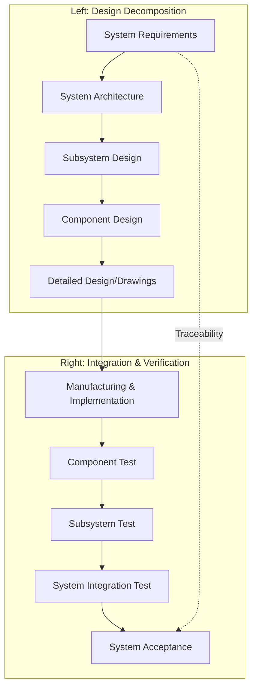

For humanoid robots, left-side requirements typically include: bipedal walking speed, payload capacity, battery life, safe workspace, fall self-protection, human-robot collaboration level, cost targets, etc. These requirements are decomposed layer by layer into: actuator torque/speed, joint DOF, link mass and stiffness, sensor accuracy, control cycle, battery energy, structural safety factor, etc. Right-side verification proceeds through unit tests (motor test bench, gearbox life test), subsystem tests (single-leg test bench, arm test bench), and full-machine tests (walking, manipulation, drop, EMC) up to field trials.

!!! note "Terminology: Design Input, Specification, Design Output, Traceability"
    - **Design Input**: The explicit requirements, constraints, and assumptions that a product must satisfy.
    - **Specification**: A quantified set of parameters describing performance, quality, and environmental adaptability.
    - **Design Output**: The results of the design process, including drawings, BOM, code, and process documents.
    - **Traceability**: A bi-directional traceable relationship between requirements, design, and verification.

### 8.1.2 Design Input: Tasks, Environment, and Constraints

The design inputs for a humanoid robot can be divided into three categories: **mission requirements, environmental constraints, and resource constraints**. Mission requirements determine what the robot needs to do; environmental constraints determine the scenarios in which it must operate reliably; resource constraints determine cost, schedule, team capability, and supply chain boundaries.

!!! note "Terminology: Mission Requirement, Environmental Constraint, Resource Constraint, Life Cycle Cost"
    - **Mission Requirement**: The functional and performance goals the robot should achieve.
    - **Environmental Constraint**: External conditions such as temperature, humidity, dust, vibration, electromagnetic interference, and human-robot density.
    - **Resource Constraint**: Budget, time, talent, supply chain, and manufacturing capabilities.
    - **Life Cycle Cost (LCC)**: The total cost incurred from product concept to disposal.

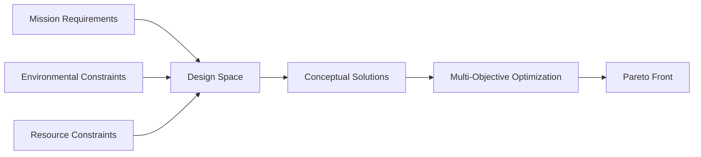

Design inputs are typically written as a Requirements Specification. For example, the requirements for a factory logistics humanoid robot could be expressed as:

| Requirement Category | Example Metrics |
|---|---|
| Locomotion | Flat ground walking ≥ 1.0 m/s, can ascend/descend 15° slopes, single-leg standing stability margin ≥ 30 mm |
| Manipulation | Dual-arm 7-DOF, end-effector payload ≥ 5 kg, repeatability ± 1 mm |
| Perception | RGB-D cameras × 4, LiDAR × 1, IMU × 1, force/torque sensors ≥ 6-axis × 4 |
| Battery Life | Continuous operation ≥ 4 h, battery hot-swappable |
| Safety | Collaborative speed ≤ 1.5 m/s, collision force ≤ 150 N, compliant with ISO/TS 15066 |
| Environment | Operating temperature 5–40 °C, IP54 |
| Cost | Target BOM cost ≤ $150,000 (low volume) |

### 8.1.3 Why Choose the Humanoid Form: Motivations and Costs

The core motivation for the humanoid form is **environmental compatibility**: human society's infrastructure, tools, stairs, door handles, and work surfaces are all designed based on human body dimensions and movement capabilities. While wheeled, tracked, or quadruped robots may be more efficient in certain scenarios, they often require additional modifications in human-built environments. Humanoid robots can directly use existing facilities, reducing deployment costs.

!!! note "Terminology: Environmental Compatibility, Anthropomorphism, Bipedal, Generality, Specialization"
    - **Environmental Compatibility**: The ability of a robot's form and size to adapt to an existing environment.
    - **Anthropomorphism**: Endowing a robot with human-like physical form, behavior, or interaction characteristics.
    - **Bipedal**: A locomotion method using two legs for walking.
    - **Generality**: The ability to remain usable across multiple tasks and environments.
    - **Specialization**: Optimization for a specific task, often at the cost of generality.

However, the costs of the humanoid form are significant:

1. **High Degrees of Freedom**: Typically requires 28–52 actuated DOFs, leading to complexity in control, calibration, and maintenance.
2. **Dynamic Instability**: The small support polygon of bipedal walking requires active balance control, consuming more energy than wheeled locomotion.
3. **High Power Density**: Limited joint space requires highly integrated motors, gearboxes, and drives.
4. **Safety Sensitivity**: Falls can injure people and objects, necessitating lightweight structures, compliant control, and self-protection strategies.

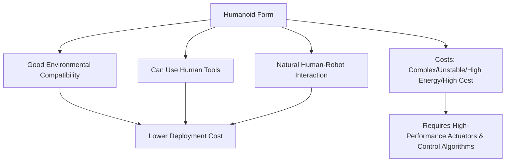

### 8.1.4 Design Process: Conceptual Design → Detailed Design → Verification

A typical humanoid robot design process includes the following stages:

1. **Conceptual Design**: Determine functions, form, size, DOF, walking method, and manipulation method.
2. **System Architecture Design**: Define subsystems (torso, arms, legs, head, power, computing, perception).
3. **Kinematic and Dynamic Modeling**: Build link models, calculate workspace, verify stability.
4. **Detailed Structural Design**: CAD modeling, material selection, strength/stiffness/modal/fatigue analysis.
5. **Actuator and Joint Design**: Integration of motor, gearbox, drive, sensor, and thermal management.
6. **Control and Software Design**: Walking, balancing, manipulation, and safety software stacks.
7. **Prototyping and Testing**: Rapid prototyping, single-leg/single-arm test benches, full-machine integration testing.
8. **Iterative Optimization**: Update design and control parameters based on test data.

!!! note "Terminology: Conceptual Design, Detailed Design, Prototype, Iterative Optimization"
    - **Conceptual Design**: Forming several feasible solutions with incomplete information and comparing them for selection.
    - **Detailed Design**: Transforming the selected solution into manufacturable drawings, BOM, and processes.
    - **Prototype**: An early model used to verify design assumptions.
    - **Iterative Optimization**: Repeatedly improving the design based on test feedback.

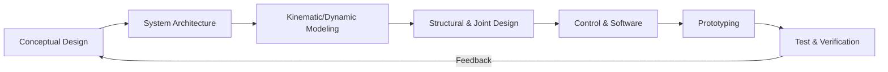

### 8.1.5 Design Trade-offs and Multi-Objective Optimization

Humanoid robot design is inherently a multi-objective optimization problem: increasing speed often increases energy consumption, increasing stiffness often increases mass, and increasing degrees of freedom often increases control complexity. These conflicting objectives cannot be optimized simultaneously; acceptable trade-offs must be sought on the **Pareto front**.

!!! note "Term Explanation: Multi-Objective Optimization, Pareto Front, Trade-off, Design Variable, Objective Function"
    - **Multi-objective optimization**: Optimizing multiple potentially conflicting objective functions simultaneously.
    - **Pareto front**: The boundary formed by all Pareto optimal solutions in the objective space.
    - **Trade-off**: Sacrificing one objective to improve another.
    - **Design variable**: Adjustable parameters, such as link length, material thickness, motor model.
    - **Objective function**: Performance metrics to be maximized or minimized.

Taking leg design as an example, common objective functions include:

- Minimize leg mass $m_{\text{leg}}$ to reduce swing inertia.
- Maximize joint torque density $T/V$ to ensure motion capability.
- Maximize structural stiffness $k$ to reduce deformation and vibration.
- Minimize cost $C$ to improve commercial feasibility.

The general form of multi-objective optimization is:

$$
\min_{\mathbf{x}} \, \left[f_1(\mathbf{x}), f_2(\mathbf{x}), \ldots, f_k(\mathbf{x})\right]
$$

Constraints include geometric constraints, strength constraints, actuation capability constraints, workspace constraints, etc.

!!! note "Term Explanation: Constraint, Feasible Region, Optimization Algorithm, Genetic Algorithm, Particle Swarm"
    - **Constraint**: Limitations that design variables must satisfy.
    - **Feasible region**: The set of design variables satisfying all constraints.
    - **Optimization algorithm**: Numerical methods for searching optimal solutions.
    - **Genetic algorithm**: A global optimization method simulating natural selection.
    - **Particle swarm optimization**: An optimization algorithm simulating swarm behavior.

```mermaid
xychart-beta
    title "Schematic of Humanoid Robot Design Pareto Front"
    x-axis "Cost"
    y-axis "Performance"
    line [0.9, 0.85, 0.75, 0.6, 0.4, 0.2]
    annotation "Pareto front" [0.5, 0.7]
```

In engineering practice, designers typically first determine the dominant objective (e.g., cost or performance), then set minimum acceptable thresholds for other objectives, thereby transforming the multi-objective problem into a constrained single-objective or sequential optimization problem.

#### 8.1.6 Scaling Laws and Similarity Criteria for Humanoid Robots

The geometric dimensions, mass, joint torques, and power requirements of humanoid robots are not arbitrarily chosen but are deeply constrained by **scaling laws**. Understanding these laws helps explain why a 30 cm toy bipedal robot can jump several times per second, while a 1.8 m adult-sized humanoid robot requires hundreds of watts to walk stably; it also aids in quickly estimating total mass, drive power, and structural loads during the conceptual design phase[86][87].

!!! note "Term Explanation: Scaling Law, Geometric Similarity, Dynamic Similarity, Allometry"
    - **Scaling law**: A power-law relationship describing how physical quantities change with characteristic length.
    - **Geometric similarity**: Identical shape, only scaled in size proportionally.
    - **Dynamic similarity**: Identical dimensionless numbers for systems of different scales.
    - **Allometry**: A scaling relationship where certain biological traits do not grow proportionally with geometry.

If two robots are geometrically similar, with characteristic length denoted as \(L\), then:

- Length: \(l \propto L\)
- Area (cross-section, surface area): \(A \propto L^2\)
- Volume and mass: \(V \propto L^3\), \(m \propto L^3\)

Structural strength is determined by cross-sectional area, so load-bearing capacity (e.g., tensile, bending) is proportional to \(L^2\); while self-weight is proportional to \(L^3\). Thus, the **specific load capacity** (load per unit mass) decreases with increasing scale:

$$
\frac{\text{Load-bearing capacity}}{\text{Mass}} \propto \frac{L^2}{L^3} = L^{-1}
$$

This is why large animals have relatively thicker bones and large robot structures must be heavier—they deviate from pure geometric similarity by increasing relative cross-sectional area to compensate.

!!! note "Term Explanation: Characteristic Length, Cross-sectional Area, Load-bearing Capacity, Specific Load Capacity"
    - **Characteristic length**: A representative length indicating system size, such as height or leg length.
    - **Cross-sectional area**: The area of a cross-section perpendicular to the member axis.
    - **Load-bearing capacity**: The maximum load a structure can withstand.
    - **Specific load capacity**: The ratio of load-bearing capacity to mass.

For dynamic motion, the key dimensionless number is the **Froude number**:

$$
\text{Fr} = \frac{v^2}{g L}
$$

The Froude number represents the ratio of inertial force to gravity. If two robots are dynamically similar, they have the same Froude number, so the characteristic velocity satisfies:

$$
v \propto \sqrt{g L}
$$

That is, velocity scales with the square root of length. The gait period \(T\) is proportional to characteristic length divided by velocity:

$$
T \propto \frac{L}{v} \propto \sqrt{\frac{L}{g}}
$$

This means taller robots have a lower stride frequency. For example, if a 1.3 m ASIMO is scaled up to 1.8 m (a factor of 1.38), under the assumption of dynamic similarity, its characteristic velocity should increase by \(\sqrt{1.38} \approx 1.18\) times, and its gait period should increase by \(\sqrt{1.38} \approx 1.18\) times.

!!! note "Term Explanation: Froude Number, Inertial Force, Gravity, Dimensionless Number, Gait Period"
    - **Froude number**: A dimensionless number representing the ratio of inertial force to gravity.
    - **Inertial force**: A fictitious force related to acceleration.
    - **Gravity**: The force exerted by Earth's gravitational pull.
    - **Dimensionless number**: A combination of physical quantities without units.
    - **Gait period**: The time required to complete one gait cycle.

Joint torques are primarily generated by self-weight. Taking the hip joint as an example, the approximate torque is:

$$
\tau \sim m g l \propto L^3 \cdot L = L^4
$$

Joint power is torque multiplied by angular velocity. Angular velocity \(\omega = v/l \propto L^{-1/2}\), therefore:

$$
P = \tau \omega \propto L^4 \cdot L^{-1/2} = L^{7/2}
$$

Total robot mass \(m \propto L^3\), so the **specific power** (power per unit mass) is:

$$
\frac{P}{m} \propto \frac{L^{7/2}}{L^3} = L^{1/2}
$$

This means: under dynamic similarity, larger humanoid robots require higher specific power. Real organisms follow a similar trend—larger animals have higher metabolic rates per unit mass. In engineering, this explains why tall humanoid robots must use high power-density actuators, while small robots can use ordinary motors.

!!! note "Term Explanation: Joint Torque, Angular Velocity, Joint Power, Specific Power, Power Density"
    - **Joint torque**: The rotational moment about the axis at a joint.
    - **Angular velocity**: The rate and direction of rotation.
    - **Joint power**: The work capability of a joint per unit time, \(P = \tau \omega\).
    - **Specific power**: The ratio of power to mass.
    - **Power density**: Power per unit volume or per unit mass.

Inertial forces are related to joint acceleration. From \(\tau = I \alpha\), moment of inertia \(I \propto m L^2 \propto L^5\), to produce angular acceleration \(\alpha\), the required torque \(\tau \propto L^5 \alpha\). If angular acceleration is also required to scale geometrically (\(\alpha \propto L^{-1}\)), the torque demand is even higher. A more practical approach is for large robots to use lower angular accelerations in motion planning to avoid excessive inertial loads.

!!! note "Term Explanation: Moment of Inertia, Angular Acceleration, Inertial Load, Motion Planning"
    - **Moment of inertia**: The resistance of an object to angular acceleration.
    - **Angular acceleration**: The rate of change of angular velocity.
    - **Inertial load**: Dynamic load caused by acceleration.
    - **Motion planning**: Generating motion trajectories that satisfy constraints.

Contact impact is also governed by scaling laws. During landing or collision, the **impact energy per unit mass** is:

$$
\frac{E_{\text{impact}}}{m} \sim \frac{m v^2}{m} \propto L
$$

That is, a larger robot bears a greater impact per unit mass. If material strength is approximated as \(L^0\) (the material itself remains unchanged), the structural safety margin decreases with scale, which is why larger robots are more prone to damage from falls.

!!! note "Term Explanation: Impact Energy, Safety Margin, Fall Damage, Contact Impact"
    - **Impact energy**: Mechanical energy transferred during a collision.
    - **Safety margin**: The difference between material strength and working stress.
    - **Fall damage**: Structural damage caused by falling.
    - **Contact impact**: Force generated by brief, high-speed contact between objects.

In nature, **allometry** modifies simple geometric similarity: the leg bones of large animals are relatively thicker (diameter \(\propto L^{1.1\sim1.2}\) instead of \(L^{1.0}\)) to maintain a similar safety margin. Humanoid robot design likewise needs to relax geometric similarity constraints, compensating for scale effects through local reinforcement, the use of high-strength materials, or reducing relative motion speed.

!!! note "Term Explanation: Allometry, Geometric Similarity Constraint, Local Reinforcement, High-Strength Material"
    - **Allometry**: The phenomenon where different parts of an organism grow at different rates.
    - **Geometric similarity constraint**: The restriction of scaling strictly by the same proportion.
    - **Local reinforcement**: Adding material or cross-section in high-stress areas.
    - **High-strength material**: Material with high yield or ultimate strength.

**Python Example: Scaling Law Estimation for Humanoid Robots**

The following code compares the mass, joint torque, power, and specific power of two geometrically similar humanoid robots (heights 1.3 m and 1.8 m), assuming a reference robot mass of 50 kg, peak hip torque of 120 N·m, and total drive power of 500 W.

```python
import numpy as np

# Reference robot parameters
L0 = 1.30       # m
m0 = 50.0       # kg
tau0 = 120.0    # N·m, peak hip torque
P0 = 500.0      # W, total drive power
g = 9.81

# Magnification factor
L1 = 1.80
scale = L1 / L0

# Geometric similarity scaling
m1 = m0 * scale**3
tau1 = tau0 * scale**4
P1 = P0 * scale**3.5  # L^(7/2)
specific_P0 = P0 / m0
specific_P1 = P1 / m1

# Characteristic velocity and gait cycle under dynamic similarity
v0 = 1.0  # m/s reference velocity
v1 = v0 * np.sqrt(scale)
T0 = 1.0  # s reference gait cycle
T1 = T0 * np.sqrt(scale)

print("Scaling factor scale = %.3f" % scale)
print("Mass: %.1f kg → %.1f kg" % (m0, m1))
print("Hip torque: %.1f N·m → %.1f N·m" % (tau0, tau1))
print("Total power: %.1f W → %.1f W" % (P0, P1))
print("Specific power: %.3f W/kg → %.3f W/kg" % (specific_P0, specific_P1))
print("Characteristic velocity: %.2f m/s → %.2f m/s" % (v0, v1))
print("Gait cycle: %.2f s → %.2f s" % (T0, T1))
```

!!! note "Term Explanation: Scaling Factor, Reference Machine, Magnification, Characteristic Velocity"
    - **Scaling factor**: The ratio of characteristic lengths between two systems.
    - **Reference machine**: The robot used as a scaling reference.
    - **Magnification**: The factor by which size is increased.
    - **Characteristic velocity**: A quantity representing motion speed.

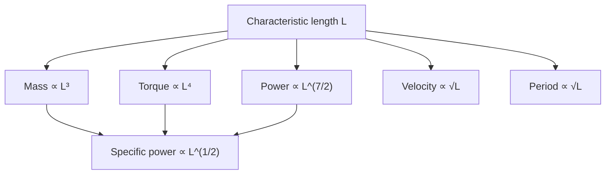

Engineering Implications:

1. A small robot cannot simply be scaled up proportionally without redesigning the drive and structure.
2. Tall humanoid robots require motors with higher specific power and stronger joint supports.
3. Large robots should appropriately reduce angular acceleration and impact velocity to control inertial loads and fall risk.
4. In practice, designs often incorporate allometric corrections based on geometric similarity: thickening critical cross-sections, using lightweight high-strength materials, and optimizing mass distribution.

!!! note "Term Explanation: Engineering Implication, Allometric Correction, Lightweight High-Strength Material, Mass Distribution Optimization"
    - **Engineering implication**: The guiding significance of theoretical principles for practical design.
    - **Allometric correction**: Deviating from geometric similarity to compensate for scale effects.
    - **Lightweight high-strength material**: Material with low density and high strength.
    - **Mass distribution optimization**: Adjusting the mass of different parts to improve dynamic performance.

---

## 8.2 Degrees of Freedom and Joint Configuration

### 8.2.1 Degrees of Freedom (DOF) and Fundamentals of Mechanism

**Degree of Freedom (DOF)** is a quantity describing the number of independent motion parameters of a mechanism. For a single rigid body in space, it has 6 degrees of freedom: 3 translations (along the x, y, and z axes) and 3 rotations (about the x, y, and z axes). For a linkage mechanism connected by joints, its degrees of freedom can be calculated using the **Grübler-Kutzbach formula**[2][3]:

$$
M = 6(n - 1) - \sum_{i=1}^{j}(6 - f_i)
$$

where $n$ is the number of links (including the base), $j$ is the number of joints, and $f_i$ is the number of degrees of freedom of the $i$-th joint. For planar mechanisms, the formula degenerates to $M = 3(n-1) - \sum_{i}(3 - f_i)$.

!!! note "Terminology Explanation: Degrees of Freedom (DOF), Rigid Body, Joint, Link, Grübler-Kutzbach Formula"
    - **Degrees of Freedom (DOF)**: The number of independent coordinates required to determine the configuration of a mechanism.
    - **Rigid Body**: An object assumed to have a constant distance between any two points within it.
    - **Joint**: A mechanism unit connecting adjacent links and allowing specific relative motion.
    - **Link**: A component in a mechanism considered as a rigid body.
    - **Grübler-Kutzbach Formula**: A formula for calculating the total degrees of freedom of a mechanism based on the number of links and joint degrees of freedom.

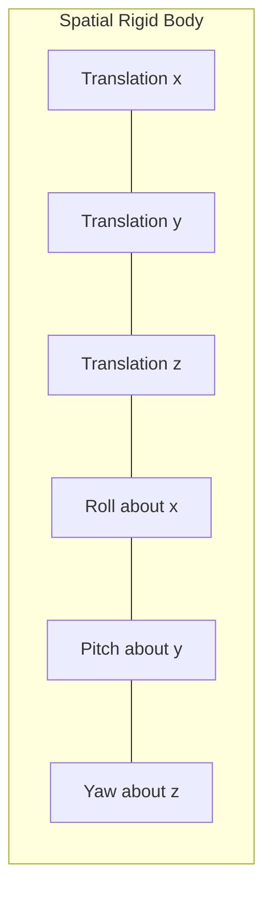

Common joint types and their degrees of freedom:

| Joint Type | Symbol | DOF | Motion Description |
|---|---|---|---|
| Revolute Joint | Revolute (R) | 1 | Rotation about a fixed axis |
| Prismatic Joint | Prismatic (P) | 1 | Translation along a fixed axis |
| Cylindrical Joint | Cylindrical (C) | 2 | Translation along axis + Rotation about axis |
| Spherical Joint | Spherical (S) | 3 | Rotation in three directions |
| Universal Joint | Universal (U) | 2 | Rotation about two orthogonal axes |
| Planar Joint | Planar (E) | 3 | Two translations and one rotation in a plane |

!!! note "Terminology Explanation: Revolute Joint, Prismatic Joint, Spherical Joint, Universal Joint"
    - **Revolute Joint**: A joint that only allows rotation about one axis.
    - **Prismatic Joint**: A joint that only allows translation along one axis.
    - **Spherical Joint**: A joint that allows rotation in three directions, similar to a shoulder joint.
    - **Universal Joint**: A joint that allows rotation about two orthogonal directions.

### 8.2.2 Typical DOF Layout of a Humanoid Robot

The DOF layout of a humanoid robot typically mimics the human body but is simplified for engineering purposes based on tasks, cost, and reliability. A common whole-body configuration is:

- **Head**: 2-DOF (pitch + yaw, sometimes adding roll)
- **Torso**: 1–3 DOF (waist pitch/yaw/roll)
- **Single Arm**: 7-DOF (shoulder 3 + elbow 1 + wrist 3)
- **Single Leg**: 6-DOF (hip 3 + knee 1 + ankle 2)
- **Hand/Dexterous Hand**: 4–22 DOF per hand

Taking an example with 2 arms of 7-DOF + 2 legs of 6-DOF + torso 2-DOF + head 2-DOF + no independent hands, the total DOF = 2×7 + 2×6 + 2 + 2 = 30. If 16-DOF hands are added, the total DOF reaches 62.

!!! note "Terminology Explanation: Hip Joint, Knee Joint, Ankle Joint, Shoulder Joint, Elbow Joint, Wrist Joint"
    - **Hip Joint**: The joint connecting the torso and the thigh, typically having 3 rotational degrees of freedom.
    - **Knee Joint**: The joint between the thigh and the shin, primarily providing pitch degrees of freedom.
    - **Ankle Joint**: The joint between the shin and the foot, typically having 2 degrees of freedom (roll/pitch).
    - **Shoulder Joint**: The joint connecting the torso and the upper arm, typically having 3 rotational degrees of freedom.
    - **Elbow Joint**: The joint between the upper arm and the forearm, primarily providing pitch degrees of freedom.
    - **Wrist Joint**: The joint between the forearm and the hand, typically having 3 rotational degrees of freedom.

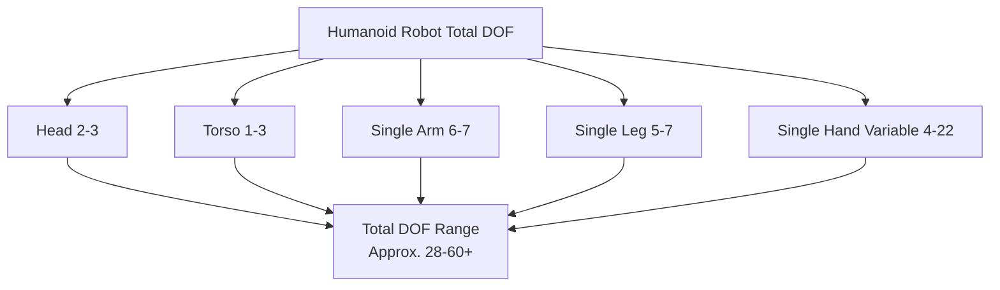

### 8.2.3 Joint Axis Configuration: Hip, Knee, Ankle and Shoulder, Elbow, Wrist

Joint axis configuration directly affects the range of motion, torque requirements, and posture singularities. Humanoid robots typically adopt the following naming convention for orthogonal axes:

- **Hip**: Usually configured with three orthogonal axes: roll (about x-axis), pitch (about y-axis), yaw (about z-axis). The order can be R-P-Y or Y-P-R.
- **Knee**: Only has a pitch axis for flexion/extension motion.
- **Ankle**: Usually configured with two axes: roll + pitch, controlling the foot posture.
- **Shoulder**: Similar to the hip, with 3 orthogonal rotational axes.
- **Elbow**: Typically a pitch axis.
- **Wrist**: roll + pitch + yaw or a skewed axis configuration.

!!! note "Terminology Explanation: Roll, Pitch, Yaw, Orthogonal Axes, Joint Order"
    - **Roll**: Rotation about the x-axis.
    - **Pitch**: Rotation about the y-axis.
    - **Yaw**: Rotation about the z-axis.
    - **Orthogonal Axes**: Rotational axes that are perpendicular to each other.
    - **Joint Order**: The sequence of axes in a multi-DOF joint, affecting the Jacobian and singular configurations.

Common choices for hip joint axis configuration:

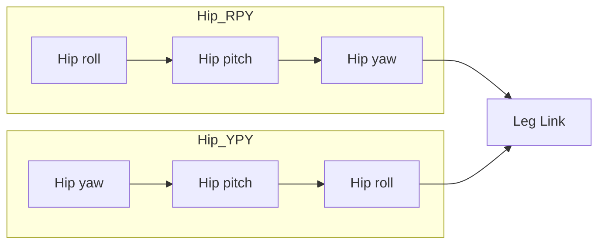

The hip RPY configuration places the pitch axis closer to the torso center, which is beneficial for controlling the inertia of forward/backward swinging during walking. The YPY configuration places the yaw axis at both ends, facilitating decoupling of turning and lateral swinging. In practical design, trade-offs must be made regarding structural space, cable routing, torque transmission paths, and manufacturing assembly.

### 8.2.4 Redundancy and Null Space

When a robot's DOF exceeds the DOF required for a task, it is called **kinematic redundancy**. For example, a 7-DOF arm performing a 6-DOF end-effector pose task has 1-dimensional redundancy; dual-arm collaboration and whole-body mobile manipulation also introduce redundancy. Redundancy brings flexibility but also introduces additional degrees of freedom in control.

!!! note "Terminology Explanation: Kinematic Redundancy, Null Space, Self-Motion, Optimization Objective"
    - **Kinematic Redundancy**: A situation where the robot's available DOF exceeds the task space dimension.
    - **Null Space**: The subspace of joint velocities that does not change the end-effector task.
    - **Self-Motion**: Joint motion that keeps the end-effector pose unchanged.
    - **Optimization Objective**: A secondary criterion to be minimized or maximized within the null space.

Let the task space velocity be $\dot{\mathbf{x}} \in \mathbb{R}^m$, the joint velocity be $\dot{\mathbf{q}} \in \mathbb{R}^n$, the Jacobian matrix be $\mathbf{J} \in \mathbb{R}^{m \times n}$, and $n > m$. Then:

$$
\dot{\mathbf{q}} = \mathbf{J}^\dagger \dot{\mathbf{x}} + (\mathbf{I} - \mathbf{J}^\dagger \mathbf{J}) \dot{\mathbf{q}}_0
$$

where $\mathbf{J}^\dagger$ is the Jacobian pseudoinverse, $(\mathbf{I} - \mathbf{J}^\dagger \mathbf{J})$ is the matrix projecting onto the null space, and $\dot{\mathbf{q}}_0$ is an arbitrary joint velocity. The second term does not change the end-effector task velocity and can be used to optimize posture, avoid singularities, avoid obstacles, or minimize joint torques.

!!! note "Term Explanation: Jacobian Matrix, Pseudoinverse, Projection Matrix, Singular Configuration"
    - **Jacobian Matrix**: A matrix that maps joint velocities to end-effector velocities in task space.
    - **Pseudoinverse**: A generalized inverse for non-square or singular matrices.
    - **Projection Matrix**: A matrix that projects vectors onto a specific subspace.
    - **Singular Configuration**: A configuration where the Jacobian matrix loses rank, making certain directions of velocity or force uncontrollable.

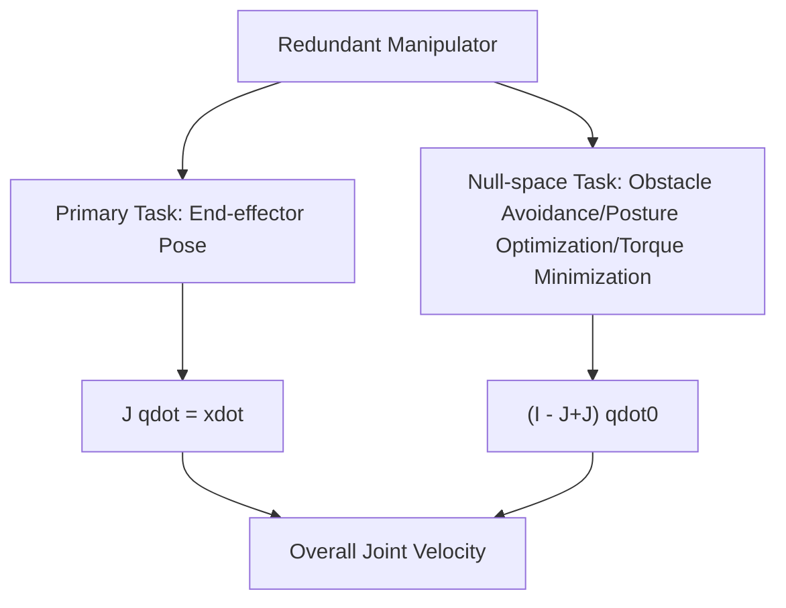

### 8.2.5 Typical Total DOF and Mass Distribution Estimation

The table below summarizes the DOF and main dimensions of several publicly known humanoid robots (public data). These data may change with version updates and are only used to illustrate the design space.

| Model | Public Height (m) | Public Mass (kg) | Public DOF | Remarks |
|---|---|---|---|---|
| Honda ASIMO (2011) | 1.30 | 48 | 57 | Classic electric-driven humanoid, lithium battery backpack[27] |
| Boston Dynamics Atlas (Hydraulic, pre-2020) | 1.50 | 89 | 28 | Hydraulic drive, high dynamic motion[35] |
| Boston Dynamics Atlas (Electric, 2024) | Approx. 1.50 | Public data | Public data | New all-electric design |
| Tesla Optimus Gen-2 | Approx. 1.73 | Approx. 63 | Public data (estimated 40+) | Electric drive, for manufacturing scenarios[17] |
| Agility Digit | Approx. 1.75 | Approx. 65 | Public data | Logistics/warehousing humanoid |
| PAL Robotics TALOS | 1.75 | Approx. 95 | 32 | Torque controllable, for research[Public data] |
| Unitree H1 | Approx. 1.80 | Approx. 47 | Public data | High dynamic electric drive |
| UBTECH Walker X | Approx. 1.30 | Approx. 63 | 41 | Service/education scenarios[31] |
| Fourier GR-1 | Approx. 1.65 | Approx. 55 | 40 | General-purpose humanoid |
| Zhiyuan Expedition A1/A2 | Approx. 1.75 | Approx. 55 | Public data | For industry and home |

!!! note "Term Explanation: Total DOF, Mass Distribution, Center of Mass, Moment of Inertia"
    - **Total DOF**: The sum of all independent motion degrees of freedom of the robot.
    - **Mass Distribution**: The spatial distribution of mass across the robot's links.
    - **Center of Mass (CoM)**: The mass-weighted average position.
    - **Moment of Inertia**: A quantity describing a rigid body's resistance to angular acceleration.

### 8.2.6 Wrist and Ankle: End-effector Pose and Stability

The wrist and ankle are the "end-effector interfaces" at the limb extremities. The wrist determines the hand's posture and reachable workspace; the ankle determines the foot plate's posture and is crucial for bipedal stability.

For the ankle joint, the pitch axis controls foot plantarflexion/dorsiflexion (uphill/downhill/toe standing), and the roll axis controls foot inversion/eversion (lateral balance). Ankle torque requirements are typically high: during single-leg support, the entire body weight generates torque around the ankle joint, and ground reaction forces are transmitted through the ankle.

!!! note "Term Explanation: End-effector, Ground Reaction Force, Torque, Moment Arm"
    - **End-effector**: The device at the end of a robot limb that interacts with the environment, such as a hand, foot, or tool.
    - **Ground Reaction Force (GRF)**: The contact force exerted by the ground on the foot.
    - **Torque/Moment**: The rotational effect of a force about a point or axis, $\mathbf{M} = \mathbf{r} \times \mathbf{F}$.
    - **Moment Arm**: The perpendicular distance from the line of action of a force to the axis of rotation.

---


### 8.2.7 Principles of Lower Limb and Foot Design

The lower limbs of a humanoid robot are the final link for transmitting the entire robot's mass to the ground and are the core determining walking, running, jumping, and disturbance rejection capabilities. **The leg kinematic chain** typically consists of three segments: hip, knee, and ankle. Its DOF configuration is heavily influenced by both human anatomy and engineering feasibility[2][3].

!!! note "Term Explanation: Leg Kinematic Chain, Hip, Knee, Ankle, DOF Configuration"
    - **Leg Kinematic Chain**: A kinematic chain formed by the serial connection of the hip, knee, ankle, and their links.
    - **Hip**: The joint connecting the torso and thigh, typically providing 3 rotational DOF.
    - **Knee**: The joint between the thigh and shank, primarily providing a pitch DOF.
    - **Ankle**: The joint between the shank and foot, typically providing 2 DOF (roll and pitch).
    - **DOF Configuration**: The selection of the number and arrangement of DOF for each joint.

#### Leg Kinematic Chain: Hip 3-DOF + Knee 1-DOF + Ankle 2-DOF

A typical humanoid robot uses a **6-DOF configuration** per leg:

- **Hip 3-DOF**: roll (abduction/adduction), pitch (flexion/extension), yaw (rotation) – three orthogonal axes allowing the leg to swing and support in 3D space.
- **Knee 1-DOF**: Single pitch axis, primarily responsible for the flexion/extension of the shank relative to the thigh, providing the largest vertical displacement during gait.
- **Ankle 2-DOF**: roll + pitch, adjusting the foot plate posture to adapt to uneven ground, slopes, and lateral balance.

This 3-1-2 layout is not the only option. Some simplified platforms use 3-1-0 (no ankle joint) or 2-1-2 configurations to reduce cost, but this sacrifices posture adjustment capability and terrain adaptability. Adding a hip yaw axis improves turning flexibility but makes the hip joint structure more complex and heavier. Designers must trade off between motion capability, mass, inertia, and control complexity[3][82].

!!! note "Term Explanation: Abduction/Adduction, Flexion/Extension, Rotation, Terrain Adaptability, Inertia"
    - **Abduction/Adduction**: Swing around the body's anterior-posterior axis, corresponding to roll.
    - **Flexion/Extension**: Swing around the body's left-right axis, corresponding to pitch.
    - **Rotation**: Rotation around the body's vertical axis, corresponding to yaw.
    - **Terrain Adaptability**: The robot's ability to adapt to different ground shapes and materials.
    - **Inertia**: The moment of inertia exhibited during limb motion, affecting dynamic response.

The arrangement order of the three hip axes significantly affects kinematic and dynamic characteristics. Common orders include R-P-Y (roll-pitch-yaw) and Y-P-R (yaw-pitch-roll):

- **R-P-Y**: The pitch axis is closer to the torso center, beneficial for forward/backward swinging during walking, reducing torso sway.
- **Y-P-R**: The yaw axis is at the top and bottom, facilitating decoupling of turning and lateral swing, suitable for scenarios requiring rapid turning.

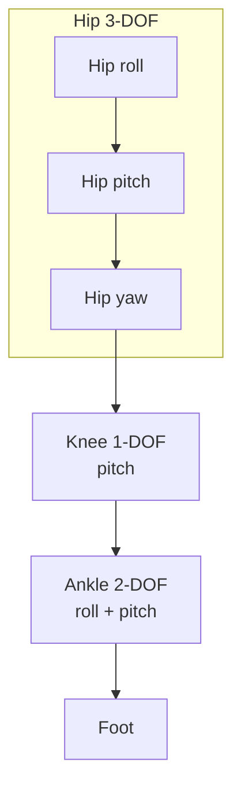

#### Foot Design: Flat Foot vs. Human-like Foot

**The foot** is the only contact interface between the humanoid robot and the ground. Its geometry, mass, and compliance directly affect stability, energy efficiency, and sensing capability. Foot design can be divided into two main categories:

1. **Flat Foot**: The sole is a rigid or semi-rigid flat plate, offering large contact area, high stability, and ease of integrating force/torque sensors. Most engineering humanoid robots adopt this design.
2. **Human-like Foot**: Features a foot arch, heel, and toe joints, with a mass distribution closer to the human body. It can simulate human rocker motion during foot strike and push-off, but the structure is complex and control is difficult.

!!! note "Term Explanation: Flat Foot, Human-like Foot, Foot Arch, Rocker Motion, Push-off"
    - **Flat Foot**: A foot design where the sole is approximately planar.
    - **Human-like Foot**: A foot design that mimics the structure of the human foot.
    - **Foot Arch**: The arched structure in the middle of the foot sole, providing cushioning and energy storage.
    - **Rocker Motion**: The gait pattern where the heel strikes first, and the center of mass gradually moves forward over the foot.
    - **Push-off**: The action of the foot pushing down and backward against the ground before the toes leave the ground to propel the body forward.

Key design parameters for the foot include:

- **contact patch**: The actual area where the sole of the foot contacts the ground. A larger patch improves stability but reduces adaptability to terrain.
- **Center of Pressure (CoP)**: The point of application of the ground reaction force on the sole. During walking, the CoP rolls from the heel to the toe and is closely related to the ZMP.
- **ankle torque**: The torque generated by the entire body weight around the ankle joint during the single-leg support phase, typically requiring the ankle joint to have extremely high torque density.
- **force/torque sensor integration**: Six-axis force/torque sensors are often installed at the ankle or sole to measure GRF, CoP, and contact torque.

!!! note "Term Explanation: Contact Patch, Center of Pressure (CoP), Ankle Torque, Six-Axis Force/Torque Sensor"
    - **contact patch**: The actual area where the foot contacts the ground.
    - **Center of Pressure (CoP)**: The equivalent point of application of the ground reaction force on the contact surface.
    - **ankle torque**: The torque around the ankle joint, generated by the ground reaction force and gravity.
    - **six-axis force/torque sensor (6-axis F/T sensor)**: A sensor that simultaneously measures three force components and three torque components.

For the single-leg support phase, the ankle pitch torque can be approximated as:

$$
\tau_{\text{ankle,pitch}} \approx m g \, d_{\text{CoM-ankle}}
$$

where \(m\) is the total robot mass, \(g\) is the gravitational acceleration, and \(d_{\text{CoM-ankle}}\) is the horizontal distance from the center of mass to the ankle joint. Taking a 60 kg robot with a center of mass offset of 0.05 m as an example, the ankle pitch torque is approximately \(60 \times 9.81 \times 0.05 \approx 29.4\ \text{N·m}\); considering dynamic swinging and slopes, the peak torque may double.

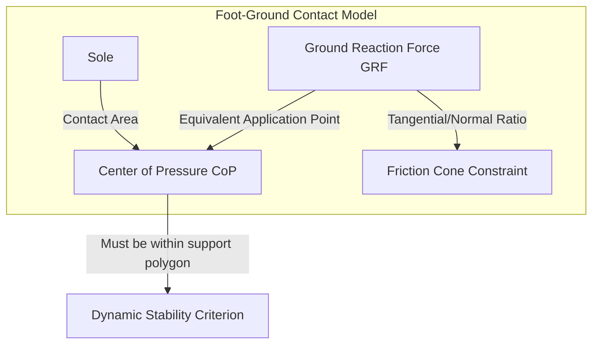

#### Compliance and Impact Absorption

Each step in bipedal walking is accompanied by foot-ground impact. If the impact force is transmitted directly to the joint reducers and motors, it will accelerate wear, excite structural vibrations, and increase energy consumption. Therefore, the foot and lower leg are typically designed with **compliant elements** to absorb impacts:

- **Elastomer pads/rubber pads**: Installed on the sole or at the ankle output, providing controllable normal compliance.
- **Spring-damper mechanisms**: Introduce linear springs and dampers at the ankle or lower leg to store and dissipate impact energy.
- **Viscoelastic materials**: Such as TPU, silicone, etc., which can provide damping over a wide frequency range.

!!! note "Term Explanation: Compliant Element, Elastomer Pad, Spring-Damper Mechanism, Viscoelastic Material"
    - **compliant element**: A structure or material that undergoes elastic deformation under external force.
    - **elastomer pad**: A cushioning pad made of rubber or similar material.
    - **spring-damper mechanism**: A vibration absorption device composed of a spring and a damper.
    - **viscoelastic material**: A material that exhibits both elastic and viscous responses.

Compliance design requires a trade-off: excessive compliance reduces posture control bandwidth and positioning accuracy, while insufficient compliance fails to effectively absorb impacts. Common design metrics are **equivalent stiffness** \(k_{\text{eq}}\) and **equivalent damping** \(c_{\text{eq}}\), satisfying:

$$
m \ddot{z} + c_{\text{eq}} \dot{z} + k_{\text{eq}} z = F_{\text{GRF}}
$$

where \(z\) is the vertical displacement of the foot or ankle. The peak impact force is proportional to the equivalent stiffness; designers often optimize \(k_{\text{eq}}\) and \(c_{\text{eq}}\) through experiments or simulations.

#### Range of Motion and Human Gait Requirements

The joint Range of Motion (ROM) for normal human gait provides an important reference for foot and leg design:

| Joint | Typical Human ROM (Walking) | Humanoid Robot Design Target |
|---|---|---|
| Hip Flexion/Extension | \(-30° \sim +30°\) | \(\pm 45°\) or more |
| Hip Abduction/Adduction | \(\pm 10°\) | \(\pm 20°\) or more |
| Hip Rotation | \(\pm 10°\) | \(\pm 30°\) or more |
| Knee Flexion/Extension | \(0° \sim +60°\) | \(0° \sim +90°\) or more |
| Ankle Dorsiflexion/Plantarflexion | \(-10° \sim +20°\) | \(-20° \sim +30°\) or more |
| Ankle Inversion/Eversion | \(\pm 5°\) | \(\pm 15°\) or more |

!!! note "Term Explanation: Range of Motion (ROM), Hip Flexion/Extension, Hip Abduction/Adduction, Ankle Dorsiflexion/Plantarflexion, Ankle Inversion/Eversion"
    - **Range of Motion (ROM)**: The angular range over which a joint can move.
    - **hip flexion/extension**: The forward/backward swing of the thigh around the hip.
    - **hip abduction/adduction**: The lateral swing of the thigh around the hip.
    - **ankle dorsiflexion/plantarflexion**: The movement of the top of the foot upward / the toes downward.
    - **ankle inversion/eversion**: The inward/outward tilt of the foot around the longitudinal axis.

Robot joint ROM is typically larger than that required for human walking to retain margins for actions such as climbing stairs, stepping over obstacles, and squatting. However, excessive ROM sacrifices structural stiffness and compactness, so both soft and hard limit protections should be set at the joint limits.

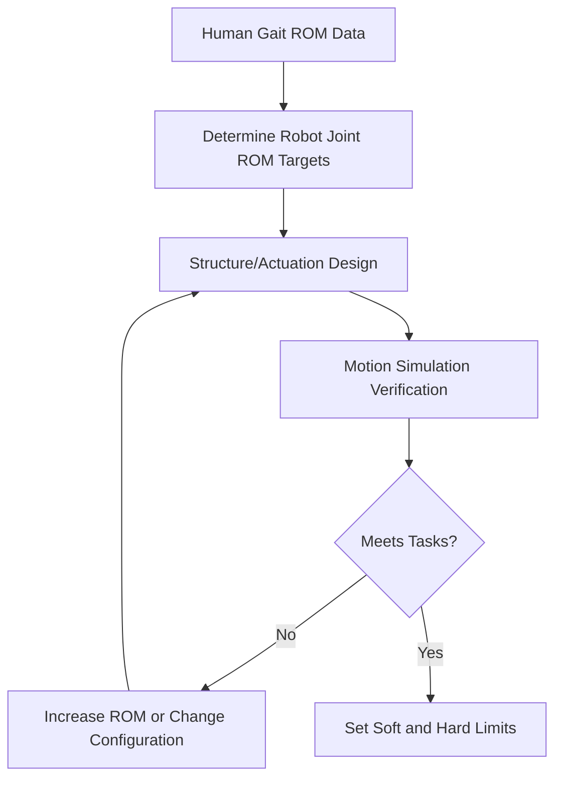


### 8.2.8 Upper Limb and Hand Design Principles

The upper limbs of a humanoid robot are responsible for interacting with the environment, manipulating objects, and maintaining balance. The design of the **arm kinematic chain** and the **hand** must balance load capacity, workspace, dexterity, weight, and cost[1][2][3].

!!! note "Term Explanation: Upper Limb, Arm Kinematic Chain, Hand, Workspace, Dexterity"
    - **upper limb**: The robotic limb including the shoulder, arm, elbow, wrist, and hand.
    - **arm kinematic chain**: A multi-degree-of-freedom serial chain composed of the shoulder, elbow, wrist, and their links.
    - **hand**: The end-effector at the end of the arm used for grasping and manipulation.
    - **workspace**: The set of all poses reachable by the end of the arm.
    - **dexterity**: The ability of the hand to perform fine manipulation tasks.

#### Arm Kinematic Chain: Shoulder 3-DOF, Elbow 1-2 DOF, Wrist 2-3 DOF

A typical humanoid robot single arm uses a **7-DOF** configuration, mimicking the kinematic redundancy of the human arm:

- **Shoulder 3-DOF**: Three orthogonal axes (roll-pitch-yaw), determining the orientation of the arm root.
- **Elbow 1-DOF**: A single pitch axis, performing forearm flexion/extension.
- **Wrist 3-DOF**: roll-pitch-yaw, for fine adjustment of the end-effector orientation.

This 3-1-3 layout provides 1 degree of redundancy beyond the 6-DOF end-effector pose task, allowing optimization of posture, obstacle avoidance, or singularity avoidance within the null space. If task orientation requirements are low, the wrist can be reduced to 2-DOF (roll + pitch or pitch + yaw) to reduce cost and mass.

!!! note "Term Explanation: Shoulder, Elbow, Wrist, End-Effector Pose, Kinematic Redundancy"
    - **shoulder**: The joint group connecting the torso and upper arm.
    - **elbow**: The joint between the upper arm and forearm.
    - **wrist**: The joint group between the forearm and hand.
    - **end-effector pose**: The position and orientation of the arm end in the operational space.
    - **kinematic redundancy**: A situation where the joint DOF exceeds the task space dimension.

Key metrics for arm design include:

- **Workspace**: Determined by the lengths of the shoulder, elbow, and wrist, and the joint ROM. A humanoid robot arm typically needs to cover a range from the ground to above the head, and from the front of the chest to behind the body.
- **Payload**: The maximum mass the arm end can support. Industrial scenarios require 5 kg or more, while service scenarios may only need 1-2 kg.
- **Dexterity**: Often measured using manipulability ellipsoids, condition numbers, etc., related to the singular value distribution of the Jacobian matrix.
- **Self-weight and Inertia**: The lighter the arm, the more favorable it is for torso balance and dynamic response.

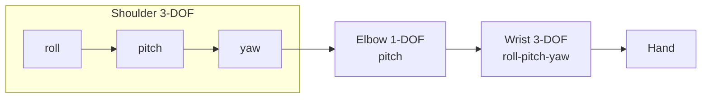

#### Hand Design: Dexterous Hand vs Parallel-Jaw Gripper

Humanoid robot hands can be divided into two main types:

1. **Parallel-jaw gripper**: Only two fingers perform opening and closing movements. Simple structure, reliable, low cost, suitable for grasping regular objects, but unable to perform complex operations.
2. **Dexterous hand**: Has multiple fingers and multiple joints, can imitate human hand movements, and perform various operations such as grasping, pinching, holding, and twisting. However, it has a complex structure, difficult control, and high cost.

!!! note "Term Explanation: Parallel-Jaw Gripper, Dexterous Hand, Multi-Finger Manipulation, Grasping"
    - **Parallel-jaw gripper**: A gripper with only two parallel fingers.
    - **Dexterous hand**: A hand with multiple fingers and joints capable of performing complex operations.
    - **Multi-finger manipulation**: Using multiple fingers to cooperatively control the movement of an object.
    - **Grasping**: The act of securing or moving an object with the hand.

There are two main driving methods for dexterous hands:

- **Direct-drive**: Each joint is driven by an independent motor. High control precision and fast response, but a large number of motors, large volume, and heavy mass.
- **Tendon-driven**: Motors are placed in the forearm or palm, transmitting force to the finger joints via tendons and pulleys. This can reduce finger size and inertia, but suffers from friction, backlash, and tendon wear issues.

!!! note "Term Explanation: Direct-Drive, Tendon-Driven, Tendon, Backlash, Finger Inertia"
    - **Direct-drive**: A driving method where the motor is installed directly at the joint.
    - **Tendon-driven**: A driving method that transmits force and motion through flexible tendons.
    - **Tendon**: A flexible cable that transmits tensile force.
    - **Backlash**: Input-output lag in a transmission system caused by clearance.
    - **Finger inertia**: The rotational inertia of a finger during movement.

#### Thumb Opposition and Grasp Classification

One of the most important features of the human hand is **thumb opposition**: the thumb can move opposite to the other four fingers, forming a pincer grasp. Robotic dexterous hands typically include at least a thumb, index finger, and middle finger; some designs also include the ring and little fingers.

According to Napier's classic classification, grasps can be divided into two main categories:

1. **Power grasp**: The fingers wrap around the object, and the palm provides primary support. Used for high-stability, high-torque grasping, such as holding a hammer or lifting a box.
2. **Precision grasp**: Only the fingertips are used to pinch the object. Used for fine manipulation, such as pinching a key or picking up a screw.

Additionally, there are variants such as **hook grasp**, **lateral pinch**, **spherical grasp**, and **cylindrical grasp**[1].

!!! note "Term Explanation: Thumb Opposition, Power Grasp, Precision Grasp, Hook Grasp, Lateral Pinch"
    - **Thumb opposition**: The ability of the thumb to move opposite to the other fingers.
    - **Power grasp**: A stable grasp using a large area of the palm and fingers to envelop the object.
    - **Precision grasp**: A low-force grasp using only the fingertips to control the object.
    - **Hook grasp**: A grasp where the fingers are bent into a hook shape to suspend an object.
    - **Lateral pinch**: The action of gripping an object between the thumb pad and the side of the index finger.

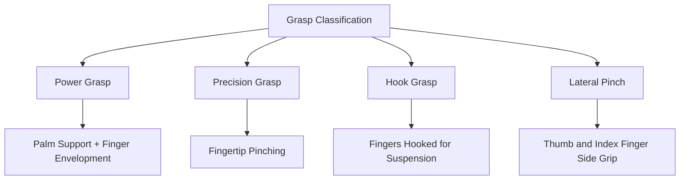

#### Finger DOF Allocation and Underactuation

A human hand has approximately 21 degrees of freedom (4 fingers x 4 DOF + thumb 5 DOF). However, due to limitations in size and the number of actuators, robotic dexterous hands often employ **underactuated** designs:

- **Fully actuated**: Each joint is independently driven, offering flexible control but high complexity.
- **Underactuated**: The number of actuators is less than the number of joint DOFs. Mechanical coupling (e.g., tendons, linkages, differential mechanisms) allows the fingers to automatically envelop an object upon contact.

!!! note "Term Explanation: Finger DOF, Fully Actuated, Underactuated, Mechanical Coupling, Adaptive Enveloping"
    - **Finger DOF**: The number of independent motion parameters of a finger.
    - **Fully actuated**: Each degree of freedom has an independent actuator.
    - **Underactuated**: The number of actuators is less than the number of degrees of freedom.
    - **Mechanical coupling**: Using mechanisms to correlate the motion of multiple joints.
    - **Adaptive enveloping**: The characteristic of a finger automatically conforming to the shape of an object upon contact.

A typical underactuated finger uses a "1 motor driving 2-3 joints" configuration: the motor pulls the proximal phalanx via a tendon, which then drives the middle and distal phalanges. When the proximal phalanx contacts the object first, subsequent motion is automatically transferred to the distal phalanges, achieving adaptive enveloping. This design significantly reduces the number of actuators and improves adaptability to objects of unknown shape.

Common finger DOF allocation:

| Finger | Joint | Typical DOF | Description |
|---|---|---|---|
| Index/Middle/Ring/Little | Metacarpophalangeal (MCP) | 2 | Flexion/Extension + Abduction/Adduction |
| | Proximal Interphalangeal (PIP) | 1 | Flexion/Extension |
| | Distal Interphalangeal (DIP) | 1 | Flexion/Extension |
| Thumb | Carpometacarpal (CMC) | 2-3 | Flexion/Extension + Abduction/Adduction + Opposition |
| | Metacarpophalangeal (MCP) | 1 | Flexion/Extension |
| | Interphalangeal (IP) | 1 | Flexion/Extension |

!!! note "Term Explanation: Metacarpophalangeal (MCP), Proximal Interphalangeal (PIP), Distal Interphalangeal (DIP), Carpometacarpal (CMC)"
    - **Metacarpophalangeal joint (MCP)**: The joint between the palm and the proximal phalanx.
    - **Proximal Interphalangeal joint (PIP)**: The joint between the proximal and middle phalanges.
    - **Distal Interphalangeal joint (DIP)**: The joint between the middle and distal phalanges.
    - **Carpometacarpal joint (CMC)**: The joint between the carpal bones and the metacarpal bones; it has the greatest range of motion in the thumb.

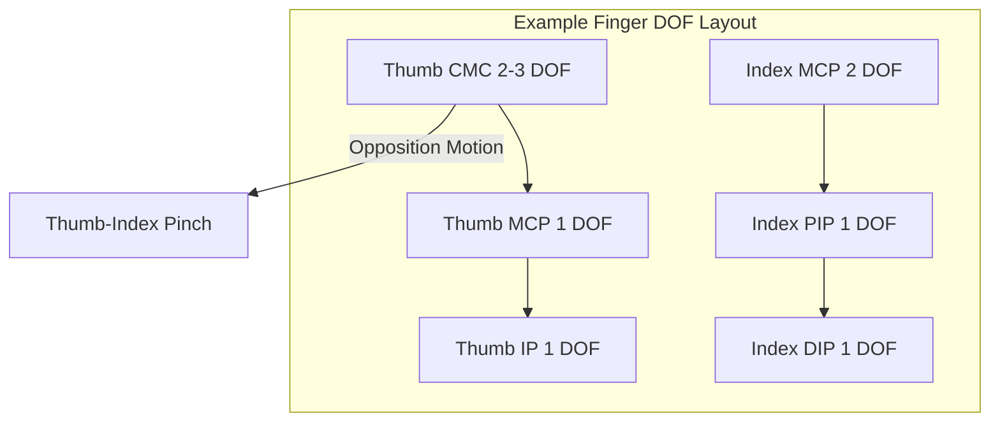

#### Soft Fingertips and Tactile Sensing Integration

The contact characteristics between the fingertip and the object determine grasp stability. **Soft fingertips**, made of elastic materials (silicone, rubber, gel), increase the contact area, improve friction, absorb impact, and allow slight shape adaptation. The contact force distribution of a soft fingertip can be described by Hertzian contact or finite deformation models.

!!! note "Term Explanation: Soft Fingertip, Contact Area, Friction Coefficient, Hertzian Contact"
    - **Soft fingertip**: A fingertip made of a flexible material.
    - **Contact area**: The actual area of contact between the fingertip and the object.
    - **Friction coefficient**: The upper limit of the ratio of tangential to normal force at the contact surface.
    - **Hertzian contact**: A classical theory describing the contact deformation of elastic bodies under normal force.

The integration of tactile sensors allows the hand to perceive:

- **Normal force distribution**: To determine if the grip is too tight or too loose.
- **Tangential force/slip**: To detect if an object is about to slip, triggering anti-slip strategies.
- **Object shape and material**: To identify the contacted object through pressure distribution patterns.
- **Temperature/vibration**: To expand the dimensions of perception.

Common tactile sensing technologies include: resistive arrays, capacitive arrays, optical tactile sensors (vision-based GelSight type), piezoelectric films, etc.

!!! note "Term Explanation: Tactile Sensor, Normal Force, Tangential Force, Slip Detection, Tactile Array"
    - **Tactile Sensor**: A sensor that measures contact force, pressure, or deformation.
    - **Normal Force**: The force component perpendicular to the contact surface.
    - **Tangential Force**: The force component parallel to the contact surface.
    - **Slip Detection**: The process of identifying relative sliding between an object and a finger.
    - **Tactile Array**: A matrix composed of multiple tactile sensing units.

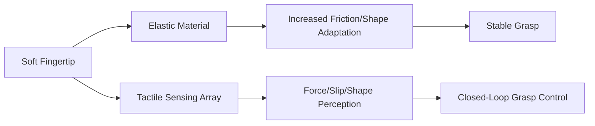


### 8.2.9 Torso, Head-Neck, and Mass Distribution

The torso serves as the integration platform for a humanoid robot's limbs, power supply, computing, and sensing equipment. Its design directly affects the robot's overall mass distribution, inertial properties, motion coordination, and human-robot interaction capabilities [3][82].

!!! note "Term Explanation: Torso, Head-Neck, Mass Distribution, Inertial Properties, Human-Robot Interaction"
    - **Torso**: The core body part connecting the head, arms, and legs.
    - **Head-Neck**: The head and neck assembly, housing primary environmental sensors.
    - **Mass Distribution**: The allocation of mass across different parts of the robot.
    - **Inertial Properties**: The moment of inertia of the entire robot and its individual parts.
    - **Human-Robot Interaction (HRI)**: The exchange of information and actions between humans and robots.

#### Waist/Spine: 1-3 DOF Active Joints

The human spine consists of multiple vertebrae and possesses a considerable range of motion. Humanoid robots typically use a simplified **actuated waist** or **actuated spine** to achieve torso movement:

- **1-DOF Waist**: Only pitch axis, allowing torso forward/backward lean, simple structure.
- **2-DOF Waist**: Pitch + yaw, adding turning and bending capabilities.
- **3-DOF Waist**: Pitch + yaw + roll, providing full 3D posture adjustment.

!!! note "Term Explanation: Actuated Waist, Actuated Spine, Pitch, Yaw, Roll"
    - **Actuated Waist**: A waist joint with actively driven degrees of freedom.
    - **Actuated Spine**: A spinal mechanism with multiple active joints.
    - **Pitch**: Rotation around the body's lateral axis.
    - **Yaw**: Rotation around the body's vertical axis.
    - **Roll**: Rotation around the body's longitudinal axis.

An actuated waist is crucial for the following tasks:

1. **Expanding Workspace**: Bending allows the arms to reach lower positions, and lateral tilting expands the horizontal reach.
2. **Balance Adjustment**: During single-leg support or under disturbance, torso posture adjustment can compensate for angular momentum.
3. **Gait Coordination**: Counter-rotation of the torso during walking can cancel angular momentum generated by leg swing, improving energy efficiency.
4. **Human-Robot Interaction**: Coordinated torso-head movements like nodding and turning make the robot appear more natural.

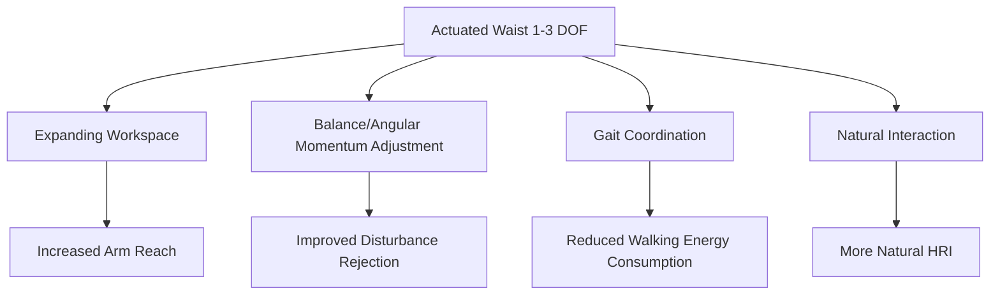

#### Neck 2-DOF: Pitch and Yaw

The head of a humanoid robot typically achieves pitch (nodding) and yaw (shaking) movements through a **2-DOF neck**. Some designs add roll to simulate head tilting. Design goals for the neck include:

- **Sensor Pointing**: Directing cameras, LiDAR, and other sensors towards areas of interest.
- **Field of View Expansion**: Expanding the perception range without moving the torso.
- **Expressive Interaction**: Head posture is a significant part of human non-verbal communication.

!!! note "Term Explanation: Neck DOF, Sensor Pointing, Field of View, Non-Verbal Communication"
    - **Neck DOF**: The number of independent motion parameters for the neck joint.
    - **Sensor Pointing**: The ability to orient sensors towards a target direction.
    - **Field of View (FOV)**: The spatial range perceivable by a sensor.
    - **Non-Verbal Communication**: Conveying information through posture, expression, and gaze.

The neck's range of motion is typically designed as: pitch \(\pm 30°\) to \(\pm 45°\), yaw \(\pm 60°\) to \(\pm 90°\). Although the head has low mass but moves frequently, the neck actuator requires high response speed, low friction, and good position control accuracy.

#### Head Sensor Mast: Camera, LiDAR, IMU Layout

The head is often called the **sensor mast** because it is the optimal location for mounting cameras, LiDAR, IMUs, microphones, and other perception devices. Design considerations include:

- **Height**: A height close to human eye level facilitates social interaction and scene understanding.
- **Field of View Overlap**: Maintaining an appropriate baseline (typically 50-80 mm) between stereo cameras for depth information.
- **LiDAR Mounting**: Usually placed on top of the head for a 360° horizontal scanning field of view, avoiding arm occlusion.
- **IMU Placement**: Placed as close to the robot's overall center of mass as possible or rigidly mounted on the torso to reduce vibration interference.

!!! note "Term Explanation: Sensor Mast, Stereo Baseline, LiDAR, IMU, Field of View Occlusion"
    - **Sensor Mast**: The structure that centrally mounts the head sensors.
    - **Stereo Baseline**: The distance between the optical centers of the left and right cameras.
    - **LiDAR (Light Detection and Ranging)**: Laser radar used for distance measurement and mapping.
    - **IMU (Inertial Measurement Unit)**: An inertial measurement unit that measures angular velocity and acceleration.
    - **Field of View Occlusion**: The phenomenon where obstacles block the sensor's field of view.

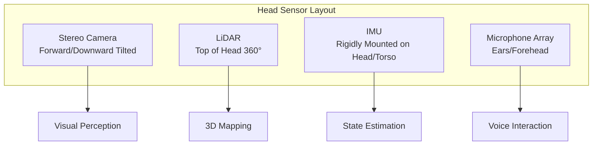

#### Mass Distribution: Lowering the Center of Mass

The **mass distribution** of a humanoid robot significantly impacts dynamic stability, response speed, and energy consumption. The core principles are:

- **Place heavy components low and near the center of mass**: Batteries, main computers, high-power actuators, etc., should be arranged as much as possible in the hip/pelvic region to lower the overall center of mass height.
- **Minimize limb inertia**: Arm and leg links should be lightweight to reduce swing inertia and dynamic response time.
- **Lightweight head**: Although the head carries many sensors and moves frequently, its mass and inertia should be minimized.

!!! note "Term Explanation: Center of Mass Height, Limb Inertia, Swing Inertia, Pelvic Region"
    - **Center of Mass Height (CoM height)**: The vertical distance from the robot's overall center of mass to the ground.
    - **Limb Inertia**: The moment of inertia of the arms and legs.
    - **Swing Inertia**: The equivalent inertia of a swinging leg or arm.
    - **Pelvic Region**: The hip and lower torso area, close to the human body's center of mass.

The center of mass height \(h_{\text{CoM}}\) directly affects the natural frequency of the linear inverted pendulum:

$$
\omega_0 = \sqrt{\frac{g}{h_{\text{CoM}}}}
$$

The lower the center of mass, the smaller \(\omega_0\), the slower the CoM motion, and the easier it is for the controller to stabilize; however, too low a CoM can limit stride length and movement agility. The typical CoM height for humanoid robots is about 40%-55% of their height, i.e., between 0.6-0.9 m.

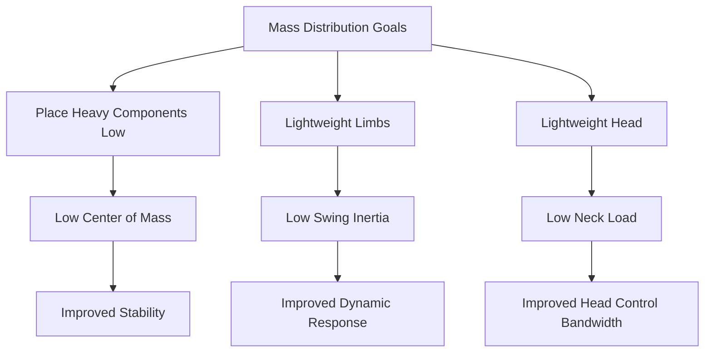


#### 8.2.10 Actuator and Transmission System Design

The joint performance of a humanoid robot is fundamentally determined by the **actuator** and **transmission system**. During the design phase, it is necessary to determine peak torque, continuous torque, maximum speed, bandwidth, efficiency, mass, volume, and cost based on task requirements, and to select the appropriate motor, reducer, and force sensor configuration [1][3][73].

!!! note "Term Explanation: Actuator, Transmission System, Peak Torque, Continuous Torque, Bandwidth"
    - **Actuator**: A device that converts input energy (e.g., electrical energy) into mechanical motion.
    - **Transmission System**: A mechanism that transmits and converts motion and force, such as reducers, belts, and linkages.
    - **Peak Torque**: The maximum torque an actuator can output for a short duration.
    - **Continuous Torque**: The torque an actuator can output continuously without overheating.
    - **Bandwidth**: The frequency range over which a system can effectively respond.

Permanent magnet synchronous motors or brushless DC motors are the most commonly used motors in humanoid robots. Their steady-state armature equation is:

$$
V = R I + K_e \omega
$$

where \(V\) is the terminal voltage, \(R\) is the winding resistance, \(I\) is the current, \(K_e\) is the back-EMF constant, and \(\omega\) is the rotor angular velocity. The electromagnetic torque is:

$$
\tau_m = K_t I
$$

For permanent magnet motors in SI units, \(K_t\) (N·m/A) is numerically equal to \(K_e\) (V·s/rad). The motor's **torque-speed characteristic** approximates a straight line from the stall torque \(\tau_{\text{stall}} = K_t V/R\) to the no-load speed \(\omega_{\text{no-load}} = V/K_e\).

!!! note "Term Explanation: Permanent Magnet Synchronous Motor, Brushless DC Motor, Back-EMF, Torque Constant, Stall Torque, No-Load Speed"
    - **Permanent Magnet Synchronous Motor (PMSM)**: A synchronous motor with a permanent magnet rotor.
    - **Brushless DC Motor (BLDC)**: A DC motor with electronic commutation.
    - **Back-EMF**: The electromotive force generated during motor rotation, opposing the applied voltage.
    - **Torque Constant \(K_t\)**: The torque produced per unit current.
    - **Stall Torque**: The maximum torque a motor can output when stationary.
    - **No-Load Speed**: The maximum speed when there is no load.

The motor output power is:

$$
P_m = \tau_m \omega
$$

On the torque-speed plane, the maximum power point is at the midpoint: \(\tau = \tau_{\text{stall}}/2\), \(\omega = \omega_{\text{no-load}}/2\). The actual operating point is usually far from this point to retain margin.

!!! note "Term Explanation: Output Power, Torque-Speed Plane, Operating Point, Margin"
    - **Output Power**: The mechanical energy output per unit time.
    - **Torque-Speed Plane**: A graph describing motor capability with torque and speed as coordinates.
    - **Operating Point**: The combination of torque and speed during actual operation.
    - **Margin**: The reserved capacity allowance.

The function of a reducer is to trade speed for torque. Let the gear ratio be \(N = \omega_m / \omega_{out}\) and the ideal efficiency be \(\eta\), then:

$$
\tau_{out} = \eta N \tau_m, \quad \omega_{out} = \frac{\omega_m}{N}
$$

The **reflected inertia** at the output end is the load inertia seen from the motor side:

$$
J_{\text{ref}} = J_m + \frac{J_{\text{load}}}{N^2}
$$

The smaller the reflected inertia, the easier it is for the motor to accelerate the load, and the higher the bandwidth. However, increasing the gear ratio \(N\) reduces reflected inertia but also lowers the output speed. Therefore, there is a trade-off for an optimal gear ratio.

!!! note "Term Explanation: Gear Ratio, Output Torque, Output Speed, Reflected Inertia, Load Inertia"
    - **Gear Ratio**: The ratio of input speed to output speed.
    - **Output Torque**: The torque at the reducer output end.
    - **Output Speed**: The speed at the reducer output end.
    - **Reflected Inertia**: The equivalent moment of inertia referred to the motor shaft.
    - **Load Inertia**: The moment of inertia of the load itself.

For a joint accelerating from rest to an angular velocity \(\omega_{out}\), the required motor torque includes the inertia term and the friction/gravity term:

$$
\tau_m = \left(J_m + \frac{J_{\text{load}}}{N^2}\right) N \dot{\omega}_{out} + \frac{\tau_{\text{load}}}{\eta N}
$$

Finding the optimal value for \(N\) yields: when the inertia term equals the load term, the required motor torque is minimized. This condition gives an approximate optimal gear ratio:

$$
N_{\text{opt}} \approx \sqrt{\frac{J_{\text{load}}}{J_m}}
$$

In practice, speed requirements, efficiency, backlash, and size must also be considered, so the optimal value is adjusted accordingly.

!!! note "Term Explanation: Angular Velocity, Angular Acceleration, Friction, Gravity Term, Optimal Gear Ratio"
    - **Angular Velocity**: The speed and direction of rotation.
    - **Angular Acceleration**: The rate of change of angular velocity.
    - **Friction**: A force that opposes relative motion.
    - **Gravity Term**: The load torque caused by gravity.
    - **Optimal Gear Ratio**: The gear ratio that minimizes the required motor torque.

Common reducer types for humanoid robots:

| Reducer Type | Gear Ratio Range | Efficiency | Backlash | Backdrivability | Typical Application |
|---|---|---|---|---|---|
| Harmonic Drive | 30–320 | 70–90% | Very Low | Poor | High-precision joints |
| Planetary Gearbox | 3–100 | 90–98% | Low–Medium | Good | Medium-to-high speed joints |
| Cycloidal Drive | 10–200 | 85–95% | Low | Moderate | High-torque joints |
| Worm Gear | 5–100 | 50–90% | Medium | Poor | Self-locking requirements |

!!! note "Term Explanation: Harmonic Drive, Planetary Gearbox, Cycloidal Drive, Backlash, Backdrivability"
    - **Harmonic Drive**: A precision reducer using a flexible gear for transmission.
    - **Planetary Gearbox**: A reducer with multiple planet gears revolving around a sun gear.
    - **Cycloidal Drive**: A high-stiffness reducer using cycloidal gears.
    - **Backlash**: The clearance or play in the transmission chain.
    - **Backdrivability**: The ease with which an external force can drive the output end in reverse.

Harmonic drives are known for zero backlash, high gear ratios, and compactness, but the deformation of the flexspline leads to high friction and poor backdrivability, which is unfavorable for force control and energy regeneration. Cycloidal drives offer high stiffness and torque density but are heavier. Planetary gearboxes have the highest efficiency and are relatively easy to backdrive, but their gear ratio is limited for a given volume. Humanoid robots often use a mix: harmonic or cycloidal drives for high-torque joints like ankles and hips, and planetary or micro harmonic drives for low-to-medium torque joints like wrists and necks.

!!! note "Term Explanation: Flexspline, Torque Density, Energy Regeneration, Stiffness"
    - **Flexspline**: The elastically deformable thin-walled gear in a harmonic drive.
    - **Torque Density**: The output torque per unit mass or volume.
    - **Energy Regeneration**: The ability to recover mechanical energy as electrical energy.
    - **Stiffness**: The torque required per unit deformation.

**Backdrivability** directly affects collision detection, landing buffering, and human-robot interaction. High backdrivability means that a small external force can cause joint motion, which is beneficial for external force estimation and compliant control; low backdrivability improves position holding ability but increases collision risk. Backdrivability can be approximated by efficiency \(\eta\): the higher the efficiency, the lower the friction during reverse driving.

!!! note "Term Explanation: Collision Detection, Landing Buffering, Position Holding, Back-Driving"
    - **Collision Detection**: The process of identifying unintended contact.
    - **Landing Buffering**: Reducing impact upon ground contact through compliance.
    - **Position Holding**: The ability to resist external forces and maintain position.
    - **Back-Driving**: External force causing the output end to move in reverse.

Motor thermal constraints determine **continuous torque**. The copper loss is:

$$
P_{\text{cu}} = I^2 R = \left(\frac{\tau_m}{K_t}\right)^2 R
$$

The thermal equilibrium equation is:

$$
T_{\text{winding}} = T_{\text{amb}} + P_{\text{cu}} R_{\text{th}}
$$

Where \(R_{\text{th}}\) is the thermal resistance from the winding to the environment, and \(T_{\text{amb}}\) is the ambient temperature. The continuous torque corresponds to the steady-state torque when the winding reaches the maximum allowable temperature:

$$
\tau_{\text{cont}} = K_t \sqrt{\frac{T_{\text{max}} - T_{\text{amb}}}{R_{\text{th}} R}}
$$

The peak torque is limited by magnetic saturation and current, typically reaching 2–4 times the continuous torque, but can only be maintained for a few seconds.

!!! note "Term Explanation: Continuous Torque, Copper Loss, Thermal Resistance, Winding Temperature, Peak Torque"
    - **Continuous torque**: Torque that can be output continuously without overheating.
    - **Copper loss**: Joule heat generated by current flowing through the winding resistance.
    - **Thermal resistance**: Ratio of temperature difference to heat flow.
    - **Winding temperature**: Temperature of the motor coil.
    - **Peak torque**: Maximum short-term output torque.

**Series Elastic Actuator (SEA)** adds an elastic element between the motor and the output end, making the joint behave as a controllable spring-damper system. Its advantages include:

1. High force control accuracy: Output force is estimated by measuring the elastic element deformation \(\Delta \theta\), \(\tau = k \Delta \theta\).
2. Energy storage: The elastic element stores energy during the stance phase of gait and releases it during the swing phase.
3. Impact resistance: The elastic element absorbs instantaneous impacts, protecting the reducer and motor.

!!! note "Term Explanation: Series Elastic Actuator, Elastic Element, Force Control, Energy Storage"
    - **Series Elastic Actuator (SEA)**: An actuator where the motor and output end are connected via an elastic element.
    - **Elastic element**: A material or mechanism that stores and releases elastic energy.
    - **Force control**: A control method that directly controls the output force.
    - **Energy storage**: Storing mechanical energy during deformation.

The mechanical model of SEA is:

$$
\tau_{out} = k (\theta_{out} - \theta_m / N)
$$

Where \(k\) is the spring stiffness. SEA increases compliance but also reduces effective stiffness and position control bandwidth. To balance precision and safety, researchers have developed **Variable Stiffness Actuators (VSA)**, which can adjust \(k\) online [73].

!!! note "Term Explanation: Spring Stiffness, Compliance, Position Control Bandwidth, Variable Stiffness Actuator"
    - **Spring stiffness**: The force-deformation ratio of the elastic element.
    - **Compliance**: The ability to deform under force.
    - **Position control bandwidth**: The frequency range over which the position closed-loop can effectively respond.
    - **Variable Stiffness Actuator (VSA)**: An actuator that can actively change its output stiffness.

**Python Example: Knee Joint Actuator Selection Estimation**

The following code estimates the required peak torque, continuous torque, and reduction ratio for a knee joint based on robot mass, leg geometry, and motion requirements, and plots a simplified torque-speed envelope.

```python
import numpy as np
import matplotlib.pyplot as plt

# Robot parameters
m = 60.0          # kg
g = 9.81          # m/s²
L_thigh = 0.40    # m
L_shank = 0.45    # m
# Single-leg support phase, horizontal distance from center of mass to knee joint approx. 0.10 m
d_com_knee = 0.10 # m
# Dynamic margin
dynamic_factor = 1.5

# Knee joint torque requirement (static + dynamic)
tau_peak = m * g * d_com_knee * dynamic_factor
print("Knee joint peak torque requirement: %.1f N·m" % tau_peak)

# Example motor parameters (frameless torque motor)
K_t = 0.35        # N·m/A
R = 0.15          # Ohm
V_bus = 48.0      # V
I_peak = 60.0     # A
I_cont = 20.0     # A

tau_m_peak = K_t * I_peak
tau_m_cont = K_t * I_cont
omega_m_max = V_bus / (K_t * 1.0)  # Simplified: no-load speed rad/s

print("Motor peak torque: %.1f N·m" % tau_m_peak)
print("Motor continuous torque: %.1f N·m" % tau_m_cont)
print("Motor no-load speed: %.1f rad/s (%.1f rpm)" % (omega_m_max, omega_m_max*60/(2*np.pi)))

# Required reduction ratio (based on peak torque, assuming efficiency 0.8)
eta = 0.8
N_min = tau_peak / (eta * tau_m_peak)
print("Minimum reduction ratio: %.2f" % N_min)

# Torque-speed envelope
omega = np.linspace(0, omega_m_max, 100)
tau_max = tau_m_peak * (1 - omega / omega_m_max)  # Simplified linear envelope
plt.figure(figsize=(7,5))
plt.plot(omega * 60/(2*np.pi), tau_max, 'b-', label='Motor peak envelope')
plt.axhline(y=tau_m_cont, color='r', linestyle='--', label='Continuous torque')
plt.axvline(x=omega_m_max*60/(2*np.pi), color='g', linestyle=':', label='No-load speed')
plt.xlabel('Speed (rpm)')
plt.ylabel('Torque (N·m)')
plt.title('Simplified Motor Torque-Speed Envelope')
plt.grid(True)
plt.legend()
plt.tight_layout()
plt.savefig('motor_torque_speed.png', dpi=150)
plt.show()
```

!!! note "Term Explanation: Torque-Speed Envelope, Frameless Torque Motor, Bus Voltage, Dynamic Margin"
    - **Torque-speed envelope**: The maximum torque boundary of a motor at all operating points.
    - **Frameless torque motor**: A motor without a housing that can be directly integrated into a joint.
    - **Bus voltage**: The DC bus voltage of the driver.
    - **Dynamic margin**: A safety factor reserved for dynamic loads.

```mermaid
flowchart TD
    A["Task Requirements"] --> B["Peak Torque/Speed"]
    B --> C["Motor Selection"]
    C --> D["Reducer Selection"]
    D --> E["Output Torque/Speed"]
    E --> F["Thermal Check"]
    F --> G["Backdrivability Assessment"]
    G --> H["Force Sensor/SEA Integration"]
    H --> I["Joint Module Design"]
```

Key points in actuator design:

1. First determine the joint peak torque and peak speed, then back-calculate the motor and reducer.
2. Continuous torque is determined by thermal constraints; the winding temperature rise under the worst-case condition must be checked.
3. The reduction ratio affects reflected inertia, backdrivability, and output speed, requiring comprehensive optimization.
4. Humanoid robots often use torque/force sensors or SEA to achieve compliant interaction.
5. Ankle and hip joints, due to high torque requirements, typically use high reduction ratio, high torque density solutions; wrist and neck joints prioritize speed and backdrivability.

!!! note "Term Explanation: Joint Module, Torque Sensor, Worst-Case Condition, Temperature Rise"
    - **Joint module**: A standardized unit integrating a motor, reducer, and sensors.
    - **Torque sensor**: A sensor that measures the output torque of a joint.
    - **Worst-case condition**: The most severe operating state in the design.
    - **Temperature rise**: The increase in temperature relative to the ambient temperature.

---

## 8.3 Kinematics Fundamentals

### 8.3.1 Links, Joints, and Coordinate Frames

**Kinematics** studies the geometric relationships of motion without considering the forces that produce it. The basic units of robot kinematics are **links** and **joints**. To describe the relative pose between adjacent links, a coordinate frame is rigidly attached to each link.

!!! note "Terminology: Kinematics, Link, Joint, Coordinate Frame, Pose"
    - **Kinematics**: The discipline that studies the relationships between geometric motion quantities such as position, velocity, and acceleration.
    - **Link**: A rigid body component in a robot mechanism.
    - **Joint**: An element connecting adjacent links and constraining their relative motion.
    - **Coordinate frame**: A spatial reference system consisting of an origin and a set of orthogonal basis vectors.
    - **Pose**: A complete spatial description including both position and orientation.

To systematically describe the geometric relationships between links, Denavit and Hartenberg proposed the **DH parameter method (Denavit-Hartenberg parameters)** in 1955. The classical DH uses four parameters $(\theta_i, d_i, a_i, \alpha_i)$ to describe the transformation between adjacent coordinate frames[2][3][6]:

- $\theta_i$: The rotation angle about the $z_i$ axis from $x_{i-1}$ to $x_i$.
- $d_i$: The distance along the $z_i$ axis from $x_{i-1}$ to $x_i$.
- $a_i$: The distance along the $x_i$ axis from $z_i$ to $z_{i+1}$.
- $\alpha_i$: The rotation angle about the $x_i$ axis from $z_i$ to $z_{i+1}$.

**Modified DH (mDH)** places the link length $a_{i-1}$ and twist angle $\alpha_{i-1}$ on the preceding link, resulting in a slightly different transformation order. Modified DH is particularly suitable for modeling mechanisms with prismatic joints or closed-loop structures and is widely used in industry and in ROS/URDF[2].

!!! note "Terminology: DH Parameters, Modified DH, Link Length, Twist Angle, Joint Angle, Link Offset"
    - **DH parameters**: A standard method using four parameters to describe the transformation between adjacent link coordinate frames.
    - **Modified DH**: A variant of DH that places link geometric parameters in the preceding link, commonly used in ROS/URDF.
    - **Link length $a$**: The length of the common perpendicular between adjacent joint axes.
    - **Twist angle $\alpha$**: The angle between adjacent joint axes.
    - **Joint angle $\theta$**: The rotation angle about the joint axis (variable for revolute joints).
    - **Link offset $d$**: The translation along the joint axis (variable for prismatic joints).

```mermaid
flowchart LR
    A["Link i-1"] -->|"Joint i"| B["Link i"]
    B -->|"Joint i+1"| C["Link i+1"]
    subgraph Coordinate Frames
    D["{i-1}"]
    E["{i}"]
    F["{i+1}"]
    end
    D --> E
    E --> F
```

### 8.3.2 Homogeneous Transformation Matrix

The transformation between two coordinate frames in space can be represented by a **homogeneous transformation matrix** $\mathbf{T} \in SE(3)$:

$$
\mathbf{T} = \begin{bmatrix}
\mathbf{R} & \mathbf{p} \\
\mathbf{0}^T & 1
\end{bmatrix}
$$

where $\mathbf{R} \in SO(3)$ is a $3 \times 3$ rotation matrix, and $\mathbf{p} \in \mathbb{R}^3$ is a translation vector. $SE(3)$ and $SO(3)$ are the three-dimensional special Euclidean group and special orthogonal group, respectively.

!!! note "Terminology: Homogeneous Transformation Matrix, Rotation Matrix, Translation Vector, SE(3), SO(3)"
    - **Homogeneous transformation matrix**: A representation that unifies rotation and translation into a $4 \times 4$ matrix.
    - **Rotation matrix**: An orthogonal matrix describing the rotation of a coordinate frame or vector, satisfying $\mathbf{R}^T\mathbf{R} = \mathbf{I}$, $\det(\mathbf{R}) = 1$.
    - **Translation vector**: A vector describing the relative displacement of a coordinate frame's origin.
    - **$SE(3)$**: The three-dimensional special Euclidean group, composed of rotation matrices and translation vectors.
    - **$SO(3)$**: The three-dimensional special orthogonal group, composed of all $3 \times 3$ rotation matrices.

For modified DH, the homogeneous transformation between adjacent coordinate frames is:

$$
{}^{i-1}\mathbf{T}_i = \text{Rot}_x(\alpha_{i-1}) \cdot \text{Trans}_x(a_{i-1}) \cdot \text{Rot}_z(\theta_i) \cdot \text{Trans}_z(d_i)
$$

Written in matrix form:

$$
{}^{i-1}\mathbf{T}_i = \begin{bmatrix}
c\theta_i & -s\theta_i & 0 & a_{i-1} \\
s\theta_i c\alpha_{i-1} & c\theta_i c\alpha_{i-1} & -s\alpha_{i-1} & -d_i s\alpha_{i-1} \\
s\theta_i s\alpha_{i-1} & c\theta_i s\alpha_{i-1} & c\alpha_{i-1} & d_i c\alpha_{i-1} \\
0 & 0 & 0 & 1
\end{bmatrix}
$$

where $c\theta_i = \cos\theta_i$, $s\theta_i = \sin\theta_i$.

!!! note "Terminology: Sine, Cosine, Euler Angles, Roll-Pitch-Yaw"
    - **Sine/Cosine**: Ratios of opposite/hypotenuse and adjacent/hypotenuse in a right triangle, describing rotational components.
    - **Euler angles**: A description of orientation using three successive rotations about coordinate axes.
    - **Roll-pitch-yaw**: An orientation representation using sequential rotations about the fixed x-y-z axes.

### 8.3.3 Forward Kinematics: From Joint Space to Operational Space

**Forward kinematics** addresses: Given the joint angles $\mathbf{q}$, compute the pose of the end-effector in the base coordinate frame. This is achieved by multiplying the transformation matrices of each link:

$$
{}^0\mathbf{T}_n(\mathbf{q}) = {}^0\mathbf{T}_1(q_1) \cdot {}^1\mathbf{T}_2(q_2) \cdots {}^{n-1}\mathbf{T}_n(q_n)
$$

The end-effector pose is given by the rotation part $\mathbf{R}$ and translation part $\mathbf{p}$ of ${}^0\mathbf{T}_n$.

!!! note "Terminology: Forward Kinematics, Joint Space, Operational Space, End-Effector"
    - **Forward kinematics**: The mapping from joint variables to the end-effector pose.
    - **Joint space**: The space with joint variables as coordinates.
    - **Task/Operational space**: The space with end-effector pose as coordinates.
    - **End-effector**: The terminal device of a robot that interacts with the environment.

```mermaid
flowchart LR
    A["Joint angles q1..qn"] -->|"Multiplication of DH transforms"| B["0Tn"]
    B --> C["End-effector position p"]
    B --> D["End-effector orientation R"]
```

### 8.3.4 Python Example 1: Modified DH Forward Kinematics for a 7-DOF Manipulator

The following code defines a modified DH parameter table for a 7-DOF serial manipulator, computes the homogeneous transformation matrix for each link, and extracts the end-effector pose. This example uses `numpy` and can be run in any Python environment.

```python
import numpy as np

# 7-DOF Robotic Arm Modified DH Parameter Table
# Columns: alpha_{i-1}, a_{i-1}, d_i, theta_i (theta is joint variable, example configuration here)
# Units: meters (m), radians (rad)
mdh_table = np.array([
    [0.0,      0.0,    0.180,  0.0],      # Joint 1
    [-np.pi/2, 0.0,    0.0,    -np.pi/2], # Joint 2
    [np.pi/2,  0.0,    0.350,  0.0],      # Joint 3
    [-np.pi/2, 0.0,    0.0,    0.0],      # Joint 4
    [np.pi/2,  0.0,    0.320,  0.0],      # Joint 5
    [-np.pi/2, 0.0,    0.0,    0.0],      # Joint 6
    [np.pi/2,  0.0,    0.110,  0.0],      # Joint 7
], dtype=float)

def rot_x(alpha):
    """4x4 homogeneous transformation matrix for rotation about the x-axis by angle alpha."""
    ca, sa = np.cos(alpha), np.sin(alpha)
    return np.array([
        [1, 0,  0, 0],
        [0, ca, -sa, 0],
        [0, sa,  ca, 0],
        [0, 0,  0, 1]
    ])

def trans_x(a):
    """4x4 homogeneous transformation matrix for translation along the x-axis by a."""
    return np.array([
        [1, 0, 0, a],
        [0, 1, 0, 0],
        [0, 0, 1, 0],
        [0, 0, 0, 1]
    ])

def rot_z(theta):
    """4x4 homogeneous transformation matrix for rotation about the z-axis by angle theta."""
    ct, st = np.cos(theta), np.sin(theta)
    return np.array([
        [ct, -st, 0, 0],
        [st,  ct, 0, 0],
        [0,   0, 1, 0],
        [0,   0, 0, 1]
    ])

def trans_z(d):
    """4x4 homogeneous transformation matrix for translation along the z-axis by d."""
    return np.array([
        [1, 0, 0, 0],
        [0, 1, 0, 0],
        [0, 0, 1, d],
        [0, 0, 0, 1]
    ])

def mdh_transform(alpha_prev, a_prev, d, theta):
    """Modified DH single-link homogeneous transformation: Rot_x * Trans_x * Rot_z * Trans_z."""
    return rot_x(alpha_prev) @ trans_x(a_prev) @ rot_z(theta) @ trans_z(d)

def forward_kinematics_7dof(mdh, q):
    """
    Given the mDH parameter table and joint angle vector q, returns the end-effector homogeneous transformation matrix.
    mdh: Nx4 array, column order [alpha_{i-1}, a_{i-1}, d_i, theta_i_offset]
    q:   Nx1 joint variables (replace theta_i_offset)
    """
    T = np.eye(4)
    transforms = []
    for i, row in enumerate(mdh):
        alpha_prev, a_prev, d, theta_offset = row
        theta = theta_offset + q[i]
        Ti = mdh_transform(alpha_prev, a_prev, d, theta)
        T = T @ Ti
        transforms.append(T.copy())
    return T, transforms

# Example joint angles: near-zero configuration
q_example = np.array([0.1, -0.5, 0.2, 0.8, -0.3, 0.6, 0.4])

T_end, Ts = forward_kinematics_7dof(mdh_table, q_example)
R_end = T_end[:3, :3]
p_end = T_end[:3, 3]

print("End-effector position (m):", p_end)
print("End-effector rotation matrix:\n", R_end)
print("End-effector pose homogeneous transformation matrix:\n", T_end)

# Verify rotation matrix orthogonality
ortho_error = np.max(np.abs(R_end.T @ R_end - np.eye(3)))
print("Rotation matrix orthogonality error:", ortho_error)
```

!!! note "Terminology Explanation: Homogeneous Transformation Multiplication, Identity Matrix, Orthogonality"
    - **Homogeneous Transformation Multiplication**: Composing transformations between multiple coordinate systems via matrix multiplication.
    - **Identity Matrix**: A square matrix with ones on the diagonal and zeros elsewhere; any matrix multiplied by the identity matrix remains unchanged.
    - **Orthogonality**: A rotation matrix satisfies $\mathbf{R}^T\mathbf{R} = \mathbf{I}$, preserving vector lengths and angles.

### 8.3.5 Inverse Kinematics: From Operational Space to Joint Space

**Inverse kinematics (IK)** solves: given the desired end-effector pose, find the joint angles that satisfy it. Unlike forward kinematics, IK typically has no closed-form solution and may have multiple solutions or no solution [2][3].

For 6-DOF robotic arms satisfying the **Pieper condition** (wrist three axes intersect at a point), an analytical closed-form solution exists. For 7-DOF or more general configurations, numerical methods are commonly used: Jacobian pseudoinverse, gradient descent, optimization (e.g., Levenberg-Marquardt), or neural network approximation.

!!! note "Terminology Explanation: Inverse Kinematics, Analytical Solution, Numerical Solution, Pieper Condition"
    - **Inverse Kinematics**: The mapping from end-effector pose to joint variables.
    - **Closed-form Solution**: A solution obtained directly using a finite set of formulas.
    - **Numerical Solution**: A solution approximated iteratively to meet accuracy requirements.
    - **Pieper Condition**: A geometric condition for 6-DOF robotic arms where the wrist three axes intersect at a point, enabling analytical inverse kinematics.

#### Analytical Inverse Kinematics and the Pieper Condition

The value of analytical inverse kinematics lies in: once a closed-form solution exists, the controller can compute IK within milliseconds or even microseconds, and enumerate all feasible solutions. The core geometric condition for a closed-form solution is that the last three rotational axes of the wrist intersect at a point, proven by D. Pieper in 1968, hence called the **Pieper condition** [2][3].

!!! note "Terminology Explanation: Pieper Condition, Wrist Center, Decoupling, Closed-form Solution"
    - **Pieper Condition**: When the last three axes (wrist) of a 6-DOF manipulator intersect at a point, position and orientation can be solved decoupled.
    - **Wrist Center**: The common intersection point of the three wrist rotational axes.
    - **Decoupling**: The position equation and orientation equation can be solved separately.
    - **Closed-form Solution**: A solution expressed directly using algebraic formulas (including inverse trigonometric functions).

Let the first three joints of a 6R manipulator determine the wrist center $\mathbf{p}_w \in \mathbb{R}^3$, and the last three joints determine the end-effector orientation $\mathbf{R} \in SO(3)$. The end-effector pose is:

$$
{}^0\mathbf{T}_6 = \begin{bmatrix} \mathbf{R} & \mathbf{p} \\ \mathbf{0}^T & 1 \end{bmatrix}
$$

Since the offset $\mathbf{d}_w$ (fixed geometry of links 4-6) between the wrist center and the end-effector is known, we have:

$$
\mathbf{p}_w = \mathbf{p} - \mathbf{R} \, \mathbf{d}_w
$$

This equation transforms the end-effector pose problem into first finding the wrist center $\mathbf{p}_w$, then solving for the first three joint angles $\theta_1, \theta_2, \theta_3$. Once the first three joints are determined, the rotation matrix from the base to the wrist ${}^0\mathbf{R}_3$ is obtained, and then:

$$
{}^3\mathbf{R}_6 = ({}^0\mathbf{R}_3)^T \, \mathbf{R}
$$

The last three joint angles $\theta_4, \theta_5, \theta_6$ can be uniquely determined by Euler angle decomposition of ${}^3\mathbf{R}_6$ (usually with multiple solutions within joint limits).

!!! note "Term Explanation: Wrist-Center Equation, Orientation Equation, Euler-Angle Decomposition, Joint Limit"
    - **Wrist-Center Equation**: The equation for calculating the wrist center point from the end-effector pose.
    - **Orientation Equation**: The equation for solving the wrist orientation.
    - **Euler-Angle Decomposition**: The process of solving for joint angles from a rotation matrix.
    - **Joint Limit**: The allowable range of motion for a joint.

For the first three joints, if a spherical wrist + three-link arm structure is used, the wrist center depends only on $\theta_1, \theta_2, \theta_3$. Its geometric meaning is: the arm delivers the wrist center to a point on a sphere centered at the shoulder joint with a radius equal to the arm length. The specific solution typically uses a geometric method (e.g., finding the intersection of two circles) or an algebraic method (converting trigonometric functions into polynomial equations, then using the tangent half-angle substitution).

!!! note "Term Explanation: Spherical Wrist, Arm Length, Geometric Method, Tangent Half-Angle Substitution"
    - **Spherical Wrist**: A wrist where the three rotation axes intersect at a single point.
    - **Arm Length**: The effective length of the combined arm links.
    - **Geometric Method**: Solving inverse kinematics using spatial geometric relationships.
    - **Tangent Half-Angle Substitution**: A technique using $u = \tan(\theta/2)$ to convert trigonometric equations into polynomial equations.

#### Numerical Inverse Kinematics: Newton-Raphson and Levenberg-Marquardt

When the manipulator does not satisfy the Pieper condition, or when the degrees of freedom $n > 6$ (redundant manipulator), numerical methods are typically used. The core of numerical IK is to transform the problem of solving for $\mathbf{q}$ into minimizing the end-effector pose error:

$$
\min_{\mathbf{q}} \, \|\mathbf{e}(\mathbf{q})\|^2, \quad \mathbf{e}(\mathbf{q}) = \begin{bmatrix} \mathbf{p}_{\text{des}} - \mathbf{p}(\mathbf{q}) \\ \mathbf{R}_{\text{des}} \ominus \mathbf{R}(\mathbf{q}) \end{bmatrix}
$$

where $\mathbf{p}$ is the position, and $\ominus$ represents the orientation error (which can be expressed using the rotation axis-angle error $\text{vex}(\mathbf{R}_{\text{des}}^T \mathbf{R}(\mathbf{q}))$).

**Newton-Raphson Method** linearizes the error:

$$
\mathbf{e}(\mathbf{q} + \Delta \mathbf{q}) \approx \mathbf{e}(\mathbf{q}) + \mathbf{J}(\mathbf{q}) \Delta \mathbf{q}
$$

Setting $\mathbf{e} + \mathbf{J} \Delta \mathbf{q} = 0$, we obtain:

$$
\Delta \mathbf{q} = -\mathbf{J}^\dagger(\mathbf{q}) \, \mathbf{e}(\mathbf{q})
$$

where $\mathbf{J}^\dagger$ is the Moore-Penrose pseudoinverse. The iterative formula is $\mathbf{q}_{k+1} = \mathbf{q}_k + \alpha \Delta \mathbf{q}$, with $\alpha \in (0,1]$ being the step size.

!!! note "Term Explanation: Newton-Raphson Method, Pose Error, Linearization, Moore-Penrose Pseudoinverse"
    - **Newton-Raphson Method**: A method for iteratively solving nonlinear equations through local linearization.
    - **Pose Error**: The difference between the desired pose and the actual pose.
    - **Linearization**: Approximating a function using a first-order Taylor expansion at a point.
    - **Moore-Penrose Pseudoinverse**: A generalized inverse for any matrix that minimizes the norm solution.

When $n > m$ (redundant), a null-space projection term can be added to the pseudoinverse solution:

$$
\Delta \mathbf{q} = -\mathbf{J}^\dagger \mathbf{e} + (\mathbf{I} - \mathbf{J}^\dagger \mathbf{J}) \Delta \mathbf{q}_0
$$

The second term does not change the end-effector error and can be used to optimize posture, avoid obstacles, or move away from singularities (see Sections 8.2.4 and 8.4.10.2).

**Levenberg-Marquardt (LM) Algorithm** adaptively switches between the Newton method and gradient descent:

$$
\Delta \mathbf{q} = -(\mathbf{J}^T \mathbf{J} + \lambda \mathbf{I})^{-1} \mathbf{J}^T \mathbf{e}
$$

When $\lambda$ is small, it is close to Gauss-Newton (fast convergence); when $\lambda$ is large, it is close to gradient descent (stable but slow). LM is more robust when the initial guess is far from the true solution or when the Jacobian is near-singular.

!!! note "Term Explanation: Levenberg-Marquardt Algorithm, Gauss-Newton, Gradient Descent, Damping Factor"
    - **Levenberg-Marquardt Algorithm**: A damped least-squares method combining Gauss-Newton and gradient descent.
    - **Gauss-Newton Method**: A nonlinear least-squares method that approximates the Hessian using the Jacobian.
    - **Gradient Descent**: Iterating along the negative gradient direction of the objective function.
    - **Damping Factor**: The parameter $\lambda$ that controls the algorithm's switching between Newton and gradient descent.

#### Multi-Solution, Workspace Boundary, and Joint Limits

Inverse kinematics for a 6R manipulator typically has multiple solutions. Taking a typical vertical six-axis industrial robot as an example, each wrist orientation can be achieved by "flip" and "non-flip" elbow configurations. Combined with the left/right-arm shoulder configurations, there can theoretically be up to 16 sets of solutions. In practice, constrained by joint limits and self-collision, only 1–4 sets of feasible solutions usually exist.

!!! note "Term Explanation: Multi-Solution, Flip Configuration, Non-Flip Configuration, Left/Right-Arm Configuration, Self-Collision"
    - **Multi-Solution**: Multiple sets of joint angles corresponding to the same end-effector pose.
    - **Flip Configuration**: A configuration where the wrist is flipped by 180°.
    - **Non-Flip Configuration**: A configuration where the wrist is not flipped.
    - **Left/Right-Arm Configuration**: Two symmetric configurations of the shoulder joint relative to the target point.
    - **Self-Collision**: Collision between different parts of the robot itself.

The workspace boundary corresponds to configurations where the Jacobian is rank-deficient, meaning the robot's end-effector can no longer move in a certain direction. Numerical IK struggles to converge near the boundary because the pseudoinverse condition number is large. Common handling methods include:

1. **Damped Least Squares (DLS)**: Replacing the pseudoinverse with $(\mathbf{J}^T \mathbf{J} + \lambda^2 \mathbf{I})^{-1}\mathbf{J}^T$ to suppress joint velocity explosions near singularities.
2. **Joint Limit Softening**: Incorporating limits as inequality constraints into QP or optimization problems.
3. **Multi-Initial Point Strategy**: Starting from multiple random initial guesses to increase the probability of finding a feasible solution.

!!! note "Term Explanation: Workspace Boundary, Jacobian Condition Number, Damped Least Squares, Soft Constraint"
    - **Workspace Boundary**: The boundary of the reachable range of the robot's end-effector.
    - **Jacobian Condition Number**: The ratio of the largest singular value to the smallest singular value; a large condition number indicates near-singularity.
    - **Damped Least Squares (DLS)**: Adding a regularization term to the pseudoinverse to improve stability.
    - **Soft Constraint**: Converting hard limits into penalty functions or inequality constraints.

#### Python Example: Analytical Inverse Kinematics for a 6R Decoupled Wrist Manipulator

The following code demonstrates analytical IK for a simplified 6R manipulator (shoulder 2-DOF + elbow 1-DOF + wrist 3-DOF intersecting at a point). Assume link lengths $L_1$ (upper arm) and $L_2$ (forearm). The wrist center $\mathbf{p}_w$ is determined by the first three joints, and the last three joints are obtained by decomposing the orientation matrix. This example is only for illustrating the Pieper decoupling concept; the actual robot geometry needs to be adjusted according to specific DH parameters.

```python
import numpy as np

def rot_x(alpha):
    ca, sa = np.cos(alpha), np.sin(alpha)
    return np.array([[1,0,0],[0,ca,-sa],[0,sa,ca]])
```

```python
def rot_y(beta):
    cb, sb = np.cos(beta), np.sin(beta)
    return np.array([[cb,0,sb],[0,1,0],[-sb,0,cb]])

def rot_z(gamma):
    cg, sg = np.cos(gamma), np.sin(gamma)
    return np.array([[cg,-sg,0],[sg,cg,0],[0,0,1]])

def forward_arm(q, L1=0.35, L2=0.35):
    """
    Simplified 6R manipulator: the first three joints determine the wrist intersection point.
    q = [q1, q2, q3], assuming shoulder yaw/pitch + elbow pitch.
    """
    q1, q2, q3 = q
    # Shoulder yaw about z, shoulder pitch about y, elbow pitch about y
    p_w = np.array([
        np.cos(q1)*(L1*np.cos(q2) + L2*np.cos(q2+q3)),
        np.sin(q1)*(L1*np.cos(q2) + L2*np.cos(q2+q3)),
        L1*np.sin(q2) + L2*np.sin(q2+q3)
    ])
    R03 = rot_z(q1) @ rot_y(q2+q3)  # Simplified: only illustrates pose decoupling
    return p_w, R03

def ik_pieper_example(p_des, R_des, L1=0.35, L2=0.35):
    """
    Given the end-effector position p_des and orientation R_des, assuming zero wrist-to-end offset,
    first solve for the first three joints, then decompose the last three joints.
    """
    # Step 1: Solve for the first three joints from the wrist intersection point equation
    r = np.linalg.norm(p_des[:2])
    if r < 1e-6:
        q1 = 0.0
    else:
        q1 = np.arctan2(p_des[1], p_des[0])
    z = p_des[2]
    # Geometric method: cos(q3) from the law of cosines
    c3 = (r**2 + z**2 - L1**2 - L2**2) / (2*L1*L2)
    c3 = np.clip(c3, -1.0, 1.0)
    q3_options = [np.arccos(c3), -np.arccos(c3)]
    solutions = []
    for q3 in q3_options:
        # Solve for q2
        A = L1 + L2*np.cos(q3)
        B = L2*np.sin(q3)
        denom = r**2 + z**2
        if denom < 1e-9:
            continue
        q2 = np.arctan2(z, r) - np.arctan2(B, A)
        p_w, R03 = forward_arm([q1, q2, q3], L1, L2)
        # Step 2: Decompose the last three joints from R36 = R03^T R_des
        R36 = R03.T @ R_des
        # Simplified as ZYZ Euler angle decomposition (three wrist axes intersect at a point)
        # Here only a placeholder demonstration: if R36 is close to identity, the last three joints are zero
        q4, q5, q6 = 0.0, 0.0, 0.0
        solutions.append([q1, q2, q3, q4, q5, q6])
    return solutions

# Example: desired wrist intersection point at (0.3, 0.2, 0.4) m, orientation as identity matrix
p_des = np.array([0.30, 0.20, 0.40])
R_des = np.eye(3)
sols = ik_pieper_example(p_des, R_des, L1=0.35, L2=0.35)
print("Found %d solutions for the first three joints:" % len(sols))
for i, q in enumerate(sols):
    print("Solution %d: q1=%.3f, q2=%.3f, q3=%.3f rad" % (i+1, q[0], q[1], q[2]))
    p_check, _ = forward_arm(q[:3])
    print("  Wrist intersection point error: %.4f m" % np.linalg.norm(p_check - p_des))
```

!!! note "Terminology explanation: Law of cosines, ZYZ Euler angles, geometric inverse solution, solution verification"
    - **Law of cosines**: A theorem for finding an angle given three side lengths.
    - **ZYZ Euler angles**: An Euler angle representation of successive rotations about the z, y, and z axes.
    - **Geometric inverse solution**: Solving for joint angles directly using geometric relationships.
    - **Solution verification**: Using forward kinematics to check whether the inverse solution satisfies the desired pose.

```mermaid
flowchart TD
    A["Desired end-effector pose (p_des, R_des)"] --> B["Compute wrist intersection point p_w = p_des - R_des d_w"]
    B --> C["Solve for first three joints q1,q2,q3"]
    C --> D["Compute R03"]
    D --> E["R36 = R03^T R_des"]
    E --> F["Decompose last three joints q4,q5,q6"]
    F --> G["Verify forward kinematics / Check joint limits"]
```

### 8.3.6 Closed-Chain Mechanisms and Parallel Mechanisms

The kinematics discussed above primarily deal with **open-chain mechanisms**: links connected in series through joints, with the end-effector moving freely. However, in scenarios such as bipedal standing, grasping objects with both hands, or climbing, a humanoid robot's limbs form **closed-chain mechanisms** with the ground or objects. Understanding closed-chain constraints is crucial for modeling and control [2][3][10].

!!! note "Terminology explanation: Open-chain mechanism, Closed-chain mechanism, Loop-closure constraint, Parallel mechanism"
    - **Open-chain mechanism**: A serial mechanism where links are not connected end-to-end.
    - **Closed-chain mechanism**: A mechanism where links form a closed loop.
    - **Loop-closure constraint**: The constraint that the poses of all links in a closed loop must satisfy.
    - **Parallel mechanism**: A closed-chain mechanism consisting of a moving platform, a fixed base, and multiple kinematic chains.

#### Grübler's Formula for Degrees of Freedom and Closed Chains

For closed-chain mechanisms, the Grübler-Kutzbach formula needs modification. Given \(n\) links, \(j\) joints, and \(L\) independent closed loops in the mechanism, the degrees of freedom for a spatial mechanism are:

$$
M = 6(n - 1) - \sum_{i=1}^{j}(6 - f_i) + 6L
$$

Or a more commonly used equivalent form:

$$
M = \sum_{i=1}^{j} f_i - 6L
$$

where \(L = j - n + 1\) is the number of independent closed loops. Each additional closed loop adds 6 loop-closure constraint equations, thus reducing the total DOF by 6.

!!! note "Terminology explanation: Independent loop, Loop-closure equation, Modified Grübler formula"
    - **Independent loop**: A closed loop that cannot be obtained by combining other loops.
    - **Loop-closure equation**: An equation describing the geometric constraints of a closed loop.
    - **Modified Grübler formula**: The formula for calculating degrees of freedom after considering loop-closure constraints.

When a humanoid robot stands on both feet, the two legs, the torso, and the ground form multiple closed loops. If each leg is considered a 6-DOF chain, there are a total of 12 joint DOFs during double support. However, fixing both feet to the ground introduces 12 loop-closure constraints (6-DOF pose constraint per foot), so the overall system DOF degenerates to the torso's 6 DOF (floating base) plus possible upper limb DOFs. These loop-closure constraints must be explicitly handled in kinematic and dynamic solutions.

!!! note "Terminology explanation: Double support, Constraint degeneration, Floating-base DOF"
    - **Double support**: The state where both feet are in contact with the ground.
    - **Constraint degeneration**: The reduction of available system DOFs due to loop-closure constraints.
    - **Floating-base DOF**: The 6 motion DOFs of the base when it is unconstrained.

```mermaid
flowchart TD
    A["Open-chain legs 6+6 DOF"] --> B["Both feet contact ground"]
    B --> C["6-DOF pose constraint per foot"]
    C --> D["12 loop-closure constraints"]
    D --> E["System degenerates to floating base + upper limbs"]
```

#### Parallel Mechanisms: Stewart Platform, Delta, 3-RRR

**Parallel mechanism** is an important subclass of closed-chain mechanisms, characterized by high stiffness, high precision, and high load capacity. Typical examples include:

1. **Stewart platform**: Composed of an upper and lower platform and 6 extendable legs, it has 6-DOF and is widely used in flight simulators, machine tools, and force feedback devices.
2. **Delta mechanism**: Driven by three parallelogram kinematic chains to move the moving platform, it has 3 translational degrees of freedom and is commonly used in high-speed pick-and-place robots.
3. **3-RRR mechanism**: Three RRR kinematic chains connect the moving platform to the fixed platform, offering planar 3-DOF and often used in precision positioning.

!!! note "Terminology explanation: Stewart platform, Delta mechanism, 3-RRR mechanism, moving platform, fixed platform"
    - **Stewart platform**: A 6-DOF parallel mechanism driven by 6 extendable legs.
    - **Delta mechanism**: A parallel robot with 3 translational degrees of freedom.
    - **3-RRR mechanism**: A planar parallel mechanism composed of three RRR kinematic chains.
    - **Moving platform**: The movable platform in a parallel mechanism.
    - **Fixed platform**: The stationary platform in a parallel mechanism.

Forward kinematics of parallel mechanisms is generally more difficult than inverse kinematics: given the leg lengths, finding the pose of the moving platform may have multiple solutions; while inverse kinematics (finding leg lengths from the pose) is usually more straightforward. This contrasts sharply with serial mechanisms.

!!! note "Terminology explanation: Parallel forward kinematics, parallel inverse kinematics, multi-solution"
    - **Parallel forward kinematics**: Determining the moving platform pose from joint variables.
    - **Parallel inverse kinematics**: Determining joint variables from the moving platform pose.
    - **Multi-solution**: The characteristic where the same input corresponds to multiple possible outputs.

```mermaid
flowchart TD
    subgraph Stewart["Stewart platform"]
    A["Upper platform"] --> B["6 extendable legs"]
    B --> C["Lower platform"]
    end
    subgraph Delta["Delta mechanism"]
    D["Moving platform"] --> E["3 parallelogram kinematic chains"]
    E --> F["Fixed platform"]
    end
    subgraph 3RRR["3-RRR mechanism"]
    G["Moving platform"] --> H["3 RRR kinematic chains"]
    H --> I["Fixed platform"]
    end
```

#### Parallel elements in humanoid robots

Although the main body of a humanoid robot is mostly a serial chain, many local mechanisms adopt parallel concepts:

- **Ankle parallel actuation**: Some designs use two linear actuators to drive the ankle roll/pitch in a parallel manner, improving torque density and stiffness.
- **Torso parallel spine**: Multiple elastic actuators drive the spine in parallel, mimicking the flexibility and load-bearing capacity of the human spine.
- **Hand parallel mechanism**: The finger base or palm interior may use micro parallel mechanisms to increase stiffness.

!!! note "Terminology explanation: Parallel actuation, linear actuator, parallel spine, micro parallel mechanism"
    - **Parallel actuation**: Multiple actuators driving the same output in a parallel configuration.
    - **Linear actuator**: An actuator that outputs linear motion.
    - **Parallel spine**: A spine realized by a parallel mechanism.
    - **Micro parallel mechanism**: A small-scale parallel mechanism.

Closed-chain constraints are expressed mathematically as:

$$
\boldsymbol{\Phi}(\mathbf{q}) = \mathbf{0}
$$

where \(\boldsymbol{\Phi}\) is the loop-closure constraint equation. Differentiating with respect to time yields the velocity-level constraint:

$$
\mathbf{J}_{\Phi}(\mathbf{q}) \dot{\mathbf{q}} = \mathbf{0}
$$

where \(\mathbf{J}_{\Phi} = \partial \boldsymbol{\Phi}/\partial \mathbf{q}\) is the constraint Jacobian. Differentiating again yields the acceleration-level constraint:

$$
\mathbf{J}_{\Phi} \ddot{\mathbf{q}} + \dot{\mathbf{J}}_{\Phi} \dot{\mathbf{q}} = \mathbf{0}
$$

These constraints must be solved simultaneously with the floating-base dynamics of the humanoid robot and are a core source of equality constraints in whole-body QP control[3][4].

!!! note "Terminology explanation: Loop-closure constraint equation, constraint Jacobian, velocity-level constraint, acceleration-level constraint"
    - **Loop-closure equation**: An equation describing the geometric constraints of a closed chain.
    - **Constraint Jacobian**: The matrix of partial derivatives of constraint equations with respect to generalized coordinates.
    - **Velocity-level constraint**: A linear constraint on joint velocities.
    - **Acceleration-level constraint**: A constraint on joint accelerations.

```mermaid
flowchart TD
    A["Closed-chain geometric constraint Phi(q)=0"] --> B["Velocity-level constraint J_Phi q_dot=0"]
    B --> C["Acceleration-level constraint J_Phi q_ddot + J_dot q_dot=0"]
    C --> D["Solve simultaneously with floating-base dynamics"]
    D --> E["Solve for joint accelerations and contact forces"]
```


### 8.3.7 Screw theory and Product of Exponentials (PoE)

The Denavit-Hartenberg parameter method uses link coordinate frames as an intermediary, expressing forward kinematics as a product of successive transformations between adjacent coordinate frames. This method is systematic and general, but in practical mechanism design, designers are often more concerned with the geometric position and orientation of the **joint axis** itself in space, rather than the intermediate coordinate frames defined for each link. **Screw theory** and the **Product of Exponentials (PoE)** formula are methods that describe robot kinematics from the geometric intuition of the joint axis[5][6].

!!! note "Terminology explanation: Screw, screw axis, joint axis, Product of Exponentials (PoE)"
    - **Screw**: A six-dimensional geometric quantity that simultaneously describes the instantaneous rotation and translation of a rigid body, which can be seen as a combination of "axis + pitch".
    - **Screw axis**: The spatial line about which a rigid body rotates and along which it translates, determined by a direction vector and a point on the axis.
    - **Joint axis**: The axis about which a joint allows relative motion; a fundamental geometric element in screw theory.
    - **Product of Exponentials (PoE)**: A formula that expresses the forward kinematics of a robot as a product of exponential maps of each joint's screw axis.

In three-dimensional space, a unit screw can be represented by a 6-dimensional vector $\mathbf{S} = (\boldsymbol{\omega}, \mathbf{v})$. For a revolute joint, $\|\boldsymbol{\omega}\| = 1$, $\mathbf{v} = -\boldsymbol{\omega} \times \mathbf{q}$, where $\mathbf{q}$ is any point on the axis; for a prismatic joint, $\boldsymbol{\omega} = \mathbf{0}$, $\|\mathbf{v}\| = 1$. Writing the screw as a $4 \times 4$ matrix form $[\mathbf{S}]$, the **matrix exponential** $e^{[\mathbf{S}]\theta}$ gives the homogeneous transformation resulting from a motion of $\theta$ (rotation angle or translation distance) along that screw axis.

The PoE forward kinematics formula is:

$$
\mathbf{T}(\boldsymbol{\theta}) = e^{[\mathbf{S}_1]\theta_1} \, e^{[\mathbf{S}_2]\theta_2} \, \cdots \, e^{[\mathbf{S}_n]\theta_n} \, \mathbf{M}
$$

where $\mathbf{M} \in SE(3)$ is the pose of the end-effector frame relative to the base frame when the robot is in its **home configuration**, and $\mathbf{S}_i$ is the screw axis of the $i$-th joint in the home configuration. This formula directly uses the joint axes as objects, eliminating the need to establish intermediate coordinate frames for each link[5].

The main advantages of PoE over traditional DH are:

1. **Geometric intuition**: Designers can directly read joint axes from CAD models and immediately construct $\mathbf{S}_i$, without needing to define $z_i$ and $x_i$ axes for each link.
2. **No ambiguity of intermediate coordinate frames**: DH parameters are sensitive to coordinate frame selection, and modified DH can be easily confused with classic DH; PoE only requires the base, end-effector, and home configuration.
3. **Facilitates parameter identification**: Screw axis parameters are obtained directly from geometric measurements, and calibration errors can be expressed as small translations/rotations of the axis direction and position.
4. **Naturally aligns with mechanism design**: In the conceptual design phase, designers often determine the joint layout first, then refine the link shapes; PoE is consistent with this workflow.

!!! note "Term Explanation: Home Configuration, Screw Axis Parameters, Matrix Exponential"
    - **Home Configuration**: The spatial configuration of the robot when all joint variables are zero (or at reference values).
    - **Matrix Exponential**: An operation that maps elements of a Lie algebra to elements of a Lie group, where $e^{[\mathbf{S}]\theta}$ represents finite motion along a screw axis.
    - **Screw Axis Parameters**: A 6-dimensional quantity $(\boldsymbol{\omega}, \mathbf{v})$ describing the direction and position of a joint axis.

For a revolute joint rotating by angle $\theta$ about a unit axis $\boldsymbol{\omega}$, its matrix exponential is:

$$
e^{[\mathbf{S}]\theta} = \begin{bmatrix}
e^{[\boldsymbol{\omega}]\theta} & (\mathbf{I} - e^{[\boldsymbol{\omega}]\theta})(\boldsymbol{\omega} \times \mathbf{v}) + \boldsymbol{\omega}\boldsymbol{\omega}^T \mathbf{v}\,\theta \\
\mathbf{0}^T & 1
\end{bmatrix}
$$

where $[\boldsymbol{\omega}]$ is the skew-symmetric matrix of $\boldsymbol{\omega}$, and $e^{[\boldsymbol{\omega}]\theta}$ is the rotation matrix corresponding to Rodrigues' rotation formula. For a prismatic joint:

$$
e^{[\mathbf{S}]\theta} = \begin{bmatrix}
\mathbf{I} & \mathbf{v}\,\theta \\
\mathbf{0}^T & 1
\end{bmatrix}
$$

**2D PoE Example: Planar 2-DOF RR Manipulator**

Consider a planar 2-DOF revolute joint manipulator with the base at the origin. The first joint axis is perpendicular to the plane and pointing outward, the second joint axis is parallel to the first, and the link lengths are $L_1, L_2$. In the home configuration, both arms are extended along the x-axis, so the end-effector home pose is:

$$
\mathbf{M} = \begin{bmatrix}
1 & 0 & 0 & L_1 + L_2 \\
0 & 1 & 0 & 0 \\
0 & 0 & 1 & 0 \\
0 & 0 & 0 & 1
\end{bmatrix}
$$

The screw axes for the two joints (both revolute, $\boldsymbol{\omega}_1 = \boldsymbol{\omega}_2 = (0,0,1)^T$) are:

$$
\mathbf{S}_1 = \begin{bmatrix} 0 \\ 0 \\ 1 \\ 0 \\ 0 \\ 0 \end{bmatrix}, \quad
\mathbf{S}_2 = \begin{bmatrix} 0 \\ 0 \\ 1 \\ 0 \\ -L_1 \\ 0 \end{bmatrix}
$$

The forward kinematics is:

$$
\mathbf{T}(\theta_1, \theta_2) = e^{[\mathbf{S}_1]\theta_1} \, e^{[\mathbf{S}_2]\theta_2} \, \mathbf{M}
$$

Expanding, the end-effector position is:

$$
\mathbf{p}(\theta_1, \theta_2) = \begin{bmatrix}
L_1 \cos\theta_1 + L_2 \cos(\theta_1 + \theta_2) \\
L_1 \sin\theta_1 + L_2 \sin(\theta_1 + \theta_2) \\
0
\end{bmatrix}
$$

This is consistent with the traditional DH product result, but the derivation directly comes from the geometric positions of the joint axes.

```mermaid
flowchart TD
    A["PoE Modeling Process"] --> B["Determine base and end-effector coordinate frames"]
    B --> C["Define home configuration M"]
    C --> D["Extract screw axes S_i for each joint"]
    D --> E["Multiply exponential maps in joint order"]
    E --> F["Obtain T(theta) = exp(S_1 theta_1) ... exp(S_n theta_n) M"]
```

!!! note "Term Explanation: Rodrigues' Rotation Formula, Skew-Symmetric Matrix, Planar RR Manipulator"
    - **Rodrigues' Rotation Formula**: A formula to directly construct a rotation matrix from a rotation axis and rotation angle.
    - **Skew-Symmetric Matrix**: A matrix satisfying $[\mathbf{a}]^T = -[\mathbf{a}]$, used to represent cross products as matrix multiplication.
    - **Planar RR Manipulator**: A planar two-link manipulator composed of two revolute joints.

### 8.3.8 Dual Quaternions and Pose Interpolation

**Dual quaternions** are an extension of quaternions, represented by 8 real numbers $\hat{\mathbf{q}} = \mathbf{q}_r + \varepsilon \mathbf{q}_d$, where $\mathbf{q}_r$ is the real part quaternion, $\mathbf{q}_d$ is the dual part quaternion, and $\varepsilon$ satisfies $\varepsilon^2 = 0$. Dual quaternions can compactly represent rigid body poses—simultaneously containing rotation and translation—and have better interpolation properties than homogeneous transformation matrices[5][6].

!!! note "Term Explanation: Dual Quaternion, Dual Part, Real Quaternion, Dual Number"
    - **Dual Quaternion**: An 8-dimensional number formed by adding a real quaternion and a dual quaternion, $\hat{\mathbf{q}} = \mathbf{q}_r + \varepsilon \mathbf{q}_d$.
    - **Dual Part**: The part containing the dual unit $\varepsilon$, describing translation information.
    - **Real Quaternion**: An ordinary quaternion describing rotation.
    - **Dual Number**: A number of the form $a + \varepsilon b$ with $\varepsilon^2 = 0$.

The dual quaternion corresponding to a rigid body pose $(\mathbf{R}, \mathbf{p})$ is:

$$
\hat{\mathbf{q}} = \mathbf{q}_r + \varepsilon \, \frac{1}{2} \mathbf{t} \, \mathbf{q}_r
$$

where $\mathbf{q}_r$ is the unit quaternion corresponding to the rotation matrix $\mathbf{R}$, and $\mathbf{t} = (0, \mathbf{p})$ is a pure imaginary quaternion (embedding the translation vector into a quaternion). Multiplication of dual quaternions simultaneously composes rotation and translation, avoiding the numerical drift associated with $SE(3)$ matrix multiplication.

Pose interpolation is a common requirement in humanoid robot trajectory planning. Direct interpolation using Euler angles or roll-pitch-yaw may encounter the **gimbal lock** problem: when the pitch angle approaches $\pm 90°$, roll and yaw lose independent meaning, leading to discontinuities or abnormal paths in attitude interpolation. Quaternion interpolation (Slerp) avoids gimbal lock but can only interpolate rotation; dual quaternion interpolation (ScLERP, screw linear interpolation) can interpolate both rotation and translation simultaneously, moving along the same screw axis to achieve a "straight-line" pose change in the sense of the shortest path[5].

```mermaid
flowchart LR
    A["Start pose q_hat_0"] --> C{"Interpolation Method"}
    B["Target pose q_hat_1"] --> C
    C -->|"Euler Angles/RPY"| D["Possible gimbal lock/unnatural path"]
    C -->|"Dual Quaternion ScLERP"| E["Shortest path along screw axis<br/>Interpolate rotation and translation simultaneously"]
```

!!! note "Term Explanation: Gimbal Lock, Slerp, ScLERP, Shortest Path Interpolation"
    - **Gimbal Lock**: A condition where Euler angle parameterization loses one degree of freedom at certain attitudes, causing singularities in interpolation and control.
    - **Slerp (Spherical Linear Interpolation)**: Spherical linear interpolation between unit quaternions.
    - **ScLERP (Screw Linear Interpolation)**: Screw linear interpolation between dual quaternions, handling both rotation and translation.
    - **Shortest Path Interpolation**: Interpolation along geodesics in attitude space, avoiding unnecessary detours.

The ScLERP formula is similar to quaternion Slerp:

$$
\hat{\mathbf{q}}(\lambda) = \frac{\sin\left((1-\lambda)\hat{\theta}\right)}{\sin\hat{\theta}} \, \hat{\mathbf{q}}_0 + \frac{\sin\left(\lambda\hat{\theta}\right)}{\sin\hat{\theta}} \, \hat{\mathbf{q}}_1, \quad \lambda \in [0,1]
$$

Here $\hat{\theta} = \theta + \varepsilon d$ is the dual angle, where $\theta$ is the rotation angle and $d$ is the translation distance along the screw axis. The trajectory generated by this interpolation is a constant-pitch helix on $SE(3)$, naturally corresponding to the compound motion of a humanoid robot's arm or torso.

In humanoid robot applications, dual quaternions are commonly used for:

1. **End-effector pose interpolation of the arm**: Maintaining smooth wrist posture transitions during grasping and object transfer.
2. **Multi-limb coordination**: Unifying the poses of the torso, arms, and legs into dual quaternions to facilitate the design of coordinated control laws.
3. **Animation and simulation**: Generating natural, singularity-free human motion trajectories in digital twins.

!!! note "Terminology Explanation: Orientation Interpolation, Trajectory Planning, Helical Trajectory, Digital Twin"
    - **Orientation interpolation**: The process of generating a continuous transition of orientation between two poses.
    - **Trajectory planning**: Generating a continuous path that satisfies kinematic and dynamic constraints.
    - **Helical trajectory**: A trajectory that simultaneously includes rotation about an axis and translation along that axis.
    - **Digital twin**: A real-time mapping of a physical system in a digital space.

### 8.3.9 Kinematic Calibration

Manufacturing and assembly errors cause the actual geometric parameters of a robot to deviate from the nominal model. Even if DH or PoE parameters are precisely set in CAD, machining tolerances, bearing clearances, reducer eccentricity, and assembly deformation introduce **kinematic errors**. **Kinematic calibration** identifies the true geometric parameters using external measurement data, thereby improving **absolute positioning accuracy**[2][3][6].

!!! note "Terminology Explanation: Kinematic Calibration, Geometric Error, Absolute Positioning Accuracy, Repeatability"
    - **Kinematic calibration**: The process of estimating a robot's true geometric parameters from measurement data.
    - **Geometric error**: Kinematic errors caused by deviations in link length, twist angle, and joint axis position.
    - **Absolute accuracy**: The degree of agreement between the actual end-effector pose and the commanded pose.
    - **Repeatability**: The ability to reach the same pose multiple times under identical conditions, primarily determined by the transmission and sensors.

Taking the DH model as an example, each link has four nominal parameters $(\theta_i, d_i, a_i, \alpha_i)$, to which small errors $(\Delta\theta_i, \Delta d_i, \Delta a_i, \Delta\alpha_i)$ can be introduced. The relationship between the end-effector position error and the parameter errors can be obtained by differentiating the forward kinematics with respect to the parameters:

$$
\Delta \mathbf{p} = \sum_{i=1}^{n} \left( \frac{\partial \mathbf{p}}{\partial a_i} \Delta a_i + \frac{\partial \mathbf{p}}{\partial \alpha_i} \Delta \alpha_i + \frac{\partial \mathbf{p}}{\partial d_i} \Delta d_i + \frac{\partial \mathbf{p}}{\partial \theta_i} \Delta \theta_i \right) = \mathbf{J}_{\text{cal}} \, \Delta \boldsymbol{\phi}
$$

where $\mathbf{J}_{\text{cal}}$ is the **calibration Jacobian** and $\Delta \boldsymbol{\phi}$ is the vector of parameter errors to be identified. By measuring the end-effector position in multiple configurations, an overdetermined system of linear equations can be formed:

$$
\begin{bmatrix}
\Delta \mathbf{p}^{(1)} \\
\Delta \mathbf{p}^{(2)} \\
\vdots \\
\Delta \mathbf{p}^{(m)}
\end{bmatrix}
=
\begin{bmatrix}
\mathbf{J}_{\text{cal}}^{(1)} \\
\mathbf{J}_{\text{cal}}^{(2)} \\
\vdots \\
\mathbf{J}_{\text{cal}}^{(m)}
\end{bmatrix}
\Delta \boldsymbol{\phi}
$$

This is solved using the least squares method:

$$
\Delta \boldsymbol{\phi} = \left( \mathbf{J}_{\text{cal}}^T \mathbf{J}_{\text{cal}} \right)^{-1} \mathbf{J}_{\text{cal}}^T \Delta \mathbf{P}
$$

!!! note "Terminology Explanation: Calibration Jacobian, Overdetermined System, Least Squares, Parameter Identification"
    - **Calibration Jacobian**: The matrix of partial derivatives of the end-effector pose error with respect to geometric parameter errors.
    - **Overdetermined system**: A linear system with more equations than unknowns, typically solved by least squares approximation as no exact solution exists.
    - **Least squares**: A method for solving overdetermined systems by minimizing the sum of squared errors.
    - **Parameter identification**: The process of estimating unknown model parameters from input-output data.

The impact of manufacturing tolerances on absolute accuracy is significant. For a link with a nominal length of 300 mm, if the actual length deviates by ±0.1 mm, the resulting position error at the end-effector can be amplified to ±(n×0.1) mm (where n is the number of relevant links). For a 7-DOF arm, the absolute end-effector error is typically on the order of several millimeters; after calibration and compensation, this can be reduced to ±0.3 mm or even lower. Therefore, high-end humanoid robots typically undergo the following before leaving the factory:

1. **Single-joint zero calibration**: Using high-precision encoders or laser alignment to determine the mechanical zero position.
2. **Link geometric calibration**: Using a laser tracker, coordinate measuring machine, or vision-based measurement to obtain actual DH/PoE parameters.
3. **Full-robot end-effector calibration**: Having the robot reach several configurations, measuring the actual end-effector pose, and optimizing all parameters.

```mermaid
flowchart TD
    A["CAD Nominal Model"] --> B["Errors Introduced by Machining/Assembly"]
    B --> C["Actual Robot"]
    C --> D["Multi-Pose End-Effector Measurement"]
    D --> E["Construct Calibration Jacobian"]
    E --> F["Least Squares Parameter Identification"]
    F --> G["Update Kinematic Model"]
    G --> H["Improve Absolute Positioning Accuracy"]
```

!!! note "Terminology Explanation: Zero Calibration, Laser Tracker, Coordinate Measuring Machine, Vision-Based Measurement"
    - **Zero calibration**: The process of determining the correspondence between the mechanical zero position and the electrical zero position of a joint.
    - **Laser tracker**: A high-precision device that measures 3D coordinates in a large volume using laser interferometry.
    - **Coordinate Measuring Machine (CMM)**: A contact-based high-precision dimensional measurement device.
    - **Vision-based measurement**: A method for estimating the end-effector pose using a camera and calibration target.

Kinematic calibration also needs to address the issue of **identifiability**: some parameter errors have a minimal effect on the end-effector pose or are coupled with joint zero errors, making them impossible to identify independently. Methods to improve identifiability include: selecting measurement configurations that minimize the condition number of the calibration Jacobian, fixing some known parameters, and using closed kinematic chain constraints. For humanoid robots, due to the floating base and multiple closed kinematic chains (e.g., both feet on the ground), the calibration problem is more complex than for fixed-base manipulators and typically requires a combination of IMUs, vision, and motion capture systems[6].

!!! note "Terminology Explanation: Identifiability, Condition Number, Closed Kinematic Chain, Motion Capture System"
    - **Identifiability**: Whether model parameters can be uniquely determined from observational data.
    - **Condition number**: The ratio of the largest to the smallest singular value of a matrix; a large condition number indicates that identification is sensitive to noise.
    - **Closed kinematic chain**: A linkage connection forming a closed loop, such as when both legs are standing.
    - **Motion capture system**: A system that records the 3D motion of objects using optical or inertial sensors.

### 8.3.10 Robot Parameter Identification

An accurate dynamic model is the foundation for high-performance control, but the nominal mass, inertia, and center of mass (CoM) from CAD often deviate from the actual robot. This is due to factors such as non-uniform material density, machining allowances, cable mass, fastener tolerances, and assembly variations. **Robot parameter identification** estimates the true dynamic parameters from measurement data and is a crucial method for improving model accuracy[3][4][6].

!!! note "Term Explanation: Robot Parameter Identification, Dynamic Parameters, Nominal Parameters, Identification Accuracy"
    - **Robot parameter identification**: The process of estimating robot dynamic parameters from experimental data.
    - **Dynamic parameters**: Parameters describing dynamic characteristics, such as mass, center of mass position, and inertia tensor.
    - **Nominal parameters**: Theoretical parameters provided by CAD or design documents.
    - **Identification accuracy**: The degree of closeness between estimated parameters and true parameters.

#### Dynamic Parameters and the Base Parameter Set

For each link \(i\), its dynamic parameters include:

- Mass \(m_i\)
- Center of mass position \(\mathbf{r}_{c,i} = (x_{c,i}, y_{c,i}, z_{c,i})\)
- Inertia tensor \(\mathbf{I}_i\) (6 independent parameters: \(I_{xx}, I_{yy}, I_{zz}, I_{xy}, I_{xz}, I_{yz}\))

A total of 10 parameters. For an \(n\)-link robot, there are nominally \(10n\) parameters, but many of these have no independent effect on joint torques or can be combined through linear combinations. The set of parameters that can be uniquely identified from torque data is called the **base parameter set (minimal parameter set)**.

!!! note "Term Explanation: Inertia Tensor, Center of Mass Position, Base Parameter Set, Linear Combination"
    - **Inertia tensor**: A 3×3 matrix describing the inertial properties of a rigid body.
    - **Center of mass position**: The mass-weighted average position of a rigid body.
    - **Base parameter set**: The minimal set of dynamic parameters that can be uniquely identified from observed data.
    - **Linear combination**: A new parameter formed by adding or subtracting multiple parameters with coefficients.

The size of the base parameter set depends on the robot configuration. For example, for a planar 2-DOF RR manipulator, at most 3 parameters per link (mass, center of mass distance, and rotational inertia about the axis) can be identified; for a 7-DOF arm, the base parameter set is typically much smaller than 70. Determining the base parameter set requires rank analysis of the regressor matrix or QR/SVD decomposition.

#### Least-Squares Identification

The standard dynamic equation of a robot can be written as:

$$
\boldsymbol{\tau} = \mathbf{M}(\mathbf{q})\ddot{\mathbf{q}} + \mathbf{C}(\mathbf{q}, \dot{\mathbf{q}})\dot{\mathbf{q}} + \mathbf{g}(\mathbf{q})
$$

It can be shown that the above equation is linear with respect to the dynamic parameters:

$$
\boldsymbol{\tau} = \mathbf{Y}(\mathbf{q}, \dot{\mathbf{q}}, \ddot{\mathbf{q}}) \, \boldsymbol{\pi}
$$

where \(\mathbf{Y}\) is an \(n \times p\) **regressor matrix**, and \(\boldsymbol{\pi} \in \mathbb{R}^p\) is the vector of base parameters to be identified. By measuring \(\mathbf{q}, \dot{\mathbf{q}}, \ddot{\mathbf{q}}, \boldsymbol{\tau}\) at multiple time instants \(t_1, t_2, \ldots, t_N\), an overdetermined system of equations can be stacked:

$$
\begin{bmatrix}
\boldsymbol{\tau}(t_1) \\
\boldsymbol{\tau}(t_2) \\
\vdots \\
\boldsymbol{\tau}(t_N)
\end{bmatrix}
=
\begin{bmatrix}
\mathbf{Y}(t_1) \\
\mathbf{Y}(t_2) \\
\vdots \\
\mathbf{Y}(t_N)
\end{bmatrix}
\boldsymbol{\pi}
$$

Solve using the least-squares method:

$$
\hat{\boldsymbol{\pi}} = \left( \boldsymbol{\mathcal{Y}}^T \boldsymbol{\mathcal{Y}} \right)^{-1} \boldsymbol{\mathcal{Y}}^T \boldsymbol{\mathcal{T}}
$$

!!! note "Term Explanation: Regressor Matrix, Overdetermined System, Least-Squares Solution, Observation Data"
    - **Regressor matrix**: The matrix of linear coefficients relating torques to parameters.
    - **Overdetermined system**: A system with more equations than unknowns.
    - **Least-squares solution**: The solution that minimizes the sum of squared residuals.
    - **Observation data**: Input-output data measured during experiments.

```mermaid
flowchart TD
    A["Design excitation trajectory q(t)"] --> B["Measure q, q_dot, q_ddot, tau"]
    B --> C["Construct regressor matrix Y"]
    C --> D["Stack overdetermined equations"]
    D --> E["Least-squares solve for pi"]
    E --> F["Validation and physical consistency check"]
```

#### Excitation Trajectory Design

Identification accuracy highly depends on the choice of **excitation trajectory**. If the trajectory causes the regressor matrix \(\boldsymbol{\mathcal{Y}}\) to be nearly rank-deficient, parameter identification becomes extremely sensitive to noise. A common optimization criterion is to minimize the condition number of the regressor matrix:

$$
\min_{\mathbf{q}(t)} \, \kappa(\boldsymbol{\mathcal{Y}})
$$

where \(\kappa(\cdot)\) is the matrix condition number. In engineering practice, periodic trajectories are often parameterized using a finite Fourier series, and optimization methods are then used to find the optimal amplitudes and phases.

!!! note "Term Explanation: Excitation Trajectory, Condition Number, Finite Fourier Series, Periodic Trajectory"
    - **Excitation trajectory**: A specific motion designed to excite dynamic parameters.
    - **Condition number**: The ratio of the largest singular value to the smallest singular value of a matrix.
    - **Finite Fourier series**: A periodic trajectory represented by a finite number of sine/cosine terms.
    - **Periodic trajectory**: A motion trajectory that repeats cyclically.

#### Physical Consistency Constraints

Least-squares identification may yield physically infeasible parameters, such as negative mass or non-positive-definite inertia tensors. Therefore, **physical consistency constraints** must be imposed:

$$
m_i > 0, \quad \mathbf{I}_i \succ 0
$$

That is, the mass of each link must be positive, and the inertia tensor must be positive definite. More refined constraints also include triangle inequalities:

$$
I_{xx} + I_{yy} \geq I_{zz}, \quad I_{yy} + I_{zz} \geq I_{xx}, \quad I_{zz} + I_{xx} \geq I_{yy}
$$

and positive principal moments of inertia. These constraints transform parameter identification from linear least squares into a constrained optimization problem, which can be solved using semidefinite programming (SDP) or projected gradient methods.

!!! note "Term Explanation: Physical Consistency, Positive-Definite Inertia Tensor, Semidefinite Programming, Projected Gradient Method"
    - **Physical consistency**: Identified parameters conform to physical laws (e.g., positive mass, positive-definite inertia).
    - **Positive-definite inertia tensor**: An inertia tensor with all eigenvalues positive.
    - **Semidefinite Programming (SDP)**: A convex optimization method for handling semidefinite constraints.
    - **Projected gradient method**: An optimization method that projects iterative solutions onto the feasible region.

```mermaid
flowchart TD
    A["Least-squares estimate pi_hat"] --> B{"Physically consistent?"}
    B -->|"No"| C["Impose m_i>0, I_i>0 constraints"]
    C --> D["Constrained optimization"]
    D --> E["Physically consistent parameters pi*"]
    B -->|"Yes"| E
```

#### Application in Humanoid Robots

Parameter identification for humanoid robots is more complex than for fixed-base manipulators, for reasons including:

1. **Floating base**: The base has 6 DOFs without encoders, requiring estimation via IMU, motion capture, or vision.
2. **Contact uncertainty**: Foot-ground contact forces are unknown and time-varying, making direct measurement difficult.
3. **Closed-chain constraints**: Closed-loop constraints exist during double-leg stance, requiring the identification model to account for them.
4. **Upper limb and torso coupling**: Whole-body motion leads to stronger parameter coupling.

Common methods include: using single-leg/single-arm independent motion to identify local parameters, then whole-body coordinated motion to identify coupling parameters; combining IMU and force sensor data for floating-base identification; and using machine learning-assisted residual compensation models. A precisely identified dynamic model can significantly improve the tracking performance of Model Predictive Control (MPC) and whole-body control.

!!! note "Term Explanation: Floating-base identification, contact uncertainty, residual compensation, model predictive control"
    - **Floating-base identification**: Identifying dynamic parameters of a robot with a floating base.
    - **Contact uncertainty**: Uncertainty in the magnitude, direction, and point of application of contact forces.
    - **Residual compensation**: Using data-driven models to compensate for dynamic residuals.
    - **Model Predictive Control (MPC)**: Optimizing control inputs over a future time horizon based on a model.

### 8.3.11 Python Example 4: Jacobian Pseudoinverse Numerical Inverse Kinematics

The following code demonstrates numerical IK for a 3-link planar manipulator: given a target position, it iteratively adjusts joint angles using the Jacobian pseudoinverse to bring the end-effector close to the target.

```python
import numpy as np

# 3-link planar manipulator parameters
L = np.array([0.4, 0.35, 0.25])  # Link lengths

def fk_planar(q):
    """Forward kinematics of a 3-DOF planar manipulator, returns end-effector position (x, y)."""
    x = L[0] * np.cos(q[0]) + L[1] * np.cos(q[0]+q[1]) + L[2] * np.cos(q[0]+q[1]+q[2])
    y = L[0] * np.sin(q[0]) + L[1] * np.sin(q[0]+q[1]) + L[2] * np.sin(q[0]+q[1]+q[2])
    return np.array([x, y])

def jacobian_planar(q):
    """2x3 Jacobian matrix for a 3-DOF planar manipulator."""
    s1, c1 = np.sin(q[0]), np.cos(q[0])
    s12, c12 = np.sin(q[0]+q[1]), np.cos(q[0]+q[1])
    s123, c123 = np.sin(q[0]+q[1]+q[2]), np.cos(q[0]+q[1]+q[2])
    J = np.array([
        [-L[0]*s1 - L[1]*s12 - L[2]*s123, -L[1]*s12 - L[2]*s123, -L[2]*s123],
        [ L[0]*c1 + L[1]*c12 + L[2]*c123,  L[1]*c12 + L[2]*c123,  L[2]*c123]
    ])
    return J

def ik_pseudoinverse(target, q0=None, max_iter=200, tol=1e-4, alpha=0.5):
    """Numerical inverse kinematics based on Jacobian pseudoinverse."""
    if q0 is None:
        q0 = np.zeros(3)
    q = q0.copy()
    for i in range(max_iter):
        pos = fk_planar(q)
        err = target - pos
        if np.linalg.norm(err) < tol:
            break
        J = jacobian_planar(q)
        # Jacobian pseudoinverse (damped least squares can improve numerical stability)
        J_pinv = np.linalg.pinv(J)
        dq = alpha * J_pinv @ err
        q += dq
    return q, pos, i

# Target end-effector position
target = np.array([0.6, 0.4])
q_sol, pos_sol, iters = ik_pseudoinverse(target)
print("Target position:", target)
print("Solved joint angles (rad):", q_sol)
print("Actual end-effector position:", pos_sol)
print("Position error:", np.linalg.norm(target - pos_sol))
print("Number of iterations:", iters)
```

!!! note "Term Explanation: Jacobian matrix, pseudoinverse, damped least squares, iterative convergence"
    - **Jacobian matrix**: A linear mapping from joint velocities to end-effector operational-space velocities.
    - **Pseudoinverse (Moore-Penrose pseudoinverse)**: A generalized inverse for non-square or rank-deficient matrices.
    - **Damped least squares**: Adding a regularization term $\lambda^2 \mathbf{I}$ to the pseudoinverse to improve numerical stability near singularities.
    - **Iterative convergence**: A numerical method that progressively reduces the error until a tolerance is met.

```mermaid
flowchart TD
    A["Target end-effector position"] --> B["Initialize q"]
    B --> C["Compute forward kinematics p(q)"]
    C --> D["Error e = p_target - p(q)"]
    D --> E{"|e| < tol?"}
    E -->|"No"| F["Compute J(q)"]
    F --> G["dq = J^+ e"]
    G --> H["q = q + alpha*dq"]
    H --> C
    E -->|"Yes"| I["Return q"]
```

### 8.3.12 Jacobian, Velocity Mapping, and Singularities

The Jacobian matrix $\mathbf{J}(\mathbf{q})$ establishes the relationship between joint-space velocities and operational-space velocities:

$$
\dot{\mathbf{x}} = \mathbf{J}(\mathbf{q}) \dot{\mathbf{q}}
$$

where $\dot{\mathbf{x}}$ can represent the end-effector's linear velocity, angular velocity, or a combination of both. Each column of the Jacobian represents the "contribution" of the corresponding joint to the end-effector velocity.

!!! note "Term Explanation: Linear velocity, angular velocity, Jacobian column vector, velocity ellipsoid"
    - **Linear velocity**: The rate of change of position over time.
    - **Angular velocity**: The rate of change of orientation over time.
    - **Jacobian column vector**: The direction and magnitude of the end-effector velocity produced by the motion of a single joint.
    - **Velocity ellipsoid**: An ellipsoid describing the geometric properties of the mapping from joint velocities to end-effector velocities.

At a **singular configuration (singularity)**, the Jacobian loses rank, and certain directions of velocity or force cannot be realized by the joints. A common measure of the degree of singularity is the **manipulability** index:

$$
w(\mathbf{q}) = \sqrt{\det(\mathbf{J}\mathbf{J}^T)}
$$

When $w = 0$, the robot is in a singular configuration.

!!! note "Term Explanation: Singular configuration, rank, manipulability, condition number"
    - **Singular configuration**: A joint configuration where the Jacobian matrix is rank-deficient.
    - **Rank**: The maximum number of linearly independent rows/columns of a matrix.
    - **Manipulability**: A scalar index describing how far the robot is from a singularity.
    - **Condition number**: The ratio of the largest singular value to the smallest singular value of a matrix, measuring numerical sensitivity.

#### Geometric Construction and Analytical Derivation of the Jacobian

The Jacobian matrix can be obtained by directly differentiating the forward kinematics $\mathbf{x} = f(\mathbf{q})$ with respect to $\mathbf{q}$:

$$
\mathbf{J}(\mathbf{q}) = \frac{\partial f(\mathbf{q})}{\partial \mathbf{q}} \in \mathbb{R}^{m \times n}
$$

where $\mathbf{x}$ represents the end-effector operational-space coordinates (position, orientation, or a combination), and $\mathbf{q}$ represents the joint coordinates. For an $n$-joint manipulator, the $i$-th column $\mathbf{j}_i$ of $\mathbf{J}$ represents the operational-space velocity of the end-effector when the $i$-th joint moves at unit velocity.

!!! note "Term Explanation: Forward-kinematics derivative, operational-space coordinates, Jacobian column, unit joint velocity"
    - **Forward-kinematics derivative**: The partial derivative of the forward kinematics function with respect to joint variables.
    - **Operational-space coordinates**: Coordinates describing the end-effector task.
    - **Jacobian column**: The contribution of a single joint to the end-effector velocity.
    - **Unit joint velocity**: A joint velocity with a magnitude of 1.

For serial manipulators, the $i$-th column has a clear geometric meaning. Let the unit direction of the rotation axis of the $i$-th joint be $\boldsymbol{\omega}_i$, and a point on the axis be $\mathbf{r}_i$. Then:

- **Revolute joint**: $\mathbf{j}_i = \begin{bmatrix} \boldsymbol{\omega}_i \times (\mathbf{p}_{\text{end}} - \mathbf{r}_i) \\ \boldsymbol{\omega}_i \end{bmatrix}$
- **Prismatic joint**: $\mathbf{j}_i = \begin{bmatrix} \boldsymbol{\omega}_i \\ \mathbf{0} \end{bmatrix}$

Here, the upper part is the linear-velocity contribution, and the lower part is the angular-velocity contribution. This construction does not require first obtaining the closed-form expression of $f(\mathbf{q})$; it can be directly obtained from CAD or screw axis parameters, and is therefore naturally compatible with the PoE method (see Section 8.3.7).

!!! note "Terminology explanation: axis direction, point on axis, linear-velocity contribution, angular-velocity contribution, screw axis"
    - **Axis direction**: The unit direction vector of the joint's rotation axis.
    - **Point on axis**: Any reference point on the rotation axis.
    - **Linear-velocity contribution**: The part of the end-effector linear velocity caused by joint motion.
    - **Angular-velocity contribution**: The part of the end-effector angular velocity caused by joint motion.
    - **Screw axis**: A six-dimensional geometric quantity that simultaneously describes the direction and position of the rotation axis.

#### Singular Value Decomposition, Condition Number, and Manipulability

Perform **Singular Value Decomposition (SVD)** on the Jacobian:

$$
\mathbf{J} = \mathbf{U} \boldsymbol{\Sigma} \mathbf{V}^T, \quad \boldsymbol{\Sigma} = \text{diag}(\sigma_1, \ldots, \sigma_r)
$$

where $\sigma_1 \geq \sigma_2 \geq \cdots \geq \sigma_r > 0$ are the singular values, and $r = \text{rank}(\mathbf{J})$. The singular values have a clear physical meaning: if the joint velocities are constrained such that $\|\dot{\mathbf{q}}\| \leq 1$, then the set of achievable end-effector velocities is an ellipsoid whose semi-axis lengths equal $\sigma_i$.

!!! note "Terminology explanation: Singular Value Decomposition, singular value, left/right singular vector, velocity-ellipsoid semi-axis"
    - **Singular Value Decomposition (SVD)**: A method for decomposing a matrix into the product of three special matrices.
    - **Singular value**: The diagonal elements in SVD, representing the gain of the velocity mapping.
    - **Left/right singular vector**: The orthogonal column vectors in SVD.
    - **Velocity-ellipsoid semi-axis**: The radius of the velocity ellipsoid along each principal axis.

The **condition number** is defined as:

$$
\kappa(\mathbf{J}) = \frac{\sigma_1}{\sigma_r}
$$

When $\kappa = 1$, the mechanism is isotropic, meaning the end-effector has equal velocity capability in all directions; when $\kappa \to \infty$, the Jacobian loses rank, indicating a singular configuration. In engineering, manipulability and condition number are often used together to evaluate configuration quality: configurations with high manipulability and a condition number close to 1 are favorable for simultaneously achieving high speed and large force.

!!! note "Terminology explanation: isotropy, condition-number divergence, configuration quality, unified velocity-force assessment"
    - **Isotropy**: The mechanism has equal motion and force transmission capability in all directions.
    - **Condition-number divergence**: The condition number tends to infinity, indicating singularity.
    - **Configuration quality**: A metric for evaluating the kinematic performance of a configuration.
    - **Unified velocity-force assessment**: An evaluation that comprehensively considers velocity and force transmission capabilities.

#### Analysis of Typical Singular Configurations

Common singular configurations for serial manipulators include:

1. **Wrist singularity**: The three rotation axes of the wrist are coplanar or two axes are aligned, causing the end-effector to lose a certain angular velocity degree of freedom.
2. **Elbow singularity**: The arm is fully extended or fully folded, preventing the end-effector from moving along the arm direction.
3. **Shoulder singularity**: The wrist intersection point lies on the first axis of the shoulder joint, so rotation of the shoulder joint about that axis does not change the wrist position.

!!! note "Terminology explanation: wrist singularity, elbow singularity, shoulder singularity, coplanar axes"
    - **Wrist singularity**: A posture singularity caused by the degeneration of the wrist rotation axes.
    - **Elbow singularity**: A linear velocity singularity caused by the collinearity of the arm links.
    - **Shoulder singularity**: A singularity caused by the wrist intersection point coinciding with the first axis of the shoulder joint.
    - **Coplanar axes**: Multiple rotation axes lying in the same plane.

Near a singular configuration, achieving a small end-effector velocity in a certain direction requires extremely large joint velocities (from $\dot{\mathbf{q}} = \mathbf{J}^\dagger \dot{\mathbf{x}}$, when $\sigma_r \to 0$, $\|\dot{\mathbf{q}}\| \to \infty$). At the same time, end-effector forces in certain directions cannot be generated by finite joint torques (force singularity). Therefore, motion planning should avoid singular configurations whenever possible, or use redundant degrees of freedom to reconfigure the posture when traversing a singularity.

!!! note "Terminology explanation: joint-velocity blow-up, force singularity, singularity traversal, posture reconfiguration"
    - **Joint-velocity blow-up**: The required joint velocity increases dramatically near a singularity.
    - **Force singularity**: End-effector forces in certain directions cannot be achieved with finite joint torques.
    - **Singularity traversal**: A motion trajectory that passes through a singular configuration.
    - **Posture reconfiguration**: Using redundant degrees of freedom to change the configuration to avoid singularities.

#### Python Example: Jacobian and Manipulability Analysis

The following code computes the Jacobian, performs SVD, plots the velocity ellipsoid, and calculates manipulability for a 3R planar manipulator.

```python
import numpy as np
import matplotlib.pyplot as plt

L = np.array([0.4, 0.35, 0.25])

def jacobian_3r(q):
    """2x3 Jacobian for a 3R planar manipulator."""
    s1, c1 = np.sin(q[0]), np.cos(q[0])
    s12, c12 = np.sin(q[0]+q[1]), np.cos(q[0]+q[1])
    s123, c123 = np.sin(q[0]+q[1]+q[2]), np.cos(q[0]+q[1]+q[2])
    J = np.array([
        [-L[0]*s1 - L[1]*s12 - L[2]*s123, -L[1]*s12 - L[2]*s123, -L[2]*s123],
        [ L[0]*c1 + L[1]*c12 + L[2]*c123,  L[1]*c12 + L[2]*c123,  L[2]*c123]
    ])
    return J

# Example configuration
q = np.array([0.3, 0.8, -0.5])
J = jacobian_3r(q)
U, S, Vt = np.linalg.svd(J)

print("Jacobian:\n", J)
print("Singular values:", S)
print("Condition number: %.3f" % (S[0]/S[-1] if S[-1] > 1e-9 else np.inf))
print("Manipulability w = %.6f" % np.sqrt(np.prod(S**2)))

# Plot velocity ellipsoid: J @ unit circle -> ellipse
theta = np.linspace(0, 2*np.pi, 100)
unit_circle = np.array([np.cos(theta), np.sin(theta)])
ellipse = J @ unit_circle
```

```python
plt.figure(figsize=(6,6))
plt.plot(ellipse[0,:], ellipse[1,:], 'b-', label='Velocity ellipsoid')
# Draw principal axes
for i in range(len(S)):
    vec = U[:,i] * S[i]
    plt.plot([0, vec[0]], [0, vec[1]], 'r--', linewidth=2, label='Principal axis %d' % (i+1) if i==0 else None)
plt.axhline(0, color='k', linewidth=0.5)
plt.axvline(0, color='k', linewidth=0.5)
plt.xlabel('End-effector x velocity (m/s)')
plt.ylabel('End-effector y velocity (m/s)')
plt.title('3R Planar Arm Velocity Ellipsoid (q=[%.1f, %.1f, %.1f])' % tuple(q))
plt.axis('equal')
plt.grid(True)
plt.legend()
plt.tight_layout()
plt.savefig('jacobian_ellipsoid.png', dpi=150)
plt.show()
```

!!! note "Terminology explanation: unit-circle mapping, velocity-ellipsoid plot, principal-axis direction, manipulability computation"
    - **Unit-circle mapping**: Mapping the unit joint velocity circle to the end-effector velocity space.
    - **Velocity-ellipsoid plot**: A graph visualizing the end-effector velocity capability.
    - **Principal-axis direction**: The direction of the longest/shortest axis of the velocity ellipsoid.
    - **Manipulability computation**: Computing manipulability from the product of singular values.

```mermaid
flowchart TD
    A["Joint velocity ||q_dot|| <= 1"] --> B["J q_dot = x_dot"]
    B --> C["Velocity ellipsoid"]
    C --> D["SVD: Principal axes = U_i sigma_i"]
    D --> E["Condition number kappa = sigma_max/sigma_min"]
    E --> F["Manipulability w = prod sigma_i"]
    F --> G["Configuration quality assessment"]
```

### 8.3.13 Statics and Force Duality

Kinematics studies the mapping of position and velocity, while **statics** studies the transmission of forces and torques in a mechanism. For robots, the relationship between end-effector contact forces and joint torques is given by the **Jacobian transpose**, one of the most fundamental and profound dualities in robotics[2][3][5].

!!! note "Terminology explanation: statics, Jacobian transpose, force duality, joint torque, end-effector contact force"
    - **Statics**: The discipline studying the transmission of forces and torques in a system under equilibrium.
    - **Jacobian transpose**: The transpose of the Jacobian matrix, establishing the relationship between end-effector forces and joint torques.
    - **Force duality**: The dual relationship where velocity and force are mapped to each other through the Jacobian and its transpose.
    - **Joint torque**: The force or torque provided by the actuator at the joint.
    - **End-effector contact force**: The force experienced by the end-effector when contacting the external environment.

Suppose the robot end-effector applies a generalized force (force and torque) \(\mathbf{F} \in \mathbb{R}^m\), and the joints must provide a generalized torque \(\boldsymbol{\tau} \in \mathbb{R}^n\). Under static equilibrium, the joint torque and end-effector force satisfy:

$$
\boldsymbol{\tau} = \mathbf{J}^T(\mathbf{q}) \, \mathbf{F}
$$

where \(\mathbf{J}\) is the \(m \times n\) end-effector Jacobian matrix. This equation indicates that the end-effector force is "projected" into the joint space, and the torque required at each joint equals the dot product of the end-effector force with the corresponding column vector of the Jacobian.

!!! note "Terminology explanation: generalized force, generalized torque, static equilibrium, projection"
    - **Generalized force**: The force or torque corresponding to generalized coordinates.
    - **Generalized torque**: The torque corresponding to joint coordinates.
    - **Static equilibrium**: A state where the system acceleration is zero and the net external force is zero.
    - **Projection**: The operation of mapping a vector to another subspace.

For a non-redundant manipulator (\(n = m\) and \(\mathbf{J}\) is invertible), the end-effector force can be solved from the joint torque:

$$
\mathbf{F} = \mathbf{J}^{-T}(\mathbf{q}) \, \boldsymbol{\tau}
$$

where \(\mathbf{J}^{-T} = (\mathbf{J}^T)^{-1}\). This equation shows that if the Jacobian is singular in certain directions (\(\mathbf{J}\) loses rank), then the end-effector force in those directions cannot be generated by finite joint torques—this is precisely the **duality between velocity singularity and force singularity**.

!!! note "Terminology explanation: non-redundant manipulator, invertible Jacobian, force singularity, duality"
    - **Non-redundant manipulator**: A manipulator whose degrees of freedom equal the task space dimension.
    - **Invertible Jacobian**: A Jacobian matrix that is full rank and invertible.
    - **Force singularity**: A state where end-effector forces in certain directions cannot be realized by joint torques.
    - **Duality**: The mutual mapping relationship between velocity space and force space.

#### Velocity Ellipsoid and Force Ellipsoid

The Jacobian maps joint velocities to end-effector task-space velocities:

$$
\dot{\mathbf{x}} = \mathbf{J} \dot{\mathbf{q}}
$$

If the joint velocities are constrained such that \(\|\dot{\mathbf{q}}\| \leq 1\), the set of achievable end-effector velocities forms a **velocity ellipsoid**. The principal axis directions and lengths of this ellipsoid are determined by the eigenvectors and the square roots of the eigenvalues of \(\mathbf{J}\mathbf{J}^T\).

!!! note "Terminology explanation: velocity ellipsoid, eigenvector, eigenvalue, task-space velocity"
    - **Velocity ellipsoid**: The ellipsoid formed by mapping unit joint velocities into the task space.
    - **Eigenvector**: A vector whose direction remains unchanged under a matrix transformation.
    - **Eigenvalue**: The factor by which an eigenvector is stretched.
    - **Task-space velocity**: The velocity of the end-effector in the task space.

Similarly, if the joint torques are constrained such that \(\|\boldsymbol{\tau}\| \leq 1\), the set of achievable end-effector generalized forces forms a **force ellipsoid**. The force ellipsoid is determined by the eigenvalues of \((\mathbf{J}\mathbf{J}^T)^{-1}\):

- The long axis direction of the velocity ellipsoid corresponds to the short axis direction of the force ellipsoid.
- The short axis direction of the velocity ellipsoid corresponds to the long axis direction of the force ellipsoid.

This is the famous **velocity-force duality** in robotics: in directions where the mechanism can move quickly, it is difficult to generate large forces; in directions where large forces can be generated, it is difficult to move quickly[2][5].

!!! note "Terminology explanation: force ellipsoid, velocity-force duality, velocity direction, force direction"
    - **Force ellipsoid**: The ellipsoid formed by mapping unit joint torques into the task space.
    - **Velocity-force duality**: The mutually constraining relationship between velocity capability and force capability in a mechanism.
    - **Velocity direction**: The direction in which the mechanism can achieve rapid motion.
    - **Force direction**: The direction in which the mechanism can output large forces.

```mermaid
flowchart TD
    A["Unit joint velocity sphere ||q_dot|| <= 1"] -->|"J"| B["Velocity ellipsoid"]
    C["Unit joint torque sphere ||tau|| <= 1"] -->|"J^{-T}"| D["Force ellipsoid"]
    B --> E["Long axis = high-speed direction"]
    D --> F["Short axis = low-force direction"]
    E --> G["Velocity-force duality"]
    F --> G
```

#### Manipulability Ellipsoid and Manipulability Measure

The **manipulability** ellipsoid is a scaled version of the velocity ellipsoid, and its volume is a geometric representation of the manipulability measure. The manipulability measure proposed by Yoshikawa is defined as:

$$
w(\mathbf{q}) = \sqrt{\det(\mathbf{J}\mathbf{J}^T)}
$$

When \(w = 0\), the robot is in a singular configuration; the larger \(w\) is, the better the robot's comprehensive performance in motion and force transmission in all directions. For redundant robots, a simplified Jacobian or weighted form can be used:

$$
w(\mathbf{q}) = \sqrt{\det(\mathbf{J}\mathbf{W}^{-1}\mathbf{J}^T)}
$$

where \(\mathbf{W}\) is a positive definite weighting matrix that can reflect the capability differences of different joints.

!!! note "Term Explanation: Manipulability Ellipsoid, Manipulability Measure, Yoshikawa's Measure, Singular Configuration"
    - **Manipulability ellipsoid**: An ellipsoid describing the motion transmission capability of a mechanism.
    - **Manipulability measure**: A scalar quantifying how far a robot is from a singularity.
    - **Yoshikawa's measure**: A manipulability index based on the product of Jacobian singular values.
    - **Singular configuration**: A configuration where the Jacobian is rank-deficient.

```mermaid
flowchart LR
    A["Singular Value Decomposition J = U S V^T"] --> B["Singular values sigma_i"]
    B --> C["Velocity ellipsoid semi-axes = sigma_i"]
    B --> D["Force ellipsoid semi-axes = 1/sigma_i"]
    C --> E["Manipulability w = product sigma_i"]
```

#### Significance of Force Duality in Humanoid Robots

In humanoid robots, velocity-force duality is ubiquitous:

1. **Arm manipulation**: When grasping a heavy object, the arm should extend along the major axis of the force ellipsoid; when quickly picking up a light object, the major axis of the velocity ellipsoid can be utilized.
2. **Leg support**: During single-leg support, the projection of the center of mass onto the ground should fall as much as possible in the favorable direction of the foot's force ellipsoid to reduce ankle joint torque.
3. **Whole-body control**: When a QP controller optimizes joint torques, it essentially allocates task forces under the constraint of the force ellipsoid.

Understanding this duality helps designers optimize the Jacobian structure at the mechanism level, enabling the robot to generate sufficient force in critical task directions while also moving quickly when needed.

!!! note "Term Explanation: Force Ellipsoid Constraint, Task Force, Jacobian Structure, Mechanism Optimization"
    - **Force ellipsoid constraint**: The boundary of force output capability determined by the mechanism's Jacobian.
    - **Task force**: The end-effector force or torque required to complete a task.
    - **Jacobian structure**: The element distribution and singular value characteristics of the Jacobian matrix.
    - **Mechanism optimization**: Improving performance by changing link lengths or joint layout.

### 8.3.14 Fundamentals of Trajectory Generation

Kinematics solves "where to go," while **trajectory generation** solves "how to get there"—generating a time series that satisfies continuity, smoothness, and dynamic constraints in joint space or task space [2][3][6].

!!! note "Term Explanation: Trajectory Generation, Joint Space, Task Space, Continuity, Smoothness"
    - **Trajectory generation**: The process of generating a sequence of positions, velocities, and accelerations for a robot over time.
    - **Joint space**: A space with joint variables as coordinates.
    - **Task space**: A space with end-effector pose as coordinates.
    - **Continuity**: Position, velocity, acceleration, etc., change continuously over time without jumps.
    - **Smoothness**: The trajectory has continuous higher-order derivatives, reducing shock and vibration.

#### Joint Space Interpolation: Polynomial Trajectories

The simplest trajectory is interpolation between two joint configurations \(\mathbf{q}_0\) and \(\mathbf{q}_f\). If the start and end velocities are required to be zero, a **cubic polynomial** can be used:

$$
q(t) = a_0 + a_1 t + a_2 t^2 + a_3 t^3, \quad t \in [0, T]
$$

Boundary conditions:

$$
q(0) = q_0, \quad q(T) = q_f, \quad \dot{q}(0) = 0, \quad \dot{q}(T) = 0
$$

Solving for the coefficients:

$$
a_0 = q_0, \quad a_1 = 0, \quad a_2 = \frac{3}{T^2}(q_f - q_0), \quad a_3 = -\frac{2}{T^3}(q_f - q_0)
$$

A cubic polynomial ensures continuity of position and velocity, but acceleration may be discontinuous at the start and end, causing finite jerk.

!!! note "Term Explanation: Cubic Polynomial, Boundary Conditions, Interpolation, Jerk"
    - **Cubic polynomial**: A polynomial function with a maximum degree of 3.
    - **Boundary conditions**: Position, velocity, and acceleration constraints that the trajectory must satisfy at the start and end.
    - **Interpolation**: Constructing a continuous function between two or more known points.
    - **Jerk**: The derivative of acceleration with respect to time; discontinuous jerk can excite vibrations.

If acceleration is also required to be zero or continuous, a **quintic polynomial** can be used:

$$
q(t) = a_0 + a_1 t + a_2 t^2 + a_3 t^3 + a_4 t^4 + a_5 t^5
$$

Boundary conditions add acceleration constraints:

$$
\ddot{q}(0) = \ddot{q}_0, \quad \ddot{q}(T) = \ddot{q}_f
$$

A quintic polynomial ensures continuity of position, velocity, and acceleration, making it suitable for highly dynamic humanoid robot joint motion.

!!! note "Term Explanation: Quintic Polynomial, Acceleration Continuity, Highly Dynamic Motion"
    - **Quintic polynomial**: A polynomial function with a maximum degree of 5.
    - **Acceleration continuity**: No jumps in acceleration at trajectory connection points.
    - **Highly dynamic motion**: Motion with large accelerations and high velocities.

```mermaid
flowchart TD
    A["Start q0, v0, a0"] --> B["Select polynomial order"]
    B --> C["Cubic: position/velocity continuous"]
    B --> D["Quintic: position/velocity/acceleration continuous"]
    C --> E["Solve polynomial coefficients"]
    D --> E
    E --> F["Generate q(t), v(t), a(t)"]
```

#### Cartesian Straight-Line Trajectories and Orientation Interpolation

In task space, the end-effector often needs to move along a straight line. Let the start pose be \(\mathbf{x}_0 = (\mathbf{p}_0, \mathbf{R}_0)\) and the end pose be \(\mathbf{x}_f = (\mathbf{p}_f, \mathbf{R}_f)\). The position part can be linearly interpolated directly:

$$
\mathbf{p}(t) = \mathbf{p}_0 + s(t)(\mathbf{p}_f - \mathbf{p}_0)
$$

where \(s(t) \in [0,1]\) is a normalized time parameter. The orientation part should not be interpolated directly using Euler angles but rather using **quaternion spherical linear interpolation (Slerp)** or **dual quaternion ScLERP** to avoid gimbal lock and unnatural orientation paths (see Section 8.3.8).

!!! note "Term Explanation: Cartesian Straight-Line Trajectory, Pose Interpolation, Quaternion Slerp, Orientation Path"
    - **Cartesian straight-line path**: A path where the end-effector moves along a straight line in Cartesian space.
    - **Pose interpolation**: Generating a continuous transition between two poses.
    - **Quaternion Slerp**: Spherical linear interpolation between quaternions.
    - **Orientation path**: The geometric trajectory of orientation over time.

```mermaid
flowchart LR
    A["Start pose"] --> B{"Interpolation space"}
    B -->|"Position"| C["Linear interpolation p(t)"]
    B -->|"Orientation"| D["Slerp/ScLERP"]
    C --> E["Combined pose x(t)"]
    D --> E
    E --> F["Inverse kinematics mapping to joint space"]
```

#### Blending and S-curve Velocity Profiles

When connecting multiple trajectory segments, **blending** is needed to avoid a complete stop at via points. Blending uses arcs or polynomials near the intersection of three trajectory segments to maintain velocity continuity.

!!! note "Term Explanation: Blending, Via Point, Transition Curve, Velocity Continuity"
    - **Blending**: Smooth transition at the connection points of multiple trajectory segments.
    - **Via point**: An intermediate point that the trajectory passes through.
    - **Transition curve**: A smooth curve connecting two trajectory segments.
    - **Velocity continuity**: No abrupt change in velocity at the connection point.

**S-curve velocity profile** adds acceleration and deceleration ramps to the trapezoidal velocity profile, making acceleration continuous and thereby reducing mechanical shock. Its velocity curve takes an "S" shape and is divided into seven phases: increasing acceleration, constant acceleration, decreasing acceleration, constant velocity, increasing deceleration, constant deceleration, and decreasing deceleration.

!!! note "Term Explanation: S-curve Velocity Profile, Increasing Acceleration, Constant Acceleration, Decreasing Acceleration, Mechanical Shock"
    - **S-curve velocity profile**: A velocity planning curve with continuously varying acceleration.
    - **Increasing acceleration phase**: The phase where acceleration increases from zero to its maximum value.
    - **Constant acceleration phase**: The phase where acceleration remains at its maximum.
    - **Decreasing acceleration phase**: The phase where acceleration decreases from its maximum to zero.
    - **Mechanical shock**: Structural vibration and wear caused by abrupt changes in acceleration.

```mermaid
xychart-beta
    title "S-curve Velocity Profile Diagram"
    x-axis "Time t"
    y-axis "Velocity v"
    line [0, 0.02, 0.08, 0.18, 0.32, 0.5, 0.68, 0.82, 0.92, 0.98, 1.0, 1.0, 1.0, 0.98, 0.92, 0.82, 0.68, 0.5, 0.32, 0.18, 0.08, 0.02, 0]
```

#### Time-Optimal Path Parameterization (TOPP) Concept

For a given geometric path \(\mathbf{q}(s)\), where \(s \in [0,1]\) is the path parameter, Time-Optimal Path Parameterization (TOPP) seeks the shortest traversal time \(T\) while satisfying joint velocity, acceleration, and torque constraints[3][6].

!!! note "Term Explanation: Time-Optimal Path Parameterization (TOPP), Path Parameter, Traversal Time, Constraint"
    - **Time-Optimal Path Parameterization (TOPP)**: A method to minimize the path traversal time under constraints.
    - **Path parameter**: The parameter \(s\) describing the position along the geometric path.
    - **Traversal time**: The total time required to move along the path.
    - **Constraint**: Limiting conditions such as velocity, acceleration, and torque.

The core of TOPP is to transform dynamic constraints into constraints on \(\dot{s}\) and \(\ddot{s}\), and to find the fastest path in the state space \((s, \dot{s})\). Although TOPP is computationally complex for whole-body motion of humanoid robots, its idea—**first plan the geometric path, then optimize the time parameter**—is an important manifestation of the divide-and-conquer strategy in motion planning and control.

!!! note "Term Explanation: State Space, Divide-and-Conquer Strategy, Dynamic Constraint Transformation"
    - **State space**: The space composed of system state variables.
    - **Divide-and-conquer strategy**: Decomposing a complex problem into sub-problems and solving them separately.
    - **Dynamic constraint transformation**: Transforming joint-space constraints into path-parameter-space constraints.

```mermaid
flowchart TD
    A["Geometric Path q(s)"] --> B["Velocity/Acceleration/Torque Constraints"]
    B --> C["Transform to (s, s_dot) Constraints"]
    C --> D["Solve for Optimal s(t)"]
    D --> E["Minimum-Time Trajectory q(t)"]
```

#### Python Example: Cubic and Quintic Polynomial Trajectory Generation

The following code generates and plots a joint trajectory using cubic and quintic polynomial interpolation, comparing their velocity and acceleration continuity.

```python
import numpy as np
import matplotlib.pyplot as plt

def cubic_poly(q0, qf, T, t):
    """Cubic polynomial interpolation with zero velocity at start and end."""
    a0 = q0
    a1 = 0.0
    a2 = 3.0 * (qf - q0) / T**2
    a3 = -2.0 * (qf - q0) / T**3
    return a0 + a1*t + a2*t**2 + a3*t**3

def quintic_poly(q0, qf, T, t):
    """Quintic polynomial interpolation with zero velocity/acceleration at start and end."""
    a0 = q0
    a1 = 0.0
    a2 = 0.0
    a3 = 10.0 * (qf - q0) / T**3
    a4 = -15.0 * (qf - q0) / T**4
    a5 = 6.0 * (qf - q0) / T**5
    return a0 + a1*t + a2*t**2 + a3*t**3 + a4*t**4 + a5*t**5

T = 2.0
q0, qf = 0.0, 1.0
t = np.linspace(0, T, 200)

q_cubic = cubic_poly(q0, qf, T, t)
q_quintic = quintic_poly(q0, qf, T, t)

# Numerical differentiation for velocity and acceleration
dt = t[1] - t[0]
v_cubic = np.gradient(q_cubic, dt)
a_cubic = np.gradient(v_cubic, dt)
v_quintic = np.gradient(q_quintic, dt)
a_quintic = np.gradient(v_quintic, dt)

fig, ax = plt.subplots(3, 1, figsize=(8, 7), sharex=True)
ax[0].plot(t, q_cubic, label='Cubic')
ax[0].plot(t, q_quintic, label='Quintic')
ax[0].set_ylabel('Position')
ax[0].legend()
ax[0].grid(True)
ax[1].plot(t, v_cubic, label='Cubic')
ax[1].plot(t, v_quintic, label='Quintic')
ax[1].set_ylabel('Velocity')
ax[1].legend()
ax[1].grid(True)
ax[2].plot(t, a_cubic, label='Cubic')
ax[2].plot(t, a_quintic, label='Quintic')
ax[2].set_ylabel('Acceleration')
ax[2].set_xlabel('Time (s)')
ax[2].legend()
ax[2].grid(True)
plt.suptitle('Comparison of Cubic and Quintic Polynomial Trajectories')
plt.tight_layout()
plt.savefig('trajectory_poly.png', dpi=150)
plt.show()
```

!!! note "Term Explanation: Numerical Differentiation, Position Profile, Velocity Profile, Acceleration Profile"
    - **Numerical differentiation**: Approximating derivatives using discrete data.
    - **Position profile**: The curve of position over time.
    - **Velocity profile**: The curve of velocity over time.
    - **Acceleration profile**: The curve of acceleration over time.

### 8.3.15 Fundamentals of Motion Planning

Motion planning studies how to find a feasible path for a robot from a start point to a goal point in the **configuration space (C-space)**, while avoiding obstacles and satisfying kinematic and dynamic constraints[3][6][65].

!!! note "Term Explanation: Motion Planning, Configuration Space, Obstacle, Feasible Path, Constraint"
    - **Motion planning**: The process of finding a collision-free path that satisfies constraints.
    - **Configuration space (C-space)**: The space whose coordinates are all independent joint variables of the robot.
    - **Obstacle**: An object in the environment that the robot must not collide with.
    - **Feasible path**: A path that satisfies all constraints.
    - **Constraint**: Limiting conditions such as kinematics, dynamics, and geometry.

#### Configuration Space and Obstacles

The robot configuration is represented by the joint vector \(\mathbf{q}\), and all possible configurations constitute the C-space. The obstacle region \(C_{\text{obs}}\) in C-space is mapped from environmental obstacles:

$$
C_{\text{obs}} = \{ \mathbf{q} \in C \mid \text{Robot}(\mathbf{q}) \cap \text{Obstacles} \neq \emptyset \}
$$

The free space is \(C_{\text{free}} = C \setminus C_{\text{obs}}\). The essence of motion planning is to find a continuous path in \(C_{\text{free}}\).

!!! note "Terminology Explanation: C-space Obstacle, Free Space, Continuous Path, Collision Detection"
    - **C-space obstacle**: The region in configuration space occupied by obstacles.
    - **Free space**: The region in configuration space that does not intersect with obstacles.
    - **Continuous path**: A sequence of configurations with continuous parameters.
    - **Collision detection**: The computation to determine whether the robot intersects with obstacles.

For high-dimensional C-space (humanoid robots can reach 30-60 dimensions), explicitly constructing \(C_{\text{obs}}\) is infeasible, thus **implicit sampling** methods are required.

#### Sampling-Based Planning: RRT and PRM

**Rapidly-exploring Random Tree (RRT)** is a single-query sampling-based planner: starting from the initial configuration, it continuously samples randomly in C-space and connects new samples to the nearest node in the tree until reaching near the goal. RRT is suitable for high-dimensional spaces and does not require a pre-built graph, commonly used for whole-body motion planning of humanoid robots.

!!! note "Terminology Explanation: RRT, Random Tree, Single-Query Planner, Nearest Node"
    - **RRT (Rapidly-exploring Random Tree)**: A motion planning algorithm that grows a random tree from the start configuration.
    - **Random tree**: A tree data structure incrementally built through random sampling.
    - **Single-query planner**: An algorithm that plans a path for a single start-goal pair.
    - **Nearest node**: The node in the tree closest to a new sample.

Basic steps of RRT:

1. Initialize tree \(T\) containing the start configuration \(\mathbf{q}_{\text{start}}\).
2. Randomly sample \(\mathbf{q}_{\text{rand}}\).
3. Find the node \(\mathbf{q}_{\text{near}}\) in \(T\) closest to \(\mathbf{q}_{\text{rand}}\).
4. Extend from \(\mathbf{q}_{\text{near}}\) towards \(\mathbf{q}_{\text{rand}}\) by a fixed step size to obtain \(\mathbf{q}_{\text{new}}\).
5. If \(\mathbf{q}_{\text{new}}\) is collision-free, add it to \(T\).
6. If \(\mathbf{q}_{\text{new}}\) reaches near the goal, return the path.

!!! note "Terminology Explanation: Random Sampling, Extension Step, Collision-Free Check, Goal Region"
    - **Random sampling**: Generating random configurations according to a probability distribution.
    - **Extension step**: The distance moved from the nearest node towards the random sample.
    - **Collision-free check**: Verifying that a path segment does not intersect obstacles.
    - **Goal region**: A small area around the goal point; reaching it is considered success.

**Probabilistic Roadmap (PRM)** is a multi-query planner: it first builds a roadmap (graph) in \(C_{\text{free}}\) through extensive random sampling, then for any start-goal pair, it only needs to connect the start/goal to the roadmap and use graph search (e.g., A*, Dijkstra). PRM is suitable for multiple planning queries in the same environment.

!!! note "Terminology Explanation: PRM, Probabilistic Roadmap, Multi-Query Planner, Graph Search"
    - **PRM (Probabilistic Roadmap)**: A planning algorithm that first builds a roadmap and then queries paths.
    - **Probabilistic roadmap**: A graph consisting of sampled nodes in C-free and collision-free edges.
    - **Multi-query planner**: A planning algorithm that can be reused for multiple start-goal pairs.
    - **Graph search**: An algorithm for finding the shortest or optimal path in a graph.

```mermaid
flowchart TD
    subgraph RRT["RRT Algorithm"]
    A["Start"] --> B["Random Sampling"]
    B --> C["Find Nearest Node"]
    C --> D["Extend New Node"]
    D --> E{"Collision-Free?"}
    E -->|"Yes"| F["Add to Tree"]
    E -->|"No"| B
    F --> G{"Reached Goal?"}
    G -->|"No"| B
    G -->|"Yes"| H["Return Path"]
    end
```

#### Search-Based Planning: A* and Grids

On low-dimensional C-space or discretized grids, the **A* algorithm** uses a heuristic function \(h(\mathbf{q})\) to guide the search, efficiently finding the optimal path. A* maintains an estimated total cost for each node:

$$
f(\mathbf{q}) = g(\mathbf{q}) + h(\mathbf{q})
$$

where \(g(\mathbf{q})\) is the actual cost from the start to \(\mathbf{q}\), and \(h(\mathbf{q})\) is the heuristic estimate from \(\mathbf{q}\) to the goal. If \(h\) is admissible (i.e., never overestimates the true cost), A* guarantees optimality.

!!! note "Terminology Explanation: A* Algorithm, Heuristic Function, Admissibility, Optimal Path"
    - **A* algorithm (A-star algorithm)**: A graph search algorithm guided by a heuristic function.
    - **Heuristic function**: A function that estimates the cost from the current node to the goal.
    - **Admissibility**: The property of a heuristic function that it never overestimates the true cost.
    - **Optimal path**: The feasible path with the minimum cost.

For humanoid robots, grid-based A* is commonly used for:

- Footstep planning (2D or 3D grids).
- Obstacle avoidance paths for the upper body in a simplified task space.
- As a high-level planner to guide low-level whole-body controllers.

!!! note "Terminology Explanation: Footstep Planning, Task Space, High-Level Planner, Low-Level Controller"
    - **Footstep planning**: Determining where the feet should be placed during walking.
    - **Task space**: The space describing variables for a specific task.
    - **High-level planner**: The planning module responsible for coarse-grained decisions.
    - **Low-level controller**: The real-time controller that executes high-level plans.

```mermaid
flowchart LR
    A["Gridify C-space"] --> B["A* Search"]
    B --> C["Heuristic Guidance"]
    C --> D["Optimal/Feasible Path"]
    D --> E["Smoothing & Trajectory Generation"]
```

#### Comparison of Roadmap and Tree Methods

| Method | Type | Application Scenario | Advantages | Disadvantages |
|---|---|---|---|---|
| PRM | Multi-query | Multiple planning in the same environment | Fast queries after precomputation | Roadmap construction is time-consuming |
| RRT | Single-query | High-dimensional, single planning | Simple implementation, fast expansion | Paths are usually non-optimal |
| RRT* | Single-query | Asymptotic optimality needed | Asymptotically optimal | Higher computational cost |
| A* | Search | Low-dimensional grids | Guarantees optimality | Curse of dimensionality |

!!! note "Terminology Explanation: RRT*, Asymptotic Optimality, Curse of Dimensionality, Precomputation"
    - **RRT***: An asymptotically optimal variant of RRT.
    - **Asymptotic optimality**: The property that the solution converges to the optimal one as the number of samples increases.
    - **Curse of dimensionality**: The exponential increase in computational cost as dimensionality increases.
    - **Precomputation**: Computing and storing results in advance before formal use.

#### Whole-Body Motion Planning

Whole-body motion planning for humanoid robots needs to simultaneously consider in a 30-60 dimensional C-space:

- Switching between double support and single support.
- Self-collision avoidance.
- Balance constraints (ZMP, friction cone, CoP).
- Task constraints (end-effector pose of the arm, gaze direction).

A common strategy is **hierarchical planning**: high-level planning for footsteps and torso motion, mid-level planning for limb joint trajectories, and low-level real-time tracking using QP or MPC. Sampling-based planners are often used at the high level, while optimization-based methods (e.g., CHOMP, TrajOpt) are commonly used for mid-level trajectory optimization.

!!! note "Terminology: Whole-body motion planning, hierarchical planning, self-collision, trajectory optimization"
    - **Whole-body motion planning**: Planning the motion of all degrees of freedom of the entire body simultaneously.
    - **Hierarchical planning**: Planning at different levels of abstraction and then coordinating.
    - **Self-collision**: Collision between different parts of the robot itself.
    - **Trajectory optimization**: Improving trajectory performance metrics through numerical optimization.

```mermaid
flowchart TD
    A["High-level: footsteps/torso path"] --> B["Mid-level: limb joint trajectories"]
    B --> C["Low-level: QP/MPC tracking"]
    C --> D["Real-time whole-body motion"]
```

### 8.3.16 Workspace

A **workspace** is the set of all poses reachable by the robot's end-effector. It can be divided into:

- **Reachable workspace**: All positions that the end-effector can reach in at least one orientation.
- **Dexterous workspace**: All positions that the end-effector can reach in any orientation (typically smaller).

!!! note "Terminology: Workspace, reachable workspace, dexterous workspace"
    - **Workspace**: The set of all poses reachable by the robot's end-effector.
    - **Reachable workspace**: The set of positions reachable by the end-effector, regardless of orientation.
    - **Dexterous workspace**: The set of positions reachable by the end-effector in any orientation.

### 8.3.17 Python Example 2: Monte Carlo Sampling of Workspace

The following code performs Monte Carlo sampling for a 7-DOF manipulator (using the mDH parameters from 8.3.4), randomly generating a large number of joint angle combinations, calculating the end-effector positions, and plotting a 3D point cloud. Since the end-effector pose of a 7-DOF arm is 6-dimensional, only the position space is sampled here.

```python
import numpy as np
import matplotlib.pyplot as plt

# Reuse the mDH table and forward_kinematics_7dof function from 8.3.4
mdh_table = np.array([
    [0.0,      0.0,    0.180,  0.0],
    [-np.pi/2, 0.0,    0.0,    -np.pi/2],
    [np.pi/2,  0.0,    0.350,  0.0],
    [-np.pi/2, 0.0,    0.0,    0.0],
    [np.pi/2,  0.0,    0.320,  0.0],
    [-np.pi/2, 0.0,    0.0,    0.0],
    [np.pi/2,  0.0,    0.110,  0.0],
], dtype=float)

def rot_x(alpha):
    ca, sa = np.cos(alpha), np.sin(alpha)
    return np.array([[1,0,0,0],[0,ca,-sa,0],[0,sa,ca,0],[0,0,0,1]])

def trans_x(a):
    return np.array([[1,0,0,a],[0,1,0,0],[0,0,1,0],[0,0,0,1]])

def rot_z(theta):
    ct, st = np.cos(theta), np.sin(theta)
    return np.array([[ct,-st,0,0],[st,ct,0,0],[0,0,1,0],[0,0,0,1]])

def trans_z(d):
    return np.array([[1,0,0,0],[0,1,0,0],[0,0,1,d],[0,0,0,1]])

def mdh_transform(alpha_prev, a_prev, d, theta):
    return rot_x(alpha_prev) @ trans_x(a_prev) @ rot_z(theta) @ trans_z(d)

def forward_kinematics_7dof(mdh, q):
    T = np.eye(4)
    for i, row in enumerate(mdh):
        alpha_prev, a_prev, d, theta_offset = row
        theta = theta_offset + q[i]
        T = T @ mdh_transform(alpha_prev, a_prev, d, theta)
    return T

# Monte Carlo sampling
n_samples = 5000
positions = np.zeros((n_samples, 3))
# Joint limits (example)
q_limits = np.array([
    [-np.pi, np.pi],
    [-np.pi/2, np.pi/2],
    [-np.pi/3, np.pi/3],
    [-np.pi/2, np.pi/2],
    [-np.pi/3, np.pi/3],
    [-np.pi/2, np.pi/2],
    [-np.pi/3, np.pi/3],
])

for i in range(n_samples):
    q = np.random.uniform(q_limits[:,0], q_limits[:,1])
    T = forward_kinematics_7dof(mdh_table, q)
    positions[i] = T[:3, 3]

# Plot 3D workspace point cloud
fig = plt.figure(figsize=(8, 6))
ax = fig.add_subplot(111, projection='3d')
ax.scatter(positions[:,0], positions[:,1], positions[:,2], s=2, alpha=0.4, c='b')
ax.set_xlabel('X (m)')
ax.set_ylabel('Y (m)')
ax.set_zlabel('Z (m)')
ax.set_title('Monte Carlo Sampling of 7-DOF Manipulator Reachable Workspace')
plt.tight_layout()
plt.savefig('workspace_7dof.png', dpi=150)
plt.show()

print("Number of samples:", n_samples)
print("X range: [%.3f, %.3f] m" % (positions[:,0].min(), positions[:,0].max()))
print("Y range: [%.3f, %.3f] m" % (positions[:,1].min(), positions[:,1].max()))
print("Z range: [%.3f, %.3f] m" % (positions[:,2].min(), positions[:,2].max()))
```

!!! note "Terminology: Monte Carlo method, random sampling, point cloud, uniform distribution"
    - **Monte Carlo method**: A numerical method that approximates solutions to problems through a large number of random samples.
    - **Random sampling**: Generating samples according to a certain probability distribution.
    - **Point cloud**: A dataset composed of a large number of spatial points, often used to represent geometric shapes.
    - **Uniform distribution**: A distribution where every value within an interval has an equal probability of occurring.

```mermaid
flowchart TD
    A["Define joint limits"] --> B["Randomly generate q"]
    B --> C["Forward kinematics calculate p"]
    C --> D["Collect all p"]
    D --> E["Plot 3D point cloud"]
    E --> F["Analyze reachable range"]
```

## 8.4 Fundamentals of Dynamics

### 8.4.1 Center of Mass, Inertia Tensor, and Rigid Body Inertia

The **Center of Mass (CoM)** is the mass-weighted average position of a rigid body. For a robot composed of multiple links, the overall center of mass is:

$$
\mathbf{r}_{\text{CoM}} = \frac{\sum_i m_i \mathbf{r}_i}{\sum_i m_i}
$$

where $m_i$ is the mass of the $i$-th link and $\mathbf{r}_i$ is its center of mass position.

!!! note "Term Explanation: Center of Mass, Mass-Weighted Average, Link Center of Mass, Total Mass"
    - **Center of Mass (CoM)**: The average position of the mass distribution of an object.
    - **Mass-Weighted Average**: Averaging positions using mass as the weight.
    - **Link Center of Mass**: The center of mass of a single link itself.
    - **Total Mass**: The sum of the masses of all links.

The **inertia tensor** describes the distribution of a rigid body's mass relative to the rotation axis:

$$
\mathbf{I} = \begin{bmatrix}
I_{xx} & I_{xy} & I_{xz} \\
I_{yx} & I_{yy} & I_{yz} \\
I_{zx} & I_{zy} & I_{zz}
\end{bmatrix}
$$

where the diagonal elements are the moments of inertia about the respective axes, and the off-diagonal elements are the products of inertia. The parallel axis theorem can transform the inertia tensor at the center of mass to any point:

$$
\mathbf{I}_P = \mathbf{I}_{\text{CoM}} + m\left[(\mathbf{d}^T\mathbf{d})\mathbf{I}_3 - \mathbf{d}\mathbf{d}^T\right]
$$

where $\mathbf{d}$ is the vector from the center of mass to point $P$.

!!! note "Term Explanation: Inertia Tensor, Moment of Inertia, Product of Inertia, Parallel Axis Theorem"
    - **Inertia Tensor**: A $3 \times 3$ matrix describing the inertial properties of a rigid body when rotating about an arbitrary axis.
    - **Moment of Inertia**: A measure of a rigid body's resistance to angular acceleration about an axis.
    - **Product of Inertia**: Cross terms reflecting the asymmetry of mass distribution.
    - **Parallel Axis Theorem**: A theorem for translating the moment of inertia about an axis through the center of mass to a parallel axis.

```mermaid
flowchart TD
    A["Link i"] --> B["Mass mi"]
    A --> C["Local Inertia Tensor Ii"]
    A --> D["Center of Mass Position ri"]
    B --> E["Overall CoM"]
    D --> E
    C --> F["Overall Inertia/Dynamics"]
```

### 8.4.2 Lagrangian Dynamics

The **Lagrangian dynamics** method starts from an energy perspective and automatically derives the system's equations of motion, making it suitable for serial manipulators and tree-structured robots[3][6]. The Lagrangian is defined as:

$$
L = T - V
$$

where $T$ is the total kinetic energy of the system and $V$ is the total potential energy. For a joint variable $q_i$, the Euler-Lagrange equation is:

$$
\frac{d}{dt}\left(\frac{\partial L}{\partial \dot{q}_i}\right) - \frac{\partial L}{\partial q_i} = \tau_i
$$

where $\tau_i$ is the generalized force/torque for the corresponding joint.

!!! note "Term Explanation: Lagrangian, Kinetic Energy, Potential Energy, Generalized Force, Euler-Lagrange Equation"
    - **Lagrangian**: The difference between the kinetic and potential energy of a system, $L = T - V$.
    - **Kinetic Energy**: Energy due to motion, $T = \frac{1}{2}\dot{\mathbf{q}}^T \mathbf{M}(\mathbf{q}) \dot{\mathbf{q}}$.
    - **Potential Energy**: Energy due to position or deformation, e.g., gravitational potential energy $V_g = mgh$.
    - **Generalized Force**: A force or torque corresponding to a generalized coordinate.
    - **Euler-Lagrange Equation**: The standard form for deriving equations of motion from energy.

The standard form of the robot dynamics equation is:

$$
\mathbf{M}(\mathbf{q})\ddot{\mathbf{q}} + \mathbf{C}(\mathbf{q}, \dot{\mathbf{q}})\dot{\mathbf{q}} + \mathbf{g}(\mathbf{q}) = \boldsymbol{\tau} + \mathbf{J}^T \mathbf{F}_{\text{ext}}
$$

where:
- $\mathbf{M}(\mathbf{q})$: Mass matrix (positive definite symmetric).
- $\mathbf{C}(\mathbf{q}, \dot{\mathbf{q}})$: Coriolis and centrifugal force terms.
- $\mathbf{g}(\mathbf{q})$: Gravity term.
- $\boldsymbol{\tau}$: Joint driving torques.
- $\mathbf{F}_{\text{ext}}$: External contact force at the end-effector.

!!! note "Term Explanation: Mass Matrix, Coriolis Force, Centrifugal Force, Gravity Term, Contact Force"
    - **Mass Matrix**: The matrix mapping joint accelerations to inertial torques.
    - **Coriolis Force**: An inertial force arising from the coupling of coordinate system rotation and relative motion.
    - **Centrifugal Force**: A radial inertial force due to rotation.
    - **Gravity Term**: The generalized force caused by the gravitational field.
    - **Contact Force**: The force generated when a robot comes into contact with the external environment.

### 8.4.3 Newton-Euler Recursive Dynamics

The **Newton-Euler dynamics** method calculates the required torque for each joint through forward recursion of velocities/accelerations and backward recursion of forces/torques. Its computational complexity is $O(n)$, making it suitable for real-time control[3][6][41].

Recursion steps:

1. **Forward Recursion**: From the base to the end-effector, calculate the angular velocity, angular acceleration, linear acceleration, and center of mass acceleration for each link.
2. **Backward Recursion**: From the end-effector to the base, calculate the forces/torques on each link and extract the joint torques.

!!! note "Term Explanation: Newton-Euler, Recursive Algorithm, Forward Recursion, Backward Recursion"
    - **Newton-Euler Equations**: The combination of Newton's second law and Euler's rotation equation.
    - **Recursive Algorithm**: An algorithm that reduces complexity by reusing calculation results from adjacent links.
    - **Forward Recursion**: Propagating kinematic quantities from the base to the end-effector.
    - **Backward Recursion**: Propagating forces/torques from the end-effector to the base.

For link $i$, Newton's equation gives the force at the center of mass:

$$
\mathbf{F}_i = m_i \mathbf{a}_{c,i}
$$

Euler's equation gives the moment about the center of mass:

$$
\mathbf{N}_i = \mathbf{I}_i \dot{\boldsymbol{\omega}}_i + \boldsymbol{\omega}_i \times (\mathbf{I}_i \boldsymbol{\omega}_i)
$$

where $\boldsymbol{\omega}_i$ is the angular velocity of the link and $\dot{\boldsymbol{\omega}}_i$ is the angular acceleration.

!!! note "Term Explanation: Angular Velocity, Angular Acceleration, Cross Product, Moment Equilibrium"
    - **Angular Velocity**: The vector of orientation change rate.
    - **Angular Acceleration**: The rate of change of angular velocity with respect to time.
    - **Cross Product**: Produces a vector perpendicular to the plane of two vectors, used for calculating moments.
    - **Moment Equilibrium**: The net moment on a rigid body equals its rate of change of angular momentum.

```mermaid
flowchart TD
    A["Base"] --> B["Link 1"]
    B --> C["Link 2"]
    C --> D["Link n"]
    D --> E["Forward Recursion: v, a"]
    E --> F["Backward Recursion: F, N, tau"]
    F --> G["Joint Torques"]
```

### 8.4.4 Zero Moment Point (ZMP) and Dynamic Balance

The **Zero Moment Point (ZMP)** is a point on the ground where the horizontal moment component generated by the ground reaction force is zero[43][44]. The ZMP is a core criterion for the dynamic balance of humanoid robots: if the ZMP lies within the **support polygon**, the robot theoretically will not tip over the edge of the ground.

!!! note "Term Explanation: Zero Moment Point (ZMP), Support Polygon, Ground Reaction Force, Dynamic Balance"
    - **Zero Moment Point (ZMP)**: The equivalent point of action of the ground reaction force, where the horizontal moment component is zero.
    - **Support Polygon**: The convex hull formed by the contact points between the foot and the ground.
    - **Ground Reaction Force (GRF)**: The force exerted by the ground on the foot.
    - **Dynamic Balance**: The ability to maintain stability without falling during motion.

In the simplified model, assuming the center of mass height $z_c$ is constant, the ZMP coordinates are:

$$
x_{\text{ZMP}} = x_{\text{CoM}} - \frac{z_c}{g} \ddot{x}_{\text{CoM}}
$$

$$
y_{\text{ZMP}} = y_{\text{CoM}} - \frac{z_c}{g} \ddot{y}_{\text{CoM}}
$$

where $g$ is the gravitational acceleration, and $\ddot{x}_{\text{CoM}}$, $\ddot{y}_{\text{CoM}}$ are the horizontal accelerations of the center of mass.

!!! note "Term Explanation: Center of Mass Height, Horizontal Acceleration, Gravitational Acceleration, Convex Hull"
    - **Center of Mass Height (CoM height)**: The vertical distance from the center of mass to the ground.
    - **Horizontal Acceleration**: The acceleration component of the center of mass in the horizontal plane.
    - **Gravitational Acceleration**: $g \approx 9.81\ \text{m/s}^2$.
    - **Convex Hull**: The smallest convex set containing a set of points.

### 8.4.5 Python Example 3: ZMP Stability Criterion

The following code takes a given center of mass trajectory and acceleration, calculates the ZMP, and determines whether it lies within the support polygon. The support polygon is exemplified by two cases: single foot support and double foot support.

```python
import numpy as np
import matplotlib.pyplot as plt
from matplotlib.patches import Polygon

# Physical parameters
z_c = 0.8      # Center of mass height (m)
g = 9.81       # Gravitational acceleration (m/s^2)

# Generate example center of mass trajectory: sinusoidal in x direction, small fluctuations in y direction
t = np.linspace(0, 2, 500)
x_com = 0.05 * np.sin(2 * np.pi * t)
y_com = 0.02 * np.cos(2 * np.pi * t)

# Numerical differentiation to find velocity and acceleration
dx = np.gradient(x_com, t)
ddx = np.gradient(dx, t)
dy = np.gradient(y_com, t)
ddy = np.gradient(dy, t)

# Calculate ZMP
x_zmp = x_com - (z_c / g) * ddx
y_zmp = y_com - (z_c / g) * ddy

# Define double foot support polygon (example: two feet located at x=-0.1 and x=0.1, width 0.08)
def support_polygon_double():
    return np.array([
        [-0.14, -0.04],
        [-0.14,  0.04],
        [-0.06,  0.04],
        [-0.06, -0.04],
        [ 0.06, -0.04],
        [ 0.06,  0.04],
        [ 0.14,  0.04],
        [ 0.14, -0.04],
    ])

def support_polygon_single():
    # Right foot single support
    return np.array([
        [0.06, -0.04],
        [0.06,  0.04],
        [0.14,  0.04],
        [0.14, -0.04],
    ])

def point_in_polygon(point, poly):
    """Ray casting method to determine if a point is inside a polygon (including boundary)."""
    x, y = point
    n = len(poly)
    inside = False
    for i in range(n):
        x1, y1 = poly[i]
        x2, y2 = poly[(i+1) % n]
        if ((y1 > y) != (y2 > y)) and (x < (x2 - x1) * (y - y1) / (y2 - y1) + x1):
            inside = not inside
    return inside

# Determine if the ZMP is within the double foot support polygon at each time step
poly = support_polygon_double()
inside = np.array([point_in_polygon((x_zmp[i], y_zmp[i]), poly) for i in range(len(t))])

print("Proportion of ZMP inside support polygon: %.2f%%" % (inside.mean() * 100))

# Plotting
fig, ax = plt.subplots(figsize=(6, 6))
p = Polygon(poly, closed=True, fill=False, edgecolor='k', linewidth=1.5, label='Support Polygon')
ax.add_patch(p)
ax.plot(x_zmp[inside], y_zmp[inside], 'g.', markersize=2, label='ZMP Inside')
ax.plot(x_zmp[~inside], y_zmp[~inside], 'r.', markersize=2, label='ZMP Outside')
ax.set_xlabel('X (m)')
ax.set_ylabel('Y (m)')
ax.set_title('ZMP Trajectory and Support Polygon')
ax.legend()
ax.axis('equal')
ax.grid(True)
plt.tight_layout()
plt.savefig('zmp_stability.png', dpi=150)
plt.show()
```

!!! note "Term Explanation: Numerical Differentiation, Gradient, Ray Casting, Support Polygon Inclusion Test"
    - **Numerical Differentiation**: A method for approximating derivatives using discrete data.
    - **Gradient**: A vector composed of the partial derivatives of a function with respect to each independent variable.
    - **Ray Casting**: A common algorithm for determining whether a point is inside a polygon.
    - **Support Polygon Inclusion Test**: A geometric calculation to verify whether the ZMP falls within the stable support region.

```mermaid
flowchart TD
    A["Center of mass trajectory x_com(t), y_com(t)"] --> B["Numerical differentiation to find acceleration"]
    B --> C["ZMP formula"]
    C --> D["Compare with support polygon"]
    D --> E{"ZMP inside polygon?"}
    E -->|"Yes"| F["Dynamically stable"]
    E -->|"No"| G["Risk of falling"]
```

#### 8.4.6 Centroidal Momentum and Centroidal Angular Momentum

A humanoid robot is a multi-link system, and its overall motion state is not only determined by the velocity of each link but can also be uniformly described by **centroidal momentum**. Centroidal momentum aggregates the linear and angular momenta of all robot links at the **Center of Mass (CoM)**, making it a powerful tool for analyzing dynamic motions such as walking, running, and jumping [41].

!!! note "Term Explanation: Centroidal Momentum, Centroidal Angular Momentum, Linear Momentum, Angular Momentum, Center of Mass"
    - **Centroidal Momentum**: The synthesis of the robot's total linear momentum and total angular momentum relative to the center of mass, located at the center of mass.
    - **Centroidal Angular Momentum**: The total angular momentum of the robot relative to the center of mass.
    - **Linear Momentum**: The product of mass and center of mass velocity, $\mathbf{P} = m \mathbf{v}_{\text{CoM}}$.
    - **Angular Momentum**: A vector describing the state of rotational motion, $\mathbf{L} = \mathbf{I}\boldsymbol{\omega}$.
    - **Center of Mass (CoM)**: The mass-weighted average position of the system.

Define the robot's generalized coordinates $\mathbf{q}$ and generalized velocities $\mathbf{v}$. Then the **Centroidal Momentum Matrix (CMM)** $\mathbf{A}_G(\mathbf{q})$ maps the generalized velocities to the 6-dimensional centroidal momentum at the center of mass:

$$
\begin{bmatrix} \mathbf{P} \\ \mathbf{L}_G \end{bmatrix} = \mathbf{A}_G(\mathbf{q}) \, \mathbf{v}
$$

where $\mathbf{P} \in \mathbb{R}^3$ is the total linear momentum, and $\mathbf{L}_G \in \mathbb{R}^3$ is the total angular momentum about the center of mass. The centroidal momentum matrix has a clear physical meaning: its row vectors represent the contribution weights of each joint velocity to the overall linear and angular momentum [41].

The time derivative of the centroidal momentum equals the sum of external forces:

$$
\frac{d}{dt} \begin{bmatrix} \mathbf{P} \\ \mathbf{L}_G \end{bmatrix} = \begin{bmatrix} m \mathbf{g} + \sum_j \mathbf{F}_j \\ \sum_j (\mathbf{r}_j - \mathbf{r}_G) \times \mathbf{F}_j \end{bmatrix}
$$

where $\mathbf{F}_j$ is the $j$-th external contact force, $\mathbf{r}_j$ is its point of application, and $\mathbf{r}_G$ is the center of mass position. It follows that the horizontal acceleration of the center of mass is determined by the horizontal component of the ground reaction force, while the rate of change of the centroidal angular momentum is determined by the torque of the contact forces about the center of mass.

```mermaid
flowchart TD
    A["Motion of each link"] --> B["Centroidal momentum matrix A_G"]
    B --> C["Total linear momentum P"]
    B --> D["Centroidal angular momentum L_G"]
    C --> E["P_dot = m g + sum F"]
    D --> F["L_G_dot = sum r cross F"]
    E --> G["CoM motion"]
    F --> H["Attitude/rotational adjustment"]
```

!!! note "Terminology: Centroidal Momentum Matrix (CMM), external moment, ground reaction force, CoM acceleration"
    - **Centroidal Momentum Matrix (CMM)**: A 6×n matrix that maps joint velocities to centroidal momentum.
    - **External moment**: The sum of torques produced by external forces about a point.
    - **Ground Reaction Force (GRF)**: The contact force exerted by the ground on the robot's foot.
    - **CoM acceleration**: The second derivative of the center of mass position with respect to time.

During the **flight phase**, such as the takeoff phase of jumping or running, the only external force acting on the robot is gravity $m\mathbf{g}$, thus:

$$
\dot{\mathbf{P}} = m \mathbf{g}, \quad \dot{\mathbf{L}}_G = \mathbf{0}
$$

This implies **conservation of angular momentum**: during the airborne period, the robot cannot change the total angular momentum through internal joint motions; it can only adjust its posture by changing the relative positions of its limbs. Gymnasts and cats performing falling flips utilize this principle. For humanoid robots during jump landings or fall recovery, the angular momentum at takeoff must be pre-planned, as it cannot be supplemented or eliminated in the air.

!!! note "Terminology: flight phase, conservation of angular momentum, airborne, attitude adjustment"
    - **Flight phase**: The motion phase when both feet are off the ground.
    - **Conservation of angular momentum**: The total angular momentum of a system remains constant when no external torque acts on it.
    - **Airborne**: The state where the body is completely free of the support surface.
    - **Attitude adjustment**: Changing the body orientation by altering limb configuration without changing the total angular momentum.

Controlling the upper body angular momentum is an important means for dynamic balance of humanoid robots. For example, when an external disturbance generates angular momentum about a certain axis of the body, a compensatory torque can be produced through the counter-swing of the arms or torso, keeping the total angular momentum within the desired range. This strategy is widely used in **angular momentum-based balance control** [41][53].

#### 8.4.7 Floating Base Dynamics

Unlike fixed-base industrial manipulators, the base (torso) of a humanoid robot can move freely in space. Therefore, **floating base** coordinates are needed to describe the system configuration:

$$
\mathbf{q} = (\mathbf{p}_{\text{base}}, \mathbf{R}_{\text{base}}, \mathbf{q}_{\text{joints}})
$$

where $\mathbf{p}_{\text{base}} \in \mathbb{R}^3$ is the base position, $\mathbf{R}_{\text{base}} \in SO(3)$ is the base orientation, and $\mathbf{q}_{\text{joints}} \in \mathbb{R}^{n_j}$ are the joint angles [4][6].

!!! note "Terminology: floating base, floating base coordinates, base position, base orientation, generalized coordinates"
    - **Floating base**: A robot base that can freely translate and rotate in space.
    - **Base position**: The position of the floating base coordinate system origin in the inertial frame.
    - **Base orientation**: The rotation of the floating base coordinate system relative to the inertial frame.
    - **Generalized coordinates**: The minimal set of independent variables describing the system configuration.

The key characteristic of a floating base system is **underactuation**: the 6 degrees of freedom of the base have no direct actuators and can only be indirectly controlled through contact forces between the feet and the ground. This makes a humanoid robot essentially a system driven by contact forces.

The standard form of the floating base dynamics equation is:

$$
\mathbf{M}(\mathbf{q}) \dot{\mathbf{v}} + \mathbf{C}(\mathbf{q}, \mathbf{v}) \mathbf{v} + \mathbf{g}(\mathbf{q}) = \mathbf{S}^T \boldsymbol{\tau} + \sum_{c} \mathbf{J}_c^T(\mathbf{q}) \mathbf{F}_c
$$

where:

- $\mathbf{M}(\mathbf{q})$: The $n \times n$ mass matrix including the floating base and joints.
- $\mathbf{C}(\mathbf{q}, \mathbf{v})$: The Coriolis and centrifugal force term.
- $\mathbf{g}(\mathbf{q})$: The gravity term.
- $\mathbf{S}$: The selection matrix that maps joint torques $\boldsymbol{\tau}$ to the generalized coordinate space (acting only on joints, not on the floating base).
- $\mathbf{J}_c$: The Jacobian matrix corresponding to the $c$-th contact point.
- $\mathbf{F}_c$: The $c$-th contact force.

!!! note "Terminology: underactuation, selection matrix, contact Jacobian, generalized force"
    - **Underactuation**: A situation where the number of system degrees of freedom exceeds the number of independent control inputs.
    - **Selection matrix**: A matrix that distinguishes between actuated joints and unactuated floating base degrees of freedom.
    - **Contact Jacobian**: The Jacobian matrix that maps generalized velocities to contact point velocities.
    - **Generalized force**: The force or torque corresponding to a generalized coordinate.

This equation can also be written in block form separating the floating base and joints:

$$
\begin{bmatrix}
\mathbf{M}_{b} & \mathbf{M}_{bj} \\
\mathbf{M}_{jb} & \mathbf{M}_{j}
\end{bmatrix}
\begin{bmatrix}
\dot{\mathbf{v}}_b \\
\ddot{\mathbf{q}}_j
\end{bmatrix}
+
\begin{bmatrix}
\mathbf{h}_b \\
\mathbf{h}_j
\end{bmatrix}
=
\begin{bmatrix}
\mathbf{0} \\
\boldsymbol{\tau}
\end{bmatrix}
+
\sum_c
\begin{bmatrix}
\mathbf{J}_{c,b}^T \\
\mathbf{J}_{c,j}^T
\end{bmatrix}
\mathbf{F}_c
$$

The upper block (floating base) lacks the $\boldsymbol{\tau}$ term, which is the mathematical manifestation of underactuation: the base acceleration $\dot{\mathbf{v}}_b$ is entirely determined by the contact forces $\mathbf{F}_c$.

```mermaid
flowchart TD
    A["Floating base dynamics"] --> B["Base 6-DOF without actuators"]
    B --> C["Underactuated system"]
    C --> D["Contact forces F_c indirectly control base"]
    D --> E["M v_dot + C v + g = S^T tau + J_c^T F_c"]
    E --> F["Gait/balance controller design"]
```

!!! note "Term Explanation: Mass Matrix Partitioning, Coriolis Term, Floating Base Acceleration, Joint Acceleration"
    - **Partitioned mass matrix**: Represents the submatrices corresponding to the floating base and joints separately.
    - **Coriolis term**: An inertial term arising from the coupling of coordinate system rotation and relative motion.
    - **Floating base acceleration**: The combination of the base's linear acceleration and angular acceleration.
    - **Joint acceleration**: The second derivative of the joint angle with respect to time.

Contact constraints further restrict the system's motion. If a contact point is fixed to the ground (no slip, no lift-off), the velocity of the contact point is zero:

$$
\mathbf{J}_c \mathbf{v} = \mathbf{0}
$$

Differentiating yields the acceleration-level constraint:

$$
\mathbf{J}_c \dot{\mathbf{v}} + \dot{\mathbf{J}}_c \mathbf{v} = \mathbf{0}
$$

Combining this constraint with the dynamic equations allows for the simultaneous solution of joint torques and contact forces. This forms the mathematical foundation for Model Predictive Control (MPC) and Whole-Body Control (WBC) of humanoid robots.

!!! note "Term Explanation: Contact Constraint, No-Slip Constraint, Acceleration-Level Constraint, Model Predictive Control (MPC)"
    - **Contact constraint**: An equality or inequality constraint that restricts the kinematic quantities at a contact point.
    - **No-slip constraint**: A constraint requiring the tangential velocity at the contact point to be zero.
    - **Acceleration-level constraint**: A constraint imposed on acceleration rather than velocity.
    - **Model Predictive Control (MPC)**: A method that uses a dynamic model to optimize control inputs in a rolling manner over a future time horizon.

#### 8.4.8 Contact Dynamics and Friction Cone

The contact between a humanoid robot and the ground is fundamental to dynamic motion. Real contact is neither a perfectly rigid point contact nor a simple spring-damper model; however, for control and planning purposes, it is typically abstracted as **rigid contact**, and **complementarity conditions** are introduced to describe contact state transitions [54].

!!! note "Term Explanation: Rigid Contact, Complementarity Condition, Normal Gap, Contact Force"
    - **Rigid contact**: An ideal contact model assuming no deformation at the contact surface.
    - **Complementarity condition**: A condition where two quantities cannot be positive simultaneously, often used to describe contact-separation transitions, e.g., $f_n \geq 0$, $\phi \geq 0$, $f_n \phi = 0$.
    - **Normal gap**: The normal distance between contact surfaces; $\phi > 0$ indicates separation.
    - **Contact force**: The force of interaction between contact surfaces.

Let the normal gap at the contact point be $\phi \geq 0$ and the normal contact force be $f_n \geq 0$. The Signorini contact condition is:

$$
0 \leq \phi \ \perp \ f_n \geq 0
$$

This means: either the surfaces are separated ($\phi > 0$, $f_n = 0$) or they are in contact ($\phi = 0$, $f_n > 0$), but both cannot occur simultaneously. For dynamic systems, velocity-level or acceleration-level complementarity conditions must also be introduced to fully describe collisions and rebounds.

!!! note "Term Explanation: Signorini Condition, Normal Force, Tangential Force, Contact State"
    - **Signorini condition**: The normal complementarity condition describing non-penetrating contact.
    - **Normal force**: The pressure component perpendicular to the contact surface, $f_n \geq 0$.
    - **Tangential force**: The friction component parallel to the contact surface.
    - **Contact state**: The state of a contact point, which can be separation, sliding, or sticking.

The Coulomb friction model limits the tangential force to a certain proportion of the normal force. In three-dimensional space, all permissible contact forces form a **friction cone**:

$$
\sqrt{f_x^2 + f_y^2} \leq \mu f_z, \quad f_z \geq 0
$$

where $\mu$ is the friction coefficient, $f_z$ is the normal force (typically positive upward), and $f_x, f_y$ are the horizontal friction force components. The friction cone is a convex cone with a half-angle of $\arctan\mu$.

```mermaid
flowchart TD
    A["Contact State"] --> B{"Separation/Contact?"}
    B -->|"Separation"| C["phi > 0, f_n = 0"]
    B -->|"Contact"| D{"Sliding/Sticking?"}
    D -->|"Sticking"| E["|f_t| < mu f_n"]
    D -->|"Sliding"| F["|f_t| = mu f_n, opposite direction"]
    E --> G["Inside Friction Cone"]
    F --> H["Boundary of Friction Cone"]
```

!!! note "Term Explanation: Coulomb Friction, Friction Cone, Friction Coefficient, Friction Cone Half-Angle"
    - **Coulomb friction**: A dry friction model where the magnitude of the tangential friction force is proportional to the normal force and its direction is opposite to the relative sliding motion.
    - **Friction cone**: The cone formed by the set of contact forces satisfying the Coulomb friction condition.
    - **Friction coefficient**: The ratio of the maximum tangential force to the normal force, $\mu = |f_t|/f_n$.
    - **Friction cone half-angle**: The angle between the axis and the generatrix of the friction cone, $\alpha = \arctan\mu$.

To facilitate numerical optimization, the circular friction cone is often linearized into a **friction pyramid**:

$$
|f_x| \leq \frac{\mu f_z}{\sqrt{2}}, \quad |f_y| \leq \frac{\mu f_z}{\sqrt{2}}
$$

Or approximated by four or more planes:

$$
|f_x| \leq \mu f_z, \quad |f_y| \leq \mu f_z
$$

After linearization, the friction constraints become linear inequalities that can be directly embedded in a Quadratic Programming (QP) solver.

!!! note "Term Explanation: Friction Pyramid, Linearized Friction Cone, Quadratic Programming (QP)"
    - **Friction pyramid**: A linearized model that approximates the circular friction cone using a polyhedron.
    - **Linearized friction cone**: Approximating the nonlinear friction cone constraint with linear inequalities.
    - **Quadratic Programming (QP)**: An optimization problem with a quadratic objective function and linear constraints.

Humanoid robot walking requires solving for contact forces for three reasons:

1.  **Driving the underactuated base**: The base's 6-DOF has no direct actuators; it must be accelerated by ground reaction forces.
2.  **Preventing slipping**: The friction coefficient determines the maximum usable horizontal force; if the required friction force exceeds the cone, the foot will slip.
3.  **Stability margin**: The ZMP must lie within the support polygon, and the ZMP position is determined by the contact force distribution.

The friction coefficient for typical rubber soles on dry ground is about 0.6–0.8, which can drop to 0.2–0.3 on wet or oily surfaces. Therefore, a humanoid robot's locomotion capability varies significantly on different terrains; the controller must consider friction constraints during the planning phase to avoid generating infeasible contact forces.

!!! note "Term Explanation: ZMP, Support Polygon, Friction Constraint, Contact Force Distribution"
    - **ZMP (Zero Moment Point)**: The equivalent point of action of the ground reaction force, where the horizontal moment components are zero.
    - **Support polygon**: The convex hull formed by the contact points of the supporting feet with the ground.
    - **Friction constraint**: A physical constraint limiting the tangential force to be no more than a multiple of the normal force.
    - **Contact force distribution**: The distribution of normal forces and friction forces across multiple contact points.

#### 8.4.9 Capture Point and Linear Inverted Pendulum

The **Capture Point (CP)** is a core concept in humanoid robot push recovery and gait planning: it is a point on the ground such that if the robot can step onto it immediately and place its center of mass directly above the support foot, it can come to a complete stop without needing further steps [44][45]. The existence of the Capture Point transforms the complex dynamic balancing problem into a geometric one: "where should the next step be placed?"

!!! note "Term Explanation: Capture Point (CP), Push Recovery, Gait Planning, Dynamic Balance"
    - **Capture Point (CP)**: The footstep location required for the robot to come to rest within a single step, given its current center of mass state.
    - **Push recovery**: The ability to regain balance after an external push disturbance by stepping or adjusting posture.
    - **Gait planning**: The process of generating walking sequences and footstep locations.
    - **Dynamic balance**: The ability to maintain stability without falling during motion.

In the **Linear Inverted Pendulum Model (LIPM)**, it is assumed that the center of mass height $z_c$ is constant and that the point mass is connected to the ZMP on the ground via a massless rod. The horizontal dynamics of the LIPM are:

$$
\ddot{x} = \frac{g}{z_c}(x - x_{\text{ZMP}})
$$

where $g$ is the gravitational acceleration, and $x$ is the horizontal position of the center of mass. This equation can be rewritten as:

$$
\dot{x} = \omega_0 (x - x_{\text{ZMP}})
$$

where $\omega_0 = \sqrt{g/z_c}$ is the natural frequency of the LIPM. If the ZMP remains constant, the center of mass motion can be decomposed into a convergent component and a divergent component. The divergent component is called the **Divergent Component of Motion (DCM)**:

$$
\xi = x + \frac{\dot{x}}{\omega_0}
$$

!!! note "Terminology Explanation: Linear Inverted Pendulum Model (LIPM), Natural Frequency, Divergent Component of Motion (DCM)"
    - **Linear Inverted Pendulum Model (LIPM)**: A linear model that simplifies the robot into a constant-height center of mass, a massless rod, and the ZMP.
    - **Natural Frequency**: The characteristic frequency of the LIPM $\omega_0 = \sqrt{g/z_c}$.
    - **Divergent Component of Motion (DCM)**: The component of the center of mass motion that diverges exponentially over time, determining whether the robot needs to take a step.

The capture point is essentially the current DCM position. For a 2D LIPM:

$$
x_{\text{CP}} = x_{\text{CoM}} + \frac{\dot{x}_{\text{CoM}}}{\omega_0}
$$

Extending to the 3D horizontal plane:

$$
\mathbf{r}_{\text{CP}} = \mathbf{r}_{\text{CoM}}^{xy} + \frac{\dot{\mathbf{r}}_{\text{CoM}}^{xy}}{\omega_0}
$$

If the next foot placement (i.e., the new ZMP) is placed exactly at the capture point, the center of mass will move in a straight line towards that point and eventually come to rest; if the foot is not placed at the capture point, the DCM will continue to diverge, and the robot must take another step or fall.

```mermaid
flowchart TD
    A["Current CoM Position and Velocity"] --> B["Compute omega_0 = sqrt(g/z_c)"]
    B --> C["Compute DCM / CP"]
    C --> D["r_CP = r_CoM + v_CoM / omega_0"]
    D --> E{"Foot placed on CP?"}
    E -->|"Yes"| F["Come to rest in one step"]
    E -->|"No"| G["Continue stepping or fall"]
```

!!! note "Terminology Explanation: Foot Placement, ZMP, DCM Control, Capture Region"
    - **Foot Placement**: The position where the foot lands during walking.
    - **ZMP (Zero Moment Point)**: The equivalent point of action of the ground reaction force.
    - **DCM Control**: A method for controlling the divergent component by adjusting the ZMP or foot placement.
    - **Capture Region**: The set of all feasible foot placements that can restore the robot's balance.

**Python Example: Capture Point and Required Foot Placement Calculation**

The following code calculates the capture point given the horizontal position and velocity of the center of mass and the center of mass height; given the actual foot placement position, it determines whether a single step can restore static equilibrium.

```python
import numpy as np

def compute_capture_point(r_com, v_com, z_c, g=9.81):
    """
    Calculate the 2D/3D horizontal plane capture point.
    r_com: CoM horizontal position (x, y) or (x, y, z) (only x, y are used)
    v_com: CoM horizontal velocity (vx, vy) or (vx, vy, vz)
    z_c: Center of mass height (constant)
    """
    r_com = np.array(r_com)[:2]
    v_com = np.array(v_com)[:2]
    omega_0 = np.sqrt(g / z_c)
    r_cp = r_com + v_com / omega_0
    return r_cp, omega_0

def step_recovery_check(r_com, v_com, z_c, foot_place, g=9.81):
    """
    Determine if the given foot placement foot_place can stabilize the CoM.
    Simple criterion: The new ZMP is at foot_place; if the DCM converges to this point, it is successful.
    """
    r_cp, omega_0 = compute_capture_point(r_com, v_com, z_c, g)
    dist = np.linalg.norm(r_cp - np.array(foot_place)[:2])
    omega_0_val = omega_0
    # If the actual foot placement coincides with the capture point, theoretically a single step can achieve rest
    # Here, the time constant tau = 1/omega_0 and the offset are given
    tau = 1.0 / omega_0_val
    return {
        'capture_point': r_cp,
        'omega_0': omega_0_val,
        'time_constant': tau,
        'foot_placement_error': dist,
        'single_step_capture': dist < 0.02  # Allow 2 cm error
    }

# Example: Center of mass height 0.8 m, CoM at origin, velocity (0.3, 0.1) m/s
r_com = np.array([0.0, 0.0])
v_com = np.array([0.3, 0.1])
z_c = 0.8

r_cp, omega_0 = compute_capture_point(r_com, v_com, z_c)
print("omega_0 = %.3f rad/s" % omega_0)
print("Time constant tau = %.3f s" % (1/omega_0))
print("Capture point (m):", r_cp)

# Assume actual foot placement
foot = np.array([0.35, 0.12])
result = step_recovery_check(r_com, v_com, z_c, foot)
print("Foot placement error (m): %.3f" % result['foot_placement_error'])
print("Single-step capture possible:", result['single_step_capture'])
```

!!! note "Terminology Explanation: Capture Point Computation, Time Constant, Foot Placement Error, Single-Step Capture"
    - **Capture Point Computation**: Deriving the required foot placement for balance recovery from the center of mass state.
    - **Time Constant**: The characteristic time for DCM convergence or divergence, $\tau = 1/\omega_0$.
    - **Foot Placement Error**: The distance between the actual foot placement and the capture point.
    - **Single-Step Capture**: The ability to restore static equilibrium with just one step.

Three-dimensional extension needs to consider changes in center of mass height, non-planar ground, multiple contact points, and angular momentum effects. A more general capture theory defines the **N-step capture region**: the set of all initial states from which the robot can restore balance within N steps. This theory provides a feasibility criterion for Model Predictive Control (MPC): the controller only needs to plan trajectories that keep the system state within a certain N-step capture region[45].

!!! note "Terminology Explanation: N-step Capture Region, Model Predictive Control (MPC), Feasibility Criterion"
    - **N-step Capture Region**: The set of all states from which balance can be restored within N steps.
    - **Model Predictive Control (MPC)**: A control method that optimizes a control strategy over a finite horizon in a receding horizon manner.
    - **Feasibility Criterion**: A safety condition for determining whether the system state is still controllable.


#### 8.4.10 Whole-Body Control

Humanoid robots need to accomplish multiple tasks simultaneously: maintaining balance, tracking desired foot placements, manipulating objects, avoiding singularities and self-collisions. **Whole-Body Control (WBC)** maps multiple tasks into joint space and coordinates these tasks within redundant degrees of freedom, forming the core framework for modern highly dynamic humanoid robot control[53][54][55].

!!! note "Terminology Explanation: Whole-Body Control (WBC), Task Space, Redundancy Resolution, Multi-Task Control"
    - **Whole-Body Control (WBC)**: A control framework that simultaneously coordinates multiple degrees of freedom across the whole body to accomplish multiple tasks.
    - **Task Space**: The space describing variables for a specific task, such as center of mass position or end-effector pose.
    - **Redundancy Resolution**: Allocating task priorities within redundant degrees of freedom.
    - **Multi-Task Control**: Simultaneously achieving multiple potentially conflicting task objectives.

##### 8.4.10.1 Fundamentals of Task Space Inverse Dynamics

The most fundamental WBC method is **task-space inverse dynamics (TSID)** : given the desired acceleration \(\ddot{\mathbf{x}}_i^*\) for each task, the task acceleration is mapped to joint acceleration via the Jacobian:

$$
\ddot{\mathbf{x}}_i = \mathbf{J}_i \dot{\mathbf{v}} + \dot{\mathbf{J}}_i \mathbf{v}
$$

where \(\mathbf{v}\) is the generalized velocity (including floating base velocity and joint velocity), and \(\dot{\mathbf{v}}\) is the generalized acceleration. The core idea of TSID is: first determine the desired acceleration at the task level, then solve for the required joint torques and contact forces through inverse dynamics.

!!! note "Terminology explanation: Task-space inverse dynamics (TSID), generalized velocity, generalized acceleration, desired acceleration"
    - **Task-space inverse dynamics (TSID)**: A method that solves for joint acceleration and torques from desired task-space accelerations.
    - **Generalized velocity**: The derivative of generalized coordinates describing the system's velocity.
    - **Generalized acceleration**: The time derivative of generalized velocity.
    - **Desired acceleration**: The target acceleration that the task variable should achieve.

**Operational Space Control (OSC)** is another common framework. It directly maps task-space forces/torques to joint torques:

$$
\boldsymbol{\tau} = \sum_i \mathbf{J}_i^T \mathbf{F}_i^* + \mathbf{N}^T \boldsymbol{\tau}_0
$$

where \(\mathbf{F}_i^*\) is the virtual force required for the \(i\)-th task, \(\mathbf{N}\) is the matrix projecting into the null space of the task, and \(\boldsymbol{\tau}_0\) is an arbitrary torque in the null space.

!!! note "Terminology explanation: Operational Space Control (OSC), virtual force, null-space projection"
    - **Operational Space Control (OSC)**: A control method that designs control forces in operational space and maps them to joint space.
    - **Virtual force**: An equivalent force applied in task space to accomplish a task.
    - **Null-space projection**: Projecting joint torques into a subspace that does not interfere with higher-priority tasks.

```mermaid
flowchart TD
    A["Task desired x_des"] --> B["Task Jacobian J_i"]
    B --> C["Virtual force F_i* or desired acceleration x_ddot_i*"]
    C --> D["Map to joint torque/acceleration"]
    D --> E["Actuator output"]
```

##### 8.4.10.2 Task Priority: Strict Hierarchy vs Weighted Sum

Multi-task WBC must handle task conflicts. For example, an arm manipulation task may require the torso to lean forward, while a balance task requires the torso to remain upright. Two common strategies are used:

1. **Strict hierarchy**: High-priority tasks must be fully satisfied; lower-priority tasks can only be executed within the null space of higher-priority tasks.
2. **Weighted sum**: All tasks are weighted by importance, and an optimization problem is solved, allowing trade-offs between tasks.

!!! note "Terminology explanation: Strict hierarchy, weighted sum, task conflict, null space"
    - **Strict hierarchy**: A strategy that strictly orders tasks by priority.
    - **Weighted sum**: An optimization strategy that adds multiple task objectives with weights.
    - **Task conflict**: Inconsistent requirements on joint motion from different tasks.
    - **Null space**: The subspace of joint motion that does not change the output of a higher-priority task.

For strict hierarchy, let the primary task Jacobian be \(\mathbf{J}_1\) and the secondary task Jacobian be \(\mathbf{J}_2\). The joint velocity can be decomposed as:

$$
\dot{\mathbf{q}} = \mathbf{J}_1^\dagger \dot{\mathbf{x}}_1^* + \mathbf{N}_1 \mathbf{J}_2^\dagger \left( \dot{\mathbf{x}}_2^* - \mathbf{J}_2 \mathbf{J}_1^\dagger \dot{\mathbf{x}}_1^* \right)
$$

where \(\mathbf{N}_1 = \mathbf{I} - \mathbf{J}_1^\dagger \mathbf{J}_1\) is the matrix projecting into the null space of \(\mathbf{J}_1\). The first term in the equation completes the primary task, and the second term completes the secondary task without affecting the primary task.

!!! note "Terminology explanation: Primary task Jacobian, secondary task Jacobian, null-space matrix, pseudoinverse"
    - **Primary task Jacobian**: The Jacobian matrix of the highest-priority task.
    - **Secondary task Jacobian**: The Jacobian matrix of the next-priority task.
    - **Null-space matrix**: A matrix that projects into the null space of a given task.
    - **Pseudoinverse**: A generalized inverse for non-square or rank-deficient matrices.

For the weighted sum QP, all tasks are unified into an optimization objective:

$$
\min_{\dot{\mathbf{v}}, \boldsymbol{\tau}, \mathbf{F}_c} \ \sum_i w_i \left\| \mathbf{J}_i \dot{\mathbf{v}} + \dot{\mathbf{J}}_i \mathbf{v} - \ddot{\mathbf{x}}_i^* \right\|^2 + \text{regularization term}
$$

The weights \(w_i\) reflect the relative importance of tasks. Strict hierarchy can be approximated by large weight differences, but exact implementation requires layer-by-layer null-space projection.

!!! note "Terminology explanation: Weight, optimization objective, regularization term, approximate hierarchy"
    - **Weight**: A coefficient reflecting the importance of a task.
    - **Objective**: The function to be minimized.
    - **Regularization term**: An additional term to improve numerical stability or avoid trivial solutions.
    - **Approximate hierarchy**: Approximating strict task priority through large weight differences.

```mermaid
flowchart TD
    A["Task priority stack"] --> B["Primary task: Balance/CoM"]
    A --> C["Secondary task: Foot trajectory"]
    A --> D["Tertiary task: Arm manipulation"]
    A --> E["Lowest priority: Posture optimization"]
    B --> F["J_1^dagger x_1_dot"]
    C --> G["N_1 J_2^dagger x_2_dot"]
    D --> H["N_12 J_3^dagger x_3_dot"]
    E --> I["Null-space task"]
    F --> J["Synthesized joint velocity/torque"]
    G --> J
    H --> J
    I --> J
```

##### 8.4.10.3 QP-Based Whole-Body Control Formulation

The mainstream implementation of modern WBC is **whole-body QP control**. It unifies all tasks into a quadratic programming problem while explicitly enforcing constraints such as dynamics, friction cones, joint torque limits, and joint position limits.

!!! note "Terminology explanation: Whole-body QP control, quadratic programming, equality constraint, inequality constraint"
    - **Whole-body QP control**: A method that solves for whole-body control inputs using quadratic programming.
    - **Quadratic Programming (QP)**: An optimization problem with a quadratic objective function and linear constraints.
    - **Equality constraint**: A linear equality that must be exactly satisfied.
    - **Inequality constraint**: An inequality restriction that must be satisfied.

Optimization variables typically include generalized acceleration \(\dot{\mathbf{v}}\), joint torques \(\boldsymbol{\tau}\), and contact forces \(\mathbf{F}_c\). The objective function is a weighted sum of task tracking errors plus regularization terms:

$$
\min_{\dot{\mathbf{v}}, \boldsymbol{\tau}, \mathbf{F}_c} \quad \sum_i w_i \left\| \mathbf{J}_i \dot{\mathbf{v}} + \dot{\mathbf{J}}_i \mathbf{v} - \ddot{\mathbf{x}}_i^* \right\|^2 + w_{\tau}\|\boldsymbol{\tau}\|^2 + w_{f}\|\mathbf{F}_c\|^2
$$

Constraints include:

**Dynamic constraint**:

$$
\mathbf{M}\dot{\mathbf{v}} + \mathbf{C}\mathbf{v} + \mathbf{g} = \mathbf{S}^T \boldsymbol{\tau} + \sum_c \mathbf{J}_{c}^T \mathbf{F}_c
$$

**Friction cone constraint**:

$$
\mathbf{F}_c \in \mathcal{C}(\mu)
$$

**Joint Torque Limits**:

$$
\boldsymbol{\tau}_{\min} \leq \boldsymbol{\tau} \leq \boldsymbol{\tau}_{\max}
$$

**Joint Limits (Velocity Level)**:

$$
\mathbf{q}_{\min} \leq \mathbf{q} + \Delta t \, \dot{\mathbf{q}} \leq \mathbf{q}_{\max}
$$

!!! note "Terminology Explanation: Dynamic Constraint, Friction Cone Constraint, Joint Torque Limit, Joint Limit"
    - **Dynamic constraint**: An equality given by Newton-Euler or Lagrange equations.
    - **Friction cone constraint**: The constraint that contact forces must lie within the friction cone.
    - **Torque limit**: The maximum/minimum torque that an actuator can provide.
    - **Joint limit**: The allowable range of joint angles.

```mermaid
flowchart TD
    A["Task Desired x*_i"] --> B["QP Solver"]
    C["Dynamic Constraint"] --> B
    D["Friction Cone Constraint"] --> B
    E["Torque/Joint Limits"] --> B
    B --> F["Optimization Variables"]
    F --> G["Generalized Acceleration v_dot"]
    F --> H["Joint Torque tau"]
    F --> I["Contact Force F_c"]
    G --> J["Numerical Integration to Obtain v, q"]
    H --> K["Actuator Commands"]
    I --> L["Stability/Slip Verification"]
```

##### 8.4.10.4 Contact Wrench Cone, Friction Pyramid, and CoP Constraint

Real contact requires not only that forces lie within the friction cone, but also that the **Center of Pressure (CoP)** lies within the support polygon; otherwise, the robot will tip over the edge of the foot. For multi-contact scenarios, it is more generally necessary to constrain the **contact wrench** to lie within the **wrench cone**.

!!! note "Terminology Explanation: Contact Wrench, Wrench Cone, Center of Pressure (CoP), Support Polygon"
    - **Contact wrench**: The combination of force and moment at a contact point.
    - **Wrench cone**: The convex cone formed by all feasible contact wrenches.
    - **Center of Pressure (CoP)**: The equivalent point of action of the ground reaction force on the contact surface.
    - **Support polygon**: The convex hull of the contact points between the supporting foot and the ground.

The wrench for a single contact point can be expressed as \(\mathbf{w}_c = (\mathbf{f}_c, \boldsymbol{\tau}_c) \in \mathbb{R}^6\). The resultant wrench from multiple contact points must be able to balance gravity, inertial forces, and task forces. The wrench cone \(\mathcal{W}\) is the set of all wrenches that satisfy the friction cone and CoP constraints.

!!! note "Terminology Explanation: Resultant Wrench, Gravity Force, Inertial Force, Task Force"
    - **Resultant wrench**: The vector sum of multiple wrenches.
    - **Gravity force**: The force generated by Earth's gravitational pull.
    - **Inertial force**: The virtual force caused by acceleration.
    - **Task force**: The force or torque required to complete a task.

To facilitate QP solving, the circular friction cone is often linearized into a **friction pyramid**:

$$
|f_x| \leq \frac{\mu f_z}{\sqrt{2}}, \quad |f_y| \leq \frac{\mu f_z}{\sqrt{2}}
$$

Or approximated by four planes:

$$
|f_x| \leq \mu f_z, \quad |f_y| \leq \mu f_z
$$

After linearization, both the friction constraint and the CoP constraint become linear inequalities that can be directly embedded in the QP.

!!! note "Terminology Explanation: Friction Pyramid, Linearized Friction Cone, Linear Inequality"
    - **Friction pyramid**: A linearized model that approximates the circular friction cone using a polyhedron.
    - **Linearized friction cone**: Approximating the nonlinear friction cone constraint with linear inequalities.
    - **Linear inequality**: A linear inequality constraint on the optimization variables.

```mermaid
flowchart TD
    A["Contact Force f = (fx, fy, fz)"] --> B{"Linearized Friction Cone"}
    B --> C["|fx| <= mu fz"]
    B --> D["|fy| <= mu fz"]
    C --> E["Wrench Cone W"]
    D --> E
    F["CoP within Support Polygon"] --> E
    E --> G["QP Inequality Constraints"]
```

##### 8.4.10.5 Momentum-Based Control

In addition to directly tracking task accelerations, WBC can also regulate **centroidal momentum**, particularly the **centroidal angular momentum**. By controlling angular momentum, dynamic balance and upper-body coordination can be improved [41][53].

!!! note "Terminology Explanation: Centroidal Momentum, Centroidal Angular Momentum, Momentum Control, Upper-Body Coordination"
    - **Centroidal momentum**: The combination of the robot's total linear momentum and total angular momentum about the center of mass.
    - **Centroidal angular momentum**: The total angular momentum about the center of mass.
    - **Momentum control**: A method of controlling centroidal momentum by regulating contact forces.
    - **Upper-body coordination**: Using torso and arm movements to compensate for lower-body angular momentum.

The Centroidal Momentum Matrix (CMM) \(\mathbf{A}_G\) maps generalized velocities to centroidal momentum:

$$
\begin{bmatrix} \mathbf{P} \\ \mathbf{L}_G \end{bmatrix} = \mathbf{A}_G(\mathbf{q}) \, \mathbf{v}
$$

Its time derivative satisfies:

$$
\frac{d}{dt} \begin{bmatrix} \mathbf{P} \\ \mathbf{L}_G \end{bmatrix} = \begin{bmatrix} m \mathbf{g} + \sum_j \mathbf{F}_j \\ \sum_j (\mathbf{r}_j - \mathbf{r}_G) \times \mathbf{F}_j \end{bmatrix}
$$

In WBC, a momentum tracking task can be added:

$$
\min \, \left\| \mathbf{A}_G \dot{\mathbf{v}} + \dot{\mathbf{A}}_G \mathbf{v} - \begin{bmatrix} \dot{\mathbf{P}}^* \\ \dot{\mathbf{L}}_G^* \end{bmatrix} \right\|^2
$$

By regulating the desired momentum rates \(\dot{\mathbf{P}}^*\) and \(\dot{\mathbf{L}}_G^*\), the controller can simultaneously achieve balance and posture regulation. For example, when subjected to a lateral push disturbance, the controller can command an angular momentum change to generate a recovery moment while planning a counter-swing of the arms for compensation.

!!! note "Terminology Explanation: Momentum Tracking Task, Desired Momentum Rate, Recovery Moment, Push Disturbance"
    - **Momentum tracking task**: The task of making the actual momentum track the desired momentum.
    - **Desired momentum rate**: The desired time derivative of the centroidal momentum.
    - **Recovery moment**: The moment that helps the robot regain balance.
    - **Push disturbance**: An external pushing force disturbance.

```mermaid
flowchart TD
    A["Desired Centroidal Momentum Change"] --> B["CMM Task"]
    B --> C["QP Optimization"]
    C --> D["Contact Force Distribution"]
    D --> E["Linear Momentum Controls CoM Motion"]
    D --> F["Angular Momentum Controls Posture"]
```

##### 8.4.10.6 Python Example: Simplified Whole-Body QP Control

The following code demonstrates a conceptual whole-body QP problem: a 3-link planar robot (similar to a simplified leg or arm) that aims to track a desired end-effector acceleration while satisfying joint torque limits and friction cone constraints. Since `qpsolvers` may not be installed, the SLSQP algorithm from `scipy.optimize.minimize` is used here.

```python
import numpy as np
from scipy.optimize import minimize
```

# 3-Link Planar Manipulator Parameters
L = np.array([0.4, 0.35, 0.25])  # Link lengths
m_total = 10.0                    # Simplified total mass
g = 9.81
mu = 0.6                          # Friction coefficient

# Current state
q = np.array([0.2, 0.5, -0.3])    # Joint angles
qd = np.array([0.1, -0.2, 0.15])  # Joint velocities

# Forward kinematics: end-effector position
def fk(q):
    x = L[0]*np.cos(q[0]) + L[1]*np.cos(q[0]+q[1]) + L[2]*np.cos(q[0]+q[1]+q[2])
    y = L[0]*np.sin(q[0]) + L[1]*np.sin(q[0]+q[1]) + L[2]*np.sin(q[0]+q[1]+q[2])
    return np.array([x, y])

# Jacobian 2x3
def jacobian(q):
    s1, c1 = np.sin(q[0]), np.cos(q[0])
    s12, c12 = np.sin(q[0]+q[1]), np.cos(q[0]+q[1])
    s123, c123 = np.sin(q[0]+q[1]+q[2]), np.cos(q[0]+q[1]+q[2])
    J = np.array([
        [-L[0]*s1 - L[1]*s12 - L[2]*s123, -L[1]*s12 - L[2]*s123, -L[2]*s123],
        [ L[0]*c1 + L[1]*c12 + L[2]*c123,  L[1]*c12 + L[2]*c123,  L[2]*c123]
    ])
    return J

# Desired end-effector acceleration (e.g., accelerating up and to the right)
x_des = np.array([1.0, 0.5])

# Optimization variables: [q_ddot (3), tau (3), F_x, F_z]
# Simplified model: M*q_ddot + g_proj = tau + J^T * F
# Assume M is diagonal
M_diag = np.array([1.0, 0.8, 0.5])

def objective(z):
    qdd = z[:3]
    tau = z[3:6]
    F = z[6:8]
    # Actual end-effector acceleration (ignoring J_dot * qd term, for illustration only)
    x_ddot = jacobian(q) @ qdd
    # Task tracking error
    err_task = x_ddot - x_des
    # Regularization terms
    return np.sum(err_task**2) + 1e-4*np.sum(tau**2) + 1e-4*np.sum(F**2)

def dynamics_eq(z):
    qdd = z[:3]
    tau = z[3:6]
    F = z[6:8]
    # Simplified gravity projection: each joint bears the gravity of its distal links
    g_tau = np.array([
        (L[0]*np.cos(q[0]) + L[1]*np.cos(q[0]+q[1]) + L[2]*np.cos(q[0]+q[1]+q[2])) * m_total*g/3,
        (L[1]*np.cos(q[0]+q[1]) + L[2]*np.cos(q[0]+q[1]+q[2])) * m_total*g/3,
        (L[2]*np.cos(q[0]+q[1]+q[2])) * m_total*g/3
    ])
    return M_diag * qdd + g_tau - tau - jacobian(q).T @ F

# Inequality constraints: friction cone |Fx| <= mu * Fz, Fz >= 0
# Linear form: Fx - mu*Fz <= 0, -Fx - mu*Fz <= 0, -Fz <= 0
def friction_cone(z):
    F = z[6:8]
    fx, fz = F[0], F[1]
    return np.array([mu*fz - fx, mu*fz + fx, fz])

# Initial guess
z0 = np.zeros(8)
z0[7] = m_total * g  # Initial normal force

# Constraints and bounds
constraints = [
    {'type': 'eq', 'fun': dynamics_eq},
    {'type': 'ineq', 'fun': friction_cone}
]
bounds = [(-10, 10)]*3 + [(-50, 50)]*3 + [(-200, 200), (0, 500)]

res = minimize(objective, z0, method='SLSQP', bounds=bounds, constraints=constraints,
               options={'ftol': 1e-9, 'maxiter': 200})

if res.success:
    z_opt = res.x
    print("Optimization successful")
    print("Joint accelerations q_ddot:", z_opt[:3])
    print("Joint torques tau:", z_opt[3:6])
    print("Contact force F:", z_opt[6:8])
    print("Actual end-effector acceleration:", jacobian(q) @ z_opt[:3])
    print("Desired end-effector acceleration:", x_des)
else:
    print("Optimization failed:", res.message)
```

!!! note "Terminology Explanation: SLSQP, Objective Function, Equality Constraints, Inequality Constraints, Optimization Variables"
    - **SLSQP (Sequential Least Squares Programming)**: A sequential least squares programming optimization algorithm.
    - **Objective function**: The function to be minimized in optimization.
    - **Optimization variable**: The variable to be solved for in an optimization problem.

This example is only a conceptual demonstration: a real WBC requires a complete floating-base dynamics, multiple tasks, multiple contact points, and a real-time QP solver (e.g., OSQP, qpOASES, ProxQP). However, its core structure—task tracking objectives + dynamics equality + friction cone inequality + torque limits—is fully consistent with modern humanoid robot controllers.

!!! note "Terminology Explanation: Real-time QP Solver, OSQP, qpOASES, ProxQP"
    - **Real-time QP solver**: Optimization software capable of solving a QP within a control cycle.
    - **OSQP**: A sparse QP solver based on operator splitting.
    - **qpOASES**: A parametric active-set QP solver designed for model predictive control.
    - **ProxQP**: A QP solver based on proximal algorithms.


### 8.4.11 Force Control and Impedance/Admittance Control

Humanoid robots must not only precisely control position but also interact with the environment through force: tasks such as opening a door, unscrewing a bottle cap, shaking hands with a person, standing on uneven ground, and landing with impact absorption all require controlling contact forces rather than pure position. **Force control** and **compliance control** are the core technologies for handling such interactions[2][3][73].

!!! note "Terminology Explanation: Force Control, Compliance Control, Contact Force, Environment Interaction, Force Interaction"
    - **Force control**: A method for directly controlling the contact force between the robot and the environment.
    - **Compliance control**: A control method that makes the robot respond with a desired dynamic behavior when subjected to forces.
    - **Contact force**: The force of interaction when the robot contacts the external world.
    - **Environment interaction**: The physical interaction between the robot and its surrounding environment.
    - **Force interaction**: Interactive behavior conducted through forces.

#### Hybrid Force/Position Control

In many tasks, some directions require position control, while others require force control. For example, when pushing an object along a tabletop, the horizontal direction controls position, and the vertical direction controls contact force. **Hybrid force/position control** decomposes the task space into a position-controlled subspace and a force-controlled subspace using a selection matrix \(\boldsymbol{\Sigma}\):

$$
\boldsymbol{\Sigma} = \text{diag}(\sigma_1, \ldots, \sigma_m), \quad \sigma_i \in \{0,1\}
$$

- If \(\sigma_i = 1\), the \(i\)-th direction controls position.
- If \(\sigma_i = 0\), the \(i\)-th direction controls force.

!!! note "Term Explanation: Hybrid Force/Position Control, Selection Matrix, Position-Controlled Subspace, Force-Controlled Subspace"
    - **Hybrid force/position control**: A strategy that simultaneously controls force and position.
    - **Selection matrix**: A diagonal matrix that selects either the position control direction or the force control direction.
    - **Position-controlled subspace**: The position control direction selected by the selection matrix.
    - **Force-controlled subspace**: The force control direction not selected by the selection matrix.

Assuming the task space error is \(\mathbf{e} = \mathbf{x}_d - \mathbf{x}\) and the force error is \(\mathbf{e}_F = \mathbf{F}_d - \mathbf{F}\), the control law is:

$$
\mathbf{F}_{\text{cmd}} = \boldsymbol{\Sigma} \, \mathbf{K}_p (\mathbf{x}_d - \mathbf{x}) + (\mathbf{I} - \boldsymbol{\Sigma}) \, \mathbf{K}_f (\mathbf{F}_d - \mathbf{F})
$$

This is then mapped to joint torques via \(\boldsymbol{\tau} = \mathbf{J}^T \mathbf{F}_{\text{cmd}}\). This control is widely used in industrial assembly (e.g., peg-in-hole insertion).

!!! note "Term Explanation: Position Error, Force Error, Proportional Gain, Control Law"
    - **Position error**: The difference between the desired position and the actual position.
    - **Force error**: The difference between the desired force and the actual force.
    - **Proportional gain**: The proportional coefficient of the error in the controller.
    - **Control law**: The mathematical expression that determines the control output.

```mermaid
flowchart TD
    A["Task Space"] --> B["Selection Matrix Sigma"]
    B --> C["Position-Controlled Subspace"]
    B --> D["Force-Controlled Subspace"]
    C --> E["Position Feedback Kp e_x"]
    D --> F["Force Feedback Kf e_F"]
    E --> G["Synthesized Task Force F_cmd"]
    F --> G
    G --> H["tau = J^T F_cmd"]
```

#### Impedance Control

**Impedance control** does not separate position and force control; instead, it regulates the **mechanical impedance** exhibited by the robot's end-effector—i.e., the mass-damper-spring characteristics. It defines the relationship between force and position/velocity as:

$$
\mathbf{F} = \mathbf{M}_d (\ddot{\mathbf{x}}_d - \ddot{\mathbf{x}}) + \mathbf{D}_d (\dot{\mathbf{x}}_d - \dot{\mathbf{x}}) + \mathbf{K}_d (\mathbf{x}_d - \mathbf{x})
$$

where \(\mathbf{M}_d\), \(\mathbf{D}_d\), and \(\mathbf{K}_d\) are the desired inertia, damping, and stiffness matrices, respectively. This equation indicates that when the end-effector deviates from the desired trajectory, the robot generates a restoring force proportional to the deviation; when subjected to external disturbances, the robot responds according to the desired dynamics.

!!! note "Term Explanation: Impedance Control, Mechanical Impedance, Desired Inertia, Desired Damping, Desired Stiffness"
    - **Impedance control**: A method for controlling the mass-damper-spring characteristics exhibited by the robot's end-effector.
    - **Mechanical impedance**: The dynamic relationship between force and motion (displacement, velocity, acceleration).
    - **Desired inertia \(\mathbf{M}_d\)**: The desired inertia characteristic matrix.
    - **Desired damping \(\mathbf{D}_d\)**: The desired damping characteristic matrix.
    - **Desired stiffness \(\mathbf{K}_d\)**: The desired stiffness characteristic matrix.

Impedance control can be divided into two categories:

1. **Torque-level impedance control**: Directly calculates the desired task force based on the impedance equation, then maps it to joint torques via \(\boldsymbol{\tau} = \mathbf{J}^T \mathbf{F}\). Requires a torque control inner loop.
2. **Position-level impedance control**: Incorporates a force-position relationship into the outer position control loop, indirectly achieving compliance through position commands. Simple to implement but has limited bandwidth.

!!! note "Term Explanation: Torque-Level Impedance, Position-Level Impedance, Torque Control Inner Loop, Position Control Outer Loop"
    - **Torque-level impedance**: Impedance control that directly outputs joint torques.
    - **Position-level impedance**: Impedance control that achieves compliance through position commands.
    - **Torque control inner loop**: The internal loop that rapidly controls joint torques.
    - **Position control outer loop**: The external loop that generates position commands.

In humanoid robots, impedance control can be used for:

- **Landing buffering**: Exhibiting low stiffness and high damping when the foot contacts the ground to absorb impact.
- **Human-robot interaction**: Ensuring contact safety with low arm stiffness.
- **Tool use**: Adjusting end-effector impedance based on the task, such as high stiffness for screwing and medium stiffness for opening doors.

!!! note "Term Explanation: Landing Buffering, HRI Safety, Tool Use, Stiffness Regulation"
    - **Landing buffering**: Reducing contact impact through compliance.
    - **HRI safety**: Reducing the risk of injury during human-robot contact.
    - **Tool use**: The robot using tools to complete tasks.
    - **Stiffness regulation**: Adjusting system stiffness based on the task.

```mermaid
flowchart TD
    A["Desired Trajectory x_d, v_d, a_d"] --> B["Actual State x, v, a"]
    B --> C["Impedance Equation"]
    C --> D["F = Md e_ddot + Dd e_dot + Kd e"]
    D --> E["Task Force F"]
    E --> F["tau = J^T F"]
    F --> G["Joint Torque Control"]
```

#### Admittance Control

**Admittance control** is the "dual" of impedance control: it calculates the desired motion trajectory based on the measured contact force, which is then tracked by a position/velocity controller. Its basic equation is:

$$
\mathbf{M}_d (\ddot{\mathbf{x}}_d - \ddot{\mathbf{x}}_c) + \mathbf{D}_d (\dot{\mathbf{x}}_d - \dot{\mathbf{x}}_c) + \mathbf{K}_d (\mathbf{x}_d - \mathbf{x}_c) = \mathbf{F}_{\text{ext}}
$$

where \(\mathbf{x}_c\) is the admittance-corrected command trajectory, and \(\mathbf{F}_{\text{ext}}\) is the external contact force. The admittance controller outputs the corrected trajectory, which is fed into the inner-loop position controller.

!!! note "Term Explanation: Admittance Control, Admittance-Corrected Trajectory, External Contact Force, Position Control Inner Loop"
    - **Admittance control**: A control strategy that generates desired motion based on external forces.
    - **Admittance-corrected trajectory**: The trajectory adjusted by the admittance controller.
    - **External contact force**: The force exerted by the environment on the robot.
    - **Position control inner loop**: The internal position loop that tracks the admittance output trajectory.

The advantages of admittance control include:

- It can directly utilize existing high-precision position control hardware.
- It provides some filtering of noise from external force sensors.
- It is suitable for interaction between high-stiffness industrial robots and the environment.

Disadvantages include:

- Limited by the bandwidth of the position control loop, making fast force response difficult.
- If the environment stiffness is extremely high, the admittance controller may become unstable.

!!! note "Term Explanation: Force Sensor Noise, Control Bandwidth, Environment Stiffness, Stability"
    - **Force sensor noise**: Random errors in force sensor measurements.
    - **Control bandwidth**: The frequency range over which the controller can effectively respond.
    - **Environment stiffness**: The equivalent stiffness of the contact environment.
    - **Stability**: The system's ability to maintain a bounded response under disturbances.

```mermaid
flowchart TD
    A["External Force F_ext"] --> B["Admittance Controller"]
    C["Desired Trajectory x_d"] --> B
    B --> D["Corrected Trajectory x_c"]
    D --> E["Position Control Inner Loop"]
    E --> F["Actuator"]
    F --> G["Robot Motion"]
```

#### Inner/Outer Loop Architecture

Actual humanoid robots typically employ a **cascaded control architecture**:

- **Innermost Loop**: Current/Torque Loop (above 1 kHz), implemented by motor drivers.
- **Middle Loop**: Velocity/Position Loop or Impedance Loop (0.5-1 kHz).
- **Outermost Loop**: Task Planning/WBC/QP (50-200 Hz), generating desired trajectories and contact force distribution.

!!! note "Term Explanation: Cascaded Control Architecture, Current Loop, Velocity Loop, Position Loop, Task Planning"
    - **Cascaded Control Architecture**: A control structure with multiple nested loops.
    - **Current Loop**: The loop that controls motor current, indirectly controlling torque.
    - **Velocity Loop**: The loop that controls joint velocity.
    - **Position Loop**: The loop that controls joint position.
    - **Task Planning**: The process of generating high-level task commands.

Force control and compliance control are often located in the middle or outer loops:

- **Torque-level Impedance**: The impedance equation directly generates torque commands, which are sent to the current loop.
- **Admittance Control**: The admittance equation generates position/velocity commands, which are sent to the position/velocity loop.
- **Hybrid Force/Position**: A selection matrix determines which directions follow the position loop and which follow the force loop.

!!! note "Term Explanation: Torque Command, Position Command, Selection Direction, Current Loop"
    - **Torque Command**: The desired joint output torque.
    - **Position Command**: The desired joint position.
    - **Selection Direction**: The direction selected for position or force control in hybrid control.

```mermaid
flowchart TD
    A["Task Planning/WBC"] --> B["Admittance/Impedance Controller"]
    B --> C["Position/Torque Command"]
    C --> D["Position/Torque Control Loop"]
    D --> E["Current Loop"]
    E --> F["Motor"]
    F --> G["Robot"]
    G --> H["Force/Position Sensor"]
    H --> D
    H --> B
```

#### Variable Stiffness and Flexible Actuators

To further improve safety and energy efficiency, researchers have developed **Variable Stiffness Actuators (VSA)** and **Variable Impedance Actuators (VIA)**. They can adjust output stiffness online, allowing the robot to have high stiffness during high-precision phases and low stiffness during contact phases.

!!! note "Term Explanation: Variable Stiffness Actuator (VSA), Variable Impedance Actuator (VIA), Online Regulation, Energy Efficiency"
    - **Variable Stiffness Actuator (VSA)**: An actuator that can actively change its output stiffness.
    - **Variable Impedance Actuator (VIA)**: An actuator that can actively change its output impedance.
    - **Online Regulation**: Real-time adjustment of parameters during operation.
    - **Energy Efficiency**: The ratio of energy required to complete a task to the input energy.

The variable stiffness control law can be written as:

$$
\tau = k(t) \, (\theta - \theta_0) + d(t) \, \dot{\theta}
$$

where \(k(t)\) and \(d(t)\) are time-varying stiffness and damping. By optimizing \(k(t)\) and \(d(t)\), energy consumption and contact risk can be minimized while ensuring task performance.

!!! note "Term Explanation: Time-varying Stiffness, Time-varying Damping, Energy Consumption, Contact Risk"
    - **Time-varying Stiffness**: Stiffness that changes over time.
    - **Time-varying Damping**: Damping that changes over time.
    - **Energy Consumption**: The energy consumed by the system during operation.
    - **Contact Risk**: The potential for injury during human-robot contact.


### 8.4.12 Python Example: Cart-table LIPM Simulation

The **cart-table model** is a common visualization of the Linear Inverted Pendulum: the center of mass is assumed to be a point mass on a cart at height $z_c$, the cart slides frictionlessly on the ground, and the table legs are always perpendicular to the ground and pass through the ZMP. This model is widely used for humanoid robot gait generation and ZMP tracking[42][43].

!!! note "Term Explanation: Cart-table Model, ZMP Tracking, Gait Generation, Feedforward Control"
    - **Cart-table Model**: A simplified model representing the LIPM as a cart carrying a point mass on a tabletop.
    - **ZMP Tracking**: The control objective of making the actual ZMP track the desired ZMP.
    - **Gait Generation**: The process of generating walking trajectories.
    - **Feedforward Control**: A method of calculating control inputs in advance based on a model.

The LIPM dynamics equation is:

$$
\ddot{x} = \omega_0^2 (x - x_{\text{ZMP}}), \quad \omega_0 = \sqrt{\frac{g}{z_c}}
$$

Given a ZMP reference trajectory $x_{\text{ZMP}}^*(t)$, the desired CoM acceleration can be obtained via feedforward control:

$$
\ddot{x}^* = \omega_0^2 (x^* - x_{\text{ZMP}}^*) - k_d (\dot{x}^* - \dot{x}_{\text{ref}}) - k_p (x^* - x_{\text{ref}})
$$

where the last two terms are feedback corrections for tracking errors. The following code demonstrates how to track a sinusoidal ZMP reference using feedforward + feedback.

```python
import numpy as np
import matplotlib.pyplot as plt

def simulate_cart_table_lipm(z_c=0.8, g=9.81, T=5.0, dt=0.01,
                             kp=20.0, kd=8.0):
    """
    Cart-table LIPM simulation: tracking a sinusoidal ZMP reference trajectory.
    """
    omega_0 = np.sqrt(g / z_c)
    t = np.arange(0, T, dt)
    # ZMP reference: sinusoidal, amplitude 0.05 m, period 2 s
    zmp_ref = 0.05 * np.sin(2 * np.pi * t / 2.0)
    dzmp_ref = np.gradient(zmp_ref, dt)
    
    # Initial CoM state
    x = 0.0
    dx = 0.0
    x_traj = []
    zmp_actual = []
    
    for i in range(len(t)):
        # Feedforward: calculate desired acceleration based on current x and reference ZMP
        # Actual ZMP: x - z_c/g * ddx
        # To track zmp_ref, set ddx_ff = omega_0^2 * (x - zmp_ref[i])
        ddx_ff = omega_0**2 * (x - zmp_ref[i])
        # Feedback correction
        err = x - zmp_ref[i]
        ddx_fb = -kp * err - kd * dx
        ddx = ddx_ff + ddx_fb
        
        # Integration
        dx += ddx * dt
        x += dx * dt
        
        x_traj.append(x)
        zmp_actual.append(x - (z_c / g) * ddx)
    
    x_traj = np.array(x_traj)
    zmp_actual = np.array(zmp_actual)
    return t, x_traj, zmp_ref, zmp_actual

# Run simulation
t, x_traj, zmp_ref, zmp_actual = simulate_cart_table_lipm()
```

# Plotting
fig, ax = plt.subplots(figsize=(8, 4))
ax.plot(t, zmp_ref, 'r--', label='ZMP reference')
ax.plot(t, zmp_actual, 'b-', label='Actual ZMP')
ax.plot(t, x_traj, 'g-', label='CoM position')
ax.set_xlabel('Time (s)')
ax.set_ylabel('Position (m)')
ax.set_title('Cart-table LIPM ZMP tracking')
ax.legend()
ax.grid(True)
plt.tight_layout()
plt.savefig('cart_table_lipm.png', dpi=150)
plt.show()

print("ZMP tracking RMSE:", np.sqrt(np.mean((zmp_ref - zmp_actual)**2)))
```

!!! note "Term explanation: feedforward-feedback control, numerical integration, ZMP tracking error, RMSE"
    - **Feedforward-feedback control**: A control strategy combining model prediction and error correction.
    - **Numerical integration**: Approximating the solution of differential equations using discrete time steps.
    - **ZMP tracking error**: The deviation between the actual ZMP and the reference ZMP.
    - **RMSE (Root Mean Square Error)**: A measure of tracking accuracy.

### 8.4.13 Contact Forces and Friction Cone

When a robot interacts with the environment, contact forces must satisfy physical constraints. For a point contact, the contact force $\mathbf{f}$ can be decomposed into a normal component $f_n$ and a tangential friction force $\mathbf{f}_t$. The Coulomb friction model requires:

$$
\|\mathbf{f}_t\| \leq \mu f_n
$$

where $\mu$ is the friction coefficient.

!!! note "Term explanation: contact force, normal force, tangential force, friction force, Coulomb friction"
    - **Contact force**: The force of interaction between contacting surfaces.
    - **Normal force**: The force component perpendicular to the contact surface.
    - **Tangential force**: The force component parallel to the contact surface.
    - **Friction force**: The tangential contact force that opposes relative motion.
    - **Coulomb friction**: A dry friction model where friction force is proportional to normal force.

In three-dimensional space, all contact forces satisfying the Coulomb friction condition form a **friction cone**:

$$
\sqrt{f_x^2 + f_y^2} \leq \mu f_z, \quad f_z \geq 0
$$

To prevent foot slippage, the ground reaction force must lie within the friction cone. Sudden stops, turns, and slope walking in walking/running bring the contact force close to the friction cone boundary.

!!! note "Term explanation: friction cone, friction coefficient, no-slip condition, contact stability"
    - **Friction cone**: The set of contact forces satisfying the Coulomb friction condition.
    - **Friction coefficient**: The upper limit of the ratio of tangential force to normal force.
    - **No-slip condition**: The constraint that the contact force lies within the friction cone.
    - **Contact stability**: A state where contact forces satisfy physical constraints and avoid slippage or separation.

```mermaid
flowchart TD
    A["Ground reaction force F"] --> B["Decompose Fn, Ft"]
    B --> C{"|Ft| <= mu Fn?"}
    C -->|"Yes"| D["Inside friction cone, no slip"]
    C -->|"No"| E["Outside friction cone, possible slip"]
```

### 8.4.14 Simplified Dynamics Model: Linear Inverted Pendulum

For real-time control, a humanoid robot is often simplified to a **Linear Inverted Pendulum (LIP)** model: a point mass (representing the whole-body center of mass) connected to the ZMP on the ground via a massless rod. Under the assumption of constant CoM height, the LIP dynamics are linear:

$$
\ddot{x} = \frac{g}{z_c}(x - x_{\text{ZMP}})
$$

This model is widely used for gait generation and balance control[43][44].

!!! note "Term explanation: linear inverted pendulum, point-mass model, massless rod, gait generation"
    - **Linear Inverted Pendulum (LIP)**: A linear dynamics model simplifying a humanoid robot into a CoM-massless rod-ZMP system.
    - **Point-mass model**: A simplified model that ignores dimensions and concentrates all mass at a single point.
    - **Massless rod**: An ideal rod that transmits force only without accounting for its own mass.
    - **Gait generation**: The process of generating periodic or arbitrary walking motion patterns.

```mermaid
flowchart TD
    A["Center of Mass CoM"] -->|"Massless rod"| B["ZMP"]
    B --> C["Ground"]
    A --> D["Constant height zc"]
    D --> E["Linear dynamics equation"]
```

#### Assumptions and Derivation of the LIPM Equation of Motion

The derivation of the linear inverted pendulum is based on three core assumptions. Understanding these assumptions is key to correct usage:

1. **Point-mass assumption**: The entire robot mass $m$ is concentrated at the CoM, neglecting the contribution of the rotational inertia of the torso and limbs to angular momentum (angular momentum effects are discussed in Sections 8.4.6 and 8.4.15).
2. **Constant CoM height**: $z_c = \text{const}$, meaning the CoM moves in a horizontal plane without vertical oscillation.
3. **Massless rod**: The rod connecting the CoM and the ZMP has zero mass and only transmits force.

!!! note "Term explanation: point-mass assumption, constant CoM height, massless rod, neglected angular momentum"
    - **Point-mass assumption**: The simplification of concentrating all robot mass at a single point.
    - **Constant CoM height**: The vertical distance from the CoM to the ground remains unchanged.
    - **Massless rod**: An ideal force-transmitting rod that contributes no mass or inertia.
    - **Neglected angular momentum**: Temporarily disregarding changes in angular momentum about the CoM.

Let the horizontal position of the CoM be $\mathbf{r} = (x, y)^T$, and the horizontal position of the ZMP be $\mathbf{p} = (x_{\text{ZMP}}, y_{\text{ZMP}})^T$. Applying Newton's second law to the point mass:

$$
m \ddot{\mathbf{r}} = \mathbf{F}_{\text{horizontal}}
$$

The ground reaction force $\mathbf{F}$ acts at the ZMP and points from the ZMP to the CoM. Therefore, its horizontal component is:

$$
\mathbf{F}_{\text{horizontal}} = \frac{\mathbf{r} - \mathbf{p}}{z_c} \, F_z = \frac{\mathbf{r} - \mathbf{p}}{z_c} \, m g
$$

where $F_z = m g$ is the vertical force. Substituting into Newton's equation and rearranging yields:

$$
\ddot{\mathbf{r}} = \omega_0^2 (\mathbf{r} - \mathbf{p}), \quad \omega_0 = \sqrt{\frac{g}{z_c}}
$$

Writing this in component form gives $\ddot{x} = (g/z_c)(x - x_{\text{ZMP}})$ from Equation (8.4.14). This equation is **linear** because the constant $z_c$ makes the denominator a constant; if $z_c$ varies, the equation becomes nonlinear.

!!! note "Term explanation: Newton's second law, horizontal GRF component, natural frequency, linearization"
    - **Newton's second law**: $F = m a$, force equals mass times acceleration.
    - **Horizontal GRF component**: The projection of the ground reaction force onto the horizontal plane.
    - **Natural frequency**: The characteristic frequency $\omega_0$ of undamped free vibration of the system.
    - **Linearization**: The process of converting a nonlinear equation into a linear one under certain assumptions.

#### Analytical Solution and Characteristic Time of the LIPM

The LIPM equation can be rewritten in terms of $\mathbf{r} - \mathbf{p}$. If the ZMP remains constant $\mathbf{p} = \mathbf{p}_0$, the equation becomes a second-order linear ODE with constant coefficients:

$$
\ddot{\mathbf{r}} - \omega_0^2 \mathbf{r} = -\omega_0^2 \mathbf{p}_0
$$

Its general solution is:

$$
\mathbf{r}(t) = \mathbf{p}_0 + \mathbf{A} e^{\omega_0 t} + \mathbf{B} e^{-\omega_0 t}
$$

Here $\mathbf{A}, \mathbf{B}$ are determined by the initial position and velocity. The two terms of the solution correspond to the **divergent component** and the **convergent component**, respectively. The coefficient of the divergent component is the **DCM (Divergent Component of Motion)**:

$$
\boldsymbol{\xi} = \mathbf{r} + \frac{\dot{\mathbf{r}}}{\omega_0}
$$

The physical meaning of the DCM is: if the ZMP/foot placement is not adjusted in time, the center of mass will diverge exponentially along the DCM direction. The characteristic time constant $\tau = 1/\omega_0$ determines how "urgently" the system needs to respond. For example, when $z_c = 0.8$ m:

$$
\omega_0 = \sqrt{\frac{9.81}{0.8}} \approx 3.50\ \text{rad/s}, \quad \tau \approx 0.286\ \text{s}
$$

Within about 0.3 seconds, the divergence trend of the center of mass will significantly increase, which explains why humanoid robot balance control requires high bandwidth.

!!! note "Terminology Explanation: Linear ODE with Constant Coefficients, General Solution, Divergent Component, Convergent Component, Characteristic Time Constant"
    - **Linear ODE with constant coefficients**: A linear ordinary differential equation where the coefficients are constants.
    - **General solution**: A family of solutions that includes all particular solutions.
    - **Divergent component**: A component that grows exponentially over time.
    - **Convergent component**: A component that decays exponentially over time.
    - **Characteristic time constant**: The characteristic time of an exponential process.

#### Relationship with ZMP and Capture Point

The ZMP expression can be directly derived from the LIPM equation. Transforming $\ddot{x} = \omega_0^2 (x - x_{\text{ZMP}})$:

$$
x_{\text{ZMP}} = x - \frac{\ddot{x}}{\omega_0^2} = x - \frac{z_c}{g} \ddot{x}
$$

This is consistent with the ZMP formula given in Section 8.4.4. The capture point $x_{\text{CP}}$ is the point where the next ZMP is placed at the current DCM location, so that the divergent component is immediately "captured":

$$
x_{\text{CP}} = x + \frac{\dot{x}}{\omega_0}
$$

Therefore, the LIPM, ZMP, and capture point are three different perspectives of the same dynamic model: the LIPM describes the center of mass motion, the ZMP gives the equivalent point of ground reaction force, and the capture point indicates the foot placement required to restore balance. More general gait generation methods (such as preview control, MPC) are built upon these relationships. For details, see Chapter 5 on Gait Planning and Chapter 3 on Control Fundamentals.

!!! note "Terminology Explanation: ZMP Expression, Capture Point, Preview Control, Model Predictive Control (MPC)"
    - **ZMP expression**: The formula for calculating the ZMP position from the center of mass motion.
    - **Capture point**: The foot placement required for the robot to come to a complete stop in a single step.
    - **Preview control**: A method that uses future reference trajectories to calculate control inputs in advance.
    - **Model Predictive Control (MPC)**: A control method that optimizes control inputs over a future time horizon based on a model.

#### Python Example: LIPM Step Response and ZMP Tracking

The following code simulates the LIPM response under a constant ZMP and a sinusoidal ZMP reference, demonstrating the divergence/convergence characteristics and ZMP tracking.

```python
import numpy as np
import matplotlib.pyplot as plt

def simulate_lipm(z_c=0.8, g=9.81, T=3.0, dt=0.005, zmp_func=None):
    """
    Simulate LIPM: r_ddot = omega0^2 (r - zmp)
    zmp_func(t): ZMP position function at a given time
    """
    omega0 = np.sqrt(g / z_c)
    t = np.arange(0, T, dt)
    if zmp_func is None:
        zmp = np.zeros_like(t)
    else:
        zmp = np.array([zmp_func(ti) for ti in t])
    
    # Initial state: CoM offset 0.05 m, velocity 0.2 m/s
    r, rd = 0.05, 0.2
    r_traj, rd_traj, zmp_traj = [], [], []
    
    for i in range(len(t)):
        r_traj.append(r)
        rd_traj.append(rd)
        zmp_traj.append(zmp[i])
        rdd = omega0**2 * (r - zmp[i])
        rd += rdd * dt
        r += rd * dt
    
    return t, np.array(r_traj), np.array(rd_traj), np.array(zmp_traj), omega0

# Example 1: Constant ZMP = 0, observe divergence
T = 3.0
t, r1, rd1, zmp1, omega0 = simulate_lipm(T=T)

# Example 2: Sinusoidal ZMP tracking
zmp_sin = lambda t: 0.05 * np.sin(2*np.pi*t/1.5)
t, r2, rd2, zmp2, _ = simulate_lipm(T=T, zmp_func=zmp_sin)

fig, ax = plt.subplots(2, 1, figsize=(8,6), sharex=True)
ax[0].plot(t, r1, 'b-', label='CoM Position')
ax[0].plot(t, zmp1, 'r--', label='ZMP')
ax[0].set_title('LIPM Divergent Response under Constant ZMP (z_c=%.1f m, omega0=%.2f rad/s)' % (0.8, omega0))
ax[0].set_ylabel('Position (m)')
ax[0].legend()
ax[0].grid(True)

ax[1].plot(t, r2, 'b-', label='CoM Position')
ax[1].plot(t, zmp2, 'r--', label='ZMP Reference')
ax[1].set_title('LIPM Response under Sinusoidal ZMP Reference')
ax[1].set_xlabel('Time (s)')
ax[1].set_ylabel('Position (m)')
ax[1].legend()
ax[1].grid(True)
plt.tight_layout()
plt.savefig('lipm_response.png', dpi=150)
plt.show()

print("omega0 = %.3f rad/s, Characteristic time tau = %.3f s" % (omega0, 1/omega0))
```

!!! note "Terminology Explanation: Step Response, Divergent Response, Sinusoidal Tracking, Characteristic Frequency"
    - **Step response**: The time response of a system to a step input.
    - **Divergent response**: A response where the output moves away from the equilibrium state over time.
    - **Sinusoidal tracking**: The ability of a system to track a sinusoidal reference signal.
    - **Characteristic frequency**: The dominant frequency of a system's dynamic response.

```mermaid
flowchart TD
    A["Assumption: Point mass + constant z_c + massless rod"] --> B["Newton's Second Law"]
    B --> C["r_ddot = omega0^2 (r - p_ZMP)"]
    C --> D["Analytical solution: Divergent + Convergent components"]
    D --> E["DCM = r + r_dot/omega0"]
    E --> F["Capture point x_CP = x + v_x/omega0"]
    F --> G["Gait Generation / MPC / Preview Control"]
```

### 8.4.15 Angular Momentum and Upper Body Coordination

A real humanoid robot is not a point mass; the rotation of the torso and the swinging of the arms all affect the overall **angular momentum**. In walking, running, and jumping, the rational use of upper body angular momentum can improve stability and motion efficiency.

!!! note "Term Explanation: Angular Momentum, Conservation of Angular Momentum, Upper-Body Coordination, Reaction Motion"
    - **Angular momentum**: A vector describing the rotational motion state of a rigid body, $\mathbf{L} = \mathbf{I}\boldsymbol{\omega}$.
    - **Conservation of angular momentum**: The total angular momentum of a system remains constant when no external torque is applied.
    - **Upper-body coordination**: Using torso and arm movements to compensate for lower-limb angular momentum.
    - **Reaction motion**: Using the motion of one body part to generate a reaction torque that drives another body part.

The total body angular momentum can be expressed as the sum of the angular momenta of all links:

$$
\mathbf{L}_{\text{total}} = \sum_i \left[ \mathbf{r}_i \times (m_i \mathbf{v}_i) + \mathbf{I}_i \boldsymbol{\omega}_i \right]
$$

The torque of the ground reaction force about the ZMP is related to the rate of change of angular momentum:

$$
\dot{\mathbf{L}} = \sum_j (\mathbf{r}_j - \mathbf{r}_{\text{ZMP}}) \times \mathbf{F}_j
$$

where $\mathbf{F}_j$ is the external contact force. By controlling the upper-body posture and arm swing, the overall angular momentum can be adjusted without moving the ZMP, thereby improving disturbance rejection capability and motion efficiency.

!!! note "Term Explanation: Rate of Change of Angular Momentum, Contact Moment, Posture Regulation, Disturbance Rejection"
    - **Rate of change of angular momentum**: The derivative of angular momentum with respect to time, equal to the external torque.
    - **Contact moment**: The torque generated by a contact force about a point.
    - **Posture regulation**: Changing the dynamic state by adjusting the body posture.
    - **Disturbance rejection**: The system's ability to resist external disturbances and maintain performance.

```mermaid
flowchart TD
    A["Lower limb ground contact"] --> B["Generate ground reaction force"]
    B --> C["Change total body angular momentum"]
    C --> D["Upper-body/arm coordination"]
    D --> E["Compensate angular momentum"]
    E --> F["Maintain balance and efficiency"]
```

---

## 8.5 Structural Design and Lightweighting

### 8.5.1 Stiffness, Strength, Modal, and Fatigue

Structural design requires trade-offs among multiple performance indicators:

- **Stiffness**: The ability of a structure to resist elastic deformation, typically expressed as $k = F/\delta$. Insufficient stiffness can lead to end-effector positioning errors, vibration, and limited control bandwidth.
- **Strength**: The ability of a structure to resist permanent deformation or fracture, commonly described by yield strength $\sigma_y$ and ultimate strength $\sigma_u$.
- **Modal**: The inherent vibration characteristics of a structure, including natural frequency $f_n$ and mode shapes. Low-frequency modes are easily excited, affecting control accuracy.
- **Fatigue**: Failure caused by crack initiation and propagation under cyclic loading, often described using S-N curves.

!!! note "Terminology Explanation: Stiffness, Strength, Modal, Fatigue, S-N Curve"
    - **Stiffness**: The external force required per unit deformation, $k = F/\delta$.
    - **Strength**: The ability of a material or structure to resist failure.
    - **Modal**: The inherent vibration patterns of a structure, including frequency and mode shape.
    - **Fatigue**: The phenomenon of gradual material damage leading to fracture under cyclic loading.
    - **S-N Curve**: The relationship curve between stress amplitude and number of cycles to failure.

```mermaid
flowchart TD
    A["Structural Design Goals"] --> B["Stiffness: Reduce Deformation"]
    A --> C["Strength: Avoid Failure"]
    A --> D["Modal: Avoid Excitation Frequencies"]
    A --> E["Fatigue: Extend Life"]
    B --> F["Lightweighting Constraints"]
    C --> F
    D --> F
    E --> F
```

### 8.5.2 Material Selection: Aluminum, Steel, Titanium, Magnesium, Carbon Fiber, and Engineering Plastics

Material selection is central to the trade-off between lightweighting and performance. Common material properties are as follows:

| Material | Density (g/cm³) | Yield Strength (MPa) | Elastic Modulus (GPa) | Characteristics and Typical Uses |
|---|---|---|---|---|
| Aluminum Alloy 6061-T6 | 2.70 | 276 | 69 | Easy to machine, corrosion-resistant, commonly used for links and brackets |
| Aluminum Alloy 7075-T6 | 2.81 | 503 | 72 | High strength, commonly used for load-bearing structures |
| Structural Steel | 7.85 | 250–1000+ | 210 | High modulus, high density, used for high-stiffness parts |
| Titanium Alloy Ti-6Al-4V | 4.43 | 880 | 114 | High specific strength, corrosion-resistant, high cost |
| Magnesium Alloy AZ91D | 1.77 | 150–230 | 45 | Lightest structural metal, poor corrosion resistance |
| Carbon Fiber Reinforced Polymer (CFRP) | 1.5–1.6 | 1500+ (specific strength) | 150–230 | High specific stiffness, anisotropic, high cost |
| Engineering Plastics (PA, POM, PEEK) | 1.1–1.4 | 50–250 | 2–4 | Lightweight, wear-resistant, insulating, used for housings and small parts |

!!! note "Terminology Explanation: Density, Yield Strength, Elastic Modulus, Specific Strength, Specific Stiffness"
    - **Density**: Mass per unit volume, $\rho = m/V$.
    - **Yield Strength**: The stress at which a material begins to undergo plastic deformation.
    - **Young's Modulus**: The ability of a material to resist elastic deformation, $E = \sigma/\varepsilon$.
    - **Specific Strength**: The ratio of strength to density.
    - **Specific Stiffness**: The ratio of elastic modulus to density.

```mermaid
flowchart LR
    A["Material Selection Constraints"] --> B["Strength Requirements"]
    A --> C["Stiffness Requirements"]
    A --> D["Weight Requirements"]
    A --> E["Cost/Manufacturing"]
    B --> F["Material Screening"]
    C --> F
    D --> F
    E --> F
```

### 8.5.3 Beam Bending Stress and Section Moment of Inertia

For slender links, bending is the primary loading form. **Euler-Bernoulli beam theory** gives the bending normal stress:

$$
\sigma = \frac{M y}{I}
$$

where $M$ is the bending moment, $y$ is the distance to the neutral axis, and $I$ is the area moment of inertia (second moment of area). The maximum stress occurs at the outermost fiber ($y = h/2$):

$$
\sigma_{\max} = \frac{M c}{I}
$$

For a rectangular cross-section (width $b$, height $h$):

$$
I = \frac{b h^3}{12}
$$

For a circular tube with outer diameter $D$ and inner diameter $d$:

$$
I = \frac{\pi}{64}(D^4 - d^4)
$$

!!! note "Terminology Explanation: Euler-Bernoulli Beam, Bending Moment, Neutral Axis, Area Moment of Inertia, Maximum Stress"
    - **Euler-Bernoulli Beam**: A theory for slender beams that neglects shear deformation.
    - **Bending Moment**: The internal moment causing a beam to bend.
    - **Neutral Axis**: The axis within a beam where the strain is zero during bending.
    - **Area Moment of Inertia**: A geometric property representing a cross-section's resistance to bending deformation.
    - **Maximum Stress**: The location on a cross-section where stress is highest, typically at the outermost fiber.

### 8.5.4 Python Example 5: Beam Bending Stress and Section Moment of Inertia

The following code calculates the section moment of inertia, maximum bending stress, and end deflection for a rectangular beam and a circular tube beam under a concentrated load.

```python
import numpy as np

# Parameter definitions
# Rectangular cross-section
b_rect = 0.020   # width (m)
h_rect = 0.040   # height (m)
# Circular tube cross-section
D_tube = 0.040   # outer diameter (m)
d_tube = 0.032   # inner diameter (m)

L = 0.40         # beam length (m)
F = 500.0        # end concentrated load (N)
E_al = 69e9      # aluminum alloy elastic modulus (Pa)
sigma_y = 276e6  # 6061-T6 yield strength (Pa)

def I_rectangle(b, h):
    """Moment of inertia for a rectangular cross-section."""
    return b * h**3 / 12.0

def I_round_tube(D, d):
    """Moment of inertia for a circular tube cross-section."""
    return np.pi / 64.0 * (D**4 - d**4)

def bending_stress(M, c, I):
    """Bending normal stress: sigma = M*c/I."""
    return M * c / I

def cantilever_deflection(F, L, E, I):
    """Deflection of a cantilever beam under end load: delta = F L^3 / (3 E I)."""
    return F * L**3 / (3.0 * E * I)

# Rectangular beam
I_rect = I_rectangle(b_rect, h_rect)
M_max = F * L  # maximum moment at fixed end
c_rect = h_rect / 2.0
sigma_rect = bending_stress(M_max, c_rect, I_rect)
delta_rect = cantilever_deflection(F, L, E_al, I_rect)
safety_rect = sigma_y / sigma_rect

# Circular tube beam
c_tube = D_tube / 2.0
I_tube = I_round_tube(D_tube, d_tube)
sigma_tube = bending_stress(M_max, c_tube, I_tube)
delta_tube = cantilever_deflection(F, L, E_al, I_tube)
safety_tube = sigma_y / sigma_tube

print("=== Rectangular Cross-Section Beam ===")
print("Section Moment of Inertia I = %.3e m^4" % I_rect)
print("Maximum Bending Stress sigma_max = %.2f MPa" % (sigma_rect/1e6))
print("End Deflection delta = %.3f mm" % (delta_rect*1000))
print("Safety Factor n = %.2f" % safety_rect)

print("\n=== Circular Tube Cross-Section Beam ===")
print("Section Moment of Inertia I = %.3e m^4" % I_tube)
print("Maximum Bending Stress sigma_max = %.2f MPa" % (sigma_tube/1e6))
print("End Deflection delta = %.3f mm" % (delta_tube*1000))
print("Safety Factor n = %.2f" % safety_tube)
```

# Comparison of Stiffness per Unit Mass (Linear Density)
rho_al = 2700.0  # kg/m^3
A_rect = b_rect * h_rect
A_tube = np.pi/4.0 * (D_tube**2 - d_tube**2)
mass_rect = rho_al * A_rect * L
mass_tube = rho_al * A_tube * L
print("\nRectangular beam mass: %.3f kg, Circular tube beam mass: %.3f kg" % (mass_rect, mass_tube))
print("Rectangular beam EI/m = %.2e N·m^3/kg" % (E_al*I_rect/mass_rect))
print("Circular tube beam EI/m = %.2e N·m^3/kg" % (E_al*I_tube/mass_tube))
```

!!! note "Terminology: Cantilever Beam, Point Load, Deflection, Safety Factor, Stiffness per Unit Mass"
    - **Cantilever beam**: A beam fixed at one end and free at the other.
    - **Point load**: A force acting at a single point.
    - **Deflection**: The lateral displacement of a beam under load.
    - **Safety factor**: The ratio of yield strength to working stress, $n = \sigma_y/\sigma_{\max}$.
    - **Stiffness per unit mass**: The ratio of stiffness characteristics to mass, measuring lightweight efficiency.

### 8.5.5 Topology Optimization and Size Optimization

**Topology optimization** seeks the optimal material distribution within a given design space, under loads and boundary conditions, to satisfy constraints on objectives (e.g., maximum stiffness, minimum mass). Common methods include SIMP (Solid Isotropic Material with Penalization), the level set method, and evolutionary structural optimization (ESO).

!!! note "Terminology: Topology Optimization, SIMP, Level Set Method, Design Space, Material Interpolation"
    - **Topology optimization**: A structural optimization method that determines the optimal material distribution within a given space.
    - **SIMP**: A penalized interpolation model using continuous density variables to approximate discrete 0/1 material distribution.
    - **Level set method**: A method that describes structural topology evolution using implicit function boundaries.
    - **Design space**: The region where material is allowed to be placed.
    - **Material interpolation**: Establishing an equivalent material model between porous density and solid material.

In the SIMP method, the relationship between element elastic modulus and density is:

$$
E_e = E_0 \rho_e^p
$$

where $\rho_e \in [0,1]$ is the element relative density, $p \geq 3$ is the penalty factor, and $E_0$ is the solid material modulus.

```mermaid
flowchart TD
    A["Define design space"] --> B["Apply loads and constraints"]
    B --> C["Build finite element model"]
    C --> D["SIMP/Level set iteration"]
    D --> E["Density distribution convergence"]
    E --> F["Extract manufacturable structure"]
    F --> G["Post-processing/validation"]
```

#### 8.5.6 Application of Finite Element Analysis in Connecting Rod Design

**Finite Element Analysis (FEA)** is a core numerical tool for predicting stress, deformation, and modes of connecting rods, joint brackets, and housings under load. By discretizing a continuum into a finite number of elements, FEA transforms partial differential equations into linear algebraic equations for solution, thereby identifying potential structural weaknesses during the design phase[27][28].

!!! note "Terminology: Finite Element Analysis (FEA), Discretization, Element, Node, Degree of Freedom"
    - **Finite Element Analysis (FEA)**: A method that discretizes a continuous structure into finite elements and numerically solves the mechanical response.
    - **Discretization**: The process of decomposing continuous geometry and physical fields into a finite number of elements.
    - **Element**: The basic geometric block constituting a finite element mesh, e.g., tetrahedra, hexahedra, shell elements.
    - **Node**: The connection point between elements, where field variables are computed.
    - **Degree of Freedom (DOF)**: The number of displacement components to be solved at each node.

The standard workflow for FEA of humanoid robot connecting rods is as follows:

1. **Geometry Import and Cleanup**: Import STEP/IGES models from CAD, remove small fillets, threads, chamfers, tiny holes, and other features that do not affect the overall mechanical response.
2. **Material Property Definition**: Set elastic modulus $E$, Poisson's ratio $\nu$, density $\rho$; for composite materials, define anisotropic parameters.
3. **Meshing**: Discretize the geometry into a collection of elements. Common element types include:
   - **Tetrahedron**: Adapts to complex geometry, but typically has lower accuracy than hexahedra for the same number of nodes.
   - **Hexahedron**: High accuracy and fast convergence for regular meshes, suitable for blocky structures.
   - **Shell element**: Used for thin-walled structures, significantly reducing degrees of freedom.
   - **Beam element**: Used for slender rods, offering the highest computational efficiency.
4. **Boundary Conditions and Loads**: Constrain joint mounting surfaces or bearing seats; apply gravity, inertial loads, joint torques, ground reaction forces, etc.
5. **Solution and Post-processing**: Compute displacement, stress, strain, safety factor, natural frequencies; identify high-stress regions and deformation modes.
6. **Convergence Verification**: Gradually refine the mesh and observe whether the stress at critical locations stabilizes.

```mermaid
flowchart TD
    A["CAD geometry"] --> B["Geometry cleanup/simplification"]
    B --> C["Material properties"]
    C --> D["Meshing"]
    D --> E["Boundary conditions and loads"]
    E --> F["FEA solution"]
    F --> G["Stress/deformation/modes"]
    G --> H["Convergence check"]
    H -->|"Not converged"| D
    H -->|"Converged"| I["Design decisions"]
```

!!! note "Terminology: Geometry Cleanup, Mesh Convergence, Post-processing, Boundary Condition, Load Case"
    - **Geometry cleanup**: Removing small features that do not affect analysis results to simplify the model.
    - **Mesh convergence**: The phenomenon where computational results stabilize as the mesh is refined.
    - **Post-processing**: Visualizing and evaluating FEA results.
    - **Boundary condition**: Constraints on displacement or temperature.
    - **Load case**: A combination of loads acting on the structure under a specific operating condition.

The choice of mesh type significantly impacts results. For joint brackets under complex stress states, second-order tetrahedral elements (10 nodes) capture bending well; for slender connecting rods, hexahedral elements can improve efficiency. Shell elements are suitable for housings and thin-walled tubes where wall thickness is much smaller than other dimensions.

**Stress concentration** is a common issue in connecting rod design. At geometric discontinuities—such as hole edges, notches, steps, and sharp corners—local stress can be significantly higher than nominal stress. The stress concentration factor $K_t$ can be defined as:

$$
K_t = \frac{\sigma_{\max}}{\sigma_{\text{nom}}}
$$

where $\sigma_{\max}$ is the local maximum stress and $\sigma_{\text{nom}}$ is the nominal stress. Methods to mitigate stress concentration include: increasing fillet radius, avoiding sharp corners, using gradual cross-section transitions, and adding reinforcing rings around holes.

!!! note "Terminology: Stress Concentration, Stress Concentration Factor, Fillet, Nominal Stress"
    - **Stress concentration**: The phenomenon where local stress increases significantly due to geometric discontinuities.
    - **Stress concentration factor**: The ratio of local maximum stress to nominal stress.
    - **Fillet**: A smooth transition between two surfaces, used to reduce stress concentration.
    - **Nominal stress**: The average stress calculated using simplified formulas.

Convergence verification ensures the reliability of FEA. Theoretically, as element size $h \to 0$, the numerical solution should approach the exact solution. Engineering practice often uses **h-convergence**: continuously refine the mesh, plot the stress at critical locations versus the number of elements; when the relative change is less than 5%, the result is considered converged. For critical load-bearing components, at least two mesh refinement comparisons are recommended.

!!! note "Terminology: h-convergence, Element Size, Numerical Solution, Exact Solution, Convergence Criterion"
    - **h-convergence**: A convergence method that improves computational accuracy by reducing element size.
    - **Element size**: The typical edge length of an element in a finite element mesh.
    - **Numerical solution**: The approximate solution obtained from the discrete model.
    - **Exact solution**: The theoretical solution of the continuous problem.
    - **Convergence criterion**: A criterion for determining whether the numerical solution is sufficiently stable.

#### 8.5.7 Topology Optimization Methods

**Topology optimization** automatically finds the optimal material distribution within a given design space, under loads, boundary conditions, and constraints. Unlike size optimization (changing cross-sectional dimensions) and shape optimization (changing boundary contours), topology optimization can alter the connectivity of the structure, thereby exploring a wider design space to find configurations with high specific stiffness and specific strength[30][31].

!!! note "Term Explanation: Topology Optimization, Size Optimization, Shape Optimization, Design Space, Material Distribution"
    - **Topology Optimization**: A structural optimization method that determines the optimal material distribution within a given space.
    - **Size Optimization**: Optimizing cross-sectional dimensions of bars or plate thickness.
    - **Shape Optimization**: Optimizing the boundary shape of a structure.
    - **Design Space**: The region where material is allowed to be placed.
    - **Material Distribution**: The spatial arrangement of material within the design space.

One of the most commonly used topology optimization methods is **SIMP (Solid Isotropic Material with Penalization)**. SIMP uses the density $\rho_e \in [0,1]$ of each finite element as a design variable, where 0 represents void and 1 represents solid. To avoid a large number of intermediate density elements, a penalty factor $p \geq 3$ is introduced to make intermediate densities uneconomical:

$$
E_e(\rho_e) = E_0 \, \rho_e^p
$$

where $E_0$ is the Young's modulus of the solid material, and $E_e$ is the effective Young's modulus of the element. When $p$ is sufficiently large, the optimization result tends toward a 0/1 distribution.

!!! note "Term Explanation: SIMP, Penalty Factor, Design Variable, Intermediate Density, Effective Young's Modulus"
    - **SIMP**: A topology optimization method that uses density penalization to achieve an approximate 0/1 material distribution.
    - **Penalty Factor**: The exponent $p$ that reduces the modulus of intermediate density materials.
    - **Design Variable**: A parameter that can be adjusted during the optimization process, here referring to element density.
    - **Intermediate Density**: Element density between 0 and 1.
    - **Effective Young's Modulus**: The element modulus obtained through density interpolation.

A typical optimization problem is **compliance minimization** under a volume constraint:

$$
\min_{\boldsymbol{\rho}} \ C(\boldsymbol{\rho}) = \mathbf{u}^T \mathbf{K}(\boldsymbol{\rho}) \mathbf{u}
$$

Subject to:

$$
\sum_{e} \rho_e V_e \leq V^*, \quad 0 < \rho_{\min} \leq \rho_e \leq 1, \quad \mathbf{K}\mathbf{u} = \mathbf{f}
$$

where $C$ is compliance (lower stiffness means higher compliance), $\mathbf{K}$ is the global stiffness matrix, $\mathbf{u}$ is the displacement vector, $\mathbf{f}$ is the load vector, $V_e$ is the element volume, and $V^*$ is the upper limit of allowable material volume. Compliance minimization is equivalent to maximizing structural stiffness under a given material usage limit[30].

```mermaid
flowchart TD
    A["Define Design Space"] --> B["Apply Loads and Constraints"]
    B --> C["SIMP Density Interpolation"]
    C --> D["Finite Element Solution"]
    D --> E["Sensitivity Analysis"]
    E --> F["Optimizer Updates Density"]
    F --> G{"Converged?"}
    G -->|"No"| C
    G -->|"Yes"| H["Extract Topology"]
    H --> I["Post-processing/Manufacturing"]
```

!!! note "Term Explanation: Compliance, Volume Constraint, Sensitivity Analysis, Optimizer, Convergence"
    - **Compliance**: A measure of a structure's deformation energy under external loads; lower compliance means higher stiffness.
    - **Volume Constraint**: A restriction on the total amount of available material.
    - **Sensitivity Analysis**: The process of calculating the derivative of the objective function with respect to design variables.
    - **Optimizer**: A numerical algorithm that searches for optimal design variables, such as MMA or OC method.
    - **Convergence**: The process where design variables and the objective function stabilize.

Besides SIMP, there are two other mainstream methods:

- **Level-Set Method**: Uses an implicit function $\phi(\mathbf{x}) = 0$ to describe the structural boundary and evolves the boundary by solving the Hamilton-Jacobi equation. Advantages include obtaining clear boundaries, facilitating manufacturing interpretation; disadvantages include the need for special handling of topological changes (e.g., the emergence of new holes).
- **Evolutionary Structural Optimization (ESO)**: Starts from a solid design space and gradually removes low-stress (inefficient) elements until the volume constraint is met. The concept is intuitive, but convergence and result quality depend on the removal strategy.

!!! note "Term Explanation: Level-Set Method, Hamilton-Jacobi Equation, Implicit Function, Evolutionary Structural Optimization (ESO)"
    - **Level Set Method**: A topology optimization method that uses the zero isosurface of an implicit function to describe the structural boundary.
    - **Hamilton-Jacobi Equation**: A partial differential equation describing the evolution of the level set function.
    - **Implicit Function**: A function that represents a boundary using $f(\mathbf{x}) = 0$.
    - **Evolutionary Structural Optimization (ESO)**: An optimization method that obtains topology by gradually removing inefficient elements.

Topology optimization can automatically form a load-bearing skeleton along given load paths, removing material that does not participate in load transfer. For example, a cantilever beam under bending, after topology optimization, often exhibits a configuration similar to a truss or open-web beam: material concentrates on the upper and lower flanges to bear bending stress, while the web area forms diagonal or vertical supports. This characteristic of "material existing only where needed" makes it a powerful tool for lightweighting humanoid robot links.

!!! note "Term Explanation: Load Path, Flange, Web, Open-Web Beam, Lightweighting"
    - **Load Path**: The path through which external forces are transmitted from the point of application to the constraint end.
    - **Flange**: The part of a beam cross-section that primarily bears axial stress.
    - **Web**: The part connecting the upper and lower flanges and bearing shear forces.
    - **Open-Web Beam**: A beam with openings in the web or a truss-like form.
    - **Lightweighting**: Reducing structural mass while maintaining performance.

#### 8.5.8 Lattice and Infill Structures

Traditional topology optimization results in a solid-void distribution, whereas **lattice structures** and **infill structures** replace the internal region with periodic or gradient porous microstructures, reducing mass while maintaining stiffness. Lattice structures are particularly suitable for additive manufacturing (3D printing), as the complex internal grids of humanoid robot links are difficult to achieve through traditional machining[32].

!!! note "Term Explanation: Lattice Structure, Infill Structure, Porous Microstructure, Relative Density, Additive Manufacturing"
    - **Lattice Structure**: A porous point lattice structure composed of periodic unit cells.
    - **Infill Structure**: A non-solid microstructure used to fill the interior of a part.
    - **Porous Microstructure**: A unit cell structure with regular holes.
    - **Relative Density**: The ratio of lattice density to solid material density.
    - **Additive Manufacturing**: A manufacturing method that builds material layer by layer, commonly known as 3D printing.

Common lattice unit cell types include:

| Lattice Type | Characteristics | Mechanical Properties |
|---|---|---|
| **Gyroid** | Continuous smooth surface, no self-supporting issues, low stress concentration | Good isotropy, excellent energy absorption |
| **Diamond** | Excellent isotropy, symmetric node connections | High stiffness-to-mass ratio |
| **Body-Centered Cubic (BCC)** | Simple cubic plus body-centered node, easy to generate | Good compressive performance |
| **Octet-truss** | Composed of octahedra and tetrahedra, nearly isotropic truss | Very high specific stiffness |
| **Triangular/Hexagonal 2.5D** | Planar honeycomb extruded to 3D, simple to manufacture | Significant in-plane anisotropy |

!!! note "Term Explanation: Gyroid, Diamond Lattice, BCC Lattice, Octet-truss, Honeycomb Structure"
    - **Gyroid**: A triply periodic minimal surface lattice with a smooth, continuous surface.
    - **Diamond Lattice**: A spatial lattice corresponding to the arrangement of carbon atoms in diamond.
    - **BCC Lattice**: Body-centered cubic lattice, with a node at the center of the cube.
    - **Octet-truss**: A truss lattice composed of regular octahedral and tetrahedral units.
    - **Honeycomb Structure**: A lightweight structure with periodic two-dimensional polygonal arrangements.

The effective mechanical properties of a lattice depend on its **relative density** $\bar{\rho} = \rho_{\text{lattice}} / \rho_{\text{solid}}$. For many stretch-dominated truss lattices, the elastic modulus and yield strength approximately satisfy:

$$
\frac{E_{\text{lattice}}}{E_{\text{solid}}} \propto \bar{\rho}^n, \quad n \approx 1 \sim 2
$$

When $n \approx 1$, material utilization efficiency is highest; bending-dominated lattices (such as simple struts) typically have $n \approx 2$, meaning stiffness decreases more rapidly. Therefore, when designing high specific stiffness lattices, stretch-dominated configurations should be prioritized, and node connections must be robust.

```mermaid
flowchart TD
    A["Solid Link"] --> B["Topology optimization determines load-bearing skeleton"]
    B --> C["Internal replacement with lattice"]
    C --> D["Gyroid / Diamond / BCC"]
    D --> E["Relative density gradient distribution"]
    E --> F["High stress region: high density lattice"]
    E --> G["Low stress region: low density lattice"]
    F --> H["Lightweight + maintain stiffness"]
    G --> H
```

!!! note "Terminology explanation: stretch-dominated, bending-dominated, node connection, relative density gradient"
    - **Stretch-dominated**: A load-bearing mechanism where elements primarily experience axial tension and compression.
    - **Bending-dominated**: A load-bearing mechanism where elements primarily experience bending.
    - **Node connection**: The geometric connection at the intersection of lattice struts.
    - **Relative density gradient**: The distribution of relative density varying with position.

Anisotropy is another important consideration in lattice design. Due to the symmetry of the triply periodic minimal surface, the Gyroid lattice exhibits similar elastic moduli in three orthogonal directions; whereas 2.5D honeycombs show significant performance differences between in-plane and out-of-plane directions. For humanoid robot links subjected to multi-directional loads, lattices with better isotropy should be prioritized, or lattice cells should be oriented according to the principal load direction during design.

Additive manufacturing provides design freedom for lattice structures but also presents challenges: build orientation affects interlayer strength, insufficient overhang angles require supports, and surface roughness may reduce fatigue performance. Therefore, lattice design must be co-optimized with the printing process, for example, by choosing self-supporting Gyroid to avoid the difficulty of removing internal supports.

!!! note "Terminology explanation: anisotropy, principal load direction, overhang angle, interlayer strength, self-supporting"
    - **Anisotropy**: Material or structural properties differ in different directions.
    - **Principal load direction**: The direction in a structure that experiences the maximum stress.
    - **Overhang angle**: The inclination angle of a printed layer relative to the horizontal plane; too small an angle requires supports.
    - **Interlayer strength**: The bonding strength between layers in additive manufacturing.
    - **Self-supporting**: Geometric features that can be printed without additional supports.

#### 8.5.9 Bolted Joints and Preload

Bolted joints are the most common detachable connection method in the assembly of humanoid robot joints, links, and housings. Bolts must not only bear the working load but also generate sufficient **clamping force** between the connected parts through **preload** to prevent separation, slippage, or leakage at the interface[26][40].

!!! note "Terminology explanation: bolted joint, preload, clamping force, interface, working load"
    - **Bolted joint**: A mechanical connection using bolts, nuts, or threaded holes.
    - **Preload**: The initial axial tensile force applied to a bolt during assembly.
    - **Clamping force**: The compressive force between connected parts generated by bolt preload.
    - **Interface**: The contacting plane between two connected parts.
    - **Working load**: The external load on a bolt during robot operation.

A bolt can be simplified as an axial spring, and the connected parts can also be simplified as compression springs. After preloading, the bolt and the connected parts form a statically indeterminate system. When an external axial load $F_e$ is applied, part of the load is carried by the bolt, and the other part is carried by the contact surfaces of the connected parts:

$$
\Delta F_b = \frac{k_b}{k_b + k_m} F_e = C F_e
$$

where $k_b$ is the bolt stiffness, $k_m$ is the equivalent stiffness of the connected parts, and $C$ is the **load factor**. The total bolt load is:

$$
F_b = F_i + C F_e
$$

$F_i$ is the preload. Meanwhile, the residual clamping force at the interface is:

$$
F_m = F_i - (1-C)F_e
$$

To prevent interface separation, it is necessary to ensure $F_m > 0$. In engineering, it is often required that $F_m$ be a certain proportion of the working load.

!!! note "Terminology explanation: bolt stiffness, member stiffness, load factor, statically indeterminate system"
    - **Bolt stiffness**: The force required for a unit axial elongation of the bolt.
    - **Member stiffness**: The force required for a unit axial compression of the connected parts.
    - **Load factor**: The proportion of the external load distributed to the bolt.
    - **Statically indeterminate system**: A system where internal force distribution cannot be fully determined by static equilibrium equations alone.

The relationship between tightening torque and preload is given by the following empirical formula:

$$
T = K F_i d
$$

where $T$ is the tightening torque, $F_i$ is the preload, $d$ is the nominal bolt diameter, and $K$ is the **torque coefficient**, typically ranging from 0.15 to 0.25, depending on thread friction, bearing surface friction, and lubrication condition. Due to the high variability of friction, the error in controlling preload by torque can reach ±25%. More precise methods include:

- **Turn-of-nut method**: After snugging, continue tightening by a specific angle; error is approximately ±10%.
- **Yield control**: Monitoring the inflection point of the tightening curve; error is approximately ±5%.
- **Hydraulic tensioner**: Directly stretching the bolt before tightening the nut; error is approximately ±5%.
- **Strain gauge / load-indicating washer**: Directly measuring preload; highest accuracy.

!!! note "Terminology explanation: torque coefficient, turn-of-nut method, yield control, hydraulic tensioner, load-indicating washer"
    - **Torque coefficient**: A comprehensive coefficient converting tightening torque into preload.
    - **Turn-of-nut method**: A method of controlling preload by controlling the relative rotation angle of the nut.
    - **Yield control**: A tightening method that detects bolt yielding by monitoring the torque-angle curve.
    - **Hydraulic tensioner**: A tool that uses hydraulic pressure to directly stretch a bolt.
    - **Load-indicating washer**: A special washer that visually indicates the magnitude of preload.

VDI 2230 is a design standard for high-strength bolted joint systems published by the Association of German Engineers, widely used in robotics, automotive, and aerospace fields. It systematically considers:

- Relationship between working load and preload
- Bolt stress verification (tensile stress, torsional stress, bearing pressure)
- Fatigue strength assessment
- Tightening process and scatter
- Safety factors and reliability

According to VDI 2230, the minimum assembly preload $F_M$ is typically taken as:

$$
F_M = k \cdot F_{K_{erf}}
$$

where $F_{K_{erf}}$ is the minimum clamping force required for operation, and $k$ is the scatter factor (considering friction, tool accuracy, etc., typically 1.5–2.5).

```mermaid
flowchart TD
    A["Working load F_e"] --> B["Determine required clamping force"]
    B --> C["Select bolt specification and property class"]
    C --> D["Calculate preload F_i"]
    D --> E{"Tightening method"}
    E -->|"Torque method"| F["T = K F_i d"]
    E -->|"Turn-of-nut method"| G["Control nut rotation angle"]
    E -->|"Direct measurement"| H["Strain gauge / sensor"]
    F --> I["Verify bolt stress and fatigue"]
    G --> I
    H --> I
    I --> J["VDI 2230 compliance"]
```

!!! note "Terminology explanation: property class, scatter factor, fatigue strength, bearing pressure"
    - **Property class**: e.g., 8.8, 10.9, 12.9, indicating the ratio of bolt tensile strength to yield strength.
    - **Scatter factor**: A safety factor accounting for process variability.
    - **Fatigue strength**: The ability of a material to resist failure under cyclic loading.
    - **Bearing pressure**: The pressure exerted by the bolt head or nut bearing surface on the part.

In humanoid robots, bolted joints are subjected to vibration, impact, and alternating loads, making them prone to loosening. Anti-loosening measures include:

- **Friction locking**: Double nuts, spring washers, nylon insert lock nuts.
- **Mechanical locking**: Cotter pins, lock washers, safety wire.
- **Permanent locking**: Thread-locking adhesive, staking, welding (for non-detachable connections).

Additionally, stress concentrations should be avoided in the bolt area: enlarge bearing surfaces, use chamfers or countersinks, and ensure sufficient thread engagement length (typically ≥1d).

!!! note "Term Explanation: Anti-loosening Measures, Lock Nut, Tab Washer, Thread-Locking Adhesive"
    - **Anti-loosening measure**: A design that prevents bolts from loosening under vibration.
    - **Lock nut**: A locking nut with a nylon ring or deformed threads.
    - **Tab washer**: A washer that restricts nut rotation by bending its tabs.
    - **Thread-locking adhesive**: An anaerobic adhesive that increases thread friction after curing.

**Python Example: Bolt Preload Torque Estimation**

The following code estimates the required tightening torque based on bolt diameter, target preload, and torque coefficient, and provides safety tips in the style of VDI 2230.

```python
import numpy as np

def bolt_torque_estimate(d, F_preload, K=0.2):
    """
    Estimate bolt tightening torque.
    d: Bolt nominal diameter (m)
    F_preload: Target preload (N)
    K: Torque coefficient, typically 0.15-0.25
    """
    T = K * F_preload * d
    return T

def preload_from_stress(d, sigma_y, utilization=0.75):
    """
    Estimate maximum allowable preload based on bolt yield strength and utilization factor.
    d: Diameter (m)
    sigma_y: Yield strength (Pa)
    utilization: Preload as a proportion of yield load, typically 0.7-0.9
    """
    A_t = np.pi / 4.0 * d**2  # Simplified nominal cross-sectional area; use stress area for precise calculation
    F_y = A_t * sigma_y
    F_preload_max = utilization * F_y
    return F_preload_max, A_t

# Example: M8 bolt, grade 12.9, sigma_y ≈ 1100 MPa
# Exact tensile stress area A_s ≈ 36.6 mm^2, simplified formula used here for illustration
d = 0.008  # m
sigma_y = 1100e6  # Pa
F_max, A_t = preload_from_stress(d, sigma_y, utilization=0.75)
T = bolt_torque_estimate(d, F_max, K=0.20)

print("Bolt diameter d = %.0f mm" % (d*1000))
print("Yield strength sigma_y = %.0f MPa" % (sigma_y/1e6))
print("Simplified cross-sectional area A_t = %.2f mm^2" % (A_t*1e6))
print("Maximum allowable preload F_max = %.0f N" % F_max)
print("Recommended tightening torque T = %.2f N·m" % T)
print("With torque coefficient K = 0.20, preload scatter is approximately ±20-25%")
```

!!! note "Term Explanation: Tensile Stress Area, Yield Load, Utilization Factor, Torque Estimation"
    - **Tensile stress area**: The equivalent cross-sectional area used for strength calculations considering thread geometry.
    - **Yield load**: The axial tensile force at which a bolt reaches yield.
    - **Utilization factor**: The ratio of preload to yield load.
    - **Torque estimation**: Estimating tightening torque from preload and friction coefficient.

#### 8.5.10 Fatigue and Durability

Joints, links, and fasteners in humanoid robots endure **cyclic loads** during walking, handling, and repetitive operations. Even if individual stresses are well below the material's yield strength, long-term cycling can lead to **fatigue** crack initiation, propagation, and eventual fracture. Fatigue failure accounts for over 80% of mechanical structure failures and is a core issue in the reliability design of humanoid robots[27][28].

!!! note "Term Explanation: Cyclic Load, Fatigue, Fatigue Crack, Fatigue Failure, Durability"
    - **Cyclic load**: A load that repeatedly changes in magnitude or direction over time.
    - **Fatigue**: The phenomenon of gradual material damage under cyclic stress leading to fracture.
    - **Fatigue crack**: A tiny crack initiated under cyclic loading.
    - **Fatigue failure**: Fracture caused by the propagation of a fatigue crack.
    - **Durability**: The ability of a product to maintain function under cyclic loading.

The fatigue performance of materials is typically represented by the **S-N curve (Wöhler curve)**: the relationship between stress amplitude $S_a$ and the number of cycles to failure $N$ at a given mean stress or stress ratio. For steel, when the stress amplitude is below the **endurance limit**, the material can theoretically withstand an infinite number of cycles without failure.

!!! note "Term Explanation: S-N Curve, Stress Amplitude, Stress Ratio, Endurance Limit, Wöhler Curve"
    - **S-N curve (Wöhler curve)**: A curve showing the relationship between stress amplitude and the number of cycles to failure.
    - **Stress amplitude**: Half the difference between the maximum and minimum cyclic stress, $S_a = (S_{\max} - S_{\min})/2$.
    - **Stress ratio**: The ratio of minimum stress to maximum stress, $R = S_{\min}/S_{\max}$.
    - **Endurance limit**: The maximum stress amplitude a material can withstand for an infinite number of cycles without failure.
    - **Wöhler curve**: Another name for the S-N curve, named after the German engineer Wöhler.

The key parameters of cyclic stress are:

$$
S_m = \frac{S_{\max} + S_{\min}}{2}, \quad S_a = \frac{S_{\max} - S_{\min}}{2}
$$

$S_m$ is the **mean stress**. Mean stress significantly affects fatigue life: tensile mean stress reduces fatigue life, while compressive mean stress increases it. To account for the effect of mean stress, the **Goodman correction** is commonly used:

$$
\frac{S_a}{S_e} + \frac{S_m}{S_u} = 1
$$

where $S_e$ is the endurance limit under fully reversed loading ($R=-1$), and $S_u$ is the ultimate tensile strength. The Goodman line is conservative; the **Gerber correction** uses a parabola and predicts a slightly longer life:

$$
\frac{S_a}{S_e} + \left(\frac{S_m}{S_u}\right)^2 = 1
$$

!!! note "Term Explanation: Mean Stress, Goodman Correction, Gerber Correction, Ultimate Tensile Strength"
    - **Mean stress**: The average of the maximum and minimum cyclic stress.
    - **Goodman correction**: A linear mean stress correction method, tending to be conservative.
    - **Gerber correction**: A parabolic mean stress correction method, predicting longer life than Goodman.
    - **Ultimate tensile strength**: The maximum stress a material can withstand before tensile fracture.

Actual loads are often not constant-amplitude sine waves but random or variable-amplitude loads. In such cases, **rainflow counting** is used to decompose the complex load history into a series of cycles with different amplitudes and means. The rainflow method simulates the path of rainwater flowing down a roof tile, starting from a peak or valley and stopping when encountering a larger (or smaller) value, thereby obtaining the number of cycles $n_i$ at each stress level.

```mermaid
flowchart TD
    A["Measured load history"] --> B["Rainflow counting"]
    B --> C["Extract cycles n_i, S_ai, S_mi"]
    C --> D["S-N curve to find damage per cycle D_i = n_i/N_i"]
    D --> E["Miner cumulative damage"]
    E --> F["Predict fatigue life"]
```

!!! note "Term Explanation: Rainflow Counting, Load History, Variable Amplitude Load, Cycle Counting"
    - **Rainflow counting**: A method for decomposing a complex load history into equivalent cycles.
    - **Load history**: A record of stress or load variation over time.
    - **Variable amplitude load**: Cyclic load with varying amplitude.
    - **Cycle counting**: The process of extracting equivalent cycles from a load history.

After obtaining the number of cycles $n_i$ at each stress level and the corresponding number of cycles to failure $N_i$, the **Miner cumulative damage rule** can be used to estimate total damage:

$$
D = \sum_i \frac{n_i}{N_i}
$$

When $D \geq 1$, fatigue failure is predicted. The Miner rule is a linear cumulative assumption; in practice, due to factors like load sequence and residual stress, failure often occurs when $D$ is close to but not necessarily equal to 1. In engineering, $D = 0.7 \sim 1.3$ is often used as the criterion for end of life.

!!! note "Term Explanation: Miner's Rule, Cumulative Damage, Cycles to Failure, End of Life"
    - **Miner's rule**: A linear cumulative fatigue damage criterion.
    - **Cumulative damage**: The sum of damage caused to a material by each cycle.
    - **Cycles to failure**: The number of cycles leading to failure under a given stress level.
    - **End of life**: The moment when a structure is considered no longer safe for use.

For humanoid robots, typical fatigue load sources include:

- **Walking ground impact**: Each step generates one impact cycle, approximately $10^7$ cycles/year for 8 hours of daily operation.
- **Joint reciprocating motion**: Flexion/extension of the knee and roll/pitch of the ankle produce bending and torsional cycles.
- **Handling start/stop**: Loading-unloading cycles from carrying loads.
- **Vibration and resonance**: High-frequency vibrations induced by motors and reducers.

Design countermeasures include:

1. **Reduce stress amplitude**: Use materials with high specific strength, increase cross-section, and optimize load paths.
2. **Minimize stress concentration**: Increase fillet radii, avoid sharp corners, and control surface roughness.
3. **Improve surface quality**: Shot peening, roller burnishing, and polishing can enhance fatigue strength.
4. **Proper preload**: Bolt fatigue life is sensitive to preload; too high or too low reduces life.
5. **Condition monitoring and predictive maintenance**: Predict fatigue crack initiation through strain, vibration, and temperature monitoring.

!!! note "Term Explanation: Shot Peening, Roller Burnishing, Surface Roughness, Predictive Maintenance"
    - **Shot peening**: Impacting the surface with high-speed shot to introduce residual compressive stress, improving fatigue life.
    - **Roller burnishing**: Rolling a roller over the surface to improve finish and introduce compressive stress.
    - **Surface roughness**: Microscopic surface irregularities affecting fatigue crack initiation.
    - **Predictive maintenance**: Predicting failures based on condition monitoring and performing maintenance in advance.

### 8.5.11 Shell, Link, and Joint Bracket Design

The structure of a humanoid robot can be divided into three main load-bearing components:

1. **Link**: Slender components connecting adjacent joints, bearing combined tensile, compressive, bending, and torsional loads.
2. **Shell/Cover**: Protective/aesthetic parts covering the external mechanism, which can also participate in load transfer and electromagnetic shielding.
3. **Joint bracket/housing**: The mounting base for motors, reducers, and bearings, required to withstand large torques and impacts.

!!! note "Term Explanation: Link, Shell, Joint Bracket, Load-Bearing Component, Load Path"
    - **Link**: A component connecting joints and transmitting forces and motion.
    - **Shell**: A thin-walled structure covering and protecting internal mechanisms.
    - **Joint bracket**: A structural component supporting bearings, motors, and reducers.
    - **Load-bearing component**: A part that withstands and transmits loads.
    - **Load path**: The path through which external forces are transmitted from the point of application to the ground.

Key points for link design:
- Use hollow circular tubes or box sections to improve bending and torsional stiffness.
- Thicken or add stiffeners at joint connections to avoid stress concentration.
- Reserve cable routing holes to reduce wear during motion.

Key points for shell design:
- Minimize wall thickness while meeting the protection rating (IP).
- Consider heat dissipation holes, antenna windows, and electromagnetic compatibility (EMC).
- Facilitate disassembly and assembly to support maintenance and replacement.

```mermaid
flowchart LR
    A["Load"] --> B["Joint Bracket"]
    B --> C["Link"]
    C --> D["Next Joint"]
    D --> E["Ground"]
    F["Shell"] -.->|"Protection & Heat Dissipation"| C
```

### 8.5.12 Fastening, Sealing, and Reliability

Humanoid robots contain numerous bolts, bearings, seals, and cable connections. These "small parts" are critical to reliability.

!!! note "Term Explanation: Fastener, Preload, Seal, Reliability, Stress Concentration"
    - **Fastener**: Connecting parts such as bolts, screws, nuts, and pins.
    - **Preload**: The initial axial tensile force applied to a fastener during assembly.
    - **Seal/Gasket**: An elastic element preventing liquid or dust ingress.
    - **Reliability**: The ability of a product to perform its required function under specified conditions for a specified period.
    - **Stress concentration**: The phenomenon where stress significantly increases at geometric discontinuities.

Bolt preload design commonly follows the VDI 2230 standard, with the basic relationship:

$$
F_M = k \cdot F_{\text{req}}
$$

where $F_M$ is the assembly preload, $F_{\text{req}}$ is the minimum clamping force required for operation, and $k$ is the safety factor (typically 1.5–2.5).

Seal design requires selecting materials and structures based on the working medium, temperature, and motion type. Common seal types include O-rings, oil seals with skeletons, labyrinth seals, and face seals.

```mermaid
flowchart TD
    A["Fastening Design"] --> B["Bolt Selection/Preload"]
    A --> C["Anti-loosening Measures"]
    A --> D["Seal Design"]
    A --> E["Stress Concentration Control"]
    B --> F["Connection Reliability"]
    C --> F
    D --> F
    E --> F
```

### 8.5.13 Fatigue and Durability Estimation

Robot joints and links experience cyclic loads during walking, handling, and repetitive operations, leading to **fatigue** damage over long-term operation. Fatigue design cannot rely solely on static strength but must evaluate life based on **S-N curves (Wöhler curve)** or fracture mechanics methods.

!!! note "Term Explanation: Fatigue, S-N Curve, Stress Amplitude, Mean Stress, Endurance Limit"
    - **Fatigue**: The phenomenon of crack initiation and propagation leading to fracture under cyclic stress.
    - **S-N curve**: The relationship curve between stress amplitude $S_a$ and cycles to failure $N$.
    - **Stress amplitude $S_a$**: Half the difference between the maximum and minimum values of cyclic stress.
    - **Mean stress $S_m$**: The average of the maximum and minimum values of cyclic stress.
    - **Endurance limit**: The maximum stress amplitude a material can withstand for an infinite number of cycles without failure.

For fully reversed cycles ($S_m = 0$), the Basquin equation provides an approximate relationship:

$$
S_a = S_f' \cdot (2N)^b
$$

where $S_f'$ is the fatigue strength coefficient, $b$ is the fatigue strength exponent, and $N$ is the cycles to failure. The Goodman correction accounts for mean stress:

$$
\frac{S_a}{S_e} + \frac{S_m}{S_u} = 1
$$

where $S_e$ is the corrected endurance limit, and $S_u$ is the ultimate tensile strength.

!!! note "Term Explanation: Basquin Equation, Goodman Correction, Fatigue Strength Coefficient, Endurance Limit Correction"
    - **Basquin equation**: An empirical formula describing the log-linear relationship between stress amplitude and cycles.
    - **Goodman correction**: A method for modifying fatigue life to account for the effect of mean stress.
    - **Fatigue strength coefficient $S_f'$**: The hypothetical fatigue strength at one cycle.
    - **Endurance limit correction**: Adjusting the material endurance limit based on size, surface finish, load type, etc.

Typical cyclic load sources for humanoid robots include: walking ground impact, joint reciprocating motion, and start/stop during object handling. At a rate of 1 step per second and 8 hours of daily operation, the annual walking cycles are approximately 1.0×10⁷; for a design life of 5 years, critical structures must withstand 5×10⁷ cycles. This requires links, joint brackets, and fasteners to operate at stress levels below the endurance limit, or to manage life through periodic inspection and replacement.

```mermaid
flowchart TD
    A["Load Spectrum Measurement"] --> B["Rainflow Counting"]
    B --> C["S-N/Fracture Mechanics Analysis"]
    C --> D["Miner's Cumulative Damage"]
    D --> E["Predicted Life"]
    E --> F["Design Optimization/Maintenance Strategy"]
```

---

## 8.6 Design for Manufacturing and Maintenance

### 8.6.1 DFM, DFA, and DFS

Design for Manufacturing (DFM), Design for Assembly (DFA), and Design for Serviceability (DFS) are key methods for reducing life-cycle costs.

!!! note "Term Explanation: DFM, DFA, DFS, Design for Cost, Life-Cycle Cost"
    - **DFM (Design for Manufacturing)**: Considers manufacturing process constraints during the product design phase to reduce manufacturing difficulty and cost.
    - **DFA (Design for Assembly)**: Simplifies the assembly process, reducing the number of parts and assembly time.
    - **DFS (Design for Serviceability)**: Design that facilitates maintenance, inspection, replacement, and upgrades.
    - **Life-Cycle Cost (LCC)**: The total cost of a product from concept to disposal.

DFM principles include:
1. Reduce the number of parts and the proportion of custom parts.
2. Use standard materials, standard parts, and standard processes.
3. Avoid geometric features that cannot be machined or inspected.
4. Consider tolerance accumulation and assembly adjustments.

DFA principles include:
1. Design self-locating and self-locking features.
2. Reduce the variety and quantity of fasteners.
3. Ensure a single assembly direction and sufficient operating space.
4. Use modularity and pre-assemble sub-assemblies before final assembly.

DFS principles include:
1. High-failure-rate components (batteries, fans, cables) are easy to replace.
2. Critical joints can be disassembled and assembled without disassembling the entire machine.
3. Provide maintenance windows, diagnostic interfaces, and condition monitoring.

```mermaid
flowchart TD
    A["Design Phase"] --> B["DFM"]
    A --> C["DFA"]
    A --> D["DFS"]
    B --> E["Manufacturability"]
    C --> F["Assemblability"]
    D --> G["Serviceability"]
    E --> H["Reduce LCC"]
    F --> H
    G --> H
```

### 8.6.2 Modular Joint Design

**Modular joints** integrate the motor, reducer, encoder, brake, driver, and sensor into a single independent unit, making them an important means of improving the maintainability and scalability of modern humanoid robots.

!!! note "Term Explanation: Modular Joint, Actuator Module, Reducer, Encoder, Brake"
    - **Modular Joint**: A standardized joint unit integrating drive, transmission, sensing, and control.
    - **Actuator Module**: A power unit containing the motor, reducer, and driver.
    - **Reducer/Gearbox**: A transmission device that reduces speed and increases output torque.
    - **Encoder**: A sensor that measures joint position/speed.
    - **Brake**: A safety device that maintains joint position when power is off.

A typical modular joint includes:

```mermaid
flowchart LR
    A["Frameless Torque Motor"] --> B["Reducer<br/>Harmonic/Planetary"]
    B --> C["Output Encoder"]
    C --> D["Force/Torque Sensor"]
    D --> E["Output Flange"]
    F["Driver"] -->|"Power & Communication"| A
    G["Brake"] -.->|"Safety Hold"| B
```

Advantages of modular joints:
- **Standardization**: The same joint model can be reused across different robots and positions.
- **Maintainability**: A single joint can be independently replaced, calibrated, and repaired.
- **Parallel Development**: Joints can be independently designed, tested, and validated before integration.
- **Cost Reduction Potential**: Mass production of identical joint specifications can amortize mold and process costs.

### 8.6.3 Tolerances, Fits, and Assembly Sequences

Tolerance design determines part interchangeability and assembly precision. Common fit systems include the basic hole system and the basic shaft system. In robot joints, bearings and shafts often use interference or transition fits, while sliding parts use clearance fits.

!!! note "Term Explanation: Tolerance, Fit, Interference, Transition, Clearance, Assembly Sequence"
    - **Tolerance**: The allowable range of dimensional variation.
    - **Fit**: The relationship between the tolerance zones of a hole and a shaft.
    - **Interference Fit**: The hole is smaller than the shaft, creating radial pressure after assembly.
    - **Transition Fit**: A fit that may result in a slight interference or clearance.
    - **Clearance Fit**: The hole is larger than the shaft, allowing relative motion.
    - **Assembly Sequence**: The process of assembling parts into a product in a specific order.

Assembly sequence planning must consider:
1. Geometric accessibility: Each part has no interference in the assembly direction.
2. Stability: Assembled sub-assemblies remain stable during subsequent operations.
3. Fixtures and tooling: Reduce temporary support and adjustments.
4. Inspection points: Set dimensional and functional checks at critical process steps.

```mermaid
flowchart TD
    A["Part Machining"] --> B["Incoming Inspection"]
    B --> C["Sub-Assembly"]
    C --> D["In-Process Inspection"]
    D --> E["Final Assembly"]
    E --> F["Functional Test"]
    F --> G["Final Inspection"]
```

### 8.6.4 Assembly Fixtures, Test Jigs, and Calibration

Assembly fixtures and test jigs are crucial for ensuring assembly precision and test repeatability. The positional accuracy of joint axes in humanoid robots directly affects the accuracy of the kinematic model. Therefore, dedicated fixtures are needed to position joints, measure actual axes, and correct DH parameters.

!!! note "Term Explanation: Assembly Fixture, Test Jig, Calibration, Repeatability, Positioning Accuracy"
    - **Assembly Fixture**: A device used to hold or position parts during assembly.
    - **Test Jig**: A dedicated device used for testing, measurement, or calibration.
    - **Calibration**: The process of determining the true values of model parameters.
    - **Repeatability**: The ability to reach the same position multiple times under identical conditions.
    - **Accuracy**: The degree of agreement between the actual position and the desired position.

Joint calibration typically includes:

1. **Zero-Position Calibration**: Determining the correspondence between the mechanical zero and the electrical zero of the joint.
2. **Link Parameter Calibration**: Obtaining actual DH parameters using high-precision measurement equipment (e.g., laser trackers, coordinate measuring machines).
3. **Sensor Calibration**: Aligning the encoder zero point, force/torque sensor zero point, and coordinate frames.
4. **Full-Robot Calibration**: Optimizing all geometric parameters of the robot through end-effector pose measurement.

!!! note "Term Explanation: Zero-Position Calibration, Laser Tracker, Coordinate Measuring Machine (CMM), Frame Alignment"
    - **Zero-Position Calibration**: Establishing the correspondence between the mechanical zero of a joint and the encoder zero.
    - **Laser Tracker**: A high-precision, large-volume coordinate measurement device.
    - **Coordinate Measuring Machine (CMM)**: A high-precision contact-based dimensional measurement device.
    - **Frame Alignment**: The process of making the coordinate frames of different sensors consistent.

```mermaid
flowchart TD
    A["Part Machining"] --> B["Incoming Inspection"]
    B --> C["Fixture-Assisted Assembly"]
    C --> D["Joint Zero Calibration"]
    D --> E["Link Parameter Calibration"]
    E --> F["Full-Robot Functional Test"]
    F --> G["Final Delivery"]
```


#### 8.6.5 Power and Energy Management

The energy system of a humanoid robot determines its endurance, peak power, and thermal safety. Unlike industrial robots, humanoid robots must carry batteries within a limited mass and volume and withstand severe power fluctuations during highly dynamic movements. Power supply design must simultaneously meet requirements for energy capacity, power output, discharge rate, thermal management, and safety [88][89][94].

!!! note "Term Explanation: Energy System, Endurance, Peak Power, Discharge Rate (C-rate)"
    - **Energy System**: The subsystem that stores, distributes, and manages electrical energy.
    - **Endurance**: The duration of continuous operation on a single charge.
    - **Peak Power**: The maximum short-term output power of the system.
    - **Discharge Rate (C-rate)**: The ratio of discharge current to the battery's rated capacity.

Comparison of common rechargeable battery chemistries:

| Chemistry | Nominal Voltage (V/cell) | Specific Energy (Wh/kg) | Energy Density (Wh/L) | Cycle Life | Safety | Typical Application |
|---|---|---|---|---|---|---|
| Lithium Iron Phosphate (LFP) | 3.2 | 90–160 | 220–350 | 2000–5000 | High | Energy storage, commercial vehicles |
| Lithium Nickel Manganese Cobalt Oxide (NMC/NCA) | 3.6–3.7 | 150–250 | 400–700 | 500–2000 | Medium | Consumer electronics, electric vehicles |
| Solid-State Lithium | 3.5–4.0 | 300–500 (target) | High | To be verified | High | Next-generation robots |
| Nickel-Metal Hydride (Ni-MH) | 1.2 | 60–120 | Low | 500–1000 | High | Low-power devices |

!!! note "Term Explanation: Lithium Iron Phosphate, Ternary Lithium, Solid-State Lithium, Specific Energy, Energy Density"
    - **Lithium Iron Phosphate (LFP)**: A lithium-ion battery using lithium iron phosphate as the cathode.
    - **Ternary Lithium (NMC/NCA)**: A lithium-ion battery containing nickel, manganese, cobalt or nickel, cobalt, aluminum.
    - **Solid-State Lithium (solid-state Li)**: A lithium battery using a solid electrolyte.
    - **Specific Energy**: Energy stored per unit mass.
    - **Energy Density**: Energy stored per unit volume.

The relationship between battery **capacity** \(C\) (unit Ah) and **energy** \(E\) is:

$$
E = C \cdot V_{\text{nom}}
$$

where \(V_{\text{nom}}\) is the nominal voltage. The **discharge rate** is defined as:

$$
\text{C-rate} = \frac{I}{C}
$$

For example, 1 C means discharging the full capacity in 1 hour; 3 C means discharging in 20 minutes. Continuous high-rate discharge can lead to temperature rise, capacity fade, and even thermal runaway.

!!! note "Term Explanation: Battery Capacity, Nominal Voltage, Energy, Thermal Runaway"
    - **Battery Capacity**: The amount of charge a battery can store, typically measured in Ah.
    - **Nominal Voltage**: The standard operating voltage of a battery.
    - **Energy**: The total electrical energy a battery can output, unit Wh.
    - **Thermal Runaway**: A condition where exothermic reactions inside the battery become uncontrollable, causing a rapid temperature increase.

The system **power budget** is the foundation of power supply design:

$$
P_{\text{total}} = P_{\text{actuators}} + P_{\text{computing}} + P_{\text{sensors}} + P_{\text{comm}} + P_{\text{aux}}
$$

where:

- \(P_{\text{actuators}}\): Joint motor and driver losses, typically accounting for 60–80%.
- \(P_{\text{computing}}\): CPU/GPU/FPGA computing power consumption; high-performance platforms can reach 100–500 W.
- \(P_{\text{sensors}}\): Cameras, LiDAR, IMU, etc.
- \(P_{\text{comm}}\): Network, bus, wireless communication.
- \(P_{\text{aux}}\): Fans, pumps, lighting, safety circuits.

!!! note "Term Explanation: Power Budget, Computing Power, Sensor Power, Auxiliary Power"
    - **Power Budget**: The sum of power requirements for all system components.
    - **Computing Power**: Power consumed by the computing platform.
    - **Sensor Power**: Power consumed by sensing devices.
    - **Auxiliary Power**: Power consumed by auxiliary equipment not related to actuation/computing/sensing.

Taking a 60 kg humanoid robot as an example, a typical power budget:

| Subsystem | Power Range (W) | Remarks |
|---|---|---|
| Full-body actuators (dynamic walking) | 300–800 | Peak can reach 1.5–3 kW |
| Computing platform (CPU+GPU) | 100–300 | Depends on AI workload |
| Sensors (4× cameras + LiDAR + IMU) | 50–150 | LiDAR is the main contributor |
| Communication and auxiliary | 30–80 | Fans, network, lighting |
| **Total (average)** | **500–1300** | Higher for high-dynamic tasks |

!!! note "Term Explanation: Power Range, Dynamic Walking, AI Workload"
    - **Power Range**: The typical operating power interval.
    - **Dynamic Walking**: A walking mode involving significant inertial forces.
    - **AI Workload**: The intensity of artificial intelligence computing tasks.

**Endurance time** can be estimated from average power and usable battery energy:

$$
t_{\text{endurance}} = \frac{E_{\text{bat}} \cdot \text{DoD}}{P_{\text{avg}}}
$$

where DoD (Depth of Discharge) is the depth of discharge, typically taken as 80% to protect the battery. If the battery energy is 1 kWh, average power is 500 W, and DoD=80%, then the endurance is:

$$
t = \frac{1000 \times 0.8}{500} = 1.6\ \text{h}
$$

!!! note "Term Explanation: Endurance Time, Depth of Discharge, Usable Energy, Average Power"
    - **Endurance Time**: The continuous operating time after a full battery charge.
    - **Depth of Discharge (DoD)**: The proportion of discharged capacity relative to total capacity.
    - **Usable Energy**: The actual usable battery energy.
    - **Average Power**: The time-averaged power during operation.

A battery pack typically uses multiple cells in **series** to increase voltage and in **parallel** to increase capacity. Total voltage:

$$
V_{\text{pack}} = N_s \cdot V_{\text{cell}}
$$

Total capacity:

$$
C_{\text{pack}} = N_p \cdot C_{\text{cell}}
$$

Total energy:

$$
E_{\text{pack}} = N_s N_p C_{\text{cell}} V_{\text{cell}}
$$

High voltage (e.g., 48 V, 72 V) reduces current and line losses but increases insulation and safety requirements. Low voltage (e.g., 24 V) is safer but requires higher current.

!!! note "Term Explanation: Series, Parallel, Cell, Battery Pack"
    - **Series**: Connecting cells end-to-end to increase voltage.
    - **Parallel**: Connecting positive terminals together and negative terminals together to increase capacity.
    - **Cell**: The smallest battery unit.
    - **Battery Pack**: A group of multiple cells assembled together.

The **Battery Management System (BMS)** is responsible for monitoring and protecting cells:

1. Cell voltage monitoring: Prevents overcharge (>4.2 V) and overdischarge (<2.5–3.0 V).
2. Temperature monitoring: High temperature triggers current limiting or shutdown.
3. Cell balancing: Equalizes the voltage of each series-connected cell to extend lifespan.
4. Current and SoC estimation: Combines coulomb counting and open-circuit voltage methods.
5. Fault diagnosis: Detects short circuits, broken wires, and insulation failure.

!!! note "Term Explanation: Battery Management System, Overcharge, Overdischarge, Cell Balancing, State of Charge"
    - **Battery Management System (BMS)**: An electronic system that monitors and protects the battery.
    - **Overcharge**: Charging beyond the allowable voltage.
    - **Overdischarge**: Discharging below the allowable voltage.
    - **Cell Balancing**: Equalizing the state of charge of individual cells in a battery pack.
    - **State of Charge (SoC)**: The percentage of remaining capacity.

Thermal management is equally important for batteries and motors. Motor copper losses and driver switching losses convert to heat:

$$
P_{\text{loss}} = I^2 R + P_{\text{switch}}
$$

The heat flow path is: winding → stator → housing → heatsink → air. The steady-state temperature rise is:

$$
\Delta T = P_{\text{loss}} \cdot R_{\text{th,total}}
$$

where \(R_{\text{th,total}}\) is the total thermal resistance. Methods to reduce temperature rise include: using low-resistance windings, optimizing the heat dissipation path, using thermal interface materials (TIM), and adding fans or liquid cooling.

!!! note "Term Explanation: Copper Loss, Switching Loss, Heat Flow Path, Thermal Resistance, Thermal Interface Material"
    - **Switching Loss**: Energy lost during the switching process of power devices.
    - **Heat Flow Path**: The path heat takes from the source to the environment.
    - **Thermal Interface Material (TIM)**: Material used to fill gaps and improve thermal conductivity.
    - **Thermal Resistance**: The ratio of temperature difference to thermal power.

**Python Example: Battery and Endurance Estimation**

The following code estimates the required battery mass, endurance time, and peak current based on the power budget, battery specific energy, and robot mass.

```python
import numpy as np

# Robot parameters
m_robot = 60.0          # kg
P_avg = 600.0           # W, average power
P_peak = 2500.0         # W, peak power
target_endurance = 4.0  # h, target endurance
DoD = 0.80              # depth of discharge
V_pack = 48.0           # V, battery pack voltage
E_specific = 200.0      # Wh/kg, battery specific energy
C_rate_max = 3.0        # maximum continuous discharge rate

# Required usable energy
E_usable = P_avg * target_endurance  # Wh
E_total = E_usable / DoD
print("Required usable energy: %.1f Wh" % E_usable)
print("Total battery energy (considering DoD): %.1f Wh" % E_total)
```

# Battery Quality
m_bat = E_total / E_specific
print("Battery mass: %.2f kg (%.1f%% of total machine)" % (m_bat, 100*m_bat/m_robot))

# Capacity
C_pack = E_total / V_pack  # Ah
print("Battery pack capacity: %.2f Ah" % C_pack)

# Peak Current and C-rate
I_peak = P_peak / V_pack
C_rate_peak = I_peak / C_pack
print("Peak current: %.2f A" % I_peak)
print("Peak C-rate: %.2f" % C_rate_peak)
if C_rate_peak > C_rate_max:
    print("Warning: Peak C-rate exceeds battery allowable value, need to increase capacity or raise voltage")
else:
    print("Peak C-rate is within allowable range")
```

!!! note "Term Explanation: Battery Mass, Capacity, Peak Current, Allowable Value"
    - **Battery mass**: Total mass of the battery system.
    - **Capacity**: The amount of charge the battery can output.
    - **Peak current**: Maximum discharge current.
    - **Allowable value**: Value within specification or safety limits.

```mermaid
flowchart TD
    A["Mission Power Budget"] --> B["Average Power / Peak Power"]
    B --> C["Battery Chemistry Selection"]
    C --> D["Series/Parallel Design"]
    D --> E["BMS Protection"]
    E --> F["Thermal Management Design"]
    F --> G["Endurance and Safety Verification"]
```

Key Points for Power and Energy Management Design:

1. High-dynamic humanoid robots have large power fluctuations; the battery must simultaneously meet both energy and power requirements.
2. Increasing the battery pack voltage can reduce current and line loss, but must consider safety standards (e.g., IEC 62368-1 limits for SELV below 60 V).
3. BMS is a critical functional safety component; over-temperature, over-current, and short-circuit protection must be reliable.
4. Thermal management not only affects motor life but also determines whether the battery can operate safely under peak power.
5. Actual endurance is affected by terrain, gait, load, and ambient temperature, and must be measured and calibrated in typical mission cycles.

!!! note "Term Explanation: Power Fluctuation, Line Loss, Safety Extra-Low Voltage, Duty Cycle"
    - **Power fluctuation**: Significant changes in power over time.
    - **Line loss**: Power loss caused by wire resistance.
    - **Safety Extra-Low Voltage (SELV)**: Low voltage level safe for humans.
    - **Duty cycle**: Time sequence of typical work tasks.


#### 8.6.6 Reliability Engineering and Failure Mode Analysis

Humanoid robots face multiple failure risks during long-term operation, including mechanical wear, electronic aging, software defects, and environmental stress. **Reliability engineering** uses quantitative methods to predict, allocate, and improve system reliability, and is key to reducing life-cycle costs and ensuring safe operation[90][91][95].

!!! note "Term Explanation: Reliability Engineering, Failure, Life-Cycle Cost, Environmental Stress"
    - **Reliability engineering**: The discipline of studying and improving a product's ability to perform its required functions under stated conditions for a specified period.
    - **Failure**: An event where a product loses its specified function.
    - **Life-cycle cost (LCC)**: Total cost over the entire life cycle of a product.
    - **Environmental stress**: External factors such as temperature, humidity, vibration, and dust.

The **reliability function** \(R(t)\) is defined as the probability that a product does not fail within time \(t\):

$$
R(t) = P(T > t)
$$

where \(T\) is the time to failure. The corresponding **cumulative distribution function of failure** is \(F(t) = 1 - R(t)\). The **hazard rate** or **failure rate** \(\lambda(t)\) is:

$$
\lambda(t) = \frac{f(t)}{R(t)} = -\frac{d}{dt} \ln R(t)
$$

where \(f(t) = dF/dt\) is the failure probability density.

!!! note "Term Explanation: Reliability Function, Cumulative Distribution Function of Failure, Failure Rate, Failure Probability Density"
    - **Reliability function**: The probability that a product operates normally for time t.
    - **Cumulative distribution function (CDF)**: The probability of failure before time t.
    - **Failure rate**: The probability of failure per unit time.
    - **Probability density function (PDF)**: The probability density of failure time.

The failure rate of typical electronic and mechanical products over time follows a **bathtub curve**:

1. **Infant mortality**: High failure rate, usually caused by manufacturing defects or assembly errors, can be reduced through burn-in.
2. **Useful life**: Failure rate is approximately constant; this is the main operating phase of the product.
3. **Wear-out**: Failure rate increases over time, caused by fatigue, wear, and aging.

!!! note "Term Explanation: Bathtub Curve, Infant Mortality, Random Failure, Wear-out Failure, Burn-in"
    - **Bathtub curve**: A U-shaped curve of failure rate over time.
    - **Infant mortality**: High failure rate in the early life of a product.
    - **Random failure**: Occasional, unpredictable failure.
    - **Wear-out failure**: Failure due to performance degradation after prolonged use.
    - **Burn-in**: Eliminating potential defects through early operation.

When the failure rate is constant \(\lambda\), the reliability function follows an exponential distribution:

$$
R(t) = e^{-\lambda t}
$$

The **Mean Time Between Failures (MTBF)** is:

$$
\text{MTBF} = \frac{1}{\lambda}
$$

For non-repairable products, **MTTF (Mean Time To Failure)** is used.

!!! note "Term Explanation: Exponential Distribution, Mean Time Between Failures, Mean Time To Failure"
    - **Exponential distribution**: Life distribution under constant failure rate.
    - **Mean Time Between Failures (MTBF)**: Average time between failures for repairable products.
    - **Mean Time To Failure (MTTF)**: Average time to failure for non-repairable products.

**Failure Mode and Effects Analysis (FMEA)** is a method to systematically identify potential failures, assess risk, and prioritize improvements. Each failure mode is scored on three dimensions:

| Dimension | Symbol | Meaning | Typical Score |
|---|---|---|---|
| Severity | S | Severity of failure consequences | 1–10 |
| Occurrence | O | Likelihood of failure cause occurring | 1–10 |
| Detection | D | Ability of current controls to detect failure | 1–10 |

The **Risk Priority Number (RPN)** is:

$$
\text{RPN} = S \times O \times D
$$

The higher the RPN, the more urgent the need for improvement measures.

!!! note "Term Explanation: Failure Mode, Severity, Occurrence, Detection, Risk Priority Number"
    - **Failure mode**: The specific way in which a product fails.
    - **Severity**: The seriousness of the failure consequences.
    - **Occurrence**: The frequency with which the failure cause occurs.
    - **Detection**: The ability to detect the failure cause or mode.
    - **Risk Priority Number (RPN)**: The product of S, O, and D, used for risk ranking.

Example FMEA for a humanoid robot:

| Subsystem | Failure Mode | Potential Effect | S | O | D | RPN | Improvement Measure |
|---|---|---|---|---|---|---|---|
| Knee joint harmonic reducer | Flexspline fatigue crack | Joint lock, fall | 9 | 4 | 5 | 180 | Fatigue test, periodic replacement |
| Battery pack | Cell thermal runaway | Fire, total machine destruction | 10 | 2 | 4 | 80 | BMS, thermal fuse, flame-retardant material |
| Ankle six-axis force sensor | Zero drift | Balance control instability | 8 | 5 | 4 | 160 | Online calibration, redundant sensing |
| Emergency stop circuit | Contact welding | Inability to safely stop | 10 | 2 | 3 | 60 | Dual channel, self-check |
| Main controller | Software crash | Motion loss of control | 9 | 3 | 3 | 81 | Watchdog, safety monitor |

!!! note "Term Explanation: Flexspline Fatigue, Thermal Runaway, Zero Drift, Contact Welding, Watchdog"
    - **Flexspline fatigue**: Cyclic fatigue of the harmonic drive flexspline.
    - **Thermal runaway**: Chain reaction of uncontrolled battery temperature.
    - **Zero drift**: Sensor zero point shifts over time.
    - **Contact welding**: Relay contacts fused together by melting.
    - **Watchdog**: Circuit that monitors program operation and resets upon anomaly.

**Reliability Block Diagram (RBD)** graphically represents the reliability logic relationships among system units:

- **Series system**: Failure of any unit causes system failure. Total reliability is the product of each unit's reliability:
  $$
  R_s(t) = \prod_{i=1}^{n} R_i(t)
  $$
- **Parallel system**: System fails only when all units fail. Total unreliability is the product of each unit's unreliability:
  $$
  R_s(t) = 1 - \prod_{i=1}^{n} [1 - R_i(t)]
  $$

!!! note "Term Explanation: Reliability Block Diagram, Series System, Parallel System, Redundancy"
    - **Reliability Block Diagram (RBD)**: Diagram representing system reliability logic relationships.
    - **Series system**: System where all units must function.
    - **Parallel system**: System where at least one unit must function.
    - **Redundancy**: Improving reliability through duplicate configuration.

**Redundancy design** is an important means to enhance the safety of humanoid robots:

- **Active redundancy**: Multiple units operate simultaneously, e.g., dual encoders, dual-channel emergency stop.
- **Standby redundancy**: Backup units switch in after primary unit failure.
- **Diverse redundancy**: Using different types of components to achieve the same function, reducing common cause failure risk.

!!! note "Term Explanation: Active Redundancy, Standby Redundancy, Diverse Redundancy, Common Cause Failure"
    - **Active redundancy**: Redundancy where units operate in parallel simultaneously.
    - **Standby redundancy**: Redundancy where backup units are normally inactive.
    - **Diverse redundancy**: Redundancy using different principles or sources.
    - **Common cause failure**: Failure of multiple units simultaneously due to the same cause.

For components dominated by fatigue and wear, lifetime is often described by the **Weibull distribution**:

$$
R(t) = \exp\left[-\left(\frac{t}{\eta}\right)^\beta\right]
$$

where \(\eta\) is the characteristic life, and \(\beta\) is the shape parameter. When \(\beta < 1\), it corresponds to the early failure period; \(\beta = 1\) degenerates to the exponential distribution; \(\beta > 1\) corresponds to the wear-out failure period.

!!! note "Term Explanation: Weibull Distribution, Characteristic Life, Shape Parameter"
    - **Weibull distribution**: Flexible distribution for describing lifetime data.
    - **Characteristic life**: Scale parameter in the Weibull distribution.
    - **Shape parameter**: Parameter determining the shape of the Weibull distribution.

**Python Example: System Reliability and Redundancy Benefit**

The following code calculates the reliability of a series joint system composed of a motor, reducer, driver, and controller, and compares the reliability of single-channel and dual-channel redundant emergency stop circuits.

```python
import numpy as np
import matplotlib.pyplot as plt

# Assume failure rates for each component (unit: 1/h)
lambda_motor = 5e-6
lambda_gear = 8e-6
lambda_drive = 4e-6
lambda_controller = 3e-6

lambdas = np.array([lambda_motor, lambda_gear, lambda_drive, lambda_controller])
labels = ['Motor', 'Reducer', 'Driver', 'Controller']

# Time range (hours)
t = np.linspace(0, 10000, 500)

# Series system reliability
lambda_system = lambdas.sum()
R_system = np.exp(-lambda_system * t)
MTBF_system = 1 / lambda_system
print("Series joint system MTBF: %.1f h" % MTBF_system)

# Reliability of each component
plt.figure(figsize=(8,5))
for lam, label in zip(lambdas, labels):
    R_i = np.exp(-lam * t)
    plt.plot(t, R_i, '--', label=label)

plt.plot(t, R_system, 'k-', linewidth=2, label='Series system')
plt.xlabel('Time (h)')
plt.ylabel('Reliability R(t)')
plt.title('Joint Subsystem Reliability Curve')
plt.grid(True)
plt.legend()
plt.tight_layout()
plt.savefig('reliability_series.png', dpi=150)
plt.show()

# Comparison of dual-channel redundant emergency stop circuit (same failure rate for single channel)
lambda_switch = 2e-6
R_single = np.exp(-lambda_switch * t)
R_dual = 1 - (1 - R_single)**2

plt.figure(figsize=(8,5))
plt.plot(t, R_single, 'b-', label='Single-channel emergency stop')
plt.plot(t, R_dual, 'r-', label='Dual-channel redundant emergency stop')
plt.xlabel('Time (h)')
plt.ylabel('Reliability R(t)')
plt.title('Emergency Stop Circuit Redundancy Comparison')
plt.grid(True)
plt.legend()
plt.tight_layout()
plt.savefig('reliability_redundancy.png', dpi=150)
plt.show()

idx = int(1000 / t[-1] * len(t))
print("1000 h single-channel emergency stop reliability: %.4f" % R_single[idx])
print("1000 h dual-channel emergency stop reliability: %.4f" % R_dual[idx])
```

!!! note "Term Explanation: Reliability Curve, Redundancy Benefit, Single Channel, Dual Channel"
    - **Reliability curve**: Curve showing reliability as a function of time.
    - **Redundancy benefit**: Reliability improvement gained from redundancy.
    - **Single channel**: Single signal or functional channel.
    - **Dual channel**: Two independent channels.

```mermaid
flowchart TD
    A["System Definition"] --> B["FMEA Risk Identification"]
    B --> C["RBD Reliability Modeling"]
    C --> D["Reliability Index Calculation"]
    D --> E{"Meets Target?"}
    E -->|"No"| F["Redundancy/Derating/Design Improvement"]
    F --> C
    E -->|"Yes"| G["Verification and Testing"]
    G --> H["Field Data Feedback"]
    H --> B
```

Key points for reliability design:

1. Prioritize design improvement or redundancy for failure modes with high severity or high RPN.
2. Critical safety functions (emergency stop, speed monitoring, brake control) should meet target SIL/PL, typically using dual-channel redundancy.
3. Mechanical components require fatigue testing and accelerated life testing to verify lifespan.
4. Electronic components can reduce early failure rates through burn-in screening.
5. Establish a field failure database to continuously update FMEA and reliability models.

!!! note "Term Explanation: Design Improvement, Accelerated Life Test, Burn-in Screening, Failure Database"
    - **Design improvement**: Optimizing design to address failure causes.
    - **Accelerated life test**: Test to quickly assess lifespan under accelerated stress.
    - **Burn-in screening**: Operation before shipment to eliminate early-life failures.
    - **Failure database**: Database recording field failure information.

---

## 8.7 Safety and Ergonomics

### 8.7.1 Safety Design Principles

Humanoid robots operate in human-robot collaborative environments, and safety design must permeate the entire mechanical, electrical, control, and software stack. Core principles include:

1. **Inherent Safety Design**: Reduce the risk of injury at the source by lowering mass, speed, and stiffness.
2. **Functional Safety**: Ensure safety functions through safety-rated control, redundancy, and fault detection.
3. **Safe Human-Robot Interaction**: Protect personnel through speed/distance monitoring, collision detection, and emergency stops.
4. **Fall Safety**: Adopt self-protective postures when balance is lost to minimize impact and secondary injuries.

!!! note "Term Explanation: Inherent Safety, Functional Safety, Fail-Safe, Emergency Stop, Redundancy"
    - **Inherent Safety**: Eliminating or reducing hazards through design itself, rather than relying on additional protective devices.
    - **Functional Safety**: The ability of safety functions to be correctly executed even under fault conditions.
    - **Fail-Safe**: A design philosophy where the system enters a safe state upon failure.
    - **Emergency Stop (E-stop)**: A manually triggered immediate shutdown device.
    - **Redundancy**: Improving reliability by duplicating critical components or functions.

```mermaid
flowchart TD
    A["Safety Design"] --> B["Mechanical Inherent Safety"]
    A --> C["Functional Safety"]
    A --> D["Control Safety"]
    A --> E["Human-Robot Interaction Safety"]
    B --> F["Low-Risk Operation"]
    C --> F
    D --> F
    E --> F
```

### 8.7.2 Collision, Pinch Point, and Fall Risks

**Collision** is an unintended contact between the robot and a human body or the environment. A **Pinch Point** is a narrow gap that can trap fingers, clothing, or cables. A **Fall** is a risk unique to bipedal robots, potentially injuring personnel or damaging the robot itself.

!!! note "Term Explanation: Collision, Pinch Point, Fall, Crushing, Shearing"
    - **Collision**: Unintended contact between the robot and an external object.
    - **Pinch Point**: A gap that can trap objects during motion.
    - **Fall**: The robot losing balance and falling to the ground.
    - **Crushing**: Injury caused by clamping force from relative motion.
    - **Shearing**: Risk of cutting or tearing due to relative motion.

Collision force can be approximated as:

$$
F_{\text{collision}} \approx \frac{m v}{\Delta t}
$$

where $m$ is the effective collision mass, $v$ is the collision velocity, and $\Delta t$ is the contact duration. Reducing mass and velocity, and increasing contact compliance (soft covering) can significantly lower collision forces.

Pinch point design should avoid sharp edges and incorporate guards or gap limits at moving joints. Fall safety strategies include:
- Real-time monitoring of ZMP/CoM to predict instability.
- Triggering protective postures: tucking limbs, protecting the head and joints.
- Using compliant control upon ground contact to absorb impact.

```mermaid
flowchart TD
    A["Instability Detection"] --> B["Protective Posture Trigger"]
    B --> C["Tuck Limbs"]
    C --> D["Landing Impact Absorption"]
    D --> E["Secondary Injury Assessment"]
```

#### Physical Model of Collision Mechanics

The aforementioned approximation formula $F_{\text{collision}} \approx m v / \Delta t$ originates from the **Impulse-Momentum Theorem**: the time integral of force during a collision equals the change in momentum. For an object of mass $m$ and initial velocity $v$ decelerating to zero within $\Delta t$, the average impact force is:

$$
\bar{F} = \frac{m v}{\Delta t}
$$

This formula indicates that collision force is proportional to mass and velocity, and inversely proportional to contact duration. Therefore, reducing robot mass and velocity, and increasing contact compliance (soft covering, elastic joints) are core aspects of inherent safety design.

!!! note "Term Explanation: Impulse-Momentum Theorem, Average Impact Force, Contact Duration, Inherent Safety Design"
    - **Impulse-Momentum Theorem**: The time integral of force equals the change in momentum.
    - **Average Impact Force**: The time-averaged force during a collision.
    - **Contact Duration**: The characteristic time over which the collision force acts.
    - **Inherent Safety Design**: Achieving safety by reducing the energy of the hazard source itself.

A more detailed analysis requires considering local contact deformation. **Hertzian Contact Theory** describes the contact between two elastic bodies under a normal force $F_n$: For two spheres with radii $R_1, R_2$, the contact radius $a$ and maximum contact pressure $p_0$ are:

$$
a = \left( \frac{3 F_n R^*}{4 E^*} \right)^{1/3}, \quad p_0 = \frac{3 F_n}{2 \pi a^2}
$$

where the effective radius $R^*$ and effective elastic modulus $E^*$ are:

$$
\frac{1}{R^*} = \frac{1}{R_1} + \frac{1}{R_2}, \quad \frac{1}{E^*} = \frac{1-\nu_1^2}{E_1} + \frac{1-\nu_2^2}{E_2}
$$

$E_i, \nu_i$ are the elastic modulus and Poisson's ratio of the two contacting bodies, respectively. Hertzian theory explains that increasing the contact curvature radius and reducing the effective modulus (soft materials) can lower the peak contact pressure, thereby reducing the risk of tissue damage.

!!! note "Term Explanation: Hertzian Contact Theory, Effective Radius, Effective Elastic Modulus, Contact Pressure"
    - **Hertzian Contact Theory**: A classical theory describing the normal contact deformation of elastic bodies.
    - **Effective Radius**: A geometric parameter combining the curvatures of two contacting bodies.
    - **Effective Elastic Modulus**: A parameter combining the elastic properties of two contacting bodies.
    - **Contact Pressure**: The maximum compressive stress within the contact area.

Collisions can also be characterized by the **Coefficient of Restitution** $e$, which describes energy dissipation:

$$
e = -\frac{v_{\text{rel,after}}}{v_{\text{rel,before}}}
$$

$e=1$ represents a perfectly elastic collision (no energy loss), while $e=0$ represents a perfectly plastic collision (bodies move together after impact). Elastic materials covering the surface of a humanoid robot typically result in $e$ values between 0.1 and 0.5, significantly reducing rebound and secondary collision risks.

!!! note "Term Explanation: Coefficient of Restitution, Perfectly Elastic Collision, Perfectly Plastic Collision, Energy Dissipation"
    - **Coefficient of Restitution**: The ratio of relative velocities before and after a collision.
    - **Perfectly Elastic Collision**: A collision where kinetic energy is conserved.
    - **Perfectly Plastic Collision**: A collision where the contacting bodies move together after impact.
    - **Energy Dissipation**: Energy converted into heat, sound, or deformation during a collision.

#### Fall Impact and Energy Absorption

A humanoid robot fall is a typical high-energy impact event. Assuming a total mass $m$ and center of mass height $h$, the velocity of the center of mass upon ground contact is approximately:

$$
v = \sqrt{2 g h}
$$

If the center of mass is decelerated to zero over a distance $\Delta z$ upon landing, the average deceleration force is:

$$
\bar{F} = \frac{m g h}{\Delta z}
$$

This formula shows that increasing the buffering distance $\Delta z$ (e.g., through knee bending, soft covering, landing roll) can significantly reduce the impact force. For example, for a 60 kg robot falling from a height of 1.0 m, if the buffering distance is increased from 0.02 m to 0.15 m by bending the knees, the average impact force decreases from approximately 29 kN to approximately 3.9 kN (order-of-magnitude estimate, neglecting initial velocity details).

!!! note "Term Explanation: Potential Energy Conversion, Buffering Distance, Average Deceleration Force, Fall Impact"
    - **Potential Energy Conversion**: Conversion of gravitational potential energy into kinetic and deformation energy.
    - **Buffering Distance**: The distance over which the center of mass is decelerated during impact.
    - **Average Deceleration Force**: The average resistance force during the impact process.
    - **Fall Impact**: The impact with the ground during a fall.

The goal of fall self-protection strategies is to distribute impact energy to impact-resistant areas (outer thigh, back) and avoid direct contact of the head and joints with the ground. Common strategies include:

1. **Tuck**: Drawing limbs towards the torso to reduce moment of inertia and protect extremities.
2. **Landing Roll**: Distributing impact over a larger area and longer duration through continuous contact.
3. **Active Compliance**: Switching joints to very low impedance upon ground contact to prolong $\Delta t$.
4. **Structural Energy Absorption**: Designing replaceable energy-absorbing pads at shoulders, hips, back, etc.

!!! note "Term Explanation: Tuck, Rolling Fall, Active Compliance, Energy-Absorbing Pad"
    - **Tuck**: A protective posture during a fall where limbs are drawn close to the torso.
    - **Rolling Fall**: A technique that disperses impact energy by rolling the body.
    - **Active Compliance**: The controller actively reduces joint stiffness to absorb impact.
    - **Energy-Absorbing Pad**: A pad that absorbs impact energy through plastic deformation.

These strategies are often implemented in conjunction with compliant actuator technologies such as impedance/admittance control, SEA/VSA, etc. For the specific control framework, see Section 8.4.11; the energy-absorbing design at the structural level is closely related to the lightweight/topology optimization in Section 8.5.

#### Python Example: Estimation of Collision Force and Drop Impact

The following code estimates the average collision force for different masses, velocities, and contact times, as well as the drop impact force for different buffer distances.

```python
import numpy as np
import matplotlib.pyplot as plt

def impact_force(m, v, dt):
    """Estimate average collision force using the impulse-momentum theorem."""
    return m * v / dt

def fall_impact(m, h, delta_z, g=9.81):
    """Estimate average drop impact force from energy conservation: F = m g h / delta_z."""
    return m * g * h / delta_z

# Parameter sweep
masses = np.array([20, 40, 60, 80])       # kg
velocities = np.array([0.5, 1.0, 1.5, 2.0])  # m/s
contact_times = np.array([0.001, 0.005, 0.010, 0.050])  # s

# Fixed m=60kg, v=1.5m/s, observe the effect of contact time
m_fixed, v_fixed = 60.0, 1.5
F_vs_dt = impact_force(m_fixed, v_fixed, contact_times)

print("Average collision force for mass %.0f kg, velocity %.1f m/s at different contact times:" % (m_fixed, v_fixed))
for dt, F in zip(contact_times, F_vs_dt):
    print("  dt=%.3f s: F=%.0f N (%.0f kgf)" % (dt, F, F/9.81))

# Drop: m=60kg, h=1.0m, different buffer distances
buffer_distances = np.array([0.02, 0.05, 0.10, 0.15, 0.20])  # m
fall_forces = fall_impact(60.0, 1.0, buffer_distances)

plt.figure(figsize=(8,5))
plt.semilogy(buffer_distances*1000, fall_forces/1000, 'bo-', linewidth=2)
plt.xlabel('Buffer Distance (mm)')
plt.ylabel('Average Drop Impact Force (kN)')
plt.title('Impact Force vs. Buffer Distance for a 60 kg Robot Dropping from 1.0 m')
plt.grid(True, which='both', ls='--')
plt.tight_layout()
plt.savefig('fall_impact.png', dpi=150)
plt.show()

print("\nImpact force for a 60 kg drop from 1.0 m at different buffer distances:")
for dz, F in zip(buffer_distances, fall_forces):
    print("  delta_z=%.0f mm: F=%.1f kN" % (dz*1000, F/1000))
```

!!! note "Term Explanation: Impulse-Momentum Estimation, Energy-Conservation Estimation, Parameter Sweep, Logarithmic Scale"
    - **Impulse-Momentum Estimation**: A method for estimating average impact force using momentum change.
    - **Energy-Conservation Estimation**: A method for estimating impact force using energy transformation.
    - **Parameter Sweep**: Observing output changes by varying input parameters.
    - **Logarithmic Scale**: An axis scale that facilitates displaying orders of magnitude differences.

```mermaid
flowchart TD
    A["Collision/Drop"] --> B["Impulse-Momentum: F_avg = m v / dt"]
    A --> C["Energy: F_avg = m g h / delta_z"]
    B --> D["Reduce m/v, increase dt"]
    C --> E["Increase buffer distance delta_z"]
    D --> F["Inherently Safe Design"]
    E --> F
    F --> G["Soft Covering / Compliant Joint / Energy-Absorbing Structure"]
```

### 8.7.3 Safety Standards and Regulations

Safety standards relevant to humanoid robots span multiple domains:

| Standard | Scope |
|---|---|
| ISO 10218-1/2 | Safety requirements for industrial robots |
| ISO/TS 15066 | Safety requirements for collaborative robots |
| ISO 13482 | Safety requirements for personal care robots |
| IEC 61508 / ISO 13849 | General functional safety standards |
| IEC 62368-1 | Safety for audio/video and information technology equipment |
| ISO 12100 | General principles for mechanical safety design |

!!! note "Term Explanation: ISO 10218, ISO/TS 15066, ISO 13482, Functional Safety Level, PL"
    - **ISO 10218**: International standard for the safety of industrial robots and their system integration.
    - **ISO/TS 15066**: Technical specification for the design and deployment of collaborative robot systems.
    - **ISO 13482**: Safety requirements for personal care robots.
    - **Functional Safety Level (SIL/PL)**: Quantitative level for the probability of failure of a safety function.
    - **PL (Performance Level)**: Safety performance level defined by ISO 13849.

ISO/TS 15066 specifies biomechanical pain/injury thresholds for collaborative robots, for example:

| Body Region | Maximum Allowable Pressure (N/cm²) | Maximum Allowable Force (N) |
|---|---|---|
| Head/Neck | 130 | 150 |
| Chest/Back | 130 | 210 |
| Leg | 190 | 260 |
| Hand/Finger | — | 140 |

Actual design must determine specific limits through risk assessment.

```mermaid
flowchart LR
    A["Risk Identification"] --> B["Risk Assessment"]
    B --> C["Safety Function Design"]
    C --> D["SIL/PL Rating"]
    D --> E["Verification & Validation"]
    E --> F["Compliance Declaration"]
```

### 8.7.4 Ergonomics and Maintainability

**Ergonomics/Human Factors** studies the efficiency, safety, and comfort of interaction between humans and systems. For humanoid robots, ergonomics is reflected in:

1. **Physical Dimensions**: Height, arm span, and operating height should be adapted to the target scenario and human workstation.
2. **Interaction Interface**: Displays, voice, and gestures should be intuitive and easy to understand.
3. **Maintenance Posture**: The height of maintenance access points and the direction of disassembly should be suitable for manual operation.
4. **Accessibility**: Common interfaces, switches, and battery compartments should be easy to operate.

!!! note "Term Explanation: Ergonomics, Anthropometry, Working Height, Accessibility, Maintenance Posture"
    - **Ergonomics**: The discipline of optimizing the interaction between humans and systems.
    - **Anthropometry**: Measurement data of the dimensions of various human body parts.
    - **Working Height**: The height range suitable for human or robot operation.
    - **Accessibility**: The ease with which a component or interface can be operated or maintained.
    - **Maintenance Posture**: The physical posture of maintenance personnel when performing maintenance tasks.

```mermaid
flowchart TD
    A["Ergonomic Design"] --> B["Dimensional Adaptation"]
    A --> C["Natural Interaction"]
    A --> D["Maintenance Convenience"]
    B --> E["Reduce Environmental Modification"]
    C --> F["Lower Training Costs"]
    D --> G["Shorten Downtime"]
```

#### Anthropometry and Reach Envelope

The foundation of ergonomics is **anthropometry**: the statistical measurement of the dimensions, joint range of motion, and strength capabilities of various human body parts. When designing humanoid robots, anthropometric databases of the target population (e.g., Chinese adult human dimensions GB/T 10000, American ANSI/HFES 100-2007) are often referenced. Key percentiles include the 5th percentile (small stature) and the 95th percentile (large stature) to ensure the robot can cover the vast majority of users or workspaces.

!!! note "Term Explanation: Anthropometry, Percentile, Target Population, Workspace"
    - **Anthropometry**: The science of measuring human body dimensions and capabilities.
    - **Percentile**: The proportion of a population that falls below a given size; e.g., the 5th percentile means 5% of people are smaller.
    - **Target Population**: The user group for which a design is intended.
    - **Workspace**: The area an operator can comfortably reach.

The **reach envelope** of a humanoid robot describes the spatial range that its arm end-effector or sensor can reach. For a single arm with a fixed base, the reach envelope is a three-dimensional region determined by the shoulder position, arm length, and joint range of motion. If the shoulder is at $\mathbf{p}_s$, the upper arm length is $L_1$, and the forearm length is $L_2$, then, ignoring shoulder movement, the reachable area of the wrist is a spherical shell centered at the shoulder with a radius ranging from $|L_1-L_2|$ to $L_1+L_2$.

!!! note "Term Explanation: Reach Envelope, Spherical Shell, Arm Length, Joint Range of Motion"
    - **Reach Envelope**: The spatial region formed by all positions the end-effector can reach.
    - **Spherical Shell**: The region between two concentric spheres.
    - **Arm Length**: The sum of the upper arm and forearm lengths.
    - **Joint Range of Motion**: The angular range over which a joint can move.

In maintenance design, **reachability analysis** is commonly used to determine whether a maintenance worker can access maintenance points such as battery compartments, fans, or cable connectors without using ladders or overreaching. General principles:

- Frequently accessed maintenance points should be between elbow height and shoulder height when standing (approximately 0.9–1.5 m).
- Assembly/disassembly in the direction of gravity should avoid reaching overhead or bending too low.
- Access openings should allow the hand of a 95th percentile male to enter, while not forcing a 5th percentile female to overreach.

!!! note "Term Explanation: Reachability Analysis, Maintenance Point, Access Opening, Overreach"
    - **Reachability Analysis**: An assessment of whether an operator can reach a target location.
    - **Maintenance Point**: A location requiring periodic maintenance.
    - **Access Opening**: An opening for hand or tool entry.
    - **Overreach**: Body extension beyond a comfortable range.

#### Ergonomic Assessment of Lifting Tasks

When a robot needs to collaborate with a human to lift objects, or when a human maintenance worker needs to lift robot modules, the **NIOSH Lifting Equation** can be used to evaluate the safety of the lifting motion. The Recommended Weight Limit (RWL) is:

$$
\text{RWL} = \text{LC} \times \text{HM} \times \text{VM} \times \text{DM} \times \text{AM} \times \text{FM} \times \text{CM}
$$

Where LC is the ideal lifting weight (approximately 23 kg), and the rest are multipliers:

- **HM (Horizontal Multiplier)**: The farther the object is from the body horizontally, the smaller the allowable weight.
- **VM (Vertical Multiplier)**: The more the starting height deviates from the optimal height (approximately 75 cm), the smaller the allowable weight.
- **DM (Distance Multiplier)**: The greater the vertical displacement, the smaller the allowable weight.
- **AM (Asymmetric Multiplier)**: The greater the body twisting angle, the smaller the allowable weight.
- **FM (Frequency Multiplier)**: The higher the lifting frequency, the smaller the allowable weight.
- **CM (Coupling Multiplier)**: The worse the grip condition, the smaller the allowable weight.

!!! note "Term Explanation: NIOSH Lifting Equation, Recommended Weight Limit, Multiplier, Lifting Frequency"
    - **NIOSH Lifting Equation**: A risk assessment formula for lifting recommended by the U.S. National Institute for Occupational Safety and Health.
    - **Recommended Weight Limit (RWL)**: The maximum weight a healthy worker can safely lift over a prolonged period.
    - **Multiplier**: A coefficient adjusting the ideal weight based on posture, frequency, etc.
    - **Lifting Frequency**: The number of lifts per unit time.

The **Lifting Index (LI)** is defined as the ratio of actual weight to RWL:

$$
\text{LI} = \frac{\text{Actual Weight}}{\text{RWL}}
$$

When LI > 1, the lifting task poses an injury risk to the worker. For humanoid robot design, this means: components that require manual replacement, such as battery packs and joint modules, should be as lightweight as possible, or handling aids should be provided; additionally, the position and orientation of maintenance openings should allow the worker to maintain a low-risk posture.

!!! note "Term Explanation: Lifting Index, Injury Risk, Handling Aid, Low-Risk Posture"
    - **Lifting Index (LI)**: The ratio of actual weight to the Recommended Weight Limit.
    - **Injury Risk**: The probability of musculoskeletal injury from an action.
    - **Handling Aid**: A device to assist in lifting heavy objects, such as handles or slides.
    - **Low-Risk Posture**: A comfortable working posture that conforms to ergonomics.

#### Python Example: Maintenance Reachability Analysis

The following code calculates whether a maintenance point on a simplified robot torso is within the comfortable reachable area of a maintenance worker and estimates a NIOSH-style lifting index.

```python
import numpy as np

def reach_envelope(shoulder_pos, L1, L2, n_samples=5000):
    """
    Approximates the reach envelope of a single arm using Monte Carlo sampling, returning a point cloud of wrist positions.
    shoulder_pos: Shoulder position (x,y,z)
    L1, L2: Upper arm and forearm lengths
    """
    theta1 = np.random.uniform(-np.pi, np.pi, n_samples)
    theta2 = np.random.uniform(-np.pi/2, np.pi/2, n_samples)
    theta3 = np.random.uniform(-np.pi/2, np.pi/2, n_samples)
    x = shoulder_pos[0] + np.cos(theta1)*(L1*np.cos(theta2) + L2*np.cos(theta2+theta3))
    y = shoulder_pos[1] + np.sin(theta1)*(L1*np.cos(theta2) + L2*np.cos(theta2+theta3))
    z = shoulder_pos[2] + L1*np.sin(theta2) + L2*np.sin(theta2+theta3)
    return np.vstack([x,y,z]).T

def niosh_rwl(weight, H, V, D, A, F, C=1.0):
    """
    Simplified NIOSH RWL calculation (units: m, deg, lifts/min).
    H: Horizontal distance, V: Vertical height, D: Vertical displacement, A: Asymmetric angle, F: Frequency multiplier.
    """
    LC = 23.0  # kg
    HM = 25.0 / H if H > 0 else 0
    VM = 1.0 - 0.003*np.abs(V - 0.75)
    DM = 0.82 + 4.5/D if D > 0 else 0
    AM = 1.0 - 0.0032*A
    CM = C
    RWL = LC * HM * VM * DM * AM * F * CM
    return RWL

# Example: Shoulder at (0, 0, 1.3) m, upper arm 0.35 m, forearm 0.35 m
shoulder = np.array([0.0, 0.0, 1.30])
points = reach_envelope(shoulder, 0.35, 0.35)

# Maintenance point
maint_point = np.array([0.25, 0.10, 1.10])  # Front right battery compartment
dist_to_shoulder = np.linalg.norm(maint_point - shoulder)
print("Distance from maintenance point to shoulder: %.3f m" % dist_to_shoulder)
print("Reachable radius range: [%.2f, %.2f] m" % (abs(0.35-0.35), 0.35+0.35))
print("Is the maintenance point reachable?:", dist_to_shoulder <= 0.70)
```

# Estimating Lifting Index: 20 kg battery, H=0.4m, V=0.7m, D=0.3m, A=30°, F=0.8
weight = 20.0
H, V, D, A, F = 0.40, 0.70, 0.30, 30.0, 0.8
rwl = niosh_rwl(weight, H, V, D, A, F)
LI = weight / rwl if rwl > 0 else np.inf
print("\nNIOSH RWL = %.2f kg, LI = %.2f" % (rwl, LI))
if LI > 1.0:
    print("Tip: Lifting Index greater than 1, consider reducing module weight or providing handling assistance.")
else:
    print("Lifting Index is within acceptable range.")
```

!!! note "Term Explanation: Monte Carlo Reach Envelope, Maintenance-Point Distance, NIOSH RWL, Lifting Index"
    - **Monte Carlo reach envelope**: Approximating the reachable space using random sampling.
    - **Maintenance-point distance**: Distance from the maintenance point to the operator's shoulder.
    - **NIOSH RWL**: Recommended safe lifting weight.
    - **Lifting Index**: Ratio of actual weight to RWL.

Modular joints and quick-release structures can significantly reduce single maintenance weight and operational difficulty. For details on modular joint design, see Section 8.6.2; the layout of maintenance windows, interfaces, and battery compartments must also be co-optimized with the tolerance fit and assembly sequence in Section 8.6.3.

```mermaid
flowchart TD
    A["Anthropometric Database"] --> B["Determine Target Population Percentile"]
    B --> C["Reach Envelope Analysis"]
    C --> D["Maintenance Point Layout"]
    D --> E["NIOSH/OWAS Assessment"]
    E --> F{"LI / Posture Risk Acceptable?"}
    F -->|"No"| G["Adjust Position / Reduce Weight / Assist Mechanism"]
    G --> C
    F -->|"Yes"| H["Ergonomic Compliance"]
```

---

#### 8.7.5 Functional Safety and SIL/PL

Humanoid robots operating in human-robot collaborative environments must have their safety-related control systems meet **functional safety** requirements: when a fault occurs, the system must still bring the robot to a safe state. Functional safety levels are typically quantified using **IEC 61508's SIL (Safety Integrity Level)** or **ISO 13849's PL (Performance Level)** [37][38].

!!! note "Term Explanation: Functional Safety, SIL, PL, Safety Integrity, Fail-Safe"
    - **Functional safety**: The ability of a safety function to perform correctly even under fault conditions.
    - **SIL (Safety Integrity Level)**: Safety integrity level defined by IEC 61508, ranging from SIL1 to SIL4.
    - **PL (Performance Level)**: Safety performance level defined by ISO 13849, ranging from PL a to PL e.
    - **Safety integrity**: The probability of a safety function performing as required.
    - **Fail-safe**: A design philosophy where the system enters a safe state upon failure.

ISO 13849 primarily applies to safety-related control systems for machinery, and its PL levels correspond to the probability of dangerous failure per hour ($PFH_d$):

| PL | $PFH_d$ (per hour) | Typical Application |
|---|---|---|
| PL a | $5 \times 10^{-5} \sim <10^{-4}$ | Low risk |
| PL b | $3 \times 10^{-5} \sim <5 \times 10^{-5}$ | General risk |
| PL c | $2 \times 10^{-6} \sim <3 \times 10^{-5}$ | Medium risk |
| PL d | $1 \times 10^{-6} \sim <2 \times 10^{-6}$ | Higher risk |
| PL e | $\sim 1 \times 10^{-6}$ | High risk |

IEC 61508's SIL targets electrical/electronic/programmable electronic systems, with SIL1–SIL4 corresponding to different risk reduction factors. For complex electromechanical systems like humanoid robots, SIL2/PL d is typically a high requirement, while SIL3/PL e is used for critical functions involving frequent close human interaction.

!!! note "Term Explanation: PFH_d, Dangerous Failure Probability, Risk Reduction Factor, Safety-Related Control System"
    - **PFH_d**: Probability of Dangerous Failure per Hour.
    - **Dangerous failure probability**: Probability of a failure that leads to loss of the safety function.
    - **Risk reduction factor**: Ratio of baseline risk to residual risk after implementing safety functions.
    - **Safety-related control system**: A set of control components that execute safety functions.

The process for determining PL in ISO 13849 is called the **risk graph** method. Designers assess risk from three dimensions:

1. **Severity of injury (S)**: S1 (slight, normally reversible) or S2 (serious, irreversible).
2. **Frequency and duration of exposure to hazard (F)**: F1 (rarely or short) or F2 (frequently or long).
3. **Possibility of avoiding hazard (P)**: P1 (possible) or P2 (almost impossible).

Based on the combination of S, F, and P, the risk graph recommends a PL level. For example, S2+F2+P2 typically requires PL e.

!!! note "Term Explanation: Risk Graph, Severity of Injury, Frequency of Exposure, Possibility of Avoidance"
    - **Risk graph**: A graphical method to determine PL based on severity of injury, frequency of exposure, and possibility of avoidance.
    - **Severity of injury**: The severity of injury resulting from an accident.
    - **Frequency of exposure**: How often personnel are exposed to the hazard.
    - **Possibility of avoidance**: Whether personnel can avoid the hazard in time.

Key technologies for achieving high SIL/PL include:

- **Redundancy**: Duplicate configuration of critical sensors, actuators, or channels, e.g., dual encoders, dual-channel emergency stop.
- **Diagnostic Coverage (DC)**: The proportion of dangerous failures detectable by the system, categorized as none, low, medium, or high.
- **Mean Time To dangerous Failure (MTTFd)**: The average time a subsystem operates without a dangerous failure, used to calculate overall PFH_d.
- **Common Cause Failure (CCF) control**: Reducing the probability of simultaneous failure in multiple channels through electrical isolation, diverse design, and physical separation.

!!! note "Term Explanation: Redundancy, Diagnostic Coverage, MTTFd, Common Cause Failure"
    - **Redundancy**: A method to improve reliability through duplicate configuration.
    - **Diagnostic Coverage (DC)**: The proportion of dangerous failures that can be diagnosed out of total dangerous failures.
    - **MTTFd (Mean Time To dangerous Failure)**: Average time to dangerous failure.
    - **Common Cause Failure (CCF)**: A phenomenon where a single cause leads to simultaneous failure of multiple independent channels.

IEC 62061 is the application standard of IEC 61508 in the field of machinery safety, commonly used in robot safety control system design. It adopts SIL levels and combines ISO 13849's PFH_d calculation method to assess system safety integrity. In practical projects, safety functions of humanoid robots (e.g., safe stop, speed monitoring, collision detection) must simultaneously meet applicable machinery safety standards and functional safety standards.

```mermaid
flowchart TD
    A["Risk Assessment"] --> B["Severity of Injury S"]
    A --> C["Exposure Frequency F"]
    A --> D["Possibility of Avoidance P"]
    B --> E["Risk Graph"]
    C --> E
    D --> E
    E --> F["Determine Target PL/SIL"]
    F --> G["Design Redundancy and Diagnostics"]
    G --> H["Calculate PFH_d / SIL"]
    H --> I["Verification & Validation"]
```

!!! note "Term Explanation: IEC 62061, Safety Function, Verification & Validation, Residual Risk"
    - **IEC 62061**: Standard for safety-related electrical control systems in machinery.
    - **Safety function**: A function designed to protect personnel, e.g., safe stop.
    - **Verification & validation**: Checking whether the design meets requirements and confirming it satisfies real needs.
    - **Residual risk**: Risk that remains after implementing safety measures.

#### 8.7.6 Collision Detection and Compliance Control

Humanoid robots in human-robot coexistence environments cannot avoid accidental contact with people or objects. **Collision detection** and **compliance control** are two lines of defense to reduce collision injury: the former detects abnormal contact as early as possible, and the latter reduces contact force after contact occurs [36][73].

!!! note "Term Explanation: Collision Detection, Compliance Control, Contact Force, External Torque, Safety Reaction"
    - **Collision detection**: The process of identifying unintended contact between the robot and an external object.
    - **Compliance control**: A control method that enables the robot to respond with desired dynamics when subjected to forces.
    - **Contact force**: The interactive force between the robot and the external environment during contact.
    - **External torque**: The torque generated at the joints by the contact force.
    - **Safety reaction**: Protective actions triggered after detecting danger.

Robots typically do not have force sensors on every surface, so contact is estimated indirectly through an **external torque observer**. The basic idea is to compare the joint torque measured at the motor side with the nominal torque predicted by the dynamic model:

$$
\boldsymbol{\tau}_{\text{ext}} = \boldsymbol{\tau}_{\text{meas}} - \left[ \mathbf{M}(\mathbf{q})\ddot{\mathbf{q}} + \mathbf{C}(\mathbf{q}, \dot{\mathbf{q}})\dot{\mathbf{q}} + \mathbf{g}(\mathbf{q}) \right]
$$

$\boldsymbol{\tau}_{\text{ext}}$ is the estimated external torque at each joint. Due to model errors, friction, and noise, filtering and thresholding are usually required. A more robust method includes collision detection based on a momentum observer, which detects collisions by comparing the deviation between actual momentum and predicted momentum:

$$
\mathbf{r}(t) = \mathbf{K}_I \left[ \mathbf{p}(t) - \int_0^t \left( \boldsymbol{\tau} - \mathbf{g}(\mathbf{q}) + \mathbf{r}(s) \right) ds \right]
$$

where $\mathbf{p} = \mathbf{M}(\mathbf{q})\dot{\mathbf{q}}$ is the generalized momentum, and $\mathbf{K}_I$ is the observer gain. The momentum observer is insensitive to acceleration measurement noise and is a common method for collision detection in humanoid robots.

!!! note "Term Explanation: External Torque Observer, Momentum Observer, Nominal Torque, Observer Gain"
    - **External torque observer**: An algorithm that estimates external torque at the joints.
    - **Momentum observer**: An observer that detects collisions based on generalized momentum deviation.
    - **Nominal torque**: The joint torque predicted by the dynamic model.
    - **Observer gain**: A parameter that adjusts the observer's response speed and noise suppression capability.

Setting the collision detection threshold is critical. A threshold that is too low can cause false positives, affecting normal operation; a threshold that is too high delays reaction, increasing the risk of injury. The threshold is typically determined based on biomechanical limits from ISO/TS 15066, robot speed, workspace, and task type. For example, for an arm with a collaborative speed below 1.5 m/s, the collision force threshold can be set to around 150 N.

!!! note "Term Explanation: Collision Threshold, False Positive, Biomechanical Limit, Collaborative Speed"
    - **Collision threshold**: The force/torque or momentum deviation limit that triggers a safety reaction.
    - **False positive**: Incorrectly triggering a safety reaction in the absence of a collision.
    - **Biomechanical limit**: The upper limit of force, pressure, or energy that the human body can withstand.
    - **Collaborative speed**: The maximum allowable robot speed in human-robot collaboration.

After detecting a collision, common safety reaction strategies include:

1. **Stop**: Shut off motor torque or enter position hold, suitable for low-speed light contact.
2. **Recede**: Move in the opposite direction of contact to reduce contact force, suitable for reversible motion.
3. **Compliant**: Switch to zero-force/admittance control mode, allowing the robot to move freely with external forces.
4. **Emergency stop**: Trigger the highest level of safety response, cutting off power.

```mermaid
flowchart TD
    A["Normal Operation"] --> B{"Collision Detection"}
    B -->|"No Collision"| A
    B -->|"Collision Detected"| C["Assess Severity"]
    C -->|"Minor"| D["Compliant/Recede"]
    C -->|"Severe"| E["Stop/E-Stop"]
    D --> F["Log Event and Recover"]
    E --> G["Safe State/Manual Confirmation"]
```

!!! note "Term Explanation: Stop, Recede, Admittance Control, Emergency Stop"
    - **Stop**: The robot rapidly decelerates and stops moving.
    - **Recede**: The robot moves in the opposite direction of the contact force to disengage.
    - **Admittance control**: A control strategy that generates desired motion based on external forces.
    - **Emergency stop**: Triggers the safety circuit to bring the robot to a safe state.

Implementation methods for compliance control include:

- **Impedance control**: Adjusts the mass-damper-spring characteristics exhibited by the robot, making the contact force and displacement follow a desired relationship.
- **Admittance control**: Calculates the desired motion trajectory based on measured external forces, suitable for position-controlled inner loops.
- **Torque control**: Directly controls the output torque of the joints to achieve low-stiffness response.
- **Variable stiffness control**: Adjusts joint stiffness according to the task phase, balancing precision and safety.

In humanoid robots, compliance control is used not only for human-robot interaction but also for landing impact absorption, uneven ground compliance, and fall protection.

!!! note "Term Explanation: Impedance Control, Variable Stiffness Control, Landing Impact, Fall Protection"
    - **Impedance control**: Controls the impedance (mass-damping-stiffness) exhibited at the robot's end.
    - **Variable stiffness control**: A control method that adjusts joint stiffness online.
    - **Landing impact**: The impact force when the foot contacts the ground.
    - **Fall protection**: Strategies to reduce injury when balance is lost.

#### 8.7.7 Emergency Stop and Safety Circuit Architecture

**Emergency Stop (E-Stop)** is a mandatory manual safety device for any human-robot coexistence robot. According to ISO 13850, the emergency stop should quickly and reliably stop the robot's hazardous motion in an emergency. The emergency stop is not a normal stop button; it triggers a safety circuit and must meet high safety integrity requirements [36][38].

!!! note "Term Explanation: Emergency Stop, E-Stop, Safety Circuit, Safety Relay, Safe State"
    - **Emergency Stop**: A manually triggered emergency stop device.
    - **Safety circuit**: A dedicated safety chain composed of safety sensors, relays, and controllers.
    - **Safety relay**: A relay with forced-guided contacts used to monitor contact status.
    - **Safe state**: A state where the robot poses no threat to personnel.

ISO 13849 defines the safety function categories (Category) for emergency stops, from B to 4:

| Category | Structural Requirements | Diagnostic Coverage (DC) | Typical Implementation |
|---|---|---|---|
| Category B | Single channel | None | Normal stop button |
| Category 1 | Single channel + high-reliability components | None | High MTTFd single channel |
| Category 2 | Single channel + periodic testing | Low | Single channel with self-test |
| Category 3 | Dual channel, single-fault tolerance | Medium | Dual-channel emergency stop, cross-monitoring |
| Category 4 | Dual channel, single-fault tolerance with diagnosis of most faults | High | Dual channel + high DC |

!!! note "Term Explanation: Safety Category, Dual Channel, Cross-Monitoring, Single-Fault Tolerance"
    - **Safety category**: Classification of control system safety structures according to ISO 13849.
    - **Dual channel**: Using two independent signal channels to improve reliability.
    - **Cross-monitoring**: Two channels monitor each other's status; any inconsistency triggers a safety action.
    - **Single-fault tolerance**: No single point of failure can cause loss of safety function.

Modern humanoid robots typically use **Category 3 or Category 4** dual-channel design for emergency stops. Two emergency stop contacts are connected in series or parallel to a safety relay, which continuously monitors whether the two channels are consistent. If any channel is disconnected (button pressed) or the two channels are inconsistent (line fault), the safety relay immediately cuts off the motor drive power or triggers Safe Torque Off.

```mermaid
flowchart LR
    A["Emergency Stop Button NC1"] --> C["Safety Relay"]
    B["Emergency Stop Button NC2"] --> C
    C --> D{"Dual-channel consistent?"}
    D -->|"Yes"| E["Allow operation"]
    D -->|"No"| F["Trigger STO"]
    E --> G["Motor Drive"]
    F --> G
```

!!! note "Term Explanation: NC Contact, Safe Torque Off, STO, Motor Drive"
    - **NC Contact (Normally Closed contact)**: A contact that is normally closed and opens when the emergency stop is pressed.
    - **Safe Torque Off (STO)**: A function that safely cuts off motor torque.
    - **Motor Drive**: An electronic device that controls motor current and torque.
    - **STO**: A safe torque-off function defined by IEC 61800-5-2.

**Safe Torque Off (STO)** is the most basic safety function in servo drives. When STO is triggered, the drive immediately turns off the PWM signal to the power transistors, and the motor no longer generates torque, but the mechanical brake can be controlled independently. STO is typically implemented via a dual-channel pulse signal; the drive monitors whether both STO signals are high simultaneously; if either becomes low, STO is executed.

!!! note "Term Explanation: PWM, Power Transistor, Mechanical Brake, Safe Shutdown"
    - **PWM (Pulse Width Modulation)**: A method for controlling motor voltage/current.
    - **Power Transistor**: A power switch in the drive that controls motor current.
    - **Mechanical Brake**: A mechanical braking device that locks the joint when power is lost.
    - **Safe Shutdown**: The process of safely cutting off power.

In addition to STO, IEC 61800-5-2 defines other safe motion functions:

- **SS1 (Safe Stop 1)**: Stops following a monitored deceleration curve, then enters STO.
- **SS2 (Safe Stop 2)**: Stops following a monitored deceleration curve, then maintains position control.
- **SOS (Safe Operating Stop)**: Maintains position control but limits motion.
- **SLS (Safely-Limited Speed)**: Limits safe speed.
- **SLP (Safely-Limited Position)**: Limits safe position range.

!!! note "Term Explanation: SS1, SS2, SOS, SLS, SLP"
    - **SS1 (Safe Stop 1)**: A safe stop that monitors deceleration and then shuts off torque.
    - **SS2 (Safe Stop 2)**: A safe stop that monitors deceleration and then maintains position control.
    - **SOS (Safe Operating Stop)**: A safe operating stop that maintains a closed position loop.
    - **SLS (Safely-Limited Speed)**: A safe speed limiting function.
    - **SLP (Safely-Limited Position)**: A safe position limiting function.

**Safe brake control** is used to prevent the robot from sliding due to gravity or inertia after STO. Safety brakes are typically fail-safe: they release when normally energized and engage when power is lost or an emergency stop is activated. The brake control circuit itself should also be integrated into the safety circuit to ensure the brake closes reliably after STO is triggered.

Example of a complete safety circuit architecture:

```mermaid
flowchart TD
    A["Emergency Stop Button x2"] --> B["Safety Relay"]
    C["Safety Fence Door Switch x2"] --> B
    D["Light Curtain / Laser Scanner"] --> B
    E["Controller Safety Signal"] --> B
    B -->|"Trigger"| F["STO Signal"]
    F --> G["Joint Drive STO"]
    F --> H["Safety Brake"]
    F --> I["Main Controller Safety State"]
    G --> J["Motor No Torque"]
    H --> K["Joint Mechanical Lock"]
    I --> L["Enter Safety Program"]
```

!!! note "Term Explanation: Safety Fence, Light Curtain, Laser Scanner, Fail-Safe Brake"
    - **Safety Fence**: A fence that physically isolates hazardous areas.
    - **Light Curtain**: A device that uses infrared beams to detect personnel entry.
    - **Laser Scanner**: A safety sensor for two-dimensional area scanning.
    - **Fail-Safe Brake**: A brake that automatically engages when power is lost.

When designing a safety circuit, note the following:

1. **Redundancy and Diversity**: Use dual channels for critical signals, and employ different types of sensors when necessary.
2. **Fault Detection**: The safety relay or safety PLC continuously monitors circuit integrity.
3. **Response Time**: The time from emergency stop trigger to motor torque cutoff should meet stopping distance requirements.
4. **Testability**: Safety functions should be regularly testable to ensure the safety circuit operates correctly.
5. **Documentation and Verification**: Safety circuit design, calculations, and test records are important bases for functional safety assessment.

!!! note "Term Explanation: Safety PLC, Stopping Distance, Response Time, Functional Safety Assessment"
    - **Safety PLC**: A programmable logic controller that meets functional safety requirements.
    - **Stopping Distance**: The distance traveled from triggering a safety function to the robot coming to a complete stop.
    - **Response Time**: The time from a signal change to the system's response.
    - **Functional Safety Assessment**: The process of verifying whether a system meets functional safety requirements.

## 8.8 CAD/CAE and Digital Twin Workflow

### 8.8.1 CAD Modeling and Parametric Design

**Computer-Aided Design (CAD)** is the foundational tool for robot structural design. Through parametric modeling, designers can quickly modify dimensions, generate variants, evaluate assembly interference, and output manufacturing drawings.

!!! note "Terminology: CAD, Parametric Design, Feature-Based Modeling, Assembly, Interference Detection"
    - **CAD (Computer-Aided Design)**: Software technology that uses computers to assist in creating, modifying, and analyzing designs.
    - **Parametric design**: A design method that drives geometric shapes using adjustable parameters.
    - **Feature-based modeling**: Building models based on engineering features such as extrusions, revolutions, holes, and chamfers.
    - **Assembly**: An overall model composed of multiple parts combined according to constraint relationships.
    - **Interference detection**: Detecting unwanted overlap or collision between parts.

The core advantage of parametric modeling is that when key dimensions (such as joint wheelbase, motor diameter, link length) change, related features and assembly constraints update automatically. This provides a foundation for multi-objective optimization and series design.

```mermaid
flowchart TD
    A["Requirement Parameters"] --> B["Sketch Constraints"]
    B --> C["Feature Modeling"]
    C --> D["Part Assembly"]
    D --> E["Interference Detection"]
    E --> F["Engineering Drawing/BOM"]
    F --> G["Manufacturing"]
```

### 8.8.2 CAE: Finite Element Analysis, Modal Analysis, and Multibody Dynamics

**Computer-Aided Engineering (CAE)** includes Finite Element Analysis (FEA), Computational Fluid Dynamics (CFD), Multibody Dynamics (MBS), etc., used to predict structural, thermal, fluid, and motion performance during the design phase.

!!! note "Terminology: CAE, Finite Element Analysis (FEA), Modal Analysis, Multibody Dynamics (MBS)"
    - **CAE (Computer-Aided Engineering)**: Technology that uses computer simulation to analyze product performance.
    - **Finite Element Analysis (FEA)**: A method that discretizes a continuum into finite elements to solve for fields such as stress and deformation.
    - **Modal analysis**: Simulation that calculates the natural frequencies and mode shapes of a structure.
    - **Multibody Dynamics (MBS)**: The study of motion and forces in systems composed of multiple rigid or flexible bodies connected by joints.

Basic steps of FEA:

1. **Geometry cleanup and simplification**: Remove details like small fillets and threads that do not affect results.
2. **Meshing**: Discretize the geometry into elements (tetrahedra, hexahedra, shell elements, etc.).
3. **Material and boundary conditions**: Define elastic modulus, Poisson's ratio, density, constraints, and loads.
4. **Solving**: Calculate fields such as displacement, stress, and strain.
5. **Post-processing**: Contour plots, reports, safety factor evaluation.

!!! note "Terminology: Meshing, Element Type, Boundary Condition, Poisson's Ratio, Post-processing"
    - **Meshing**: The process of discretizing continuous geometry into finite elements.
    - **Element type**: e.g., tetrahedra, hexahedra, beam elements, shell elements.
    - **Boundary condition**: Definition of constraints and loads.
    - **Poisson's ratio**: The negative ratio of transverse strain to axial strain in a material.
    - **Post-processing**: Visualizing and evaluating simulation results.

Modal analysis provides the structure's natural frequencies $f_i$ and mode shapes $\phi_i$. Avoiding coincidence between excitation frequencies and natural frequencies is a basic requirement to prevent resonance:

$$
f_i = \frac{\omega_i}{2\pi}, \quad (\mathbf{K} - \omega_i^2 \mathbf{M})\phi_i = 0
$$

where $\mathbf{K}$ is the stiffness matrix and $\mathbf{M}$ is the mass matrix.

!!! note "Terminology: Natural Frequency, Mode Shape, Stiffness Matrix, Mass Matrix, Resonance"
    - **Natural frequency**: The frequency at which a structure vibrates freely.
    - **Mode shape**: The deformation pattern of a structure at a natural frequency.
    - **Stiffness matrix**: The matrix that maps nodal displacements to nodal forces.
    - **Mass matrix**: The matrix that maps nodal accelerations to inertial forces.
    - **Resonance**: The phenomenon where vibration amplitude increases significantly when the excitation frequency is close to a natural frequency.

```mermaid
flowchart TD
    A["CAD Geometry"] --> B["Geometry Cleanup"]
    B --> C["Meshing"]
    C --> D["Define Material & Boundary"]
    D --> E["FEA Solve"]
    E --> F["Stress/Deformation/Modes"]
    F --> G["Design Iteration"]
```

### 8.8.3 Digital Twin: From Virtual Prototype to Online Mapping

A **digital twin** is a real-time mapping of a physical entity in digital space, used for design validation, virtual commissioning, health monitoring, and predictive maintenance.

!!! note "Terminology: Digital Twin, Virtual Prototype, Virtual Commissioning, Predictive Maintenance, Online Mapping"
    - **Digital twin**: A high-fidelity digital representation of a physical system that can synchronize state in real-time.
    - **Virtual prototype**: A product model built in software for simulation and validation.
    - **Virtual commissioning**: Validating control logic and software in a virtual environment.
    - **Predictive maintenance**: Predicting failures and performing maintenance proactively based on condition monitoring.
    - **Online mapping**: The process of feeding physical state back to the digital model in real-time.

The humanoid robot digital twin workflow typically includes:

1. **High-fidelity model**: CAD/CAE model + multibody dynamics + sensor model.
2. **Simulation platform**: Isaac Sim, Gazebo, MuJoCo, Webots, etc.
3. **Data interface**: ROS 2, DDS, EtherCAT, etc., for synchronizing virtual and real data.
4. **Online calibration**: Correcting model parameters using real sensor data.
5. **Closed-loop optimization**: Testing control strategies in digital space, then deploying to the physical entity.

!!! note "Terminology: High-Fidelity Model, Simulation Platform, Data Interface, Online Calibration, Closed-Loop Optimization"
    - **High-fidelity model**: A detailed model that closely approximates real physical behavior.
    - **Simulation platform**: Software providing a physics engine and visualization environment.
    - **Data interface**: Protocols and APIs for data exchange between different systems.
    - **Online calibration**: Using actual data to correct model parameters.
    - **Closed-loop optimization**: Continuously improving design or control based on feedback.

```mermaid
flowchart TD
    A["Physical Robot"] -->|"Sensor Data"| B["Data Interface"]
    B --> C["Digital Twin Model"]
    C --> D["Simulation/Analysis/Prediction"]
    D --> E["Optimization Strategy"]
    E -->|"Control Commands"| A
    C -.->|"Visualization/Monitoring"| F["Operations Platform"]
```

### 8.8.4 Design-Simulation-Test Loop

Modern humanoid robot development emphasizes the **design-simulation-test loop**: design the structure in CAD, verify strength/stiffness/modes in CAE, validate motion and control in a simulation platform, conduct physical testing on a prototype, and finally feed test results back to correct the model and design.

!!! note "Terminology: Design Loop, Simulation Verification, Physical Testing, Model Updating"
    - **Design loop**: The iterative process of design, simulation, testing, and correction.
    - **Simulation verification**: Using simulation to confirm whether the design meets requirements.
    - **Physical testing**: Experimental validation performed on a real prototype.
    - **Model updating**: Using test data to improve the accuracy of simulation models.

```mermaid
flowchart LR
    A["CAD Design"] --> B["CAE Simulation"]
    B --> C["Virtual Control Validation"]
    C --> D["Physical Prototype Testing"]
    D -->|"Data Feedback"| E["Model Updating"]
    E --> A
```

---

#### 8.8.5 Model-Based Systems Engineering (MBSE)

Humanoid robots are complex systems that deeply integrate mechanics, electrical engineering, control, software, perception, and AI. Traditional Document-Based Systems Engineering (DBSE) has significant gaps between requirements, design, and verification, which can easily lead to information inconsistency and traceability difficulties. **Model-Based Systems Engineering (MBSE)** uses formal models as the core carrier of system lifecycle information, achieving unified expression of requirements, functions, structure, behavior, and verification[58][59].

!!! note "Terminology Explanation: MBSE, DBSE, Formal Model, System Life Cycle, Digital Thread"
    - **MBSE (Model-Based Systems Engineering)**: A systems engineering method with models as the core carrier.
    - **DBSE (Document-Based Systems Engineering)**: Traditional systems engineering with documents as the primary carrier.
    - **Formal model**: A system description defined with strict syntax and semantics.
    - **System life cycle**: The entire process of a system from concept to retirement.
    - **Digital thread**: The data flow and information link贯穿 the entire product lifecycle.

The most commonly used modeling language for MBSE is **SysML (Systems Modeling Language)**, which extends UML and includes nine diagram types covering requirements, structure, behavior, and parameters:

| SysML Diagram | Type | Purpose |
|---|---|---|
| **Requirement Diagram** | Requirements | Describes system requirements and relationships between requirements |
| **Block Definition Diagram (BDD)** | Structure | Defines system blocks, properties, interfaces, and relationships |
| **Internal Block Diagram (IBD)** | Structure | Shows the internal composition and connections of a block |
| **Parametric Diagram** | Parameters | Expresses engineering constraints and parameter relationships |
| **Activity Diagram** | Behavior | Describes processes, control flow, and data flow |
| **State Machine Diagram** | Behavior | Describes system states and transitions |
| **Sequence Diagram** | Behavior | Describes the timing of message interactions between objects |
| **Use Case Diagram** | Behavior | Describes system functions and user interactions |
| **Package Diagram** | Organization | Organizes model elements |

!!! note "Terminology Explanation: SysML, Requirement Diagram, Block Definition Diagram, Internal Block Diagram, Parametric Diagram"
    - **SysML (Systems Modeling Language)**: A standard modeling language for systems engineering.
    - **Requirement Diagram**: A diagram that describes requirements and their derivation, satisfaction, and verification relationships.
    - **Block Definition Diagram (BDD)**: A structural diagram that defines the classification and properties of system blocks.
    - **Internal Block Diagram (IBD)**: A diagram that shows the connections and interfaces between block instances.
    - **Parametric Diagram**: A diagram that expresses engineering constraint equations and parameter dependencies.

In the MBSE practice for humanoid robots, a typical modeling process is:

1.  **Requirements Modeling**: Decompose top-level requirements (e.g., "bipedal walking speed ≥ 1.0 m/s") into subsystem requirements (leg drive torque, control cycle, etc.) and establish a requirements traceability chain.
2.  **Structural Modeling**: Use BDD/IBD to define blocks such as torso, arms, legs, head, power supply, computing, and perception, along with their interfaces.
3.  **Behavioral Modeling**: Use activity diagrams to describe processes like walking, fall protection, and maintenance; use state machines to describe operation modes (standby, walking, manipulation, emergency stop, maintenance).
4.  **Parametric Modeling**: Use parametric diagrams to link performance indicators with physical parameters, such as center of mass height with stability, and joint torque with acceleration.
5.  **Simulation and Verification**: Integrate the SysML model with simulation tools for requirements verification and trade-off analysis.

```mermaid
flowchart TD
    A["Top-Level Requirements"] --> B["Requirement Diagram"]
    B --> C["Block Definition Diagram BDD"]
    C --> D["Internal Block Diagram IBD"]
    D --> E["Activity Diagram/State Machine"]
    E --> F["Parametric Diagram"]
    F --> G["Simulation Verification"]
    G --> H["Requirements Traceability Loop"]
```

!!! note "Terminology Explanation: Requirements Traceability, Interface, Operation Mode, Trade-off Analysis"
    - **Requirements traceability**: The bidirectional tracking relationship between requirements, design, and verification.
    - **Interface**: The boundary between blocks for exchanging matter, energy, or information.
    - **Operation mode**: The behavioral pattern of a system under different operating conditions.
    - **Trade-off analysis**: A method for comparing different solutions among multiple objectives.

**Digital thread** is a key concept in MBSE: it connects requirements, design, simulation, manufacturing, testing, and operational data in a model-centric manner, enabling consistent information flow. In humanoid robot development, a digital thread means that when requirements change, design models, simulation models, BOMs, and test cases can be updated automatically or semi-automatically; when problems are found during testing, the original requirements and design decisions can be quickly traced.

!!! note "Terminology Explanation: Digital Thread, Digital Twin, BOM, Test Case, Change Management"
    - **Digital thread**: An integrated data flow贯穿 the entire product lifecycle.
    - **Digital twin**: A real-time mapping of a physical entity in digital space.
    - **BOM (Bill of Materials)**: A list of materials.
    - **Test case**: A test plan used to verify requirements.
    - **Change management**: The process and methods for controlling system changes.

MBSE tools include Cameo Systems Modeler, IBM Engineering Systems Design Rhapsody, Enterprise Architect, CATIA Magic, Modelio, etc. When selecting a tool, consider its integration capabilities with existing CAD/CAE/PLM platforms, team collaboration support, and model export formats (e.g., XMI, ReqIF).

!!! note "Terminology Explanation: PLM, ReqIF, XMI, MBSE Tools, Collaborative Modeling"
    - **PLM (Product Lifecycle Management)**: A system for managing a product's lifecycle.
    - **ReqIF (Requirements Interchange Format)**: A standard format for requirements exchange.
    - **XMI (XML Metadata Interchange)**: An XML format for model exchange.
    - **MBSE tools**: Software platforms that support SysML modeling.
    - **Collaborative modeling**: Multiple people collaborating on the same model.

#### 8.8.6 Parametric-Driven CAD-CAE-Control Collaboration

Modern humanoid robot development requires close collaboration between mechanical, simulation, and control teams. **Parametric-driven CAD-CAE-Control collaboration** uses a shared parametric model to enable rapid propagation of design changes across the three domains, significantly shortening iteration cycles[58][60].

!!! note "Terminology Explanation: Parametric-Driven, CAD-CAE-Control Collaboration, Parametric Model, Design Iteration"
    - **Parametric-driven**: Key parameters automatically drive updates to geometry, simulation, and control models.
    - **CAD-CAE-Control collaboration**: Data linkage between mechanical design, engineering simulation, and control design.
    - **Parametric model**: A system model described using adjustable parameters.
    - **Design iteration**: The process of repeatedly improving a design based on analysis results.

The core of the parametric link is establishing a unified **master parameter list**:

| Parameter | Symbol | Affects CAD | Affects CAE | Affects Control |
|---|---|---|---|---|
| Thigh Length | $L_{\text{thigh}}$ | Link Geometry | Inertia, Stiffness | Kinematic Model |
| Shank Length | $L_{\text{shank}}$ | Link Geometry | Inertia, Stiffness | Kinematic Model |
| Motor Rotor Inertia | $J_m$ | Motor Selection | — | Control Bandwidth |
| Reduction Ratio | $N$ | Reducer Size | Transmission Stiffness | Equivalent Inertia |
| Link Wall Thickness | $t$ | Cross-Section Size | Mass, Stiffness | Dynamic Parameters |
| Center of Mass Height | $z_c$ | Overall Layout | Stability | LIPM Parameters |

!!! note "Term Explanation: Master Parameter List, Geometric Parameters, Dynamic Parameters, Control Parameters"
    - **Master Parameter List**: A list of key parameters shared across disciplines.
    - **Geometric Parameter**: Parameters that determine the shape of a structure.
    - **Dynamic Parameter**: Parameters that determine motion and mechanical response, such as mass and inertia.
    - **Control Parameter**: Model parameters used in controllers.

When master parameters change, the ideal workflow is as follows:

1. The CAD model automatically updates geometry and assembly.
2. The CAE model automatically remeshes and runs FEA/modal/multi-body simulations.
3. The control model (URDF/SDF/MuJoCo) automatically updates link mass, inertia, and joint limits.
4. Simulation results are fed back to CAD to guide the next round of design optimization.

```mermaid
flowchart LR
    A["Master Parameter List"] --> B["CAD Model"]
    A --> C["CAE Model"]
    A --> D["Control Model"]
    B --> E["Geometry/Assembly"]
    C --> F["FEA/Modal/Multi-body"]
    D --> G["URDF/Controller"]
    E --> H{"Design Evaluation"}
    F --> H
    G --> H
    H -->|"Optimization"| A
    H -->|"Requirements Met"| I["Release Design"]
```

!!! note "Term Explanation: URDF, SDF, Multi-body Simulation, Design Evaluation"
    - **URDF (Unified Robot Description Format)**: A commonly used robot description format in ROS.
    - **SDF (Simulation Description Format)**: A description format used in Gazebo simulations.
    - **Multi-body Simulation**: Simulation studying the motion of systems of multiple rigid/flexible bodies.
    - **Design Evaluation**: Judging whether a design meets requirements based on simulation and test results.

To efficiently explore the design space, **Design of Experiments (DoE)** is often combined with **surrogate models**. DoE covers the multi-dimensional parameter space through a limited number of samples (e.g., Latin Hypercube Sampling, orthogonal experiments); surrogate models (e.g., Kriging, Radial Basis Functions, Neural Networks) use these samples to fit an approximate relationship between input parameters and output performance, enabling rapid prediction of responses for any parameter combination.

!!! note "Term Explanation: Design of Experiments (DoE), Latin Hypercube Sampling, Surrogate Model, Kriging"
    - **Design of Experiments (DoE)**: A statistical method for scientifically arranging experiments to efficiently obtain information.
    - **Latin Hypercube Sampling (LHS)**: A random sampling method that uniformly distributes samples in a multi-dimensional space.
    - **Surrogate Model**: An inexpensive approximate model fitted using a small number of samples.
    - **Kriging**: A surrogate model method based on Gaussian processes.

A typical optimization loop is:

$$
\min_{\mathbf{x}} f(\hat{y}(\mathbf{x})) \quad \text{s.t.} \quad g_i(\hat{y}(\mathbf{x})) \leq 0
$$

where $\mathbf{x}$ are the design parameters, $\hat{y}(\mathbf{x})$ is the performance response predicted by the surrogate model, $f$ is the objective function, and $g_i$ are the constraints. The surrogate model gradually approaches the true optimal solution through multiple rounds of "sampling-update-optimization". When combined with Bayesian optimization, each iteration selects the point with the highest **Expected Improvement (EI)** for high-fidelity simulation, thus finding an approximate optimum with the fewest iterations.

!!! note "Term Explanation: Bayesian Optimization, Expected Improvement, High-Fidelity Simulation, Optimization Loop"
    - **Bayesian Optimization**: A global optimization method based on surrogate models and acquisition functions.
    - **Expected Improvement (EI)**: A commonly used acquisition function in Bayesian optimization.
    - **High-Fidelity Simulation**: Simulation with high accuracy but high computational cost.
    - **Optimization Loop**: The iterative process of design, simulation, and optimization.

Challenges of parameter-driven collaboration include:

1. **Parameter Consistency**: Different tools may have inconsistent definitions for the same parameter, requiring unified units and reference frames.
2. **Automation of Model Updates**: CAD-CAE remeshing and control model export require scripting or API-driven processes.
3. **Version Management**: Parameters, models, and simulation results need version control to prevent team members from using outdated data.
4. **Computational Cost**: High-fidelity simulations are time-consuming, requiring surrogate models or reduced-order models for acceleration.
5. **Multidisciplinary Coupling**: Mechanical, thermal, electromagnetic, and control domains interact, making it difficult for a single optimization objective to cover all aspects.

!!! note "Term Explanation: Reference Frame, Version Control, Reduced-Order Model, Multidisciplinary Coupling"
    - **Reference Frame**: A coordinate system defining position and orientation.
    - **Version Control**: A management method for tracking file change history.
    - **Reduced-Order Model**: A model that reduces computational complexity while preserving main characteristics.
    - **Multidisciplinary Coupling**: The interaction between multiple physical domains or engineering disciplines.

To address these challenges, modern enterprises often use PLM platforms as a single source of truth and connect CAD, CAE, and control tools via middleware (e.g., Python, MATLAB, ModeFrontier, optiSLang). This integrated, parameter-driven workflow is becoming a key enabling technology for humanoid robots from concept to mass production.

## 8.9 Typical Humanoid Robot Design Cases

### 8.9.1 Honda ASIMO: Pioneer of Electrically Driven Humanoids

Honda ASIMO (Advanced Step in Innovative Mobility) is a milestone in electrically driven humanoid robots. Its design embodies long-term accumulation in bipedal walking, human-robot interaction, and reliability[27][28].

!!! note "Term Explanation: ASIMO, Bipedal Walking, Zero Moment Point, Human-Robot Interaction"
    - **ASIMO**: A series of electrically driven bipedal humanoid robots developed by Honda.
    - **Bipedal walking**: A gait that uses two legs to alternately support and move.
    - **Zero Moment Point (ZMP)**: The equivalent point of ground reaction force, used to judge dynamic balance.
    - **Human-Robot Interaction (HRI)**: The exchange of information and actions between humans and robots.

Public parameters of the ASIMO 2011 version (public data):
- Height approx. 130 cm, mass approx. 48 kg.
- Approximately 57 DOF.
- Joints using motors + harmonic drives.
- Walking speed approx. 9 km/h (approx. 2.5 m/s).
- Powered by a battery backpack, capable of climbing stairs, jogging, and shaking hands with people.

Design features:
- Compact torso with center of mass controlled at a low position to improve static and dynamic stability.
- Hip joint adopts a three-degree-of-freedom layout, knee joint has single-degree-of-freedom flexion/extension, ankle joint has two degrees of freedom (roll/pitch).
- Arm has 7-DOF, wrist has 2-DOF, each of the five fingers has joints for basic grasping.

```mermaid
flowchart TD
    A["Honda ASIMO"] --> B["Electric Drive + Harmonic Drive"]
    A --> C["ZMP Dynamic Walking"]
    A --> D["Compact Low Center of Mass Torso"]
    A --> E["Multi-DOF Arms and Hands"]
    B --> F["High Reliability"]
    C --> G["Stable Stair Climbing/Jogging"]
    D --> G
    E --> H["Human-Robot Interaction and Manipulation"]
```

### 8.9.2 Boston Dynamics Atlas: From Hydraulic to Electric Drive

Boston Dynamics Atlas is known for its highly dynamic motion. Early versions used hydraulic actuation, enabling running, jumping, and backflips; the new Atlas released in 2024 shifted to fully electric drive, emphasizing maintainability and commercial prospects[35].

!!! note "Term Explanation: Hydraulic Actuation, Electric Actuation, Highly Dynamic Motion, Backflip, Maintainability"
    - **Hydraulic actuation**: A drive method that uses high-pressure fluid to transmit power.
    - **Electric actuation**: A drive method that uses motors and reducers to transmit power.
    - **Highly dynamic motion**: Fast, high-acceleration, high-impact motion.
    - **Backflip**: A backward aerial somersault, demonstrating high power and control capability.
    - **Maintainability**: The degree to which a system is easy to repair and maintain.

The advantage of the hydraulic Atlas lies in its high power density and impact resistance, but it suffers from issues like noise, oil leakage, and complex maintenance. The electric Atlas, through high-torque-density motors and advanced control, attempts to maintain performance while reducing operating and maintenance costs.

```mermaid
flowchart TD
    A["Atlas Hydraulic Version"] --> B["High Power Density"]
    A --> C["Highly Dynamic Motion"]
    A --> D["Noise/Leakage/Complex Maintenance"]
    B --> E["Running/Jumping/Backflip"]
    C --> E
    D --> F["Motivation for Electrification"]
    G["Atlas Electric Version"] --> H["Quiet/Clean/Easy Maintenance"]
    G --> I["Performance Retention"]
    F --> G
```

### 8.9.3 Tesla Optimus: Cost-Driven Design for Manufacturing

Tesla Optimus is designed to replace or assist human labor in scenarios like automotive manufacturing, thus emphasizing cost, volume, and maintainability[17][18].

!!! note "Term Explanation: Optimus, Cost-Driven Design, Scalability, Manufacturing Scenario"
    - **Optimus**: A humanoid robot developed by Tesla.
    - **Cost-driven design**: Design decisions centered on reducing costs.
    - **Scalability**: Design that supports expansion from small to large production volumes.
    - **Manufacturing scenario**: Repetitive labor environments such as factories and warehouses.

Public design features of Optimus (public data):
- Height approx. 173 cm, mass approx. 63 kg.
- Uses Tesla's self-developed actuators and controllers.
- Emphasizes fewer parts, simple manufacturing processes, and ease of automated assembly.
- Visual perception is based on a migration of Tesla's autonomous driving technology.
- Targets low-cost, high-volume production.

```mermaid
flowchart TD
    A["Tesla Optimus"] --> B["Self-Developed Actuators"]
    A --> C["Fewer Parts/Easy Assembly"]
    A --> D["Visual Perception Reuse"]
    A --> E["Automotive Supply Chain Synergy"]
    B --> F["Cost Reduction"]
    C --> F
    D --> G["Rapid Iteration"]
    E --> H["Scalability"]
```

### 8.9.4 Agility Digit: Humanoid Specialized for Logistics and Warehousing

Agility Digit is positioned for logistics and warehousing scenarios, with a design emphasizing carrying goods in confined spaces, climbing stairs, and long-duration operation.

!!! note "Term Explanation: Digit, Logistics Robot, Warehouse Automation, Last-Mile Delivery"
    - **Digit**: A humanoid robot developed by Agility Robotics.
    - **Logistics robot**: A robot used for carrying, sorting, and transporting goods.
    - **Warehouse automation**: Using robots and systems to automatically complete warehouse operations.
    - **Last-mile delivery**: The final leg of logistics from a distribution center to the end user.

Digit's design trade-offs include:
- Backward-bending knee design, facilitating squatting to pick up low-lying goods.
- A shelf space on the upper torso for temporarily storing items while moving.
- Emphasis on compatibility with existing warehouse layouts, requiring minimal environmental modification.

```mermaid
flowchart TD
    A["Agility Digit"] --> B["Backward-Bending Knee Design"]
    A --> C["Torso Shelf"]
    A --> D["Compact Body"]
    B --> E["Low-Level Handling"]
    C --> F["Mobile Temporary Storage"]
    D --> G["Adaptation to Warehouse Aisles"]
```

### 8.9.5 PAL Robotics TALOS: Research-Oriented Torque-Controllable Humanoid

TALOS is a research-oriented full-size humanoid robot developed by PAL Robotics, emphasizing whole-body torque control, open software interfaces, and academic research applications.

!!! note "Term Explanation: TALOS, Torque Control, Research Platform, Open Interface"
    - **TALOS**: A humanoid robot platform developed by PAL Robotics.
    - **Torque control**: Directly controlling the output torque of joints rather than position.
    - **Research platform**: An open system for academic and industrial research use.
    - **Open interface**: Providing APIs, ROS interfaces, etc., for easy secondary development.

Public parameters of TALOS (public data):
- Height approx. 175 cm, mass approx. 95 kg.
- 32 DOF.
- All joints equipped with force/torque sensors, supporting impedance/admittance control.
- Uses the ROS software stack, facilitating algorithm research and validation.

```mermaid
flowchart TD
    A["TALOS"] --> B["Whole-Body Torque Control"]
    A --> C["ROS Open Interface"]
    A --> D["32-DOF Full Size"]
    B --> E["Compliant Interaction"]
    C --> F["Algorithm Research"]
    D --> G["Human-Scale Tasks"]
```

### 8.9.6 Representative Chinese Models

Chinese companies exhibit a diversified layout in the design of complete humanoid robots:

- **UBTECH Walker Series**: Service and home scenarios, emphasizing interaction and stable walking[31].
- **Unitree H1 / G1**: Highly dynamic electric drive, emphasizing motion performance and cost-effectiveness[32].
- **Fourier GR-1**: General-purpose humanoid, targeting rehabilitation and industrial scenarios[33].
- **Zhiyuan Expedition A1/A2**: Emphasizing the combination of AI and embodied intelligence, targeting industry and home[75].
- **Xiaomi CyberOne**: Consumer-level exploration, emphasizing emotion recognition and interaction[34].

!!! note "Term Explanation: Embodied AI, Emotion Recognition, Consumer Humanoid, Industrial Humanoid"
    - **Embodied AI**: AI that has a physical body and learns and acts through interaction.
    - **Emotion recognition**: The ability to recognize emotional states from speech, expressions, and postures.
    - **Consumer humanoid**: A robot intended for home or personal users.
    - **Industrial humanoid**: A robot intended for industrial scenarios like factories and warehouses.

The following table compares some public parameters:

| Model | Height (m) | Mass (kg) | DOF (Public) | Primary Scenario |
|---|---|---|---|---|---|
| UBTECH Walker X | ~1.30 | ~63 | 41 | Service/Education |
| Unitree H1 | ~1.80 | ~47 | Public data | High Dynamics/Research |
| Fourier GR-1 | ~1.65 | ~55 | 40 | General/Rehabilitation |
| Zhiyuan Expedition A1/A2 | ~1.75 | ~55 | Public data | Industrial/Home |
| Xiaomi CyberOne | ~1.77 | ~52 | Public data | Consumer/Display |

```mermaid
flowchart TD
    A["Chinese Humanoid Robot"] --> B["Service/Education"]
    A --> C["Industrial/Logistics"]
    A --> D["High Dynamics/Research"]
    A --> E["Consumer/Display"]
    B --> F["Walker / CyberOne"]
    C --> G["Expedition A1/A2"]
    D --> H["Unitree H1/G1"]
    E --> I["CyberOne"]
```

---

### 8.9.7 Case Design Data Summary, DOF Layout, and Full-Machine Comparison

The previous cases introduced representative humanoid robots from the perspectives of scenarios and technical approaches. To further understand design trade-offs, this section summarizes the public design data of each model, including DOF layout, mass distribution, key joint performance, geometric and payload parameters, and presents them in a comparison table.

!!! note "Term Explanation: Mass Distribution, Key Joint Performance, Payload Capacity, Design Trade-off"
    - **Mass Distribution**: The approximate allocation ratio of the robot's mass across its limbs.
    - **Key Joint Performance**: Parameters such as peak torque and peak speed of the main joints.
    - **Payload Capacity**: The additional mass the robot can carry or manipulate.
    - **Design Trade-off**: A choice made to achieve a certain goal at the expense of other metrics.

#### Honda ASIMO (2011)

ASIMO is a classic representative of electrically driven humanoids, prioritizing stable walking and reliable human-robot interaction.

- Height/Mass: ~1.30 m / 48 kg.
- DOF: ~57 (Head 3 + Torso 2 + Arms 14 + Hands 26 + Legs 12).
- Mass Distribution (estimated): Legs ~35%, Torso ~25%, Arms ~25%, Head+Hands ~15%.
- Key Joints: Hip/Shoulder 3-axis each using small motors + harmonic drives; Knee/Elbow single-axis high torque; Ankle/Wrist 2-DOF.
- Walking Speed: ~9 km/h (2.5 m/s).
- Design Features: Compact low-center-of-mass torso, battery backpack, ZMP dynamic walking.

```mermaid
flowchart TD
    A["ASIMO 57-DOF"] --> B["Head 3"]
    A --> C["Torso 2"]
    A --> D["Arms 14"]
    A --> E["Hands 26"]
    A --> F["Legs 12"]
    D --> G["Shoulder 3 + Elbow 1 + Wrist 3"]
    F --> H["Hip 3 + Knee 1 + Ankle 2"]
```

#### Boston Dynamics Atlas

The hydraulic version of Atlas is known for high power density and impact tolerance; the 2024 electric version shifts towards maintainability and commercialization.

- Hydraulic Version (2013–2020): ~1.50 m / 89 kg, 28 DOF, hydraulic actuators.
- Electric Version (2024): ~1.50 m, mass limited in public data, fully electric drive.
- Mass Distribution (Hydraulic Version estimate): Legs ~40% (including hydraulic lines), Torso ~30%, Arms ~25%, Head ~5%.
- Key Joints: Hydraulic joints can achieve peak torque of several hundred N·m; Electric version uses high-torque-density frameless motors.
- Locomotion Capabilities: Running, jumping, backflip; Electric version emphasizes industrial applications.
- Design Features: Hydraulic version high dynamics, high maintenance; Electric version reduces operating costs.

```mermaid
flowchart TD
    A["Atlas Hydraulic 28-DOF"] --> B["Legs 12"]
    A --> C["Torso/Waist 6"]
    A --> D["Arms 10"]
    B --> E["Hip 3 + Knee 1 + Ankle 2"]
    D --> F["Shoulder 2 + Elbow 1 + Wrist 2"]
```

#### Tesla Optimus Gen-2

Optimus is designed for manufacturing scenarios like automotive factories, targeting low cost, high volume, and easy maintenance.

- Height/Mass: ~1.73 m / 63 kg (public data).
- DOF: Public data estimates 40+, hands may be 11-DOF.
- Mass Distribution (estimated): Torso ~30%, Legs ~35%, Arms ~25%, Head+Hands ~10%.
- Key Joints: Tesla self-developed actuators, available in heavy/lighter specifications for different joints.
- Payload: Public demonstrations show ability to handle objects in the ~10–20 kg range.
- Design Features: Fewer parts, automotive supply chain synergy, visual perception reuse, emphasis on automated assembly.

#### Agility Digit

Digit is positioned for logistics and warehousing, designed around low-level handling, shelf compatibility, and extended operation.

- Height/Mass: ~1.75 m / 65 kg.
- DOF: Public data ~16 (primarily legs), arms used for simple handling.
- Mass Distribution (estimated): Legs ~45% (crouched knee design increases shin length), Torso ~35%, Arms ~15%, Head ~5%.
- Key Joints: Leg joint torque designed primarily for squatting and lifting; Ankle 2-DOF provides standing stability.
- Design Features: Crouched knee, torso shelf, compact body, adapted for warehouse aisles.

```mermaid
flowchart TD
    A["Digit Legs"] --> B["Hip 3"]
    A --> C["Knee 1 (Crouched)"]
    A --> D["Ankle 2"]
    C --> E["Facilitates low-level handling"]
```

#### PAL Robotics TALOS

TALOS is a full-size torque-controlled humanoid robot designed for research.

- Height/Mass: ~1.75 m / 95 kg.
- DOF: 32.
- Mass Distribution (estimated): Legs ~35%, Torso ~25%, Arms ~25%, Head+Hands ~15%.
- Key Joints: All body joints equipped with force/torque sensors, supporting impedance/admittance control; High torque in hip, knee, ankle.
- Design Features: Full-body torque control, ROS open interface, academic research orientation.

#### Representative Chinese Models

- **UBTECH Walker X**: ~1.30 m / 63 kg / 41 DOF; Service/Education scenarios, emphasizing interaction and stable walking.
- **Unitree H1**: ~1.80 m / 47 kg; High-dynamics electric drive, emphasizing motion performance and cost-effectiveness.
- **Fourier GR-1**: ~1.65 m / 55 kg / 40 DOF; General-purpose humanoid, targeting rehabilitation and industry.
- **Zhiyuan Expedition A1/A2**: ~1.75 m / 55 kg; Emphasizing the combination of AI and embodied intelligence.
- **Xiaomi CyberOne**: ~1.77 m / 52 kg; Consumer-level exploration, emphasizing emotion recognition and interaction.

#### Comprehensive Model Comparison Table

| Model | Height (m) | Mass (kg) | DOF | Drive Method | Primary Scenario | Design Features |
|---|---|---|---|---|---|---|
| Honda ASIMO | 1.30 | 48 | 57 | Motor+Harmonic | Service/Display | Low center of mass, ZMP walking, high reliability[27] |
| Boston Dynamics Atlas (Hydraulic) | 1.50 | 89 | 28 | Hydraulic | Research/High Dynamics | High power, high impact, complex maintenance[35] |
| Boston Dynamics Atlas (Electric) | ~1.50 | Public | Public | All-Electric | Industrial/Research | Maintainable, commercial |
| Tesla Optimus Gen-2 | ~1.73 | ~63 | 40+ | Self-developed Electric Drive | Manufacturing/Automotive | Cost-oriented, scalable, fewer parts[17] |
| Agility Digit | ~1.75 | ~65 | ~16 | Electric Drive | Logistics/Warehousing | Crouched knee, torso shelf, compact |
| PAL Robotics TALOS | 1.75 | 95 | 32 | Electric Drive+Force Control | Research | Full-body torque control, ROS open |
| Unitree H1 | ~1.80 | 47 | Public | Electric Drive | High Dynamics/Research | Lightweight, high cost-effectiveness[32] |
| UBTECH Walker X | ~1.30 | 63 | 41 | Electric Drive | Service/Education | Interaction, stable walking[31] |
| Fourier GR-1 | ~1.65 | 55 | 40 | Electric Drive | General/Rehabilitation | Modular, human-robot interaction oriented[33] |
| Zhiyuan Expedition A1/A2 | ~1.75 | 55 | Public | Electric Drive | Industrial/Home | AI and embodied intelligence integration[75] |

!!! note "Terminology Explanation: Comparative Overview, Actuation Method, Modularity, Cost-Performance Ratio"
    - **Comparative Overview**: A method for comparing key design parameters across different models.
    - **Actuation Method**: The power form used to achieve joint motion, such as electric motors, hydraulics, or pneumatics.
    - **Modularity**: A system composed of modules that can be independently designed and replaced.
    - **Cost-Performance Ratio**: The ratio of performance to cost.

#### Python Example: Estimation of Robot Whole-Body CoM and Inertia

The following code calculates the total CoM and approximate rotational inertia relative to the total CoM, given the masses and local CoM positions of each link. This method is suitable for quickly assessing the impact of mass distribution on balance and dynamic performance during the conceptual design phase.

```python
import numpy as np

def compute_total_com(masses, com_positions):
    """
    Calculate the total center of mass of the robot.
    masses: list of masses of each link (kg)
    com_positions: positions of each link's CoM in the global coordinate system (m), Nx3
    """
    masses = np.array(masses)
    com_positions = np.array(com_positions)
    total_mass = masses.sum()
    total_com = (masses[:, None] * com_positions).sum(axis=0) / total_mass
    return total_mass, total_com

def compute_centroidal_inertia(masses, com_positions, local_inertias=None):
    """
    Calculate the approximate rotational inertia relative to the total CoM.
    local_inertias: list of 3x3 inertia tensors of each link about its own CoM (optional)
    """
    masses = np.array(masses)
    com_positions = np.array(com_positions)
    total_mass, total_com = compute_total_com(masses, com_positions)
    r = com_positions - total_com  # Vectors from each CoM to the total CoM
    I_parallel = np.zeros((3, 3))
    for i in range(len(masses)):
        ri = r[i]
        I_parallel += masses[i] * (np.dot(ri, ri) * np.eye(3) - np.outer(ri, ri))
    if local_inertias is not None:
        I_local = sum(local_inertias)
        I_total = I_local + I_parallel
    else:
        I_total = I_parallel
    return I_total

# Example: Simplified mass distribution of a humanoid robot (global coordinate system: origin at the midpoint of both feet, z upward)
links = [
    ("Torso", 20.0, [0.0, 0.0, 0.90]),
    ("Head", 2.5, [0.0, 0.0, 1.55]),
    ("Left Upper Arm", 2.0, [0.12, 0.18, 1.20]),
    ("Right Upper Arm", 2.0, [-0.12, 0.18, 1.20]),
    ("Left Forearm + Hand", 1.5, [0.25, 0.20, 0.95]),
    ("Right Forearm + Hand", 1.5, [-0.25, 0.20, 0.95]),
    ("Left Thigh", 4.0, [0.08, 0.0, 0.55]),
    ("Right Thigh", 4.0, [-0.08, 0.0, 0.55]),
    ("Left Shin + Foot", 3.0, [0.08, 0.0, 0.15]),
    ("Right Shin + Foot", 3.0, [-0.08, 0.0, 0.15]),
]

masses = [m for _, m, _ in links]
com_positions = [p for _, _, p in links]

m_total, com = compute_total_com(masses, com_positions)
I_total = compute_centroidal_inertia(masses, com_positions)

print("Number of links:", len(links))
print("Total mass (kg): %.2f" % m_total)
print("Total CoM (m): [%.3f, %.3f, %.3f]" % tuple(com))
print("CoM height (m): %.3f" % com[2])
print("Total centroidal inertia tensor (kg·m^2):")
print(I_total)
print("Principal moments of inertia:", np.linalg.eigvalsh(I_total))
```

!!! note "Terminology Explanation: Total CoM, Centroidal Inertia, Parallel Axis Theorem, Principal Moments of Inertia"
    - **Total CoM**: The mass-weighted average position of a multi-body system.
    - **Centroidal Inertia**: The rotational inertia relative to the total center of mass.
    - **Parallel Axis Theorem**: A theorem that translates the moment of inertia about an axis through the center of mass to a parallel axis.
    - **Principal Moments of Inertia**: The eigenvalues of the inertia tensor, corresponding to the moments of inertia about the principal axes.

## 8.10 Design Frontier Trends

### 8.10.1 Biomimetic Design: From Morphological Mimicry to Functional Mimicry

**Biomimetic/bio-inspired design** draws inspiration from biological structures and functions. The biomimetic design of humanoid robots can be categorized into:

1. **Morphological mimicry**: Imitating the layout of human bones, muscles, and tendons.
2. **Functional mimicry**: Imitating human mechanisms for balance, walking, grasping, and compliant interaction.
3. **Material mimicry**: Imitating the mechanical properties of skin, cartilage, and bone.

!!! note "Terminology: Biomimetic Design, Morphological Mimicry, Functional Mimicry, Biomechanics"
    - **Biomimetic design**: A design method that draws inspiration from biological systems.
    - **Morphological mimicry**: Imitating the external form and structural layout of organisms.
    - **Functional mimicry**: Imitating the functions and behavioral strategies of organisms.
    - **Biomechanics**: The discipline studying the mechanical principles of living organisms.

For example, human walking combines the passive dynamics of an inverted pendulum with active muscle control, consuming far less energy than fully position-controlled robots. Biomimetic design attempts to reduce energy consumption through compliant mechanisms and oscillatory control.

```mermaid
flowchart TD
    A["Biomimetic Design"] --> B["Morphological Mimicry"]
    A --> C["Functional Mimicry"]
    A --> D["Material Mimicry"]
    B --> E["Human-like Bone Layout"]
    C --> F["Energy-efficient Walking/Compliant Grasping"]
    D --> G["Skin-like/Tendon-like Materials"]
```

### 8.10.2 Compliant Actuators and Variable Stiffness Joints

Traditional rigid joints achieve high precision and high torque through high reduction ratios, but suffer from poor human-robot interaction safety and low impact tolerance. **Compliant actuators** and **variable stiffness actuators (VSAs)** address these shortcomings by introducing elastic elements or adjustable stiffness mechanisms.

!!! note "Terminology: Compliant Actuator, Variable Stiffness Actuator, Elastomer, Compliance, Energy Storage"
    - **Compliant actuator**: An actuator containing elastic elements that can store and release energy.
    - **Variable stiffness actuator (VSA)**: A joint whose output stiffness can be adjusted online.
    - **Elastomer**: A polymer material with high elasticity.
    - **Compliance**: The ability of a system to deform under force.
    - **Energy storage**: The storage of mechanical energy by elastic elements during deformation.

The mechanical model of a variable stiffness joint can be written as:

$$
\tau = k(\theta)\,(\theta - \theta_0)
$$

where $k(\theta)$ is the adjustable stiffness, and $\theta_0$ is the equilibrium position. VSAs can achieve safe interaction at low stiffness and precise positioning with fast response at high stiffness.

!!! note "Terminology: Stiffness, Equilibrium Position, Variable Stiffness, Safe Interaction"
    - **Stiffness**: The force or torque required per unit deformation, $k = F/\delta$.
    - **Equilibrium position**: The position where the system is at rest without external forces.
    - **Variable stiffness**: Joint stiffness that can be actively changed.
    - **Safe interaction**: The ability to reduce the risk of injury during human-robot contact.

```mermaid
flowchart TD
    A["Variable Stiffness Joint"] --> B["Motor"]
    A --> C["Elastic Mechanism"]
    A --> D["Stiffness Adjustment Mechanism"]
    B --> E["Output Shaft"]
    C --> E
    D --> C
    E --> F["Load"]
```

### 8.10.3 AI-Assisted Design

Artificial intelligence is transforming the robot design process, with main applications including:

1. **Generative design**: AI automatically generates and optimizes structural topologies based on constraints.
2. **Reinforcement learning control**: Automatically learning walking, manipulation, and balancing strategies in simulation.
3. **Multi-objective optimization**: Using evolutionary algorithms or Bayesian optimization to search for Pareto-optimal design parameters.
4. **Fault prediction and maintenance**: Predicting component lifespan based on operational data.

!!! note "Terminology: Generative Design, Reinforcement Learning, Bayesian Optimization, Pareto Optimality"
    - **Generative design**: AI automatically generates multiple design solutions based on objectives and constraints.
    - **Reinforcement learning**: A machine learning method that learns optimal policies through interaction with an environment.
    - **Bayesian optimization**: An efficient global optimization method based on probabilistic models.
    - **Pareto optimality**: A state where no objective can be improved without worsening another.

Workflow of generative design:

```mermaid
flowchart TD
    A["Define Design Objectives"] --> B["Set Constraints"]
    B --> C["Generate Candidate Solutions"]
    C --> D["Simulation Evaluation"]
    D --> E["Selection and Iteration"]
    E --> F["Output Optimal Structure"]
```

### 8.10.4 Soft-Rigid Integration and Modular Ecosystem

Future humanoid robot design trends toward **soft-rigid integration**: a rigid skeleton provides load-bearing and positioning, flexible skin and tendons provide compliance and sensing, and intelligent software provides behavior and decision-making. Simultaneously, a **modular ecosystem** allows joints, sensors, and computing units from different manufacturers to be interchanged via standard interfaces, lowering the barrier for whole-robot development.

!!! note "Terminology: Soft-Rigid Integration, Modular Ecosystem, Standard Interface, Interchangeability"
    - **Soft-rigid integration**: Co-design of rigid structures with flexible materials/control.
    - **Modular ecosystem**: An industrial ecosystem composed of interchangeable modules.
    - **Standard interface**: Uniformly defined mechanical, electrical, and software interfaces.
    - **Interchangeability**: The ability of modules from different sources to replace each other.

```mermaid
flowchart TD
    A["Future Humanoid Robot"] --> B["Rigid Skeleton"]
    A --> C["Compliant Actuators/Skin"]
    A --> D["Intelligent Software"]
    A --> E["Modular Ecosystem"]
    B --> F["Load-bearing + Positioning"]
    C --> G["Compliance + Sensing"]
    D --> H["Decision-making + Learning"]
    E --> I["Rapid Iteration / Cost Reduction"]
```

### 8.10.5 Sustainable and Design for Recycling

As the production volume of humanoid robots increases, **sustainable design** and **design for recycling (DfR)** become increasingly important. The design phase must consider material acquisition energy, manufacturing carbon emissions, operational energy efficiency, maintenance consumables, and end-of-life recycling.

!!! note "Terminology: Sustainable Design, Design for Recycling, Life Cycle Assessment, Carbon Footprint, Circular Economy"
    - **Sustainable design**: Design that minimizes negative environmental impacts while fulfilling functions.
    - **Design for recycling (DfR)**: Design that facilitates disassembly, sorting, and recycling after product end-of-life.
    - **Life Cycle Assessment (LCA)**: A systematic method for quantifying the environmental impacts of a product throughout its entire life cycle.
    - **Carbon footprint**: The total carbon dioxide equivalent emissions generated by a product or activity.
    - **Circular economy**: An economic model that reduces resource consumption through reuse, remanufacturing, and recycling.

Life cycle assessment typically follows the ISO 14040/14044 framework, including goal and scope definition, inventory analysis, impact assessment, and interpretation. For robots, the main sources of environmental impact include:

1. **Raw materials**: Mining and smelting of aluminum, rare-earth magnets, lithium, cobalt, carbon fiber, etc.
2. **Manufacturing**: Energy consumption from machining, die casting, heat treatment, and electronic assembly.
3. **Transportation**: Fuel consumption and emissions from global supply chain transport.
4. **Operation**: Battery charging, motor losses, and computing power consumption.
5. **End-of-life**: Disassembly, material recovery, and waste treatment.

!!! note "Terminology: Inventory Analysis, Impact Assessment, Rare-Earth Magnet, Remanufacturing"
    - **Life cycle inventory (LCI)**: The process of collecting input and output data throughout a product's life cycle.
    - **Life cycle impact assessment (LCIA)**: The process of converting inventory data into environmental impact indicators.
    - **Rare-earth magnet**: Permanent magnet materials containing rare-earth elements such as neodymium, dysprosium, and terbium, e.g., NdFeB.
    - **Remanufacturing**: The process of restoring a used product to a condition close to that of a new product.

Principles of design for recycling include: reducing the variety of materials, avoiding inseparable composite materials, using standard fasteners, marking material codes, and designing structures for easy disassembly. Modular joints not only improve maintainability but also facilitate individual remanufacturing and recycling.

```mermaid
flowchart TD
    A["Sustainable Design"] --> B["Material Selection"]
    A --> C["Energy Efficiency Optimization"]
    A --> D["Lifespan Extension"]
    A --> E["End-of-Life Recycling"]
    B --> F["Reduce Environmental Load"]
    C --> F
    D --> F
    E --> F
```

---

## 8.11 Symbol Table for This Chapter

For ease of reading and cross-referencing across chapters, the table below summarizes the main symbols appearing in this chapter along with their physical/engineering meanings. This chapter strives to maintain consistency with the symbols used throughout the book when discussing kinematics, dynamics, structures, safety, and manufacturing; if other chapters use different conventions, this will be noted at the cross-reference point.

| Symbol | Meaning | Common Unit | First Appearance / Main Application |
|---|---|---|---|
| $n$ | Number of links or joints | — | 8.2.1 Grübler-Kutzbach formula |
| $M$ | Mechanism degrees of freedom | — | 8.2.1 |
| $q_i, \theta_i$ | Angle of the $i$-th joint | rad | 8.2 / 8.3 |
| $\mathbf{q}$ | Joint angle vector | rad | 8.3 |
| $\mathbf{T} \in SE(3)$ | Homogeneous transformation matrix | — | 8.3.2 |
| $\mathbf{R} \in SO(3)$ | Rotation matrix | — | 8.3.2 |
| $\mathbf{p}$ | Position vector | m | 8.3.2 |
| $(\theta, d, a, \alpha)$ | DH parameters | rad / m | 8.3.1 |
| $\mathbf{J}(\mathbf{q})$ | Jacobian matrix | Task-dependent | 8.2.4, 8.3.12 |
| $\mathbf{J}^\dagger$ | Jacobian pseudo-inverse | Task-dependent | 8.2.4, 8.3.5 |
| $\mathbf{S} = (\boldsymbol{\omega}, \mathbf{v})$ | Unit twist / Screw axis | — | 8.3.7 |
| $\hat{\mathbf{q}}$ | Dual quaternion | — | 8.3.8 |
| $m$ | Mass | kg | 8.4.1 |
| $\mathbf{r}_{\text{CoM}}$ / $\mathbf{r}_G$ | Center of mass position | m | 8.4.1, 8.4.6 |
| $\mathbf{I}$ | Inertia tensor | kg·m² | 8.4.1 |
| $\mathbf{M}(\mathbf{q})$ | Mass matrix | kg·m² / kg | 8.4.2, 8.4.7 |
| $\mathbf{C}(\mathbf{q}, \dot{\mathbf{q}})$ | Coriolis and centrifugal term | N·m | 8.4.2 |
| $\mathbf{g}(\mathbf{q})$ | Gravity term | N·m | 8.4.2 |
| $\boldsymbol{\tau}$ | Joint torque | N·m | 8.2.10, 8.4.2 |
| $x_{\text{ZMP}}, y_{\text{ZMP}}$ | Zero Moment Point horizontal coordinates | m | 8.4.4 |
| $z_c$ | Center of mass height | m | 8.4.4, 8.4.14 |
| $\omega_0 = \sqrt{g/z_c}$ | LIPM natural frequency | rad/s | 8.4.9, 8.4.14 |
| $\boldsymbol{\xi}$ / $\mathbf{r}_{\text{CP}}$ | Divergent component of motion / Capture Point | m | 8.4.9 |
| $\mathbf{P}, \mathbf{L}_G$ | Linear momentum, Centroidal angular momentum | kg·m/s, kg·m²/s | 8.4.6 |
| $\mathbf{A}_G$ | Centroidal momentum matrix | Unit-dependent | 8.4.6 |
| $\mathbf{F}_c, \mathbf{f}$ | Contact force, Ground reaction force | N | 8.4.7, 8.4.8 |
| $\mu$ | Friction coefficient | — | 8.4.8 |
| $E, G$ | Elastic modulus, Shear modulus | Pa | 8.5.2, 8.5.3 |
| $\sigma_y, \sigma_u$ | Yield strength, Ultimate strength | Pa | 8.5.1, 8.5.2 |
| $\rho$ | Density | kg/m³ | 8.5.2 |
| $I$ | Second moment of area (Area moment of inertia) | m⁴ | 8.5.3 |
| $k$ | Stiffness | N/m or N·m/rad | 8.2.7, 8.5.1 |
| $K_t, K_e$ | Motor torque constant, Back EMF constant | N·m/A, V·s/rad | 8.2.10 |
| $N$ | Reduction ratio | — | 8.2.10 |
| $\eta$ | Efficiency | — | 8.2.10 |
| $C$ | Battery capacity | Ah | 8.6.5 |
| $\text{C-rate}$ | Discharge rate | h⁻¹ | 8.6.5 |
| $R(t)$ | Reliability function | — | 8.6.6 |
| $\lambda$ | Failure rate | 1/h | 8.6.6 |
| MTBF / MTTF | Mean Time Between Failures / Mean Time To Failure | h | 8.6.6 |
| RPN | Risk Priority Number | — | 8.6.6 |
| SIL / PL | Safety Integrity Level / Performance Level | — | 8.7.5 |
| $PFH_d$ | Probability of dangerous failure per hour | 1/h | 8.7.5 |

Some symbols in the table may have slight variations in different contexts. For example, $k$ represents structural stiffness but also stiffness parameters other than the Boltzmann constant; $\eta$ denotes efficiency in transmissions but characteristic life in the Weibull distribution. Please interpret based on the context when reading. For in-depth content related to materials chemistry, battery electrochemistry, and functional safety, please refer to Chapter 3 (Key Materials), Chapter 6 (Computing, Power, and Thermal Management), and Chapter 9 (Key Subsystem Design), respectively.

---

## 8.12 Summary of This Chapter

This chapter systematically elaborates on the design principles of humanoid robots, starting from the systems engineering V-model. The main conclusions are as follows:

1.  **Design Methodology**: Humanoid robot design must follow the systems engineering V-model, decomposing task requirements, environmental constraints, and resource constraints layer by layer into verifiable technical indicators, and completing closed-loop verification through component testing, subsystem testing, and whole-machine testing. Scaling laws and similarity criteria (Froude number, geometric similarity, and allometry) provide a theoretical basis for rapid estimation of mass, torque, and power during the conceptual design phase.

2.  **Degrees of Freedom and Configuration**: Typical humanoid robots have 28–60+ degrees of freedom. The hip/shoulder usually adopts a three-degree-of-freedom orthogonal layout, the knee/elbow is primarily pitch, and the ankle/wrist provides posture adjustment. Redundant degrees of freedom bring flexibility but also require null-space task management. The design of key subsystems such as the foot/hand/torso/head-neck needs to consider kinematic chains, contact interfaces, workspace, dexterity, and mass distribution respectively: the lower limbs focus on support, impact absorption, and gait compatibility; the upper limbs and hands balance load, dexterous hands/grippers, underactuation, and tactile sensing; the torso/waist/head-neck affect the whole-body inertia, field of view, and natural interaction. Actuator and transmission system design (motor torque-speed characteristics, reduction ratio optimization, reflected inertia, thermal constraints, SEA/VSA) is the decisive factor for joint performance.

3.  **Kinematics Fundamentals**: The DH and modified DH parameter methods are standard tools for establishing link coordinate systems; forward kinematics is achieved by multiplying homogeneous transformations; inverse kinematics can use analytical methods or numerical methods like the Jacobian pseudo-inverse; the Jacobian describes velocity mapping and determines singular configurations; the workspace can be approximated by Monte Carlo sampling. Screw theory and the Product of Exponentials (PoE) provide geometrically intuitive kinematic modeling methods; dual quaternions avoid gimbal lock in attitude interpolation; kinematic calibration can identify manufacturing errors and improve absolute positioning accuracy. Constraints for closed-chain mechanisms and parallel mechanisms need to be described using the Grübler formula and closed-loop constraint equations; trajectory generation (polynomial interpolation, Cartesian paths, S-curve, TOPP) and motion planning (RRT, PRM, A*) provide time sequences and geometric paths for whole-body motion; robot parameter identification estimates true dynamic parameters through regression matrices and least squares.

4.  **Dynamics Fundamentals**: The Lagrangian method derives equations of motion from energy; the Newton-Euler recursive algorithm is suitable for real-time torque calculation; ZMP and the support polygon are core criteria for dynamic balance; contact forces must satisfy the friction cone constraint. Center of mass momentum and centroidal angular momentum are powerful tools for analyzing whole-body dynamic motion; floating base dynamics reveals the underactuated nature of humanoid robots; the capture point transforms dynamic balance into a geometric problem of foot placement; whole-body control coordinates multiple tasks through task prioritization and QP. Statics and force duality (\(\boldsymbol{\tau}=\mathbf{J}^T\mathbf{F}\), velocity/force ellipsoids, manipulability) reveal the mutual constraints between mechanism motion and force output; force control, impedance/admittance control, and hybrid force/position control enable humanoid robots to interact safely with the environment and humans.

5.  **Structural Lightweighting**: Stiffness, strength, modal characteristics, and fatigue are the four major indicators for structural design; aluminum, titanium, magnesium, carbon fiber, and engineering plastics each have suitable applications; topology optimization can automatically generate material distribution; beam bending theory provides rapid estimation for link design. FEA is the core method for verifying link strength and modal characteristics; topology optimization (SIMP/Level Set/ESO) and lattice structures further exploit lightweighting potential; bolt preload and fatigue design determine connection reliability and lifespan.

6.  **Manufacturing and Maintenance**: DFM, DFA, and DFS can reduce lifecycle costs; modular joints improve maintainability and standardization; tolerance fits and assembly sequences determine overall machine precision and manufacturability. Power supply and energy management (battery chemistry, power budget, BMS, thermal design) determine endurance and safety margins; reliability engineering and FMEA (bathtub curve, RBD, MTBF, Weibull, redundancy design) provide quantitative guarantees for long-term operation and functional safety.

7.  **Safety and Ergonomics**: Inherent safety, functional safety, collision/pinch point/fall risks, and safety standards are integral parts of design; ergonomics affects dimensions, interaction, and maintenance convenience. Functional safety levels (SIL/PL) are quantified through risk graphs, redundancy, and diagnostic coverage; collision detection and compliant control reduce human-robot contact injuries; emergency stops and safety circuits (STO, safety brakes) are the last line of defense.

8.  **CAD/CAE/Digital Twin**: Parametric CAD, FEA modal analysis, multibody dynamics simulation, and digital twins constitute the modern design-simulation-test closed loop. MBSE uses SysML to unify requirements, structure, and behavior; parametric-driven CAD-CAE-control collaboration accelerates iteration through DoE, surrogate models, and optimization loops.

9.  **Typical Cases**: ASIMO, Atlas, Optimus, Digit, TALOS, and representative Chinese models demonstrate design trade-offs in different scenarios.

10. **Frontier Trends**: Bionic design, flexible/variable stiffness actuators, AI-assisted design, and a modular ecosystem combining hardware and software are reshaping the humanoid robot design paradigm.

---

## 8.13 Knowledge Graph Anchors for This Chapter

### 8.13.1 Core Entities and Relationship Table

The main entities and relationships involved in this chapter can be incorporated into the Awesome Humanoid Robot knowledge graph, providing cross-layer connections for subsequent chapters (Control, Manufacturing, AI, Applications).

| Entity Type | Representative Entity | Attribute Example |
|---|---|---|
| Design Method | Systems Engineering, V-Model, DFM, DFA, DFS | Applicable Phase, Goal, Output |
| Mechanism Parameter | DOF, Joint, Link, DH Parameter, Jacobian | Value, Unit, Coordinate System |
| Dynamic Quantity | CoM, Inertia Tensor, ZMP, GRF, Friction Cone | Calculation Method, Stability Criterion |
| Structural Property | Stiffness, Strength, Modal, Fatigue, Safety Factor | Material, Load, Constraint |
| Material | Aluminum Alloy, Titanium Alloy, Carbon Fiber, Engineering Plastic | Density, E, σ_y |
| Software Tool | CAD, FEA, MBS, Digital Twin Platform | Function, Interface |
| Whole Machine System | ASIMO, Atlas, Optimus, Digit, TALOS, Walker | DOF, Mass, Scenario |
| Safety Concept | Inherent Safety, Functional Safety, Pinch Point, Fall | Standard, Limit Value |

Relationship Example:

| Head Entity | Relationship | Tail Entity | Description |
|---|---|---|---|
| Humanoid Robot | Has | Degrees of Freedom | Whole machine DOF is determined by joint combination |
| Link | Connects via | Joint | Joint connects adjacent links |
| Center of Mass | Affects | ZMP | CoM trajectory determines ZMP position |
| ZMP | Must be within | Support Polygon | Criterion for dynamic balance |
| Structural Component | Made of | Material | Material determines stiffness, strength, and weight |
| CAD Model | Input to | FEA | Geometric model used for simulation analysis |
| Digital Twin | Maps to | Physical Robot | Real-time state synchronization |
| Modular Joint | Improves | Maintainability | Independent replacement and calibration |
| Safety Standard | Constrains | Design | Specifications like ISO/TS 15066 |
| Bionic Design | Inspired by | Biological System | Morphology/Function/Material Bionics |

### 8.13.2 Cross-Layer Connection Example: From Design Requirements to Supply Chain

Taking the "Modular Joint" as the core node, it can connect upwards to requirements and standards, and downwards to manufacturing, supply chain, and cost:

```mermaid
flowchart TD
    A["Modular Joint Design"] --> B["DFM/DFA/DFS"]
    A --> C["Safety Standard ISO/TS 15066"]
    A --> D["Performance Indicators: Torque/Speed/Stiffness"]
    B --> E["Manufacturing Process: CNC/Die Casting/3D Printing"]
    E --> F["Supply Chain: Motor/Gearbox/Encoder"]
    F --> G["BOM Cost"]
    D --> H["Control Algorithm: Torque/Impedance Control"]
    H --> I["Motion Performance: Walking/Manipulation"]
```

### 8.13.3 Five Key Questions for This Chapter

1.  **Why do humanoid robots typically choose a 7-DOF arm instead of a 6-DOF arm?** A 7-DOF arm has 1 degree of redundancy beyond the end-effector pose task, allowing optimization of posture, obstacle avoidance, and avoidance of singular configurations, but control and calibration are more complex.

2.  **What is the physical meaning of the ZMP criterion? What are its limitations?** ZMP is the equivalent point of action of the ground reaction force. Being within the support polygon is a necessary condition for dynamic balance. Limitations include: not considering the friction cone, contact force distribution, upper body angular momentum, and non-planar ground.

3.  **How can lightweighting and high stiffness be achieved simultaneously in link design?** This can be achieved by selecting materials with high specific stiffness (carbon fiber, titanium alloy), using hollow sections and box structures, optimizing material distribution through topology optimization, and controlling the load path.

4.  **What are the core advantages and challenges of modular joint design?** Advantages are standardization, maintainability, and parallel development capability; challenges are interface consistency, thermal management, cable lifespan, torque density, and cost control.

5.  **How does the digital twin change the humanoid robot development process?** The digital twin maps the physical state to a virtual model in real-time, supporting design verification, virtual commissioning, online calibration, predictive maintenance, and closed-loop optimization, shortening the iteration cycle.

## References and Data Sources

1. Siciliano B, Khatib O. *Springer Handbook of Robotics* (2nd ed.). Springer, 2016. (Comprehensive reference for robotics) [6]
2. Craig J J. *Introduction to Robotics: Mechanics and Control* (4th ed.). Pearson, 2017. (Classic textbook on robot kinematics and dynamics)
3. Spong M W, Hutchinson S, Vidyasagar M. *Robot Modeling and Control*. Wiley, 2005. (Robot modeling and control)
4. Featherstone R. *Rigid Body Dynamics Algorithms*. Springer, 2008. (Rigid body dynamics algorithms)
5. Murray R M, Li Z, Sastry S S. *A Mathematical Introduction to Robotic Manipulation*. CRC Press, 1994. (Mathematical foundations of robotic manipulation)
6. Lynch K M, Park F C. *Modern Robotics: Mechanics, Planning, and Control*. Cambridge University Press, 2017. (Modern robotics)
7. Corke P. *Robotics, Vision and Control* (2nd ed.). Springer, 2017. (Robotics, vision, and control, including MATLAB/Python)
8. Siciliano B, Sciavicco L, Villani L, Oriolo G. *Robotics: Modelling, Planning and Control*. Springer, 2009.
9. Angeles J. *Fundamentals of Robotic Mechanical Systems* (4th ed.). Springer, 2013.
10. Tsai L W. *Robot Analysis: The Mechanics of Serial and Parallel Manipulators*. Wiley, 1999.
11. Vukobratović M, Borovac B. Zero-moment point—thirty five years of its life. *International Journal of Humanoid Robotics*, 2004, 1(1): 157–173. (ZMP theory review) [43]
12. Vukobratović M, Stepanenko Y. On the stability of anthropomorphic systems. *Mathematical Biosciences*, 1972, 15(1–2): 1–37. (Early humanoid robot stability) [44]
13. Hirai K, Hirose M, Haikawa Y, Takenaka T. The development of Honda humanoid robot. *Proceedings of the IEEE ICRA*, 1998: 1321–1326. (Early ASIMO technology) [27]
14. Hirose M, Ogawa K. Honda humanoid robots development. *Philosophical Transactions of the Royal Society A*, 2007, 365(1850): 11–19. (ASIMO development history) [28]
15. Sakagami Y, Watanabe R, Aoyama C, et al. The intelligent ASIMO: system overview and integration. *IEEE/RSJ IROS*, 2002: 2478–2483.
16. Boston Dynamics. *Atlas Humanoid Robot*. https://www.bostondynamics.com/atlas. (Atlas public information) [35]
17. Tesla. *AI Day 2022: Optimus Robot*. 2022. https://www.tesla.com/AI. (Optimus public introduction)
18. Tesla. *Q4 2024 Shareholder Deck*. Tesla, Inc., 2025. https://ir.tesla.com/. (Optimus mass production target public information)
19. Agility Robotics. *Digit: Humanoid Robot for Logistics*. https://www.agilityrobotics.com/. (Digit public information)
20. PAL Robotics. *TALOS Humanoid Robot*. https://pal-robotics.com/robots/talos/. (TALOS public information)
21. Unitree. *Product specifications: H1 / G1 Humanoid Robots*. Unitree Technology, 2024. https://www.unitree.com/.[32]
22. UBTech Robotics. *Annual Report 2023*. https://www.ubtrobot.com/.[31]
23. Fourier Intelligence. *GR-1 Humanoid Robot Technical Overview*. 2024. https://www.fourierintelligence.com/.[33]
24. Xiaomi Corporation. *CyberOne Humanoid Robot Announcement*. 2022. https://www.mi.com/.[34]
25. Agibot. *Expedition A1/A2 Public Information*. https://www.agibot.com/.[75]
26. Shigley J E, Mischke C R, Budynas R G. *Mechanical Engineering Design* (7th ed.). McGraw-Hill, 2004. (Classic textbook on mechanical design)
27. Beer F P, Johnston E R, DeWolf J T, Mazurek D F. *Mechanics of Materials* (7th ed.). McGraw-Hill, 2014. (Mechanics of materials)
28. Boresi A P, Schmidt R J. *Advanced Mechanics of Materials* (6th ed.). Wiley, 2003.
29. Hibbeler R C. *Structural Analysis* (10th ed.). Pearson, 2018.
30. Bendsoe M P, Sigmund O. *Topology Optimization: Theory, Methods, and Applications*. Springer, 2003. (Classic on topology optimization)
31. Haftka R T, Gürdal Z. *Elements of Structural Optimization*. Springer, 1992.
32. Ashby M F. *Materials Selection in Mechanical Design* (4th ed.). Butterworth-Heinemann, 2011. (Materials selection)
33. Callister W D, Rethwisch D G. *Materials Science and Engineering: An Introduction* (9th ed.). Wiley, 2013.
34. ISO 10218-1:2011. *Robots and robotic devices — Safety requirements for industrial robots — Part 1: Robots*.
35. ISO/TS 15066:2016. *Collaborative robots — Safety requirements*.
36. ISO 13482:2014. *Robots and robotic devices — Safety requirements for personal care robots*.
37. IEC 61508:2010. *Functional Safety of Electrical/Electronic/Programmable Electronic Safety-related Systems*.
38. ISO 13849-1:2023. *Safety of machinery — Safety-related parts of control systems — Part 1: General principles for design*.
39. ISO 12100:2010. *Safety of machinery — General principles for design — Risk assessment and risk reduction*.
40. VDI 2230 Part 1:2015. *Systematic calculation of high duty bolted joints — Joints with one cylindrical bolt*.
41. Orin D E, Goswami A. Centroidal momentum matrix of a humanoid robot: structure and properties. *IEEE/RSJ IROS*, 2008: 653–659.
42. Kajita S, Kanehiro F, Kaneko K, et al. Biped walking pattern generation by using preview control of zero-moment point. *IEEE ICRA*, 2003: 1620–1626. (ZMP preview control)
43. Wieber P B. Trajectory free linear model predictive control for stable walking in the presence of strong perturbations. *IEEE-RAS Humanoids*, 2006: 137–142.
44. Pratt J, Carff J, Drakunov S, Goswami A. Capture point: A step toward humanoid push recovery. *IEEE-RAS Humanoids*, 2006: 200–207.
45. Koolen T, de Boer T, Rebula J, et al. Capturability-based analysis and control of legged locomotion, Part 1: Theory and application to three simple gait models. *IEEE Transactions on Robotics*, 2012, 28(5): 1095–1113.
46. Takenaka T, Matsumoto T, Yoshiike T. Real time motion generation and control for biped robot—1st report: Walking gait pattern generation. *IEEE/RSJ IROS*, 2009: 1084–1091.
47. de Lasa M, Mordatch I, Hertzmann A. Feature-based locomotion controllers. *ACM SIGGRAPH*, 2010.
48. Radford N A, Strawser P, Hambuchen K, et al. Valkyrie: NASA's first bipedal humanoid robot. *Journal of Field Robotics*, 2015, 32(3): 397–419.
49. Kaneko K, Kanehiro F, Morisawa M, et al. Cybernetic human HRP-4C. *IEEE-RAS Humanoids*, 2009: 7–14.
50. Kaneko K, Kanehiro F, Kajita S, et al. Humanoid robot HRP-2. *IEEE ICRA*, 2004: 1083–1090.
51. Lohmeier S, Buschmann T, Ulbrich H. Humanoid robot LOLA. *IEEE ICRA*, 2009: 775–780.
52. Englsberger J, Ott C, Albu-Schäffer A. Three-dimensional bipedal walking control based on divergent component of motion. *IEEE Transactions on Robotics*, 2015, 31(2): 355–368.
53. Stephens B J, Atkeson C G. Dynamic balance force control for compliant humanoid robots. *IEEE/RSJ IROS*, 2010: 1248–1255.
54. Herzog A, Schaal S, Righetti L. Structured contact force optimization for kino-dynamic motion generation. *IEEE/RSJ IROS*, 2016: 2703–2710.
55. Fankhauser P, Bloesch M, Gehring C, et al. Robot-centric elevation mapping with uncertainty estimates. *International Conference on Climbing and Walking Robots*, 2014.
56. Hutter M, Gehring C, Jud D, et al. ANYmal—a highly mobile and dynamic quadrupedal robot. *IEEE/RSJ IROS*, 2016: 38–44.
57. Semini C, Tsagarakis N G, Guglielmino E, et al. Design of HyQ—a hydraulically and electrically actuated quadruped robot. *Proceedings of the Institution of Mechanical Engineers, Part I*, 2011, 225(8): 831–849.
58. INCOSE. *Systems Engineering Handbook: A Guide for System Life Cycle Processes and Activities* (4th ed.). Wiley, 2015.
59. NASA. *Systems Engineering Handbook*. NASA/SP-2016-6105 Rev 2, 2016.
60. Pahl G, Beitz W, Feldhusen J, Grote K H. *Engineering Design: A Systematic Approach* (3rd ed.). Springer, 2007.
61. Boothroyd G, Dewhurst P, Knight W. *Product Design for Manufacture and Assembly* (3rd ed.). CRC Press, 2010. (DFMA classic)
62. Gershenson J K, Prasad G J, Zhang Y. Product modularity: definitions and benefits. *Journal of Engineering Design*, 2003, 14(3): 295–313.
63. Ulrich K T, Eppinger S D. *Product Design and Development* (7th ed.). McGraw-Hill, 2020.
64. Vanderplaats G N. *Numerical Optimization Techniques for Engineering Design* (3rd ed.). VR&D, 1999.
65. Nocedal J, Wright S J. *Numerical Optimization* (2nd ed.). Springer, 2006.
66. IEEE 1588-2019. *IEEE Standard for a Precision Clock Synchronization Protocol for Networked Measurement and Control Systems*.
67. EtherCAT Technology Group. *EtherCAT Communication Principles*. https://www.ethercat.org/.
68. ROS 2 Documentation. https://docs.ros.org/en/humble/.
69. NVIDIA. *Isaac Sim Documentation*. NVIDIA Corporation, 2024. https://docs.nvidia.com/isaacsim/.[20]
70. Open Robotics. *Gazebo Simulation*. https://gazebosim.org/.
71. Todorov E, Erez T, Tassa Y. MuJoCo: A physics engine for model-based control. *IEEE/RSJ IROS*, 2012: 5026–5033.
72. Michel O. Webots: Professional mobile robot simulation. *International Journal of Advanced Robotic Systems*, 2004, 1(1): 39–42.
73. Vanderborght B, Albu-Schäffer A, Bicchi A, et al. Variable impedance actuators: A review. *Robotics and Autonomous Systems*, 2013, 61(12): 1601–1614. (Review of variable stiffness actuators)
74. Pratt G A, Williamson M M. Series elastic actuators. *IEEE/RSJ IROS*, 1995: 399–406.
75. Agibot. Company website and public information. https://www.agibot.com/.

76. ASME. *Y14.5-2018 Dimensioning and Tolerancing*. American Society of Mechanical Engineers, 2018.
77. ISO 1101:2017. *Geometrical product specifications (GPS) — Geometrical tolerancing — Tolerances of form, orientation, location and run-out*.

78. Dassault Systèmes. *Abaqus Documentation*. https://www.3ds.com/products-services/simulia/products/abaqus/.
79. ISO 13850:2015. *Safety of machinery — Emergency stop function — Principles for design*.
80. IEC 61800-5-2:2016. *Adjustable speed electrical power drive systems — Part 5-2: Safety requirements — Functional*.
81. Kenwright B. A beginners guide to dual-quaternions: what they are, how they work, and how to use them for 3D character hierarchies. *Proceedings of the International Conference on Computer Games, Multimedia and Allied Technology*, 2012.
82. Kajita S, Hirukawa H, Harada K, Yokoi K. *Introduction to Humanoid Robotics*. Springer Tracts in Advanced Robotics, 2014.
83. Wieber P B. On the stability of walking systems. *Proceedings of the International Workshop on Humanoid and Human Friendly Robotics*, 2002.

84. Khatib O. A unified approach for motion and force control of robot manipulators: The operational space formulation. *IEEE Journal on Robotics and Automation*, 1987, 3(1): 43–53.
85. Bicchi A, Kumar V. Robotic grasping and contact: A review. *IEEE International Conference on Robotics and Automation*, 2000: 348–353.

86. McMahon T A, Bonner J T. *On Size and Life*. Scientific American Library, 1983. (Classic on biological scaling laws)
87. Alexander R M. *Principles of Animal Locomotion* (2nd ed.). Princeton University Press, 2003. (Animal locomotion and scaling laws)
88. Linden D, Reddy T B. *Handbook of Batteries* (4th ed.). McGraw-Hill, 2010. (Battery engineering handbook)
89. IEC 62133:2017. *Secondary cells and batteries containing alkaline or other non-acid electrolytes — Safety requirements for portable sealed secondary lithium cells, and for batteries made from them, for use in portable applications*.
90. O'Connor P D T, Kleyner A. *Practical Reliability Engineering* (5th ed.). Wiley, 2012.
91. Ebeling C E. *An Introduction to Reliability and Maintainability Engineering* (2nd ed.). Waveland Press, 2010.
92. Dhillon B S. *Robot Reliability and Safety*. Springer, 1991.
93. NASA. *Probabilistic Risk Assessment Procedures Guide for NASA Managers and Practitioners*. NASA/SP-2011-3421, 2011.
94. IEC 62619:2022. *Secondary cells and batteries containing alkaline or other non-acid electrolytes — Safety requirements for secondary lithium cells and batteries, for use in industrial applications*.
95. MIL-HDBK-217F. *Reliability Prediction of Electronic Equipment*. Department of Defense, 1991.
