# Chapter 9: Key Subsystem Design

## Summary

The overall performance of a humanoid robot is not the triumph of a single actuator or algorithm, but the result of the collaborative design of key subsystems such as the lower limbs, upper limbs, hands, torso, head and neck, joint modules, structural components, and verification systems. From a systems engineering perspective, this chapter decomposes the humanoid robot into subsystems with clear interfaces, functions, and verification requirements, elaborating on their design principles, mechanical foundations, engineering trade-offs, and typical cases layer by layer. The content covers the lower limbs and feet, upper limbs and arms, hands and end effectors, torso and pelvis, head and neck and perception mast, joint module integration, structural components and manufacturing processes, subsystem verification and testing, and extends to typical hand and whole-body cases such as Optimus, Atlas, Digit, Walker, H1, Shadow/Figure/Sanctuary. This chapter provides five executable Python examples on topics including the kinematic reachable region, 7-DOF arm workspace and manipulability, three-finger grasp force closure, joint module thermal resistance network, and cantilever beam deflection and modal analysis, aiming to offer readers a complete reference from theory to numerical implementation.

**Keywords**: Key subsystems; Lower limbs; Upper limbs; Dexterous hand; Torso; Pelvis; Joint module; Structural components; Verification and validation; V-model; HALT/HASS; Force closure; Thermal resistance network

---

## 9.1 Overview of Key Subsystem Design

### 9.1.1 Subsystem Decomposition: From Complete Machine to Deliverable Units

The complexity of a complete humanoid robot is high, necessitating its decomposition into units that are functionally cohesive, have clear interfaces, and can be independently designed, manufactured, and verified through **subsystem decomposition**. The basis for decomposition typically includes: functional aggregation, physical boundaries, kinematic chain independence, maintainability accessibility, supply chain maturity, and test feasibility.

!!! note "Terminology Explanation: Subsystem, Subsystem Decomposition, Functional Cohesion, Interface, Deliverable Unit"
    - **Subsystem**: A physical or logical unit composed of multiple components that performs a complete function.
    - **Subsystem Decomposition**: The process of breaking down a complete machine into subsystems based on functional, physical, or process boundaries.
    - **Functional Cohesion**: The degree to which components within a subsystem collaborate closely around a single core function.
    - **Interface**: The mechanical, electrical, thermal, data, or software connection boundary between subsystems.
    - **Deliverable Unit**: A unit that can be independently accepted, tested, replaced, or upgraded.

A typical subsystem decomposition is as follows:

| Subsystem | Primary Function | Typical Degrees of Freedom / Composition |
|---|---|---|
| Lower Limbs & Feet | Support, walking, shock absorption, steering | Hip 3 + Knee 1 + Ankle 2–3 × 2 |
| Upper Limbs & Arms | Reaching, manipulation, load transfer | Shoulder 3 + Elbow 1 + Wrist 2–3 × 2 |
| Hands / End Effectors | Grasping, pinching, tool use | Multi-fingered dexterous hand or two-finger gripper |
| Torso & Pelvis | Connecting upper and lower limbs, housing battery/computation, posture adjustment | Waist/Spine 1–3 |
| Head & Neck / Sensor Mast | Sensor layout, field of view adjustment, human-robot interaction | Neck 2–3 |
| Joint Modules | Force/motion output, sensing, braking, thermal management | Motor + Reducer + Encoder + Torque Sensor + Brake |
| Structural Components & Connections | Load-bearing, positioning, force transmission, protection | Links, brackets, joint housings, fasteners |

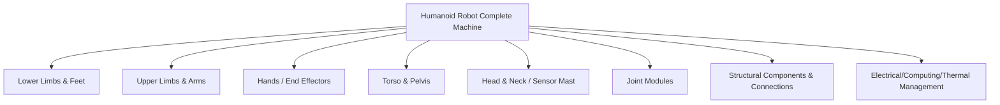

### 9.1.2 Interface Definition: Mechanical, Electrical, Thermal, Data, and Safety

Interfaces between subsystems determine the efficiency and reliability of the complete machine integration. Interface design must be frozen early and managed through an **Interface Control Document (ICD)**.

!!! note "Terminology Explanation: Interface Control Document, Mechanical Interface, Electrical Interface, Thermal Interface, Data Interface"
    - **Interface Control Document (ICD)**: A controlled document that records all interface parameters, versions, and responsibilities between subsystems.
    - **Mechanical Interface**: Geometric dimensions, fit, fastening, tolerances, stiffness, and mass constraints.
    - **Electrical Interface**: Voltage, current, power, signals, connectors, EMC, and protection.
    - **Thermal Interface**: Heat generation, heat dissipation paths, interface materials, temperature limits.
    - **Data Interface**: Communication protocol, bandwidth, cycle time, synchronization, and security checks.

The design points for the five interface dimensions are shown in the table below:

| Interface Dimension | Key Parameters | Design Risks |
|---|---|---|
| Mechanical | Dowel pins, bolt specifications, fit tolerances, stiffness | Assembly misalignment, loosening, poor alignment |
| Electrical | Rated voltage, peak current, connector keying | Arcing, overcurrent, contact failure, EMC |
| Thermal | Thermal resistance, interface thermal conductivity, cooling method | Motor/drive overheating, reducer lubrication failure |
| Data | EtherCAT, CAN-FD, Ethernet, synchronization accuracy | Packet loss, jitter, clock drift |
| Safety | STO, emergency stop, interlock, fail-safe state | Loss of control, collision, electric shock |

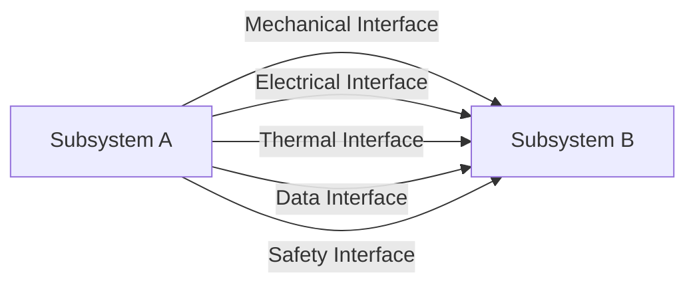

### 9.1.3 V&V, DV, and PV: From Design Verification to Product Validation

The development of humanoid robot subsystems follows the V-model, where verification and validation are贯穿始终. **Design Verification (DV)** verifies that the product is manufactured according to the design specifications; **Product Validation (PV)** confirms that the product meets user requirements and real-world scenarios.

!!! note "Terminology Explanation: V&V, Design Verification, Product Validation, Validation, Traceability"
    - **V&V (Verification & Validation)**: Systems engineering activities to verify that the product conforms to specifications and validate that it meets user requirements.
    - **Design Verification (DV)**: Checking whether the design output meets the design input under controlled conditions.
    - **Product Validation (PV)**: Confirming that the product meets user requirements in real or representative scenarios.
    - **Validation**: Answering "whether the right thing was done," rather than "whether the thing was done right."
    - **Traceability**: The bidirectional tracking relationship between requirements, design, verification, and issues.

!!! note "Terminology Explanation: Requirements Traceability Matrix, Test Coverage Matrix, Design Review, Baseline"
    - **Requirements Traceability Matrix (RTM)**: A table that maps requirements, design, verification, and test cases one-to-one.
    - **Test Coverage Matrix**: A matrix verifying whether each requirement is covered by tests.
    - **Design Review**: A systematic engineering activity to review design outputs.
    - **Baseline**: A formally reviewed and approved document or product state that serves as a reference for subsequent changes.

The typical hierarchy for DV/PV is as follows:

1. **Unit Level**: Motor test bench, reducer life test, encoder accuracy, torque sensor calibration.
2. **Subsystem Level**: Single-leg test stand, arm test stand, dexterous hand grasping test, head/neck servo test.
3. **System Integration Level**: Complete machine walking, manipulation, drop test, EMC, thermal balance.
4. **Field Validation Level**: Real-world scenario trial operation, user acceptance, reliability growth.

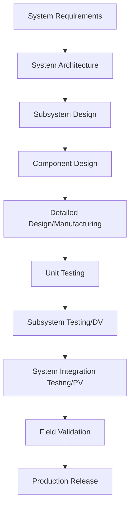

### 9.1.4 Modular Design: Standardization, Maintainability, and Concurrent Development

**Modular design** encapsulates functions into modules with standard interfaces, enabling different teams to develop concurrently, verify independently, and replace quickly. For humanoid robots, modularity is primarily reflected in joint modules, battery packs, computing units, sensor masts, and hands.

!!! note "Terminology Explanation: Modularity, Standardization, Maintainability, Concurrent Engineering, Platforming"
    - **Modularity**: Decomposing a system into modules that can be independently designed, manufactured, and replaced.
    - **Standardization**: Unifying interfaces, specifications, test methods, and documentation formats.
    - **Maintainability**: The ability of a product to be quickly repaired after a failure.
    - **Concurrent Engineering**: Multi-disciplinary teams conducting design and verification simultaneously.
    - **Platforming**: A strategy of deriving multiple product variants based on shared modules.

Benefits and challenges of modularity:

| Benefits | Challenges |
|---|---|
| Shortened development cycle | Interface definitions must be frozen early |
| Reduced integration risk | Electromagnetic/thermal/vibration coupling between modules |
| Improved maintainability | Balancing standardization and customization |
| Supports platform expansion | Module cost and performance boundaries |

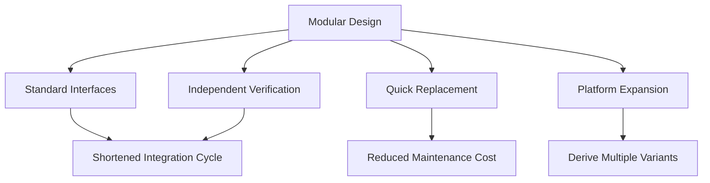

### 9.1.5 Position of This Chapter in the Complete Machine Design Process

Chapter 8 elaborates on the overall design principles of humanoid robots. This chapter focuses on key subsystems, while subsequent chapters will discuss manufacturing processes, assembly testing, control algorithms, and AI models. This chapter serves as the bridge connecting overall requirements with specific implementation.

!!! note "Terminology Explanation: Conceptual Design, Detailed Design, Design Iteration, Cross-Layer Linkage"
    - **Conceptual/System Design**: Determines functions, architecture, key parameters, and major trade-offs.
    - **Detailed Design**: Completes manufacturable drawings, BOM, process, and test specifications.
    - **Design Iteration**: The process of repeatedly optimizing a solution based on verification results.
    - **Cross-Layer Linkage**: The input-output relationships between different technical layers.

---

## 9.2 Lower Limb and Foot Subsystem Design

### 9.2.1 Lower Limb Kinematic Chain: Functional Allocation of Hip, Knee, and Ankle

The lower limbs of a humanoid robot typically consist of bilaterally symmetrical hip, knee, and ankle joints, responsible for supporting body weight, propelling the body, absorbing impact, and maintaining balance. The hip joint usually adopts a 3-DOF orthogonal layout (flexion/extension, abduction/adduction, internal/external rotation), the knee joint primarily has 1-DOF flexion/extension, and the ankle joint provides pitch and roll (2-DOF), with some designs adding yaw (3-DOF) to assist with steering.

!!! note "Terminology Explanation: Hip Joint, Knee Joint, Ankle Joint, Flexion/Extension, Abduction/Adduction, Internal/External Rotation"
    - **Hip joint**: The joint connecting the torso/pelvis to the thigh, typically a multi-DOF ball-and-socket-like layout.
    - **Knee joint**: The joint connecting the thigh to the shank, primarily achieving flexion/extension.
    - **Ankle joint**: The joint connecting the shank to the foot, controlling foot pitch and roll.
    - **Flexion/Extension**: Forward and backward movement of the joint in the sagittal plane.
    - **Abduction/Adduction**: Lateral movement of the joint in the coronal plane.
    - **Internal/External Rotation**: Rotational movement around the longitudinal axis of the limb.

!!! note "Terminology Explanation: Sagittal Plane, Coronal Plane, Transverse Plane, Anatomical Position"
    - **Sagittal plane**: A vertical plane dividing the body into left and right parts.
    - **Coronal/Frontal plane**: A vertical plane dividing the body into front and back parts.
    - **Transverse plane**: A horizontal plane dividing the body into upper and lower parts.
    - **Anatomical position**: The standard reference posture with the body upright, facing forward, and palms facing forward.

Functional allocation of lower limb joints:

| Joint | Main DOF | Core Function | Typical Range of Motion |
|---|---|---|---|
| Hip | 3 | Leg lifting, lateral swing, turning, stride length adjustment | Flexion ±120°, Abduction ±45°, Rotation ±45° |
| Knee | 1 | Locking during stance phase, foot lifting during swing phase, landing shock absorption | 0–135° Flexion |
| Ankle | 2–3 | Heel strike shock absorption, toe-off propulsion, lateral tilt adjustment | Pitch ±45°, Roll ±30° |

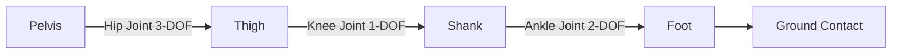

### 9.2.2 Kinematic Modeling: Forward Kinematics of a Simplified Leg

To facilitate the analysis of the lower limb workspace, a single leg is often simplified as a serial chain of 3-DOF hip (roll/pitch/yaw) + 1-DOF knee + 2-DOF ankle (pitch/roll). Forward kinematics can be established using modified DH parameters or screw theory to calculate the foot position relative to the hip.

!!! note "Terminology Explanation: Forward Kinematics, DH Parameters, Modified DH, Screw, Homogeneous Transformation"
    - **Forward kinematics**: The mapping from joint angles to the end-effector pose.
    - **DH parameters (Denavit-Hartenberg parameters)**: Four parameters (a, α, d, θ) describing the relationship between adjacent link coordinate frames.
    - **Modified DH (MDH)**: Defines the link length α and twist angle α at the previous joint to avoid singularities with adjacent parallel axes.
    - **Screw**: A geometric quantity describing the rotation of a rigid body around an axis combined with translation along that axis.
    - **Homogeneous transformation**: A 4×4 matrix that simultaneously describes rotation and translation.

For a planar simplified leg (hip pitch θ₁, knee θ₂, ankle pitch θ₃), the foot end position can be written as:

$$
\begin{aligned}
x &= l_1 \sin\theta_1 + l_2 \sin(\theta_1+\theta_2) + l_3 \sin(\theta_1+\theta_2+\theta_3) \\
z &= -l_1 \cos\theta_1 - l_2 \cos(\theta_1+\theta_2) - l_3 \cos(\theta_1+\theta_2+\theta_3)
\end{aligned}
$$

where \(l_1, l_2, l_3\) are the lengths of the thigh, shank, and foot respectively, with the z-axis pointing upward.

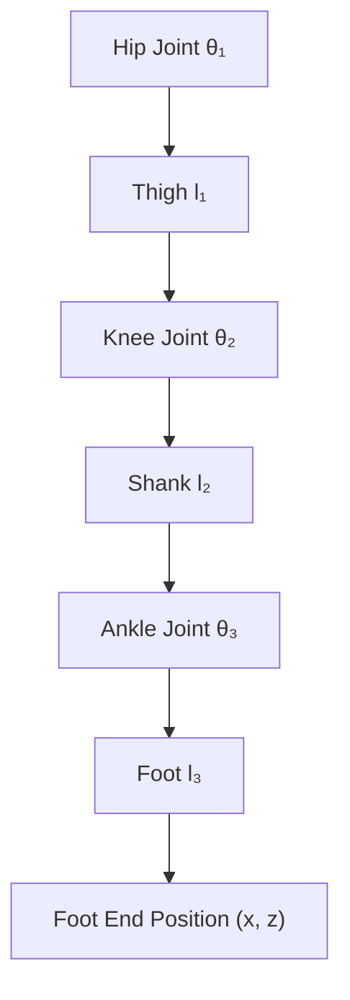

### 9.2.3 Foot Reachable Area: Python Example 1

The following Python example calculates the reachable point cloud of the foot sole center for a simplified 6-DOF leg (hip roll/pitch/yaw, knee pitch, ankle pitch/roll) within joint limits, and plots side and top views.

```python
import numpy as np
import matplotlib.pyplot as plt

# Simplified lower limb forward kinematics and foot reachable area
# Define link lengths (m): hip->knee, knee->ankle, ankle->foot sole center
L_thigh = 0.40
L_shank = 0.40
L_foot  = 0.08

# Joint limits (degrees)
limits = {
    'hip_roll':  (-30, 30),
    'hip_pitch': (-90, 60),
    'hip_yaw':   (-45, 45),
    'knee':      (0, 135),
    'ank_pitch': (-45, 45),
    'ank_roll':  (-20, 20),
}

# Rotation matrices around x, y, z axes
def Rx(a): c, s = np.cos(a), np.sin(a); return np.array([[1,0,0],[0,c,-s],[0,s,c]])
def Ry(a): c, s = np.cos(a), np.sin(a); return np.array([[c,0,s],[0,1,0],[-s,0,c]])
def Rz(a): c, s = np.cos(a), np.sin(a); return np.array([[c,-s,0],[s,c,0],[0,0,1]])

# Homogeneous transformation: rotation followed by translation
def T_rot_trans(R, p):
    T = np.eye(4)
    T[:3,:3], T[:3,3] = R, p
    return T

points = []
np.random.seed(42)
for _ in range(80000):
    hr = np.radians(np.random.uniform(*limits['hip_roll']))
    hp = np.radians(np.random.uniform(*limits['hip_pitch']))
    hy = np.radians(np.random.uniform(*limits['hip_yaw']))
    kn = np.radians(np.random.uniform(*limits['knee']))
    ap = np.radians(np.random.uniform(*limits['ank_pitch']))
    ar = np.radians(np.random.uniform(*limits['ank_roll']))

    # Hip joint: roll -> pitch -> yaw
    T_hip = T_rot_trans(Rz(hy) @ Ry(hp) @ Rx(hr), np.zeros(3))
    # Thigh link along -z direction (downward)
    T_thigh = T_rot_trans(np.eye(3), np.array([0, 0, -L_thigh]))
    # Knee joint only pitch
    T_knee = T_rot_trans(Ry(kn), np.zeros(3))
    # Shank link
    T_shank = T_rot_trans(np.eye(3), np.array([0, 0, -L_shank]))
    # Ankle joint roll -> pitch
    T_ankle = T_rot_trans(Ry(ap) @ Rx(ar), np.zeros(3))
    # Foot sole center
    T_foot = T_rot_trans(np.eye(3), np.array([0, 0, -L_foot]))

    T_total = T_hip @ T_thigh @ T_knee @ T_shank @ T_ankle @ T_foot
    points.append(T_total[:3, 3])

points = np.array(points)
```

```python
fig, ax = plt.subplots(1, 2, figsize=(12, 5))
ax[0].scatter(points[:,0], points[:,2], s=1, alpha=0.3, c='b')
ax[0].set_xlabel('x (m)'); ax[0].set_ylabel('z (m)')
ax[0].set_title('Side View of Foot Reachable Area')
ax[0].set_aspect('equal'); ax[0].grid(True)

ax[1].scatter(points[:,0], points[:,1], s=1, alpha=0.3, c='r')
ax[1].set_xlabel('x (m)'); ax[1].set_ylabel('y (m)')
ax[1].set_title('Top View of Foot Reachable Area')
ax[1].set_aspect('equal'); ax[1].grid(True)
plt.tight_layout(); plt.savefig('leg_workspace_ch9.png', dpi=150)
print(f"Number of sample points: {len(points)}")
print(f"x range: [{points[:,0].min():.3f}, {points[:,0].max():.3f}]")
print(f"y range: [{points[:,1].min():.3f}, {points[:,1].max():.3f}]")
print(f"z range: [{points[:,2].min():.3f}, {points[:,2].max():.3f}]")
```

This example illustrates: even with a wide joint motion range, the foot reachable area is still constrained by link lengths and joint coupling, presenting an approximate ellipsoidal shell shape; during design, ensure that common gait operating points are located in the center of the reachable area, avoiding proximity to boundary singularities.

!!! note "Terminology Explanation: Reachable Area, Workspace, Monte Carlo Sampling, Singular Configuration"
    - **Reachable workspace**: The set of all points that the end-effector can reach in at least one orientation.
    - **Workspace**: A comprehensive description of reachable points and achievable orientations of the end-effector.
    - **Monte Carlo sampling**: A method for approximating complex geometric or probabilistic problems through random sampling.
    - **Singular configuration**: A configuration where the Jacobian matrix loses rank, resulting in extreme or infinite solutions in velocity/force transmission.

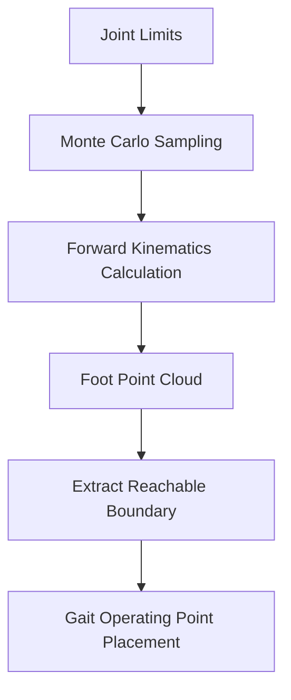

### 9.2.4 Compliant Vibration Absorption: Buffer Design of Foot, Ankle, and Shank

Bipedal walking inevitably involves periodic impacts. Peak ground reaction forces can reach 1.2–1.8 times body weight (walking) or 2–3 times body weight (running/falling). If impacts are transmitted directly to rigid joints and structures, they will cause vibration, noise, fatigue, and sensor noise. Therefore, the lower limbs must possess **compliance** and **vibration absorption** capabilities.

!!! note "Terminology Explanation: Compliance, Stiffness, Damping, Vibration Absorption, Impact, Ground Reaction Force"
    - **Compliance**: The ease with which a system deforms under force; the reciprocal of stiffness.
    - **Stiffness**: The force required per unit deformation.
    - **Damping**: A mechanism that dissipates vibrational energy.
    - **Vibration absorption**: The process of absorbing and attenuating impact energy through materials, structures, or control.
    - **Impact**: A force or acceleration of short duration and high magnitude.
    - **Ground Reaction Force (GRF)**: The force exerted by the ground on the foot.

Compliant design is typically distributed across three levels:

1. **Passive Compliance**: Foot sole rubber pads, ankle springs, shank elastic plates, joint output elastic elements.
2. **Semi-Active Compliance**: Variable stiffness mechanisms, magnetorheological/electrorheological dampers.
3. **Active Compliance**: Impedance/admittance control based on torque sensors, terrain-adaptive control.

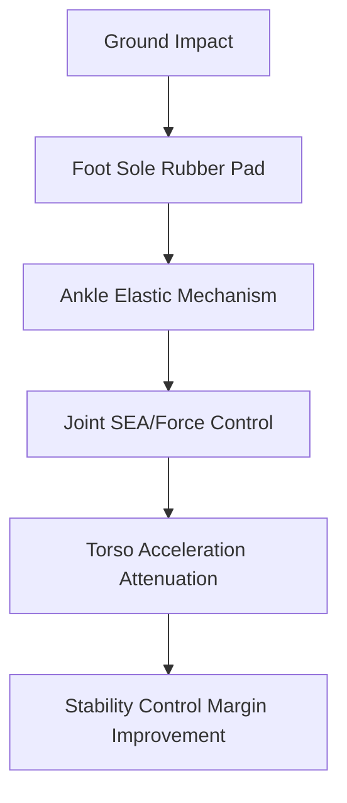

#### 9.2.4.1 Lumped Parameter Model of Foot-Ground Impact

To understand compliant vibration absorption from first principles, the foot-ground contact can be simplified as a single-degree-of-freedom mass-spring-damper (MSD) system. Let the equivalent mass be the mass of the foot and distal shank involved in the impact during landing, denoted as \(m\); the equivalent stiffness be the series stiffness of the foot sole pad and ankle elastic mechanism, denoted as \(k\); and the equivalent damping be \(c\). At the moment of touchdown, the foot has an initial vertical downward velocity \(v_0\), and the ground reaction force \(F_g(t)\) decelerates the foot.

!!! note "Terminology Explanation: Mass-Spring-Damper, Natural Angular Frequency, Damping Ratio, Critical Damping, Overshoot"
    - **Mass-spring-damper (MSD)**: A second-order vibration system composed of a lumped mass, an ideal spring, and an ideal damper.
    - **Natural angular frequency**: The angular frequency of undamped free vibration, \(\omega_n = \sqrt{k/m}\).
    - **Damping ratio**: The ratio of actual damping to critical damping, \(\zeta = c / (2\sqrt{mk})\).
    - **Critical damping**: The damping that allows the system to return to its equilibrium position fastest without oscillation, \(c_c = 2\sqrt{mk}\).
    - **Overshoot**: The maximum peak value exceeding the steady-state value in an underdamped response.

The equation of motion is given by Newton's second law:

$$
m\ddot{x} + c\dot{x} + kx = -mg
$$

where \(x\) is the vertical compression displacement of the foot relative to the ground (positive downward), and the right-hand side \(-mg\) is the gravitational term. At the moment of touchdown, gravity can be neglected (impact duration is much shorter than the time for gravity to cause significant displacement). By letting \(y = x + mg/k\), the equation is homogenized to the standard form:

$$
\ddot{y} + 2\zeta\omega_n\dot{y} + \omega_n^2 y = 0, \quad \omega_n = \sqrt{\frac{k}{m}}, \quad \zeta = \frac{c}{2\sqrt{mk}}
$$

The initial conditions are \(y(0) = mg/k\) (static equilibrium offset) and \(\dot{y}(0) = v_0\). For the underdamped case \(0 < \zeta < 1\), the analytical solution is:

$$
y(t) = e^{-\zeta\omega_n t}\left[ y(0)\cos(\omega_d t) + \frac{\dot{y}(0) + \zeta\omega_n y(0)}{\omega_d}\sin(\omega_d t) \right]
$$

where \(\omega_d = \omega_n\sqrt{1-\zeta^2}\) is the damped natural angular frequency. The ground reaction force (neglecting the static equilibrium part) is:

$$
F_g(t) = k\,y(t) + c\,\dot{y}(t)
$$

**Peak Force Estimation**: When damping is small (\(\zeta < 0.3\)), the maximum compression displacement can be quickly estimated using the zero-damping upper bound:

$$
\delta_{\max}^{(0)} \approx \frac{v_0}{\omega_n} = v_0\sqrt{\frac{m}{k}}
$$

The peak ground reaction force occurs when compression displacement is maximum and velocity is approximately zero. Therefore, a more accurate estimate is:

$$
F_{g,\max} \approx k\,\delta_{\max} + m g
$$

where \(\delta_{\max}\) is the actual maximum compression after accounting for damping. This equation shows that, for the same touchdown velocity, the peak reaction force is approximately proportional to \(\sqrt{k}\) — a softer foot sole pad significantly reduces impact loads, but excessive softness prolongs the stance phase stabilization time and reduces positional accuracy.

**Numerical Example**: Assume foot equivalent mass \(m = 1.5\,\text{kg}\), touchdown velocity \(v_0 = 0.8\,\text{m/s}\), foot sole pad stiffness \(k = 5\times10^4\,\text{N/m}\), and damping ratio \(\zeta = 0.25\). Then:

$$
\omega_n = \sqrt{\frac{5\times10^4}{1.5}} \approx 182.6\,\text{rad/s}, \quad f_n \approx 29.1\,\text{Hz}
$$

The zero-damping upper bound \(\delta_{\max}^{(0)} \approx 0.8/182.6 \approx 4.38\,\text{mm}\); after accounting for damping, the numerical solution gives \(\delta_{\max} \approx 2.94\,\text{mm}\), corresponding to a peak ground reaction force:

$$
F_{g,\max} \approx 5\times10^4 \times 2.94\times10^{-3} + 1.5\times9.81 \approx 147 + 15 \approx 162\,\text{N}
$$

This peak force is close to the numerical solution of \(169\,\text{N}\). For an equivalent mass of 1.5 kg, this peak force corresponds to an equivalent overload of approximately \(11.5\,g\), indicating that the compliant design can limit impact loads within a controlled range.

```python
import numpy as np
import matplotlib.pyplot as plt
from scipy.integrate import solve_ivp

# Parameters for foot-ground impact lumped parameter model
m = 1.5            # Equivalent mass kg
k = 5e4            # Equivalent stiffness N/m
zeta = 0.25        # Damping ratio
v0 = 0.8           # Touchdown velocity m/s (downward)
g = 9.81           # Gravitational acceleration m/s^2

omega_n = np.sqrt(k / m)
c = 2 * zeta * np.sqrt(m * k)
omega_d = omega_n * np.sqrt(1 - zeta**2)

def impact_dynamics(t, state):
    x, v = state
    # x is compression displacement (positive downward), spring force upward is negative
    dxdt = v
    dvdt = (-k * x - c * v - m * g) / m
    return [dxdt, dvdt]

# Initial: x=0 (uncompressed), v=v0 downward (taken as positive)
sol = solve_ivp(impact_dynamics, [0, 0.08], [0.0, v0], max_step=1e-4, dense_output=True)
t = sol.t
x = sol.y[0]
v = sol.y[1]
F_g = k * x + c * v  # Ground reaction force (positive upward, since x compresses downward and spring pushes upward)

plt.figure(figsize=(10, 4))
plt.subplot(1, 2, 1)
plt.plot(t * 1000, x * 1000, label='Compression displacement x')
plt.xlabel('Time (ms)'); plt.ylabel('Compression displacement (mm)')
plt.grid(True); plt.legend()
plt.subplot(1, 2, 2)
plt.plot(t * 1000, F_g, label='Ground reaction force F_g')
plt.axhline(m * g, color='k', linestyle='--', label='Static weight mg')
plt.xlabel('Time (ms)'); plt.ylabel('Ground reaction force (N)')
plt.grid(True); plt.legend()
plt.tight_layout(); plt.savefig('foot_impact_msd_ch9.png', dpi=150)

print(f"Natural frequency f_n = {omega_n/(2*np.pi):.2f} Hz")
print(f"Maximum compression displacement = {np.max(x)*1000:.2f} mm")
print(f"Peak ground reaction force = {np.max(F_g):.2f} N")
print(f"Time to peak = {t[np.argmax(F_g)]*1000:.2f} ms")
```

This example illustrates the transient characteristics of impact loads: the peak force occurs approximately \(5\!-\!10\,\text{ms}\) after touchdown, followed by damping decay. During design, adjustments to \(k\) and \(\zeta\) can be used to trade off between peak force, compression, and energy rebound. See Section 6.3 of Chapter 6 for a discussion on thermal-mechanical coupling and actuator selection.

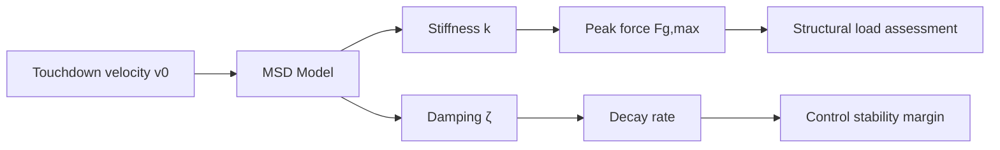

### 9.2.5 Mass Distribution: Reducing Swing Leg Inertia

The swing leg undergoes high acceleration, and its mass and inertia directly affect energy consumption and control bandwidth. The design principle is: **concentrate mass as close to the hip joint (proximal) as possible, and lightweight the shank and foot**.

!!! note "Terminology: Inertia, Moment of Inertia, Center of Mass, Swing Leg, Stance Leg, Mass Distribution"
    - **Inertia**: The resistance of an object to angular acceleration.
    - **Moment of Inertia**: Inertia about a specific axis, related to mass distribution.
    - **Center of Mass (CoM)**: The mass-weighted average position.
    - **Swing Leg**: The leg not in contact with the ground during the stepping phase.
    - **Stance Leg**: The leg supporting body weight.
    - **Mass Distribution**: The allocation of mass along different segments of a limb.

Experience with leg linkage mass distribution:

| Segment | Target Mass Proportion | Design Approach |
|---|---|---|
| Thigh | Can be moderately concentrated | Motors/gearboxes can be partially relocated upward |
| Shank | As light as possible | Carbon fiber tubes, hollow aluminum |
| Foot | As light as possible | Thin-walled shells, lightweight rubber |

Total leg mass typically accounts for 30–40% of the total robot mass. If the shank and foot are too heavy, it significantly increases hip joint torque requirements and reduces dynamic response.

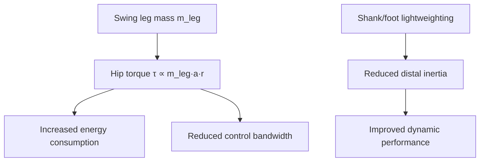

### 9.2.6 Foot Design: Contact Surface, CoP, and Foot Sensors

The foot is the only interface between the lower limb and the ground. Its shape, size, material, and sensor layout directly affect stability and perception. Foot design requires a trade-off between **support area, flexibility, weight, and sensing complexity**.

!!! note "Terminology: Foot Sole, Center of Pressure, CoP, Foot Sensor, 6-axis Force/Torque Sensor, Tactile Array"
    - **Foot Sole**: The surface of the foot in contact with the ground.
    - **Center of Pressure (CoP)**: The equivalent point of application of the ground reaction force on the foot sole.
    - **Foot Sensor**: A device that measures foot force, torque, pressure, or tactile feedback.
    - **6-axis Force/Torque Sensor (6-axis F/T sensor)**: A sensor that simultaneously measures three forces and three torques.
    - **Tactile Array**: Distributed pressure/shear force sensing elements.

Relationship between CoP and ZMP: When the foot sole is in full contact with a horizontal ground and friction is sufficient, the ZMP coincides with the CoP. The dynamic stability criterion is that the CoP lies within the support polygon:

$$
\mathbf{p}_{\text{CoP}} = \frac{\sum_i p_i F_{z,i}}{\sum_i F_{z,i}}
$$

where \(p_i\) is the position of each pressure unit, and \(F_{z,i}\) is the vertical pressure.

Comparison of foot shapes:

| Shape | Advantages | Disadvantages | Representative |
|---|---|---|---|
| Flat foot | Stable support, easy sensor integration | Lacks arch cushioning | ASIMO, Digit |
| Segmented foot | Can mimic heel strike-roll-toe-off | Complex structure | Atlas, some research robots |
| Point contact foot | Flexible, good for obstacles | Poor stability | Early bipedal robots |


### 9.2.7 Summary of Lower Limb Design Principles

The core indicators for lower limb design can be summarized as:

| Indicator | Key Design Parameters | Verification Methods |
|---|---|---|
| Motion capability | Joint range, speed, acceleration | Single-leg test bench, motion capture |
| Load capacity | Peak torque, structural strength | Static/fatigue testing |
| Dynamic stability | Inertia, CoP/GRF control | Walking experiments, disturbance tests |
| Energy efficiency | Mass distribution, transmission efficiency, regenerative braking | Energy consumption testing |
| Reliability | Sealing, lubrication, fastening | HALT, life test bench |
| Safety | Fall protection, collision force | Drop tests, force limit testing |

#### 9.2.8 Lower Limb Load Cases and Joint Torque Estimation

Realistic lower limb design must start from typical load cases, rather than just rated joint torques. The main load cases include: **stance phase** single-leg support of the entire body, **swing phase** leg acceleration, **landing impact** at the moment of foot touchdown, as well as extreme cases such as **squatting/standing up**, **stairs/slopes**, and **fall protection**.

!!! note "Term Explanation: Stance Phase, Swing Phase, Landing Impact, Static Torque, Dynamic Torque"
    - **Stance phase**: The phase in the gait cycle when the foot is in contact with the ground and bears the body's weight.
    - **Swing phase**: The phase when the foot is off the ground and swings forward.
    - **Landing impact**: The short-duration, high-magnitude ground reaction force generated when the swing leg's foot contacts the ground.
    - **Static torque**: Joint torque produced by steady-state loads such as gravity and ground reaction forces.
    - **Dynamic torque**: Joint torque produced by acceleration and inertial forces.

In engineering estimation, the peak ground reaction force during the single-leg stance phase is typically taken as \(1.5\!-\!2.5\,mg\) (walking) or \(2.5\!-\!4.0\,mg\) (running/fall mitigation), where \(m\) is the total robot mass. Using a simplified sagittal plane model as an example, the hip joint torque can be approximated as the superposition of the ground reaction force multiplied by its moment arm about the hip:

$$
\tau_{\text{hip}} \approx F_z \cdot x_{\text{foot}/\text{hip}} + m_{\text{thigh}} g \cdot x_{\text{thigh,CoM}} + m_{\text{shank}} g \cdot x_{\text{shank,CoM}}
$$

More generally, for any link \(i\), the joint torque satisfies:

$$
\tau_i = \mathbf{r}_i \times \mathbf{F}_{\text{ground}} + \sum_{j\ge i} m_j \, \mathbf{g} \times \mathbf{r}_{j,\text{CoM}}
$$

where \(\mathbf{r}_i\) is the vector from joint \(i\) to the point of ground reaction force application, \(m_j\) is the mass of the distal link, and \(\mathbf{r}_{j,\text{CoM}}\) is the position vector of the distal link's center of mass relative to the joint. During landing impact, the inertial term \(I_i \ddot{\theta}_i\) must also be included; the instantaneous torques at the hip/knee/ankle can be \(30\!-\!80\%\) higher than steady-state values.

Engineering estimation of peak joint torques for a typical humanoid robot (total mass 60–80 kg):

| Joint | Stance Phase Torque (N·m) | Landing Impact Torque (N·m) | Remarks |
|---|---|---|---|
| Hip pitch | 80–180 | 150–300 | Strongly correlated with step length and torso tilt |
| Knee pitch | 80–200 | 180–400 | Maximum during deep squat |
| Ankle pitch | 60–150 | 120–280 | Toe-off and heel strike |
| Ankle roll | 30–80 | 60–150 | Lateral tilt during single-leg stance |

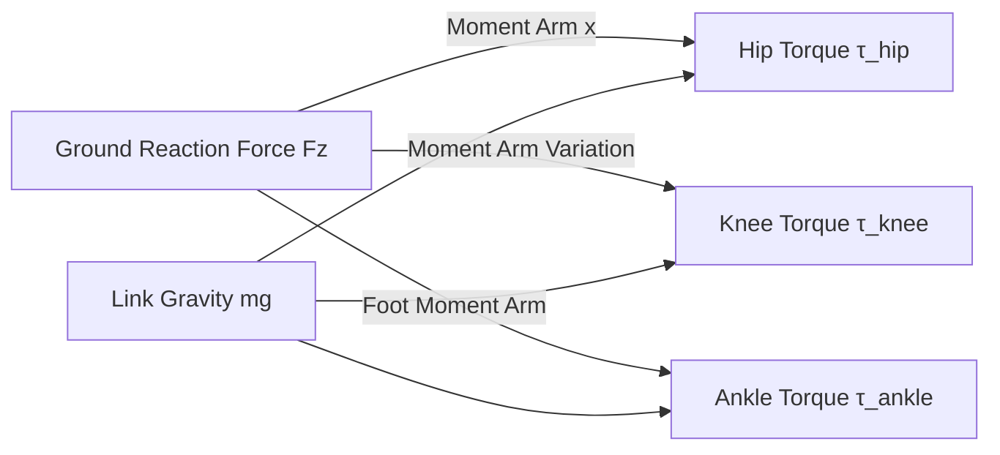


**Parametric Example of Typical Operating Conditions**:

| Condition | Vertical GRF (N) | Horizontal GRF (N) | Hip Torque (N·m) | Knee Torque (N·m) | Ankle Torque (N·m) |
|---|---|---|---|---|---|
| Quiet Standing (Bipedal) | 300 | 0 | ±10 | 5 | 5 |
| Single-Leg Stance (60 kg Robot) | 600 | 50 | 120 | 100 | 80 |
| Fast Walking Landing Impact | 1000 | 150 | 250 | 280 | 200 |
| Deep Squat Stand-up | 800 | 0 | 200 | 300 | 150 |
| Lateral Single-Leg Stance | 600 | 80 | 80 | 90 | 120 |

The values in the table are engineering estimates. Actual design should be iteratively determined through multibody dynamics simulation and prototype testing. A safety factor of \(1.5\!-\!2.5\) is typically applied to cover dynamic uncertainties and material variability.

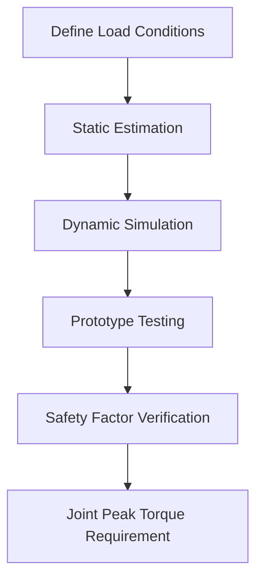

#### 9.2.9 Detailed Hip Joint Design

The hip joint bears the full body weight and transmits ground reaction forces through the thigh. Its core design challenge is achieving high stiffness, low friction, and long life within a compact space. A common structure is a 3-DOF orthogonal axis system: hip roll (abduction/adduction), hip pitch (flexion/extension), and hip yaw (internal/external rotation). The three axes are typically arranged in a nested or stacked layout.

!!! note "Term Explanation: Crossed Roller Bearing, Basic Dynamic Load Rating, L10 Life, Bolt Circle Diameter, Preload, Offset, Housing Stiffness"
    - **Crossed roller bearing**: A bearing with rollers arranged at 90° intervals, capable of simultaneously handling radial, axial, and overturning moment loads.
    - **Basic dynamic load rating (C)**: The constant load a bearing can endure for a rated life of \(10^6\) revolutions.
    - **L10 life**: The rated life that 90% of a group of bearings can achieve or exceed.
    - **Bolt circle diameter (BCD)**: The diameter of the circle passing through the centers of the mounting flange bolts.
    - **Preload**: An initial compressive force applied during assembly to eliminate clearance and increase stiffness.
    - **Offset**: The distance between the joint's axis of rotation and the geometric center of the structure.
    - **Housing stiffness**: The ability of the joint housing to resist deformation, affecting the actual load distribution on the bearing.

**Bearing Selection**: Crossed roller bearings or double-row angular contact bearings are commonly used at the hip joint output. Taking a crossed roller bearing as an example, its basic dynamic load rating \(C\) should satisfy:

$$
C \ge P \cdot \left(\frac{L_{10}}{10^6}\right)^{1/\epsilon}
$$

where \(P\) is the equivalent dynamic load, \(L_{10}\) is the target rated life (revolutions), and \(\epsilon=10/3\) (for roller bearings). For a humanoid robot hip joint, the target life is typically \(>5\times10^7\) revolutions, corresponding to a \(C\) value of \(1.5\!-\!2.5\) times the peak radial load. If the peak overturning moment \(M_t\) is significant, the static load safety factor \(S_0 = C_0/P_0\) of the bearing must be checked, typically requiring \(S_0 \ge 2\).

**Bolt Layout and Preload**: The bolt circle diameter \(D_{\text{bc}}\) for the hip joint flange is typically \(1.1\!-\!1.3\) times the bearing pitch circle diameter. The bolt preload \(F_p\) should ensure the joint surfaces do not separate under working loads:

$$
F_p \ge \frac{F_{\text{external}}}{1 - \frac{k_b}{k_b + k_m}}
$$

where \(k_b\) and \(k_m\) are the stiffness of the bolt and the connected components, respectively. For M8 high-strength bolts (grade 10.9), typical preload is 20–30 kN, with a tightening torque \(T \approx 0.2 F_p d\).

**Offset Control**: The intersection point of the hip joint axes should be as close as possible to the anatomical center of the human hip joint, generally controlled within \(\pm 2\,\text{mm}\). Excessive axis offset leads to additional parasitic torques and CoM sway during gait.

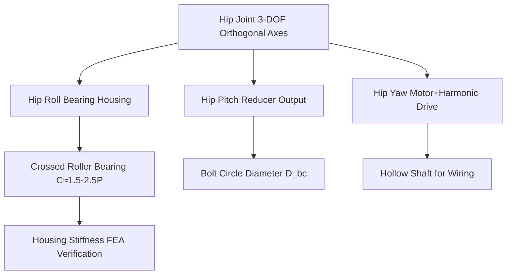


**Hip Joint Stiffness Empirical Target**: During robot walking, the torsional deformation of the pelvis relative to the thigh should be controlled within \(0.1°\). Assuming a rated working torque \(M=150\,\text{N·m}\) for the hip roll axis, the joint torsional stiffness should satisfy:

$$
K_{\text{hip}} \ge \frac{M}{\theta_{\text{max}}} = \frac{150}{0.1° \times \pi/180} \approx 8.6\times10^4\,\text{N·m/rad}
$$

In practice, the crossed roller bearing, housing, and output flange form a series stiffness chain. The housing stiffness should typically be designed to be \(2\!-\!5\) times greater than the bearing stiffness to prevent the housing from becoming the weak link.

**Bearing Preload and Friction**: Excessive preload on a crossed roller bearing significantly increases starting torque and temperature rise. In engineering, light preload or positional preload is primarily used. The bearing friction torque \(M_f\) after preloading can be estimated as:

$$
M_f \approx 0.5 \mu P_a d_m
$$

where \(\mu\) is the friction coefficient, \(P_a\) is the preload force, and \(d_m\) is the bearing pitch circle diameter. The friction torque of the hip joint bearing should typically be \(<2\,\text{N·m}\); otherwise, force control accuracy is affected.

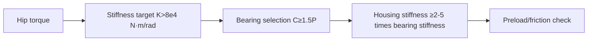

#### 9.2.10 Detailed Knee Design

The knee joint primarily achieves sagittal plane flexion/extension, but during human walking, the knee also exhibits slight rolling-sliding motion. Two common structures exist for robotic knee joints: **revolute knee** and **four-bar linkage knee**.

!!! note "Terminology: Revolute knee, four-bar linkage knee, patella, mechanical stop, bearing arrangement, tendon drive, belt drive"
    - **Revolute knee**: A single-axis knee joint with simple structure and direct control.
    - **Four-bar linkage knee**: Uses a four-bar linkage to approximate the instantaneous center of the human knee joint, improving human-machine biomimicry.
    - **Patella**: A limit or guide structure simulating the kneecap in biomimetic design.
    - **Mechanical stop**: Physical stoppers that limit the range of motion of the joint.
    - **Bearing arrangement**: The type, quantity, and position of bearings supporting the joint shaft.
    - **Tendon drive**: A transmission method using flexible tendons to transfer motion.
    - **Belt drive**: A transmission method using synchronous belts to transfer motion.

**Revolute knee**: A motor + harmonic/planetary gearbox directly drives the knee shaft. The output end uses crossed roller bearings or tapered roller bearings to withstand combined radial and axial loads. Its advantages are a simple control model and directly measurable stiffness; its disadvantage is that the instantaneous center of the knee is fixed during flexion/extension, resulting in a significant difference in the trajectory of the shank relative to the thigh compared to a human leg.

**Four-bar linkage knee**: Uses a thigh link, shank link, anterior link, and posterior link to form a four-bar linkage, causing the instantaneous center of the knee joint to move along a trajectory approximating the human knee during flexion/extension. Its advantages are better human-machine kinematic matching and widespread use in prosthetics/exoskeletons; its disadvantages are increased mechanical complexity, linkage clearance, and additional inertia, requiring more complex forward and inverse kinematics.

**Patella and Stops**: Revolute knees typically have a hard stop in the extension direction (\(0°\)) to prevent hyperextension; the flexion direction is limited to \(130°\!-\!150°\). A cushion (polyurethane or vulcanized rubber) can be placed at the stop to absorb residual impact. Four-bar linkage knees achieve natural extension locking through the geometric dead center of the linkage.

**Bearing Arrangement**: The knee shaft supports the entire weight below the thigh and ground reaction forces. A pair of tapered roller bearings in a back-to-back (DB) or face-to-face (DF) configuration is commonly used to withstand both radial forces and overturning moments. The bearing span \(L_b\) is recommended to be \(0.5\!-\!0.8\) times the diameter of the joint output flange to reduce overturning angular deformation caused by the cantilever effect.

**Tendon/Belt Space**: If the motor is placed on the thigh to reduce shank mass, power must be transmitted across the knee joint via a synchronous belt or tendon. For synchronous belts, the wrap angle must be \(>120°\), and the tension should be \(1.3\!-\!1.5\) times the working force; for tendon drives, guide pulleys are required, and the minimum pulley diameter is typically \(20\!-\!40\) times the tendon diameter to reduce bending fatigue.

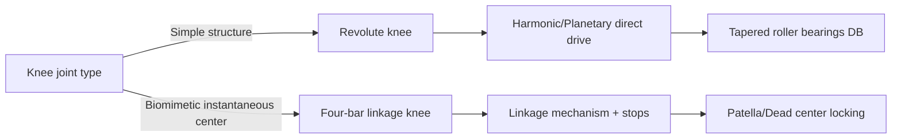


**Knee Shaft Strength and Deflection**: The knee shaft diameter \(d\) can be estimated based on the maximum bending moment. Assuming a bearing span \(L_b=60\,\text{mm}\) and a maximum radial load \(F_r=5000\,\text{N}\), the maximum bending moment is \(M = F_r L_b / 4 = 75\,\text{N·m}\). Using an allowable bending stress \(\sigma_{\text{adm}} = 200\,\text{MPa}\):

$$
d \ge \left(\frac{32 M}{\pi \sigma_{\text{adm}}}\right)^{1/3} \approx 0.015\,\text{m} = 15\,\text{mm}
$$

Considering keyways, bearing fits, and safety factors, the actual knee shaft diameter is typically \(20\!-\!35\,\text{mm}\). Shaft deflection should be \(<0.02\,\text{mm}\) to ensure proper operation of the gearbox and bearings.

**Four-bar Linkage Knee Design Points**: The ratio of the four-bar link lengths affects the trajectory of the knee's instantaneous center. A typical design uses:
- Thigh link \(a = 80\,\text{mm}\)
- Shank link \(b = 90\,\text{mm}\)
- Anterior link \(c = 40\,\text{mm}\)
- Posterior link \(d = 50\,\text{mm}\)

Links are commonly made of \(17\!-\!4\) PH stainless steel or 7075-T6 aluminum alloy, and maintenance-free self-lubricating bearings are used at the joints.

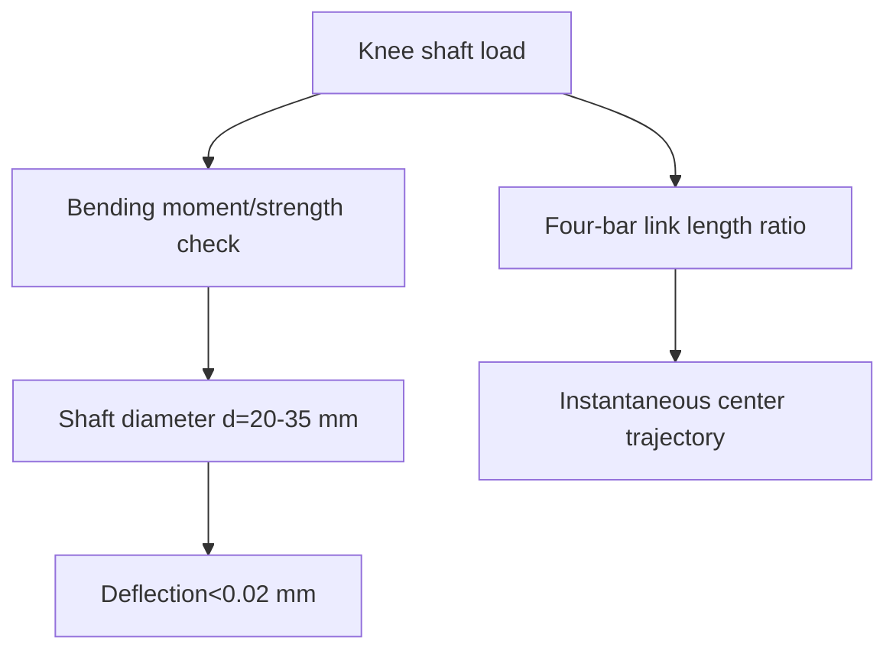

#### 9.2.11 Detailed Ankle and Foot Design

The ankle joint typically provides two degrees of freedom: pitch and roll. Some designs add yaw to assist with turning. The ankle space is limited but torque requirements are high, making it a challenging part of lower limb design.

!!! note "Terminology: Ankle joint, pitch/roll intersection, harmonic gearbox, planetary gearbox, 6-axis force/torque sensor, flatness, Shore A, compression set"
    - **Ankle joint**: The joint connecting the shank and foot, controlling foot posture.
    - **Pitch/roll intersection**: The spatial intersection point of the ankle's pitch and roll axes.
    - **6-axis force/torque sensor**: A sensor that simultaneously measures three forces and three moments.
    - **Flatness**: The allowable variation of an actual surface from an ideal plane.
    - **Shore A**: A durometer scale for the hardness of rubber/elastomers.
    - **Compression set**: The permanent deformation of an elastomer after being compressed.

**Axis Intersection**: To reduce parasitic foot position displacement caused by ankle angle changes during walking, the pitch and roll axes should intersect as closely as possible at a single point. This intersection point should ideally be located \(30\!-\!60\,\text{mm}\) above the center of the foot's support surface. Non-intersecting axes introduce additional kinematic coupling, increasing the difficulty of control compensation.

**Gearbox Space**: Ankle pitch torque is high, typically requiring a harmonic gearbox (ratio 50–100) or a cycloidal/planetary gearbox (ratio 30–50) for high torque density; ankle roll torque is relatively lower, allowing for compact harmonic or planetary gearboxes. Due to limited ankle envelope space, motors are often placed on the posterior or medial side of the shank, transmitting power to the ankle axes via synchronous belts or bevel gears.

**6-axis Force/Torque Sensor Installation**: The mounting surface flatness for a 6-axis F/T sensor is typically required to be \(\le 0.02\,\text{mm}\), with a surface roughness \(Ra \le 1.6\,\mu\text{m}\). Bolt preload must be uniform and symmetrical, tightened in 2–3 steps to the specified torque, to avoid warping the sensor base and introducing crosstalk. A pre-compression gap of \(0.1\!-\!0.3\,\text{mm}\) should be maintained between the sensor's top surface and the foot plate for zero-point fine-tuning after installation.

**Foot Sole Rubber Pad**: Common materials for the foot sole pad include nitrile rubber (NBR), polyurethane (PU), or thermoplastic elastomer (TPE), with a hardness of Shore A 50–70. The static compression set is designed to be \(10\!-\!20\%\) of the pad thickness to provide adequate cushioning during heel strike without excessive collapse. Wear resistance can be evaluated using the DIN abrasion test, with a target abrasion loss of \(<150\,\text{mm}^3\).

**Toe Joint**: Some biomimetic foot designs add \(1\!-\!2\) degrees of freedom for the toes, used for push-off propulsion and obstacle negotiation. Toe actuation can use small linear motors or tendon drives, with a typical joint angle range of \(0\!-\!45°\). Adding toes increases complexity and weight, requiring a trade-off based on the task.

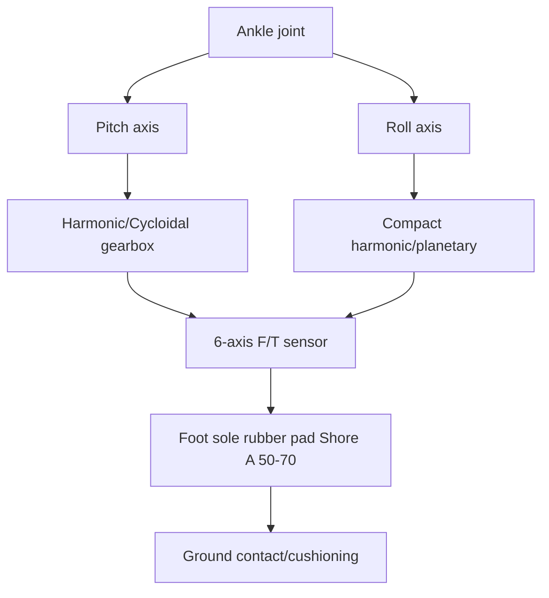


**6-axis Force/Torque Sensor Crosstalk Control**: Mechanical coupling and electrical crosstalk exist between the channels of a 6-axis F/T sensor. An uneven mounting surface induces additional bending moments, manifesting as crosstalk between force and moment channels. Engineering requirements:
- Mounting surface flatness \(\le 0.02\,\text{mm}\)
- Bolt preload non-uniformity \(<10\%\)
- Sensor crosstalk after calibration \(<2\%\) FS

**Foot Pressure Distribution**: The ideal foot pressure distribution involves the center of pressure (CoP) moving from the heel towards the toes during stance. 3–6 pressure sensor zones (heel, lateral arch, medial arch, metatarsals, toes) can be arranged on the foot sole to estimate the CoP and detect slippage.

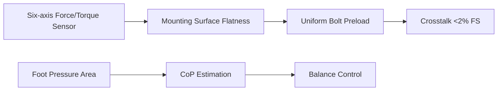

#### 9.2.12 Compliant Mechanism Engineering Implementation

Compliance cannot rely solely on control; it must be achieved through mechanical structures for reliable shock absorption and energy management. Lower limb compliant mechanisms are distributed across multiple levels: the foot, ankle, knee, and even the hip.

!!! note "Terminology Explanation: Compliant Mechanism, Spring Stiffness, Damper, Viscoelastic Material, Tendon Vibration Absorption, Energy Regeneration"
    - **Compliant Mechanism**: A mechanism that transmits force and motion through elastic deformation.
    - **Spring Stiffness**: The force required to produce a unit deformation in a spring.
    - **Damper**: A device that dissipates vibrational energy.
    - **Viscoelastic Material**: A material exhibiting both elastic and viscous dissipation properties.
    - **Tendon Vibration Absorption**: Utilizing the elasticity of tendons to absorb impact vibrations.
    - **Energy Regeneration**: The process of recovering mechanical energy and storing it as electrical energy.

**Spring Stiffness Selection**: The spring stiffness \(K_s\) of a Series Elastic Actuator (SEA) must balance force control bandwidth and energy storage. Let the equivalent stiffness on the motor-gearbox side be \(K_m\). The output stiffness is approximately:

$$
\frac{1}{K_{\text{out}}} = \frac{1}{K_m} + \frac{1}{K_s}
$$

To achieve good force control characteristics, \(K_s = (0.05\!-\!0.2) K_m\) is typically chosen. Too soft a spring reduces position stiffness and response speed; too stiff a spring negates the advantages of compliance. A typical ankle SEA spring stiffness is \(10^4\!-\!10^5\,\text{N·m/rad}\).

**Damper/Viscoelastic Material**: High-frequency components of ground impact require rapid damping for attenuation. Viscoelastic materials like polyurethane pads, Sorbothane, and silicone have loss factors \(\tan\delta\) between \(0.1\!-\!0.5\), converting a portion of impact energy into heat. Magnetorheological/electrorheological dampers offer variable damping but have significant weight and power consumption.

**Tendon Vibration Absorption**: In tendon-driven systems, a tendon of appropriate length inherently possesses elasticity, functioning similarly to an SEA. The equivalent stiffness can be adjusted by changing the tendon preload; too low a preload leads to backlash, while too high a preload eliminates the vibration absorption effect. The coupling of tendon elasticity and motor inertia can also create resonance, which must be suppressed through damping or control.

**Energy Regeneration Concept**: During walking, the supporting leg stores gravitational potential energy from heel strike to foot flat and releases it during toe-off. Theoretically, some energy can be recovered through series elastic elements and motor regenerative braking. However, actual recovery efficiency is limited by motor generation efficiency, energy storage unit power density, and conversion circuitry, and is currently mostly in the research phase.

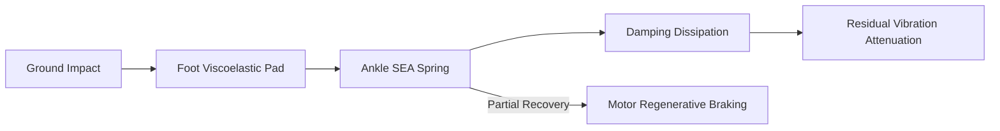


**Compliant Mechanism Design Checklist**:

| Check Item | Target | Verification Method |
|---|---|---|
| Spring Stiffness | \(K_s = 0.05\!-\!0.2 K_m\) | Torsion Test |
| Damping Ratio | \(\zeta = 0.1\!-\!0.3\) | Free Decay |
| Maximum Deformation | Not exceeding elastic limit | FEA/Test |
| Fatigue Life | \(>10^7\) cycles | Fatigue Test Bench |
| Temperature Stability | Stiffness variation \(<10\%\) within operating temperature range | High/Low Temperature Test |

**Energy Regeneration Estimation**: If the ankle SEA can store and release \(E_s = 5\,\text{J}\) of energy per step, with a walking frequency of \(1\,\text{Hz}\) and an ideal recovery efficiency of \(30\%\), the total ankle energy regeneration power is approximately \(3\,\text{W}\). This provides limited improvement to battery life but can reduce motor peak power and thermal load.

```mermaid
flowchart TD
    A["Compliant Design"] --> B["Spring Stiffness"]
    A --> C["Damping Ratio"]
    A --> D["Fatigue Life"]
    B --> E["SEA Parameters"]
    C --> F["Impact Attenuation"]
    D --> G["Maintenance Cycle"]
```

#### 9.2.13 Lower Limb Key Dimensions and Tolerances

Lower limb link lengths, joint axis offsets, and fit tolerances directly determine kinematic accuracy, assembly feasibility, and dynamic performance.

!!! note "Terminology Explanation: Link Length, Joint Axis Offset, Bearing Housing Tolerance, Coaxiality, H7/g6, Geometric Dimensioning and Tolerancing (GD&T)"
    - **Link Length**: The perpendicular distance between adjacent joint axes.
    - **Joint Axis Offset**: The positional deviation between the actual rotation axis and the nominal axis.
    - **Bearing Housing Tolerance**: The allowable variation range for the diameter of the hole in which a bearing is mounted.
    - **Coaxiality**: A geometric tolerance controlling the degree of alignment of the axes of two shafts or holes.
    - **H7/g6**: Fit designations for a hole (H7) and shaft (g6), indicating a clearance fit.
    - **Geometric Dimensioning and Tolerancing (GD&T)**: A system for controlling the allowable variation of a part's geometric features relative to their ideal shape, orientation, location, and runout.

**Typical Link Length Ranges**: For a humanoid robot with a height of 1.6–1.8 m:

| Dimension | Range | Description |
|---|---|---|
| Thigh Length \(l_{\text{thigh}}\) | 0.38–0.45 m | Hip-Knee Axis Distance |
| Shank Length \(l_{\text{shank}}\) | 0.38–0.45 m | Knee-Ankle Axis Distance |
| Foot Length | 0.22–0.28 m | Heel-Toe |
| Foot Width | 0.08–0.12 m | Affects Roll Stability |
| Hip Width | 0.16–0.22 m | Distance Between Hip Joint Axes |

**Joint Axis Offset**: The coplanarity error of the hip, knee, and ankle axes in the sagittal plane should be controlled within \(\pm 0.3\,\text{mm}\); otherwise, lateral swaying moments will occur during gait. The orthogonality between the hip yaw axis and the pitch/roll axes is recommended to be \(\le 0.05°\).

**Bearing Housing Tolerance**: Common fits for rolling bearing outer rings and housings are H7/k6 (transition fit) or H7/g6 (clearance fit for easier assembly). Common fits for joint output shafts and bearing inner rings are k6/m6 (slight interference). The cylindricity of the bearing housing bore should be \(\le 0.01\,\text{mm}\), and the coaxiality relative to the assembly datum should be \(\le 0.02\,\text{mm}\).

**Fit Example**: Installing a deep groove ball bearing 6206 in an aluminum alloy housing, with outer ring diameter \(D=62\,\text{mm}\): Select H7 (\(+0.030/0\)) for the housing bore, resulting in a slight clearance or transition fit with the outer ring; select k6 (\(+0.021/+0.002\)) for the shaft journal to ensure the inner ring rotates with the shaft.

```mermaid
flowchart TD
    A["Lower Limb Links"] --> B["Thigh L1"]
    A --> C["Shank L2"]
    A --> D["Foot L3"]
    B --> E["Hip-Knee Coaxiality ≤0.02 mm"]
    C --> E
    D --> F["Ankle-Foot Flatness ≤0.02 mm"]
    E --> G["Bearing Housing Bore H7/k6"]
```


**Example of GD&T Application in Lower Limb**: Taking the knee joint output flange as an example:

| Feature | Tolerance | Datum | Function |
|---|---|---|---|
| Flange Face Flatness | \(0.02\,\text{mm}\) | — | Mating with Shank End Face |
| Face Perpendicularity to Journal | \(0.03\,\text{mm}\) | A | Ensures Shank Axis Orthogonality |
| Journal Cylindricity | \(0.01\,\text{mm}\) | A | Bearing Fit Precision |
| Bolt Hole Position | \(\phi 0.1\,\text{mm}\) | A|B|C | Assembly Clearance |

**Tolerance Chain Example**: The coaxiality tolerance chain from the hip joint to the ankle joint includes: hip housing bearing bore coaxiality, thigh tube end flange coaxiality, knee housing coaxiality, shank tube coaxiality, and ankle housing coaxiality. If each is controlled to \(\pm 0.02\,\text{mm}\), the worst-case accumulation is \(\pm 0.10\,\text{mm}\), requiring compensation through selective assembly or adjustment shims.

```mermaid
flowchart LR
    A["Hip Housing"] -->|"±0.02"| B["Thigh Tube"]
    B -->|"±0.02"| C["Knee Housing"]
    C -->|"±0.02"| D["Shank Tube"]
    D -->|"±0.02"| E["Ankle Housing"]
    E --> F["Coaxiality Accumulation ±0.10"]
```

#### Python Example: Lower Limb Inverse Static Estimation

The following code estimates the hip, knee, and ankle pitch moments based on a simplified sagittal plane leg model and ground reaction forces.

```python
import numpy as np

# Simplified Lower Limb Inverse Dynamics Estimation (Sagittal Plane)
# Link lengths (m)
L_thigh = 0.40      # Hip-Knee
L_shank = 0.40      # Knee-Ankle
L_foot  = 0.10      # Horizontal distance from ankle to foot center

# Link masses and center of mass positions (relative to respective proximal end)
m_thigh, r_thigh = 2.5, 0.5 * L_thigh   # Thigh COM at midpoint
m_shank, r_shank = 1.8, 0.5 * L_shank   # Shank COM at midpoint
m_foot,  r_foot  = 0.8, 0.5 * L_foot    # Foot COM

# Ground reaction force (single-leg support, peak condition)
F_grf = np.array([50.0, 600.0])   # [Fx, Fz] N
r_grf_to_ankle = np.array([L_foot, 0.0])  # GRF application point relative to ankle

# Gravitational acceleration
g = np.array([0.0, -9.81])

def cross2d(r, F):
    """2D cross product r x F, returns scalar moment (positive for counterclockwise)"""
    return r[0] * F[1] - r[1] * F[0]

# Ankle moment = moment of GRF about ankle + moment of foot weight about ankle
r_foot_com = np.array([r_foot, 0.0])
tau_ankle = cross2d(r_grf_to_ankle, F_grf) + cross2d(r_foot_com, m_foot * g)

# Knee moment = ankle moment + moment of (GRF + foot weight) about knee + moment of shank weight about knee
F_below_knee = F_grf + m_foot * g
r_knee_to_ankle = np.array([0.0, -L_shank])
r_shank_com = np.array([0.0, -(L_shank - r_shank)])
tau_knee = tau_ankle + cross2d(r_knee_to_ankle, F_below_knee) + cross2d(r_shank_com, m_shank * g)

# Hip moment = knee moment + moment of (GRF + foot weight + shank weight) about hip + moment of thigh weight about hip
F_below_hip = F_below_knee + m_shank * g
r_hip_to_knee = np.array([0.0, -L_thigh])
r_thigh_com = np.array([0.0, -(L_thigh - r_thigh)])
tau_hip = tau_knee + cross2d(r_hip_to_knee, F_below_hip) + cross2d(r_thigh_com, m_thigh * g)

print(f"Ankle moment: {tau_ankle:.2f} N·m")
print(f"Knee moment: {tau_knee:.2f} N·m")
print(f"Hip moment: {tau_hip:.2f} N·m")

# Brief sensitivity: varying GRF vertical component
Fzs = np.linspace(300, 900, 7)
for fz in Fzs:
    F = np.array([50.0, fz])
    ta = cross2d(r_grf_to_ankle, F) + cross2d(r_foot_com, m_foot * g)
    tk = ta + cross2d(r_knee_to_ankle, F + m_foot * g) + cross2d(r_shank_com, m_shank * g)
    th = tk + cross2d(r_hip_to_knee, F + (m_foot + m_shank) * g) + cross2d(r_thigh_com, m_thigh * g)
    print(f"Fz={fz:4.0f}N  -> Hip={th:7.2f} Knee={tk:7.2f} Ankle={ta:7.2f} N·m")
```

This example shows that hip/knee/ankle moments are approximately linearly correlated with the vertical component of the ground reaction force, and the hip moment is the highest due to the largest moment arm; in actual design, dynamic inertia terms and safety factors must also be considered.

---

## 9.3 Upper Limb and Arm Subsystem Design

### 9.3.1 Upper Limb Kinematic Chain: Functional Allocation of Shoulder, Elbow, and Wrist

Humanoid robot arms typically mimic the human upper limb, consisting of the shoulder, elbow, and wrist, to perform tasks such as reaching, carrying, assembling, and operating tools. The shoulder joint often adopts a 3-DOF orthogonal layout (similar to a ball joint), the elbow joint primarily provides 1-DOF flexion/extension, and the wrist joint offers 2–3 DOF to adjust the end-effector orientation.

!!! note "Terminology: Shoulder Joint, Elbow Joint, Wrist Joint, Extension, Flexion, Pronation/Supination"
    - **Shoulder joint**: The joint connecting the torso and upper arm, typically multi-degree-of-freedom.
    - **Elbow joint**: The joint connecting the upper arm and forearm, primarily achieving flexion/extension.
    - **Wrist joint**: The joint connecting the forearm and hand, adjusting end-effector orientation.
    - **Extension**: The movement of a joint returning from a flexed position to a straight position.
    - **Pronation/Supination**: Rotation of the forearm about its longitudinal axis.

!!! note "Terminology: Anthropometry, Anthropometric Percentile, Reach Envelope, Functional Dimension"
    - **Anthropometry**: The science of measuring human body dimensions, shape, and strength.
    - **Anthropometric percentile**: The proportion of a population with a certain dimension less than a given value; e.g., the 50th percentile represents the average.
    - **Reach envelope**: The spatial boundary reachable by a limb endpoint within the full range of joint motion.
    - **Functional dimension**: The dimensions of a human or mechanism required to perform a specific task.

Upper limb DOF configuration:

| Joint | DOF | Motion Description | Typical Range |
|---|---|---|---|
| Shoulder | 3 | Flexion/Extension, Abduction/Adduction, Internal/External Rotation | ±180°/±90°/±90° |
| Elbow | 1 | Flexion/Extension | 0–135° |
| Wrist | 2–3 | Pitch, Roll, (Yaw) | ±45°/±45°/(±90°) |

```mermaid
flowchart LR
    A["Torso"] -->|"Shoulder 3-DOF"| B["Upper Arm"]
    B -->|"Elbow 1-DOF"| C["Forearm"]
    C -->|"Wrist 2-3 DOF"| D["Hand/End-Effector"]
```

### 9.3.2 Arm Length, Workspace, and Human-Machine Size Matching

Arm length determines the robot's reachable range. Design should reference anthropometric percentile data to enable the robot to reach common human operational spaces (e.g., desktops, shelves, door handles). Typical humanoid robot arm length (shoulder to wrist) is 0.55–0.75 m.

!!! note "Terminology: Arm Length, Workspace, Reach Envelope, Anthropometric Percentile, Manipulation Workspace"
    - **Arm length**: Typically the straight-line distance from shoulder to wrist or shoulder to fingertip.
    - **Reach envelope**: The spatial region reachable by the arm endpoint.
    - **Anthropometric percentile**: A position in the statistical distribution of human body dimensions; e.g., the 50th percentile represents the average.
    - **Manipulation workspace**: The three-dimensional space required to perform typical tasks.

Arm length \(L_{arm}\) and workspace volume approximately satisfy:

$$
V_{ws} \propto L_{arm}^3
$$

However, excessively long arms increase inertia, reduce stiffness, and raise torque requirements on the shoulder/torso. Design requires trade-offs:

| Indicator | Advantage of Long Arm | Disadvantage of Long Arm |
|---|---|---|
| Reachable Range | Large | Increased inertia |
| Load Capacity | Large moment arm | Decreased structural stiffness |
| Control Bandwidth | — | Reduced |
| Human-Robot Safety | — | High collision kinetic energy |

```mermaid
flowchart TD
    A["Arm Length Selection"] --> B["Human Body 50th Percentile"]
    A --> C["Task Space Requirements"]
    A --> D["Whole-Body Inertia Constraints"]
    B --> E["Target Arm Length"]
    C --> E
    D --> E
```

### 9.3.3 Stiffness Design: Links, Joints, and End-Effector Deformation

Arm stiffness affects positioning accuracy, dynamic response, and contact stability. Overall stiffness can be modeled as series springs:

$$
\frac{1}{K_{total}} = \frac{1}{K_{link}} + \frac{1}{K_{joint}} + \frac{1}{K_{drive}}
$$

where \(K_{link}\), \(K_{joint}\), and \(K_{drive}\) are the stiffness of the links, joint structure, and drive system, respectively.

!!! note "Terminology: Stiffness, Compliance, Deformation, Positioning Accuracy, Drive Stiffness"
    - **Stiffness**: The force or torque required to produce a unit deformation.
    - **Compliance**: The reciprocal of stiffness.
    - **Deformation**: Geometric displacement under external force.
    - **Positioning accuracy**: The degree to which the actual position matches the target position.
    - **Drive stiffness**: The torsional stiffness of the reducer and joint output under load.

Measures to increase stiffness:

1. **Links**: Use box-section profiles, carbon fiber tubes, increase cross-sectional moment of inertia.
2. **Joints**: Preload bearings, increase housing wall thickness, optimize bolt arrangement.
3. **Drives**: Select high-stiffness reducers (e.g., planetary, harmonic, RV), reduce backlash.

```mermaid
flowchart TD
    A["Insufficient End-Effector Stiffness"] --> B["Positioning Error"]
    A --> C["Vibration/Residual Oscillation"]
    A --> D["Unstable Contact"]
    E["Increase Link Stiffness"] --> F["Improve K_total"]
    G["Increase Joint/Drive Stiffness"] --> F
```

### 9.3.4 7-DOF Arm: Redundancy and Manipulability

A 7-DOF arm has one degree of redundancy beyond the 6-DOF Cartesian task, allowing optimization of elbow position, obstacle avoidance, singularity avoidance, and reduction of joint torques while maintaining end-effector pose. Robots such as NASA Valkyrie, TALOS, and Optimus use 7-DOF arms.

!!! note "Terminology: Redundancy, Null Space, Manipulability, Jacobian, Force Ellipsoid"
    - **Redundancy**: The number of joints exceeds the degrees of freedom required to complete a task.
    - **Null space**: Joint motion directions that do not change the end-effector task performance.
    - **Manipulability**: Defined by Yoshikawa, a measure of the end-effector's velocity/force transmission capability.
    - **Jacobian**: The linear mapping matrix from joint velocities to end-effector velocities.
    - **Force ellipsoid**: A description of the directions in which the end-effector can output force.

Manipulability measure:

$$
w = \sqrt{\det(\mathbf{J}\mathbf{J}^T)}
$$

where \(\mathbf{J}\) is the arm Jacobian matrix. A larger \(w\) indicates a more balanced motion/force transmission capability of the arm in that configuration.

### 9.3.5 Python Example 2: 7-DOF Arm Workspace and Manipulability

The following example performs Monte Carlo sampling for a 7-DOF arm, calculating the end-effector position cloud and manipulability distribution.

```python
import numpy as np
import matplotlib.pyplot as plt
from mpl_toolkits.mplot3d import Axes3D

# 7-DOF Arm Workspace and Manipulability Ellipsoid
# Using simplified DH parameters: Shoulder 3 + Elbow 1 + Wrist 3
# Link lengths (m)
a = [0.0, 0.0, 0.0, 0.30, 0.0, 0.0, 0.0]   # Link lengths
 d = [0.15, 0.0, 0.0, 0.0, 0.25, 0.0, 0.08]  # Link offsets
alpha = [-np.pi/2, np.pi/2, -np.pi/2, 0, -np.pi/2, np.pi/2, 0]

# Standard DH homogeneous transformation
def dh_transform(theta, d, a, alpha):
    ct, st = np.cos(theta), np.sin(theta)
    ca, sa = np.cos(alpha), np.sin(alpha)
    return np.array([
        [ct, -st*ca,  st*sa, a*ct],
        [st,  ct*ca, -ct*sa, a*st],
        [0,   sa,     ca,    d   ],
        [0,   0,      0,     1   ]
    ])

# Joint limits (rad)
qlim = [
    (-np.pi, np.pi),
    (-np.pi/2, np.pi/2),
    (-np.pi/3, np.pi/3),
    (0, 2*np.pi/3),
    (-np.pi/2, np.pi/2),
    (-np.pi/2, np.pi/2),
    (-np.pi, np.pi),
]
```

# Geometric Jacobian
```python
def geometric_jacobian(q):
    T = np.eye(4)
    Ts = [T]
    for i in range(7):
        T = T @ dh_transform(q[i], d[i], a[i], alpha[i])
        Ts.append(T)
    pe = Ts[-1][:3, 3]
    J = np.zeros((6, 7))
    for i in range(7):
        z_i = Ts[i][:3, 2]
        o_i = Ts[i][:3, 3]
        J[:3, i] = np.cross(z_i, pe - o_i)
        J[3:, i] = z_i
    return J

N = 40000
points = np.zeros((N, 3))
manip = np.zeros(N)
np.random.seed(7)
for k in range(N):
    q = np.array([np.random.uniform(lo, hi) for lo, hi in qlim])
    T = np.eye(4)
    for i in range(7):
        T = T @ dh_transform(q[i], d[i], a[i], alpha[i])
    points[k] = T[:3, 3]
    J = geometric_jacobian(q)
    # The 3x3 sub-block of the position Jacobian is used for position manipulability
    Jp = J[:3, :]
    manip[k] = np.sqrt(max(np.linalg.det(Jp @ Jp.T), 0))

fig = plt.figure(figsize=(12,5))
ax1 = fig.add_subplot(121, projection='3d')
sc = ax1.scatter(points[:,0], points[:,1], points[:,2], c=manip, s=1, cmap='viridis', alpha=0.5)
ax1.set_xlabel('x'); ax1.set_ylabel('y'); ax1.set_zlabel('z')
ax1.set_title('7-DOF Arm Workspace and Manipulability')
fig.colorbar(sc, ax=ax1, shrink=0.5, label='sqrt(det(J J^T))')

ax2 = fig.add_subplot(122)
ax2.hist(manip, bins=50, color='steelblue', edgecolor='k', alpha=0.7)
ax2.set_xlabel('Manipulability Measure'); ax2.set_ylabel('Frequency')
ax2.set_title('Manipulability Distribution')
plt.tight_layout(); plt.savefig('arm_workspace_ch9.png', dpi=150)
print(f"Number of samples: {N}")
print(f"Average manipulability: {manip.mean():.4f}")
```

!!! note "Terminology Explanation: Monte Carlo Workspace, Cartesian Space, Configuration Space, Velocity Ellipsoid"
    - **Configuration space**: The space spanned by all joint variables.
    - **Cartesian space**: The space spanned by the end-effector position and orientation.
    - **Velocity ellipsoid**: Describes the end-effector velocity capability via Jacobian singular values.

```mermaid
flowchart TD
    A["7-DOF Joint Angles"] --> B["Forward Kinematics"]
    B --> C["End-Effector Position"]
    A --> D["Jacobian J"]
    D --> E["Manipulability w=sqrt(det(JJ^T))"]
    C --> F["Workspace Point Cloud"]
    E --> G["Configuration Quality Assessment"]
```

### 9.3.6 Arm Wiring: Cables, Hoses, and Maintainability

Inside the arm, motor power cables, encoder signal wires, torque sensor wires, communication lines, and possibly pneumatic or hydraulic tubes must be routed. Wiring design must avoid the following issues:

!!! note "Terminology Explanation: Cable Life, Bend Radius, Fatigue, Stress Concentration, Wire Harness"
    - **Cable life**: The ability to maintain electrical performance under a specified number of bending cycles.
    - **Bend radius**: The minimum radius at which a cable can be safely bent.
    - **Fatigue**: The gradual failure of a material or structure under cyclic loading.
    - **Stress concentration**: A significant local increase in stress at geometric discontinuities.
    - **Wire harness**: A collection of multiple cables bundled together along a path.

Wiring principles:

1. **Separation of fixed and floating ends**: Cables are fixed in the middle of the link, leaving bending allowance at the joints.
2. **Avoid twisting**: Use slip rings or limit the continuous rotation angle of the joint.
3. **Bend radius control**: Typically ≥ 8–10 times the cable outer diameter.
4. **Abrasion resistance and sheathing**: Use PTFE/polyurethane sheaths, corrugated tubes, or cable carriers.
5. **Maintainability**: Concentrate connectors at the arm base or shoulder for easy replacement.

```mermaid
flowchart LR
    A["Shoulder Connector"] -->|"Wire harness passes through shoulder joint"| B["Elbow Connector"]
    B -->|"Wire harness passes through elbow joint"| C["Wrist/Hand Connector"]
    C --> D["Finger Actuator/Sensor"]
```

### 9.3.7 Summary of Upper Limb Design Key Points

| Indicator | Key Parameters | Verification Method |
|---|---|---|
| Reachability | Arm length, joint range | Workspace measurement |
| Payload | Joint torque, structural strength | Static/fatigue test |
| Accuracy | Link/joint stiffness, backlash | Repeatability positioning test |
| Dexterity | 7-DOF redundancy, wrist range | Manipulation task test |
| Reliability | Cable life, sealing | Bending/life test bench |
| Safety | Collision force, pinch points | Force limit/safety test |

#### 9.3.8 Detailed Design of the Shoulder Joint

The shoulder joint is one of the most complex joints in the upper limb. It must achieve 3-DOF orthogonal motion within a compact space while supporting the entire arm mass and operational loads. A typical layout consists of three nested layers: shoulder roll (around the torso's anterior-posterior axis), shoulder pitch (around the torso's left-right axis), and shoulder yaw (around the upper arm's longitudinal axis).

!!! note "Terminology Explanation: Shoulder Joint, 3-DOF Orthogonal Axes, Hollow Shaft, Angular Contact Bearing, Paired Preload, Housing Wall Thickness, Rib"
    - **Shoulder joint**: A multi-degree-of-freedom joint connecting the torso and upper arm.
    - **3-DOF orthogonal axes**: Three mutually perpendicular rotational axes.
    - **Hollow shaft**: A rotating shaft with a central bore, used for passing cables or tubes.
    - **Angular contact bearing**: A rolling-element bearing capable of supporting both radial and axial loads.
    - **Paired preload**: Installing two angular contact bearings in a specific arrangement with preload to increase stiffness.
    - **Housing wall thickness**: The thickness of the joint housing wall.
    - **Rib**: A locally thickened structure to increase stiffness.

**3-DOF orthogonal axis layout**: The first axis (shoulder roll) is typically parallel to the torso's anterior-posterior direction. The second axis (shoulder pitch) is perpendicular to the shoulder roll and located at its output. The third axis (shoulder yaw/upper arm rotation) is nested in the outermost layer. The three axes should ideally intersect at a single point to simplify kinematics; the actual intersection error is recommended to be \(<2\,\text{mm}\).

**Hollow shaft routing**: Motor power cables, encoder wires, torque sensor wires, and communication lines must pass through the shoulder joint. The inner diameter of the hollow shaft is typically \(>15\,\text{mm}\), with a margin of over \(30\%\). Cables should use PTFE sheaths or flexible flat cables to avoid friction with the rotating shaft. If continuous rotation is required, a slip ring should be installed at one layer, or the continuous rotation angle should be limited.

**Angular contact bearing paired preload**: The shoulder yaw shaft bears bending moments and axial forces. Two angular contact bearings are commonly installed back-to-back (DB) or face-to-face (DF) with preload. The preload magnitude is usually based on the bearing manufacturer's recommendation to eliminate axial clearance and increase stiffness. Excessive preload can cause frictional heating and reduced life; insufficient preload fails to eliminate clearance. Under light preload, axial stiffness is approximately \(1.5\!-\!2.5\) times that without preload.

**Housing wall thickness and ribs**: The wall thickness of an aluminum shoulder housing is typically \(4\!-\!8\,\text{mm}\), locally thickened to \(10\!-\!15\,\text{mm}\) in the bearing seat area. The rib height is recommended to be \(2\!-\!4\) times the wall thickness, and the rib thickness \(0.6\!-\!0.8\) times the wall thickness, arranged along the principal stress path.

```mermaid
flowchart TD
    A["Shoulder 3-DOF"] --> B["Shoulder Roll Axis"]
    B --> C["Shoulder Pitch Axis"]
    C --> D["Shoulder Yaw Axis"]
    D --> E["Hollow Shaft Routing"]
    E --> F["Angular Contact Bearing DB Preload"]
    F --> G["Housing Wall Thickness + Ribs"]
```

**Shoulder Joint Dynamic Load**: When the arm is extended and holding a \(5\,\text{kg}\) load, the torque that the shoulder joint must withstand is approximately:

$$
\tau_{\text{shoulder}} \approx m_{\text{arm}} g \cdot r_{\text{arm}} + m_{\text{payload}} g \cdot L_{\text{arm}}
$$

If \(m_{\text{arm}}=4\,\text{kg}\), \(r_{\text{arm}}=0.25\,\text{m}\), \(m_{\text{payload}}=5\,\text{kg}\), \(L_{\text{arm}}=0.6\,\text{m}\), then:

$$
\tau_{\text{shoulder}} \approx 4\times9.81\times0.25 + 5\times9.81\times0.6 \approx 10 + 29 = 39\,\text{N·m}
$$

Considering a dynamic acceleration of \(2g\) and a safety factor of \(1.5\), the target peak torque for shoulder pitch is approximately \(120\,\text{N·m}\).

**Shoulder Housing Material Selection**: High-strength aluminum alloy 7075-T6 has a yield strength of approximately \(503\,\text{MPa}\), suitable for the shoulder housing; if higher stiffness is required, titanium alloy Ti-6Al-4V or magnesium alloy AZ91D (lighter but with lower stiffness) can be used.

```mermaid
flowchart TD
    A["Shoulder Load"] --> B["Arm Self-Weight + Load"]
    B --> C["Dynamic Factor 2g"]
    C --> D["Safety Factor 1.5"]
    D --> E["Peak Torque Target"]
    E --> F["Material/Structure Selection"]
```

#### 9.3.9 Detailed Design of Elbow and Wrist

The elbow joint connects the upper arm and forearm, primarily achieving flexion and extension; the wrist joint adjusts the end-effector orientation, typically providing pitch/roll/yaw.

!!! note "Terminology Explanation: Elbow Offset, Wrist Joint, Compact Harmonic Drive, Cycloidal Drive, Bearing Life, Output Flange"
    - **Elbow Offset**: The lateral offset of the elbow joint axis relative to the centerline of the upper arm.
    - **Wrist Joint**: The joint connecting the forearm and hand, adjusting the end-effector orientation.
    - **Compact Harmonic Drive**: A harmonic drive with small volume and high reduction ratio.
    - **Cycloidal Drive**: A reducer utilizing cycloidal tooth profiles to achieve a high reduction ratio.
    - **Bearing Life**: The duration or number of revolutions a bearing can operate under rated conditions.
    - **Output Flange**: The output connection plate of a reducer or joint.

**Elbow Offset**: To avoid the envelope of the upper arm motor and to make the arm shape closer to a human's, the elbow axis is often offset by \(20\!-\!40\,\text{mm}\) relative to the upper arm centerline. This offset introduces an additional moment on the shoulder joint from the forearm mass, which must be compensated for in the overall dynamics.

**Wrist Pitch/Roll/Yaw Axis Layout**: Two common layouts for the wrist:
1. **Orthogonal Wrist**: Three axes intersect and are mutually perpendicular, providing kinematic decoupling, similar to an industrial robot wrist.
2. **Non-Orthogonal Wrist**: To reduce volume, the three axes may not fully intersect or the angles may deviate slightly from 90°, requiring compensation via the Jacobian.

**Compact Harmonic or Cycloidal Drive**: Space in the wrist is extremely limited. Cup-type harmonic drives (outer diameter 30–60 mm, reduction ratio 50–100) or micro-cycloidal drives are commonly used. The output end uses a crossed roller bearing to withstand the end-effector load torque. Wrist motors can be frameless torque motors or framed hollow-shaft motors to maximize the hollow space for cable routing.

**Bearing Life Verification**: The equivalent dynamic load for wrist joint bearings is typically determined by the end-effector force \(F_{\text{end}}\) and the moment arm \(L\):

$$
P = X F_r + Y F_a
$$

Where \(F_r\) and \(F_a\) are the radial and axial loads, and \(X\) and \(Y\) are bearing coefficients. The target life \(L_{10h}\) (hours) and rotational speed \(n\) (rpm) satisfy:

$$
L_{10h} = \frac{10^6}{60 n} \left(\frac{C}{P}\right)^{\epsilon}
$$

The target life for wrist joints is typically \(>10{,}000\) hours.

```mermaid
flowchart LR
    A["Elbow Joint"] -->|"Offset"| B["Flexion/Extension 0-135°"]
    B --> C["Wrist Pitch"]
    C --> D["Wrist Roll"]
    D --> E["Wrist Yaw"]
    E --> F["Compact Harmonic/Cycloidal"]
    F --> G["Crossed Roller Bearing"]
```

**Wrist Compactness Design**: The outer diameter of the wrist is typically limited to within \(60\!-\!90\,\text{mm}\). Taking the harmonic drive SHF-14 (outer diameter approx. 50 mm, reduction ratio 50) as an example, its rated torque is about \(40\,\text{N·m}\), and peak torque is about \(100\,\text{N·m}\), suitable for small to medium-sized wrist joints. If higher torque is required, the SHF-17 or a cycloidal drive can be used.

**Wrist Cable Routing**: When the three wrist axes are stacked, cables must pass sequentially through the yaw, roll, and pitch axes. The inner diameter of each hollow shaft should be at least \(30\%\) larger than the cable bundle, and rotary seals or cable guides should be installed at the shaft ends. The bending radius of wrist cables should be \(\ge 30\,\text{mm}\).

```mermaid
flowchart LR
    A["Wrist Constraints"] --> B["Outer Diameter 60-90 mm"]
    B --> C["Harmonic SHF-14/17"]
    C --> D["Torque 40-100 N·m"]
    D --> E["Three-Axis Hollow Routing"]
```

#### 9.3.10 Link Structure Design

Arm links must provide sufficient bending and torsional stiffness while being lightweight. Common cross-sectional forms include circular tubes, square tubes, and box beams.

!!! note "Terminology Explanation: Circular Tube, Square Tube, Box Beam, Wall Thickness Estimation, Flange, Bolt Group, Stiffness-to-Weight Ratio"
    - **Circular Tube**: A hollow rod with a circular cross-section.
    - **Square Tube**: A hollow rod with a rectangular cross-section.
    - **Box Beam**: A closed rectangular cross-section beam formed by surrounding wall plates.
    - **Wall Thickness Estimation**: Estimating the tube wall thickness based on load and stiffness requirements.
    - **Flange**: A disc-shaped structure with holes used to connect two parts.
    - **Bolt Group**: A connection where multiple bolts share the load.
    - **Stiffness-to-Weight Ratio**: The ratio of structural stiffness to mass.

**Circular Tube vs. Square Tube/Box Beam**:
- Circular Tube: Good isotropic bending stiffness, excellent torsional stiffness, suitable for multi-directional loads; but requires machining flat surfaces or flanges for connection to other parts.
- Square Tube/Box Beam: Convenient for mounting flat surfaces, flanges, and covers; high bending stiffness in the strong axis direction; closed box beams have significantly higher torsional stiffness than open sections.

**Wall Thickness Estimation**: For a rectangular cross-section cantilever beam, the end deflection is:

$$
\delta = \frac{F L^3}{3 E I}, \quad I = \frac{b h^3 - (b-2t)(h-2t)^3}{12}
$$

Given the target deflection \(\delta_{\text{max}}\), the wall thickness \(t\) can be back-calculated. Typical wall thickness for aluminum alloy arm links is \(2\!-\!5\,\text{mm}\); for carbon fiber tubes, it is \(1.5\!-\!3\,\text{mm}\).

**Flange Design**: Flange thickness is typically \(1.0\!-\!1.5\) times the bolt diameter, and the bolt circle diameter is \(0.7\!-\!0.85\) times the flange outer diameter. Fillets (\(R\ge 3\,\text{mm}\)) should be provided at the transition between the flange and the tube body to reduce stress concentration.

**Bolt Group Loading**: When a flange is subjected to a bending moment \(M\), the outermost bolt experiences the maximum tensile force:

$$
F_{b,\max} = \frac{M \cdot r_{\max}}{\sum r_i^2}
$$

Where \(r_i\) is the distance from each bolt to the flange center. The bolt preload should be greater than the maximum working tensile force and include a safety factor of \(1.5\!-\!2.5\).

**Stiffness/Weight Ratio Optimization**: Under bending stiffness constraints, increasing the cross-section height is more effective than increasing the wall thickness. Therefore, designs with large cross-sections and thin walls are preferred, and local stability can be enhanced through internal ribs or foam filling.

```mermaid
flowchart TD
    A["Link Cross-Section"] --> B["Circular Tube"]
    A --> C["Square Tube"]
    A --> D["Box Beam"]
    B --> E["Isotropic/Good Torsion"]
    C --> F["Easy Mounting"]
    D --> G["High Torsional Stiffness"]
    G --> H["Wall Thickness t Estimation"]
    H --> I["Flange + Bolt Group"]
```

**Local Buckling Verification of Tube Wall**: When a thin-walled circular tube is subjected to axial compression, in addition to global Euler buckling, local buckling may also occur. The critical stress for local buckling is:

$$
\sigma_{cr,local} \approx 0.605 \frac{E t}{R}
$$

Where \(R\) is the mean radius of the tube, and \(t\) is the wall thickness. The design should ensure \(\sigma_{cr,local} > \sigma_{cr,global}\), or at least higher than the working stress.

**Estimation of Flange Bolt Count**: Assume the flange is subjected to bending moment \(M\), the bolt arrangement circle radius is \(R_b\), and the number of bolts is \(n\). The maximum tensile force on a single bolt is:

$$
F_b = \frac{2 M}{n R_b}
$$

For \(n=6\), \(R_b=40\,\text{mm}\), \(M=100\,\text{N·m}\), \(F_b = 833\,\text{N}\), which is far less than the allowable preload of an M6 bolt, so the design is safe.

```mermaid
flowchart TD
    A["Thin-walled tube"] --> B["Global Euler buckling"]
    A --> C["Local buckling"]
    B --> D["Slenderness ratio control"]
    C --> E["t/R control"]
    E --> F["Typically t/R > 1/30"]
```

#### 9.3.11 Arm Cable Management Engineering

Arm cables must maintain reliability during multi-degree-of-freedom motion and are one of the subsystems with a higher failure rate in humanoid robots.

!!! note "Terminology Explanation: Cable Management, Cable Carrier, Rotary Joint, Flexible PCB, Bend Radius, Shielding, Grounding"
    - **Cable Management**: The design for arranging, fixing, and protecting internal cables within a robot.
    - **Cable Carrier**: A chain-like sheath that bends with motion and protects cables.
    - **Rotary Joint/Slip Ring**: An electrical connection device that allows continuous rotation.
    - **Flexible PCB (FPC)**: A bendable printed circuit board.
    - **Bend Radius**: The minimum radius a cable can be safely bent.
    - **Shielding**: Using a conductive layer to isolate electromagnetic interference.
    - **Grounding**: Connecting a circuit or shield layer to a common reference potential.

**Hollow Shaft Routing**: If joints like the shoulder or wrist use hollow motors or hollow reducers, cables can pass through the shaft center. The inner diameter of the hollow shaft should be \(1.5\!-\!2.0\) times the maximum outer diameter of the cable bundle, and a sheath should be installed at the exit to prevent wear.

**Cable Carrier**: For external routing, such as at the elbow joint, micro cable carriers can be used. The bend radius of the cable carrier should be at least 1.5 times the minimum bend radius of the cable. For high-speed reciprocating motion (>1 Hz), the cable carrier life should be selected for \(>10^7\) cycles.

**Rotary Joint**: If the shoulder or wrist joint requires continuous rotation exceeding \(\pm 360°\), a slip ring or wireless power/communication solution should be used. The contact resistance fluctuation of the slip ring should be \(<10\,\text{m}\Omega\), and its life should be \(>10^7\) revolutions.

**Flexible PCB**: For sensors in the fingers and hand, FPCs can be used, with a thickness of \(0.1\!-\!0.3\,\text{mm}\) and a bend radius as low as \(1\,\text{mm}\). FPCs should avoid placing vias and pads in bending zones and should include stress relief bends.

**Bend Radius and Fixation**: The minimum bend radius for power cables is typically \(6\!-\!10\) times the outer diameter; for encoder/differential signal cables, it is \(8\!-\!15\) times. Cable bundles should be fixed with cable ties or clamps every \(80\!-\!150\,\text{mm}\), leaving \(10\!-\!20\,\text{mm}\) of slack at joints.

**Shielding and Grounding**: Motor power cables and signal cables should be routed in separate bundles with a spacing of \(>50\,\text{mm}\); signal cables should use twisted shielded pairs, with the shield grounded at a single point on the controller side. High-frequency communication cables (e.g., EtherCAT, GigE Vision) should use shielded twisted pair or coaxial cables.

```mermaid
flowchart LR
    A["Shoulder connector"] -->|"Hollow shaft"| B["Elbow"]
    B -->|"Cable carrier/sheath"| C["Wrist"]
    C -->|"FPC"| D["Finger sensors"]
    E["Shielded twisted pair"] --> A
    F["Single-point grounding"] --> E
```


**Cable Fatigue Life Estimation**: Cables bend repeatedly at joints, and their life can be characterized by the bend radius and number of bending cycles. Generally, flexible cable manufacturers provide the rated number of cycles at the minimum bend radius. Actual life increases exponentially with a larger bend radius:

$$
N_{\text{life}} \propto \left(\frac{R_{\text{bend}}}{R_{\text{min}}}\right)^m
$$

Where \(m\approx 2\!-\!4\). If the rated life is \(10^6\) cycles at a minimum bend radius \(R_{\text{min}}=30\,\text{mm}\), then at an actual bend radius of \(60\,\text{mm}\), the life can increase to \(4\!-\!16\times10^6\) cycles.

**Electromagnetic Compatibility Zoning**: It is recommended to divide the space inside the arm into:
1. High-voltage power zone (motor phase lines, \(>48\,\text{V}\))
2. Low-voltage signal zone (encoders, torque sensors)
3. Communication zone (EtherCAT, CAN)

Maintain a minimum spacing of \(30\,\text{mm}\) between zones, or install grounded metal partitions.

```mermaid
flowchart LR
    A["Cable bend radius↑"] --> B["Fatigue life↑"]
    C["Power/signal zoning"] --> D["Spacing/shielding"]
    D --> E["EMC compliance"]
```

#### 9.3.12 Upper Limb GD&T Example

Using the shoulder joint output flange as an example, explain the engineering meaning of geometric tolerance specifications.

!!! note "Terminology Explanation: GD&T, Flatness, Perpendicularity, Coaxiality, Position, Datum, Maximum Material Requirement"
    - **GD&T (Geometric Dimensioning and Tolerancing)**: A system for specifying geometric dimensions and tolerances.
    - **Flatness**: The allowable variation of an actual surface from an ideal plane.
    - **Perpendicularity**: The allowable variation of an actual feature from being perpendicular to a datum.
    - **Coaxiality**: The allowable variation of two axes coinciding.
    - **Position**: The allowable variation of an actual feature from its ideal location.
    - **Datum**: An ideal feature used to establish a tolerance reference.
    - **Maximum Material Requirement (MMR)**: A tolerance compensation principle related to the maximum material condition.

**Example Flange GD&T Requirements**:

| Geometric Feature | Tolerance | Datum | Description |
|---|---|---|---|
| Flange face flatness | \(0.02\,\text{mm}\) | — | Ensure fit with mating surface, avoid local gaps |
| Face perpendicularity to bearing housing axis | \(0.03\,\text{mm}\) | A (Bearing housing axis) | Ensure output shaft is orthogonal to link axis |
| Output journal coaxiality | \(\phi 0.015\,\text{mm}\) | A | Ensure shaft is coaxial with housing bearing bore |
| Bolt hole position | \(\phi 0.1\,\text{mm}\) | A\|B\|C | Ensure smooth bolt assembly, MMR applicable |
| Flange outer diameter cylindricity | \(0.02\,\text{mm}\) | A | Ensure uniform rotational clearance |

When specifying, bearing housing axis A is established by the two bearing bores (axis of the maximum inscribed cylinder), and faces B and C are auxiliary locating datums. Using MMR for bolt hole position allows additional tolerance compensation when the hole deviates from its maximum material condition, reducing manufacturing cost without affecting assembly function.

```mermaid
flowchart TD
    A["Flange face"] -->|"Flatness 0.02"| B["Sealing fit"]
    A -->|"Perpendicularity 0.03@A"| C["Shaft orthogonality"]
    D["Output journal"] -->|"Coaxiality φ0.015@A"| E["Bearing coaxiality"]
    F["Bolt hole"] -->|"Position φ0.1@A|B|C"| G["Assembly clearance"]
```


**GD&T and Functional Relationship**:

| GD&T Item | Functional Impact | Common Inspection Tool |
|---|---|---|
| Flatness | Sealing, contact stiffness | Precision straight edge/feeler gauge |
| Perpendicularity | Shaft orthogonality, load transfer | Square/CMM |
| Coaxiality | Bearing life, friction | V-block/coaxiality gauge |
| Position | Assembly feasibility | Inspection pin/CMM |
| Cylindricity | Bearing fit tightness | Roundness gauge |

**Application of Maximum Material Requirement**: When MMR is applied to bolt hole position, if the hole is machined to its maximum material condition (smallest diameter), the allowed position tolerance is smallest; if the hole diameter is larger than the least material condition, additional position tolerance compensation is gained. This reduces the requirement for hole diameter accuracy while ensuring the bolt passes through.

```mermaid
flowchart TD
    A["GD&T specification"] --> B["Flatness/Perpendicularity"]
    A --> C["Coaxiality/Position"]
    B --> D["Functional assurance"]
    C --> E["Assembly feasibility"]
    E --> F["MMR compensation"]
```

#### Python Example: Bolt Connection Preload and Separation Check

The following code calculates the required bolt preload and tightening torque under a given working load and checks if the joint surfaces separate.

```python
import numpy as np

# Bolt connection preload and separation check
F_external = 8000.0      # Working tensile force N
T_bolt = 0.1             # Bolt tensile stiffness coefficient (EA/L) relative value
T_member = 0.4           # Member compressive stiffness coefficient relative value
# Stiffness ratio C = kb / (kb + km)
C = T_bolt / (T_bolt + T_member)
```

# Requirement: Residual pressure at joint surface > 0 (no separation), safety factor 1.2
F_preload_min = F_external * (1 - C) * 1.2
print(f"Required minimum preload: {F_preload_min:.1f} N")

# Maximum bolt tensile force = preload + additional tensile force caused by external load
F_bolt_max = F_preload_min + C * F_external
print(f"Maximum bolt working tensile force: {F_bolt_max:.1f} N")

# M8 grade 10.9 bolt parameters (engineering estimation)
d = 8.0e-3               # Nominal diameter m
A_s = 36.6e-6            # Stress area m^2
sigma_y = 900e6          # Yield strength Pa (grade 10.9)
# Allowable preload (at 70% yield)
F_preload_allow = 0.7 * sigma_y * A_s
print(f"M8 grade 10.9 allowable preload (70% yield): {F_preload_allow:.1f} N")

# Tightening torque T = K * Fp * d, K taken as 0.20
K_torque = 0.20
T_required = K_torque * F_preload_min * d
print(f"Required tightening torque: {T_required:.3f} N·m")

# Check
if F_preload_min <= F_preload_allow:
    print("Preload meets requirements")
else:
    print("Warning: Preload exceeds bolt allowable value, need to select a larger specification or higher grade bolt")

# Residual pressure at joint surface (assuming contact area A_c)
A_c = 0.002              # Contact area m^2
p_residual = (F_preload_min - F_external * (1 - C)) / A_c
print(f"Residual compressive stress at joint surface: {p_residual/1e3:.2f} kPa")
```

This example embodies the core idea of VDI 2230: bolt preload not only needs to resist the working load but also must ensure the joint surface does not separate; at the same time, the preload is limited by the bolt strength.


#### Python Example: Bearing Life L10 Calculation

The following code selects the required dynamic load rating of a rolling bearing based on load, speed, and life requirements.

```python
import numpy as np

# Bearing life L10 calculation (roller bearing epsilon=10/3, ball bearing epsilon=3)
P = 2500.0          # Equivalent dynamic load N
n = 1500.0          # Rotational speed rpm
L10h_target = 20000 # Target rated life h

epsilon = 10/3      # Roller bearing

# L10 (rev) = 60 * n * L10h
L10_rev = 60 * n * L10h_target

# Required dynamic load rating C
C_required = P * (L10_rev / 1e6)**(1/epsilon)
print(f"Target life L10h={L10h_target} h")
print(f"Corresponding revolutions L10={L10_rev:.2e} rev")
print(f"Required dynamic load rating C >= {C_required:.1f} N")

# Optional: Calculate actual life based on selected bearing C
C_catalog = 32000.0   # Dynamic load rating of a certain bearing model N
L10_rev_actual = 1e6 * (C_catalog / P)**epsilon
L10h_actual = L10_rev_actual / (60 * n)
print(f"When using bearing C={C_catalog} N, actual L10h={L10h_actual:.1f} h")

# Peak load check: Static load safety factor must be satisfied when peak occurs
C0_catalog = 45000.0  # Static load rating N
P0_peak = 5000.0      # Peak equivalent static load N
S0 = C0_catalog / P0_peak
print(f"Static load safety factor S0 = {S0:.2f} (usually required >=2)")
```

In engineering, the dynamic load rating of bearings in heavy-load joints such as hip/waist joints is typically taken as \(1.5\!-\!2.5\) times the peak radial load, and the equivalent load under overturning moment must be checked.


#### Python Example: Euler Buckling Critical Load of a Connecting Rod

The following code calculates the Euler critical load for a uniform cross-section compression rod under pinned-pinned conditions.

```python
import numpy as np

# Euler buckling critical load of connecting rod (pinned-pinned)
L = 0.35            # Rod length m
b = 0.025           # Section width m
h = 0.040           # Section height m
E = 70e9            # Aluminum alloy elastic modulus Pa
K = 1.0             # Length factor (pinned-pinned K=1)

A = b * h
I_min = min(b * h**3 / 12, h * b**3 / 12)  # Take the minimum moment of inertia
r_g = np.sqrt(I_min / A)                   # Radius of gyration
slenderness = K * L / r_g

# Euler critical stress
sigma_cr = np.pi**2 * E / slenderness**2
P_cr = sigma_cr * A

print(f"Cross-sectional area A={A*1e6:.2f} mm^2")
print(f"Minimum moment of inertia I_min={I_min*1e12:.3f} mm^4")
print(f"Radius of gyration r_g={r_g*1e3:.3f} mm")
print(f"Slenderness ratio λ={slenderness:.1f}")
print(f"Euler critical stress σ_cr={sigma_cr/1e6:.2f} MPa")
print(f"Euler critical load P_cr={P_cr/1e3:.2f} kN")

# Check if it exceeds material yield (in engineering, σ_cr < σ_y should be satisfied, otherwise inelastic buckling occurs)
sigma_y = 270e6
if sigma_cr < sigma_y:
    print("Elastic Euler buckling applicable")
else:
    print("Critical stress exceeds yield, need to use inelastic buckling or empirical formulas")

# Parameter sweep: Effect of wall thickness on critical load of hollow circular tube
# Outer diameter D=30 mm, inner diameter d varies
D = 0.030
for d in [0.022, 0.024, 0.026, 0.028]:
    I = np.pi * (D**4 - d**4) / 64
    A_ = np.pi * (D**2 - d**2) / 4
    P = np.pi**2 * E * I / (K * L)**2
    print(f"D={D*1000:.0f}mm d={d*1000:.0f}mm -> P_cr={P/1e3:.2f} kN, mass={A_*L*2700*1e3:.2f} g")
```

This example illustrates: when the material and length are fixed, increasing the moment of inertia of the cross-section (e.g., by increasing height or using a closed thin-walled section) is the most effective means to improve buckling load capacity.

---

## 9.4 Hand and End-Effector Design

### 9.4.1 Human Hand Anatomy: Bones, Tendons, Degrees of Freedom, and Grasp Patterns

The human hand is a highly optimized end-effector with 21 internal degrees of freedom (4×4 interphalangeal + 5 for the thumb) plus wrist DOF. Humanoid robot hand designs often take the human hand as a bionic blueprint, but are constrained by actuator count, control complexity, and cost.

!!! note "Terminology: Metacarpal, Phalanx, Proximal Phalanx, Middle Phalanx, Distal Phalanx, Metacarpophalangeal Joint, Proximal Interphalangeal Joint, Distal Interphalangeal Joint"
    - **Metacarpal**: The long bones within the palm, connecting the carpal bones to the phalanges.
    - **Phalanx/Phalanges**: The bone segments within the fingers, divided into proximal, middle, and distal.
    - **Metacarpophalangeal joint (MCP)**: The joint between the metacarpal and the proximal phalanx.
    - **Proximal Interphalangeal joint (PIP)**: The joint between the proximal and middle phalanges.
    - **Distal Interphalangeal joint (DIP)**: The joint between the middle and distal phalanges.

Human hand DOF distribution:

| Part | DOF | Primary Motion |
|---|---|---|
| Thumb | 5 | Flexion/Extension, Abduction, Opposition |
| Index/Middle/Ring/Little Finger | 4 each | MCP 2 + PIP 1 + DIP 1 |
| Wrist | 2 | Pitch, Roll |

Primary grasp patterns:

| Pattern | Characteristics | Suitable Objects |
|---|---|---|
| Power grasp | Full finger enclosure | Cylinders, tool handles |
| Precision pinch | Thumb and index fingertip opposition | Small objects |
| Tripod grasp | Thumb, index, and middle fingers | Spherical/conical objects |
| Hook grasp | Four fingers flexed, thumb not involved | Bags, handles |
| Lateral pinch | Thumb pad against side of index finger | Keys, thin objects |

```mermaid
flowchart TD
    A["Human Hand DOF"] --> B["Thumb 5 DOF"]
    A --> C["Index/Middle/Ring/Little Finger 4 DOF"]
    A --> D["Wrist 2 DOF"]
    B --> E["Opposition/Power Grasp"]
    C --> F["Precision/Enveloping Grasp"]
    D --> G["Posture Adjustment"]
```

### 9.4.2 Dexterous Hands and Grippers: DOF, Actuation, and Cost Trade-offs

Robot hands are mainly divided into **multi-fingered dexterous hands** and **two/three-fingered grippers**. Dexterous hands have high DOF and strong adaptability, but are complex to control and costly; grippers have a simple structure and low cost, but can only perform a limited set of grasps.

!!! note "Terminology: Dexterous Hand, Gripper, Underactuated, Fully Actuated, Adaptive Grasp"
    - **Dexterous hand**: An end-effector with multiple fingers and multiple DOF capable of performing complex manipulations.
    - **Gripper**: A grasping device with typically few DOF and a simple structure.
    - **Underactuated**: The number of actuators is less than the number of DOF; motion is transmitted through mechanical coupling.
    - **Fully actuated**: Each DOF is driven by an independent actuator.
    - **Adaptive grasp**: A grasping method where the hand automatically conforms to the shape of the object.

| Type | DOF | Actuation Method | Advantages | Disadvantages | Examples |
|---|---|---|---|---|---|
| Fully Actuated Dexterous Hand | 16–24 | Motor/Tendon/Direct Drive | High dexterity | Complex, expensive | Shadow Hand, HIT Hand |
| Underactuated Dexterous Hand | 8–16 | Tendon/Link/Differential | Adaptive, lightweight | Low control precision | Robotiq 3F, SVH |
| Two-Finger Gripper | 1–2 | Motor+Ball Screw | Simple, reliable | Limited grasp types | Robotiq 2F |
| Soft Hand | Variable | Pneumatic/Cable | Compliant, safe | Difficult force control | RBO Hand, PneuNet |

```mermaid
flowchart TD
    A["Hand Selection"] --> B{"Task Complexity?"}
    B -->|"High"| C["Multi-Fingered Dexterous Hand"]
    B -->|"Medium"| D["Underactuated Three-Finger Hand"]
    B -->|"Low"| E["Two-Finger Gripper"]
    C --> F["High Dexterity / High Cost"]
    D --> G["Adaptive / Medium Cost"]
    E --> H["Simple / Low Cost"]
```

### 9.4.3 Tendon-Driven, Linkage-Driven, and Direct Drive

There are three main hand actuation methods: tendon-driven, linkage-driven, and direct drive (motor placed within the finger joint).

!!! note "Terminology: Tendon-Driven, Linkage-Driven, Direct Drive, Bowden Cable, Guide Pulley, Friction Loss"
    - **Tendon-driven**: Uses flexible cables (tendons) to transmit motor motion to finger joints.
    - **Linkage-driven**: Uses rigid rods to transmit motion and force.
    - **Direct-drive**: Motor installed directly at the joint, with no intermediate transmission.
    - **Bowden cable**: A flexible transmission line consisting of an outer sheath and an inner wire.
    - **Friction loss**: Energy or force lost due to friction during transmission.

Comparison of three actuation methods:

| Method | Advantages | Disadvantages | Application |
|---|---|---|---|
| Tendon-driven | Motors can be placed in forearm, lightweight fingers | Friction, wear, complex tension calibration | Shadow Hand, DLR Hand |
| Linkage-driven | High rigidity, precise transmission | Large finger size, limited DOF | Industrial grippers |
| Direct drive | No transmission loss, direct control | Bulky fingers, difficult motor heat dissipation | Small fingers, research platforms |

```mermaid
flowchart LR
    A["Motor"] -->|"Tendon/Bowden"| B["Finger Joint"]
    A -->|"Linkage"| B
    A -->|"Direct Drive"| B
```

### 9.4.4 Grasp Force Closure: Python Example 3

**Force closure** is a criterion to determine whether a given set of contacts and friction conditions can resist an arbitrary external wrench. For point contact with friction, each contact provides a friction cone; if the positive combination of the friction cone edges can enclose the origin, force closure is achieved.

!!! note "Terminology: Force Closure, Friction Cone, Contact Force, Wrench, Convex Hull, Positive Combination"
    - **Force closure**: The condition where contact forces can balance any arbitrary external disturbance wrench.
    - **Friction cone**: The conical region formed by the direction of contact force constrained by Coulomb friction.
    - **Wrench**: A six-dimensional combination of force and moment.
    - **Convex hull**: The smallest convex set containing a given set of points.
    - **Positive combination**: A linear combination with non-negative coefficients.

Coulomb friction cone constraint:

$$
\sqrt{f_x^2 + f_y^2} \leq \mu f_z, \quad f_z \geq 0
$$

where \(\mu\) is the friction coefficient.

```python
import numpy as np
from scipy.spatial import ConvexHull

# Simple test for force closure of a three-finger grasp
# Contact points (object frame, m)
contacts = np.array([
    [ 0.05,  0.00, 0.0],
    [-0.025, 0.0433, 0.0],
    [-0.025,-0.0433, 0.0]
])
mu = 0.5          # Friction coefficient
fz = 1.0          # Normal force unitization
n_edges = 8       # Number of friction cone edges

wrenches = []
for p in contacts:
    # Normal direction along -p (pointing towards object center of mass)
    n = -p / (np.linalg.norm(p) + 1e-9)
    # Two orthogonal bases in the tangential plane
    if abs(n[2]) < 0.99:
        t1 = np.cross(n, np.array([0,0,1])); t1 /= np.linalg.norm(t1)
    else:
        t1 = np.array([1,0,0])
    t2 = np.cross(n, t1)
    for k in range(n_edges):
        phi = 2 * np.pi * k / n_edges
        f_dir = n + mu * (np.cos(phi)*t1 + np.sin(phi)*t2)
        f_dir /= np.linalg.norm(f_dir)
        f = fz * f_dir
        tau = np.cross(p, f)
        wrenches.append(np.concatenate([f, tau]))
```

```python
wrenches = np.array(wrenches)
# Force closure criterion: origin lies inside the convex hull of wrenches
# Method: add the origin to the point set; if the convex hull does not use the origin as a vertex, the origin is inside
combined = np.vstack([wrenches, np.zeros(6)])
hull = ConvexHull(combined)
origin_vertex = len(wrenches) in hull.vertices
print("Number of convex hull vertices:", len(hull.vertices))
print("Is the origin a convex hull vertex:", origin_vertex)
print("Force closure holds?", not origin_vertex)

# Additional: calculate the minimum normal force scaling that includes the origin (simplified: using LP or trial and error)
# Here only a conceptual judgment is demonstrated
```

!!! note "Terminology explanation: Coulomb friction, normal force, tangential force, contact model"
    - **Coulomb friction**: A simplified model where friction is proportional to the normal force and opposite to the direction of relative motion.
    - **Normal force**: The force component perpendicular to the contact surface.
    - **Tangential force**: The force component parallel to the contact surface.
    - **Contact model**: A mathematical model describing the force-deformation relationship at a contact surface.

```mermaid
flowchart TD
    A["Contact point + friction cone"] --> B["Discretize into cone edges"]
    B --> C["Generate contact wrench"]
    C --> D["Construct convex hull"]
    D --> E{"Is the origin inside the convex hull?"}
    E -->|"Yes"| F["Force closure holds"]
    E -->|"No"| G["Need to adjust contact/friction"]
```

### 9.4.5 Gripping Force, Payload Force, and Safe Contact Force

Hand design must clarify three types of forces:

1. **Gripping force**: The normal force applied by the fingers to the object to prevent slipping.
2. **Payload force**: The maximum external force the hand can stably carry.
3. **Safe contact force**: The upper limit of force that does not cause injury when in contact with a human.

!!! note "Terminology explanation: Gripping force, payload force, safe contact force, slip, crushing injury"
    - **Gripping force**: The normal pressure exerted by the fingers on the object.
    - **Payload force**: The maximum external disturbance force the hand can resist.
    - **Safe contact force**: The upper limit of contact force that does not cause pain or injury to the human body.
    - **Slip**: The phenomenon of an object sliding relative between the fingers.
    - **Crushing injury**: Tissue damage caused by excessive gripping force.

Anti-slip condition (grasping in the direction of gravity):

$$
2 \mu F_g \geq m g
$$

where \(F_g\) is the gripping force on one side of the finger, \(\mu\) is the friction coefficient, and \(m\) is the mass of the object.

For human-robot collaboration scenarios, ISO/TS 15066 provides pain thresholds for different parts of the finger/palm. The maximum gripping force should be designed to be below these thresholds and achieved through force control or flexible finger pads.

```mermaid
flowchart TD
    A["Grasp object"] --> B["Estimate m and μ"]
    B --> C["Calculate minimum gripping force F_g"]
    C --> D{"Is there human interaction?"}
    D -->|"Yes"| E["Limit maximum force < safety threshold"]
    D -->|"No"| F["Design according to structural limits"]
    E --> G["Force control / flexible finger pads"]
```

#### 9.4.5.1 Hertzian Stress and Safe Force Budget for Fingertip Contact

The gripping force must not only prevent slipping but also ensure that no unacceptable local deformation or damage occurs on either the fingertip or the object. For contact between a spherical/cylindrical fingertip and a planar/spherical object, **Hertzian contact theory** can be used to estimate the maximum contact pressure and contact area.

!!! note "Terminology explanation: Hertzian contact, contact half-width, maximum contact pressure, effective elastic modulus, effective radius of curvature"
    - **Hertzian contact theory**: A classical theory describing local contact deformation between two elastic bodies under a normal force.
    - **Contact half-width**: The half-width or radius of the contact area in the direction perpendicular to the contact line.
    - **Maximum contact pressure**: The maximum normal compressive stress at the center of the contact area.
    - **Effective elastic modulus**: A parameter reflecting the combined stiffness of the two contacting materials.
    - **Effective radius of curvature**: A parameter combining the curvatures of the two contacting surfaces.

Consider the fingertip as an elastic sphere with radius \(R_1\), elastic modulus \(E_1\), and Poisson's ratio \(\nu_1\), and the object as an elastic sphere with radius \(R_2\), elastic modulus \(E_2\), and Poisson's ratio \(\nu_2\). Under a normal force \(F_n\), the contact is circular, with contact radius \(a\) and maximum contact pressure \(p_0\) given by:

$$
\frac{1}{E^*} = \frac{1-\nu_1^2}{E_1} + \frac{1-\nu_2^2}{E_2}, \quad \frac{1}{R^*} = \frac{1}{R_1} + \frac{1}{R_2}
$$

$$
a = \left( \frac{3 F_n R^*}{4 E^*} \right)^{1/3}
$$

$$
p_0 = \frac{3 F_n}{2 \pi a^2} = \left( \frac{6 F_n (E^*)^2}{\pi^3 (R^*)^2} \right)^{1/3}
$$

where \(E^*\) is the effective elastic modulus and \(R^*\) is the effective radius of curvature. If the object surface is planar, let \(R_2 \to \infty\), then \(1/R^* = 1/R_1\).

**Engineering significance**: The maximum contact pressure \(p_0\) must be lower than the allowable compressive stress of the fingertip covering material (silicone, TPE) and the allowable contact stress of the grasped object (e.g., fruit, electronic components, plastic casings). The allowable compressive stress for silicone fingertips is typically \(0.5\!-\!2\,\text{MPa}\); for brittle objects (e.g., eggshells, glass), it is much lower.

**Safe force budget**: The design gripping force \(F_g\) must simultaneously satisfy three constraints:

1. **Anti-slip constraint**: \(F_g \ge \dfrac{m g}{2\mu}\) (two-finger pinch)
2. **Fingertip material strength constraint**: \(p_0(F_g) \le [p]_{\text{fingertip}}\)
3. **Object strength constraint**: \(p_0(F_g) \le [p]_{\text{object}}\)
4. **Human-robot safety constraint**: \(F_g \le F_{\text{safe}}\) (e.g., ISO/TS 15066 pain threshold)

The final design force is taken as the intersection of the above constraints, with a safety factor \(n_s\) applied:

$$
F_{g,\text{design}} = n_s \cdot \max\left( F_{g,\text{slip}},\; F_{g,\text{fingertip}},\; F_{g,\text{object}} \right), \quad F_{g,\text{design}} \le F_{\text{safe}}
$$

**Numerical example**: Fingertip is a silicone sphere, \(R_1 = 10\,\text{mm}\), \(E_1 = 5\,\text{MPa}\), \(\nu_1 = 0.45\); grasped object is an aluminum block with a planar surface, \(E_2 = 70\,\text{GPa}\), \(\nu_2 = 0.33\). Then:

$$
\frac{1}{E^*} = \frac{1-0.45^2}{5\times10^6} + \frac{1-0.33^2}{70\times10^9} \approx 1.805\times10^{-7}\,\text{Pa}^{-1}
$$

$$
E^* \approx 5.54\,\text{MPa}, \quad R^* = R_1 = 10\,\text{mm}
$$

If \(F_n = 10\,\text{N}\):

$$
a = \left( \frac{3\times10\times0.01}{4\times5.54\times10^6} \right)^{1/3} \approx 2.04\,\text{mm}
$$

$$
p_0 = \frac{3\times10}{2\pi(2.04\times10^{-3})^2} \approx 1.15\,\text{MPa}
$$

This pressure is close to the typical upper limit for soft silicone fingertips; if a more fragile object needs to be grasped, the fingertip radius of curvature should be increased, the elastic modulus reduced, or an enveloping grasp with a larger contact area should be used.

```python
import numpy as np
import matplotlib.pyplot as plt
```

# Hertz Contact Parameters: Silicone Fingertip (Sphere) on Aluminum Plane
R1 = 10e-3          # Fingertip radius m
E1 = 5e6            # Silicone elastic modulus Pa
nu1 = 0.45
E2 = 70e9           # Aluminum elastic modulus Pa
nu2 = 0.33
R2 = np.inf         # Plane

E_star = 1 / ((1 - nu1**2)/E1 + (1 - nu2**2)/E2)
R_star = 1 / (1/R1 + 1/R2)

Fn = np.linspace(0.5, 50, 100)  # Normal force N
a = (3 * Fn * R_star / (4 * E_star))**(1/3)
p0 = 3 * Fn / (2 * np.pi * a**2)

plt.figure(figsize=(10, 4))
plt.subplot(1, 2, 1)
plt.plot(Fn, a * 1000)
plt.xlabel('Normal Force F_n (N)'); plt.ylabel('Contact Radius a (mm)')
plt.grid(True)
plt.subplot(1, 2, 2)
plt.plot(Fn, p0 / 1e6)
plt.axhline(2.0, color='r', linestyle='--', label='Silicone allowable compressive stress 2 MPa')
plt.xlabel('Normal Force F_n (N)'); plt.ylabel('Maximum Contact Pressure p_0 (MPa)')
plt.legend(); plt.grid(True)
plt.tight_layout(); plt.savefig('hertz_contact_ch9.png', dpi=150)

# Safety force budget example
m_obj = 0.3         # Object mass kg
mu = 0.5            # Friction coefficient
F_slip = m_obj * 9.81 / (2 * mu)
# Back-calculate maximum allowable normal force from p0 <= 2 MPa
p_allow = 2e6       # Pa
Fn_max_from_p0 = (np.pi**3 * R_star**2 * p_allow**3) / (6 * E_star**2)
F_safe = 30.0       # Human-robot safety upper limit N
F_design = min(max(F_slip, 1.0), Fn_max_from_p0, F_safe)
print(f"Force required to prevent slip: {F_slip:.2f} N")
print(f"Maximum normal force limited by fingertip allowable compressive stress: {Fn_max_from_p0:.2f} N")
print(f"Human-robot safety upper limit: {F_safe:.2f} N")
print(f"Recommended design gripping force: {F_design:.2f} N")
```

This example illustrates: for soft fingertips and small objects, slip prevention is often not the tightest constraint; the local compressive stress of the fingertip material or the human-robot safety threshold is the determining factor for the upper limit of gripping force. See details in Chapter 5, Section 5.4 on tactile and force sensing.

```mermaid
flowchart TD
    A["Grasp Task"] --> B["Slip Prevention Constraint"]
    A --> C["Fingertip Strength Constraint"]
    A --> D["Object Strength Constraint"]
    A --> E["Human-Robot Safety Constraint"]
    B --> F["Minimum Gripping Force"]
    C --> G["Maximum Allowable Gripping Force"]
    D --> G
    E --> G
    F --> H["Design Force = Intersection × Safety Factor"]
    G --> H
```

### 9.4.6 Tactile Sensing: Arrays, Shear Force, and Slip Detection

Dexterous manipulation requires not only position control but also **tactile sensing** feedback to perceive contact location, normal force, shear force, temperature, texture, and slip.

!!! note "Terminology Explanation: Tactile Sensing, Pressure Array, Shear Force, Slip Detection, Modal Estimation"
    - **Tactile Sensing**: Sensing technology that measures mechanical information at the contact interface.
    - **Pressure Array**: A sensor matrix for distributed measurement of normal pressure.
    - **Shear Force**: The force component parallel to the contact surface.
    - **Slip Detection**: The perceptual ability to determine if an object is beginning to slip.
    - **Modal Estimation**: Estimating object properties such as hardness and texture through tactile signals.

Tactile Sensor Technology Routes:

| Principle | Measured Quantity | Advantages | Disadvantages |
|---|---|---|---|
| Resistive | Pressure | Low cost, thin | Drift, hysteresis |
| Capacitive | Pressure/Shear | Sensitive, good dynamics | Noise, complex wiring |
| Piezoelectric | Dynamic force/Vibration | High frequency response | Cannot measure static force |
| Optical | Deformation field | High spatial resolution | Large size, high computational demand |
| MEMS | Force/Temperature | High integration | Fragile, high cost |

```mermaid
flowchart LR
    A["Fingertip Contact"] --> B["Pressure/Shear Sensing"]
    B --> C["Signal Processing"]
    C --> D["Contact Position/Force/Slip Estimation"]
    D --> E["Gripping Force Adjustment"]
```

### 9.4.7 Summary of Hand Design Key Points

| Metric | Key Parameters | Verification Method |
|---|---|---|
| Degrees of Freedom | Finger/Thumb DOF, coupling method | Range of motion test |
| Grasp Capability | Force closure, enveloped object size range | Standard grasp test set |
| Output Force | Fingertip force, gripping force | Force sensor calibration |
| Perception | Tactile unit density, dynamic range | Pressure calibration, slip experiment |
| Reliability | Tendon/linkage lifespan, motor heat | Life test bench, bending test |
| Weight | Palm + finger mass | Scale measurement |


#### 9.4.8 Finger Phalanx Dimensions and Range of Motion

Robot finger design typically uses the human hand as a biomimetic reference, but requires trade-offs between degrees of freedom, driving force, and enveloping capability.

!!! note "Terminology Explanation: Proximal Phalanx, Middle Phalanx, Distal Phalanx, DIP, PIP, MCP, Joint Angle Limit"
    - **Proximal Phalanx**: The first bone segment of the finger closest to the palm.
    - **Middle Phalanx**: The middle bone segment of the four fingers.
    - **Distal Phalanx**: The terminal bone segment of the finger.
    - **DIP (Distal Interphalangeal joint)**: The distal interphalangeal joint.
    - **PIP (Proximal Interphalangeal joint)**: The proximal interphalangeal joint.
    - **MCP (Metacarpophalangeal joint)**: The metacarpophalangeal joint.
    - **Joint Angle Limit**: The maximum/minimum angle allowed for a joint.

**Phalanx Length Ratio**: The approximate length ratio of the human hand's proximal, middle, and distal phalanges is \(1.0 : 0.6 : 0.4\). To ensure enveloping and fingertip force, robot fingers typically use:

| Phalanx | Relative Length to Proximal | Typical Absolute Length |
|---|---|---|
| Proximal | \(1.0\) | 35–55 mm |
| Middle | \(0.55\!-\!0.65\) | 20–35 mm |
| Distal | \(0.35\!-\!0.45\) | 15–25 mm |

The thumb has only two phalanges, with a proximal-to-distal ratio of approximately \(1.0 : 0.7\).

**Axis Position**: The PIP and DIP axes are typically parallel and perpendicular to the finger's long axis; the MCP axis can be slightly oblique (palmar arch angle \(5°\!-\!15°\)), causing the finger to converge towards the middle finger during flexion, enhancing pinch stability.

**Typical Joint Angle Limits**:

| Joint | Flexion Range | Extension/Abduction |
|---|---|---|
| MCP | \(0°\!-\!90°\) | Lateral \(\pm 15°\) |
| PIP | \(0°\!-\!100°\) | — |
| DIP | \(0°\!-\!80°\) | — |
| Thumb MCP | \(0°\!-\!60°\) | Abduction \(0°\!-\!50°\) |

Design should incorporate both mechanical and software limit stops for dual protection, preventing structural damage from tendon over-tension.

```mermaid
flowchart LR
    A["Metacarpal"] -->|"MCP"| B["Proximal"]
    B -->|"PIP"| C["Middle"]
    C -->|"DIP"| D["Distal"]
    D --> E["Fingertip"]
```


**Differences Between Human and Robot Hands**: The human hand's MCP joint is 2-DOF (flexion/extension + abduction/adduction), whereas many robot hands simplify this to a 1-DOF MCP. For opposition and lateral pinch, the thumb MCP and index finger MCP require at least 2-DOF. Underactuated fingers can use a differential mechanism to drive 2 MCP degrees of freedom with one motor, reducing the number of motors.

**Joint Angle Limit Design**: Mechanical limits should be triggered \(2°\!-\!5°\) before software limits as a safety redundancy. Limit stop materials should be polyurethane or POM, with a Shore D hardness of 70–85, capable of absorbing impact without being brittle.

```mermaid
flowchart LR
    A["Human hand 21 DOF"] --> B["Robot hand simplification"]
    B --> C["Underactuated differential"]
    C --> D["Reduce number of motors"]
    E["Software limit"] --> F["Mechanical limit advanced by 2-5°"]
```

#### 9.4.9 Tendon Drive and Transmission Details

Tendon drive is the most common transmission method for dexterous hands, allowing motors to be placed in the forearm or palm, thereby reducing finger mass.

!!! note "Terminology explanation: Pulley diameter, tendon material, Dyneema, steel cable, tension preload, Capstan friction, backlash"
    - **Pulley diameter**: The pitch circle diameter of the drive pulley.
    - **Tendon material**: The fiber or metal material used to make the tendon.
    - **Dyneema**: An ultra-high molecular weight polyethylene fiber, high strength, light weight.
    - **Steel cable**: A flexible transmission cable made of multiple strands of steel wire.
    - **Tension preload**: The initial tension applied to the tendon during installation.
    - **Capstan friction**: The change in tension due to friction when a rope passes around a cylindrical surface.
    - **Backlash**: The lost motion when the transmission direction is reversed.

**Pulley diameter selection**: The pulley diameter \(D_p\) directly affects the bending fatigue life of the tendon. Engineering experience:

$$
D_p \ge (20\!-\!40) d_t
$$

Where \(d_t\) is the tendon diameter. Dyneema tendons are sensitive to bending fatigue, so a larger value is recommended; steel cables can use a smaller value. Typical fingertip joint pulley diameters are \(6\!-\!12\,\text{mm}\).

**Tendon materials**:
- **Dyneema/Spectra**: Low density (approx. \(0.97\,\text{g/cm}^3\)), high tensile strength (\(>2.5\,\text{GPa}\)), but average wear and cut resistance.
- **Stainless steel cable (7×7 or 7×19)**: Wear-resistant, temperature-resistant, but high density and high bending stiffness.
- **Coated steel cable**: Nylon or PTFE coating over stainless steel to reduce friction and wear.

**Tension preload**: Single tendon drive requires preload to eliminate backlash; in antagonistic dual-tendon drive, the preload force \(T_0\) on both tendons must be greater than half the maximum working tension to prevent tendon slack. Excessive preload increases bearing friction and motor losses. Typical preload is \(1.1\!-\!1.3\) times the maximum working tension.

**Capstan friction loss**: When a tendon passes around a pulley of radius \(r\), the tension changes from \(T_1\) to \(T_2\):

$$
T_2 = T_1 e^{\mu \theta}
$$

Where \(\mu\) is the friction coefficient and \(\theta\) is the wrap angle. The tension increases on the driving side and decreases on the driven side, reducing the effective transmitted force. To minimize losses, the pulley surface should be polished or coated with a low-friction coating (e.g., PTFE, DLC), and guide pulleys should use rolling bearings.

**Backlash control**: Elastic elongation of the tendon under load and micro-slip between the pulley and tendon can cause backlash. Using high-stiffness tendons, sufficient preload, and closed-loop force control can limit backlash to within \(0.5°\).

```mermaid
flowchart TD
    A["Motor"] -->|"Winding"| B["Pulley D_p"]
    B -->|"Tendon"| C["Guide pulley"]
    C -->|"Tension T"| D["Finger joint"]
    E["Preload T0"] --> D
    F["Capstan friction"] -->|"Loss"| D
```

**Tendon tension monitoring**: For closed-loop control of tendon tension, a load cell can be placed in the palm or forearm to measure tendon tension, or motor current observation can be used. Current observation is low-cost but heavily affected by friction; load cells offer high accuracy but increase complexity.

**Bowden cable outer sheath**: The Bowden cable outer sheath needs sufficient stiffness to resist compression deformation. The clearance between the inner diameter and the tendon diameter is typically \(0.1\!-\!0.3\,\text{mm}\). The bending radius of the outer sheath should be \(>50\,\text{mm}\), otherwise friction increases significantly.

```mermaid
flowchart TD
    A["Tendon tension control"] --> B["Load cell direct measurement"]
    A --> C["Motor current observation"]
    B --> D["High accuracy / High cost"]
    C --> E["Low cost / Affected by friction"]
    F["Bowden cable outer sheath"] --> G["Clearance 0.1-0.3 mm"]
```

#### 9.4.10 Fingertip and Contact Design

The fingertip is the direct interface between the hand and the environment. Its geometry, material, and sensor layout determine grasping stability and safety.

!!! note "Terminology explanation: Fingertip radius of curvature, silicone hardness, friction coefficient, contact area, force sensor pocket"
    - **Fingertip radius of curvature**: The radius of curvature of the fingertip surface.
    - **Silicone hardness**: The Shore A hardness of the silicone material.
    - **Friction coefficient**: The ratio of friction force to normal force between contacting surfaces.
    - **Contact area**: The actual area of contact between the fingertip and the object.
    - **Force sensor pocket**: A recess within the fingertip for installing a force sensor.

**Fingertip radius of curvature**: The radius of curvature \(R_f\) affects the contact type and force closure capability. A small radius of curvature (\(R_f < 5\,\text{mm}\)) is suitable for precise pinching of small objects but concentrates contact stress; a large radius of curvature (\(R_f > 15\,\text{mm}\)) is suitable for enveloping grasps, distributing contact pressure. Multi-fingered dexterous hands often use different curvatures for different fingers: index/middle fingertips are more pointed, ring/little fingers are more rounded.

**Silicone hardness**: The fingertip covering layer commonly uses silicone or TPE with a hardness of Shore A 20–60. Softer materials (20–40) increase contact area and friction, suitable for fragile objects; harder materials (50–60) provide better force transmission and wear resistance, suitable for tool manipulation.

**Friction coefficient**: The static friction coefficient of dry silicone against common objects (plastic, wood, metal) is approximately \(0.4\!-\!0.8\). To increase friction, microstructures (grooves, bumps) can be machined on the surface, or a high-friction coating can be applied. Humid or oily environments significantly reduce the effective friction coefficient.

**Contact area**: A soft fingertip deforms under normal force. The contact area \(A_c\) is related to the normal force \(F_n\), material elastic modulus \(E\), and radius of curvature. A larger contact area reduces local pressure and improves tangential friction force:

$$
F_t \le \mu F_n
$$

**Force sensor pocket**: A miniature six-axis force sensor or strain beam can be embedded within the fingertip. The sensor pocket should ensure tight contact between the sensor's top surface and the silicone layer, and a rigid connection between the sensor's bottom surface and the phalanx. The pocket depth should allow the sensor's pressure surface to protrude slightly (\(0.05\!-\!0.1\,\text{mm}\)) above the phalanx surface, ensuring the sensor contacts first during loading.

```mermaid
flowchart TD
    A["Fingertip design"] --> B["Radius of curvature Rf"]
    A --> C["Silicone hardness Shore A"]
    A --> D["Surface texture"]
    B --> E["Contact type"]
    C --> F["Friction / Compliance"]
    D --> G["Effective friction coefficient"]
    E --> H["Grasp stability"]
    F --> H
    G --> H
```

**Tactile array integration density**: The spatial resolution of fingertip tactile sensors is typically \(2\!-\!5\,\text{mm}\), similar to the density of Merkel cells in the human fingertip. Excessively high density increases wiring complexity; too low density prevents accurate estimation of the contact centroid. Common layouts are \(5\times5\) to \(8\times8\) arrays.

**Fingertip wear resistance and replacement**: The fingertip is the fastest-wearing part and should be designed as a replaceable module. The silicone cover is fixed via snap-fit or interference fit, with a target replacement time of \(<1\,\text{min}\). Wear testing can use reciprocating friction tests, with a target lifespan of \(>10^5\) contact cycles.

```mermaid
flowchart LR
    A["Fingertip resolution"] --> B["2-5 mm"]
    B --> C["5x5-8x8 array"]
    D["Fingertip module"] --> E["Snap-fit quick release"]
    E --> F["<1 min replacement"]
```

#### 9.4.11 Hand Motor/Gearbox Selection

Hand actuators must provide sufficient force and speed within a very small space. Common solutions include miniature brushless DC motors + planetary gearboxes, miniature harmonic drives, linear motors, or SMAs.

!!! note "Terminology explanation: Fingertip force, gripping force, transmission chain, gear ratio, speed-torque matching, motor continuous torque"
    - **Fingertip force**: The force applied by the fingertip to an object.
    - **Gripping force**: The clamping force applied by the fingers to an object.
    - **Transmission chain**: The force/motion transmission path from the motor to the fingertip.
    - **Gear ratio**: The ratio of the gearbox output speed to the input speed.
    - **Speed-torque matching**: Matching the motor speed-torque characteristics to the load requirements.
    - **Motor continuous torque**: The torque a motor can output continuously.

**Transmission chain from fingertip force to motor torque**: Assuming a tendon-driven finger, the motor output passes through the gearbox, winch, tendon, and joint pulley. The transmission relationship is:

$$
F_{\text{fingertip}} = \frac{\tau_{\text{motor}} \cdot N \cdot \eta \cdot r_p}{r_j \cdot r_f}
$$

where \(N\) is the reduction ratio, \(\eta\) is the transmission efficiency, \(r_p\) is the motor drum radius, \(r_j\) is the finger joint pulley radius, and \(r_f\) is the distance from the fingertip to the joint (moment arm). Taking the index finger PIP as an example, if the required fingertip force is \(F_{\text{tip}} = 5\,\text{N}\), the moment arm \(r_f = 25\,\text{mm}\), the joint pulley radius \(r_j = 4\,\text{mm}\), the drum radius \(r_p = 3\,\text{mm}\), \(N=50\), and \(\eta=0.7\), then the required motor torque is:

$$
\tau_{\text{motor}} = \frac{F_{\text{tip}} \cdot r_j \cdot r_f}{N \cdot \eta \cdot r_p} = \frac{5 \times 4 \times 25}{50 \times 0.7 \times 3} \approx 4.8\,\text{N·mm}
$$

**Grip Force Estimation**: For a two-finger pinch grasp, the unilateral grip force required to prevent an object of mass \(m\) from slipping is:

$$
F_g = \frac{m g}{2 \mu}
$$

If \(m=0.5\,\text{kg}\) and \(\mu=0.5\), then \(F_g = 4.9\,\text{N}\). Considering a safety factor of \(1.5\!-\!2.0\), the design target is \(7\!-\!10\,\text{N}\).

**Speed-Torque Matching**: The target finger closure time is typically \(0.2\!-\!0.5\,\text{s}\) for the full stroke. The motor speed \(\omega_m\) and joint angular velocity \(\omega_j\) satisfy \(\omega_j = \omega_m / N\). It is necessary to verify that the motor's peak torque and speed simultaneously meet the requirements for rapid closure and maximum grip force.

```mermaid
flowchart LR
    A["Motor Torque τm"] -->|"Reducer N"| B["Drum"]
    B -->|"Tendon Tension"| C["Joint Pulley"]
    C -->|"Moment Arm rf"| D["Fingertip Force Ftip"]
    E["Load Requirement"] --> D
```

**Motor Continuous Torque Verification**: During rapid finger closure, the motor may operate simultaneously in the high-speed and high-torque region. The motor's thermal limit must be verified:

$$
I_{\text{rms}} = \sqrt{\frac{1}{T}\int_0^T I^2(t) dt} \le I_{\text{rated}}
$$

If the grasp-release cycle is \(2\,\text{s}\), the current is high during the closure phase but short in duration. The RMS current must be calculated to ensure it does not exceed the motor's rated current.

**Impact of Reducer Backlash on the Hand**: Backlash in the hand's reducer can cause uncertainty in fingertip position. For fingertip force control, backlash can be compensated for through high-stiffness transmission and force closed-loop control; for position control, backlash should be \(<0.5°\).

```mermaid
flowchart TD
    A["Motor Selection"] --> B["Peak Torque"]
    A --> C["RMS Current"]
    B --> D["Grasp Force"]
    C --> E["Thermal Limit"]
    D --> F["Task Satisfaction"]
```

#### 9.4.12 Hand Sealing, Wiring, and Human-Machine Maintenance

The hand has a compact structure and many degrees of freedom. Sealing, wiring, and maintenance design are often underestimated, yet they directly impact reliability and total lifecycle cost.

!!! note "Term Explanation: Flexible Flat Cable, Waterproof Rating, Quick-Detach Finger, Calibration, Access Opening"
    - **Flexible Flat Cable (FFC)**: A flat flexible cable.
    - **Waterproof Rating**: Protection capability indicated by an IP code.
    - **Quick-Detach Finger**: A finger module that can be quickly removed and replaced.
    - **Calibration**: The process of making sensor/actuator output correspond to the true physical quantity.
    - **Access Opening**: An opening for convenient inspection and replacement of components.

**FFC Channel**: Signals from internal finger sensors and motor encoders can be routed via FFC or FPC. The FPC channel should be arranged along the dorsal or lateral side of the finger, avoiding direct bending at the flexing joints. The minimum channel width should be more than \(2\,\text{mm}\) wider than the FPC, with a \(0.2\,\text{mm}\) clearance reserved in the thickness direction.

**Waterproofing**: The target waterproof rating for the hand is typically IP54 (splash-proof) or higher. Joint gaps, sensor slots, and connectors are weak points for water ingress. Labyrinth structures, O-rings, or hydrophobic coatings can be used at the joints; waterproof connectors should be selected, and heat shrink tubing should be used for sealing at the cable exit.

**Quick-Detach Finger**: To reduce maintenance time, fingers can be designed as modular quick-release structures: the metacarpal end uses alignment pins with a single screw or latch, and electrical connections are made via board-to-board connectors or spring contacts. The target finger detachment time is \(<5\,\text{min}\).

**Calibration**: Before leaving the factory, the hand requires:
1. **Encoder Zero Calibration**: Record the encoder values corresponding to the mechanical limits or calibration holes of each joint.
2. **Force Sensor Zero Calibration**: Acquire and subtract the offset under no-load conditions.
3. **Tendon Tension Calibration**: Measure the motor current-tension relationship under different pre-tensions to establish a lookup table.
4. **Tactile Array Calibration**: Use a pressure head with a known pressure distribution to calibrate the sensitivity and crosstalk of each pixel.

```mermaid
flowchart TD
    A["Hand Maintenance"] --> B["Quick-Detach Finger"]
    A --> C["FPC Channel"]
    A --> D["Waterproof Connector"]
    B --> E["<5 min Replacement"]
    C --> F["Avoid Vias in Bending Zone"]
    D --> G["IP54 Protection"]
```

**Human-Machine Safety Design**: When the hand comes into contact with a person, the maximum fingertip force and gripping speed should be limited. ISO/TS 15066 suggests that the pain threshold for the fingertip/palm is approximately \(140\,\text{N}\) (adult palm), but to maintain a safety margin, the maximum grip force of a robotic hand is typically limited to below \(30\!-\!50\,\text{N}\), achieved through flexible fingertips and force control.

**Example Calibration Procedure**:
1. After installing the finger, manually move it to the mechanical limit and record the encoder value.
2. Install a calibration fixture on the palm, apply a known tension to calibrate the tendon tension-current relationship.
3. Use standard weights to load the fingertip and calibrate the force sensor output.
4. Run a standard grasping action to verify repeatability.

```mermaid
flowchart LR
    A["Hand Safety"] --> B["Force Limit 30-50 N"]
    B --> C["Flexible Fingertip"]
    C --> D["Force Control Loop"]
    E["Calibration Procedure"] --> F["Zero/Tension/Force Calibration"]
```

#### Python Example: Capstan Tension Loss in Hand Tendon Transmission

The following code calculates the tension change in a tendon due to friction as it passes around a pulley.

```python
import numpy as np

# Capstan friction tension calculation
mu = 0.15           # Tendon-pulley friction coefficient
r_pulley = 0.005    # Pulley radius m
d_tendon = 0.001    # Tendon diameter m
# Wrap angle (rad)
theta_deg = 120.0
theta = np.radians(theta_deg)

# Driving side tension T1, driven side tension T2 < T1 (braking direction)
T1 = 10.0           # N
T2 = T1 / np.exp(mu * theta)
loss_ratio = 1 - T2 / T1

print(f"Wrap angle θ={theta_deg}°")
print(f"Driving side tension T1={T1:.2f} N")
print(f"Driven side tension T2={T2:.2f} N")
print(f"Tension loss ratio={loss_ratio*100:.2f}%")

# Reverse transmission: Given driven side tension T2, find required driving side tension
T2_required = 8.0
T1_required = T2_required * np.exp(mu * theta)
print(f"If required driven side tension is {T2_required} N, driving side must provide {T1_required:.2f} N")

# Effect of wrap angle and friction coefficient on loss
mus = [0.05, 0.10, 0.15, 0.20, 0.25]
thetas = np.radians([90, 120, 150, 180])
print("\nTension loss ratio (%):")
print("mu\\theta  90°    120°   150°   180°")
for mu_ in mus:
    row = [f"{mu_:4.2f}"]
    for th in thetas:
        loss = (1 - 1/np.exp(mu_ * th)) * 100
        row.append(f"{loss:5.1f}")
    print("  ".join(row))
```

In engineering, to reduce Capstan losses, the wrap angle should be minimized, the friction coefficient should be lowered (polishing/coating/rolling guides), and the tension difference should be compensated for in force control.

---

## 9.5 Torso and Pelvis Design

### 9.5.1 Pelvis: Hub of Upper and Lower Limbs and Load-Bearing Structure

The pelvis is the core structure connecting the lower limbs and torso of a humanoid robot. It bears the ground reaction forces from the legs, inertial loads from the torso and arms, and provides a mounting datum for the hip joints. Its design must balance stiffness, weight, spatial layout, and assembly accessibility.

!!! note "Terminology: Pelvis, Hub, Load-bearing Structure, Mounting Datum, Load Path"
    - **Pelvis**: The skeletal structure connecting the spine/torso to both hip joints.
    - **Hub**: A structural node where multiple subsystems converge and transfer forces/motion.
    - **Load-bearing structure**: A component that primarily withstands mechanical loads.
    - **Mounting datum**: A geometric reference surface or hole system used to locate other components.
    - **Load path**: The continuous path an external force takes from its point of application to its support point.

Pelvis load characteristics:

| Load Source | Type | Magnitude Estimate |
|---|---|---|
| Ground reaction force during single-leg stance | Static + Impact | 1.5–3 times body weight |
| Arm swing inertial force | Dynamic | Proportional to arm mass × acceleration |
| Waist/spine actuation force | Torque | Related to torso posture adjustment |
| Fall impact | Impact | Must be designed for safety scenarios |

```mermaid
flowchart TD
    A["Ground Reaction Force"] --> B["Foot"]
    B --> C["Lower Leg"]
    C --> D["Upper Leg"]
    D --> E["Hip Joint"]
    E --> F["Pelvis"]
    F --> G["Torso/Spine"]
    G --> H["Battery/Computation/Arm"]
```

### 9.5.2 Waist and Spine: Posture Adjustment and Whole-Body Inertia

The waist or spine provides pitch, roll, and yaw degrees of freedom for the torso, enabling the robot to bend, lean sideways, turn, and coordinate upper and lower limb movements. Simultaneously, the mass and inertia of the waist significantly impact the robot's dynamic balance.

!!! note "Terminology: Waist, Spine, Pitch, Roll, Yaw, Whole-Body Inertia"
    - **Waist**: The joint region between the torso and pelvis.
    - **Spine**: A multi-segment structure mimicking the human spine, capable of multi-degree-of-freedom motion.
    - **Pitch**: Forward/backward rotation around the lateral axis.
    - **Roll**: Lateral rotation around the longitudinal axis.
    - **Yaw**: Rotation around the vertical axis.
    - **Whole-body inertia**: The inertia tensor of the robot about its center of mass.

Waist degree-of-freedom configuration:

| Configuration | DOF | Characteristics | Representative |
|---|---|---|---|
| No waist | 0 | Simple structure, highest stiffness | Early ASIMO, some small robots |
| 1-DOF waist | 1 | Pitch bending | Digit |
| 2-DOF waist | 2 | Pitch + Roll | Some research robots |
| 3-DOF waist | 3 | Pitch + Roll + Yaw | TALOS, Optimus (public information) |

Effect of waist motion on center of mass position:

$$
\Delta x_{\text{CoM}} = \frac{m_{\text{torso}} \cdot \Delta x_{\text{torso}}}{m_{\text{total}}}
$$

By actively bending the waist, the CoM can be adjusted within a small range without moving the feet, improving balance margin.

```mermaid
flowchart TD
    A["Waist Pitch"] --> B["Torso Lean Forward"]
    B --> C["CoM Shift Forward"]
    C --> D["Balance Adjustment Without Stepping"]
```

### 9.5.3 Battery and Computation Integration: Center of Mass, Heat Dissipation, and Maintainability

The torso is the optimal area for housing the battery pack, main controller, power management, communication switch, and some actuators, due to its large space, proximity to the robot's center of mass, and ease of connecting upper and lower limb wiring harnesses.

!!! note "Terminology: Battery Pack, Power Management, Main Controller, Communication Switch, Thermal Management"
    - **Battery pack**: An energy storage unit composed of cells, BMS, and structural components.
    - **Power Management**: A system for distributing, converting, and protecting electrical energy.
    - **Main controller**: The computing unit running high-level planning and control algorithms.
    - **Communication switch**: A high-speed network device connecting multiple nodes.
    - **Thermal management**: Comprehensive measures to control component temperatures.

Key design points for battery and computation integration:

| Topic | Design Point | Risk |
|---|---|---|
| Center of Mass | Place battery as close to hip/waist as possible to reduce upper body pitch inertia | High CoM reduces stability |
| Heat Dissipation | Separate airflow channels for computing units and batteries to avoid thermal coupling | Local overheating triggers frequency throttling |
| Maintainability | Openable covers on back or sides, support hot-swapping | Difficult repair, long downtime |
| Safety | Flame-retardant battery, pressure relief valve, crash protection | Thermal runaway, fire |
| Cables | Short, thick busbars to reduce losses | Electromagnetic interference, crowded wiring |

```mermaid
flowchart TD
    A["Torso Integration"] --> B["Battery Pack"]
    A --> C["Main Controller/Industrial PC"]
    A --> D["Power Distribution Unit"]
    A --> E["Communication Switch"]
    A --> F["Cooling Air Duct/Liquid Cold Plate"]
    B --> G["Whole-Body CoM Adjustment"]
    C --> H["Motion Planning & AI Inference"]
    D --> I["Safe Power Distribution & Protection"]
```

### 9.5.4 Frame Design: Box Beams, Stiffeners, and Joints

The torso frame must simultaneously meet requirements for lightweight construction, high stiffness, and mounting of multiple components. Common structural forms include:

!!! note "Terminology: Box Beam, Stiffener/Rib, Joint Fitting, Local Stiffness, Global Stiffness"
    - **Box beam**: A closed-section beam formed by four walls, offering excellent torsional and bending stiffness.
    - **Stiffener/Rib**: A locally thickened structural feature used to increase local stiffness.
    - **Joint fitting**: A local structure connecting rods or mounting components.
    - **Local stiffness**: The resistance of a structure to deformation under local loads.
    - **Global stiffness**: The resistance of a structure to deformation under global loads.

Torso frame design principles:

1. **Shortest load path**: The load path from the hip joint to the battery/computation unit should be as direct as possible.
2. **Prefer closed sections**: Box beams offer an order of magnitude higher torsional stiffness than open sections.
3. **Reinforce critical joints**: Use thickening and rib plates for hip joint mounting seats and waist bearing seats.
4. **Reserve maintenance openings**: Removable covers facilitate battery replacement and cable inspection.

```mermaid
flowchart TD
    A["Load"] --> B["Hip Joint Mounting Seat"]
    B --> C["Box Main Beam"]
    C --> D["Stiffeners/Bulkheads"]
    D --> E["Battery/Computation Mounting Surface"]
    E --> F["Uniform Force Transfer / Low Deformation"]
```

### 9.5.5 Cable Management: Harness Routing in Torso and Pelvis

The torso and pelvis are the most cable-dense areas of the robot, converging all cables from the legs, arms, head, and waist. Poor cable management can lead to assembly difficulties, electromagnetic interference, wear, and blocked heat dissipation.

!!! note "Terminology: Cable Routing Channel, Electromagnetic Compatibility (EMC), Crosstalk, Grounding, Shielding"
    - **Cable routing channel**: A pre-defined space or conduit for cable routing.
    - **Electromagnetic Compatibility (EMC)**: The ability of equipment to function correctly in its electromagnetic environment.
    - **Crosstalk**: Electromagnetic coupling interference between adjacent signal lines.
    - **Grounding**: The measure of connecting a circuit reference point to earth or chassis.
    - **Shielding**: The measure of isolating electromagnetic fields using conductive materials.

Cable management principles:

1. **Separate power and signal**: Route power and signal cables in separate channels; shield if necessary.
2. **Balance fixation and slack**: Fix cables every 100–150 mm, leaving bending allowance at joints.
3. **Standardize labeling and connectors**: Facilitate fault localization and module replacement.
4. **Avoid sharp bends and pinching**: Use bend radii, sheaths, and corrugated tubes for protection.

```mermaid
flowchart LR
    A["Left Leg Harness"] --> C["Pelvis Junction Box"]
    B["Right Leg Harness"] --> C
    D["Left Arm Harness"] --> C
    E["Right Arm Harness"] --> C
    F["Head/Neck Harness"] --> C
    C --> G["Torso Main Controller/Power Supply"]
```

### 9.5.6 Summary of Torso Design Points

| Metric | Key Parameter | Verification Method |
|---|---|---|
| Stiffness | Pelvis torsional stiffness, spine bending stiffness | FEA, bench loading |
| Mass Distribution | Battery/computation position, whole-body CoM height | 3D model/prototype measurement |
| Heat Dissipation | Thermal resistance, airflow rate, hot spot temperature | Thermal balance test |
| Maintainability | Cover opening time, battery replacement time | Maintenance procedure drill |
| Safety | Battery protection, crash energy absorption | Drop/crush test |

#### 9.5.7 Detailed Pelvis Structure Design

The pelvis is the hub where upper and lower limb loads converge. Its structural design determines the robot's torsional stiffness, hip joint positioning accuracy, and survivability during falls.

!!! note "Term Explanation: Pelvis, Load Path, Central Load Box, Stiffener, Mounting Lug, Drop Energy Absorption"
    - **Pelvis**: The load-bearing structure connecting the torso to both hip joints.
    - **Load Path**: The continuous path through which external forces are transmitted from the point of application to the support point.
    - **Central Load Box**: A closed box-shaped structure at the center of the pelvis that bears the main load.
    - **Mounting Lug**: A lug-shaped boss used for mounting other components.
    - **Drop Energy Absorption**: The ability to absorb impact energy from a drop through structural deformation.

**Load Path**: During single-leg support, the ground reaction force is transmitted through the foot-ankle-shin-knee-thigh-hip joint to the pelvis, and then dispersed through the central load box of the pelvis to the torso, battery pack, and the opposite hip joint. The design should aim to make the main load path as short and direct as possible, avoiding force transmission through weak covers or cantilevered lugs.

**Central Load Box**: The center of the pelvis typically adopts a closed box-shaped structure, composed of upper and lower panels, front and rear partitions, and left and right side panels, with a wall thickness of \(4\!-\!8\,\text{mm}\). The torsional stiffness of a box-shaped structure is much higher than that of an open cross-section, effectively resisting the torsional moment of the pelvis during walking.

**Stiffeners**: In local high-stress areas such as hip joint mounting seats and waist bearing seats, radial or triangular rib plates should be provided. The thickness of the rib plates is \(0.6\!-\!0.8\) times the wall thickness, the height is \(2\!-\!4\) times the wall thickness, and they should transition smoothly with the wall plate (fillet radius \(R\ge 3\,\text{mm}\)).

**Battery/Computing Mounting Lugs**: The battery pack and computing unit are typically mounted on the front and rear sides of the pelvis using multiple M6–M8 bolts. The lugs should have sufficient shear and tear strength, and fillets should be provided at the root of the lugs. If the lugs are subjected to significant impact, replaceable energy-absorbing brackets can be used.

**Drop Energy Absorption**: The bottom of the pelvis can be designed with crush tubes, replaceable energy-absorbing blocks, or locally thinned areas to absorb energy through controlled plastic deformation during a drop, protecting the battery and hip joints. The energy-absorbing structure should be individually replaceable to avoid scrapping the entire machine.

```mermaid
flowchart TD
    A["Ground Reaction Force"] --> B["Hip Joint"]
    B --> C["Pelvis Central Load Box"]
    C --> D["Torso/Waist"]
    C --> E["Battery Pack Lug"]
    C --> F["Opposite Hip Joint"]
    G["Drop Impact"] --> H["Energy Absorbing Structure"]
```

**Pelvis Material and Process**: The pelvis can be manufactured using aluminum alloy die-casting (high volume) or CNC machining (low volume). For die-cast pelvises, special attention must be paid to controlling porosity in bearing seat holes and mounting surfaces; these surfaces typically require subsequent CNC finishing. CNC-machined pelvises can be integrally milled from 7075-T6, offering higher stiffness but at greater cost and longer lead time.

**Local Reinforcement of Hip Joint Mounting Seat**: Stress concentration is significant at the hip joint mounting seat. Reinforcement can be achieved through the following methods:
- Provide radial ribs around the mounting seat, extending to the central load box;
- Locally thicken the area around bolt holes to \(1.5\!-\!2.0\) times the wall thickness;
- Use steel or titanium alloy inserts to bear high loads.

```mermaid
flowchart TD
    A["Pelvis Process"] --> B["Die-casting + CNC Finishing"]
    A --> C["Integral CNC"]
    B --> D["Low Cost / Short Lead Time"]
    C --> E["High Stiffness / High Cost"]
    F["Hip Mounting Seat"] --> G["Radial Ribs + Local Thickening"]
```

#### 9.5.8 Waist/Spine Implementation

The waist or spine provides posture adjustment capability of the torso relative to the pelvis and is key for a humanoid robot to perform bending, turning, and balance adjustments.

!!! note "Term Explanation: Waist, Spine, 1-DOF Waist, 3-DOF Waist, Bellows, Cable Pass-through"
    - **Waist**: The joint area between the torso and the pelvis.
    - **Spine**: A multi-degree-of-freedom structure simulating the human spine.
    - **1-DOF Waist**: A waist providing only pitch degree of freedom.
    - **3-DOF Waist**: A waist providing pitch, roll, and yaw degrees of freedom.
    - **Bellows**: A retractable tubular protective component.
    - **Cable Pass-through**: The path for cables passing through a rotating shaft or joint.

**Axis Arrangement**: A 1-DOF waist typically has a pitch axis located above the pelvis; a 2-DOF waist adds a roll axis; a 3-DOF waist further adds a yaw axis. The three axes can intersect orthogonally at a single point or be stacked in layers. The intersecting type is beneficial for kinematic decoupling but has a complex structure; the stacked type is easier to assemble but may introduce kinematic coupling.

**Reducer Selection**: The waist pitch axis has a large torque and often uses an RV reducer or a large harmonic drive reducer; the roll and yaw torques are relatively smaller and can use harmonic or planetary reducers. For high dynamics, direct drive torque motors with low reduction ratio planetary gears can also be used.

**Bellows Protection**: Exposed rotating gaps in the waist joint can be protected with rubber or polyurethane bellows to prevent dust, liquid, and cable entanglement. The bellows should have sufficient axial and radial expansion allowance and avoid friction with moving parts.

**Cable Pass-through**: The waist is a mandatory passage for cable harnesses connecting the torso to the lower limbs, arms, and head. The inner diameter of the hollow shaft or cable pass-through hole should be greater than \(1.5\) times the outer diameter of the cable bundle, and cable protection rings should be installed at both ends of the hole. High-power bus cables and low-voltage signal cables should be routed through separate holes or channels, with a spacing of \(>50\,\text{mm}\).

```mermaid
flowchart LR
    A["Pelvis"] -->|"Pitch"| B["Waist Joint"]
    B -->|"Roll"| C["Waist Joint"]
    C -->|"Yaw"| D["Torso"]
    D --> E["Bellows Protection"]
    E --> F["Hollow Cable Pass-through"]
```

**Waist Joint Power Estimation**: Torso mass \(m_t=20\,\text{kg}\), distance from center of mass to waist pitch axis \(r=0.15\,\text{m}\), bending angular acceleration \(\ddot{\theta}=5\,\text{rad/s}^2\), then the waist pitch torque:

$$
\tau_{\text{waist}} \approx m_t r^2 \ddot{\theta} + m_t g r \sin\theta
$$

At \(\theta=30°\):

$$
\tau_{\text{waist}} \approx 20\times0.15^2\times5 + 20\times9.81\times0.15\times0.5 \approx 2.25 + 14.7 \approx 17\,\text{N·m}
$$

Considering dynamics and safety factor, the target peak waist pitch torque is \(50\!-\!100\,\text{N·m}\).

```mermaid
flowchart LR
    A["Torso Mass + Acceleration"] --> B["Waist Pitch Torque"]
    B --> C["Safety Factor"]
    C --> D["Peak Torque Target"]
    D --> E["RV/Harmonic/Direct Drive Selection"]
```

#### 9.5.9 Thermal Management and EMI

The torso integrates high-power/high-heat-flux components such as the battery pack, main controller, and power distribution unit, making thermal management and electromagnetic compatibility (EMI) design crucial.

!!! note "Term Explanation: Thermal Pad, Air Duct, Heat Pipe, Grounding, Shielding Can, EMI Filter"
    - **Thermal Pad**: An elastic material that fills gaps and improves heat conduction.
    - **Air Duct**: A channel that guides the flow of cooling air.
    - **Heat Pipe**: A device that efficiently conducts heat using phase change.
    - **Grounding**: Establishing an electrical reference connection.
    - **Shielding Can**: A metal cover that isolates electromagnetic fields.
    - **EMI Filter**: A filter circuit that suppresses electromagnetic interference.

**Thermal Pad Selection**: Thermal pads or thermal grease are often filled between the battery pack/computing module and the heat dissipation housing. Thermal pad thickness is \(0.5\!-\!3\,\text{mm}\), thermal conductivity is \(2\!-\!12\,\text{W/(m·K)}\). To reduce contact thermal resistance, the thermal pad should be compressed by \(10\!-\!30\%\), and the contact surface roughness should be \(Ra \le 3.2\,\mu\text{m}\).

**Air Duct/Heat Pipe**: If air cooling is used, independent air ducts should be set between the battery pack and the computing unit to avoid thermal coupling. Heat pipes can quickly conduct heat from local hot spots to large-area heat sinks or housings, with an equivalent thermal conductivity of up to \(10{,}000\!-\!100{,}000\,\text{W/(m·K)}\).

**Grounding Scheme**: The metal frame of the torso serves as the overall machine grounding reference (chassis ground). The shielding layers of each subsystem are connected to a single point via low-impedance paths to avoid ground loops. The power ground and signal ground of the motor driver should be connected near the power input, and sensitive analog signals should use differential transmission.

**Shielding Can**: Digital circuits such as the main controller and communication module should be placed inside a metal shielding can. The shielding can should have multiple contacts with the PCB ground plane, and the gap size should be less than \(1/20\) of the wavelength of the highest interference frequency. High-speed interfaces (USB, HDMI, Ethernet) require common-mode chokes and TVS protection.

```mermaid
flowchart TD
    A["Battery/Computing Heat Generation"] --> B["Thermal Pad"]
    B --> C["Heat Dissipation Housing/Heat Pipe"]
    C --> D["Air Duct/Heat Sink"]
    E["Digital Circuit"] --> F["Shielding Can"]
    F --> G["Single Point Grounding"]
```

**Simplified estimation of thermal resistance network**: Assume battery pack heat generation \(P_{\text{bat}}=50\,\text{W}\), computing unit heat generation \(P_{\text{comp}}=80\,\text{W}\), ambient temperature \(T_{\text{amb}}=40°\text{C}\). If the thermal resistance from battery to ambient is \(R_{\text{th,bat}}=1.5\,\text{K/W}\), and the thermal resistance from computing unit to ambient is \(R_{\text{th,comp}}=1.0\,\text{K/W}\):

$$
T_{\text{bat}} = 40 + 50 \times 1.5 = 115°\text{C}
$$

$$
T_{\text{comp}} = 40 + 80 \times 1.0 = 120°\text{C}
$$

Both are close to or exceed the safe temperatures of the battery and computing chip. This must be addressed by reducing thermal resistance (thermal pads, heat pipes, air cooling) or reducing heat generation (frequency reduction).

```mermaid
flowchart TD
    A["Heat generation P"] --> B["Thermal resistance Rth"]
    B --> C["Temperature rise ΔT=P·Rth"]
    C --> D["Evaluate if exceeding limits"]
    D -->|"Exceeding"| E["Reduce thermal resistance/power consumption"]
```

#### 9.5.10 Torso Harness Engineering

The torso harness is the "nervous system" of the entire machine's electrical system, requiring high-reliability connections and maintainability within a limited space.

!!! note "Terminology explanation: central cable tray, branch, cable tie, connector panel, access opening"
    - **Central cable tray**: A channel for centralized wiring within the torso.
    - **Branch**: A branch path from the cable tray to each subsystem.
    - **Cable tie**: A strap used to bundle and secure the harness.
    - **Connector panel**: A mounting panel for centralized arrangement of connectors.
    - **Access opening**: A removable opening for convenient inspection and maintenance.

**Central cable tray**: A central cable tray with a cross-section of \(40\times40\,\text{mm}\) or larger should be reserved inside the pelvis and torso to accommodate all cables for the legs, arms, head, and waist. The inner walls of the cable tray should be smooth to avoid sharp edges cutting the cable sheaths.

**Branch design**: When the harness branches from the central cable tray to each joint, a junction box or terminal block should be installed at the branch point. The junction box must have clear markings and fixing points to avoid pulling on connectors. Each branch should reserve \(50\!-\!100\,\text{mm}\) of slack for assembly and maintenance.

**Cable ties**: The harness should be secured with cable ties or clamps every \(100\!-\!150\,\text{mm}\); in areas with high vibration (near the hip joint, waist), the spacing should be reduced to \(60\!-\!80\,\text{mm}\). Cable ties should not be too tight to avoid flattening the cables and altering the characteristic impedance.

**Connector panel**: A connector panel should be set on the back or side of the torso to centrally arrange power, communication, and debugging interfaces. Connectors on the panel should be industrial-grade with locking mechanisms and keying features, with a current rating margin of at least 1.5 times.

**Access opening**: Components requiring frequent maintenance, such as the battery pack, main controller, and terminal blocks, should be located behind quickly openable covers. Covers should use thumbscrews or quick-release latches, with a target opening time of \(<2\,\text{min}\).

```mermaid
flowchart LR
    A["Central cable tray"] -->|"Branch"| B["Left leg"]
    A --> C["Right leg"]
    A --> D["Left arm"]
    A --> E["Right arm"]
    A --> F["Head and neck"]
    G["Connector panel"] --> A
```
---

**Harness bending and torsion budget**: The harness in the torso and waist simultaneously experiences bending and torsion during bending and turning. The design should calculate the maximum torsion angle: if the waist yaw range is \(\pm 90°\), the harness must reserve at least \(\pm 180°\) torsion margin (from the waist to the head and back). Torsion can be relieved by increasing harness length, using spiral wrapping, or rotary joints.

**Harness fixing point spacing**: In vibration areas (hip joint, waist), the fixing point spacing is \(60\!-\!80\,\text{mm}\); in static areas (inside the torso), it can be \(150\!-\!200\,\text{mm}\). Fixing components should use vibration-damping clamps to avoid hard edges cutting the sheaths.

```mermaid
flowchart LR
    A["Waist yaw ±90°"] --> B["Harness torsion ±180°"]
    B --> C["Spiral wrapping/rotary joints"]
    D["Vibration area"] --> E["Fixing spacing 60-80 mm"]
```

## 9.6 Head and Perception Mast Design

### 9.6.1 Neck 2-DOF: Pitch and Yaw

Humanoid robot necks typically provide 2 degrees of freedom: pitch (nodding) and yaw (shaking the head). Some designs incorporate roll to enhance posture expression or compensate for motion blur. Neck design requires a trade-off between field of view, response speed, inertia, and natural appearance.

!!! note "Terminology: Neck, Pitch, Yaw, Roll, Field of View, Motion Blur"
    - **Neck**: The joint structure connecting the head and torso.
    - **Field of View (FOV)**: The angular range of space that a sensor can perceive.
    - **Motion blur**: Image blur caused by exposure during camera/sensor movement.

Typical neck parameters:

| DOF | Range | Speed | Function |
|---|---|---|---|
| Pitch | ±30° to ±45° | 60–180 °/s | Looking up/down, obstacle avoidance |
| Yaw | ±90° to ±180° | 60–180 °/s | Scanning, target tracking |
| Roll (optional) | ±15° | Low | Posture compensation/expression |

```mermaid
flowchart TD
    A["Visual Task"] --> B["Target within FOV?"]
    B -->|"No"| C["Neck Yaw/Pitch"]
    C --> D["Adjust Head Posture"]
    D --> E["Continue Perception/Tracking"]
```

### 9.6.2 Sensor Layout: Camera, LiDAR, IMU, Microphone

The head is a concentrated area for perception sensors. Common sensors include RGB cameras, depth cameras, LiDAR, IMU, and microphone arrays. Layout considerations include baseline, FOV, occlusion, vibration, and cabling.

!!! note "Terminology: Stereo Vision, Baseline, Disparity, Depth Camera, LiDAR, IMU, Microphone Array"
    - **Stereo vision**: A method for estimating depth using disparity from two cameras.
    - **Baseline**: The distance between the optical centers of two cameras.
    - **Disparity**: The pixel position difference of the same object point in left and right images.
    - **Depth camera**: A camera that directly outputs a depth map, e.g., structured light, ToF, stereo.
    - **LiDAR (Light Detection and Ranging)**: A sensor that acquires 3D point clouds via laser ranging.
    - **IMU (Inertial Measurement Unit)**: A unit measuring angular velocity and linear acceleration.
    - **Microphone array**: A system of multiple microphones for sound source localization and pickup.

Typical head sensor layout:

| Sensor | Quantity | Placement | Key Parameters |
|---|---|---|---|
| RGB-D Camera | 2 | Eye positions | Baseline 50–80 mm, FOV 60–90° |
| Wide-angle Camera | 1–2 | Forehead/Jaw | Large FOV for obstacle avoidance |
| LiDAR | 1 | Top of head/Forehead | Horizontal 360° or forward 120° |
| IMU | 1 | Rigidly mounted inside head | Complements torso IMU |
| Microphone | 2–4 | Ear area/Forehead | Sound source localization and voice interaction |

Binocular depth estimation:

$$
Z = \frac{f \cdot B}{d}
$$

Where \(Z\) is depth, \(f\) is focal length, \(B\) is baseline, and \(d\) is disparity.

```mermaid
flowchart LR
    A["Left Camera"] --> C["Stereo Matching"]
    B["Right Camera"] --> C
    C --> D["Disparity Map"]
    D --> E["Depth Map Z=fB/d"]
```

### 9.6.3 FOV, Baseline, and Depth Accuracy

The FOV and baseline of head sensors directly determine the robot's environmental perception capability. A larger FOV provides better environmental coverage but lower per-pixel resolution; a longer baseline improves long-range depth accuracy but increases the near-field blind zone.

!!! note "Terminology: Field of View, Dead Zone, Depth Accuracy, Angular Resolution, Pixel Resolution"
    - **Field of View (FOV)**: The angular range covered by a sensor.
    - **Dead zone**: The near-field area where a sensor cannot effectively measure.
    - **Depth accuracy**: The closeness of a depth measurement to the true value.
    - **Angular resolution**: The angular interval between adjacent pixels.
    - **Pixel resolution**: The number of pixels per unit angle or unit distance.

Depth error propagation:

$$
\Delta Z \approx \frac{Z^2}{f B} \Delta d
$$

It can be seen that depth error grows quadratically with distance. Therefore, a long baseline benefits long-range accuracy but increases the minimum measurable near-field distance.

```mermaid
flowchart TD
    A["Baseline B↑"] --> B["Long-range Accuracy↑"]
    A --> C["Near-field Dead Zone↑"]
    D["FOV↑"] --> E["Environmental Coverage↑"]
    D --> F["Angular Resolution↓"]
```

#### 9.6.3.1 Depth Uncertainty in Stereo Vision and Baseline-FOV Trade-off

The depth perception capability of head RGB-D or stereo cameras can be rigorously derived from the triangulation principle. Let the distance between the optical centers of the left and right cameras be the baseline \(B\), with parallel optical axes and focal length \(f\) (in pixels). The horizontal pixel coordinates of a spatial point \(P\) in the left and right images are \(x_L\) and \(x_R\), respectively, so the disparity \(d = x_L - x_R\). From similar triangles:

$$
Z = \frac{f B}{d}
$$

Where \(Z\) is the perpendicular distance (depth) from point \(P\) to the camera baseline.

!!! note "Terminology: Stereo Triangulation, Disparity, Pixel Coordinate, Focal Length, Baseline, Uncertainty Propagation"
    - **Stereo triangulation**: A method for calculating 3D coordinates from pixel positions using two cameras with known relative poses.
    - **Disparity**: The difference in pixel coordinates of the same spatial point in different camera images.
    - **Uncertainty propagation**: A method for deriving the uncertainty of an output variable from the uncertainties of input variables.
    - **Pixel coordinate**: A 2D coordinate on the image plane in units of pixels.

**Depth Uncertainty Derivation**: Assuming the disparity measurement error is \(\sigma_d\) (in pixels), taking the total differential of \(Z = fB/d\):

$$
\sigma_Z = \left| \frac{\partial Z}{\partial d} \right| \sigma_d = \frac{fB}{d^2}\sigma_d = \frac{Z^2}{fB}\sigma_d
$$

This is the \(\Delta Z\) formula given in the text. This equation shows:
1. Depth uncertainty is proportional to \(Z^2\) — accuracy degrades sharply at long range;
2. Increasing \(fB\) (longer focal length or baseline) reduces uncertainty;
3. Improving disparity estimation accuracy (sub-pixel matching, \(\sigma_d < 0.1\,\text{pixel}\)) is the fundamental way to enhance long-range accuracy.

**Near-field Dead Zone**: When \(Z\) is too small, the target may appear in only one camera's field of view (outside the other camera's FOV), or the large difference in viewing angles between the two cameras may cause matching failure. The minimum measurable depth \(Z_{\min}\) is approximately:

$$
Z_{\min} \approx \frac{B}{2 \tan(\theta_h/2)}
$$

Where \(\theta_h\) is the horizontal FOV. More strictly, sufficient overlapping area of the target in both left and right images must be ensured.

**FOV and Angular Resolution**: The relationship between horizontal FOV \(\theta_h\), image width \(W\) (in pixels), and focal length \(f\) (in pixels):

$$
\theta_h = 2 \arctan\left( \frac{W}{2f} \right)
$$

Angular resolution (angle per pixel):

$$
\alpha = \frac{\theta_h}{W} \approx \frac{1}{f}\,\text{rad/pixel}
$$

At depth \(Z\), the physical size corresponding to a single pixel:

$$
\Delta x_Z \approx \frac{Z}{f}
$$

**Design Trade-offs**:
- Long baseline + Narrow FOV: High long-range accuracy, but large near-field dead zone and large system size;
- Short baseline + Wide FOV: Good near-field coverage and compact structure, but poor long-range accuracy;
- Multi-camera combination (wide-angle + telephoto): Switches between different distance ranges, balancing coverage and accuracy.

**Numerical Example**: Let \(f = 800\,\text{pixel}\), \(B = 65\,\text{mm}\), \(\sigma_d = 0.2\,\text{pixel}\):

| Depth \(Z\) | Disparity \(d = fB/Z\) | \(\sigma_Z = Z^2\sigma_d/(fB)\) | Relative Accuracy \(\sigma_Z/Z\) |
|---|---|---|---|
| 0.3 m | 173.3 pixel | 0.58 mm | 0.19% |
| 1.0 m | 52.0 pixel | 6.4 mm | 0.64% |
| 3.0 m | 17.3 pixel | 58 mm | 1.9% |
| 5.0 m | 10.4 pixel | 160 mm | 3.2% |

This table shows that beyond 3 m, centimeter-level errors in pure stereo depth significantly affect grasping accuracy, requiring fusion with LiDAR or structured light depth. See Section 5.2 of Chapter 5 for a discussion on depth cameras.

```python
import numpy as np
import matplotlib.pyplot as plt

# Stereo vision depth accuracy analysis
f = 800.0           # Focal length pixel
B = 65e-3           # Baseline m
sigma_d = 0.2       # Disparity error pixel

Z = np.linspace(0.3, 8.0, 200)
d = f * B / Z
sigma_Z = Z**2 * sigma_d / (f * B)

# FOV and angular resolution
W = 1280            # Image width pixel
theta_h = 2 * np.arctan(W / (2 * f))
alpha = theta_h / W

plt.figure(figsize=(12, 4))
plt.subplot(1, 3, 1)
plt.plot(Z, d)
plt.xlabel('Depth Z (m)'); plt.ylabel('Disparity d (pixel)')
plt.grid(True)
plt.subplot(1, 3, 2)
plt.semilogy(Z, sigma_Z * 1000)
plt.xlabel('Depth Z (m)'); plt.ylabel('Depth uncertainty σ_Z (mm)')
plt.grid(True)
plt.subplot(1, 3, 3)
plt.plot(Z, sigma_Z / Z * 100)
plt.xlabel('Depth Z (m)'); plt.ylabel('Relative depth accuracy (%)')
plt.grid(True)
plt.tight_layout(); plt.savefig('stereo_depth_accuracy_ch9.png', dpi=150)

print(f"Horizontal FOV = {np.degrees(theta_h):.2f}°")
print(f"Angular resolution = {np.degrees(alpha)*3600:.2f} arcsec/pixel")
print(f"At Z=1m single pixel physical size ≈ {1/f:.4f} m = {1000/f:.2f} mm")
```

```mermaid
flowchart TD
    A["Grasping distance Z"] --> B{"Long distance?"}
    B -->|"Yes"| C["Long baseline/telephoto/fuse LiDAR"]
    B -->|"No"| D["Short baseline/wide-angle/structured light"]
    C --> E["High accuracy but large blind zone"]
    D --> F["Large coverage but low long-distance accuracy"]
```

### 9.6.4 Hand-Eye Coordination: Head-Arm-Hand Calibration Chain

Hand-eye coordination requires the robot to accurately map visually perceived target positions to the arm/hand motion space. This requires precise **hand-eye calibration** and unified robot-camera extrinsic parameters.

!!! note "Terminology explanation: hand-eye calibration, extrinsic parameters, intrinsic parameters, coordinate transformation, eye-in-hand, eye-to-hand"
    - **Hand-eye calibration**: The process of determining the coordinate transformation between the robot end-effector and the camera.
    - **Extrinsic parameters**: The pose of the camera in the world or robot coordinate system.
    - **Intrinsic parameters**: The camera's own focal length, principal point, distortion, and other parameters.
    - **Eye-in-hand**: The camera is mounted on the robot end-effector and moves with it.
    - **Eye-to-hand**: The camera is fixed in the environment to observe the robot.

For a head camera (approximating eye-to-hand), the transformation of a target point from the camera coordinate system to the robot base coordinate system is:

$$
\mathbf{p}_{base} = \mathbf{T}_{base}^{neck} \mathbf{T}_{neck}^{head} \mathbf{T}_{head}^{cam} \mathbf{p}_{cam}
$$

where each \(\mathbf{T}\) is a 4×4 homogeneous transformation matrix.

```mermaid
flowchart TD
    A["Camera detects target"] --> B["Camera intrinsic de-distortion"]
    B --> C["Depth -> Camera 3D point"]
    C --> D["Head-neck-torso-shoulder-arm-hand coordinate chain"]
    D --> E["End-effector target pose"]
    E --> F["Motion planning and grasping"]
```

### 9.6.5 Head-Neck Design Key Points Summary

| Metric | Key Parameters | Verification Method |
|---|---|---|
| Field of View | FOV, baseline, neck DOF | Calibration board/real scene test |
| Dynamics | Neck speed/acceleration | Step response test |
| Accuracy | Hand-eye calibration error, repeatability | Calibration residual, grasping success rate |
| Inertia | Head mass, neck torque | Dynamics simulation |
| Appearance | Size, proportion, expression | Human-robot interaction experiment |


#### 9.6.6 Neck Transmission and Stiffness

The neck must support the weight of the head while achieving fast, precise pitch and yaw motions. Its transmission stiffness and natural frequency directly affect image stability and tracking performance.

!!! note "Terminology explanation: neck transmission, hollow cable routing, encoder, IMU, natural frequency"
    - **Neck transmission**: The transmission mechanism driving the neck joints.
    - **Hollow cable routing**: Cables passing through hollow shafts across joints.
    - **Encoder**: A sensor measuring joint angles.
    - **IMU (Inertial Measurement Unit)**: A unit measuring angular velocity and acceleration.
    - **Natural frequency**: The characteristic frequency of free vibration of a structure.

**Reducer Selection**: The pitch and yaw torques of the neck are relatively small, but response speed requirements are high. Small harmonic reducers (outer diameter 30–50 mm, reduction ratio 50–100) or planetary reducers (reduction ratio 20–50) paired with frameless/framed motors are commonly used. To reduce head micro-vibrations caused by backlash, low-backlash harmonic reducers are preferred.

**Hollow Cable Routing**: The neck interior must accommodate camera power/data cables, LiDAR cables, microphone cables, etc. The pitch and yaw axes should adopt a hollow design as much as possible, with an inner diameter \(>12\,\text{mm}\). Cables are fixed at the upper and lower ends of the neck, with a bending allowance reserved in the middle section to avoid twisting.

**Encoder/IMU Installation**: The joint output end should be equipped with an absolute encoder or an incremental encoder + Hall zero return, with a resolution \(\ge 19\,\text{bit/rev}\) recommended. An IMU should be rigidly mounted on the head, forming redundancy with the torso/waist IMU for motion compensation and image deblurring.

**Natural Frequency Estimation**: Simplifying the head as a concentrated mass \(m\) at the top of the neck, and the neck as an equivalent cantilever beam, the first-order bending natural frequency is:

$$
f_1 = \frac{1}{2\pi}\sqrt{\frac{3EI}{mL^3}}
$$

where \(L\) is the effective neck length, and \(E I\) is the equivalent bending stiffness of the neck. To avoid coupling with the control bandwidth/walking excitation frequency, \(f_1 > 30\,\text{Hz}\) is typically required.

```mermaid
flowchart TD
    A["Neck"] --> B["Pitch harmonic/planetary"]
    A --> C["Yaw harmonic/planetary"]
    B --> D["Hollow shaft cable routing"]
    C --> D
    D --> E["Head encoder + IMU"]
    E --> F["Natural frequency f1"]
```


**Neck Servo Bandwidth**: When the neck tracks a visual target, the position loop bandwidth typically needs to be \(>10\,\text{Hz}\). The bandwidth is limited by motor response, reducer stiffness, and structural natural frequency. The first-order structural natural frequency \(f_1\) should be at least \(3\!-\!5\) times the position loop bandwidth, i.e., \(f_1 > 30\!-\!50\,\text{Hz}\).

**Neck Inertia Matching**: The motor rotor inertia \(J_m\) and the load inertia reflected to the motor side \(J_L\) should satisfy \(J_L/J_m \le 5\!-\!10\); otherwise, the response will be sluggish. Inertia matching can be optimized by appropriately selecting the reduction ratio.

```mermaid
flowchart TD
    A["Neck bandwidth target"] --> B[">10 Hz"]
    B --> C["f1>30-50 Hz"]
    C --> D["Structural stiffness"]
    E["Inertia matching"] --> F["JL/Jm<5-10"]
```

#### 9.6.7 Sensor Mount and Thermal/Vibration

Head sensors (cameras, LiDAR, IMU) are extremely sensitive to the geometric accuracy, thermal stability, and vibration environment of the mounting surface.

!!! note "Term Explanation: Sensor Bracket, Mounting Surface Flatness, Vibration Isolator Pad, Thermal Expansion, Calibration Stability"
    - **Sensor bracket**: Structural component for mounting sensors.
    - **Mounting surface flatness**: Flatness of the sensor mounting surface.
    - **Vibration isolator pad**: Elastic pad for isolating vibrations.
    - **Thermal expansion**: Dimensional changes caused by temperature variations.
    - **Calibration stability**: The degree to which calibration parameters remain stable over time and under varying environmental conditions.

**Mounting Surface Flatness**: The flatness of the mounting surfaces for cameras and LiDAR is typically required to be \(\le 0.05\,\text{mm}\), with a roughness of \(Ra \le 3.2\,\mu\text{m}\). For binocular cameras, the coplanarity error of the two mounting surfaces directly affects optical axis parallelism and stereo calibration accuracy; it is recommended that coplanarity be \(\le 0.03\,\text{mm}\).

**Vibration Isolator Pad**: To attenuate vibrations transmitted from the neck and torso, silicone, Sorbothane, or wire mesh vibration isolator pads can be placed between the sensor bracket and the head frame. The stiffness of the isolator pad should be selected so that the natural frequency of the sensor-bracket system stays away from the main excitation frequencies (walking \(1\!-\!3\,\text{Hz}\), motor cogging \(>100\,\text{Hz}\)).

**Thermal Expansion**: Camera lenses, brackets, and housing materials have different coefficients of thermal expansion. Temperature changes can cause shifts in focal length and optical axis. During design, the camera optical axis should be aligned as much as possible with the symmetry center of the bracket, and low thermal expansion materials should be used (e.g., aluminum alloy 6061, \(\alpha\approx 23\times10^{-6}/°\text{C}\); or Invar alloy for high-precision applications).

**Calibration Stability**: Head-eye calibration parameters (camera intrinsics, extrinsics, IMU biases) should remain stable across the entire operating temperature range of the system (\(0\!-\!45°\text{C}\)). Structural design should prevent plastic deformation or bolt loosening of the sensor bracket during temperature cycling.

```mermaid
flowchart TD
    A["Camera/LiDAR"] --> B["High flatness mounting surface"]
    B --> C["Vibration isolator pad"]
    C --> D["Head frame"]
    D --> E["Thermal expansion matching"]
    E --> F["Calibration stability"]
```
---


**Binocular Camera Baseline Stability**: If the binocular baseline \(B=65\,\text{mm}\), temperature change \(\Delta T=30°\text{C}\), and the bracket material is aluminum (\(\alpha=23\times10^{-6}/°\text{C}\)), the baseline change is:

$$
\Delta B = B \alpha \Delta T = 65\times23\times10^{-6}\times30 \approx 0.045\,\text{mm}
$$

The impact on depth accuracy is small, but if the bracket uses a combination of different materials (e.g., aluminum + plastic), differences in thermal expansion can cause relative optical axis shifts, which need to be addressed through structural design or software compensation.

```mermaid
flowchart LR
    A["Temperature change"] --> B["Baseline change ΔB"]
    B --> C["Depth error"]
    C --> D["Material matching/software compensation"]
```

## 9.7 Joint Module Integrated Design

### 9.7.1 Joint Module Kit: Motor/Reducer/Encoder/Torque Sensor/Brake

The joint module is the most basic repeatable unit of a humanoid robot. It typically integrates a frameless torque motor, reducer, input/output encoders, torque sensor, brake, bearings, and housing into a single assembly.

!!! note "Terminology: Frameless Torque Motor, Reducer, Encoder, Torque Sensor, Brake, Bearing"
    - **Frameless torque motor**: A direct-drive motor without a housing or shaft, embedded directly into the joint structure.
    - **Speed reducer**: A transmission device that reduces speed and amplifies torque.
    - **Encoder**: A sensor that measures angle or position.
    - **Torque sensor**: A sensor that measures the output torque of the joint.
    - **Brake**: A device that holds the joint position during power loss or fault conditions.
    - **Bearing**: A mechanical element that supports the rotating shaft and reduces friction.

Joint module composition diagram:

```mermaid
flowchart LR
    A["Frameless Motor"] --> B["Reducer"]
    B --> C["Output Flange"]
    C --> D["Torque Sensor"]
    D --> E["Link Side"]
    F["Input Encoder"] --> A
    G["Output Encoder"] --> C
    H["Brake"] --> A
```

### 9.7.2 Motor Selection: Torque-Speed Curve and Peak/Continuous Power

Motor selection must simultaneously satisfy peak torque, continuous power, thermal limits, and speed requirements. Frameless torque motors are commonly used in high-torque joints such as the hip and shoulder; small framed motors are used for fingers and wrists.

!!! note "Terminology: Peak Torque, Continuous Torque, Rated Speed, Stall Torque, Back-EMF Constant"
    - **Peak torque**: The maximum torque a motor can output for a short duration.
    - **Continuous torque**: The torque a motor can sustain over long-term operation without overheating.
    - **Rated speed**: The operating speed under rated conditions.
    - **Stall torque**: The output torque of the motor when the speed is zero.
    - **Back-EMF constant**: The proportionality coefficient between motor speed and induced voltage.

Basic motor equations:

$$
\tau = K_t I, \quad V = R I + K_e \omega
$$

Where \(\tau\) is torque, \(K_t\) is the torque constant, \(I\) is current, \(V\) is terminal voltage, \(R\) is resistance, \(K_e\) is the back-EMF constant, and \(\omega\) is angular velocity.

```mermaid
flowchart TD
    A["Joint Peak Torque Requirement"] --> B["Motor Peak Torque"]
    A --> C["Reduction Ratio N"]
    B --> D["Joint Output Torque = Motor Torque × N × η"]
    C --> D
    D --> E["Verify Continuous Power and Thermal"]
```

#### 9.7.2.1 Thermal-Force Boundary for Motor-Reducer Co-Selection

Motor selection should not be based solely on rated torque. Instead, the electrical limits of the motor, mechanical limits of the reducer, and thermal limits should be unified into a single "operating envelope." The steady-state voltage and torque equations for a brushless DC motor are:

$$
\tau = K_t I, \quad V = R I + K_e \omega
$$

Where \(K_t\) is the torque constant (\(\text{N·m/A}\)), \(K_e\) is the back-EMF constant (\(\text{V/(rad/s)}\)). For the same motor, \(K_t = K_e\) (in SI units).

!!! note "Terminology: Operating Envelope, Torque-Speed Envelope, Thermal Limit, Electrical Limit, Mechanical Limit"
    - **Operating envelope**: The torque-speed region in which a motor can operate continuously or for short durations under various constraints.
    - **Torque-speed envelope**: The boundary curve of motor output torque as a function of speed.
    - **Thermal limit**: The long-term operating boundary determined by winding temperature rise.
    - **Electrical limit**: The high-speed torque boundary determined by supply voltage and back-EMF.
    - **Mechanical limit**: The maximum output torque determined by the reducer, bearings, or structural strength.

**Electrical Limit**: Given a bus voltage \(V_{\text{bus}}\) and the maximum phase voltage after drive modulation \(V_{\text{max}} = k_{\text{mod}} V_{\text{bus}}\) (for SVPWM, \(k_{\text{mod}} \approx 0.577\)), at high speeds, the back-EMF consumes most of the voltage, reducing the voltage available for generating current:

$$
I_{\max}(\omega) = \frac{V_{\text{max}} - K_e \omega}{R}
$$

The corresponding electrical torque boundary:

$$
\tau_{\text{elec}}(\omega) = K_t I_{\max}(\omega) = K_t \frac{V_{\text{max}} - K_e \omega}{R}
$$

When \(\omega = V_{\max}/K_e\), \(\tau_{\text{elec}} = 0\); this speed is the theoretical no-load maximum speed.

**Thermal Limit**: During continuous motor operation, the heat generated by copper loss \(P_{\text{cu}} = I^2 R\) must be dissipated through the thermal resistance network. Let the thermal resistance from the winding to the ambient be \(R_{\text{th}}\) and the maximum allowable winding temperature rise be \(\Delta T_{\max}\). The maximum continuous current is:

$$
I_{\text{cont}} = \sqrt{\frac{\Delta T_{\max}}{R_{\text{th}} R}}
$$

The corresponding thermal limit torque:

$$
\tau_{\text{cont}} = K_t I_{\text{cont}}
$$

In the torque-speed diagram, the thermal limit approximates a horizontal line that does not vary with speed (ignoring increases in iron loss and windage/friction loss).

**Mechanical Limit**: The rated output torque of the reducer \(\tau_{\text{gear,rated}}\), its peak torque \(\tau_{\text{gear,peak}}\), and the structural strength of the joint together determine the mechanical limit. Referred to the motor side:

$$
\tau_{\text{mech,motor}} = \frac{\tau_{\text{gear,peak}}}{N \eta}
$$

Where \(N\) is the reduction ratio and \(\eta\) is the transmission efficiency.

**Combined Operating Envelope**: The available motor torque is the minimum of the three boundaries:

$$
\tau_{\text{avail}}(\omega) = \min\left( \tau_{\text{elec}}(\omega),\; \tau_{\text{cont}},\; \tau_{\text{mech,motor}} \right)
$$

The short-term peak operating region can extend to \(\tau_{\text{peak}}\) (limited by magnetic saturation and winding insulation surge), but the duration is constrained by transient thermal capacitance.

**Numerical Example**: Parameters for a certain frameless motor: \(K_t = 0.25\,\text{N·m/A}\), \(R = 0.15\,\Omega\), \(V_{\text{bus}} = 48\,\text{V}\), \(k_{\text{mod}} = 0.577\), \(R_{\text{th}} = 1.2\,\text{K/W}\), \(\Delta T_{\max} = 80\,\text{K}\).

$$
V_{\max} = 0.577 \times 48 \approx 27.7\,\text{V}
$$

$$
I_{\text{cont}} = \sqrt{\frac{80}{1.2 \times 0.15}} \approx 21.1\,\text{A}, \quad \tau_{\text{cont}} = 0.25 \times 21.1 \approx 5.28\,\text{N·m}
$$

$$
\omega_{\max} = \frac{V_{\max}}{K_e} = \frac{27.7}{0.25} \approx 110.8\,\text{rad/s} \approx 1058\,\text{rpm}
$$

If paired with a harmonic reducer having a reduction ratio \(N = 80\) and efficiency \(\eta = 0.85\), the continuous output torque at the joint is:

$$
\tau_{\text{joint,cont}} = 5.28 \times 80 \times 0.85 \approx 359\,\text{N·m}
$$

This is close to the continuous torque requirement for hip/knee joints. If the peak motor torque is \(15\,\text{N·m}\), the peak joint output torque is approximately \(1020\,\text{N·m}\), which can cover dynamic impacts.

```python
import numpy as np
import matplotlib.pyplot as plt
```

# Frameless Torque Motor Parameters
Kt = 0.25           # N·m/A
R = 0.15            # Ohm
V_bus = 48.0        # V
k_mod = 0.577       # SVPWM maximum phase voltage coefficient
R_th = 1.2          # K/W
Delta_T_max = 80.0  # K

V_max = k_mod * V_bus
omega_max = V_max / Kt  # Kt = Ke in SI

# Thermal limit
I_cont = np.sqrt(Delta_T_max / (R_th * R))
tau_cont = Kt * I_cont

# Electrical limit
omega = np.linspace(0, omega_max, 500)
I_elec = np.maximum(0, (V_max - Kt * omega) / R)
tau_elec = Kt * I_elec

# Mechanical limit (example: motor-side peak torque 15 N·m)
tau_mech = 15.0

tau_avail = np.minimum(np.minimum(tau_elec, tau_cont), tau_mech)

plt.figure(figsize=(8, 5))
plt.plot(omega * 30 / np.pi, tau_elec, 'b--', label='Electrical limit τ_elec')
plt.axhline(tau_cont, color='r', linestyle='--', label=f'Thermal limit τ_cont={tau_cont:.2f} N·m')
plt.axhline(tau_mech, color='g', linestyle='--', label=f'Mechanical limit τ_mech={tau_mech:.1f} N·m')
plt.fill_between(omega * 30 / np.pi, 0, tau_avail, alpha=0.2, color='k', label='Available operating region')
plt.xlabel('Speed (rpm)'); plt.ylabel('Motor-side torque (N·m)')
plt.title('Motor-Gearbox Co-Selection: Torque-Speed Available Operating Region')
plt.legend(); plt.grid(True)
plt.xlim(0, omega_max * 30 / np.pi)
plt.ylim(0, tau_mech * 1.1)
plt.tight_layout(); plt.savefig('motor_torque_speed_envelope_ch9.png', dpi=150)

print(f"Thermal limit torque: {tau_cont:.2f} N·m")
print(f"Theoretical maximum speed: {omega_max*30/np.pi:.1f} rpm")
print(f"Speed at intersection of electrical and thermal limits: {((V_max - R*I_cont)/Kt)*30/np.pi:.1f} rpm")
```

This example illustrates: at low speeds, the thermal limit and mechanical limit restrict output; at high speeds, the electrical limit (back EMF) restricts output. The selection of the reduction ratio must ensure that the robot still has sufficient torque margin within the commonly used operating speed range. See Section 4.2 of Chapter 4 for a discussion on motors and drives.

```mermaid
flowchart TD
    A["Motor parameters"] --> B["Electrical limit"]
    A --> C["Thermal limit"]
    A --> D["Mechanical limit"]
    B --> E["τ_elec(ω)"]
    C --> E
    D --> E
    E --> F["Available operating region"]
    F --> G["Reduction ratio N optimization"]
```

### 9.7.3 Reducer Types: Harmonic, Planetary, RV, Cycloidal

The reducer determines the joint's torque density, stiffness, backlash, and efficiency. Common types used in humanoid robots include harmonic drives, planetary gearboxes, RV reducers, and cycloidal drives.

!!! note "Terminology Explanation: Harmonic Drive, Planetary Gearbox, RV Reducer, Cycloidal Drive, Backlash, Efficiency"
    - **Harmonic drive**: A precision reducer that achieves a high reduction ratio through elastic deformation of a flexspline.
    - **Planetary gearbox**: A multi-stage reducer composed of a sun gear, planet gears, and a ring gear.
    - **RV reducer (Rotary Vector reducer)**: A precision reducer combining a cycloidal pinwheel and planetary gears.
    - **Cycloidal drive**: A reducer using cycloidal tooth profiles for high stiffness.
    - **Backlash**: The angular play at the output when the input direction is reversed.
    - **Efficiency**: The ratio of output power to input power.

| Type | Single-Stage Ratio | Stiffness | Backlash | Efficiency | Suitable Joints |
|---|---|---|---|---|---|
| Harmonic | 30–160 | High | Very small | 70–90% | Shoulder, elbow, wrist, ankle |
| Planetary | 3–100 | Medium | Small | 90–98% | Knee, some hip axes |
| RV | 30–300 | Very high | Very small | 80–90% | Hip, waist |
| Cycloidal | 10–100 | High | Small | 85–95% | Knee, ankle |

```mermaid
flowchart TD
    A["Joint requirements"] --> B{"Torque/stiffness priority?"}
    B -->|"Very high"| C["RV/Cycloidal"]
    B -->|"High + Light"| D["Harmonic"]
    B -->|"Medium + Efficient"| E["Planetary"]
```

### 9.7.4 Encoders and Torque Sensors: Resolution, Bandwidth, and Drift

Encoders are used for closed-loop control, and torque sensors are used for force control and collision detection. Their performance directly affects the quality of joint control.

!!! note "Terminology Explanation: Resolution, Bandwidth, Drift, Noise, Absolute Encoder, Incremental Encoder"
    - **Resolution**: The smallest change a sensor can distinguish.
    - **Bandwidth**: The frequency range over which a sensor can respond effectively.
    - **Drift**: The slow change in output over time when the input is constant.
    - **Noise**: Random fluctuations in the output.
    - **Absolute encoder**: Outputs a unique absolute position upon power-up.
    - **Incremental encoder**: Outputs relative position changes and requires a homing procedure.

Encoder resolution and torque sensor bandwidth requirements:

| Parameter | Typical Value | Description |
|---|---|---|
| Input encoder resolution | 17–23 bit/rev | Motor-side high-speed end |
| Output encoder resolution | 17–21 bit/rev | Joint output end |
| Torque sensor resolution | 0.1–1% FS | Percentage of full scale |
| Torque sensor bandwidth | 500 Hz–2 kHz | Influences force control bandwidth |

```mermaid
flowchart LR
    A["Motor encoder"] --> C["Velocity/Position loop"]
    B["Output encoder"] --> C
    D["Torque sensor"] --> E["Force control/Collision detection"]
    C --> F["Drive FOC"]
    E --> F
```

### 9.7.5 Brakes and Safety: Power-Off Holding and Emergency Braking

Brakes are used to hold the joint position during power loss or faults, preventing the robot from collapsing under gravity. Common types include spring-applied friction brakes and electromagnetic brakes.

!!! note "Terminology Explanation: Spring-Applied Brake, Electromagnetic Brake, Holding Torque, Emergency Braking, STO"
    - **Spring-applied brake**: Brakes by spring pressure on friction plates when power is off; releases when power is on.
    - **Electromagnetic brake**: Brakes or releases via magnetic force when energized.
    - **Holding torque**: The maximum static torque the brake can resist.
    - **Emergency braking**: Rapid and safe stopping of motion during a fault or emergency stop.
    - **STO (Safe Torque Off)**: Safety function that cuts off motor drive output.

Key points for brake selection:

1. **Holding torque ≥ Maximum static load torque of the joint × Safety factor (typically 1.5–2)**.
2. **Response time < Control cycle**, typically in milliseconds.
3. **Interlock with STO circuit**: Cut off drive and apply brake simultaneously during emergency stop.

```mermaid
flowchart TD
    A["Emergency stop signal/STO"] --> B["Drive shutdown"]
    A --> C["Brake application"]
    B --> D["Motor no torque output"]
    C --> E["Joint mechanical lock"]
    D --> F["Safe stop"]
    E --> F
```

### 9.7.6 Thermal Management: Thermal Resistance Network and Python Example 4

Heat inside the joint module mainly comes from motor copper losses, iron losses, and reducer friction. If heat cannot be effectively dissipated, it will trigger over-temperature protection and reduce performance.

!!! note "Term Explanation: Copper Loss, Iron Loss, Thermal Resistance, Thermal Capacitance, Steady-State Temperature, Transient Temperature"
    - **Copper loss**: Joule heat generated by current flowing through winding resistance, \(P_{cu} = I^2 R\).
    - **Iron loss**: Heat loss caused by hysteresis and eddy currents in the magnetic core.
    - **Thermal resistance**: Temperature rise per unit heat flow, \(R_{th} = \Delta T / P\).
    - **Thermal capacitance**: Ability to store thermal energy.
    - **Steady-state temperature**: Equilibrium temperature after prolonged operation.
    - **Transient temperature**: Process of temperature changing over time.

Two-node thermal resistance network model:

$$
\begin{aligned}
C_1 \frac{dT_1}{dt} &= P - \frac{T_1 - T_2}{R_{12}} \\
C_2 \frac{dT_2}{dt} &= \frac{T_1 - T_2}{R_{12}} - \frac{T_2 - T_{amb}}{R_{2a}}
\end{aligned}
$$

Node 1 is the motor winding, node 2 is the joint housing/heat dissipation surface.

```python
import numpy as np
import matplotlib.pyplot as plt
from scipy.integrate import solve_ivp

# Joint module two-node thermal resistance network
# Parameters: motor heat P (W), thermal resistance R12 (K/W), R2a (K/W), thermal capacitance C1, C2 (J/K)
P   = 80.0    # Motor continuous loss W
R12 = 0.8     # Winding to housing thermal resistance K/W
R2a = 1.5     # Housing to ambient thermal resistance K/W
C1  = 200.0   # Winding equivalent thermal capacitance J/K
C2  = 800.0   # Housing equivalent thermal capacitance J/K
Tamb = 25.0   # Ambient temperature °C

def thermal_model(t, T):
    T1, T2 = T
    dT1dt = (P - (T1 - T2)/R12) / C1
    dT2dt = ((T1 - T2)/R12 - (T2 - Tamb)/R2a) / C2
    return [dT1dt, dT2dt]

# Transient simulation for 30 minutes, full power for first 10 minutes, then shutdown cooling for 20 minutes
def piecewise_P(t):
    return P if t < 600 else 0.0

def thermal_model_pw(t, T):
    Pnow = piecewise_P(t)
    T1, T2 = T
    dT1dt = (Pnow - (T1 - T2)/R12) / C1
    dT2dt = ((T1 - T2)/R12 - (T2 - Tamb)/R2a) / C2
    return [dT1dt, dT2dt]

t_span = (0, 1800)
t_eval = np.linspace(0, 1800, 2000)
sol = solve_ivp(thermal_model_pw, t_span, [Tamb, Tamb], t_eval=t_eval, method='RK45')

# Steady-state analytical solution (full power)
T2_ss = Tamb + P * (R12 + R2a)
T1_ss = T2_ss + P * R12

plt.figure(figsize=(10,5))
plt.plot(sol.t/60, sol.y[0], label='Winding temperature T1')
plt.plot(sol.t/60, sol.y[1], label='Housing temperature T2')
plt.axhline(T1_ss, color='r', linestyle='--', label=f'T1 steady state {T1_ss:.1f} °C')
plt.axhline(T2_ss, color='g', linestyle='--', label=f'T2 steady state {T2_ss:.1f} °C')
plt.axvline(10, color='k', linestyle=':', label='10 min shutdown')
plt.xlabel('Time (min)'); plt.ylabel('Temperature (°C)')
plt.title('Joint module two-node thermal resistance network transient response')
plt.legend(); plt.grid(True)
plt.tight_layout(); plt.savefig('joint_thermal_ch9.png', dpi=150)
print(f"Steady-state winding temperature: {T1_ss:.2f} °C")
print(f"Steady-state housing temperature: {T2_ss:.2f} °C")
```

!!! note "Term Explanation: Thermal Resistance Network, Node, Boundary Condition, Convective Heat Transfer, Conduction"
    - **Thermal resistance network**: Equivalent circuit simulating heat transfer using thermal resistance and capacitance elements.
    - **Node**: Representative point with uniform temperature in the network.
    - **Boundary condition**: Temperature or heat flow constraint at the model boundary.
    - **Convective heat transfer**: Heat exchange between a fluid and a solid surface.
    - **Conduction**: Heat transfer within a solid body.

```mermaid
flowchart LR
    A["Winding P"] -->|"R12"| B["Housing"]
    B -->|"R2a"| C["Ambient Tamb"]
    D["C1"] --- A
    E["C2"] --- B
```

### 9.7.7 Electrical and Mechanical Interfaces: Connectors, Sealing, and Lubrication

The electrical interface of the joint module must withstand repeated motion, vibration, and temperature cycles; the mechanical interface must ensure positioning accuracy, stiffness, and sealing.

!!! note "Term Explanation: Connector, Sealing Level, Ingress Protection, Grease, Grease Lubrication, Oil Lubrication"
    - **Connector**: Pluggable electrical connection component.
    - **Sealing level**: Ability to prevent ingress of solids/liquids, commonly expressed using IP codes.
    - **Ingress Protection (IP)**: e.g., IP54, IP67.
    - **Grease**: Semi-solid lubricant, commonly used in reducers and bearings.
    - **Grease lubrication**: Lubrication method using grease.
    - **Oil lubrication**: Lubrication method using oil.

Key points for sealing and lubrication:

| Topic | Design Points |
|---|---|
| Connector | Keyed anti-misinsertion, locking latch, shielding, IP67 |
| Sealing | Rotary shaft lip seal/O-ring for rotating shaft, gasket for housing |
| Lubrication | Special grease for harmonic/RV reducers, replenish according to lifespan |
| Venting | Avoid condensation due to temperature differences, can install breather valve |
| Grounding | Motor housing, encoder shield single-point grounding |

```mermaid
flowchart TD
    A["Joint Module"] --> B["Motor power connector"]
    A --> C["Encoder/torque sensor connector"]
    A --> D["Communication connector"]
    A --> E["Output flange mechanical interface"]
    A --> F["Lip seal + O-ring"]
    A --> G["Grease filling"]
```

### 9.7.8 Summary of Joint Module Design Points

| Indicator | Key Parameters | Verification Method |
|---|---|---|
| Torque density | N·m/kg, N·m/L | Bench test |
| Control bandwidth | Position/force control bandwidth | Frequency response test |
| Efficiency | Transmission efficiency, heat loss | Temperature rise/energy consumption test |
| Reliability | Reducer lifespan, brake lifespan | Lifespan test bench |
| Sealing | IP rating, lubricant retention | Spray/dust test |
| Safety | STO, brake holding torque | Functional safety test |

#### 9.7.9 Joint Module Stack-up and Tolerances

The joint module internally contains the motor, reducer, encoder, torque sensor, bearings, and housing. The coaxiality, axial positioning, and preload of each component directly determine the module's accuracy and lifespan.

!!! note "Term Explanation: Coaxiality, Axial Preload, Bearing Arrangement, Motor Shaft, Reducer, Encoder, Torque Sensor"
    - **Coaxiality**: Form tolerance for the degree of alignment of rotation axes.
    - **Axial preload**: Initial compressive force applied along the axial direction.
    - **Bearing arrangement**: Type, arrangement, and preload method of bearings.
    - **Torque sensor**: Sensor for measuring output torque.

**Coaxiality Requirements**: The motor shaft, reducer input shaft, input encoder shaft, output encoder shaft, and torque sensor center hole should maintain coaxiality. Typical coaxiality requirements:

| Mating Part | Coaxiality Requirement | Description |
|---|---|---|---|
| Motor shaft – Reducer input | \(\le 0.02\,\text{mm}\) | Avoid uneven load on the reducer flexspline |
| Reducer output – Torque sensor | \(\le 0.02\,\text{mm}\) | Reduce sensor crosstalk |
| Torque sensor – Output flange | \(\le 0.03\,\text{mm}\) | Ensure output accuracy |
| Input encoder – Motor shaft | \(\le 0.05\,\text{mm}\) | Avoid reading fluctuations |

**Axial Preload**: Harmonic reducers typically require a certain axial positioning preload to eliminate the axial clearance between the flexspline and the circular spline. The preload force should follow the manufacturer's recommendation and is commonly achieved using wave springs or shim washers. Excessive preload increases friction and wear; insufficient preload leads to unstable transmission.

**Bearing Configuration**: The motor rotor is usually supported by a pair of deep groove ball bearings or angular contact bearings; the reducer output end commonly uses crossed roller bearings or paired angular contact bearings. The bearing inner ring uses a k6/m6 fit with the shaft, and the outer ring uses an H7/K7 fit with the housing.

```mermaid
flowchart LR
    A["Motor shaft"] -->|"Coaxial ≤0.02"| B["Reducer input"]
    B --> C["Reducer output"]
    C -->|"Coaxial ≤0.02"| D["Torque sensor"]
    D -->|"Coaxial ≤0.03"| E["Output flange"]
    F["Input encoder"] --> A
    G["Output encoder"] --> E
```

**Axial Positioning Chain Design**: In the joint module, the axial positions of the motor rotor, reducer flexspline, torque sensor, and output flange must be precisely controlled through locating surfaces, retaining rings, and shims. A typical axial tolerance chain:

| Element | Axial Tolerance (mm) | Control Method |
|---|---|---|
| Motor rotor end face | ±0.05 | Machining positioning |
| Reducer axial play | ±0.03 | Selective shim |
| Torque sensor thickness | ±0.02 | Factory inspection |
| Output flange fit | ±0.05 | Machining |
| Worst-case cumulative | ±0.15 | Shim compensation |

By selecting \(0.05\,\text{mm}\) grade shim washers, the actual axial clearance can be controlled within \(\pm 0.03\,\text{mm}\).

```mermaid
flowchart LR
    A["Axial tolerance chain"] --> B["Each element ±0.02-0.05"]
    B --> C["Worst-case ±0.15"]
    C --> D["Shim selection"]
    D --> E["Actual ±0.03"]
```

#### 9.7.10 Detailed Thermal Interface Design

The thermal design of the joint module requires establishing a complete thermal path from the heat source to the environment. The selection of thermal interface materials and control of contact thermal resistance are critical.

!!! note "Terminology explanation: thermal grease, thermal pad, thermal resistance, heat sink, forced air cooling, liquid cooling port"
    - **Thermal grease**: A thermally conductive paste that fills microscopic gaps.
    - **Thermal pad**: A solid, elastic thermal interface material.
    - **Thermal resistance**: The temperature rise per unit heat flow.
    - **Heat sink**: A metal component that increases the heat dissipation area.
    - **Forced air cooling**: Using a fan to force convective heat dissipation.
    - **Liquid cooling port**: An interface for connecting liquid cooling pipes.

**Thermal Grease/Pad Selection**: Thermal grease (thermal conductivity \(3\!-\!8\,\text{W/(m·K)}\)) or thermal pads are commonly used between the motor stator and housing. Thermal grease is suitable for fixed assemblies that are not frequently disassembled; thermal pads are suitable for applications requiring some compression rebound and ease of maintenance. The interface thermal resistance \(R_{\text{int}}\) can be expressed as:

$$
R_{\text{int}} = \frac{t}{k A}
$$

Where \(t\) is the thickness of the interface material, \(k\) is the thermal conductivity, and \(A\) is the contact area. To reduce \(R_{\text{int}}\), the interface thickness should be minimized, and contact pressure and surface flatness should be increased.

**Thermal Resistance Calculation**: The total thermal resistance from the motor winding to the environment is the sum of the thermal resistances of each element:

$$
R_{\text{total}} = R_{\text{winding-insulation}} + R_{\text{stator-housing}} + R_{\text{interface}} + R_{\text{housing-ambient}}
$$

The typical thermal resistance from the winding to the housing for a frameless motor is \(0.3\!-\!1.0\,\text{K/W}\), and the natural convection thermal resistance from the housing to the environment is \(1.0\!-\!3.0\,\text{K/W}\).

**Heat Sink and Forced Air Cooling**: Where space permits, such as on the thigh and shin, cooling fins can be machined on the outer periphery of the joint housing. Fin height is \(5\!-\!15\,\text{mm}\), and fin spacing is \(3\!-\!8\,\text{mm}\). If necessary, a micro fan can be placed near the housing; forced convection can reduce thermal resistance by \(30\!-\!60\%\).

**Liquid Cooling Interface**: High-power joints (continuous loss \(>200\,\text{W}\)) may consider liquid cooling. Cooling channels are machined inside the housing and connected to external piping via quick-connect couplings. The coolant is typically an ethylene glycol water solution, and the flow rate is calculated based on thermal balance:

$$
\dot{m} = \frac{P}{c_p \Delta T}
$$

Where \(c_p\) is the specific heat capacity of the coolant, and \(\Delta T\) is the allowable temperature rise.

```mermaid
flowchart TD
    A["Motor winding heat generation"] --> B["Insulation layer thermal resistance"]
    B --> C["Stator-housing thermal pad"]
    C --> D["Housing heat sink"]
    D -->|"Natural/forced convection"| E["Environment"]
    D -->|"Optional"| F["Liquid cooling channel"]
```

**Thermal Interface Material Comparison**:

| Material | Thermal Conductivity (W/(m·K)) | Thickness (mm) | Compressibility | Application Scenario |
|---|---|---|---|---|
| Thermal grease | 3–8 | 0.05–0.1 | Low | Fixed assembly, high heat flux |
| Thermal pad | 2–12 | 0.5–3 | High | Tolerance absorption needed |
| Phase change material | 3–8 | 0.1–0.3 | Medium | Softens at high temperature for filling |
| Metal foil (Indium/Aluminum) | 50–150 | 0.1–0.5 | Low | Extremely high heat flux |

**Measured Contact Thermal Resistance**: Actual contact thermal resistance is affected by surface roughness, flatness, and pressure. The typical dry contact thermal resistance for aluminum-aluminum is about \(1\times10^{-4}\!-\!5\times10^{-4}\,\text{m}^2\text{K/W}\), which can be reduced to the order of \(10^{-5}\,\text{m}^2\text{K/W}\) with a thermal pad.

```mermaid
flowchart TD
    A["Thermal interface materials"] --> B["Thermal grease"]
    A --> C["Thermal pad"]
    A --> D["Phase change material"]
    A --> E["Metal foil"]
    B --> F["High heat flux fixed"]
    C --> G["Tolerance absorption"]
```

#### 9.7.11 Electrical Interface and Wiring Harness

The electrical interface of the joint module must simultaneously meet the requirements for power transmission, signal integrity, and long-term reliability.

!!! note "Terminology explanation: connector selection, pin count, rated current, signal wire, cable specification, shielding, EMI filtering"
    - **Connector selection**: Choosing connectors based on current, signal, and environment.
    - **Pin count**: The number of conductive contacts in a connector.
    - **Rated current**: The long-term safe operating current for a connector contact.
    - **Cable specification**: The cross-sectional area specification of a wire (e.g., AWG).
    - **Shielding**: Using a conductive layer to isolate electromagnetic interference.
    - **EMI filtering**: Filtering measures to suppress electromagnetic interference.

**Connector Selection**: Connectors for the joint module are typically divided into:
- Power connector: 3-phase motor wires, peak current 10–80 A, select rated current \(>1.5\times\) peak current.
- Signal connector: Encoder, torque sensor, temperature sensor, commonly use differential pairs + power, pin count 8–20.
- Communication connector: EtherCAT, CAN-FD, select shielded industrial Ethernet/M12 connectors.

**Cable Specification**: Estimate the wire cross-sectional area based on a current density of \(3\!-\!5\,\text{A/mm}^2\). For example, a continuous current of 20 A can use a \(4\,\text{mm}^2\) (approx. AWG 12) wire. High-frequency signal lines use twisted shielded pairs with matched characteristic impedance (e.g., 100 Ω for EtherCAT).

**Shielding and Grounding**: The shield of the motor power cable is grounded at the drive end; the shield of the encoder/sensor cable is grounded at the controller end at a single point. The shield should be crimped 360° onto the connector metal housing, avoiding a "pigtail" ground.

**EMI Filtering**: Install common-mode chokes and differential-mode capacitors at the motor power input to suppress switching noise. Add TVS diodes and ferrite beads to communication ports. The power bus should be shunted with high-frequency, low-ESR capacitors and bulk capacitors.

```mermaid
flowchart LR
    A["Drive"] -->|"Power"| B["Motor Connector"]
    A -->|"Encoder"| C["Signal Connector"]
    A -->|"EtherCAT"| D["Communication Connector"]
    E["Common Mode Choke"] --> A
    F["TVS/Ferrite Bead"] --> C
```


**Connector Selection Checklist**:

| Check Item | Requirement | Description |
|---|---|---|
| Rated Current | \(>1.5\times\) Peak Current | Avoid contact overheating |
| Mating Cycles | \(>1000\) cycles | Maintenance requirement |
| Vibration Level | Compliant with IEC 60068-2-6 | Prevent loosening |
| Protection Rating | Match joint IP rating | Typically IP54 or higher |
| Keying/Locking | Keyed | Prevent incorrect insertion |
| 360° Shielding | Metal housing crimp | High-frequency EMC |

**Cable Bending Fatigue**: Cables near the joint should use high-flex cables (e.g., chain-grade), and be verified through bending life tests.

```mermaid
flowchart LR
    A["Connector Selection"] --> B["Current/Life/Vibration/IP"]
    B --> C["Keyed"]
    C --> D["360° Shielding"]
    D --> E["EMC Compliance"]
```

#### 9.7.12 Sealing and Lubrication Engineering

Joint modules are exposed to dust, humidity, and temperature changes during operation; sealing and lubrication are key to ensuring lifespan.

!!! note "Terminology: O-ring groove, IP rating, grease, grease fitting, life maintenance"
    - **O-ring groove**: The groove for installing an O-ring seal.
    - **IP rating (Ingress Protection rating)**: Rating for protection against solid/liquid ingress.
    - **Grease**: Semi-solid lubricant.
    - **Grease fitting**: Interface for replenishing grease.
    - **Life maintenance**: Periodic maintenance performed to maintain the design life.

**O-ring Groove Design**: O-rings or oil seals are commonly used between the rotating shaft and housing. O-ring groove dimensions should be selected according to ISO 3601 or AS 568 standards. Groove width is typically \(1.3\!-\!1.5\) times the O-ring cross-section diameter, and depth is typically \(0.7\!-\!0.85\) times the cross-section diameter, ensuring a compression ratio of \(15\!-\!25\%\). Groove surface roughness \(Ra \le 1.6\,\mu\text{m}\).

**IP Rating**: Indoor service robot joints typically require IP54 (dust-proof, splash-proof); outdoor or industrial scenarios recommend IP65 or higher. Connectors, breather valves, and shaft seals are weak points and require individual verification.

**Grease Selection**: Harmonic drives should use the manufacturer-specified grease (e.g., Harmonic Drive grease SK-1A/2). Base oil viscosity, consistency, and extreme pressure additives must match. Planetary gearboxes commonly use lithium-based grease or synthetic hydrocarbon grease. Grease fill volume is approximately \(30\!-\!50\%\) of the internal cavity of the gearbox; excessive fill increases churning losses and temperature rise.

**Grease Fitting and Maintenance**: To facilitate maintenance, a grease fitting or grease hole can be provided on the housing. The maintenance interval is determined by operating hours or mileage, typically checking/replenishing grease every \(2{,}000\!-\!5{,}000\) hours.

```mermaid
flowchart TD
    A["Joint Sealing"] --> B["O-ring Groove"]
    A --> C["Oil Seal"]
    A --> D["Connector Sealing"]
    B --> E["IP54/IP65"]
    F["Lubrication"] --> G["Harmonic Drive Specific Grease"]
    G --> H["Grease Fitting Maintenance"]
```


**Grease Life**: Grease life is affected by temperature, speed, and load. The SKF empirical formula can be used for estimation:

$$
L_{\text{grease}} = k \cdot \frac{10^6}{60 n \left(\frac{d}{D}\right)^{0.5}}
$$

Where \(k\) is a coefficient related to temperature and contamination, \(n\) is speed, \(d\) is bearing inner diameter, and \(D\) is outer diameter. Under high temperature or contaminated conditions, \(k\) decreases significantly, requiring shorter maintenance intervals.

**Breather Valve**: When a joint module moves from a low-temperature to a high-temperature environment, internal air expansion may push out the seal; conversely, it may draw in moisture. Installing a waterproof breather valve (e.g., Gore breather valve) can balance internal and external pressure and prevent liquid water ingress.

```mermaid
flowchart TD
    A["Grease Life"] --> B["Temperature/Speed/Load"]
    B --> C["Maintenance Interval"]
    D["Temperature Cycling"] --> E["Internal/External Pressure Difference"]
    E --> F["Waterproof Breather Valve"]
```

#### 9.7.13 Joint Module Assembly and Calibration

The assembly sequence, critical torques, and calibration process of the joint module determine product consistency and performance.

!!! note "Terminology: Assembly sequence, critical torque, encoder zero, torque sensor calibration, calibration fixture"
    - **Assembly sequence**: Steps for assembling components in a specific order.
    - **Critical torque**: Fastening points requiring strictly controlled tightening torque.
    - **Encoder zero**: The mechanical zero position corresponding to the encoder reading.
    - **Torque sensor calibration**: The process of establishing the relationship between sensor output and actual torque.
    - **Calibration fixture**: Specialized tooling used for calibration.

**Assembly Sequence**: Typical joint module assembly process:
1. Press bearing and motor stator into housing;
2. Insert rotor into stator and install input encoder;
3. Connect gearbox input to motor shaft, output to torque sensor;
4. Install output flange, output encoder, and torque sensor;
5. Install brake, connectors, and inject grease;
6. Final check of coaxiality, axial play, and rotational resistance.

**Critical Torque**: Bolts connecting motor to gearbox, torque sensor bolts, output flange bolts, connector lock nuts, etc., must have torque controlled per the process sheet. It is recommended to use calibrated torque wrenches or electric tightening tools and record torque values. Critical bolts typically have preload and tightening torque calculated per VDI 2230.

**Encoder Zero Calibration**: After assembly, the encoder reading must be aligned with the mechanical zero position. Common methods:
- Mechanical calibration hole/pin: Insert calibration pin, record encoder reading as zero.
- Software homing: Drive the joint slowly to a limit, record the limit position, and back-calculate the zero.
- External reference: Use a laser tracker or high-precision encoder to establish the zero mapping.

**Torque Sensor Calibration**: Apply known torque to the joint output using a calibration fixture, collect sensor output, and fit the calibration matrix. Calibration should cover forward/reverse directions and multiple temperature points. Typical number of calibration points \(\ge 11\) (including zero), repeat loading 3 times and average. After calibration, non-linearity should be \(<0.5\%\) FS, hysteresis \(<0.3\%\) FS.

```mermaid
flowchart TD
    A["Assembly"] --> B["Bearing/Motor/Gearbox"]
    B --> C["Torque Sensor + Output Flange"]
    C --> D["Encoder Zero Calibration"]
    D --> E["Torque Sensor Calibration"]
    E --> F["Performance Test"]
    F --> G["Pass and Release"]
```
---


**Assembly Cleanliness Control**: Joint module assembly should be performed in a cleanroom or localized clean bench to prevent metal chips and dust from entering the gearbox and bearings. Before gearbox assembly, check the tooth surface cleanliness of the flexspline and circular spline; use lint-free cloth and specialized cleaning agents if necessary.

**Calibration Environment Requirements**: Torque sensor calibration should be performed in a temperature-stable environment (\(20\pm2°\text{C}\)). The sensor must be preheated (powered on for \(30\,\text{min}\) or more) before calibration to eliminate temperature drift. After calibration, re-testing should be performed to verify linearity and repeatability.

```mermaid
flowchart LR
    A["Clean Assembly"] --> B["Clean Environment"]
    B --> C["Gearbox/Bearing Free of Contaminants"]
    D["Torque Calibration"] --> E["Stable Temperature"]
    E --> F["Preheat 30 min"]
    F --> G["Re-test Verification"]
```

## 9.8 Structural Parts and Manufacturing Process Selection

### 9.8.1 Functions of Structural Parts: Load Bearing, Positioning, Force Transmission, and Protection

Structural parts form the physical skeleton of a subsystem and perform the following functions: bearing loads, providing installation and positioning datums, transmitting forces and torques, protecting internal components, and supporting thermal management and cable routing.

!!! note "Terminology Explanation: Structural Parts, Load Bearing, Locating Datum, Force Transmission, Protective Housing"
    - **Structural part**: A mechanical component that forms the skeleton of a robot.
    - **Load bearing**: Withstanding and transmitting mechanical loads.
    - **Locating datum**: Reference surfaces/holes/shafts used to determine the positions of other parts.
    - **Force transmission**: Transferring loads from the point of application to the support points.
    - **Protective housing**: An outer shell that covers internal components and prevents external damage.

The design of structural parts must simultaneously consider:

| Requirement | Focus |
|---|---|
| Stiffness | Section moment of inertia, material elastic modulus, structural form |
| Strength | Yield strength, fatigue limit, impact toughness |
| Lightweighting | Specific stiffness, specific strength, topology optimization |
| Manufacturability | Process accessibility, tolerances, cost |
| Assembability | Datums, fastening, adjustment openings |

```mermaid
flowchart TD
    A["Structural Part Design"] --> B["Stiffness"]
    A --> C["Strength"]
    A --> D["Lightweighting"]
    A --> E["Manufacturability"]
    A --> F["Assembability"]
    B --> G["Overall Machine Performance"]
    C --> G
    D --> G
    E --> H["Cost/Cycle Time"]
    F --> H
```

### 9.8.2 Manufacturing Processes: Casting, Forging, CNC, Additive Manufacturing, and Composite Materials

Different manufacturing processes have their own advantages and disadvantages in terms of cost, precision, strength, and geometric complexity. The choice depends on the part's function, production volume, and quality requirements.

!!! note "Terminology Explanation: Casting, Forging, CNC Machining, Additive Manufacturing, Composite Material, Layup"
    - **Casting**: Pouring molten metal into a mold to solidify into shape.
    - **Forging**: Plastically deforming metal under pressure to improve grain structure.
    - **CNC machining**: Computer numerical control cutting process.
    - **Additive Manufacturing (AM)**: A forming technology that builds parts by depositing material layer by layer.
    - **Composite material**: A new material composed of two or more constituent materials, e.g., carbon fiber reinforced plastic.
    - **Layup**: The arrangement of fiber layers in a composite material.

Process Comparison:

| Process | Advantages | Disadvantages | Suitable Parts |
|---|---|---|---|
| Die Casting | Complex shapes, high volume, low cost | Porosity, lower strength than forgings | Torso housing, joint shells |
| Sand Casting/Investment Casting | Large parts, low volume | Low precision, requires significant post-processing | Base, brackets |
| Forging | High strength, high fatigue life | Expensive dies, geometric limitations | High-strength links, cranks |
| CNC | High precision, flexible | Low material utilization, high labor hours | Joint housings, mounting plates, links |
| Additive Manufacturing | Complex topologies, lightweighting | Slow speed, rough surface, limited fatigue data | Topology-optimized brackets, fixtures |
| Composite Materials | High specific stiffness, high designability | High cost, difficult joining, difficult recycling | Lower leg, arm shells |

```mermaid
flowchart TD
    A["Part Requirements"] --> B{"Production Volume?"}
    B -->|"High Volume"| C["Die Casting/Forging + CNC Finishing"]
    B -->|"Medium Volume"| D["CNC/Semi-Solid Forming"]
    B -->|"Low Volume/Custom"| E["Additive Manufacturing + CNC"]
    A --> F{"Complexity?"}
    F -->|"High"| G["Additive/Die Casting"]
    F -->|"Medium"| H["CNC"]
    F -->|"Low"| I["Profiles + Machining"]
```

### 9.8.3 Joining Technologies: Bolts, Pins, Welding, Adhesive Bonding, and Hybrid Joining

The connections between structural parts directly affect the overall machine stiffness, reliability, maintainability, and assembly efficiency.

!!! note "Terminology Explanation: Bolted Joint, Dowel Pin, Welding, Adhesive Bonding, Hybrid Joining, Preload"
    - **Bolted joint**: A detachable connection that generates clamping force through bolt preload.
    - **Dowel pin**: A cylindrical pin used for precise positioning.
    - **Welding**: A permanent joining method achieved by melting the base material or a filler material.
    - **Adhesive bonding**: Joining materials using an adhesive.
    - **Hybrid joining**: Combining multiple joining methods to enhance performance.
    - **Preload**: The axial clamping force generated after tightening a bolt.

Bolt Preload Torque Estimation:

$$
T = K \cdot F_p \cdot d
$$

Where \(T\) is the tightening torque, \(K\) is the torque coefficient (0.15–0.25), \(F_p\) is the preload force, and \(d\) is the nominal bolt diameter.

Joining Method Comparison:

| Method | Stiffness | Detachable | Fatigue | Application |
|---|---|---|---|---|
| Bolts | High | Yes | Medium | Joint flanges, cover plates, mounting bases |
| Pin + Bolts | Very High | Yes | High | High-precision positioning interfaces |
| Welding | High | No | Requires treatment | Frames, large brackets |
| Adhesive Bonding | Medium | No | Medium | Composite materials, vibration damping |
| Hybrid | Very High | Partial | High | Critical load-bearing joints |

!!! note "Terminology Explanation: Fatigue, S-N Curve, Endurance Limit, Stress Concentration, Stress Amplitude"
    - **Fatigue**: The phenomenon of progressive damage and eventual fracture of a material or structure under cyclic loading.
    - **S-N curve**: A curve showing the relationship between stress amplitude and the number of cycles to failure.
    - **Endurance limit**: The maximum stress amplitude a material can withstand for an infinite number of cycles without failure.
    - **Stress concentration**: The phenomenon where local stress increases significantly at geometric discontinuities.
    - **Stress amplitude**: Half the difference between the maximum and minimum stress in a cyclic stress.

```mermaid
flowchart TD
    A["Joint Design"] --> B["Load Analysis"]
    B --> C{"Requires Disassembly?"}
    C -->|"Yes"| D["Bolts/Pins"]
    C -->|"No"| E["Welding/Adhesive Bonding/Hybrid"]
    D --> F["Preload and Anti-Loosening Design"]
    E --> G["Surface Treatment and Inspection"]
```

### 9.8.4 Surface Treatments: Anodizing, Coatings, Plating, and Wear-Resistant Treatments

Surface treatments can improve corrosion resistance, wear resistance, appearance, and biocompatibility. Anodizing is commonly used for aluminum alloys, nickel/zinc plating or blackening for steel parts, and DLC coatings or hard anodizing for critical friction surfaces.

!!! note "Terminology Explanation: Anodizing, Coating, Plating, DLC, Wear Resistance, Corrosion Resistance"
    - **Anodizing**: A surface treatment that creates an oxide film on the surface of aluminum.
    - **Coating**: A thin film covering the base material surface.
    - **Plating**: Depositing a metal layer via electrochemical or chemical methods.
    - **DLC (Diamond-Like Carbon)**: A carbon coating with high hardness and low friction.
    - **Wear resistance**: The ability to resist frictional wear.
    - **Corrosion resistance**: The ability to resist chemical or electrochemical corrosion.

Surface Treatment Selection:

| Base Material | Treatment | Purpose |
|---|---|---|
| Aluminum Alloy | Anodizing | Wear resistance, insulation, coloring |
| Steel | Nickel/Zinc Plating | Rust prevention, conductivity |
| Steel | Blackening | Rust prevention, matte finish |
| Friction Surfaces | DLC/PTFE | Friction reduction, wear resistance |
| Cosmetic Parts | Painting/PVD | Aesthetics, weather resistance |

```mermaid
flowchart LR
    A["Material Selection"] --> B["Structural Design"]
    B --> C["Process Selection"]
    C --> D["Joint Design"]
    D --> E["Surface Treatment"]
    E --> F["Overall Machine Validation"]
```

### 9.8.5 Python Example 5: Deflection and First Natural Frequency of a Cantilever Link

The following example calculates the deflection and approximate first bending natural frequency of a rectangular cross-section cantilever link under an end load.

```python
import numpy as np

# Deflection and first natural frequency of a cantilever link
# Geometry and material parameters
L = 0.35          # Cantilever length m
b = 0.030         # Section width m
h = 0.050         # Section height m
E = 70e9          # Aluminum alloy elastic modulus Pa
rho = 2700        # Aluminum alloy density kg/m^3
F = 50.0          # End point load N

A = b * h                    # Cross-sectional area m^2
I = b * h**3 / 12            # Section moment of inertia m^4
delta = F * L**3 / (3 * E * I)  # Cantilever end deflection m
```

# Equivalent Mass: The mass coefficient of the first mode of a cantilever beam equivalent to the end is approximately 0.23m
m_beam = rho * A * L
m_eff = 0.23 * m_beam
k_eff = 3 * E * I / L**3     # Equivalent stiffness at the cantilever end N/m
f1 = (1 / (2 * np.pi)) * np.sqrt(k_eff / m_eff)

print(f"Cross-sectional area A = {A*1e6:.2f} mm^2")
print(f"Moment of inertia I = {I*1e12:.3f} mm^4")
print(f"End deflection δ = {delta*1e3:.4f} mm")
print(f"Beam mass m = {m_beam:.4f} kg")
print(f"Equivalent stiffness k_eff = {k_eff/1e6:.4f} N/μm")
print(f"First bending frequency f1 ≈ {f1:.2f} Hz")

# Parameter sweep: effect of height h on deflection and frequency
hs = np.linspace(0.02, 0.08, 50)
deltas = F * L**3 / (3 * E * (b * hs**3 / 12))
fs = np.array([(1/(2*np.pi))*np.sqrt((3*E*(b*h_**3/12)/L**3)/(0.23*rho*b*h_*L)) for h_ in hs])

import matplotlib.pyplot as plt
fig, ax1 = plt.subplots(figsize=(8,4))
ax1.plot(hs*1000, deltas*1000, 'b-', label='End deflection mm')
ax1.set_xlabel('Section height h (mm)'); ax1.set_ylabel('Deflection (mm)', color='b')
ax1.tick_params(axis='y', labelcolor='b')
ax2 = ax1.twinx()
ax2.plot(hs*1000, fs, 'r--', label='First frequency Hz')
ax2.set_ylabel('First frequency (Hz)', color='r')
ax2.tick_params(axis='y', labelcolor='r')
plt.title('Effect of section height on stiffness and frequency of cantilever link')
fig.tight_layout(); plt.savefig('link_deflection_ch9.png', dpi=150)
```

!!! note "Terminology explanation: deflection, area moment of inertia, Young's modulus, natural frequency, mode shape"
    - **Deflection**: Displacement of a structure under load.
    - **Area moment of inertia**: Geometric quantity of a cross-section resisting bending deformation.
    - **Young's modulus**: Ability of a material to resist elastic deformation.
    - **Natural frequency**: Characteristic frequency of free vibration of a structure.
    - **Mode shape**: Vibration pattern of a structure at its natural frequency.

```mermaid
flowchart TD
    A["End load F"] --> B["Area moment of inertia I"]
    B --> C["Deflection δ = FL^3/(3EI)"]
    C --> D["Insufficient stiffness leads to large positioning error"]
    E["Material E, density ρ"] --> F["First frequency f1"]
    F --> G["Avoid control bandwidth/excitation frequency"]
```

### 9.8.6 Summary of Manufacturing Design Points

| Topic | Key Decision | Verification Method |
|---|---|---|
| Material | Aluminum/Titanium/Magnesium/Steel/Carbon fiber | Material re-inspection, mechanical testing |
| Process | Die casting/CNC/Forging/Additive manufacturing | First article inspection, dimensional report |
| Connection | Bolt/Pin/Welding/Adhesive bonding | Torque sampling, flaw detection |
| Surface treatment | Anodizing/Coating/DLC | Film thickness, salt spray, wear resistance |
| Lightweighting | Topology optimization, lattice, composite materials | Weighing, modal testing |


#### 9.8.7 Casting and Die Casting Design Details

Die casting is the preferred process for mass-producing complex structural parts such as robot torsos and joint housings made of aluminum alloy. Design details directly affect casting quality and mold life.

!!! note "Terminology explanation: draft angle, gate, riser, wall thickness transition, rib, porosity control"
    - **Draft angle**: Angle set on the casting surface to facilitate demolding.
    - **Gate**: Entrance for molten metal into the mold cavity.
    - **Riser**: Additional metal reservoir used for feeding.
    - **Wall thickness transition**: Gradual transition between different wall thicknesses of a casting.
    - **Rib**: Locally thickened reinforcing structure in a casting.
    - **Porosity control**: Measures to reduce internal porosity in castings.

**Draft angle**: Internal and external surfaces of die castings typically require a draft angle of \(0.5°\!-\!2°\); larger values are used for deep cavities or textured surfaces. The draft direction should minimize side cores to reduce mold complexity.

**Gate and runner**: The gate position should ensure the shortest flow path for molten metal and smooth filling, avoiding turbulence and oxide inclusions. Multi-gate designs require balancing filling times across cavities to prevent cold shuts. The gate cross-sectional area is calculated based on clamping force and filling speed.

**Riser and feeding**: Thick sections (e.g., bearing seats, root of mounting lugs) are prone to shrinkage cavities, requiring risers or cooling channels to control solidification sequence. Transitions between local thick and thin walls should have fillets (\(R\ge 2\,\text{mm}\)) and gradual changes to avoid stress concentration.

**Ribs**: The thickness of die-cast ribs is \(0.6\!-\!0.8\) times the connected wall thickness, height does not exceed \(4\!-\!5\) times the wall thickness, and draft angle is \(1°\!-\!2°\). Crossings of ribs tend to form hot spots and should be locally thinned or provided with cooling fins.

**Porosity control**: Porosity is a typical defect in die castings. Control measures include: improving mold venting efficiency, optimizing injection speed profile, using vacuum die casting, controlling gas content in the alloy melt, and setting slag traps. Critical load-bearing surfaces (e.g., bearing bore holes, mounting surfaces) should have the surface porosity layer removed by subsequent CNC machining or use inserts.

```mermaid
flowchart TD
    A["Die casting design"] --> B["Draft angle"]
    A --> C["Gate/runner"]
    A --> D["Riser feeding"]
    A --> E["Wall thickness transition"]
    A --> F["Porosity control"]
    B --> G["Mold/demolding"]
    F --> H["Vacuum/venting"]
```


**Die casting alloy selection**: Common aluminum alloys for humanoid robot structural parts:
- **ADC12/A380**: Good fluidity, low cost, suitable for complex thin-walled parts, but average mechanical properties.
- **A360/AlSi10Mg(Fe)**: Good corrosion resistance and strength, suitable for outdoor parts.
- **Aural-2/AlSi9Cu3(Fe)**: High strength and toughness, suitable for load-bearing structures.

**Casting wall thickness design**: The minimum wall thickness for die castings is typically \(1.5\!-\!2.5\,\text{mm}\); load-bearing areas are \(4\!-\!8\,\text{mm}\). Sudden changes in wall thickness should have a transition slope of \(1:3\!-\!1:5\) to avoid stress concentration and cold shuts.

```mermaid
flowchart TD
    A["Die casting alloy"] --> B["ADC12 low cost"]
    A --> C["A360 corrosion resistant"]
    A --> D["Aural-2 high strength"]
    B --> E["Torso housing"]
    D --> F["Load-bearing structure"]
```

#### 9.8.8 CNC Machining Design Details

CNC machining is the primary method for high-precision manufacturing of humanoid robot structural parts. Design must consider clamping accessibility, tool clearance, and geometric tolerances.

!!! note "Terminology explanation: locating datum, tool accessibility, minimum fillet, surface roughness, geometric tolerance"
    - **Locating datum**: Workpiece surface or hole used for clamping and positioning.
    - **Tool accessibility**: Ability of a tool to reach the machining surface.
    - **Minimum fillet**: Minimum internal fillet radius achievable by a tool.
    - **Surface roughness**: Microscopic unevenness of a machined surface.
    - **Geometric tolerance**: Tolerances for form, orientation, location, and runout.

**Locating datum**: Part design should clearly define machining datums (e.g., one face and two pins) and reserve process bosses or datum holes on the blank. When machining with multiple setups, datum transitions should ensure cumulative error is controllable. Critical features should be completed in a single setup as much as possible to reduce repositioning errors.

**Tool accessibility**: Deep cavities, narrow slots, and concave features require checking tool length and diameter. When the depth-to-diameter ratio exceeds \(5:1\), tool rigidity decreases significantly, requiring reduced cutting parameters or specialized long-neck tools. Internal fillet radii should be larger than the tool radius with allowance; recommended minimum internal fillet \(R\ge 1.5\,\text{mm}\).

**Minimum fillet**: For aluminum parts, the common minimum tool fillet is \(R0.5\!-\!R1.0\); for steel parts, due to tool wear, \(R1.0\!-\!R2.0\) can be used. Excessively small fillets increase tool cost and machining time.

**Surface roughness**:
- Bearing bore holes: \(Ra\,0.8\!-\!1.6\,\mu\text{m}\)
- Mating surfaces: \(Ra\,1.6\!-\!3.2\,\mu\text{m}\)
- Appearance surfaces: \(Ra\,3.2\,\mu\text{m}\) or below
- Non-mating surfaces: \(Ra\,6.3\,\mu\text{m}\) is acceptable

**Geometric Dimensioning and Tolerancing (GD&T)**: Critical functional dimensions should be specified with GD&T rather than linear tolerances alone. For example, bearing housing bores should specify cylindricity, coaxiality, and position; mounting surfaces should specify flatness and perpendicularity. The datum system should follow the "3-2-1" locating principle.

```mermaid
flowchart TD
    A["CNC Design"] --> B["Fixturing Datum"]
    A --> C["Tool Accessibility"]
    A --> D["Minimum Fillet Radius"]
    A --> E["Roughness Requirements"]
    A --> F["GD&T Specification"]
    B --> G["Complete critical features in one setup"]
```

**Machining Deformation Control**: Thin-walled aluminum alloy parts are prone to deformation during CNC machining due to cutting heat and clamping forces. Measures include:
- Stress relief after roughing, followed by finishing;
- Use vacuum chucks or conformal fixtures to reduce clamping deformation;
- Symmetrical machining and layer-by-layer cutting to control cutting forces and temperature.

**Tool Path Planning**: Deep cavity machining should use trochoidal milling or high-speed contour milling to avoid full-width cuts. Tool overhang length should be minimized to improve rigidity and reduce chatter.

```mermaid
flowchart TD
    A["Thin-wall CNC"] --> B["Stress relief after roughing"]
    A --> C["Conformal fixture"]
    A --> D["Symmetrical layer cutting"]
    B --> E["Reduce deformation"]
    D --> E
```

#### 9.8.9 Additive Manufacturing Design Details

Additive Manufacturing (AM) enables complex topology-optimized structures, rapid prototyping, and small-batch custom parts, but design must account for process characteristics.

!!! note "Terminology: Support, Build Orientation, Post-processing, Hot Isostatic Pressing, Fatigue Defect"
    - **Support structure**: Temporary structure supporting overhanging features during printing.
    - **Build orientation**: The orientation of the part on the build platform.
    - **Post-processing**: Heat treatment, machining, and surface finishing after printing.
    - **Hot Isostatic Pressing (HIP)**: A process to eliminate internal porosity using high temperature and pressure.
    - **Fatigue defect**: Internal or surface defects affecting fatigue life.

**Support Design**: Supports are needed when the overhang angle is less than \(45°\) or the overhang length is large. Supports should be easily removable without damaging the surface. Design should minimize overhanging features or avoid supports by changing the build orientation.

**Build Orientation**: Build orientation affects surface quality, support volume, and mechanical properties. Typically, the main load-bearing direction should be aligned with the stronger interlayer direction; for metal powder bed fusion (PBF), interlayer strength is approximately \(80\!-\!95\%\) of in-plane strength. Cylindrical holes should be oriented vertically or horizontally to avoid ovalization due to tilting.

**Post-processing**: Metal AM parts typically require heat treatment (stress relief, solution treatment, aging) to improve microstructure and properties. Critical mating surfaces, threaded holes, and bearing seats require CNC finishing to meet dimensional and surface roughness requirements. Surface shot peening or chemical polishing can reduce surface roughness and improve fatigue life.

**Hot Isostatic Pressing**: For critical parts under fatigue loading, HIP treatment can close internal micropores and improve fatigue performance. Dimensional and performance verification is usually required after HIP.

**Fatigue Defect Management**: The fatigue life of AM parts is sensitive to surface roughness, internal porosity, and lack-of-fusion defects. Critical load-bearing parts should undergo X-ray or CT inspection, with defect sizes controlled within design allowances. Design should avoid sharp corners and abrupt cross-section changes, using generous fillet radii.

```mermaid
flowchart TD
    A["AM Design"] --> B["Build orientation optimization"]
    A --> C["Minimize supports"]
    A --> D["Heat treatment"]
    A --> E["HIP"]
    A --> F["CT inspection"]
    B --> G["Anisotropy control"]
    F --> H["Fatigue defect management"]
```

**Metal AM Material Selection**:

| Material | Yield Strength (MPa) | Characteristics | Application |
|---|---|---|---|
| AlSi10Mg | 240–280 | Lightweight, easy to print | Brackets, housings |
| Ti-6Al-4V | 900–1100 | High strength, corrosion resistant | High-load parts |
| 18Ni300 (Maraging Steel) | 1800–2000 | Extremely high strength | Molds, critical joints |
| 316L | 400–500 | Corrosion resistant, good ductility | Food/medical related |

**Surface Roughness Control**: PBF metal printed surface roughness \(Ra\) is typically \(8\!-\!16\,\mu\text{m}\). Mating surfaces require CNC finishing; non-functional aesthetic surfaces can be reduced to \(Ra\,1\!-\!3\,\mu\text{m}\) via shot peening, chemical polishing, or electrochemical polishing.

```mermaid
flowchart LR
    A["AM Material"] --> B["AlSi10Mg Lightweight"]
    A --> C["Ti-6Al-4V Strong"]
    A --> D["18Ni300 Extremely Strong"]
    B --> E["Brackets/Housings"]
    C --> F["High Load"]
```

#### 9.8.10 Tolerance Stack-up Analysis

Overall machine accuracy is determined by the cumulative effect of dimensional tolerances of many parts. Engineering commonly uses worst-case and RSS (Root Sum Square) methods for tolerance stack-up analysis.

!!! note "Terminology: Tolerance Stack-up, Worst-case, RSS, Statistical Tolerancing, Closed Loop, Constituent Loop"
    - **Tolerance stack-up**: The effect of multiple dimensional tolerances on assembly results.
    - **Worst-case**: Analysis of the worst-case scenario when all constituent loops are at their limits simultaneously.
    - **RSS (Statistical Tolerancing)**: Calculation based on variance summation, assuming each dimension follows a normal distribution.
    - **Closed loop**: The final dimension to be controlled in tolerance analysis.
    - **Constituent loop**: Individual dimensions affecting the closed loop.

Given \(n\) constituent loops \(L_i\) with tolerance \(\pm T_i\), the closed loop \(L_0 = \sum L_i\).

**Worst-case**:

$$
T_{0,\text{wc}} = \sum_{i=1}^{n} T_i
$$

This method is conservative and suitable for critical safety dimensions or small batches.

**RSS**: Assuming each dimension is independent and follows a normal distribution, with \(3\sigma\) tolerance:

$$
T_{0,\text{rss}} = \sqrt{\sum_{i=1}^{n} T_i^2}
$$

RSS results are typically much smaller than worst-case, suitable for high-volume production with stable process capability.

**Example**: The axial clearance of a joint output flange is composed of 5 part thickness tolerances, each \(\pm 0.1\,\text{mm}\):

- Worst-case: \(T_0 = 5 \times 0.1 = 0.5\,\text{mm}\)
- RSS: \(T_0 = \sqrt{5} \times 0.1 \approx 0.224\,\text{mm}\)

If the functional requirement is a clearance of \(\pm 0.3\,\text{mm}\), RSS meets it while worst-case does not. In this case, the requirement can be met by improving the precision of critical dimensions or adding selective assembly/shim compensation.

```mermaid
flowchart TD
    A["Tolerance Stack-up"] --> B["Worst-case"]
    A --> C["RSS"]
    B --> D["Conservative/Safe"]
    C --> E["Economic/Statistical"]
    D --> F["Critical dimensions"]
    E --> G["High-volume stable process"]
```

**Tolerance Allocation Methods**: When the closed loop tolerance is exceeded, the following can be used:
1. **Equal Tolerance Method**: Assign the same tolerance to each constituent loop;
2. **Equal Precision Method**: Allocate tolerances based on size and machining difficulty;
3. **Economic Machining Precision Method**: Assign larger tolerances to difficult-to-machine dimensions and smaller tolerances to easy-to-machine dimensions;
4. **Selective Assembly and Compensation**: Compensate for cumulative error through group selection or adjustment shims.

**Statistical Tolerancing Combined with Cpk**: When using the RSS method, the process capability \(C_{pk}\ge1.33\) is required for each constituent loop; otherwise, the actual yield will be lower than the RSS prediction.

```mermaid
flowchart TD
    A["Closed loop out of tolerance"] --> B["Equal tolerance allocation"]
    A --> C["Equal precision allocation"]
    A --> D["Selective assembly/Compensation"]
    B --> E["Redesign"]
    D --> F["Reduce precision requirements"]
```

#### 9.8.11 Welding and Adhesive Bonding Design

Welding and adhesive bonding are commonly used for frames, brackets, composite structures, and vibration-damping connections. Design must consider joint type, dimensions, and strength.

!!! note "Terminology: Weld Size, Lap Length, Adhesive Thickness, Shear Strength, Welding Distortion, Adhesive Joint"
    - **Weld size**: Effective thickness or throat thickness of the weld.
    - **Lap length**: Length of the overlapping area in adhesive or lap welding joints.
    - **Adhesive thickness**: Thickness of the adhesive layer in a bonded joint.
    - **Shear strength**: Material's ability to resist failure under shear load.
    - **Welding distortion**: Structural deformation caused by the welding thermal process.
    - **Adhesive joint**: A connection made using adhesive.

**Weld Size**: Butt welds are designed based on plate thickness. The throat thickness \(a\) of a fillet weld is typically taken as \(0.5\!-\!0.7\) times the thickness of the thinner plate, but not less than \(3\,\text{mm}\). The effective weld length should exclude the start/stop defect zones, deducting \(2a\) from each end.

**Overlap Length**: The overlap length \(l\) for a lap fillet weld should satisfy:

$$
l \ge \max\left(5t,\; 25\,\text{mm}\right)
$$

where \(t\) is the thickness of the thinner plate. An excessively short overlap can lead to stress concentration and tearing at the ends.

**Adhesive Layer Thickness**: The optimal adhesive layer thickness for structural adhesive joints is typically \(0.1\!-\!0.3\,\text{mm}\). Too thin leads to insufficient adhesive, while too thick reduces cohesive strength and increases curing shrinkage. The bond area is designed based on shear strength:

$$
A_{\text{glue}} = \frac{F}{\tau_{\text{adm}}}
$$

where \(\tau_{\text{adm}}\) is the allowable shear strength of the adhesive (epoxy structural adhesive is approximately \(10\!-\!30\,\text{MPa}\), which needs to be reduced according to manufacturer data and aging factors).

**Welding Deformation Control**: Thin-walled aluminum alloy welding is prone to thermal deformation. Control measures include: optimizing welding sequence, using fixture constraints, pre-setting reverse deformation, controlling heat input, and post-weld aging or mechanical straightening.

```mermaid
flowchart TD
    A["Welding/Adhesive Bonding"] --> B["Weld Size/Throat Thickness"]
    A --> C["Overlap Length"]
    A --> D["Adhesive Layer Thickness"]
    B --> E["Strength Check"]
    C --> E
    D --> F["Bond Area"]
    E --> G["Deformation Control"]
```

**Adhesive Joint Types**:

| Joint Type | Strength | Application |
|---|---|---|
| Single Lap | Medium | Thin plates, shear loads |
| Double Lap | High | When peel needs to be avoided |
| Groove Joint | High | High load, peel resistant |
| Scarf Joint | High | Combines appearance and strength |

**Adhesive Surface Preparation**: Aluminum alloys require anodizing or phosphoric/chromic acid etching before bonding to increase surface energy and bond strength; composites need sanding and removal of mold release agents. Improper surface preparation is the primary cause of adhesive joint failure.

```mermaid
flowchart TD
    A["Adhesive Joint Design"] --> B["Joint Type"]
    A --> C["Adhesive Layer Thickness 0.1-0.3 mm"]
    A --> D["Surface Preparation"]
    B --> E["Lap/Groove/Scarf Joint"]
    D --> F["Anodizing/Etching"]
```

#### Python Example: Tolerance Stack-up Worst-case / RSS

The following code stacks multiple dimensional tolerances and compares worst-case and RSS results.

```python
import numpy as np

# Individual component tolerances (±mm)
tolerances = np.array([0.05, 0.05, 0.10, 0.08, 0.06])
labels = ["L1", "L2", "L3", "L4", "L5"]

# Worst-case
T_wc = np.sum(tolerances)
# RSS
T_rss = np.sqrt(np.sum(tolerances**2))

print("Component Tolerances:")
for lab, t in zip(labels, tolerances):
    print(f"  {lab}: ±{t:.3f} mm")
print(f"Worst-case Assembly Tolerance: ±{T_wc:.3f} mm")
print(f"RSS Assembly Tolerance: ±{T_rss:.3f} mm")

# Functional requirement ±0.3 mm
spec = 0.30
print(f"Functional Specification: ±{spec:.3f} mm")
print(f"Worst-case {'Pass' if T_wc <= spec else 'Fail'}")
print(f"RSS {'Pass' if T_rss <= spec else 'Fail'}")

# To pass worst-case, scale down all tolerances proportionally
if T_wc > spec:
    scale = spec / T_wc
    print(f"Tolerance scaling factor required for worst-case pass: {scale:.3f}")
    print("Scaled tolerances:", [f"±{t*scale:.3f}" for t in tolerances])
```

When worst-case fails but RSS passes, the designer can choose to increase precision (higher cost) or adopt statistical tolerancing with process capability control.

---

## 9.9 Subsystem Verification and Testing

### 9.9.1 Verification Pyramid: Unit, Subsystem, System, Field

Subsystem verification follows a bottom-up pyramid structure, gradually integrating from component units to the complete machine in the field.

!!! note "Term Explanation: Verification Pyramid, Unit Test, Subsystem Test, System Integration Test, Field Test"
    - **Verification Pyramid**: A testing hierarchy that integrates gradually from the bottom to the top layer.
    - **Unit Test**: Verification of the smallest testable unit.
    - **Subsystem Test**: Verification of a functional subsystem.
    - **System Integration Test**: Verification of the collaboration of multiple subsystems.
    - **Field Test**: Verification in the real operating environment.

```mermaid
flowchart TD
    A["Field Test"] --> B["System Integration Test"]
    B --> C["Subsystem Test"]
    C --> D["Unit Test"]
    D --> E["Component/Module Test"]
    style A fill:#f9f
    style E fill:#bbf
```

### 9.9.2 Bench Testing: Single Leg, Single Arm, Joint Module, and Hand

Bench testing replicates subsystem working loads in a controlled environment to measure performance, efficiency, temperature rise, noise, and lifespan.

!!! note "Term Explanation: Bench Test, Load Spectrum, Cycle Life, Efficiency, Temperature Rise"
    - **Bench Test**: Testing of a component or subsystem on a dedicated test rig.
    - **Load Spectrum**: A statistical description of load variation over time.
    - **Cycle Life**: The number of cycles that can be completed under a specified load.
    - **Efficiency**: The ratio of output power to input power.
    - **Temperature Rise**: The increase in temperature relative to the ambient temperature.

Typical Benches:

| Subsystem | Bench Type | Measured Quantities |
|---|---|---|
| Single Leg | 6-DOF Leg Test Rig | Torque, Displacement, GRF, Power Consumption |
| Single Arm | Arm Suspension Test Rig | End-Effector Force, Trajectory Accuracy, Repeatability |
| Joint Module | Motor Test Rig | Torque-Speed, Efficiency, Frequency Response |
| Hand | Grasp Test Rig | Fingertip Force, Grasp Success Rate, Tactile Sensing |

```mermaid
flowchart LR
    A["Joint Under Test"] --> B["Loading Motor/Brake"]
    B --> C["Torque/Speed/Temperature Acquisition"]
    C --> D["Load Spectrum Cycling"]
    D --> E["Performance Degradation Assessment"]
```

### 9.9.3 Environmental Testing: Temperature, Humidity, Dust, Vibration, Salt Spray

Environmental testing verifies subsystem reliability under extreme or typical operating conditions. Common standards include MIL-STD-810, IEC 60068, ISO 10218.

!!! note "Term Explanation: Environmental Test, Temperature Cycling, Humidity, Dust, Vibration, Salt Spray"
    - **Environmental Test**: Testing that simulates operating environmental conditions.
    - **Temperature Cycling**: Cycling between specified high and low temperatures to test thermal expansion and contraction.
    - **Humidity**: The water vapor content in the air, affecting insulation and corrosion.
    - **Dust**: Solid particulate matter, affecting sealing and heat dissipation.
    - **Vibration**: Mechanical oscillation, affecting connections and fatigue.
    - **Salt Spray**: Saline mist, accelerating corrosion.

Environmental Test Items:

| Item | Typical Conditions | Failure Modes of Concern |
|---|---|---|
| High-Temperature Storage | 60–70 °C | Grease loss, seal aging |
| Low-Temperature Start | -20–0 °C | Increased grease viscosity, starting torque |
| Temperature Cycling | -20 ↔ 60 °C | Thermal expansion/contraction, connector loosening |
| Humidity | 95% RH | Condensation, insulation degradation |
| Dust | IP5X/IP6X | Seal failure |
| Vibration | Random/Sinusoidal | Fastener loosening, solder joint fatigue |
| Salt Spray | 5% NaCl, 48–96 h | Corrosion |

```mermaid
flowchart TD
    A["Environmental Stress"] --> B["Temperature"]
    A --> C["Humidity"]
    A --> D["Dust"]
    A --> E["Vibration"]
    A --> F["Salt Spray"]
    B --> G["Accelerated Aging/Failure Exposure"]
    C --> G
    D --> G
    E --> G
    F --> G
```

### 9.9.4 HALT/HASS: Highly Accelerated Life Test and Stress Screen

**HALT (Highly Accelerated Life Test)** exposes design weaknesses by progressively increasing stresses like temperature and vibration; **HASS (Highly Accelerated Stress Screen)** applies a high-acceleration stress screen to every product during production to eliminate early failures.

!!! note "Term Explanation: HALT, HASS, Operating Limit, Destruct Limit, Early Failure"
    - **HALT (Highly Accelerated Life Test)**: A test that finds design weaknesses by applying extreme stresses.
    - **HASS (Highly Accelerated Stress Screen)**: A screen applied to products during production using stresses below HALT limits.
    - **Operating Limit**: The stress limit at which the product can still function.
    - **Destruct Limit**: The stress limit at which irreversible damage occurs to the product.
    - **Early Failure**: Failure caused by defects early in a product's life.

HALT/HASS Process:

```mermaid
flowchart TD
    A["HALT Cold Step Stress"] --> B["HALT Hot Step Stress"]
    B --> C["Rapid Temperature Cycling"]
    C --> D["Vibration Step Stress"]
    D --> E["Combined Stress"]
    E --> F["Identify Design Weaknesses"]
    F --> G["Design Improvement"]
    G --> H["HASS Screen Specification"]
    H --> I["Production Unit Screening"]
```

### 9.9.5 SiL/HiL: Software-in-the-Loop and Hardware-in-the-Loop

**SiL (Software-in-the-Loop)** verifies control algorithms in a pure software environment; **HiL (Hardware-in-the-Loop)** connects a real controller to a real-time simulation model to verify hardware interfaces and real-time performance.

!!! note "Term Explanation: SiL, HiL, Real-Time Simulation, Plant Model, Controller"
    - **SiL (Software-in-the-Loop)**: A verification method where the algorithm runs in a simulation environment.
    - **HiL (Hardware-in-the-Loop)**: A verification method where a real controller is connected to a simulated plant.
    - **Real-Time Simulation**: Simulation where the simulation time step is synchronized with real time.
    - **Plant Model**: The mathematical model of the system being controlled.
    - **Controller**: The hardware or software that executes the control algorithm.

SiL/HiL Comparison:

| Method | Controller | Plant | Application |
|---|---|---|---|
| SiL | Software Model | Software Model | Algorithm development, parameter tuning |
| HiL | Real Hardware | Real-Time Simulation | Interface verification, real-time performance, fault injection |

```mermaid
flowchart TD
    A["Control Algorithm"] --> B{"Verification Phase"}
    B -->|"Early"| C["SiL: Simulated Controller + Simulated Robot"]
    B -->|"Mid"| D["HiL: Real Controller + Real-Time Simulated Robot"]
    B -->|"Late"| E["Physical Test Bench"]
```

### 9.9.6 Test Specification and Data Management

Testing requires the creation of specification documents, recording test conditions, samples, equipment, procedures, data, and conclusions, and establishing a traceable issue closure process.

!!! note "Term Explanation: Test Specification, Test Case, Traceability, Issue Closure, DFMEA"
    - **Test Specification**: A document describing the test purpose, method, and pass/fail criteria.
    - **Test Case**: A set of specific test steps and expected results.
    - **Traceability**: The association between tests, requirements, designs, and issues.
    - **Issue Closure**: The complete process from issue discovery to root cause analysis and corrective action.
    - **DFMEA (Design Failure Mode and Effects Analysis)**: A systematic method for identifying potential failure modes in a design.

```mermaid
flowchart TD
    A["Requirements"] --> B["Test Cases"]
    B --> C["Execute Test"]
    C --> D["Data Acquisition"]
    D --> E{"Pass?"}
    E -->|"No"| F["Issue Record"]
    F --> G["Root Cause Analysis"]
    G --> H["Design/Process Improvement"]
    H --> C
    E -->|"Yes"| I["Test Report/Release"]
```

### 9.9.7 Summary of Subsystem Verification Key Points

| Level | Test Type | Key Output |
|---|---|---|---|
| Unit | Motor/Gearbox/Encoder/Sensor | Performance curve, accuracy, lifespan |
| Subsystem | Leg/Arm/Hand/Head-neck platform | Dynamic response, accuracy, energy consumption |
| System | Full robot integration | Walking, manipulation, safety, EMC |
| Field | Real scenario | Reliability, availability, maintainability |

#### 9.9.8 Joint Module Bench Test Specification

Joint module bench testing is the core process for verifying its performance, reliability, and consistency. It should be systematically conducted under standard operating conditions and boundary conditions.

!!! note "Terminology explanation: Torque-speed, stiffness, backlash, efficiency, temperature rise, life test"
    - **Torque-speed test**: Measures the torque output capability of the joint at different speeds.
    - **Stiffness test**: Measures the torsional stiffness of the joint output end under load.
    - **Backlash test**: Measures the idle angle at the output end when the input direction is reversed.
    - **Efficiency test**: Measures the ratio of output power to input power.
    - **Temperature rise test**: Measures the temperature increase during operation.
    - **Life test**: Assesses durability under a specified load spectrum.

**Torque-speed test**: Fix the joint under test on a rigid bench. Apply a counter-torque using a load motor on the opposite side. Sweep from low speed to high speed, recording the peak torque, continuous torque, and maximum speed. Plot the \(\tau\!-\!\omega\) curve and mark the peak/continuous operating zones.

**Stiffness test**: Apply an increasing torque to the joint output end and measure the angular displacement. Fit a \(\tau\!-\!\theta\) curve and take the slope of the linear region as the torsional stiffness \(K_t\). Load in both forward and reverse directions to evaluate hysteresis. Typical joint stiffness target \(>10^4\,\text{N·m/rad}\).

**Backlash test**: Lock the motor rotor. Slowly apply a small forward and reverse torque to the output end and measure the change in output angular displacement. Backlash is usually expressed in arcminutes or arcminutes. Precision joints require \(<3\,\text{arcmin}\).

**Efficiency test**: Measure the input electrical power \(P_{\text{in}} = V I\) and the output mechanical power \(P_{\text{out}} = \tau \omega\). Efficiency \(\eta = P_{\text{out}}/P_{\text{in}}\). Test at multiple torque-speed points and plot the efficiency map.

**Temperature rise test**: Run at the rated continuous torque/speed until thermal equilibrium is reached. Record the temperatures of the motor winding, gearbox, and housing. The steady-state temperature rise should be below the allowable limits for the insulation class and grease. For example, Class F insulation allows a winding temperature rise of \(105\,\text{K}\), but robot applications typically reserve a \(30\%\) margin.

**Life test**: Perform cyclic loading according to a typical load spectrum (e.g., walking cycle torque profile). Monitor torque fluctuation, noise, temperature rise, and efficiency degradation. Failure criteria: torque accuracy drop \(>5\%\), backlash increase \(>50\%\), abnormal noise, or temperature exceeding limits.

```mermaid
flowchart TD
    A["Joint Module"] --> B["Torque-speed"]
    A --> C["Stiffness/Backlash"]
    A --> D["Efficiency map"]
    A --> E["Temperature rise"]
    A --> F["Life cycle"]
    B --> G["Performance criteria"]
    F --> H["Failure criteria"]
```

**Test report content**: Each bench test should record:
- Serial number of the tested unit, software version, test date;
- Ambient temperature and humidity, test equipment calibration information;
- Load spectrum curve, speed curve, temperature curve;
- Key performance indicators (torque, stiffness, backlash, efficiency, temperature rise);
- Comparison of failure criteria with actual results;
- Tester signature and review.

**Test equipment requirements**: Torque sensor accuracy better than \(0.1\%\) FS, speed encoder resolution \(\ge 1000\) PPR, temperature sensor accuracy \(\pm 0.5°\text{C}\), data acquisition frequency \(\ge 1\,\text{kHz}\).

```mermaid
flowchart TD
    A["Test Report"] --> B["Sample/Equipment Info"]
    A --> C["Test Curves"]
    A --> D["Performance Indicators"]
    A --> E["Failure Criteria"]
    D --> F["Pass/Fail Determination"]
```

#### 9.9.9 Structural Test Specification

Structural components and the complete robot structure must undergo static load, modal, fatigue, and drop tests to verify their mechanical properties.

!!! note "Terminology explanation: Static load test, modal test, fatigue test, drop test, strain gauge, accelerometer"
    - **Static load test**: Applies a static load to assess strength and stiffness.
    - **Modal test**: Measures the structure's natural frequencies, damping, and mode shapes.
    - **Fatigue test**: Applies cyclic loading to assess structural life.
    - **Drop test**: Drops from a certain height to assess impact resistance.
    - **Strain gauge**: A sensor for measuring surface strain.
    - **Accelerometer**: A sensor for measuring acceleration.

**Static load test**: Gradually apply load along critical load paths up to the design load (typically \(1.25\!-\!1.5\) times the working load), hold for 5–30 min, and measure deformation and strain. Check for residual deformation after unloading, requiring \(<0.1\%\) of the span.

**Modal test**: Excite the structure using the hammer impact method or a shaker. Collect responses with accelerometers to identify the first 3–5 natural frequencies, damping ratios, and mode shapes. Modal results should be compared with simulations, with an error typically required to be \(<10\%\).

**Fatigue test**: Apply a load spectrum representative of actual operating conditions to the structure, cycling \(10^5\!-\!10^7\) times. Monitor for cracks, stiffness degradation, and bolt loosening. Loading can be applied using hydraulic actuators or electromagnetic shakers.

**Drop test**: Drop the complete robot or subsystem from the design drop height (e.g., \(0.3\!-\!1.0\,\text{m}\)) onto a standard floor surface to assess energy-absorbing structures, connection strength, and critical component integrity. The test must be repeated at least 3 times, checking for structural damage and functional recovery.

```mermaid
flowchart TD
    A["Structural Test"] --> B["Static Load"]
    A --> C["Modal"]
    A --> D["Fatigue"]
    A --> E["Drop"]
    B --> F["Strength/Stiffness"]
    C --> G["Natural Frequency"]
    D --> H["Life"]
    E --> I["Impact Resistance"]
```

**Drop test conditions**:

| Drop Surface | Height | Orientation | Count | Criteria |
|---|---|---|---|---|
| Concrete/Steel Plate | 0.3–0.5 m | Upright | 3 | Normal function, no cracks |
| Lateral | 0.3 m | Side impact | 2 | Structural integrity |
| Backward | 0.3 m | Back impact | 2 | No battery damage |

After the drop test, perform functional tests, dimensional checks, and non-destructive testing (visual inspection, tap test, X-ray/ultrasound if necessary).

```mermaid
flowchart LR
    A["Drop Test"] --> B["Height/Orientation/Count"]
    B --> C["Functional Test"]
    C --> D["Dimensional/NDT"]
    D --> E["Pass for Release"]
```

#### 9.9.10 Measurement Uncertainty and Statistical Process Control

Modern robot manufacturing requires incorporating measurement uncertainty and Statistical Process Control (SPC) into the verification system to ensure batch consistency.

!!! note "Terminology explanation: Measurement uncertainty, Cpk, GR&R, SPC, control chart, process capability"
    - **Measurement uncertainty**: The dispersion of possible values that could be attributed to the measurand.
    - **Cpk (Process Capability Index)**: A process capability index that accounts for centering.
    - **GR&R (Gauge Repeatability and Reproducibility)**: The repeatability and reproducibility of a measurement system.
    - **SPC (Statistical Process Control)**: The use of statistical methods to monitor and control a process.
    - **Control chart**: A chart used to monitor process stability.
    - **Process capability**: The ability of a process to meet specifications.

**Cpk Calculation**: For critical dimensions, the process capability index:

$$
C_{pk} = \min\left(\frac{\text{USL} - \mu}{3\sigma},\; \frac{\mu - \text{LSL}}{3\sigma}\right)
$$

Where USL/LSL are the upper/lower specification limits, \(\mu\) is the mean, and \(\sigma\) is the standard deviation. Typically, critical dimensions require \(C_{pk} \ge 1.33\), and important dimensions require \(C_{pk} \ge 1.67\).

**GR&R**: Measurement system variation should be less than \(10\%\) of the total process variation (excellent), or at least \(<30\%\) (acceptable). If GR&R is too high, the measurement method or instrument needs improvement.

**SPC Application**: Establish \(\bar{x}-R\) or \(\bar{x}-S\) control charts for critical dimensions such as bearing housing bore diameter, coaxiality, and flange flatness. When points fall outside the control limits or show non-random trends, stop the line promptly for investigation.

```mermaid
flowchart TD
    A["Key Dimension"] --> B["GR&R Assessment"]
    B --> C["SPC Control Chart"]
    C --> D["Cpk Calculation"]
    D -->|"Cpk<1.33"| E["Process Improvement"]
    D -->|"Cpk≥1.33"| F["Batch Release"]
```

**GR&R Analysis Steps**:
1. Select \(n\) samples (typically 10) covering the specification range;
2. Select 2–3 operators, each operator measures each sample 2–3 times repeatedly;
3. Calculate repeatability (variation from multiple measurements by the same operator) and reproducibility (variation between different operators);
4. Calculate \(GR\&R = \sqrt{EV^2 + AV^2}\), and divide by total process variation or tolerance band to obtain \(\%GR\&R\).

**Control Chart Out-of-Control Rules**: Common Western Electric rules include:
- 1 point beyond \(3\sigma\) control limits;
- 9 consecutive points on the same side;
- 6 consecutive points increasing or decreasing;
- 14 consecutive points alternating up and down.

```mermaid
flowchart TD
    A["GR&R Analysis"] --> B["Repeatability EV"]
    A --> C["Reproducibility AV"]
    B --> D["GR&R Assessment"]
    C --> D
    D -->|"<10%"| E["Measurement System Acceptable"]
    D -->|"10-30%"| F["Acceptable but Needs Attention"]
    D -->|">30%"| G["Measurement System Needs Improvement"]
```

#### 9.9.11 Reliability Design

Reliability design runs through the entire subsystem development process, improving overall machine life through FMEA, derating design, environmental stress screening, and other methods.

!!! note "Term Explanation: FMEA, Derating Design, Environmental Stress Screening, MTBF, Failure Mode, Reliability Growth"
    - **FMEA (Failure Mode and Effects Analysis)**: Failure Mode and Effects Analysis.
    - **Derating Design**: A reliability design method that makes operating stress lower than the rated value.
    - **Environmental Stress Screening (ESS)**: Exposing early defects through environmental stress.
    - **MTBF (Mean Time Between Failures)**: Mean Time Between Failures.
    - **Failure Mode**: The specific form in which a product fails.
    - **Reliability Growth**: The process of improving reliability through test-fix cycles.

**FMEA Example**: Taking the joint module reducer as an example:

| Failure Mode | Potential Cause | Effect | Risk Level | Preventive Action |
|---|---|---|---|---|
| Tooth surface wear | Insufficient lubrication, overload | Increased backlash, noise | High | Regular lubrication, select sufficient C |
| Bearing fatigue | Eccentric load, improper preload | Seizure, vibration | High | Coaxiality control, preload specification |
| Seal failure | Aging, assembly damage | Dust/water ingress | Medium | Material selection, assembly training |
| Encoder step loss | Interference, cable break | Control loss | High | Shielding grounding, redundancy check |

**Derating Design**: The continuous operating current of a motor typically does not exceed \(70\%\) of the rated current; electronic components are selected with a derating of 50%–80% for temperature, voltage, and current; bolt preload is taken below \(70\%\) of the yield strength.

**Environmental Stress Screening**: Mass-produced products undergo ESS such as temperature cycling and random vibration to eliminate early failures. ESS stress levels should be lower than HALT destruction limits but higher than the normal operating range.

**MTBF Estimation**: For the electrical/electronic part, MIL-HDBK-217 or Telcordia SR-332 can be used for parts count prediction; for the mechanical part, fatigue/wear models and bench test data can be fitted. The overall machine MTBF target is typically \(>1{,}000\) hours (early platform) to \(>5{,}000\) hours (mature product).

```mermaid
flowchart TD
    A["Reliability Design"] --> B["FMEA"]
    A --> C["Derating Design"]
    A --> D["ESS"]
    A --> E["MTBF Estimation"]
    B --> F["Identify Risks"]
    C --> G["Reduce Stress"]
    D --> H["Eliminate Early Failures"]
    E --> I["Life Target"]
```
---

**Reliability Growth Model**: Common Duane model or AMSAA model describes reliability growth:

$$
MTBF(t) = MTBF_0 \left(\frac{t}{t_0}\right)^m
$$

Where \(m\) is the growth rate (typically \(0.3\!-\!0.6\)). Through test-fail-fix cycles, MTBF increases with cumulative test time.

**Derating Design Criteria Example**:

| Component | Parameter | Derating Criterion |
|---|---|---|
| MOSFET | Voltage | \(V_{ds} \le 0.8 V_{ds,\text{max}}\) |
| Electrolytic Capacitor | Voltage | \(V \le 0.7 V_{\text{rated}}\) |
| Connector | Current | \(I \le 0.5 I_{\text{rated}}\) |
| Bearing | Load | \(P \le 0.5 C\) |

```mermaid
flowchart TD
    A["Reliability Growth"] --> B["Test-Fail-Fix"]
    B --> C["MTBF Improvement"]
    D["Derating Design"] --> E["Reduce Operating Stress"]
    E --> F["Extend Life"]
```

## 9.10 Typical Humanoid Robot Subsystem Cases

### 9.10.1 Tesla Optimus: Integrated Torso and Actuator Integration

The subsystem design of Tesla Optimus emphasizes manufacturing scalability and cost control. According to public information from Tesla AI Day 2022, Optimus uses a large number of **actuator modules** covering 28 main degrees of freedom across the body, integrating the battery pack, computing unit, and cooling system in the center of the torso. Its design philosophy draws from the mass manufacturing experience of electric vehicles: by reducing the number of parts, using die-cast structural components, and standardized joint modules, it aims to gradually lower the overall BOM cost from the prototype stage. Optimus's torso places the 2.3 kWh battery pack near the position of the human abdomen, bringing the robot's center of mass close to the hips, which is beneficial for dynamic balance; meanwhile, the computing unit is positioned at the front, facilitating short-path connections for vision cables and head sensors.

!!! note "Term Explanation: Integrated Torso, Actuator Module, Hot-Swappable, Manufacturing Scalability"
    - **Integrated Torso**: A torso design that integrates structure, power supply, computing, and cooling into one unit.
    - **Actuator Module**: Standardized, interchangeable drive units.
    - **Hot-Swappable**: Components that can be replaced without shutting down the system.
    - **Manufacturing Scalability**: The ability of a design to be easily scaled from prototype to mass production.

Optimus Subsystem Features:

| Subsystem | Description from Public Information |
|---|---|
| Lower Limbs | Hip 3 + Knee 1 + Ankle 2 × 2, emphasizing walking and squatting loads |
| Upper Limbs | Shoulder 3 + Elbow 1 + Wrist 2 × 2, actuator layout close to the torso |
| Hands | 11-DOF five-finger dexterous hand, tendon-driven |
| Torso | 2.3 kWh battery pack centered, computing unit at the front |
| Head | 2-DOF neck + multi-camera vision |

```mermaid
flowchart TD
    A["Optimus Whole Robot"] --> B["Torso Battery + Computing"]
    A --> C["Standardized Actuator Modules"]
    A --> D["11-DOF Dexterous Hand"]
    A --> E["2-DOF Head/Neck"]
    C --> F["Hip/Knee/Ankle/Shoulder/Elbow/Wrist"]
    B --> G["Centered Whole-Body Center of Mass"]
```

### 9.10.2 Boston Dynamics Atlas: Hydraulic Actuation and High-Dynamic Lower Limbs

Atlas is a representative of hydraulically actuated humanoid robots, possessing extremely high dynamic motion capabilities, including running, jumping, backflips, and traversing complex terrain. Its lower limbs and torso use **hydraulic actuators**, which drive joints via high-pressure oil. The power density of the hydraulic system is significantly higher than that of electric motor systems of equivalent mass, allowing Atlas to output substantial instantaneous power at the joints; however, the hydraulic power unit, servo valves, pipeline sealing, and maintenance costs also increase accordingly. Atlas's segmented foot design and high-DOF ankle joint allow it to utilize rapid changes in ground reaction forces for push-off and shock absorption, embodying a subsystem design philosophy prioritizing dynamic performance.

!!! note "Term Explanation: Hydraulic Actuator, Hydraulic Power Unit, Servo Valve, Power Density, Dynamic Response"
    - **Hydraulic Actuator**: An actuator that uses high-pressure liquid as its working medium.
    - **Hydraulic Power Unit (HPU)**: The pump, valve, and tank system that provides high-pressure oil.
    - **Servo Valve**: A valve that precisely controls the flow and direction of oil.
    - **Power Density**: Output power per unit mass or volume.
    - **Dynamic Response**: The system's ability to respond to rapid input changes.

Atlas Subsystem Features:

| Subsystem | Features |
|---|---|
| Lower Limbs | High-power hydraulic drive, ankle joint 3-DOF, multi-segment foot |
| Upper Limbs | Electric or hydraulic hybrid, 7-DOF |
| Hands | Three-finger gripper type, emphasizing power grasping |
| Torso | Hydraulic power unit and battery integrated |
| Head/Neck | Stereo vision and LiDAR integrated |

```mermaid
flowchart TD
    A["Atlas Whole Robot"] --> B["Hydraulic Power Unit"]
    B --> C["High-Power Hip/Knee/Ankle"]
    C --> D["High-Dynamic Locomotion"]
    A --> E["Three-Finger Gripper"]
    A --> F["Stereo Vision + LiDAR"]
```

### 9.10.3 Agility Digit: Lower Limbs and Torso for Logistics Scenarios

Digit is specifically designed for logistics scenarios, emphasizing carrying boxes in warehouses, climbing stairs, and long-duration operation. Its lower limbs use Series Elastic Actuators (SEA), the torso integrates the battery and computing, and the arms are simplified to perform handling tasks. Digit's design takes actual logistics operations as the primary input: the feet are large with compliant rubber pads for stable walking on common uneven warehouse floors; the torso can lean forward to reach into shelves or pick up objects from the ground; the battery pack is rear-mounted and supports quick on-site replacement to extend effective operation time. Its arms are not designed for general dexterity but are optimized for gripping and moving box-shaped objects, reflecting a scenario-driven subsystem trade-off.

!!! note "Term Explanation: Series Elastic Actuator, Logistics Scenario, Material Handling, Endurance"
    - **Series Elastic Actuator (SEA)**: An actuator with an elastic element placed in series between the motor and the output, providing inherent compliance.
    - **Logistics Scenario**: Application scenarios such as warehousing, sorting, and material handling.
    - **Material Handling**: The task of moving objects.
    - **Endurance**: The duration a robot can operate continuously on a single charge.

Digit Subsystem Features:

| Subsystem | Features |
|---|---|
| Lower Limbs | SEA-driven, compliant ankle, adapts to uneven ground |
| Torso | Battery pack rear-mounted, can bend to pick up/place objects on the ground |
| Arms | Simplified 4-DOF arm, end-effector is a gripper |
| Head | Perception sensors integrated into the front of the torso |

```mermaid
flowchart TD
    A["Digit Whole Robot"] --> B["SEA Lower Limbs"]
    B --> C["Compliant Ankle/Foot"]
    A --> D["Bendable Torso"]
    D --> E["Ground Pick/Place"]
    A --> F["Simplified Arm + Gripper"]
    F --> G["Box Handling"]
```

### 9.10.4 UBTech Walker: Whole-Robot Integration for Home Service Scenarios

The Walker series targets home and commercial service scenarios, emphasizing human-robot interaction, safety, and bimanual manipulation capabilities. Its torso and head design focuses on aesthetic appeal, the arms have many degrees of freedom, and the hands can be swapped between grippers and dexterous hands. Unlike factory logistics robots, service scenarios require robots to interact closely with humans in confined spaces. Therefore, Walker's shoulder and arm dimensions are closer to human proportions, and end-effector speeds are limited to meet collaborative safety standards; the head integrates an interactive screen and expressive LED strips to build user trust through visual and voice feedback. Its hands adopt a replaceable design, allowing switching between a two-finger gripper and a multi-finger dexterous hand to accommodate both simple delivery and fine manipulation tasks.

!!! note "Term Explanation: Service Robot, Human-Robot Interaction, Bimanual Coordination, Interchangeable End-Effector"
    - **Service Robot**: A robot that provides services to humans in non-industrial environments.
    - **Human-Robot Interaction (HRI)**: Information exchange and collaboration between humans and robots.
    - **Bimanual Coordination**: Two arms working together to complete a task.
    - **Interchangeable End-Effector**: A hand tool that can be quickly changed based on the task.

Walker Subsystem Features (Public Information):

| Subsystem | Features |
|---|---|
| Lower Limbs | Bipedal walking, hip/knee/ankle layout |
| Torso | Battery and computing integrated, expandable modules |
| Upper Limbs | Dual arms 7-DOF, human-like arm length |
| Hands | Swappable gripper/dexterous hand |
| Head/Neck | Display + multi-camera, expressive interaction |

```mermaid
flowchart TD
    A["Walker Whole Robot"] --> B["Bipedal Lower Limbs"]
    A --> C["Bimanual Manipulation"]
    A --> D["Swappable Hands"]
    A --> E["Interactive Head/Neck"]
    C --> F["Home Service Tasks"]
    E --> G["Human-Robot Interaction"]
```

### 9.10.5 Unitree H1: High-Dynamic and Lightweight Lower Limbs

Unitree H1 emphasizes high-dynamic motion and lightweight design, utilizing high-power joint modules and carbon fiber/aluminum alloy structures. Its lower limb joints have high torque density, enabling running and jumping. H1's design takes dynamic performance and cost accessibility as core goals: the lower legs and forearms extensively use carbon fiber tubes and thin-walled aluminum alloy to reduce swing inertia; the hip, knee, and ankle joints use high-power-density motors paired with harmonic or planetary gearboxes, allowing the whole robot to move at speeds close to those of quadruped robots. Its upper limbs are relatively simplified in early versions, leaving room for expanding dexterous hands or grippers based on future application needs, reflecting a platform-based development approach.

!!! note "Term Explanation: High-Dynamic, Lightweighting, Torque Density, Carbon Fiber"
    - **High-Dynamic**: Motion performance characterized by large acceleration and rapid response capability.
    - **Lightweighting**: Reducing mass without compromising performance.
    - **Torque Density**: Output torque per unit mass.
    - **Carbon Fiber**: A fiber-reinforced material with high specific strength and specific modulus.

### H1 Subsystem Features (Public Information)

| Subsystem | Features |
|---|---|
| Lower Limbs | High-power hip/knee/ankle, emphasizing dynamic motion |
| Upper Limbs | Configurable, early versions with relatively simplified arms |
| Torso | Compact integration of battery and computing |
| Structure | Carbon fiber + aluminum alloy lightweight construction |

```mermaid
flowchart TD
    A["H1 Whole Robot"] --> B["High Torque Density Lower Limbs"]
    B --> C["Running/Jumping"]
    A --> D["Lightweight Structure"]
    D --> E["Low Inertia/High Response"]
```

### 9.10.6 Fourier GR-1: General-Purpose Humanoid Platform Subsystems

Fourier Intelligence GR-1 is positioned as a general-purpose humanoid robot platform, emphasizing modularity and extensibility. It features a high number of full-body degrees of freedom, supporting secondary development and various end-effector replacements. The joint modules of GR-1 use unified electrical and mechanical interfaces, enabling R&D teams to quickly swap actuators of different torque levels; its software interface is open, facilitating integration with the ROS 2 ecosystem and various AI models. As a platform product, GR-1's torso and arms have reserved expansion slots for additional sensors and computing, allowing users to conduct secondary development for scenarios such as industrial inspection, scientific research education, or interactive display, reflecting a subsystem design strategy evolving from a single product to an ecosystem foundation.

!!! note "Term Explanation: General-Purpose Platform, Extensibility, Secondary Development, Modularity"
    - **General-Purpose Platform**: A basic robot platform adaptable to multiple applications.
    - **Extensibility**: The ability of a system's functionality to be expanded through additional modules.
    - **Secondary Development**: The ability for users to develop applications on an existing platform.
    - **Modularity**: A system composed of independently developable/replaceable modules.

GR-1 Subsystem Features (Public Information):

| Subsystem | Features |
|---|---|
| Full Body | 40+ DOF, standardized joint modules |
| Lower Limbs | Humanoid legs and feet, supporting walking |
| Upper Limbs | 7-DOF arms, replaceable hands |
| Torso | Expandable battery and computing |

```mermaid
flowchart TD
    A["GR-1 Platform"] --> B["Standardized Joint Modules"]
    B --> C["40+ DOF"]
    A --> D["Replaceable End-Effectors"]
    D --> E["Secondary Development"]
```

### 9.10.7 Shadow Robot Hand: High-DOF Tendon-Driven Dexterous Hand

The Shadow Robot Hand is a widely used biomimetic dexterous hand in the research community, featuring 20 degrees of freedom and employing a hybrid drive of **tendon drive** and pneumatic muscles, capable of performing complex manipulations close to a human hand. Each finger is equipped with position and force sensors, with optional tactile arrays on the fingertips, providing rich sensory feedback for dexterous manipulation and teleoperation research. As the actuators and most of the transmission system are housed in the forearm, the fingers themselves remain relatively slender, facilitating access to confined spaces; however, the complexity of tendon tension calibration, wear compensation, and maintenance correspondingly increases. The Shadow Hand is commonly used for validating grasping algorithms, human-robot collaboration strategies, and neural-mechanical interfaces, serving as an important platform connecting biomimetic design and robotic manipulation research.

!!! note "Term Explanation: Bionic Hand, Tendon Drive, Pneumatic Muscle, Teleoperation"
    - **Bionic Hand**: A mechanical hand that mimics the structure and function of a human hand.
    - **Pneumatic Muscle**: A flexible artificial muscle actuated by air pressure.
    - **Teleoperation**: A method of controlling a robot remotely by a human operator.

Shadow Hand Subsystem Features:

| Metric | Parameter |
|---|---|
| Degrees of Freedom | 20 |
| Actuation | Tendon drive + partial pneumatic muscles |
| Sensing | Fingertip force/position/tactile (optional) |
| Application | Teleoperation, dexterous manipulation research |

```mermaid
flowchart TD
    A["Shadow Hand"] --> B["20 DOF"]
    B --> C["Multi-Tendon Drive"]
    A --> D["Fingertip Force/Tactile"]
    D --> E["Teleoperation Dexterous Tasks"]
```

### 9.10.8 Figure 01 and Sanctuary Phoenix: Hands for General Humanoid Manipulation

Both Figure AI and Sanctuary AI emphasize the manipulation capabilities of humanoid robots in general environments, with their hand designs focusing on high degrees of freedom, tactile sensing, and AI-driven dexterous control.

!!! note "Term Explanation: General Humanoid Manipulation, AI-Driven Control, End-to-End Learning"
    - **General Humanoid Manipulation**: The ability to perform various manipulation tasks in diverse environments.
    - **AI-Driven Control**: Using machine learning models to generate control strategies.
    - **End-to-End Learning**: A learning method that maps directly from sensory input to action output.

| Hand | Public Information Features |
|---|---|
| Figure 01 | Multi-fingered dexterous hand, emphasizing collaboration with humans |
| Sanctuary Phoenix | High-DOF hand, teleoperation data collection |

```mermaid
flowchart TD
    A["General Humanoid Manipulation"] --> B["Multi-DOF Hand"]
    B --> C["Tactile Feedback"]
    C --> D["Teleoperation/Imitation Learning Data"]
    D --> E["AI Policy Generation"]
```

### 9.10.9 Case Comparison Summary

| Model | Actuation Method | Lower Limb Features | Hand Features | Scenario |
|---|---|---|---|---|
| Tesla Optimus | Electric | Standardized actuators | 11-DOF dexterous hand | Factory/General |
| Boston Dynamics Atlas | Hydraulic/Hybrid | Extremely high dynamics | Three-finger gripper | Research/High dynamics |
| Agility Digit | Electric SEA | Compliant logistics legs | Gripper | Logistics handling |
| UBTech Walker | Electric | Service bipedal | Replaceable hands | Home/Commercial |
| Unitree H1 | Electric | High dynamics, lightweight | Configurable | Research/General |
| Fourier GR-1 | Electric | Modular | Replaceable hands | Platform/Development |
| Shadow Hand | Tendon/Pneumatic | — | 20-DOF research hand | Teleoperation/Research |
| Figure 01 | Electric | — | Dexterous hand | General manipulation |
| Sanctuary Phoenix | Electric | — | Dexterous hand | Teleoperation/Data |

```mermaid
flowchart TD
    A["Typical Subsystem Cases"] --> B["Integrated Electric: Optimus/GR-1"]
    A --> C["Hydraulic High Dynamics: Atlas"]
    A --> D["Compliant Logistics: Digit"]
    A --> E["Service Interaction: Walker"]
    A --> F["High Dynamics Lightweight: H1"]
    A --> G["Dexterous Hands: Shadow/Figure/Sanctuary"]
```

---

## 9.11 Frontier Trends in Subsystem Design

### 9.11.1 Biomimetic Tendons and Artificial Muscles

Inspired by the human muscle-tendon system, researchers have developed **biomimetic actuators** based on tendon-driven mechanisms, pneumatic artificial muscles, electroactive polymers, and shape memory alloys to achieve high power density, compliance, and lightweight design.

!!! note "Term Explanation: Biomimetic Tendons, Artificial Muscles, Electroactive Polymers, Shape Memory Alloys"
    - **Biomimetic tendon**: An artificial structure that mimics the force transmission and energy storage of biological tendons.
    - **Artificial muscle**: A flexible actuator that simulates muscle contraction.
    - **Electroactive Polymer (EAP)**: A polymer material that deforms under an applied electric field.
    - **Shape Memory Alloy (SMA)**: A smart material that returns to a predetermined shape when heated.

```mermaid
flowchart TD
    A["Biomimetic Tendons/Artificial Muscles"] --> B["High Compliance"]
    A --> C["High Power-to-Weight Ratio"]
    A --> D["Variable Stiffness"]
    B --> E["Safe Human-Robot Interaction"]
    C --> F["Lightweight Limbs"]
    D --> G["Adaptive to Environment"]
```

### 9.11.2 Tactile Dexterous Hands and Embedded Sensing

Future dexterous hands will evolve towards higher-density tactile sensing and degrees of freedom closer to the human hand, embedding multimodal sensors in fingertips, palms, and even within joints to achieve force, temperature, vibration, slip, and material recognition.

!!! note "Term Explanation: Multimodal Tactile Sensing, Embedded Sensing, Material Recognition, Neuromorphic Sensing"
    - **Multimodal tactile sensing**: Tactile technology that simultaneously perceives multiple physical quantities.
    - **Embedded sensing**: Integrating sensing elements into the internal structure.
    - **Material recognition**: Determining object material through tactile signals.
    - **Neuromorphic sensing**: A sensing method that mimics the biological nervous system.

```mermaid
flowchart TD
    A["Tactile Dexterous Hand"] --> B["High-Density Pressure/Shear Array"]
    A --> C["Temperature/Vibration Sensing"]
    A --> D["Slip and Material Recognition"]
    B --> E["Precise Force Control"]
    C --> F["Environmental Perception"]
    D --> G["Adaptive Grasping"]
```

### 9.11.3 Gigacast Torsos and Large Integrated Structures

To reduce the cost of large structural components like torsos and pelvises while increasing stiffness, **gigacasting** technology from the automotive industry is entering robotics. By casting complex thin-walled structures in a single process, the number of parts, welding steps, and assembly errors can be reduced.

!!! note "Term Explanation: Large-Scale Die Casting, Gigacasting, Thin-Walled Structure, Assembly Reduction"
    - **Large-scale die casting**: A technology for forming large, complex castings in a single process.
    - **Gigacasting**: Integrating multiple parts into one large casting.
    - **Thin-walled structure**: A lightweight structure with thin wall thickness.
    - **Assembly reduction**: Reducing assembly steps by decreasing the number of parts.

```mermaid
flowchart TD
    A["Traditional Torso"] --> B["Multi-part CNC/Welding"]
    B --> C["Many Assembly Steps/Error Accumulation"]
    D["Integrated Gigacast Torso"] --> E["Single-Part Forming"]
    E --> F["High Stiffness/Low Cost/Short Cycle"]
```

### 9.11.4 Modular and Open Platform Ecosystem

Future humanoid robot subsystems will evolve towards **standardized modules** and **open platforms**: joints, hands, heads, and battery packs from different manufacturers can be interchanged via unified interfaces, and software stacks can interoperate through standard frameworks like ROS 2/Micro-ROS.

!!! note "Term Explanation: Open Platform, Software Stack, Interoperability, Ecosystem"
    - **Open platform**: A robot platform that provides standard interfaces and development tools externally.
    - **Software stack**: The software hierarchy from low-level drivers to high-level applications.
    - **Interoperability**: The ability of different systems to work together.
    - **Ecosystem**: The network of suppliers, developers, and users formed around a platform.

```mermaid
flowchart TD
    A["Modular Open Platform"] --> B["Standard Mechanical/Electrical Interfaces"]
    A --> C["Unified Software Framework"]
    A --> D["Open-Source Algorithms and Datasets"]
    B --> E["Multi-Vendor Compatibility"]
    C --> F["Rapid Application Development"]
    D --> G["Community Co-evolution"]
```

### 9.11.5 AI-Assisted Subsystem Design

Generative design, topology optimization, reinforcement learning, and multiphysics simulation are being used to automatically generate structures, optimize joint parameters, and predict reliability, accelerating the design iteration of subsystems.

!!! note "Term Explanation: Generative Design, Topology Optimization, Reinforcement Learning, Multiphysics Simulation"
    - **Generative design**: A software method where algorithms automatically generate candidate designs based on constraints.
    - **Topology optimization**: Optimizing material distribution under given loads and boundaries.
    - **Reinforcement Learning (RL)**: A machine learning method that learns strategies through interaction with an environment.
    - **Multiphysics simulation**: Simulation that simultaneously considers multiple physical fields such as structural, thermal, electromagnetic, and fluid dynamics.

```mermaid
flowchart TD
    A["AI-Assisted Design"] --> B["Generative Structural Optimization"]
    A --> C["Automatic Joint Parameter Optimization"]
    A --> D["Reliability Prediction"]
    A --> E["Simulation-Test Closed Loop"]
    B --> F["Lightweight Structure"]
    C --> G["High Torque Density"]
    D --> H["Lifetime Assessment"]
```

### 9.11.6 Sustainable and Design for Recycling

As production volumes increase, subsystem design must consider material sourcing, manufacturing energy consumption, operational efficiency, maintenance consumables, and end-of-life recycling. Modular joints and standardized materials facilitate remanufacturing and circular use.

!!! note "Term Explanation: Sustainable Design, Design for Recycling, Life Cycle Assessment, Remanufacturing"
    - **Sustainable design**: Design that minimizes negative environmental impact.
    - **Design for recycling**: Design that facilitates recycling after disposal.
    - **Life Cycle Assessment (LCA)**: A method for quantifying the environmental impact throughout the entire life cycle.
    - **Remanufacturing**: The process of restoring used products to a condition close to new.

```mermaid
flowchart TD
    A["Sustainable Subsystem Design"] --> B["Low-Carbon Materials"]
    A --> C["Efficient Actuation"]
    A --> D["Modular and Easy to Disassemble"]
    A --> E["Remanufacturing/Recycling"]
    B --> F["Reduced Carbon Footprint"]
    C --> F
    D --> G["Extended Material Life"]
```

---

## 9.12 Chapter Summary

This chapter systematically elaborates on the design principles and methods of key subsystems for humanoid robots from a systems engineering perspective. The main conclusions are as follows:

1. **Subsystem Partitioning and Interfaces**: A humanoid robot should be divided into independently verifiable subsystems such as the lower limbs, upper limbs, hands, torso, head and neck, joint modules, and structural components. These are integrated and managed through mechanical, electrical, thermal, data, and safety interfaces. V&V, DV/PV, and modular design are core means of reducing development risk.

2. **Lower Limbs and Feet**: The lower limbs must balance locomotion capability, load capacity, compliant vibration absorption, and mass distribution. Forward kinematics and reachable workspace analysis can verify the accessibility of gait operating points; the CoP, GRF, and compliant design of the foot are crucial for dynamic stability.

3. **Upper Limbs and Arms**: Arm length, stiffness, 7-DOF redundancy, and manipulability are key design factors. The joint module and link stiffness jointly determine end-effector positioning accuracy and dynamic response; cable routing directly impacts reliability and maintainability.

4. **Hands and End Effectors**: The choice between dexterous hands and grippers depends on task complexity. Tendon-driven, linkage-driven, and direct-drive mechanisms each have their pros and cons; force closure, gripping force, and tactile sensing are the foundation of dexterous manipulation.

5. **Torso and Pelvis**: The pelvis, serving as the hub connecting the upper and lower limbs, requires high stiffness and a reasonable load path; waist degrees of freedom can assist in CoM adjustment; the integration of batteries and computing must consider the center of mass, heat dissipation, and maintainability.

6. **Head and Neck and Perception Mast**: A 2-DOF neck meets most field-of-view adjustment needs; sensor layout must balance FOV, baseline, depth accuracy, and cabling; the hand-eye calibration chain ensures the accuracy of the vision-manipulation closed loop.

7. **Joint Module Integration**: The joint module is the core of the subsystem, requiring comprehensive design across motors, reducers, encoders, torque sensors, brakes, thermal management, and sealing/lubrication. A thermal resistance network model can be used to predict steady-state and transient temperatures.

8. **Structural Components and Manufacturing**: The choice of materials, processes, connections, and surface treatments directly affects the overall stiffness, weight, cost, and reliability. Deflection and modal analysis of cantilever links are important tools for rapid structural estimation.

9. **Verification and Testing**: Subsystem verification must be completed through a four-level pyramid: unit, subsystem, system, and field testing; environmental testing, HALT/HASS, and SiL/HiL are key means for discovering design flaws and ensuring reliability.

10. **Typical Cases and Trends**: Optimus, Atlas, Digit, Walker, H1, GR-1, and the Shadow/Figure/Sanctuary hands demonstrate design trade-offs in different scenarios; biomimetic tendons, tactile hands, die-cast torsos, modular platforms, AI-assisted design, and sustainable design are important future directions.

---

## 9.12.1 Symbol Table for This Chapter

For ease of reference, the key symbols, units, and locations of first appearance in this chapter are summarized below:

| Symbol | Meaning | Unit | First Appearance / Main Application |
|---|---|---|---|
| \(l_1, l_2, l_3\) | Thigh, shank, foot length | m | 9.2.2 Planar leg forward kinematics |
| \(\theta_i\) | Angle of the \(i\)-th joint | rad or ° | 9.2.2 Forward kinematics |
| \(F_z, F_g\) | Vertical component of ground reaction force | N | 9.2.4, 9.2.8 |
| \(m, k, c\) | Equivalent mass, stiffness, damping | kg, N/m, N·s/m | 9.2.4.1 Impact MSD model |
| \(\omega_n, \zeta\) | Natural angular frequency, damping ratio | rad/s, dimensionless | 9.2.4.1 |
| \(L_{arm}\) | Arm length | m | 9.3.2 Workspace |
| \(K_{link}, K_{joint}, K_{drive}\) | Link/joint/drive stiffness | N·m/rad | 9.3.3 Stiffness design |
| \(\mathbf{J}\) | Jacobian matrix | Dimension-dependent | 9.3.4 Manipulability |
| \(w = \sqrt{\det(\mathbf{J}\mathbf{J}^T)}\) | Manipulability measure | Dimension-dependent | 9.3.4 |
| \(\mu\) | Coefficient of friction | dimensionless | 9.4.4 Friction cone |
| \(F_g\) | Single-side gripping force | N | 9.4.5 Anti-slip |
| \(E^*, R^*\) | Equivalent elastic modulus, equivalent radius of curvature | Pa, m | 9.4.5.1 Hertzian contact |
| \(a, p_0\) | Hertzian contact radius, maximum contact pressure | m, Pa | 9.4.5.1 |
| \(m_{\text{torso}}, m_{\text{total}}\) | Torso mass, total robot mass | kg | 9.5.2 Waist CoM adjustment |
| \(B, f, d\) | Stereo baseline, focal length, disparity | m, pixel, pixel | 9.6.3 Depth accuracy |
| \(\sigma_Z, \sigma_d\) | Depth uncertainty, disparity error | m, pixel | 9.6.3.1 |
| \(K_t, K_e\) | Motor torque constant, back EMF constant | N·m/A, V/(rad/s) | 9.7.2 |
| \(R, R_{\text{th}}\) | Motor phase resistance, thermal resistance | \(\Omega\), K/W | 9.7.2, 9.7.6 |
| \(\tau_{\text{elec}}, \tau_{\text{cont}}\) | Electrical torque limit, thermal torque limit | N·m | 9.7.2.1 |
| \(N, \eta\) | Reduction ratio, transmission efficiency | dimensionless | 9.7.2 |
| \(C, C_0, L_{10}\) | Bearing dynamic load rating, static load rating, rated life | N, N, rev | 9.2.9, 9.3.9 |
| \(E, I, \rho\) | Elastic modulus, area moment of inertia, density | Pa, m\(^4\), kg/m\(^3\) | 9.3.10, 9.8.5 |
| \(\delta, f_1\) | Deflection, first natural frequency | m, Hz | 9.3.10, 9.8.5 |
| \(C_{pk}, GR\&R\) | Process capability index, Gauge Repeatability & Reproducibility | dimensionless | 9.9.10 |
| \(MTBF\) | Mean Time Between Failures | h | 9.9.11 |

## 9.13 Knowledge Graph Anchor Points for This Chapter

### 9.13.1 Core Entities and Relationship Table

The key entities covered in this chapter can be incorporated into the Awesome Humanoid Robot knowledge graph, providing cross-layer connections for subsequent chapters on control, manufacturing, AI, and applications.

| Entity Type | Representative Entity | Attribute Example |
|---|---|---|
| Subsystem | Lower Limb, Upper Limb, Hand, Torso, Head/Neck, Joint Module | Degrees of Freedom, Mass, Function |
| Mechanical Component | Link, Joint, Pelvis, Spine, Foot | Material, Dimension, Stiffness |
| Drive Element | Motor, Reducer, Brake, Tendon, Gripper | Torque, Reduction Ratio, Lifespan |
| Sensor | Encoder, Torque Sensor, Camera, LiDAR, Tactile Sensor | Resolution, Bandwidth, Range |
| Process | Die Casting, CNC, Forging, Additive Manufacturing, Composite Material | Precision, Cost, Batch Size |
| Verification Method | Bench Test, HALT, HiL, Environmental Test | Stress, Cycle, Criterion |
| Whole-Body System | Optimus, Atlas, Digit, Walker, H1, GR-1 | DOF, Mass, Scenario |
| Design Attribute | Stiffness, Inertia, CoP, Force Closure, Thermal Resistance | Calculation Method, Unit |

Relationship Examples:

| Head Entity | Relationship | Tail Entity | Description |
|---|---|---|---|
| Lower Limb | Contains | Hip/Knee/Ankle | Kinematic chain composition |
| Joint Module | Drives | Link | Motor + Reducer outputs motion |
| Foot | Measures | CoP/GRF | Obtains contact information via force sensors |
| Hand | Implements | Force Closure | Contact forces balance external disturbances |
| Torso | Integrates | Battery/Computer | Provides energy and computing power |
| Head/Neck | Supports | Camera/LiDAR | Adjusts sensor posture |
| Structural Part | Made of | Material/Process | Manufacturing attributes determine performance |
| Subsystem | Via | Bench Test | Verifies performance and reliability |
| HALT | Identifies | Design Defect | High accelerated stress exposes weak points |
| Dexterous Hand | Depends on | Tactile Sensing | Enables precise force control |

### 9.13.2 Cross-Layer Connection Example: From Joint Module to Manufacturing and Testing

Using the "Joint Module" as the core node, it can connect upward to subsystem requirements and downward to manufacturing processes, supply chains, and verification systems:

```mermaid
flowchart TD
    A["Joint Module Design"] --> B["Torque/Speed/Stiffness Requirements"]
    A --> C["Motor + Reducer + Encoder + Torque Sensor"]
    A --> D["Thermal Resistance Network and Sealing/Lubrication"]
    C --> E["Supply Chain: Magnetic Materials/Bearings/Reducers"]
    E --> F["BOM Cost"]
    D --> G["Die Casting/CNC Housing + Lubricating Grease"]
    G --> H["Manufacturing Process Selection"]
    A --> I["Bench Test/HALT/HiL"]
    I --> J["Reliability Verification"]
```

### 9.13.3 Five Key Questions for This Chapter

1. **Why should the lower leg and foot of a humanoid robot be as lightweight as possible?** Distal mass significantly increases the inertia of the swinging leg and the torque demand on the hip joint, reducing dynamic response and energy efficiency. Therefore, mass should be concentrated proximally through means such as carbon fiber and thin-walled structures.

2. **What is the advantage of a 7-DOF arm over a 6-DOF arm?** In addition to maintaining the 6-DOF end-effector pose task, a 7-DOF arm has 1 degree of redundancy, which can optimize posture, avoid obstacles, avoid singularities, and improve manipulability, but control and calibration are more complex.

3. **How to determine whether a grasp is force closure?** If the convex hull of the contact wrenches generated by the friction cone edges of each contact point contains the origin, then any external wrench can be resisted by a positive combination, and force closure holds.

4. **Why should the thermal design of a joint module not only consider the motor's rated power?** The heat generated by continuous power must be transferred to the environment through the thermal resistance network. The steady-state winding temperature is determined by thermal resistance, thermal capacitance, cooling conditions, and ambient temperature together; short-term peaks can tolerate higher temperature rises, but transient conditions must be verified.

5. **Why are HALT/HASS and HiL necessary for subsystem verification?** HALT exposes design defects under extreme stress and determines operating/destruction limits; HASS eliminates early failures in mass production; HiL verifies interfaces, real-time performance, and fault response between the real controller and a real-time simulation model, reducing the risk of physical testing.

---

## References and Data Sources

1. Siciliano B, Khatib O. *Springer Handbook of Robotics* (2nd ed.). Springer, 2016. (Comprehensive reference for robotics)
2. Craig J J. *Introduction to Robotics: Mechanics and Control* (4th ed.). Pearson, 2017. (Classic textbook on robot kinematics)
3. Spong M W, Hutchinson S, Vidyasagar M. *Robot Modeling and Control*. Wiley, 2005. (Robot modeling and control)
4. Lynch K M, Park F C. *Modern Robotics: Mechanics, Planning, and Control*. Cambridge University Press, 2017. (Modern robotics)
5. Murray R M, Li Z, Sastry S S. *A Mathematical Introduction to Robotic Manipulation*. CRC Press, 1994. (Mathematical foundations of robotic manipulation)
6. Corke P. *Robotics, Vision and Control* (2nd ed.). Springer, 2017. (Robotics, vision, and control)
7. Siciliano B, Sciavicco L, Villani L, Oriolo G. *Robotics: Modelling, Planning and Control*. Springer, 2009.
8. Angeles J. *Fundamentals of Robotic Mechanical Systems* (4th ed.). Springer, 2013.
9. Mason M T. *Mechanics and Planning of Manipulator Pushing Operations*. MIT Press, 1986. (Manipulation mechanics)
10. Murray R M, Sastry S S. Grasping and manipulation using multifingered robot hands. *Robotics*, 1990: 91–128.
11. Bicchi A, Kumar V. Robotic grasping and contact: A review. *IEEE International Conference on Robotics and Automation*, 2000: 348–353.
12. Prattichizzo D, Trinkle J C. Grasping. *Springer Handbook of Robotics*, 2016: 955–988.
13. Hirai K, Hirose M, Haikawa Y, Takenaka T. The development of Honda humanoid robot. *Proceedings of the IEEE ICRA*, 1998: 1321–1326. (Early ASIMO technology)
14. Sakagami Y, Watanabe R, Aoyama C, et al. The intelligent ASIMO: system overview and integration. *IEEE/RSJ IROS*, 2002: 2478–2483.
15. Boston Dynamics. *Atlas Humanoid Robot*. https://www.bostondynamics.com/atlas. (Atlas public information)
16. Boston Dynamics. *Atlas: The Next Generation*. 2016. https://www.bostondynamics.com/. (Atlas public information)
17. Tesla. *AI Day 2022: Optimus Robot*. 2022. https://www.tesla.com/AI. (Optimus public introduction)
18. Tesla. *Q4 2024 Shareholder Deck*. Tesla, Inc., 2025. https://ir.tesla.com/. (Optimus mass production target public information)
19. Agility Robotics. *Digit: Humanoid Robot for Logistics*. https://www.agilityrobotics.com/. (Digit public information)
20. Agility Robotics. *Digit: Technical Specifications*. https://www.agilityrobotics.com/. (Digit specifications public information)
21. PAL Robotics. *TALOS Humanoid Robot*. https://pal-robotics.com/robots/talos/. (TALOS public information)
22. Stasse O, Flayols T, Budhiraja R, et al. TALOS: A new humanoid research platform targeted for industrial applications. *IEEE-RAS Humanoids*, 2017: 689–695.
23. Radford N A, Strawser P, Hambuchen K, et al. Valkyrie: NASA's first bipedal humanoid robot. *Journal of Field Robotics*, 2015, 32(3): 397–419. (Valkyrie design)
24. Unitree. *Product specifications: H1 / G1 Humanoid Robots*. Unitree Technology, 2024. https://www.unitree.com/. (H1 public information)
25. UBTech Robotics. *Annual Report 2023*. https://www.ubtrobot.com/. (Walker public information)
26. UBTech Robotics. *Walker X Humanoid Robot*. https://www.ubtrobot.com/. (Walker public information)
27. Fourier Intelligence. *GR-1 Humanoid Robot Technical Overview*. 2024. https://www.fourierintelligence.com/. (GR-1 public information)
28. Shadow Robot Company. *Shadow Dexterous Hand*. https://www.shadowrobot.com/. (Shadow Hand public information)
29. Shadow Robot Company. *Shadow Hand Technical Specification*. https://www.shadowrobot.com/. (Shadow Hand specifications)
30. Figure AI. *Figure 01 Humanoid Robot*. https://www.figure.ai/. (Figure public information)
31. Sanctuary AI. *Phoenix Humanoid Robot*. https://www.sanctuary.ai/. (Sanctuary Phoenix public information)
32. Honda Motor Co. *ASIMO Official Site*. https://www.honda.co.jp/ASIMO/. (ASIMO public information)
33. Pratt G A, Williamson M M. Series elastic actuators. *IEEE/RSJ IROS*, 1995: 399–406. (SEA classic)
34. Vanderborght B, Albu-Schäffer A, Bicchi A, et al. Variable impedance actuators: A review. *Robotics and Autonomous Systems*, 2013, 61(12): 1601–1614. (Variable stiffness actuator review)
35. Robinson D W, Pratt J E, Paluska D J, et al. Series elastic actuator development for a biomimetic walking robot. *IEEE/ASME International Conference on Advanced Intelligent Mechatronics*, 1999: 561–568.
36. Tsagarakis N G, Laffranchi M, Vanderborght B, et al. A compact soft actuator unit for small scale humanoid robots. *IEEE ICRA*, 2009: 4356–4362.
37. Kaneko K, Kanehiro F, Morisawa M, et al. Cybernetic human HRP-4C. *IEEE-RAS Humanoids*, 2009: 7–14.
38. Kaneko K, Kanehiro F, Kajita S, et al. Humanoid robot HRP-2. *IEEE ICRA*, 2004: 1083–1090.
39. Kaneko K, et al. Design of advanced leg module for humanoid robotics research of high power and large range of motion. *IEEE-RAS Humanoids*, 2022.
40. Vukobratović M, Borovac B. Zero-moment point—thirty five years of its life. *International Journal of Humanoid Robotics*, 2004, 1(1): 157–173. (ZMP review)
41. Kajita S, Hirukawa H, Harada K, Yokoi K. *Introduction to Humanoid Robotics*. Springer Tracts in Advanced Robotics, 2014.
42. Kajita S, Kanehiro F, Kaneko K, et al. Biped walking pattern generation by using preview control of zero-moment point. *IEEE ICRA*, 2003: 1620–1626.
43. Wieber P B. Trajectory free linear model predictive control for stable walking in the presence of strong perturbations. *IEEE-RAS Humanoids*, 2006: 137–142.
44. Pratt J, Carff J, Drakunov S, Goswami A. Capture point: A step toward humanoid push recovery. *IEEE-RAS Humanoids*, 2006: 200–207.
45. Koolen T, de Boer T, Rebula J, et al. Capturability-based analysis and control of legged locomotion, Part 1: Theory and application to simple gait models. *IEEE Transactions on Robotics*, 2012, 28(5): 1095–1113.
46. Featherstone R. *Rigid Body Dynamics Algorithms*. Springer, 2008. (Rigid body dynamics algorithms)
47. Orin D E, Goswami A. Centroidal momentum matrix of a humanoid robot: structure and properties. *IEEE/RSJ IROS*, 2008: 653–659.
48. Takenaka T, Matsumoto T, Yoshiike T. Real time motion generation and control for biped robot—1st report: Walking gait pattern generation. *IEEE/RSJ IROS*, 2009: 1084–1091.
49. Stephens B J, Atkeson C G. Dynamic balance force control for compliant humanoid robots. *IEEE/RSJ IROS*, 2010: 1248–1255.
50. Herzog A, Schaal S, Righetti L. Structured contact force optimization for kino-dynamic motion generation. *IEEE/RSJ IROS*, 2016: 2703–2710.
51. Khatib O. A unified approach for motion and force control of robot manipulators: The operational space formulation. *IEEE Journal on Robotics and Automation*, 1987, 3(1): 43–53.
52. Shigley J E, Mischke C R, Budynas R G. *Mechanical Engineering Design* (7th ed.). McGraw-Hill, 2004. (Classic textbook on mechanical design)
53. Beer F P, Johnston E R, DeWolf J T, Mazurek D F. *Mechanics of Materials* (7th ed.). McGraw-Hill, 2014. (Mechanics of materials)
54. Boresi A P, Schmidt R J. *Advanced Mechanics of Materials* (6th ed.). Wiley, 2003.
55. Ashby M F. *Materials Selection in Mechanical Design* (4th ed.). Butterworth-Heinemann, 2011. (Materials selection)
56. Callister W D, Rethwisch D G. *Materials Science and Engineering: An Introduction* (9th ed.). Wiley, 2013.
57. ASM International. *ASM Handbook, Volume 1: Properties and Selection: Irons, Steels, and High-Performance Alloys*. ASM International, 1990.
58. ASM International. *ASM Handbook, Volume 2: Properties and Selection: Nonferrous Alloys and Special-Purpose Materials*. ASM International, 1990.
59. Boothroyd G, Dewhurst P, Knight W. *Product Design for Manufacture and Assembly* (3rd ed.). CRC Press, 2010. (DFMA classic)
60. Ulrich K T, Eppinger S D. *Product Design and Development* (7th ed.). McGraw-Hill, 2020.
61. INCOSE. *Systems Engineering Handbook: A Guide for System Life Cycle Processes and Activities* (4th ed.). Wiley, 2015.
62. NASA. *Systems Engineering Handbook*. NASA/SP-2016-6105 Rev 2, 2016.
63. Pahl G, Beitz W, Feldhusen J, Grote K H. *Engineering Design: A Systematic Approach* (3rd ed.). Springer, 2007.
64. ISO 10218-1:2011. *Robots and robotic devices — Safety requirements for industrial robots — Part 1: Robots*.
65. ISO/TS 15066:2016. *Collaborative robots — Safety requirements*.
66. ISO 13482:2014. *Robots and robotic devices — Safety requirements for personal care robots*.
67. IEC 61508:2010. *Functional Safety of Electrical/Electronic/Programmable Electronic Safety-related Systems*.
68. ISO 13849-1:2023. *Safety of machinery — Safety-related parts of control systems — Part 1: General principles for design*.
69. ISO 12100:2010. *Safety of machinery — General principles for design — Risk assessment and risk reduction*.
70. MIL-STD-810H:2019. *Environmental Engineering Considerations and Laboratory Tests*.
71. IEC 60068-2-1:2007. *Environmental testing — Part 2-1: Tests — Test A: Cold*.
72. IEC 60068-2-2:2007. *Environmental testing — Part 2-2: Tests — Test B: Dry heat*.
73. IEC 60068-2-14:2009. *Environmental testing — Part 2-14: Tests — Test N: Change of temperature*.
74. ASTM D573:2018. *Standard Test Method for Rubber—Deterioration in an Air Oven*.
75. VDI 2230 Part 1:2015. *Systematic calculation of high duty bolted joints — Joints with one cylindrical bolt*.
76. SAE AS9100. *Quality Management Systems—Requirements for Aviation, Space and Defense Organizations*.
77. ISO 1101:2017. *Geometrical product specifications (GPS) — Geometrical tolerancing — Tolerances of form, orientation, location and run-out*.
78. IEEE 1588-2019. *IEEE Standard for a Precision Clock Synchronization Protocol for Networked Measurement and Control Systems*.
79. EtherCAT Technology Group. *EtherCAT Communication Principles*. https://www.ethercat.org/.
80. ROS 2 Documentation. https://docs.ros.org/en/humble/.

81. Shigley J E, Mischke C R, Budynas R G, Nisbeth J K. *Shigley's Mechanical Engineering Design* (11th ed.). McGraw-Hill, 2020. (Comprehensive reference for mechanical design)
82. VDI 2230 Part 1:2015. *Systematic calculation of high duty bolted joints — Joints with one cylindrical bolt*. VDI, 2015.
83. ISO 286-1:2010. *Geometrical product specifications (GPS) — ISO code system for tolerances on linear sizes — Part 1: Basis of tolerances, deviations and fits*.
84. ASME Y14.5-2018. *Dimensioning and Tolerancing*. ASME, 2018. (GD&T standard)
85. SKF Group. *SKF General Catalogue 6000*. SKF, 2023. (Bearing selection and life calculation)
86. NSK Ltd. *NSK Rolling Bearings Catalogue*. NSK, 2023.
87. Schaeffler Technologies AG & Co. KG. *INA/FAG Rolling Bearings Catalogue*. Schaeffler, 2023.
88. ASM International. *ASM Handbook, Volume 15: Casting*. ASM International, 2008.
89. ASM International. *ASM Handbook, Volume 16: Machining*. ASM International, 1989.
90. ASM International. *ASM Handbook, Volume 21: Composites*. ASM International, 2001.
91. MIL-STD-810H:2019. *Environmental Engineering Considerations and Laboratory Tests*. DoD, 2019.
92. IEC 60068-2-6:2007. *Environmental testing — Part 2-6: Tests — Test Fc: Vibration (sinusoidal)*.
93. IEC 60068-2-27:2008. *Environmental testing — Part 2-27: Tests — Test Ea and guidance: Shock*.
94. IEC 60529:2013. *Degrees of protection provided by enclosures (IP Code)*.
95. ISO 1101:2017. *Geometrical product specifications (GPS) — Geometrical tolerancing — Tolerances of form, orientation, location and run-out*.
96. Juvinall R C, Marshek K M. *Fundamentals of Machine Component Design* (6th ed.). Wiley, 2012.
97. Hamrock B J, Schmid S R, Jacobson B O. *Fundamentals of Fluid Film Lubrication* (2nd ed.). Marcel Dekker, 2004.
98. Norton R L. *Machine Design: An Integrated Approach* (5th ed.). Pearson, 2013.
99. Childs P R N. *Mechanical Design Engineering Handbook* (2nd ed.). Butterworth-Heinemann, 2019.
100. ISO/TS 15066:2016. *Collaborative robots — Safety requirements for industrial robots*.
