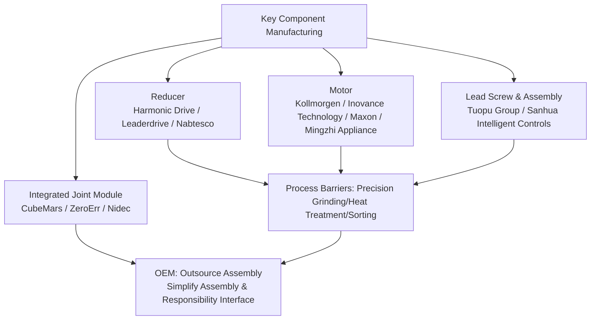

# Chapter 10: Manufacturing Process System

## Summary

Between a humanoid robot's transition from drawings to mass production lies a complete manufacturing process system: the same joint housing can be CNC-machined in the prototype stage but must shift to die casting or forging at a scale of tens of thousands; the micro gears of the same dexterous hand may come from Metal Injection Molding (MIM), while the covers come from injection molds. This chapter bridges the design and subsystem engineering from Chapters 8–9, systematically elaborating on the four mainstream manufacturing processes for humanoid robots—CNC precision machining, injection molding, die casting and metal forming, and additive manufacturing (3D printing)—covering their process principles, precision and cost characteristics, and applicable components. It further discusses Design for Manufacturing (DFM) and Design for Assembly (DFA), tolerance chain analysis and GD&T, mold/tooling and First Article Inspection (FAI), and uses key components such as harmonic reducers, frameless torque motors, planetary roller screws, and coreless motors as examples to illustrate how process selection couples with the supplier ecosystem of Harmonic Drive, Leaderdrive, Nabtesco, Kollmorgen, Inovance Technology, Moons', Tuopu Group, Sanhua Intelligent Controls, etc. This chapter serves as the process foundation for Chapter 11 "Assembly, Integration, and Testing".

**Keywords**: Manufacturing process; CNC machining; Injection molding; Die casting; Additive manufacturing; DFM; DFA; Tolerance chain; GD&T; MBD; FAI; PPAP

---

## 10.1 Overview of the Manufacturing Process System

### 10.1.1 From Subsystem Design to Mass Production: The Position of the Process System

Chapter 9 decomposes the humanoid robot into independently verifiable subsystems such as the lower limbs, upper limbs, hands, torso, head/neck, and joint modules. However, subsystem design freeze only defines "geometry and interfaces"; it does not answer "with what equipment, at what takt time, and at what cost to produce it." The manufacturing process system is precisely the bridge connecting design and mass production: it transforms the CAD model into process routing, tooling, inspection specifications, and cost structure, and undergoes yield and consistency verification during the Pilot Run.

In the humanoid robot product development WBS (Work Breakdown Structure) of this knowledge graph, manufacturing-related tasks span multiple phases:

- **P5 Mechanical Structure Engineering & Prototype**: Complete the design of the central skeleton and limb linkages (P5.1.1), joint mounting interfaces and housings (P5.1.2), exterior covers and parting lines (P5.1.3), and perform structural material selection (P5.2.1), Design for Additive Manufacturing (DfAM, P5.2.2), and evaluation for mass production processes (P5.2.3), outputting the "Material Selection Table" and mass production process roadmap.
- **P8 Structural FEA & Iteration**: Verify critical cross-sections through Finite Element Analysis (FEA); the mesh and load assumptions must match the achievable wall thicknesses, fillets, and ribs of subsequent processes.
- **P16 Pilot Run & Production Ramp**: Execute DFM/DFA reviews (P16.1.1), mold and tooling design (P16.1.2), supplier selection and audit (P16.2.1), up to PPAP/Production Readiness Assessment (P16.3.3).


!!! note "Terminology Explanation: Process Routing, Tooling, First Article Inspection, PPAP"
    - **Process routing**: The sequence of operations a part undergoes from raw material to finished product, including equipment, cycle time, and inspection points.
    - **Tooling**: The collective term for specialized process equipment such as molds, fixtures, and gages.
    - **First Article Inspection (FAI)**: Full dimensional measurement of the first part produced after a tooling or process change to verify conformance to drawing requirements.
    - **PPAP (Production Part Approval Process)**: A mass production part approval procedure originating from the automotive industry, requiring suppliers to submit evidence packages including design records, process flow diagrams, PFMEA, control plans, measurement system analysis, and full dimensional reports.

### 10.1.2 Process Routing Decision Framework: Volume, Precision, Cost, and Lead Time

The process selection for humanoid robot components is essentially a multi-objective decision problem, with dominant variables including:

1. **Annual Demand (Volume)**: Determines whether the fixed investment in mold-based processes (injection molding, die casting, forging, MIM) can be amortized;
2. **Precision and Tolerance Grade**: Reducer parts, screw pairs, etc., require IT5–IT7 grades; covers typically require only IT13;
3. **Material**: The available process sets differ for aluminum alloys, magnesium alloys, titanium alloys, engineering plastics, and carbon fiber composites;
4. **Structural Complexity**: Internal channels, lattice structures, and integrated irregular parts are often only feasible with additive manufacturing;
5. **Lead Time and Iteration Speed**: The R&D phase emphasizes rapid iteration; the mass production phase emphasizes takt time and consistency.

The unit cost of a process can be roughly decomposed into a volume-independent fixed part and a volume-proportional variable part:

$$
C_{\text{unit}}(N) = \frac{C_{\text{tooling}} + C_{\text{setup}}}{N} + C_{\text{material}} + C_{\text{cycle}} \cdot t_{\text{cycle}} + C_{\text{finish}}
$$

Where \(N\) is the total production quantity, \(C_{\text{tooling}}\) is the mold/tooling cost, and \(t_{\text{cycle}}\) is the cycle time per part. When \(N\) is small, tool-less processes (CNC, 3D printing) are advantageous; when \(N\) exceeds a certain **break-even volume** \(N^*\), mold-based processes become advantageous. Typically, the break-even point for injection molding and die casting is in the range of thousands to tens of thousands of parts, depending on mold complexity and machine hour rates.

### 10.1.3 Component-to-Process Mapping Table

Components in the humanoid robot BOM can be mapped to mainstream processes according to the four categories: "Structural – Transmission – Electrical – Exterior":

| Component Category | Typical Part | Prototype Phase Process | Mass Production Phase Process | Key Precision Requirements |
|---|---|---|---|---|
| Structural Load-Bearing | Pelvis skeleton, Thigh/Shin linkage, Joint housing | CNC aluminum, Carbon fiber layup | Die casting, Forging + CNC finishing | Bearing seat IT6–IT7, Geometric tolerance 0.02–0.05 mm |
| Transmission Parts | Harmonic flexspline/circular spline, Planetary gear, Planetary roller screw | CNC + Grinding | Forging/Powder metallurgy/MIM + Fine grinding | Tooth surface IT5–IT6, Screw lead accuracy micron level |
| Electrical Components | Frameless torque motor stator/rotor, Coreless motor winding | Purchased standard parts | Professional motor factory stamping/winding line | Lamination tolerance, Air gap uniformity |
| Exterior Covers | Shell, Guard panel, Trim part | 3D printing, Vacuum casting | Injection molding, Thermoforming | Class A surface, Fit gap 0.3–0.8 mm |
| Wiring & Connectors | Power harness, Communication harness, Connector | Manual wiring | Semi-automatic crimping + Continuity test | Crimp pull force, Contact resistance |
| Dexterous Hand Micro Parts | Micro gear, Tendon pulley, Finger linkage | CNC, 3D printing | MIM, Precision injection molding | Module 0.2–0.5 gear precision |

### 10.1.4 Digital Thread of the Process System: MBD and Single Source of Truth

The traditional "2D drawing + 3D model" dual-track system is prone to inconsistencies during version iterations. **Model-Based Definition (MBD)** embeds geometry, kinematics, mass properties, Geometric Dimensioning and Tolerancing (GD&T), and manufacturing annotations into a single digital master model, enabling design, process, and inspection to share the same authoritative data source. For products like humanoid robots with many joints and dense interfaces, the value of MBD is particularly prominent: bearing seat tolerances and coaxiality requirements on joint housings can be directly read by CMM programs, avoiding manual transcription errors; mass properties in the URDF model can also be consistent with material and process information in MBD, providing prior knowledge for system identification in Chapter 11.

## 10.2 CNC Precision Machining

### 10.2.1 Process Principles and Capability Limits

CNC precision machining is a subtractive process that uses computer numerical control cutting to remove material from a blank to obtain high-precision structural parts, encompassing milling, turning, boring, and grinding. Its fundamental constraint arises from the deformation of the tool-workpiece system caused by cutting force \(F_c\): for a tool with an overhang length \(L\), the tip deflection is approximately

$$
\delta = \frac{F_c L^3}{3EI}
$$

This determines the upper limit of machining accuracy for slender features and thin-walled parts. The joint housings of humanoid robots are often thin-walled, deep-cavity structures. During machining, wall thickness vibration (chatter) and tool deflection are the main sources of error. Engineering practice typically suppresses these through layered cutting, reduced depth of cut, dedicated vacuum chucks, or support using low-melting-point alloy filling.

### 10.2.2 Accuracy Grades and Tolerance-Cost Law

Machining accuracy is characterized by tolerance grades (IT grades). Generally, tightening the tolerance by one grade causes costs to rise approximately exponentially, because tighter tolerances require more precise machine tools, lower cutting parameters, more operations, and higher scrap rates:

$$
C \approx C_0 \cdot \left(\frac{T_0}{T}\right)^{\alpha}, \quad \alpha \approx 1.5 \sim 2
$$

Here, \(T\) is the tolerance band width, and \(C_0\) is the baseline cost. This is the economic rationale behind "tolerance relaxation" in DFM: tight tolerances should only be retained on dimensions that truly require fits, without compromising function.

| Process | Typically Achievable Tolerance Grade | Typical Surface Roughness Ra (μm) | Typical Application in Humanoid Robots |
|---|---|---|---|
| General Milling/Turning | IT9–IT11 | 1.6–6.3 | Brackets, covers, non-fitting structures |
| Precision Milling/Boring | IT7–IT8 | 0.8–1.6 | Bearing seats in joint housings, reducer mounting surfaces |
| Grinding | IT5–IT6 | 0.2–0.8 | Ball screw raceways, gear journals, flexspline mating surfaces |
| Lapping/Honing | IT4–IT5 | 0.05–0.4 | Precision bearing seats, hydraulic coupling parts |

### 10.2.3 Typical Machined Parts for Humanoid Robots

- **Joint Housings and Pelvic Frame**: Mostly 5-axis milled parts from 6061/7075 aluminum alloy (aluminum-magnesium alloy system, see Chapter 3). The coaxiality and perpendicularity of bearing seats and reducer mounting surfaces must be controlled to 0.02–0.05 mm to ensure the transmission accuracy and lifespan of the joint module.
- **Planetary Roller Screw**: As a core component of linear actuators like those in Tesla Optimus, the thread raceways of the screw, rollers, and nut require precision grinding. Lead accuracy is typically at the micron level, and surfaces require hardening treatment to withstand high Hertzian contact stress. The high process threshold for this component makes it a current supply chain bottleneck (see Chapter 7).
- **Harmonic Drive Parts**: The thin-walled cup of the flexspline requires extremely low wall thickness variation and roundness error. The internal teeth of the circular spline require gear shaping or fine grinding after wire-cut EDM.

### 10.2.4 Key DFM Points for Machining

Core rules for Design for Manufacturing (DFM) in machining scenarios include: avoiding deep cavities and narrow slots (depth-to-width ratio generally not exceeding 4:1); internal fillet radii not smaller than the tool radius; adding process stiffening ribs or symmetrical structures to thin-walled parts to relieve stress; standardizing hole diameters to reduce tool changes; and completing mating surfaces in a single setup to ensure geometric accuracy. These rules should be formalized into an enterprise's "DFM Checklist" and verified item by item during the DFM/DFA review in WBS P16.1.1.

---

## 10.3 Injection Molding

### 10.3.1 Process Principles and Mold System

Injection molding involves injecting molten plastic under high pressure into a closed mold cavity, where it cools and solidifies before the mold opens to eject the part. The process variables—melt temperature, mold temperature, injection pressure and speed, holding pressure and time, and cooling time—collectively determine the dimensional accuracy and defect propensity of the product. The mold system consists of the cavity/core, runner system, cooling channels, and ejection mechanism. The development cycle for a complex cover mold is typically 8–16 weeks, with costs ranging from hundreds of thousands to millions of RMB. This dictates that injection molding is only suitable for parts with a sufficiently large, confirmed production volume.

### 10.3.2 Cover Design and Parting Line Design

The exterior covering of humanoid robots is the primary application of injection molding. The WBS task P5.1.3 "Exterior Covering and Parting Line Design" requires outputting the 3D model of the covering, the parting line scheme, and the maintenance opening layout. Key engineering considerations include:

- **Parting Line Location**: Should be placed in visually insensitive areas, maintaining a safe clearance from the joint motion envelope to avoid interference and pinch points.
- **Wall Thickness Uniformity**: Typical wall thickness is 2.0–3.0 mm. Abrupt changes in wall thickness should have gradual transitions to prevent sink marks and warpage.
- **Draft Angle**: Generally not less than 1°–3° for cosmetic surfaces; textured surfaces require larger angles.
- **Snap-fits and Bosses**: Integrate snap-fits per DFA principles to reduce the number of fasteners, but the assembly/disassembly cycle life must be verified.

Regarding materials, common cover materials include ABS, PC/ABS alloy, or glass-fiber reinforced nylon. Heat shields near motors and batteries may consider materials with higher flame retardancy ratings.

### 10.3.3 Typical Defects and Process Window

| Defect | Cause | Countermeasure |
|---|---|---|
| Short Shot | Premature solidification of melt front, poor venting | Increase melt/mold temperature, add gates, optimize venting |
| Flash | Insufficient clamping force, worn parting line | Increase clamping force, repair mold, reduce injection pressure |
| Sink Mark | Non-uniform wall thickness, insufficient holding pressure | Reduce wall thickness, increase holding pressure, core out ribs |
| Warpage | Uneven cooling, orientation stress | Balance cooling channels, optimize gate location, annealing |
| Weld Line | Convergence of multiple melt fronts | Adjust gates, increase convergence temperature, add overflow wells |

### 10.3.4 Cost Model and Volume Threshold

The unit cost of injection molding is dominated by mold amortization. Let the mold cost be \(C_{\text{mold}}\), its lifespan be \(N_{\text{life}}\) cycles, and the material and machine time cost per part be \(C_{\text{part}}\). Then:

$$
C_{\text{unit}} \approx \frac{C_{\text{mold}}}{\min(N, N_{\text{life}})} + C_{\text{part}}
$$

When the planned production volume for the entire robot is in the hundreds of units, covers are better suited for 3D printing, vacuum casting (silicone mold), or CNC prototyping. The unit cost advantage of injection molding only becomes apparent when production reaches tens of thousands of units. This represents the typical evolution path for covering processes in the humanoid robot industry across the "prototype—low volume—mass production" phases.

---

## 10.4 Die Casting and Metal Forming

### 10.4.1 High-Pressure Die Casting Principles

High-pressure die casting (HPDC) injects molten aluminum/magnesium alloy into a steel mold at high speed and high pressure, forming complex thin-walled structural parts in a single shot. Its advantages include fast cycle times (tens of seconds per cycle), near-net-shape capability, and good dimensional consistency. Limitations include high mold investment, susceptibility to internal porosity (detrimental to subsequent heat treatment and high airtightness requirements), and limitations on minimum wall thickness. For humanoid robot joint housings and torso frames, transitioning from CNC to die casting when production volumes reach several thousand units can typically reduce unit costs by an order of magnitude.

### 10.4.2 Giga Casting and Large Structural Parts

The "giga casting" concept validated by the automotive industry is penetrating the humanoid robot sector: integrating a torso frame originally assembled from dozens of sheet metal/machined parts into one or two large die castings can significantly reduce part count, assembly time, and accumulated tolerances (consistent with the trend analysis in Section 9.11.3 of Chapter 9). In the supply chain layout for Tesla Optimus, Tuopu Group, as a supplier of actuator assemblies and structural parts, and Sanhua Intelligent Controls, as a partner for mechatronic actuators, both possess large-scale die casting and precision manufacturing capabilities, illustrating the industrial logic of "automotive component processes migrating to humanoid robots."

!!! note "Terminology Explanation: Giga Casting, Near-Net-Shape, Heat-Treatment-Free Alloy"
    - **Giga Casting**: A process using ultra-large die casting machines to form multiple structural parts into a single large casting in one shot.
    - **Near-Net-Shape**: A process where the formed part requires only minimal machining to reach its final dimensions.
    - **Heat-Treatment-Free Alloy**: An alloy designed so that the casting meets strength requirements in the as-cast state, avoiding deformation from heat treatment, suitable for large integrated parts.

### 10.4.3 Forging, Powder Metallurgy, and Metal Injection Molding

- **Forging**: Refines grain structure and densifies the material through plastic deformation, suitable for connecting rods and joint forks subjected to high fatigue loads. A typical process is "forged blank + CNC finishing."
- **Powder Metallurgy (PM)**: Suitable for high-volume small gears and oil-impregnated bearings, offering high material utilization but limited impact toughness.
- **Metal Injection Molding (MIM)**: Involves mixing metal powder with a binder, injection molding, then debinding and sintering. It is particularly suitable for micro-gears, tendon pulleys, and other small, complex-shaped parts in dexterous hands—parts with small modules, high volumes, and complex geometries where CNC machining is uneconomical.

### 10.4.4 Magnesium Alloys and Semi-Solid Forming

Magnesium alloys have a density approximately two-thirds that of aluminum alloys, making them attractive for weight-sensitive limb structures (their metallurgical characteristics were discussed in Chapter 3). However, their casting and processing must address issues of flammability and corrosion. Semi-solid processing (thixocasting), which injects a semi-solid slurry, results in less gas entrapment, lower shrinkage porosity, and allows for heat treatment strengthening. It is an advanced option for high-performance magnesium/aluminum alloy structural parts, currently in the early stages of adoption in the humanoid robot field.

## 10.5 Additive Manufacturing (3D Printing)

### 10.5.1 Process Families and Capability Comparison

Additive Manufacturing (AM) builds parts by depositing material layer by layer. The main process families include:

| Process | Material | Accuracy/Surface | Typical Applications |
|---|---|---|---|
| FDM/FFF (Fused Deposition Modeling) | PLA, ABS, PA-CF | Low, visible layer lines | Concept models, tooling fixtures, non-standard jigs |
| SLA/DLP (Stereolithography) | Photopolymer resin | High, good surface finish | Appearance verification, precision prototypes |
| SLS/MJF (Selective Laser Sintering) | PA12, TPU | Medium | Functional prototypes, low-volume covers |
| SLM/LPBF (Laser Powder Bed Fusion) | AlSi10Mg, Ti6Al4V, 316L | High, requires post-processing for mating surfaces | Topology-optimized structural parts, integrated joint components |

### 10.5.2 Design for Additive Manufacturing (DfAM)

WBS P5.2.2 explicitly requires the output of a DfAM checklist, printed part drawings, and printing parameters. The core of DfAM is not "taking an existing part and printing it," but rather redesigning to leverage the geometric freedom of additive processes:

1.  **Topology Optimization and Lattice Infill**: Replace solid material with lattice structures while meeting stiffness constraints, enabling 30%–60% weight reduction for limb linkages.
2.  **Part Consolidation**: Integrate brackets, cable clips, and sensor mounts into a single part, directly applying the DFA principle of reducing part count.
3.  **Conformal Cooling Channels**: Print conformal cooling channels inside joint housings, complementing the thermal management design from Chapter 9.
4.  **Orientation and Support Design**: Build orientation determines the direction of interlayer strength and the cost of support removal; anisotropy must be explicitly modeled in strength verification.

### 10.5.3 Post-Processing and Properties of Metal Printed Parts

SLM aluminum/titanium alloy parts typically require Hot Isostatic Pressing (HIP) to eliminate internal porosity, stress relief annealing, CNC finishing for mating surfaces, and surface blasting/anodizing. The fatigue performance of as-printed parts is generally lower than that of forged parts. Critical load-bearing components should establish batch traceability through mechanical testing of witness coupons and test bars from the same build.

### 10.5.4 Positioning in the "Prototype – Low Volume – Mass Production" Spectrum

The appropriate role for additive manufacturing in humanoid robots is: rapid iteration during the R&D phase (1–7 day delivery), complex and custom parts during low-volume production, and tooling, fixtures, and spare parts on the mass production line. When production volumes exceed several hundred to thousands of units, most parts, except for those geometrically impossible to mold, should transition to traditional tooling processes.

---

## 10.6 DFM, DFA, and Cost Engineering

### 10.6.1 Design for Manufacturing (DFM) Methodology

**Design for Manufacturing (DFM)** is an engineering design method that makes parts and assemblies easy, repeatable, and economical to manufacture at scale. Its practical form for humanoid robots is a set of process-specific checklists (one each for machining, sheet metal, injection molding, die casting, additive manufacturing, and PCBA), which are reviewed item by item during detailed design reviews, resulting in Engineering Change Requests (ECRs). The primary economic levers of DFM are: loosening tolerances, standardizing materials and blank specifications, combining operations, and avoiding features that require special equipment.

### 10.6.2 Design for Assembly (DFA) and Part Count Reduction

**Design for Assembly (DFA)** reduces production costs and improves reliability by decreasing the number of parts, simplifying joining methods, and shortening assembly time. Its classic criterion (Boothroyd-Dewhurst method) asks three questions for each part: Must this part move relative to others? Must it be made of a different material? Must it be separate for maintenance or assembly? If the answer to all three is "no," the part should be considered for consolidation. Humanoid robot joint modules are high-value targets for DFA: integrating the motor, reducer, encoder, and driver into a single joint (e.g., integrated joint modules from manufacturers like CubeMars, ZeroErr) is essentially DFA at the supply chain level—the OEM transfers assembly complexity to the specialized module manufacturer in exchange for improved overall assembly cycle time and consistency.

The efficiency of DFA can be measured using assembly efficiency:

$$
\eta_{\text{DFA}} = \frac{N_{\min} \cdot t_{\text{basic}}}{t_{\text{total}}}
$$

where \(N_{\min}\) is the theoretical minimum number of parts, \(t_{\text{basic}}\) is the basic assembly time per part, and \(t_{\text{total}}\) is the actual total assembly time. This metric can be estimated during the P5.3.2 "Assembly Sequence and Fixture Planning" phase and verified during the assembly line planning in Chapter 11.

### 10.6.3 DFM/DFA Review and Engineering Change Loop

WBS P16.1.1 "DFM/DFA Review" requires the output of a DFM/DFA report, an engineering change list, and a cost impact assessment. The review should involve design, process, quality, procurement, and suppliers. Typical outputs include:

| Review Finding | Change Type | Cost/Cycle Impact |
|---|---|---|
| Joint housing bearing tolerance too tight (IT5) | Relax to functional requirement IT6 | Reduced machining cost, lower scrap rate |
| Too many screw bosses on covers | Change to snap-fits + fewer screws | Reduced mold complexity, lower assembly time |
| Change linkage from 3-piece welded assembly to single die-cast part | Process route change | Increased mold investment, significantly lower unit cost |
| No cable routing channel across joints | Add structural channel + snap-fits | Improved reliability, assembly error-proofing |

### 10.6.4 BOM Cost Engineering and VA/VE

**BOM Cost Engineering** systematically analyzes and optimizes the Bill of Materials cost by balancing component selection, supplier negotiation, yield rates, and design trade-offs. **Value Analysis / Value Engineering (VA/VE)** aims to reduce costs while maintaining function, or enhance function within an acceptable cost. In P16.3.2 "Cost Accounting and Cost Reduction," these are combined with should-cost modeling (see Chapter 7) to form a closed loop: "Target Cost → Design Cost Reduction → Procurement Cost Reduction → Yield Cost Reduction." The primary cost-reduction battlegrounds for current-generation humanoid robots are typically actuators (which account for the largest share of the total BOM), reducers, and computing platforms—these are precisely the areas where DFM/DFA and VA/VE should be prioritized.

## 10.7 Tolerance Chains, GD&T, and Measurement

### 10.7.1 Tolerance Chain Stack-Up: Worst-Case and Statistical Methods

**Tolerance chain/stack-up** analysis answers the question: when \(n\) parts are assembled in series, what is the tolerance of the closed loop (e.g., joint clearance, end-effector position error)? The worst-case method provides an absolute guarantee:

$$
T_0 = \sum_{i=1}^{n} T_i
$$

The statistical method (RSS, root sum square) provides a more economical estimate under the assumption of independent dimensions and normal distribution:

$$
T_0 = \sqrt{\sum_{i=1}^{n} T_i^2}
$$

The worst-case method is conservative but costly; the statistical method allows looser individual part tolerances at the cost of a small probability of out-of-tolerance conditions, requiring process capability (see Chapter 11 Cpk) to ensure the assumptions hold. Engineering convention is: use the worst-case method for safety-related and kinematic-critical chains, and the statistical method for general assembly chains.

### 10.7.2 GD&T and Model-Based Definition

Geometric Dimensioning and Tolerancing (GD&T) uses symbols such as position, concentricity, perpendicularity, and profile to precisely convey functional requirements to manufacturing and inspection. Its annotation system (ASME Y14.5 / ISO GPS series) has become the de facto standard for precision electromechanical products. In conjunction with MBD from Section 10.1.4, GD&T annotations are directly attached to features of the 3D model, and CMM inspection programs can be semi-automatically generated, achieving "design-manufacturing-inspection" homology.

### 10.7.3 Key Tolerance Chain Case: Joint Concentricity and Leg Kinematic Accuracy

The end-effector positioning error of a humanoid robot is amplified stepwise by "link manufacturing error + joint assembly error + encoder error." Taking the leg as an example, if the thigh and shank are each approximately 400 mm long, an angular deviation caused by a single bearing seat concentricity error of 0.02 mm is approximately \(0.02/400 \approx 5\times10^{-5}\) rad. After amplification by two links, the foot-end position deviation remains on the order of 0.1 mm; what truly dominates foot-end accuracy is often the reducer backlash (typical harmonic drive backlash is less than 1 arcmin, but increases with long-term wear) and thermal expansion of the links. Below is a Python example for statistical tolerance chain stack-up:

```python
import math

# Tolerance chain for a joint module: tolerances for each link (mm, half-width of symmetric tolerance band)
chain = {
    "Bearing seat machining tolerance": 0.010,
    "Bearing clearance equivalent": 0.008,
    "Reducer mounting surface perpendicularity equivalent": 0.012,
    "Housing fit clearance": 0.015,
}

T_worst = sum(chain.values())                      # Worst-case method
T_rss = math.sqrt(sum(t**2 for t in chain.values()))  # Statistical method (RSS)

for name, t in chain.items():
    print(f"{name}: ±{t:.3f} mm")
print(f"Worst-case closed loop tolerance: ±{T_worst:.3f} mm")
print(f"Statistical closed loop tolerance: ±{T_rss:.3f} mm")
```

The output shows that the closed loop tolerance from the statistical method is approximately half that from the worst-case method. This difference represents "tolerance relaxation margin," which can be directly translated into reduced per-part machining costs.

### 10.7.4 Measurement Systems: CMM, Optical Scanning, and On-Machine Measurement

Measurement capability must match tolerance requirements: generally, the uncertainty of the measurement system should be better than 1/10 of the tolerance being measured (the 10:1 gage principle). Common methods for humanoid robot structural parts include coordinate measuring machines (CMM) for full dimensional measurement (used for FAI), blue light/laser scanning comparison (for cover panel profile), on-machine probes (for closed-loop machining processes), and dedicated backlash/transmission error test stands for joint modules. The measurement system itself must be validated through GR&R (Gage Repeatability and Reproducibility) analysis, typically requiring %GR&R to be less than 10% (for critical characteristics) or 30% (for general characteristics).

---

## 10.8 Manufacturing Processes and Supplier Ecosystem for Key Components

### 10.8.1 Reducers: Precision Manufacturing Under Flexspline Deformation

Harmonic reducers rely on the elastic deformation of the flexspline to transmit motion, with performance determined by tooth profile accuracy, flexspline fatigue life, and backlash. The flexspline blank undergoes forging, precision turning, gear shaping/hobbing, and heat treatment, with tooth surface accuracy requirements of IT5–IT6 grade. This is the process barrier that has allowed **Harmonic Drive Systems** to maintain a long-term dominant position in the high-end market, and it is also the area where Chinese manufacturers like **Leaderdrive** have been continuously making breakthroughs, increasing their share in the humanoid robot supply chain. RV reducers (cycloidal pin wheel planetary transmission), represented by **Nabtesco**, also have high barriers in cycloidal wheel grinding and crankshaft phase accuracy; **Wittenstein** (Germany) and **Bonfiglioli** (Italy) have deep expertise in precision planetary reducers.

### 10.8.2 Motors: Frameless Torque Motors and Hollow Cup Motors

**Frameless torque motors** embed the stator and rotor directly into the joint structure. Their manufacturing core involves precision stamping and lamination of silicon steel sheets, high slot-fill factor winding, and magnet (Nd-Fe-B, see Chapter 3) bonding processes. **Kollmorgen** is a traditional leader in this category, while Chinese automation companies like **Inovance Technology** are rapidly entering the field. **Hollow cup motors** for dexterous hands require specialized winding equipment for their coreless cup-shaped windings; **Mingzhi Appliance** and **Maxon Group** (Switzerland) are representative suppliers in this area. The consistency indicators of mass-produced motors (back EMF constant, cogging torque, phase resistance dispersion) directly determine the pass rate of the joint module EOL test in Chapter 11.

### 10.8.3 Lead Screws and Actuator Assemblies

The precision grinding of the thread raceways of planetary roller screws and the sorting of roller consistency are the core of their manufacturing process, with current global production capacity being limited. Tier-1 suppliers such as **Tuopu Group** and **Sanhua Intelligent Controls** are planning the integrated manufacturing of linear actuator assemblies (motor + lead screw + sensor + housing), combining screw grinding, assembly, and factory testing into a turnkey product. For the OEM, this is analogous to the integrated joint module—a manufacturing strategy of "outsourcing assemblies to simplify assembly and clarify responsibility interfaces."



---

## 10.9 Molds, Tooling, and First Article Inspection

### 10.9.1 Mold and Tooling Design

WBS item P16.1.2 "Mold and Tooling Design" requires the output of mold/tooling drawings, an FAI plan, and acceptance criteria. The hierarchy of the tooling system is: forming molds (injection molds, die-casting molds, forging dies) → machining fixtures (CNC tooling) → assembly fixtures (see Chapter 11) → inspection gages (dedicated go/no-go gages, profile gages). Tooling development is a critical path for production preparation: the design and manufacturing cycle for a die-casting mold is typically 12–20 weeks. Process feasibility must be confirmed before design freeze; otherwise, design changes directly translate into mold modification costs and schedule delays.

### 10.9.2 First Article Inspection (FAI) and PPAP Integration

First Article Inspection performs full dimensional measurement and material verification on the first part produced from the tooling, confirming that "the mold is correct." After FAI passes, small-batch validation begins, ultimately feeding into the PPAP evidence package (design records, engineering change documents, process flow diagram, PFMEA, control plan, MSA, full dimensional report, initial process study). Among these, **PFMEA (Process Failure Mode and Effects Analysis)** is the application of the FMEA method to manufacturing processes: for each operation, it evaluates the severity (S), occurrence (O), and detection (D) of potential failure modes, ranking them by the Risk Priority Number \(RPN = S \times O \times D\) to drive improvements. **Supplier qualification**—auditing component manufacturers for quality, capacity, traceability, and compliance before mass production—ensures that the external supply chain is also integrated into this system, corresponding to WBS item P16.2.1 "Supplier Selection and Audit."

## 10.10 Chapter Summary

This chapter systematically elaborates on the manufacturing process system for humanoid robots. The main conclusions are as follows:

1.  **The process system is the bridge between design and mass production**: In the WBS, manufacturing tasks run through P5 (Body Structure Engineering), P8 (Structural FEA), and P16 (Mass Production Preparation); MBD provides a single digital data source, connecting design, manufacturing, and inspection.

2.  **Each of the four major processes has its own economic range**: CNC machining is suitable for prototypes and precision transmission parts, with accuracy reaching IT5, but costs rise approximately exponentially as tolerances tighten; injection molding is suitable for mass-produced (tens of thousands of units) cover parts; die casting and mega-casting are suitable for structural parts in quantities of several thousand or more; additive manufacturing dominates rapid iteration, complex parts, and tooling. The break-even batch size is the core criterion for process switching.

3.  **DFM/DFA are upfront levers for cost and quality**: Tolerance relaxation, part count reduction, and assembly efficiency measurement should be reviewed before design freeze; BOM cost engineering and VA/VE solidify cost reduction as a process.

4.  **The tolerance chain determines the upper limit of overall machine accuracy**: The worst-case method ensures safety, while the statistical method releases cost potential; joint coaxiality, reducer backlash, and thermal expansion are the dominant contributors to foot-end accuracy; the measurement system must satisfy the 10:1 principle and be validated by GR&R.

5.  **Process barriers for key components shape the supply chain landscape**: Precision processes such as harmonic drive flexsplines, planetary roller screw raceways, and coreless windings are long-term barriers for manufacturers like Harmonic Drive, Nabtesco, and Maxon, and are also breakthrough directions for Chinese suppliers like Leaderdrive, Inovance Technology, Moons' Industries, Tuopu Group, and Sanhua Intelligent Controls.

---

## 10.10.1 Chapter Symbol Table

| Symbol | Meaning | Unit | First Appearance |
|---|---|---|---|
| \(C_{\text{unit}}\) | Unit cost | RMB/piece | 10.1.2 |
| \(C_{\text{tooling}}, C_{\text{mold}}\) | Tooling/Mold cost | RMB | 10.1.2, 10.3.4 |
| \(N, N^*, N_{\text{life}}\) | Production quantity, Break-even batch, Mold life | pieces | 10.1.2, 10.3.4 |
| \(F_c, \delta, L\) | Cutting force, Tool deflection, Overhang length | N, mm, mm | 10.2.1 |
| \(T, T_0, T_i\) | Tolerance zone, Closing link tolerance, Component link tolerance | mm | 10.2.2, 10.7.1 |
| \(\eta_{\text{DFA}}\) | Assembly efficiency | Dimensionless | 10.6.2 |
| \(N_{\min}, t_{\text{basic}}, t_{\text{total}}\) | Theoretical minimum number of parts, Basic assembly time, Total assembly time | pieces, s, s | 10.6.2 |
| \(S, O, D, RPN\) | Severity, Occurrence, Detection, Risk Priority Number | Dimensionless | 10.9.2 |

---

## 10.11 Chapter Knowledge Graph Anchors

### 10.11.1 Core Entities and Relationship Table

| Entity Type | Representative Entity (KG Entry) | Attribute Example |
|---|---|---|
| Manufacturing Process | CNC Precision Machining (ent_process_cnc_machining), Injection Molding, Die Casting, Additive Manufacturing | Accuracy, Batch range, Cost structure |
| Design Method | Design for Manufacturing (DFM), Design for Assembly (DFA), Model-Based Definition (MBD) | Checklist, Review milestone |
| WBS Process | P5 Body Structure Engineering & Prototyping, P16 Small Batch Trial Production & Mass Production Preparation | Deliverables, Acceptance criteria |
| Component | Planetary Roller Screw, Harmonic Drive, Frameless Torque Motor, Coreless Motor | Accuracy grade, Process barrier |
| Supplier | Harmonic Drive, Leaderdrive, Nabtesco, Kollmorgen, Inovance Technology, Maxon, Moons' Industries, Tuopu Group, Sanhua Intelligent Controls, Wittenstein, Bonfiglioli, CubeMars, ZeroErr | Product category, Process capability |
| Quality Method | FAI, PPAP, PFMEA, Supplier Qualification | Evidence package, Audit dimension |

Relationship Example:

| Head Entity | Relationship | Tail Entity | Description |
|---|---|---|---|
| Joint Housing | Uses | Die Casting / CNC | Process selected based on batch size |
| Dexterous Hand Micro Gear | Uses | MIM | Economic process for small module complex parts |
| DFM/DFA Review | Outputs | Engineering Change List | P16.1.1 Deliverable |
| Planetary Roller Screw | Depends on | Precision Grinding | Raceway accuracy in microns |
| MBD | Connects | Design—Manufacturing—Inspection | Single digital master model |
| PFMEA | Drives | Control Plan | RPN ranking for improvement |

### 10.11.2 Cross-Layer Connection Example: From Material to Production Ready


### 10.11.3 Five Key Questions for This Chapter

1.  **Why use CNC for prototypes and switch to die casting for mass production?** Mold-based processes spread fixed costs over large volumes, reducing unit cost with \(1/N\); below the break-even point, tool-less CNC is more economical and supports rapid design iterations.

2.  **Why are tighter tolerances not always better?** Machining costs rise approximately exponentially as tolerances tighten; the statistical method for tolerance chains shows that most assembly chains can achieve the same closing link requirement with looser individual part tolerances, making excess precision pure waste.

3.  **Why can integrated joint modules simultaneously reduce cost and improve quality?** It is DFA at the supply chain level: part count and assembly steps are consolidated within the module manufacturer, providing the robot OEM with shorter assembly cycle times, clearer responsibility interfaces, and more consistent incoming material quality.

4.  **What is the correct positioning of additive manufacturing in humanoid robot mass production?** Rapid iteration, geometrically complex parts, small batch custom parts, and production line tooling; except for structures that cannot be molded, high-volume parts should revert to mold-based processes.

5.  **What problems do FAI and PPAP solve?** FAI verifies "the tooling produced the first piece correctly," while PPAP verifies "the process can consistently produce every piece correctly." Together, they close manufacturing risks before mass production begins.

## References and Data Sources

1. Kalpakjian S, Schmid S R. *Manufacturing Engineering and Technology* (8th ed.). Pearson, 2020. (Manufacturing Process Textbook)
2. Groover M P. *Fundamentals of Modern Manufacturing: Materials, Processes, and Systems* (7th ed.). Wiley, 2018. (Manufacturing Systems)
3. Boothroyd G, Dewhurst P, Knight W A. *Product Design for Manufacture and Assembly* (3rd ed.). CRC Press, 2010. (DFMA Classic)
4. Shigley J E, Mischke C R, Budynas R G. *Mechanical Engineering Design* (7th ed.). McGraw-Hill, 2004. (Mechanical Design)
5. ASME Y14.5-2018. *Dimensioning and Tolerancing*. American Society of Mechanical Engineers, 2018. (GD&T Standard)
6. ISO 2768-1:1989. *General tolerances*. International Organization for Standardization, 1989. (General Tolerances)
7. ISO 286-1:2010. *Geometrical product specifications (GPS) — ISO code system for tolerances on linear sizes*. ISO, 2010. (IT Tolerance Grades)
8. AIAG. *Production Part Approval Process (PPAP)* (4th ed.). Automotive Industry Action Group, 2006. (PPAP Manual)
9. AIAG. *Potential Failure Mode and Effects Analysis (FMEA)* (4th ed.). AIAG, 2008. (FMEA Manual)
10. AIAG. *Statistical Process Control (SPC)* (2nd ed.). AIAG, 2005. (SPC Manual)
11. IATF 16949:2016. *Quality management system requirements for automotive production and relevant service parts organizations*. IATF, 2016. (Automotive Quality System)
12. ISO/ASTM 52900:2021. *Additive manufacturing — General principles — Fundamentals and vocabulary*. ISO, 2021. (Additive Manufacturing Terminology)
13. Gibson I, Rosen D, Stucker B. *Additive Manufacturing Technologies* (3rd ed.). Springer, 2021. (Additive Manufacturing)
14. Ashby M F. *Materials Selection in Mechanical Design* (4th ed.). Butterworth-Heinemann, 2011. (Material and Process Selection)
15. Harmonic Drive Systems Inc. *Corporate and product information*. https://www.hds.co.jp/. (Harmonic Drive Public Information)
16. Nabtesco Corporation. *Precision reduction gears*. https://www.nabtesco.com/. (RV Reducer Public Information)
17. Leaderdrive (Leaderdrive). *Company public information*. https://www.leaderdrive.com/. (Harmonic Drive Public Information)
18. Kollmorgen. *Frameless motors and servo drives*. https://www.kollmorgen.com/. (Frameless Motor Public Information)
19. Inovance Technology (Inovance Technology). *Company public information*. https://www.inovance.com/. (Servo and Motor Public Information)
20. Maxon Group. *Precision drive systems*. https://www.maxongroup.com/. (Precision Motor Public Information)
21. Tuopu Group (Tuopu Group). *Company public information*. (Actuator Assembly and Structural Component Public Information)
22. Sanhua Intelligent Controls (Sanhua Intelligent Controls). *Company public information*. https://www.sanhuagroup.com/. (Electromechanical Actuator Public Information)
23. Tesla. *AI Day 2022: Optimus Robot*. 2022. https://www.tesla.com/AI. (Optimus Actuator and Manufacturing Public Introduction)
24. Wittenstein SE. *Precision gearboxes and servo systems*. https://www.wittenstein.de/. (Precision Reducer Public Information)
25. Mingzhi Appliance (Mingzhi Appliance). *Company public information*. (Coreless Motor Public Information)
