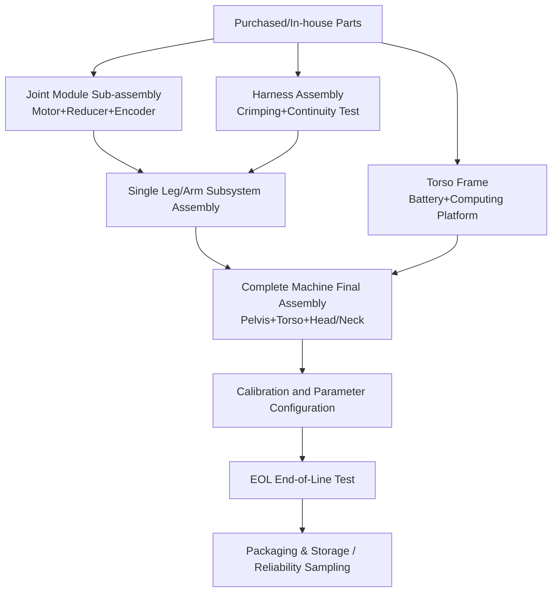
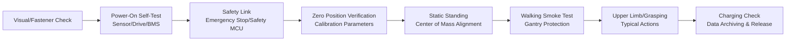

# Chapter 11 Assembly, Integration, and Testing

## Summary

Assembly, Integration, and Testing represent the final stage in the humanoid robot engineering chain, transforming "qualified components into a qualified complete machine," and are the ultimate convergence point of design intent and manufacturing variation. Building upon the manufacturing process system from Chapter 10, this chapter revolves around four main themes: First, **Assembly Process Engineering**, discussing core processes such as threaded connections and tightening control, press-fitting and adhesive bonding, reducer and bearing assembly, and harness engineering, along with their error-proofing designs; Second, **Assembly Line Planning and Complete Machine Integration**, covering assembly sequence and fixture planning, takt time and line balancing, and a hierarchical integration strategy for joint module sub-assembly and complete machine final assembly; Third, **Calibration and Parameter Configuration**, including joint zero-position calibration, kinematic parameter compensation, multi-sensor joint calibration, and system identification; Fourth, **Testing and Validation System**, ranging from Design Verification (DV) and Production Validation (PV), Hardware-in-the-Loop (HIL) testing, to End-of-Line (EOL) testing, Statistical Process Control (SPC), and production ramp-up. The content of this chapter corresponds to two major stages in the WBS of the knowledge graph: P15 (Complete Machine Integration and Validation Testing) and P16 (Pilot Run and Production Preparation), serving as an operational manual for transitioning from engineering prototypes to batch delivery.

**Keywords**: Assembly Process; Tightening Control; Complete Machine Integration; Joint Calibration; System Identification; DV/PV; HIL; EOL Testing; SPC; First Pass Yield; Production Ramp-up

---

## 11.1 The Position of Assembly, Integration, and Testing in the Production Chain

### 11.1.1 From Components to Complete Machine: Assembly Hierarchy

The assembly of a humanoid robot is a typical multi-level aggregation process: Part → Component → Subassembly → Subsystem → System. Taking the leg as an example, frameless torque motors, harmonic reducers, encoders, and torque sensors are first integrated into a joint module (subassembly). The joint module is then integrated with linkages and harnesses into a single leg (subsystem). Finally, the left and right legs are integrated with the pelvis and torso into the complete machine. Each level corresponds to its own **Standard Operating Procedure (SOP)** , fixtures, and inspection points. The division of levels directly determines the number of production line stations and work-in-progress inventory.

### 11.1.2 The Right Side of the V-Model: Roles of DV and PV

Section 9.1.3 of Chapter 9 introduced the concepts of V&V, DV (Design Verification), and PV (Production Validation) within the design process. This chapter further clarifies the division of labor between the two from an execution perspective:

- **DV** answers "Is the design correct?": It uses engineering prototypes (typically soft tooling or machined parts) to verify that the product meets all design specifications. Methods include environmental testing, durability testing, EMC testing, and safety function testing.
- **PV** answers "Is the manufacturing process correct?": It uses products manufactured with **production tooling, production processes, and production takt time** to verify that the manufacturing process can consistently produce conforming products. Its evidence package feeds into the PPAP/Production Readiness Assessment (WBS P16.3.3).

In other words, DV freezes the design, and PV freezes the process. Only after both are passed does the product meet the conditions for SOP (Start of Production).

### 11.1.3 WBS Perspective: Task Mapping for P15 and P16

The WBS in the knowledge graph decomposes the tasks of this stage into two primary phases:

- **P15 Complete Machine Integration and Validation Testing (Integration & V&V)** : Leg system integration and debugging (P15.1.1), Arm and hand integration (P15.1.2), Perception-Planning-Control closed-loop integration (P15.1.3); Safety function testing (P15.2.1), Performance benchmark testing (P15.2.2), Environmental adaptability testing (P15.2.3); Joint and complete machine durability testing (P15.3.1), Software stability and regression testing (P15.3.2), Certification preparation and pre-audit (P15.3.3).
- **P16 Pilot Run and Production Ramp-up (Pilot & Production Ramp)** : Assembly line planning and SOP (P16.1.3), Quality control system establishment (P16.2.2), Incoming material and process anomaly handling (P16.2.3), Pilot run (P16.3.1), Cost accounting and cost reduction (P16.3.2), PPAP/Production Readiness Assessment (P16.3.3), Service manual and training (P16.3.4).

Sections 11.2–11.3 of this chapter correspond to the assembly engineering tasks of P5.3.2/P16.1.3, Section 11.4 corresponds to calibration tasks, Sections 11.5–11.6 correspond to the testing tasks of P15, and Sections 11.7–11.8 correspond to the quality and ramp-up tasks of P16.

---

## 11.2 Assembly Process Engineering

### 11.2.1 Threaded Connections and Tightening Control

Threaded connections are the most numerous type of connection in humanoid robot assembly. Their quality is determined by preload: insufficient preload can lead to loosening under vibration, while excessive preload can damage threads or crush the joined parts. The engineering relationship between tightening torque \(T\) and preload \(F\) is:

$$
T = K \cdot F \cdot d
$$

where \(d\) is the nominal thread diameter, and \(K\) is the torque coefficient (typical range 0.15–0.25). \(K\) is highly dependent on the friction state—batch variations in lubrication, coating, and gasket material can cause the preload at the same torque to scatter by ±30%. Therefore, critical connections (joint module mounting, reducer flange) should use the **torque-plus-angle method**: first tighten to the snug torque, then rotate by a specified angle. This uses the elastic elongation of the bolt to directly control the preload, compressing the scatter to the ±10% level.

On the production line, critical stations should use servo tightening spindles with curve monitoring, recording the "torque-angle" curve and determining anomalies at the snug point (stripped threads, foreign objects, missing gaskets). Curve data is archived with the product serial number, forming part of traceability.

!!! note "Terminology Explanation: Preload, Torque Coefficient, Torque-Plus-Angle Method, Snug Torque"
    - **Preload**: The axial clamping force generated after tightening a bolt, which is the basis for the joint's resistance to loosening and external loads.
    - **Torque Coefficient (\(K\))**: The proportionality coefficient between tightening torque and preload, comprehensively reflecting thread friction and bearing surface friction.
    - **Torque-Plus-Angle Method (Torque-to-yield / Torque-plus-angle)**: Tightening to the snug point followed by an additional angle rotation, using bolt elongation to directly control preload.
    - **Snug Torque**: The torque at which the joint surfaces just make contact, serving as the starting point for the angle phase.

### 11.2.2 Press Fitting, Riveting, and Adhesive Bonding

- **Press Fitting**: Interference fits for bearings and bearing seats, pins and holes, use press fitting. The press force-displacement curve must be controlled: a sudden drop in press force indicates dimensional deviation or misalignment. The curve is archived with the serial number. Crossed roller bearings in humanoid robot joints are particularly sensitive to press-fit coaxiality.
- **Riveting and Snapping**: Cover panels and lightweight structures often use blind rivets or snap fits, aligning with the DFA part count reduction strategy from Chapter 10.
- **Adhesive Bonding**: Magnet bonding (motor rotor), structural adhesives (carbon fiber link joints), and thread-locking adhesives are three typical applications. Adhesive quality depends on surface cleanliness, adhesive layer thickness, and curing schedule. The production line requires batch validation using shear test specimens.

### 11.2.3 Reducer and Bearing Assembly: Where Final Precision is Formed

The complete machine assembly process for harmonic reducers (connecting the flexspline to the output flange, inserting the wave generator, positioning the circular spline) directly determines the final values of backlash and transmission error. Generally, assembly should use a torque wrench to tighten multiple screws in a diagonal, step-by-step pattern to avoid additional deformation of the flexspline cup. The wave generator bearing and the inner wall of the flexspline require lubrication grease of a specified grade and fill volume; overfilling increases churning losses and temperature rise. After assembly, **backlash** and **transmission error** are measured on a dedicated test stand. Non-conforming units are reworked rather than flowing to the next process—this is the logic of outgoing inspection at reducer manufacturers like Harmonic Drive and Leaderdrive, as mentioned in Chapter 10, and is equally necessary for OEMs developing their own joints.

The key points for bearing assembly are cleanliness and preload. Particulate contamination is the primary cause of premature bearing failure. Cleanroom conditions, dust-free clothing, and ionizing air blowers for static elimination should be included in the SOP. The preload amount for angular contact bearing pairs is achieved through spacer grinding or shim grouping, and the grouping data must also be traceable.

### 11.2.4 Harness Engineering: Routing, Crimping, and Continuity Testing

Humanoid robot harnesses traverse multiple moving joints and are among the most fragile links in complete machine reliability. WBS task P5.3.1 "Cable and Tube Routing Design" requires the output of a "Routing Design Specification," defining cable types, fixing points, bend radii, and routing paths. Key control items on the assembly side include:

1.  **Minimum Bend Radius**: Harnesses in moving parts generally require a bend radius no less than 7–10 times the cable outer diameter. High-flex drag chain cables are used for torsional sections.
2.  **Strain Relief**: Fixing points must be provided at both ends of connectors so that motion stress is borne by the harness body, not the terminals.
3.  **Crimping Quality**: Terminal crimping is controlled by dual indicators: crimp height and pull-off force. Samples undergo metallographic cross-section analysis.
4.  **Continuity and Insulation Testing**: 100% of harnesses pass through a continuity tester to check for opens, shorts, and miswiring. Power harnesses additionally undergo insulation resistance and dielectric strength testing.

### 11.2.5 Error-Proofing Design and Electrostatic Protection

**Poka-Yoke (Error-Proofing)** shifts the responsibility for "assembly correctness" from operator attention to tooling and processes: asymmetric locating pins prevent reverse installation, sensors confirm part presence, tightening programs are automatically invoked per station, and photoelectric sensors on bins prevent missed parts. Electronic workstations (motor drivers, computing platforms, battery BMS) must be managed according to an Electrostatic Discharge (ESD) protection system (EPA area, anti-static wrist straps and mats, ionizing blowers) to prevent ESD damage that might only be discovered during EOL testing or even in the field.

## 11.3 Assembly Line Planning and System Integration

### 11.3.1 Assembly Sequence and Fixture Planning

WBS P5.3.2 "Assembly Sequence and Fixture Planning" requires outputting an assembly sequence diagram, a fixture list, and a draft SOP. The principles for assembly sequence planning are: from inside to outside (install internal skeleton and wiring harness first, then cover panels), heavy parts first, difficult tasks first (processes with tight operating space should be performed early), and critical precision processes should be arranged early with inspection points. Fixtures must meet three requirements: unified positioning datum (coinciding with design datum and inspection datum), error-proofing, and quick changeover. The complete assembly of humanoid robots typically requires dedicated turnover fixtures to support switching between horizontal assembly and vertical posture testing.

### 11.3.2 Takt Time, Line Balancing, and SOP

Assembly line planning (WBS P16.1.3) is centered on **takt time**: given a market demand rate of \(D\) units per shift and effective working time \(T_{\text{avail}}\), then

$$
\text{Takt} = \frac{T_{\text{avail}}}{D}
$$

The operation time of all stations should be balanced close to the takt time, with line balancing efficiency defined as

$$
\eta_{\text{LB}} = \frac{\sum_{i} t_i}{n_{\text{stations}} \cdot t_{\max}}
$$

where \(t_i\) is the operation time of the \(i\)-th station, and \(t_{\max}\) is the bottleneck station time. Humanoid robots are currently mostly in the stage of hundreds to thousands of units per year, with the production line form mainly being **cell assembly**: a small number of multi-functional stations plus skilled technicians, rather than an automotive assembly line. However, components like joint modules, whose demand is tens of times that of the complete robot, warrant the initial construction of semi-automatic sub-assembly lines. SOP documents must include task breakdown, key point illustrations, CTQ (Critical-to-Quality) identification, and abnormal handling guidelines, and should be maintained together with time study data.

### 11.3.3 Joint Module Sub-Assembly and System Integration Test Bench

Joint modules are the most numerous and highest-value sub-assemblies in a humanoid robot (typically 28–50 per complete robot). Their sub-assembly line should be organized as "Assembly → Burn-in → Performance Test": after module assembly, a loaded burn-in run-in is performed to evenly distribute lubricant and stabilize mating surfaces; subsequently, performance verification is completed on the **System Integration Test Bench** – these test benches verify joint performance, communication bus, control loop, and safety system before complete robot assembly. Typical test items include peak torque, continuous torque-temperature rise curve, backlash, torque sensor zero drift, and communication packet loss rate. Test-passed modules receive a unique serial number and are bound with a test archive, serving as leaf nodes for the complete robot BOM traceability.

### 11.3.4 Complete Robot Final Assembly Process

The typical sequence for complete robot final assembly is: Pelvis skeleton → Legs → Torso (battery, computing platform, power distribution) → Arms → Head/neck and perception mast → Final wiring harness connection → Cover panels. After each subsystem is completed, a local power-on check (communication scan, emergency stop circuit, insulation check) is performed to prevent faults from being covered by subsequent assembly. After complete robot assembly, it proceeds to the calibration and configuration process in Section 11.4, and then to EOL.

---

## 11.4 Calibration and Parameter Configuration

### 11.4.1 Joint Calibration Procedure

The first batch of "personalized data" after assembly comes from the **Joint Calibration Procedure**: determining the absolute zero position, encoder offset, and direction flag for each actuator. A typical implementation is: control the joint to slowly touch a mechanical limit or a dedicated calibration block, record the encoder reading, compare it with a reference posture (e.g., standing upright with legs together), solve for the zero offset, and write it to the drive's non-volatile memory. This procedure must be performed independently for each joint and verified bidirectionally (approaching the limit from both directions to assess the impact of backlash on the zero position).

### 11.4.2 Kinematic Calibration and Link Parameter Compensation

Manufacturing and assembly errors cause actual link lengths and joint axes to deviate from nominal values, directly impairing the absolute positioning accuracy of the foot and hand ends. Kinematic calibration uses external measurements (laser tracker, photogrammetry, or calibration fixtures) to collect end-effector poses under various postures, performing a least-squares identification of DH/PoE parameters:

$$
\min_{\Delta \boldsymbol{\theta}} \sum_{k} \left\| \mathbf{p}_k^{\text{meas}} - f(\boldsymbol{q}_k, \boldsymbol{\theta}_0 + \Delta \boldsymbol{\theta}) \right\|^2
$$

where \(\boldsymbol{\theta}\) is the kinematic parameter vector. The compensated parameters are written into the controller, linking with the kinematic calibration method from Chapter 8; in mass production, a strategy of "full parameter calibration for the first unit + batch sampling of key parameters" is typically adopted to control labor hours.

### 11.4.3 Multi-Sensor Joint Calibration

The perception-control closed loop requires consistent extrinsic parameters between cameras, depth cameras/LiDAR, IMU, and the joint coordinate system. **Joint-Camera-IMU Calibration** estimates the intrinsic parameters, extrinsic parameters, and time offsets of each sensor: camera intrinsic parameters are calibrated using a checkerboard/dot target; camera-LiDAR extrinsic parameters are solved by minimizing reprojection error; spatiotemporal calibration of IMU and camera can be performed using continuous-time trajectory estimation methods. Sensors on the head/neck mast can introduce additional errors due to structural deformation when the complete robot posture changes, so calibration should be performed on a complete robot horizontal posture reference (e.g., a horizontal base in the calibration room) and verified by re-measuring features during EOL.

### 11.4.4 System Identification and Dynamics Parameter Tuning

The complete robot controller (balancing, whole-body control) relies on accurate mass, center of mass, and inertia parameters. **System Identification** uses joint torque and motion data under excitation trajectories to regress the base parameters in the rigid body dynamics equations:

$$
\boldsymbol{\tau} = \mathbf{Y}(\mathbf{q}, \dot{\mathbf{q}}, \ddot{\mathbf{q}})\, \boldsymbol{\pi}
$$

where \(\mathbf{Y}\) is the regression matrix and \(\boldsymbol{\pi}\) is the vector of parameters to be identified. In engineering, this is advanced in three steps: "CAD prior + joint-level friction identification + whole-arm/whole-leg excitation identification"; the per-joint identification results of the friction model (Coulomb + viscous + static friction) are simultaneously used for feedforward compensation and the friction consistency criterion in EOL.

### 11.4.5 Software Flashing, Parameter Partitioning, and Traceability

After calibration, the complete robot undergoes a unified software installation: firmware (drives, BMS, safety MCU), operating system image, middleware (ROS 2, etc.), and application software are flashed according to the version baseline; calibration parameters and serial numbers are written into the parameter partition. The **OTA (Over-The-Air) software update** system requires initial registration and secure channel establishment before shipment, reserving a path for after-sales upgrades and software iterations after Chapter 12. All flashing records (version number, checksum, station, time) enter the MES and are bound to the serial number, forming a "one robot, one file" system.

## 11.5 Test and Verification System: DV and PV

### 11.5.1 Test Pyramid and Hierarchical Responsibilities

The complete machine test system has a pyramid structure: the bottom layer consists of component and PCBA-level tests (incoming inspection, ICT in-circuit testing), the middle layer comprises module/subsystem tests (joint test bench, battery pack charge/discharge cabinet, HIL), and the top layer involves complete machine and field tests. The lower the level, the lower the cost of finding defects; the goal of test planning is to intercept the vast majority of defects before the module level, with the complete machine level only exposing integration issues (interfaces, interference, system dynamics).

### 11.5.2 DV: Design Verification Test Matrix

DV uses engineering prototypes to verify design specifications, corresponding to WBS tasks P15.2 and P15.3:

| Test Category | Typical Items | Purpose | WBS Anchor |
|---|---|---|---|
| Safety Function Test | Emergency stop chain, safety MCU monitoring, power-off braking hold, collision detection | Verify safety functions operate as designed | P15.2.1 |
| Performance Benchmark Test | Walking speed, endurance, payload, grasping success rate, joint tracking error | Verify KPI achievement | P15.2.2 |
| Environmental Adaptability Test | High/low temperature operation/storage, humidity, vibration, shock, dust/water ingress protection | Expose environmentally sensitive defects | P15.2.3 |
| Durability Test | Joint cycle life, complete machine walking distance, cover opening/closing life | Verify design life | P15.3.1 |
| EMC Test | Conducted/radiated emissions, ESD/RF immunity | Meet regulations and ensure self-compatibility | P13.3.2 |
| Software Stability | Long-duration operation, fault injection recovery, regression testing | Verify software robustness | P15.3.2 |

Section 9.9 of Chapter 9 has detailed HALT/HASS and individual environmental test methods. This section emphasizes their orchestration logic within the DV matrix: design test profiles indexed by failure modes identified in the FMEA, ensuring each test can be traced back to a specific risk.

### 11.5.3 HIL: Role of Hardware-in-the-Loop in the Integration Phase

**Hardware-in-the-Loop (HIL) testing** allows a real controller to interact with a real-time simulated plant, enabling safe and repeatable verification of control software before complete machine integration. There are two typical forms of HIL for humanoid robots:

1.  **Controller HIL**: The real main controller/joint drive runs the control software, while a real-time simulator emulates the complete machine dynamics, sensors, and fault scenarios (e.g., encoder disconnection, bus frame loss) to verify fault response and degradation strategies.
2.  **Actuator HIL**: Physical actuators interface with the controller and a real-time simulation model, simulating the complete machine load spectrum on a test bench to proactively expose issues like torque saturation, thermal overload, and control bandwidth problems.

HIL shifts a large number of "complete machine level" risks earlier to the bench phase. Together with SiL (Software-in-the-Loop), it forms the verification gradient described in Chapter 9 and serves as a pre-safety net for the "Perception-Planning-Control closed-loop integration" (P15.1.3).

### 11.5.4 PV: Production Validation and PPAP

The core proposition of PV is: "Is the product produced under mass production conditions still qualified?" Its input is production molds, production process parameters, and production line operators. Its output is the PPAP evidence package (see Section 10.9.2 of Chapter 10) and the production readiness assessment conclusion (WBS P16.3.3). The sample size and test items for the PV batch should cover: full dimensional measurement (sampling), initial process capability study (critical characteristics Cpk ≥ 1.67, general characteristics Cpk ≥ 1.33 as common automotive industry thresholds), complete machine EOL full pass, and at least one complete round of packaging and transportation validation. After PV is passed, the process parameter window is frozen. Any subsequent changes (4M changes: Man, Machine, Material, Method) must go through the change management process.

---

## 11.6 End-of-Line Testing (EOL)

### 11.6.1 EOL Test Item Design Principles

End-of-Line (EOL) testing is performed on every complete machine. Its design principles are: **Short cycle time, Full coverage, Traceable**. Test items only verify "whether manufacturing is correct" rather than "whether the design is reasonable" (the latter belongs to DV/PV). The typical cycle time is controlled on the order of tens of minutes per complete machine. All EOL data is bound to the serial number and uploaded to the MES, serving both as a release criterion and as a starting point for tracing post-sales issues.

### 11.6.2 Joint Module EOL

Joint modules undergo module-level EOL at the end of the sub-assembly line. Typical items include:

| Test Item | Method | Criterion Example (Typical) |
|---|---|---|
| Insulation Resistance/Dielectric Strength | Megohmmeter, Dielectric Strength Tester | Insulation resistance ≥ specified threshold |
| Back EMF Constant | Drag method to measure line back EMF | Deviation from nominal value ≤ ±5% |
| No-Load Friction Torque | Low-speed forward/reverse rotation | Friction-speed curve within template |
| Backlash | Bidirectional reciprocating loading | ≤ Specification value (e.g., 1 arcmin level) |
| Torque Sensor Zero Point | No-load reading | Zero drift ≤ threshold |
| Communication & Encoder | Bus scan, multi-turn count | No frame loss, multi-turn position correct |
| Noise & Vibration | Microphone/Accelerometer (optional) | Abnormal spectrum alarm |

### 11.6.3 Complete Machine EOL

The typical flow for complete machine EOL is: Visual & Fastener Check → Power-On Self-Test (Sensors, Drives, Battery BMS Communication) → Emergency Stop & Safety Link Test → Joint Zero Position Verification → Static Standing & Center of Mass Alignment → Stationary Marching/Short Step Walking → Upper Limb Typical Actions & Grasping Smoke Test → Charging Function Check → Data Archiving & Release. Walking tests are typically performed under speed limits and gantry protection; criteria are primarily based on "action completion + key signal envelope within template" to avoid turning EOL into a time-consuming performance test.

---

## 11.7 Quality and Process Control

### 11.7.1 SPC and Process Capability Indices

**Statistical Process Control (SPC)** uses control charts to monitor process variation of key characteristics, distinguishing between common cause and special cause variation. The process capability indices are defined as:

$$
C_p = \frac{USL - LSL}{6\sigma}, \qquad C_{pk} = \min\!\left(\frac{USL-\mu}{3\sigma}, \frac{\mu-LSL}{3\sigma}\right)
$$

Where \(USL/LSL\) are the upper/lower specification limits, and \(\mu,\sigma\) are the process mean and standard deviation. WBS task P16.2.2 "Quality Control System Establishment" requires the output of a quality plan, inspection specifications, and SPC control charts. Key SPC focus areas for humanoid robot production lines include: machined bearing seat dimensions, tightening torque/angle curves, press-fit force curves, critical mating dimensions of injection-molded covers, and friction and backlash data from module EOL.

### 11.7.2 First Pass Yield and Pilot Run Closure

**First Pass Yield (FPY)** is the proportion of products that pass all processes without rework. For multiple stations, it is the product of each station's yield:

$$
FPY = \prod_{i=1}^{n} y_i
$$

Humanoid robots have many processes. Even with a single station yield of 98%, the cumulative FPY over thirty stations is only about 55% – this is precisely why WBS P16.3.1 "Small Batch Pilot Run" requires outputting a pilot run summary report, FPY, and issue closure rate: the purpose of a pilot run is not just to build a few usable prototypes, but to raise and lock the conditions for each station's \(y_i\). Pilot run batches progress through "EVT → DVT → PVT" (Engineering/Design/Production Verification), with batch sizes increasing stepwise. The issue closure rate and FPY trend are the core gate criteria for entering the next phase.

### 11.7.3 Anomaly Handling and 8D

Anomaly handling for incoming materials and processes (WBS P16.2.3) adopts the **8D Report** framework: Form the Team (D1), Describe the Problem (D2), Implement Interim Containment Actions (D3), Determine Root Cause (D4, commonly using 5Whys/Fishbone diagram), Choose Permanent Corrective Actions (D5), Implement and Validate (D6), Prevent Recurrence (D7, horizontal deployment to similar processes), and Recognize Team & Standardize (D8). For safety-related defects, containment actions should include tracing and screening delivered products – this relies on the "One Machine, One File" system established in Section 11.4.5.

### 11.7.4 Traceability System and MES

The Manufacturing Execution System (MES) manages serial number management, process parameter binding, test data archiving, and reverse traceability queries. The recommended traceability granularity for humanoid robots includes: joint module serial number, reducer/motor batch, tightening curve, calibration parameter version, and software version baseline. When batch failures occur in the field, the impact scope can be delineated by batch number, minimizing after-sales costs and reputational damage.

## 11.8 Volume Production Ramp-Up and Delivery Preparation

### 11.8.1 From Pilot Run to SOP: The Ramp-Up Curve

Volume production ramp-up follows the learning curve principle: as cumulative production doubles, the assembly time per unit decreases at a fixed rate (typical learning rate 80%–90%), while FPY and capacity increase in tandem. Key management points during the ramp-up phase are: fixing the front-line team to reduce human variables, holding daily quality meetings to track top defects, and implementing "cut-in" management for engineering changes to distinguish products before and after the change. Tesla Optimus has factory deployment and high-volume manufacturing as its public goals, Unitree G1 achieves batch delivery at a relatively low price, and Figure AI is planning dedicated production facilities for Figure 02. The public paths of these leading manufacturers all indicate that the core competitiveness of humanoid robot mass production lies in successfully implementing the manufacturing and assembly system described in Chapters 10–11, rather than in individual technological breakthroughs.

### 11.8.2 Cost Accounting and Cost Reduction Closed Loop

P16.3.2 "Cost Accounting and Cost Reduction" uses actual data from small batches to calibrate the should-cost model from Chapter 10: it distinguishes five cost lines—materials, processes, tooling amortization, yield loss, and assembly labor hours—prioritizes projects (VA/VE projects) based on potential reduction magnitude, and forms a quarterly closed loop of "accounting → project initiation → verification → switchover." The main cost reduction levers on the assembly side are DFA redesign (reducing fastening and adjustment operations), modular procurement (transferring assembly complexity), and EOL cycle time optimization.

### 11.8.3 Service Manuals, Spare Parts, and Training

Delivery preparation (WBS P16.3.4) outputs service manuals, spare parts strategies, and training plans: the service manual organizes disassembly/assembly paths according to MTTR (Mean Time To Repair) targets, translating the results of WBS P5.3.3 "Maintainability and Serviceability Design" into executable maintenance tasks; the spare parts strategy classifies parts by failure rate and downtime cost (joint modules, battery packs, and wiring harnesses are high-priority spare parts); training covers three levels: production line operators, quality inspectors, and after-sales engineers. These contents will connect to subsequent chapters on operations and lifecycle management.

### 11.8.4 Production Readiness Review and Release Gate

After PPAP approval (WBS P16.3.3) and before SOP, a cross-functional production readiness review should be held, with sign-off on the following gate items one by one:

| Gate Item | Responsible Party | Pass Criteria |
|---|---|---|
| Design and Process Freeze | R&D/Process | DV/PV reports closed, change channels controlled |
| Production Line and Tooling | Manufacturing Engineering | Cycle time measured and meets target, tooling acceptance completed |
| Quality System | Quality | Control plan effective, key characteristics Cpk meets target |
| Supply Chain | Procurement | Approved supplier list locked, PPAP evidence complete |
| After-Sales Preparation | Service | Service manual, spare parts, and training in place |

Items that do not meet the gate criteria must have a clear closure plan and responsible person before release, to avoid introducing unresolved manufacturing risks into the ramp-up phase.

---

## 11.9 Chapter Summary

This chapter systematically elaborates on the humanoid robot assembly, integration, and testing system. The main conclusions are as follows:

1.  **Assembly is a multi-level aggregation process:** Parts → Joint Modules → Subsystems → Complete Machine. Each level corresponds to an independent SOP, tooling, and inspection point. Modular sub-assembly + final assembly of the complete machine is the current mainstream organization method.

2.  **Assembly quality is built into the process:** Torque-angle control for tightening, constant torque step-by-step assembly and lubrication management for reducers, bending radius and stress relief for wiring harnesses, and curve monitoring for press-fitting and bonding collectively determine the initial precision and long-term reliability of the complete machine. Poka-yoke and ESD protection transfer correctness from people to the process.

3.  **Calibration and identification are sources of personalized data:** Joint zero position, kinematic compensation, multi-sensor extrinsic parameters, and dynamic baseline parameters give each complete machine a consistent starting point for precision. Software flashing and parameter partitioning via MES create a "one machine, one file" record.

4.  **DV freezes the design, PV freezes the process:** DV uses FMEA as an index to arrange the test matrix, and HIL shifts the complete machine risk forward to the test bench. PV uses production conditions to generate PPAP evidence, and the process window is frozen after the initial process capability meets the target.

5.  **EOL and SPC form the mass production quality closed loop:** Module-level EOL intercepts the vast majority of defects; complete machine EOL only verifies integration correctness. Cpk, FPY, and 8D drive continuous improvement. The pilot run closed loop and the ramp-up learning curve determine the rate of decline of the mass production cost curve.

---

## 11.9.1 Chapter Symbol Table

| Symbol | Meaning | Unit | First Appearance |
|---|---|---|---|
| \(T, F, d, K\) | Tightening torque, preload force, thread diameter, torque coefficient | N·m, N, mm, dimensionless | 11.2.1 |
| \(\text{Takt}\) | Production cycle time | s/unit | 11.3.2 |
| \(\eta_{\text{LB}}\) | Line balance rate | dimensionless | 11.3.2 |
| \(\mathbf{Y}, \boldsymbol{\pi}\) | Dynamic regression matrix, baseline parameter vector | — | 11.4.4 |
| \(USL, LSL, \mu, \sigma\) | Upper/lower specification limits, process mean and standard deviation | Depends on characteristic | 11.7.1 |
| \(C_p, C_{pk}\) | Process capability indices | dimensionless | 11.7.1 |
| \(FPY, y_i\) | First pass yield, station yield | dimensionless | 11.7.2 |

---

## 11.10 Chapter Knowledge Graph Anchors

### 11.10.1 Core Entities and Relationship Table

| Entity Type | Representative Entity (KG Entry) | Attribute Example |
|---|---|---|
| WBS Process | P15 Complete Machine Integration and Verification Testing, P16 Small Batch Pilot Run and Mass Production Preparation | Level 3 tasks, deliverables |
| Assembly Process | Tightening control, press-fitting, bonding, wire harness crimping, poka-yoke | Curve criteria, CTQ |
| Calibration Method | Joint calibration process, joint calibration (camera-IMU-joint), system identification | Zero offset, extrinsic parameters, baseline parameters |
| Test Method | Hardware-in-the-loop HIL, DV/PV, EOL, Environmental/Durability/EMC tests | Test items, criteria |
| Test Equipment | System integration test bench, joint module EOL station | Test capability |
| Quality Method | SPC, FPY, 8D, PPAP, MES traceability | Control chart, gate indicator |
| Complete Machine Case | Tesla Optimus, Unitree G1, Figure 02 | Mass production path |

Relationship Example:

| Head Entity | Relationship | Tail Entity | Description |
|---|---|---|---|
| Joint Module Sub-assembly | Passes through | System Integration Test Bench | Verify performance and safety before assembly |
| Complete Machine Final Assembly | Depends on | Assembly Sequence Diagram / SOP | Output of P5.3.2, P16.1.3 |
| Joint Calibration | Writes to | Drive Parameter Partition | One machine, one file traceability |
| HIL | Precedes | Closed-loop Integration Risk | P15.1.3 Safety Net |
| PV | Feeds into | PPAP Evidence Package | Mass production readiness gate |
| SPC Control Chart | Monitors | Tightening/Press-fitting Curve | Special cause variation alarm |

### 11.10.2 Cross-layer Connection Example: From Process Window to Complete Machine Release

### 11.10.3 Five Key Questions for This Chapter

1.  **Why use the torque-angle method instead of the fixed torque method for critical bolted connections?** The preload force of the fixed torque method can vary by ±30% due to friction coefficient dispersion; the torque-angle method directly controls the preload force based on bolt elongation, compressing the dispersion to the order of ±10%, which is crucial for critical connections like joints and reducer flanges.

2.  **What is the essential difference between DV and PV?** DV uses engineering prototypes to verify if the design meets specifications, answering "Is the design correct?"; PV uses production tooling, processes, and personnel to verify the stability of the manufacturing process, answering "Is the process correct?" The former freezes the design, the latter freezes the process.

3.  **Why can't EOL replace DV?** EOL has a short cycle time and a limited number of test items, only verifying "Is this unit built correctly?"; design defects (e.g., insufficient lifespan, EMC non-compliance) are not visible in EOL and must be covered by the systematic test matrix of DV/PV.

4.  **Why is FPY the core indicator for small batch pilot runs instead of output?** In a multi-station setup, FPY is the product of the yields of each station; the task of the pilot run is to increase the yield of each station and lock down the conditions, otherwise scaling up the batch will only magnify rework and scrap costs.

5.  **Why must calibration data be bound and archived with the serial number?** Zero offsets, extrinsic parameters, and dynamic parameters are the "personalized fingerprints" of each complete machine. They are not only a prerequisite for the normal operation of the controller but also a key data asset for after-sales fault tracing and identifying batch-level defects.

## References and Data Sources

1. Groover M P. *Fundamentals of Modern Manufacturing: Materials, Processes, and Systems* (7th ed.). Wiley, 2018. (Manufacturing and Assembly Systems)
2. Boothroyd G, Dewhurst P, Knight W A. *Product Design for Manufacture and Assembly* (3rd ed.). CRC Press, 2010. (DFA and Assembly Analysis)
3. Shigley J E, Mischke C R, Budynas R G. *Mechanical Engineering Design* (7th ed.). McGraw-Hill, 2004. (Threaded Connection Design)
4. Bickford J H. *Handbook of Bolts and Bolted Joints*. CRC Press, 1998. (Bolt Connection Engineering)
5. Montgomery D C. *Introduction to Statistical Quality Control* (8th ed.). Wiley, 2019. (SPC and Process Capability)
6. AIAG. *Statistical Process Control (SPC)* (2nd ed.). AIAG, 2005. (SPC Manual)
7. AIAG. *Measurement Systems Analysis (MSA)* (4th ed.). AIAG, 2010. (Measurement Systems Analysis)
8. AIAG. *Production Part Approval Process (PPAP)* (4th ed.). AIAG, 2006. (PPAP Manual)
9. AIAG. *Potential Failure Mode and Effects Analysis (FMEA)* (4th ed.). AIAG, 2008. (FMEA Manual)
10. IATF 16949:2016. *Quality management system requirements for automotive production and relevant service parts organizations*. IATF, 2016. (Quality System)
11. ISO 10218-1:2011. *Robots and robotic devices — Safety requirements for industrial robots*. ISO, 2011. (Robot Safety)
12. ISO/TS 15066:2016. *Robots and robotic devices — Collaborative robots*. ISO, 2016. (Collaborative Safety)
13. ISO 13849-1:2015. *Safety of machinery — Safety-related parts of control systems*. ISO, 2015. (Functional Safety)
14. Siciliano B, Khatib O. *Springer Handbook of Robotics* (2nd ed.). Springer, 2016. (Calibration and Identification Methods)
15. Khalil W, Dombre E. *Modeling, Identification and Control of Robots*. Butterworth-Heinemann, 2002. (Classic Robot Identification)
16. Featherstone R. *Rigid Body Dynamics Algorithms*. Springer, 2008. (Fundamentals of Dynamic Parameter Identification)
17. Harmonic Drive Systems Inc. *Product and engineering information*. https://www.hds.co.jp/. (Public Information on Harmonic Drive Assembly and Performance)
18. Tesla. *AI Day 2022: Optimus Robot*. 2022. https://www.tesla.com/AI/. (Public Introduction to Optimus Manufacturing and Mass Production)
19. Figure AI. *Figure 02 and BotQ manufacturing*. https://www.figure.ai/. (Public Information on Figure Mass Production)
20. Unitree Robotics. *G1 Humanoid Robot*. https://www.unitree.com/. (Public Information on G1 Batch Delivery)
