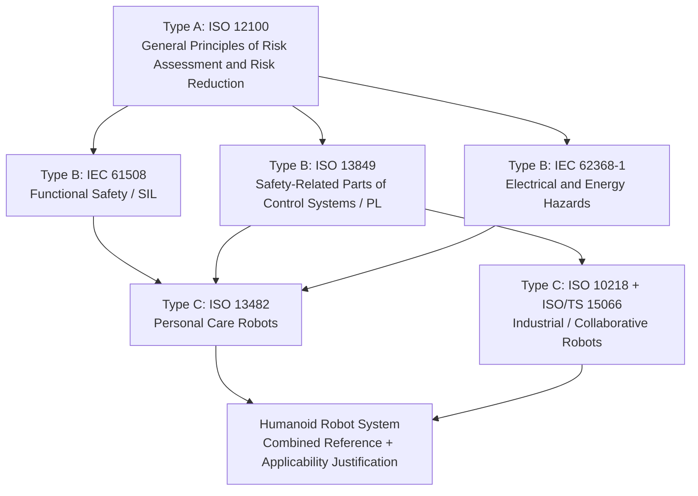
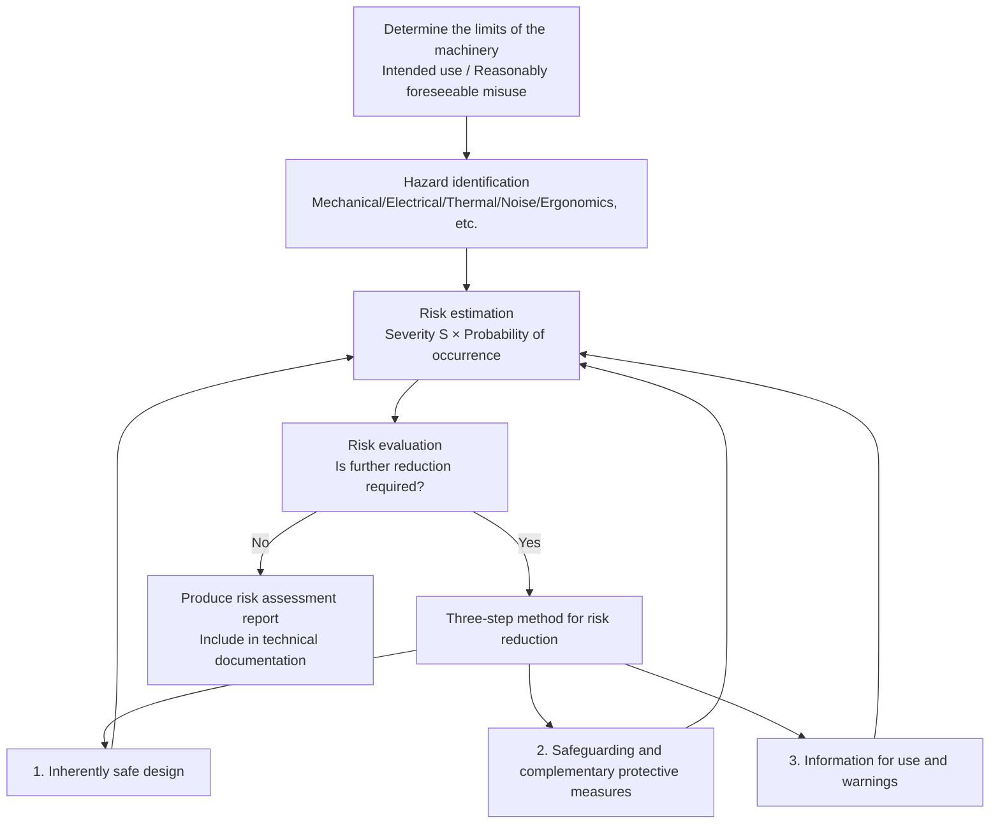
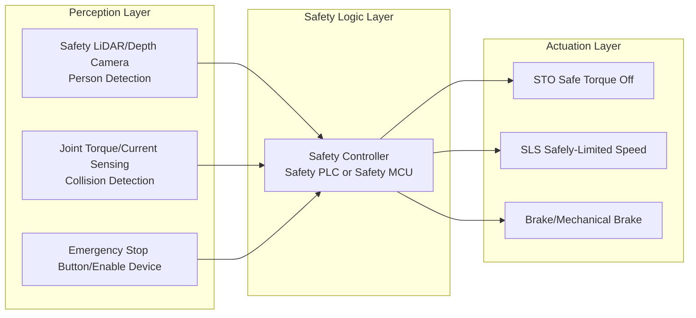
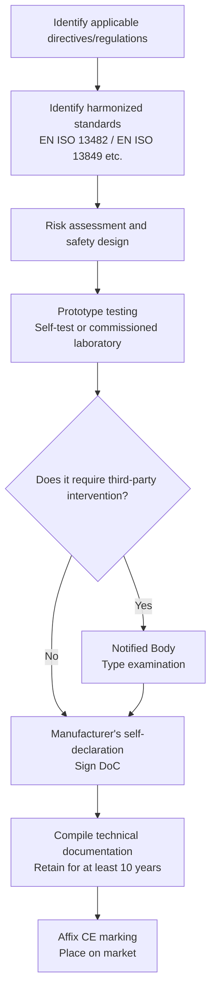

# Chapter 12: Certification, Compliance, and Quality Standards

## Abstract

For humanoid robots to transition from laboratory prototypes to factory, logistics, and home scenarios, the threshold they must cross is not a single performance indicator, but **compliance**: the product must be legally permitted for sale in the target market and withstand liability tracing in the event of an injury incident. This chapter systematically reviews the certification, compliance, and quality standards systems facing humanoid robots. It begins with the standard hierarchy structure and risk assessment methodology, introducing the ISO 12100 risk assessment process and the "three-step method" for risk reduction; it then delves into functional safety engineering, explaining the quantification methods for Safety Integrity Levels (SIL) in IEC 61508 and Performance Levels (PL) in ISO 13849, including key concepts such as PFH/PFD, MTTF\(_d\), DC\(_{avg}\), and Common Cause Failure (CCF); next, it analyzes the two most directly relevant product safety standards for humanoid robots—the ISO 13482 safety standard for personal care robots and the ISO/TS 15066 technical specification for collaborative robots, focusing on the biomechanical limits of force and pressure during human-robot contact; subsequently, it covers market access certifications by region: the EU CE marking, North American UL 1740 and FCC Part 15, China's CR certification and CCC, as well as cross-regional Electromagnetic Compatibility (EMC) and battery safety requirements; finally, it discusses the challenges that AI autonomy poses to traditional functional safety frameworks and emerging countermeasures such as Safety of the Intended Functionality (SOTIF). This chapter complements the standard overview in Chapter 1: Chapter 1 answers "what standards exist," while this chapter answers "how to engineeringly meet these standards."

**Keywords**: Functional Safety; IEC 61508; ISO 13849; ISO 13482; ISO/TS 15066; Risk Assessment; CE Marking; UL 1740; FCC Part 15; CR Certification; Electromagnetic Compatibility; SOTIF

---

## 12.1 Overall Framework of Certification and Compliance

### 12.1.1 Why Compliance is a Prerequisite for Productization

A humanoid robot is a machine that shares physical space with humans, can move autonomously, and apply physical force. This nature dictates that it cannot be "released first, iterated later" like pure software products: once personal injury occurs, the manufacturer faces not only recall costs but also product liability lawsuits and market access bans. Therefore, compliance capability itself is one of the core competencies of humanoid robot companies, functioning at least at three levels:

1.  **Market Access**: Most economies have mandatory or de facto mandatory certification requirements for electromechanical products placed on the market. For example, the EU requires the CE marking; robots in US workplaces need safety certification under the OSHA system issued by NRTLs (Nationally Recognized Testing Laboratories) such as UL; the Chinese market has CR certification (China Robot Certification) and CCC (China Compulsory Certification).
2.  **Liability Definition**: When an accident occurs, "whether applicable current standards were followed" is the primary basis for courts and regulatory bodies to determine if the manufacturer fulfilled its duty of care. Conforming to standards does not exempt from liability but significantly reduces legal risk.
3.  **Design Constraint Conveyance**: Compliance requirements directly translate into engineering design parameters—maximum movement speed, end-effector contact force limits, emergency stop button location and color, enclosure flammability rating, battery thermal runaway protection, etc. The earlier standard requirements are incorporated into the design freeze, the lower the cost of later modifications.

!!! note "Terminology Explanation: Compliance, Certification, Standard"
    - **Standard**: A normative document established by a recognized body (ISO, IEC, IEEE, UL, etc.) and approved by consensus, unifying technical requirements for products, processes, or services. Standards themselves are typically not legally mandatory.
    - **Certification**: The process by which a third-party body (or manufacturer's self-declaration) proves that a product meets the requirements of a specific standard or regulation.
    - **Compliance**: The state of a product meeting all applicable laws, regulations, and referenced standards of the target market. Regulations are mandatory; standards gain mandatory force when referenced by regulations.

### 12.1.2 Hierarchy of the Standards System

Chapter 1 provided a pyramid overview of humanoid robot standards (four layers: international—regional—industry—enterprise). From an engineering implementation perspective, the **A/B/C three-level classification** of machinery safety standards by ISO is more useful:

| Category | Definition | Typical Standards | Relationship with Humanoid Robots |
|----------|------------|-------------------|-----------------------------------|
| Type A (Basic Safety Standards) | Provide basic concepts and design principles applicable to all machinery | ISO 12100 (Risk Assessment and Risk Reduction) | Starting point for all safety design |
| Type B (Generic Safety Standards) | Address one safety device or one type of safety-related characteristic | ISO 13849 (Safety-Related Parts of Control Systems), IEC 61508 (Functional Safety), IEC 60204-1 (Electrical Equipment of Machines) | Determine safety control architecture and component selection |
| Type C (Product Safety Standards) | Address all safety requirements for a specific type of machinery | ISO 13482 (Personal Care Robots), ISO 10218-1/-2 (Industrial Robots) | Determine machine limits and verification methods |

When Type C standards conflict with Type B standards, Type C takes precedence. The current awkward position of humanoid robots is that **there is no dedicated Type C standard**. Bipedal humanoid robots do not fully belong to ISO 10218's "industrial robots" nor entirely to ISO 13482's "personal care robots." Manufacturers typically need to combine multiple standards and justify their applicability to certification bodies, which is a fundamental reason for the long certification cycle of humanoid robots.

### 12.1.3 Cost and Timeline of Compliance

Compliance is not a one-time testing expense but a cost item throughout the entire R&D lifecycle. Based on industry experience, a complete safety certification cycle may require **6–18 months**, with direct costs ranging from tens of thousands to hundreds of thousands of US dollars (depending on the number of target markets, test items, and remediation rounds). Cost components roughly include:

-   **Third-Party Testing Fees**: EMC chamber testing, electrical safety testing, battery abuse testing, etc., charged per project;
-   **Certification Body Audit Fees**: Technical File review, factory inspection (if applicable);
-   **Remediation and Retesting**: The probability of passing all items on the first submission is low; EMC remediation (shielding, filtering, rewiring) often requires several rounds;
-   **Internal Manpower**: Time cost for safety engineers to write risk analysis reports, HARA/FMEA documents, and safety manuals;
-   **Time Opportunity Cost**: Design freeze during certification; any significant design change may trigger a re-evaluation.

A rule of thumb is: **Safety and compliance design should start concurrently with the overall system architecture design**, not as a "post-certification" effort after the prototype is complete. In the DV/PV (Design Verification/Production Verification) process discussed in Chapter 9 of this book, compliance testing should be a formal deliverable of the DV phase.

### 12.1.4 Organization of This Chapter

The remainder of this chapter is structured as "Methodology → Functional Safety → Product Safety Standards → Regional Access → Frontier Challenges": Section 12.2 covers risk assessment, the common language of all safety standards; Section 12.3 explains how to quantify "the control system is sufficiently reliable"; Section 12.4 covers ISO 13482 and ISO/TS 15066, which directly constrain machine behavior; Section 12.5 reviews access paths such as CE, UL, FCC, CR, and CCC by market region; Section 12.6 discusses new issues facing the standards system in the AI era.

## 12.2 Risk Assessment: The Starting Point of All Safety Engineering

### 12.2.1 ISO 12100 Risk Assessment Process

ISO 12100 "Safety of machinery — General principles for design — Risk assessment and risk reduction" is a Type-A basic standard that defines the common methodology behind all Type-C standards. Its core is the semi-quantitative framework of "risk = severity of harm × probability of occurrence of harm," and it specifies an iterative closed-loop process:

A step in risk assessment that is easily overlooked but crucial is **reasonably foreseeable misuse**. For humanoid robots, misuse scenarios are extremely diverse: children climbing on the robot, users having the robot carry objects exceeding its rated load, operating on slippery surfaces, obstructing sensors, etc. Certification bodies typically require manufacturers to list misuse scenarios one by one and provide protective measures during audits.

### 12.2.2 Quantifying Risk Estimation: The Risk Graph Method

ISO 13849 provides the most commonly used risk estimation tool in the machinery industry—the **risk graph**. Designers evaluate each identified hazard from three dimensions:

1. **Severity of harm (S)**: S1 (slight injury, usually reversible, e.g., abrasions, minor contusions) or S2 (serious injury, usually irreversible, e.g., fractures, amputation, death);
2. **Frequency and duration of exposure to the hazard (F)**: F1 (rare occurrence or short exposure time) or F2 (frequent occurrence or long exposure time);
3. **Possibility of avoiding the hazard (P)**: P1 (possible to avoid under specific conditions, e.g., sufficient reaction time and space) or P2 (almost impossible to avoid).

The combination of S, F, and P maps to the required Performance Level (PL\(_r\)), ranging from PL a to PL e. For example, the combination S2 + F2 + P2 typically requires PL e, meaning the safety-related control system must meet the highest requirement for probability of dangerous failure per hour. For humanoid robots performing transportation and collaboration tasks in densely populated environments, hazards such as falling and collision usually fall into the S2/F2 range, implying that critical safety functions (e.g., speed limitation, force limitation, emergency stop) often require PL d or even PL e levels—the impact of this on cost and architecture will be discussed in Section 12.3.

### 12.2.3 Three-Step Method for Risk Reduction

ISO 12100 stipulates that risk reduction must be carried out in order of priority:

1. **Inherently safe design**: Eliminate hazards at the source. For humanoid robots, this includes: limiting peak joint torque and motion speed (sacrificing some performance for safety), rounding the housing to eliminate sharp edges, using low-inertia links to reduce collision kinetic energy, and selecting battery chemistries with lower thermal runaway risk (see material discussions in Chapters 3 and 4).
2. **Safeguarding and complementary protective measures**: Residual risks that cannot be eliminated are controlled through engineering safeguards. Typical measures include: safety-rated LiDAR/depth camera protective zones, collision detection via joint torque sensors, emergency stop circuits monitored by a safety PLC, and protective stop after fall detection.
3. **Information for use**: Residual risks remaining after the first two steps are communicated to users through warning labels, user manuals, and training. Legally, this is the last line of defense and cannot replace the first two steps.

!!! note "Terminology Explanation: Residual Risk"
    The risk that remains after all risk reduction measures have been implemented. Standards do not require, nor is it possible to achieve, "zero risk"; they require that residual risk be reduced to an acceptable level and be truthfully communicated to users. The documentation and justification of residual risk in the risk assessment report is a core component of CE technical documentation.

### 12.2.4 Typical Hazard List for Humanoid Robots

Combining the hazard classification of ISO 12100 with the morphological characteristics of humanoid robots, a complete machine risk assessment should at least cover the hazards in the table below:

| Hazard Category | Specific Manifestation in Humanoid Robots | Main Reduction Measures |
|-----------------|-------------------------------------------|-------------------------|
| Mechanical hazards—Crushing, shearing | Joint pinch points (knee, elbow, hip flexion/extension), finger pinching | Pinch point guards, gap/distance design, force limitation |
| Mechanical hazards—Impact, collision | Arm swing hitting a person during walking, whole-body crushing during a fall | Speed separation monitoring, power and force limitation, fall protection strategy |
| Mechanical hazards—Instability, fall | Bipedal dynamic balance failure leading to whole-body tipping | Stability margin monitoring, low-energy failure posture design, personnel avoidance |
| Electrical hazards | High-voltage power battery, bus capacitor electric shock | Double insulation, grounding, interlock, IEC 62368-1 energy classification |
| Thermal hazards | High-temperature surfaces of motors/drives, battery thermal runaway | Surface temperature limitation, multi-level BMS protection, thermal insulation and pressure relief design |
| Electromagnetic hazards | EMI from high-power drives interfering with medical devices, etc. | EMC design (shielding, filtering, grounding), testing per Section 12.5.4 |
| Functional failure hazards | Controller crash, sensor error, communication interruption leading to loss of control | Functional safety architecture per Section 12.3 (SIL/PL graded design) |
| Cybersecurity hazards | Remote hijacking leading to malicious movement | Secure channel encryption, command whitelist, safety layer independent of network stack |

---

## 12.3 Functional Safety: IEC 61508 and ISO 13849

### 12.3.1 Basic Concepts of Functional Safety

Chapter 8 has already introduced the basic concepts of SIL and PL. This section delves into their implementation methods from a certification engineering perspective. **Functional safety** addresses the question: When the control system itself fails (component damage, software runaway, communication packet loss), can the system still execute safety functions with a sufficiently high probability to bring the robot into a safe state?

There are two key distinctions here:

- **Safety ≠ Reliability**: A highly reliable system rarely fails, but when it does, it may enter a dangerous state; functional safety concerns the **consequences** and **detectability** of failures, not just their frequency.
- **Dangerous failure ≠ Safe failure**: Only failures that lead to the loss of a safety function are dangerous failures. A relay contact weld causing an emergency stop to fail is a dangerous failure; a relay coil open circuit preventing the robot from starting is a safe failure (although it affects availability).

IEC 61508 organizes the entire safety work into a **safety lifecycle**: Hazard and risk analysis → Safety requirements allocation → Safety integrity design → Verification and validation → Operation and maintenance → Decommissioning. Each phase has documented deliverables, and the core of certification auditing is the "safety case" formed by these deliverables.

### 12.3.2 Quantification of SIL: PFH and PFD

IEC 61508 quantifies safety integrity into four levels, SIL 1–4, using the probability of dangerous failure. It is divided into two metrics based on the operating mode:

- **Low demand mode** uses the average probability of failure on demand, PFD\(_{avg}\);
- **High demand / continuous mode** uses the probability of dangerous failure per hour, PFH.

Robot safety functions almost always operate in high demand or continuous mode, with the corresponding relationship as follows:

| SIL | PFH (per hour) | Risk Reduction Factor Order of Magnitude |
|-----|----------------|------------------------------------------|
| SIL 1 | \(10^{-6} \sim <10^{-5}\) | 10–100 |
| SIL 2 | \(10^{-7} \sim <10^{-6}\) | 100–1000 |
| SIL 3 | \(10^{-8} \sim <10^{-7}\) | 1000–10000 |
| SIL 4 | \(10^{-9} \sim <10^{-8}\) | 10000–100000 |

Intuitively, SIL 2 means that a safety function experiences a dangerous failure on average only once every ten million hours. For a fleet of robots operating thousands of hours per year, this magnitude reduces the probability of "injury due to control system failure" to an extremely low level.

The PFH of a safety function is accumulated by the series connection of its constituent subsystems. If the safety chain consists of a sensor (S), a logic unit (L), and an actuator (A) in series, then:

$$
PFH_{sys} \approx PFH_S + PFH_L + PFH_A
$$

The overall SIL of the system cannot exceed the highest SIL supported by any single link. This is why "using a SIL 3 LiDAR with a common MCU" cannot claim SIL 3—the barrel effect dictates that the entire chain must meet the standard level by level.

### 12.3.3 PL of ISO 13849: Category, MTTFd, and DC

ISO 13849-1 is oriented towards machinery safety-related control systems (SRP/CS), using PL a–e corresponding to PFH\(_d\) (see Chapter 8, Section 8.7.5 for the comparison table). In engineering, determining the achievable PL for a channel requires evaluating four elements simultaneously:

1. **Structure Category**: Describes the fault tolerance capability of the architecture. Category B is single-channel without diagnostics; Category 1 uses proven components and safety principles; Category 2 introduces periodic testing; Category 3 is redundant dual-channel, where a single fault does not lead to loss of safety function; Category 4 requires faults to be detected in a timely manner based on Category 3.
2. **Mean Time To dangerous Failure (MTTF\(_d\))**: A component-level reliability statistic for each channel, classified as low (3–10 years), medium (10–30 years), or high (30–100 years). It is calculated from component failure rate data (e.g., B10\(_d\) values provided by manufacturers):
   $$
   MTTF_d = \frac{B_{10d}}{0.1 \times n_{op}}
   $$
   where \(B_{10d}\) is the number of cycles until 10% of components experience a dangerous failure, and \(n_{op}\) is the average number of annual operations.
3. **Average Diagnostic Coverage (DC\(_{avg}\))**: The percentage of dangerous failures detected by self-diagnostics, classified as none (<60%), low (60–90%), medium (90–99%), or high (≥99%). Cross-monitoring, parity checks, watchdogs, and output readback are all means to increase DC.
4. **Common Cause Failure (CCF)**: Simultaneous failure of redundant channels due to a common cause (same power supply drop, same high-temperature environment, same software bug). Standards require sufficient CCF scoring through measures such as isolation, diversity, and environmental testing.

The typical target for critical safety functions in humanoid robots is **PL d / SIL 2 or PL e / SIL 3**: For example, a dual-channel emergency stop circuit is often designed to Category 3 + PL d; power and force limiting functions during continuous close human interaction may require PL e level justification.

### 12.3.4 Decomposition of Typical Safety Functions for Humanoid Robots

Translating standard language to the overall architecture, humanoid robots typically need to implement the following safety functions, each requiring an assigned PL\(_r\)/SIL target and independent verification:

- **STO (Safe Torque Off)**: Cuts off motor torque output without cutting off control power. It is the most basic drive-level safety function. Mainstream servo drives provide STO terminals and claim SIL 3 / PL e capability.
- **SLS (Safely-Limited Speed)**: Monitors and limits joint speed to not exceed a safe limit, requiring a safety-rated speed feedback channel (e.g., dual encoder cross-checking).
- **SLP (Safely-Limited Position)**: Limits joint position to prevent entry into hazardous areas (e.g., personnel protection zones).
- **Collision Detection and Power/Force Limiting**: Estimates external torque via the current loop or uses dedicated torque sensors, triggering a protective stop when contact force exceeds limits—this is the technical basis for the Power and Force Limiting mode of ISO/TS 15066 (see Section 12.4.2).
- **Emergency Stop**: A Category 0/1 stop with a red mushroom head on a yellow background, implemented as a hardwired circuit independent of the main controller.

The key architectural principle is: **The safety layer must be independent of the functional layer**. When the main controller running the Linux/ROS-based Vision-Language-Action (VLA) stack crashes, the safety controller can still execute STO/SLS. This typically means the safety MCU/PLC is physically separated from the main computing platform, and safety sensors connect directly to the safety controller rather than being routed through the main controller.

### 12.3.5 Safety Of The Intended Functionality (SOTIF) and New Issues from AI

IEC 61508 and ISO 13849 address "systematic failures"—functional failures leading to hazards. However, humanoid robots face another type of hazard: **The system has no failure, but the functionality itself is insufficient to handle the environment**. For example, a vision model misidentifying a person as background in backlighting, or a VLA policy generating dangerous actions for instructions outside its training distribution. Such "performance insufficiency" hazards are addressed by the **Safety Of The Intended Functionality (SOTIF, from the automotive domain ISO 21448)** framework.

SOTIF divides scenarios into four quadrants: known safe, known unsafe, unknown unsafe, and unknown safe. The engineering goal is to expand the "known safe" area and shrink the "unknown unsafe" area through scenario library accumulation, trigger condition analysis, and design improvements. For robots equipped with learning models, this implies:

- Perception and policy models require independent **OOD (Out-Of-Distribution) detection and degradation mechanisms**, switching to conservative behavior when uncertainty increases;
- Safety decisions cannot be fully delegated to learning-based components; the ultimate safety shutdown must reside in a deterministic, verifiable safety layer (the architecture in Section 12.3.4);
- Verification methods expand from "fault injection" to "scenario traversal + statistical argumentation," directly linking to the evaluation system discussed in Chapter 25 of this book.

---

## 12.4 Product Safety Standards: ISO 13482 and ISO/TS 15066

### 12.4.1 ISO 13482:2014 Safety of Personal Care Robots

ISO 13482 is currently the closest C-class standard for service/home scenario humanoid robots. It defines a **personal care robot** as a service robot aimed at improving an individual's quality of life, covering three categories:

1.  **Mobile servant robot**: A mobile robot that performs tasks such as object handling and cleaning – most wheeled-chassis humanoid robots fall into this category;
2.  **Physical assistant robot**: A device that has physical contact with a person, assisting them in movement or tasks, such as lower limb exoskeletons;
3.  **Person carrier robot**: A robotic wheelchair or similar device that carries a person.

The core requirements of the standard revolve around "coexistence with humans":

-   **Limits on movement speed and force**: In modes where the robot may contact a person, its movement speed and contact force must be limited to a level that does not cause injury. The specific limits relate to the contacted body part;
-   **Contact safety**: The outer shell must have no sharp edges or corners. Surface temperatures must not exceed limits that could cause burns. Pinch points require guarding or force limitation;
-   **Stability and tip-over protection**: The robot must remain stable under expected floor conditions and external force disturbances. If the risk of tipping cannot be eliminated, the tipping energy must be limited or a warning must be given;
-   **Constraints on autonomous functions**: Autonomous mobile robots must be able to detect persons in their path and react to avoid or render contact harmless. They must not perform hazardous operations without supervision;
-   **Battery and charging safety**: Covers electrical and fire risks during the charging process.

A practical limitation of ISO 13482 is that it was developed in 2014, when bipedal humanoid robots were not yet industrialized. Many verification methods in the standard (e.g., static stability tests) are not directly applicable to dynamically balanced bipedal platforms. Current common practice among manufacturers is to use the general requirements of ISO 13482 as a framework, reference the contact limits of ISO/TS 15066 for biped-specific hazards (dynamic falling, whole-body contact), and supplement their own test methods to create a suitability justification document for submission to certification bodies.

### 12.4.2 ISO/TS 15066:2016 Technical Specification for Collaborative Robots

ISO/TS 15066 is a supplementary technical specification to the ISO 10218 industrial robot standard. It defines four **collaborative operation** modes. As long as a robot system implements one or more of these modes, it can work with humans in a shared space, with or without safety fences:

| Collaborative Mode | Original English Name | Principle | Applicability to Humanoid Robots |
|-------------------|----------------------|-----------|----------------------------------|
| Safety-rated monitored stop | Safety-rated monitored stop | Robot stops when a person enters the collaborative space, resumes after leaving | Suitable for demonstrations, assembly collaboration |
| Hand guiding | Hand guiding | Person directly guides the robot's motion via a manual guiding device | Teaching programming, drag teaching |
| Speed and separation monitoring | Speed and separation monitoring, SSM | Dynamically adjusts speed based on human-robot distance, maintaining a minimum protective distance | Main mode for bipedal mobile manipulation |
| Power and force limiting | Power and force limiting, PFL | Allows physical contact, but contact force/pressure is limited to biomechanical thresholds | Close-proximity service, physical assistance |

The minimum protective distance for SSM mode is determined by the human approach speed, robot stopping time, and system response time. Its classic form is:

$$
S_p(t_0) = \int_{t_0}^{t_0+T_R+T_B} v_H(t)\,dt + \int_{t_0}^{t_0+T_R} v_R(t)\,dt + T_R \cdot v_R + C + Z_d + Z_r
$$

Where \(v_H\) is the human approach speed (typically taken as walking speed of 1.6 m/s), \(T_R\) is the system response time, \(T_B\) is the braking stop time, \(C\) is an additional distance accounting for human body intrusion, and \(Z_d\), \(Z_r\) are sensor position uncertainty and robot position uncertainty, respectively. The engineering implication of this formula is: **the slower the robot brakes and the larger the sensor delay, the larger the safety distance must be, and the lower the collaborative efficiency** – thus the tension between safety and cycle time.

The PFL mode provides **biomechanical limits** divided by body region, distinguishing two types of contact:

-   **Quasi-static contact**: Continuous squeezing of a person between the robot and a fixed object. Limits are most stringent;
-   **Transient contact**: Brief impact or collision. Limits are approximately twice those for quasi-static contact.

!!! note "Terminology Explanation: Quasi-static Contact and Transient Contact"
    In the biomechanical limit table of ISO/TS 15066, sensitive areas like the face and skull are **not permitted** to experience quasi-static contact. For areas with ample muscle, like the torso and thighs, the typical allowable quasi-static pressure is on the order of hundreds of hPa (approximately 100–200 N/cm²), corresponding to force limits of tens to over a hundred Newtons. Transient contact limits are roughly double. These values originate from studies on human pain thresholds, representing the level at which "pain begins" rather than "injury occurs," and include a safety margin.

For bipedal humanoid robots, adapting the PFL mode presents specific difficulties: the limit model in ISO/TS 15066 assumes the robot is a fixed-base manipulator arm, with contact being single-point and controllable. However, a bipedal robot may make whole-body, multi-point contact with a human during walking, and the contact energy during a fall far exceeds that of a manipulator arm – the energy carried by a 50–80 kg machine falling from a height of 1.5 m (approximately \(mgh \approx 700\)–1200 J) is far beyond any biomechanical limit. Therefore, the current consensus is: **the primary safety goal for bipedal humanoid robots is "do not fall" and "decelerate before contact," with PFL serving only as a fallback for residual contact.** This also explains why manufacturers invest significant safety budgets in the robustness of balance control.

### 12.4.3 Biomechanical Limits and Contact Models

Verification of the PFL mode requires measuring the contact force of the robot's end-effector or body parts. The peak impact force can be estimated using a lumped mass model: when a robot component of mass \(m_R\) impacts a human body part (equivalent spring constant \(k_H\), robot-side equivalent spring \(k_R\)) at velocity \(v\), the peak force is approximately:

$$
F_{max} = v \sqrt{m_{red}\, k_{eff}}, \quad m_{red} = \frac{m_R m_H}{m_R + m_H}, \quad k_{eff} = \frac{k_R k_H}{k_R + k_H}
$$

Where \(m_H\) is the effective mass of the human body part. This model reveals three design approaches to reduce impact force, all of which have corresponding implementations in the subsystem design of Chapter 9:

1.  **Reduce contact velocity \(v\)**: SSM deceleration, compliant control to reduce approach speed – peak force is approximately proportional to velocity, making this the most cost-effective method;
2.  **Reduce effective mass \(m_{red}\)**: Lightweight links and low-inertia design (see Chapter 3 on structural materials, Chapter 9 on swing leg inertia optimization);
3.  **Reduce system stiffness \(k_{eff}\)**: Soft covering materials, compliant joints (e.g., series elastic actuators), active controller yielding upon impact.

### 12.4.4 Inheritance from Industrial Robot Standards: ISO 10218

For humanoid robots deployed in factory environments, the most direct standard basis remains ISO 10218-1/-2 (Safety requirements for robot bodies and robot systems/integration). This standard has undergone revisions, with the latest versions further incorporating requirements for mobile and collaborative functions and being used in conjunction with ISO/TS 15066 for human-robot collaboration scenarios. In practice, humanoid robots in factory settings typically undergo cell-level risk assessment as an "industrial robot system": the robot body complies with ISO 10218-1, and the integrated application (including tooling, material flow, personnel access) is certified at the cell level by the integrator according to ISO 10218-2.

It is worth emphasizing the issue of "**who certifies**": the robot body manufacturer is only responsible for the robot body. The overall safety of the robot placed into a specific production line must be re-evaluated and is the responsibility of the **system integrator or end user**. If a humanoid robot company delivers a "turnkey cell" (robot + tooling + layout), it effectively assumes the role of the integrator, and the certification responsibility expands accordingly – this is a direct impact of business model choice on compliance costs.

### 12.4.5 Electrical and Battery Safety

Humanoid robots are equipped with power batteries ranging from tens to nearly a hundred volts and high-power drives. Electrical safety forms its own system independent of functional safety:

-   **IEC 62368-1**: Safety standard for audio/video and information technology equipment. It adopts **Hazard-Based Safety Engineering (HBSE)** principles, classifying electrical, thermal, and mechanical energy according to their potential to cause harm to humans (Class 1–3), requiring protection for Class 2 and above energy sources. The charging dock and main power board of a humanoid robot are typically evaluated against this standard;
-   **Battery safety**: At the cell and battery pack level, reference is usually made to the IEC 62133 series (Safety of portable sealed batteries) and UN 38.3 for transport (abuse tests for vibration, shock, short circuit, overcharge, forced discharge, etc., a mandatory prerequisite for air transport of lithium batteries);
-   **Functional safety of the BMS**: Overcharge, over-discharge, over-temperature, and short circuit protection are safety-related functions. High-demand applications also require SIL/PL justification, and the main battery circuit typically requires dual protection (main protection IC + independent secondary protection);
-   **Charging safety**: Humanoid robots with automatic recharging involve unattended charging. Evaluation points include foreign object short circuit protection at contact points, charging communication handshake, and early detection of thermal runaway (gas/temperature sensors).

## 12.5 Regional Market Access Certification

### 12.5.1 European Union: CE Marking System

The CE marking (Conformité Européenne) is a declaration of conformity for products entering the EU and European Economic Area market. It is not a single certification but a combination of **Directives/Regulations + Harmonized Standards + Conformity Assessment Procedures**. Humanoid robots typically involve:

| Directive/Regulation | Scope | Key Points for Humanoid Robots |
|----------------------|-------|--------------------------------|
| Machinery Directive 2006/42/EC (transitioning to Machinery Regulation (EU) 2023/1230) | Basic health and safety requirements for machinery | Whole-machine risk assessment, safety functions, technical documentation |
| Low Voltage Directive 2014/35/EU | Electrical safety for 50–1000 V AC / 75–1500 V DC | Chargers, power supply components (robot battery voltage is often below this range, but chargers apply) |
| EMC Directive 2014/30/EU | Electromagnetic compatibility | Detailed in Section 12.5.4 |
| Radio Equipment Directive 2014/53/EU (RED) | Devices containing Wi-Fi/Bluetooth/4G/5G modules | RF parameters, spectrum compliance |
| RoHS 2011/65/EU | Restriction of hazardous substances | Declaration of materials such as lead, cadmium, flame retardants |
| EU AI Act (EU) 2024/1689 | Risk-based regulation of AI systems | May trigger additional obligations when involving functions like biometric identification, emotion recognition |

The typical process for CE conformity assessment is:

Most robots can follow the manufacturer's **self-declaration** path (signing the Declaration of Conformity DoC), provided that harmonized standards are fully implemented and technical documentation is prepared. The technical documentation must include risk assessment reports, calculation and test records, drawings, component certificates, user manuals, etc., available for market surveillance authorities to inspect at any time. A notable trend is that both the new Machinery Regulation and the AI Act are bringing "autonomous/learning machines" under clearer regulatory scrutiny; manufacturers should track their transition periods and implementation details.

### 12.5.2 North America: UL 1740, NRTL System, and FCC Part 15

The US market does not have a unified mark like CE but rather a multi-layered structure:

- **Electrical and Fire Safety**: Certified by OSHA-recognized NRTLs (Nationally Recognized Testing Laboratories, such as UL, Intertek/ETL, TÜV SÜD America). The dedicated standard for robotics is **UL 1740** "Standard for Safety for Robots and Robotic Equipment," covering electrical, mechanical, and fire safety requirements for the robot body. In practice, UL 1740 is often used as the framework, supplemented by component-level assessments per UL 61010 or IEC 62368-1;
- **Electromagnetic Compatibility and Radio Frequency**: **FCC Part 15** specifies RF emission limits for unintentional radiators (digital devices) and intentional radiators (wireless modules). Robots with processors are Class B (residential environment) or Class A (industrial environment) digital devices, requiring conducted and radiated emission tests; those with Wi-Fi/Bluetooth modules also need module-level or whole-machine FCC certification;
- **Workplace Safety**: OSHA regulations require employers to provide a safe working environment. Industrial robot deployment must comply with ANSI/RIA R15.06 (harmonized with ISO 10218) for cell safety. When humanoid robots enter US factories, integrators typically perform application-level risk assessments per R15.06;
- **Canada**: CSA mark and SCC accreditation system, standards are highly harmonized with UL (cUL certification).

Unlike CE self-declaration, the US path heavily relies on third-party laboratories, and certification bodies conduct **follow-up inspections** for production consistency. Replacing critical components requires notification or even re-evaluation—a significant process constraint for rapidly iterating humanoid robot hardware.

### 12.5.3 China: CR Certification, CCC, and GB Standards

Access to the Chinese robot market consists of the following layers:

- **CR Certification (China Robot Certification)**: A voluntary robot certification system established under the guidance of the Certification and Accreditation Administration of China, covering safety, EMC, performance, and reliability dimensions. It is categorized by scope into whole-machine, component, etc. Although nominally voluntary, the CR mark is often a bonus or prerequisite in government procurement, central SOE tenders, and industry customers, effectively having quasi-mandatory force;
- **CCC Certification (China Compulsory Certification)**: Mandatory product certification. Power adapters, chargers, and other components of humanoid robots must be certified if they fall under the CCC catalog;
- **GB National Standards**: Robot safety-related GB standards mostly adopt or modify ISO standards (e.g., GB 11291 corresponds to ISO 10218), EMC references GB/T 17626 (corresponding to IEC 61000-4 series), etc.;
- **Local and Industry Pilots**: Beijing, Shanghai, Shenzhen, etc., have issued management measures for testing, evaluation, and demonstration applications for embodied intelligence/humanoid robots, imposing requirements on right-of-way, insurance, and data compliance for robots entering public spaces. These are soft constraints outside the standard system but equally affect deployment.

### 12.5.4 Electromagnetic Compatibility (EMC) Testing Details

EMC refers to a device's ability to function properly in its electromagnetic environment without causing unacceptable electromagnetic interference to other devices. The high-frequency switching drives (tens of kHz PWM, high di/dt currents), long wiring harnesses, and wireless modules inside humanoid robots make EMC the certification aspect most prone to failure. Main test items include:

| Test Item | Abbreviation | Inspection Content | Typical Risk Points for Humanoid Robots |
|-----------|--------------|--------------------|-----------------------------------------|
| Radiated Emission | RE | Whether electromagnetic noise radiated into space exceeds limits | Drive PWM, motor cable antenna effect |
| Conducted Emission | CE | Noise conducted along power lines | Charging dock, switching power supply |
| Electrostatic Discharge Immunity | ESD | Whether the device functions normally after human body electrostatic contact/air discharge | Housing gaps, screen, buttons |
| Electrical Fast Transient/Burst | EFT | Burst pulses caused by inductive load switching | Long cables, I/O ports |
| Surge Immunity | Surge | Lightning-induced surges | Charging station, mains interface |
| Radiated RF Electromagnetic Field Immunity | RS | Whether malfunction occurs in strong RF fields | Operation near wireless base stations |

EMC issues must be prevented at the design stage, not remedied during testing: common-mode chokes at the drive output, single-ended/double-ended grounding strategies for shielded cables, equipotential bonding of metal structural parts, and separate routing of sensor signal lines and power lines (see Chapter 9 for arm cable management) are design measures costing far less than chamber rework. Generally, first-pass EMC test rates are strongly correlated with team experience; scheduling one or two rounds of rework and retesting is standard practice.

### 12.5.5 Strategic Choices for Multi-Market Access

Humanoid robot companies targeting global sales typically weigh three certification strategies:

1. **Design for the Strictest Standards**: Use the most stringent market (usually EU + North America) requirements as the design baseline. One design, multiple certifications, minimizing marginal costs;
2. **CB Scheme Mutual Recognition**: Leverage the IECEE CB Scheme, where one CB test report can be converted into multiple national certifications, reducing duplicate testing;
3. **Regional SKUs**: Differentiate hardware for different markets (e.g., wireless modules, power specifications), offering flexibility but increasing supply chain and production consistency management costs (see Chapter 7 supply chain discussion).

Regardless of the strategy chosen, **change management** is the core of compliance during mass production: every ECO (Engineering Change Order) involving safety-related components, firmware, or structure requires an assessment of whether recertification is triggered. This necessitates integration between the PLM system and certification documentation.

## 12.6 Frontier Challenges: When Standards Meet Learning-Based Robots

### 12.6.1 Four Cracks in the Existing Framework

Synthesizing the discussions in this chapter and Chapter 1, the structural difficulties faced by humanoid robot standardization can be summarized into four points:

1. **Morphological Diversity**: Bipedal, wheeled chassis + dual arms, and composite forms coexist, making it difficult for the "mechanical type" classification of Type-C standards to cover them all;
2. **Dynamic Contact**: The energy scale of falls and full-body multi-point contacts exceeds the single-point contact model of ISO/TS 15066;
3. **AI Autonomy**: Learning-based behaviors cannot be verified using traditional deterministic fault models, and SOTIF-like methods are still in the process of being migrated to the robotics field;
4. **Cross-Scenario Deployment**: The same robot may be in a factory today and a shopping mall tomorrow, causing the certification boundary to shift with the scenario; "one certification, valid everywhere" no longer holds.

### 12.6.2 Response Strategies and Industry Trends

Industry and standards organizations are patching these cracks along multiple paths:

- **Dedicated Standards Initiation**: ISO, IEC, and national standardization bodies have all initiated pre-research and project establishment for standards targeting humanoid robots/embodied intelligence, covering terminology, safety requirements, and test methods; enterprise participation in standard-setting can both lock in technical discourse power early and reduce the cost of justifying applicability for future certifications;
- **Test Methods and Scenario Libraries First**: During the absence of formal standards, third-party testing institutions and industry alliances provide de facto standards in the form of "test specifications + scenario libraries," such as disturbance immunity tests for bipedal stability and human-robot coexistence test procedures for service scenarios;
- **Safety Case-Driven Approach**: Drawing on practices from the nuclear and aviation sectors, structured argumentation documents (e.g., Goal Structuring Notation, GSN) are used to organize the evidence chain for "why this robot is safe enough," integrating standard compliance, test data, and operational monitoring into an auditable whole;
- **Runtime Compliance**: Continuous post-deployment assessment is achieved through telemetry and safety event reporting, extending certification from a one-time checkpoint to a full lifecycle management process. This also echoes the trend discussed in Chapter 25 of evaluation systems moving from offline to online.

---

## 12.7 Chapter Summary

- Compliance is a prerequisite for the productization of humanoid robots, covering three levels: market access, liability definition, and design constraints; the typical complete certification cycle is 6–18 months and should be initiated concurrently with the overall architecture design.
- The risk assessment of ISO 12100 (hazard identification → risk estimation → three-step risk reduction) is the common language of all safety standards; the risk graph method maps severity, exposure frequency, and avoidance probability to the required PL level.
- Functional safety is jointly supported by IEC 61508 (SIL 1–4, PFH/PFD quantification) and ISO 13849 (PL a–e, four elements: Category, MTTF\(_d\), DC\(_{avg}\), CCF); the typical target for critical safety functions in humanoid robots is PL d / SIL 2 to PL e / SIL 3, and the safety layer must be independent of the functional layer of the operational VLA stack.
- ISO 13482 and ISO/TS 15066 are the two closest product standards: the former specifies speed, force, and contact safety for personal care robots, while the latter defines four collaboration modes and biomechanical limits divided by human body parts; the dynamic fall energy of bipedal platforms far exceeds this limit system, making "no falling + deceleration before contact" the primary safety strategy.
- Regarding regional access: The EU CE relies on the conformity declaration path using harmonized standards and technical documentation; North America relies on UL 1740 (NRTL certification) and FCC Part 15; China has CR certification (de facto threshold) and CCC; EMC testing (RE/CE/ESD/EFT, etc.) is a common cross-regional difficulty that must be addressed upfront during wiring, shielding, and grounding design.
- AI autonomy is driving safety engineering from "fail-safe" to "Safety of the Intended Functionality (SOTIF)"; safety cases, scenario libraries, and runtime monitoring will become the three pillars of the next-generation compliance system for humanoid robots.

---

## References

[1] ISO 12100:2010. *Safety of machinery — General principles for design — Risk assessment and risk reduction*. International Organization for Standardization.

[2] ISO 13482:2014. *Robots and robotic devices — Safety requirements for personal care robots*. International Organization for Standardization. https://www.iso.org/standard/53820.html

[3] ISO/TS 15066:2016. *Robots and robotic devices — Collaborative robots*. International Organization for Standardization. https://www.iso.org/standard/62996.html

[4] ISO 13849-1. *Safety of machinery — Safety-related parts of control systems*. International Organization for Standardization.

[5] IEC 61508:2010. *Functional safety of electrical/electronic/programmable electronic safety-related systems*. International Electrotechnical Commission.

[6] IEC 62368-1:2018. *Audio/video, information and communication technology equipment — Part 1: Safety requirements*. International Electrotechnical Commission.

[7] ISO 10218-1/-2. *Robotics — Safety requirements for industrial robot systems*. International Organization for Standardization.

[8] ISO 21448:2022. *Road vehicles — Safety of the intended functionality*. International Organization for Standardization.

[9] UL 1740. *Standard for Robots and Robotic Equipment*. Underwriters Laboratories.

[10] FCC Part 15. *Radio Frequency Devices*. U.S. Federal Communications Commission.

[11] Directive 2006/42/EC (Machinery Directive) and Regulation (EU) 2023/1230 (Machinery Regulation). European Union.

[12] Regulation (EU) 2024/1689 (Artificial Intelligence Act). European Union.

[13] UN Manual of Tests and Criteria, Part III, subsection 38.3 (UN 38.3 Lithium Battery Transport Test).

[14] IEC 62133-2. *Secondary cells and batteries containing alkaline or other non-acid electrolytes — Safety requirements*. International Electrotechnical Commission.

[15] Certification and Accreditation Administration of the People's Republic of China, et al. Implementation Rules for China Robot Certification (CR Certification).
