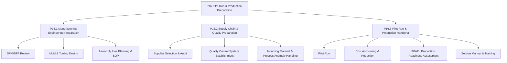
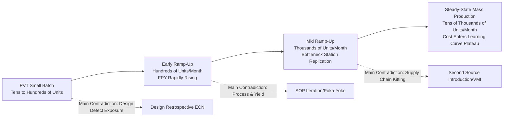
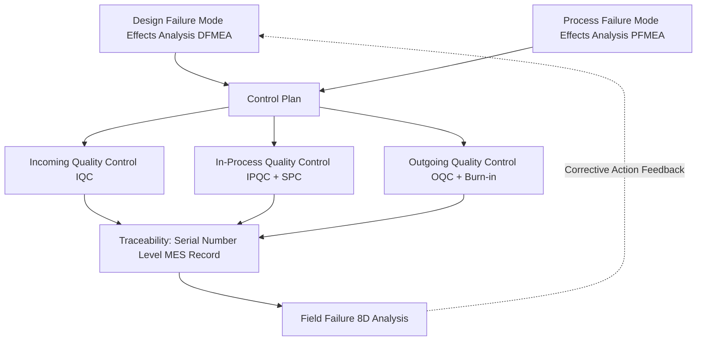
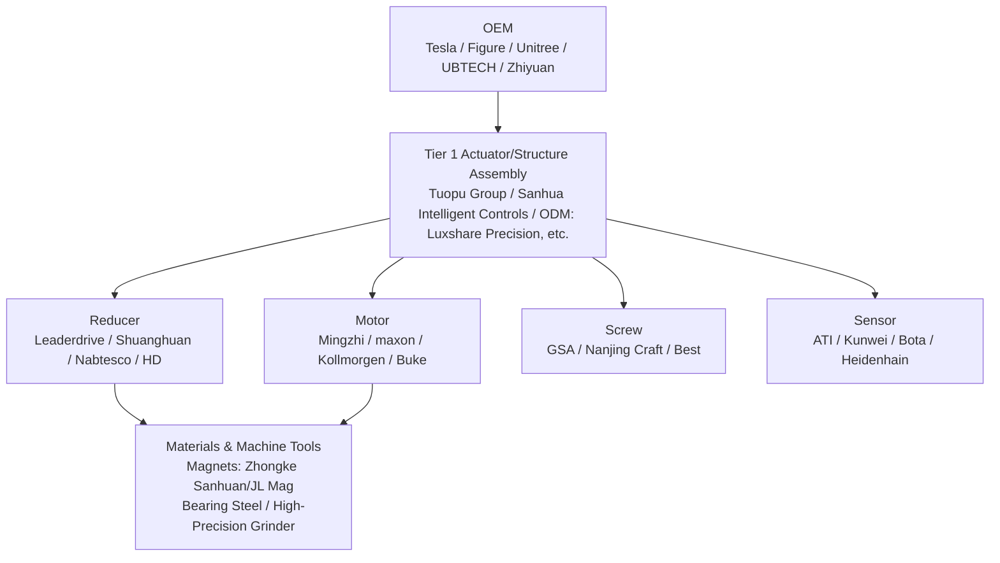

# Chapter 13: Mass Production and Scaling

## Summary

For humanoid robots to move from laboratory prototypes to deliveries of tens of thousands or hundreds of thousands of units, the gap to bridge is not just an engineering challenge, but a comprehensive manufacturing system capability: Design for Manufacturability, supply chain lock-in, pilot run validation, production ramp-up, yield engineering, cost curve management, and quality system establishment. This chapter uses the mass production process entities (from P0 Project Initiation to P16 Pilot Run and Production Preparation) in the knowledge graph as the main thread to systematically discuss six core issues of humanoid robot mass production: the mass production introduction process, production ramp-up models, yield and reliability engineering, cost curves and cost reduction paths, supply chain organization and supply assurance strategies, and manufacturing models of typical companies. This chapter provides quantitative tools such as the learning curve model for production ramp-up, series yield model, defect density model, and process capability index. It also depicts the engineering economics landscape of humanoid robot scaling, drawing on public practices from integrators like Tesla, Figure AI, Unitree Robotics, and Agility Robotics, as well as BOM cost trajectories from public industry forecasts such as Bank of America's *Humanoid Robots 101* (2025). This chapter complements Chapter 6 (Supply Chain) and Chapter 9 (Subsystem Design): Chapter 6 focuses on the supply-side landscape of components, Chapter 9 focuses on Design Validation (DV/PV) itself, while this chapter focuses on the manufacturing system problem of "producing a stable design, at low cost, and at scale."

**Keywords:** Mass Production Introduction; Production Ramp-up; Learning Curve; Yield Engineering; Process Capability Index; BOM Cost; DFM/DFA; PPAP; Supply Chain Assurance; Vertical Integration

---

## 13.1 From Prototype to Mass Production: The Overall Framework for Production Introduction

### 13.1.1 Fundamental Differences Between Prototype and Mass Production Mindsets

The goal of a laboratory prototype is to "prove it works," while the goal of a mass-produced product is to "prove it is repeatable." The differences in their engineering objective functions can be summarized as:

- **Prototype**: Maximize performance ceiling, tolerating manual debugging, one-off customization, and long assembly times.
- **Mass Production**: Minimize unit cost, assembly time, and quality variation, provided the performance floor meets specifications.

A humanoid robot typically contains 30–60 degrees of freedom, thousands of components, and dozens of suppliers. Any single point of variation—a batch of harmonic drives with excessive backlash, a batch of frameless torque motors with demagnetized magnets, or a loss of coaxiality in a joint module assembly—can be amplified at the system level into issues with walking stability or lifespan. Therefore, the essence of New Product Introduction (NPI) is the process of **systematically driving uncertainty out of the system**.

!!! note "Terminology Explanation: NPI, EVT/DVT/PVT, DV/PV, Production Readiness"
    - **NPI (New Product Introduction)**: The entire process of transforming a product design into a manufacturing system capable of stable mass production, encompassing process development, supply chain setup, pilot run validation, and ramp-up.
    - **EVT/DVT/PVT**: Three stages of prototype iteration: Engineering Validation, Design Validation, and Production Validation; PVT is followed by the production ramp-up.
    - **DV/PV (Design Validation / Production Validation)**: DV verifies "whether the design meets specifications," while PV verifies "whether the product manufactured using the mass production process still meets specifications." Chapter 9 has already discussed the test content of DV/PV; this chapter focuses on manufacturing consistency after PV.
    - **Production Readiness**: The simultaneous achievement of process freeze, supply chain freeze, and quality baseline freeze, typically marked by PPAP approval.

### 13.1.2 The Main Thread of the Mass Production Process in the Knowledge Graph: P0–P16

The knowledge graph models the complete process of a humanoid robot from project initiation to mass production as 17 stage entities (research/methods/ent_process_p0 … p16), forming the process backbone of the entire book:

| Stage | Name | Relationship with Mass Production |
|---|---|---|
| P0 | Project Initiation & Business Baseline | Define target cost, target volume, target market |
| P1 | Requirements Definition & System Concept (Concept / Pre-A) | Freeze product specifications and platform strategy |
| P2–P3 | Industrial Design & Mechatronic System Design | Determine the upper limit of manufacturability |
| P4–P5 | Joint Module & Drive System, Body Structure Engineering | Determine the main portion of BOM cost |
| P6–P9 | URDF Verification, Simulation, Structural & Thermal Iteration | Use simulation to reduce physical prototyping cycles |
| P10–P14 | Control, Dexterous Hand, AI, Electrical/Electronic & Software Integration | Determine manufacturing requirements for software flashability and calibration |
| P15 | System Integration & Verification/Validation (Integration & V&V) | DV/PV Verification |
| P16 | Pilot Run & Production Preparation (Pilot & Production Ramp) | Core of this chapter |

Stage P16 is further subdivided into three sub-process groups, corresponding exactly to the three work fronts of production preparation:



### 13.1.3 Milestones and "Freeze" Discipline in Production Introduction

A typical production introduction timeline includes four "freeze points," which require stricter discipline than the previous research culture in the humanoid robot industry:

1.  **Design Freeze**: Any subsequent changes must go through the ECN (Engineering Change Notice) process, assessing the impact on tooling, inventory, and shipped products.
2.  **Process Freeze**: Assembly sequence, tightening torque, dispensing volume, and calibration parameters are fixed into the SOP (Standard Operating Procedure).
3.  **Supply Freeze**: The Approved Vendor List (AVL) for critical materials and the ratio for second sources are determined.
4.  **Quality Baseline Freeze**: Outgoing Quality Control (OQC) specifications, reliability acceptance criteria, and traceability granularity (down to the joint module serial number level) are determined.

The PPAP (Production Part Approval Process), commonly used in the automotive industry, serves as a verification tool in the DV/PV context of Chapter 9. In the context of this chapter, it acts as the **legal document for production handover**: suppliers submit dimensional reports, material reports, performance test reports, and process capability data. The integrator can only approve supply according to the production takt time after receiving these documents.

## 13.2 Capacity Planning and Production Ramp-Up

### 13.2.1 Basic Metrics of Capacity: Cycle Time, Bottleneck, and OEE

Production line capacity is determined by the bottleneck station. Assuming a production line has \(n\) stations, and the cycle time of the \(i\)-th station is \(t_i\) (including operation time and loading/unloading time), the theoretical cycle time is:

$$
t_{cyc} = \max_{i=1,\dots,n} t_i, \qquad Q_{theory} = \frac{T_{avail}}{t_{cyc}}
$$

where \(T_{avail}\) is the available production time. Actual output must be multiplied by the **Overall Equipment Effectiveness (OEE)**:

$$
OEE = A \times P \times Q
$$

- \(A\) (Availability): Deducting time for changeovers, breakdowns, and material shortages;
- \(P\) (Performance): Ratio of actual cycle time to theoretical cycle time;
- \(Q\) (Quality): First Pass Yield (FPY).

Humanoid robot final assembly is still predominantly based on **manual assembly island production lines**—pre-assembly of joint modules, cable routing, and whole-machine calibration are highly dependent on skilled workers, which is fundamentally different from the highly automated assembly lines in the automotive industry. Typically, the cycle time for whole-machine final assembly in the small-batch phase is measured in "days/unit," and the ramp-up goal is to compress the bottleneck station to "hours/unit." The constraining factor is usually not final assembly, but rather **burn-in testing of joint modules and whole-machine calibration**: each joint requires temperature rise, backlash, efficiency, and noise testing; each whole machine requires gait calibration and sensor calibration. The time constants of these stations determine the investment in the production line.

!!! note "Terminology Explanation: Cycle Time, Bottleneck, OEE, FPY, Burn-in, Calibration"
    - **Cycle Time**: The time interval between the completion of two consecutive products on a production line, determined by the slowest station.
    - **Bottleneck**: The station with the longest cycle time; increasing the speed of non-bottleneck stations is ineffective for total capacity (Theory of Constraints, TOC).
    - **OEE (Overall Equipment Effectiveness)**: A standard metric for measuring overall equipment efficiency; a typical world-class value for discrete manufacturing is around 85%.
    - **FPY (First Pass Yield)**: The proportion of products that pass all inspections without rework; it is the most important health indicator during the ramp-up phase.
    - **Burn-in**: A screening process that involves powering on and running equipment under high temperature/full load to induce early failures.
    - **Calibration**: The process of writing sensor biases, joint zero points, and kinematic parameters into individual product configurations; each humanoid robot is unique, and calibration data must be archived with its serial number.

### 13.2.2 Production Ramp-Up Curves and Learning Models

The unit output during the ramp-up phase approximately follows an S-curve over time. Two types of models are commonly used in engineering.

**(1) Learning Curve (Wright's Law)**: For each doubling of cumulative production, the unit cost (or unit labor hours) decreases by a fixed percentage \(1-\phi\), where \(\phi\) is the learning rate:

$$
C(N) = C_1 \cdot N^{-b}, \qquad b = -\log_2 \phi
$$

The typical learning rate for discrete manufacturing is \(\phi \in [0.80, 0.95]\): \(\phi=0.85\) means that for each doubling of cumulative production, unit cost decreases by 15%. The joint modules of humanoid robots (integrated components of motor + reducer + encoder + driver) share process homology with consumer-grade drones and new energy vehicle drive motors, and a reference learning rate is approximately 0.85–0.92.

**(2) Ramp-Up Production Model**: Monthly output \(Q(t)\) during the ramp-up phase is approximately:

$$
Q(t) = Q_{max}\left(1 - e^{-t/\tau}\right)
$$

where \(\tau\) is the ramp-up time constant, determined jointly by production line debugging, worker proficiency, and supply chain kitting rate. Generally, for a completely new product category (with no inheritable process heritage), \(\tau\) is measured in quarters; for production lines involving automotive Tier 1 suppliers, \(\tau\) is significantly shortened—this is one reason why automotive-grade suppliers like Tesla, Tuopu Group, and Sanhua Intelligent Controls are highly valued by robot OEMs.



### 13.2.3 Typical Failure Modes and Countermeasures During Ramp-Up

The main contradiction during the ramp-up phase is not "producing slowly," but "producing inconsistently." Typical issues include:

- **Poor Inter-Batch Consistency**: Drift in the distribution of joint backlash between different shifts under the same SOP—countermeasure: **Poka-Yoke** design at critical stations and networked torque-angle curve recording for tightening tools;
- **Insufficient Calibration Capacity**: Whole-machine gait calibration relies on engineer experience—countermeasure: script and fixture the calibration process, transforming "expert parameter tuning" into "automated calibration stations";
- **Software Version Fragmentation**: Firmware in trial production batches inconsistent with shipping firmware—countermeasure: establish software baseline management within the Manufacturing Execution System (MES), combined with OTA (Over-The-Air) to achieve version uniformity after shipment (Knowledge Graph Entity: ent_technology_ota_software_update_2024);
- **Rework Stations Consuming Capacity**: When FPY falls below approximately 80%, rework can overwhelm the bottleneck station—countermeasure: establish a dedicated rework area and an 8D problem-solving process.

## 13.3 Yield Engineering and Manufacturing Quality

### 13.3.1 Series Yield Model: Why Humanoid Robot Yield is a "Multiplication Problem"

A humanoid robot is composed of thousands of parts and dozens of key modules connected in series. If the overall qualification requires all key processes to be qualified, and each process is approximately independent, then the overall first-pass yield is the product of the yields of each process:

$$
Y_{total} = \prod_{i=1}^{n} Y_i
$$

A simplified example illustrates the severity: Assuming a robot has 40 joint module processes and 20 final assembly processes, with each process yield at 99%, then

$$
Y_{total} = 0.99^{60} \approx 54.7\%
$$

That is, nearly half of the robots require rework. To achieve an overall FPY of 90%, the average single-process yield must satisfy

$$
\bar{Y} \ge 0.90^{1/60} \approx 99.82\%
$$

This explains why mass production of humanoid robots must align with the automotive industry's PPM (Parts Per Million) management approach: **The "decimal places" of single-point yield are exponentially amplified in a series system.**

### 13.3.2 Defect Density Model and Area/Complexity Scaling

For processes such as reducer tooth surfaces, motor magnet bonding, and PCB soldering, yield is often estimated using a defect density model. The Poisson model gives:

$$
Y = e^{-D_0 A}
$$

Where \(D_0\) is the defect density (defects per unit area or per joint), and \(A\) is the critical area (or number of solder joints, mating surfaces). The improved Murphy model accounts for defect clustering effects:

$$
Y = \left(\frac{1 - e^{-D_0 A}}{D_0 A}\right)^2
$$

The engineering implication is: **Reducing the critical area or the number of critical features is itself a yield engineering practice.** This explains the dual benefit of highly integrated joint modules (integrating motor, reducer, encoder, driver, and torque sensor) — it both reduces BOM and decreases the number of assembly interfaces, thereby exponentially improving series yield.

### 13.3.3 Statistical Process Control and Process Capability Index

Key characteristics (such as harmonic reducer backlash, joint zero-position error, and overall static balance) must be included in Statistical Process Control (SPC). The process capability index is defined as:

$$
C_p = \frac{USL - LSL}{6\sigma}, \qquad C_{pk} = \min\left(\frac{USL-\mu}{3\sigma}, \frac{\mu-LSL}{3\sigma}\right)
$$

Where \(USL/LSL\) are the upper and lower specification limits, and \(\mu,\sigma\) are the process mean and standard deviation. Automotive-grade requirements typically demand \(C_{pk} \ge 1.33\) (corresponding to approximately 63 PPM), while critical safety characteristics require \(C_{pk} \ge 1.67\). Currently, few suppliers can stably provide \(C_{pk}\) data for characteristics like joint backlash, lost motion, and efficiency. This is a capability that must be established during the P16.2.2 "Quality Control System Establishment" phase.

### 13.3.4 Reliability and Life Verification

Mass production quality is not only about passing factory inspection but also about remaining qualified throughout the product's lifespan. Key points for humanoid robot reliability engineering:

- **MTBF Target**: Industrial scenarios typically require a Mean Time Between Failures of thousands of hours; assuming two shifts per day, annual operation is approximately 4000–6000 hours, and the lifespan of critical robot components must cover the warranty period;
- **Accelerated Life Test (ALT)**: Apply over-rated load and high temperature to joint modules, extrapolating life using the inverse power law model:

$$
L = L_0 \left(\frac{S_0}{S}\right)^{m}
$$

Where \(S\) is the stress level, and \(m\) is a material/mechanism-related exponent (typically \(m\approx 3\)–\(5\) for fatigue failure);
- **Failure Mode Library**: Chapters 4 and 5 have discussed failure mechanisms for actuators and transmissions (tooth surface fatigue, bearing wear, magnet demagnetization, encoder contamination). During the mass production phase, these must be translated into inspection items and frequencies in the Control Plan.



### 13.3.5 Python Example: Series Yield and Ramp-Up Scrap Cost

The following script combines the series yield model from 13.3.1 with a ramp-up learning curve to estimate the additional manufacturing cost due to yield loss during the ramp-up phase and demonstrates the financial implication of "yield first, then capacity expansion":

```python
# Series yield and ramp-up scrap cost example
import math

# Total critical processes: 40 joint module processes + 20 final assembly processes
n_ops = 60

def total_yield(p_op, n=n_ops):
    """Series yield: overall first-pass yield when each process yield is p_op"""
    return p_op ** n

for p in [0.99, 0.995, 0.998, 0.999]:
    print(f"Single process yield {p:.1%} -> Overall FPY {total_yield(p):.1%}")

# Ramp-up learning curve: Monthly output Q(t) = Qmax * (1 - exp(-t/tau))
Qmax, tau = 2000, 9          # Steady-state monthly output 2000 units, ramp-up time constant 9 months
fpy0, fpy1, k = 0.55, 0.90, 0.25  # FPY converges from 55% to 90%, rate k
unit_cost = 25000            # Unit manufacturing cost during ramp-up (USD, order of magnitude estimate)

def monthly_output(t):
    return Qmax * (1 - math.exp(-t / tau))

def monthly_fpy(t):
    return fpy1 - (fpy1 - fpy0) * math.exp(-k * t)

scrap = 0.0
for t in range(24):          # First 24 months
    q = monthly_output(t)
    scrap += q * (1 - monthly_fpy(t)) * unit_cost

print(f"Total cumulative output over 24-month ramp-up: {sum(monthly_output(t) for t in range(24)):,.0f} units")
print(f"Scrap/rework cost magnitude due to yield loss: approximately {scrap/1e6:,.0f} million USD")
```

Engineering interpretation of the example: During the process where FPY climbs from 55% to 90%, the yield loss represents a cash outflow on the same order of magnitude as equipment investment. Therefore, the primary KPI during the ramp-up phase is not output but the **FPY slope** — which corroborates the qualitative judgment in 13.2.3 that "rework stations occupy production capacity."

## 13.4 Cost Curves and Cost Reduction Pathways

### 13.4.1 Current Status and Public Forecasts of BOM Costs

The Bill of Materials (BOM) cost is the primary constraint for the commercialization of humanoid robots. The magnitude picture given by public industry forecasts is as follows (all are estimates from analytical institutions, not audited data):

- Bank of America Institute's "Humanoid Robots 101" (April 2025, knowledge graph entity ent_report_bofa_humanoid_robots_101_2025) estimates: For a typical humanoid robot primarily using a Chinese supply chain, containing 16 rotary actuators, 14 linear actuators (planetary roller screws), a 6-DOF dexterous hand, depth cameras, and LiDAR, the BOM at the end of 2025 is approximately **$35,000/unit**;
- The same report predicts that the BOM will drop to **$13,000–$17,000/unit** between 2030 and 2035, implying an average annual reduction of approximately 14%, consistent with a learning curve model (\(\phi \approx 0.86\)–\(0.88\));
- An early anchor for consumer-level pricing has already appeared: Unitree Robotics' G1 humanoid robot has a public starting price of **$16,000** (knowledge graph entity ent_report_unitree_unitree_g1_humanoid_agent_pric_2024). Its approach sacrifices some performance (payload, battery life, protection rating) to achieve a lower price, validating the cost potential of the Chinese supply chain.

!!! note "Data Usage Note"
    The BOM and market size figures cited in this section and Chapter 28 are all public industry forecasts or publicly quoted company prices. They are forward-looking estimates from analytical institutions. Actual values depend on the technical route (harmonic vs. planetary, roller screw vs. trapezoidal screw, whether to equip dexterous hands and LiDAR) and production volume assumptions. Readers should treat them as magnitude references, not precise predictions.

### 13.4.2 BOM Structure: Where the Major Costs Lie

Based on component entities in the knowledge graph and public industry teardowns, the BOM of a full-size electrically actuated humanoid robot is roughly distributed according to the following structure (typically, there is significant variation depending on the specific design):

| Cost Item | Magnitude Share | Key Components (KG Entity Examples) | Cost Reduction Lever |
|---|---|---|---|
| Joint Actuators (Rotary + Linear) | 40%–60% | Harmonic Drives (Harmonic Drive, Leaderdrive), Planetary Gearboxes (Nabtesco, Wittenstein), Frameless Torque Motors (Kollmorgen, maxon), Planetary Roller Screws (GSA, Rollvis, Ewellix) | Integration, Domestic Substitution, Specification Downgrading |
| Dexterous Hand & End Effector | 5%–15% | Inspire Robots, DH Robotics, Wonik Robotics, Dexterous Hand Micro Screws/Tendons | DOF Reduction, Tendon-Driven Solutions |
| Computing & Sensing | 10%–20% | NVIDIA Jetson Platform, Depth Cameras (Orbbec), LiDAR (Hesai, RoboSense), IMU, 6-Axis Force Sensors (ATI, Kunwei, Bota Systems) | Domestic SoC, Sensor Reduction & Fusion |
| Battery & Power Supply | 3%–8% | Lithium Battery Pack (CATL, EVE Energy), BMS, DC-DC | Platform Battery Pack |
| Structure & Appearance | 5%–10% | Aluminum/Magnesium Alloy Die Casting & CNC, Carbon Fiber Covers | Die Casting Replacing CNC, Plastic Replacing Aluminum |
| Wiring & Electrical | 3%–5% | Connectors (TE Connectivity, JST), Wiring Harnesses | EtherCAT End-to-End, Wireless Solutions |

### 13.4.3 Four Pathways for Cost Reduction

**Pathway 1: Design-to-Cost (DTC).** Set a target cost during the P1–P5 stages and decompose it down to the module level. The method entity **Value Analysis / Value Engineering (VAVE, ent_method_value_analysis_value_engineering)** in the knowledge graph provides a systematic tool: for each component, ask "what is its function, and what is the lowest-cost solution to achieve that function?" Typical VAVE cases include: replacing high-reduction-ratio harmonic drives with Quasi-Direct-Drive (QDD) solutions (trading control bandwidth for reducer cost and volume, as in Unitree's approach); using planetary roller screws only for high-load joints (as in Tesla Optimus's concept); reducing dexterous hand DOF from 20+ to 6–11 to match real task requirements.

**Pathway 2: Scale-Driven Cost Reduction.** Described by the learning curve \(C(N)=C_1 N^{-b}\). A prerequisite for scale-driven cost reduction is Design for Manufacturing (DFM); otherwise, scaling only amplifies defect costs.

**Pathway 3: Supply Chain Cost Reduction.** Domestic substitution is a core lever for Chinese OEMs: shifting harmonic drives from Harmonic Drive Systems to Leaderdrive or Laifual, planetary gearboxes to Shuanghuan or Zhongda, and motors to Moons' or Jiangsu Leili. Public industry teardowns commonly report that such substitutions can lead to a 30%–60% reduction in component-level costs.

**Pathway 4: Manufacturing Cost Reduction.** This is the routinization of "Cost Accounting and Reduction" (Section 16.3.2): replacing full CNC machining (refer to the process boundary of knowledge graph entity ent_process_cnc_machining) with net-shape forming processes like die casting, MIM (Metal Injection Molding), and cold heading, reducing the machining time for structural parts by an order of magnitude; reducing direct labor through fixtures, automatic tightening, and automatic dispensing.

### 13.4.4 The Linkage Between Cost, Volume, and Price

OEMs face a dynamic system of simultaneous equations: price determines demand, demand determines volume, volume determines cost via the learning curve, and cost determines the feasible price. A simplified expression of this linkage is:

$$
P(N) = \frac{C_1 N^{-b}}{1 - m}
$$

where \(m\) is the target gross margin. When \(N\) is below the thousand-unit level, any positive-margin pricing struggles to meet the return on investment requirements of industrial customers (which typically require a payback period of 2–3 years for robots replacing human labor). Only when cumulative production enters the tens of thousands and the BOM drops below $20,000 does the Total Cost of Ownership (TCO) for industrial scenarios begin to close. This is the core conclusion of the "Mass Production and Scaling" chapter: **The commercialization of humanoid robots is fundamentally a race between the manufacturing learning curve and the scenario TCO curve.**

## 13.5 Supply Chain Organization and Supply Assurance Strategy

### 13.5.1 Identification of Key Long-Lead-Time Materials

The focus of supply chain management during the ramp-up period is on materials with **long lead times, high bottlenecks, and high volatility**. Based on knowledge graph entities and public industry information, the key bottleneck materials for humanoid robots include:

| Material | Bottleneck Cause | KG Related Entities |
|---|---|---|
| Planetary Roller Screw | Scarcity of high-precision grinders/whirling machines, concentrated process know-how | GSA, Rollvis, Ewellix, Nanjing Craft, Best |
| Harmonic Drive | Consistency in flexspline material and tooth profile machining | Harmonic Drive Systems, Leaderdrive, Laifual |
| High-Performance NdFeB Magnets | Fluctuations in rare earth raw materials and export controls | Zhongke Sanhuan, JL Mag, Zhenghai Magnet, Ningbo Yunsheng; ent_report_oceanwall_rare_earth_bottleneck_2025 |
| Automotive-Grade Computing Chips | Advanced process capacity and export policies | NVIDIA, Horizon, Black Sesame |
| Six-Axis Force/Torque Sensor | Calibration capacity and consistency | ATI, Kunwei, Bota Systems |
| High-End Encoder | Grating ruling process | Heidenhain, Renishaw, Tamagawa |

### 13.5.2 Supplier Selection, Audit, and Second-Source Strategy

The particularity of P16.2.1 "Supplier Selection and Audit" in the humanoid robot industry: a large number of core suppliers are cross-industry entrants from automotive parts, 3C, and medical device sectors, resulting in significant variation in the maturity of their quality systems (IATF 16949 or ISO 9001). Practical key points:

- **Tiered Management**: Allocate resources according to the "bottleneck/leverage/routine/critical" four-quadrant (Kraljic Matrix); harmonic drives, screws, and magnets fall under "bottleneck + critical" and must be dual-sourced or have capacity reservation agreements signed;
- **Process Audit**: Conduct VDA 6.3 or equivalent process audits for key suppliers, focusing on verifying the authenticity of SPC data and change management (unnotified material/process changes are the largest source of batch failures);
- **Second-Source Introduction Rhythm**: A second source is not only a bargaining tool but also an insurance for supply assurance; however, second-source parts must pass complete PPAP and full-machine A/B comparison verification to avoid "nominal dual-source, actual single-source";
- **Inventory Strategy**: For policy-volatile materials like rare earth magnets, safety stock can be estimated using

$$
SS = z \cdot \sigma_L \cdot \sqrt{LT}
$$

where \(z\) is the service level coefficient, \(\sigma_L\) is demand volatility, and \(LT\) is the replenishment lead time. The "right tail of the lead time distribution" caused by policy risks needs to be addressed using scenario-based reserves rather than normal distribution assumptions.

### 13.5.3 New Relationship Between OEMs and Tier 1 Suppliers

The humanoid robot industry is replicating the "OEM—Tier 1—Tier 2" stratification of the automotive industry. Clear Tier 1 supplier entities have already appeared in the knowledge graph: **Tuopu Group** (actuator assembly direction), **Sanhua Intelligent Controls** (electromechanical actuator direction). Both have transitioned from new energy vehicle thermal management and structural components, undertaking the outsourcing of actuator assemblies from OEMs. The engineering implications of this model are:

- OEMs focus on the "brain + cerebellum" (AI and motion control) and system integration, outsourcing the manufacturing learning curve of joint modules to Tier 1 suppliers with automotive mass production experience;
- Tier 1 suppliers then integrate upstream Tier 2 suppliers for reducers (Leaderdrive, Shuanghuan), motors (Mingzhi, Buke, etc.), and screws (Nanjing Craft, Best);
- OEMs retain the definition rights for key interfaces (communication protocols, torque-position characteristics, fail-safe behavior), i.e., the extension of the ICD described in Chapter 9.



## 13.6 Typical Manufacturing Models and Cases

### 13.6.1 Vertical Integration Model: Tesla Optimus

Tesla's (knowledge graph entity ent_oem_tesla) mass production philosophy inherits from its automotive business: **Design for Manufacturability Internalization** – first determine the target cost (publicly stated as a long-term sub-$20,000 price point) and target volume, then reverse-engineer the design of each actuator and screw; develop actuator assemblies in-house, reusing the company's casting, motor, and battery process heritage from automotive; the factory is the product ("the machine that builds the machine"), treating the production line itself as an iteration target. The risk lies in the need to build a learning curve for the entirely new actuator supply chain, resulting in higher short-term costs compared to outsourcing.

### 13.6.2 Dedicated Factory Model: Agility Robotics and Figure AI

Agility Robotics built RoboFab, a dedicated factory for Digit (knowledge graph entity product_digit), the first publicly announced humanoid robot-specific production line planned for an annual capacity of tens of thousands of units. Its significance lies in validating the unit economics of a "humanoid robot-specific manufacturing system." Figure AI (ent_oem_figure_ai) has publicly disclosed the capacity plan for its self-built factory, BotQ, and adopts a dual-track model of "in-house production + co-creation with automotive customer scenarios" (public collaborations with automakers like BMW). The factory serves both as a delivery capability and as an infrastructure for collecting real-world operational data – pointing to the deep connection between this chapter and Chapter 21 (Data Infrastructure): **A mass production factory is simultaneously a data factory.**

### 13.6.3 Cost Disruption Model: Unitree Robotics

Unitree Robotics' (ent_oem_unitree_robotics) path is to inversely define engineering specifications through consumer-level pricing: the G1, with a public starting price of $16,000 (ent_report_unitree_unitree_g1_humanoid_agent_pric_2024), targets the research and developer market, while the H1/H2 cover higher performance segments. The key to its manufacturing model is: in-house development and production of quasi-direct drive joints, extensive use of die-casting and extruded profiles for structural parts, and leveraging the motor and reducer supply chain already proven by its quadruped robots (Go2, etc.). This model demonstrates that, supported by the Chinese supply chain, the price decline of humanoid robots can be significantly faster than the industry's publicly forecasted average – at the cost of an initial gap between performance and industrial application requirements.

### 13.6.4 Comparison of the Three Models

| Dimension | Vertical Integration (Tesla) | Dedicated Factory (Agility/Figure) | Cost Disruption (Unitree) |
|---|---|---|---|
| Target Scenario | In-house factory → General Industry | Logistics/Manufacturing Customers | Research/Developer → Light Commercial |
| Core Barrier | Manufacturing process heritage + data loop | Scenario know-how + dedicated production line | Supply chain cost + rapid iteration |
| Mass Production Risk | Full-chain self-build, high capital expenditure | Dependent on single large customer adoption pace | Performance ceiling and industrial reliability |
| Cost Path | Scale + process reuse | Learning curve + customer co-sharing | Domestic supply chain + down-specced design |

## 13.7 Quality System and Mass Production Regulatory Alignment

Mass production of humanoid robots also requires crossing regulatory thresholds: the complete machine must meet target market requirements for electrical safety (e.g., IEC 60204-1), electromagnetic compatibility (EMC), functional safety (ISO 13849, IEC 61508), and human-robot collaborative safety (the spirit of ISO/TS 15066 extended to bipedal platforms); the standard organization entities in the knowledge graph (ISO, IEEE SA, ANSI/RIA, UL Solutions, TÜV SÜD, SGS) constitute the certification ecosystem. The mass production quality system typically uses ISO 9001 as a baseline, with IATF 16949 added for automotive customers. This chapter does not elaborate on standard clauses (see Appendix E), but emphasizes one point: **Certification capability must be built into the design before P16** – retroactively adding safety circuits (e.g., joint brakes, torque limits) almost inevitably overturns the existing design, a lesson repeatedly validated in the collaborative robot industry.

## 13.8 Chapter Summary

- The essence of mass production introduction is to eliminate uncertainty: the quadruple freeze of design, process, supply chain, and quality marks readiness for mass production, and PPAP is the legal handover document;
- Capacity ramp-up is dominated by bottleneck stations (joint aging test, whole-machine calibration), following the learning curve \(C(N)=C_1N^{-b}\), with a typical learning rate of 0.85–0.92;
- The yield rate of humanoid robots is a series multiplication problem: 60 processes with 99% yield result in only about 55% overall FPY; mass production must move toward PPM management and automotive-grade levels with \(C_{pk}\ge1.33\);
- Cost curve anchor points: industry public forecasts (BofA *Humanoid Robots 101*) give a BOM trajectory of approximately $35,000 in 2025 and $13,000–$17,000 in 2030–2035; Unitree G1, with a selling price of $16,000, provides an early consumer-side anchor;
- Bottleneck materials in the supply chain are planetary roller screws, harmonic reducers, NdFeB magnets, automotive-grade computing power, and six-axis force sensors; the rise of Tier 1 suppliers such as Tuopu and Sanhua indicates the formation of industry stratification;
- Manufacturing models diverge into three routes: vertical integration, dedicated factories, and cost disruption, with the common feature being that factories simultaneously assume the dual functions of manufacturing and data collection.

## Knowledge Graph Entities Covered in This Chapter

| Entity ID | Name | Reference Location in This Chapter |
|---|---|---|
| ent_process_p0 – p16 | Main process flow from project initiation to mass production (including all sub-processes of P16) | 13.1–13.7 |
| ent_method_value_analysis_value_engineering | Value Engineering/Value Analysis (VAVE) | 13.4.3 |
| ent_report_bofa_humanoid_robots_101_2025 | Bank of America Institute *Humanoid Robots 101* | 13.4.1 |
| ent_report_oceanwall_rare_earth_bottleneck_2025 | Rare Earth Bottleneck Analysis Report | 13.5.1 |
| ent_report_unitree_unitree_g1_humanoid_agent_pric_2024 | Unitree G1 Price Announcement | 13.4.1, 13.6.3 |
| ent_oem_tesla / ent_oem_figure_ai / ent_oem_unitree_robotics | Tesla / Figure AI / Unitree Robotics | 13.6 |
| ent_tier1_supplier_tuopujituan / ent_tier1_supplier_sanhuazhikong | Tuopu Group / Sanhua Intelligent Controls | 13.5.3 |
| ent_technology_ota_software_update_2024 | OTA Over-the-Air Update | 13.2.3 |
| ent_process_cnc_machining | CNC Machining Process | 13.4.3 |
| Appendix D Company Cards | Harmonic Drive, Nabtesco, Leaderdrive, maxon, Kollmorgen, ATI, Heidenhain, CATL, Orbbec, Hesai, etc. | 13.4.2, 13.5.1 |

## References

- Bank of America Institute. (2025-04). *Humanoid Robots 101*. https://institute.bankofamerica.com/content/dam/transformation/humanoid-robots.pdf (Included in the knowledge graph; its BOM and adoption forecasts are analyst estimates)
- Knowledge graph research/methods/ent_process_p0.md – ent_process_p16.md (Mass production process entity family)
- Appendix D: List of Major Suppliers and Companies; Appendix E: List of Standards, Regulations, and Certifications
