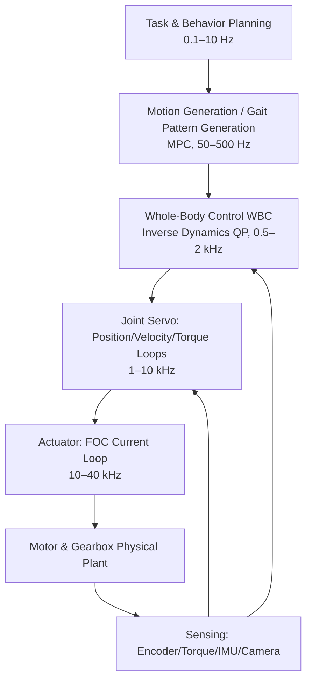
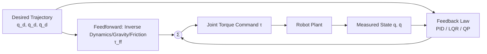
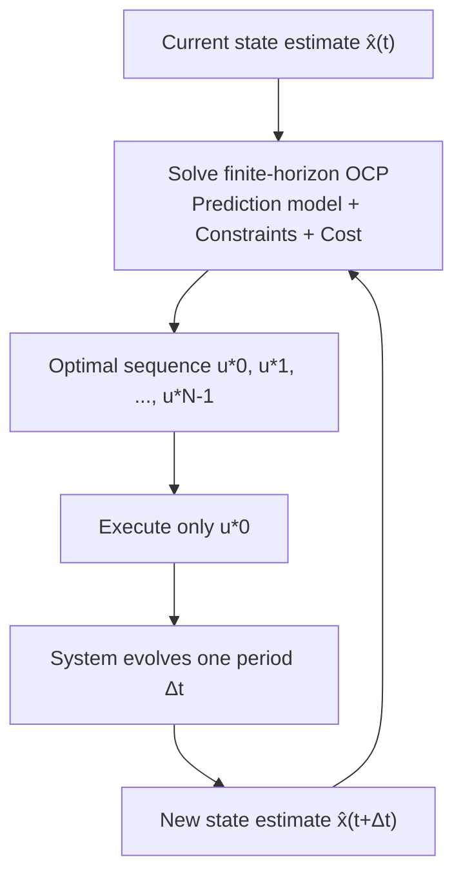

# Chapter 14: Fundamentals of Robot Control

## Summary

Chapter 8 presented the kinematic and dynamic models of a humanoid robot, and Chapter 9 detailed the physical implementation of its subsystems. The core question this chapter answers is: **Given a high-dimensional, floating-base, underactuated mechanical system whose contact with the environment constantly switches, how can joint torques be computed in real-time to achieve desired motions and maintain balance?** This chapter unfolds along a "bottom-up" control stack: it first discusses joint-level servo control—cascaded current/velocity/position loops, PID control laws and their discrete implementation, anti-windup and feedforward compensation, and impedance/admittance control for compliant interaction. It then moves to state-space methods, presenting the formalization of LQR, the algebraic Riccati equation, and gain scheduling. Next, it discusses the receding horizon principle of Model Predictive Control (MPC), its Quadratic Programming (QP) formulation, and real-time solution engineering. Finally, it systematically elaborates on Whole-Body Control (WBC)—task Jacobians, null-space projection, inverse dynamics QP, and hierarchical QP—and discusses system integration issues such as state estimation, real-time communication, and safety chains. The entire chapter is threaded by four main methodological lines: PID, LQR, MPC, and WBC, and provides two runnable Python examples. This chapter deliberately avoids repeating the kinematic/dynamic models and impedance control fundamentals already derived in Chapter 8, focusing instead on **the structure, algorithms, and engineering implementation of the controllers themselves**.

**Keywords**: Cascaded Control; PID; Anti-Windup; Torque Control; Impedance Control; State Space; LQR; Riccati Equation; Model Predictive Control; Quadratic Programming; Whole-Body Control; Null-Space Projection; Hierarchical QP; Real-Time; EtherCAT; Functional Safety

---

## 14.1 Overview of Humanoid Robot Control Problems

### 14.1.1 Control Stack Layering: From Power Switches to Whole-Body Behavior

The control of a humanoid robot is not a single algorithm but a **layered control stack** spanning five orders of magnitude in time scale. The lowest layer consists of the power electronic switches and Field-Oriented Control (FOC) inside the actuator, regulating motor phase currents at tens of kilohertz. Above this is the joint servo loop (current loop/velocity loop/position loop, see the discussion of FOC hardware in the actuator section of Chapter 4). Higher up, Whole-Body Control (WBC) solves for joint torques at 0.5–2 kHz. Above that, motion generation (MPC or gait pattern generators, typically 50–500 Hz) operates. The topmost layer is task and behavior planning, which can work at frequencies below 1 Hz.

!!! note "Terminology Explanation: Control Stack, Control Rate, Real-Time, Hard Real-Time, and Soft Real-Time"
    - **Control stack**: An architecture formed by stacking multiple layers of controllers according to frequency and abstraction level. Each layer sends reference quantities down to the layer below and reports status up to the layer above.
    - **Control rate**: The frequency at which a controller recalculates its output each cycle, measured in Hz. Joint servo is typically 1–10 kHz, WBC is typically 0.5–2 kHz.
    - **Real-time**: The property that computation results must be output before a deadline. Missing a deadline in a hard real-time system is considered a fault.
    - **Hard real-time**: No deadline miss is tolerated, e.g., motor current loops and emergency stop circuits.
    - **Soft real-time**: Occasional deadline misses only cause performance degradation, not catastrophic failure, e.g., perception and task planning.



Typical frequencies and latency budgets for each layer are shown in the table below (values are common industry orders of magnitude; specific platforms vary significantly):

| Layer | Typical Frequency | Per-Cycle Budget | Main Computational Content |
|---|---|---|---|
| FOC Current Loop | 10–40 kHz | 25–100 µs | Clarke/Park Transform, PI Regulation, PWM Modulation |
| Joint Servo Loop | 1–10 kHz | 100–1000 µs | PID, Feedforward, Filtering, Limiting |
| Whole-Body Control (WBC) | 0.5–2 kHz | 0.5–2 ms | Forward/Inverse Dynamics, QP Solving, Contact Force Distribution |
| Motion Generation (MPC) | 50–500 Hz | 2–20 ms | Finite Horizon Optimization, Footstep Planning |
| Task Planning | 0.1–10 Hz | >100 ms | Behavior Trees, State Machines, Semantic Decision Making |

The engineering implication of the layered architecture is: **the performance ceiling of any upper-layer algorithm is locked by the bandwidth and tracking accuracy of the lower-layer loops**. A WBC that is perfect in simulation will perform far worse than theoretical expectations if the joint torque loop bandwidth is only 20 Hz. Therefore, this chapter adopts a bottom-up narrative order.

### 14.1.2 Four Structural Difficulties in Humanoid Robot Control

Compared to fixed-base manipulators or wheeled chassis, the control problem for humanoid robots has four structural difficulties that determine the basic landscape of method selection in this chapter:

1.  **Floating Base and Underactuation**. A humanoid robot has no fixed base. The 6 degrees of freedom of its body pose have no direct actuators and can only be controlled indirectly through ground reaction forces (floating base dynamics, see Section 8.4.7 of Chapter 8). The total system degrees of freedom \(n + 6\) is greater than the number of actuators \(n\), making it a typical underactuated system.
2.  **Hybrid Dynamics**. The making/breaking of foot contact causes the dynamic equations to switch discretely with the contact state. The control law must switch constraint sets driven by a contact state machine and handle the impact at the moment of contact establishment.
3.  **High Dimensionality and Strong Coupling**. The whole-body degrees of freedom are typically 20–60. Inertial coupling is significant, and any single-joint independent control that ignores coupling will fail during dynamic walking.
4.  **Strict Real-Time Requirements**. Balance itself is a dynamically unstable problem (inverted pendulum). Control delay directly consumes stability margin. Generally speaking, for every 1 ms increase in end-to-end latency from sensor sampling to torque output, the magnitude of recoverable disturbances decreases.

### 14.1.3 Feedback, Feedforward, and Nominal/Error Decomposition

Almost all practical humanoid robot controllers can be written in the form of "**nominal feedforward + error feedback**":

$$
\tau = \tau_{\mathrm{ff}}(q_d, \dot q_d, \ddot q_d) + \tau_{\mathrm{fb}}(q_d - q, \dot q_d - \dot q, \ldots)
$$

where \(\tau_{\mathrm{ff}}\) is provided by the model (inverse dynamics, gravity compensation, friction model), and \(\tau_{\mathrm{fb}}\) is provided by the feedback law (PID, LQR, QP). The feedforward handles the torque demand for the "known part of the model," while the feedback only needs to correct for model errors and disturbances. This allows achieving the same tracking accuracy with lower feedback gains—crucial for interactive robots that need to maintain compliance and cannot infinitely increase stiffness.

!!! note "Terminology Explanation: Feedforward Control, Feedback Control, Computed Torque Control, Disturbance Observer"
    - **Feedforward control**: Uses a model to pre-calculate the required control input, independent of the error signal.
    - **Feedback control**: Calculates the control input based on the difference between the desired and measured states, capable of suppressing model errors and external disturbances.
    - **Computed torque control**: Uses an inverse dynamics model to feedback-linearize the nonlinear system into decoupled double integrators, then adds PD feedback. It is an extreme form of the feedforward+feedback idea.
    - **Disturbance observer (DOB)**: Estimates unmodeled torques as an augmented state and compensates for them, often used to replace high-gain feedback.



## 14.2 Joint-Level Servo Control

### 14.2.1 Cascade Control: Current Loop / Velocity Loop / Position Loop

Joint servos commonly use **cascade control**: the innermost loop is the current (torque) loop, the middle is the velocity loop, and the outermost is the position loop. The bandwidth of the inner loop must be significantly higher than that of the outer loop—typically, the bandwidth decreases by a factor of 3–10 for each outward layer—otherwise, the dynamics of the inner and outer loops interfere, making tuning meaningless.

The plant for the current loop is the electrical dynamics of the motor. After FOC transformation (see Chapter 4), the \(q\)-axis current approximately satisfies a first-order model

$$
L_q \frac{d i_q}{dt} = v_q - R_s i_q - k_e \omega_m
$$

where \(L_q\) and \(R_s\) are the stator inductance and resistance, \(k_e\) is the back-EMF constant, and \(\omega_m\) is the motor angular velocity. The electromagnetic time constant \(L_q/R_s\) is typically sub-millisecond, so the current loop bandwidth can reach several kilohertz. The joint output torque \(\tau_j = N \eta k_t i_q\) (where \(N\) is the reduction ratio, \(\eta\) is the transmission efficiency, and \(k_t\) is the torque constant), so the current loop is essentially a **torque loop**.

The plants for the velocity loop and position loop are the electromechanical dynamics:

$$
J_{\mathrm{eff}} \dot \omega = \tau_j - \tau_g(q) - \tau_f(\omega) - \tau_{\mathrm{ext}}
$$

where \(J_{\mathrm{eff}} = J_m N^2 + J_l\) is the sum of the motor rotor inertia amplified by the reduction ratio squared and the load inertia, \(\tau_g\) is the gravitational torque, \(\tau_f\) is the friction torque, and \(\tau_{\mathrm{ext}}\) is the external coupling torque. Note the amplification effect of \(N^2\): in high-reduction-ratio joints (e.g., harmonic drives, where \(N\) is typically 50–160), the load-side inertia and disturbances are reduced by a factor of \(N^2\) when reflected to the motor side. This makes high-reduction-ratio joints "naturally disturbance-rejecting but naturally opaque"—end-effector collision forces are also reduced by \(N^2\), making them difficult to sense via motor current. The Quasi-Direct-Drive (QDD) scheme deliberately uses a low reduction ratio (typically \(N = 6\!-\!12\)) to gain torque transparency and backdrivability, at the cost of the current loop having to directly bear load disturbances, imposing higher demands on servo design.

!!! note "Terminology Explanation: Cascade Control, Bandwidth, Torque Constant, Backdrivability, Torque Transparency"
    - **Cascade control**: Multiple control loops nested, with the output of the outer loop serving as the setpoint for the inner loop. Tuning must proceed from the innermost loop outward.
    - **Bandwidth**: The frequency at which the closed-loop magnitude response drops to \(-3\) dB, indicating how fast the loop can track commands.
    - **Torque constant (\(k_t\))**: The motor torque produced per unit current, in N·m/A.
    - **Backdrivability**: The ability to drive the motor in reverse from the output side; low-reduction-ratio transmissions have good backdrivability.
    - **Torque transparency**: The degree to which output torque can be accurately estimated using only current, without a dedicated torque sensor.

### 14.2.2 PID Control Law and Discrete Implementation

**PID Control** is the main algorithm for joint servos. Its continuous form is

$$
u(t) = K_p e(t) + K_i \int_0^t e(s)\, ds + K_d \frac{d e(t)}{dt}
$$

where \(e(t) = r(t) - y(t)\) is the tracking error. The roles of the three terms can be summarized as: the proportional term provides immediate correction and determines response speed; the integral term eliminates steady-state errors caused by constant disturbances (e.g., gravity, Coulomb friction); the derivative term provides damping and suppresses overshoot. Åström and Hägglund's *Advanced PID Control* systematically summarizes PID tuning and anti-disturbance design, while Ogata's *Modern Control Engineering* provides a classic frequency-domain analysis framework; both are standard references for this topic.

Digital controllers sample with period \(T_s\). Common discrete implementations include the **positional form**:

$$
u[k] = K_p e[k] + K_i T_s \sum_{j=0}^{k} e[j] + K_d \frac{e[k] - e[k-1]}{T_s}
$$

and the **incremental form (velocity form)**:

$$
\Delta u[k] = K_p \left(e[k] - e[k-1]\right) + K_i T_s e[k] + \frac{K_d}{T_s}\left(e[k] - 2e[k-1] + e[k-2]\right)
$$

The incremental form outputs the increment of the control variable, naturally avoiding explicit accumulation of the integral term and providing bumpless transfer during manual/automatic switching, making it more common in engineering.

### 14.2.3 Engineering Details: Anti-Windup, Derivative Filtering, and Feedforward

There is a gap between textbook PID and practically usable PID, filled with a series of engineering details. Missing any one of them can cause oscillations or even accidents on a real machine.

**Anti-windup**. When the actuator output is limited (current limit, torque limit), a persistent error can cause the integral term to accumulate indefinitely (integral windup), leading to large overshoot after the saturation is removed. A common solution is **back-calculation**: feeding the saturation difference back to the integrator via a gain \(K_t\),

$$
I[k+1] = I[k] + K_i T_s e[k] + K_t T_s \left( u_{\mathrm{sat}}[k] - u_{\mathrm{unsat}}[k] \right)
$$

where \(u_{\mathrm{unsat}}\) and \(u_{\mathrm{sat}}\) are the control variable before and after limiting. A typical choice is \(K_t = 1/\sqrt{K_p K_d}\) or selected based on the reciprocal of the integral time constant.

**Derivative filtering**. The derivative term amplifies measurement noise and must be cascaded with a low-pass filter, forming a "filtered derivative":

$$
D(s) = \frac{K_d s}{1 + s / N_f}
$$

The filter coefficient \(N_f\) is typically 5–20. Additionally, to avoid "derivative kick" caused by step changes in the setpoint, **derivative on measurement** is often used in practice: the derivative acts only on the measured value, not on the error.

**Feedforward and compensation**. Following the decomposition in Section 14.1.3, joint servos typically superimpose three feedforward terms:

$$
\tau_{\mathrm{cmd}} = \underbrace{J_{\mathrm{eff}} \ddot q_d + \tau_g(\hat q) + \hat \tau_f(\hat \omega)}_{\text{Model Feedforward}} + \underbrace{K_p e + K_d \dot e + K_i \int e}_{\text{Feedback}}
$$

Among these, gravity compensation \(\tau_g(\hat q)\) provides the greatest benefit for humanoid robots: the gravitational torque at leg and arm joints can reach 30–50% of the peak torque. Without compensation, the integral term must bear this load alone, leading to sluggish startup and steady-state jitter. Friction compensation \(\hat\tau_f\) commonly uses a Coulomb + viscous model \(\hat \tau_f = b\hat\omega + F_c \,\mathrm{sgn}(\hat\omega)\), but reducer friction drifts with temperature and wear; calibration methods are discussed in Section 8.3.10 on parameter identification.

| Engineering Aspect | Purpose | Typical Practice | Consequence of Omission |
|---|---|---|---|
| Anti-windup | Suppress overshoot under saturation | Back-calculation, integrator clamping | Large overshoot, impact loads |
| Derivative filtering | Suppress noise amplification | First-order low-pass \(N_f = 5\!-\!20\) | High-frequency torque jitter, current heating |
| Derivative on measurement | Avoid setpoint step impact | Derivative acts on measured value | Torque spikes during step response |
| Gravity feedforward | Relieve feedback burden | Online calculation of \(\tau_g(\hat q)\) | Steady-state error, startup lag |
| Friction feedforward | Improve low-speed tracking | Coulomb + viscous model | Stick-slip, limit cycles |
| Notch/low-pass filtering | Avoid mechanical resonance | Set notch frequency based on FFT spectrum | Resonant screeching, structural fatigue |

### 14.2.4 Interaction-Oriented Torque Control: Impedance, Admittance, and Hybrid Force-Position Control

When a robot physically contacts the environment, pure position control can produce uncontrolled contact forces under geometric errors, necessitating **compliant control**. Section 8.4.11 of Chapter 8 has already derived the dynamic foundations of **Impedance Control**, **Admittance Control**, and **Hybrid Force-Position Control**. This section supplements three points from a servo implementation perspective.

First, **the essence of impedance control is modifying the reference for the torque loop**. The desired "virtual spring-damper-inertia" relationship is written as a torque command

$$
\tau = J^T(q)\left[ K_t (x_d - x) + D_t (\dot x_d - \dot x) + \Lambda (\ddot x_d - \ddot x) \right] + \tau_g(q)
$$

Its closed-loop behavior depends on the fidelity of the torque loop: QDD joints estimate torque via current, while Series Elastic Actuators (SEA) measure torque via spring deformation; both can achieve relatively "soft" impedance. High-reduction-ratio joints, however, require an additional joint torque sensor; otherwise, impedance control is only nominal.

Second, **admittance control is a compliance patch for position-controlled robots**. The admittance outer loop corrects the position reference based on the measured force \(x_c = x_d + \Delta x(F_{\mathrm{ext}})\), while the inner loop remains a high-gain position servo. Therefore, it is suitable for high-stiffness joints such as harmonic drive joints, but the stability of contact transients is limited by the outer loop sampling rate and sensor noise.

Third, **hybrid force/position control decomposes the task space by direction**. In constrained directions (e.g., foot normal, insertion direction), force is closed-loop controlled; in free directions, position is closed-loop controlled. The selection matrices \(S\) and \(I - S\) implement the projection (see 8.4.11). For a humanoid robot, the foot sole during the stance phase is essentially a "position-constrained direction," while tasks such as wiping dust or pressing truly require force closed-loop control.

!!! note "Terminology explanation: impedance control, admittance control, hybrid force-position control, series elastic actuator"
    - **Impedance control**: Controls the dynamic relationship (inertia-damping-stiffness) that the robot presents to the environment; output is force, input is motion deviation.
    - **Admittance control**: The dual of impedance—input is force, output is motion correction, wrapped around the position loop.
    - **Hybrid force-position control**: Orthogonally decomposes the task space into a force-controlled subspace and a position-controlled subspace.
    - **Series elastic actuator (SEA)**: A series elastic element is placed between the actuator and the load to measure force via deformation and provide inherent compliance, at the cost of bandwidth limited by the spring-inertia resonance.

### 14.2.5 Python Example: Single-Joint Servo Simulation—Effect of Gravity Feedforward and Anti-Windup

Below is a numerical simulation of a single pendulum joint (e.g., shoulder flexion joint) demonstrating the combined effect of PID + gravity feedforward + back-calculation anti-windup. Readers can toggle the `use_ff` and `use_aw` switches to observe changes in steady-state error and saturation overshoot.

```python
# Single-joint (pendulum) servo simulation: PID + gravity feedforward + back-calculation anti-windup
import numpy as np
import matplotlib.pyplot as plt

# Joint parameters (approximating a shoulder/elbow joint)
m, l, g = 2.0, 0.30, 9.81      # Link mass (kg), center of mass distance (m), gravitational acceleration
J = m * l**2                    # Moment of inertia about the joint
b = 0.05                        # Viscous friction
tau_max = 8.0                   # Torque limit (N·m)
Ts = 1e-3                       # Servo period 1 kHz
T = 3.0
N = int(T / Ts)

# Reference trajectory: smooth step from 0 to 1 rad (fifth-order polynomial)
qd = np.ones(N) * 1.0

# PID gains
Kp, Ki, Kd = 25.0, 12.0, 1.2
Kt = 1.0 / np.sqrt(Kp * Kd)     # Back-calculation anti-windup gain

use_ff = True   # Enable gravity feedforward
use_aw = True   # Enable anti-windup

q, w = 0.0, 0.0
I = 0.0
log_q, log_tau = [], []

for k in range(N):
    e = qd[k] - q
    ed = -w                       # Derivative on measurement: differentiate measured value
    tau_g = m * g * l * np.sin(q) # Gravity torque
    tau_ff = tau_g if use_ff else 0.0
    u_unsat = tau_ff + Kp * e + Kd * ed + I
    u = np.clip(u_unsat, -tau_max, tau_max)
    if use_aw:
        I += Ki * Ts * e + Kt * Ts * (u - u_unsat)
    else:
        I += Ki * Ts * e
    # Joint dynamics: J q̈ + b q̇ = u - τ_g
    acc = (u - b * w - tau_g) / J
    w += acc * Ts
    q += w * Ts
    log_q.append(q); log_tau.append(u)

t = np.arange(N) * Ts
plt.plot(t, qd, 'k--', label='reference')
plt.plot(t, log_q, label='q (ff+aw)' if (use_ff and use_aw) else 'q')
plt.xlabel('t [s]'); plt.ylabel('q [rad]'); plt.legend(); plt.grid(True)
plt.show()
```

## 14.3 State-Space Control and Linear Quadratic Regulator

### 14.3.1 State-Space Models, Linearization, and Discretization

PID is a single-input single-output method, while the balancing problem of humanoid robots is inherently multivariable and coupled. The state-space approach writes the system as

$$
\dot x = f(x, u), \qquad y = h(x)
$$

Performing a Taylor expansion around the nominal point \((x_0, u_0)\) and neglecting higher-order terms yields the linearized model

$$
\delta \dot x = A \delta x + B \delta u, \quad A = \left.\frac{\partial f}{\partial x}\right|_{x_0, u_0}, \quad B = \left.\frac{\partial f}{\partial u}\right|_{x_0, u_0}
$$

A digital controller requires a discrete model. For zero-order hold (ZOH) discretization with sampling period \(T_s\):

$$
A_d = e^{A T_s} \approx I + A T_s + \frac{(A T_s)^2}{2}, \qquad B_d = \left( \int_0^{T_s} e^{A s} ds \right) B
$$

The validity of the linearized model is local: the further a disturbance pushes the state from the nominal point, the larger the model error. This is why state-space methods on humanoid robots are always used in conjunction with the aforementioned nominal trajectory generation (Chapter 15) or gain scheduling (Section 14.3.4).

### 14.3.2 Stability Concepts and the Lyapunov Criterion

The minimum requirement for control is not "good tracking" but "not falling." For a linear system \(\dot x = A x\), a necessary and sufficient condition for asymptotic stability is that all eigenvalues of \(A\) lie in the left half-plane. For nonlinear systems, a common tool is **Lyapunov's second method**: if a positive definite function \(V(x)\) (interpretable as energy) can be found, and along the system trajectory \(\dot V(x) = \nabla V \cdot f(x) < 0\), then the equilibrium point is asymptotically stable.

!!! note "Terminology: Lyapunov function, asymptotic stability, region of attraction, control Lyapunov function"
    - **Lyapunov function**: A scalar function that attains its minimum at the equilibrium point and decreases monotonically along system trajectories; it serves as an "energy certificate" for stability.
    - **Asymptotic stability**: Sufficiently small initial deviations eventually converge back to the equilibrium point.
    - **Region of attraction**: The set of initial states that converge back to the equilibrium point; for humanoid robots, limited by the support polygon, the region of attraction is always finite.
    - **Control Lyapunov Function (CLF)**: A function for which, for every state, there exists a control input such that \(\dot V < 0\); it can be used directly as a control constraint (see Chapter 15 on CLF-guided running learning).

A direct corollary of Lyapunov's idea in humanoid robotics is that any "energy-based" control (e.g., shaping the total mechanical energy into a desired form) inherently carries the rudiments of a stability argument; whereas purely data-driven controllers, without such structure, can only rely on extensive testing to vouch for their stability (see Chapter 15, Section 15.4).

### 14.3.3 LQR: Formulation and the Algebraic Riccati Equation

The **Linear Quadratic Regulator (LQR)** is the most practical feedback law within the state-space approach. For a linear system \(\dot x = A x + B u\), LQR minimizes the infinite-horizon quadratic cost

$$
J = \int_0^{\infty} \left( x^T Q x + u^T R u \right) dt
$$

where \(Q \succeq 0\) penalizes state deviations and \(R \succ 0\) penalizes control effort. The optimal feedback is linear state feedback

$$
u = -K x, \qquad K = R^{-1} B^T P
$$

where \(P\) is the unique positive definite solution to the **Continuous-time Algebraic Riccati Equation (CARE)**:

$$
A^T P + P A - P B R^{-1} B^T P + Q = 0
$$

For discrete systems, the corresponding Discrete Algebraic Riccati Equation (DARE) applies; `scipy.linalg.solve_discrete_are` can solve it directly. The value of LQR lies not in the word "optimal" itself, but in that it compresses multivariable feedback design into tuning the two matrices \(Q\) and \(R\), and the closed-loop system possesses classical robustness margins against gain and phase perturbations (for the state feedback form, gain margin \([1/2, \infty)\), phase margin \(\geq 60^\circ\)).

Tuning \(Q\) and \(R\) has clear physical meaning: increasing an element in \(Q\) means "this state deviation is more expensive," and the feedback will correct it more aggressively. Bryson's rule suggests taking \(Q_{ii} = 1/x_{i,\max}^2\) and \(R_{ii} = 1/u_{i,\max}^2\) to make each cost term dimensionless, followed by fine-tuning.

### 14.3.4 Gain Scheduling and Time-Varying LQR

A single LQR is only effective near the nominal point. The standard approach for handling periodic large-deviation motions like walking is:

1. **Offline**: Linearize point-by-point along the nominal trajectory \(\{(x_0(t), u_0(t))\}\) to obtain the time-varying system \(A(t), B(t)\), solve the time-varying Riccati equation (TV-LQR) to obtain a sequence of feedback gains \(K(t)\); or sample several key points according to the gait phase and solve an LQR for each.
2. **Online**: Look up or interpolate the gain for the current phase, and execute \(\delta u = -K(t)\, \delta x\).

The optimization-based motion planning, estimation, and control system developed by Kuindersma et al. for the Boston Dynamics Atlas during the DARPA Robotics Challenge (published in *Autonomous Robots* 2016) employed a combination of "offline trajectory optimization + TV-LQR feedback + QP whole-body control," marking a landmark engineering validation of this paradigm on humanoid robots. In recent years, time-varying LQR also often appears as a byproduct of solving Differential Dynamic Programming (DDP)—the backward propagation of DDP's second-order expansion naturally yields time-varying linear quadratic gains (see Chapter 15, Section 15.3).

### 14.3.5 Python Example: LQR Design for Inverted Pendulum Balancing

Taking the simplification of single-leg standing as an inverted pendulum (ankle joint input torque) as an example, design a discrete LQR and simulate recovery from an angular disturbance. This example also demonstrates the linearization from Section 14.3.1 and the DARE solution from Section 14.3.3.

```python
# Inverted Pendulum LQR Balancing Control
import numpy as np
from scipy.linalg import solve_discrete_are
import matplotlib.pyplot as plt

# Physical parameters: inverted pendulum approximation (center of mass height h, mass m)
m, h, g = 60.0, 0.9, 9.81
I = m * h**2                    # Moment of inertia about the ankle (approximate)
# State x = [theta, theta_dot], input u = ankle torque
# Linearization: thetä = (m g h / I) theta + (1/I) u
A = np.array([[0.0, 1.0],
              [m * g * h / I, 0.0]])
B = np.array([[0.0], [1.0 / I]])

# ZOH discretization (first-order Euler approximation, acceptable for small Ts)
Ts = 0.005
Ad = np.eye(2) + A * Ts
Bd = B * Ts

# LQR weights: penalize angle deviation much more than angular velocity, moderate torque weight
Q = np.diag([100.0, 1.0])
R = np.array([[0.5]])
P = solve_discrete_are(Ad, Bd, Q, R)
K = np.linalg.inv(R + Bd.T @ P @ Bd) @ (Bd.T @ P @ Ad)
print("LQR gain K =", K)

# Simulation: initial angular disturbance of 0.1 rad
N = 600
x = np.array([0.1, 0.0])
log = []
for k in range(N):
    u = -K @ x
    x = Ad @ x + Bd.flatten() * u
    log.append([x[0], x[1], u[0]])

log = np.array(log)
t = np.arange(N) * Ts
fig, ax = plt.subplots(2, 1, sharex=True)
ax[0].plot(t, log[:, 0]); ax[0].set_ylabel('theta [rad]'); ax[0].grid(True)
ax[1].plot(t, log[:, 2]); ax[1].set_ylabel('u [N·m]'); ax[1].set_xlabel('t [s]'); ax[1].grid(True)
plt.show()
```

## 14.4 Model Predictive Control (MPC)

### 14.4.1 Receding Horizon Optimization Principle

LQR is optimal over an infinite horizon but cannot explicitly handle constraints—yet the core constraints of humanoid robots (joint limits, torque limits, friction cones, ZMP support polygon) are precisely hard constraints. **Model Predictive Control (MPC)** solves a finite-horizon open-loop optimal control problem at each control cycle:

$$
\begin{aligned}
\min_{u_{0:N-1},\, x_{1:N}} \quad & \sum_{k=0}^{N-1} \ell(x_k, u_k) + \ell_f(x_N) \\
\text{s.t.} \quad & x_{k+1} = f(x_k, u_k), \quad k = 0, \ldots, N-1 \\
& x_k \in \mathcal{X}, \quad u_k \in \mathcal{U} \\
& x_0 = \hat x(t)
\end{aligned}
$$

Then **only the first control** \(u_0^*\) is executed, and at the next cycle, the problem is re-solved with the new state estimate \(\hat x\)—this is the receding horizon mechanism. The prediction model is "re-anchored" to the current state at each solution, giving MPC both the foresight of optimization and the robustness of feedback. Borrelli, Bemporad, and Morari's *Predictive Control for Linear and Hybrid Systems* is the standard textbook in this field.



The choice of horizon length \(N\) and discrete time step \(\Delta t\) is a core trade-off: the prediction horizon \(N \Delta t\) must cover the dominant dynamics of the controlled object (typically 0.5–1.5 s for humanoid balance control), while more steps slow down the solution. The cost of MPC compared to LQR is computational: LQR requires only one matrix-vector multiplication online, while MPC must solve an optimization problem at each cycle.

### 14.4.2 From Optimal Control Problem to Quadratic Programming

When the cost is quadratic, the model is linear (or linearized), and the constraints are linear (or linearized friction cones), the above OCP transforms into the standard form of a **Quadratic Program (QP)**

$$
\min_{z} \; \frac{1}{2} z^T H z + g^T z \quad \text{s.t.} \quad A_{\mathrm{eq}} z = b_{\mathrm{eq}}, \quad A_{\mathrm{in}} z \leq b_{\mathrm{in}}
$$

where the optimization variable \(z\) stacks the states and controls over the horizon. The optimality of a QP is characterized by the **KKT conditions (Karush-Kuhn-Tucker conditions)**: at the optimal solution, the gradients, equality constraints, and inequality constraint multipliers satisfy complementary slackness. A convex QP is a convex optimization problem; any local optimum is global, and polynomial-time algorithms exist—this is the theoretical foundation for real-time MPC.

QP solvers fall into two main families: **active-set methods** iterate along constraint boundaries and, when **warm started** with the previous cycle's solution, typically require only a few iterations, making them suitable for very short control cycles; **interior-point methods** absorb inequality constraints into the objective via barrier functions, with iteration counts insensitive to problem size, making them suitable for large sparse problems. In humanoid robot MPC practice, structure exploitation (handing the sparse, time-step-blocked QP structure to Riccati recursion or block-sparse factorization) often determines solution speed more than the solver choice itself.

!!! note "Terminology: QP, KKT Conditions, Active-Set Method, Interior-Point Method, Warm Start, Condensing"
    - **QP (quadratic program)**: An optimization problem with a quadratic objective and linear constraints; the main solution form for real-time MPC.
    - **KKT conditions**: First-order necessary conditions for constrained optimization; also sufficient for convex problems.
    - **Active-set method**: A QP iterative method that maintains a set of "active constraints" and moves between constraint surfaces.
    - **Interior-point method**: An iterative method that approaches the optimal solution along a central path inside the constraints.
    - **Warm start**: Initializing the current iteration with the previous solution, significantly reducing the number of iterations.
    - **Condensing**: Eliminating state variables using dynamic equations to obtain a dense, small QP containing only control variables; efficient for short horizons, but destroys sparsity for long horizons.

### 14.4.3 Real-Time Engineering: Linearization, Precomputation, and Delay Compensation

Transforming humanoid robot MPC from an offline algorithm to an online controller requires a set of standard engineering techniques:

- **Model reduction and linearization**. Full-order floating-base dynamics (see Section 8.4.7) are high-dimensional and strongly nonlinear; performing nonlinear MPC at 1 kHz is still challenging. The mainstream approach is model reduction: using simplified models like the Linear Inverted Pendulum Model (LIPM) or single rigid body (centroidal dynamics) as the MPC prediction model, and leaving full-order tracking to WBC (see Section 15.3.2).
- **Single-step linearization + multi-step prediction**. At each MPC cycle, linearize only once around the current nominal trajectory to obtain a Linear Time-Varying (LTV) model, approximating the nonlinear MPC as a single QP; this sacrifices nonlinear accuracy but gains orders of magnitude in speed.
- **Precomputation and code generation**. Matrix values \(A(t), B(t)\) can be precomputed offline along the nominal trajectory; QP solver code can be auto-generated for a fixed problem structure, eliminating dynamic memory allocation.
- **Delay compensation**. The sensing-computation-actuation chain has a 1–5 ms delay; the standard practice is to forward-simulate the state estimate by one delay period before solving the MPC, otherwise optimization starts from an incorrect initial condition.
- **Infeasibility handling**. Large disturbances can make the QP infeasible; engineering practice rewrites critical constraints (e.g., ZMP support polygon) as soft constraints with slack variables and applies a large penalty to the slack, ensuring the solver always returns a "least-bad" solution.

| Design Knob | Typical Value | Benefit of Increasing/Relaxing | Cost |
|---|---|---|---|
| Prediction horizon \(N\Delta t\) | 0.5–1.5 s | Stronger foresight, better footstep planning | Solution time increases approximately linearly |
| Discrete time step \(\Delta t\) | 10–40 ms | Higher resolution | More steps, matrix ill-conditioning |
| Prediction model | LIPM / Single Rigid Body / Full-Order | Higher fidelity | Nonlinearity, slower solution |
| Solution frequency | 50–500 Hz | Faster disturbance recovery | Computational power and energy |
| Constraint softening | Slack + large penalty | Avoids infeasibility crashes | Constraints temporarily violated |

### 14.4.4 Spectrum of MPC Applications in Humanoid Robots

MPC in humanoid robots appears hierarchically by prediction model:

1. **Pattern generation-level MPC**: Uses ZMP/CoM as states to generate CoM trajectories and ZMP references (the preview control in Section 15.2.2 can be seen as a special case), typically at 50–200 Hz.
2. **Centroidal dynamics MPC**: Uses CoM position/velocity and angular momentum as states, ground reaction forces as inputs, directly optimizing reaction force distribution and footstep locations over future contact phases, typically at 100–500 Hz. The convex MPC of MIT Cheetah 3 and the QP framework of Atlas belong to this category (detailed in Section 15.3.2).
3. **Whole-body/full-order MPC**: Directly optimizes joint trajectories and contact sequences on full-order dynamics. Limited by computational power, it has long remained offline or low-frequency online. Recently, with advances in GPU sampling and physics engines, new forms have emerged, such as whole-body MPC for legged robots based on MuJoCo (Whole-Body Model-Predictive Control of Legged Robots with MuJoCo) and diffusion-annealing full-order sampling MPC (Full-Order Sampling-Based MPC for Torque-Level Locomotion Control), representing the frontier directions discussed in Chapter 15.

## 14.5 Whole-Body Control (WBC)

### 14.5.1 Task Functions and Task Jacobian

**Whole-Body Control (WBC)** uniformly coordinates all \(n\) joints and all contacts at the torque level, enabling the robot to simultaneously accomplish multiple tasks: centroid tracking, posture stabilization, swing foot trajectory, hand end-effector pose, joint limit avoidance, etc. Each task is written as a task-space quantity \(\sigma_i(q)\) (e.g., centroid position, swing foot pose), and its time derivative is given by the **Task Jacobian**:

$$
\dot \sigma_i = J_i(q)\, \dot q, \qquad \ddot \sigma_i = J_i(q)\, \ddot q + \dot J_i(q, \dot q)\, \dot q
$$

If the desired task acceleration is \(\ddot \sigma_i^*\) (typically generated by a task-space PD law \(\ddot \sigma_i^* = \ddot \sigma_i^d + K_p(\sigma_i^d - \sigma_i) + K_d(\dot\sigma_i^d - \dot\sigma_i)\)), the control problem becomes: **find joint accelerations \(\ddot q\) that minimize all task errors while satisfying the dynamics equations, contact constraints, and limits**.

### 14.5.2 Weighted QP and Null-Space Projection

There are two basic strategies for handling multiple tasks.

**Weighted strategy**: Stack all task errors with weights into a single objective,

$$
\min_{\ddot q} \; \sum_i w_i \left\| J_i \ddot q + \dot J_i \dot q - \ddot \sigma_i^* \right\|^2
$$

The weights \(w_i\) express the relative importance of tasks. This approach is simple to implement and computationally fast, but weights only provide "soft" priorities—errors for high-weight tasks may still be non-zero, and weight tuning varies with task combinations.

**Strict hierarchy**: High-priority tasks are satisfied exactly, while lower-priority tasks are optimized only in the **null space** of higher-priority tasks. For two tasks, the solution is

$$
\ddot q = J_1^{\dagger} \left( \ddot \sigma_1^* - \dot J_1 \dot q \right) + N_1\, \xi, \qquad N_1 = I - J_1^{\dagger} J_1
$$

where \(J_1^{\dagger}\) is the pseudoinverse of Task 1's Jacobian, \(N_1\) projects into the null space of \(J_1\), and \(\xi\) is determined by optimizing Task 2 (which can recursively treat \(J_2 N_1\) as a new effective Jacobian). Null-space projection ensures that any action of Task 2 does not interfere with Task 1—this is the standard mechanism for redundant robots to exploit extra degrees of freedom (see Chapter 8, Section 8.2.4 for kinematic discussion of redundancy and null space).

!!! note "Terminology: Task Space, Pseudoinverse, Null-Space Projection, Task Priority, Regularization"
    - **Task space / operational space**: A coordinate space describing motion in task-relevant quantities (centroid, end-effector pose).
    - **Moore-Penrose pseudoinverse (\(J^{\dagger}\))**: Provides the minimum-norm solution \(\dot q = J^{\dagger}\dot\sigma\).
    - **Null-space projection**: The matrix \(N = I - J^{\dagger}J\) projects any joint velocity onto the set of directions that do not change the task quantity.
    - **Task priority**: The hierarchical relationship among tasks; under strict priority, lower-priority tasks must not degrade the solution of higher-priority tasks.
    - **Regularization**: Adding a small penalty \(\| \cdot \|\) in the pseudoinverse/QP to avoid gain explosion near singularities.

### 14.5.3 Inverse Dynamics QP: Standard Formulation of WBC

The mainstream approach for modern torque-level WBC is the **Inverse-Dynamics QP Formulation**. The decision variables are \(\nu = [\ddot q^T, \tau^T, f_c^T]^T\) (joint accelerations, joint torques, contact forces), with constraints from **Floating-Base Dynamics**:

$$
M(q)\, \ddot q + h(q, \dot q) = S^T \tau + J_c(q)^T f_c
$$

where \(M\) is the inertia matrix, \(h\) includes Coriolis/centrifugal/gravity terms, \(S\) is the actuation selection matrix (the first 6 rows of the floating base are unactuated), \(J_c\) is the contact Jacobian, and \(f_c\) are contact forces. The standard QP is written as

$$
\begin{aligned}
\min_{\ddot q, \tau, f_c} \quad & \sum_i w_i \left\| J_i \ddot q + \dot J_i \dot q - \ddot\sigma_i^* \right\|^2 + \lambda_{\tau} \|\tau\|^2 + \lambda_{f} \|f_c\|^2 \\
\text{s.t.} \quad & M \ddot q + h = S^T \tau + J_c^T f_c && \text{(Dynamic consistency)}\\
& J_c \ddot q + \dot J_c \dot q = 0 && \text{(Zero contact point acceleration)}\\
& f_c \in \mathcal{F} && \text{(Friction cone + CoP constraints, see 8.4.13)}\\
& \tau_{\min} \leq \tau \leq \tau_{\max} && \text{(Torque limits)}\\
& \ddot q_{\min} \leq \ddot q \leq \ddot q_{\max} && \text{(Acceleration limits)}
\end{aligned}
$$

The solved \(\tau\) is directly sent to the joint torque loop. A key property of this formulation is that **the first 6 dynamics equations (floating-base rows) bind "body acceleration—contact forces—joint torques" together**, so balance is not dependent on any single task but is globally guaranteed by the dynamic constraints. In practice, the friction cone is often linearized as a pyramid to maintain the QP's linear structure.

### 14.5.4 Hierarchical QP WBC

When tasks have hard priorities, the null-space idea from 14.5.2 can be combined with the QP from 14.5.3 to form **Hierarchical QP Whole-Body Control**: a sequence of QPs is solved from highest to lowest priority, where each QP optimizes the lower-priority objective while adding the condition "must not degrade the optimal value of all previous QPs" as equality/inequality constraints. This approach was pioneered by de Lasa et al., systematized by Herzog et al., and given a complete engineering exposition for real robots by Kim et al. in "Hierarchical QP whole-body control: from theory to practice" (including constraint consistency and regularization details).

Comparison with weighted QP:

| Dimension | Weighted QP | Hierarchical QP |
|---|---|---|
| Priority | Soft (weight ratio) | Hard (strict hierarchy) |
| Computation | Single QP, fast | Cascaded QP, roughly times number of layers |
| Weight tuning | Varies with task combinations, tedious | Weights still needed within layers, but not between layers |
| Constraint feasibility | Single problem, easy to diagnose | Need to prevent high-layer constraints from making lower layers infeasible |
| Application scenarios | Tasks of equal importance, speed-oriented | Safety/balance tasks must be absolutely prioritized |

For humanoid robots, "contact constraints + balance (centroid/ZMP)" are typically placed at the highest level, followed by swing foot and hand end-effector tasks, with posture and joint limit avoidance at lower levels.

### 14.5.5 Engineering Implementation Points

- **Contact state machine**: \(J_c\) and constraint sets switch with support phases (left support/right support/double support); WBC must be strictly synchronized with the gait state machine. At contact establishment, use impact models or short-term admittance transitions to avoid torque jumps from abrupt QP constraint changes.
- **State consistency**: QP relies on accurate values of \(M(q), h(q,\dot q), J_c(q)\), which depend on floating-base pose estimation—WBC and state estimation (14.6.1) form a closed loop; estimation drift directly manifests as torque errors.
- **Solver frequency and regularization**: WBC typically runs at 0.5–2 kHz; \(\lambda_{\tau}, \lambda_{f}\) both suppress the solution norm (energy saving, noise reduction) and ensure the QP is strictly convex and numerically well-conditioned. Near singular configurations, the pseudoinverse requires damping (damped least squares).
- **Interface with higher layers**: MPC/motion generators output centroid acceleration references, swing foot trajectories, and desired contact forces; WBC treats these as tasks \(\ddot\sigma_i^*\) and regularization targets. When the higher layer runs at a lower frequency (hundreds of Hz), WBC must interpolate the references internally.
- **Torque interface**: WBC outputs desired joint torques; final quality depends on the torque loop fidelity from Section 14.2. QDD and joints with torque sensors are currently the mainstream interfaces.

### 14.5.6 Python Example: Two-Task Null-Space Projection

Using a 3-link planar arm (\(n=3\), end-effector position task dimension 2, redundancy 1) to demonstrate strict priority: Task 1 is end-effector position tracking, Task 2 is joint centering (posture). It can be observed that Task 2 only acts within the null space.

```python
# Two-task strict priority (null-space projection) example
import numpy as np

def fk(q, L):
    # End-effector position of a planar 3R arm
    x = L[0]*np.cos(q[0]) + L[1]*np.cos(q[0]+q[1]) + L[2]*np.cos(q.sum())
    y = L[0]*np.sin(q[0]) + L[1]*np.sin(q[0]+q[1]) + L[2]*np.sin(q.sum())
    return np.array([x, y])

def jac(q, L):
    s1 = q[0]; s12 = q[0]+q[1]; s123 = q.sum()
    J = np.array([
        [-L[0]*np.sin(s1)-L[1]*np.sin(s12)-L[2]*np.sin(s123), -L[1]*np.sin(s12)-L[2]*np.sin(s123), -L[2]*np.sin(s123)],
        [ L[0]*np.cos(s1)+L[1]*np.cos(s12)+L[2]*np.cos(s123),  L[1]*np.cos(s12)+L[2]*np.cos(s123),  L[2]*np.cos(s123)]
    ])
    return J

L = [0.30, 0.25, 0.20]
q = np.array([0.3, 0.5, -0.4])
q_home = np.array([0.0, 0.6, -0.6])   # Joint-centered reference
xd = np.array([0.45, 0.15])           # End-effector target

Kp, K2 = 8.0, 2.0
dt = 0.01
for step in range(300):
    J = jac(q, L)
    x = fk(q, L)
    v1 = Kp * (xd - x)                # Task 1: Desired end-effector velocity
    J1_pinv = np.linalg.pinv(J)
    N1 = np.eye(3) - J1_pinv @ J      # Null-space projection matrix
    v2 = K2 * (q_home - q)            # Task 2: Joint-centering velocity
    qd = J1_pinv @ v1 + N1 @ v2       # Strict priority synthesis
    q = q + qd * dt

print("Final end-effector position:", fk(q, L), "Target:", xd)
print("Final joint angles:", q)
```

## 14.6 Control System Integration and Selection

### 14.6.1 State Estimation Interface

All the aforementioned controllers assume that the states \(q, \dot q\) and the floating-base pose are known. However, the 6 degrees of freedom of the floating base cannot be measured directly and must be estimated by fusing IMU, joint encoders, and contact information. The mainstream approach for legged robot state estimation is to jointly optimize or filter IMU preintegration, forward kinematic leg-length constraints, and contact factors. Representative works include Legged Robot State-Estimation Through Combined Forward Kinematic and Preintegrated Contact Factors, and Adaptive Invariant Extended Kalman Filter for Legged Robot State Estimation for terrain uncertainty. The engineering key point is contact detection: incorrect contact assumptions can cause kinematic constraints to bias the estimate. Common criteria are a combination of foot force switch thresholds and impact detection. The coupling between the control loop and state estimation in this chapter is further discussed in Chapter 15, Section 15.5.

### 14.6.2 Real-Time Communication and Scheduling

The layers of the control stack are distributed across multiple computing nodes: MCUs (FOC) within the drives, joint-level controllers, a central real-time computer (WBC/MPC), and a high-performance computer (perception/learning policies). The determinism of the inter-node bus directly determines the achievable upper-layer frequency:

| Bus | Typical Cycle | Jitter | Role in Humanoid Robots |
|---|---|---|---|
| EtherCAT | 100 µs–1 ms | Microsecond level | Mainstream joint bus, distributed clock synchronization |
| CAN / CAN-FD | 1–10 ms | Depends on load rate | Low-speed sensing, battery management, some joints |
| Ethernet (UDP/TCP) | Uncertain | Millisecond level | Perception data, non-real-time commands |

The central real-time computer typically runs a real-time patched Linux (PREEMPT_RT) with CPU isolation and FIFO scheduling to bound the worst-case latency of the WBC thread. For applications requiring higher determinism, commercial real-time operating systems such as QNX are used. The Distributed Clocks mechanism of EtherCAT aligns the sampling phases of all joints to the microsecond level, which is a prerequisite for the distributed implementation of torque-level WBC.

### 14.6.3 Safety Chain and Fail-Safe Protection

Humanoid robots operate in close proximity to humans, so the control system must assume that it can fail and be designed with a **safety chain** accordingly:

1. **Functional Safety Standard Framework**: The overall machine safety integrity is decomposed according to the SIL level of IEC 61508 or the PL level of ISO 13849; personal care robots must also comply with ISO 13482, and collaborative scenarios refer to the force/pressure limits of ISO/TS 15066.
2. **Hardware Layer**: Safe Torque Off (STO) cuts motor torque at the drive hardware level, independent of software; the emergency stop circuit is hardwired.
3. **Software Layer**: A watchdog monitors control cycle timeouts; torque/velocity/position envelope monitoring (degradation upon exceeding limits); fall detection triggers protective postures (tuck legs, protect head).
4. **Degradation Strategy**: When sensor failure occurs (e.g., a single foot force sensor disconnects), switch to low-bandwidth position control or safe shutdown, rather than crashing directly.

Control algorithm selection must consider the safety chain: optimization-based controllers (MPC/WBC) must always have a "hold last cycle + rapid decay" fallback logic for when solving fails; learning-based policies (Chapter 15) are typically wrapped with a model-based safety filter.

### 14.6.4 Method Comparison and Selection Guide

| Method | Model Dependency | Constraint Handling | Multivariable Coupling | Computational Cost | Typical Position in Humanoid Robots |
|---|---|---|---|---|---|
| PID | None (local) | External clamping | None (per joint) | Very low | Joint servo |
| PID + Feedforward | Inverse dynamics/gravity | External clamping | Partially compensated via feedforward | Very low | Joint servo, static tasks |
| Impedance/Admittance | Target impedance model | Indirect | Via Jacobian | Low | Interaction tasks, compliant walking |
| LQR / TV-LQR | Linearized model | No explicit constraints | Yes | Low (lookup table) | Balance stabilization, trajectory tracking |
| MPC | Predictive model | Explicit (core advantage) | Yes | Medium–High | Gait generation, centroid control |
| WBC (QP) | Full-order inverse dynamics | Explicit | Yes (inherent) | Medium | Torque-level whole-body coordination |

Selection heuristic: **Solve at the lowest possible layer** (joint friction/gravity compensation at the servo layer is much cheaper than forcing WBC to compute it); **the harder the constraint, the more it belongs in MPC/WBC**; **the less accurate the model, the more reliance on feedback and learning** (Chapter 15).

### 14.6.5 Chapter Summary

This chapter has established a methodology for humanoid robot control from the bottom up along the control stack: joint-level PID and feedforward compensation determine the fidelity of torque/position tracking; state-space methods (LQR and its time-varying forms) provide feedback with stability guarantees for multivariable balance; MPC incorporates hard constraints into online optimization, serving as the hub connecting planning and control; whole-body control (inverse dynamics QP / hierarchical QP) coordinates whole-body tasks and contacts uniformly at the torque level. These modules will be assembled in Chapter 15 into a complete walking and motion generation system: the gait generator and MPC provide centroid/footstep references, WBC tracks them, and joint servos execute them.
