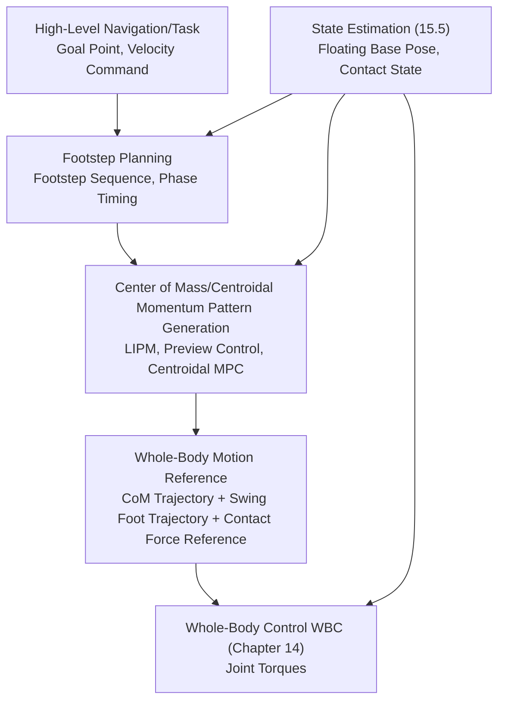
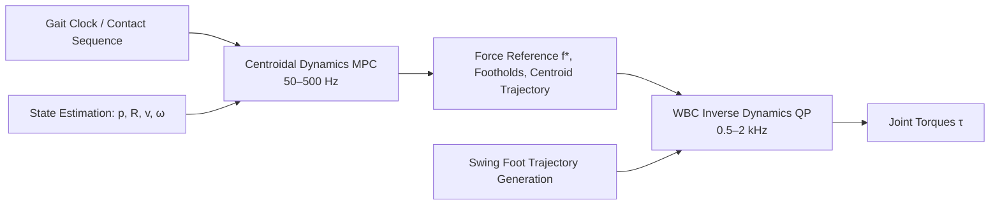
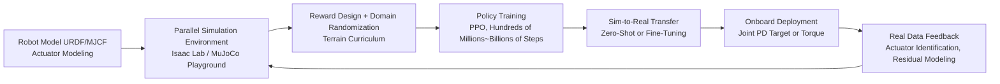

# Chapter 15: Motion Generation and Locomotion

## Summary

Chapter 14 addressed the "how to control" problem; this chapter addresses the "what to control" problem: **how to generate motion commands for humanoid robots, from standing still to walking, running, jumping, and even traversing terrain**. The uniqueness of bipedal motion generation lies in: support is discontinuous (discrete switching of contact sequences), balance is dynamic (the center of mass cannot remain within the support polygon), and the goal is periodic (gait). This chapter unfolds along three technical routes. The first is **pattern generation based on simplified models**: centered on the Linear Inverted Pendulum Model (LIPM), deriving ZMP preview control, swing foot trajectory, and footstep feedback based on Capture Point (CP)/Divergent Component of Motion (DCM)—this is the most mature and interpretable route since ASIMO. The second is **optimization-based motion generation**: trajectory optimization methods such as shooting, direct collocation, and DDP; convexification and online implementation of centroidal dynamics MPC; and new advances in full-order/sampling-based MPC. The third is **learning-based motion generation**: large-scale parallel reinforcement learning pipelines, reward and domain randomization design, representative works on blind and perceptive terrain walking, motion imitation and expressive whole-body control (ExBody, HOVER, ASAP, HugWBC, etc.), and agile behaviors such as running, jumping, and parkour. Finally, the supporting roles of state estimation and terrain perception, typical whole-robot control stacks, and performance evaluation metrics are discussed, along with a judgment on the convergence trend of model-based and learning-based methods.

**Keywords**: Gait; Support Phase; Double Support; LIPM; ZMP Preview Control; Capture Point; DCM; Footstep Planning; Trajectory Optimization; Direct Collocation; DDP; Centroidal Dynamics MPC; Reinforcement Learning; Domain Randomization; Sim-to-Real; Motion Imitation; Froude Number; Cost of Transport

---

## 15.1 Structure of the Bipedal Locomotion Problem

### 15.1.1 Gait Phases and Gait Parameters

Walking is a periodic process, whose smallest unit is the **gait cycle**: the process between two consecutive ground contacts of the same foot. The gait cycle is decomposed into several **phases** based on contact state:

| Phase | Contact State | Typical Proportion in Human Gait | Robot Control Key Points |
|---|---|---|---|
| Double Support (DS) | Both feet on ground | ~20% (two phases, each ~10%) | Weight transfer, ZMP transition from front foot to rear foot |
| Single Support (SS) | Support foot on ground, swing foot off ground | ~40% × 2 | Lateral center of mass transfer, swing foot trajectory tracking |
| Flight Phase | Both feet off ground | 0 for walking; >0 for running | Exists only for running/jumping, center of mass ballistic trajectory uncontrollable |

Common parameters describing gait include: **step length** (longitudinal distance between consecutive foot landing points), **stride length** (distance between consecutive landing points of the same foot, approximately twice the step length), **cadence** (steps per minute), **step width** (lateral distance between landing points), and **gait cycle duration**. Walking speed is approximately equal to step length multiplied by cadence; increasing walking speed can be achieved by increasing either step length or cadence, but step length is limited by leg length and stability margin, while cadence is limited by swing leg inertia and actuator bandwidth. The product of the two has an engineering upper bound.

!!! note "Terminology Explanation: Gait Cycle, Double Support Phase, Single Support Phase, Step Length, Cadence, Static Walking and Dynamic Walking"
    - **Gait cycle**: A complete repetitive unit of gait, from one foot's ground contact to the next ground contact of the same foot.
    - **Double support (DS)**: The phase when both feet are simultaneously on the ground, with body weight transferring between the feet.
    - **Single support (SS)**: The phase when only one foot supports the body while the other foot swings.
    - **Step length**: The distance between the landing points of two consecutive feet along the direction of travel.
    - **Cadence**: The number of steps per unit time, commonly expressed in steps/minute.
    - **Static walking**: Slow walking where the projection of the center of mass always remains within the support polygon, allowing the robot to stop at any moment.
    - **Dynamic walking**: Fast walking where the center of mass can move outside the support polygon, relying on momentum and foot placement to prevent falling; the mainstream approach for humanoid robots.

### 15.1.2 Hierarchical Architecture of Motion Generation

Corresponding to the control stack in Chapter 14, motion generation is also hierarchical, with the core task being the step-by-step refinement of "where to go" into "the torque for each joint at this moment":



This decomposition of "footstep → center of mass → whole body" is feasible because the stability of a bipedal system is primarily governed by the dynamics of the center of mass relative to the supporting foot; as long as the center of mass pattern is consistent with the contact forces, whole-body details (how the arms swing, how the head turns) are second-order effects on balance. The rise of learning-based approaches does not negate this hierarchy: most learned whole-body strategies still explicitly or implicitly learn a similar decomposition (e.g., using base linear velocity as the primary task variable), though the boundaries become blurred (see 15.4).

### 15.1.3 Spectrum of Stability Criteria: From Static Stability to Capture Region

The first step in motion generation algorithms is to select a mathematical formulation for "not falling". Historically, a spectrum of criteria has formed:

1.  **Static Stability**: The projection of the center of mass lies within the support polygon. Overly conservative, only suitable for very slow walking.
2.  **ZMP Criterion**: The Zero Moment Point (ZMP, derivation see Chapter 8, Section 8.4.4) remains within the support polygon. Allows center of mass motion but requires controllable horizontal moments—the backbone criterion for current pattern generation.
3.  **Capture Point (CP) Criterion**: Given the current center of mass position and velocity, the CP gives the point where "stepping here will bring the robot to a stop" (Chapter 8, Section 8.4.9). It translates "will it fall?" into "can it step there?", naturally suited for footstep planning and push recovery.
4.  **Feasible Capture Region / Reachability Analysis**: Considers the number of steps and the reachable area for foot placement, answering "can it stop within N steps?"—a more complete but computationally heavier criterion.

In engineering practice, these criteria are not mutually exclusive: ZMP is used for planning the center of mass reference (ensuring executability), while CP/DCM is used for online footstep correction (ensuring disturbance rejection). The two are integrated through the framework in Section 15.2.

## 15.2 Gait Generation Based on Simplified Models

### 15.2.1 LIPM Review and Analytical Structure

**Linear Inverted Pendulum Model (LIPM)** Assumptions: Constant center of mass height \(z_c = h\), negligible angular momentum changes, massless legs. The horizontal motion of the CoM is decoupled as

$$
\ddot x = \omega^2 (x - p_x), \qquad \ddot y = \omega^2 (y - p_y), \qquad \omega = \sqrt{g/h}
$$

where \(p = (p_x, p_y)\) is the ZMP position (see Section 8.4.14 for full derivation). Three structural facts of the LIPM determine all pattern generation methods in this chapter:

- **The unstable modal time constant** is \(1/\omega = \sqrt{h/g}\). For a CoM height of about 0.9 m, this is approximately 0.3 s—this is why humanoid robot balance control must be fast, and it is the physical root of the real-time budget in Chapter 14.
- **Orbital energy** \(E = \tfrac{1}{2}\dot x^2 - \tfrac{1}{2}\omega^2(x - p)^2\) is conserved during free motion and can be used to determine whether the CoM will pass over the support point.
- **Capture Point** \(\xi = x + \dot x / \omega\) is the divergent component of the LIPM; placing the ZMP directly on the CP nullifies the divergent component, which is the theoretical basis for foot placement control in 15.2.4.

The Cart-table model provides a physical interpretation of the LIPM: the acceleration \(\ddot x\) of the cart on the table and the table pivot point (ZMP) satisfy \(p = x - \ddot x\, h/g\), meaning "to place the ZMP where desired, move the CoM with the corresponding acceleration."

### 15.2.2 ZMP Preview Control

CoM trajectories generated purely from the analytical LIPM solution cause the ZMP to exhibit sharp, spike-like transitions, inconsistent with the desired smooth ZMP reference (smooth transfer between feet during double support). The **preview control** proposed by Kajita et al. treats the ZMP as the system output and uses a servo concept to make the actual ZMP track a future segment of the ZMP reference.

Taking the CoM jerk \(u = \dddot x\) as the control input and the state as \(x = [x, \dot x, \ddot x]^T\), the system is

$$
\dot x = \begin{bmatrix} 0 & 1 & 0 \\ 0 & 0 & 1 \\ 0 & 0 & 0 \end{bmatrix} x + \begin{bmatrix} 0 \\ 0 \\ 1 \end{bmatrix} u, \qquad p = \begin{bmatrix} 1 & 0 & -h/g \end{bmatrix} x
$$

To eliminate steady-state error, an integrator is augmented for the ZMP tracking error \(e = p^{\mathrm{ref}} - p\), resulting in the augmented system \((\bar A, \bar B, \bar C)\). The performance index for preview control is

$$
J = \sum_{k} \left( e_k^2 + R\, \Delta u_k^2 + \Delta x_k^T Q\, \Delta x_k \right)
$$

where \(\Delta\) denotes the increment. Solving the infinite-horizon LQ problem yields the optimal control law

$$
u_k = -K_I \sum_{j=0}^{k} e_j - K_x \Delta x_k + \sum_{l=1}^{N_L} K_p(l)\, p^{\mathrm{ref}}_{k+l}
$$

The three terms are: integral feedback (to eliminate error), state feedback (for stabilization), and **preview feedforward** (to act in advance using the ZMP reference for the next \(N_L\) steps). The preview horizon \(N_L\) must cover the dominant time constant of the LIPM, typically corresponding to 1–2 s. The preview gains \(K_p(l)\) can be computed offline; online computation is merely a vector inner product, requiring minimal computation—this is why this method became an industry standard in an era of limited computational power.

!!! note "Terminology Explanation: Preview Control, Augmented System, Jerk Input, Preview Gain, Pattern Generator"
    - **Preview Control**: An optimal control method that uses preview information of the future reference trajectory for feedforward.
    - **Augmented System**: The system resulting from incorporating additional dynamics such as integrators or filters into the state-space model.
    - **Jerk**: The derivative of acceleration. Using jerk as input ensures continuous CoM acceleration, thus smooth contact forces.
    - **Preview Gain**: The feedforward coefficient for the reference at each future step, derived offline from the Riccati solution of the LQ problem.
    - **Pattern Generator**: A module that generates the CoM trajectory based on footstep locations and the ZMP reference.

### 15.2.3 Swing Foot Trajectory and Double Support Transition

Beyond the CoM trajectory, the pattern generator must also output the swing foot trajectory. Its design constraints are: boundary conditions for start/end position, velocity, and acceleration; foot lift height (for obstacle clearance and preventing dragging); normal velocity at lift-off/touchdown (excessive touchdown velocity causes impact); and obstacle avoidance shape. Common constructions:

- **Joint/Cartesian Polynomials**: Use quintic polynomials to connect start and end boundary conditions for each direction; a cycloid profile \(z(t) = \tfrac{h_s}{2}\left(1 - \cos(\pi t / T_s)\right)\) provides a smooth lift-lower curve with zero normal touchdown velocity (\(h_s\) is foot lift height, \(T_s\) is swing duration).
- **Double Support Transition**: The ZMP reference smoothly shifts from the rear foot to the front foot (typically using a ramp or quintic curve); the lateral CoM sway amplitude must match the step width; shortening the double support duration increases speed, but the ZMP transfer time is limited by ankle torque bandwidth.
- **Asymmetric Steps and Start/Stop**: Starting and stopping are half-step patterns requiring specific boundary condition handling; otherwise, the integral term of the preview control can cause transient overshoot.

### 15.2.4 Foot Placement Feedback Based on CP/DCM

Preview control is an "open-loop pattern + closed-loop tracking" approach, which is not sufficiently direct for large disturbances (pushes, trips). CP-based foot placement control provides an explicit disturbance rejection mechanism:

1. **Estimate the current CP online**: \(\hat\xi = \hat x + \hat{\dot x}/\omega\) (relies on state estimation from 15.5).
2. **Compare the nominal CP with the measured CP**: The deviation \(\Delta \xi\) represents the change in the divergent component caused by the disturbance.
3. **Modify the footstep and timing**: Change the next footstep location to \(p^{\mathrm{new}} = p^{\mathrm{nom}} + \Delta \xi\) (first-order correction), and potentially shorten the support duration to achieve earlier touchdown.

The theoretical basis is the decomposition of the LIPM: CoM motion can be decomposed into a stable manifold centered on the CP and a divergent component; pushing the ZMP towards the measured CP suppresses the divergent component. Englsberger et al. termed this divergent component the **DCM (Divergent Component of Motion)** and provided an analytical propagation formula for the DCM boundary, transforming "CoM trajectory planning" into "DCM endpoint planning"—the planning object changes from a second-order unstable system to a directly controllable quantity, which is the core of many current model-based walking controllers.

!!! note "Terminology Explanation: Capture Point, DCM, Footstep Adjustment, Push Recovery, Timing Adaptation"
    - **Capture Point (CP)**: Under the LIPM assumption, the point which, if stepped on and the ZMP maintained there, will bring the CoM to rest; \(\xi = x + \dot x/\omega\).
    - **DCM (Divergent Component of Motion)**: The coordinate representation of the divergent component of CoM motion. Its form is identical to the CP, but it is used for trajectory planning with analytical propagation based on the reference ZMP dynamics.
    - **Footstep Adjustment**: Modifying the next footstep location online based on CP/DCM deviation; a primary mechanism for bipedal disturbance rejection.
    - **Push Recovery**: The process of regaining balance after a push disturbance through stepping, ankle strategy, and hip strategy.
    - **Timing Adaptation**: Adjusting the touchdown time in addition to the footstep location; earlier touchdown allows for earlier deceleration.

### 15.2.5 Python Example: ZMP Preview Controller Design and Simulation

The following implements the preview control from 15.2.2 completely: augmented system, discrete LQR for feedback and preview gains, and tracking a ZMP reference containing a double support transition. Unlike the analytical LIPM simulation in Section 8.4.14, this uses jerk as input, eliminates ZMP error via an integrator, and naturally ensures continuous CoM acceleration.

```python
# ZMP Preview Control (Kajita type): Design + Tracking Simulation
import numpy as np
from scipy.linalg import solve_discrete_are
import matplotlib.pyplot as plt

g, h = 9.81, 0.80          # Gravity acceleration, CoM height
dt = 0.005                 # Sampling period
T = 4.0
N = int(T / dt)
NL = 320                   # Preview steps (approx. 1.6 s)
```

# Cart-table system: state [x, dx, ddx], input jerk u, output ZMP p = x - (h/g) ddx
A = np.array([[0, 1, 0], [0, 0, 1], [0, 0, 0]], float)
B = np.array([[0], [0], [1]], float)
C = np.array([[1, 0, -h / g]], float)

# ZOH discretization (small dt, Euler approximation)
Ad = np.eye(3) + A * dt
Bd = B * dt
Cd = C

# Incremental augmented system: z = [e; Δx]
# e_{k+1} = e_k + Cd(Ad - I) Δx_k + Cd Bd u_k
C2 = Cd @ (Ad - np.eye(3))
Aa = np.block([[np.ones((1, 1)), C2],
               [np.zeros((3, 1)), Ad]])
Ba = np.vstack([Cd @ Bd, Bd])
Qe, R = 1.0, 1e-6
Qa = np.zeros((4, 4)); Qa[0, 0] = Qe
P = solve_discrete_are(Aa, Ba, Qa, np.array([[R]]))
Ka = np.linalg.inv(R + Ba.T @ P @ Ba) @ (Ba.T @ P @ Aa)
KI, Kx = Ka[0, 0], Ka[0, 1:]

# Preview gain recursion
Acl = Aa - Ba @ Ka
Kp_list, X = [], -Acl.T @ P @ Ba
for l in range(NL):
    Kp_l = np.linalg.inv(R + Ba.T @ P @ Ba) @ (Ba.T @ X)
    Kp_list.append(Kp_l[0, 0])
    X = Acl.T @ X
Kp_list = np.array(Kp_list)

# ZMP reference: transition from 0 to 0.1 m (simulating initial double support transfer)
t_all = np.arange(N) * dt
p_ref = np.where(t_all < 1.0, 0.0,
        np.where(t_all < 1.5, (t_all - 1.0) / 0.5 * 0.1, 0.1))

# Simulation
x = np.zeros(3); x_prev = np.zeros(3); e_int = 0.0
log_p, log_x = [], []
for k in range(N):
    p = (Cd @ x)[0]
    e = p_ref[k] - p
    dx = x - x_prev; x_prev = x.copy()
    if k + 1 < N:
        fut = p_ref[k + 1: k + 1 + NL]
        fut = np.pad(fut, (0, max(0, NL - len(fut))), mode='edge')[:NL]
        preview = Kp_list @ (fut - p_ref[k])
    else:
        preview = 0.0
    u = -KI * e_int - Kx @ dx + preview
    e_int += e
    x = Ad @ x + Bd.flatten() * u
    log_p.append(p); log_x.append(x[0])

plt.plot(t_all, p_ref, 'k--', label='ZMP ref')
plt.plot(t_all, log_p, label='ZMP actual')
plt.plot(t_all, log_x, label='CoM x')
plt.legend(); plt.grid(True); plt.xlabel('t [s]'); plt.show()
```

## 15.3 Optimization-Based Motion Generation

### 15.3.1 Taxonomy of Trajectory Optimization Methods: Shooting, Collocation, and DDP

When tasks go beyond flat-ground periodic walking (stepping over obstacles, climbing stairs, jumping, carrying objects), phase-by-phase manual pattern design is no longer feasible. Motion generation must be formulated as a **trajectory optimization** problem:

$$
\min_{x(\cdot),\, u(\cdot)} \; \int_0^T \ell(x, u)\, dt + \ell_f(x(T)) \quad \text{s.t.} \quad \dot x = f(x, u),\; c(x, u) \leq 0,\; \text{contact timing constraints}
$$

Three main discretization approaches:

| Method | Idea | Advantages | Limitations | Typical Use Cases |
|---|---|---|---|---|
| Shooting Method | Optimize only control (and initial state); dynamics satisfied via forward integration | Fewer variables, high accuracy | Sensitive to initial guess, difficult to add state constraints | Short-horizon behaviors, when a good initial guess is available |
| Direct Collocation | Both state and control are discretized as variables; dynamics are imposed as equality constraints at collocation points | Larger convergence basin, natural constraint handling | More variables, requires sparse NLP solver | Complex contact behaviors like whole-body jumping/stepping over obstacles |
| DDP / iLQR | Uses dynamic programming structure for second-order local expansion | Fast per-iteration, provides time-varying feedback gains | Cumbersome handling of hard constraints like contact | Online replanning, inner loop of MPC |

**Shooting Method** and **Direct Collocation** are the two pillars of offline trajectory optimization for humanoid robots; DDP, due to its natural byproduct of time-varying feedback gains (see Chapter 14, Section 14.3.4), is often used as an online "optimization + feedback" integrated scheme. The common difficulty for all three is contact: contact switching causes discontinuities in dynamics. The standard approach is to fix the contact sequence (optimize by segmenting according to predetermined phases, i.e., contact-explicit), or to use contact-implicit methods with complementarity constraints, allowing the optimizer to determine contact timings autonomously—the latter is more general but harder to solve.

### 15.3.2 Centroidal Dynamics MPC: Single Rigid Body Model and Convexification

The dominant part of a humanoid robot's leg-foot motion is abstracted as a **Single Rigid Body Dynamics (SRBD)** model: all mass is concentrated in the torso rigid body (position \(p\), orientation \(R\)), legs are massless, and the control inputs are the ground reaction forces \(f_i\) at each contacting foot. The dynamics are:

$$
m \ddot p = \sum_{i \in \mathcal{C}} f_i - m g\, \mathbf{e}_z, \qquad \frac{d}{dt}\left( I \omega \right) = \sum_{i \in \mathcal{C}} (r_i - p) \times f_i
$$

where \(r_i\) is the contact point position, and \(\mathcal{C}\) is the current set of contacts. The equations are approximately bilinear in state and force: if orientation changes are small and inertia is approximately constant, they can be linearized around the current nominal state. Combined with a four-sided pyramid linearization of the friction cone, each MPC cycle yields a **QP**—this is the convex MPC scheme adopted by MIT Cheetah 3, later reused on numerous quadruped and humanoid platforms. Boston Dynamics Atlas's walking control architecture (Kuindersma et al., *Autonomous Robots* 2016) also centers on QP: centroid/footstep planning, state estimation, and whole-body QP are executed in a hierarchical manner, representing one of the earliest large-scale engineering demonstrations of the "model-based + optimization" approach on a complex humanoid platform.

The division of labor between centroidal MPC and WBC is clear: MPC operates at 50–500 Hz to determine the **force sequence and footholds for the next 0.5–1.5 s**, while WBC runs at 1 kHz to map the first-step forces, swing foot, and centroid tasks into joint torques (Chapter 14, Section 14.5). Within the prediction horizon, the contact sequence is usually fixed (provided by a gait clock) to avoid integer variables; more aggressive schemes let MPC optimize contact timing simultaneously, at the cost of turning the problem into a mixed-integer or non-convex one.



### 15.3.3 Full-Order and Sampling-Based MPC

The cost of centroidal MPC is model simplification: ignoring leg inertia and whole-body kinematic limits can result in generated force references that are sometimes unrealizable by the full body (e.g., when a swing leg needs to provide significant angular momentum). Two upgrade paths have been active in recent years:

- **Full-Order Nonlinear MPC**: Directly uses the floating-base full dynamics as the prediction model. With advances in solvers and hardware, it can now achieve tens to hundreds of Hz on humanoid robots, but robust deployment is still limited by model errors and variance in solution time.
- **Sampling-Based / Physics-Engine-Based MPC**: Abandons gradients and directly uses a physics engine to roll out a large number of control samples in parallel, selecting the optimal sequence based on cost. Representative works include Whole-Body Model-Predictive Control of Legged Robots with MuJoCo and Full-Order Sampling-Based MPC for Torque-Level Locomotion Control via Diffusion-Style Annealing. Their appeal lies in the fact that the prediction model is the high-fidelity simulator itself, requiring no manual linearization, and naturally leveraging GPU parallelism; the cost is sampling efficiency and end-to-end latency.

### 15.3.4 Foothold Planning and Discrete Terrain

On **discrete terrain** such as steps, stepping stones, and beams, footholds shift from "correction quantities" back to "planning variables": the set of reachable footholds is discrete or even sparse. The model-based approach handles this with mixed-integer programming or A*/RRT-style foothold search combined with underlying feasibility checks; learning-based methods implicitly learn foothold feasibility into the policy. A representative work is BeamDojo (Learning Agile Humanoid Locomotion on Sparse Footholds), which uses specialized terrain curricula and foothold rewards to enable agile walking on sparse footholds. Regardless of the route, the core constraint is the combination of foothold reachability and stability margin: the foothold must be within the swing leg's kinematic reachability and must leave a capture region for subsequent steps.

### 15.3.5 Python Example: QP Construction and Receding-Horizon Solution for LIPM-MPC

The following example directly uses the Cart-table model as the MPC prediction model: each control cycle constructs a compact QP (predictive ZMP tracking error + jerk increment regularization), solves it using `scipy.optimize`, and executes only the first step. This demonstrates the receding-horizon mechanism from Chapter 14, Section 14.4 and its relationship with the preview control from Section 15.2.2—preview control can be seen as the analytical solution of this QP in the unconstrained, infinite-horizon case.

```python
# LIPM-MPC (Cart-table prediction model) compact QP receding-horizon solution
import numpy as np
from scipy.optimize import minimize

g, h = 9.81, 0.80
dt = 0.05                    # MPC discretization step (slower than servo)
Np = 30                      # Prediction steps (1.5 s)
w_track, w_reg = 1.0, 1e-4   # ZMP tracking weight, jerk increment regularization

# Single-step model (same as 15.2.5): x=[x,dx,ddx], u=jerk, p = C x
Ad = np.array([[1, dt, dt**2/2], [0, 1, dt], [0, 0, 1]])
Bd = np.array([[dt**3/6], [dt**2/2], [dt]])
Cd = np.array([[1, 0, -h/g]])

# Pre-build prediction matrices: X = Phi x0 + Gamma U; P = Cbar X
Phi = np.vstack([np.linalg.matrix_power(Ad, k+1) for k in range(Np)])
Gamma = np.zeros((3*Np, Np))
for k in range(Np):
    for j in range(k+1):
        Gamma[3*k:3*k+3, j] = (np.linalg.matrix_power(Ad, k-j) @ Bd).flatten()
Cbar = np.kron(np.eye(Np), Cd)
Pz_x = Cbar @ Phi            # P = Pz_x x0 + Pz_u U
Pz_u = Cbar @ Gamma
Hz = Pz_u.T @ Pz_u * w_track + w_reg * np.eye(Np)
```

```python
def mpc_step(x0, p_ref_seg, u_prev):
    # Objective: min 0.5 U'Hz U + gz'U, gz includes tracking bias and increment regularization coupling
    gz = (Pz_u.T @ (Pz_x @ x0 - p_ref_seg)) * w_track
    gz += -w_reg * np.r_[u_prev, np.zeros(Np-1)]  # Linear part of U_0 - u_prev term
    U0 = np.full(Np, u_prev)
    res = minimize(lambda U: 0.5*U@Hz@U + gz@U, U0, method='SLSQP',
                   options={'maxiter': 60, 'ftol': 1e-10})
    return res.x[0]

# Rolling simulation: ZMP reference transitions from 0 to 0.1 m
T, Ns = 4.0, int(4.0/dt)
t_all = np.arange(Ns) * dt
p_ref = np.where(t_all < 1.0, 0.0,
        np.where(t_all < 1.5, (t_all-1.0)/0.5*0.1, 0.1))
x = np.zeros(3); u_prev = 0.0
log_p, log_x = [], []
for k in range(Ns):
    fut = p_ref[k:k+Np]
    fut = np.pad(fut, (0, max(0, Np-len(fut))), mode='edge')[:Np]
    u = mpc_step(x, fut, u_prev); u_prev = u
    log_p.append((Cd @ x)[0]); log_x.append(x[0])
    x = Ad @ x + Bd.flatten() * u

import matplotlib.pyplot as plt
plt.plot(t_all, p_ref, 'k--', label='ZMP ref')
plt.plot(t_all, log_p, label='ZMP actual (MPC)')
plt.plot(t_all, log_x, label='CoM x')
plt.legend(); plt.grid(True); plt.xlabel('t [s]'); plt.show()
```

Compared with the preview control in Section 15.2.5, this implementation pays the cost of solving a small-scale QP in each cycle, in exchange for the ability to directly incorporate constraints (such as jerk limits, ZMP support polygon boundaries) into the problem—preview control can only approximate constraints via gain saturation when encountering them. In engineering practice, this QP would use a dedicated solver with warm start, rather than the generic SLSQP.

## 15.4 Learning-Based Motion Generation

### 15.4.1 Reinforcement Learning Locomotion Pipeline

Since 2019, large-scale parallel GPU simulation has pushed **Reinforcement Learning (RL)** to become one of the mainstream approaches for legged locomotion. The standard pipeline is:



Technical highlights:

- **Policy Output Interface**: The mainstream approach does not directly output torque, but outputs joint position offsets (superimposed on the nominal standing posture), executed by the underlying joint PD (Chapter 14, Section 14.2). The PD acts as "action filtering + impedance shaping," significantly mitigating simulation-to-reality actuator discrepancies.
- **Algorithm Selection**: **Proximal Policy Optimization (PPO)** has become the de facto standard due to its stability and ease of parallelization; off-policy algorithms like SAC have advantages in sample efficiency, but their parallel wall-clock time is often inferior to PPO.
- **Large-Scale Simulation**: Platforms like NVIDIA Isaac Lab and MuJoCo Playground can parallelize thousands of environments on a single GPU, compressing billions of training steps into hours or days; Humanoid-Gym open-sources the training framework for humanoid robots along with a zero-shot Sim2Real pipeline; works like *Learning to Walk in Minutes Using Massively Parallel Deep Reinforcement Learning* showcase "learning to walk in minutes" as the ultimate demonstration of parallelization capability.
- **Observation Design**: Blind policies use only proprioception (joints, IMU, history sequences); perceptive policies additionally input terrain height samples or depth features. The historical observation window serves the function of implicit system identification and state estimation.

### 15.4.2 Reward Design and Domain Randomization Practice

Reward functions typically consist of three categories: task terms, regularization terms, and style terms:

| Category | Typical Terms | Purpose |
|---|---|---|
| Task Terms | Linear velocity/angular velocity tracking, base height | Define "walking correctly" |
| Regularization Terms | Torque, power, jerk, action change rate penalty | Smoothness, energy saving, hardware protection |
| Stability Terms | Base orientation, foot slip, ground impact penalty | Suppress undesirable contact behaviors |
| Style Terms | Step frequency/step length/foot lift height shaping, symmetry | Control gait appearance |

**Domain Randomization** is a key technique for zero-shot transfer: during training, physical parameters, environments, and disturbances are randomly sampled, forcing the policy to learn conservative behaviors insensitive to model errors. Typical randomization dimensions include: link mass and center of mass, ground friction coefficient, actuator strength (torque scaling) and delay, sensor noise and bias, external push disturbances, terrain undulations. Most failures in **Sim-to-Real Transfer** can be traced back to unrandomized "simulation privileges": ideal rigid contacts, delay-free buses, and backlash-free gearboxes. System identification (Chapter 8, Section 8.3.10) complements domain randomization: the former narrows the parameter gap between simulation and reality, while the latter covers residual uncertainty.

### 15.4.3 Representative Works: Blind, Perceptive, and Two-Phase Training

- **Blind Whole-Body Walking**: *Learning Humanoid Locomotion over Challenging Terrain* (Radosavovic et al., 2024) trained a Transformer-based blind controller for the Digit humanoid robot: first pre-trained on flat terrain trajectories using sequence modeling, then fine-tuned on uneven terrain using reinforcement learning, achieving zero-shot real-world deployment in natural and urban environments—demonstrating that "sequence modeling pre-training + RL fine-tuning" is also effective for legged control.
- **Two-Phase Training**: *Adapting Humanoid Locomotion over Challenging Terrain via Two-Phase Training* (2024) adopts a two-phase scheme with a teacher followed by a student, alleviating the training difficulty of perception-control coupling.
- **Perceptive Internal Models and World Models**: *Learning Humanoid Locomotion with Perceptive Internal Model* and *Learning Humanoid Locomotion with World Model Reconstruction* encode terrain perception into internal representations or world model reconstruction objectives, improving robustness under sparse perception; *Advancing Humanoid Locomotion: Mastering Challenging Terrains with Denoising World Model Learning* further introduces denoising world model learning to handle partial observability.
- **Hardware Constraint Adaptation**: *Learning Bipedal Locomotion on Gear-Driven Humanoid Robot Using Foot-Mounted IMUs* targets high-reduction-ratio (non-backdrivable) joint platforms, using foot-mounted IMUs to improve contact perception—illustrating that the learning approach is not exclusive to quasi-direct-drive platforms.

### 15.4.4 Motion Imitation and Expressive Whole-Body Control

Pure velocity tracking rewards can only yield "walkable" gaits with stiff appearances. **Motion Imitation** redirects human motion capture or video data to the robot, using tracking of reference actions as rewards or supervision signals to obtain natural, expressive whole-body motions. Representative works included in the knowledge graph form a clear technological evolution line:

| Work | Year | Core Idea | Notes |
|---|---|---|---|
| Expressive Whole-Body Control (ExBody) | 2024 | Converts human motion into trackable targets, combines PPO/imitation learning to train whole-body policies | Early representative of expressive whole-body control |
| ExBody2 | 2024 | Advanced expressive whole-body control driven by action tracking | Expands the scale and fidelity of imitable actions |
| HOVER (Versatile Humanoid Controller) | 2024 | A single neural whole-body controller supports multiple behavior modes | Aims for a "universal humanoid controller" |
| ASAP Framework | 2024 | Sim-to-Real framework for agile whole-body actions, reducing dynamics mismatch | Emphasizes real-world reproduction of highly dynamic actions |
| HugWBC | 2025 | Unified and general humanoid whole-body controller (locomotion-manipulation integrated) | Incorporates gait, upper body posture, etc., into a unified command space |

The engineering significance of this line goes beyond "looking good": imitation learning provides dense, structured rewards, injecting a large amount of human motion priors into the policy, enabling the robot to achieve upper body coordination, arm swinging, and posture diversity that are difficult to program with model-based methods; it also provides a direct vehicle for teleoperation and embodied data collection (Chapters 17, 21).

### 15.4.5 Running, Jumping, and Agile Locomotion

Behaviors more dynamic than walking push the control problem to its limits: running involves a flight phase (the center of mass trajectory is uncontrollable, only correctable at the moment of ground contact), while jumping and parkour require precise scheduling of whole-body momentum.

- **Running**: The flight phase invalidates the ZMP criterion (no support point), shifting the control objective to ground contact mapping and energy management. *Chasing Stability: Humanoid Running via Control Lyapunov Function Guided RL* (2025) uses the **Control Lyapunov Function (CLF)** as a reward shaping term to guide RL, enabling learned humanoid running with both stability certificates and sample efficiency—a typical example of injecting model-based structure into learning-based methods.
- **Jumping and Landing**: The centroidal MPC + WBC framework can be directly extended; the key lies in force distribution and cushioning during landing impact (Chapter 9, lower limb cushioning design); learning-based methods use a curriculum to gradually increase jump height.
- **Parkour and Whole-Body Agility**: Works like *Extreme Parkour with Legged Robots* and *Deep Whole-body Parkour* demonstrate combined behaviors of climbing, vaulting, and leaping, showing that with sufficient parallel training and perception curricula, learned policies can achieve agility levels difficult to program with traditional methods, though reliability and failure boundaries remain open issues.

### 15.4.6 Comparison of Model-Based and Learning-Based Methods

| Dimension | Model-Based (LIPM/MPC/WBC) | Learning-Based (RL/Imitation) |
|---|---|---|
| Model Dependency | Explicit, interpretable | Implicit (embedded in policy) |
| Constraints and Safety | Explicit constraints, analyzable | Relies on rewards and testing, can combine with safety filters |
| Generalization | Parameterization equals generalization (new velocity/foothold directly planned) | Strong within distribution, requires retraining or fine-tuning outside distribution |
| Development Cost | High human effort for modeling and tuning | High effort for reward/randomization design + computational cost |
| Emergent Behaviors | Difficult (manual structure) | Easy (e.g., disturbance-recovery steps, terrain adaptation) |
| Data Requirements | None (model is data) | Hundreds of millions to billions of simulation steps |
| Deployment Maturity | Long-term industrial validation | Rapidly spreading on commercial humanoid platforms |

Practical trends are not about choosing one over the other but about integration: learning strategies output centroid/landing point references for the model-based method WBC; CLF and balance criteria serve as learning rewards (Embedding Classical Balance Control Principles in Reinforcement Learning for Humanoid Recovery); residual learning learns corrections on top of model-based controllers. Chapter 18 will further discuss the data side of policy learning.

## 15.5 State Estimation and Perception Support

### 15.5.1 Proprioceptive State Estimation

All controllers in this chapter take the floating base state \((p, R, v, \omega)\) and contact states as inputs, but humanoid robots cannot directly measure the base pose. The mainstream approach fuses IMU, joint encoders, and contact kinematic constraints: when a foot is in the stance phase, forward kinematics provides a rigid body constraint of "base relative to foot" (assuming no foot slip), combined with IMU preintegration for estimation. Representative works include state estimation combining forward kinematics and preintegrated contact factors (Legged Robot State-Estimation Through Combined Forward Kinematic and Preintegrated Contact Factors), and adaptive invariant extended Kalman filters (Adaptive Invariant Extended Kalman Filter for Legged Robot State Estimation). Key failure modes are **foot slip and incorrect contact detection**: slip injects erroneous velocities into kinematic constraints, mitigated in engineering by foot force thresholds, IMU impact detection, and multi-hypothesis filtering. Contact states also serve as input to the gait state machine (15.3.2), forming a closed loop between estimation and control.

### 15.5.2 Terrain Perception

Blind policies and LIPM pattern generation assume the ground is known or flat; stairs, steps, and rugged terrain require terrain perception: depth cameras/LiDAR construct elevation maps for footstep planning (15.3.4) or perception-based policies (15.4.3). The latency of the perception pipeline (tens to hundreds of milliseconds) differs greatly from the control frequency; a common architecture is "low-frequency terrain features + high-frequency proprioceptive feedback": terrain only influences footstep and gait parameter selection, not entering the torque-level loop. Another use of perception is **footstep semantic checking** (edges, slippery surfaces, traversability), currently still dominated by conservative rules.

## 15.6 Engineering Practice, Evaluation, and Trends

### 15.6.1 Comparison of Typical Full-robot Control Stacks

| Platform | Motion Generation Approach | Characteristics |
|---|---|---|
| Boston Dynamics Atlas | Model-based: Trajectory optimization + QP framework + WBC | Pioneer in high-dynamic running and jumping, extremely high engineering complexity |
| Agility Digit | Hybrid of learning and model structure (Transformer blind controller, etc.) | Robust walking for logistics scenarios |
| Unitree H1 and other electric drive platforms | Learning-based: RL full-body policy + joint PD | Relies on quasi-direct drive joints and large-scale parallel training, fast iteration |

The official whitepaper and specifications of Unitree H1 (Unitree H1 Humanoid Robot Whitepaper & Specifications) describe the interface form of such platforms for developers: the upper layer is driven by velocity/posture commands, and the lower layer is executed by the manufacturer's pre-installed walking control stack. Application developers typically only interact with footstep-level or velocity-level interfaces—this reflects the industrial trend of "black-boxing and platformization" of learning-based control stacks.

### 15.6.2 Performance and Energy Efficiency Metrics

Horizontal comparison of locomotion systems relies on unified metrics:

- **Dimensionless speed and Froude number**: \(Fr = v^2 / (g\, l_0)\), where \(l_0\) is leg length. \(Fr < 1\) corresponds to the reachable region of an inverted pendulum, \(Fr \approx 1\) marks the transition from walking to running gait, used for cross-scale comparison of "equivalent speed" across robots of different sizes.
- **Cost of Transport (CoT)**: \(CoT = P / (m g v)\), i.e., dimensionless energy consumption per unit distance and unit body weight. Human walking CoT is around 0.2; humanoid robots are generally an order of magnitude higher, reflecting a combination of actuator efficiency, gait economy, and standby power consumption.
- **Robustness metrics**: Recoverable push impulse, maximum traversable step/gap height, fall rate per unit time, mean time between failures in walking—these metrics lack unified standards and are the subject of the evaluation system in Chapter 25.

### 15.6.3 Common Failure Modes and Debugging Clues

In real-robot debugging, failures in motion generation often manifest with similar symptoms but root causes spread across layers. The table below lists common symptoms and investigation order (top-down):

| Symptom | Common Root Cause | Investigation Clues |
|---|---|---|
| Falls while stepping in place | State estimation drift, incorrect contact detection, inaccurate centroid parameters | Check if estimated base velocity and CP trajectory are physically self-consistent |
| Diverges after a few steps | Inconsistency between ZMP reference and centroid mode, ankle torque saturation | Compare expected/actual ZMP; check torque limit logs |
| Large impact on ground contact, whole-body vibration | Excessive swing foot touchdown velocity, overly stiff contact gains, timing mismatch | Swing trajectory terminal velocity, contact state machine phase |
| Instability during turning/lateral movement | Insufficient lateral step width, lateral DCM boundary breached | Plot lateral CP and support boundary |
| Works in simulation but fails on real robot | Unrandomized actuator delay/backlash, contact model differences | Gradually add delay and noise in simulation to reproduce |
| Joint overheating after high-dynamic actions | Reward lacks power/torque regularization, poor gait economy | Joint current integral and temperature curve |

### 15.6.4 Chapter Summary and Outlook

This chapter has reviewed bipedal motion generation along three routes: "simplified model → optimization → learning": LIPM and ZMP preview control provide an interpretable, low-computation baseline for pattern generation; CP/DCM footstep feedback adds disturbance rejection mechanisms; centroidal dynamics MPC incorporates contact forces and footsteps into online optimization, forming the model-based main stack with Chapter 14's WBC; reinforcement learning and motion imitation have reshaped the industry landscape in terms of agility, expressiveness, and development paradigm. A discernible trend is **the return of structure**: the large-scale deployment of learning policies is driving the need for interpretable safety layers (model-based filters, CLF constraints, footstep feasibility checks), while model-based methods are also absorbing learning's perception and adaptation capabilities. Motion generation is no longer "planning a trajectory" but "real-time negotiation among models, data, and constraints"—a theme that will recur in subsequent chapters (Chapter 16 on manipulation, Chapter 18 on policy learning).
