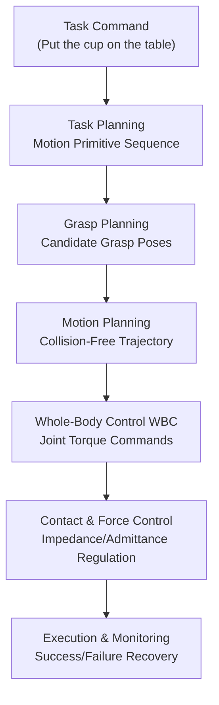
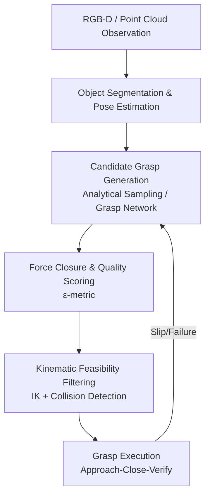
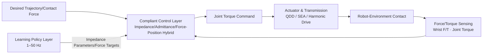
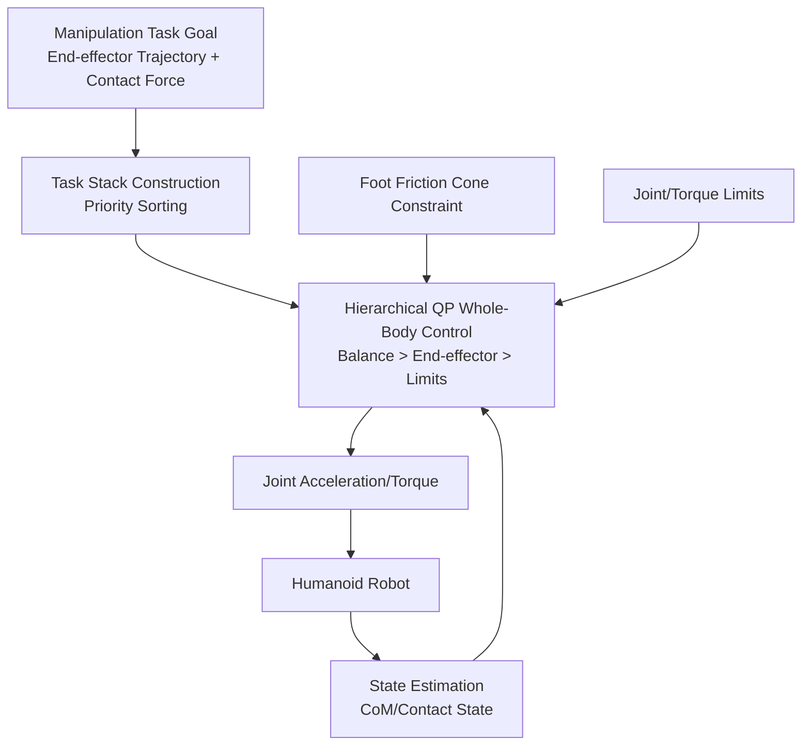

# Chapter 16: Manipulation and Grasping

## Summary

Manipulation is the core capability that distinguishes humanoid robots from mobile platforms: it requires the robot to apply controllable forces and motions to objects under conditions of a floating base, multiple contacts, and strong disturbances. This chapter revolves around the key technological chain of humanoid robot manipulation and grasping: it begins with grasp taxonomy and force closure theory, elaborating on the analytical and data-driven paradigms of grasp planning; secondly, it introduces the three classic frameworks of force control and compliant control—Impedance Control, Admittance Control, and Force/Position Hybrid Control—and discusses their engineering constraints on humanoid platforms; it then focuses on dexterous hand manipulation, including in-hand reorientation, tactile feedback, and dexterous teleoperation; finally, it discusses whole-body manipulation and loco-manipulation, explaining how manipulation tasks couple with Whole-Body Control (WBC), bimanual coordination, and mobile bases. This chapter references real-world entries from the knowledge graph such as the GRASP Taxonomy, Allegro Hand, LEAP Hand, Unitree Dex3-1, ByteDexter Hand, HOMIE, FALCON, HAFO, GraspVLA, and Mobile ALOHA, and provides a runnable Python example for the force closure criterion.

**Keywords**: Manipulation; Grasp Planning; Force Closure; Friction Cone; Impedance Control; Admittance Control; Force/Position Hybrid Control; Dexterous Hand; In-Hand Manipulation; Whole-Body Manipulation; Loco-Manipulation

---

## 16.1 Overview of Manipulation Problems

### 16.1.1 From "Grasping" to "Using": The Hierarchy of Manipulation Tasks

Manipulation is not equivalent to grasping. Grasping addresses "how to establish and maintain contact with an object," while manipulation addresses "how to change the state of an object through contact." A complete manipulation task can typically be decomposed into five phases:

1. **Reach**: Plan a collision-free trajectory to bring the end-effector into a pre-grasp pose;
2. **Grasp**: Close fingers or grippers to establish force closure or form closure;
3. **Manipulate**: Contact-rich phases such as carrying, pushing, pulling, rotating, inserting, and assembling;
4. **Place/Release**: Controllably break contact at the target pose;
5. **Retreat**: Withdraw and prepare for the next motion primitive.

The first two phases rely primarily on geometric and mechanical analysis. The third phase is the intersection of force control and learning methods, and it is where humanoid robots differ most from industrial robotic arms: industrial arms have rigid bases and structured environments, whereas the "base" of a humanoid robot is itself dynamic.

!!! note "Terminology Explanation: Manipulation, Grasping, Contact-Rich Tasks, Pre-Grasp Pose, Motion Primitive"
    - **Manipulation**: The process of purposefully changing the pose or state of an object through contact between the robot and the object.
    - **Grasping**: The subtask of establishing constraints on an object so that it maintains a controllable pose relative to the hand.
    - **Contact-Rich Task**: A task whose success depends on precise regulation of contact forces/contact modes, such as insertion, wiping, door opening, and bottle cap twisting.
    - **Pre-Grasp Pose**: The pose the end-effector should achieve before closing the fingers, typically located at a retracted position along the approach direction from the grasp pose.
    - **Motion Primitive**: A parameterized motion template for completing a semantic subtask, serving as the interface between task planning and motion planning.

### 16.1.2 Specifics of Humanoid Manipulation

Humanoid robot manipulation differs significantly from fixed-base robotic arms in the following four aspects:

- **Floating Base**: Reaction torques from upper limb motion disturb the whole-body posture, requiring joint regulation through whole-body control and ground contact forces (see Chapter 17);
- **High-Dimensional Bimanual and Dexterous End-Effectors**: The total degrees of freedom are typically 2–4 times that of an industrial arm, drastically increasing the search space for grasp planning and inverse kinematics;
- **Unstructured Environments**: The variety, pose, and occlusion of objects in home and warehouse scenarios are far more open than on production lines, imposing higher demands on perception and generalization;
- **Safety Constraints**: Shared spaces with humans in the loop require strict limits on end-effector forces, joint torques, and motion speeds, making compliant control a "must-have" rather than an "option."



### 16.1.3 Grasp Taxonomy: From Human Grasps to Robot Grasps

To establish a common language for "what constitutes a good grasp," the research community has developed several grasp taxonomies. The **GRASP Taxonomy** included in the knowledge graph is a standardized classification system for human and robot hand grasps, organizing grasps along a spectrum of "power grasp—precision grasp—intermediate types," commonly used to evaluate grasp diversity and coverage in dexterous manipulation research. Another commonly used clinical-robotic cross-tool is the **Kapandji Test**, which scores hand function by assessing the thumb's ability to oppose each of the other fingers, borrowed to evaluate the opposition capability of dexterous hands.

| Grasp Type | Mechanical Characteristics | Typical Scenario | Hardware Requirements |
|---|---|---|---|
| Power Grasp | Large contact area, high normal force, primarily form closure | Carrying a suitcase, holding a hammer, moving a box | High grip strength, passive compliant surfaces |
| Precision Grasp | Fingertip contact, low force, high position resolution | Pinching a coin, picking up a needle, pressing a button | Fingertip tactile sensing, low-backlash transmission |
| Lateral Pinch | Thumb and lateral side of index finger clamp | Turning a key, holding a card | Thumb opposition DOF |
| Tripod Grasp | Three-point contact with thumb and two fingers | Holding a pen for writing, using a tool | At least 3 independent fingers |
| Hook Grasp | Fingers curled into a hook, thumb not required | Carrying a shopping bag, hanging from a bar | High flexion torque sufficient |

A repeatedly validated engineering heuristic is: **Coverage of grasp types is a better predictor of task success than peak grip strength.** A hand that can only perform cylindrical power grasps will systematically fail when faced with everyday objects like keys, zippers, and buttons—this is precisely why the GRASP Taxonomy is used as a benchmark for evaluating dexterous hands.

### 16.1.4 Hierarchical Architecture of Manipulation Systems

A mature humanoid manipulation system employs a multi-rate hierarchical architecture, where the frequency, methods, and failure consequences differ across layers:

| Layer | Typical Frequency | Core Methods | Failure Consequence |
|---|---|---|---|
| Task Planning Layer | 0.1–1 Hz | Task planning, large model reasoning | Task logic errors |
| Motion Planning Layer | 1–10 Hz | Sampling/optimization-based planning (OMPL, MoveIt, cuRobo) | Infeasible trajectory, collision |
| Policy/Skill Layer | 10–50 Hz | Imitation learning policies, grasp networks | Non-robust actions |
| Compliant Control Layer | 200–1000 Hz | Impedance/Admittance/Force-Position Hybrid | Contact force exceedance |
| Whole-Body Control Layer | 500–1000 Hz | Hierarchical QP, MPC | Instability, falling |
| Servo Layer | 1–10 kHz | FOC current loop | Joint jitter, overheating |

Two design principles of the hierarchical architecture are: **Upper layers send goals to lower layers rather than issuing commands directly across layers** (the policy layer does not output torques directly, but rather pose/impedance targets), and **safety constraints from lower layers are non-bypassable by upper layers** (the limits of the compliant and servo layers are always active). Chapter 17 will discuss the whole-body control layer and servo layer in detail; this chapter focuses on the policy/skill layer and compliant control layer.

## 16.2 Grasp Planning

Grasp planning addresses the question of "where on an object and with what contact configuration to grasp." Its technical landscape can be organized along two routes based on the degree of reliance on geometric models and data: analytical methods search for force-closure configurations starting from object geometry and contact mechanics, while data-driven methods learn priors of "where to grasp" from large-scale grasp samples. Practical systems typically combine the two in series: learning models provide candidates, and analytical criteria are responsible for filtering and ranking.



### 16.2.1 Force Closure and Grasp Quality

The classical theoretical foundation of grasp planning is contact mechanics. Assume the hand has \(n_c\) contact points with the object. The contact force \(\mathbf{f}_i\) that can be applied at the \(i\)-th contact must lie within the friction cone:

$$
\|\mathbf{f}_i^t\| \le \mu_i f_i^n
$$

where \(\mathbf{f}_i^t\) is the tangential component, \(f_i^n\) is the normal component, and \(\mu_i\) is the friction coefficient. The set of wrenches produced on the object by all contact forces is called the grasp wrench space \(W\). The criterion for **force closure** is: the grasp wrench space contains a sphere centered at the origin, meaning that external force disturbances in any direction can be counteracted by the contact forces. A commonly used grasp quality metric is the **\(\epsilon\)-metric**, which is the radius of the largest inscribed sphere that \(W\) can accommodate—the larger the radius, the more robust the grasp is to disturbances.

Complementary to force closure is **form closure**: relying solely on the geometric constraints between the fingers and the object (without considering friction) to completely restrict the object's motion. Form closure grasps are insensitive to errors in friction coefficients and are the preferred choice for low-friction objects (smooth tableware, packaging bags), but they typically require more contact points: form closure for planar objects requires at least 4 frictionless contact points, and for 3D objects, at least 7.

!!! note "Terminology Explanation: Friction Cone, Wrench, Force Closure, Form Closure, ε-metric"
    - **Friction cone**: The conical feasible region formed by the constraints of Coulomb friction on contact forces, with the cone angle determined by the friction coefficient.
    - **Wrench**: The six-dimensional combination of force and torque \(\mathbf{w} = (\mathbf{f}, \boldsymbol{\tau})\), a unified representation of contact action.
    - **Force closure**: The set of contact forces can balance external wrench disturbances in any direction; the grasp is mechanically robust.
    - **Form closure**: The object is completely fixed solely by the geometric constraints of the contacts, independent of friction.
    - **\(\epsilon\)-metric**: The radius of the inscribed sphere in the grasp wrench space, quantifying the grasp's disturbance rejection capability in the "worst-case direction."

### 16.2.2 Analytical Grasp Planning

Analytical methods directly search for contact configurations satisfying force closure on the object geometry. A typical workflow is: candidate contact point sampling → force closure verification → ranking by \(\epsilon\)-metric → kinematic feasibility filtering. Works such as **Robot Learning of 6-DoF Grasping** (Berscheid et al., 2021) included in the knowledge graph extend this idea to six-degree-of-freedom grasping: grasps are no longer limited to top-down approaches but allow side grasps and angled grasps, significantly expanding the reachable workspace. This is particularly important for humanoid robots picking objects in constrained spaces like shelves and tabletops.

The advantages of analytical methods are their interpretability and clear quality metrics. Their limitations include: dependence on precise object models and sensitivity to perception errors; force closure is a static criterion and cannot handle sliding and dynamic disturbances during grasping; the combinatorial explosion of contact configurations for high-degree-of-freedom dexterous hands makes online search costly. Therefore, practical systems often adopt a two-stage architecture of "offline grasp library generation + online matching."

### 16.2.3 Data-Driven Grasp Planning

With the entry of large models into robotics, grasp planning has shown a clear trend towards "foundation models." The core idea is to train grasp networks using large-scale synthetic or real data, transforming geometric reasoning into learnable regression/generation problems. Representative entries included in the knowledge graph are:

- **GraspVLA** (2025): A grasp foundation model pre-trained on billion-scale synthetic action data, introducing the vision-language-action (VLA) paradigm to grasping, supporting language instructions to specify target objects and directly generating grasp actions;
- **ClutterDexGrasp** (2025): A sim-to-real framework for dexterous grasping in cluttered scenes, generating dense stacking scenarios in simulation to train grasp strategies, then transferring to real dexterous hands;
- **Lightning Grasp** (2025): A grasp synthesis method pursuing high performance and low latency, targeting real-time grasp planning scenarios;
- **Learning to Grasp Anything by Playing with Random Toys** (2026): Learning to grasp open-set objects through autonomous play-style data collection by "interacting with random toys."

The key engineering challenge of the data-driven route is **matching the data distribution with the real-world distribution**: synthetic data provides scale, while real data provides fidelity. The current mainstream approach is "simulation pre-training + fine-tuning with a small amount of real data," which aligns with the discussion of sim-to-real and data-efficient learning in Chapter 18.

### 16.2.4 Grasp Quality Example: Planar Force Closure Verification

Below is a runnable example for verifying force closure for a planar three-point grasp. For planar grasping, a necessary and sufficient condition for force closure is that the convex hull of the friction cones at each contact "spans" the entire plane in pairs, which is equivalent to: there exists a set of non-negative contact forces within the cones such that the resultant force and resultant moment are both zero, and the normal force at each contact is strictly positive.

```python
import numpy as np
from scipy.optimize import linprog

def planar_force_closure(contacts, normals, mu):
    """Check if a planar grasp is force-closed.
    contacts: (n,2) contact point positions; normals: (n,2) inward normal unit vectors; mu: friction coefficient.
    Returns (is_force_closure, a set of feasible contact forces).
    """
    n = len(contacts)
    # Linearize each contact using two edges of the friction cone: f = a*(n + mu*t) + b*(n - mu*t), a,b >= 0
    A_eq, b_eq = [], np.zeros(3)
    cols = 2 * n
    Aeq = np.zeros((3, cols))
    for i, (p, nv) in enumerate(zip(contacts, normals)):
        t = np.array([-nv[1], nv[0]])          # tangential
        for k, edge in enumerate([nv + mu * t, nv - mu * t]):
            Aeq[0, 2*i+k] = edge[0]            # resultant force x
            Aeq[1, 2*i+k] = edge[1]            # resultant force y
            Aeq[2, 2*i+k] = p[0]*edge[1] - p[1]*edge[0]  # resultant moment (scalar)
    # Maximize the minimum normal force margin: introduce slack variable s, constrain normal component >= s
    c = np.zeros(cols + 1); c[-1] = -1.0
    Aeq_full = np.hstack([Aeq, np.zeros((3, 1))])
    A_ub = np.zeros((n, cols + 1))
    for i, nv in enumerate(normals):
        t = np.array([-nv[1], nv[0]])
        A_ub[i, 2*i]   = -nv @ (nv + mu * t)
        A_ub[i, 2*i+1] = -nv @ (nv - mu * t)
        A_ub[i, -1]    = 1.0                   # -f_n + s <= 0
    res = linprog(c, A_ub=A_ub, b_ub=np.zeros(n),
                  A_eq=Aeq_full, b_eq=np.zeros(3),
                  bounds=[(0, 1)] * (cols + 1), method="highs")  # Normalize to avoid unboundedness
    ok = res.success and res.x[-1] > 1e-6
    return ok, res.x if res.success else None
```

```python
if __name__ == "__main__":
    # Grasp three points at 120° intervals on the unit circle
    ang = np.deg2rad([0, 120, 240])
    pts = np.stack([np.cos(ang), np.sin(ang)], axis=1)
    nrm = -pts                                # inward normal points to the center
    ok, x = planar_force_closure(pts, nrm, mu=0.4)
    print("Force closure:", ok)
```

This example highlights two engineering points: first, the friction cone can be linearized using edge vectors, thereby converting a second-order cone program into a linear program; second, by taking the "minimum normal force margin" as the optimization objective rather than merely checking feasibility, the obtained margin can be directly used as a grasp quality score.

### 16.2.5 Perception for Grasping: Pose Estimation, Affordance, and Language Guidance

The upstream of grasp planning is perception. The perception module for grasping needs to answer three levels of questions:

1. **Where is the object**: 6-DoF object pose estimation provides instance-level poses and is a direct input for analytical grasping; for unknown objects without models, it degenerates into direct regression of grasp poses conditioned on point clouds/depth;
2. **Where can it be grasped**: Affordance learning does not pursue precise poses but predicts the distribution of "graspable," "holdable," and "pressable" regions on the object surface. Works such as **Learning 3D Affordances** (2026) in the knowledge graph elevate affordance to the 3D point cloud level, offering better generalization for novel category-level objects;
3. **Which one to grasp**: Language-guided grasping changes the target specification from "coordinates" to "instructions." Works such as **Language-Guided Grasping** (2026) study target grounding under language ambiguity and scene interference, serving as the interface layer for the grasping module to connect with vision-language models.

Common engineering trade-offs are: use "pose estimation + grasp library matching" for structured scenes, use "affordance/grasp network direct regression" for unstructured scenes, and use a language guidance layer for target disambiguation when human-robot collaboration is required. The outputs of all three routes ultimately converge to the candidate contact configurations described in Section 16.2.1, which are then uniformly filtered by downstream modules for kinematic feasibility and force closure.

## 16.3 Force Control and Compliant Control

After grasp establishment, manipulation tasks enter a contact-rich phase, where the "rigid tracking" of position control can lead to force overshoot and even object damage. Force control and compliant control are the intermediate-layer pillars of humanoid manipulation.

### 16.3.1 Impedance Control

Impedance Control, proposed by Hogan, is based on the idea of **not directly controlling position or force, but controlling the dynamic relationship between them**, making the end-effector exhibit a desired mass-spring-damper characteristic:

$$
\mathbf{F}_{ext} = M_d(\ddot{\mathbf{x}} - \ddot{\mathbf{x}}_d) + B_d(\dot{\mathbf{x}} - \dot{\mathbf{x}}_d) + K_d(\mathbf{x} - \mathbf{x}_d)
$$

where \(M_d, B_d, K_d\) are the desired inertia, damping, and stiffness matrices, respectively. When the environment is rigid and the contact model is unknown, impedance control limits impact forces within a safe range through "compliant yielding." Its implementation in joint space is typically written as:

$$
\boldsymbol{\tau} = J^\top(\mathbf{q})\,\mathbf{F} + \mathbf{g}(\mathbf{q})
$$

This maps the task-space impedance force to joint torques via the Jacobian transpose and compensates for gravity. Impedance control requires the robot to have good torque controllability—this is the control-side reason why Quasi-Direct Drive (QDD) actuators and Series Elastic Actuators (SEA) are popular on humanoid robots (see Chapter 4 for hardware details).

### 16.3.2 Admittance Control

Admittance Control is dual to Impedance Control: it **measures external force and outputs motion**. The outer loop generates a position correction based on the force sensor reading \(\mathbf{F}_{ext}\) according to the desired admittance model, while the inner loop remains a high-precision position controller:

$$
M_d \ddot{\mathbf{e}} + B_d \dot{\mathbf{e}} + K_d \mathbf{e} = \mathbf{F}_{ext}, \qquad \mathbf{x}_{cmd} = \mathbf{x}_d + \mathbf{e}
$$

| Dimension | Impedance Control | Admittance Control |
|---|---|---|
| Causal Direction | Motion → Force | Force → Motion |
| Inner Loop Requirement | Torque Control (current loop, low gear ratio) | Position Control (high gear ratio also acceptable) |
| Suitable Environment | Soft/medium stiffness environment | High stiffness environment |
| Typical Hardware | QDD, SEA, Direct Drive joints | Industrial arms, Harmonic Drive joints |
| Sensing Dependency | Joint torque or current estimation | Wrist 6-axis force/torque sensor |
| Bandwidth | High (direct torque) | Limited by inner loop position bandwidth |

The engineering selection rule is: **use impedance when joint torque controllability is good, use admittance when position controllability is good**. Humanoid robot legs often use impedance (to absorb landing impacts), while arms with wrist force sensors often use admittance (for stable contact force tracking).

### 16.3.3 Force/Position Hybrid Control

In many tasks, the requirements in different directions are fundamentally different: when pushing an object along a table, position must be controlled in the horizontal direction, while contact force must be controlled in the vertical direction. Force/Position Hybrid Control uses a selection matrix \(\boldsymbol{\Sigma}\) to orthogonally decompose the task space:

$$
\mathbf{F}_{cmd} = \boldsymbol{\Sigma}\,\mathbf{F}_{pos} + (\mathbf{I} - \boldsymbol{\Sigma})\,\mathbf{F}_{force}
$$

where \(\boldsymbol{\Sigma}\) is a diagonal 0/1 matrix that selects either the position channel or the force channel for each direction. A classic difficulty of force/position hybrid control is **selection matrix switching during contact transitions**: when moving from free-space motion to contact establishment, the roles of each direction change abruptly, and unsmooth switching can cause force impacts. In practice, force/position hybrid control is often combined with an impedance framework, i.e., "variable impedance + directional selection," which first reduces stiffness in the approach direction upon contact, then gradually establishes the target contact force.

!!! note "Terminology Explanation: Selection Matrix, Constrained Direction, Contact Transition, Passivity"
    - **Selection matrix**: In force/position hybrid control, a diagonal matrix that selects position/force channels according to task-space directions; a diagonal element of 1 indicates a position channel, 0 indicates a force channel.
    - **Constrained direction**: A direction where motion is limited by environmental geometry (e.g., the normal direction perpendicular to a table surface); it should be assigned to the force channel.
    - **Contact transition**: The instant of switching between free motion and contact state; it is a period prone to force impacts and instability.
    - **Passivity**: A property where the system does not actively output energy to the environment; a passive system interconnected with any passive environment is necessarily stable, forming the theoretical foundation for safe force control.

### 16.3.4 Engineering Constraints and Learning-based Force Control

On real humanoid platforms, force control is dominated by the following engineering constraints:

- **Force Sensing Resolution**: Wrist 6-axis force/torque sensors are costly, with trade-offs between range and resolution; works such as **Contact Sensing via Joint Torque** (2025) in the knowledge graph explore using joint torque sensors to indirectly estimate contact, reducing cost;
- **Control Bandwidth**: Compliant control loops typically require 200–1000 Hz, forming a multi-rate architecture with high-level planning/learning policies (1–50 Hz);
- **Model Uncertainty**: Foot-ground and hand-object contacts coexist, and no single contact model is complete.

This has led to a direction integrating learning with traditional force control. Representative works in the knowledge graph include: **FALCON** (2025), which learns force-adaptive humanoid mobile manipulation, incorporating contact force/tactile signals into the data loop; **HAFO** (2025), a force-adaptive control framework for highly interactive environments; **ForceBand** (2026), which uses low-cost wrist-worn surface electromyography (sEMG) devices to collect force-rich demonstrations from humans, enabling policies to learn "forceful manipulation," achieving significantly lower force prediction errors than pure vision baselines in grasp-squeeze-place tasks. The commonality of these works is: **elevating "force" from an internal variable of the control layer to a first-class citizen of the data layer**.



### 16.3.5 Variable Impedance Control and Force Control Safety

Fixed impedance parameters cannot accommodate different task phases: free space requires high stiffness for tracking accuracy, while contact initiation requires low stiffness to absorb impacts. **Variable impedance control** adjusts \(K_d, B_d\) online based on task phase, contact state, or force feedback: a typical strategy is "high stiffness during approach, switch to low stiffness upon contact detection, then gradually restore stiffness based on error after force establishment." The learning approach lets the policy directly output impedance parameters (e.g., FALCON and other force-adaptive frameworks), learning the impedance profile as part of the skill from demonstrations.

Variable impedance introduces stability risks: time-varying gains can inject energy into the environment, violating passivity. The **energy tank** method explicitly accounts for the energy the controller is allowed to consume—the controller's output power is drawn from the "tank," and when the tank is empty, the controller is forced into passive behavior, ensuring the stability of the interconnected system from a mechanistic standpoint. The **Energy Tank-based Control Framework** (2023) in the knowledge graph applies energy tanks to meet the power and force limits of ISO/TS 15066 for collaborative robots, demonstrating that passivity constraints can coexist with task performance. For humanoid robots, the energy accounting concept is equally applicable to the whole body: compliant ankle joints during walking and compliant wrist joints during manipulation can all be scheduled under a unified power budget.

## 16.4 Dexterous Hand Manipulation

### 16.4.1 Hardware Morphologies of Dexterous Hands

The hardware of dexterous hands was discussed in Chapter 9 as a subsystem in terms of structural design. Here, we summarize several typical morphologies from the perspective of manipulation capability, citing real entries from the knowledge graph:

| Dexterous Hand | DOF/Actuation | Manipulation Characteristics | Positioning |
|---|---|---|---|
| Allegro Hand | 16 DOF (4 fingers × 4), tendon-driven | Mature research platform, open control interface | Academic research benchmark |
| LEAP Hand | Low-cost open-source, direct-drive motors | Low-cost replication, reinforcement learning friendly | Open-source teaching/research |
| Unitree Dex3-1 | 3 fingers, underactuated | Shipped in coordination with humanoid whole-body systems | Whole-system integration |
| ByteDexter Hand | 20 DOF | Supports 20-DOF human-to-robot motion retargeting teleoperation | Data collection/teleoperation |
| DexLink Hand | Compact, low-cost | Dexterous hand for internet-scale data ecosystems | Data ecosystem |

The trade-off between underactuated and fully actuated designs is a core contradiction in dexterous hand design: underactuated hands use fewer motors to drive multiple joints through differential linkages or tendons, passively adapting to object shapes during grasping—robust, cheap, and lightweight, but incapable of precise in-hand manipulation; fully actuated finger joints are independently controllable, supporting in-hand reorientation, but with significantly increased cost, weight, and failure rates.

From the perspective of actuation layout, mainstream solutions fall into three categories: **Motor-embedded** (motors inside phalanges/palm, e.g., Allegro, LEAP), offering fast response and low transmission error, but with thick fingers and high inertia; **Tendon-driven remote actuation** (motors concentrated in the forearm, tendons transmitting force to fingers, e.g., Shadow Hand and most full-size dexterous hands), providing slender fingers and low inertia, but friction, hysteresis, and elasticity in tendons significantly complicate precise force control and calibration; **Linkage-driven** (e.g., some industrial dexterous hands), offering good stiffness and low transmission error, but with complex mechanisms and bulky finger bases. Works such as **Antagonistic Bowden Cable Actuation** (2025) in the knowledge graph continue to advance in the direction of antagonistic tendon actuation for variable-stiffness compliant grasping. For manipulation capability, the primary impact of the transmission scheme is not on peak performance but on **controllability**: the hysteretic nonlinearity of tendon-driven hands often forces the control side to introduce tension sensors or learning-based feedforward compensation.

### 16.4.2 In-Hand Manipulation and Reorientation

The advanced form of dexterous manipulation is **in-hand manipulation**: the object is not released, and its pose is readjusted through rolling and sliding contacts of the fingers. A typical example is adjusting a pen from a "grasp" to a "writing" posture. Its dynamic foundation is the scheduling of contact mode transitions (grasp-slide-roll). Traditional methods require precise contact state estimation, which is complex to implement; in recent years, reinforcement learning and imitation learning approaches have become dominant—first training in-hand reorientation policies through large-scale parallel simulation, then transferring via sim-to-real (see Chapter 18).

Dexterous manipulation has a much higher dependence on sensing than gripper manipulation: fingertip tactile sensing provides contact location and normal force information, forming the basis for slip detection and force fine-tuning. Entries on tactile sensor arrays in the knowledge graph, along with works like **Learning Visuotactile Skills** (2024), show that vision-tactile fusion strategies significantly outperform pure vision strategies in fine tasks such as insertion and flipping; **Tactile-VLA** (2025) further integrates tactile signals into vision-language-action models, enabling language-conditioned policies to utilize contact feedback.

### 16.4.3 Dexterous Teleoperation and Data Collection

Skill learning for dexterous hands heavily relies on demonstration data, and dexterous teleoperation itself is a technical challenge: the degrees of freedom of the human hand do not correspond one-to-one with those of the dexterous hand, requiring motion retargeting to map human fingertip poses to robot finger joint angles. The work **Dexterous Teleoperation of 20-DoF ByteDexter Hand via Human Motion Retargeting** (2025) in the knowledge graph is a human-to-robot retargeting teleoperation scheme for a 20-DOF dexterous hand; **DexCap** (2024) proposes a portable hand motion capture system that can collect hand manipulation data without a robot environment. These systems are analogous to ALOHA for bimanual arms, serving as entry devices for the "data flywheel" of dexterous manipulation.

The latency requirements for dexterous teleoperation are more stringent than for arm teleoperation: the bandwidth of fine human hand movements is high. If the end-to-end latency of the acquisition chain (visual tracking → retargeting → command dispatch → feedback presentation) exceeds approximately one hundred milliseconds, the operator will unconsciously slow down their movements to adapt to the system, causing the collected data to lose the most valuable rapid fine-tuning patterns of human hand manipulation. This is also a hidden benefit of "robot-free" acquisition pipelines like DexCap—removing the robot from the closed loop eliminates the latency and speed limitations introduced by robot dynamics.

### 16.4.4 Slip Detection and Grasp Maintenance

After a grasp is established, the most common direct cause of task failure is **undetected slip**: the object slowly slides between the fingers until the contact configuration loses force closure and the object falls. Slip detection relies on two types of signals: high-frequency normal/tangential force fluctuations from fingertip tactile arrays, and micro-displacement of the contact area imaged by visuotactile sensors (e.g., GelSight type). Works like **Feeling the Unexpected** (2026) in the knowledge graph specifically study tactile detection of unexpected contact events. The standard response after detecting incipient slip is to **increase grip force according to the minimum sufficient force principle**: grasp with just enough force to overcome the current load (energy-efficient and non-damaging to objects), and increase grip force in steps when slip signs appear.

The fine regulation of grip force itself is also being learned. **Shear-Based Grasp Control** (2025) uses shear force signals for closed-loop grasp adjustment, while **ForceBand** (2026) extracts priors on "how much force to use when" from human sEMG signals. The engineering insight from these works is consistent: grasp maintenance is not a one-time static force closure determination, but a continuous perception-regulation closed-loop process.

## 16.5 Whole-Body Manipulation and Loco-Manipulation

### 16.5.1 Loco-Manipulation: When the "Hand" is Attached to a Walking Robot

Loco-manipulation refers to a robot performing manipulation tasks while moving or after moving into position. The difficulty lies in the coupling between locomotion and manipulation: extending an arm to grasp an object changes the center of mass (CoM), which in turn requires redistribution of ground reaction forces, which are themselves constrained by the friction cone and support polygon. This coupling is particularly evident when a humanoid robot carries heavy objects—works such as **Embracing Bulky Objects with Humanoid Robots** (2025) and **Heavy Lifting Tasks via Haptic Feedback** (2025) specifically study whole-body coordination in scenarios involving holding large objects and heavy lifting.

!!! note "Terminology Explanation: Loco-Manipulation, Support Polygon, Manipulability Ellipsoid, Closed Kinematic Chain, Internal Force"
    - **Loco-Manipulation**: A task paradigm that jointly schedules locomotion and manipulation capabilities, typical examples include moving while carrying an object, or opening a door and passing through.
    - **Support Polygon**: The convex hull of the projection of the contact points of the feet (and other supporting contacts) onto the ground. The projection of the CoM falling within this polygon is a necessary condition for static stability.
    - **Manipulability Ellipsoid**: An ellipsoid defined by the singular values of the Jacobian (\(\mathbf{J}\mathbf{J}^\top\)), which measures the velocity/force output capability of the end-effector in all directions for a given configuration. It is used to plan manipulation postures that are "good for applying force and moving."
    - **Closed Kinematic Chain**: A constraint loop formed when two arms jointly hold an object or when a hand contacts the environment, making the motions of the arms no longer independent.
    - **Internal Force**: Force components within a closed chain that cancel each other out and do not produce net motion of the object. Excessive internal force can cause object deformation or slippage.

Two representative systems included in the knowledge graph are:

- **HOMIE** (2025): A humanoid loco-manipulation system based on an isomorphic exoskeleton cockpit. The operator wears the exoskeleton to directly "drive" the robot's whole body, completing tasks involving locomotion and dual-arm manipulation while collecting whole-body demonstration data.
- **FALCON** (2025): A learning-based force-adaptive loco-manipulation system that incorporates contact forces into the policy observation, enabling loco-manipulation tasks requiring force regulation, such as carrying, pushing, and pulling.

### 16.5.2 Support of Whole-Body Control for Manipulation

The underlying execution of manipulation relies on Whole-Body Control (WBC; see Chapter 17 for details). From a manipulation perspective, WBC provides three indispensable capabilities:

1.  **CoM and Momentum Regulation**: During manipulation, the CoM is kept within the support region. Hierarchical Quadratic Programming (Hierarchical QP WBC) is commonly used to solve a task stack with priorities like "maintain balance > track end-effector trajectory > avoid joint limits."
2.  **Contact Force Distribution**: In multi-contact scenarios (e.g., two feet + one hand on a wall), the desired wrench is distributed to each contact point.
3.  **Null-Space Utilization**: Without affecting the primary end-effector task, redundant degrees of freedom are used to adjust the posture of the elbow or torso for obstacle avoidance or to improve manipulability.

It is worth emphasizing that the division of labor between WBC and learned policies has been repeatedly validated in engineering practice for humanoid manipulation as "the policy outputs the goal, WBC guarantees feasibility": The learned policy does not (and should not) directly concern itself with hard constraints like foot friction cones or joint limits; these are explicitly guaranteed by WBC as constraints. The policy only needs to provide semantically correct goals in the task space. This division of labor allows manipulation policies to be transferred between different humanoid platforms—as long as the WBC of the two robots provides the same task space interface, the same policy can be reused.



### 16.5.3 Coordinated Dual-Arm Manipulation

Dual-arm manipulation is not simply the superposition of "two single arms"; it introduces closed kinematic chain constraints. When two hands jointly hold an object, the two arms and the object form a closed chain, and relative pose errors directly translate into internal forces. The three levels of dual-arm coordination are:

- **Leader-Follower**: One arm plans the trajectory, and the other arm follows using relative pose constraints. Simple but with significant error accumulation.
- **Coordinated Planning**: The end-effector poses of both arms are planned as joint variables, with the closed-chain constraint explicitly incorporated into the optimization problem.
- **Policy Learning**: Imitation learning is used to directly learn the joint action distribution of both arms. ALOHA/ACT and Mobile ALOHA are the most typical data-policy combinations (see Chapter 18).

**Coordinated Humanoid Manipulation with Choice Policies** (2025), included in the knowledge graph, models dual-arm coordination as a "choice policy" problem, making discrete selections among multiple candidate coordination modes. **Bimanual Dexterity for Complex Tasks** (2024) studies bimanual dexterity for complex tasks. Engineering practice shows that the primary cause of failure in dual-arm tasks is often not insufficient single-arm precision, but **excessive closed-chain internal force causing object slippage or deformation**. Therefore, dual-arm manipulation typically requires explicit monitoring and constraint of internal forces in the task space.

### 16.5.4 Analysis of Typical Whole-Body Manipulation Tasks

Three categories of tasks prominently expose the technical challenges of whole-body manipulation:

**Opening a Door/Drawer** is a composite task of "locomotion + constrained trajectory tracking": The hand must grasp the handle and move along the circular arc trajectory dictated by the hinge constraint, while the body moves backward to create swing space. The difficulty lies in the fact that hinge parameters (axis position, rotation direction) are usually unknown. They need to be identified online using force and pose signals during the initial pulling/pushing phase, after which the controller switches to admittance control to follow the constraint direction.

**Pushing/Pulling Heavy Objects** (e.g., carts, cargo boxes) turns the robot itself into a "moving finger": The pushing force is transmitted from the hand through the torso, legs, and feet to the ground, where foot friction becomes the constraint source for the maximum push force. The controller must trade off in real-time between "increasing push force" and "staying within the foot friction cone"—this is precisely the contact force distribution problem of whole-body control.

**Holding and Carrying** directly changes the robot's CoM and moment of inertia. **Heavy Lifting Tasks via Haptic Teleoperation of a Wheeled Humanoid** (2025) uses force-feedback teleoperation to complete heavy object carrying, demonstrating that "human provides task decisions, robot provides whole-body stability" is a pragmatic human-machine shared control solution when autonomy is not yet mature. **Embracing Bulky Objects** (2025) shows that when the object is large enough to obstruct the robot's view, the holding posture itself must be treated as a planning variable.

## 16.6 Evaluation Metrics and System Integration

### 16.6.1 Evaluation Dimensions of Manipulation Capability

The evaluation of a manipulation system should cover the following dimensions, rather than just reporting the success rate for a single task:

| Dimension | Metric | Description |
|---|---|---|
| Success Rate | Task-level / Stage-level Success Rate | Stage-level decomposition (approach/grasp/carry/place) helps identify bottlenecks |
| Efficiency | Cycle Time | Sensitive to takt time in industrial scenarios, often determines deployment feasibility |
| Robustness | Disturbance Recovery Rate, Success Rate under Disturbance | External pushes, object pose perturbations, lighting changes |
| Generalization | Success Rate on New Objects/Poses/Scenes | Zero-shot or few-shot performance outside the training distribution |
| Force Quality | Peak Contact Force, Force Tracking Error | Key metric for manipulating fragile objects |
| Coverage | Grasp Type Coverage (GRASP Taxonomy) | Measures the diversity of grasps achievable by the end-effector and policy |

### 16.6.2 Comparison of Typical Approaches

| Approach | End-Effector | Grasp Planning | Force Control | Data Source | Application Scenario |
|---|---|---|---|---|---|
| Industrial Approach | Two-finger Gripper | Analytical 6-DoF Grasping | Admittance Control | Human Teaching | Structured Warehouse Picking |
| ALOHA/Mobile ALOHA Line | Parallel Gripper ×2 | Implicit Policy Decision | Implicit Policy + Low-Gain Position Control | Dual-Arm Teleoperation Demonstration | Fine Dual-Arm Tasks like Housework, Kitchen |
| Dexterous Hand Line | Multi-fingered Dexterous Hand | Data-Driven (e.g., GraspVLA) | Impedance + Tactile Fine-Tuning | Dexterous Teleoperation / Simulation Synthesis | Open Objects, Tool Use |
| Whole-Body Manipulation Line | Hand/Arm/Torso Coordination | Task Planning + WBC | Impedance / Hierarchical QP | Exoskeleton Teleoperation (HOMIE) | Carrying, Holding, Whole-Body Coordination Tasks |

### 16.6.3 Failure Modes and Recovery

On-site failures of manipulation systems are concentrated in four categories: **Perception Failure** (occlusion leading to incorrect target pose), **Grasp Failure** (slippage, dropping), **Force Failure** (excessive contact impact, excessive internal force), and **Whole-Body Failure** (instability during manipulation). Mature systems design detectors and recovery primitives for each failure type: a "re-approach and re-grasp" primitive for grasp failure, an "unload and retreat" primitive for force failure, and a balance recovery strategy triggered by whole-body failure. Recovery capability (rather than single-trial success rate) often determines the usable time ratio of a robot in real-world scenarios.

There are two additional engineering points for failure management: First, **failure detection must be faster than the failure develops**—if the delay in slip detection exceeds the time constant for the object to slip out of the fingers, even the fastest recovery is useless. This dictates the tactile sampling rate (typically required to be above 100 Hz). Second, **recovery strategies themselves should also be learned**—manually designed recovery primitives can only cover anticipated failure modes. Recent works have started to feed back failure episodes as negative samples to train failure classifiers and recovery policies, converging with the data flywheel mechanism discussed in Chapter 18.

## 16.7 Chapter Summary

This chapter outlines the core methods of humanoid robot manipulation along the technical chain of "grasp planning—force control—dexterous hand—whole-body manipulation." The key points are as follows: Grasp planning is evolving from analytical force-closure search to data-driven foundation models such as GraspVLA, but force closure and the friction cone remain the fundamental language for understanding grasp robustness; impedance, admittance, and force-position hybrid control form the control foundation for contact-rich tasks, and their selection depends on joint torque controllability and environmental stiffness; the core bottlenecks of dexterous hand manipulation lie in sensing (tactile) and data (dexterous teleoperation), rather than the number of degrees of freedom itself; mobile manipulation and dual-arm manipulation embed manipulation problems within a whole-body control framework, where closed-chain internal forces and center-of-mass adjustment are unique engineering constraints. Chapter 17 will delve into the mathematical details of whole-body control and balance control, while Chapter 18 will discuss how manipulation skills can be acquired from data through imitation learning and policy learning.
