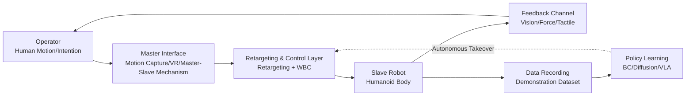
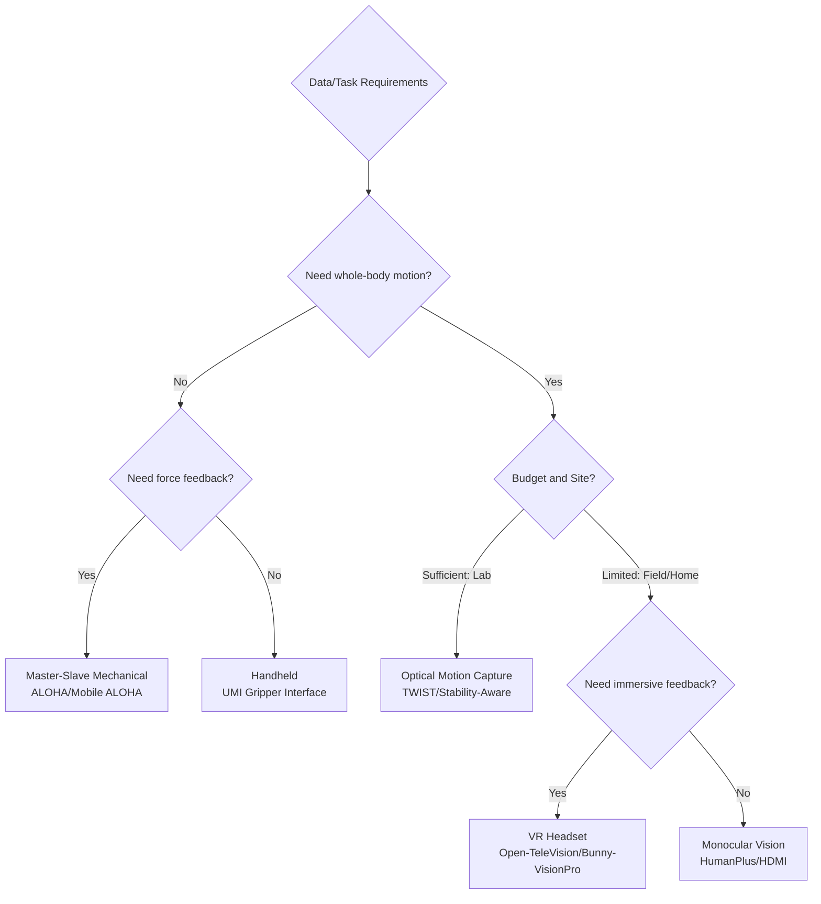
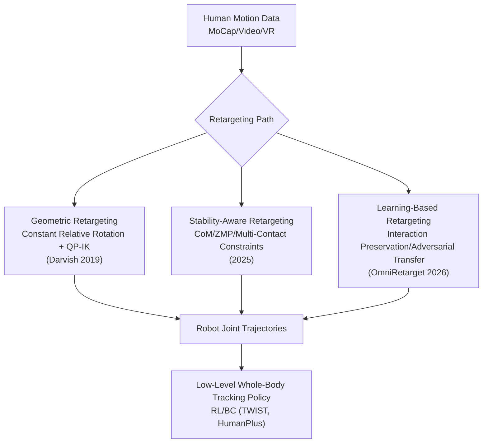
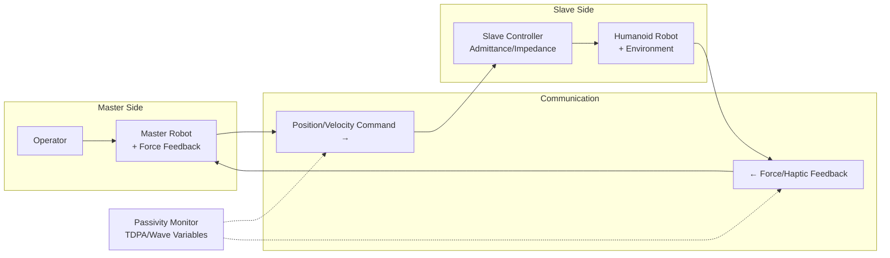
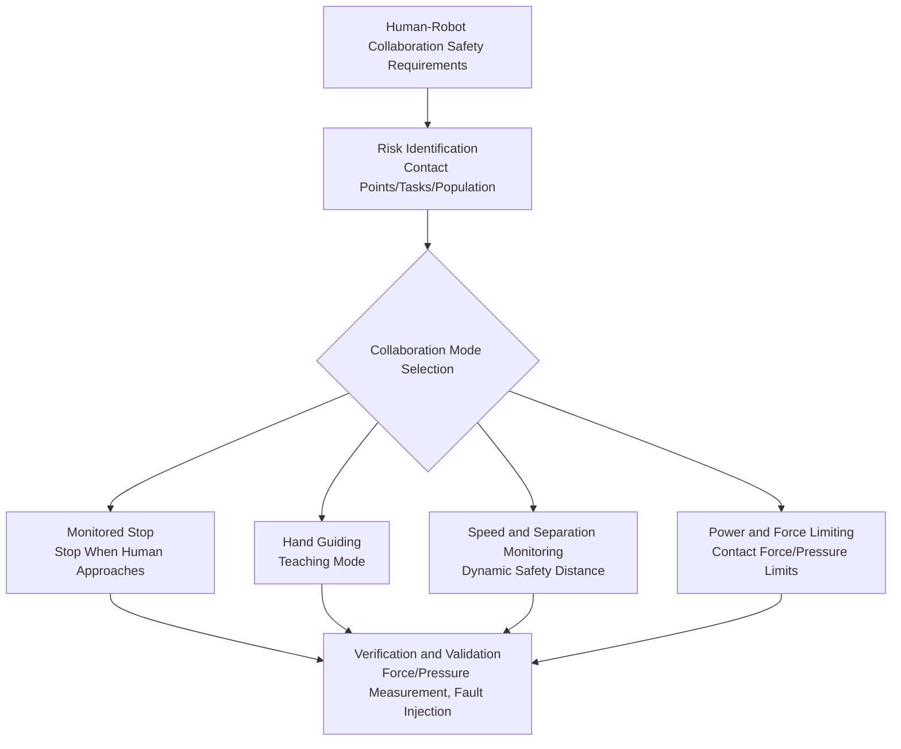

# Chapter 17: Teleoperation and Human-Robot Collaboration

## Abstract

Teleoperation and human-robot collaboration (HRC) are two bridges that enable humanoid robots to move from laboratory demonstrations to real-world scenarios: the former "projects" human perception and decision-making capabilities onto the robot body, providing channels for data collection, remote operations, and skill teaching; the latter studies safe coexistence, task allocation, and interaction fluency between humans and robots in shared spaces. This chapter adopts a systems engineering perspective: it first presents the composition, classification, and evaluation metrics of teleoperation systems; then sequentially discusses human motion capture interfaces (master-slave mechanisms, motion capture, VR headsets, visual pose estimation), geometric and learning methods for motion retargeting, force feedback architectures and stability theory for bilateral teleoperation; subsequently analyzes representative whole-body teleoperation systems such as iCub3 Avatar, OmniH2O, TWIST, HumanPlus, and ALOHA; then discusses the closed loop of teleoperation data collection and imitation learning, shared autonomy, and natural language interaction; finally summarizes the safety framework and human factors evaluation methods for human-robot collaboration. This chapter complements Chapter 18 (Imitation Learning and Policy Learning) and Chapter 21 (Data Infrastructure): this chapter focuses on the "real-time channel between human and robot," leaving the details of offline policy training to subsequent chapters.

**Keywords**: Teleoperation; Human-Robot Collaboration; Motion Retargeting; Bilateral Control; Force Feedback; VR Interface; Whole-Body Control; Shared Autonomy; Data Collection; Human-Robot Interaction

---

## 17.1 Overview of Teleoperation and Human-Robot Collaboration

### 17.1.1 Why Teleoperation is Key Infrastructure for Humanoid Robots

The ultimate goal of humanoid robots is to autonomously complete tasks, but there is a clear gap between current intelligence levels and task complexity—this is precisely the phenomenon described by the concept of the "Demo-to-Product Gap" in the knowledge graph. Teleoperation plays a triple role in bridging this gap:

1. **Data Collection Channel**: Imitation learning requires large amounts of high-quality demonstration data. Low-cost solutions such as the ALOHA teleoperation system, Mobile ALOHA, and the HumanPlus shadow system make "human-in-the-loop" teaching a scalable data production method, driving what the knowledge graph calls the "Data Flywheel."
2. **Remote Operation Means**: In hazardous environments (nuclear facilities, disaster sites, space), remote medicine, and other scenarios, operators complete tasks through "avatar" robots. The iCub3 Avatar System is a representative practice.
3. **Capability Fallback Mechanism**: Human takeover (tele-assist) when autonomous strategies fail is an engineering means to ensure service availability under the RaaS (Robotics as a Service) business model, and is one end of the shared autonomy spectrum.

!!! note "Terminology Explanation: Teleoperation, Human-Robot Collaboration, Shared Autonomy, Data Flywheel"
    - **Teleoperation**: A closed-loop control mode where an operator controls a robot remotely via interface devices and receives feedback such as vision and force from the robot.
    - **Human-Robot Collaboration (HRC)**: A mode where humans and robots work together towards a common goal in a shared workspace, with safety requirements specified in technical standards such as ISO/TS 15066.
    - **Shared Autonomy**: A control paradigm where humans and autonomous algorithms jointly determine robot behavior within the same control loop according to some arbitration mechanism.
    - **Data Flywheel**: A self-reinforcing cycle where deployment generates data, data improves models, models enhance performance, thereby generating more data.

### 17.1.2 Composition and Classification of Teleoperation Systems

A complete teleoperation system consists of five components: the operator interface (master side), communication link, robot body (slave side), feedback channel, and an intermediate **retargeting and control layer**—this layer is responsible for mapping human motion into instructions that are both executable by the robot and dynamically stable, representing a core difficulty that distinguishes humanoid robot teleoperation from traditional robotic arm teleoperation.



Based on the master-slave coupling method, teleoperation can be classified into four types:

| Type | Master Form | Representative System | Advantages | Limitations |
|---|---|---|---|---|
| Master-Slave Mechanical | Homogeneous/Heterogeneous Guide Arm | ALOHA, Mobile ALOHA | Low latency, force feedback possible, controllable cost | Limited to dual arms + torso, difficult to express whole-body motion |
| Motion Capture | Optical/Inertial Motion Capture | TWIST (MoCap Solution), Stability-Aware Retargeting | High-fidelity whole body | Expensive equipment, space constraints |
| Vision-Based | RGB/RGB-D Camera + Pose Estimation | HumanPlus, HDMI | No wearables, flexible deployment | Occlusion sensitivity, depth ambiguity |
| Wearable | VR Headset + Controllers/Data Gloves | Open-TeleVision, Bunny-VisionPro, iCub3 Avatar | High immersion, accurate spatial localization | Limited hand mapping accuracy without tactile feedback |

### 17.1.3 Levels of Human-Robot Collaboration

Human-robot collaboration can be divided into four levels based on spatial and task coupling, with higher levels demanding more from perception, planning, and safety:

1. **Coexistence**: Humans and robots are in the same facility but without a shared workspace, separated by fences or area monitoring;
2. **Sequential Collaboration**: Shared workspace but not working simultaneously, staggered by timing;
3. **Cooperation**: Simultaneously working in a shared workspace, but each completing independent tasks;
4. **Collaboration Proper**: Humans and robots jointly apply force on the same workpiece to complete a task, e.g., co-carrying, human holding while robot screws—this requires force control, intention recognition, and power and force limiting as specified by ISO/TS 15066.

Due to their human-like form and overlapping workspace with humans, humanoid robots naturally fall into levels 3 and 4, making their safety design (see Chapter 29) and interaction design prerequisites for productization.

### 17.1.4 Autonomy Spectrum: An Analytical Framework for This Chapter

A useful tool throughout this chapter is the **autonomy spectrum**: ranging from pure teleoperation (human makes all decisions), shared autonomy (human and robot share), supervised autonomy (human sets goals, robot executes, human can take over) to full autonomy. Any deployed system can be positioned at a point on this spectrum, and moves rightward along the spectrum as task maturity increases. The significance of this perspective is that each position on the spectrum corresponds to different engineering requirements: pure teleoperation demands low latency and high-fidelity mapping; shared autonomy requires intention inference and arbitration mechanisms; supervised autonomy requires reliable goal-level interfaces and takeover protocols; full autonomy delegates the problem to the policies and reasoning covered in Chapters 18–20. When discussing teleoperation technology, one should always clarify the target position on the spectrum it serves, avoiding the use of overly immersive equipment for a scenario that could be handled by supervised autonomy, or relying on fragile pure teleoperation to support a service requiring 24/7 operation.

## 17.2 Human Motion Capture and Master-Side Interface

### 17.2.1 Master-Slave Mechanical Interface: ALOHA and Mobile ALOHA

The ALOHA Teleoperation System pioneered the paradigm of low-cost dual-arm master-slave demonstration: the operator directly manipulates a pair of lightweight leader arms, and the follower arms follow through joint-space position servoing. The total hardware cost is controlled to the order of tens of thousands of RMB, far lower than traditional motion capture or force-feedback master hands. Its key design trade-offs include:

- **Direct Joint-Space Mapping**: The kinematics of the leader and follower arms are approximately isomorphic, eliminating inverse kinematics and singularity issues, with latency achievable at tens of milliseconds.
- **Gravity Compensation and Underactuation Trade-off**: The leader arms need to be lightweight and gravity-balanced; otherwise, prolonged demonstration fatigue significantly reduces data quality.
- **Multi-View Recording with Wrist Cameras and Panoramic Cameras**: Provides rich visual observations for subsequent behavior cloning.

Mobile ALOHA adds a mobile base and whole-body coordinated control, enabling data collection for mobile manipulation, allowing tasks such as cooking, opening doors, and taking elevators in long-duration home scenarios. Its limitations are equally clear: the master-slave architecture cannot naturally express leg movements and whole-body posture, so whole-body teleoperation for humanoid robots requires the motion capture and visual solutions described in the next section.

### 17.2.2 Motion Capture Interface: Optical and Inertial Solutions

Optical motion capture (e.g., OptiTrack Motion Capture System) uses multi-camera triangulation of markers to provide sub-millimeter, hundreds-of-Hertz whole-body posture streams. It is the master-side choice for high-fidelity whole-body teleoperation solutions like TWIST and Stability-Aware Retargeting. Inertial motion capture (IMU suits) eliminates site constraints but suffers from drift and magnetic interference; engineering typically uses human kinematic constraints (fixed bone lengths, joint limits) for online correction. Early works like "A Mobile Robot Hand-Arm Teleoperation System by Vision and IMU" (2020) used vision + IMU fusion for arm teleoperation, foreshadowing today's visual solutions.

The engineering pipeline for motion capture data typically includes: marker/IMU calibration → human skeleton fitting (e.g., based on AMASS dataset priors) → low-pass filtering → retargeting (Section 17.3) → whole-body controller tracking. The latency and noise introduced at each step directly determine the final "feel" of the teleoperation.

### 17.2.3 Visual Interface: Monocular Pose Estimation and Shadow Following

The HumanPlus Shadowing System demonstrates that a humanoid robot with 33 degrees of freedom and a height of 180 cm can follow human and hand movements in real-time using only a monocular RGB camera. Its technical stack is: monocular human pose and hand keypoint estimation → joint angle retargeting → low-level whole-body tracking policy trained with reinforcement learning in simulation (sim-to-real transfer) → real-world deployment. HDMI (Learning Interactive Humanoid Whole-Body Control from Human Videos) further extends the data source from online cameras to offline human videos, achieving "learning interactive whole-body control from videos."

The core challenge of visual solutions is **observation ambiguity**: monocular depth is not observable, self-occlusion is frequent, and instantaneous pose estimation errors can be amplified by retargeting, leading to robot balance instability. Engineering countermeasures include temporal filtering, Kalman smoothing, and injecting robustness training against reference motion noise into the low-level policy.

### 17.2.4 Wearable Interface: VR Headsets and Immersive Feedback

VR/AR headsets address both "input" and "feedback" ends: the 6-DoF pose of the headset and controllers provides arm and torso commands, while stereoscopic displays provide immersive first-person visual feedback. Representative works include:

- **Open-TeleVision**: An immersive active visual feedback teleoperation system for dual-arm manipulation. The headset view actively adjusts the robot's neck perspective with the operator's head movement and outputs data formats suitable for ACT/diffusion policy training.
- **Bunny-VisionPro**: Real-time dual-arm dexterous teleoperation based on Apple Vision Pro, using the headset's hand tracking to drive dexterous hands, emphasizing low latency and operator comfort.
- **iCub3 Avatar System**: A "fully immersive avatar" system integrating a VR headset, whole-body motion capture suit, and force-feedback gloves, enabling the operator to walk, shake hands, and carry objects through a humanoid robot at a remote location (see Section 17.5.1 for details).

The handheld interface is another noteworthy low-cost direction: the UMI Gripper Interface allows an operator to hold a gripper with a camera and demonstrate directly in the real environment, collecting "in-the-wild" operation data without the robot being present. This data is then transferred to the robot via policy learning, significantly reducing the dependency on robot availability for data collection.

### 17.2.5 Communication Links and End-to-End Latency Budget

The "feel" of teleoperation is determined by end-to-end latency. The latency chain typically includes: master-side sampling (motion capture/headset typically 60–240 Hz) → pose estimation or skeleton solving → retargeting and whole-body control solving → bus transmission and joint servoing (real-time buses like EtherCAT, see Chapters 6 and 22) → robot movement → camera feedback and rendering. Generally, the latency budget allocation for each step requires a system-level trade-off:

| Step | Typical Latency Magnitude | Main Compression Methods |
|---|---|---|
| Master-side sampling and solving | 5–30 ms | Higher sampling rate, hardware timestamps, edge inference |
| Retargeting and WBC solving | 1–10 ms | QP warm start, reduced task set, dedicated solvers |
| Bus and servoing | 1–5 ms | Real-time bus, control cycle ≥1 kHz |
| Video feedback and rendering | 30–80 ms | Low-latency encoding, minimized decode buffer |
| Internet transmission (remote scenarios) | 20–200 ms | Dedicated line/edge node, predictive display |

Two empirical conclusions: First, the visual feedback loop is relatively tolerant to latency (operators can use feedforward compensation), but the force feedback loop must be downgraded to supervised autonomy under high latency. Second, **jitter is more detrimental to the experience than average latency**—a stable 50 ms is often better than a link fluctuating between 20–100 ms. Therefore, engineering often uses a fixed buffer to convert jitter into deterministic latency. The value of low-latency solutions like ExtremControl lies in shortening the control chain to "direct mapping of end-effectors," reducing cumulative latency from intermediate steps.

### 17.2.6 Master-Side Interface Selection Decision

Summarizing Section 17.2, the selection of a master-side interface can be weighed across four dimensions: "fidelity—cost—covered degrees of freedom—data usage":



It is important to emphasize that selection is not a one-time decision: many teams adopt a hybrid strategy of "motion capture for small-scale, high-fidelity seed data + vision/VR for large-scale collection," controlling marginal costs while ensuring data quality.

## 17.3 Motion Retargeting: Mapping from Human to Robot

### 17.3.1 Problem Formalization and Embodiment Gap

Motion retargeting maps human motion \(\mathbf{q}_H(t)\) to robot joint trajectories \(\mathbf{q}_R(t)\). The differences between humans and robots in degrees of freedom, link proportions, joint limits, and mass distribution are collectively referred to as the **embodiment gap**. Directly copying joint angles is geometrically infeasible (human shoulders are ball-and-socket joints, while robots often have three orthogonal revolute joints), kinematically infeasible (different arm span ratios prevent reaching the same target), and dynamically infeasible (the human center of mass trajectory may not fall within the robot's support polygon).

The mainstream approach formulates retargeting as a constrained optimization problem: minimizing task-space errors while satisfying joint limits and stability constraints.

$$
\min_{\mathbf{q}_R} \; \sum_{i \in \mathcal{T}} w_i \left\| \mathbf{p}_i^{R}(\mathbf{q}_R) - \tilde{\mathbf{p}}_i^{H} \right\|^2 + \lambda \left\| \mathbf{q}_R - \mathbf{q}_R^{prev} \right\|^2
$$

$$
\text{s.t.} \quad \mathbf{q}_{min} \le \mathbf{q}_R \le \mathbf{q}_{max}, \quad \dot{\mathbf{q}}_{min} \le \dot{\mathbf{q}}_R \le \dot{\mathbf{q}}_{max}, \quad \text{CoM/ZMP stability constraints}
$$

Here, \(\mathcal{T}\) is the set of selected corresponding task points (hands, elbows, feet, pelvis, etc.), \(\tilde{\mathbf{p}}_i^H\) is the human target position scaled to the robot's proportions, and the second term is a regularization/smoothing term. This QP (Quadratic Programming) formulation can be solved in real-time and integrates with the whole-body control framework from Chapters 14 and 15.

!!! note "Terminology: Embodiment Gap, Task-Space Correspondence, Foot Skating, Penetration"
    - **Embodiment gap**: The systematic differences in morphology, proportions, and dynamics between humans and robots, which are the root cause of retargeting errors.
    - **Task-space correspondence**: Instead of copying joint angles, selected key points (hands, feet, etc.) of the human and robot are aligned in Cartesian space.
    - **Foot skating**: An artifact where the robot's foot slides relative to the ground after retargeting, a common criterion for retargeting quality.
    - **Penetration**: A non-physical artifact where robot limbs intersect with the robot's own body or environmental geometry.

### 17.3.2 Geometric Retargeting: Darvish Whole-Body Framework

The 2019 work "Whole-Body Geometric Retargeting for Humanoid Robots (Darvish et al.)" presents a classic and extensible geometric approach: mapping the measured orientation and angular velocity of each human link to the corresponding robot link via **constant relative rotation**—i.e., pre-calibrating a fixed offset rotation for each corresponding link pair, and during runtime, the human link orientation is right-multiplied by this offset to obtain the robot target orientation; subsequently, inverse kinematics is solved directly on the robot URDF model using a dynamic optimization QP, uniformly handling joint limits, velocity constraints, and multi-task priorities. The advantage of this framework lies in its independence from learning for generalization, behavioral interpretability, and the ability to formally incorporate stability constraints, making it the backbone of many engineering systems to this day.

### 17.3.3 Stability-Aware and Multi-Contact Retargeting

Pure kinematic retargeting cannot guarantee dynamic balance. Works like "Stability-Aware Retargeting for Humanoid Multi-Contact Teleoperation (2025)" explicitly incorporate the center of mass (CoM), zero moment point (ZMP), and contact states into the retargeting optimization: when the operator performs multi-contact actions such as wall support, kneeling, or carrying, the solver simultaneously adjusts the robot's posture and contact force distribution to ensure that the resultant external torque does not cause the robot to tip over. A common lightweight alternative in engineering is "CoM projection correction": superimposing a minimal lower limb/waist compensation on the retargeting result to bring the CoM projection back within the support polygon—consistent with the ZMP/Capture Point stability criteria discussed in Chapters 8 and 15.

### 17.3.4 Learning-Based Retargeting and Interaction Preservation

Recent trends upgrade retargeting from "frame-by-frame geometric mapping" to "physically consistent data generation." OmniRetarget (2026) points out that common retargeting pipelines neglect human-object and human-environment interactions, easily leading to foot skating and penetration. Therefore, it proposes a data generation engine based on **interaction meshes**, explicitly modeling and preserving the spatial and contact relationships between the human, objects, and the scene, producing physically plausible training data for humanoid whole-body loco-manipulation. Human-Humanoid Robots Cross-Embodiment (2024) adopts a decomposed adversarial imitation learning approach, decomposing cross-embodiment skill transfer into sub-problems that can be learned separately. The common idea behind these methods is that the goal of retargeting is not to "look like a human," but to "preserve the semantics of the task within the robot's own dynamic constraints."



### 17.3.5 Python Example: Proportional Scaling and Keypoint Retargeting

The minimal example below demonstrates the first step of retargeting—mapping human keypoints to the robot task space by scaling according to limb length ratios, and checking whether the target exceeds the robot's arm reach envelope. In a real system, this would be followed by orientation (rotation) mapping and QP solving, but proportional scaling and reachability checking are common preliminary steps for all approaches:

```python
import numpy as np

# Upper limb proportions for human and robot (illustrative values, in m)
human = {"shoulder_width": 0.42, "upper_arm": 0.30, "forearm": 0.28}
robot = {"shoulder_width": 0.50, "upper_arm": 0.32, "forearm": 0.30}

# Independent scaling factor for each limb segment
s_ua = robot["upper_arm"] / human["upper_arm"]
s_fa = robot["forearm"] / human["forearm"]

# Human shoulder, elbow, hand keypoints (human coordinate system, shoulder joint as origin)
shoulder_h = np.array([0.0, 0.0, 0.0])
elbow_h    = np.array([0.25, -0.15, 0.05])
hand_h     = np.array([0.45, -0.35, 0.10])

# Segmented scaling: elbow = shoulder + s_ua*(elbow - shoulder), hand = elbow' + s_fa*(hand - elbow)
elbow_r = shoulder_h + s_ua * (elbow_h - shoulder_h)
hand_r  = elbow_r + s_fa * (hand_h - elbow_h)

reach_max = robot["upper_arm"] + robot["forearm"]
print("Robot elbow target:", np.round(elbow_r, 3))
print("Robot hand target:", np.round(hand_r, 3))
print("Hand extension distance:", round(np.linalg.norm(hand_r - shoulder_h), 3),
      "Arm reach limit:", reach_max)
```

The key points of this example are twofold: First, **segmented scaling** (independent coefficients for each limb segment) is superior to a single global coefficient; otherwise, proportional differences accumulate as significant errors at the end of a long kinematic chain. Second, when the target point exceeds the arm reach envelope, a clear degradation strategy is necessary—clipping to the reach envelope, guiding the operator, or compensating with whole-body extension (bending, stepping) via the low-level controller. This is precisely the problem that stability-aware retargeting aims to solve.

## 17.4 Bilateral Teleoperation and Force Feedback

### 17.4.1 Unilateral vs. Bilateral: The Transparency Goal

Unilateral teleoperation only has a "master→slave" command flow; bilateral teleoperation, on this basis, transmits force/haptic information measured at the slave side back to the master side, forming a bidirectional energy exchange. The goal of an ideal bilateral system is **transparency**: the operator feels as if they are directly manipulating the remote environment. This is described using the hybrid matrix of a two-port network:

$$
\begin{bmatrix} F_m \\ v_s \end{bmatrix} = \begin{bmatrix} h_{11} & h_{12} \\ h_{21} & h_{22} \end{bmatrix} \begin{bmatrix} v_m \\ -F_s \end{bmatrix}
$$

Ideal transparency corresponds to \(F_m = F_s\) and \(v_m = v_s\). Real systems deviate from the ideal due to inertia, friction, communication delay, and quantization. The "transparency bandwidth" (the frequency range over which force feedback can be effectively rendered, typically on the order of tens of Hertz) is commonly used as an engineering metric.

### 17.4.2 Two-Channel and Four-Channel Architectures

Based on the combination of position/force signals transmitted bidirectionally, bilateral architectures can be classified as **two-channel** schemes, such as position-position and force-position, as well as the **four-channel** architecture that exchanges all four signals simultaneously. The latter can theoretically achieve perfect transparency when the dynamics of the environment and the operator are known, but it heavily relies on force/torque sensors, leading to high cost and noise sensitivity. The 2026 Sensorless Four-Channel Control Architecture proposes using an inverse dynamics model estimation to replace force sensors. It was validated on a human-scale WAM bilateral platform, showing improved position and force tracking and reduced operator workload. This is particularly attractive for cost-sensitive humanoid robot scenarios: equipping each hand of a humanoid with six-axis force/torque sensors imposes immense cost and reliability pressure. Sensorless external force estimation is an important cost-reduction path (echoing the joint torque sensing and current-loop external force observation discussed in Chapter 5).

### 17.4.3 Time Delay, Passivity, and Stability

The bilateral loop is an energy loop; communication delay can make the system active and unstable. Classical theory provides two main approaches:

- **Passivity method**: Requires the two-port network from the master to the slave to satisfy passivity—output energy does not exceed input energy plus initial stored energy. The wave variables transformation modifies the delayed channel into a lossless transmission line, guaranteeing passivity under any constant time delay, at the cost of introducing position drift and "wave reflection" artifacts.
- **Time Domain Passivity Approach (TDPA)**: Monitors and dissipates excess energy online in discrete systems, making it more suitable for periodic control and packet-loss networks.

Engineering rule of thumb (generally): The tolerance of the force feedback loop to round-trip delay is much lower than that of the visual feedback loop. Near-transparent operation is achievable under LAN/direct connection conditions, while cross-regional internet links typically require degradation to "supervised autonomy"—the human provides goals, and the robot closes the loop locally. ExtremControl (Low-Latency Humanoid Teleoperation with Direct Extremity Control, 2026) approaches this from the perspective of shortening the control chain, using direct end-effector control to reduce latency in humanoid teleoperation.



### 17.4.4 Device-Level Haptic and Force Feedback

Force feedback ultimately relies on wearable or desktop devices. Common forms include:

- **Force feedback master hand/robotic arm master**: Uses a serial arm to provide 3–7 DOF end-effector force feedback, offering high transparency bandwidth but limited workspace and high cost.
- **Force feedback gloves**: Apply reaction forces to fingers or the back of the hand, rendering grip resistance and contact events. The iCub3 Avatar system integrates such devices. Engineering challenges include weight (any additional load on the hand significantly impacts fine manipulation) and DOF matching.
- **Vibration/electrical stimulation haptic cues**: Use low-cost vibration motors to encode contact and slip events. They have low information bandwidth but are robust and lightweight, often serving as a degraded alternative to force feedback.
- **Current back-drive master-slave feedback**: In ALOHA-type systems, motor current from the slave is directly used to estimate external force and back-drive the guiding arm, providing rough force feedback without additional sensors—an ingenious path to low-cost bilateralization.

The general rule at the device level is: each increase in the DOF and fidelity of force feedback comes with a corresponding increase in cost, weight, and wear time. Therefore, in data-collection-oriented systems, most teams opt for a "vision-primary, force-degraded-to-cue" configuration, reserving true bilateral force feedback for force-sensitive tasks such as remote surgery and precision assembly.

## 17.5 Representative Whole-Body Teleoperation Systems

### 17.5.1 iCub3 Avatar System: Fully Immersive Remote Embodiment

The iCub3 Avatar System (2022, published in *Science Robotics*) is a milestone on the "robot avatar" path: the operator wears a VR headset, a full-body motion capture suit, and force-feedback gloves to remotely control the iCub3 humanoid robot to walk, grasp, shake hands, and transmit foot and hand force sensations back to the operator. The system completed demonstrations over real remote links spanning hundreds of kilometers, verifying the feasibility of "fully-immersive embodiment" under latency-constrained conditions, while also exposing engineering bottlenecks such as the weight of full-body force feedback devices, complex wearing procedures, and operator fatigue during prolonged use.

### 17.5.2 OmniH2O: Universal Dexterous Human-to-Human Whole-Body Teleoperation

OmniH2O (2024) unifies "whole-body teleoperation" and "autonomous learning" within a single data loop: the teleoperation end supports VR headsets or motion capture input, while the robot end trains via a teacher-student knowledge transfer framework—the teacher policy uses privileged information in simulation trained with PPO reinforcement learning, which is then distilled into a student policy that relies only on deployment observations; the collected demonstrations are simultaneously used for ACT/behavior cloning, producing reusable whole-body skills (e.g., playing badminton, carrying, watering plants). The significance of OmniH2O lies in demonstrating the flywheel paradigm of "teleoperation as data production, data as autonomous capability."

### 17.5.3 TWIST: Teleoperated Whole-Body Imitation System

TWIST (Teleoperated Whole-Body Imitation System, 2025) retargets human motion capture data to humanoid robots and trains a single whole-body controller through a two-stage **teacher-student RL+BC** framework, achieving real-time coordinated whole-body teleoperation across manipulation, locomotion, and expressive tasks on real robots such as Unitree G1 and Booster T1. Key system points include: a mixed joint-space and task-space retargeting representation, large-scale perturbation training of reference motions in simulation to enhance robustness, and a low-latency observation pipeline during deployment. TWIST represents a clean engineering philosophy of "one controller for all reference actions."

### 17.5.4 HumanPlus and Mobile ALOHA: Data-First Approach

HumanPlus (2024) emphasizes a full-stack "shadowing + imitation" approach: a monocular camera follows and collects data in real-time, requiring as few as approximately 40 demonstrations to learn autonomous manipulation and locomotion skills based on egocentric vision. Mobile ALOHA, with its dual-arm plus chassis hardware form factor, demonstrates the value of low-cost platforms for collecting long-horizon household task data. Both answer a common engineering question: **the marginal cost of data** determines whether imitation learning can scale—the cheaper and more portable the master end, the faster the data flywheel spins.

### 17.5.5 System Comparison

| System | Year | Master Interface | Robot Platform | Force Feedback | Data/Learning Loop | Key Feature |
|---|---|---|---|---|---|---|
| ALOHA | 2023 | Master-slave guiding arms | Dual-arm workstation | Partial (current) | ACT behavior cloning | Low cost, easy to replicate |
| Mobile ALOHA | 2024 | Master-slave guiding arms + chassis | Mobile dual-arm | Partial | Behavior cloning | Long-horizon mobile manipulation |
| iCub3 Avatar | 2022 | VR + motion capture suit + force feedback gloves | iCub3 | Full-body multi-point | — | Fully immersive remote embodiment |
| OmniH2O | 2024 | VR/Motion capture | Unitree H1 | None | Teacher-student RL + BC | Unified teleoperation-autonomous learning |
| HumanPlus | 2024 | Monocular RGB | 33-DoF humanoid (modified H1) | None | Shadowing + BC | No wearable, high data efficiency |
| TWIST | 2025 | Motion capture | Unitree G1, Booster T1 | None | RL+BC single whole-body controller | Cross-task coordinated whole-body control |
| Open-TeleVision | 2024 | VR headset | Dual-arm humanoid upper body | None | ACT/Diffusion policy | Active visual feedback |

### 17.5.6 Common Lessons from Cases

Cross-comparing these systems yields four repeatedly validated engineering lessons:

1. **Low-level controllers determine the ceiling**: No matter how sophisticated the master end, the final experience is dictated by the robot-side whole-body tracking policy. Successful systems (TWIST, HumanPlus, OmniH2O) invest significant engineering budget in low-level policies trained with large-scale perturbation in simulation, rather than continuing to refine master-end hardware;
2. **Teacher-student distillation is standard**: The paradigm of training a teacher with privileged information and distilling it into a deployable student appears repeatedly in OmniH2O and TWIST, serving as a common solution to balance training efficiency with deployment observation constraints;
3. **Data format first**: Systems that accumulate value log teleoperation streams in a learning-friendly format from day one (observation-action alignment, timestamp synchronization, language instruction attachment), rather than "getting it running first";
4. **Demonstration scale ≠ system value**: Systems like iCub3 Avatar do not target data production capacity, yet provide irreplaceable validation in remote embodiment and force feedback integration—evaluating a teleoperation system requires first clarifying its objective function (task capability or data production capacity), as the trade-offs for latency, force feedback, and cost differ significantly between the two.

## 17.6 Teleoperation Data and Autonomous Learning Loop

### 17.6.1 From Demonstration to Policy

Demonstrations \(\{(o_t, a_t)\}\) collected via teleoperation are trained into autonomous policies through behavior cloning, Action Chunking with Transformers (ACT), or diffusion policy, with details in Chapter 18. From a teleoperation engineering perspective, factors determining data value include:

- **Coverage**: Whether the state-action space covers the task distribution, and whether initial poses and perturbations are diverse;
- **Consistency**: Differences in demonstration style for the same task increase policy fitting difficulty, making operator training and standardized procedures critical;
- **Annotation quality**: Language instructions, task segmentation, and success/failure labels directly impact subsequent VLA training (Chapter 19) and evaluation (Chapter 25).

### 17.6.2 Data Augmentation: One Demonstration into Thousands

Teleoperation data is expensive, leading to augmentation approaches that "generate many from few": MimicGen automatically recombines a small number of human demonstrations into a large number of demonstrations in new scenarios; HumanoidMimicGen (Data Generation for Loco-Manipulation via Whole-Body Planning, 2026) targets humanoid mobile manipulation, generating trainable whole-body trajectories from teleoperation/exoskeleton data via whole-body planning; RoboGen takes a generative simulation approach, automatically proposing tasks, generating scenes, and teaching. These methods complement teleoperation: teleoperation provides "seeds," augmentation provides "amplification."

### 17.6.3 Robotic Teleoperation vs. Human Teleoperation

A frequently overlooked question is: how does robotic teleoperation compare to direct human remote operation? A 2025 comparative study on remote ultrasound (Robotic versus Human Teleoperation for Remote Ultrasound) found in phantom experiments that robotic (Franka Panda) teleoperation and human teleoperation guided via HoloLens 2 showed no significant differences in completion time or image-space tracking accuracy, but human teleoperation applied forces more consistently and at lower magnitudes. This suggests that force feedback quality and force control are key differentiators for force-sensitive scenarios like medical applications, echoing the architectural discussion in Section 17.4.

### 17.6.4 Open-Source Toolchains and Data Ecosystem

The scaling of teleoperation data and the maturity of toolchains mutually reinforce each other. Open-source frameworks like LeRobot encapsulate the "collection—storage—training—evaluation" pipeline into a unified workflow, defining a common format for demonstration data (unified encapsulation of observations, actions, timestamps, language instructions), enabling data from different hardware platforms like ALOHA and Mobile ALOHA to be reused on the same training stack; combined with cross-embodiment datasets like Open X-Embodiment and Hugging Face-style dataset hosting ecosystems, individual labs can train policies standing on the shoulders of community data. The recommendation for engineering teams is: adopt community-standard formats as early as possible rather than proprietary formats—the long-term value of data assets depends on their transferability, which is primarily determined by format.

## 17.7 Human-Robot Collaboration and Interaction

### 17.7.1 Safety Framework: From Isolation to Power and Force Limiting

Human-robot collaboration safety requires coordination across four levels: standards, sensing, control laws, and workstation design. ISO/TS 15066 provides a framework for force and pressure limits during human-robot contact, classifying collaborative operations into four modes: safety-rated monitored stop, hand guiding, speed and separation monitoring (SSM), and power and force limiting (PFL). Humanoid robots, operating in open spaces with a mobile + dual-arm form, are closest to the PFL mode. However, the risk of bipedal falls represents a gap not covered by existing standards designed for fixed-base robotic arms—this standard and regulatory issue will be expanded upon in Chapter 29.



### 17.7.2 Shared Autonomy and Sliding Autonomy

Pure teleoperation is burdensome, and pure autonomy is unreliable. Shared autonomy dynamically allocates control between the two based on the task: the human handles the intention layer (which object to select, where to place it), while the robot handles the execution layer (obstacle avoidance, grasp planning, balance). **Sliding autonomy** makes the allocation coefficient continuous—amplifying the human's weight when the operator performs well, and increasing the autonomy weight when hesitation or conflict is detected. Bayesian methods are commonly used for intention inference: maintaining a probability distribution over a set of candidate goals, updating it online using partial human trajectories, and outputting assistive actions. The whole-body characteristics of humanoid robots require shared autonomy to cover both navigation and manipulation levels simultaneously, directly linking to the planning stack in Chapter 16 (Manipulation and Grasping).

### 17.7.3 Natural Language and Multimodal Interaction

Language is the highest-bandwidth, lowest-learning-cost intention channel in human-robot collaboration. TextOp (2026) demonstrates real-time text-driven humanoid motion generation: a high-level autoregressive latent diffusion model generates short-term kinematic references from streaming language commands, and a low-level reinforcement learning whole-body tracking policy executes them on the Unitree G1, enabling continuous command of "say a sentence, perform an action." Combined with task-level interfaces using large language models (e.g., research lines using GPT-like models to decompose spoken instructions into robot skill sequences) and the VLA/world models from Chapters 19 and 20, language is evolving from an "interaction interface" to "part of the control loop." Beyond speech, gestures, gaze, and force signals together constitute multimodal intention channels, with the core engineering challenge being conflict arbitration and temporal alignment between channels.

### 17.7.4 Human Factors Evaluation: How to Measure "Usability"

The evaluation of teleoperation and human-robot collaboration systems cannot rely solely on task success rates; human factors metrics are equally critical:

| Dimension | Common Metrics | Typical Measurement Methods |
|---|---|---|
| Task Performance | Completion time, success rate, precision, applied force | Standardized task bench experiments |
| Workload | NASA-TLX subjective workload scale | Post-experiment questionnaire |
| Situation Awareness | SART / freeze probe technique | Insert probe signals during task |
| Presence | Presence questionnaire (VR scenarios) | Subjective scale |
| Trust | Trust scale + takeover behavior | Longitudinal experiments |
| Fatigue | Operation duration, EMG / heart rate variability | Wearable monitoring |

Generally, immersive first-person feedback can enhance situation awareness and presence but may also increase visual fatigue and motion sickness; force feedback can reduce collision forces and improve fine manipulation quality but increases master-side cost and maintenance burden. These trade-offs must be determined through controlled experiments in the target scenario, not inferred from demonstration videos. User studies for scenarios like healthcare and elderly care (e.g., interview studies on home-dwelling older adults' preferences for robot-assisted tasks) repeatedly show that end-users care more about **control over robot behavior and predictability** than the richness of functionality.

### 17.7.5 Operator Training and Data Quality Management

The throughput of a teleoperation system ultimately depends on the "human" element. Engineering practices from large-scale data collection teams show that the following institutional arrangements impact data quality as much as algorithms:

- **Standard Operating Procedures (SOPs)**: Task decomposition, initial poses, success criteria, and failure re-recording rules are all documented, ensuring consistent data distribution across different operators;
- **Operator Grading and Certification**: New operators are first assessed in simulation or low-risk tasks (completion time, collision count, trajectory smoothness) before being allowed to handle real tasks;
- **Online Quality Inspection and Feedback**: The collection end detects anomalies such as frame drops, joint limit violations, and timeouts in real-time, prompting re-recording to avoid "discovering large batches of bad data only during post-hoc cleaning";
- **Fatigue Management**: Operators using wearable interfaces typically show significant fatigue after tens of minutes of work; scheduling and rotation systems directly determine the tail quality of the data;
- **Annotation and Playback Audit**: Periodically replay and spot-check recorded data, calculate success rates and defect type distributions, and close the loop to revise SOPs.

These practices, together with the data infrastructure from Chapter 21, form the complete picture of a "data factory": the teleoperation system is the production line, and quality management is an inseparable part of that line.

## 17.8 Engineering Challenges and Outlook

Current open problems in humanoid robot teleoperation and human-robot collaboration include:

1.  **Lack of Whole-Body Force Feedback**: Existing systems focus force feedback on the hands or lack it entirely; there is no low-cost solution for "body sensation" of foot contact or torso collision;
2.  **End-to-End Latency Budget Optimization**: Every millisecond matters, from pose estimation, retargeting, control to rendering; direct end-effector control like ExtremControl and edge inference are trends;
3.  **Cross-Embodiment Transfer**: How to adapt one master interface to robots of different heights and degrees of freedom (cross-embodiment) is a prerequisite for data scaling;
4.  **Humanoid-Specific Collaboration Safety**: Scenarios like bipedal falls, dynamic contact, and unstructured crowds require new safety metrics and validation methods;
5.  **Smooth Transition from Teleoperation to Autonomy**: Teleoperation, shared autonomy, and full autonomy should be viewed as a continuous spectrum; the system architecture must support lossless sliding of control authority along this spectrum.

## Chapter Summary

Teleoperation is currently the most realistic "capability amplifier" and "data production line" for humanoid robots, while human-robot collaboration determines whether they can enter shared real spaces with humans. This chapter unfolds along the thread of "Interface—Mapping—Feedback—System—Data—Collaboration": Master-side interfaces range from master-slave mechanisms (ALOHA, Mobile ALOHA), motion capture (TWIST), monocular vision (HumanPlus) to VR wearables (Open-TeleVision, iCub3 Avatar), each with its own cost-fidelity trade-off; motion retargeting has evolved from geometric QP (Darvish framework) to learning-based methods incorporating stability awareness and interaction preservation (OmniRetarget); bilateral teleoperation uses passivity theory to ensure stability under delay, with four-channel and sensorless schemes pointing towards higher transparency and lower cost; shared autonomy, language interaction, and human factors evaluation together constitute the "soft" layer of human-robot collaboration. Understanding the system landscape of this chapter is a prerequisite for entering the discussions on algorithms and data infrastructure in Chapters 18–21.

## Further Reading (Knowledge Graph Entries)

- Technology: ALOHA Teleoperation System, Mobile ALOHA, HumanPlus Shadowing System, UMI Gripper Interface, OptiTrack Motion Capture
- Methods: Bilateral Teleoperation, Behavior Cloning, Action Chunking Transformer, Diffusion Policy
- Papers: OmniH2O (2024), Open-TeleVision (2024), HumanPlus (arXiv:2406.10454), TWIST (arXiv:2505.02833), iCub3 Avatar System (arXiv:2203.06972), Whole-Body Geometric Retargeting (2019), Stability-Aware Retargeting (2025), OmniRetarget (2026), HumanoidMimicGen (2026), TextOp (2026), Sensorless Four-Channel Control Architecture (2026), Robotic versus Human Teleoperation for Remote Ultrasound (2025), Bunny-VisionPro (2024), HDMI (2025), ExtremControl (2026), Teleoperation of Humanoid Robots: A Survey (2023)
- Concepts: Human-Robot Collaboration Safety, Data Flywheel, Gap Between Demonstration Metrics and Product Metrics
- Datasets: AMASS, Ego4D, Open X-Embodiment, HumanPlus Shadowing Dataset
