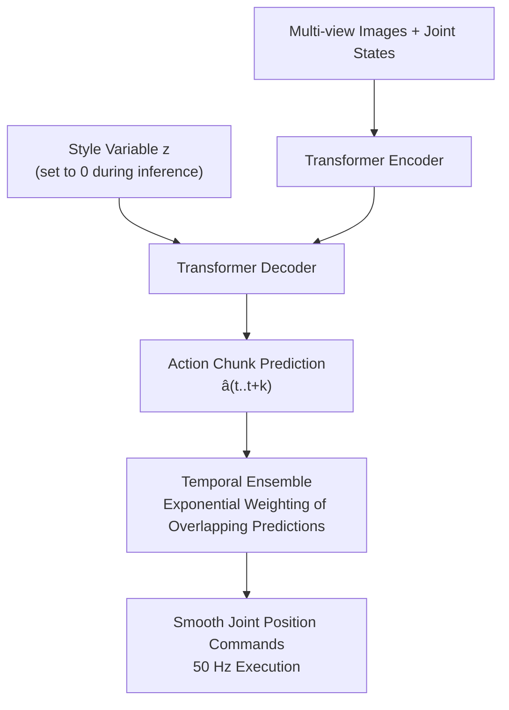
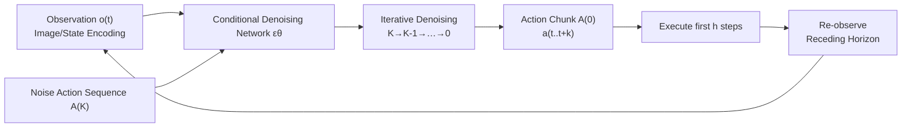
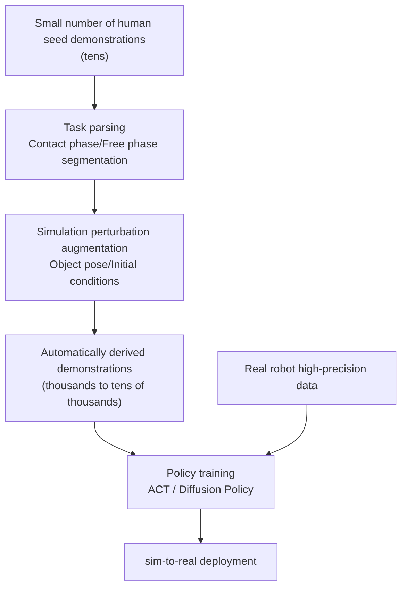
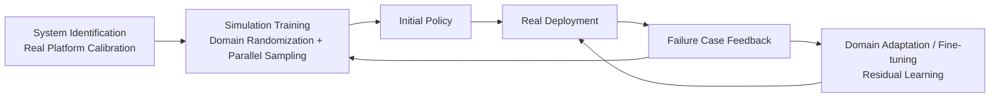

# Chapter 18: Imitation Learning and Policy Learning

## Abstract

The acquisition of manipulation skills for humanoid robots is undergoing a paradigm shift from "manual programming" to "data-driven" approaches: instead of manually deriving controllers for each task, robots learn policies from demonstration data. This chapter systematically elaborates on the technical systems of Imitation Learning (IL) and policy learning: first, it presents the problem formulation of imitation learning and the analysis of compounding error; then, it delves into three mainstream technical routes—Behavior Cloning (BC), Action Chunking with Transformers (ACT), and Diffusion Policy—providing their mathematical models, architectural designs, and engineering trade-offs; subsequently, it discusses data-efficient learning and data scaling methods, including teleoperation data collection (ALOHA, Mobile ALOHA, UMI), simulation data synthesis (MimicGen, DexMimicGen, HumanoidGen), and large-scale cross-embodiment datasets (Open X-Embodiment, AgiBot World); finally, it addresses the sources of reality gap in sim-to-real transfer, Domain Randomization, system identification and domain adaptation techniques, as well as engineering constraints for policy evaluation and deployment. The ACT, Diffusion Policy, RT-1/RT-2, BC-Z, Octo, OpenVLA, π0, GR00T N1, Helix, LeRobot, Isaac Lab, etc., cited in this chapter are all real entries included in the knowledge graph.

**Keywords**: Imitation Learning; Behavior Cloning; ACT; Action Chunking; Diffusion Policy; Denoising Diffusion Model; Data-Efficient Learning; Teleoperation; Sim-to-Real; Domain Randomization

---

## 18.1 Problem Formulation of Imitation Learning

### 18.1.1 From Demonstrations to Policies

Imitation learning models skill acquisition as a supervised learning problem. Let the robot be in a Markov Decision Process (MDP) \((\mathcal{S}, \mathcal{A}, P, R, \gamma)\), and an expert (human or other controller) provides a demonstration dataset \(\mathcal{D} = \{(o_t, a_t)\}\), where \(o_t\) is the observation (image, joint state, force/tactile, etc.) and \(a_t\) is the expert action. The goal of imitation learning is to train a parameterized policy \(\pi_\theta(a|o)\) that maximizes the likelihood of expert actions over the demonstration distribution:

$$
\theta^* = \arg\max_\theta \sum_{(o,a)\in\mathcal{D}} \log \pi_\theta(a \mid o)
$$

For a deterministic policy (regression-based behavior cloning), this is equivalent to minimizing the action reconstruction error \(\|\pi_\theta(o) - a\|^2\). This formulation, though seemingly simple, introduces all the core problems of imitation learning: **the state distribution during testing is inconsistent with the demonstration distribution during training**.

!!! note "Terminology Explanation: Policy, Demonstration, Observation, Covariate Shift, Compounding Error, Out-of-Distribution State"
    - **Policy**: A mapping from observation to action \(\pi: \mathcal{O} \to \mathcal{A}\), which can be a deterministic function or a conditional probability distribution.
    - **Demonstration**: An observation-action sequence recorded when an expert performs a task, serving as training data for imitation learning.
    - **Covariate Shift**: The phenomenon where the input distribution during training \(p_{train}(o)\) differs from the input distribution during testing \(p_{test}(o)\).
    - **Compounding Error**: The phenomenon where small policy errors accumulate, causing the state to gradually deviate from the demonstration distribution, with error growing approximately quadratically over time steps.
    - **Out-of-Distribution State**: A state encountered during policy execution that never appeared in the demonstration data, leading to unpredictable policy outputs.

### 18.1.2 Compounding Error and Covariate Shift

Assuming the policy's action error at each state is \(\epsilon\), the error drives the robot into states deviating from the demonstration distribution, and deviation leads to larger errors in a vicious cycle. The total error for a \(T\)-step task can reach \(O(T^2 \epsilon)\) magnitude—this is the compounding error. There are three main categories of mitigation approaches:

1. **Data Aggregation (DAgger-like)**: Execute the current policy during training, have the expert re-annotate actions for states visited by the policy, and iteratively expand the dataset. **Diff-DAgger** (2025), included in the knowledge graph, introduces uncertainty estimation into this process, requesting human intervention only for states where the policy is uncertain, thus reducing annotation cost;
2. **Action Chunking and Open-Loop Execution**: Predict a chunk of future actions at once and execute them, shortening the "decision chain" and structurally reducing error accumulation. This is the core idea of ACT (see Section 18.3);
3. **Noise Injection and Data Augmentation**: Inject artificial perturbations during demonstration collection, forcing the expert to show "how to get back on track," effectively expanding the coverage of the demonstration distribution.

### 18.1.3 Policy Input and Action Space Design

The design of policy input/output often has a greater impact on performance than the network architecture itself. This assertion has a direct engineering corollary: before finalizing the network architecture, conduct ablation experiments on observation and action representations with small-scale data—in imitation learning, "what to see" and "what to output" are decisions that lock in the performance ceiling earlier than "which network to use." Common design choices are as follows:

| Design Dimension | Common Choices | Trade-offs |
|---|---|---|
| Visual Observation | Third-person camera / Wrist camera / Binocular | Third-person provides good global information; wrist camera is essential for anti-occlusion and fine manipulation |
| Proprioceptive Observation | Joint angles, End-effector pose, Force/Tactile | Force/Tactile is crucial for contact-rich tasks but difficult to align across embodiments |
| Action Representation | Joint position / End-effector pose delta / Torque | End-effector space offers good task generalization; joint space is stable across scenarios |
| Action Horizon | Single step / Action chunk | Action chunks suppress compounding error and reduce inference frequency requirements |
| Conditioning Information | None / Language instruction / Goal image | Language conditioning is the mainstream interface for multi-task generalization |

### 18.1.4 Sources and Quality of Demonstration Data

The "quality" and "quantity" of demonstration data are equally important and often conflict. From the source perspective, demonstrations can be categorized into four types:

1. **Robot Teleoperation Demonstrations**: The data distribution is perfectly aligned with the deployment policy (same embodiment, same observation). This is the highest quality type but has the highest collection cost;
2. **Human Direct Demonstrations**: Collected via handheld devices (e.g., UMI), first-person videos (e.g., EgoMimic), or motion capture. Low cost and large scale, but suffer from the human-robot embodiment gap, requiring retargeting or representation alignment;
3. **Simulation Synthetic Demonstrations**: Generated by planners or scripted policies in simulation. Nearly unlimited in scale but carry a reality gap;
4. **Web Videos and Human Activity Data**: Largest scale and richest semantics, but lack action annotations. Currently mainly used for pre-training representation layers of vision-language-action models.

From the quality perspective, empirical conclusions include: the variance in demonstrator skill is faithfully inherited by the policy; multi-style demonstrations without explicit modeling (e.g., CVAE style variables) lead to averaging; "clean but single-style" datasets perform well in-distribution but are fragile out-of-distribution, while "diverse but noisy" datasets are the opposite. A mature data engineering pipeline involves segmenting and annotating demonstrations, removing failed segments, filtering for style consistency, and including metadata (operator, device, scene) for each demonstration under version control—this directly connects to the data engineering infrastructure discussed in Chapter 15.

## 18.2 Behavior Cloning

### 18.2.1 Basic Principles and Training

Behavior Cloning (BC) is the most direct imitation learning method: it treats demonstration data as supervised learning samples, training a network to regress (or classify) expert actions. Its advantages lie in simple implementation, stable training, and no need for environment interaction; it can achieve usable performance when demonstration data coverage is sufficient and task duration is short. For humanoid robots, BC often serves as the "first baseline" for all new tasks: first train BC with 50–100 demonstrations, then decide whether to upgrade to ACT, diffusion policies, or introduce reinforcement learning fine-tuning based on failure modes.

This engineering discipline of "BC first, then upgrade" has dual value: first, BC's failure modes themselves serve as diagnostic signals—multimodal failure points to diffusion policies, long-term drift points to action chunking, out-of-distribution collapse points to data aggregation; second, the existence of a BC baseline forces any subsequent complex method to prove its relative gain, avoiding complexity for complexity's sake.
In compute-constrained edge deployments, lightweight BC remains the practical choice for many mass-production functions (e.g., pick-and-place in fixed scenarios).

### 18.2.2 Large-Scale Behavior Cloning: BC-Z and RT-1

When the scale of demonstration data reaches hundreds of thousands, behavior cloning exhibits significant emergent capabilities. Two milestone works recorded in the knowledge graph:

- **BC-Z** (2021): Google's large-scale imitation learning work, trained on 129,000 demonstrations with language or human video conditioning, first demonstrated zero-shot task generalization—for language instructions not seen during training, the policy could execute directly;
- **RT-1 (Robotics Transformer)** (2022): Trained a transformer policy on approximately 130,000 real robot demonstrations covering over 700 tasks, discretizing actions into tokens for autoregressive prediction, systematically validating the scalability of the "data scale + transformer + multi-task" approach.

RT-1's follow-up work **RT-2** (2023) further transferred knowledge from vision-language large models to robot control, proposing the Vision-Language-Action (VLA) model paradigm; **Open X-Embodiment / RT-X** (2023) jointly built an open dataset spanning 22 robot embodiments with over one million trajectories, demonstrating that cross-embodiment joint training can mutually benefit each other. The architecture of VLA models will be detailed in Chapter 19; this chapter focuses on their common imitation learning training backbone.

From an imitation learning perspective, this series of works established three designs widely reused subsequently: action discretization/tokenization allows direct reuse of language model training pipelines; multi-task mixed training combined with language instruction conditioning makes "task" itself a generalizable input dimension; and the two-stage training paradigm of "pre-trained representation + robot data fine-tuning"—it transforms the problem of scarce robot data into an optimization problem of how to retain pre-trained knowledge without forgetting given limited data.

### 18.2.3 Limitations of Behavior Cloning

The failure modes of naive BC are highly consistent: **"averaging" of multimodal demonstration data** (when the expert can go left or right around an obstacle under the same observation, regression outputs a compromised action that hits both sides), **error accumulation in long-horizon tasks**, and **no recovery capability for states outside the demonstration coverage**. These three points are precisely addressed by diffusion policies (multimodal modeling), ACT (action chunking), and DAgger-like methods (distribution correction), respectively, forming the motivation for Sections 18.2.4 and 18.3–18.4.

Another often underestimated issue is **implicit causal confusion in demonstrations**: the policy may learn features in observations that are merely correlated with actions rather than causal (e.g., the operator's habitual preparatory movements, fixed backgrounds in the scene). Once the deployment environment changes, these "shortcut features" fail, and policy performance drops sharply. Mitigation methods include diverse collection environments, occlusion augmentation for visual inputs, and using counterfactual thinking to examine the data collection protocol—this is essentially a data engineering problem rather than an algorithm problem.

### 18.2.4 Improved Variants of Behavior Cloning

Before the introduction of ACT and diffusion policies, the engineering community developed a set of improved variants to mitigate BC's averaging problem, which are still in use today:

- **Action discretization**: Binning the continuous action space into discrete tokens, replacing regression loss with classification loss. Classification naturally supports multimodality (different modes each get probability mass); RT-1 adopts this approach. The cost is a trade-off between discretization resolution and action dimensionality—joint discretization of high-dimensional dexterous hands faces combinatorial explosion;
- **Mixture Density Network (MDN)**: Outputs parameters of a Gaussian mixture (mean, variance, and weight of each component), explicitly representing multimodal distributions; training is sensitive to hyperparameters (number of components), and in practice, it has been gradually replaced by diffusion models;
- **Quantile regression and energy-based models**: Output quantiles of the action distribution or implicitly define the distribution via an energy function; the latter is conceptually consistent with diffusion models.

!!! note "Terminology Explanation: Multimodal Distribution, Action Discretization, Mixture Density Network, Energy-Based Model"
    - **Multimodal distribution**: A distribution whose probability density has multiple local maxima; the "same observation, multiple reasonable actions" in demonstration data corresponds to the multimodality of the action conditional distribution.
    - **Action discretization**: The technique of dividing continuous action dimensions into finite intervals and transforming them into a classification problem; it served as an early bridge connecting language models and robot action spaces.
    - **Mixture Density Network (MDN)**: A regression method that uses a neural network to output parameters of a Gaussian mixture model, capable of representing a finite number of modes.
    - **Energy-based model**: A family of models that implicitly define a distribution \(p(a) \propto e^{-E(a)}\) via a scalar energy function; diffusion models can be seen as a trainable sampler implementation of this approach.

## 18.3 ACT and Action Chunking

### 18.3.1 Action Chunking with Transformers

Action Chunking with Transformers (ACT) was proposed by Zhao et al. in 2023 on the low-cost bimanual teleoperation platform **ALOHA**, and is one of the most influential imitation learning methods in the field of fine bimanual manipulation. Its design rests on three pillars:

**(1) Action Chunking**: Instead of regressing single-step actions frame by frame, the policy predicts a sequence of future \(k\) steps (typically 100 steps) of actions \(\hat{a}_{t:t+k}\) at once. Chunking essentially models "short-term intent," shortening the decision chain from \(T\) steps to \(T/k\) steps, significantly suppressing compounding errors while reducing the demand on inference frequency.

**(2) CVAE Modeling**: ACT models the policy as a Conditional Variational Autoencoder (CVAE). During training, the encoder compresses the demonstration action chunk and joint states into a style variable \(z\), and the decoder (a transformer encoder-decoder structure) reconstructs the action chunk conditioned on the current multi-view images, joint states, and \(z\). The training objective is reconstruction loss plus KL regularization:

$$
\mathcal{L} = \sum_{i=1}^{k} \|\hat{a}_{t+i} - a_{t+i}\|_1 + \beta\, D_{KL}\!\left(q_\phi(z \mid o_t, a_{t:t+k}) \,\|\, \mathcal{N}(0, I)\right)
$$

During inference, \(z\) is directly set to the prior mean \(0\). The role of CVAE is to absorb the style diversity in demonstration data, avoiding the averaging effect of simple regression on diverse demonstrations.

**(3) Temporal Ensemble**: During execution, at each time step, there are multiple overlapping predictions from different inference batches. ACT weights and averages them with exponentially decaying weights \(w_i \propto \exp(-m \cdot i)\), yielding a smooth and jitter-resistant output trajectory. The weight decay coefficient \(m\) controls the "memory length": smaller \(m\) gives stronger smoothing but slower response to perturbations, requiring adjustment based on the dynamics of the task.

On the ALOHA platform, ACT, combined with approximately $20,000-level low-cost bimanual hardware and around 50 human demonstrations, achieves 80%–90% success rates on contact-sensitive fine bimanual tasks such as zipping, opening cup lids, and inserting slots. It has become an important baseline for subsequent diffusion policies and VLA models, and "action chunking" has become the mainstream design for the action head of robot foundation models.

### 18.3.2 Engineering Points and Limitations

Engineering experience with ACT includes: the action chunk length \(k\) needs to balance "suppressing compounding errors" (large \(k\)) and "closed-loop responsiveness" (small \(k\)), typically set to 50–100; L1 reconstruction loss is more robust to outlier demonstrations than L2; a lightweight ResNet is sufficient for the image backbone, with the bottleneck usually being data rather than capacity. Its limitations are also clear: single-task training, single-scene distribution, limited generalization to language instructions and open object sets; temporal ensemble assumes consistent predictions across consecutive inference batches, leading to response lag in dynamic environments or under sudden perturbations. These limitations directly drove the development of diffusion policies and multi-task VLAs.

### 18.3.3 Derivatives and Impact of ACT

The "action chunking + temporal ensemble" paradigm proposed by ACT quickly became the de facto interface in the fine manipulation domain. Its direct derivatives include: the Mobile ALOHA training pipeline extending single-task ACT to language-conditioned multi-task policies; various VLA action heads grafting action chunk prediction onto large-scale pre-trained backbones (action experts in models like π0, GR00T N1, etc., all output in chunked form); and hybrid architectures replacing CVAE with diffusion/flow matching generators. The knowledge graph includes **H-RDT** (2025), which extends the chunked diffusion action head to humanoid whole-body action space, and **Coordinated Humanoid Manipulation with Choice Policies** (2025), which introduces discrete mode selection within the chunking framework. The common insight from these works is: **action chunking solves the "interface" problem, generative models solve the "distribution" problem, and the two are orthogonal and freely combinable**.

## 18.4 Diffusion Policy

### 18.4.1 Fundamentals of Denoising Diffusion Models

Diffusion Policy is built upon Denoising Diffusion Probabilistic Models (DDPM; Ho et al. 2020). DDPM defines a forward process that gradually adds noise, corrupting data \(x^0\) into Gaussian noise, and then trains a network \(\epsilon_\theta\) to denoise step by step:

$$
q(x^k \mid x^{k-1}) = \mathcal{N}(\sqrt{1-\beta^k}\, x^{k-1},\, \beta^k I), \qquad
\mathcal{L} = \mathbb{E}\left[ \|\epsilon - \epsilon_\theta(x^k, k)\|^2 \right]
$$

During generation, samples are obtained by iteratively denoising starting from pure noise. A key property of diffusion models is that they **can represent arbitrarily complex multimodal distributions**—precisely what behavioral cloning lacks.

!!! note "Terminology: Forward Diffusion, Denoising Network, Noise Schedule, DDIM, Conditional Generation"
    - **Forward diffusion**: A Markov chain that gradually injects Gaussian noise into data according to a noise schedule \(\beta^k\), providing supervised samples at various noise levels during training.
    - **Denoising network**: A neural network that predicts the added noise (or equivalently, the clean sample/score function); it is the only component of the diffusion model that requires training.
    - **Noise schedule**: The arrangement of noise intensity across diffusion steps, affecting training stability and generation quality.
    - **DDIM**: Denoising Diffusion Implicit Model, a deterministic sampler that allows skipping steps to reduce inference latency by several times.
    - **Conditional generation**: Modeling \(p(a \mid o)\) conditioned on observation \(o\); diffusion policy is an instance of a conditional diffusion model in action space.

### 18.4.2 Diffusion Policy: Applying Diffusion to Action Generation

The diffusion policy proposed by Chi et al. in 2023, "Diffusion Policy: Visuomotor Policy Learning via Action Diffusion," models the conditional distribution of action chunks \(p(a_{t:t+k} \mid o_t)\) as a DDPM: conditioned on visual observation encoding, it starts from a noise action sequence and generates a smooth action segment through several denoising steps. Compared to ACT, the structural differences of diffusion policy are:

- **Multimodality**: Faced with observations where "going left or right are both acceptable," the diffusion policy samples a complete action from one of the modalities, rather than outputting a compromise.
- **Receding horizon execution**: Each time, a full action segment is generated, but only the first few steps are executed before re-planning, balancing open-loop smoothness and closed-loop reactivity.
- **Training stability**: The denoising objective regresses to noise prediction, eliminating the need for KL balancing in CVAE or adversarial training in GAN.

Diffusion policy has achieved consistent improvements over previous methods on benchmarks such as pushing, flipping, and precision assembly, and has rapidly spawned variants for different observation modalities and architectures, such as 3D Diffusion Policy (DP3) using 3D point clouds, and Diffusion Transformer Policy (2024). Its inference cost lies in the multi-step iterative denoising (typically 10–100 steps), and deployment often employs acceleration techniques like distillation, consistency models, or flow matching to compress the number of sampling steps.

### 18.4.3 Diffusion Policy on Humanoid Robots

Transferring diffusion policy to humanoid robots requires addressing two additional issues: high-dimensional whole-body action space and the coupling of locomotion and manipulation. **Generalizable Humanoid Manipulation with Improved 3D Diffusion Policies** (2024), included in the knowledge graph, drives upper-body manipulation of humanoid robots with an improved 3D diffusion policy, leveraging the geometric generalization of point clouds for cross-object and cross-scene grasping and placement. **Coordinated Humanoid Manipulation with Choice Policies** (2025) applies diffusion/flow matching to the selection and generation of dual-arm coordination patterns. Works like **H-RDT (Human Manipulation Enhanced)** (2025) for whole-body control explore extending the diffusion action head to full-body degrees of freedom. A common engineering conclusion from these works is: **the diffusion policy is responsible for "what action to generate," while the whole-body controller is responsible for "how to execute it stably,"** with the two decoupled through an action interface (end-effector pose or whole-body joint targets).

A frequently overlooked interface design issue arising from this division is the **feasibility constraint of action chunks**: the diffusion model learns the action distribution from data, and demonstration data naturally falls within the robot's feasible region, so generated action chunks are statistically close to feasible—but "statistically close" does not mean individually feasible. When the observation distribution shifts (new objects, new poses), the generated trajectory may violate joint limits or self-collision constraints. Engineering safeguards come in two forms: adding a feasibility projection layer after the action interface (projecting the generated trajectory onto the constraint manifold, at the cost of some smoothness), or explicitly including negative samples of constraint violations in the training data combined with guided sampling. For humanoid whole-body actions, the former is more controllable, while the latter is more general, and both are currently in the engineering exploration phase.

### 18.4.4 Comparison of Three Imitation Learning Methods

| Dimension | Behavioral Cloning (BC) | ACT | Diffusion Policy |
|---|---|---|---|
| Action Distribution Modeling | Unimodal Regression | CVAE (Weak Multimodal) | Multimodal Diffusion Process |
| Prediction Horizon | Single Step | Action Chunk | Action Chunk |
| Compounding Error | Severe | Mitigated by Chunking | Mitigated by Chunking + Receding Horizon |
| Inference Cost | Very Low | Low (Single Forward + Ensemble) | Higher (Multi-step Denoising) |
| Training Data Requirement | Moderate | Moderate (Tens to Hundreds of Demos) | Moderate, Increases with Task Complexity |
| Typical Examples | BC-Z, RT-1 | ACT (ALOHA) | Diffusion Policy, DP3 |
| Suitable Scenarios | Short Horizon, Sufficient Demo Coverage | Fine Dual-Arm, Rich Contact | Multimodal Demos, Complex Manipulation |

### 18.4.5 Engineering Implementation Details of Diffusion Policy

Translating diffusion policy from paper to a real robot, the following implementation details determine success or failure:

- **Denoising Steps and Inference Budget**: Use 50–100 denoising steps during training; compress to around 10 steps during deployment using deterministic samplers like DDIM, and further reduce to 1–4 steps via distillation. Each denoising step requires approximately one network forward pass, which must be budgeted together with the robot's control frequency.
- **Action Normalization**: Normalizing each dimension of the action chunk (z-score or min-max) significantly impacts the stability of diffusion training. Dimensional differences between joint space and end-effector space must be unified first.
- **Observation Encoding**: For image observations, typically freeze a pre-trained visual backbone and only train the projection layer and denoising network to mitigate overfitting with small datasets. The temporal synchronization error of multi-view images should be controlled within tens of milliseconds.
- **Receding Horizon Parameters**: The ratio of action chunk length \(k\) to execution step length \(h\) (where \(h < k\)) determines the trade-off between closed-loop reactivity and smoothness. Choose a smaller \(h\) for contact-rich tasks and a larger \(h\) for quasi-static tasks.
- **Failure Behaviors**: Diffusion sampling occasionally produces "mixed trajectories" across modalities. Engineering safeguards require low-level safety checks (velocity/acceleration limiting) as a fallback and consistency checks between consecutive samples.

## 18.5 Data-Efficient Learning and Data Scaling

### 18.5.1 Data is the Bottleneck: Collection Cost and the "Data Pyramid"

The performance of imitation learning is currently primarily determined by data scale and diversity, while collecting real robot data is expensive: taking dual-arm teleoperation as an example, a single demonstration requires tens of seconds from an operator, and a dataset of tens of thousands of trajectories often takes several person-months. The industry is gradually forming a consensus on the "data pyramid" — the bottom layer consists of massive simulated synthetic data and human videos, the middle layer is cross-embodiment real robot data, and the top is high-precision demonstrations from the target robot model. The strategy first learns from the bottom layers, then aligns with the top.

The economic implications of the pyramid structure are worth elaborating: the closer to the top, the higher the unit data collection cost and the greater the marginal contribution to final performance; the closer to the bottom, the data is nearly free but requires additional alignment techniques (retargeting, sim-to-real) to be useful. The optimization problem for data strategy is therefore **the optimal allocation of data across layers given a fixed budget** — there is no analytical solution, but there is an empirical guideline: when demonstrations for the target robot model are fewer than about a few hundred, the return on adding real data is almost always greater than any algorithmic improvement.

### 18.5.2 Teleoperation Data Collection Systems

The main entry point for demonstration collection is teleoperation. The representative systems cataloged in the knowledge graph form a cost-capability spectrum:

| System | Form | Collection Target | Characteristics |
|---|---|---|---|
| ALOHA (2023) | Dual-arm master-slave teleoperation station | Desktop dual-arm fine manipulation | ~$20k low cost, master-slave isomorphic |
| Mobile ALOHA (2024) | Mobile base + dual arms | Home/warehouse whole-body mobile manipulation | Operator can "drive" the entire robot to complete tasks |
| Bilateral Teleoperation | Master-slave + force feedback | Contact-rich tasks | Force/tactile feedback to master side, improving transparency |
| UMI Gripper Interface (2024) | Handheld gripper + visual tracking | In-the-wild robot-free demonstrations | No robot body required, enables large-scale outsourced collection |
| HumanPlus Shadow System (2024) | RGB pose estimation + low-level policy | Humanoid whole-body motion | Single camera can drive a full-size humanoid robot |

Among these, the concept behind **UMI (Universal Manipulation Interface)** has had a profound impact: decoupling "collecting data" from "owning a robot." The collector holds a camera-equipped gripper to directly demonstrate, recovering end-effector trajectories via visual localization, which are then replayed on the robot for training. EgoMimic (2024) uses egocentric first-person video (e.g., from smart glasses) to expand imitation learning data sources.

The ergonomics of teleoperation systems also determine data quality: the higher the degree of master-slave isomorphism, the more direct the mapping of the operator's motion intent, and the closer the demonstration is to the robot's dynamic feasibility; conversely, heterogeneous retargeting introduces feasibility losses imperceptible to the operator, manifesting as demonstration trajectories that "look correct but shake when executed" on the robot. Fatigue is another hidden variable — prolonged teleoperation causes demonstration quality to degrade over a shift. Mature data collection teams limit single session duration and perform online monitoring of demonstration quality. These "soft" factors ultimately precipitate as systematic biases in the dataset, affecting the success or failure of downstream policies.

### 18.5.3 Simulation Data Synthesis: From Seed Demonstrations to Multi-Thousand Datasets

Another route is "a few real seeds + large-scale simulation augmentation." **MimicGen**, cataloged in the knowledge graph, is a representative framework: using a small number of human demonstrations as seeds, it systematically perturbs object poses and initial conditions in simulation to automatically generate thousands of new demonstrations; **DexMimicGen** (2024) extends this to dual-arm dexterous manipulation; **HumanoidGen** (2025) further introduces large language model reasoning to automatically generate tasks and data for dual-arm dexterous manipulation. The key points of this route are:

1. Seed demonstrations provide task-level trajectory templates and contact pattern priors;
2. Simulation augmentation covers pose variations, providing visual and physical diversity;
3. Policies trained on derived data still require sim-to-real transfer (see Section 18.6).

### 18.5.4 Large-Scale Cross-Embodiment Datasets and Training Ecosystem

On the data scaling front, **Open X-Embodiment** (2023), cataloged in the knowledge graph, aggregates data from 22 robot embodiments and over a million trajectories, supporting the RT-X series of cross-embodiment models; **AgiBot World Colosseo** (Zhiyuan Robot, 2025) is a large-scale real data collection platform and dataset for humanoid/dual-arm manipulation. On the open-source training ecosystem side, Hugging Face's **LeRobot** provides an end-to-end PyTorch library covering dataset formats, teleoperation, training, and deployment, and has become one of the de facto standard toolchains for reproducing and fine-tuning ACT and diffusion policies.

The large-scale data ecosystem can be organized by "embodiment coverage × scene coverage" in the following table:

| Dataset/Platform | Embodiment Form | Data Type | Scale/Positioning |
|---|---|---|---|
| Open X-Embodiment | 22 types of arms/mobile manipulators | Real teleoperation | Million-trajectory level, cross-institution aggregation |
| AgiBot World Colosseo | Humanoid/dual-arm whole robot | Real teleoperation + simulation | One of the largest platforms for humanoid manipulation |
| ALOHA Series Datasets | Dual-arm/mobile dual-arm | Real teleoperation | Tens to hundreds of demonstrations per task |
| UMI Collection | Handheld gripper (no robot body) | In-the-wild human demonstrations | Scalable via outsourcing |
| MimicGen/DexMimicGen Derived | Simulated dual-arm/dexterous hand | Synthetic demonstrations | Tens of seeds → tens of thousands derived |

There is a yet-unresolved contradiction in utilizing cross-embodiment data: **misalignment of observation and action spaces**. Different robots have different camera mounts, joint counts, and action semantics. Current compromises involve unifying representations into end-effector space or latent action space, or using language-vision as a shared space with embodiment-specific action heads (the mainstream approach for VLAs).

For humanoid robot practitioners, a practical suggestion for data ecosystem selection is: during the pre-training phase, reuse cross-embodiment data as much as possible (the benefits of visual and task diversity outweigh the cost of action space mismatch); during the fine-tuning phase, strictly use data from the target robot model (action precision dominates performance at this stage); and bridge the two phases with a unified task description (language instruction + target pose) — i.e., "diversity comes from cross-embodiment, precision comes from the target model."

### 18.5.5 Few-Shot Learning and Self-Improvement

Another extreme of data-efficient learning is "minimal demonstrations": One-Shot Visual Imitation via Meta-Learning (Finn et al., 2017) allows a policy to generalize to new objects from a single demonstration; **RoboCat** (DeepMind, 2023) demonstrates a self-improvement loop — the agent first adapts to a new task with a few demonstrations, then autonomously collects data to augment its own training set; the **Fleet Data Flywheel** industrializes this loop: a deployed fleet continuously returns failure and edge cases, the model is iterated upon and updated via OTA, creating a positive cycle of "more deployment → more data → better model." Additionally, using reinforcement learning for post-training fine-tuning of imitation policies (e.g., **ConRFT**, **SimpleVLA-RL**, 2025) can push success rates from around 50% to around 90% within tens of real-world interactions, serving as an important supplement to data-efficient learning in recent years.

It is worth distinguishing two types of "self-improvement" data quality control: the RoboCat-style loop involves the system autonomously collecting data, but a success detector must filter the autonomously generated trajectories, otherwise erroneous behaviors will be fed back as positive examples; the fleet data flywheel relies on the operations side to select and return segments, with quality control depending on annotation and review processes. The common point of both loops is that **the marginal value of data decreases as the model becomes stronger**: routine successful cases already mastered by the model provide almost no information gain; what is truly valuable are failure and edge cases. This dictates that a mature data loop must employ a "failure-driven" sampling strategy, rather than uniform return.

### 18.5.6 From Imitation to Reinforcement: Offline Reinforcement Learning and Policy Post-Training

The performance ceiling of pure imitation learning is the demonstrator's skill level, and it cannot leverage failure experiences. There are three engineering routes for bridging imitation and reinforcement:

1. **Offline Reinforcement Learning (Offline RL)**: Train a value function and improve the policy on a fixed dataset (including failures and suboptimal trajectories) without online interaction. **Q-Transformer** (Chebotar et al., 2023), cataloged in the knowledge graph, combines Q-learning with a transformer, discretizing actions and autoregressively estimating Q-values for each action dimension, enabling offline reinforcement fine-tuning on large-scale robot data; **AWR (Advantage-Weighted Regression)** class methods weight the behavioral cloning loss using an advantage function, biasing towards high-reward behaviors while maintaining the stability of supervised learning;
2. **Online Reinforcement Fine-tuning (RL fine-tuning)**: Initialize with an imitation policy and continue improvement with a small number of online interactions in a real or simulated environment. **ConRFT** (2025) combines consistency policy with reinforcement fine-tuning; **SimpleVLA-RL** (2025) validates significant gains from online reinforcement fine-tuning of VLA models; these methods typically require only tens to hundreds of interactions, making deployment costs manageable;
3. **Reward/Value-Guided Sampling**: Without updating policy parameters, use a value function or reward model to score and select the best among multiple diffusion policy sampling candidates at inference time, trading computation for performance.

A common prerequisite for all three routes is **an available success signal**: Offline RL requires reward annotations on the data; online fine-tuning requires an automatically determinable task success detector; sampling guidance requires a computable value/reward model. The engineering design of the success signal (rule-based determination, learned success classifiers, human annotation) is therefore one of the practical bottlenecks in this direction.

### 18.5.7 Utilizing Human Video and Cross-Embodiment Data

Beyond robot data, human activity videos are the largest and most semantically richest source of behavioral data. Their utilization follows three levels: **Representation level** — using video-pretrained visual encoders to initialize the perception module of the policy; **Affordance/Trajectory level** — extracting object gravity and hand-object interaction trajectories from first-person videos as task priors (EgoMimic, various egocentric works); **Action level** — directly converting human hand movements into dexterous hand demonstrations through hand pose estimation and retargeting. The core difficulty of cross-embodiment utilization is the **human-robot morphology gap**: the range of motion of human fingers and wrists does not overlap with any dexterous hand, and direct joint mapping can produce infeasible or uncontrollable actions. This typically requires using fingertip poses or object motion as intermediate representations, followed by motion retargeting on the robot side to solve for feasible joint trajectories. This "object-centric representation" approach is the common choice of systems like the HumanPlus shadow system and collection schemes such as DexCap.

## 18.6 Sim-to-Real Transfer

### 18.6.1 Sources of the Reality Gap

When policies trained in simulation are deployed directly on real robots, performance degradation stems from the **reality gap**. It is important to emphasize that the reality gap is not a single error term but a systematic set of biases spanning perception, dynamics, and control timing; any transfer method targeting only one category will fail on others. Its sources can be divided into four categories:

| Gap Type | Specific Manifestation | Primary Mitigation Methods |
|---|---|---|
| Dynamics Gap | Friction, backlash, flexibility, actuator response mismatch with simulation model | System identification, dynamics randomization, actuator modeling |
| Perception Gap | Differences in rendered images vs. real camera texture, lighting, noise | Visual domain randomization, fine-tuning with real data, depth/point cloud observations |
| Contact Gap | Deviation of contact model (rigid body collision, Coulomb friction) from real contact mechanics | Contact parameter randomization, differentiable contact, real2sim calibration |
| State Distribution Gap | Mismatch between simulation initial state distribution and real deployment distribution | Designing initial distribution based on real data statistics, closed-loop training |
| Timing Gap | Control delay, communication jitter, inconsistent action execution duration | Delay modeling, action timestamps, temporal randomization |

### 18.6.2 Domain Randomization

Domain Randomization (DR) is the most commonly used sim-to-real technique: during training, simulation parameters (mass, friction coefficient, damping, camera intrinsics/extrinsics, lighting, texture, delay, etc.) are randomized, making the policy robust to parameter uncertainty — the real world is just one sample from the distribution. Its mathematical essence is to extend policy training from a single dynamics \(P\) to a parameterized distribution family \(\{P_\xi\}\), learning a policy that performs well under variations of \(\xi\):

$$
\theta^* = \arg\max_\theta \; \mathbb{E}_{\xi \sim \Xi}\left[ J(\pi_\theta; P_\xi) \right]
$$

Engineering key points include: the randomization range should cover the uncertainty interval of real parameters but not be too wide (excessive width makes the policy overly conservative); visual randomization contributes most to "zero-shot" visual transfer; dynamics randomization is indispensable for contact-rich tasks. GPU-parallel simulators like Isaac Lab, MuJoCo, Genesis, and ManiSkill3 have reduced the wall-clock cost of large-scale domain randomization training to an acceptable level.

A practical list of randomization parameters is as follows:

| Category | Typical Randomization Objects | Typical Amplitude (Relative to Nominal Value) |
|---|---|---|
| Rigid Body Dynamics | Link mass, center of mass, moment of inertia | ±10%–30% |
| Contact | Friction coefficient, restitution coefficient, contact stiffness | Friction ±30% or more |
| Actuator | Motor constant, armature resistance, gearbox backlash and hysteresis, torque limit | ±10%–20% |
| Sensing | Encoder noise, IMU bias, control delay | Delay 0–20 ms |
| Vision | Lighting, texture, camera intrinsics/extrinsics, distortion, exposure | Depends on rendering pipeline |
| Environment | Ground slope/roughness, external perturbation forces | Set according to task risk |

Calibration of randomization amplitude should prioritize confidence intervals derived from system identification rather than arbitrary expansion; blindly expanding the randomization range is the most common cause of policies "failing to learn" or becoming "overly conservative" in practice.

### 18.6.3 System Identification, Domain Adaptation, and real2sim2real

The complementary approach to domain randomization is **narrowing the gap itself**:

- **System Identification (SysID)**: Estimating dynamics parameters (mass, friction, motor constants, delay) through excitation experiments on the real platform, calibrating the simulator to the real robot; identification and randomization are typically used together — identification sets the central value, randomization covers the residual error;
- **Domain Adaptation**: Adapting representations learned in the source domain (simulation) to the target domain (real), e.g., fine-tuning a visual encoder with a small amount of real data, or learning a mapping between simulation and real observations;
- **real2sim2real**: First calibrating the simulator with real data (real2sim), training in simulation, then deploying back to reality (sim2real). **CRISP: Contact-Guided Real2Sim** (2025), included in the knowledge graph, calibrates simulation contact parameters for contact tasks, while the **ASAP** series of works aligns the full-body dynamics of humanoid robots through "simulation-real action residual learning," significantly improving the transfer of whole-body policies.

The key judgment for the real2sim2real approach is **which parameters yield the most benefit from calibration**: globally identifying all dynamics parameters is both expensive and underdetermined. In practice, calibration is typically performed only on a few task-sensitive parameters (contact friction, actuator gains and delays for key joints, payload mass), leaving the rest to domain randomization. This aligns with the idea of sensitivity analysis — using simulation gradients or parameter sweep experiments to identify the subset of parameters with the greatest impact on task reward, and concentrating the identification budget on them.

### 18.6.4 Engineering Experience for Transfer Effectiveness

Several rules of thumb can be derived from sim-to-real literature and industry practice included in the knowledge graph: First, **the lower the control frequency and the more dynamic the task, the more fatal the dynamics gap** — quasi-static grasping is insensitive to model errors, while running and jumping whole-body motions are sensitive to millisecond-level delays; Second, **building policies on top of low-level controllers** (outputting joint targets or end-effector poses rather than direct torques) can significantly compress the gap to be bridged; Third, **fine-tuning with real data is almost always a necessary last mile**; zero-shot transfer is currently only reliable for relatively static tasks.

Additionally, there is an often-underestimated organizational experience: sim-to-real capability is essentially the **product of simulator fidelity, hardware consistency, and data feedback loop speed**. No matter how accurate the simulator, if the inter-unit dynamics variation (motor batches, assembly tolerances, gearbox break-in state) among robots of the same model exceeds the simulation-to-reality gap, transfer will fail; therefore, the incoming material consistency and factory calibration of mass-produced hardware (see Chapter 14) are implicit prerequisites for sim-to-real. Conversely, if the deployment site has a fast loop for feeding back failure data and triggering retraining, the initial transfer accuracy can be relaxed — this is the system-level coupling point between the fleet data flywheel and sim-to-real.

### 18.6.5 Representative Practices for Humanoid Robot Sim-to-Real

Humanoid robots, due to their many degrees of freedom and frequent contact switching, are among the most challenging platforms for sim-to-real. Recent works included in the knowledge graph outline two complementary paths:

- **Residual Alignment Path**: Represented by **ASAP (Aligning Simulation and Real-World Physics)**, this path first trains a "pre-trained policy" in simulation using domain randomization, then learns a residual model of actions between simulation and reality using real rollout data. During the fine-tuning phase, the residual compensation is injected into the simulation, forming a three-stage process of "pre-training — alignment — fine-tuning," significantly reducing transfer loss on whole-body motion tracking tasks;
- **Zero-Shot Path**: Represented by works such as **Closing the Reality Gap: Zero-Shot** (2026) and **Closing Sim-to-Real Gap** (2026), this path aims for direct deployment without real fine-tuning through extreme system identification, actuator-level modeling, and sensor noise simulation. The zero-shot path has extremely high requirements for hardware consistency and is typically only feasible on platforms with relatively clean dynamics.

For humanoid manipulation tasks, the current engineering consensus is "**lower body relies on simulation RL + upper body relies on real imitation**": whole-body skills like walking and balancing are trained in simulation and then transferred (combined with domain randomization and residual alignment), while manipulation skills primarily use real teleoperation data, supplemented by simulated synthetic data. The essence of this division is the different gap structures of the two task types — the reality gap for walking is mainly in dynamics (coverable by randomization), while the reality gap for manipulation is mainly in object diversity and contact details (high cost of simulation generation).

## 18.7 Policy Evaluation and Deployment

### 18.7.1 Evaluation Framework

The evaluation of learned policies must go beyond "training set success rate." A recommended hierarchical evaluation is:

| Level | Content | Tools/Benchmarks |
|---|---|---|
| Offline Evaluation | Action prediction error, validation set likelihood | Held-out demonstration set |
| Simulation Evaluation | Standard task success rate, perturbation robustness | HumanoidBench, HumanoidVerse, Isaac Lab |
| Real-world Small-scale | In-distribution success rate, failure mode classification | 10–30 trials/task |
| Real-world Generalization | New objects/new poses/new lighting success rate | Out-of-distribution test set |
| Long-duration Operation | Mean time between failures, human intervention rate | Continuous operation statistics |

The knowledge graph entry **Benchmarking Humanoid Imitation Learning with Motion Difficulty** (2025) specifically discusses the necessity of evaluating humanoid imitation learning hierarchically by motion difficulty—average success rates can mask systematic failures of policies on difficult motions.

Statistical rigor is the most easily overlooked aspect of evaluation: estimating the success rate of a single task requires a sufficient number of trials to be meaningful. Generally, to distinguish between 80% and 90% success rates, at least dozens of independent trials per task are needed; results should be reported with confidence intervals rather than point estimates. For multi-task evaluation, weighting should be stratified by task difficulty to avoid simple tasks inflating overall numbers. When comparing across methods, training conditions such as data volume, demonstration quality, and whether real-world fine-tuning was used must be aligned and disclosed; otherwise, success rates are not comparable.

### 18.7.2 Deployment Constraints

The main engineering constraints when deploying learned policies on hardware are: **Inference latency and frequency** (the contradiction between multi-step sampling of diffusion policies and a 50 Hz control frequency, typically mitigated by receding horizon control or distillation); **Safety wrapper** (learned policy outputs must pass through joint limits, velocity limits, torque saturation, and collision checks before execution, with a low-level controller capable of vetoing when necessary); **Fault degradation** (fallback to a stationary/compliant hold state when policy outputs are anomalous); and **On-device compute** (allocating computational resources for policy, perception, and planning within the overall compute budget; optimization of on-device VLA inference is discussed in subsequent chapters).

Two additional constraints strongly related to humanoid platforms exist on the deployment side: first, **Multi-rate clock alignment**—the policy (10–50 Hz), whole-body controller (500–1000 Hz), and servo (kHz level) operate in different clock domains. Action blocks output by the policy need to be time-stamped and sent down, with interpolation and extrapolation compensation performed by the low-level controller; otherwise, inference delay is directly injected into tracking error. Second, **Concurrent resource contention**—policy inference shares limited GPU/CPU budgets with perception, SLAM, and task planning. Latency jitter caused by load spikes is more damaging than average latency. Engineering solutions require real-time scheduling isolation and compute quota management for the policy process.

### 18.7.3 Engineering Governance of Data and Models

Once learning-based robots are deployed, data and models become assets requiring continuous governance. Recommended minimum practices include:

1. **Dataset versioning**: Use standardized dataset formats like LeRobot (unified observation/action schema, timestamp alignment, metadata manifest), ensuring each training data point can be traced back to the specific collection device, operator, and firmware version;
2. **Model lineage recording**: Each deployed model records its training data version, base model, fine-tuning configuration, and evaluation report, ensuring incidents can be reviewed;
3. **Shadow mode deployment**: New models first run in shadow mode in parallel with the current policy, recording but not executing; switch to production via a gradual rollout only after divergence statistics meet thresholds;
4. **OTA and rollback**: Model updates use the same OTA channel as firmware, retaining the ability to roll back to the previous stable version with one click—this, together with the fleet data flywheel, forms a complete "collect—train—rollout—rollback" closed loop.

These governance practices may seem unrelated to learning algorithms, but they directly determine whether an imitation learning system can iterate safely in real-world operations: without versioned data and models, failure cases cannot be attributed, and the data flywheel cannot be established.

## 18.8 Chapter Summary

This chapter has outlined the technical landscape of imitation learning and policy learning. Behavioral cloning provides the simplest baseline for skill acquisition, but its unimodal regression assumption and compounding error problem led to ACT's action chunking and diffusion policies' multimodal action generation. On the data collection side, teleoperation systems like ALOHA/Mobile ALOHA/UMI solved "where data comes from," while the MimicGen series, Open X-Embodiment, and AgiBot World solved "how to scale data." On the sim-to-real side, domain randomization, system identification, and domain adaptation form the three-piece suite for bridging the reality gap. For humanoid robots, the current mainline is a hybrid architecture where "imitation learning provides task priors + whole-body control provides stable execution + reinforcement learning/data flywheel provides continuous improvement"; how vision-language-action models will absorb these methods under a unified architecture will be expanded upon in Chapter 19.

As a concluding judgment for this chapter: imitation learning has not replaced control theory; it has redefined the battlefield of control theory. Ten years ago, engineers manually wrote state machines and controllers for each task; today, they manually write data collection protocols, constraint interfaces, and evaluation frameworks, leaving task behavior itself to data. This shift imposes fundamentally different demands on the capability structure of engineering teams—understanding contact mechanics and control stability remains indispensable, because while data can learn "what to do," it still needs to be precisely told "what must absolutely not be done."
